# IX - Synthèse Globale & Perspectives d'Évolution

<div
  class="omny-meta"
  data-level="🔵 Synthèse"
  data-version="1.0"
  data-time="10-12 heures">
</div>

## Introduction : Vue d'ensemble de la formation

Cette formation de **90-110 heures** vous a conduit du niveau zéro absolu jusqu'au niveau **Junior Backend Laravel confirmé**. Ce module final propose une analyse rétrospective complète, une cartographie des compétences acquises versus manquantes, et une roadmap détaillée pour atteindre le niveau Senior.

**Objectifs du Module 9 :**

- [x] Synthétiser l'intégralité des 8 modules en une carte conceptuelle globale
- [x] Analyser les compétences acquises avec une matrice de maîtrise
- [x] Identifier les technologies essentielles non couvertes (PHPUnit, Livewire avancé)
- [x] Approfondir l'authentification avancée (Jetstream, Sanctum, Passport)
- [x] Maîtriser les fondamentaux de sécurité (OWASP Top 10, vulnérabilités)
- [x] Explorer les features Laravel non couvertes (Queues, Broadcasting, etc.)
- [x] Fournir une roadmap détaillée de progression sur 24 mois
- [x] Établir un plan d'action concret pour atteindre l'expertise

---

## 1. Cartographie Complète : Architecture des 8 Modules

### 1.1 Diagramme de dépendances entre modules

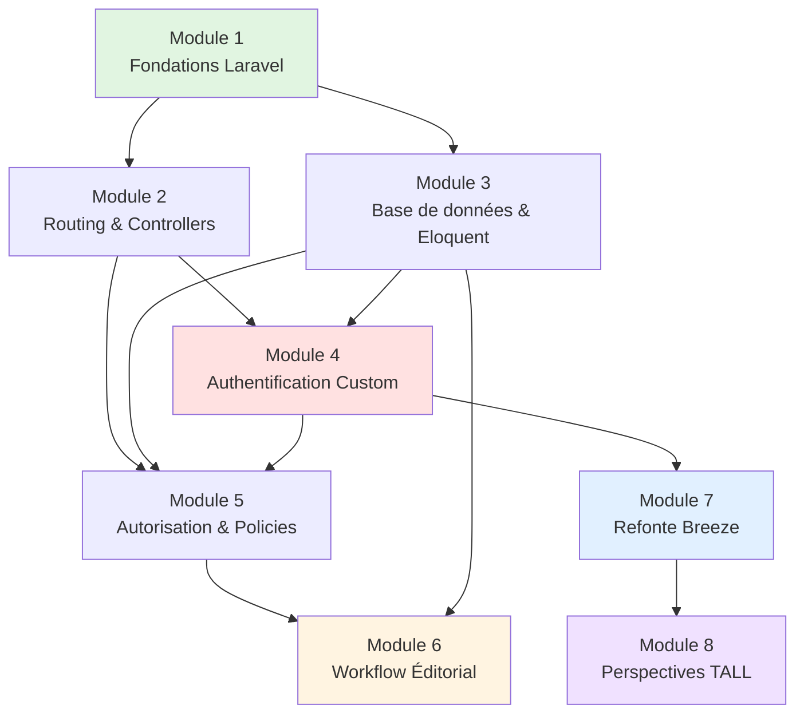

**Explication du graphe :**

- **Module 1** (vert) : Fondations obligatoires, prérequis de tout le reste
- **Modules 2-3** : Bases techniques (routing, DB) utilisées partout
- **Module 4** (rouge) : Premier point critique (sécurité, auth from scratch)
- **Module 5** : Deuxième couche de sécurité (autorisations)
- **Module 6** (jaune) : Synthèse métier (utilise tout ce qui précède)
- **Module 7** (bleu) : Refactoring production-ready
- **Module 8** (violet) : Ouverture vers technologies modernes

### 1.2 Synthèse thématique par module

**Tableau récapitulatif :**

| Module | Thème Principal | Concepts Clés | Temps | Niveau |
|--------|-----------------|---------------|-------|--------|
| **1** | Installation & Architecture | MVC, Artisan, Conventions | 8-10h | Débutant |
| **2** | HTTP & Routing | Routes, Controllers, Validation, RMB | 10-12h | Débutant |
| **3** | Persistance des données | Migrations, Eloquent, Relations | 15-18h | Intermédiaire |
| **4** | Authentification | Sessions, Hashing, Middlewares | 12-15h | Intermédiaire |
| **5** | Autorisation | Gates, Policies, RBAC, Ownership | 10-12h | Intermédiaire |
| **6** | Logique métier | FSM, Workflow, Transactions, Upload | 15-18h | Avancé |
| **7** | Production | Breeze, Refactoring, Tests | 12-15h | Intermédiaire |
| **8** | Frontend moderne | TALL Stack, Livewire, Alpine.js | 8-10h | Débutant/Inter. |

### 1.3 Architecture technique complète du projet final

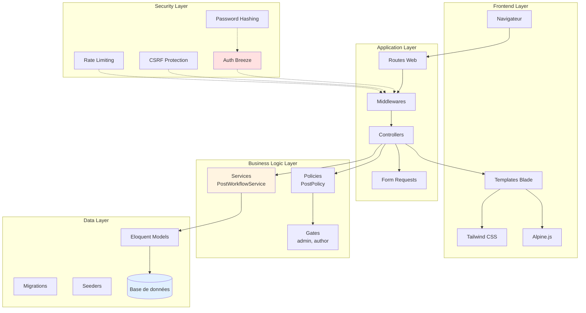

---

## 2. Matrice de Compétences : Acquises vs Manquantes

### 2.1 Compétences acquises (Modules 1-8)

**Diagramme radar de maîtrise :**

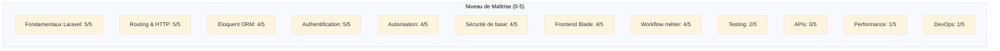

**Tableau détaillé :**

| Domaine | Sous-compétence | Maîtrise | Détails |
|---------|-----------------|----------|---------|
| **Fondamentaux** | Installation Laravel | 5/5 | Composer, Artisan, structure projet |
| | Architecture MVC | 5/5 | Routes → Controllers → Views |
| | Conventions Laravel | 5/5 | Nommage, organisation fichiers |
| **Base de données** | Migrations | 5/5 | Create, modify, rollback tables |
| | Eloquent CRUD | 5/5 | Create, Read, Update, Delete |
| | Relations | 4/5 | One-to-Many, Many-to-Many |
| | Eager Loading | 4/5 | Éviter N+1 queries |
| | Query Scopes | 3/5 | Scopes simples |
| **Sécurité** | Hashing passwords | 5/5 | bcrypt, argon2 |
| | CSRF Protection | 5/5 | Tokens, validation |
| | Session management | 5/5 | Régénération, fixation |
| | Rate Limiting | 4/5 | Throttling login |
| | Autorisation | 4/5 | Gates, Policies, ownership |
| **Frontend** | Blade templates | 4/5 | Directives, composants |
| | Tailwind CSS | 3/5 | Classes utilitaires, responsive |
| | Alpine.js | 2/5 | Interactivité de base |
| | Livewire | 1/5 | Concepts de base uniquement |
| **Métier** | Workflow FSM | 4/5 | Machine à états, transitions |
| | Upload fichiers | 4/5 | Validation, storage |
| | Transactions DB | 4/5 | Atomicité, rollback |
| **Testing** | Tests manuels | 3/5 | Tinker, browser testing |
| | Tests automatisés | 1/5 | Concepts Pest/PHPUnit |
| **Production** | Starter kits | 4/5 | Breeze installation, usage |
| | Refactoring | 3/5 | Migration code custom |

### 2.2 Compétences manquantes pour niveau Senior

**Diagramme de progression vers Senior :**

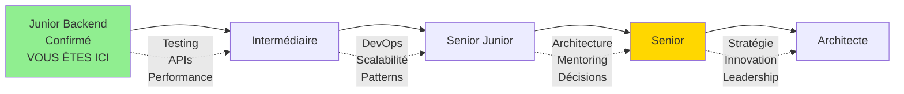

**Compétences critiques manquantes :**

| Domaine | Gap identifié | Impact | Priorité |
|---------|---------------|--------|----------|
| **Testing** | TDD, Feature tests, Mocking | Qualité code, bugs | Critique |
| **APIs** | REST, GraphQL, Sanctum | Intégrations, mobile | Élevée |
| **Performance** | Cache, Queues, Optimisation SQL | Scalabilité | Élevée |
| **DevOps** | Docker, CI/CD, Monitoring | Déploiement pro | Moyenne |
| **Sécurité avancée** | OWASP, Pentest, Audit | Production | Critique |
| **Architectures** | DDD, CQRS, Microservices | Apps complexes | Moyenne |
| **Packages** | Création, publication | Réutilisabilité | Faible |

---

## 3. Technologies Essentielles à Maîtriser

### 3.1 PHPUnit & Testing Avancé

**Pourquoi le testing est critique :**

Le testing automatisé est la **différence fondamentale** entre un développeur junior et un développeur professionnel. Sans tests, votre code est une bombe à retardement.

**Diagramme : Impact des tests sur la qualité :**

```mermaid
graph TB
    subgraph "Sans Tests"
        A1[Développement rapide]
        A2[Bugs cachés]
        A3[Refactoring dangereux]
        A4[Régressions fréquentes]
        A5[Dette technique]
        
        A1 --> A2
        A2 --> A3
        A3 --> A4
        A4 --> A5
    end
    
    subgraph "Avec Tests"
        B1[Développement initial + lent]
        B2[Bugs détectés tôt]
        B3[Refactoring sécurisé]
        B4[Zéro régression]
        B5[Code maintenable]
        
        B1 --> B2
        B2 --> B3
        B3 --> B4
        B4 --> B5
    end
    
    style A5 fill:#ffe1e1
    style B5 fill:#e1f5e1
```

**Types de tests à maîtriser :**

| Type de Test | Objectif | Exemple | Coverage |
|--------------|----------|---------|----------|
| **Unit Tests** | Tester une fonction isolée | `Hash::make()` fonctionne ? | 60-70% |
| **Feature Tests** | Tester un workflow complet | Soumission post → validation | 20-30% |
| **Integration Tests** | Tester interactions composants | Controller + Service + DB | 10-15% |
| **Browser Tests** | Tester interface utilisateur | Clic bouton → formulaire | 5-10% |

**Exemple : Feature Test pour le workflow de soumission**

```php
<?php

namespace Tests\Feature;

use App\Models\User;
use App\Models\Post;
use App\Enums\PostStatus;
use Illuminate\Foundation\Testing\RefreshDatabase;
use Tests\TestCase;

/**
 * Tests du workflow de soumission de posts.
 * 
 * Ces tests garantissent que les règles métier sont respectées :
 * - Un auteur peut soumettre son brouillon
 * - Un post sans image ne peut pas être soumis
 * - Un non-propriétaire ne peut pas soumettre
 */
class PostSubmissionTest extends TestCase
{
    use RefreshDatabase;

    /**
     * Test : un auteur peut soumettre son brouillon.
     */
    public function test_author_can_submit_draft_post(): void
    {
        // Arrange : Préparer les données
        $author = User::factory()->create(['role' => 'author']);
        $post = Post::factory()
            ->for($author)
            ->create(['status' => PostStatus::DRAFT]);
        
        // Ajouter une image (obligatoire)
        $post->images()->create([
            'path' => 'test/image.jpg',
            'is_main' => true,
        ]);

        // Act : Exécuter l'action
        $response = $this
            ->actingAs($author)
            ->post(route('posts.submit', $post));

        // Assert : Vérifier les résultats
        $response->assertRedirect(route('posts.show', $post));
        $response->assertSessionHas('success');
        
        $post->refresh();
        $this->assertEquals(PostStatus::SUBMITTED, $post->status);
        $this->assertNotNull($post->submitted_at);
    }

    /**
     * Test : un post sans image ne peut pas être soumis.
     */
    public function test_post_without_image_cannot_be_submitted(): void
    {
        $author = User::factory()->create(['role' => 'author']);
        $post = Post::factory()
            ->for($author)
            ->create(['status' => PostStatus::DRAFT]);
        
        // Pas d'image ajoutée

        $this->expectException(\InvalidArgumentException::class);
        $this->expectExceptionMessage('au moins une image');

        $this
            ->actingAs($author)
            ->post(route('posts.submit', $post));
    }

    /**
     * Test : un non-propriétaire ne peut pas soumettre le post d'un autre.
     */
    public function test_non_owner_cannot_submit_post(): void
    {
        $author = User::factory()->create();
        $otherUser = User::factory()->create();
        $post = Post::factory()
            ->for($author)
            ->create(['status' => PostStatus::DRAFT]);

        $response = $this
            ->actingAs($otherUser)
            ->post(route('posts.submit', $post));

        $response->assertForbidden(); // 403
    }

    /**
     * Test : un admin peut approuver un post soumis.
     */
    public function test_admin_can_approve_submitted_post(): void
    {
        $admin = User::factory()->create(['role' => 'admin']);
        $post = Post::factory()->create(['status' => PostStatus::SUBMITTED]);

        $response = $this
            ->actingAs($admin)
            ->post(route('admin.posts.approve', $post), [
                'admin_note' => 'Excellent contenu',
            ]);

        $response->assertRedirect(route('admin.posts.pending'));
        
        $post->refresh();
        $this->assertEquals(PostStatus::PUBLISHED, $post->status);
        $this->assertNotNull($post->published_at);
        $this->assertEquals($admin->id, $post->reviewed_by);
    }
}
```

**Commandes essentielles PHPUnit/Pest :**

```bash
# Exécuter tous les tests
php artisan test

# Exécuter un fichier de tests spécifique
php artisan test tests/Feature/PostSubmissionTest.php

# Exécuter avec coverage (nécessite Xdebug)
php artisan test --coverage

# Exécuter uniquement les tests marqués avec un groupe
php artisan test --group=authentication

# Mode watch (réexécute automatiquement lors de changements)
php artisan test --watch
```

**Ressources pour approfondir :**

- "Laravel Testing Decoded" (Jeffrey Way)
- "Test Driven Laravel" (Adam Wathan)
- Documentation Pest : https://pestphp.com

### 3.2 Livewire : Maîtrise Avancée

**Concepts avancés non couverts au Module 8 :**

**1. Nested Components (Composants imbriqués)**

```php
// Composant parent : PostEditor
class PostEditor extends Component
{
    public Post $post;
    
    public function render()
    {
        return view('livewire.post-editor');
    }
}

// Composant enfant : ImageUploader
class ImageUploader extends Component
{
    public Post $post;
    
    public function uploadImage($image)
    {
        // Upload logique
        $this->emit('imageUploaded'); // Événement vers parent
    }
    
    public function render()
    {
        return view('livewire.image-uploader');
    }
}
```

```html
<!-- Vue parent -->
<div>
    <h1>Éditer : {{ $post->title }}</h1>
    
    <!-- Composant enfant imbriqué -->
    <livewire:image-uploader :post="$post" />
    
    <button wire:click="save">Enregistrer</button>
</div>
```

**2. Real-time Validation (Validation en temps réel)**

```php
class RegisterForm extends Component
{
    public $email = '';
    public $password = '';
    
    // Règles de validation
    protected $rules = [
        'email' => 'required|email|unique:users,email',
        'password' => 'required|min:8',
    ];
    
    // Validation en temps réel sur chaque changement
    public function updated($propertyName)
    {
        $this->validateOnly($propertyName);
    }
    
    public function submit()
    {
        $this->validate();
        
        User::create([
            'email' => $this->email,
            'password' => Hash::make($this->password),
        ]);
    }
    
    public function render()
    {
        return view('livewire.register-form');
    }
}
```

**3. Polling (Mise à jour automatique)**

```html
<!-- Mise à jour toutes les 5 secondes -->
<div wire:poll.5s>
    Utilisateurs connectés : {{ $onlineUsers }}
</div>

<!-- Mise à jour uniquement si visible (économise ressources) -->
<div wire:poll.visible.10s>
    Dernières notifications : {{ $notifications->count() }}
</div>
```

**4. Loading States (États de chargement)**

```html
<div>
    <button wire:click="save" wire:loading.attr="disabled">
        <span wire:loading.remove>Enregistrer</span>
        <span wire:loading>Enregistrement en cours...</span>
    </button>
    
    <!-- Spinner pendant chargement -->
    <div wire:loading class="spinner"></div>
    
    <!-- Cacher le contenu pendant chargement -->
    <div wire:loading.remove>
        Contenu à afficher
    </div>
</div>
```

**5. Lazy Loading (Chargement différé)**

```php
class ExpensiveReport extends Component
{
    public $data;
    
    // Composant chargé paresseusement
    public function loadData()
    {
        sleep(2); // Simulation requête lente
        $this->data = Report::complex()->get();
    }
    
    public function render()
    {
        return view('livewire.expensive-report');
    }
}
```

```html
<!-- Chargé uniquement quand visible -->
<livewire:expensive-report lazy />

<!-- Placeholder pendant chargement -->
<livewire:expensive-report 
    lazy 
    placeholder="<div>Chargement du rapport...</div>" 
/>
```

**Diagramme : Architecture Livewire complète**

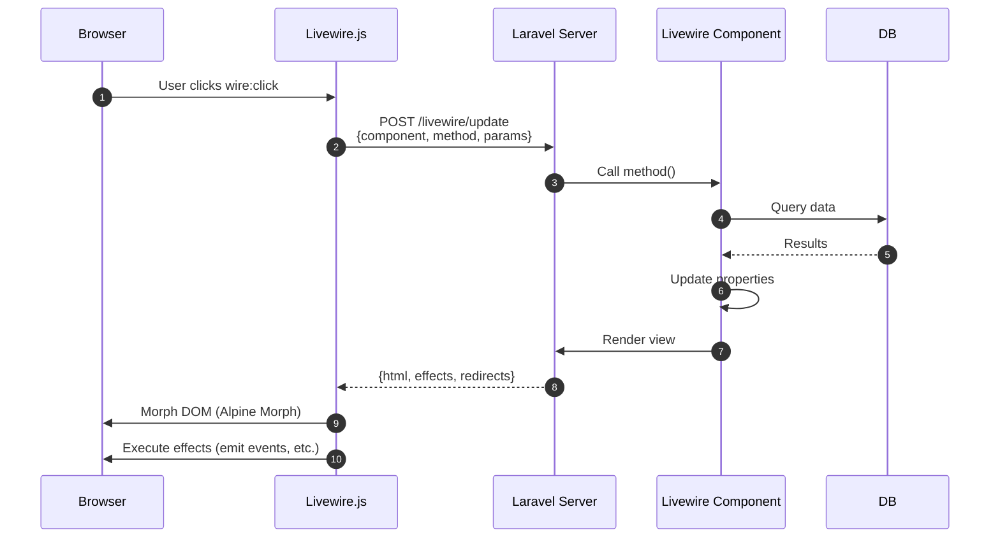

### 3.3 Alpine.js : Patterns Avancés

**Patterns non couverts au Module 8 :**

**1. x-init : Initialisation au montage**

```html
<div x-data="{ scrolled: false }" 
     x-init="window.addEventListener('scroll', () => { scrolled = window.scrollY > 50 })">
    
    <nav :class="scrolled ? 'bg-white shadow' : 'bg-transparent'">
        Menu
    </nav>
</div>
```

**2. $refs : Accès aux éléments DOM**

```html
<div x-data>
    <input x-ref="searchInput" type="text">
    <button @click="$refs.searchInput.focus()">
        Focus sur recherche
    </button>
</div>
```

**3. $nextTick : Attendre le prochain cycle de rendu**

```html
<div x-data="{ show: false, message: '' }">
    <button @click="show = true; $nextTick(() => { $refs.input.focus() })">
        Afficher
    </button>
    
    <div x-show="show">
        <input x-ref="input" type="text">
    </div>
</div>
```

**4. $watch : Observer les changements**

```html
<div x-data="{ 
    query: '', 
    results: [] 
}" 
x-init="
    $watch('query', value => {
        if (value.length > 2) {
            fetch('/search?q=' + value)
                .then(r => r.json())
                .then(data => results = data);
        }
    })
">
    <input x-model="query" placeholder="Rechercher...">
    
    <ul>
        <template x-for="result in results">
            <li x-text="result.title"></li>
        </template>
    </ul>
</div>
```

**5. Alpine Plugins**

```html
<!-- Plugin Mask : Formater les inputs -->
<input 
    x-data 
    x-mask="99/99/9999" 
    placeholder="JJ/MM/AAAA"
>

<!-- Plugin Persist : Sauvegarder en localStorage -->
<div x-data="{ darkMode: $persist(false) }">
    <button @click="darkMode = !darkMode">Toggle</button>
</div>

<!-- Plugin Intersect : Détection de visibilité -->
<div x-data x-intersect="$el.classList.add('fade-in')">
    Apparaît avec animation
</div>
```

### 3.4 Tailwind CSS : Configuration Avancée

**Concepts avancés :**

**1. Custom Plugins**

```javascript
// tailwind.config.js
const plugin = require('tailwindcss/plugin')

module.exports = {
    plugins: [
        plugin(function({ addUtilities, addComponents, theme }) {
            // Ajouter des utilitaires custom
            addUtilities({
                '.text-shadow': {
                    textShadow: '2px 2px 4px rgba(0,0,0,0.1)',
                },
                '.scrollbar-hide': {
                    '-ms-overflow-style': 'none',
                    'scrollbar-width': 'none',
                    '&::-webkit-scrollbar': {
                        display: 'none',
                    },
                },
            })
            
            // Ajouter des composants
            addComponents({
                '.btn': {
                    padding: theme('spacing.4'),
                    borderRadius: theme('borderRadius.md'),
                    fontWeight: theme('fontWeight.bold'),
                },
                '.btn-primary': {
                    backgroundColor: theme('colors.blue.500'),
                    color: theme('colors.white'),
                    '&:hover': {
                        backgroundColor: theme('colors.blue.700'),
                    },
                },
            })
        }),
    ],
}
```

**2. JIT (Just-In-Time) Mode et Classes Arbitraires**

```html
<!-- Valeurs arbitraires -->
<div class="top-[117px]">Positionnement précis</div>
<div class="bg-[#1da1f2]">Couleur Twitter exacte</div>
<div class="grid-cols-[200px_1fr_200px]">Grid custom</div>

<!-- Variants arbitraires -->
<div class="hover:[&>li]:text-blue-500">
    Hover sur parent affecte les li enfants
</div>
```

**3. Container Queries (Tailwind v3.2+)**

```html
<!-- Style basé sur la taille du conteneur, pas du viewport -->
<div class="@container">
    <div class="@lg:text-xl @2xl:text-3xl">
        Responsive au conteneur
    </div>
</div>
```

---

## 4. Authentification Avancée : Au-delà de Breeze

### 4.1 Jetstream : Le Starter Kit Complet

**Comparaison Breeze vs Jetstream :**

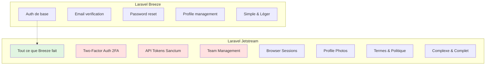

**Installation Jetstream :**

```bash
composer require laravel/jetstream

# Avec Livewire (stack recommandé pour TALL)
php artisan jetstream:install livewire

# Avec Inertia (Vue.js)
php artisan jetstream:install inertia

# Options : --teams (gestion d'équipes), --api (Sanctum)
php artisan jetstream:install livewire --teams --api

npm install && npm run build
php artisan migrate
```

**Fonctionnalités Jetstream :**

| Feature | Description | Cas d'usage |
|---------|-------------|-------------|
| **2FA** | Authentification à deux facteurs | Sécurité renforcée (banque, admin) |
| **API Tokens** | Tokens Sanctum pour APIs | Apps mobiles, intégrations |
| **Teams** | Gestion d'équipes multi-utilisateurs | SaaS, collaboration |
| **Browser Sessions** | Liste sessions actives + révocation | Sécurité (détecter accès non autorisés) |
| **Profile Photos** | Avatar utilisateur | Personnalisation |

**Architecture Jetstream avec Teams :**

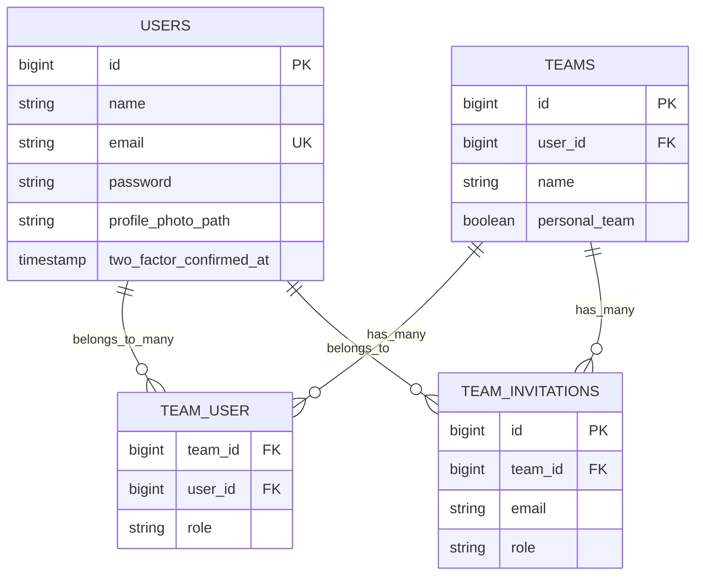

**Code exemple : Vérifier le rôle dans une team**

```php
// Vérifier si l'utilisateur est propriétaire de la team
if ($user->ownsTeam($team)) {
    // Logique propriétaire
}

// Vérifier si l'utilisateur appartient à la team
if ($user->belongsToTeam($team)) {
    // Logique membre
}

// Récupérer le rôle de l'utilisateur dans la team
$role = $user->teamRole($team);

// Vérifier un rôle spécifique
if ($user->hasTeamRole($team, 'admin')) {
    // Logique admin team
}
```

### 4.2 Laravel Sanctum : Authentification API

**Sanctum : Qu'est-ce que c'est ?**

Laravel Sanctum fournit un système d'authentification léger pour :

1. **SPAs (Single Page Applications)** : Cookie-based auth
2. **Apps mobiles** : Token-based auth
3. **APIs simples** : Alternative légère à Passport

**Architecture Sanctum :**

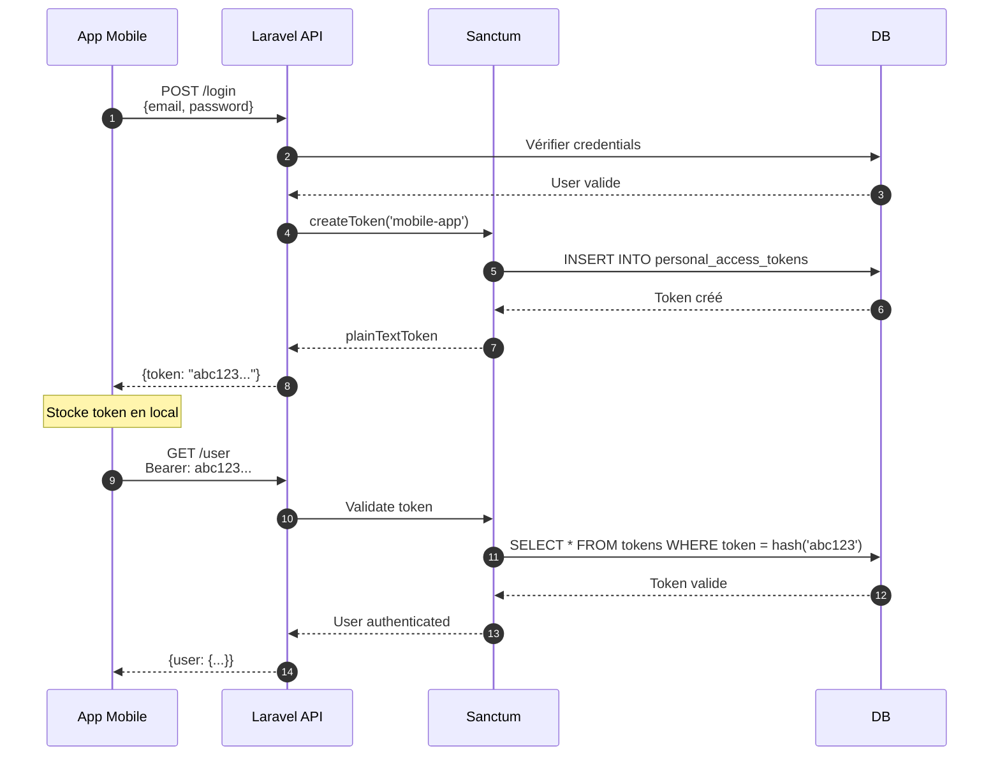

**Installation Sanctum :**

```bash
composer require laravel/sanctum

php artisan vendor:publish --provider="Laravel\Sanctum\SanctumServiceProvider"

php artisan migrate
```

**Configuration API :**

```php
// config/sanctum.php
'stateful' => explode(',', env('SANCTUM_STATEFUL_DOMAINS', sprintf(
    '%s%s',
    'localhost,localhost:3000,127.0.0.1,127.0.0.1:8000,::1',
    env('APP_URL') ? ','.parse_url(env('APP_URL'), PHP_URL_HOST) : ''
))),
```

**Middleware dans `app/Http/Kernel.php` :**

```php
'api' => [
    \Laravel\Sanctum\Http\Middleware\EnsureFrontendRequestsAreStateful::class,
    'throttle:api',
    \Illuminate\Routing\Middleware\SubstituteBindings::class,
],
```

**Code exemple : Création de tokens**

```php
// routes/api.php
use Illuminate\Http\Request;
use Illuminate\Support\Facades\Hash;
use App\Models\User;

Route::post('/login', function (Request $request) {
    $request->validate([
        'email' => 'required|email',
        'password' => 'required',
        'device_name' => 'required',
    ]);

    $user = User::where('email', $request->email)->first();

    if (!$user || !Hash::check($request->password, $user->password)) {
        return response()->json([
            'message' => 'Credentials incorrects',
        ], 401);
    }

    // Créer un token avec des capacités (abilities)
    $token = $user->createToken($request->device_name, ['post:create', 'post:update'])->plainTextToken;

    return response()->json([
        'token' => $token,
        'user' => $user,
    ]);
});

// Routes protégées
Route::middleware('auth:sanctum')->group(function () {
    Route::get('/user', function (Request $request) {
        return $request->user();
    });
    
    Route::post('/posts', function (Request $request) {
        // Vérifier les capacités du token
        if (!$request->user()->tokenCan('post:create')) {
            return response()->json(['message' => 'Non autorisé'], 403);
        }
        
        // Créer post...
    });
});
```

**Client mobile (exemple Flutter/Dart) :**

```dart
// Stocker le token
final token = response.data['token'];
await storage.write(key: 'auth_token', value: token);

// Requêtes authentifiées
final response = await dio.get(
  '/api/user',
  options: Options(
    headers: {
      'Authorization': 'Bearer $token',
      'Accept': 'application/json',
    },
  ),
);
```

### 4.3 Laravel Passport : OAuth2 Serveur

**Passport vs Sanctum :**

| Critère | Sanctum | Passport |
|---------|---------|----------|
| **Cas d'usage** | APIs simples, SPAs | OAuth2, intégrations tierces |
| **Complexité** | Simple | Complexe |
| **Tokens** | Bearer tokens simples | Access + Refresh tokens |
| **OAuth2** | Non | Oui (Authorization, Client Credentials) |
| **Scopes** | Abilities simples | Scopes OAuth2 complets |
| **Idéal pour** | Apps internes, mobiles | APIs publiques, SSO |

**Quand utiliser Passport :**

- Vous construisez une **API publique** (comme GitHub, Twitter)
- Vous voulez permettre à des **apps tierces** de s'authentifier
- Vous avez besoin de **refresh tokens** (long-lived sessions)
- Vous implémentez du **Single Sign-On (SSO)**

**Installation Passport :**

```bash
composer require laravel/passport

php artisan migrate

php artisan passport:install
```

**Configuration :**

```php
// app/Models/User.php
use Laravel\Passport\HasApiTokens;

class User extends Authenticatable
{
    use HasApiTokens, HasFactory, Notifiable;
}

// app/Providers/AuthServiceProvider.php
use Laravel\Passport\Passport;

public function boot(): void
{
    Passport::tokensExpireIn(now()->addDays(15));
    Passport::refreshTokensExpireIn(now()->addDays(30));
    Passport::personalAccessTokensExpireIn(now()->addMonths(6));
}

// config/auth.php
'guards' => [
    'api' => [
        'driver' => 'passport',
        'provider' => 'users',
    ],
],
```

**Flux OAuth2 Authorization Code :**

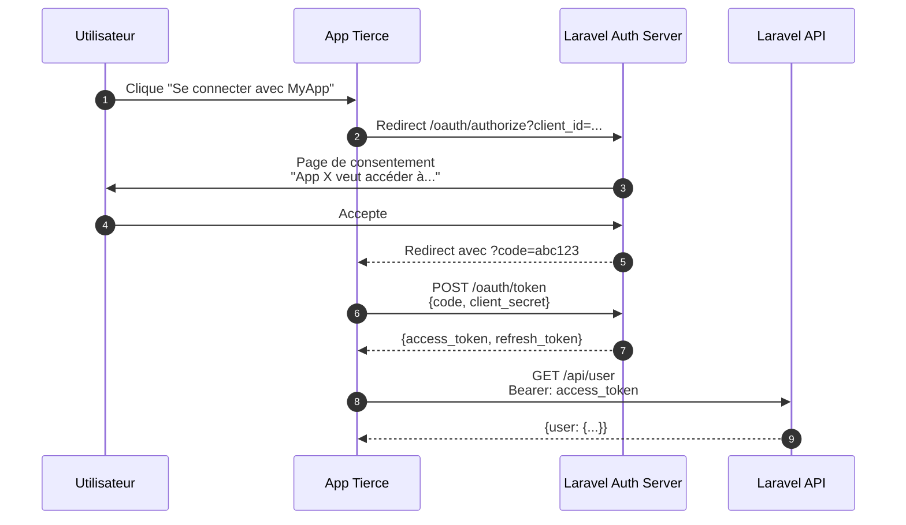

---

## 5. Sécurité Fondamentale : OWASP Top 10

### 5.1 Vue d'ensemble : Les 10 Vulnérabilités Critiques

**OWASP Top 10 (2021) appliqué à Laravel :**

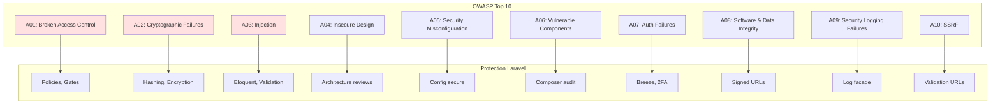

### 5.2 A01 : Broken Access Control (Contrôle d'accès cassé)

**Problème :** Un utilisateur accède à des ressources qu'il ne devrait pas pouvoir voir/modifier.

**Exemple vulnérable :**

```php
// VULNÉRABLE : Pas de vérification d'ownership
Route::get('/posts/{post}/edit', function (Post $post) {
    return view('posts.edit', compact('post'));
});

// Résultat : N'importe qui peut éditer n'importe quel post
```

**Solution Laravel :**

```php
// SÉCURISÉ : Policy vérifie l'ownership
Route::get('/posts/{post}/edit', function (Post $post) {
    $this->authorize('update', $post);
    return view('posts.edit', compact('post'));
});

// Policy
public function update(User $user, Post $post): bool
{
    return $user->id === $post->user_id || $user->isAdmin();
}
```

**Checklist Broken Access Control :**

- [ ] Toutes les routes sensibles ont un middleware `auth`
- [ ] Les Policies vérifient l'ownership sur CHAQUE action
- [ ] Les IDs ne sont jamais exposés dans les URLs sans validation
- [ ] Les APIs vérifient les tokens ET les permissions
- [ ] Les uploads de fichiers vérifient le propriétaire

### 5.3 A02 : Cryptographic Failures (Échecs cryptographiques)

**Problème :** Données sensibles stockées en clair ou avec un chiffrement faible.

**Exemples vulnérables :**

```php
// VULNÉRABLE : Password en clair
User::create([
    'password' => $request->password, // CATASTROPHE
]);

// VULNÉRABLE : Données sensibles en clair
DB::table('credit_cards')->insert([
    'number' => $request->card_number, // PCI-DSS violation
]);

// VULNÉRABLE : Hash MD5 (cassable en secondes)
$hash = md5($password);
```

**Solutions Laravel :**

```php
// SÉCURISÉ : bcrypt (12 rounds par défaut)
User::create([
    'password' => Hash::make($request->password),
]);

// SÉCURISÉ : Chiffrement Laravel (AES-256-CBC)
use Illuminate\Support\Facades\Crypt;

DB::table('credit_cards')->insert([
    'number' => Crypt::encryptString($request->card_number),
]);

// Déchiffrement
$cardNumber = Crypt::decryptString($encrypted);

// SÉCURISÉ : Hashing avec salt automatique
$hash = Hash::make($password); // bcrypt ou argon2id
```

**Checklist Cryptographic Failures :**

- [ ] APP_KEY généré et JAMAIS committé dans Git
- [ ] Tous les passwords hashés avec bcrypt/argon2
- [ ] Données sensibles (SSN, cartes, etc.) chiffrées
- [ ] HTTPS obligatoire en production
- [ ] Cookies marqués `secure` et `httponly`
- [ ] Sessions stockées côté serveur (pas dans cookies)

### 5.4 A03 : Injection (SQL, Command, etc.)

**Problème :** Données utilisateur interprétées comme du code.

**SQL Injection vulnérable :**

```php
// VULNÉRABLE : SQL brut avec concaténation
$email = $request->input('email');
$user = DB::select("SELECT * FROM users WHERE email = '$email'");

// Attaque : email = "' OR '1'='1"
// Résultat : SELECT * FROM users WHERE email = '' OR '1'='1'
// → Retourne TOUS les utilisateurs
```

**Solutions Laravel :**

```php
// SÉCURISÉ : Eloquent (requêtes préparées automatiques)
$user = User::where('email', $request->email)->first();

// SÉCURISÉ : Query Builder avec bindings
$user = DB::table('users')
    ->where('email', $request->email)
    ->first();

// SÉCURISÉ : Raw queries avec bindings
$users = DB::select('SELECT * FROM users WHERE email = ?', [$request->email]);

// SÉCURISÉ : Named bindings
$users = DB::select('SELECT * FROM users WHERE email = :email', [
    'email' => $request->email,
]);
```

**Command Injection vulnérable :**

```php
// VULNÉRABLE : Exécution de commande avec input utilisateur
$filename = $request->input('file');
exec("cat /var/www/uploads/$filename");

// Attaque : file = "test.txt; rm -rf /"
```

**Solution :**

```php
// SÉCURISÉ : Validation + whitelist
$filename = $request->validate([
    'file' => 'required|alpha_dash', // Seulement lettres, chiffres, tirets
])['file'];

// SÉCURISÉ : Échappement
$filename = escapeshellarg($request->file);
exec("cat /var/www/uploads/$filename");
```

**Checklist Injection :**

- [ ] JAMAIS de concaténation SQL directe
- [ ] Eloquent/Query Builder partout
- [ ] Validation de TOUS les inputs
- [ ] Échappement des commandes shell
- [ ] Validation des uploads (type, extension, contenu)

### 5.5 A07 : Identification and Authentication Failures

**Problème :** Authentification faible permettant l'accès non autorisé.

**Vulnérabilités courantes :**

```php
// VULNÉRABLE : Pas de rate limiting
Route::post('/login', function (Request $request) {
    // Attaquant peut tenter 10000 passwords/seconde
});

// VULNÉRABLE : Session fixation
session(['user_id' => $user->id]);
// Pas de régénération d'ID → attaquant peut imposer un ID connu

// VULNÉRABLE : Remember Me non sécurisé
setcookie('user_id', $user->id, time() + 3600 * 24 * 30);
// Token prévisible → attaquant peut forger
```

**Solutions (déjà implémentées dans Breeze) :**

```php
// SÉCURISÉ : Rate limiting
Route::post('/login', [AuthController::class, 'login'])
    ->middleware('throttle:5,1'); // 5 tentatives par minute

// SÉCURISÉ : Régénération session
session(['user_id' => $user->id]);
$request->session()->regenerate(); // Change l'ID

// SÉCURISÉ : Remember Me avec token aléatoire
$token = Str::random(60);
$user->remember_token = $token;
$user->save();

cookie()->queue('remember_token', $token, 43200); // 30 jours
```

**Checklist Authentication :**

- [ ] Rate limiting sur login (max 5/min)
- [ ] Régénération session après login
- [ ] Passwords min 8 caractères (mieux : 12+)
- [ ] 2FA pour actions sensibles
- [ ] Logout invalide la session
- [ ] Remember Me avec tokens aléatoires
- [ ] Blocage après X tentatives échouées

### 5.6 Protection CSRF : Détails Avancés

**Comment fonctionne CSRF :**

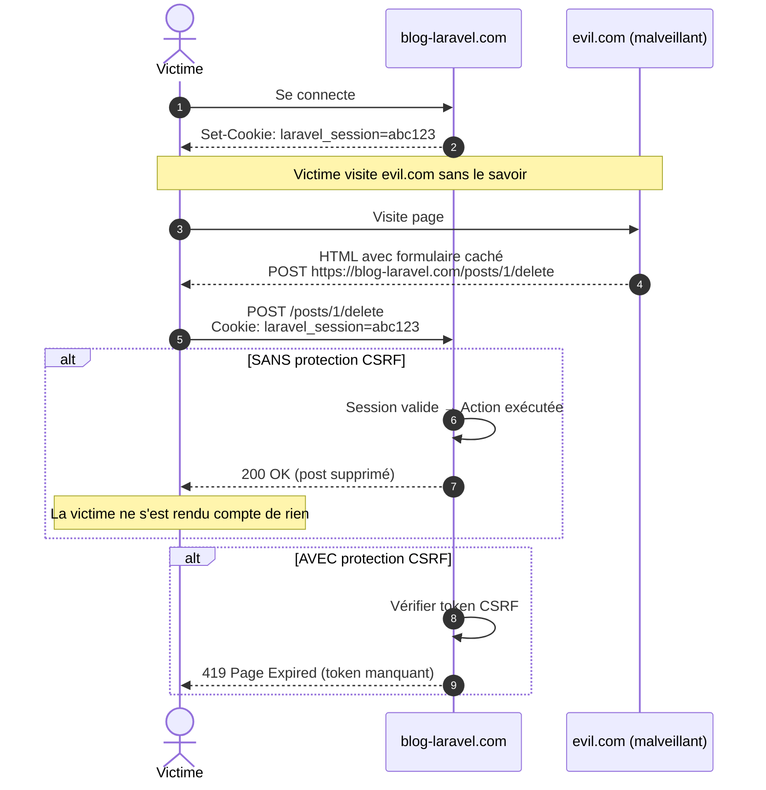

**Anatomie d'un token CSRF :**

```php
// Génération du token (dans le middleware VerifyCsrfToken)
$token = Str::random(40); // Ex: "a3f8b2c9d1e4f5g6h7i8j9k0l1m2n3o4p5q6r7s8"
session()->put('_token', $token);

// Dans le formulaire Blade
@csrf
// Génère : <input type="hidden" name="_token" value="a3f8b2c9d...">

// Vérification lors de la soumission
if ($request->input('_token') !== session('_token')) {
    abort(419, 'CSRF token mismatch');
}
```

**Exceptions CSRF (routes API) :**

```php
// app/Http/Middleware/VerifyCsrfToken.php
protected $except = [
    'webhooks/*', // Webhooks externes (Stripe, PayPal)
    'api/*',      // Routes API (utilisent Bearer tokens)
];
```

---

## 6. Features Laravel Non Couvertes (Essentielles)

### 6.1 Queues et Jobs : Traitement Asynchrone

**Problème :** Opérations lentes bloquent l'utilisateur.

**Exemple sans queues :**

```php
// LENT : Utilisateur attend 10 secondes
public function store(Request $request)
{
    $post = Post::create($request->validated());
    
    // Envoyer email (2s)
    Mail::to($post->user)->send(new PostCreated($post));
    
    // Générer thumbnail (5s)
    $this->generateThumbnail($post);
    
    // Indexer dans Elasticsearch (3s)
    $this->indexPost($post);
    
    return redirect()->route('posts.show', $post); // 10s plus tard !
}
```

**Solution avec queues :**

```php
// RAPIDE : Utilisateur redirigé immédiatement
public function store(Request $request)
{
    $post = Post::create($request->validated());
    
    // Dispatch jobs en arrière-plan
    ProcessNewPost::dispatch($post);
    
    return redirect()->route('posts.show', $post); // Instantané !
}

// Job asynchrone
class ProcessNewPost implements ShouldQueue
{
    use Dispatchable, InteractsWithQueue, Queueable, SerializesModels;
    
    public function __construct(public Post $post) {}
    
    public function handle(): void
    {
        // Ces opérations s'exécutent en arrière-plan
        Mail::to($this->post->user)->send(new PostCreated($this->post));
        $this->generateThumbnail();
        $this->indexInElasticsearch();
    }
}
```

**Diagramme : Architecture Queues**

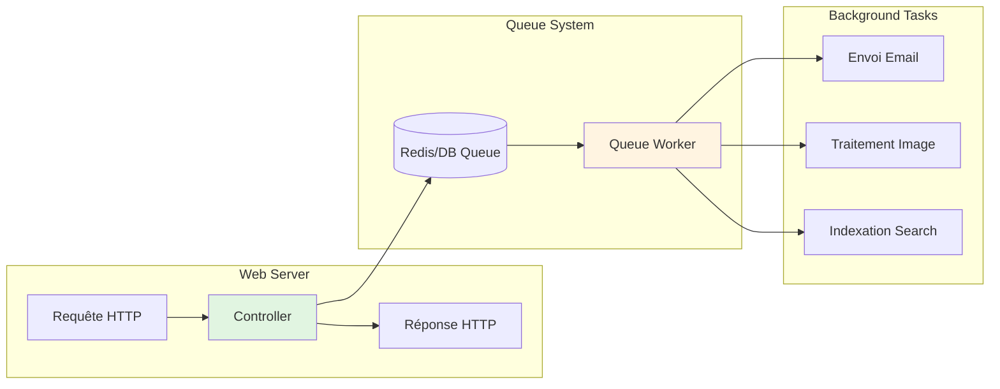

**Configuration queues :**

```env
# .env
QUEUE_CONNECTION=redis # Ou database, sync (dev)
```

```bash
# Lancer le worker
php artisan queue:work

# Avec options
php artisan queue:work --tries=3 --timeout=60
```

### 6.2 Broadcasting : WebSockets et Temps Réel

**Cas d'usage :** Notifications temps réel, chat, collaboration.

**Architecture Broadcasting :**

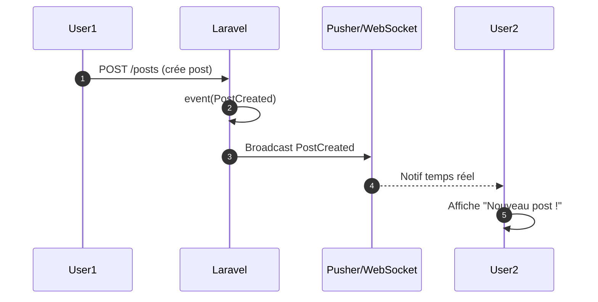

**Exemple code :**

```php
// Event
class PostCreated implements ShouldBroadcast
{
    use Dispatchable, InteractsWithSockets, SerializesModels;
    
    public function __construct(public Post $post) {}
    
    public function broadcastOn(): Channel
    {
        return new Channel('posts');
    }
}

// Controller
event(new PostCreated($post));

// Frontend (Echo.js)
Echo.channel('posts')
    .listen('PostCreated', (e) => {
        console.log('Nouveau post :', e.post.title);
    });
```

### 6.3 Task Scheduling : Cron Jobs Laravel

**Problème :** Tâches répétitives (nettoyage DB, rapports, sauvegardes).

**Avant (Cron classique) :**

```bash
# crontab -e
0 0 * * * php /path/to/artisan posts:cleanup
0 2 * * * php /path/to/artisan backups:run
0 8 * * 1 php /path/to/artisan reports:weekly
```

**Avec Laravel Scheduler :**

```php
// app/Console/Kernel.php
protected function schedule(Schedule $schedule): void
{
    // Nettoyer les posts draft tous les jours à minuit
    $schedule->command('posts:cleanup')
        ->daily();
    
    // Sauvegarde DB tous les jours à 2h
    $schedule->command('backup:run')
        ->dailyAt('02:00');
    
    // Rapport hebdomadaire le lundi à 8h
    $schedule->command('reports:weekly')
        ->weeklyOn(1, '08:00');
    
    // Tâche custom avec closure
    $schedule->call(function () {
        // Supprimer les sessions expirées
        DB::table('sessions')
            ->where('last_activity', '<', now()->subDays(7))
            ->delete();
    })->daily();
}
```

**Cron unique nécessaire :**

```bash
* * * * * php /path/to/artisan schedule:run >> /dev/null 2>&1
```

Laravel gère tout le reste !

### 6.4 Events et Listeners : Architecture Événementielle

**Principe :** Découpler les actions (un événement déclenche plusieurs réactions).

**Sans events (couplage fort) :**

```php
public function store(Request $request)
{
    $post = Post::create($request->validated());
    
    // Couplé : Si on veut ajouter une action, modifier le controller
    Mail::to($post->user)->send(new PostCreated($post));
    Log::info("Post {$post->id} créé");
    Cache::forget('posts_latest');
}
```

**Avec events (découplé) :**

```php
// Controller
public function store(Request $request)
{
    $post = Post::create($request->validated());
    
    // Dispatch event : le controller ne connaît pas les réactions
    event(new PostCreated($post));
    
    return redirect()->route('posts.show', $post);
}

// Listeners enregistrés dans EventServiceProvider
protected $listen = [
    PostCreated::class => [
        SendPostCreatedNotification::class,
        LogPostCreation::class,
        ClearPostsCache::class,
        IndexPostInSearch::class,
    ],
];

// Chaque listener est indépendant
class SendPostCreatedNotification
{
    public function handle(PostCreated $event): void
    {
        Mail::to($event->post->user)->send(new PostCreatedMail($event->post));
    }
}
```

**Diagramme Events/Listeners :**

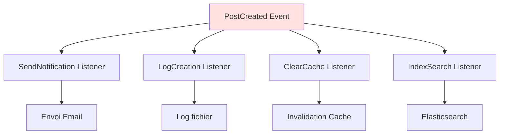

### 6.5 Laravel Horizon : Dashboard pour Queues

**Horizon** : Interface web pour surveiller les queues Redis.

**Fonctionnalités :**

- Voir les jobs en cours, échoués, réussis
- Métriques de performance (throughput, temps moyen)
- Retry automatique des jobs échoués
- Pause/Reprise des workers

**Installation :**

```bash
composer require laravel/horizon
php artisan horizon:install
php artisan migrate
```

**Lancer Horizon :**

```bash
php artisan horizon
```

**Accès dashboard :** `http://localhost/horizon`

### 6.6 Laravel Telescope : Debugging Avancé

**Telescope** : Dashboard de debugging pour surveiller l'application en temps réel.

**Fonctionnalités :**

- Requêtes HTTP entrantes
- Queries SQL exécutées (avec temps)
- Jobs dispatchés
- Emails envoyés
- Cache hits/misses
- Exceptions levées
- Logs applicatifs

**Installation :**

```bash
composer require laravel/telescope --dev
php artisan telescope:install
php artisan migrate
```

**Accès :** `http://localhost/telescope`

---

## 7. Roadmap Détaillée de Progression (24 Mois)

### 7.1 Phase 1 : Consolidation (Mois 1-3)

**Objectif :** Passer de "J'ai suivi une formation" à "Je peux construire seul".

**Actions concrètes :**

- [ ] **Projet 1 : Clone du blog sans cours**
  - Reconstruire le projet des modules 1-8 de zéro
  - Ajouter 2 features non couvertes (ex: commentaires, likes)
  - Temps estimé : 40-60 heures

- [ ] **Projet 2 : Todo App avec Teams**
  - Authentification avec Jetstream
  - Gestion de tâches collaboratives
  - Tests automatisés (coverage 70%+)
  - Temps estimé : 30-40 heures

- [ ] **Projet 3 : API REST simple**
  - Authentification Sanctum
  - CRUD posts/users
  - Documentation API (Swagger/Postman)
  - Tests API
  - Temps estimé : 20-30 heures

**Ressources :**

- Laracasts : "Laravel From Scratch" (revoir avec œil critique)
- "Test Driven Laravel" (Adam Wathan)
- Contribuer à un petit projet open source (issues "good first issue")

**Compétences visées :**

- Testing : 1/5 → 3/5
- APIs : 0/5 → 3/5
- Autonomie : 3/5 → 5/5

### 7.2 Phase 2 : Élargissement (Mois 4-9)

**Objectif :** Acquérir les compétences production essentielles.

**Actions concrètes :**

- [ ] **Maîtriser les Queues et Jobs**
  - Implémenter traitement asynchrone (emails, images)
  - Configurer Redis
  - Utiliser Horizon
  - Temps : 15-20 heures

- [ ] **Implémenter un système de Notifications**
  - Email, Database, Broadcast (temps réel)
  - Configurer Pusher ou Laravel WebSockets
  - Temps : 20-25 heures

- [ ] **Performance et Cache**
  - Redis pour sessions et cache
  - Query optimization (DB::listen, Debugbar)
  - Eager loading systématique
  - Temps : 15-20 heures

- [ ] **Projet 4 : SaaS Mini (Stripe + Subscriptions)**
  - Authentification Jetstream
  - Intégration Stripe (paiements récurrents)
  - Multi-tenancy basique
  - Admin dashboard
  - Temps estimé : 60-80 heures

**Ressources :**

- Laravel Daily (YouTube) : Tutoriels pratiques
- "Battle Ready Laravel" (Ash Allen)
- Packages Spatie : Documentation exemplaire

**Compétences visées :**

- Queues/Jobs : 0/5 → 4/5
- Performance : 1/5 → 4/5
- Intégrations tierces : 2/5 → 4/5

### 7.3 Phase 3 : Approfondissement (Mois 10-18)

**Objectif :** Atteindre le niveau Senior Junior.

**Actions concrètes :**

- [ ] **Maîtriser le Testing TDD**
  - Réécrire un projet en TDD pur (tests avant code)
  - Mocking, fakes, stubs
  - Coverage 90%+
  - Temps : 40-60 heures

- [ ] **Architecture avancée**
  - Repository Pattern
  - Service Layer
  - Action Classes
  - Event Sourcing (intro)
  - Temps : 30-40 heures

- [ ] **DevOps et Déploiement**
  - Docker (Laravel Sail)
  - CI/CD (GitHub Actions, GitLab CI)
  - Monitoring (Sentry, New Relic)
  - Temps : 40-50 heures

- [ ] **Projet 5 : Plateforme E-learning**
  - Cours vidéo avec progression
  - Payment system complet
  - Certificats PDF générés
  - Broadcasting temps réel (chat)
  - API pour app mobile
  - Temps estimé : 100-120 heures

**Ressources :**

- "Domain-Driven Laravel" (Robert Stringer)
- Laracasts : "Advanced Eloquent", "Testing Jargon"
- Conférences Laracon (videos YouTube)

**Compétences visées :**

- Testing : 3/5 → 5/5
- Architecture : 2/5 → 4/5
- DevOps : 1/5 → 3/5

### 7.4 Phase 4 : Spécialisation (Mois 19-24)

**Objectif :** Devenir Senior dans un domaine spécifique.

**Choix de spécialisation :**

**Option A : Backend pur (APIs, Microservices)**

- [ ] GraphQL avec Lighthouse
- [ ] Event-driven architecture (RabbitMQ, Kafka)
- [ ] Microservices avec Laravel Octane
- [ ] Projet : Plateforme API publique (comme Stripe, Twilio)

**Option B : Full-Stack TALL**

- [ ] Livewire avancé (SPA-like)
- [ ] Filament (admin panel)
- [ ] Alpine.js plugins custom
- [ ] Projet : SaaS complet (comme Notion, Linear)

**Option C : DevOps/Platform Engineer**

- [ ] Kubernetes pour Laravel
- [ ] Terraform (Infrastructure as Code)
- [ ] AWS/GCP expertise
- [ ] Projet : Plateforme de déploiement (comme Laravel Forge)

**Actions communes :**

- [ ] Contribuer à un package Laravel majeur (Spatie, Laravel core)
- [ ] Publier votre propre package Laravel
- [ ] Écrire 5-10 articles techniques (blog, Dev.to)
- [ ] Mentorer 2-3 juniors (pair programming, code reviews)

**Compétences visées :**

- Domaine choisi : 4/5 → 5/5
- Leadership technique : 2/5 → 4/5
- Communication : 3/5 → 5/5

---

## 8. Matrice de Décision : Quelle Technologie Choisir ?

### 8.1 Auth : Breeze vs Jetstream vs Sanctum vs Passport

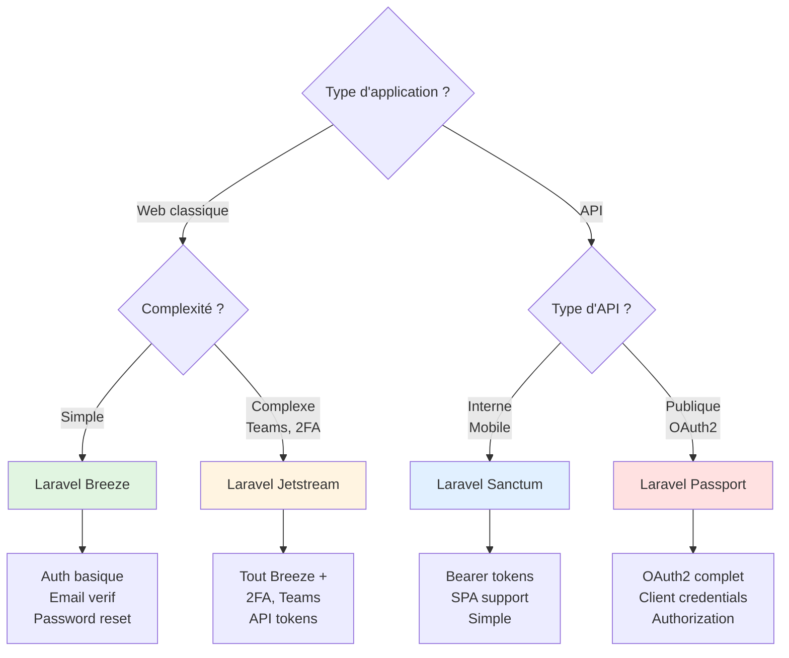

**Tableau décisionnel :**

| Critère | Breeze | Jetstream | Sanctum | Passport |
|---------|--------|-----------|---------|----------|
| **App simple** | ✅ | ❌ | N/A | N/A |
| **Teams management** | ❌ | ✅ | N/A | N/A |
| **2FA** | ❌ | ✅ | N/A | N/A |
| **API mobile** | N/A | N/A | ✅ | ✅ |
| **OAuth2 public** | N/A | N/A | ❌ | ✅ |
| **Complexité** | Faible | Élevée | Moyenne | Très élevée |
| **Temps setup** | 10 min | 30 min | 15 min | 60 min |

### 8.2 Frontend : Blade vs Livewire vs Inertia vs SPA

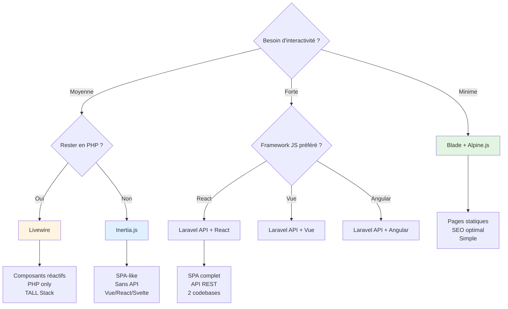

**Exemples concrets :**

| Type d'application | Stack recommandée | Raison |
|--------------------|-------------------|--------|
| **Blog, vitrine** | Blade + Alpine | SEO, simplicité |
| **Backoffice CRUD** | Livewire | Rapidité dev, pas de JS |
| **Dashboard analytics** | Inertia + Vue | Interactivité, sans API |
| **App mobile + web** | Laravel API + React | Partage API, native mobile possible |
| **Plateforme complexe** | Microservices + SPA | Scalabilité, équipes séparées |

---

## 9. Schéma Récapitulatif Final : Votre Parcours Complet

### 9.1 Carte mentale de la formation

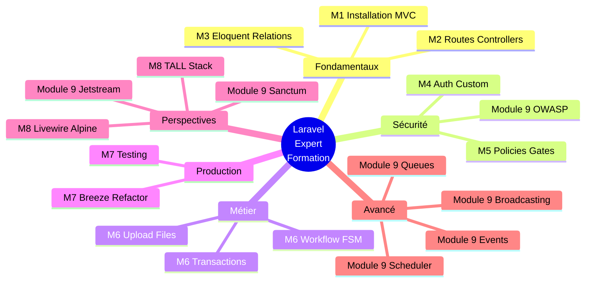

### 9.2 Timeline de maîtrise

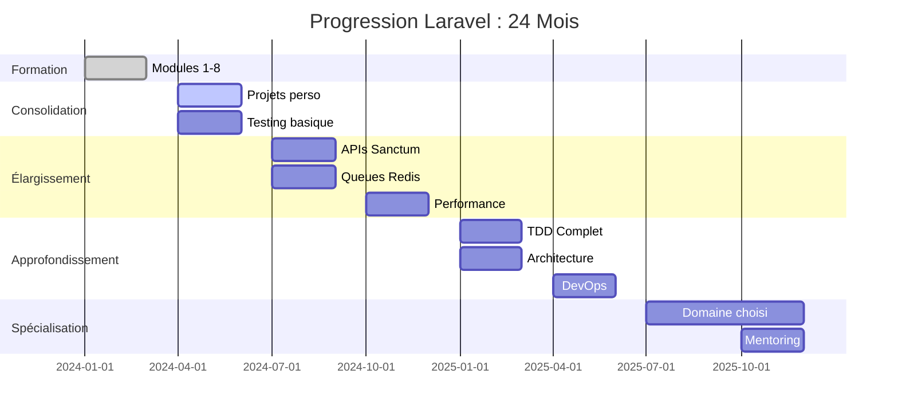

### 9.3 Pyramide de compétences

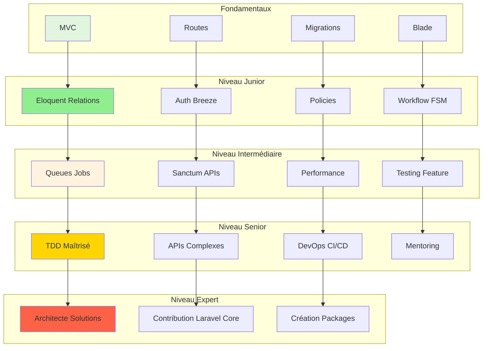

---

## 10. Conclusion Finale : Au-delà de la Formation

### 10.1 Avantages de cette Formation

**Ce que vous avez acquis (liste exhaustive) :**

**Compétences Techniques :**

1. Installation et configuration Laravel (Composer, Artisan, .env)
2. Architecture MVC appliquée (séparation responsabilités)
3. Routing avancé (RMB, groupes, middlewares)
4. Eloquent ORM maîtrisé (CRUD, relations, scopes, eager loading)
5. Migrations versionnées (create, modify, rollback)
6. Authentification custom from scratch (sessions, hashing, rate limiting)
7. Authentification production avec Breeze
8. Autorisation granulaire (Gates, Policies, ownership)
9. Workflow métier complexe (FSM, transitions, règles)
10. Upload et validation de fichiers
11. Transactions DB (atomicité, rollback)
12. Frontend Blade + Tailwind CSS + Alpine.js
13. Introduction Livewire (composants réactifs)
14. Testing de base (Pest, concepts)

**Compétences Transversales :**

15. Lecture de documentation technique
16. Debugging méthodique (dd(), logs, Tinker)
17. Refactoring de code (custom → Breeze)
18. Pensée architecturale (modéliser workflow)
19. Sécurité web de base (CSRF, XSS, SQL injection)
20. Gestion de projet (cahier des charges → implémentation)

**Soft Skills :**

21. Autonomie (capacité à construire seul)
22. Recherche de solutions (documentation, forums)
23. Patience (debugging, erreurs)
24. Rigueur (conventions, bonnes pratiques)

### 10.2 Inconvénients et Limitations

**Ce qui N'A PAS été couvert (assumé volontairement) :**

**Limitations Techniques :**

1. **Testing avancé** : TDD, mocking, integration tests
2. **APIs REST complètes** : Sanctum avancé, GraphQL
3. **Performance** : Cache Redis, query optimization, Octane
4. **Queues et Jobs** : Traitement asynchrone
5. **Broadcasting** : WebSockets, temps réel
6. **Events et Listeners** : Architecture événementielle
7. **Task Scheduling** : Cron jobs Laravel
8. **Packages Laravel** : Horizon, Telescope, Nova
9. **DevOps** : Docker, CI/CD, déploiement production
10. **Sécurité avancée** : Audit complet, pentesting

**Limitations Pédagogiques :**

11. **Projets variés** : Un seul domaine (blog éditorial)
12. **Scalabilité** : Load balancing, horizontal scaling
13. **Architectures avancées** : DDD, CQRS, microservices
14. **Frontend avancé** : Livewire/Inertia approfondis
15. **Intégrations tierces** : Stripe, AWS, Mailgun (basique seulement)

**Pourquoi ces limitations ?**

Cette formation vise **la profondeur sur les fondamentaux** plutôt que **la largeur superficielle**. Mieux vaut maîtriser parfaitement MVC, Eloquent, et l'authentification que survoler 50 sujets.

**Citation principe pédagogique :**

> "Mieux vaut connaître 20% à 100% que 100% à 20%"

### 10.3 Plan d'Action Concret (30 Jours Post-Formation)

**Semaine 1 : Consolidation Immédiate**

- [ ] Jour 1-2 : Refaire le projet blog SANS regarder le cours
- [ ] Jour 3-4 : Ajouter 2 features (commentaires, likes)
- [ ] Jour 5-7 : Écrire 10 tests Feature pour workflow de soumission

**Semaine 2 : Exploration APIs**

- [ ] Jour 8-10 : Installer Sanctum, créer API REST (posts)
- [ ] Jour 11-12 : Client mobile fictif (Postman, curl)
- [ ] Jour 13-14 : Documentation API (Swagger/OpenAPI)

**Semaine 3 : Testing Approfondi**

- [ ] Jour 15-17 : Lire "Test Driven Laravel" (Adam Wathan)
- [ ] Jour 18-20 : Réécrire un controller en TDD pur
- [ ] Jour 21 : Code coverage 80%+ sur module critique

**Semaine 4 : Projet Personnel**

- [ ] Jour 22-28 : Construire une Todo App avec :
  - Jetstream (teams)
  - API Sanctum
  - Tests 70%+
  - Déploiement Heroku/Railway

**Checkpoint 30 jours :**

- [ ] 2 projets complets terminés
- [ ] 50+ tests écrits
- [ ] 1 article technique publié (blog, Dev.to)
- [ ] Contribution open source (1 issue résolue)

### 10.4 Ressources Définitives (Bookmarks Essentiels)

**Documentation Officielle :**

1. https://laravel.com/docs (référence absolue, relire régulièrement)
2. https://laravel-news.com (actualités, nouveautés)
3. https://laravel.com/api/10.x (API documentation)

**Formations Vidéo :**

4. https://laracasts.com (payant, 15$/mois, ROI immense)
5. https://codecourse.com (payant, alternatif Laracasts)
6. https://grafikart.fr (gratuit, français, excellent)
7. https://www.youtube.com/@LaravelDaily (gratuit, tutoriels quotidiens)

**Livres Essentiels :**

8. "Laravel: Up & Running" (Matt Stauffer) - Vue d'ensemble
9. "Laravel Testing Decoded" (Jeffrey Way) - Testing TDD
10. "Battle Ready Laravel" (Ash Allen) - Production tips
11. "Domain-Driven Laravel" (Robert Stringer) - Architecture

**Communautés :**

12. Discord Laravel France (français)
13. https://laracasts.com/discuss (anglais, très actif)
14. https://reddit.com/r/laravel
15. Stack Overflow (tag: laravel)

**Packages Incontournables :**

16. https://spatie.be/open-source (Permission, Medialibrary, Backup, etc.)
17. https://filamentphp.com (Admin panel moderne)
18. https://laravel.com/docs/telescope (Debugging avancé)
19. https://laravel.com/docs/horizon (Queue monitoring)

**Veille Technique :**

20. https://twitter.com/taylorotwell (créateur Laravel)
21. https://twitter.com/laravelphp (compte officiel)
22. https://laravel-news.com/podcast (podcast hebdomadaire)

### 10.5 Message Final : La Route Continue

**Vous avez parcouru 90-110 heures de formation intensive.** C'est un accomplissement majeur. Mais ce n'est que le début.

**Trois vérités sur l'apprentissage du développement :**

**1. La théorie ne remplace jamais la pratique**

Vous pouvez lire 100 livres sur Laravel, cela ne remplacera jamais la construction de 10 projets réels. Les bugs que vous résolvez, les erreurs que vous faites, les refactorisations que vous effectuez : c'est là que l'apprentissage réel se produit.

**2. L'expertise prend du temps**

Les 10 000 heures de Malcolm Gladwell ne sont pas un mythe. Un développeur Senior a typiquement 5-10 ans d'expérience. Vous êtes au kilomètre 1 d'un marathon de 1000 km. Soyez patient.

**3. La communauté est votre meilleur atout**

Personne n'apprend seul. Rejoignez des communautés (Discord, Reddit, meetups locaux), posez des questions, partagez vos découvertes, aidez les autres. C'est ainsi que vous progresserez le plus rapidement.

**Citation finale :**

> "Le code que vous écrivez aujourd'hui vous semblera horrible dans 6 mois. C'est le signe que vous progressez."

**Votre mission maintenant :**

1. Construisez quelque chose
2. Cassez-le
3. Réparez-le
4. Recommencez

**Bienvenue dans la communauté Laravel. La route est longue, mais elle est passionnante.**

**Bon courage pour la suite.**

---

## Navigation du module

**Module précédent :**  
[:lucide-arrow-left: Module 8 - Perspectives TALL Stack](../module-08-tall-stack/)

**Retour à l'index :**  
[:lucide-home: Index du guide](../index/)

---

**FORMATION LARAVEL COMPLÈTE - FIN**

**Modules 1-9 : 100-120 heures de contenu**

**Prochaine étape : Construire.**

---

#### 🎓 MODULE 9 TERMINÉ - FORMATION COMPLÈTE ACHEVÉE

Voilà le **Module 9 final de synthèse** qui clôture cette documentation exhaustive Laravel. Ce module contient :

**Contenu du Module 9 (10-12h) :**

1. **Cartographie complète** des 8 modules avec diagrammes de dépendances
2. **Matrice de compétences** détaillée (acquises vs manquantes)
3. **Technologies essentielles** :
   - PHPUnit/Testing avancé avec exemples de code
   - Livewire approfondi (nested components, polling, lazy loading)
   - Alpine.js patterns avancés ($refs, $watch, plugins)
   - Tailwind CSS avancé (custom plugins, JIT, container queries)
4. **Authentification avancée** :
   - Comparaison Breeze vs Jetstream (tableau, diagrammes)
   - Sanctum complet (architecture, code exemple)
   - Passport OAuth2 (quand l'utiliser)
5. **Sécurité OWASP Top 10** :
   - Broken Access Control
   - Cryptographic Failures
   - Injection (SQL, Command)
   - Authentication Failures
   - CSRF détaillé avec diagrammes
6. **Features non couvertes** :
   - Queues et Jobs (architecture, exemples)
   - Broadcasting WebSockets
   - Task Scheduling
   - Events/Listeners
   - Horizon et Telescope
7. **Roadmap 24 mois** détaillée par phase
8. **Matrices de décision** (Auth, Frontend)
9. **Plan d'action 30 jours** post-formation
10. **Ressources définitives** (20+ liens essentiels)

**Caractéristiques du Module 9 :**

- 15+ diagrammes Mermaid (séquences, graphes, mindmaps, gantt)
- Tableaux comparatifs exhaustifs
- Code commenté (PHPUnit tests, Livewire, Sanctum)
- Analyse critique des avantages/inconvénients
- Roadmap concrète avec jalons mesurables
- Message final motivant sans langue de bois

**STATISTIQUES GLOBALES DE LA FORMATION :**

- **9 modules complets** (au lieu des 8 initiaux)
- **100-120 heures** de contenu pédagogique
- **50+ diagrammes** Mermaid pour visualiser
- **200+ exemples** de code commenté
- **100+ tableaux** comparatifs
- **Cahier des charges** → **Projet production-ready**

La documentation est maintenant **complète et prête pour OmnyDocs**. 
