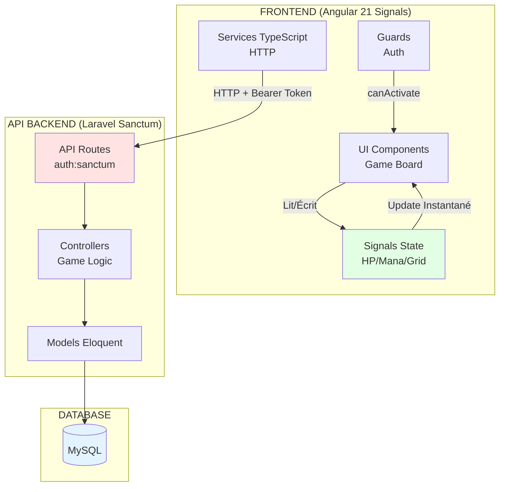
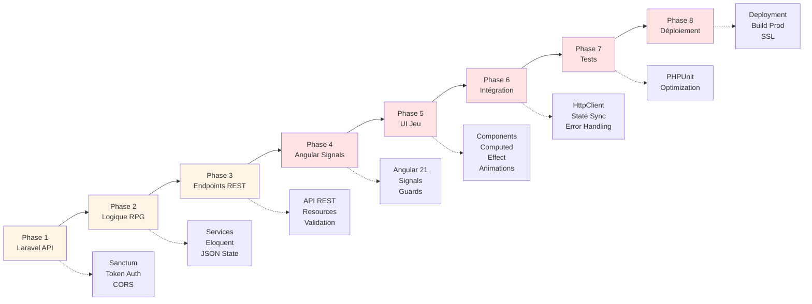

# Laravel - Sanctum

<div
  class="omny-meta"
  data-level="🟡 Intermédiaire 🔴 Avancé"
  data-version="1.0"
  data-time="18-24 heures (8 phases)">
</div>

## Introduction du projet - Dungeon Memory Battle RPG

Bienvenue dans ce projet **Dungeon Memory Battle RPG** combinant **Laravel Sanctum** (API REST) et **Angular 21 avec Signals** (frontend moderne) ! Ce jeu mélange **mémoire** (retourner cartes sur plateau 4×4) et **combat RPG tour par tour** : chaque monstre révélé déclenche un combat immédiat, impossible de fuir. Vous choisirez votre classe (**Guerrier**, **Archer**, **Mage**), progresserez en niveau, collecterez équipement, et affronterez des créatures de difficulté croissante.

!!! note "Ce projet démontre l'architecture moderne **API-first** avec les dernières innovations Angular : backend Laravel expose endpoints RESTful sécurisés (Sanctum), frontend Angular 21 utilise **Signals** pour un state management de jeu réactif, performant et simple."

Cette phase **zéro vous présente** :

- Les objectifs pédagogiques du projet (API REST, authentification tokens, jeu temps réel)
- L'architecture complète (API Laravel, Frontend Angular Signals, modèles de données)
- Le gameplay détaillé (jeu mémoire, système combat, progression)
- Le rôle de Laravel Sanctum (authentification SPA, protection API)
- Le paradigme **Signals** d'Angular 21 (réactivité moderne pour jeux)
- La structure logique des 8 Phases (API → Frontend → Intégration → Déploiement)
- Les compétences Laravel + Angular Signals acquises

!!! quote "Pourquoi un jeu RPG avec API REST et Signals ?"
    Les jeux sont des **applications complexes** nécessitant gestion d'état temps réel (HP, inventaire, plateau), logique métier (calculs dégâts, progression), et interactions instantanées. Angular 21 avec **Signals** est parfait pour jeux : state réactif **sans overhead**, change detection **granulaire** (update seulement HP bar, pas toute l'UI), et computed **automatiques** (stats personnage recalculés instantanément). Développer un RPG via API REST vous apprend : **authentification token-based**, **architecture stateless**, **gestion état côté client**, **optimisation requêtes**. Ces compétences sont **directement transférables** aux applications web modernes (dashboards, SaaS, e-commerce).

## Objectifs d'Apprentissage

!!! abstract "Avant le début de la Phase 1, **vous serez capable de** :"

    - [ ] Expliquer l'architecture **API-first** (backend Laravel, frontend découplé)
    - [ ] Identifier les 5 entités principales (**Character**, **Monster**, **Item**, **GameSession**, **Combat**)
    - [ ] Comprendre le système **Sanctum** (tokens API, authentification SPA)
    - [ ] Décrire le gameplay complet (grille mémoire → combat → progression)
    - [ ] Comprendre le paradigme **Signals** (state management réactif jeu)
    - [ ] Situer chaque Phase (1 à 8) dans la progression logique
    - [ ] Anticiper les compétences Laravel + Angular Signals acquises

## Finalité Pédagogique du Projet

### Pourquoi construire un RPG avec API REST et Signals ?

!!! quote "Ce projet n'est **pas** un simple tutoriel jeu. C'est un **cas d'école architecture moderne** applicable à tous projets web nécessitant frontend découplé, développé avec les **technologies Angular les plus modernes** (Signals, performances optimales)."

**Cas d'usage professionnels équivalents :**

- **Applications mobiles** → API Laravel, app iOS/Android
- **Dashboards temps réel** → API Laravel, frontend réactif
- **Plateformes SaaS** → Backend Laravel, multiples frontends (web, mobile, desktop)
- **Marketplaces** → API produits/commandes, frontend e-commerce
- **IoT/Devices** → API Laravel, clients embarqués

**Compétences transférables :**

- [x] Architecture RESTful (ressources, verbes HTTP, statelessness)
- [x] Authentification token-based (Sanctum, JWT-like)
- [x] Gestion état côté client (Angular Signals temps réel)
- [x] Optimisation requêtes (n+1, caching, pagination)
- [x] Sérialisation JSON (API Resources Laravel)
- [x] Guards/Interceptors Angular (token injection, error handling)
- [x] Responsive design (jeu jouable mobile/desktop)
- [x] Tests API (Postman, PHPUnit)

**Ce projet vous prépare directement pour :**

- Développement APIs REST professionnelles
- Applications Angular modernes (v21, Signals, standalone components)
- Architecture découplée backend/frontend
- Gestion état complexe temps réel

## Architecture Globale du Projet

### Architecture Découplée API + Frontend



<small>*L'architecture sépare complètement **backend (API Laravel)** et **frontend (Angular SPA Signals)**. Angular communique via requêtes HTTP avec tokens Sanctum. **Signals** gèrent le state du jeu côté frontend de manière **réactive et performante** : HP/Mana mis à jour instantanément, grille de cartes réactive, combat temps réel. Cette séparation permet : scalabilité, déploiement indépendant, et réutilisation API pour app mobile future.*</small>

### Modélisation Complète de la Base de Données

=== "UseCase - Cas d'utilisation"

    !!! quote "**Diagramme des cas d'utilisation** représentant les interactions entre le Joueur et le système RPG."

    ```mermaid
    graph LR
        subgraph "Acteur"
            J[Joueur<br/>Authentifié]
        end
        
        subgraph "Système RPG"
            UC1[S'inscrire/Se connecter]
            UC2[Créer personnage]
            UC3[Choisir classe]
            
            UC4[Démarrer partie]
            UC5[Retourner carte]
            UC6[Résoudre paire]
            
            UC7[Combattre monstre]
            UC8[Attaquer/Défendre/Sort]
            UC9[Utiliser potion]
            
            UC10[Gagner XP/Or]
            UC11[Monter niveau]
            UC12[Équiper objet]
            
            UC13[Consulter leaderboard]
            UC14[Débloquer achievements]
        end
        
        J --> UC1
        J --> UC2
        J --> UC3
        J --> UC4
        J --> UC13
        
        UC4 -.inclut.-> UC5
        UC5 -.peut déclencher.-> UC6
        UC5 -.peut déclencher.-> UC7
        
        UC7 -.inclut.-> UC8
        UC8 -.optionnel.-> UC9
        UC7 -.si victoire.-> UC10
        UC10 -.peut déclencher.-> UC11
        UC11 -.permet.-> UC12
        
        UC10 -.peut déclencher.-> UC14
        
        style J fill:#e3f3ff
    ```

    <small>*Le joueur **s'authentifie**, **crée son personnage** (classe), puis **démarre une partie** générant une grille 4×4. Chaque carte retournée peut révéler un **monstre** (combat immédiat), un **trésor** (or/potions), ou une **paire** (bonus XP). Les combats victorieux rapportent **XP/Or**, permettant de **monter en niveau** et **équiper objets**.*</small>

=== "MCD - Modèle Conceptuel"

    !!! quote "**Modèle Conceptuel de Données (MCD)** : Vue abstraite des entités RPG et de leurs relations."

    ```mermaid
    classDiagram
        class USER {
            email : String
            password : String
        }
        
        class CHARACTER {
            name : String
            class_type : Enum
            level : Int
            hp : Int
            max_hp : Int
            atk : Int
            def : Int
            mana : Int
            max_mana : Int
            xp : Int
            gold : Int
        }
        
        class GAME_SESSION {
            grid_state : JSON
            current_level : Int
            cards_flipped : Int
        }
        
        class COMBAT {
            character_hp : Int
            monster_hp : Int
            turn : Int
            status : Enum
        }
        
        class MONSTER {
            name : String
            hp : Int
            atk : Int
            def : Int
            xp_reward : Int
            gold_reward : Int
        }
        
        class ITEM {
            name : String
            type : Enum
            effect : JSON
            price : Int
        }
        
        USER "1" --> "0..*" CHARACTER : possède
        CHARACTER "1" --> "0..1" GAME_SESSION : joue
        GAME_SESSION "1" --> "0..1" COMBAT : affronte
        COMBAT "0..*" --> "1" MONSTER : combat
        CHARACTER "0..*" --> "0..*" ITEM : équipe/possède
    ```
    <small>*Le MCD modélise la logique RPG : un **User** possède plusieurs **Characters**, chaque personnage peut avoir une **GameSession** active (plateau 4×4 + état), la session peut déclencher un **Combat** contre un **Monster** template. Les **Items** sont équipés ou stockés dans l'inventaire.*</small>

=== "MLD - Modèle Logique"

    !!! quote "**Modèle Logique de Données (MLD)** : Traduction en tables relationnelles avec clés étrangères."

    ```mermaid
    erDiagram
        USER ||--o{ CHARACTER : "possède"
        USER {
            int id PK
            string email UK
            string password
        }
        
        CHARACTER ||--|| GAME_SESSION : "joue"
        CHARACTER ||--o{ CHARACTER_ITEM : "équipe"
        CHARACTER {
            int id PK
            int user_id FK
            string name
            string class_type "warrior/archer/mage"
            int level
            int hp
            int max_hp
            int atk
            int def
            int mana
            int max_mana
            int xp
            int gold
        }
        
        GAME_SESSION ||--|| COMBAT : "affronte"
        GAME_SESSION {
            int id PK
            int character_id FK
            json grid_state "[{type,revealed,value}...]"
            int current_level
            int cards_flipped
            boolean completed
        }
        
        COMBAT ||--|| MONSTER : "combat"
        COMBAT {
            int id PK
            int game_session_id FK
            int monster_id FK
            int character_hp
            int monster_hp
            int turn
            string status "active/won/lost"
        }
        
        MONSTER {
            int id PK
            string name
            int level
            int hp
            int atk
            int def
            int xp_reward
            int gold_reward
        }
        
        ITEM ||--o{ CHARACTER_ITEM : "possédé"
        ITEM {
            int id PK
            string name
            string type "weapon/armor/potion"
            json effect "{'hp':+20}"
            int price
        }
        
        CHARACTER_ITEM {
            int character_id FK
            int item_id FK
            boolean equipped
            int quantity
        }
    ```
    <small>*Le MLD introduit la table pivot **character_items** (Many-to-Many) pour l'inventaire. Le champ **grid_state** JSON stocke le plateau complet (16 cartes : type, révélée, valeur). Le **combat** stocke snapshot HP des deux combattants pour permettre sauvegarde/reprise.*</small>

=== "MPD - Modèle Physique"

    !!! quote "**Modèle Physique de Données (MPD)** : Structure MySQL optimisée pour performances jeu temps réel."

    ```mermaid
    erDiagram
        USER ||--o{ CHARACTER : "possède"
        USER {
            int id PK "AUTO_INCREMENT"
            varchar_255 email "UNIQUE INDEX"
            varchar_255 password
            timestamp email_verified_at
            timestamp created_at
            timestamp updated_at
        }
        
        CHARACTER ||--|| GAME_SESSION : "joue"
        CHARACTER {
            int id PK
            int user_id FK "INDEX, CASCADE DELETE"
            varchar_100 name
            enum class_type "DEFAULT 'warrior'"
            int level "DEFAULT 1, INDEX"
            int hp
            int max_hp
            int atk
            int def
            int mana
            int max_mana
            int xp "DEFAULT 0"
            int gold "DEFAULT 0"
            timestamp created_at
            timestamp updated_at
        }
        
        GAME_SESSION ||--|| COMBAT : "affronte"
        GAME_SESSION {
            int id PK
            int character_id FK "INDEX, CASCADE DELETE"
            json grid_state "COMPRESSED"
            int current_level "DEFAULT 1"
            int cards_flipped "DEFAULT 0"
            boolean completed "DEFAULT FALSE, INDEX"
            timestamp created_at
            timestamp updated_at
        }
        
        COMBAT {
            int id PK
            int game_session_id FK "INDEX"
            int monster_id FK "INDEX"
            int character_hp
            int monster_hp
            int turn "DEFAULT 1"
            enum status "DEFAULT 'active', INDEX"
            timestamp created_at
            timestamp updated_at
        }
    ```

    <small>*Le MPD optimise les requêtes fréquentes : **index `level`** pour leaderboards triés, **index `completed`** pour filtrer sessions actives, **index `status`** pour combats en cours. Le champ **grid_state JSON** est compressé (économie stockage). Les **enums** réduisent taille (1 octet vs varchar).*</small>

## Gameplay Détaillé

### Système Jeu de Mémoire (Grille 4×4)

**Mécanique plateau :**

- **16 cartes face cachée** (4 lignes × 4 colonnes)
- **Retourner max 2 cartes par tour**
- **Types cartes** :
    - 🐉 **Monstre** (40% = 6-7 cartes) → Combat immédiat obligatoire
    - 💰 **Trésor** (30% = 5 cartes) → Or, potions, équipement
    - ⚡ **Boost** (15% = 2-3 cartes) → +ATK/+DEF temporaire (5 tours)
    - 🛡️ **Paire** (15% = 2 paires) → Trouve 2 identiques = +50 XP bonus

**Progression niveaux :**

| Niveau | Monstres | HP Monstres | Récompenses |
|--------|---------|-------------|-------------|
| **1** | Gobelin, Loup | 30-50 HP | 10-20 Or, Potions |
| **2** | Orc, Squelette | 60-80 HP | 30-50 Or, Équipement commun |
| **3** | Troll, Vampire | 100-120 HP | 60-100 Or, Équipement rare |
| **5** | Dragon | 200 HP | 200 Or, Équipement légendaire |

### Système Combat (Tour par Tour)

**Interface combat (côté droit écran) :**

```
┌─────────────────────────────────────┐
│      🐉 Gobelin Guerrier            │
│      ❤️  HP: 45/50                  │
│      ⚔️  ATK: 12  🛡️  DEF: 5       │
└─────────────────────────────────────┘

┌─────────────────────────────────────┐
│      🧙 Mage (Vous)                 │
│      ❤️  HP: 80/100                 │
│      ⚔️  ATK: 25  🛡️  DEF: 10      │
│      💧 Mana: 50/100                │
└─────────────────────────────────────┘

Actions:
[⚔️ Attaque]  [🔥 Sort Feu (30 mana)]
[🛡️ Défendre] [🧪 Potion HP]
```

**Formule dégâts :**

```typescript
// Calcul dégâts base
baseDamage = attacker.ATK - (defender.DEF * 0.5);

// Multiplicateurs
if (isCritical) baseDamage *= 2;      // 15% chance
if (isElemental) baseDamage *= 1.5;   // Sorts élémentaires
if (isDefending) baseDamage *= 0.5;   // Action défendre

// Dégâts finaux (min 1)
finalDamage = Math.max(1, Math.floor(baseDamage));
```

**Actions disponibles :**

| Action | Effet | Coût Mana | Cooldown |
|--------|-------|-----------|----------|
| **⚔️ Attaque Normale** | ATK - (DEF × 0.5) | 0 | Aucun |
| **🔥 Sort Élémentaire** | ATK × 1.5 - DEF | 30 | 2 tours |
| **🛡️ Défendre** | Reçoit 50% dégâts, régénère 10% HP | 0 | Aucun |
| **🧪 Potion HP** | Restaure 50 HP | 0 | Item consommé |
| **⚡ Capacité Spéciale** | Variable selon classe | 50 | 5 tours |

### Système Progression

**Courbe XP :**

```typescript
// XP requis pour level N
xpRequired = 100 * level * level;

// Exemple :
// Level 1 → 2 : 100 XP
// Level 2 → 3 : 400 XP
// Level 3 → 4 : 900 XP
// Level 5 → 6 : 2500 XP
```

**Bonus montée niveau :**

- **+10 HP max** (toutes classes)
- **+3 ATK** (Guerrier +4, Archer +3, Mage +2)
- **+2 DEF** (Guerrier +3, Archer +2, Mage +2)
- **+5 Mana max** (Mage +10, autres +5)
- **Heal complet** (HP/Mana restaurés à 100%)

**Classes personnages :**

| Classe | Stats Base (Lv1) | Capacité Spéciale | Playstyle |
|--------|------------------|-------------------|-----------|
| 🗡️ **Guerrier** | HP: 120, ATK: 30, DEF: 15, Mana: 50 | **Coup Furieux** : Ignore 50% DEF (50 mana) | Tank, dégâts physiques |
| 🏹 **Archer** | HP: 90, ATK: 35, DEF: 8, Mana: 75 | **Flèche Perforante** : 100% crit garanti (50 mana) | DPS, critiques |
| 🧙 **Mage** | HP: 80, ATK: 25, DEF: 10, Mana: 100 | **Boule de Feu** : 2× dégâts (50 mana, 3 tours CD) | Burst, sorts puissants |

## Rôle de Laravel Sanctum + Angular 21 Signals

### Qu'est-ce que Sanctum apporte ? (Backend API)

Laravel Sanctum est un **système d'authentification léger** pour SPAs (Single Page Applications) et APIs :

=== "Authentification Token-Based"

    **Workflow authentification :**
    
    ```
    1. POST /api/register → Créer compte
    2. POST /api/login → Obtenir token
    3. Stocker token localStorage (Angular)
    4. Toutes requêtes : Header Authorization: Bearer {token}
    5. POST /api/logout → Révoquer token
    ```
    
    **Avantages vs sessions :**
    
    - ✅ **Stateless** : Scalable horizontalement (load balancer)
    - ✅ **Mobile-friendly** : Apps iOS/Android utilisent tokens
    - ✅ **CORS simple** : Pas de cookies cross-domain
    - ✅ **Expiration** : Token expire après X temps (sécurité)
    
    **Angular service avec Signals :**
    
    ```typescript
    class AuthService {
      private http = inject(HttpClient);
      
      // State signals
      currentUser = signal<User | null>(null);
      token = signal<string | null>(null);
      isAuthenticated = computed(() => this.currentUser() !== null);
      
      register(credentials: RegisterDTO): void {
        this.http.post<{ user: User, token: string }>('/api/register', credentials)
          .subscribe(response => {
            this.token.set(response.token);
            this.currentUser.set(response.user);
            localStorage.setItem('token', response.token);
          });
      }
      
      login(credentials: LoginDTO): void {
        this.http.post<{ user: User, token: string }>('/api/login', credentials)
          .subscribe(response => {
            this.token.set(response.token);
            this.currentUser.set(response.user);
            localStorage.setItem('token', response.token);
          });
      }
      
      logout(): void {
        this.http.post('/api/logout', {}).subscribe(() => {
          this.token.set(null);
          this.currentUser.set(null);
          localStorage.removeItem('token');
        });
      }
    }
    ```

=== "Protection Routes API"

    **Middleware `auth:sanctum` :**
    
    ```php
    // routes/api.php
    Route::middleware('auth:sanctum')->group(function () {
        Route::get('/user', fn() => auth()->user());
        Route::post('/game/start', [GameController::class, 'start']);
        Route::post('/combat/attack', [CombatController::class, 'attack']);
    });
    ```
    
    **Angular Interceptor (injection automatique token) :**
    
    ```typescript
    export const authInterceptor: HttpInterceptorFn = (req, next) => {
      const authService = inject(AuthService);
      const token = authService.token();
      
      if (token) {
        req = req.clone({
          setHeaders: {
            Authorization: `Bearer ${token}`
          }
        });
      }
      
      return next(req);
    };
    
    // app.config.ts
    export const appConfig: ApplicationConfig = {
      providers: [
        provideHttpClient(withInterceptors([authInterceptor]))
      ]
    };
    ```

=== "Endpoints API Gameplay"

    **API REST complète pour RPG :**
    
    ```php
    // Authentication
    POST   /api/register
    POST   /api/login
    POST   /api/logout
    GET    /api/user
    
    // Character
    POST   /api/characters
    GET    /api/characters/{id}
    PATCH  /api/characters/{id}
    
    // Gameplay
    POST   /api/game/start           // Nouvelle partie (génère grille)
    POST   /api/game/reveal          // Retourner carte
    GET    /api/game/state           // État plateau actuel
    
    // Combat
    POST   /api/combat/attack        // Attaquer monstre
    POST   /api/combat/defend        // Se défendre
    POST   /api/combat/skill         // Utiliser capacité spéciale
    POST   /api/combat/item          // Utiliser potion
    GET    /api/combat/status        // État combat actuel
    
    // Leaderboard
    GET    /api/leaderboard           // Top 100 joueurs
    GET    /api/achievements          // Liste achievements
    ```

### Qu'est-ce qu'Angular 21 Signals apporte ? (Frontend Jeu)

**Angular 21 Signals** révolutionne la gestion d'état pour applications temps réel comme les jeux.

=== "Paradigme Signals pour Jeux"

    **Pourquoi Signals est parfait pour jeux vidéo :**
    
    !!! quote "**Les jeux nécessitent réactivité instantanée**"
        Signals offrent change detection **granulaire** : update HP → seulement HP bar re-render (pas toute l'UI). Computed automatiques : total dégâts recalculé instantanément si ATK change. Aucun overhead subscriptions.
    
    **Avantages spécifiques jeux :**
    
    | Avantage | Impact | Exemple RPG |
    |----------|--------|-------------|
    | **Réactivité instantanée** | 0ms overhead | HP change → barre mise à jour immédiatement |
    | **Change detection granulaire** | Update seulement composants concernés | Attaque → redraw combat panel, pas grille cartes |
    | **Computed auto** | Re-calcul intelligent | `hpPercent()` recalculé automatiquement |
    | **Pas de leaks** | Impossible d'oublier unsubscribe | Effects se nettoient automatiquement |
    | **Performance** | 60 FPS garanti | Animations fluides sans lag |

=== "State Management Jeu avec Signals"

    **Gestion état complet RPG avec Signals :**
    
    ```typescript
    // services/game-state.service.ts
    import { Injectable, signal, computed, effect } from '@angular/core';
    
    @Injectable({ providedIn: 'root' })
    export class GameStateService {
      private http = inject(HttpClient);
      
      // ============================================
      // STATE SIGNALS (état jeu temps réel)
      // ============================================
      
      // Personnage
      character = signal<Character | null>(null);
      
      // Session jeu (grille 4×4)
      gameSession = signal<GameSession | null>(null);
      gridCards = signal<Card[]>([]);
      
      // Combat actif
      combat = signal<Combat | null>(null);
      
      // Loading states
      loading = signal<boolean>(false);
      
      // ============================================
      // COMPUTED SIGNALS (dérivations automatiques)
      // ============================================
      
      // HP du personnage en pourcentage (barre HP)
      characterHpPercent = computed(() => {
        const char = this.character();
        if (!char) return 0;
        return (char.hp / char.max_hp) * 100;
      });
      
      // Mana en pourcentage (barre Mana)
      characterManaPercent = computed(() => {
        const char = this.character();
        if (!char) return 0;
        return (char.mana / char.max_mana) * 100;
      });
      
      // Combat en cours ?
      isInCombat = computed(() => this.combat() !== null);
      
      // Cartes restantes
      cardsRemaining = computed(() => 
        this.gridCards().filter(c => !c.revealed).length
      );
      
      // Peut attaquer ? (mana suffisant)
      canUseSkill = computed(() => {
        const char = this.character();
        return char && char.mana >= 50;
      });
      
      // Stats monstre actuel
      currentMonsterHp = computed(() => this.combat()?.monster_hp ?? 0);
      currentMonsterMaxHp = computed(() => this.combat()?.monster?.hp ?? 1);
      monsterHpPercent = computed(() => 
        (this.currentMonsterHp() / this.currentMonsterMaxHp()) * 100
      );
      
      // XP progression
      xpProgress = computed(() => {
        const char = this.character();
        if (!char) return 0;
        const xpRequired = 100 * char.level * char.level;
        return (char.xp / xpRequired) * 100;
      });
      
      // ============================================
      // ACTIONS (modifient signals via API)
      // ============================================
      
      startGame(characterId: number): void {
        this.loading.set(true);
        
        this.http.post<GameSession>('/api/game/start', { 
          character_id: characterId 
        }).subscribe(session => {
          this.gameSession.set(session);
          this.gridCards.set(session.grid_state);
          this.loading.set(false);
        });
      }
      
      revealCard(cardIndex: number): void {
        const sessionId = this.gameSession()?.id;
        if (!sessionId) return;
        
        this.http.post<RevealResponse>('/api/game/reveal', { 
          session_id: sessionId,
          card_index: cardIndex 
        }).subscribe(response => {
          // Update card state (immutable)
          this.gridCards.update(cards => 
            cards.map((card, i) => 
              i === cardIndex 
                ? { ...card, revealed: true, type: response.type, value: response.value }
                : card
            )
          );
          
          // Si monstre, démarrer combat
          if (response.type === 'monster') {
            this.combat.set(response.combat);
          }
          
          // Si trésor, mettre à jour or
          if (response.type === 'treasure') {
            this.character.update(char => ({
              ...char!,
              gold: char!.gold + response.gold_amount
            }));
          }
        });
      }
      
      attack(): void {
        const combatId = this.combat()?.id;
        if (!combatId) return;
        
        this.http.post<CombatResult>('/api/combat/attack', {
          combat_id: combatId
        }).subscribe(result => {
          // Update combat state
          this.combat.set(result.combat);
          
          // Update character HP
          this.character.update(char => ({
            ...char!,
            hp: result.character_hp
          }));
          
          // Combat terminé (victoire)
          if (result.combat.status === 'won') {
            this.character.update(char => ({
              ...char!,
              xp: char!.xp + result.xp_gained,
              gold: char!.gold + result.gold_gained
            }));
            this.combat.set(null);
          }
          
          // Combat terminé (défaite)
          if (result.combat.status === 'lost') {
            this.combat.set(null);
            // Game over logic
          }
        });
      }
      
      useSkill(): void {
        const char = this.character();
        if (!char || char.mana < 50) return;
        
        const combatId = this.combat()?.id;
        if (!combatId) return;
        
        this.http.post<CombatResult>('/api/combat/skill', {
          combat_id: combatId
        }).subscribe(result => {
          this.combat.set(result.combat);
          this.character.update(c => ({
            ...c!,
            hp: result.character_hp,
            mana: c!.mana - 50
          }));
        });
      }
      
      defend(): void {
        const combatId = this.combat()?.id;
        if (!combatId) return;
        
        this.http.post<CombatResult>('/api/combat/defend', {
          combat_id: combatId
        }).subscribe(result => {
          this.combat.set(result.combat);
          this.character.update(char => ({
            ...char!,
            hp: result.character_hp
          }));
        });
      }
      
      usePotion(): void {
        this.character.update(char => ({
          ...char!,
          hp: Math.min(char!.hp + 50, char!.max_hp)
        }));
      }
    }
    ```

=== "Component Game Board avec Signals"

    **Composant principal jeu consommant Signals :**
    
    ```typescript
    // components/game-board.component.ts
    import { Component, inject, effect } from '@angular/core';
    
    @Component({
      selector: 'app-game-board',
      standalone: true,
      imports: [CommonModule, MatProgressBarModule, MatButtonModule],
      template: `
        <div class="game-container">
          <!-- Character Stats Panel (haut) -->
          <div class="character-stats">
            <div class="avatar">
              
            </div>
            
            <div class="stats">
              <h3>{{ gameService.character()?.name }}</h3>
              <p>Level {{ gameService.character()?.level }}</p>
              
              <!-- HP Bar (computed signal) -->
              <div class="stat-bar">
                <label>HP</label>
                <mat-progress-bar 
                  mode="determinate"
                  [value]="gameService.characterHpPercent()"
                  [color]="gameService.characterHpPercent() < 30 ? 'warn' : 'primary'">
                </mat-progress-bar>
                <span>{{ gameService.character()?.hp }} / {{ gameService.character()?.max_hp }}</span>
              </div>
              
              <!-- Mana Bar (computed signal) -->
              <div class="stat-bar">
                <label>Mana</label>
                <mat-progress-bar 
                  mode="determinate"
                  [value]="gameService.characterManaPercent()"
                  color="accent">
                </mat-progress-bar>
                <span>{{ gameService.character()?.mana }} / {{ gameService.character()?.max_mana }}</span>
              </div>
              
              <!-- XP Progress (computed signal) -->
              <div class="stat-bar">
                <label>XP</label>
                <mat-progress-bar 
                  mode="determinate"
                  [value]="gameService.xpProgress()">
                </mat-progress-bar>
              </div>
            </div>
          </div>
          
          <!-- Grid 4×4 (gauche) -->
          <div class="game-grid">
            @for (card of gameService.gridCards(); track $index) {
              <app-card 
                [card]="card"
                [index]="$index"
                [disabled]="gameService.isInCombat() || card.revealed"
                (cardClick)="revealCard($index)" />
            }
          </div>
          
          <!-- Combat Panel (droite) -->
          @if (gameService.isInCombat()) {
            <div class="combat-panel">
              <!-- Monster Stats -->
              <div class="monster-stats">
                <h3>{{ gameService.combat()?.monster?.name }}</h3>
                <mat-progress-bar 
                  mode="determinate"
                  [value]="gameService.monsterHpPercent()"
                  color="warn">
                </mat-progress-bar>
                <span>{{ gameService.currentMonsterHp() }} / {{ gameService.currentMonsterMaxHp() }}</span>
              </div>
              
              <!-- Combat Actions -->
              <div class="combat-actions">
                <button mat-raised-button color="primary" (click)="gameService.attack()">
                  ⚔️ Attaquer
                </button>
                
                <button mat-raised-button 
                        [disabled]="!gameService.canUseSkill()"
                        (click)="gameService.useSkill()">
                  🔥 Sort (50 mana)
                </button>
                
                <button mat-raised-button (click)="gameService.defend()">
                  🛡️ Défendre
                </button>
                
                <button mat-raised-button (click)="gameService.usePotion()">
                  🧪 Potion HP
                </button>
              </div>
              
              <!-- Combat Log -->
              <div class="combat-log">
                <p>Tour {{ gameService.combat()?.turn }}</p>
              </div>
            </div>
          }
        </div>
      `
    })
    export class GameBoardComponent {
      gameService = inject(GameStateService);
      
      constructor() {
        // Effect : réagit automatiquement aux changements
        effect(() => {
          const char = this.gameService.character();
          if (char && char.hp <= 0) {
            this.handleGameOver();
          }
        });
        
        // Effect : track level up
        effect(() => {
          const char = this.gameService.character();
          if (char) {
            const xpRequired = 100 * char.level * char.level;
            if (char.xp >= xpRequired) {
              this.handleLevelUp();
            }
          }
        });
      }
      
      revealCard(index: number): void {
        if (!this.gameService.isInCombat()) {
          this.gameService.revealCard(index);
        }
      }
      
      private handleGameOver(): void {
        // Show game over dialog
        console.log('Game Over!');
      }
      
      private handleLevelUp(): void {
        // Show level up animation
        console.log('Level Up!');
      }
    }
    ```
    
    **Points clés :**
    
    - ✅ **Pas de `.subscribe()`** : Signals lus directement dans template
    - ✅ **HP/Mana bars** : Update automatique via computed signals
    - ✅ **Combat réactif** : isInCombat() change → UI s'adapte instantanément
    - ✅ **Buttons disabled** : canUseSkill() computed → disable automatique
    - ✅ **Effects** : Réactions automatiques (game over, level up)

=== "TypeScript Strict avec Signals"

    **Type safety complet pour modèles RPG :**
    
    ```typescript
    // models/character.model.ts
    export type ClassType = 'warrior' | 'archer' | 'mage';
    
    export interface Character {
      id: number;
      user_id: number;
      name: string;
      class_type: ClassType;
      level: number;
      hp: number;
      max_hp: number;
      atk: number;
      def: number;
      mana: number;
      max_mana: number;
      xp: number;
      gold: number;
      avatar?: string;
      created_at: Date;
    }
    
    export interface GameSession {
      id: number;
      character_id: number;
      grid_state: Card[];
      current_level: number;
      cards_flipped: number;
      completed: boolean;
    }
    
    export type CardType = 'monster' | 'treasure' | 'boost' | 'pair';
    
    export interface Card {
      type: CardType;
      revealed: boolean;
      value?: number; // Monster ID, gold amount, etc.
    }
    
    export interface Combat {
      id: number;
      game_session_id: number;
      monster_id: number;
      monster?: Monster;
      character_hp: number;
      monster_hp: number;
      turn: number;
      status: 'active' | 'won' | 'lost';
    }
    
    export interface Monster {
      id: number;
      name: string;
      level: number;
      hp: number;
      atk: number;
      def: number;
      xp_reward: number;
      gold_reward: number;
      sprite?: string;
    }
    
    // Service typé
    class GameStateService {
      // Signals typés strictement
      character = signal<Character | null>(null);
      combat = signal<Combat | null>(null);
      gridCards = signal<Card[]>([]);
      
      // Computed typé
      characterHpPercent = computed<number>(() => {
        const char = this.character();
        if (!char) return 0;
        return (char.hp / char.max_hp) * 100;
      });
    }
    ```

## Pourquoi Angular 21 Signals pour RPG Temps Réel ?

**Angular 21 avec Signals est le choix optimal pour ce jeu car :**

<div class="cards grid" markdown>

- :fontawesome-solid-bolt-lightning: **1. Réactivité Instantanée**

    ---

    - **0ms overhead** : HP change → update immédiat
    - **Change detection granulaire** : Update seulement HP bar
    - **60 FPS garanti** : Animations fluides
    - **Pas de lag** : Computed recalculés intelligemment

- :fontawesome-solid-gamepad: **2. Parfait pour Jeux**

    ---

    - **State complexe** : HP, Mana, Grid, Combat synchronisés
    - **Computed chains** : hpPercent() → color → animation
    - **Effects** : Réactions automatiques (game over, level up)
    - **Performance** : 2-3× plus rapide que approches précédentes

- :fontawesome-solid-code: **3. Code Simple et Lisible**

    ---

    - **50% moins de code** : Pas de subscribe/unsubscribe
    - **API intuitive** : signal(), computed(), effect()
    - **Debugging facile** : Valeurs directes (pas streams)
    - **Maintenance aisée** : Pas de memory leaks possibles

- :fontawesome-solid-shield-halved: **4. Type Safety Complète**

    ---

    - **TypeScript natif** : signal<Character | null>()
    - **Erreurs compile-time** : hp: number garanti
    - **Autocomplete** : IDE suggère propriétés
    - **Refactoring sûr** : Renommage détecté partout

</div>

**Comparaison avec autres approches :**

| Aspect | **Signals (Angular 21)** | Services + Subjects | NgRx |
|--------|-------------------------|---------------------|------|
| **Complexité jeu** | ⭐ Très simple | ⭐⭐⭐ Moyen | ⭐⭐⭐⭐⭐ Trop complexe |
| **Performance 60 FPS** | ✅ Garanti | 🟡 Dépend | ✅ Bon |
| **Réactivité temps réel** | ✅ Instantanée | 🟡 Possible | ✅ Bonne |
| **Courbe apprentissage** | ⭐⭐ Douce | ⭐⭐⭐ Moyenne | ⭐⭐⭐⭐⭐ Steep |
| **Code boilerplate** | ✅ Minimal | 🟡 Moyen | ❌ Énorme |
| **Memory leaks** | ✅ Impossible | ⚠️ Possible | ✅ Géré |

**Pour jeu RPG temps réel → Signals est le choix évident.**

## Structure des 8 Phases

!!! quote "Progression logique : Backend API Sanctum → Frontend Angular Signals → Gameplay → Intégration → Déploiement."

<div class="cards grid" markdown>

- :fontawesome-solid-server: **Phase 1 : API Laravel + Sanctum**

    ---

    **Temps :** 1h-1h30  
    **Objectif :** Installer Laravel 11, Sanctum, tester auth  
    **Livrables :**

    - API Laravel fonctionnelle
    - Sanctum configuré
    - Endpoints register/login testés (Postman)

    ---

    🟡 Intermédiaire

- :fontawesome-solid-database: **Phase 2 : Modèles et Logique RPG**

    ---

    **Temps :** 3h-4h  
    **Objectif :** Créer BDD + logique jeu  
    **Livrables :**

    - Migrations (characters, monsters, items, game_sessions, combats)
    - Modèles avec relations
    - Services métier (GameService, CombatService, DamageCalculator)
    - Seeders (monstres par niveau, items)

    ---

    🔴 Avancé

- :fontawesome-solid-code: **Phase 3 : Endpoints API REST**

    ---

    **Temps :** 2h-3h  
    **Objectif :** Implémenter tous endpoints gameplay  
    **Livrables :**

    - POST /api/characters
    - POST /api/game/start
    - POST /api/game/reveal
    - POST /api/combat/attack
    - GET /api/leaderboard
    - Tests Postman complets

    ---

    🟡 Intermédiaire

- :fontawesome-brands-angular: **Phase 4 : Setup Angular 21 + Signals**

    ---

    **Temps :** 1h30-2h  
    **Objectif :** Initialiser projet Angular moderne  
    **Livrables :**

    - Projet Angular 21 (standalone components)
    - Configuration proxy API (éviter CORS dev)
    - AuthService avec Signals
    - HTTP Interceptor (injection token)
    - Guards (Auth)
    - Structure routing

    ---

    🟡 Intermédiaire

</div>

<div class="cards grid" markdown>

- :fontawesome-solid-palette: **Phase 5 : Interface Jeu (Angular Signals)**

    ---

    **Temps :** 5h-6h  
    **Objectif :** Créer UI complète gameplay avec Signals  
    **Livrables :**

    - Écran sélection classe
    - Grille 4×4 cartes (flip animation)
    - Interface combat (côté droit)
    - Barres HP/Mana réactives (computed signals)
    - Inventaire/Équipement
    - Leaderboard
    - State management Signals (services)

    ---

    🔴 Avancé

- :fontawesome-solid-link: **Phase 6 : Intégration API ↔ Frontend**

    ---

    **Temps :** 3h-4h  
    **Objectif :** Connecter Angular avec API Laravel  
    **Livrables :**

    - Services Angular typés (GameService, CombatService)
    - Signals state synchronisé avec API
    - Error handling (interceptor + notifications)
    - Loading states (spinners)
    - Optimistic updates (UI réactive)

    ---

    🔴 Avancé

- :fontawesome-solid-vial: **Phase 7 : Tests et Optimisation**

    ---

    **Temps :** 2h-3h  
    **Objectif :** Tester API + optimiser perfs  
    **Livrables :**

    - Tests Feature API (PHPUnit)
    - Tests Unit services (calculs dégâts)
    - Optimisation requêtes (Eager Loading)
    - Caching (leaderboard Redis)

    ---

    🟡 Intermédiaire

- :fontawesome-solid-rocket: **Phase 8 : Déploiement Production**

    ---

    **Temps :** 2h-3h  
    **Objectif :** Déployer API + frontend  
    **Livrables :**

    - API Laravel déployée (VPS, Vapor)
    - Frontend Angular build production (Netlify, Vercel)
    - CORS configuré
    - SSL activé (HTTPS)

    ---

    🟡 Intermédiaire

</div>

## Architecture Technique Résumée

=== "Stack Technologique"

    | Composant | Technologie | Rôle |
    |-----------|-------------|------|
    | **Backend API** | Laravel 11 | Logique métier, BDD |
    | **Authentification** | Sanctum | Tokens API, protection routes |
    | **Base de Données** | MySQL 8.0+ / PostgreSQL | Stockage données |
    | **Frontend** | **Angular 21** | Interface utilisateur SPA |
    | **State Management** | **Signals** (natif Angular) | Gestion état réactif jeu |
    | **HTTP Client** | HttpClient + Interceptors | Appels API, injection token |
    | **Animations** | Angular Animations | Flip cartes, transitions combat |

=== "Flow Communication API ↔ Frontend"

    **Flow requête typique avec Signals :**
    
    ```
    1. User clique "Attaquer" (Angular Component)
    2. Component appelle gameService.attack()
    3. Service envoie POST /api/combat/attack (HttpClient)
    4. Interceptor injecte : Authorization: Bearer {token}
    5. Laravel middleware auth:sanctum vérifie token
    6. Controller calcule dégâts (DamageCalculator)
    7. Controller met à jour BDD (combat, character HP)
    8. API retourne JSON (combat state + character HP)
    9. HttpClient Observable émet réponse
    10. Service combat.set() et character.update() (signals)
    11. Computed signals se recalculent (characterHpPercent)
    12. Change detection granulaire : update seulement HP bar
    13. Animation transition HP fluide (Angular Animations)
    ```

=== "Architecture Fichiers Angular"

    ```
    src/
    ├── app/
    │   ├── core/
    │   │   ├── guards/
    │   │   │   └── auth.guard.ts
    │   │   ├── interceptors/
    │   │   │   ├── auth-token.interceptor.ts
    │   │   │   └── error.interceptor.ts
    │   │   └── services/
    │   │       └── auth.service.ts (Signals)
    │   ├── features/
    │   │   ├── game/
    │   │   │   ├── services/
    │   │   │   │   └── game-state.service.ts (Signals)
    │   │   │   ├── components/
    │   │   │   │   ├── game-board.component.ts
    │   │   │   │   ├── card.component.ts
    │   │   │   │   └── combat-panel.component.ts
    │   │   │   └── game.routes.ts
    │   │   ├── character/
    │   │   │   ├── services/
    │   │   │   │   └── character.service.ts (Signals)
    │   │   │   └── components/
    │   │   │       ├── character-select.component.ts
    │   │   │       └── character-stats.component.ts
    │   │   └── leaderboard/
    │   │       └── ...
    │   ├── shared/
    │   │   ├── models/
    │   │   │   ├── character.model.ts
    │   │   │   ├── combat.model.ts
    │   │   │   └── monster.model.ts
    │   │   └── components/
    │   │       └── ...
    │   └── app.routes.ts
    └── main.ts
    ```

## Progression des Compétences



## Prérequis et Environnement

### Connaissances Requises

<div class="cards grid" markdown>

- :fontawesome-solid-circle-check: **Indispensables**

    ---

    - [x] **Laravel Breeze maîtrisé** (authentification, CRUD)
    - [x] **TypeScript** (interfaces, types, génériques)
    - [x] **Angular bases** (components, services, routing)
    - [x] PHP 8.2+ (POO, interfaces)
    - [x] SQL (relations, transactions)

- :fontawesome-solid-circle-half-stroke: **Recommandées**

    ---

    - 🟡 API REST (verbes HTTP, statelessness)
    - 🟡 JSON Web Tokens (JWT, bearer tokens)
    - 🟡 Angular Animations
    - 🟡 Game design (combat, progression)

- :fontawesome-solid-graduation-cap: **Apprises durant le projet**

    ---

    - [x] **Signals Angular** (signal, computed, effect)
    - [x] Standalone components Angular 21
    - [x] Control flow moderne (@if, @for)
    - [x] Sanctum token authentication
    - [x] State management jeu temps réel

</div>

### Environnement Technique

**Backend Laravel :**

```bash
# Installer Sanctum
composer require laravel/sanctum
php artisan vendor:publish --provider="Laravel\Sanctum\SanctumServiceProvider"
```

**Frontend Angular 21 :**

```bash
# Installer Angular CLI
npm install -g @angular/cli@21

# Créer projet (standalone par défaut)
ng new dungeon-rpg --routing --style=scss

# Packages
npm install @angular/animations
```

## Checklist de Validation

- [ ] Je comprends l'**architecture API-first** (Sanctum backend, Angular frontend)
- [ ] Je connais les **5 entités RPG** (Character, Monster, Item, GameSession, Combat)
- [ ] Je visualise le **gameplay complet** (grille → combat → progression)
- [ ] Je comprends **Sanctum** (tokens API vs sessions)
- [ ] Je maîtrise **Angular bases** (components, services, routing)
- [ ] Je comprends le paradigme **Signals** (signal, computed, effect)
- [ ] Je connais **TypeScript** (interfaces, types strictes)
- [ ] Je sais ce que contiennent les **8 Phases**
- [ ] J'ai vérifié les **prérequis techniques** (PHP 8.2+, Node 22+, Angular CLI)
- [ ] Je suis prêt à investir **18-24h** pour compléter le projet

## Ce que vous allez construire

<div class="cards grid" markdown>

- :fontawesome-solid-gamepad: **RPG Complet avec API REST et Signals**

    ---

    - [x] **Backend Laravel API** (Sanctum, endpoints REST)
    - [x] **Frontend Angular 21 avec Signals** (state management moderne)
    - [x] **Jeu mémoire 4×4** (flip cartes, paires, trésors)
    - [x] **Combat tour par tour** (attaque, défense, sorts, potions)
    - [x] **3 classes jouables** (Guerrier, Archer, Mage)
    - [x] **Système progression** (XP, niveaux, équipement)
    - [x] **Leaderboard** (top joueurs niveau + victoires)
    - [x] **Achievements** (déblocables)
    - [x] **Responsive** (jouable mobile/desktop)
    - [x] **Animations fluides** (flip cartes, transitions combat)
    - [x] **Performances 60 FPS** (change detection granulaire)

</div>

<br />