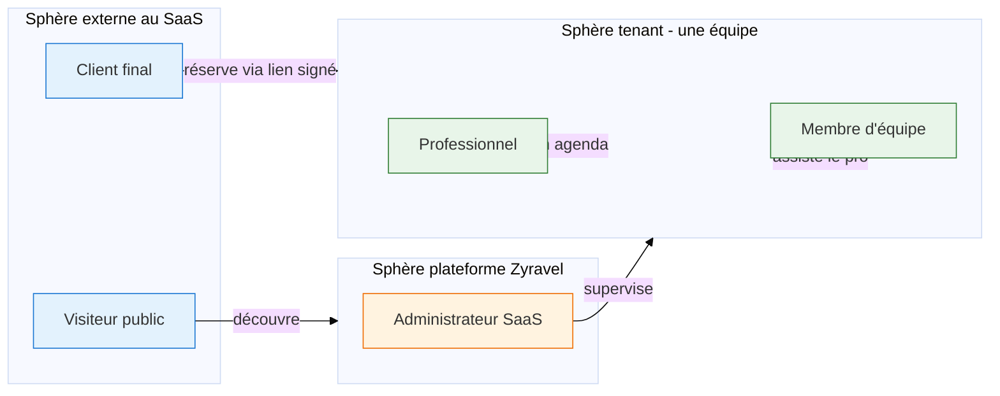
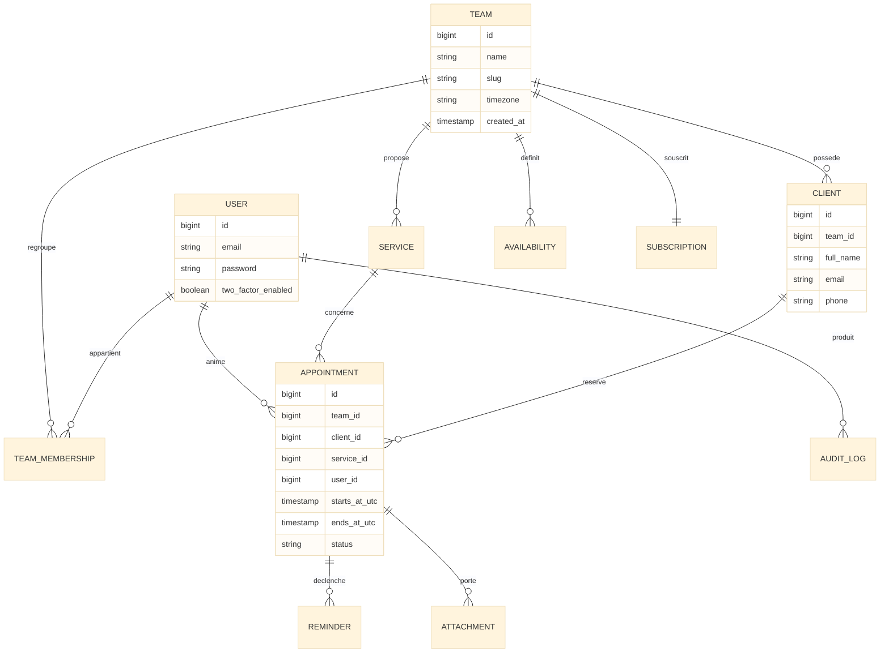

# Zyravel

<div class="omny-meta" data-level="Référence" data-version="1.0.0" data-time="Lecture 15 min"></div>

!!! quote "Analogie pédagogique"
    Un projet logiciel sans document de référence, c'est comme une maison construite sans plan d'architecte. Chaque mur tient debout isolément, mais à la fin rien ne s'aligne, les portes ne ferment pas et la toiture ne pose plus correctement. Le présent document est le plan d'architecte de Zyravel : il fige les décisions structurantes avant la première ligne de code, pour que les vingt-sept chapitres de la formation construisent un seul et même bâtiment.

<br>

---

## 1. Identité du projet

Zyravel est le projet fil rouge de la formation Laravel 13. Le nom est la contraction de **Zyrass**, pseudonyme de l'auteur, et de **Laravel**, framework de référence du cursus. Cette identité est figée pour toute la durée de la formation et ne sera plus modifiée à partir du chapitre 1.

| Attribut | Valeur |
|---|---|
| Nom de code | Zyravel |
| Slug technique | `zyravel` |
| Namespace racine | `App\` (standard Laravel) |
| Dépôt Git | `zyravel` |
| Base de données locale | `zyravel` |
| Domaine de développement | `zyravel.test` |
| Domaine de production cible | À définir au chapitre 26 |
| Auteur | Zyrass |
| Licence | Privée pendant la formation, à décider avant publication |

<br>

---

## 2. Vision produit

!!! info "Pitch en une phrase"
    Zyravel est une application SaaS multi-tenant qui permet à des coachs et consultants indépendants de gérer leur fichier clients, leurs disponibilités, la prise de rendez-vous en ligne, les rappels automatiques et leur facturation par abonnement, depuis une interface unique accessible sur tout navigateur moderne.

Le choix d'un SaaS de gestion de rendez-vous n'est pas cosmétique. Ce domaine métier impose mécaniquement de traiter toutes les briques techniques structurantes du cursus Laravel : authentification, multi-tenant par équipe, gestion fine des fuseaux horaires, détection de conflits, fichiers et pièces jointes, notifications transactionnelles, temps réel, paiement récurrent, API publique et assistant IA. Un projet de type blog ou todo-list ne forcerait aucune de ces dimensions.

Le sous-segment cible est volontairement étroit : **coachs et consultants indépendants en France**. Cette précision permet de fixer les unités monétaires, les fuseaux horaires de référence, les volumes attendus et le ton de l'interface, sans dériver vers un produit générique impossible à finir.


*Figure 1 — Tableau de bord du professionnel après connexion : agenda hebdomadaire, indicateurs clés (clients actifs, RDV de la semaine, plan actif) et liste des prochains rendez-vous. C'est le livrable observable visé à la fin de la partie 9/26.*

<br>

---

## 3. Personas et rôles applicatifs




*Figure 2 — Page de réservation publique accessible via une URL signée Laravel. Le client final choisit un créneau, saisit son nom et son email, et confirme — sans aucun compte créé. Cette contrainte métier est introduite en partie 8/26 et durcit la sécurité en partie 15/26.*

| Rôle | Authentifié | Périmètre | Apparaît à partir de |
|---|---|---|---|
| Visiteur | Non | Landing publique, pages légales | Partie 1/26 |
| Client final | Non, lien signé | Page de réservation publique | Partie 8/26 |
| Professionnel | Oui | Son équipe, ses clients, son agenda | Partie 12/26 |
| Membre d'équipe | Oui | Périmètre de l'équipe selon ses permissions | Partie 14/26 |
| Administrateur SaaS | Oui, super-admin | Toutes les équipes, lecture seule par défaut | Partie 14/26 |

!!! warning "Pièges à éviter"
    - Ne jamais créer de compte utilisateur pour un client final. Sa relation au SaaS passe exclusivement par des URL signées temporaires.
    - L'administrateur SaaS n'est pas un super-utilisateur d'équipe. Il n'écrit jamais dans les données métier d'une équipe sans journalisation explicite.
    - Le membre d'équipe n'est introduit qu'au chapitre 14, pas avant. Tant que les policies ne sont pas en place, n'introduire que le rôle Professionnel.

<br>

---

## 4. Périmètre fonctionnel cartographié

Le périmètre est défini chapitre par chapitre. Chaque livrable produit une valeur métier observable, pas seulement une démonstration technique.

??? abstract "Cartographie complète des 27 livrables"
    | Bloc | Chapitres | Livrable métier observable |
    |---|---|---|
    | Socle technique | 0 à 3 | Projet installé, dépôt Git, landing publique en ligne sur l'environnement local |
    | Domaine clients | 4 à 7 | Création, lecture, modification et suppression de fiches clients avec relations |
    | Cœur métier rendez-vous | 8 | Définition de créneaux, détection de conflits, gestion des fuseaux horaires |
    | Routage et interface | 9 à 11 | Tableau de bord professionnel avec formulaires validés côté serveur |
    | Authentification | 12 | Inscription, connexion, déconnexion, 2FA, équipes via starter kit Livewire |
    | Facturation | 13 | Plans Free, Pro, Business opérationnels en sandbox Stripe |
    | Autorisation | 14 | Policies par ressource, scoping multi-tenant strict |
    | Sécurité | 15 | Audit OWASP 2025 appliqué et documenté |
    | Médias | 16 | Avatars clients et pièces jointes de rendez-vous |
    | Logique asynchrone | 17 | Emails de confirmation envoyés via jobs en file |
    | Automatisation | 18 | Rappels J-1 et H-1 déclenchés par le scheduler |
    | API publique | 19 | API REST documentée avec OpenAPI |
    | Interactivité | 20 | Calendrier Livewire avec recherche temps réel |
    | Tests | 21 et 22 | Couverture Pest et scénarios E2E Nightwatch |
    | Assistant IA | 23 | Suggestion de créneaux et résumé de rendez-vous |
    | Performance | 24 | Octane activé, cache Redis, mesures comparatives |
    | Industrialisation | 25 | Pipelines GitHub Actions et GitLab CI fonctionnels |
    | Production | 26 | Déploiement Forge, Vapor et IaaS RockyLinux comparés |

<br>

---

## 5. Modèle de données macro

Ce diagramme est la cible finale. Toutes les entités ne sont pas créées dès le chapitre 4, mais aucune entité hors de ce diagramme ne sera ajoutée sans révision formelle de ce document.


*Figure 3 — Architecture multi-tenant de Zyravel : chaque équipe (tenant) possède ses données isolées par `team_id`. L'application Laravel 13 est la couche partagée. Les services externes (Stripe, mailer, Redis, IA) sont branchés progressivement au fil du cursus.*



!!! note "Lecture rapide du modèle"
    La table `team` est le tenant. Tout objet métier porte un `team_id`. Cette règle unique rend les policies du chapitre 14 triviales à écrire et garantit l'isolation des données entre équipes dès le chapitre 7.

<br>

---

## 6. Règles métier non négociables

Ces sept règles sont figées au chapitre 0. Toute évolution doit être tracée dans le journal de décisions du dépôt.

| Règle | Justification technique | Chapitre d'application |
|---|---|---|
| Les dates sont stockées en UTC et affichées dans le fuseau de l'utilisateur | Évite les bugs de récurrence et de passage à l'heure d'été | 8 |
| Deux rendez-vous confirmés ne peuvent pas se chevaucher pour un même professionnel | Cœur métier du SaaS, impose des tests Pest non triviaux | 8 et 21 |
| Un client final n'a jamais de compte authentifié | Force l'usage des URL signées Laravel | 8 et 15 |
| Les limites par plan sont vérifiées côté serveur, jamais uniquement en interface | Empêche le contournement par appel API direct | 13 et 14 |
| Toute action critique est journalisée dans un canal `audit` dédié | Conformité OWASP A09 et traçabilité | 15 |
| Les uploads sont stockés sur un disque privé, accès via URL signée | Conformité OWASP A08 | 16 |
| Aucun secret n'est commité dans le dépôt | Conformité OWASP A02 et A03 | 0 et 25 |

<br>

---

## 7. Modèle économique simulé

Trois plans Stripe en mode sandbox. Ces valeurs ne sont pas commerciales, elles sont pédagogiques : elles créent des cas de test concrets pour les middlewares de limitation, les policies et la facturation Cashier.

| Plan | Prix mensuel | Clients max | Rendez-vous mensuels | IA | API | Membres d'équipe |
|---|---|---|---|---|---|---|
| Free | 0 € | 10 | 20 | Non | Non | 1 |
| Pro | 19 € | 200 | Illimité | Oui | Lecture seule | 3 |
| Business | 49 € | Illimité | Illimité | Oui | Lecture et écriture | Illimité |

!!! tip "Astuce pédagogique"
    Le passage Free vers Pro est l'événement métier le plus riche à tester. Il déclenche un webhook Stripe, met à jour la table `subscription`, déverrouille des fonctionnalités, et doit être idempotent en cas de réception multiple du webhook. C'est l'exercice central du chapitre 13.

<br>

---

## 8. Stack technique verrouillée

Ces choix sont définitifs. Toute substitution doit faire l'objet d'une décision écrite avant le chapitre concerné.

<div class="grid cards" markdown>

-   :lucide-server:{ .lg .middle } **Backend**

    ---

    PHP 8.3+, Laravel 13, architecture MVC enrichie de services et d'actions.

-   :lucide-database:{ .lg .middle } **Base de données**

    ---

    PostgreSQL 16 en principal, MySQL 8 documenté comme alternative.

-   :lucide-zap:{ .lg .middle } **Cache et files**

    ---

    Redis 7 dès le chapitre 2, pas de bascule mémoire en cours de formation.

-   :lucide-layout-dashboard:{ .lg .middle } **Interface**

    ---

    Starter kit Livewire officiel, Livewire 4, Flux UI, Tailwind CSS.

-   :lucide-flask-conical:{ .lg .middle } **Tests**

    ---

    Pest comme moteur unique, PHPUnit en sous-jacent, Nightwatch pour E2E.

-   :lucide-credit-card:{ .lg .middle } **Paiement**

    ---

    Laravel Cashier branché sur Stripe en mode sandbox.

-   :lucide-container:{ .lg .middle } **Environnement local**

    ---

    Laravel Sail sur Docker Desktop avec WSL2 sous Windows 11.

-   :lucide-git-branch:{ .lg .middle } **Versionnement**

    ---

    Git, Conventional Commits stricts, branche `main` protégée.

</div>

<br>

---

## 9. Jalons et critères de validation

Chaque jalon correspond à une partie du fil rouge. Un jalon n'est validé que si son critère est observable et reproductible.

| Jalon | Partie | Critère de validation |
|---|---|---|
| Environnement opérationnel | 0/26 | `php artisan --version` retourne Laravel Framework 13.x |
| Landing en ligne | 1/26 | La page d'accueil répond en 200 sur `zyravel.test` |
| CRUD client testé | 6/26 | `php artisan test` passe sur les scénarios CRUD client |
| Routes critiques | 9/26 | Les routes métier répondent avec les codes HTTP attendus |
| Authentification active | 12/26 | Inscription, connexion et 2FA fonctionnels |
| Facturation opérationnelle | 13/26 | Un abonnement de test est créé, modifié et synchronisé via webhook |
| Sécurité OWASP appliquée | 15/26 | Chaque catégorie A01 à A10 est reliée à une contre-mesure du projet |
| Rappels automatiques | 18/26 | Une tâche planifiée déclenche un rappel observable |
| Couverture de tests | 21/26 | Les parcours métier principaux disposent d'au moins un test Pest |
| Déploiement production | 26/26 | Le SaaS est accessible en HTTPS sur un domaine public |

<br>

---

## 10. Conventions du dépôt

### Structure du dépôt

```
zyravel/
├── app/                    # Code applicatif Laravel
├── bootstrap/              # Bootstrap framework
├── config/                 # Configuration
├── database/               # Migrations, factories, seeders
├── docs/                   # Documentation projet
│   ├── projet.md           # Ce document
│   ├── decisions/          # Journal des décisions techniques
│   └── owasp/              # Annexe sécurité du chapitre 15
├── public/                 # Point d'entrée HTTP
├── resources/              # Vues Blade, assets, langues
├── routes/                 # Définition des routes
├── storage/                # Logs, cache, uploads
├── tests/                  # Pest et Nightwatch
├── .env.example            # Modèle d'environnement, jamais .env réel
├── .gitignore              # Exclusions Git Laravel + Sail
├── composer.json           # Dépendances PHP
├── package.json            # Dépendances Node
└── README.md               # Présentation rapide du projet
```

### Conventional Commits

| Préfixe | Usage |
|---|---|
| `feat:` | Ajout d'une fonctionnalité métier visible |
| `fix:` | Correction d'un défaut fonctionnel ou technique |
| `refactor:` | Restructuration sans changement de comportement |
| `test:` | Ajout ou modification de tests |
| `docs:` | Modification de la documentation |
| `chore:` | Tâche de maintenance, dépendances, configuration |
| `perf:` | Optimisation de performance mesurable |
| `security:` | Correction ou durcissement de sécurité |

### Style de code

- Pint en configuration Laravel par défaut, exécuté en pre-commit.
- Pas de classes anémiques, pas de logique métier dans les contrôleurs au-delà du chapitre 17.
- Tous les types sont déclarés en `declare(strict_types=1);` à partir du chapitre 5.

<br>

---

## 11. Journal de décisions

Chaque décision structurante prise pendant la formation est consignée dans `docs/decisions/`, au format ADR court.

| Identifiant | Titre | Statut |
|---|---|---|
| ADR-001 | Choix de Laravel 13 et Livewire 4 comme stack principale | Accepté |
| ADR-002 | PostgreSQL 16 comme base de données principale | Accepté |
| ADR-003 | Multi-tenancy par colonne `team_id` plutôt que par schéma | Accepté |
| ADR-004 | Pas de compte authentifié pour les clients finaux | Accepté |
| ADR-005 | Stripe Cashier plutôt qu'intégration manuelle Stripe | Accepté |

Les ADR suivants sont rédigés au moment où la décision se présente, jamais a posteriori.

<br>

---

## 12. Glossaire

| Terme | Définition dans Zyravel |
|---|---|
| Tenant | Une équipe propriétaire de ses données, isolée des autres équipes |
| Professionnel | Utilisateur principal, propriétaire d'une équipe |
| Client | Personne physique gérée par un professionnel, sans compte authentifié |
| Service | Type de prestation proposé par un professionnel (séance, audit, atelier) |
| Créneau | Disponibilité déclarée par un professionnel, récurrente ou ponctuelle |
| Rendez-vous | Réservation confirmée associant un client, un service et un créneau |
| Rappel | Notification automatique envoyée avant un rendez-vous |
| Plan | Niveau d'abonnement Stripe limitant l'usage du SaaS |

<br>

---

## Ressources complémentaires

- Documentation officielle Laravel 13 : <https://laravel.com/docs/13.x>
- Documentation Livewire 4 : <https://livewire.laravel.com>
- Documentation Cashier Stripe : <https://laravel.com/docs/13.x/billing>
- OWASP Top 10:2025 : <https://owasp.org/Top10/2025/>
- Conventional Commits : <https://www.conventionalcommits.org>

<br>

---

!!! quote "Ce qu'il faut retenir"
    Ce document n'est pas une formalité administrative, c'est le contrat que le projet passe avec lui-même. Il fige l'identité Zyravel, le périmètre métier coachs et consultants, le modèle de données multi-tenant par équipe, les sept règles non négociables, les trois plans Stripe pédagogiques et la stack technique Laravel 13 plus Livewire 4. Tant que les vingt-sept chapitres respectent ce contrat, le SaaS final sera cohérent. Dès qu'une décision dévie sans être tracée dans le journal des ADR, la dette technique commence.

<br>

> Prochaine étape : [Chapitre 0 - Vision du projet, environnement local, Docker, Sail et Git](../chapitres/00-introduction.md)