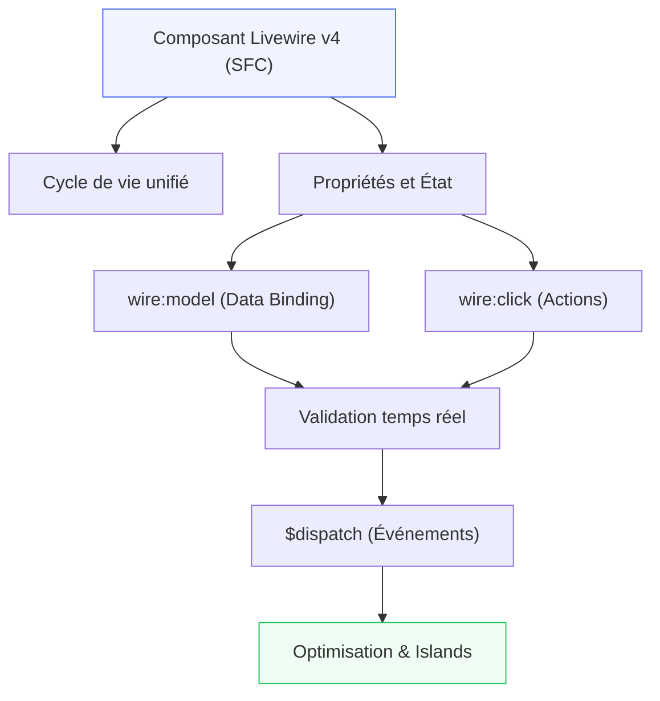

# Livewire

## Introduction

!!! quote "Analogie pédagogique — Le Tableau de Bord Temps Réel"
    Imaginez un tableau de bord de salle des marchés : les prix se mettent à jour en continu, les formulaires valident instantanément, les filtres agissent sans rechargement de page — le tout sans une ligne de JavaScript. C'est Livewire. Vous écrivez du PHP côté serveur, Livewire se charge de synchroniser intelligemment le DOM côté client. La magie est transparente ; le code reste simple, encapsulé et testable au sein d'un seul fichier.

**Livewire** est un framework full-stack pour Laravel permettant de créer des interfaces réactives dynamiques sans JavaScript complexe. Il repose sur des composants PHP stateful, du data binding bidirectionnel et une hydratation moderne optimisée pour les performances.

> Livewire comble le fossé entre les applications serveur traditionnelles et les SPAs modernes : **la réactivité d'une SPA avec la simplicité du PHP server-side**.

 

---

## Parcours — Fondations Livewire v4

!!! note "5 modules progressifs couvrant le cycle complet d'un composant Livewire en production"

-   :lucide-layers:{ .lg .middle } **Module 1** — _Fondations & Cycle de Vie_

    ---
    Architecture Livewire v4, composants mono-fichier (SFC), structure ⚡, hydratation moderne et Islands (`@island`).

    **Durée** : ~4-5h | **Niveau** : 🟢 Débutant

    [:lucide-book-open-check: Accéder au module 1](./01-fondations-cycle-de-vie.md)

-   :lucide-database:{ .lg .middle } **Module 2** — _Propriétés & Actions_

    ---
    Liaisons de variables (`wire:model`), méthodes réactives, actions utilisateurs (`wire:click`, `wire:submit`) sous format SFC.

    **Durée** : ~4-5h | **Niveau** : 🟡 Intermédiaire

    [:lucide-book-open-check: Accéder au module 2](./02-proprietes-actions.md)

-   :lucide-shield-check:{ .lg .middle } **Module 3** — _Formulaires & Validation_

    ---
    Validation en temps réel dans les composants mono-fichier, règles Laravel, messages et feedback UX immédiat.

    **Durée** : ~4-5h | **Niveau** : 🟡 Intermédiaire

    [:lucide-book-open-check: Accéder au module 3](./03-formulaires-validation.md)

-   :lucide-radio:{ .lg .middle } **Module 4** — _Événements & Communication_

    ---
    Communication inter-composants via `$dispatch()`, écouteurs d'événements, événements navigateur et rafraîchissements sélectifs.

    **Durée** : ~4-5h | **Niveau** : 🔴 Avancé

    [:lucide-book-open-check: Accéder au module 4](./04-evenements-communication.md)

-   :lucide-rocket:{ .lg .middle } **Module 5** — _Avancé & Production_

    ---
    Uploads de fichiers en streaming, rafraîchissements réguliers (`wire:poll`), sécurité CSRF, Smart Keys et checklist de production.

    **Durée** : ~5-6h | **Niveau** : 🔴 Avancé

    [:lucide-book-open-check: Accéder au module 5](./05-avance-production.md)

 

---

## Prérequis

!!! warning "Maîtrise de Laravel requise"
    Cette formation suppose une **maîtrise solide de Laravel 13** :

    - Routes, controllers, middleware
    - Eloquent ORM (models, relations, queries)
    - Blade templating (directives, components, slots)
    - Migrations, seeders, validation

    **Niveau requis :** Laravel intermédiaire minimum — suivre la [formation Laravel](../laravel/index.md) en premier si besoin.

 

---

## Compétences couvertes

| Concept | Module |
|---|---|
| Architecture SFC & Lifecycle unifié | 1 |
| Propriétés publiques, `wire:model`, `wire:click` | 2 |
| Validation de formulaires, feedback UX instantané | 3 |
| `$dispatch`, écouteurs, communication inter-composants | 4 |
| Uploads, polling, CSRF, configuration de production | 5 |

 

---

## Ateliers & Projets

Les projets pratiques progressifs sont intégrés dans la section **[Livewire Lab](../../../../projets/livewire-lab/index.md)** :

- Calculatrice réactive SFC (modules 1-2)
- Formulaire d'inscription avec validation immédiate (module 3)
- Todo list avec événements et filtres (module 4)
- Dashboard CRUD complet avec uploads et polling (module 5)

 

---

## Conclusion

!!! quote "Ce qu'il faut retenir de Livewire v4"
    Livewire v4 simplifie le développement full-stack en regroupant la logique PHP et la vue HTML au sein d'un seul composant mono-fichier (SFC). Grâce à une hydratation partielle optimisée par les Islands, il garantit des performances comparables aux architectures JavaScript modernes sans la complexité de gestion d'une API.

> Prêt à concevoir vos premiers composants ? Poursuivez vers le [Module 1 — Fondations & Cycle de Vie](./01-fondations-cycle-de-vie.md).

 