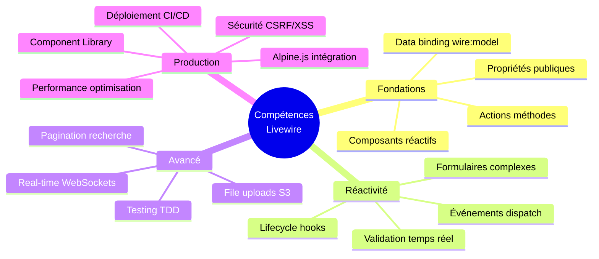

# Livewire

## Introduction

**Livewire** est un framework full-stack Laravel permettant de créer des interfaces réactives dynamiques sans écrire une ligne de JavaScript. Composants PHP réactifs, data binding bidirectionnel, validation temps réel, le tout avec la puissance de Laravel côté serveur.

> Livewire comble le fossé entre applications serveur traditionnelles et SPAs modernes : **la réactivité d'une SPA avec la simplicité du PHP server-side**.

!!! info "Pourquoi cette formation ?"
    - Elle **structure** l'apprentissage de Livewire de manière exhaustive et progressive
    - Elle **couvre** 100% des fonctionnalités de Livewire 3.x moderne
    - Elle **intègre** sécurité, performance et best practices dès le départ
    - Elle **produit** des composants réutilisables et applications production-ready

## Parcours pédagogique

## Partie 1 — Fondations Livewire

!!! note "Cette partie couvre l'installation, les composants de base, le data binding et les actions"

-   :lucide-download:{ .lg .middle } **Module I** — _Installation & Premier Composant_

    ---
    Installation Laravel + Livewire, architecture, premier composant réactif, structure fichiers.

    **Leçons** : 8 | **Durée** : ~4-5h

    [:lucide-book-open-check: Accéder au module I](./module-01/)

-   :lucide-database:{ .lg .middle } **Module II** — _Propriétés & Data Binding_

    ---
    Propriétés publiques, `wire:model`, binding bidirectionnel, modifiers (`.lazy`, `.live`, `.blur`).

    **Leçons** : 9 | **Durée** : ~5-6h

    [:lucide-book-open-check: Accéder au module II](./module-02/)

-   :lucide-mouse-pointer-click:{ .lg .middle } **Module III** — _Actions & Méthodes_

    ---
    `wire:click`, méthodes publiques, paramètres, `wire:submit`, magic actions, `$event`.

    **Leçons** : 7 | **Durée** : ~4-5h

    [:lucide-book-open-check: Accéder au module III](./module-03/)

### Atelier Partie 1

-   :lucide-calculator:{ .lg .middle } **Atelier #1** — _Calculatrice Interactive_

    ---
    Calculatrice avec data binding, actions, validation, historique calculs.

    **Niveau** : Débutant | **Durée** : 1h

    [:lucide-hammer: Accéder à l'atelier](./atelier-01/)

---

## Partie 2 — Réactivité & Formulaires

!!! note "Cette partie approfondit le cycle de vie, événements, validation et formulaires complexes"

-   :lucide-rotate-cw:{ .lg .middle } **Module IV** — _Lifecycle Hooks_

    ---
    `mount()`, `hydrate()`, `updating()`, `updated()`, hooks personnalisés, cycle requête.

    **Leçons** : 8 | **Durée** : ~5-6h

    [:lucide-book-open-check: Accéder au module IV](./module-04/)

-   :lucide-radio:{ .lg .middle } **Module V** — _Événements & Communication_

    ---
    `$dispatch()`, listeners, événements globaux, communication parent-enfant, browser events.

    **Leçons** : 9 | **Durée** : ~6-7h

    [:lucide-book-open-check: Accéder au module V](./module-05/)

-   :lucide-shield-check:{ .lg .middle } **Module VI** — _Validation & Formulaires_

    ---
    Règles validation, validation temps réel, messages personnalisés, `$rules`, custom validators.

    **Leçons** : 10 | **Durée** : ~6-7h

    [:lucide-book-open-check: Accéder au module VI](./module-06/)

-   :lucide-list:{ .lg .middle } **Module VII** — _Rendu Conditionnel & Boucles_

    ---
    `@if`, `@foreach`, `wire:key`, lazy loading, placeholder, loading states, skeleton screens.

    **Leçons** : 8 | **Durée** : ~5-6h

    [:lucide-book-open-check: Accéder au module VII](./module-07/)

### Ateliers Partie 2

-   :lucide-user-plus:{ .lg .middle } **Atelier #2** — _Formulaire Inscription_

    ---
    Inscription utilisateur avec validation temps réel, feedback UX, vérification email.

    **Niveau** : Intermédiaire | **Durée** : 1h30

    [:lucide-hammer: Accéder à l'atelier](./atelier-02/)

-   :lucide-check-square:{ .lg .middle } **Atelier #3** — _Todo List Réactive_

    ---
    Todo list avec CRUD, filtres, recherche, événements, persistence Eloquent.

    **Niveau** : Intermédiaire | **Durée** : 1h45

    [:lucide-hammer: Accéder à l'atelier](./atelier-03/)

---

## Partie 3 — Fonctionnalités Avancées

!!! note "Cette partie couvre pagination, uploads, real-time et testing"

-   :lucide-chevrons-left-right:{ .lg .middle } **Module VIII** — _Pagination & Tables_

    ---
    `WithPagination` trait, recherche temps réel, filtres, sorting, datatables dynamiques.

    **Leçons** : 9 | **Durée** : ~6-7h

    [:lucide-book-open-check: Accéder au module VIII](./module-08/)

-   :lucide-upload:{ .lg .middle } **Module IX** — _File Uploads_

    ---
    `wire:model` fichiers, validation, preview temps réel, multiple uploads, S3, chunked uploads.

    **Leçons** : 10 | **Durée** : ~7-8h

    [:lucide-book-open-check: Accéder au module IX](./module-09/)

-   :lucide-activity:{ .lg .middle } **Module X** — _Real-time & Polling_

    ---
    `wire:poll`, Laravel Echo, WebSockets, broadcasting events, notifications temps réel.

    **Leçons** : 9 | **Durée** : ~8-9h

    [:lucide-book-open-check: Accéder au module X](./module-10/)

-   :lucide-flask-conical:{ .lg .middle } **Module XI** — _Testing Livewire_

    ---
    Livewire Testing Helpers, `Livewire::test()`, assertions complètes, mocking, TDD workflow.

    **Leçons** : 8 | **Durée** : ~6-7h

    [:lucide-book-open-check: Accéder au module XI](./module-11/)

### Ateliers Partie 3

-   :lucide-table:{ .lg .middle } **Atelier #4** — _Datatable CRUD Avancé_

    ---
    Table données : CRUD modal, recherche, filtres, pagination, export CSV, actions bulk.

    **Niveau** : Avancé | **Durée** : 2h30

    [:lucide-hammer: Accéder à l'atelier](./atelier-04/)

-   :lucide-messages-square:{ .lg .middle } **Atelier #5** — _Chat Real-time_

    ---
    Application chat : messages temps réel, typing indicators, WebSockets, présence users.

    **Niveau** : Avancé | **Durée** : 3h

    [:lucide-hammer: Accéder à l'atelier](./atelier-05/)

---

## Partie 4 — Production & Architecture

!!! note "Cette partie finalise avec sécurité, performance, composants réutilisables et déploiement"

-   :lucide-shield-alert:{ .lg .middle } **Module XII** — _Sécurité Livewire_

    ---
    CSRF, authorization policies, mass assignment, XSS prevention, rate limiting, best practices.

    **Leçons** : 8 | **Durée** : ~6-7h

    [:lucide-book-open-check: Accéder au module XII](./module-12/)

-   :lucide-gauge:{ .lg .middle } **Module XIII** — _Performance & Optimisation_

    ---
    Lazy loading, defer loading, `wire:key`, query optimization, caching, profiling, N+1 queries.

    **Leçons** : 9 | **Durée** : ~7-8h

    [:lucide-book-open-check: Accéder au module XIII](./module-13/)

-   :lucide-package:{ .lg .middle } **Module XIV** — _Components Réutilisables_

    ---
    Component Library, traits réutilisables, Livewire Actions, Blade components, package Composer.

    **Leçons** : 10 | **Durée** : ~7-8h

    [:lucide-book-open-check: Accéder au module XIV](./module-14/)

-   :lucide-zap:{ .lg .middle } **Module XV** — _Alpine.js + Livewire_

    ---
    Intégration Alpine.js, `$wire`, `@entangle`, JavaScript inter-op, quand utiliser chacun.

    **Leçons** : 7 | **Durée** : ~6-7h

    [:lucide-book-open-check: Accéder au module XV](./module-15/)

-   :lucide-rocket:{ .lg .middle } **Module XVI** — _Déploiement Production_

    ---
    Build assets, optimizations, monitoring, error tracking, CI/CD, checklist production.

    **Leçons** : 8 | **Durée** : ~5-6h

    [:lucide-book-open-check: Accéder au module XVI](./module-16/)

### Atelier Final

-   :lucide-layout-dashboard:{ .lg .middle } **Atelier #6** — _Dashboard SaaS Complet_

    ---
    Dashboard production : auth, CRUD multi-tables, stats real-time, billing, admin panel.

    **Niveau** : Expert | **Durée** : 4-5h

    [:lucide-hammer: Accéder à l'atelier](./atelier-06/)

---

## Compétences validées

À l'issue de cette formation, vous serez capable de :

## Synthèse par niveau

| Partie | Modules | Niveau | Prérequis |
|--------|---------|--------|-----------|
| **Fondations** | I, II, III | 🟡 Intermédiaire | Laravel 10+ maîtrisé |
| **Réactivité** | IV, V, VI, VII | 🟡 Intermédiaire | Partie 1 complète |
| **Avancé** | VIII, IX, X, XI | 🔴 Avancé | Parties 1-2 complètes |
| **Production** | XII, XIII, XIV, XV, XVI | 🔴 Expert | Toute la formation |

!!! tip "Conseils de progression"
    - [x] **Maîtriser Laravel d'abord** : Livewire s'appuie sur Laravel (routes, Eloquent, Blade, migrations)
    - [x] **Coder tous les exemples** : la réactivité ne s'apprend qu'en pratiquant en temps réel
    - [x] **Tester chaque concept** : utilisez `php artisan serve` et testez immédiatement
    - [x] **Lire la doc officielle** en parallèle pour approfondir les points spécifiques

## Livrables obtenus

À la fin de cette formation, vous disposerez de :

- Un **environnement Laravel + Livewire** configuré professionnellement
- Une **calculatrice interactive** avec data binding et historique
- Un **formulaire inscription complet** avec validation temps réel
- Une **todo list réactive** avec filtres et persistance
- Une **datatable CRUD avancée** (recherche, filtres, pagination, export)
- Une **application chat real-time** avec WebSockets et notifications
- Un **dashboard SaaS complet** production-ready avec authentification
- Une **Component Library** documentée et réutilisable (package Composer)
- Une **checklist sécurité Livewire** complète (CSRF, XSS, policies)
- Un **template projet production** optimisé et testé

!!! warning "Prérequis techniques"
    Cette formation suppose une **maîtrise solide de Laravel** :
    
    - Routes, controllers, middleware
    - Eloquent ORM (models, relations, queries)
    - Blade templating (directives, components, slots)
    - Migrations et seeders
    - Validation Laravel
    - Authentication (Breeze/Jetstream)
    
    **Niveau requis :** Laravel intermédiaire minimum.
    
    Si Laravel n'est pas maîtrisé, suivre d'abord une formation Laravel complète.

> Les modules suivants détaillent chaque concept Livewire avec des analogies pédagogiques, des diagrammes explicatifs, des exemples progressifs et des projets concrets exclusivement Livewire.

 