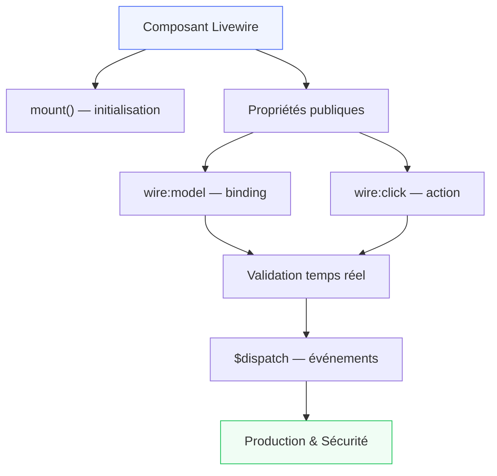

# Livewire

## Introduction

!!! quote "Analogie pédagogique — Le Tableau de Bord Temps Réel"
    Imaginez un tableau de bord de salle des marchés : les prix se mettent à jour en continu, les formulaires valident instantanément, les filtres agissent sans rechargement de page — le tout sans une ligne de JavaScript. C'est Livewire. Vous écrivez du PHP côté serveur, Livewire se charge de synchroniser intelligemment le DOM côté client. La magie est transparente ; le code reste simple et testable.

**Livewire** est un framework full-stack pour Laravel permettant de créer des interfaces réactives dynamiques sans JavaScript. Composants PHP stateful, data binding bidirectionnel, validation temps réel — avec la puissance de Laravel côté serveur.

> Livewire comble le fossé entre applications serveur traditionnelles et SPAs modernes : **la réactivité d'une SPA avec la simplicité du PHP server-side**.

 

---

## Parcours — Fondations Livewire

!!! note "5 modules progressifs couvrant le cycle complet d'un composant Livewire en production"

-   :lucide-layers:{ .lg .middle } **Module 1** — _Fondations & Cycle de Vie_

    ---
    Architecture Livewire, premier composant, `mount()`, hydratation, lifecycle hooks, `wire:loading`.

    **Durée** : ~4-5h | **Niveau** : 🟡 Intermédiaire

    [:lucide-book-open-check: Accéder au module 1](./01-fondations-cycle-de-vie.md)

-   :lucide-database:{ .lg .middle } **Module 2** — _Propriétés & Actions_

    ---
    `wire:model`, propriétés publiques, binding bidirectionnel, `wire:click`, méthodes, `wire:submit`.

    **Durée** : ~4-5h | **Niveau** : 🟡 Intermédiaire

    [:lucide-book-open-check: Accéder au module 2](./02-proprietes-actions.md)

-   :lucide-shield-check:{ .lg .middle } **Module 3** — _Formulaires & Validation_

    ---
    Validation temps réel, règles Laravel, messages personnalisés, `$rules`, feedback UX.

    **Durée** : ~4-5h | **Niveau** : 🟡 Intermédiaire

    [:lucide-book-open-check: Accéder au module 3](./03-formulaires-validation.md)

-   :lucide-radio:{ .lg .middle } **Module 4** — _Événements & Communication_

    ---
    `$dispatch()`, listeners, événements globaux, communication parent-enfant, browser events.

    **Durée** : ~4-5h | **Niveau** : 🔴 Avancé

    [:lucide-book-open-check: Accéder au module 4](./04-evenements-communication.md)

-   :lucide-rocket:{ .lg .middle } **Module 5** — _Avancé & Production_

    ---
    File uploads, `wire:poll`, real-time, sécurité CSRF, performance, checklist production.

    **Durée** : ~5-6h | **Niveau** : 🔴 Avancé

    [:lucide-book-open-check: Accéder au module 5](./05-avance-production.md)

 

---

## Prérequis

!!! warning "Maîtrise de Laravel requise"
    Cette formation suppose une **maîtrise solide de Laravel** :

    - Routes, controllers, middleware
    - Eloquent ORM (models, relations, queries)
    - Blade templating (directives, components, slots)
    - Migrations, seeders, validation
    - Authentication (Breeze ou custom)

    **Niveau requis :** Laravel intermédiaire minimum — suivre la [formation Laravel](../laravel/index.md) en premier si besoin.

 

---

## Compétences couvertes

| Concept | Module |
|---|---|
| Architecture & lifecycle (`mount`, `hydrate`) | 1 |
| Propriétés, `wire:model`, `wire:click` | 2 |
| Validation, formulaires, feedback UX | 3 |
| `$dispatch`, listeners, communication inter-composants | 4 |
| Uploads, polling, CSRF, optimisation production | 5 |

 

---

## Ateliers & Projets

Les projets pratiques progressifs sont disponibles dans la section **[Livewire Lab](../../../../projets/livewire-lab/index.md)** :

- Calculatrice réactive (modules 1-2)
- Formulaire d'inscription avec validation temps réel (module 3)
- Todo list avec événements et filtres (module 4)
- Dashboard CRUD avec uploads et polling (module 5)

 

---

## Conclusion

!!! quote "Ce qu'il faut retenir avant de commencer"
    Livewire ne remplace pas Laravel — il l'étend. Chaque composant est une classe PHP ordinaire avec des propriétés et des méthodes. Livewire intercepte les interactions utilisateur, exécute la méthode PHP côté serveur, et met à jour uniquement les parties du DOM modifiées. Aucun JavaScript n'est nécessaire pour 90% des cas d'usage.

> Commencez par le [Module 1 — Fondations & Cycle de Vie](./01-fondations-cycle-de-vie.md) pour comprendre comment Livewire pense avant de coder.

 