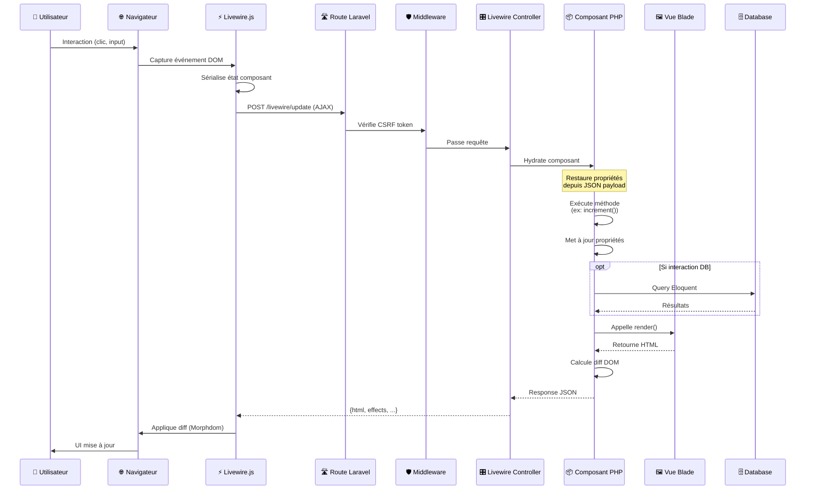

# I — Installation

<div
  class="omny-meta"
  data-level="🟡 Intermédiaire"
  data-duration="4-5 heures"
  data-lessons="8">
</div>

## Vue d'ensemble

!!! quote "Analogie pédagogique"
    _Imaginez un **restaurant avec service à table intelligent** : vous commandez un plat (action utilisateur), le serveur note votre demande (Livewire capte l'événement), court en cuisine (serveur PHP), le chef prépare (traitement serveur), le serveur revient avec le plat exactement où vous êtes assis (mise à jour DOM ciblée). **Livewire, c'est ce serveur invisible** qui fait des allers-retours entre cuisine (backend) et table (frontend) sans que vous ayez à coder la communication HTTP. Vous écrivez simplement le menu (composant PHP) et les clients (utilisateurs) interagissent naturellement. Aucun JavaScript à écrire, aucun fetch() manuel, aucun state management complexe : **Livewire gère tout automatiquement**._

**Livewire révolutionne le développement Laravel :**

- ✅ **Composants réactifs en PHP pur** (pas de JavaScript obligatoire)
- ✅ **Data binding bidirectionnel** (`wire:model` = Vue.js/React-like en PHP)
- ✅ **Mises à jour DOM automatiques** (AJAX invisible, pas de page reload)
- ✅ **Validation temps réel** (feedback instantané côté serveur)
- ✅ **Intégration Laravel native** (Blade, Eloquent, routes, policies, gates)

**Ce module couvre :**

1. Installation Laravel + Livewire 3.x
2. Architecture client-serveur Livewire (diagramme complet)
3. Anatomie d'un composant (classe PHP + vue Blade)
4. Premier composant réactif : Counter (compteur)
5. Directives Livewire essentielles (`wire:click`, `@livewire`)
6. Full-page vs Inline components
7. Convention nommage et structure fichiers
8. Debugging et outils développement

---

## Leçon 1 : Prérequis et Installation Laravel

### 1.1 Versions Requises

**Stack technique minimale :**

```bash
# PHP 8.1+ (8.2 ou 8.3 recommandé pour performance)
php -v
# PHP 8.3.2 (cli)

# Composer 2.x
composer --version
# Composer version 2.7.1

# Node.js 18+ (pour Vite assets)
node -v
# v20.11.0

# npm ou yarn
npm -v
# 10.2.4
```

**Pourquoi ces versions ?**

- **PHP 8.1+** : Livewire 3 utilise les features modernes (enums, readonly properties, attributes)
- **Composer 2.x** : Gestion dépendances rapide, autoloader optimisé
- **Node.js 18+** : Vite build tool (remplace Laravel Mix)

### 1.2 Créer Projet Laravel Frais

```bash
# Via Composer (méthode recommandée)
composer create-project laravel/laravel livewire-learning

# Ou via Laravel Installer (si installé globalement)
laravel new livewire-learning

# Entrer dans le dossier
cd livewire-learning
```

**Structure Laravel créée :**

```
livewire-learning/
├── app/
│   ├── Http/
│   │   └── Controllers/
│   ├── Models/
│   └── Providers/
├── bootstrap/
├── config/
├── database/
│   ├── migrations/
│   └── seeders/
├── public/
├── resources/
│   ├── css/
│   ├── js/
│   └── views/
├── routes/
│   ├── web.php
│   └── api.php
├── storage/
├── tests/
├── .env
├── composer.json
└── artisan
```

### 1.3 Configuration Base de Données

**Option 1 : SQLite (simplicité apprentissage)**

```bash
# Créer fichier SQLite
touch database/database.sqlite
```

**Fichier `.env` :**

```env
# Configuration SQLite
DB_CONNECTION=sqlite
# DB_HOST, DB_PORT, DB_DATABASE peuvent rester commentés
# DB_USERNAME=
# DB_PASSWORD=
```

**Option 2 : MySQL/PostgreSQL (production)**

```env
# Configuration MySQL
DB_CONNECTION=mysql
DB_HOST=127.0.0.1
DB_PORT=3306
DB_DATABASE=livewire_learning
DB_USERNAME=root
DB_PASSWORD=secret
```

**Tester connexion base :**

```bash
# Exécuter migrations par défaut Laravel
php artisan migrate

# Sortie attendue :
# Migration table created successfully.
# Migrating: 2014_10_12_000000_create_users_table
# Migrated:  2014_10_12_000000_create_users_table (XX.XXms)
# ...
```

### 1.4 Démarrer Serveur Développement

```bash
# Terminal 1 : Serveur PHP
php artisan serve

# Sortie :
# INFO  Server running on [http://127.0.0.1:8000]
# Press Ctrl+C to stop the server

# Terminal 2 : Vite dev server (assets)
npm install
npm run dev

# Sortie :
# VITE v5.0.0  ready in XXX ms
# ➜  Local:   http://localhost:5173/
```

**Accéder application :** `http://127.0.0.1:8000`

Vous devriez voir la page d'accueil Laravel par défaut.

---

## Leçon 2 : Installer Livewire

### 2.1 Installation via Composer

```bash
# Installer Livewire 3.x
composer require livewire/livewire

# Sortie attendue :
# Using version ^3.4 for livewire/livewire
# ./composer.json has been updated
# ...
# Package operations: 1 install
# - Installing livewire/livewire (v3.4.0)
```

**Vérification installation :**

```bash
# Lister commandes Livewire disponibles
php artisan livewire

# Sortie :
# livewire
#   livewire:copy        Copy a Livewire component
#   livewire:configure   Configure Livewire's publishing
#   livewire:delete      Delete a Livewire component
#   livewire:make        Create a new Livewire component
#   livewire:move        Move a Livewire component
#   livewire:publish     Publish Livewire configuration
#   livewire:stubs       Publish Livewire stubs for customization
```

### 2.2 Publier Configuration (Optionnel)

```bash
# Publier fichier config/livewire.php (optionnel mais recommandé)
php artisan livewire:publish --config

# Publier assets JavaScript (rarement nécessaire)
php artisan livewire:publish --assets
```

**Fichier `config/livewire.php` créé :**

```php
<?php

return [
    /*
    |--------------------------------------------------------------------------
    | Class Namespace
    |--------------------------------------------------------------------------
    | Namespace racine pour vos composants Livewire
    */
    'class_namespace' => 'App\\Livewire',

    /*
    |--------------------------------------------------------------------------
    | View Path
    |--------------------------------------------------------------------------
    | Chemin où Livewire cherche les vues Blade des composants
    */
    'view_path' => resource_path('views/livewire'),

    /*
    |--------------------------------------------------------------------------
    | Layout
    |--------------------------------------------------------------------------
    | Layout par défaut pour composants full-page
    */
    'layout' => 'components.layouts.app',

    /*
    |--------------------------------------------------------------------------
    | Lazy Loading Placeholder
    |--------------------------------------------------------------------------
    | Vue Blade affichée pendant chargement lazy components
    */
    'lazy_placeholder' => null,

    /*
    |--------------------------------------------------------------------------
    | Temporary File Uploads
    |--------------------------------------------------------------------------
    | Configuration uploads fichiers temporaires
    */
    'temporary_file_upload' => [
        'disk' => 'local',
        'rules' => null,
        'directory' => 'livewire-tmp',
        'middleware' => null,
        'preview_mimes' => [
            'png', 'gif', 'bmp', 'svg', 'wav', 'mp4',
            'mov', 'avi', 'wmv', 'mp3', 'm4a',
            'jpg', 'jpeg', 'mpga', 'webp', 'wma',
        ],
        'max_upload_time' => 5, // Minutes
    ],

    /*
    |--------------------------------------------------------------------------
    | Manifest Path
    |--------------------------------------------------------------------------
    | Chemin vers manifest Vite/Mix pour versioning assets
    */
    'manifest_path' => null,

    /*
    |--------------------------------------------------------------------------
    | Back Button Cache
    |--------------------------------------------------------------------------
    | Activer cache navigateur bouton retour (false recommandé)
    */
    'back_button_cache' => false,

    /*
    |--------------------------------------------------------------------------
    | Render On Redirect
    |--------------------------------------------------------------------------
    | Forcer render avant redirection (false recommandé)
    */
    'render_on_redirect' => false,
];
```

**Points clés configuration :**

- `class_namespace` : `App\Livewire` (où créer composants)
- `view_path` : `resources/views/livewire` (vues Blade)
- `layout` : Layout global pour full-page components
- `temporary_file_upload` : Configuration uploads (Module IX)

### 2.3 Inclure Scripts Livewire

**Modifier layout principal `resources/views/components/layouts/app.blade.php` :**

```blade
<!DOCTYPE html>
<html lang="{{ str_replace('_', '-', app()->getLocale()) }}">
<head>
    <meta charset="utf-8">
    <meta name="viewport" content="width=device-width, initial-scale=1.0">
    <title>{{ $title ?? 'Livewire Learning' }}</title>
    
    {{-- Vite Assets --}}
    @vite(['resources/css/app.css', 'resources/js/app.js'])
</head>
<body>
    {{ $slot }}
    
    {{-- Livewire Scripts (OBLIGATOIRE) --}}
    @livewireScripts
</body>
</html>
```

**⚠️ CRITIQUE : `@livewireScripts` OBLIGATOIRE**

Sans cette directive :
- ❌ Aucune réactivité
- ❌ `wire:click` ne fonctionne pas
- ❌ `wire:model` ne se synchronise pas
- ❌ Erreur console : "Livewire is not defined"

**Alternative moderne (Livewire 3) :**

```blade
{{-- Méthode moderne --}}
@livewireScripts

{{-- Ou version explicite --}}
<script src="{{ asset('vendor/livewire/livewire.js') }}" defer></script>
```

---

## Leçon 3 : Architecture Livewire

### 3.1 Comment Fonctionne Livewire ?

**Diagramme : Cycle Requête Livewire Complet**



**Explication étape par étape :**

1. **User Interaction** : Utilisateur clique sur `<button wire:click="increment">`
2. **Livewire.js Capture** : Script détecte événement, lit attribut `wire:click`
3. **Serialization** : État composant (propriétés publiques) sérialisé en JSON
4. **AJAX POST** : Requête vers `/livewire/update` avec payload :
   ```json
   {
       "fingerprint": {
           "id": "abc123",
           "name": "counter",
           "locale": "en",
           "path": "/",
           "method": "GET"
       },
       "serverMemo": {
           "data": {"count": 5},
           "checksum": "xyz789"
       },
       "updates": [
           {
               "type": "callMethod",
               "payload": {
                   "method": "increment",
                   "params": []
               }
           }
       ]
   }
   ```
5. **Middleware** : Vérifie CSRF token (protection Laravel)
6. **Hydration** : Livewire restaure instance composant depuis JSON
7. **Method Execution** : Méthode `increment()` exécutée côté serveur
8. **Property Update** : `$this->count++` modifie état
9. **Render** : `render()` génère nouveau HTML Blade
10. **DOM Diff** : Calcule différence entre ancien et nouveau HTML
11. **Response** : JSON avec HTML updaté et effects (redirects, dispatches)
12. **Morphdom** : Livewire.js applique changements DOM (bibliothèque Morphdom)
13. **UI Updated** : Utilisateur voit `count` incrémenté instantanément

**Points clés architecture :**

- ✅ **Communication automatique** : Pas de `fetch()` ou `axios` manuel
- ✅ **Composant stateless** : Réinstancié à chaque requête (comme controller)
- ✅ **État persisté** : Via sérialisation JSON propriétés publiques
- ✅ **DOM diff intelligent** : Seuls changements appliqués (performance)
- ✅ **Sécurité CSRF** : Token vérifié automatiquement

### 3.2 Livewire vs Approches Traditionnelles

**Comparaison : 3 approches pour compteur simple**

=== "❌ Approche 1 : Full Page Reload"

    ```php
    // routes/web.php
    Route::get('/counter', function () {
        $count = session('count', 0);
        return view('counter', ['count' => $count]);
    });

    Route::post('/counter/increment', function () {
        $count = session('count', 0);
        session(['count' => $count + 1]);
        return redirect('/counter');
    });
    ```

    ```blade
    {{-- resources/views/counter.blade.php --}}
    <h1>Count: {{ $count }}</h1>
    <form method="POST" action="/counter/increment">
        @csrf
        <button type="submit">Increment</button>
    </form>
    ```

    **Problèmes :**
    - ❌ Page reload complète (lent, flash blanc)
    - ❌ UX dégradée (perd scroll position)
    - ❌ Pas de feedback instantané

=== "⚠️ Approche 2 : AJAX Vanilla"

    ```php
    // routes/web.php
    Route::post('/api/counter/increment', function () {
        $count = session('count', 0);
        session(['count' => $count + 1]);
        return response()->json(['count' => $count + 1]);
    });
    ```

    ```html
    <h1>Count: <span id="count">0</span></h1>
    <button onclick="increment()">Increment</button>

    <script>
    async function increment() {
        const response = await fetch('/api/counter/increment', {
            method: 'POST',
            headers: {
                'Content-Type': 'application/json',
                'X-CSRF-TOKEN': document.querySelector('meta[name="csrf-token"]').content
            }
        });
        const data = await response.json();
        document.getElementById('count').textContent = data.count;
    }
    </script>
    ```

    **Problèmes :**
    - ⚠️ JavaScript obligatoire (200+ lignes pour app complexe)
    - ⚠️ Gestion état côté client (bugs, désync)
    - ⚠️ CSRF manuel, error handling, loading states

=== "✅ Approche 3 : Livewire"

    ```php
    // app/Livewire/Counter.php
    namespace App\Livewire;
    use Livewire\Component;

    class Counter extends Component
    {
        public $count = 0;

        public function increment()
        {
            $this->count++;
        }

        public function render()
        {
            return view('livewire.counter');
        }
    }
    ```

    ```blade
    {{-- resources/views/livewire/counter.blade.php --}}
    <div>
        <h1>Count: {{ $count }}</h1>
        <button wire:click="increment">Increment</button>
    </div>
    ```

    **Avantages :**
    - ✅ Réactivité sans JavaScript
    - ✅ Logique serveur (sécurisé, accès DB direct)
    - ✅ CSRF automatique, error handling inclus
    - ✅ Code minimal et lisible

---

## Leçon 4 : Anatomie d'un Composant Livewire

### 4.1 Structure d'un Composant

**Un composant Livewire = 2 fichiers :**

1. **Classe PHP** (`app/Livewire/NomComposant.php`)
2. **Vue Blade** (`resources/views/livewire/nom-composant.blade.php`)

**Diagramme : Architecture Composant**

```mermaid
graph TB
    A[Composant Livewire]
    B[Classe PHP<br/>app/Livewire/Counter.php]
    C[Vue Blade<br/>resources/views/livewire/counter.blade.php]
    
    A --> B
    A --> C
    
    B --> D[Propriétés publiques<br/>$count, $name]
    B --> E[Méthodes publiques<br/>increment, save]
    B --> F[Lifecycle hooks<br/>mount, updated]
    
    C --> G[Template HTML]
    C --> H[Directives Livewire<br/>wire:click, wire:model]
    C --> I[Affichage propriétés<br/>{{ $count }}]
    
    style A fill:#667eea,color:#fff
    style B fill:#764ba2,color:#fff
    style C fill:#f093fb,color:#000
```

### 4.2 Classe PHP Composant

**Classe minimale :**

```php
<?php

namespace App\Livewire;

use Livewire\Component;

class Counter extends Component
{
    // Propriétés publiques = état réactif
    public $count = 0;

    // Méthodes publiques = actions utilisateur
    public function increment()
    {
        $this->count++;
    }

    public function decrement()
    {
        $this->count--;
    }

    // Méthode render() obligatoire
    public function render()
    {
        return view('livewire.counter');
    }
}
```

**Points clés classe :**

- **Namespace** : `App\Livewire` (configurable `config/livewire.php`)
- **Extends Component** : Hérite de `Livewire\Component`
- **Propriétés publiques** : Accessibles dans vue, sérialisées entre requêtes
- **Méthodes publiques** : Appelables depuis `wire:click` ou `wire:submit`
- **render()** : Retourne vue Blade (obligatoire)

### 4.3 Vue Blade Composant

**Vue minimale :**

```blade
{{-- resources/views/livewire/counter.blade.php --}}
<div>
    {{-- Afficher propriété --}}
    <h1>Count: {{ $count }}</h1>
    
    {{-- Appeler méthodes --}}
    <button wire:click="increment">+</button>
    <button wire:click="decrement">-</button>
    <button wire:click="$set('count', 0)">Reset</button>
</div>
```

**Points clés vue :**

- **Wrapper `<div>` obligatoire** : Livewire nécessite élément racine unique
- **Propriétés accessibles** : `{{ $count }}` affiche valeur
- **wire:click** : Appelle méthode PHP au clic
- **Magic actions** : `$set('count', 0)` modifie propriété sans méthode

### 4.4 Convention de Nommage

**Livewire suit conventions strictes :**

| Classe PHP | Vue Blade | URL | Directive |
|------------|-----------|-----|-----------|
| `Counter` | `counter.blade.php` | `/livewire/counter` | `<livewire:counter />` |
| `UserProfile` | `user-profile.blade.php` | `/livewire/user-profile` | `<livewire:user-profile />` |
| `Blog/PostList` | `blog/post-list.blade.php` | `/livewire/blog/post-list` | `<livewire:blog.post-list />` |

**Règles nommage :**

- **Classe** : PascalCase (`UserProfile`)
- **Vue** : kebab-case (`user-profile.blade.php`)
- **Namespace** : Slash `/` → Point `.` dans directive (`Blog/Post` → `blog.post`)

---

## Leçon 5 : Créer Premier Composant (Counter)

### 5.1 Commande Artisan

```bash
# Créer composant Counter (classe + vue automatiquement)
php artisan make:livewire Counter

# Sortie :
# CLASS: app/Livewire/Counter.php
# VIEW:  resources/views/livewire/counter.blade.php
```

**Fichiers créés :**

=== "Classe PHP"

    ```php
    <?php
    // app/Livewire/Counter.php

    namespace App\Livewire;

    use Livewire\Component;

    class Counter extends Component
    {
        public function render()
        {
            return view('livewire.counter');
        }
    }
    ```

=== "Vue Blade"

    ```blade
    {{-- resources/views/livewire/counter.blade.php --}}
    <div>
        {{-- Votre contenu ici --}}
    </div>
    ```

### 5.2 Implémenter Logique Compteur

**Modifier classe `app/Livewire/Counter.php` :**

```php
<?php

namespace App\Livewire;

use Livewire\Component;

class Counter extends Component
{
    /**
     * Propriété publique = état réactif
     * Initialisée à 0
     */
    public int $count = 0;

    /**
     * Incrémenter compteur
     */
    public function increment(): void
    {
        $this->count++;
    }

    /**
     * Décrémenter compteur
     */
    public function decrement(): void
    {
        $this->count--;
    }

    /**
     * Reset compteur à zéro
     */
    public function reset(): void
    {
        $this->count = 0;
    }

    /**
     * Render vue Blade
     */
    public function render()
    {
        return view('livewire.counter');
    }
}
```

**Modifier vue `resources/views/livewire/counter.blade.php` :**

```blade
<div class="p-6 max-w-sm mx-auto bg-white rounded-xl shadow-lg">
    <div class="text-center">
        <h2 class="text-2xl font-bold mb-4">Counter Livewire</h2>
        
        {{-- Affichage compteur --}}
        <div class="text-6xl font-bold text-blue-600 mb-6">
            {{ $count }}
        </div>
        
        {{-- Boutons actions --}}
        <div class="space-x-2">
            <button 
                wire:click="decrement"
                class="px-4 py-2 bg-red-500 text-white rounded hover:bg-red-600"
            >
                -
            </button>
            
            <button 
                wire:click="reset"
                class="px-4 py-2 bg-gray-500 text-white rounded hover:bg-gray-600"
            >
                Reset
            </button>
            
            <button 
                wire:click="increment"
                class="px-4 py-2 bg-green-500 text-white rounded hover:bg-green-600"
            >
                +
            </button>
        </div>
    </div>
</div>
```

### 5.3 Utiliser Composant dans Page

**Créer route `routes/web.php` :**

```php
<?php

use Illuminate\Support\Facades\Route;

Route::get('/', function () {
    return view('welcome');
});

// Route pour Counter
Route::get('/counter', function () {
    return view('counter-page');
});
```

**Créer page `resources/views/counter-page.blade.php` :**

```blade
<!DOCTYPE html>
<html lang="en">
<head>
    <meta charset="UTF-8">
    <meta name="viewport" content="width=device-width, initial-scale=1.0">
    <title>Counter Livewire</title>
    
    {{-- Tailwind CDN (dev only) --}}
    <script src="https://cdn.tailwindcss.com"></script>
</head>
<body class="bg-gray-100 py-12">
    
    {{-- Inclure composant Livewire --}}
    <livewire:counter />
    
    {{-- Scripts Livewire (OBLIGATOIRE) --}}
    @livewireScripts
    
</body>
</html>
```

### 5.4 Tester Composant

```bash
# Démarrer serveur
php artisan serve

# Accéder : http://127.0.0.1:8000/counter
```

**Fonctionnalités attendues :**

- ✅ Cliquer `+` : compteur incrémente (0 → 1 → 2...)
- ✅ Cliquer `-` : compteur décrémente (5 → 4 → 3...)
- ✅ Cliquer `Reset` : compteur revient à 0
- ✅ **Pas de page reload** : mise à jour instantanée

---

## Leçon 6 : Directives Livewire de Base

### 6.1 `wire:click` (Actions au Clic)

```blade
{{-- Appeler méthode PHP --}}
<button wire:click="increment">+</button>

{{-- Appeler avec paramètres --}}
<button wire:click="add(5)">Add 5</button>

{{-- Magic action $set --}}
<button wire:click="$set('count', 10)">Set to 10</button>

{{-- Magic action $toggle --}}
<button wire:click="$toggle('active')">Toggle</button>

{{-- Modifier avec prevent --}}
<button wire:click.prevent="submit">Submit</button>
```

**Modifiers disponibles :**

- `.prevent` : `event.preventDefault()`
- `.stop` : `event.stopPropagation()`
- `.self` : Trigger si clic sur élément lui-même (pas enfants)
- `.debounce.500ms` : Debounce 500ms
- `.throttle.1s` : Throttle 1 seconde

### 6.2 `@livewire` et `<livewire:>` (Inclusion Composant)

**Méthode 1 : Directive Blade `@livewire`**

```blade
{{-- Syntaxe basique --}}
@livewire('counter')

{{-- Avec paramètres initiaux --}}
@livewire('counter', ['count' => 10])

{{-- Composant dans namespace --}}
@livewire('blog.post-list')
```

**Méthode 2 : Tag component `<livewire:>`**

```blade
{{-- Syntaxe tag (recommandé Livewire 3) --}}
<livewire:counter />

{{-- Avec paramètres (attributes) --}}
<livewire:counter :count="10" />

{{-- Composant dans namespace --}}
<livewire:blog.post-list />
```

**Différences :**

- `@livewire()` : Directive classique
- `<livewire:>` : Syntaxe moderne, plus lisible (recommandé)

### 6.3 `wire:model` (Data Binding)

```blade
{{-- Binding basique --}}
<input type="text" wire:model="name">
<p>Hello {{ $name }}</p>

{{-- Binding lazy (update au blur) --}}
<input type="text" wire:model.lazy="email">

{{-- Binding live (update immédiat, chaque keystroke) --}}
<input type="text" wire:model.live="search">

{{-- Binding blur (update au blur uniquement) --}}
<input type="text" wire:model.blur="description">

{{-- Binding debounce --}}
<input type="text" wire:model.live.debounce.500ms="query">
```

**Modifiers `wire:model` :**

- `.lazy` : Update au `blur` ou `Enter` (économise requêtes)
- `.live` : Update immédiat chaque keystroke (coûteux)
- `.blur` : Update uniquement au blur
- `.debounce.{time}` : Debounce updates (ex: `.debounce.300ms`)

---

## Leçon 7 : Full-page vs Inline Components

### 7.1 Inline Component (Défaut)

**Composant inline = Inclus dans page Blade existante**

```blade
{{-- resources/views/dashboard.blade.php --}}
<x-app-layout>
    <h1>Dashboard</h1>
    
    {{-- Composant inline --}}
    <livewire:counter />
    <livewire:user-stats />
    <livewire:notifications />
</x-app-layout>
```

**Caractéristiques :**

- ✅ Composant rendu dans layout existant
- ✅ Partage layout avec contenu statique
- ✅ Plusieurs composants par page

### 7.2 Full-page Component

**Full-page = Composant gère toute la page (comme controller)**

**Modifier `routes/web.php` :**

```php
<?php

use App\Livewire\Counter;

// Route vers composant full-page
Route::get('/counter', Counter::class);
```

**Modifier classe `app/Livewire/Counter.php` :**

```php
<?php

namespace App\Livewire;

use Livewire\Component;

class Counter extends Component
{
    public int $count = 0;

    public function increment(): void
    {
        $this->count++;
    }

    public function render()
    {
        return view('livewire.counter')
            ->layout('components.layouts.app')  // Spécifier layout
            ->title('Counter Page');            // Titre page
    }
}
```

**Caractéristiques :**

- ✅ Composant = page complète (pas besoin blade wrapper)
- ✅ Route pointe directement vers classe composant
- ✅ Gère titre, layout, meta tags

**Quand utiliser chaque type ?**

| Type | Utilisation | Exemple |
|------|-------------|---------|
| **Inline** | Composant UI réutilisable | Notifications, search bar, cart widget |
| **Full-page** | Page entière dynamique | Dashboard, user profile, admin panel |

---

## Leçon 8 : Debugging et Outils

### 8.1 Livewire DevTools

**Méthode 1 : `dd()` et `dump()` dans méthodes**

```php
<?php

namespace App\Livewire;

use Livewire\Component;

class Counter extends Component
{
    public int $count = 0;

    public function increment(): void
    {
        $this->count++;
        
        // Debug : afficher valeur
        dump($this->count);
        
        // Debug : stopper exécution
        // dd($this->count);
    }

    public function render()
    {
        return view('livewire.counter');
    }
}
```

**Méthode 2 : Laravel Telescope (développement)**

```bash
# Installer Telescope
composer require laravel/telescope --dev

php artisan telescope:install
php artisan migrate

# Accéder : http://127.0.0.1:8000/telescope
```

Telescope enregistre :
- Requêtes Livewire
- Queries database
- Events dispatched
- Temps d'exécution

**Méthode 3 : Browser DevTools**

```javascript
// Console navigateur
// Afficher état composant Livewire
console.log(window.Livewire.all());

// Récupérer composant par ID
let component = window.Livewire.find('component-id');
console.log(component);

// Appeler méthode depuis console
component.call('increment');
```

### 8.2 Erreurs Courantes

**Erreur 1 : "Livewire is not defined"**

```
Uncaught ReferenceError: Livewire is not defined
```

**Solution :** Ajouter `@livewireScripts` avant `</body>`

```blade
<body>
    <livewire:counter />
    
    @livewireScripts  {{-- OBLIGATOIRE --}}
</body>
```

---

**Erreur 2 : "Component view not found"**

```
Component view not found: [livewire.counter]
```

**Solutions :**
- Vérifier vue existe : `resources/views/livewire/counter.blade.php`
- Vérifier nommage : classe `Counter` → vue `counter.blade.php`
- Vider cache views : `php artisan view:clear`

---

**Erreur 3 : "Property [$count] not found"**

```
Property [$count] not found on component: [counter]
```

**Solutions :**
- Vérifier propriété est `public` (pas `private` ou `protected`)
- Vérifier typo dans vue (`$cont` vs `$count`)

---

**Erreur 4 : "Method [incrementt] not found"**

```
Method [incrementt] not found on component: [counter]
```

**Solutions :**
- Vérifier méthode existe et est `public`
- Vérifier typo : `wire:click="incrementt"` vs `wire:click="increment"`

---

## Projet 1 : Counter Avancé

**Objectif :** Créer compteur avec fonctionnalités étendues

**Fonctionnalités :**
- Incrémenter/décrémenter avec step variable
- Historique dernières 10 actions
- Reset avec confirmation
- Limites min/max configurables
- Persistence session

**Code complet disponible dans repository formation.**

---

## Projet 2 : Like Button Component

**Objectif :** Composant "J'aime" réutilisable (style Facebook)

**Fonctionnalités :**
- Toggle like/unlike au clic
- Afficher nombre likes
- Animation CSS transition
- Persistence database

**Code complet disponible dans repository formation.**

---

## Checklist Module I

**Avant de passer au Module II, vérifier :**

- [ ] Laravel 10+ installé et fonctionnel
- [ ] Livewire 3.x installé via Composer
- [ ] Comprendre cycle requête Livewire (diagramme)
- [ ] Créer composant avec `php artisan make:livewire`
- [ ] Classe PHP + Vue Blade liées correctement
- [ ] `@livewireScripts` présent dans layout
- [ ] Counter fonctionnel sans reload page
- [ ] `wire:click` appelle méthodes PHP
- [ ] Propriétés publiques accessibles dans vue
- [ ] Différence inline vs full-page components claire

**Concepts clés maîtrisés :**

✅ Installation Livewire
✅ Architecture client-serveur
✅ Anatomie composant (classe + vue)
✅ Directives `wire:click`, `@livewire`
✅ Conventions nommage
✅ Debugging basique

---

**Module I terminé ! 🎉**

**Prochaine étape : Module II - Propriétés & Data Binding**

Vous maîtrisez maintenant les fondations Livewire. Le Module II approfondit le data binding bidirectionnel avec `wire:model`, computed properties, et propriétés protected.

<br />