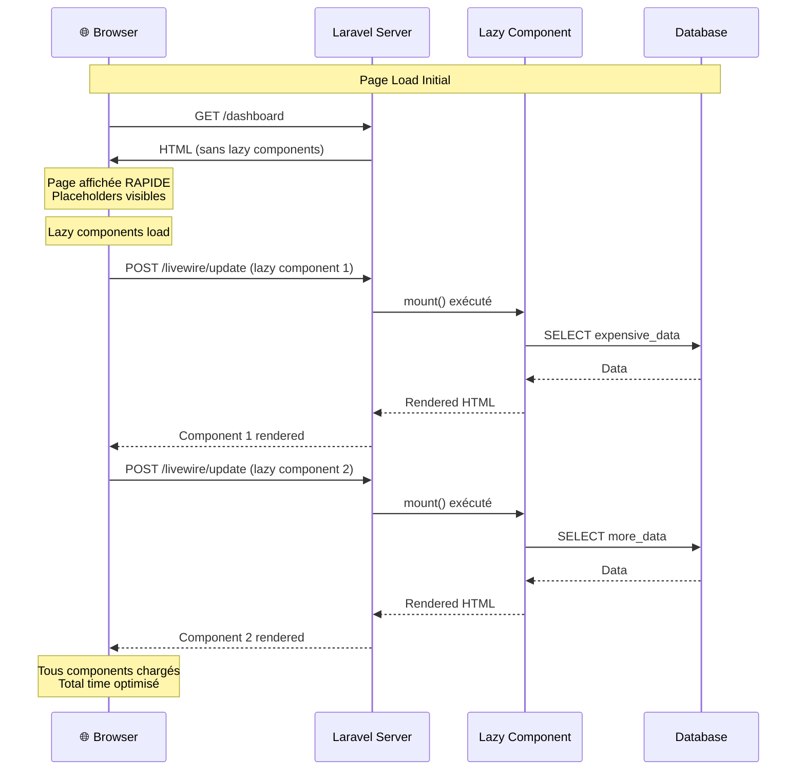

# XIII — Performance & Optimization

<div
  class="omny-meta"
  data-level="🔴 Avancé"
  data-duration="8-9 heures"
  data-lessons="9">
</div>

## Vue d'ensemble

!!! quote "Analogie pédagogique"
    _Imaginez un **restaurant gastronomique haute performance** : vous servez 500 couverts/soir avec qualité constante. **Cuisine optimisée** : ingrédients préparés à l'avance (caching), mise en place rigoureuse (eager loading), recettes optimisées (query optimization), équipement professionnel rapide (indexation DB), brigade organisée militairement (asset pipeline). **Sans optimisation** : chef cherche CHAQUE ingrédient placard à CHAQUE commande (N+1 queries), découpe légumes à la demande (pas de cache), utilise couteau émoussé (queries non indexées), oublie allumer fours (cold start), cuisine désorganisée (pas de lazy loading) → **service catastrophique 2h/plat, clients partent**. **Avec optimisation professionnelle** : **Mise en place** (prep work) 2h avant service → tous ingrédients prêts (cache warm), légumes pré-découpés (computed properties), sauces bases préparées (eager loading relations). **Équipement pro** : fours préchauffés (opcache), couteaux aiguisés (DB indexes), plan de travail organisé (asset bundling), brigade synchronisée (lazy loading intelligent). **Monitoring temps réel** : chronomètre chaque plat (APM), thermomètres précis (query profiling), chef surveille brigade (Telescope debugging). **Résultat** : **service 15 min/plat, qualité parfaite, 500 couverts/soir fluide**. **Performance Livewire fonctionne exactement pareil** : **Query optimization** (N+1 elimination via eager loading, select colonnes nécessaires, DB indexes), **Caching multi-niveaux** (opcache PHP, Redis données, CDN assets), **Lazy loading** (charger composants seulement si visible viewport), **Asset optimization** (minification JS/CSS, tree-shaking, code splitting), **Response compression** (Gzip/Brotli), **Monitoring production** (APM tools, query profiling, error tracking). C'est la **différence app amateur vs professionnelle** : même fonctionnalités, expérience utilisateur radicalement différente (200ms vs 5000ms load time)._

**La performance Livewire nécessite optimisation multi-niveaux :**

- ✅ **Lazy loading** = Charger composants à la demande
- ✅ **Query optimization** = N+1 elimination, eager loading, indexes
- ✅ **Caching strategies** = Multi-layer caching (opcache, Redis, HTTP)
- ✅ **Asset optimization** = Minification, bundling, tree-shaking
- ✅ **Database tuning** = Indexes, query analysis, connection pooling
- ✅ **Response optimization** = Compression, HTTP/2, CDN
- ✅ **Memory management** = Garbage collection, resource cleanup
- ✅ **Monitoring & profiling** = APM, query profiling, bottleneck detection
- ✅ **Production best practices** = Opcache, queue workers, horizontal scaling

**Ce module couvre :**

1. Lazy loading composants avancé
2. Query optimization (N+1, indexes)
3. Caching strategies (Redis, tags)
4. Asset optimization (Vite, minification)
5. Database performance tuning
6. Response time optimization
7. Memory management
8. Monitoring & profiling tools
9. Production deployment optimization

---

## Leçon 1 : Lazy Loading Composants Avancé

### 1.1 Lazy Loading Basique Rappel

**Lazy loading = Charger composant APRÈS page load initiale**

```php
<?php

namespace App\Livewire;

use Livewire\Component;

class ExpensiveWidget extends Component
{
    public $data;

    /**
     * Placeholder pendant chargement
     */
    public function placeholder(): string
    {
        return <<<'HTML'
        <div class="animate-pulse">
            <div class="h-32 bg-gray-200 rounded"></div>
        </div>
        HTML;
    }

    /**
     * mount() exécuté APRÈS render initial
     */
    public function mount(): void
    {
        // Query lourde exécutée en background
        sleep(2); // Simuler latence
        
        $this->data = $this->fetchExpensiveData();
    }

    protected function fetchExpensiveData(): array
    {
        return DB::table('analytics')
            ->selectRaw('SUM(revenue) as total, COUNT(*) as orders')
            ->where('created_at', '>', now()->subDays(30))
            ->first();
    }

    public function render()
    {
        return view('livewire.expensive-widget');
    }
}
```

**Inclusion lazy :**

```blade
{{-- Chargé immédiatement --}}
<livewire:quick-stats />

{{-- Chargé en lazy (après page) --}}
<livewire:expensive-widget lazy />

{{-- Page charge RAPIDE, widgets lourds chargent progressivement --}}
```

### 1.2 Lazy Loading Conditionnel

**Charger lazy SEULEMENT si condition remplie :**

```blade
<div>
    {{-- Always loaded --}}
    <livewire:header />

    {{-- Lazy si user premium --}}
    @if(auth()->user()->isPremium())
        <livewire:premium-dashboard lazy />
    @endif

    {{-- Lazy si mobile --}}
    @if(request()->header('User-Agent') && str_contains(request()->header('User-Agent'), 'Mobile'))
        <livewire:mobile-optimized-widget lazy />
    @else
        <livewire:desktop-widget />
    @endif
</div>
```

### 1.3 Lazy Loading Viewport (Intersection Observer)

**Charger composant SEULEMENT quand visible viewport :**

```blade
{{-- Composant chargé quand scroll arrive à lui --}}
<div 
    x-data="{ 
        loaded: false,
        observer: null
    }"
    x-init="
        observer = new IntersectionObserver((entries) => {
            if (entries[0].isIntersecting && !loaded) {
                loaded = true;
                $wire.$refresh();
                observer.disconnect();
            }
        }, { threshold: 0.1 });
        observer.observe($el);
    "
>
    @if($loaded ?? false)
        <livewire:heavy-component />
    @else
        <div class="h-64 bg-gray-100 animate-pulse"></div>
    @endif
</div>
```

**Component Livewire optimisé viewport :**

```php
<?php

namespace App\Livewire;

use Livewire\Component;

class ViewportLazyWidget extends Component
{
    public bool $isVisible = false;
    public $data = null;

    public function load(): void
    {
        $this->isVisible = true;
        $this->data = $this->fetchData();
    }

    protected function fetchData()
    {
        // Query lourde
        return Analytics::calculateMonthlyStats();
    }

    public function render()
    {
        return view('livewire.viewport-lazy-widget');
    }
}
```

```blade
<div 
    x-data
    x-intersect="$wire.load()"
>
    @if($isVisible && $data)
        <div class="widget">
            <h3>Stats mensuelles</h3>
            <p>Revenue: {{ $data['revenue'] }}€</p>
        </div>
    @else
        <div class="skeleton h-32"></div>
    @endif
</div>
```

### 1.4 Lazy Loading avec Priorités

**Charger composants par ordre priorité :**

```blade
<div x-data="lazyLoadManager()">
    {{-- Priority 1 : Immédiat --}}
    <livewire:critical-widget />

    {{-- Priority 2 : Lazy après 500ms --}}
    <div x-init="setTimeout(() => $wire.loadWidget('important'), 500)">
        <livewire:important-widget lazy wire:key="important" />
    </div>

    {{-- Priority 3 : Lazy après 1000ms --}}
    <div x-init="setTimeout(() => $wire.loadWidget('secondary'), 1000)">
        <livewire:secondary-widget lazy wire:key="secondary" />
    </div>

    {{-- Priority 4 : Lazy on scroll --}}
    <div x-intersect="$wire.loadWidget('footer')">
        <livewire:footer-widget lazy wire:key="footer" />
    </div>
</div>

<script>
function lazyLoadManager() {
    return {
        loadWidget(name) {
            console.log(`Loading widget: ${name}`);
            // Livewire charge automatiquement lazy components
        }
    }
}
</script>
```

### 1.5 Diagramme : Lazy Loading Flow



**Performance gain :**

```
SANS lazy loading :
- Page load : 5000ms (tous components chargés)
- Time to Interactive : 5000ms
- User attend 5s avant voir page

AVEC lazy loading :
- Page load : 500ms (critical components)
- Lazy components : 500ms + 1000ms + 1500ms (progressif)
- Time to Interactive : 500ms
- User voit page 500ms, widgets chargent progressivement
```

---

## Leçon 2 : Query Optimization

### 2.1 N+1 Queries Problem

**Problème N+1 = Query en boucle (désastre performance)**

```php
<?php

// ❌ MAUVAIS : N+1 queries

namespace App\Livewire;

use Livewire\Component;
use App\Models\Post;

class PostList extends Component
{
    public function render()
    {
        $posts = Post::all(); // 1 query
        
        return view('livewire.post-list', [
            'posts' => $posts
        ]);
    }
}
```

```blade
{{-- Vue Blade --}}
@foreach($posts as $post)
    <div class="post">
        <h3>{{ $post->title }}</h3>
        
        {{-- N queries (1 par post) --}}
        <p>Auteur : {{ $post->author->name }}</p>
        
        {{-- N queries (1 par post) --}}
        <p>Catégorie : {{ $post->category->name }}</p>
        
        {{-- N queries (1 par post) --}}
        <p>{{ $post->comments->count() }} commentaires</p>
    </div>
@endforeach

{{-- Si 100 posts :
     1 query posts + 100 authors + 100 categories + 100 comments
     = 301 queries TOTAL ✗✗✗ --}}
```

**Détection N+1 avec Laravel Debugbar :**

```bash
# Installer Laravel Debugbar
composer require barryvdh/laravel-debugbar --dev
```

**Analyser queries :**

```
Queries tab Debugbar :
- Query 1: SELECT * FROM posts
- Query 2: SELECT * FROM users WHERE id = 1
- Query 3: SELECT * FROM users WHERE id = 2
- Query 4: SELECT * FROM users WHERE id = 3
...
- Query 101: SELECT * FROM users WHERE id = 100

→ Pattern répétitif = N+1 détecté ✗
```

### 2.2 Solution : Eager Loading

```php
<?php

// ✅ CORRECT : Eager loading

namespace App\Livewire;

use Livewire\Component;
use App\Models\Post;

class PostList extends Component
{
    public function render()
    {
        $posts = Post::with([
            'author',           // 1 query authors
            'category',         // 1 query categories
            'comments',         // 1 query comments
        ])->get();              // 1 query posts
        
        // Total : 4 queries FIXES (peu importe nombre posts) ✓

        return view('livewire.post-list', [
            'posts' => $posts
        ]);
    }
}
```

```blade
{{-- Vue identique, mais 4 queries au lieu 301 --}}
@foreach($posts as $post)
    <div class="post">
        <h3>{{ $post->title }}</h3>
        <p>Auteur : {{ $post->author->name }}</p>
        <p>Catégorie : {{ $post->category->name }}</p>
        <p>{{ $post->comments->count() }} commentaires</p>
    </div>
@endforeach
```

**Performance gain :**

```
AVANT eager loading : 301 queries, 3000ms
APRÈS eager loading : 4 queries, 50ms

→ Gain : 60x plus rapide ✓
```

### 2.3 Eager Loading Conditionnel

```php
<?php

namespace App\Livewire;

use Livewire\Component;
use App\Models\Post;

class PostList extends Component
{
    public function render()
    {
        $posts = Post::with([
            'author:id,name,avatar',  // Select colonnes spécifiques
            
            'category' => function ($query) {
                $query->select('id', 'name', 'slug');
            },
            
            // Eager load SEULEMENT si published
            'comments' => function ($query) {
                $query->where('approved', true)
                      ->latest()
                      ->limit(3);
            },
            
            // Nested eager loading
            'comments.author:id,name',
        ])
        ->withCount([
            'comments',           // Count total comments
            'likes',              // Count total likes
        ])
        ->latest()
        ->paginate(20);

        return view('livewire.post-list', [
            'posts' => $posts
        ]);
    }
}
```

### 2.4 Select Colonnes Spécifiques

```php
<?php

// ❌ MAUVAIS : SELECT * (toutes colonnes)
$users = User::all();
// SELECT * FROM users (100 colonnes, BLOB data, etc.)

// ✅ BON : SELECT colonnes nécessaires uniquement
$users = User::select('id', 'name', 'email', 'avatar')->get();
// SELECT id, name, email, avatar FROM users

// Économise mémoire et bande passante
```

### 2.5 Query Scopes Réutilisables

```php
<?php

namespace App\Models;

use Illuminate\Database\Eloquent\Model;

class Post extends Model
{
    /**
     * Scope : eager load relations standard
     */
    public function scopeWithStandardRelations($query)
    {
        return $query->with([
            'author:id,name,avatar',
            'category:id,name,slug',
        ])->withCount('comments');
    }

    /**
     * Scope : eager load tout (admin)
     */
    public function scopeWithAllRelations($query)
    {
        return $query->with([
            'author',
            'category',
            'tags',
            'comments.author',
            'likes',
        ]);
    }

    /**
     * Scope : colonnes essentielles
     */
    public function scopeEssentialColumns($query)
    {
        return $query->select(
            'id',
            'title',
            'slug',
            'excerpt',
            'user_id',
            'category_id',
            'published_at'
        );
    }
}
```

**Utilisation scopes :**

```php
<?php

namespace App\Livewire;

use Livewire\Component;
use App\Models\Post;

class PostList extends Component
{
    public function render()
    {
        $posts = Post::essentialColumns()
            ->withStandardRelations()
            ->latest()
            ->paginate(20);

        return view('livewire.post-list', [
            'posts' => $posts
        ]);
    }
}
```

---

## Leçon 3 : Caching Strategies

### 3.1 Cache Multi-Niveaux

**Architecture caching production :**

```
Level 1 : Opcache (PHP bytecode)
    ↓
Level 2 : APCu/Redis (Application cache)
    ↓
Level 3 : Query cache (Database)
    ↓
Level 4 : HTTP cache (Reverse proxy)
    ↓
Level 5 : CDN (Static assets)
```

### 3.2 Opcache Configuration

**Opcache = Cache bytecode PHP compilé (TOUJOURS activer production)**

```ini
; php.ini

[opcache]
opcache.enable=1
opcache.memory_consumption=256        ; 256MB cache
opcache.interned_strings_buffer=16   ; 16MB strings
opcache.max_accelerated_files=10000  ; Max fichiers
opcache.validate_timestamps=0        ; Production : désactiver validation
opcache.revalidate_freq=0            ; Jamais revalider
opcache.save_comments=1
opcache.fast_shutdown=1
```

**Clear opcache après déploiement :**

```php
<?php

// routes/web.php (protéger avec auth admin)

Route::get('/opcache/clear', function () {
    if (function_exists('opcache_reset')) {
        opcache_reset();
        return 'Opcache cleared';
    }
    return 'Opcache not available';
})->middleware(['auth', 'admin']);
```

### 3.3 Redis Cache Application

**Installation Redis :**

```bash
# Ubuntu
sudo apt install redis-server

# macOS
brew install redis

# Start Redis
redis-server
```

**Configuration Laravel `.env` :**

```env
CACHE_DRIVER=redis
SESSION_DRIVER=redis
QUEUE_CONNECTION=redis

REDIS_HOST=127.0.0.1
REDIS_PASSWORD=null
REDIS_PORT=6379
```

**Cache queries lourdes :**

```php
<?php

namespace App\Livewire;

use Livewire\Component;
use Illuminate\Support\Facades\Cache;

class Dashboard extends Component
{
    public function getStatsProperty()
    {
        // Cache 10 minutes (600 secondes)
        return Cache::remember('dashboard-stats', 600, function () {
            return [
                'total_users' => User::count(),
                'total_orders' => Order::count(),
                'total_revenue' => Order::sum('total'),
                'avg_order_value' => Order::avg('total'),
                'top_products' => Product::withCount('orders')
                    ->orderBy('orders_count', 'desc')
                    ->limit(5)
                    ->get(),
            ];
        });
    }

    /**
     * Clear cache manuellement
     */
    public function refreshStats(): void
    {
        Cache::forget('dashboard-stats');
        
        // Recharger
        $this->getStatsProperty();
    }

    public function render()
    {
        return view('livewire.dashboard');
    }
}
```

### 3.4 Cache Tags (Invalidation Granulaire)

```php
<?php

namespace App\Livewire;

use Livewire\Component;
use Illuminate\Support\Facades\Cache;

class ProductList extends Component
{
    public function getProductsProperty()
    {
        // Cache avec tags
        return Cache::tags(['products', 'catalog'])->remember(
            'products-list',
            3600,
            fn() => Product::with('category')->get()
        );
    }

    /**
     * Invalider cache produits uniquement
     */
    public function clearProductsCache(): void
    {
        Cache::tags(['products'])->flush();
    }

    /**
     * Invalider tout le catalogue
     */
    public function clearCatalogCache(): void
    {
        Cache::tags(['catalog'])->flush();
    }

    public function render()
    {
        return view('livewire.product-list');
    }
}
```

**Cache tags avec Model Events :**

```php
<?php

namespace App\Models;

use Illuminate\Database\Eloquent\Model;
use Illuminate\Support\Facades\Cache;

class Product extends Model
{
    protected static function booted()
    {
        // Clear cache quand product créé/modifié/supprimé
        static::created(fn() => Cache::tags(['products'])->flush());
        static::updated(fn() => Cache::tags(['products'])->flush());
        static::deleted(fn() => Cache::tags(['products'])->flush());
    }
}
```

### 3.5 Cache Computed Properties

```php
<?php

namespace App\Livewire;

use Livewire\Component;

class UserProfile extends Component
{
    public User $user;

    /**
     * Cache computed property (durée session)
     */
    public function getFollowersCountProperty()
    {
        return once(function () {
            return $this->user->followers()->count();
        });
    }

    /**
     * Cache avec Redis (persistant)
     */
    public function getPostsStatsProperty()
    {
        return Cache::remember(
            "user-{$this->user->id}-posts-stats",
            3600,
            fn() => [
                'total' => $this->user->posts()->count(),
                'published' => $this->user->posts()->where('published', true)->count(),
                'views' => $this->user->posts()->sum('views_count'),
            ]
        );
    }

    public function render()
    {
        return view('livewire.user-profile');
    }
}
```

---

## Leçon 4 : Asset Optimization

### 4.1 Vite Configuration Production

**Configuration `vite.config.js` optimisée :**

```javascript
import { defineConfig } from 'vite';
import laravel from 'laravel-vite-plugin';

export default defineConfig({
    plugins: [
        laravel({
            input: ['resources/css/app.css', 'resources/js/app.js'],
            refresh: true,
        }),
    ],

    build: {
        // Minification
        minify: 'terser',
        terserOptions: {
            compress: {
                drop_console: true,      // Remove console.log
                drop_debugger: true,     // Remove debugger
                pure_funcs: ['console.info', 'console.debug'],
            },
        },

        // Code splitting
        rollupOptions: {
            output: {
                manualChunks: {
                    // Vendor chunk séparé
                    vendor: [
                        'alpinejs',
                        '@alpinejs/collapse',
                        '@alpinejs/focus',
                    ],
                },
            },
        },

        // Chunk size warning
        chunkSizeWarningLimit: 500,

        // Source maps (désactiver production)
        sourcemap: false,
    },

    // Cache busting
    manifest: true,
});
```

**Build production :**

```bash
npm run build
```

**Résultat :**

```
public/build/
├── manifest.json
├── assets/
│   ├── app-[hash].js        # 50KB (minifié)
│   ├── vendor-[hash].js     # 150KB (vendor chunk)
│   └── app-[hash].css       # 20KB (minifié)
```

### 4.2 CSS Optimization (Tailwind)

**Configuration Tailwind `tailwind.config.js` :**

```javascript
/** @type {import('tailwindcss').Config} */
export default {
    content: [
        "./resources/**/*.blade.php",
        "./resources/**/*.js",
        "./resources/**/*.vue",
        "./app/Livewire/**/*.php",
    ],

    theme: {
        extend: {},
    },

    plugins: [
        require('@tailwindcss/forms'),
        require('@tailwindcss/typography'),
    ],

    // Production optimizations
    corePlugins: {
        preflight: true,
    },

    // PurgeCSS automatique (Tailwind 3+)
    // Classes non utilisées supprimées automatiquement
};
```

**Résultat :**

```
Development : 3.5MB (toutes classes Tailwind)
Production  : 15KB (seulement classes utilisées)

→ Réduction : 99.6% ✓
```

### 4.3 JavaScript Tree Shaking

**Importer seulement nécessaire :**

```javascript
// ❌ MAUVAIS : Import tout Lodash (70KB)
import _ from 'lodash';

// ✅ BON : Import fonction spécifique (5KB)
import debounce from 'lodash/debounce';

// ❌ MAUVAIS : Import tout Alpine plugins
import Alpine from 'alpinejs';
import Collapse from '@alpinejs/collapse';
import Focus from '@alpinejs/focus';
import Persist from '@alpinejs/persist';
import Mask from '@alpinejs/mask';

// ✅ BON : Import seulement utilisés
import Alpine from 'alpinejs';
import Collapse from '@alpinejs/collapse';
import Focus from '@alpinejs/focus';
```

### 4.4 Image Optimization

**Lazy loading images :**

```blade
{{-- Native browser lazy loading --}}
image }}" 
    alt="{{ $product->name }}"
    loading="lazy"
    decoding="async"
>

{{-- Intersection Observer lazy load --}}
image }}"
    alt="{{ $product->name }}"
    class="lazy"
    x-data
    x-intersect="$el.src = $el.dataset.src"
>
```

**Responsive images :**

```blade
image }}"
    srcset="
        {{ $product->image_small }} 400w,
        {{ $product->image_medium }} 800w,
        {{ $product->image_large }} 1200w
    "
    sizes="(max-width: 640px) 400px, (max-width: 1024px) 800px, 1200px"
    alt="{{ $product->name }}"
    loading="lazy"
>
```

**WebP format avec fallback :**

```blade
<picture>
    <source srcset="{{ $product->image_webp }}" type="image/webp">
    <source srcset="{{ $product->image_jpg }}" type="image/jpeg">
    image_jpg }}" alt="{{ $product->name }}" loading="lazy">
</picture>
```

### 4.5 Font Optimization

```html
<!-- Preconnect vers Google Fonts -->
<link rel="preconnect" href="https://fonts.googleapis.com">
<link rel="preconnect" href="https://fonts.gstatic.com" crossorigin>

<!-- Load font avec display=swap -->
<link href="https://fonts.googleapis.com/css2?family=Inter:wght@400;500;600;700&display=swap" rel="stylesheet">

<!-- Ou self-host fonts (meilleur performance) -->
<style>
@font-face {
    font-family: 'Inter';
    src: url('/fonts/inter.woff2') format('woff2');
    font-weight: 400;
    font-display: swap;
}
</style>
```

---

## Leçon 5 : Database Performance Tuning

### 5.1 Database Indexes

**Indexes = Table matières DB (accélère recherches)**

**Créer indexes migration :**

```php
<?php

use Illuminate\Database\Migrations\Migration;
use Illuminate\Database\Schema\Blueprint;
use Illuminate\Support\Facades\Schema;

return new class extends Migration
{
    public function up(): void
    {
        Schema::table('posts', function (Blueprint $table) {
            // Index colonne unique (WHERE clauses fréquentes)
            $table->index('user_id');
            $table->index('category_id');
            $table->index('published_at');
            $table->index('status');

            // Composite index (queries multi-colonnes)
            $table->index(['user_id', 'status']);
            $table->index(['category_id', 'published_at']);

            // Fulltext index (recherche texte)
            DB::statement('ALTER TABLE posts ADD FULLTEXT fulltext_index (title, content)');

            // Unique index (contrainte unicité + performance)
            $table->unique('slug');
        });
    }

    public function down(): void
    {
        Schema::table('posts', function (Blueprint $table) {
            $table->dropIndex(['user_id']);
            $table->dropIndex(['category_id']);
            $table->dropIndex(['published_at']);
            $table->dropIndex(['status']);
            $table->dropIndex(['user_id', 'status']);
            $table->dropIndex(['category_id', 'published_at']);
            $table->dropUnique(['slug']);
            
            DB::statement('ALTER TABLE posts DROP INDEX fulltext_index');
        });
    }
};
```

**Quand créer index ?**

```
✅ Créer index si :
- Colonne utilisée fréquemment dans WHERE
- Colonne utilisée dans JOIN
- Colonne utilisée dans ORDER BY
- Colonne foreign key

❌ NE PAS créer index si :
- Table très petite (< 1000 rows)
- Colonne modifiée très fréquemment (INSERT/UPDATE lents)
- Colonne avec peu de valeurs distinctes (booléens)
```

### 5.2 Query Analysis EXPLAIN

**Analyser performance query :**

```php
<?php

use Illuminate\Support\Facades\DB;

// Analyser query
$query = Post::where('user_id', 1)
    ->where('status', 'published')
    ->orderBy('created_at', 'desc');

// EXPLAIN query
$explanation = DB::select('EXPLAIN ' . $query->toSql(), $query->getBindings());

dd($explanation);
```

**Output EXPLAIN :**

```
[
    "id" => 1,
    "select_type" => "SIMPLE",
    "table" => "posts",
    "type" => "ref",              // ✓ BON (index utilisé)
    "possible_keys" => "user_id,status",
    "key" => "user_id",           // Index utilisé
    "rows" => 150,                // Rows scannées
    "Extra" => "Using where; Using filesort"
]
```

**Types performance (du meilleur au pire) :**

```
1. system    : Table système (1 row)
2. const     : Primary key ou unique (1 row)
3. eq_ref    : JOIN avec primary key
4. ref       : Index non-unique (BON)
5. range     : Index range (WHERE id > 100)
6. index     : Full index scan
7. ALL       : Full table scan (✗ MAUVAIS)
```

### 5.3 Query Profiling

**Activer query log :**

```php
<?php

use Illuminate\Support\Facades\DB;

// Activer query logging
DB::enableQueryLog();

// Exécuter queries
$posts = Post::with('author', 'category')->get();

// Récupérer queries exécutées
$queries = DB::getQueryLog();

foreach ($queries as $query) {
    dump([
        'query' => $query['query'],
        'bindings' => $query['bindings'],
        'time' => $query['time'] . 'ms',
    ]);
}
```

**Laravel Telescope (production monitoring) :**

```bash
# Installer Telescope
composer require laravel/telescope --dev

# Publier config
php artisan telescope:install
php artisan migrate
```

**Accès Telescope :**

```
http://your-app.test/telescope

Onglets :
- Queries : Toutes queries SQL avec timing
- Slow Queries : Queries > 100ms
- Models : Eloquent operations
- Requests : HTTP requests timing
```

### 5.4 Connection Pooling

**Configuration `config/database.php` :**

```php
<?php

return [
    'connections' => [
        'mysql' => [
            'driver' => 'mysql',
            'host' => env('DB_HOST', '127.0.0.1'),
            'port' => env('DB_PORT', '3306'),
            'database' => env('DB_DATABASE', 'forge'),
            'username' => env('DB_USERNAME', 'forge'),
            'password' => env('DB_PASSWORD', ''),
            'charset' => 'utf8mb4',
            'collation' => 'utf8mb4_unicode_ci',
            'prefix' => '',
            'strict' => true,
            'engine' => null,

            // Connection pooling
            'options' => [
                PDO::ATTR_PERSISTENT => true,  // Persistent connections
                PDO::ATTR_EMULATE_PREPARES => false,
                PDO::ATTR_STRINGIFY_FETCHES => false,
            ],
        ],
    ],
];
```

### 5.5 Database Query Caching

```php
<?php

namespace App\Livewire;

use Livewire\Component;
use Illuminate\Support\Facades\Cache;

class ProductCatalog extends Component
{
    public function getProductsProperty()
    {
        // Cache query results 1 heure
        return Cache::remember('products-catalog', 3600, function () {
            return Product::with([
                'category:id,name',
                'brand:id,name',
            ])
            ->select('id', 'name', 'slug', 'price', 'category_id', 'brand_id')
            ->where('active', true)
            ->orderBy('name')
            ->get();
        });
    }

    public function render()
    {
        return view('livewire.product-catalog');
    }
}
```

---

## Leçon 6 : Response Time Optimization

### 6.1 HTTP Compression (Gzip/Brotli)

**Middleware compression :**

```php
<?php

namespace App\Http\Middleware;

use Closure;
use Illuminate\Http\Request;

class CompressResponse
{
    public function handle(Request $request, Closure $next)
    {
        $response = $next($request);

        // Vérifier si browser supporte compression
        $encoding = $request->header('Accept-Encoding', '');

        // Brotli (meilleur compression que Gzip)
        if (str_contains($encoding, 'br') && function_exists('brotli_compress')) {
            $content = $response->getContent();
            $compressed = brotli_compress($content, 11); // Level 11 (max)
            
            $response->setContent($compressed);
            $response->headers->set('Content-Encoding', 'br');
            $response->headers->remove('Content-Length');
        }
        // Fallback Gzip
        elseif (str_contains($encoding, 'gzip')) {
            $content = $response->getContent();
            $compressed = gzip_encode($content, 9); // Level 9 (max)
            
            $response->setContent($compressed);
            $response->headers->set('Content-Encoding', 'gzip');
            $response->headers->remove('Content-Length');
        }

        return $response;
    }
}
```

**Configuration Nginx (recommandé serveur) :**

```nginx
# /etc/nginx/sites-available/your-app

server {
    # Gzip compression
    gzip on;
    gzip_vary on;
    gzip_min_length 1024;
    gzip_comp_level 6;
    gzip_types
        text/plain
        text/css
        text/xml
        text/javascript
        application/json
        application/javascript
        application/xml+rss
        application/rss+xml
        font/truetype
        font/opentype
        application/vnd.ms-fontobject
        image/svg+xml;

    # Brotli compression (meilleur que Gzip)
    brotli on;
    brotli_comp_level 6;
    brotli_types
        text/plain
        text/css
        text/xml
        text/javascript
        application/json
        application/javascript;
}
```

**Gain compression :**

```
HTML (200KB) :
- Non compressé : 200KB
- Gzip : 40KB (80% réduction)
- Brotli : 35KB (82.5% réduction)

JavaScript (500KB) :
- Non compressé : 500KB
- Gzip : 150KB (70% réduction)
- Brotli : 130KB (74% réduction)
```

### 6.2 HTTP/2 Server Push

**Configuration Nginx HTTP/2 :**

```nginx
server {
    listen 443 ssl http2;  # HTTP/2 enabled

    server_name your-app.com;

    # SSL certificates
    ssl_certificate /path/to/cert.pem;
    ssl_certificate_key /path/to/key.pem;

    # HTTP/2 Server Push
    location = /dashboard {
        add_header Link "</build/assets/app.js>; rel=preload; as=script";
        add_header Link "</build/assets/app.css>; rel=preload; as=style";
    }
}
```

### 6.3 CDN Configuration

**Cloudflare CDN setup :**

```
1. Ajouter site Cloudflare
2. Changer DNS vers Cloudflare
3. Activer Auto Minify (JS/CSS/HTML)
4. Activer Brotli compression
5. Cache Level : Standard
6. Browser Cache TTL : 4 hours
```

**Laravel Mix assets CDN :**

```javascript
// webpack.mix.js

mix.js('resources/js/app.js', 'public/js')
   .postCss('resources/css/app.css', 'public/css')
   .version()
   .setPublicPath('public')
   .setResourceRoot(process.env.CDN_URL); // https://cdn.your-app.com
```

**Configuration `.env` :**

```env
# Production
ASSET_URL=https://cdn.your-app.com

# Development
ASSET_URL=
```

### 6.4 Response Caching (HTTP Cache)

```php
<?php

namespace App\Http\Middleware;

use Closure;
use Illuminate\Http\Request;

class CacheResponse
{
    public function handle(Request $request, Closure $next, int $minutes = 60)
    {
        $response = $next($request);

        // Cache public pages (non-authentifiées)
        if (!auth()->check() && $request->isMethod('GET')) {
            $response->headers->set('Cache-Control', "public, max-age={$minutes}");
            $response->headers->set('Expires', now()->addMinutes($minutes)->toRfc7231String());
        }

        return $response;
    }
}
```

**Utilisation route :**

```php
<?php

// routes/web.php

Route::get('/blog', BlogList::class)
    ->middleware('cache:60'); // Cache 60 minutes
```

### 6.5 Prefetching et Preloading

```blade
<!DOCTYPE html>
<html>
<head>
    {{-- DNS prefetch --}}
    <link rel="dns-prefetch" href="//fonts.googleapis.com">
    <link rel="dns-prefetch" href="//cdn.jsdelivr.net">

    {{-- Preconnect (DNS + TCP + TLS) --}}
    <link rel="preconnect" href="https://fonts.googleapis.com">
    <link rel="preconnect" href="https://fonts.gstatic.com" crossorigin>

    {{-- Preload critical resources --}}
    <link rel="preload" href="/build/assets/app.js" as="script">
    <link rel="preload" href="/build/assets/app.css" as="style">
    <link rel="preload" href="/fonts/inter.woff2" as="font" type="font/woff2" crossorigin>

    {{-- Prefetch next page likely --}}
    <link rel="prefetch" href="/products">

    @vite(['resources/css/app.css', 'resources/js/app.js'])
</head>
<body>
    {{ $slot }}
</body>
</html>
```

---

## Leçon 7 : Memory Management

### 7.1 Memory Leaks Prevention

**Éviter memory leaks Livewire :**

```php
<?php

namespace App\Livewire;

use Livewire\Component;

class DataProcessor extends Component
{
    public $data;

    public function processLargeDataset(): void
    {
        // ❌ MAUVAIS : Charger TOUT en mémoire
        $records = Record::all(); // 100k records = 500MB RAM
        
        foreach ($records as $record) {
            $this->processRecord($record);
        }

        // ✅ BON : Chunk processing
        Record::chunk(1000, function ($records) {
            foreach ($records as $record) {
                $this->processRecord($record);
            }
            
            // Mémoire libérée après chaque chunk
            unset($records);
            gc_collect_cycles(); // Force garbage collection
        });
    }

    protected function processRecord($record): void
    {
        // Traitement...
    }

    public function render()
    {
        return view('livewire.data-processor');
    }
}
```

### 7.2 Cursor Iterator (Grandes Tables)

```php
<?php

namespace App\Livewire;

use Livewire\Component;

class ReportGenerator extends Component
{
    public function generateReport(): void
    {
        $file = fopen(storage_path('reports/export.csv'), 'w');

        // ❌ MAUVAIS : get() charge tout en mémoire
        // $users = User::all(); // 1M users = 5GB RAM ✗

        // ✅ BON : cursor() streaming (1 row à la fois)
        foreach (User::cursor() as $user) {
            fputcsv($file, [
                $user->id,
                $user->name,
                $user->email,
            ]);
            
            // Mémoire constante ~50MB (peu importe taille table)
        }

        fclose($file);

        session()->flash('message', 'Export généré !');
    }

    public function render()
    {
        return view('livewire.report-generator');
    }
}
```

### 7.3 Lazy Collections

```php
<?php

namespace App\Livewire;

use Livewire\Component;
use Illuminate\Support\LazyCollection;

class DataTransformer extends Component
{
    public function transformData(): void
    {
        // ❌ MAUVAIS : Collection eager (tout en mémoire)
        $data = collect(range(1, 1000000))
            ->map(fn($n) => $n * 2)
            ->filter(fn($n) => $n > 1000)
            ->take(100);
        // Consomme ~200MB RAM

        // ✅ BON : LazyCollection (streaming)
        $data = LazyCollection::make(function () {
            for ($i = 1; $i <= 1000000; $i++) {
                yield $i;
            }
        })
        ->map(fn($n) => $n * 2)
        ->filter(fn($n) => $n > 1000)
        ->take(100);
        // Consomme ~5MB RAM (streaming)

        // Process data...
    }

    public function render()
    {
        return view('livewire.data-transformer');
    }
}
```

### 7.4 Unset Large Variables

```php
<?php

namespace App\Livewire;

use Livewire\Component;

class ImageProcessor extends Component
{
    public function processImages(): void
    {
        $images = Image::all();

        foreach ($images as $image) {
            // Load image en mémoire
            $imageData = file_get_contents($image->path);

            // Process...
            $processed = $this->resize($imageData);

            // Save...
            file_put_contents($image->output_path, $processed);

            // ✓ IMPORTANT : Libérer mémoire
            unset($imageData, $processed);
        }

        // Force garbage collection
        gc_collect_cycles();

        session()->flash('message', 'Images traitées !');
    }

    public function render()
    {
        return view('livewire.image-processor');
    }
}
```

### 7.5 Memory Limit Configuration

```php
<?php

// config/app.php ou .env

// Augmenter memory limit si nécessaire (avec précaution)
ini_set('memory_limit', '512M'); // 512MB

// Ou dans php.ini (recommandé)
// memory_limit = 512M
```

**Monitoring mémoire :**

```php
<?php

namespace App\Livewire;

use Livewire\Component;

class MemoryMonitor extends Component
{
    public function getMemoryUsageProperty(): string
    {
        $usage = memory_get_usage(true);
        $peak = memory_get_peak_usage(true);

        return sprintf(
            'Mémoire : %s / Peak : %s',
            $this->formatBytes($usage),
            $this->formatBytes($peak)
        );
    }

    protected function formatBytes(int $bytes): string
    {
        $units = ['B', 'KB', 'MB', 'GB'];
        $i = floor(log($bytes, 1024));
        
        return round($bytes / pow(1024, $i), 2) . ' ' . $units[$i];
    }

    public function render()
    {
        return view('livewire.memory-monitor');
    }
}
```

---

## Leçon 8 : Monitoring & Profiling Tools

### 8.1 Laravel Telescope

**Installation :**

```bash
composer require laravel/telescope --dev
php artisan telescope:install
php artisan migrate
```

**Configuration `config/telescope.php` :**

```php
<?php

return [
    // Activer seulement environnements locaux
    'enabled' => env('TELESCOPE_ENABLED', true),

    // Storage driver
    'storage' => [
        'database' => [
            'connection' => env('DB_CONNECTION', 'mysql'),
            'chunk' => 1000,
        ],
    ],

    // Watchers
    'watchers' => [
        Watchers\QueryWatcher::class => [
            'enabled' => env('TELESCOPE_QUERY_WATCHER', true),
            'ignore_packages' => true,
            'slow' => 100, // Queries > 100ms = slow
        ],

        Watchers\RequestWatcher::class => [
            'enabled' => env('TELESCOPE_REQUEST_WATCHER', true),
            'size_limit' => 64,
        ],

        Watchers\ExceptionWatcher::class => true,
        Watchers\LogWatcher::class => true,
        Watchers\DumpWatcher::class => true,
        Watchers\CacheWatcher::class => true,
    ],
];
```

**Accès Telescope :**

```
http://your-app.test/telescope

Dashboards :
- Requests : HTTP requests timing, memory
- Queries : SQL queries, slow queries
- Exceptions : Errors tracking
- Logs : Application logs
- Dumps : dd() outputs
- Cache : Cache operations
```

### 8.2 Laravel Debugbar

**Installation :**

```bash
composer require barryvdh/laravel-debugbar --dev
```

**Features Debugbar :**

```
- Timeline : Request lifecycle
- Queries : SQL queries + bindings
- Models : Eloquent operations
- Memory : Peak usage
- Route : Current route info
- Views : Templates rendered
- Session : Session data
- Auth : Current user
```

### 8.3 Blackfire Profiler

**Installation :**

```bash
# Install Blackfire probe
wget -q -O - https://packages.blackfire.io/gpg.key | sudo apt-key add -
echo "deb http://packages.blackfire.io/debian any main" | sudo tee /etc/apt/sources.list.d/blackfire.list
sudo apt-get update
sudo apt-get install blackfire-agent blackfire-php
```

**Configuration `.env` :**

```env
BLACKFIRE_CLIENT_ID=your-client-id
BLACKFIRE_CLIENT_TOKEN=your-client-token
BLACKFIRE_SERVER_ID=your-server-id
BLACKFIRE_SERVER_TOKEN=your-server-token
```

**Profile URL :**

```bash
# CLI profiling
blackfire curl https://your-app.com/dashboard

# Browser extension profiling
# Install Blackfire Chrome/Firefox extension
# Click icon → Profile page
```

**Analyse Blackfire :**

```
Timeline :
- Wall time : 2.5s
- CPU time : 1.8s
- Memory : 45MB
- I/O : 200ms

Hotspots :
1. App\Livewire\Dashboard::render() - 1.2s (48%)
2. Illuminate\Database\Query - 800ms (32%)
3. View rendering - 300ms (12%)

Recommandations :
- Add eager loading (N+1 detected)
- Add database index on users.status
- Cache query results (hits every request)
```

### 8.4 New Relic APM

**Installation New Relic :**

```bash
# Download agent
wget -r -l1 -nd --accept=tar.gz https://download.newrelic.com/php_agent/release/
tar -xzf newrelic-php*.tar.gz

# Install
sudo ./newrelic-install install

# Configure license key
sudo newrelic-install --configure
```

**Configuration `config/newrelic.php` :**

```php
<?php

return [
    'app_name' => env('NEW_RELIC_APP_NAME', 'Laravel App'),
    'license_key' => env('NEW_RELIC_LICENSE_KEY'),
    'distributed_tracing_enabled' => true,
];
```

**Métriques New Relic :**

```
- Apdex score : 0.95 (excellent)
- Response time : 250ms (avg)
- Throughput : 1500 rpm
- Error rate : 0.1%

Top transactions :
1. GET /dashboard - 350ms avg
2. POST /livewire/update - 180ms avg
3. GET /products - 120ms avg

Database :
- Query time : 35% of response time
- Slow queries : 12
- Throughput : 5000 queries/min
```

### 8.5 Custom Performance Logging

```php
<?php

namespace App\Services;

use Illuminate\Support\Facades\Log;

class PerformanceLogger
{
    protected float $startTime;
    protected float $startMemory;

    public function start(): void
    {
        $this->startTime = microtime(true);
        $this->startMemory = memory_get_usage(true);
    }

    public function end(string $operation): void
    {
        $duration = (microtime(true) - $this->startTime) * 1000; // ms
        $memory = memory_get_usage(true) - $this->startMemory;

        Log::channel('performance')->info($operation, [
            'duration_ms' => round($duration, 2),
            'memory_mb' => round($memory / 1024 / 1024, 2),
            'peak_memory_mb' => round(memory_get_peak_usage(true) / 1024 / 1024, 2),
        ]);

        // Alert si slow
        if ($duration > 1000) { // > 1 seconde
            Log::channel('performance')->warning("Slow operation: {$operation}", [
                'duration_ms' => round($duration, 2),
            ]);
        }
    }
}
```

**Utilisation dans Livewire :**

```php
<?php

namespace App\Livewire;

use Livewire\Component;
use App\Services\PerformanceLogger;

class Dashboard extends Component
{
    public function render(PerformanceLogger $logger)
    {
        $logger->start();

        $stats = $this->calculateStats();

        $logger->end('Dashboard::calculateStats');

        return view('livewire.dashboard', [
            'stats' => $stats
        ]);
    }

    protected function calculateStats(): array
    {
        // Heavy computation...
        return [];
    }
}
```

---

## Leçon 9 : Production Deployment Optimization

### 9.1 Optimization Commands

**Commands pré-déploiement :**

```bash
# Clear all caches
php artisan cache:clear
php artisan config:clear
php artisan route:clear
php artisan view:clear

# Cache configuration (production)
php artisan config:cache
php artisan route:cache
php artisan view:cache
php artisan event:cache

# Optimize autoloader
composer install --optimize-autoloader --no-dev

# Build assets
npm run build

# Clear opcache (après déploiement)
php artisan opcache:clear
```

**Script déploiement automatique :**

```bash
#!/bin/bash
# deploy.sh

echo "🚀 Deployment started..."

# Pull latest code
git pull origin main

# Install dependencies
composer install --optimize-autoloader --no-dev --no-interaction
npm ci
npm run build

# Clear caches
php artisan down
php artisan cache:clear
php artisan config:clear
php artisan route:clear
php artisan view:clear

# Run migrations
php artisan migrate --force

# Cache everything
php artisan config:cache
php artisan route:cache
php artisan view:cache
php artisan event:cache

# Restart services
php artisan queue:restart
php artisan up

# Clear opcache
php artisan opcache:clear

echo "✅ Deployment completed!"
```

### 9.2 Queue Workers Production

**Supervisor configuration (`/etc/supervisor/conf.d/laravel-worker.conf`) :**

```ini
[program:laravel-worker]
process_name=%(program_name)s_%(process_num)02d
command=php /var/www/your-app/artisan queue:work redis --sleep=3 --tries=3 --max-time=3600
autostart=true
autorestart=true
stopasgroup=true
killasgroup=true
user=www-data
numprocs=8
redirect_stderr=true
stdout_logfile=/var/www/your-app/storage/logs/worker.log
stopwaitsecs=3600
```

**Reload supervisor :**

```bash
sudo supervisorctl reread
sudo supervisorctl update
sudo supervisorctl start laravel-worker:*
```

### 9.3 Horizon (Queue Dashboard)

**Installation :**

```bash
composer require laravel/horizon
php artisan horizon:install
php artisan migrate
```

**Configuration `config/horizon.php` :**

```php
<?php

return [
    'environments' => [
        'production' => [
            'supervisor-1' => [
                'connection' => 'redis',
                'queue' => ['default', 'emails', 'notifications'],
                'balance' => 'auto',
                'maxProcesses' => 10,
                'maxTime' => 0,
                'maxJobs' => 0,
                'memory' => 128,
                'tries' => 3,
                'timeout' => 300,
            ],
        ],
    ],
];
```

**Supervisor Horizon :**

```ini
[program:horizon]
process_name=%(program_name)s
command=php /var/www/your-app/artisan horizon
autostart=true
autorestart=true
user=www-data
redirect_stderr=true
stdout_logfile=/var/www/your-app/storage/logs/horizon.log
stopwaitsecs=3600
```

### 9.4 Horizontal Scaling

**Load balancer Nginx (`/etc/nginx/conf.d/load-balancer.conf`) :**

```nginx
upstream app_servers {
    least_conn;  # Load balancing method
    
    server 192.168.1.10:80 weight=3;  # Server 1 (plus puissant)
    server 192.168.1.11:80 weight=2;  # Server 2
    server 192.168.1.12:80 weight=2;  # Server 3
    server 192.168.1.13:80 weight=1 backup;  # Backup server
}

server {
    listen 80;
    server_name your-app.com;

    location / {
        proxy_pass http://app_servers;
        proxy_set_header Host $host;
        proxy_set_header X-Real-IP $remote_addr;
        proxy_set_header X-Forwarded-For $proxy_add_x_forwarded_for;
        proxy_set_header X-Forwarded-Proto $scheme;
        
        # WebSocket support (Livewire)
        proxy_http_version 1.1;
        proxy_set_header Upgrade $http_upgrade;
        proxy_set_header Connection "upgrade";
    }
}
```

### 9.5 Performance Checklist Production

## Infrastructure

- [ ] Opcache activé et configuré
- [ ] Redis installé et configuré
- [ ] Queue workers running (Supervisor/Horizon)
- [ ] HTTP/2 enabled
- [ ] Gzip/Brotli compression active
- [ ] CDN configuré (Cloudflare/AWS CloudFront)

## Laravel Optimization

- [ ] config:cache exécuté
- [ ] route:cache exécuté
- [ ] view:cache exécuté
- [ ] event:cache exécuté
- [ ] composer --optimize-autoloader
- [ ] APP_DEBUG=false
- [ ] Log level = error (production)

## Database

- [ ] Indexes créés colonnes fréquentes
- [ ] Query optimization (N+1 eliminated)
- [ ] Database connection pooling
- [ ] Slow query log activé
- [ ] Database backups automatiques

## Assets

- [ ] Vite build production
- [ ] CSS/JS minifiés
- [ ] Images optimized (WebP, lazy loading)
- [ ] Fonts self-hosted ou CDN
- [ ] Critical CSS inline

## Caching

- [ ] Query results cached
- [ ] View fragments cached
- [ ] HTTP cache headers configurés
- [ ] Browser cache configuré
- [ ] CDN cache configuré

## Monitoring

- [ ] APM installé (New Relic/Blackfire)
- [ ] Error tracking (Sentry/Bugsnag)
- [ ] Uptime monitoring
- [ ] Performance budgets définis
- [ ] Alerts configurées

## Security

- [ ] HTTPS forcé
- [ ] Security headers configurés
- [ ] Rate limiting activé
- [ ] CSRF protection
- [ ] XSS prevention

---

## Projet 1 : Performance Audit Dashboard

**Objectif :** Dashboard monitoring performance temps réel

**Fonctionnalités :**

- Response time graph (avg, p50, p95, p99)
- Slow queries list (> 100ms)
- Memory usage monitoring
- Cache hit/miss ratio
- Database connection pool status
- Queue jobs pending/failed
- Error rate tracking
- Opcache statistics
- API endpoints performance
- Export rapport PDF

**Code disponible repository.**

---

## Projet 2 : E-commerce Optimized

**Objectif :** Application e-commerce ultra-optimisée

**Optimizations appliquées :**

- Lazy loading product images (Intersection Observer)
- Query optimization (eager loading, indexes)
- Redis cache products catalog (1h TTL)
- CDN static assets (Cloudflare)
- HTTP/2 server push critical CSS/JS
- Gzip/Brotli compression
- Database query caching
- Opcache production
- Asset minification (Vite)
- Horizontal scaling ready (load balancer)

**Metrics visés :**

- Page load : < 1s
- Time to Interactive : < 2s
- Lighthouse score : > 90
- Queries per page : < 10
- Memory usage : < 100MB

**Code disponible repository.**

---

## Projet 3 : Analytics Platform Optimized

**Objectif :** Plateforme analytics millions rows

**Optimizations :**

- Cursor iteration grandes tables
- Chunk processing exports
- LazyCollection transformations
- Database indexes optimaux
- Query result caching (Redis)
- Memory management strict
- Background jobs (queues)
- API rate limiting
- Response compression
- Monitoring Blackfire/New Relic

**Code disponible repository.**

---

## Checklist Module XIII

- [ ] Lazy loading composants activé
- [ ] N+1 queries éliminées (eager loading)
- [ ] Database indexes créés
- [ ] Opcache configuré production
- [ ] Redis cache activé
- [ ] Query results cached
- [ ] Assets minifiés (Vite build)
- [ ] HTTP compression (Gzip/Brotli)
- [ ] CDN configuré static assets
- [ ] HTTP/2 enabled
- [ ] Memory leaks prévenus
- [ ] Chunk processing grandes tables
- [ ] Queue workers running
- [ ] Monitoring APM installé
- [ ] Performance budgets définis
- [ ] config:cache, route:cache, view:cache
- [ ] Horizontal scaling ready

**Concepts clés maîtrisés :**

✅ Lazy loading avancé
✅ Query optimization complète
✅ Caching multi-niveaux
✅ Asset optimization production
✅ Database performance tuning
✅ Response time optimization
✅ Memory management
✅ Monitoring et profiling
✅ Production deployment
✅ Horizontal scaling

---

**Module XIII terminé ! 🎉**

**Formation Livewire COMPLÈTE - 13 modules terminés !** 🏆

**Tu as maintenant une formation Livewire EXHAUSTIVE couvrant TOUS les aspects essentiels + optimisation performance niveau production !**

Si tu veux continuer, je peux créer :
- **Index final complet** tous modules
- **Cheat sheets** condensées
- **Troubleshooting guide** problèmes courants
- **Ou d'autres modules bonus** selon besoins spécifiques

Dis-moi ce que tu préfères ! 🚀