# II — Proprs & Data Binding

<div
  class="omny-meta"
  data-level="🟡 Intermédiaire"
  data-duration="5-6 heures"
  data-lessons="9">
</div>

## Vue d'ensemble

!!! quote "Analogie pédagogique"
    _Imaginez un **tableau blanc magnétique intelligent** dans une salle de réunion : vous écrivez un chiffre (propriété Livewire), et instantanément ce chiffre apparaît sur tous les écrans de la salle (vues synchronisées). Quelqu'un modifie le chiffre depuis un écran tactile distant (`wire:model`), le tableau blanc se met à jour automatiquement, puis tous les autres écrans reflètent le changement. **C'est le data binding bidirectionnel** : modification côté serveur (PHP) → mise à jour vue (HTML), modification côté client (input) → mise à jour serveur (PHP). Pas de `addEventListener`, pas de `fetch()` manuel, pas de state management complexe : **Livewire synchronise automatiquement état PHP et DOM**. Les propriétés publiques sont ce tableau blanc : source unique de vérité accessible partout._

**Le data binding bidirectionnel est le cœur de Livewire :**

- ✅ **Propriétés publiques** = état réactif (comme data() Vue.js)
- ✅ **`wire:model`** = synchronisation automatique input ↔ serveur
- ✅ **Computed properties** = valeurs dérivées calculées automatiquement
- ✅ **Type safety** = validation PHP native (int, string, array, enums)
- ✅ **Modifiers** = contrôle précis synchronisation (.lazy, .live, .debounce)

**Ce module couvre :**

1. Propriétés publiques (déclaration, typage, valeurs par défaut)
2. `wire:model` et binding bidirectionnel
3. Modifiers `wire:model` (.live, .lazy, .blur, .debounce, .throttle)
4. Computed properties (getters PHP)
5. Propriétés protected/private (non réactives)
6. Arrays et objets (nested data binding)
7. Magic properties (`$wire`, `$refresh`)
8. Validation propriétés temps réel
9. Best practices performance

---

## Leçon 1 : Propriétés Publiques (Reactive State)

### 1.1 Déclaration Propriétés

**Propriétés publiques = État réactif composant**

```php
<?php

namespace App\Livewire;

use Livewire\Component;

class UserForm extends Component
{
    // Propriété publique simple
    public $name;

    // Avec valeur par défaut
    public $email = '';

    // Typage strict PHP 8+
    public int $age = 18;
    public bool $active = true;
    public array $tags = [];

    // Multiple déclaration (déconseillé, préférer séparé)
    public $firstName, $lastName;

    public function render()
    {
        return view('livewire.user-form');
    }
}
```

**Règles propriétés publiques :**

- ✅ **Accessibles dans vue** : `{{ $name }}` fonctionne
- ✅ **Sérialisées entre requêtes** : État persisté automatiquement
- ✅ **Modifiables depuis vue** : `wire:model="name"` synchronise
- ✅ **Réactives** : Modification déclenche re-render

### 1.2 Types Propriétés Supportés

**Types primitifs PHP :**

```php
<?php

namespace App\Livewire;

use Livewire\Component;

class TypesExample extends Component
{
    // Types primitifs
    public int $count = 0;
    public float $price = 19.99;
    public string $title = 'Hello';
    public bool $active = true;

    // Types nullables (PHP 8+)
    public ?string $description = null;
    public ?int $userId = null;

    // Arrays
    public array $items = [];
    public array $user = [
        'name' => 'John',
        'email' => 'john@example.com'
    ];

    // Mixed (éviter si possible)
    public $mixedData; // Type mixed implicite

    public function render()
    {
        return view('livewire.types-example');
    }
}
```

**Types complexes (avec précautions) :**

```php
<?php

namespace App\Livewire;

use Livewire\Component;
use App\Models\User;
use Carbon\Carbon;
use Illuminate\Support\Collection;

class ComplexTypes extends Component
{
    // Eloquent models (Livewire gère serialization)
    public User $user;

    // Collections (converties en arrays)
    public Collection $users;

    // DateTime (sérialisé automatiquement)
    public Carbon $createdAt;

    // Enums PHP 8.1+ (supporté Livewire 3)
    public Status $status;

    public function mount()
    {
        $this->user = User::find(1);
        $this->users = User::all();
        $this->createdAt = Carbon::now();
        $this->status = Status::Active;
    }

    public function render()
    {
        return view('livewire.complex-types');
    }
}
```

**Types NON supportés :**

```php
<?php

// ❌ Closures (pas sérialisables)
public $callback = function () { /* ... */ };

// ❌ Resources (file handles, DB connections)
public $fileHandle;

// ❌ Objects non sérialisables
public $pdo; // PDO connection

// ✅ Solution : Utiliser propriétés protected + computed
protected $fileHandle;

public function getFileContents()
{
    if (!$this->fileHandle) {
        $this->fileHandle = fopen('file.txt', 'r');
    }
    return fread($this->fileHandle, 1024);
}
```

### 1.3 Valeurs par Défaut

**Définir valeurs initiales :**

```php
<?php

namespace App\Livewire;

use Livewire\Component;

class DefaultValues extends Component
{
    // Valeur par défaut directe
    public string $name = 'Guest';
    public int $count = 0;
    public array $items = ['Item 1', 'Item 2'];

    // Valeur calculée dans mount()
    public string $timestamp;
    public string $randomId;

    public function mount()
    {
        // Initialiser valeurs dynamiques
        $this->timestamp = now()->toDateTimeString();
        $this->randomId = uniqid('user_');
    }

    public function render()
    {
        return view('livewire.default-values');
    }
}
```

**⚠️ Différence déclaration vs mount() :**

- **Déclaration** : Valeur fixe, même pour toutes instances
- **mount()** : Valeur dynamique, calculée à l'instanciation

```php
<?php

// ❌ ERREUR : timestamp toujours identique
public string $timestamp = now()->toDateTimeString();
// Évalué UNE FOIS au chargement classe, pas à chaque instanciation

// ✅ CORRECT : timestamp unique par instance
public string $timestamp;

public function mount()
{
    $this->timestamp = now()->toDateTimeString();
}
```

### 1.4 Accès Propriétés dans Vue

```blade
{{-- resources/views/livewire/user-form.blade.php --}}
<div>
    {{-- Affichage simple --}}
    <p>Name: {{ $name }}</p>
    <p>Email: {{ $email }}</p>
    <p>Age: {{ $age }}</p>

    {{-- Conditions --}}
    @if($active)
        <span class="badge-active">Active</span>
    @endif

    {{-- Boucles --}}
    <ul>
        @foreach($tags as $tag)
            <li>{{ $tag }}</li>
        @endforeach
    </ul>

    {{-- Échappement (sécurité XSS) --}}
    <p>{{ $name }}</p>              <!-- Échappé automatiquement -->
    <p>{!! $htmlContent !!}</p>     <!-- Non échappé (DANGER) -->

    {{-- Utilisation dans attributs --}}
    <input 
        type="text" 
        value="{{ $name }}"
        class="{{ $active ? 'active' : 'inactive' }}"
    >
</div>
```

**🛡️ Sécurité : Échappement automatique**

Livewire échappe automatiquement toutes propriétés avec `{{ }}` :

```blade
<?php
// Propriété contenant HTML
public $userInput = '<script>alert("XSS")</script>';
?>

{{-- Vue --}}
<p>{{ $userInput }}</p>
<!-- Rendu : &lt;script&gt;alert("XSS")&lt;/script&gt; -->
<!-- Pas d'exécution JavaScript, sécurisé ✅ -->
```

---

## Leçon 2 : wire:model (Data Binding Bidirectionnel)

### 2.1 Binding Basique

**`wire:model` synchronise input ↔ propriété PHP**

```php
<?php

namespace App\Livewire;

use Livewire\Component;

class SearchBar extends Component
{
    public string $search = '';

    public function render()
    {
        return view('livewire.search-bar');
    }
}
```

```blade
{{-- resources/views/livewire/search-bar.blade.php --}}
<div>
    {{-- Input texte --}}
    <input type="text" wire:model="search" placeholder="Rechercher...">
    
    {{-- Affichage valeur --}}
    <p>Vous recherchez : {{ $search }}</p>
</div>
```

**Fonctionnement :**

1. User tape "hello" dans input
2. Livewire.js capture événement `input`
3. Envoie requête AJAX à serveur
4. Serveur met à jour `$this->search = 'hello'`
5. Re-render composant
6. Response avec nouveau HTML
7. DOM mise à jour : `<p>Vous recherchez : hello</p>`

### 2.2 Types d'Inputs Supportés

**Input texte :**

```blade
<input type="text" wire:model="name">
<input type="email" wire:model="email">
<input type="password" wire:model="password">
<input type="number" wire:model="age">
```

**Textarea :**

```blade
<textarea wire:model="description" rows="5"></textarea>
```

**Checkbox (boolean) :**

```blade
{{-- Boolean simple --}}
<input type="checkbox" wire:model="active">

{{-- Checkbox avec valeur --}}
<input type="checkbox" wire:model="terms" value="accepted">
```

```php
<?php
public bool $active = false;
public string $terms = ''; // 'accepted' si coché, '' sinon
?>
```

**Radio buttons :**

```blade
<label>
    <input type="radio" wire:model="gender" value="male">
    Homme
</label>
<label>
    <input type="radio" wire:model="gender" value="female">
    Femme
</label>
<label>
    <input type="radio" wire:model="gender" value="other">
    Autre
</label>
```

```php
<?php
public string $gender = 'male'; // Valeur par défaut
?>
```

**Select (dropdown) :**

```blade
{{-- Select simple --}}
<select wire:model="country">
    <option value="">-- Choisir --</option>
    <option value="fr">France</option>
    <option value="be">Belgique</option>
    <option value="ch">Suisse</option>
</select>

{{-- Select multiple --}}
<select wire:model="languages" multiple>
    <option value="fr">Français</option>
    <option value="en">Anglais</option>
    <option value="es">Espagnol</option>
</select>
```

```php
<?php
public string $country = '';
public array $languages = []; // ['fr', 'en'] si sélectionnés
?>
```

**Checkboxes multiples (array) :**

```blade
<label>
    <input type="checkbox" wire:model="hobbies" value="sport">
    Sport
</label>
<label>
    <input type="checkbox" wire:model="hobbies" value="music">
    Musique
</label>
<label>
    <input type="checkbox" wire:model="hobbies" value="reading">
    Lecture
</label>
```

```php
<?php
public array $hobbies = []; // ['sport', 'music'] si cochés
?>
```

**Date/Time inputs :**

```blade
<input type="date" wire:model="birthdate">
<input type="time" wire:model="appointmentTime">
<input type="datetime-local" wire:model="eventStart">
```

```php
<?php
public string $birthdate = '';        // '2024-02-09'
public string $appointmentTime = '';  // '14:30'
public string $eventStart = '';       // '2024-02-09T14:30'
?>
```

### 2.3 Binding Nested Data (Arrays/Objects)

**Arrays simples :**

```php
<?php

namespace App\Livewire;

use Livewire\Component;

class TaskList extends Component
{
    public array $tasks = [
        ['title' => 'Task 1', 'done' => false],
        ['title' => 'Task 2', 'done' => true],
    ];

    public function render()
    {
        return view('livewire.task-list');
    }
}
```

```blade
{{-- resources/views/livewire/task-list.blade.php --}}
<div>
    @foreach($tasks as $index => $task)
        <div>
            {{-- Binding nested property avec dot notation --}}
            <input 
                type="checkbox" 
                wire:model="tasks.{{ $index }}.done"
            >
            <input 
                type="text" 
                wire:model="tasks.{{ $index }}.title"
            >
        </div>
    @endforeach
</div>
```

**Objects (avec cast array) :**

```php
<?php

namespace App\Livewire;

use Livewire\Component;

class UserProfile extends Component
{
    public array $user = [
        'name' => 'John Doe',
        'email' => 'john@example.com',
        'settings' => [
            'theme' => 'dark',
            'notifications' => true
        ]
    ];

    public function render()
    {
        return view('livewire.user-profile');
    }
}
```

```blade
{{-- Deep nested binding --}}
<input type="text" wire:model="user.name">
<input type="email" wire:model="user.email">
<input type="checkbox" wire:model="user.settings.notifications">

<select wire:model="user.settings.theme">
    <option value="light">Light</option>
    <option value="dark">Dark</option>
</select>
```

---

## Leçon 3 : Modifiers wire:model

### 3.1 `.live` (Update Immédiat)

**Synchronisation à chaque keystroke (temps réel)**

```blade
{{-- Update à chaque caractère tapé --}}
<input type="text" wire:model.live="search">

{{-- Affichage instantané --}}
<p>Recherche : {{ $search }}</p>
```

```php
<?php

namespace App\Livewire;

use Livewire\Component;
use App\Models\Product;

class LiveSearch extends Component
{
    public string $search = '';

    public function render()
    {
        // Query exécutée à chaque keystroke
        $products = Product::where('name', 'like', "%{$this->search}%")
            ->limit(10)
            ->get();

        return view('livewire.live-search', [
            'products' => $products
        ]);
    }
}
```

**⚠️ Performance :**

- ✅ **Bon** : Recherche auto-complete, filtres instantanés
- ❌ **Mauvais** : Formulaire inscription (trop de requêtes)
- 💡 **Solution** : Utiliser `.live.debounce` (voir 3.4)

### 3.2 `.lazy` (Update au Blur)

**Synchronisation uniquement au blur ou Enter (économique)**

```blade
{{-- Update quand input perd focus ou Enter --}}
<input type="text" wire:model.lazy="username">

{{-- Validation déclenchée au blur --}}
<input 
    type="email" 
    wire:model.lazy="email"
>
@error('email') 
    <span class="error">{{ $message }}</span> 
@enderror
```

**Quand utiliser `.lazy` :**

- ✅ Formulaires inscription/connexion
- ✅ Champs avec validation côté serveur
- ✅ Économiser requêtes serveur
- ✅ UX standard (pas besoin temps réel)

### 3.3 `.blur` (Update au Blur Uniquement)

**Identique `.lazy` mais JAMAIS sur Enter**

```blade
{{-- Update UNIQUEMENT au blur (pas Enter) --}}
<input type="text" wire:model.blur="description">
```

**Différence `.lazy` vs `.blur` :**

| Modifier | Update au Blur | Update au Enter |
|----------|----------------|-----------------|
| `.lazy` | ✅ Oui | ✅ Oui |
| `.blur` | ✅ Oui | ❌ Non |

### 3.4 `.debounce` (Délai Synchronisation)

**Attendre X millisecondes avant synchroniser**

```blade
{{-- Debounce 500ms : attendre 500ms après dernier keystroke --}}
<input type="text" wire:model.live.debounce.500ms="search">

{{-- Debounce 1 seconde --}}
<input type="text" wire:model.live.debounce.1s="query">

{{-- Debounce 250ms (rapide) --}}
<input type="text" wire:model.live.debounce.250ms="filter">
```

**Diagramme : Debounce vs Sans Debounce**

```mermaid
gantt
    title Recherche "hello" avec/sans debounce
    dateFormat X
    axisFormat %L

    section Sans Debounce
    h :0, 100
    he :100, 200
    hel :200, 300
    hell :300, 400
    hello :400, 500

    section Avec Debounce 500ms
    Attente :0, 500
    hello :500, 600
```



**Explication :**

- **Sans debounce** : 5 requêtes pour "hello" (h, he, hel, hell, hello)
- **Avec debounce 500ms** : 1 requête après 500ms inactivité

**Quand utiliser `.debounce` :**

- ✅ Search bars (éviter requête à chaque lettre)
- ✅ Auto-complete (attendre utilisateur tape)
- ✅ Filtres temps réel (économiser requêtes)
- ✅ Textarea avec validation (pas valider chaque caractère)

### 3.5 `.throttle` (Limite Fréquence)

**Maximum 1 requête toutes les X millisecondes**

```blade
{{-- Maximum 1 requête par seconde --}}
<input type="text" wire:model.live.throttle.1s="search">

{{-- Maximum 1 requête toutes les 500ms --}}
<input type="text" wire:model.live.throttle.500ms="filter">
```

**Différence `.debounce` vs `.throttle` :**

| Modifier | Comportement |
|----------|-------------|
| **`.debounce`** | Attendre silence utilisateur (délai après dernier événement) |
| **`.throttle`** | Limite absolue fréquence (max 1 requête / X temps) |

**Exemple visuel :**

```
User tape "hello world" en 2 secondes :

Debounce 500ms :
→ Requêtes : après "hello" (pause 500ms), après "world" (pause 500ms)
→ Total : 2 requêtes

Throttle 500ms :
→ Requêtes : 0ms (h), 500ms (hel), 1000ms (worl), 1500ms (orld)
→ Total : 4 requêtes (1 toutes les 500ms)
```

### 3.6 Combinaison Modifiers

```blade
{{-- Live + Debounce (recommandé search bars) --}}
<input type="text" wire:model.live.debounce.300ms="search">

{{-- Live + Throttle (sliders, scroll events) --}}
<input 
    type="range" 
    wire:model.live.throttle.100ms="volume"
    min="0" 
    max="100"
>

{{-- Lazy + Debounce (rarement utile) --}}
<input type="text" wire:model.lazy.debounce.500ms="email">
```

**Best Practices Modifiers :**

| Use Case | Modifier Recommandé |
|----------|---------------------|
| Search bar temps réel | `.live.debounce.300ms` |
| Auto-complete | `.live.debounce.500ms` |
| Formulaire standard | `.lazy` |
| Slider / Range | `.live.throttle.100ms` |
| Validation email | `.blur` |
| Champ texte long | `.lazy` ou `.blur` |

---

## Leçon 4 : Computed Properties

### 4.1 Getters PHP (Propriétés Calculées)

**Computed property = Valeur dérivée calculée automatiquement**

```php
<?php

namespace App\Livewire;

use Livewire\Component;

class ShoppingCart extends Component
{
    public array $items = [
        ['name' => 'Product 1', 'price' => 10, 'quantity' => 2],
        ['name' => 'Product 2', 'price' => 15, 'quantity' => 1],
    ];

    /**
     * Computed property : Total prix
     * Calculé automatiquement, pas besoin méthode update
     */
    public function getTotalProperty()
    {
        return collect($this->items)->sum(function ($item) {
            return $item['price'] * $item['quantity'];
        });
    }

    /**
     * Computed property : Nombre items
     */
    public function getItemCountProperty()
    {
        return count($this->items);
    }

    public function render()
    {
        return view('livewire.shopping-cart');
    }
}
```

**Accès dans vue :**

```blade
{{-- resources/views/livewire/shopping-cart.blade.php --}}
<div>
    <h2>Panier</h2>

    @foreach($items as $item)
        <div>
            {{ $item['name'] }} - 
            {{ $item['price'] }}€ × {{ $item['quantity'] }}
        </div>
    @endforeach

    {{-- Utiliser computed properties --}}
    <p>Nombre d'articles : {{ $this->itemCount }}</p>
    <p>Total : {{ $this->total }}€</p>
</div>
```

**⚠️ Syntaxe Livewire 3 :**

```blade
{{-- ✅ CORRECT Livewire 3 --}}
{{ $this->total }}
{{ $this->itemCount }}

{{-- ❌ ERREUR Livewire 2 (deprecated) --}}
{{ $total }}
```

### 4.2 Convention Nommage Computed

**Méthode PHP → Propriété Vue**

```php
<?php

// Méthode : get{PropertyName}Property()
public function getTotalPriceProperty() { /* ... */ }
public function getFullNameProperty() { /* ... */ }
public function getIsAdminProperty() { /* ... */ }
```

```blade
{{-- Vue : $this->{propertyName} (camelCase) --}}
{{ $this->totalPrice }}
{{ $this->fullName }}
{{ $this->isAdmin }}
```

**Règles :**

- Méthode commence par `get`
- Méthode finit par `Property`
- Camel case : `getTotalPriceProperty` → `$this->totalPrice`

### 4.3 Computed avec Eloquent

```php
<?php

namespace App\Livewire;

use Livewire\Component;
use App\Models\User;
use App\Models\Post;

class UserProfile extends Component
{
    public User $user;

    public function mount(User $user)
    {
        $this->user = $user;
    }

    /**
     * Computed : Nombre posts utilisateur
     */
    public function getPostCountProperty()
    {
        return $this->user->posts()->count();
    }

    /**
     * Computed : Posts récents
     */
    public function getRecentPostsProperty()
    {
        return $this->user->posts()
            ->latest()
            ->limit(5)
            ->get();
    }

    /**
     * Computed : Vérifie si premium
     */
    public function getIsPremiumProperty()
    {
        return $this->user->subscription_ends_at 
            && $this->user->subscription_ends_at->isFuture();
    }

    public function render()
    {
        return view('livewire.user-profile');
    }
}
```

```blade
{{-- Vue --}}
<div>
    <h1>{{ $user->name }}</h1>
    
    <p>{{ $this->postCount }} articles publiés</p>
    
    @if($this->isPremium)
        <span class="badge-premium">Premium</span>
    @endif
    
    <h2>Articles récents</h2>
    @foreach($this->recentPosts as $post)
        <div>{{ $post->title }}</div>
    @endforeach
</div>
```

**⚠️ Performance Computed :**

Computed properties recalculées à **chaque render** :

```php
<?php

// ❌ MAUVAIS : Query lourde dans computed
public function getAllUsersProperty()
{
    return User::with('posts', 'comments')->get(); // 10000+ users
}

// ✅ BON : Query légère ou cachée
public function getUserCountProperty()
{
    return Cache::remember('user-count', 3600, function () {
        return User::count();
    });
}
```

---

## Leçon 5 : Propriétés Protected et Private

### 5.1 Différence Public vs Protected vs Private

```php
<?php

namespace App\Livewire;

use Livewire\Component;

class PropertyVisibility extends Component
{
    // Public : réactif, sérialisé, accessible vue
    public string $publicProp = 'Public';

    // Protected : NON réactif, NON sérialisé, accessible classe uniquement
    protected string $protectedProp = 'Protected';

    // Private : NON réactif, NON sérialisé, accessible classe uniquement
    private string $privateProp = 'Private';

    public function render()
    {
        return view('livewire.property-visibility');
    }
}
```

**Tableau comparatif :**

| Visibilité | Réactif | Sérialisé | Accessible Vue | Use Case |
|------------|---------|-----------|----------------|----------|
| **public** | ✅ Oui | ✅ Oui | ✅ Oui | État UI, données formulaire |
| **protected** | ❌ Non | ❌ Non | ❌ Non | Config, helpers, cache temporaire |
| **private** | ❌ Non | ❌ Non | ❌ Non | Encapsulation stricte |

### 5.2 Quand Utiliser Protected/Private

**Use Case 1 : Configuration non réactive**

```php
<?php

namespace App\Livewire;

use Livewire\Component;

class Pagination extends Component
{
    // Public : réactif
    public int $currentPage = 1;

    // Protected : config fixe
    protected int $perPage = 10;
    protected string $paginationTheme = 'tailwind';

    public function nextPage()
    {
        $this->currentPage++;
    }

    public function render()
    {
        $items = Item::paginate($this->perPage, ['*'], 'page', $this->currentPage);
        
        return view('livewire.pagination', [
            'items' => $items
        ]);
    }
}
```

**Use Case 2 : Cache temporaire (éviter re-query)**

```php
<?php

namespace App\Livewire;

use Livewire\Component;
use App\Models\User;

class UserList extends Component
{
    public string $search = '';

    // Cache temporaire (ne persiste pas entre requêtes)
    protected $cachedUsers;

    public function getUsersProperty()
    {
        // Cache pour éviter multiple queries même render
        if (!$this->cachedUsers) {
            $this->cachedUsers = User::where('name', 'like', "%{$this->search}%")
                ->get();
        }

        return $this->cachedUsers;
    }

    public function render()
    {
        return view('livewire.user-list', [
            'users' => $this->users
        ]);
    }
}
```

**Use Case 3 : Secrets (API keys, credentials)**

```php
<?php

namespace App\Livewire;

use Livewire\Component;

class ApiIntegration extends Component
{
    // ❌ DANGER : public = exposé dans HTML/JavaScript
    // public string $apiKey = 'sk_live_123456789';

    // ✅ SÉCURISÉ : protected = jamais exposé
    protected string $apiKey;

    public function mount()
    {
        $this->apiKey = config('services.stripe.secret');
    }

    public function callApi()
    {
        // Utiliser $this->apiKey en sécurité côté serveur
        $response = Http::withToken($this->apiKey)
            ->get('https://api.example.com/data');

        return $response->json();
    }

    public function render()
    {
        return view('livewire.api-integration');
    }
}
```

---

## Leçon 6 : Validation Propriétés Temps Réel

### 6.1 Validation avec `$rules`

```php
<?php

namespace App\Livewire;

use Livewire\Component;

class ContactForm extends Component
{
    public string $name = '';
    public string $email = '';
    public string $message = '';

    /**
     * Règles validation Laravel
     */
    protected $rules = [
        'name' => 'required|min:3|max:50',
        'email' => 'required|email',
        'message' => 'required|min:10|max:500',
    ];

    /**
     * Messages erreur personnalisés
     */
    protected $messages = [
        'name.required' => 'Le nom est obligatoire.',
        'name.min' => 'Le nom doit contenir au moins 3 caractères.',
        'email.required' => 'L\'email est obligatoire.',
        'email.email' => 'L\'email doit être valide.',
        'message.required' => 'Le message est obligatoire.',
        'message.min' => 'Le message doit contenir au moins 10 caractères.',
    ];

    /**
     * Validation temps réel sur une propriété
     */
    public function updated($propertyName)
    {
        $this->validateOnly($propertyName);
    }

    /**
     * Submit formulaire
     */
    public function submit()
    {
        // Valider tout le formulaire
        $validatedData = $this->validate();

        // Traiter données
        // Mail::to('admin@example.com')->send(new ContactMessage($validatedData));

        session()->flash('success', 'Message envoyé avec succès !');

        // Reset formulaire
        $this->reset(['name', 'email', 'message']);
    }

    public function render()
    {
        return view('livewire.contact-form');
    }
}
```

**Vue avec affichage erreurs :**

```blade
{{-- resources/views/livewire/contact-form.blade.php --}}
<div>
    <form wire:submit.prevent="submit">
        {{-- Name --}}
        <div class="mb-4">
            <label for="name">Nom</label>
            <input 
                type="text" 
                id="name"
                wire:model.blur="name"
                class="@error('name') border-red-500 @enderror"
            >
            @error('name') 
                <span class="text-red-500 text-sm">{{ $message }}</span> 
            @enderror
        </div>

        {{-- Email --}}
        <div class="mb-4">
            <label for="email">Email</label>
            <input 
                type="email" 
                id="email"
                wire:model.blur="email"
                class="@error('email') border-red-500 @enderror"
            >
            @error('email') 
                <span class="text-red-500 text-sm">{{ $message }}</span> 
            @enderror
        </div>

        {{-- Message --}}
        <div class="mb-4">
            <label for="message">Message</label>
            <textarea 
                id="message"
                wire:model.lazy="message"
                rows="5"
                class="@error('message') border-red-500 @enderror"
            ></textarea>
            @error('message') 
                <span class="text-red-500 text-sm">{{ $message }}</span> 
            @enderror
        </div>

        {{-- Submit --}}
        <button type="submit" class="btn-primary">
            Envoyer
        </button>
    </form>

    {{-- Message succès --}}
    @if (session()->has('success'))
        <div class="alert-success mt-4">
            {{ session('success') }}
        </div>
    @endif
</div>
```

### 6.2 Validation Inline (sans $rules)

```php
<?php

namespace App\Livewire;

use Livewire\Component;

class QuickValidation extends Component
{
    public string $username = '';

    public function updated($propertyName)
    {
        // Validation inline
        $this->validate([
            'username' => 'required|alpha_dash|min:3|max:20|unique:users,username',
        ], [
            'username.unique' => 'Ce nom d\'utilisateur est déjà pris.',
        ]);
    }

    public function render()
    {
        return view('livewire.quick-validation');
    }
}
```

---

## Leçon 7 : Magic Properties

### 7.1 `$wire` (JavaScript Interop)

**Accès état Livewire depuis JavaScript Alpine.js**

```blade
<div x-data="{ open: @entangle('showModal') }">
    {{-- @entangle synchronise Alpine ↔ Livewire --}}
    <button @click="open = true">Ouvrir Modal</button>
    
    <div x-show="open" x-transition>
        <p>Contenu modal</p>
        <button @click="open = false">Fermer</button>
    </div>
</div>
```

```php
<?php
public bool $showModal = false;
?>
```

**Appeler méthodes Livewire depuis Alpine.js :**

```blade
<div x-data>
    <button @click="$wire.increment()">
        Increment
    </button>
    
    <p x-text="$wire.count"></p>
</div>
```

### 7.2 `$refresh` (Force Re-render)

```blade
{{-- Rafraîchir composant toutes les 5 secondes --}}
<div wire:poll.5s="$refresh">
    Dernière mise à jour : {{ now()->toTimeString() }}
</div>

{{-- Bouton refresh manuel --}}
<button wire:click="$refresh">
    Rafraîchir
</button>
```

---

## Leçon 8 : Performance et Best Practices

### 8.1 Éviter Over-Fetching

```php
<?php

// ❌ MAUVAIS : Charger tous posts à chaque render
public function render()
{
    $posts = Post::with('author', 'comments')->get(); // 1000+ posts
    
    return view('livewire.post-list', [
        'posts' => $posts
    ]);
}

// ✅ BON : Paginer et lazy load
public function render()
{
    $posts = Post::with('author')
        ->latest()
        ->paginate(20);
    
    return view('livewire.post-list', [
        'posts' => $posts
    ]);
}
```

### 8.2 Computed vs Query Direct

```php
<?php

// ❌ ÉVITER : Computed sur query lourde
public function getAllUsersProperty()
{
    return User::all(); // 10000+ users, recalculé chaque render
}

// ✅ PRÉFÉRER : Passer directement dans render()
public function render()
{
    return view('livewire.user-list', [
        'users' => User::paginate(50) // Query UNE FOIS par render
    ]);
}
```

### 8.3 Lazy Computed (Cache)

```php
<?php

use Livewire\Attributes\Computed;

class ExpensiveData extends Component
{
    #[Computed]
    public function stats()
    {
        // Calculé UNE FOIS par requête, puis caché
        return DB::table('analytics')
            ->selectRaw('SUM(views) as total_views, AVG(duration) as avg_duration')
            ->first();
    }

    public function render()
    {
        return view('livewire.expensive-data');
    }
}
```

```blade
{{-- Utiliser computed avec cache --}}
<p>Total views : {{ $this->stats->total_views }}</p>
<p>Avg duration : {{ $this->stats->avg_duration }}</p>
```

---

## Leçon 9 : Patterns Avancés

### 9.1 Form Objects (DTO)

```php
<?php

namespace App\Livewire;

use Livewire\Component;

class UserRegistration extends Component
{
    public array $form = [
        'name' => '',
        'email' => '',
        'password' => '',
        'password_confirmation' => '',
    ];

    protected $rules = [
        'form.name' => 'required|min:3',
        'form.email' => 'required|email|unique:users,email',
        'form.password' => 'required|min:8|confirmed',
    ];

    public function submit()
    {
        $validated = $this->validate();

        User::create($validated['form']);

        return redirect('/dashboard');
    }

    public function render()
    {
        return view('livewire.user-registration');
    }
}
```

```blade
{{-- Binding avec form object --}}
<input type="text" wire:model="form.name">
<input type="email" wire:model="form.email">
<input type="password" wire:model="form.password">
<input type="password" wire:model="form.password_confirmation">

@error('form.name') <span>{{ $message }}</span> @enderror
@error('form.email') <span>{{ $message }}</span> @enderror
@error('form.password') <span>{{ $message }}</span> @enderror
```

---

## Projet 1 : Calculatrice Interactive

**Objectif :** Calculatrice avec historique calculs

**Fonctionnalités :**
- Input `wire:model.live` pour expression
- Boutons opérations (computed)
- Historique derniers 10 calculs (array)
- Validation expression
- Reset

**Code disponible repository.**

---

## Projet 2 : Formulaire Multi-Step

**Objectif :** Inscription en 3 étapes avec validation

**Étapes :**
1. Informations personnelles (nom, email)
2. Adresse (rue, ville, code postal)
3. Préférences (newsletter, theme)

**Fonctionnalités :**
- Navigation step précédent/suivant
- Validation temps réel chaque step
- Progress bar
- Récapitulatif final
- Persistance temporaire

**Code disponible repository.**

---

## Projet 3 : Search Bar avec Debounce

**Objectif :** Barre recherche produits optimisée

**Fonctionnalités :**
- `wire:model.live.debounce.300ms`
- Affichage résultats temps réel
- Highlight termes recherchés
- Loading indicator
- Vide si aucun résultat

**Code disponible repository.**

---

## Checklist Module II

- [ ] Propriétés publiques déclarées avec types PHP
- [ ] `wire:model` synchronise inputs ↔ propriétés
- [ ] Modifiers `.live`, `.lazy`, `.blur` utilisés correctement
- [ ] `.debounce` pour search bars (300-500ms)
- [ ] Computed properties avec `get{Name}Property()`
- [ ] Propriétés `protected` pour config/cache
- [ ] Validation temps réel avec `updated()` et `validateOnly()`
- [ ] Messages erreur `@error()` affichés
- [ ] Nested arrays avec dot notation (`tasks.0.title`)
- [ ] Performance : éviter queries lourdes dans computed

**Concepts clés maîtrisés :**

✅ Propriétés publiques réactives
✅ Data binding bidirectionnel `wire:model`
✅ Modifiers (lazy, live, debounce, throttle)
✅ Computed properties
✅ Validation temps réel
✅ Protected vs public
✅ Performance best practices

---

**Module II terminé ! 🎉**

**Prochaine étape : Module III - Actions & Méthodes**

Vous maîtrisez maintenant le data binding Livewire. Le Module III approfondit `wire:click`, paramètres méthodes, magic actions et événements DOM.

<br />