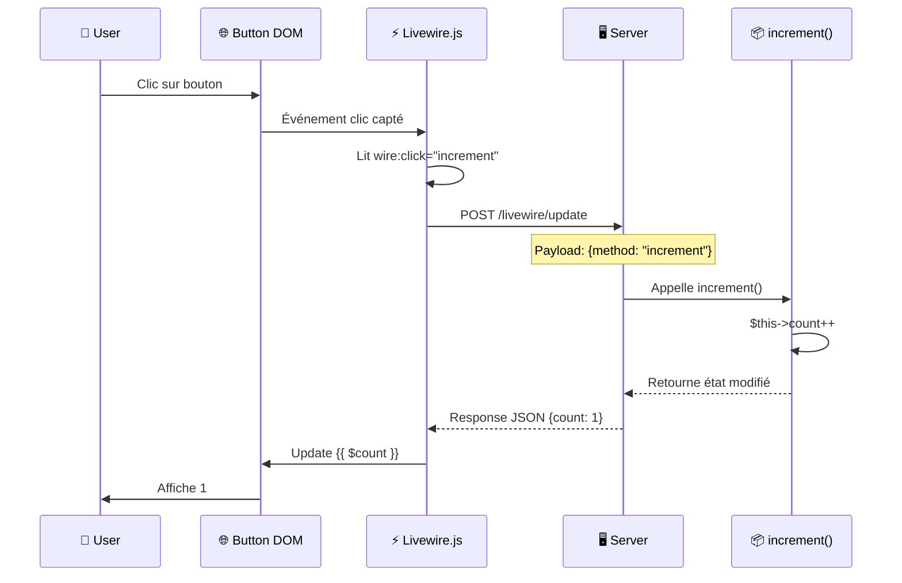
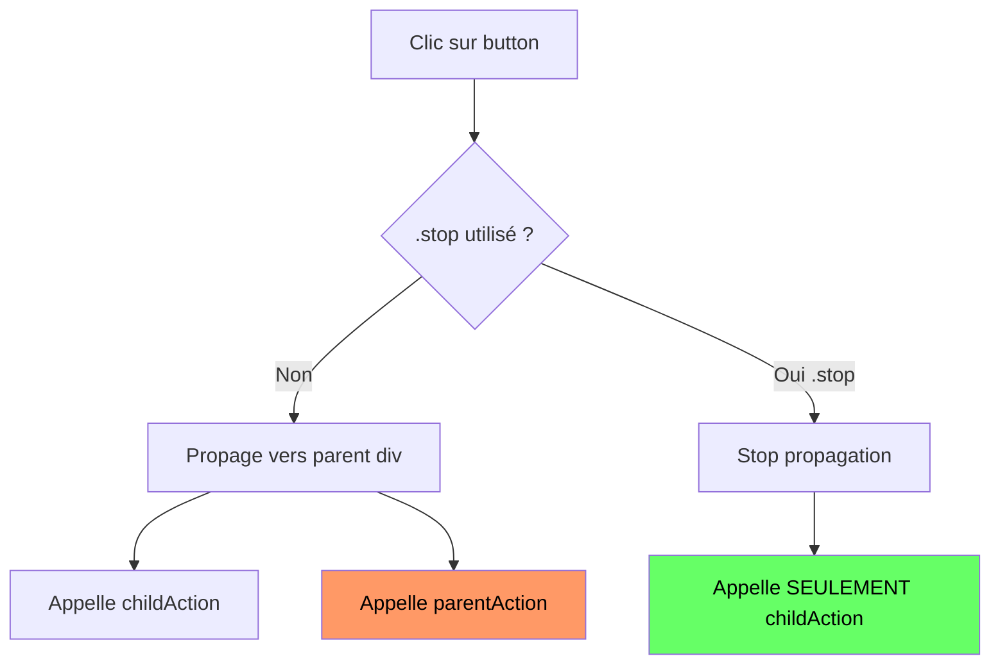

# III — Actions & Méthodes

<div
  class="omny-meta"
  data-level="🟡 Intermédiaire"
  data-duration="4-5 heures"
  data-lessons="9">
</div>

## Vue d'ensemble

!!! quote "Analogie pédagogique"
    _Imaginez un **assistant vocal intelligent dans votre maison** : vous donnez des ordres vocaux ("Alexa, allume la lumière", "Google, monte le volume de 5") et l'assistant exécute immédiatement l'action demandée. **Les actions Livewire fonctionnent pareil** : vous cliquez un bouton (`wire:click="deletePost"`), Livewire capte l'ordre, l'envoie au serveur (l'assistant), le serveur exécute la méthode PHP (`deletePost()`), puis renvoie le résultat (lumière allumée). Les **paramètres** sont comme préciser "monte le volume **de 5**" : `wire:click="increaseVolume(5)"`. Les **magic actions** (`$set`, `$toggle`) sont des commandes pré-programmées ultra-rapides : "Alexa, bascule la lumière" sans créer de méthode custom. Vous pouvez même enchaîner actions ("allume lumière, puis monte chauffage") avec événements. **Livewire transforme chaque interaction utilisateur en commande serveur propre et sécurisée**._

**Les actions Livewire permettent d'exécuter code PHP depuis le frontend :**

- ✅ **`wire:click`** = Déclencher méthode PHP au clic
- ✅ **Paramètres méthodes** = Passer données dynamiques (`deletePost($id)`)
- ✅ **`wire:submit`** = Gérer soumission formulaires
- ✅ **Magic actions** = `$set`, `$toggle`, `$refresh` sans méthode PHP
- ✅ **Modifiers** = `.prevent`, `.stop`, `.self`, `.once` pour contrôle précis
- ✅ **Événements clavier** = `wire:keydown.enter`, `wire:keydown.escape`

**Ce module couvre :**

1. `wire:click` et événements clics
2. Méthodes publiques (actions utilisateur)
3. Paramètres méthodes (simples et multiples)
4. `wire:submit` et validation formulaires
5. Magic actions (`$set`, `$toggle`, `$refresh`, `$dispatch`)
6. Modifiers événements (`.prevent`, `.stop`, `.self`)
7. Événements clavier (`wire:keydown`, raccourcis)
8. Loading states et feedback UX
9. Actions asynchrones et debouncing

---

## Leçon 1 : wire:click (Actions au Clic)

### 1.1 Syntaxe Basique

**`wire:click` appelle méthode PHP publique au clic**

```php
<?php

namespace App\Livewire;

use Livewire\Component;

class Counter extends Component
{
    public int $count = 0;

    /**
     * Méthode publique = action appelable depuis vue
     */
    public function increment(): void
    {
        $this->count++;
    }

    public function decrement(): void
    {
        $this->count--;
    }

    public function reset(): void
    {
        $this->count = 0;
    }

    public function render()
    {
        return view('livewire.counter');
    }
}
```

```blade
{{-- resources/views/livewire/counter.blade.php --}}
<div>
    <h1>Count: {{ $count }}</h1>

    {{-- wire:click appelle méthode PHP --}}
    <button wire:click="increment">+</button>
    <button wire:click="decrement">-</button>
    <button wire:click="reset">Reset</button>
</div>
```

**Diagramme : Cycle wire:click**



### 1.2 Événements Supportés

**Livewire supporte tous événements DOM standards :**

```blade
{{-- Clics --}}
<button wire:click="action">Click</button>
<div wire:dblclick="onDoubleClick">Double Click</div>

{{-- Mouse events --}}
<div wire:mouseenter="onHover">Hover me</div>
<div wire:mouseleave="onLeave">Leave</div>

{{-- Focus events --}}
<input wire:focus="onFocus">
<input wire:blur="onBlur">

{{-- Keyboard --}}
<input wire:keydown="onKeyDown">
<input wire:keyup="onKeyUp">

{{-- Form events --}}
<form wire:submit.prevent="save">
    <input wire:change="onChange">
    <select wire:input="onInput"></select>
</form>

{{-- Scroll (attention performance) --}}
<div wire:scroll="onScroll" style="overflow-y: scroll; height: 300px;">
    <!-- Contenu scrollable -->
</div>
```

**⚠️ Performance : Événements fréquents (scroll, mousemove)**

```blade
{{-- ❌ MAUVAIS : Trop de requêtes --}}
<div wire:scroll="loadMore">...</div>
<!-- Requête AJAX à chaque pixel scrollé = serveur overload -->

{{-- ✅ BON : Throttle événements --}}
<div wire:scroll.throttle.500ms="loadMore">...</div>
<!-- Maximum 1 requête toutes les 500ms -->
```

### 1.3 Chaînage Actions

```blade
{{-- Appeler multiple méthodes (séparées par point-virgule) --}}
<button wire:click="increment; logAction">
    Increment & Log
</button>

{{-- Équivalent PHP --}}
<?php
public function increment(): void
{
    $this->count++;
}

public function logAction(): void
{
    Log::info('Counter incremented', ['count' => $this->count]);
}
?>
```

**⚠️ Ordre exécution : Séquentiel**

```blade
<button wire:click="resetCount; sendEmail">
    Reset & Send
</button>

{{-- Exécution : 
1. resetCount() complète
2. Puis sendEmail() exécutée
3. Puis re-render
--}}
```

---

## Leçon 2 : Méthodes Publiques (Actions)

### 2.1 Déclaration Méthodes

**Toute méthode publique = action appelable**

```php
<?php

namespace App\Livewire;

use Livewire\Component;

class TaskManager extends Component
{
    public array $tasks = [];

    /**
     * Ajouter tâche
     * Public = appelable depuis wire:click
     */
    public function addTask(string $title): void
    {
        $this->tasks[] = [
            'id' => uniqid(),
            'title' => $title,
            'done' => false,
        ];
    }

    /**
     * Marquer tâche complétée
     */
    public function toggleTask(string $id): void
    {
        foreach ($this->tasks as &$task) {
            if ($task['id'] === $id) {
                $task['done'] = !$task['done'];
                break;
            }
        }
    }

    /**
     * Supprimer tâche
     */
    public function deleteTask(string $id): void
    {
        $this->tasks = array_filter($this->tasks, fn($task) => $task['id'] !== $id);
    }

    /**
     * Méthode protected = NON appelable depuis vue
     */
    protected function logAction(string $action): void
    {
        Log::info("Task action: {$action}");
    }

    /**
     * Méthode private = NON appelable
     */
    private function validateTask(array $task): bool
    {
        return !empty($task['title']);
    }

    public function render()
    {
        return view('livewire.task-manager');
    }
}
```

**Tableau : Visibilité Méthodes**

| Visibilité | Appelable `wire:click` | Use Case |
|------------|------------------------|----------|
| **public** | ✅ Oui | Actions utilisateur |
| **protected** | ❌ Non | Helpers internes, logs |
| **private** | ❌ Non | Validation, formatage |

### 2.2 Return Values et Redirections

**Méthodes peuvent retourner responses Laravel :**

```php
<?php

namespace App\Livewire;

use Livewire\Component;

class AuthActions extends Component
{
    /**
     * Déconnexion avec redirection
     */
    public function logout()
    {
        Auth::logout();

        // Redirection Laravel standard
        return redirect('/login');
    }

    /**
     * Redirection avec message flash
     */
    public function deleteAccount()
    {
        Auth::user()->delete();

        session()->flash('message', 'Compte supprimé avec succès.');

        return redirect('/');
    }

    /**
     * Redirection nommée
     */
    public function goToDashboard()
    {
        return redirect()->route('dashboard');
    }

    /**
     * Redirection avec query params
     */
    public function searchProducts(string $query)
    {
        return redirect()->route('products.index', ['search' => $query]);
    }

    /**
     * Download file
     */
    public function downloadReport()
    {
        return response()->download(storage_path('reports/monthly.pdf'));
    }

    public function render()
    {
        return view('livewire.auth-actions');
    }
}
```

**⚠️ Void vs Return :**

```php
<?php

// ✅ Void : Pas de redirection, juste update composant
public function increment(): void
{
    $this->count++;
}

// ✅ Return : Redirection après action
public function save()
{
    $this->validate();
    Post::create($this->form);
    
    return redirect('/posts');
}
```

### 2.3 Méthodes avec Side Effects

```php
<?php

namespace App\Livewire;

use Livewire\Component;
use App\Models\Post;
use Illuminate\Support\Facades\Mail;
use App\Mail\PostPublished;

class PostEditor extends Component
{
    public Post $post;
    public bool $published = false;

    /**
     * Publier post avec side effects
     */
    public function publish(): void
    {
        // 1. Update database
        $this->post->update(['published' => true]);

        // 2. Envoyer email
        Mail::to($this->post->author)->send(new PostPublished($this->post));

        // 3. Log analytics
        event(new PostPublishedEvent($this->post));

        // 4. Update UI state
        $this->published = true;

        // 5. Flash message
        session()->flash('success', 'Post publié avec succès !');
    }

    /**
     * Sauvegarder brouillon (sans side effects)
     */
    public function saveDraft(): void
    {
        $this->post->update(['content' => $this->content]);

        session()->flash('info', 'Brouillon sauvegardé.');
    }

    public function render()
    {
        return view('livewire.post-editor');
    }
}
```

---

## Leçon 3 : Paramètres Méthodes

### 3.1 Paramètres Simples

**Passer valeurs depuis `wire:click` :**

```php
<?php

namespace App\Livewire;

use Livewire\Component;

class Calculator extends Component
{
    public int $result = 0;

    /**
     * Ajouter nombre spécifique
     */
    public function add(int $number): void
    {
        $this->result += $number;
    }

    /**
     * Multiplier par facteur
     */
    public function multiply(float $factor): void
    {
        $this->result = (int)($this->result * $factor);
    }

    /**
     * Définir valeur exacte
     */
    public function setValue(int $value): void
    {
        $this->result = $value;
    }

    public function render()
    {
        return view('livewire.calculator');
    }
}
```

```blade
{{-- resources/views/livewire/calculator.blade.php --}}
<div>
    <h1>Résultat : {{ $result }}</h1>

    {{-- Paramètres hardcodés --}}
    <button wire:click="add(1)">+1</button>
    <button wire:click="add(5)">+5</button>
    <button wire:click="add(10)">+10</button>

    <button wire:click="multiply(2)">×2</button>
    <button wire:click="multiply(0.5)">÷2</button>

    {{-- Paramètre valeur fixe --}}
    <button wire:click="setValue(100)">Set 100</button>
    <button wire:click="setValue(0)">Reset</button>
</div>
```

### 3.2 Paramètres Dynamiques (Variables Blade)

```php
<?php

namespace App\Livewire;

use Livewire\Component;
use App\Models\Post;

class PostList extends Component
{
    public $posts;

    public function mount()
    {
        $this->posts = Post::all();
    }

    /**
     * Supprimer post par ID
     */
    public function deletePost(int $postId): void
    {
        Post::destroy($postId);
        $this->posts = Post::all(); // Refresh
    }

    /**
     * Toggle favori
     */
    public function toggleFavorite(int $postId): void
    {
        $post = Post::find($postId);
        $post->update(['favorite' => !$post->favorite]);
        
        $this->posts = Post::all(); // Refresh
    }

    public function render()
    {
        return view('livewire.post-list');
    }
}
```

```blade
{{-- resources/views/livewire/post-list.blade.php --}}
<div>
    @foreach($posts as $post)
        <div class="post-card">
            <h3>{{ $post->title }}</h3>

            {{-- Passer ID post comme paramètre --}}
            <button wire:click="toggleFavorite({{ $post->id }})">
                {{ $post->favorite ? '★' : '☆' }}
            </button>

            <button wire:click="deletePost({{ $post->id }})">
                Supprimer
            </button>
        </div>
    @endforeach
</div>
```

### 3.3 Paramètres Multiples

```php
<?php

namespace App\Livewire;

use Livewire\Component;

class ProductFilter extends Component
{
    public string $category = '';
    public float $minPrice = 0;
    public float $maxPrice = 1000;

    /**
     * Appliquer filtre avec multiple paramètres
     */
    public function applyFilter(string $category, float $min, float $max): void
    {
        $this->category = $category;
        $this->minPrice = $min;
        $this->maxPrice = $max;
    }

    /**
     * Filtre prédéfini
     */
    public function applyPreset(string $preset): void
    {
        match($preset) {
            'budget' => $this->applyFilter('all', 0, 50),
            'mid-range' => $this->applyFilter('all', 50, 200),
            'premium' => $this->applyFilter('all', 200, 1000),
            default => $this->applyFilter('all', 0, 1000),
        };
    }

    public function render()
    {
        return view('livewire.product-filter');
    }
}
```

```blade
{{-- Multiple paramètres --}}
<button wire:click="applyFilter('electronics', 100, 500)">
    Electronics 100€-500€
</button>

<button wire:click="applyFilter('clothing', 0, 100)">
    Vêtements < 100€
</button>

{{-- Preset simple --}}
<button wire:click="applyPreset('budget')">Budget</button>
<button wire:click="applyPreset('premium')">Premium</button>
```

### 3.4 Paramètres Arrays et Objects

```php
<?php

namespace App\Livewire;

use Livewire\Component;

class CartManager extends Component
{
    public array $cart = [];

    /**
     * Ajouter item avec détails complets
     */
    public function addItem(array $item): void
    {
        $this->cart[] = $item;
    }

    /**
     * Update quantité item
     */
    public function updateQuantity(int $index, int $quantity): void
    {
        if (isset($this->cart[$index])) {
            $this->cart[$index]['quantity'] = $quantity;
        }
    }

    public function render()
    {
        return view('livewire.cart-manager');
    }
}
```

```blade
{{-- ⚠️ ATTENTION : Arrays passés comme JSON --}}
<button wire:click="addItem({ 
    id: 1, 
    name: 'Product 1', 
    price: 29.99, 
    quantity: 1 
})">
    Add Product 1
</button>

{{-- Alternative : Utiliser Alpine.js pour objets complexes --}}
<div x-data="{ product: { id: 2, name: 'Product 2', price: 49.99 } }">
    <button @click="$wire.addItem(product)">
        Add Product 2
    </button>
</div>
```

---

## Leçon 4 : wire:submit (Formulaires)

### 4.1 Soumission Formulaire Basique

```php
<?php

namespace App\Livewire;

use Livewire\Component;

class ContactForm extends Component
{
    public string $name = '';
    public string $email = '';
    public string $message = '';

    protected $rules = [
        'name' => 'required|min:3',
        'email' => 'required|email',
        'message' => 'required|min:10',
    ];

    /**
     * Submit formulaire
     */
    public function submit(): void
    {
        // Valider
        $validated = $this->validate();

        // Traiter (envoyer email, sauver DB, etc.)
        // Mail::to('admin@example.com')->send(new ContactMessage($validated));

        // Flash message
        session()->flash('success', 'Message envoyé !');

        // Reset formulaire
        $this->reset(['name', 'email', 'message']);
    }

    public function render()
    {
        return view('livewire.contact-form');
    }
}
```

```blade
{{-- resources/views/livewire/contact-form.blade.php --}}
<div>
    {{-- wire:submit.prevent = preventDefault + appelle submit() --}}
    <form wire:submit.prevent="submit">
        
        <div>
            <label>Nom</label>
            <input type="text" wire:model="name">
            @error('name') <span class="error">{{ $message }}</span> @enderror
        </div>

        <div>
            <label>Email</label>
            <input type="email" wire:model="email">
            @error('email') <span class="error">{{ $message }}</span> @enderror
        </div>

        <div>
            <label>Message</label>
            <textarea wire:model="message"></textarea>
            @error('message') <span class="error">{{ $message }}</span> @enderror
        </div>

        <button type="submit">Envoyer</button>
    </form>

    @if(session()->has('success'))
        <div class="alert-success">{{ session('success') }}</div>
    @endif
</div>
```

**⚠️ `.prevent` est CRITIQUE :**

```blade
{{-- ❌ ERREUR : Sans .prevent, page reload --}}
<form wire:submit="submit">
    <!-- Soumet formulaire en GET/POST standard = page reload -->
</form>

{{-- ✅ CORRECT : .prevent empêche comportement par défaut --}}
<form wire:submit.prevent="submit">
    <!-- Livewire gère soumission en AJAX -->
</form>
```

### 4.2 Validation Temps Réel

```php
<?php

namespace App\Livewire;

use Livewire\Component;

class SignupForm extends Component
{
    public string $username = '';
    public string $email = '';
    public string $password = '';

    protected $rules = [
        'username' => 'required|min:3|alpha_dash|unique:users,username',
        'email' => 'required|email|unique:users,email',
        'password' => 'required|min:8',
    ];

    protected $messages = [
        'username.unique' => 'Ce nom d\'utilisateur est déjà pris.',
        'email.unique' => 'Cet email est déjà utilisé.',
    ];

    /**
     * Validation temps réel sur changement propriété
     */
    public function updated($propertyName): void
    {
        $this->validateOnly($propertyName);
    }

    /**
     * Submit avec validation complète
     */
    public function signup(): void
    {
        $validated = $this->validate();

        $user = User::create([
            'username' => $validated['username'],
            'email' => $validated['email'],
            'password' => Hash::make($validated['password']),
        ]);

        Auth::login($user);

        return redirect('/dashboard');
    }

    public function render()
    {
        return view('livewire.signup-form');
    }
}
```

```blade
<form wire:submit.prevent="signup">
    
    {{-- Username avec feedback temps réel --}}
    <div>
        <input 
            type="text" 
            wire:model.blur="username"
            placeholder="Nom d'utilisateur"
            class="@error('username') border-red-500 @enderror"
        >
        @error('username')
            <span class="text-red-500 text-sm">{{ $message }}</span>
        @enderror
    </div>

    {{-- Email --}}
    <div>
        <input 
            type="email" 
            wire:model.blur="email"
            placeholder="Email"
            class="@error('email') border-red-500 @enderror"
        >
        @error('email')
            <span class="text-red-500 text-sm">{{ $message }}</span>
        @enderror
    </div>

    {{-- Password --}}
    <div>
        <input 
            type="password" 
            wire:model.blur="password"
            placeholder="Mot de passe"
            class="@error('password') border-red-500 @enderror"
        >
        @error('password')
            <span class="text-red-500 text-sm">{{ $message }}</span>
        @enderror
    </div>

    <button type="submit" class="btn-primary">
        S'inscrire
    </button>
</form>
```

---

## Leçon 5 : Magic Actions

### 5.1 `$set` (Modifier Propriété)

**`$set` modifie propriété sans créer méthode PHP**

```blade
{{-- Syntaxe : wire:click="$set('property', value)" --}}

<button wire:click="$set('count', 0)">
    Reset Count
</button>

<button wire:click="$set('active', true)">
    Activer
</button>

<button wire:click="$set('theme', 'dark')">
    Dark Mode
</button>

{{-- Nested properties --}}
<button wire:click="$set('user.settings.theme', 'light')">
    Light Theme
</button>

{{-- Avec variables Blade --}}
@foreach($colors as $color)
    <button wire:click="$set('selectedColor', '{{ $color }}')">
        {{ $color }}
    </button>
@endforeach
```

**Quand utiliser `$set` :**

- ✅ Toggle simples (true/false)
- ✅ Sélection valeur fixe (couleur, thème)
- ✅ Reset valeur
- ❌ Logique complexe (utiliser méthode PHP)
- ❌ Validation requise (utiliser méthode)

### 5.2 `$toggle` (Basculer Boolean)

```blade
{{-- Syntaxe : wire:click="$toggle('property')" --}}

<button wire:click="$toggle('active')">
    Toggle Active
</button>

<button wire:click="$toggle('showModal')">
    {{ $showModal ? 'Fermer' : 'Ouvrir' }} Modal
</button>

{{-- Équivalent PHP : --}}
<?php
public function toggleActive(): void
{
    $this->active = !$this->active;
}
?>
```

**Use cases `$toggle` :**

```blade
{{-- Sidebar mobile --}}
<button wire:click="$toggle('sidebarOpen')">
    ☰ Menu
</button>

{{-- Accordéon --}}
<button wire:click="$toggle('expanded')">
    {{ $expanded ? '▼' : '▶' }} Détails
</button>

{{-- Mode sombre --}}
<button wire:click="$toggle('darkMode')">
    {{ $darkMode ? '🌙' : '☀️' }}
</button>
```

### 5.3 `$refresh` (Force Re-render)

```blade
{{-- Rafraîchir composant manuellement --}}
<button wire:click="$refresh">
    🔄 Rafraîchir
</button>

{{-- Auto-refresh avec polling --}}
<div wire:poll.5s="$refresh">
    Dernière mise à jour : {{ now()->format('H:i:s') }}
</div>

{{-- Refresh après action externe --}}
<button wire:click="$refresh">
    Recharger données
</button>
```

**Quand utiliser `$refresh` :**

- ✅ Actualiser données externes (API)
- ✅ Polling temps réel
- ✅ Rafraîchir après événement global
- ❌ Pas nécessaire après actions Livewire (auto re-render)

### 5.4 `$dispatch` (Événements)

```blade
{{-- Dispatch événement global --}}
<button wire:click="$dispatch('post-created')">
    Créer Post
</button>

{{-- Dispatch avec payload --}}
<button wire:click="$dispatch('user-updated', { userId: {{ $user->id }} })">
    Update User
</button>

{{-- Dispatch vers composant parent --}}
<button wire:click="$dispatch('close-modal')">
    Fermer
</button>
```

**Écouter événements (PHP) :**

```php
<?php

namespace App\Livewire;

use Livewire\Component;
use Livewire\Attributes\On;

class PostList extends Component
{
    #[On('post-created')]
    public function refreshPosts(): void
    {
        // Rafraîchir liste posts
        $this->posts = Post::latest()->get();
    }

    public function render()
    {
        return view('livewire.post-list');
    }
}
```

**Module VI approfondira événements complets.**

---

## Leçon 6 : Modifiers wire:click

### 6.1 `.prevent` (preventDefault)

```blade
{{-- Empêcher comportement par défaut --}}

{{-- Lien sans navigation --}}
<a href="#" wire:click.prevent="openModal">
    Ouvrir Modal
</a>
<!-- Sans .prevent, page scroll vers # -->

{{-- Formulaire sans submit --}}
<form>
    <button wire:click.prevent="saveInline">
        Save
    </button>
</form>
<!-- Sans .prevent, formulaire soumis -->

{{-- Click droit --}}
<div wire:contextmenu.prevent="showContextMenu">
    Right-click me
</div>
<!-- Sans .prevent, menu contextuel navigateur -->
```

### 6.2 `.stop` (stopPropagation)

```blade
{{-- Empêcher propagation événement vers parents --}}

<div wire:click="parentAction">
    Parent clickable
    
    <button wire:click.stop="childAction">
        Child (ne déclenche PAS parent)
    </button>
</div>

{{-- Sans .stop, cliquer child déclenche parent ET child --}}
```

**Diagramme : Propagation Événements**



### 6.3 `.self` (Target Self Only)

```blade
{{-- Déclencher UNIQUEMENT si clic sur élément lui-même, pas enfants --}}

<div wire:click.self="closeModal" class="modal-overlay">
    <div class="modal-content">
        <!-- Cliquer ici ne ferme PAS modal -->
        <h1>Modal</h1>
        <p>Contenu...</p>
    </div>
</div>

{{-- Cliquer overlay (fond sombre) ferme modal --}}
{{-- Cliquer modal-content ne fait rien --}}
```

**Use case classique : Fermer modal en cliquant overlay**

```blade
<div 
    wire:click.self="$set('showModal', false)"
    class="fixed inset-0 bg-black bg-opacity-50 flex items-center justify-center"
>
    <div class="bg-white p-6 rounded-lg">
        <h2>Modal</h2>
        <p>Cliquer à l'extérieur ferme la modal</p>
        
        <button wire:click="$set('showModal', false)">
            Fermer
        </button>
    </div>
</div>
```

### 6.4 `.once` (Trigger Une Seule Fois)

```blade
{{-- Événement déclenché UNE SEULE FOIS --}}

<button wire:click.once="trackClick">
    Cliquer (comptabilisé 1 fois)
</button>

{{-- Utile pour analytics --}}
<div wire:mouseenter.once="trackFirstHover">
    Hover tracked once
</div>
```

### 6.5 `.debounce` et `.throttle`

```blade
{{-- Debounce 500ms : attendre 500ms inactivité --}}
<button wire:click.debounce.500ms="search">
    Search
</button>

{{-- Throttle 1s : maximum 1 appel par seconde --}}
<button wire:click.throttle.1s="autoSave">
    Auto Save
</button>
```

### 6.6 Combinaison Modifiers

```blade
{{-- Multiple modifiers (ordre importe PAS) --}}

<a href="/posts" wire:click.prevent.stop="openInModal">
    Ouvrir en modal
</a>

<div wire:click.self.debounce.500ms="closePopup">
    Popup avec debounce
</div>

<form wire:submit.prevent.throttle.1s="submit">
    <!-- Prevent submit + throttle 1s -->
</form>
```

---

## Leçon 7 : Événements Clavier

### 7.1 `wire:keydown` Basique

```blade
{{-- Détecter touche pressée --}}
<input wire:keydown="onKeyPress" placeholder="Type something">

{{-- Touche spécifique --}}
<input wire:keydown.enter="submit" placeholder="Press Enter">
<input wire:keydown.escape="cancel" placeholder="Press Escape">
<input wire:keydown.space="togglePlay" placeholder="Press Space">
```

**Touches supportées :**

```blade
wire:keydown.enter       {{-- Enter --}}
wire:keydown.escape      {{-- Escape --}}
wire:keydown.space       {{-- Espace --}}
wire:keydown.tab         {{-- Tab --}}
wire:keydown.delete      {{-- Delete --}}
wire:keydown.backspace   {{-- Backspace --}}

wire:keydown.arrow-up    {{-- Flèche haut --}}
wire:keydown.arrow-down  {{-- Flèche bas --}}
wire:keydown.arrow-left  {{-- Flèche gauche --}}
wire:keydown.arrow-right {{-- Flèche droite --}}

wire:keydown.page-up     {{-- Page Up --}}
wire:keydown.page-down   {{-- Page Down --}}
wire:keydown.home        {{-- Home --}}
wire:keydown.end         {{-- End --}}
```

### 7.2 Modifiers Clavier (Ctrl, Shift, Alt)

```blade
{{-- Combinaisons touches --}}

{{-- Ctrl + S (Save) --}}
<div wire:keydown.ctrl.s.prevent="save">
    Document
</div>

{{-- Ctrl + Enter (Submit) --}}
<textarea wire:keydown.ctrl.enter="submit"></textarea>

{{-- Shift + Delete (Force Delete) --}}
<div wire:keydown.shift.delete="forceDelete">
    Item
</div>

{{-- Alt + N (New) --}}
<div wire:keydown.alt.n="createNew">
    List
</div>
```

**⚠️ `.prevent` souvent nécessaire :**

```blade
{{-- Sans .prevent, Ctrl+S ouvre "Enregistrer sous" navigateur --}}
<div wire:keydown.ctrl.s.prevent="save">

{{-- Sans .prevent, Ctrl+P ouvre impression --}}
<div wire:keydown.ctrl.p.prevent="printCustom">
```

### 7.3 Raccourcis Application Complète

```php
<?php

namespace App\Livewire;

use Livewire\Component;

class KeyboardShortcuts extends Component
{
    public bool $commandPaletteOpen = false;
    public bool $settingsOpen = false;

    /**
     * Ctrl + K : Ouvrir palette commandes
     */
    public function openCommandPalette(): void
    {
        $this->commandPaletteOpen = true;
    }

    /**
     * Escape : Fermer tout
     */
    public function closeAll(): void
    {
        $this->commandPaletteOpen = false;
        $this->settingsOpen = false;
    }

    /**
     * Ctrl + , : Ouvrir settings
     */
    public function openSettings(): void
    {
        $this->settingsOpen = true;
    }

    public function render()
    {
        return view('livewire.keyboard-shortcuts');
    }
}
```

```blade
{{-- Global keyboard listeners sur body --}}
<div 
    wire:keydown.ctrl.k.prevent="openCommandPalette"
    wire:keydown.escape="closeAll"
    wire:keydown.ctrl.comma.prevent="openSettings"
    tabindex="0"
>
    <h1>Application avec raccourcis clavier</h1>

    @if($commandPaletteOpen)
        <div class="command-palette">
            <input 
                type="text" 
                placeholder="Rechercher commande..."
                wire:keydown.escape="closeAll"
            >
        </div>
    @endif

    @if($settingsOpen)
        <div class="settings-panel">
            <h2>Paramètres</h2>
            <button wire:keydown.escape="closeAll">Fermer</button>
        </div>
    @endif
</div>
```

**Liste raccourcis classiques :**

| Raccourci | Action | Use Case |
|-----------|--------|----------|
| `Ctrl + S` | Save | Éditeur, formulaire |
| `Ctrl + K` | Command Palette | Search global |
| `Ctrl + /` | Toggle comments | Éditeur code |
| `Ctrl + B` | Bold | Éditeur texte riche |
| `Ctrl + ,` | Settings | Préférences |
| `Escape` | Close/Cancel | Modals, dropdowns |
| `Enter` | Submit | Formulaires |
| `Ctrl + Enter` | Submit | Textarea (new line vs submit) |

---

## Leçon 8 : Loading States et Feedback UX

### 8.1 `wire:loading` Basique

```blade
{{-- Afficher pendant requête AJAX --}}

<button wire:click="save">
    Save
</button>

{{-- Indicateur loading basique --}}
<span wire:loading>
    Chargement...
</span>
```

**Fonctionnement :**

1. User clique "Save"
2. Livewire envoie requête AJAX
3. `wire:loading` devient visible
4. Requête termine
5. `wire:loading` disparaît

### 8.2 `wire:loading` Ciblé (Target Spécifique)

```blade
{{-- Loading pour action spécifique --}}

<button wire:click="save">
    <span wire:loading.remove wire:target="save">Save</span>
    <span wire:loading wire:target="save">Saving...</span>
</button>

<button wire:click="delete">
    <span wire:loading.remove wire:target="delete">Delete</span>
    <span wire:loading wire:target="delete">Deleting...</span>
</button>

{{-- Loading global (tous les wire:click) --}}
<div wire:loading class="loading-overlay">
    <div class="spinner"></div>
</div>
```

**Modifiers `wire:loading` :**

```blade
{{-- wire:loading (défaut) : visible pendant loading --}}
<span wire:loading>Loading...</span>

{{-- wire:loading.remove : masqué pendant loading --}}
<span wire:loading.remove>Content</span>

{{-- wire:loading.delay : attendre 200ms avant afficher --}}
<span wire:loading.delay>Loading...</span>
<!-- Évite flash si requête < 200ms -->

{{-- wire:loading.delay.longest : attendre 500ms --}}
<span wire:loading.delay.longest>Still loading...</span>
```

### 8.3 Disable Inputs Pendant Loading

```blade
<form wire:submit.prevent="submit">
    
    <input 
        type="text" 
        wire:model="name"
        wire:loading.attr="disabled"
    >
    
    <button 
        type="submit"
        wire:loading.attr="disabled"
        wire:loading.class="opacity-50 cursor-not-allowed"
    >
        <span wire:loading.remove wire:target="submit">Submit</span>
        <span wire:loading wire:target="submit">
            <svg class="spinner">...</svg> Submitting...
        </span>
    </button>
</form>
```

**Attributs dynamiques `wire:loading.attr` :**

```blade
{{-- Disable pendant loading --}}
<button wire:loading.attr="disabled">Submit</button>

{{-- Readonly --}}
<input wire:loading.attr="readonly">

{{-- Aria-busy pour accessibilité --}}
<div wire:loading.attr="aria-busy=true">
```

### 8.4 Classes CSS Loading

```blade
{{-- Ajouter classe pendant loading --}}
<button 
    wire:click="save"
    wire:loading.class="opacity-50"
>
    Save
</button>

{{-- Retirer classe pendant loading --}}
<button 
    wire:click="delete"
    wire:loading.class.remove="bg-red-500"
    class="bg-red-500"
>
    Delete
</button>

{{-- Combiner classes --}}
<div 
    wire:click="refresh"
    wire:loading.class="opacity-50 cursor-wait"
    wire:loading.class.remove="hover:bg-blue-600"
>
    Refresh
</div>
```

### 8.5 Skeleton Screens

```blade
<div>
    {{-- Contenu réel --}}
    <div wire:loading.remove>
        @foreach($posts as $post)
            <div class="post-card">
                <h3>{{ $post->title }}</h3>
                <p>{{ $post->excerpt }}</p>
            </div>
        @endforeach
    </div>

    {{-- Skeleton pendant loading --}}
    <div wire:loading>
        @for($i = 0; $i < 5; $i++)
            <div class="post-card skeleton">
                <div class="skeleton-title"></div>
                <div class="skeleton-text"></div>
                <div class="skeleton-text"></div>
            </div>
        @endfor
    </div>
</div>
```

**CSS Skeleton :**

```css
.skeleton {
    background: linear-gradient(90deg, #f0f0f0 25%, #e0e0e0 50%, #f0f0f0 75%);
    background-size: 200% 100%;
    animation: loading 1.5s infinite;
}

@keyframes loading {
    0% { background-position: 200% 0; }
    100% { background-position: -200% 0; }
}

.skeleton-title {
    width: 60%;
    height: 24px;
    border-radius: 4px;
    margin-bottom: 12px;
}

.skeleton-text {
    width: 100%;
    height: 16px;
    border-radius: 4px;
    margin-bottom: 8px;
}
```

---

## Leçon 9 : Patterns Avancés Actions

### 9.1 Confirmation Avant Action

```blade
{{-- Confirmation JavaScript natif --}}
<button 
    wire:click="deletePost"
    onclick="return confirm('Êtes-vous sûr de vouloir supprimer ?')"
>
    Supprimer
</button>

{{-- Confirmation Alpine.js --}}
<div x-data="{ confirming: false }">
    <button @click="confirming = true">
        Supprimer
    </button>

    <div x-show="confirming" x-transition>
        <p>Confirmer suppression ?</p>
        <button wire:click="deletePost" @click="confirming = false">
            Oui, supprimer
        </button>
        <button @click="confirming = false">
            Annuler
        </button>
    </div>
</div>
```

### 9.2 Actions avec Undo

```php
<?php

namespace App\Livewire;

use Livewire\Component;

class TodoList extends Component
{
    public array $tasks = [];
    public ?array $deletedTask = null;

    public function deleteTask(int $index): void
    {
        // Sauvegarder task avant suppression
        $this->deletedTask = $this->tasks[$index];
        
        // Supprimer
        unset($this->tasks[$index]);
        $this->tasks = array_values($this->tasks);

        // Flash message avec action undo
        session()->flash('message', 'Tâche supprimée.');
        session()->flash('undoable', true);
    }

    public function undo(): void
    {
        if ($this->deletedTask) {
            $this->tasks[] = $this->deletedTask;
            $this->deletedTask = null;
            
            session()->forget(['message', 'undoable']);
        }
    }

    public function render()
    {
        return view('livewire.todo-list');
    }
}
```

```blade
{{-- Toast avec Undo --}}
@if(session()->has('message'))
    <div class="toast">
        {{ session('message') }}
        
        @if(session('undoable'))
            <button wire:click="undo">Annuler</button>
        @endif
    </div>
@endif
```

### 9.3 Batch Actions (Actions Multiples)

```php
<?php

namespace App\Livewire;

use Livewire\Component;
use App\Models\Post;

class PostTable extends Component
{
    public array $selected = [];

    public function deleteSelected(): void
    {
        Post::whereIn('id', $this->selected)->delete();
        
        $this->selected = [];
        
        session()->flash('message', count($this->selected) . ' posts supprimés.');
    }

    public function publishSelected(): void
    {
        Post::whereIn('id', $this->selected)->update(['published' => true]);
        
        $this->selected = [];
    }

    public function render()
    {
        return view('livewire.post-table', [
            'posts' => Post::all()
        ]);
    }
}
```

```blade
<div>
    {{-- Sélection multiple --}}
    @foreach($posts as $post)
        <div>
            <input 
                type="checkbox" 
                wire:model="selected" 
                value="{{ $post->id }}"
            >
            {{ $post->title }}
        </div>
    @endforeach

    {{-- Actions bulk si sélection --}}
    @if(count($selected) > 0)
        <div class="bulk-actions">
            <span>{{ count($selected) }} sélectionné(s)</span>
            
            <button wire:click="publishSelected">
                Publier
            </button>
            
            <button wire:click="deleteSelected">
                Supprimer
            </button>
        </div>
    @endif
</div>
```

---

## Projet 1 : Todo List avec Actions Complètes

**Objectif :** Application todo CRUD complète

**Fonctionnalités :**
- Ajouter tâche (`wire:submit`)
- Toggle done (`wire:click="toggle($index)"`)
- Éditer inline (double-clic)
- Supprimer avec confirmation
- Batch delete sélectionnés
- Filtres (tous, actifs, complétés)
- Keyboard shortcuts (Enter, Escape)

**Code disponible repository.**

---

## Projet 2 : Modal Manager

**Objectif :** Système modals réutilisables

**Fonctionnalités :**
- Ouvrir/fermer modals (`$set`, `$toggle`)
- Fermer au clic overlay (`.self`)
- Fermer Escape (`wire:keydown.escape`)
- Prevent scroll body quand modal ouverte
- Confirmation suppression
- Formulaire modal avec validation

**Code disponible repository.**

---

## Projet 3 : Keyboard Shortcuts Dashboard

**Objectif :** Dashboard avec raccourcis clavier pro

**Raccourcis :**
- `Ctrl + K` : Command palette
- `Ctrl + N` : Nouveau post
- `Ctrl + S` : Save
- `Ctrl + /` : Aide raccourcis
- `Escape` : Fermer tout
- `Arrow Up/Down` : Navigation liste

**Code disponible repository.**

---

## Checklist Module III

- [ ] `wire:click` appelle méthodes publiques PHP
- [ ] Paramètres passés depuis vue vers méthodes (`deletePost($id)`)
- [ ] `wire:submit.prevent` gère formulaires sans reload
- [ ] Magic actions (`$set`, `$toggle`, `$refresh`) utilisées
- [ ] Modifiers (`.prevent`, `.stop`, `.self`) appliqués correctement
- [ ] `wire:keydown.enter`, `wire:keydown.escape` fonctionnent
- [ ] `wire:loading` affiche feedback pendant requête
- [ ] `wire:loading.attr="disabled"` empêche double-submit
- [ ] Confirmation avant actions destructives
- [ ] Keyboard shortcuts implémentés

**Concepts clés maîtrisés :**

✅ Actions `wire:click`
✅ Méthodes publiques avec paramètres
✅ Formulaires `wire:submit`
✅ Magic actions ($set, $toggle)
✅ Modifiers événements
✅ Raccourcis clavier
✅ Loading states UX
✅ Confirmation patterns

---

**Module III terminé ! 🎉**

**Prochaine étape : Module IV - Lifecycle Hooks**

Vous maîtrisez maintenant les actions Livewire. Le Module IV approfondit le cycle de vie des composants avec `mount()`, `hydrate()`, `updating()`, `updated()` et hooks personnalisés.

<br />