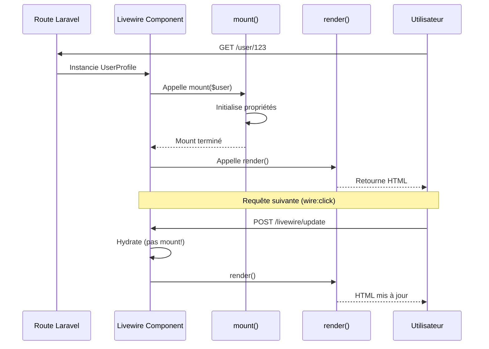
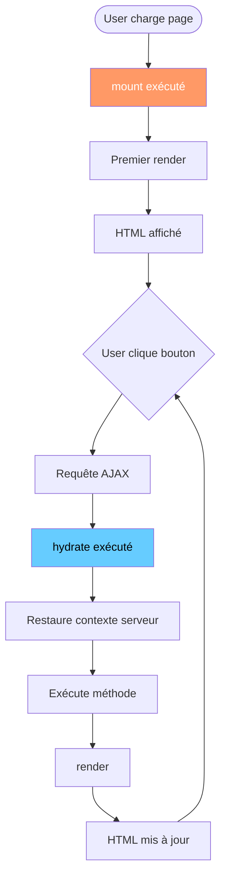
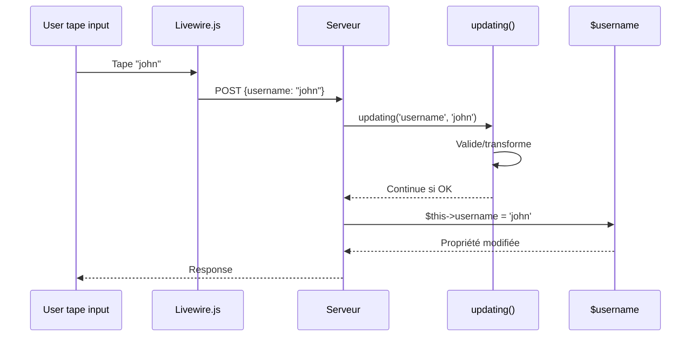
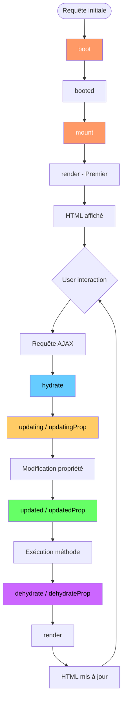

# IV — Lifecycle Hooks

<div
  class="omny-meta"
  data-level="🟡 Intermédiaire"
  data-duration="5-6 heures"
  data-lessons="9">
</div>

## Vue d'ensemble

!!! quote "Analogie pédagogique"
    _Imaginez un **acteur professionnel sur scène** jouant une pièce de théâtre. **Avant d'entrer sur scène** (mount), il se prépare en coulisses : costume, maquillage, répétition mentale de ses répliques (initialisation propriétés). **Quand le rideau s'ouvre** (hydrate), il entre sur scène et retrouve sa position, son contexte (restauration état depuis JSON). **Pendant la pièce**, à chaque réplique qu'il s'apprête à dire (updating), il prend une micro-pause pour ajuster son ton (validation, transformation données). **Après chaque réplique** (updated), il observe la réaction du public et adapte son jeu (effets secondaires, synchronisations). **À la fin du spectacle** (dehydrate), il range son costume et note mentalement ce qui s'est bien passé (sérialisation état final). **Livewire fonctionne exactement pareil** : chaque composant passe par ces étapes de vie précises, et vous contrôlez EXACTEMENT ce qui se passe à chaque moment grâce aux lifecycle hooks. C'est le **contrôle total du cycle de vie de vos composants**._

**Les lifecycle hooks permettent d'intercepter et contrôler chaque étape du composant :**

- ✅ **`mount()`** = Initialisation première instanciation (comme `__construct()`)
- ✅ **`hydrate()`** = Restauration état après requête AJAX
- ✅ **`updating()`** = AVANT modification propriété (validation, transformation)
- ✅ **`updated()`** = APRÈS modification propriété (side effects, sync)
- ✅ **`updatingPropertyName()`** = Hook spécifique propriété (granulaire)
- ✅ **`dehydrate()`** = AVANT sérialisation état (cleanup, optimisation)
- ✅ **`boot()`** et `booted()`** = Initialisation classe (partagé toutes instances)

**Ce module couvre :**

1. `mount()` - Initialisation et paramètres route
2. `hydrate()` - Restauration contexte serveur
3. `updating()` - Interception avant modification
4. `updated()` - Réactions après modification
5. Hooks spécifiques propriétés
6. `boot()` et `booted()` - Initialisation globale
7. `dehydrate()` - Préparation sérialisation
8. Cycle de vie complet (diagramme)
9. Hooks personnalisés et traits réutilisables

---

## Leçon 1 : mount() - Initialisation Composant

### 1.1 Rôle de mount()

**`mount()` s'exécute UNE FOIS à la création initiale du composant**

```php
<?php

namespace App\Livewire;

use Livewire\Component;
use App\Models\User;

class UserProfile extends Component
{
    public User $user;
    public string $displayName;
    public int $postCount;

    /**
     * Mount s'exécute UNIQUEMENT au premier render
     * PAS aux requêtes AJAX suivantes
     */
    public function mount(User $user): void
    {
        $this->user = $user;
        $this->displayName = $user->name;
        $this->postCount = $user->posts()->count();
        
        // Log première visite
        Log::info('User profile viewed', ['user_id' => $user->id]);
    }

    public function render()
    {
        return view('livewire.user-profile');
    }
}
```

**Quand `mount()` s'exécute :**



**⚠️ CRITIQUE : `mount()` vs `__construct()` :**

```php
<?php

// ❌ ERREUR : Utiliser __construct() avec Livewire
public function __construct()
{
    parent::__construct(); // Obligatoire si override
    $this->data = []; // Peut casser sérialisation
}

// ✅ CORRECT : Utiliser mount()
public function mount(): void
{
    $this->data = [];
    $this->timestamp = now();
}
```

**Pourquoi `mount()` et pas `__construct()` ?**

1. `__construct()` appelé à CHAQUE hydration (requête AJAX)
2. `mount()` appelé UNE FOIS (première instanciation)
3. Livewire utilise `__construct()` en interne (ne pas override)

### 1.2 Paramètres mount()

**`mount()` reçoit paramètres depuis route ou inclusion composant**

**Exemple 1 : Paramètres route (Full-page component)**

```php
<?php
// routes/web.php
use App\Livewire\PostEditor;

Route::get('/posts/{post}/edit', PostEditor::class);
```

```php
<?php

namespace App\Livewire;

use Livewire\Component;
use App\Models\Post;

class PostEditor extends Component
{
    public Post $post;
    public string $title;
    public string $content;

    /**
     * Paramètre $post injecté automatiquement depuis route
     */
    public function mount(Post $post): void
    {
        // Laravel route model binding appliqué
        $this->post = $post;
        $this->title = $post->title;
        $this->content = $post->content;
        
        // Vérifier autorisation
        $this->authorize('update', $post);
    }

    public function render()
    {
        return view('livewire.post-editor');
    }
}
```

**Exemple 2 : Paramètres inclusion Blade (Inline component)**

```blade
{{-- resources/views/dashboard.blade.php --}}

{{-- Passer paramètres via attributs --}}
<livewire:user-stats :userId="$currentUser->id" :period="'month'" />
```

```php
<?php

namespace App\Livewire;

use Livewire\Component;
use App\Models\User;

class UserStats extends Component
{
    public int $userId;
    public string $period;
    public array $stats;

    /**
     * Paramètres reçus depuis inclusion Blade
     */
    public function mount(int $userId, string $period = 'week'): void
    {
        $this->userId = $userId;
        $this->period = $period;
        
        // Calculer stats
        $this->stats = $this->calculateStats($userId, $period);
    }

    protected function calculateStats(int $userId, string $period): array
    {
        // Logic...
        return ['views' => 1234, 'likes' => 56];
    }

    public function render()
    {
        return view('livewire.user-stats');
    }
}
```

**Exemple 3 : Paramètres optionnels avec defaults**

```php
<?php

namespace App\Livewire;

use Livewire\Component;

class Pagination extends Component
{
    public int $page;
    public int $perPage;

    /**
     * Paramètres avec valeurs par défaut
     */
    public function mount(int $page = 1, int $perPage = 10): void
    {
        $this->page = $page;
        $this->perPage = $perPage;
    }

    public function render()
    {
        return view('livewire.pagination');
    }
}
```

```blade
{{-- Utilisation avec/sans paramètres --}}

{{-- Tous paramètres fournis --}}
<livewire:pagination :page="2" :perPage="20" />

{{-- Paramètres par défaut (page=1, perPage=10) --}}
<livewire:pagination />

{{-- Mix --}}
<livewire:pagination :page="3" />
```

### 1.3 Initialisation Complexe dans mount()

```php
<?php

namespace App\Livewire;

use Livewire\Component;
use App\Models\Product;
use Illuminate\Support\Facades\Cache;

class ProductCatalog extends Component
{
    public array $products = [];
    public array $categories = [];
    public array $filters = [
        'category' => null,
        'minPrice' => 0,
        'maxPrice' => 1000,
        'inStock' => false,
    ];

    public function mount(): void
    {
        // 1. Charger données depuis cache si disponible
        $this->categories = Cache::remember('categories', 3600, function () {
            return Category::pluck('name', 'id')->toArray();
        });

        // 2. Charger products initiaux
        $this->loadProducts();

        // 3. Initialiser filtres depuis query params
        $this->filters['category'] = request('category');
        $this->filters['minPrice'] = request('min', 0);
        $this->filters['maxPrice'] = request('max', 1000);

        // 4. Log analytics
        event(new CatalogViewed(auth()->id()));
    }

    protected function loadProducts(): void
    {
        $query = Product::query();

        if ($this->filters['category']) {
            $query->where('category_id', $this->filters['category']);
        }

        $query->whereBetween('price', [
            $this->filters['minPrice'],
            $this->filters['maxPrice']
        ]);

        if ($this->filters['inStock']) {
            $query->where('stock', '>', 0);
        }

        $this->products = $query->get()->toArray();
    }

    public function render()
    {
        return view('livewire.product-catalog');
    }
}
```

---

## Leçon 2 : hydrate() - Restauration État

### 2.1 Rôle de hydrate()

**`hydrate()` s'exécute à CHAQUE requête AJAX (restauration contexte serveur)**

```php
<?php

namespace App\Livewire;

use Livewire\Component;

class RequestLogger extends Component
{
    public int $requestCount = 0;

    /**
     * mount() : UNE FOIS au premier render
     */
    public function mount(): void
    {
        Log::info('Component mounted');
    }

    /**
     * hydrate() : À CHAQUE requête Livewire
     */
    public function hydrate(): void
    {
        $this->requestCount++;
        Log::info('Component hydrated', ['count' => $this->requestCount]);
    }

    public function action(): void
    {
        // Action quelconque
    }

    public function render()
    {
        return view('livewire.request-logger');
    }
}
```

**Diagramme : Cycle mount() vs hydrate()**



**Compteur appels :**

```
User charge page :
→ mount() : 1 fois
→ hydrate() : 0 fois
→ render() : 1 fois

User clique bouton 1 :
→ mount() : 0 fois
→ hydrate() : 1 fois
→ render() : 1 fois

User clique bouton 2 :
→ mount() : 0 fois
→ hydrate() : 1 fois
→ render() : 1 fois
```

### 2.2 Use Cases hydrate()

**Use Case 1 : Restaurer contexte User authentifié**

```php
<?php

namespace App\Livewire;

use Livewire\Component;
use App\Models\User;

class UserDashboard extends Component
{
    public User $user;
    public array $permissions = [];

    public function mount(): void
    {
        $this->user = auth()->user();
    }

    /**
     * Restaurer permissions à chaque requête
     */
    public function hydrate(): void
    {
        // Recharger user si déconnecté entre-temps
        if (!auth()->check()) {
            return redirect('/login');
        }

        // Refresh permissions (peuvent changer côté admin)
        $this->permissions = auth()->user()->getAllPermissions()->pluck('name')->toArray();
    }

    public function deletePost(int $postId): void
    {
        // Vérifier permission fraîche
        if (!in_array('delete-posts', $this->permissions)) {
            abort(403);
        }

        Post::destroy($postId);
    }

    public function render()
    {
        return view('livewire.user-dashboard');
    }
}
```

**Use Case 2 : Restaurer connexion DB/Service externe**

```php
<?php

namespace App\Livewire;

use Livewire\Component;
use App\Services\ExternalApiService;

class ApiDataFetcher extends Component
{
    protected ExternalApiService $apiService;
    public array $data = [];

    /**
     * hydrate() pour réinstancier services non-sérialisables
     */
    public function hydrate(): void
    {
        // Réinstancier service (pas sérialisé entre requêtes)
        $this->apiService = app(ExternalApiService::class);
    }

    public function fetchData(): void
    {
        $this->data = $this->apiService->get('/endpoint');
    }

    public function render()
    {
        return view('livewire.api-data-fetcher');
    }
}
```

**Use Case 3 : Log audit trail**

```php
<?php

namespace App\Livewire;

use Livewire\Component;

class AuditedComponent extends Component
{
    public function hydrate(): void
    {
        // Logger chaque interaction utilisateur
        Log::channel('audit')->info('Component interaction', [
            'user_id' => auth()->id(),
            'component' => static::class,
            'ip' => request()->ip(),
            'timestamp' => now(),
        ]);
    }

    public function render()
    {
        return view('livewire.audited-component');
    }
}
```

### 2.3 hydrate() vs mount() : Tableau Comparatif

| Critère | `mount()` | `hydrate()` |
|---------|-----------|-------------|
| **Quand** | Première instanciation uniquement | Chaque requête Livewire |
| **Fréquence** | 1 fois | N fois (1 par requête AJAX) |
| **Paramètres** | ✅ Oui (route, inclusion Blade) | ❌ Non |
| **Use Case** | Initialisation données initiales | Restaurer contexte serveur |
| **Exemple** | Charger user, calculer stats | Recharger permissions, logs |
| **Performance** | Peut être lourd (1 fois) | Doit être léger (répété) |

---

## Leçon 3 : updating() - Avant Modification Propriété

### 3.1 Rôle de updating()

**`updating()` s'exécute AVANT modification d'une propriété publique**

```php
<?php

namespace App\Livewire;

use Livewire\Component;

class DataTransformer extends Component
{
    public string $username = '';
    public string $email = '';

    /**
     * Appelé AVANT toute modification de propriété
     */
    public function updating(string $propertyName, mixed $value): void
    {
        Log::info('Property updating', [
            'property' => $propertyName,
            'old_value' => $this->$propertyName,
            'new_value' => $value,
        ]);
    }

    public function render()
    {
        return view('livewire.data-transformer');
    }
}
```

**Diagramme : Flux updating()**



### 3.2 Validation dans updating()

```php
<?php

namespace App\Livewire;

use Livewire\Component;

class UsernameForm extends Component
{
    public string $username = '';

    /**
     * Valider AVANT modification
     */
    public function updating(string $propertyName, mixed $value): void
    {
        if ($propertyName === 'username') {
            // Valider format
            if (!preg_match('/^[a-z0-9_]{3,20}$/i', $value)) {
                $this->addError('username', 'Username invalide (3-20 caractères alphanumérique).');
                
                // Empêcher modification
                return;
            }

            // Vérifier unicité
            if (User::where('username', $value)->exists()) {
                $this->addError('username', 'Ce username est déjà pris.');
                return;
            }
        }
    }

    public function render()
    {
        return view('livewire.username-form');
    }
}
```

**⚠️ Note : `validateOnly()` vs `updating()`**

```php
<?php

// Approche 1 : validateOnly dans updated()
public function updated($propertyName): void
{
    $this->validateOnly($propertyName);
}

// Approche 2 : Validation manuelle dans updating()
public function updating($propertyName, $value): void
{
    if ($propertyName === 'email') {
        if (!filter_var($value, FILTER_VALIDATE_EMAIL)) {
            $this->addError('email', 'Email invalide');
        }
    }
}
```

### 3.3 Transformation Données dans updating()

```php
<?php

namespace App\Livewire;

use Livewire\Component;
use Illuminate\Support\Str;

class TextNormalizer extends Component
{
    public string $slug = '';
    public string $title = '';
    public string $content = '';

    /**
     * Transformer données AVANT stockage
     */
    public function updating(string $propertyName, mixed &$value): void
    {
        match($propertyName) {
            // Normaliser slug
            'slug' => $value = Str::slug($value),
            
            // Capitaliser titre
            'title' => $value = Str::title($value),
            
            // Nettoyer HTML content
            'content' => $value = strip_tags($value, '<p><a><strong><em>'),
            
            default => null,
        };
    }

    public function render()
    {
        return view('livewire.text-normalizer');
    }
}
```

**⚠️ Modifier `$value` par référence avec `&` :**

```php
<?php

// ✅ CORRECT : Modifier par référence
public function updating(string $propertyName, mixed &$value): void
{
    if ($propertyName === 'username') {
        $value = strtolower($value); // Modifie la valeur
    }
}

// ❌ ERREUR : Sans &, modification ignorée
public function updating(string $propertyName, mixed $value): void
{
    if ($propertyName === 'username') {
        $value = strtolower($value); // Ne modifie PAS la propriété
    }
}
```

---

## Leçon 4 : updated() - Après Modification Propriété

### 4.1 Rôle de updated()

**`updated()` s'exécute APRÈS modification d'une propriété publique**

```php
<?php

namespace App\Livewire;

use Livewire\Component;

class SearchBar extends Component
{
    public string $search = '';
    public array $results = [];

    /**
     * Appelé APRÈS modification de $search
     */
    public function updated(string $propertyName): void
    {
        if ($propertyName === 'search') {
            // Rechercher immédiatement après changement
            $this->performSearch();
        }
    }

    protected function performSearch(): void
    {
        $this->results = Product::where('name', 'like', "%{$this->search}%")
            ->limit(10)
            ->get()
            ->toArray();
    }

    public function render()
    {
        return view('livewire.search-bar');
    }
}
```

### 4.2 Side Effects dans updated()

```php
<?php

namespace App\Livewire;

use Livewire\Component;
use App\Models\Post;

class PostEditor extends Component
{
    public Post $post;
    public string $title = '';
    public string $content = '';
    public string $slug = '';

    public function mount(Post $post): void
    {
        $this->post = $post;
        $this->title = $post->title;
        $this->content = $post->content;
        $this->slug = $post->slug;
    }

    /**
     * Réagir aux changements
     */
    public function updated(string $propertyName): void
    {
        match($propertyName) {
            // Auto-générer slug depuis titre
            'title' => $this->slug = Str::slug($this->title),
            
            // Auto-save après 2 secondes inactivité (debounce géré JS)
            'content' => $this->autoSave(),
            
            default => null,
        };
    }

    protected function autoSave(): void
    {
        $this->post->update([
            'title' => $this->title,
            'content' => $this->content,
            'slug' => $this->slug,
        ]);

        session()->flash('autosaved', 'Brouillon sauvegardé automatiquement.');
    }

    public function render()
    {
        return view('livewire.post-editor');
    }
}
```

### 4.3 Synchronisation Propriétés dans updated()

```php
<?php

namespace App\Livewire;

use Livewire\Component;

class CartCalculator extends Component
{
    public int $quantity = 1;
    public float $price = 0;
    public float $total = 0;
    public float $tax = 0;
    public float $grandTotal = 0;

    /**
     * Recalculer totaux à chaque changement
     */
    public function updated(string $propertyName): void
    {
        if (in_array($propertyName, ['quantity', 'price'])) {
            $this->recalculate();
        }
    }

    protected function recalculate(): void
    {
        $this->total = $this->quantity * $this->price;
        $this->tax = $this->total * 0.20; // 20% TVA
        $this->grandTotal = $this->total + $this->tax;
    }

    public function render()
    {
        return view('livewire.cart-calculator');
    }
}
```

### 4.4 updated() vs updating() : Quand Utiliser ?

| Hook | Timing | Use Case |
|------|--------|----------|
| **`updating()`** | AVANT modification | Validation, transformation données |
| **`updated()`** | APRÈS modification | Side effects, synchronisation, triggers |

**Exemple combiné :**

```php
<?php

namespace App\Livewire;

use Livewire\Component;

class PriceForm extends Component
{
    public float $price = 0;
    public string $currency = 'EUR';

    /**
     * AVANT modification : Valider
     */
    public function updating(string $propertyName, mixed &$value): void
    {
        if ($propertyName === 'price') {
            // Valider prix positif
            if ($value < 0) {
                $this->addError('price', 'Le prix doit être positif.');
                $value = 0;
            }

            // Arrondir à 2 décimales
            $value = round($value, 2);
        }
    }

    /**
     * APRÈS modification : Réagir
     */
    public function updated(string $propertyName): void
    {
        if ($propertyName === 'price') {
            // Log changement prix
            Log::info('Price changed', ['new_price' => $this->price]);

            // Notifier admin si prix > 1000
            if ($this->price > 1000) {
                event(new HighPriceAlert($this->price));
            }
        }
    }

    public function render()
    {
        return view('livewire.price-form');
    }
}
```

---

## Leçon 5 : Hooks Spécifiques Propriétés

### 5.1 updatingPropertyName()

**Hook granulaire AVANT modification propriété spécifique**

```php
<?php

namespace App\Livewire;

use Livewire\Component;

class UserForm extends Component
{
    public string $email = '';
    public string $username = '';
    public string $password = '';

    /**
     * Hook SPÉCIFIQUE à $email (AVANT modification)
     */
    public function updatingEmail(string $value): void
    {
        // Normaliser email
        $value = strtolower(trim($value));

        // Valider format
        if (!filter_var($value, FILTER_VALIDATE_EMAIL)) {
            $this->addError('email', 'Format email invalide.');
        }

        // Vérifier unicité
        if (User::where('email', $value)->exists()) {
            $this->addError('email', 'Cet email est déjà utilisé.');
        }
    }

    /**
     * Hook SPÉCIFIQUE à $username (AVANT modification)
     */
    public function updatingUsername(string $value): void
    {
        // Transformer en lowercase
        $value = strtolower($value);

        // Valider pattern
        if (!preg_match('/^[a-z0-9_]{3,20}$/', $value)) {
            $this->addError('username', 'Username invalide (3-20 caractères).');
        }
    }

    /**
     * Hook SPÉCIFIQUE à $password (AVANT modification)
     */
    public function updatingPassword(string $value): void
    {
        // Valider force mot de passe
        if (strlen($value) < 8) {
            $this->addError('password', 'Le mot de passe doit contenir au moins 8 caractères.');
        }

        if (!preg_match('/[A-Z]/', $value)) {
            $this->addError('password', 'Le mot de passe doit contenir une majuscule.');
        }

        if (!preg_match('/[0-9]/', $value)) {
            $this->addError('password', 'Le mot de passe doit contenir un chiffre.');
        }
    }

    public function render()
    {
        return view('livewire.user-form');
    }
}
```

**Convention nommage :**

```php
<?php

// Propriété : $email
// Hook updating : updatingEmail()
// Hook updated : updatedEmail()

// Propriété : $firstName
// Hook updating : updatingFirstName()
// Hook updated : updatedFirstName()

// Propriété : $isActive
// Hook updating : updatingIsActive()
// Hook updated : updatedIsActive()
```

### 5.2 updatedPropertyName()

**Hook granulaire APRÈS modification propriété spécifique**

```php
<?php

namespace App\Livewire;

use Livewire\Component;

class FormWizard extends Component
{
    public int $currentStep = 1;
    public array $step1Data = [];
    public array $step2Data = [];
    public array $step3Data = [];

    /**
     * Hook APRÈS modification $currentStep
     */
    public function updatedCurrentStep(int $value): void
    {
        // Valider step précédent avant avancer
        if ($value > $this->currentStep) {
            if (!$this->validateCurrentStep()) {
                $this->currentStep--; // Revenir en arrière
                return;
            }
        }

        // Log progression
        Log::info('Wizard step changed', ['step' => $value]);

        // Scroll to top
        $this->dispatch('scroll-to-top');
    }

    /**
     * Hook APRÈS modification $step1Data
     */
    public function updatedStep1Data(array $value): void
    {
        // Auto-save step 1
        session(['wizard_step1' => $value]);
    }

    protected function validateCurrentStep(): bool
    {
        return match($this->currentStep) {
            1 => !empty($this->step1Data['name']) && !empty($this->step1Data['email']),
            2 => !empty($this->step2Data['address']),
            3 => !empty($this->step3Data['payment']),
            default => true,
        };
    }

    public function render()
    {
        return view('livewire.form-wizard');
    }
}
```

### 5.3 Nested Property Hooks

**Hooks pour propriétés nested (dot notation)**

```php
<?php

namespace App\Livewire;

use Livewire\Component;

class UserSettings extends Component
{
    public array $settings = [
        'profile' => [
            'name' => '',
            'bio' => '',
        ],
        'privacy' => [
            'visibility' => 'public',
            'showEmail' => false,
        ],
        'notifications' => [
            'email' => true,
            'push' => false,
        ],
    ];

    /**
     * Hook pour $settings['profile']['name']
     */
    public function updatedSettingsProfileName(string $value): void
    {
        // Capitaliser nom
        $this->settings['profile']['name'] = ucwords($value);

        // Log changement
        Log::info('Name updated', ['name' => $value]);
    }

    /**
     * Hook pour $settings['privacy']['visibility']
     */
    public function updatedSettingsPrivacyVisibility(string $value): void
    {
        // Si privé, désactiver showEmail
        if ($value === 'private') {
            $this->settings['privacy']['showEmail'] = false;
        }
    }

    /**
     * Hook pour toute modification dans $settings
     */
    public function updatedSettings(array $value): void
    {
        // Auto-save settings
        auth()->user()->update(['settings' => $value]);

        session()->flash('message', 'Paramètres sauvegardés.');
    }

    public function render()
    {
        return view('livewire.user-settings');
    }
}
```

---

## Leçon 6 : boot() et booted()

### 6.1 boot() - Initialisation Classe

**`boot()` s'exécute AVANT `mount()`, à chaque instanciation**

```php
<?php

namespace App\Livewire;

use Livewire\Component;

class Analytics extends Component
{
    protected static int $instanceCount = 0;

    /**
     * boot() : Appelé avant mount()
     * Initialisation niveau CLASSE (partagé toutes instances)
     */
    public function boot(): void
    {
        static::$instanceCount++;
        
        Log::info('Component booted', [
            'instance' => static::$instanceCount,
            'class' => static::class,
        ]);
    }

    public function mount(): void
    {
        Log::info('Component mounted');
    }

    public function render()
    {
        return view('livewire.analytics');
    }
}
```

**Ordre exécution :**

```
1. boot()         ← Initialisation classe
2. mount()        ← Initialisation instance
3. render()       ← Premier rendu
```

### 6.2 booted() - Après Initialisation

```php
<?php

namespace App\Livewire;

use Livewire\Component;

class ConfigLoader extends Component
{
    protected array $config = [];

    /**
     * boot() : Charger config depuis fichier
     */
    public function boot(): void
    {
        $this->config = config('myapp.settings');
    }

    /**
     * booted() : Appelé APRÈS boot()
     * Utiliser config chargée
     */
    public function booted(): void
    {
        // Appliquer config
        if ($this->config['debug_mode'] ?? false) {
            Log::enableDebug();
        }
    }

    public function render()
    {
        return view('livewire.config-loader');
    }
}
```

### 6.3 Use Case : Traits Réutilisables

```php
<?php

namespace App\Livewire\Concerns;

trait WithAnalytics
{
    /**
     * Boot trait : Automatiquement appelé par Livewire
     */
    public function bootWithAnalytics(): void
    {
        // Track component load
        Analytics::track('component_loaded', [
            'component' => static::class,
            'user_id' => auth()->id(),
        ]);
    }
}
```

```php
<?php

namespace App\Livewire;

use Livewire\Component;
use App\Livewire\Concerns\WithAnalytics;

class Dashboard extends Component
{
    use WithAnalytics; // Auto-track via bootWithAnalytics()

    public function render()
    {
        return view('livewire.dashboard');
    }
}
```

---

## Leçon 7 : dehydrate() - Avant Sérialisation

### 7.1 Rôle de dehydrate()

**`dehydrate()` s'exécute AVANT sérialisation état (fin requête)**

```php
<?php

namespace App\Livewire;

use Livewire\Component;

class SessionManager extends Component
{
    public array $userData = [];
    public string $temporaryToken = '';

    /**
     * dehydrate() : Nettoyage avant sérialisation
     */
    public function dehydrate(): void
    {
        // Ne PAS sérialiser token temporaire
        unset($this->temporaryToken);

        // Log fin requête
        Log::info('Component dehydrating', [
            'timestamp' => now(),
            'data_size' => strlen(json_encode($this->userData)),
        ]);
    }

    public function render()
    {
        return view('livewire.session-manager');
    }
}
```

### 7.2 Use Case : Optimisation Payload

```php
<?php

namespace App\Livewire;

use Livewire\Component;
use App\Models\Post;

class PostList extends Component
{
    public $posts;
    protected array $fullPostData = [];

    public function mount(): void
    {
        // Charger posts complets
        $this->fullPostData = Post::with('author', 'comments', 'tags')->get()->toArray();
        
        // Extraire uniquement ID et titre pour affichage
        $this->posts = collect($this->fullPostData)
            ->map(fn($post) => ['id' => $post['id'], 'title' => $post['title']])
            ->toArray();
    }

    /**
     * dehydrate() : Ne sérialiser que le nécessaire
     */
    public function dehydrate(): void
    {
        // Ne PAS sérialiser fullPostData (trop lourd)
        unset($this->fullPostData);
    }

    /**
     * hydrate() : Recharger si besoin
     */
    public function hydrate(): void
    {
        if (empty($this->fullPostData)) {
            $this->fullPostData = Post::with('author')->get()->toArray();
        }
    }

    public function render()
    {
        return view('livewire.post-list');
    }
}
```

### 7.3 dehydrate{PropertyName}()

```php
<?php

namespace App\Livewire;

use Livewire\Component;

class FileManager extends Component
{
    public array $files = [];
    public $fileContents; // Resource (non sérialisable)

    /**
     * Hook spécifique dehydrate pour $fileContents
     */
    public function dehydrateFileContents(): void
    {
        // Fermer file handle avant sérialisation
        if (is_resource($this->fileContents)) {
            fclose($this->fileContents);
            $this->fileContents = null;
        }
    }

    public function render()
    {
        return view('livewire.file-manager');
    }
}
```

---

## Leçon 8 : Cycle de Vie Complet

### 8.1 Diagramme Complet



### 8.2 Ordre Complet avec Exemple

```php
<?php

namespace App\Livewire;

use Livewire\Component;

class LifecycleDemo extends Component
{
    public string $name = '';
    public int $requestCount = 0;

    public function boot(): void
    {
        ray('1. boot()');
    }

    public function booted(): void
    {
        ray('2. booted()');
    }

    public function mount(): void
    {
        ray('3. mount()');
        $this->name = 'Initial';
    }

    public function hydrate(): void
    {
        ray('4. hydrate() - Requête AJAX');
        $this->requestCount++;
    }

    public function updating($propertyName, $value): void
    {
        ray("5. updating({$propertyName})", $value);
    }

    public function updatingName($value): void
    {
        ray("6. updatingName()", $value);
    }

    public function updated($propertyName): void
    {
        ray("7. updated({$propertyName})");
    }

    public function updatedName($value): void
    {
        ray("8. updatedName()", $value);
    }

    public function dehydrate(): void
    {
        ray('9. dehydrate()');
    }

    public function render()
    {
        ray('10. render()');
        return view('livewire.lifecycle-demo');
    }
}
```

**Output console (requête AJAX) :**

```
4. hydrate() - Requête AJAX
5. updating(name) "John"
6. updatingName() "John"
[Modification $name]
7. updated(name)
8. updatedName() "John"
9. dehydrate()
10. render()
```

---

## Leçon 9 : Hooks Personnalisés et Traits

### 9.1 Créer Trait Réutilisable

```php
<?php

namespace App\Livewire\Concerns;

trait WithAutoSave
{
    protected int $autoSaveInterval = 30; // secondes
    protected ?string $lastSavedAt = null;

    /**
     * Boot trait auto-save
     */
    public function bootWithAutoSave(): void
    {
        $this->lastSavedAt = now()->toDateTimeString();
    }

    /**
     * Hook updated : Auto-save après modification
     */
    public function updatedWithAutoSave($propertyName): void
    {
        // Auto-save uniquement si interval écoulé
        if ($this->shouldAutoSave()) {
            $this->performAutoSave();
        }
    }

    protected function shouldAutoSave(): bool
    {
        if (!$this->lastSavedAt) {
            return true;
        }

        $elapsed = now()->diffInSeconds($this->lastSavedAt);
        return $elapsed >= $this->autoSaveInterval;
    }

    protected function performAutoSave(): void
    {
        // À implémenter dans composant utilisant le trait
        if (method_exists($this, 'save')) {
            $this->save();
        }

        $this->lastSavedAt = now()->toDateTimeString();

        session()->flash('autosaved', 'Sauvegarde automatique à ' . now()->format('H:i:s'));
    }
}
```

**Utilisation trait :**

```php
<?php

namespace App\Livewire;

use Livewire\Component;
use App\Livewire\Concerns\WithAutoSave;

class DocumentEditor extends Component
{
    use WithAutoSave;

    public string $content = '';
    public int $documentId;

    protected int $autoSaveInterval = 10; // Override : 10 secondes

    public function save(): void
    {
        Document::find($this->documentId)->update(['content' => $this->content]);
    }

    public function render()
    {
        return view('livewire.document-editor');
    }
}
```

### 9.2 Trait Validation Automatique

```php
<?php

namespace App\Livewire\Concerns;

trait WithRealTimeValidation
{
    /**
     * Valider en temps réel à chaque changement
     */
    public function updatedWithRealTimeValidation($propertyName): void
    {
        $this->validateOnly($propertyName);
    }
}
```

**Utilisation :**

```php
<?php

namespace App\Livewire;

use Livewire\Component;
use App\Livewire\Concerns\WithRealTimeValidation;

class SignupForm extends Component
{
    use WithRealTimeValidation; // Validation auto TOUTES propriétés

    public string $email = '';
    public string $password = '';

    protected $rules = [
        'email' => 'required|email|unique:users,email',
        'password' => 'required|min:8',
    ];

    public function render()
    {
        return view('livewire.signup-form');
    }
}
```

### 9.3 Trait Analytics

```php
<?php

namespace App\Livewire\Concerns;

use Illuminate\Support\Facades\Log;

trait WithAnalytics
{
    protected array $trackedEvents = [];

    public function bootWithAnalytics(): void
    {
        $this->trackedEvents[] = [
            'event' => 'component_loaded',
            'timestamp' => now(),
        ];
    }

    public function updatedWithAnalytics($propertyName): void
    {
        $this->track('property_changed', [
            'property' => $propertyName,
            'value' => $this->$propertyName,
        ]);
    }

    public function dehydrateWithAnalytics(): void
    {
        // Envoyer événements au service analytics
        if (!empty($this->trackedEvents)) {
            Analytics::batch($this->trackedEvents);
            $this->trackedEvents = [];
        }
    }

    protected function track(string $event, array $data = []): void
    {
        $this->trackedEvents[] = [
            'event' => $event,
            'data' => $data,
            'timestamp' => now(),
            'user_id' => auth()->id(),
        ];
    }
}
```

---

## Projet 1 : Form Wizard Multi-Step avec Lifecycle

**Objectif :** Wizard inscription 4 étapes avec hooks lifecycle

**Fonctionnalités :**
- Navigation steps (précédent/suivant)
- Validation à chaque step (updating)
- Auto-save step (updated)
- Progress bar
- Récapitulatif final
- `mount()` : Charger brouillon session
- `updating()` : Valider avant changement step
- `updated()` : Auto-save step data
- `dehydrate()` : Cleanup données temporaires

**Code disponible repository.**

---

## Projet 2 : Auto-Save Document avec Hooks

**Objectif :** Éditeur document avec auto-save intelligent

**Fonctionnalités :**
- Auto-save toutes les 30 secondes (updated)
- Indicateur "Dernière sauvegarde"
- Conflict detection (hydrate)
- Undo/Redo (tracking dans updating)
- `mount()` : Charger document
- `hydrate()` : Vérifier conflits version
- `updated()` : Trigger auto-save debounced
- `dehydrate()` : Optimiser payload

**Code disponible repository.**

---

## Projet 3 : Audit Log Complet avec Tous Hooks

**Objectif :** Système audit trail granulaire

**Fonctionnalités :**
- Logger CHAQUE interaction utilisateur
- Tracking changements propriétés (updating/updated)
- Statistiques requêtes (hydrate)
- Export logs
- `boot()` : Init logger
- `mount()` : Log première visite
- `hydrate()` : Count requêtes
- `updating()` : Log old value
- `updated()` : Log new value
- `dehydrate()` : Flush logs DB

**Code disponible repository.**

---

## Checklist Module IV

- [ ] `mount()` initialise propriétés UNE FOIS (premier render)
- [ ] `hydrate()` restaure contexte à CHAQUE requête AJAX
- [ ] `updating()` valide/transforme AVANT modification propriété
- [ ] `updated()` déclenche side effects APRÈS modification
- [ ] Hooks spécifiques `updatingPropertyName()` et `updatedPropertyName()` utilisés
- [ ] `boot()` et `booted()` pour initialisation classe
- [ ] `dehydrate()` nettoie état avant sérialisation
- [ ] Ordre exécution hooks compris (boot → mount → hydrate → updating → updated → dehydrate → render)
- [ ] Traits réutilisables avec hooks créés
- [ ] Performance : `hydrate()` léger, `mount()` peut être lourd

**Concepts clés maîtrisés :**

✅ Cycle de vie complet composant
✅ `mount()` vs `hydrate()` (1 fois vs N fois)
✅ `updating()` vs `updated()` (avant vs après)
✅ Hooks spécifiques propriétés
✅ `boot()` initialisation classe
✅ `dehydrate()` optimisation payload
✅ Traits réutilisables lifecycle
✅ Patterns auto-save, validation, audit

---

**Module IV terminé ! 🎉**

**Prochaine étape : Module V - Événements & Communication**

Vous maîtrisez maintenant le cycle de vie Livewire. Le Module V approfondit la communication inter-composants avec `$dispatch()`, listeners, événements globaux et patterns pub/sub.

<br />