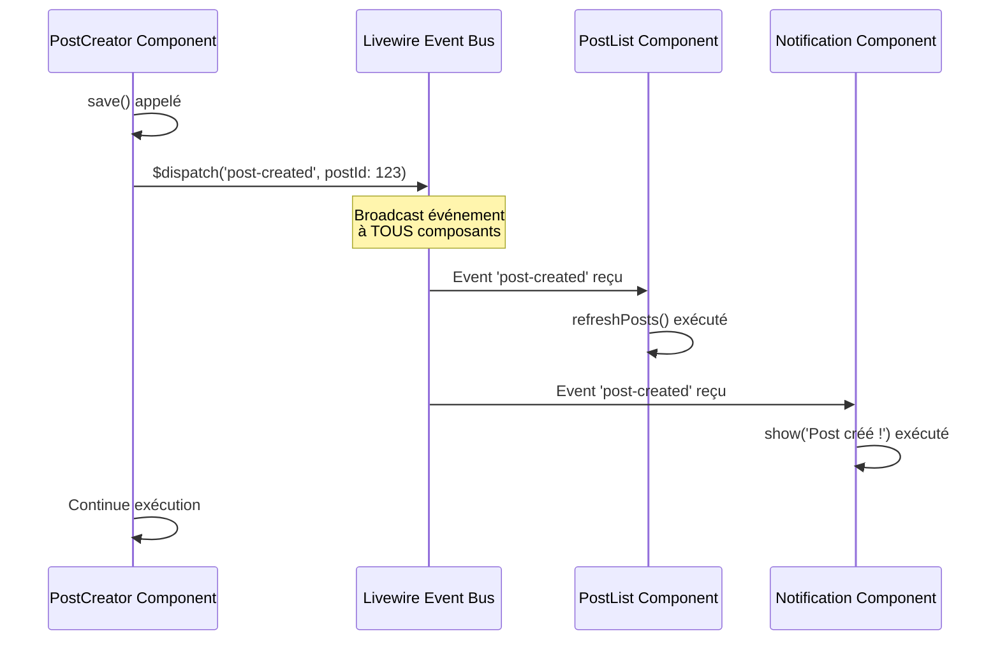

# V — Événements & Com'

<div
  class="omny-meta"
  data-level="🔴 Avancé"
  data-duration="6-7 heures"
  data-lessons="9">
</div>

## Vue d'ensemble

!!! quote "Analogie pédagogique"
    _Imaginez un **orchestre symphonique** : le chef d'orchestre (composant parent) lève sa baguette et donne un signal (dispatch événement), instantanément tous les musiciens concernés (composants listeners) réagissent en parfaite synchronisation - les violons commencent leur mélodie, les trompettes entrent au bon moment, les percussions suivent le rythme. **Personne ne se parle directement**, il n'y a pas de violoniste qui tape sur l'épaule du trompettiste. **Le signal est émis dans l'espace** (événement global), et seuls ceux qui écoutent ce signal spécifique réagissent. Un violoniste peut aussi émettre son propre signal (événement enfant → parent) : "j'ai terminé mon solo" et le chef ajuste en conséquence. **Livewire fonctionne exactement pareil** : les composants communiquent via événements sans couplage direct. Un composant émet (`$dispatch`), un autre écoute (`#[On]`), aucun n'a besoin de connaître l'existence de l'autre. C'est le **découplage parfait** : architecture modulaire, composants réutilisables, maintenance facile. Les événements sont l'**ADN d'une application Livewire scalable**._

**Les événements Livewire permettent communication découplée entre composants :**

- ✅ **`$dispatch()`** = Émettre événement (depuis PHP ou Blade)
- ✅ **`#[On('event')]`** = Écouter événement (attribut PHP 8)
- ✅ **Événements globaux** = Broadcasting vers TOUS composants
- ✅ **Événements parent → enfant** = `$dispatch('event')->to('child')`
- ✅ **Événements enfant → parent** = `$dispatch('event')->up()`
- ✅ **Browser events** = JavaScript ↔ Livewire (`window.addEventListener`)
- ✅ **Payload événements** = Passer données avec événement

**Ce module couvre :**

1. `$dispatch()` - Émettre événements
2. `#[On]` - Écouter événements (Livewire 3)
3. Événements globaux (broadcast)
4. Communication parent → enfant
5. Communication enfant → parent
6. Communication sibling (composants frères)
7. Browser events (JS ↔ Livewire)
8. Payload événements et typage
9. Patterns pub/sub et architecture

---

## Leçon 1 : $dispatch() - Émettre Événements

### 1.1 Syntaxe Basique

**`$dispatch()` émet événement depuis composant PHP**

```php
<?php

namespace App\Livewire;

use Livewire\Component;

class PostCreator extends Component
{
    public string $title = '';
    public string $content = '';

    public function save(): void
    {
        $post = Post::create([
            'title' => $this->title,
            'content' => $this->content,
        ]);

        // Émettre événement global
        $this->dispatch('post-created', postId: $post->id);

        // Reset formulaire
        $this->reset(['title', 'content']);
    }

    public function render()
    {
        return view('livewire.post-creator');
    }
}
```

**Syntaxe `$dispatch()` :**

```php
<?php

// Événement simple (sans données)
$this->dispatch('refresh-posts');

// Événement avec payload (named arguments)
$this->dispatch('post-created', postId: 123, title: 'New Post');

// Événement avec array payload
$this->dispatch('user-updated', user: [
    'id' => 1,
    'name' => 'John Doe',
    'email' => 'john@example.com'
]);

// Événement avec Eloquent model
$this->dispatch('model-saved', model: $post);
```

### 1.2 Émettre depuis Blade

**`wire:click="$dispatch('event')"` émet événement depuis vue**

```blade
{{-- resources/views/livewire/post-creator.blade.php --}}
<div>
    <form wire:submit.prevent="save">
        <input type="text" wire:model="title">
        <textarea wire:model="content"></textarea>
        
        <button type="submit">Save</button>
    </form>

    {{-- Dispatch depuis Blade --}}
    <button wire:click="$dispatch('modal-closed')">
        Close Modal
    </button>

    {{-- Dispatch avec payload --}}
    <button wire:click="$dispatch('notification-sent', { type: 'success', message: 'Saved!' })">
        Show Notification
    </button>
</div>
```

### 1.3 Dispatch depuis JavaScript (Alpine.js)

```blade
<div x-data>
    {{-- Alpine.js peut dispatcher événements Livewire --}}
    <button @click="$dispatch('livewire:event', { name: 'refresh-data' })">
        Refresh from Alpine
    </button>

    {{-- Ou via $wire --}}
    <button @click="$wire.dispatch('button-clicked')">
        Click me
    </button>
</div>
```

### 1.4 Diagramme : Flow $dispatch()



---

## Leçon 2 : #[On] - Écouter Événements (Livewire 3)

### 2.1 Attribut #[On] (PHP 8)

**`#[On('event-name')]` écoute événement spécifique**

```php
<?php

namespace App\Livewire;

use Livewire\Component;
use Livewire\Attributes\On;

class PostList extends Component
{
    public $posts;

    public function mount(): void
    {
        $this->loadPosts();
    }

    /**
     * Écoute événement 'post-created'
     * Méthode appelée automatiquement quand événement dispatché
     */
    #[On('post-created')]
    public function refreshPosts(): void
    {
        $this->loadPosts();
        
        session()->flash('message', 'Liste rafraîchie après création post.');
    }

    /**
     * Écoute événement 'post-deleted'
     */
    #[On('post-deleted')]
    public function handlePostDeleted(int $postId): void
    {
        $this->loadPosts();
        
        Log::info('Post deleted', ['post_id' => $postId]);
    }

    protected function loadPosts(): void
    {
        $this->posts = Post::latest()->get();
    }

    public function render()
    {
        return view('livewire.post-list');
    }
}
```

**Conventions :**

- Attribut `#[On('event-name')]` au-dessus de la méthode
- Méthode peut avoir n'importe quel nom (pas besoin "on" prefix)
- Méthode reçoit payload comme paramètres

### 2.2 Écouter Multiple Événements

```php
<?php

namespace App\Livewire;

use Livewire\Component;
use Livewire\Attributes\On;

class Notification extends Component
{
    public string $message = '';
    public string $type = 'info'; // success, error, warning, info
    public bool $visible = false;

    /**
     * Écouter événement 'notification'
     */
    #[On('notification')]
    public function show(string $message, string $type = 'info'): void
    {
        $this->message = $message;
        $this->type = $type;
        $this->visible = true;
    }

    /**
     * Écouter événement 'notification-success'
     */
    #[On('notification-success')]
    public function showSuccess(string $message): void
    {
        $this->show($message, 'success');
    }

    /**
     * Écouter événement 'notification-error'
     */
    #[On('notification-error')]
    public function showError(string $message): void
    {
        $this->show($message, 'error');
    }

    /**
     * Écouter événement 'hide-notification'
     */
    #[On('hide-notification')]
    public function hide(): void
    {
        $this->visible = false;
    }

    public function render()
    {
        return view('livewire.notification');
    }
}
```

**Utilisation :**

```php
<?php

// Composant émetteur
class PostCreator extends Component
{
    public function save(): void
    {
        try {
            Post::create(['title' => $this->title]);
            
            // Success notification
            $this->dispatch('notification-success', message: 'Post créé avec succès !');
            
        } catch (\Exception $e) {
            // Error notification
            $this->dispatch('notification-error', message: 'Erreur : ' . $e->getMessage());
        }
    }
}
```

### 2.3 Écouter avec Pattern Matching

```php
<?php

namespace App\Livewire;

use Livewire\Component;
use Livewire\Attributes\On;

class Logger extends Component
{
    public array $logs = [];

    /**
     * Écouter TOUS événements commençant par 'log-'
     */
    #[On('log-*')]
    public function handleLog(string $level, string $message): void
    {
        $this->logs[] = [
            'level' => $level,
            'message' => $message,
            'timestamp' => now()->toDateTimeString(),
        ];

        // Garder seulement 100 derniers logs
        $this->logs = array_slice($this->logs, -100);
    }

    public function render()
    {
        return view('livewire.logger');
    }
}
```

**Émission :**

```php
<?php

// Différents niveaux logs
$this->dispatch('log-info', level: 'info', message: 'User logged in');
$this->dispatch('log-warning', level: 'warning', message: 'API slow response');
$this->dispatch('log-error', level: 'error', message: 'Database connection failed');

// Tous captés par #[On('log-*')]
```

---

## Leçon 3 : Événements Globaux (Broadcast)

### 3.1 Dispatch Global par Défaut

**Par défaut, `$dispatch()` émet événement GLOBAL (tous composants)**

```php
<?php

namespace App\Livewire;

use Livewire\Component;

class AuthButton extends Component
{
    public function logout(): void
    {
        Auth::logout();

        // Événement global : TOUS composants écoutant 'user-logged-out' réagissent
        $this->dispatch('user-logged-out');

        return redirect('/login');
    }

    public function render()
    {
        return view('livewire.auth-button');
    }
}
```

**Composants écoutant :**

```php
<?php

// Composant 1 : UserMenu
class UserMenu extends Component
{
    #[On('user-logged-out')]
    public function handleLogout(): void
    {
        // Reset menu
        $this->menuOpen = false;
    }
}

// Composant 2 : ShoppingCart
class ShoppingCart extends Component
{
    #[On('user-logged-out')]
    public function clearCart(): void
    {
        // Vider panier
        $this->items = [];
    }
}

// Composant 3 : Analytics
class Analytics extends Component
{
    #[On('user-logged-out')]
    public function trackLogout(): void
    {
        // Track analytics
        Analytics::track('logout', ['user_id' => auth()->id()]);
    }
}

// TOUS ces composants réagissent au MÊME événement
```

### 3.2 Cas d'Usage Événements Globaux

**Use Case 1 : Refresh Multiple Components**

```php
<?php

// Bouton refresh global
class RefreshButton extends Component
{
    public function refresh(): void
    {
        // Dispatcher refresh global
        $this->dispatch('refresh-all');
    }
}
```

```php
<?php

// Tous composants data écoutent
class PostList extends Component
{
    #[On('refresh-all')]
    public function refresh(): void
    {
        $this->posts = Post::latest()->get();
    }
}

class UserList extends Component
{
    #[On('refresh-all')]
    public function refresh(): void
    {
        $this->users = User::all();
    }
}

class Statistics extends Component
{
    #[On('refresh-all')]
    public function refresh(): void
    {
        $this->stats = $this->calculateStats();
    }
}
```

**Use Case 2 : Theme Toggle Global**

```php
<?php

class ThemeToggle extends Component
{
    public function toggleTheme(): void
    {
        $newTheme = session('theme') === 'dark' ? 'light' : 'dark';
        session(['theme' => $newTheme]);

        // Notifier tous composants du changement thème
        $this->dispatch('theme-changed', theme: $newTheme);
    }
}
```

```php
<?php

// Tous composants UI réagissent
class Header extends Component
{
    #[On('theme-changed')]
    public function updateTheme(string $theme): void
    {
        $this->theme = $theme;
    }
}

class Sidebar extends Component
{
    #[On('theme-changed')]
    public function updateTheme(string $theme): void
    {
        $this->theme = $theme;
    }
}
```

---

## Leçon 4 : Communication Parent → Enfant

### 4.1 Dispatch To (Ciblé)

**`$dispatch()->to('component-name')` cible composant spécifique**

```php
<?php

namespace App\Livewire;

use Livewire\Component;

class ParentDashboard extends Component
{
    public function refreshChild(): void
    {
        // Dispatcher UNIQUEMENT vers PostList (pas global)
        $this->dispatch('refresh')->to('post-list');
    }

    public function render()
    {
        return view('livewire.parent-dashboard');
    }
}
```

```blade
{{-- resources/views/livewire/parent-dashboard.blade.php --}}
<div>
    <button wire:click="refreshChild">
        Refresh Posts Only
    </button>

    {{-- Composant enfant PostList --}}
    <livewire:post-list />
    
    {{-- Autre composant UserList (ne reçoit PAS l'événement) --}}
    <livewire:user-list />
</div>
```

```php
<?php

namespace App\Livewire;

use Livewire\Component;
use Livewire\Attributes\On;

class PostList extends Component
{
    public $posts;

    #[On('refresh')]
    public function refresh(): void
    {
        $this->posts = Post::all();
    }

    public function render()
    {
        return view('livewire.post-list');
    }
}
```

### 4.2 Dispatch To avec ID Composant

```php
<?php

namespace App\Livewire;

use Livewire\Component;

class TabsContainer extends Component
{
    public string $activeTab = 'tab1';

    public function switchTab(string $tabId): void
    {
        $this->activeTab = $tabId;

        // Dispatcher vers tab spécifique par ID
        $this->dispatch('tab-activated')->to($tabId);
    }

    public function render()
    {
        return view('livewire.tabs-container');
    }
}
```

```blade
{{-- Tabs avec IDs uniques --}}
<div>
    <button wire:click="switchTab('tab-content-1')">Tab 1</button>
    <button wire:click="switchTab('tab-content-2')">Tab 2</button>

    <livewire:tab-content wire:key="tab-content-1" :tabId="1" />
    <livewire:tab-content wire:key="tab-content-2" :tabId="2" />
</div>
```

### 4.3 Dispatch Self (Composant Lui-même)

```php
<?php

namespace App\Livewire;

use Livewire\Component;
use Livewire\Attributes\On;

class AutoRefresh extends Component
{
    public function startAutoRefresh(): void
    {
        // Dispatcher vers soi-même (internal event)
        $this->dispatch('internal-refresh')->self();
    }

    #[On('internal-refresh')]
    public function handleRefresh(): void
    {
        // Logique refresh
        $this->data = $this->fetchData();
    }

    public function render()
    {
        return view('livewire.auto-refresh');
    }
}
```

---

## Leçon 5 : Communication Enfant → Parent

### 5.1 Dispatch Up (Bubble Up)

**`$dispatch()->up()` remonte événement vers parent**

```php
<?php

namespace App\Livewire;

use Livewire\Component;

class ModalForm extends Component
{
    public string $name = '';

    public function save(): void
    {
        // Sauvegarder données
        User::create(['name' => $this->name]);

        // Remonter événement vers parent
        $this->dispatch('form-submitted')->up();
    }

    public function cancel(): void
    {
        // Remonter événement cancel
        $this->dispatch('form-cancelled')->up();
    }

    public function render()
    {
        return view('livewire.modal-form');
    }
}
```

**Parent écoute :**

```php
<?php

namespace App\Livewire;

use Livewire\Component;
use Livewire\Attributes\On;

class Dashboard extends Component
{
    public bool $modalOpen = false;

    public function openModal(): void
    {
        $this->modalOpen = true;
    }

    /**
     * Écouter événement venant d'enfant
     */
    #[On('form-submitted')]
    public function handleFormSubmitted(): void
    {
        $this->modalOpen = false;
        
        session()->flash('success', 'Formulaire soumis avec succès !');
    }

    #[On('form-cancelled')]
    public function handleFormCancelled(): void
    {
        $this->modalOpen = false;
    }

    public function render()
    {
        return view('livewire.dashboard');
    }
}
```

```blade
{{-- resources/views/livewire/dashboard.blade.php --}}
<div>
    <button wire:click="openModal">Open Modal</button>

    @if($modalOpen)
        <div class="modal">
            {{-- Composant enfant ModalForm --}}
            <livewire:modal-form />
        </div>
    @endif

    @if(session('success'))
        <div class="alert-success">{{ session('success') }}</div>
    @endif
</div>
```

### 5.2 Dispatch Up avec Payload

```php
<?php

namespace App\Livewire;

use Livewire\Component;

class ItemSelector extends Component
{
    public function selectItem(int $itemId, string $itemName): void
    {
        // Remonter sélection vers parent
        $this->dispatch('item-selected', 
            itemId: $itemId, 
            itemName: $itemName
        )->up();
    }

    public function render()
    {
        return view('livewire.item-selector');
    }
}
```

**Parent reçoit payload :**

```php
<?php

namespace App\Livewire;

use Livewire\Component;
use Livewire\Attributes\On;

class ShoppingCart extends Component
{
    public array $selectedItems = [];

    #[On('item-selected')]
    public function addItemToCart(int $itemId, string $itemName): void
    {
        $this->selectedItems[] = [
            'id' => $itemId,
            'name' => $itemName,
        ];
    }

    public function render()
    {
        return view('livewire.shopping-cart');
    }
}
```

### 5.3 Diagramme : Enfant → Parent Flow

```mermaid
graph TB
    Child[Composant Enfant<br/>ModalForm] -->|wire:click="save"| SaveMethod[save]
    SaveMethod --> Dispatch["$dispatch('form-submitted')->up()"]
    Dispatch --> Bubble[Bubble Up vers Parent]
    Bubble --> Parent[Composant Parent<br/>Dashboard]
    Parent --> Listener["#[On('form-submitted')]<br/>handleFormSubmitted"]
    Listener --> Action[Ferme modal<br/>Flash message]
    
    style Child fill:#6cf,color:#000
    style Parent fill:#f96,color:#fff
    style Dispatch fill:#fc6,color:#000
```

---

## Leçon 6 : Communication Sibling (Frères)

### 6.1 Communication via Parent (Relay Pattern)

**Pattern : Enfant 1 → Parent → Enfant 2**

```php
<?php

// Enfant 1 : ProductFilter
namespace App\Livewire;

use Livewire\Component;

class ProductFilter extends Component
{
    public string $category = '';

    public function applyFilter(): void
    {
        // Remonter vers parent
        $this->dispatch('filter-changed', category: $this->category)->up();
    }

    public function render()
    {
        return view('livewire.product-filter');
    }
}
```

```php
<?php

// Parent : ProductPage (relay)
namespace App\Livewire;

use Livewire\Component;
use Livewire\Attributes\On;

class ProductPage extends Component
{
    #[On('filter-changed')]
    public function handleFilterChanged(string $category): void
    {
        // Relayer vers ProductList
        $this->dispatch('apply-filter', category: $category)->to('product-list');
    }

    public function render()
    {
        return view('livewire.product-page');
    }
}
```

```php
<?php

// Enfant 2 : ProductList
namespace App\Livewire;

use Livewire\Component;
use Livewire\Attributes\On;

class ProductList extends Component
{
    public $products;
    public string $categoryFilter = '';

    #[On('apply-filter')]
    public function applyFilter(string $category): void
    {
        $this->categoryFilter = $category;
        $this->loadProducts();
    }

    protected function loadProducts(): void
    {
        $query = Product::query();

        if ($this->categoryFilter) {
            $query->where('category', $this->categoryFilter);
        }

        $this->products = $query->get();
    }

    public function render()
    {
        return view('livewire.product-list');
    }
}
```

**Vue parent :**

```blade
{{-- resources/views/livewire/product-page.blade.php --}}
<div>
    <div class="sidebar">
        {{-- Enfant 1 : Filters --}}
        <livewire:product-filter />
    </div>

    <div class="main">
        {{-- Enfant 2 : List --}}
        <livewire:product-list />
    </div>
</div>
```

### 6.2 Communication Directe via Événements Globaux

**Alternative : Siblings communiquent directement via événement global**

```php
<?php

// Sibling 1 : ProductFilter
class ProductFilter extends Component
{
    public function applyFilter(): void
    {
        // Dispatch GLOBAL (pas up)
        $this->dispatch('filter-changed', category: $this->category);
    }
}
```

```php
<?php

// Sibling 2 : ProductList écoute directement
class ProductList extends Component
{
    #[On('filter-changed')]
    public function applyFilter(string $category): void
    {
        $this->categoryFilter = $category;
        $this->loadProducts();
    }
}
```

**⚠️ Relay Pattern vs Global Events :**

| Pattern | Avantages | Inconvénients |
|---------|-----------|---------------|
| **Relay via Parent** | Parent contrôle flow, logique centralisée | Plus de code, couplage parent |
| **Global Events** | Simple, découplé | Moins de contrôle, tous composants reçoivent |

**Recommandation :**
- **Relay** : Quand parent doit transformer/valider données
- **Global** : Communication simple entre siblings

---

## Leçon 7 : Browser Events (JS ↔ Livewire)

### 7.1 Livewire → JavaScript

**Dispatch événement vers JavaScript**

```php
<?php

namespace App\Livewire;

use Livewire\Component;

class Notification extends Component
{
    public function showToast(): void
    {
        // Dispatcher événement vers browser/JavaScript
        $this->dispatch('show-toast', 
            message: 'Action réussie !',
            type: 'success'
        );
    }

    public function render()
    {
        return view('livewire.notification');
    }
}
```

**Écouter en JavaScript :**

```javascript
// Méthode 1 : window.addEventListener
window.addEventListener('show-toast', (event) => {
    const { message, type } = event.detail;
    
    // Afficher toast (ex: Toastify, SweetAlert)
    Toastify({
        text: message,
        duration: 3000,
        backgroundColor: type === 'success' ? '#48bb78' : '#f56565',
    }).showToast();
});
```

```blade
{{-- Méthode 2 : Alpine.js @event --}}
<div x-data @show-toast.window="
    Toastify({
        text: $event.detail.message,
        duration: 3000,
        backgroundColor: $event.detail.type === 'success' ? '#48bb78' : '#f56565',
    }).showToast()
">
    <!-- Contenu -->
</div>
```

### 7.2 JavaScript → Livewire

**Dispatch événement depuis JavaScript vers Livewire**

```javascript
// Vanilla JavaScript
window.dispatchEvent(new CustomEvent('user-action', {
    detail: { action: 'click', target: 'button-1' }
}));

// Ou via Livewire helper
Livewire.dispatch('user-action', { action: 'click', target: 'button-1' });
```

**Écouter en Livewire :**

```php
<?php

namespace App\Livewire;

use Livewire\Component;
use Livewire\Attributes\On;

class Analytics extends Component
{
    #[On('user-action')]
    public function trackAction(string $action, string $target): void
    {
        Analytics::track('user_action', [
            'action' => $action,
            'target' => $target,
            'user_id' => auth()->id(),
            'timestamp' => now(),
        ]);
    }

    public function render()
    {
        return view('livewire.analytics');
    }
}
```

### 7.3 Use Cases Browser Events

**Use Case 1 : Scroll to Element**

```php
<?php

class PostList extends Component
{
    public function loadMore(): void
    {
        $this->loadMorePosts();

        // Dispatcher scroll event
        $this->dispatch('scroll-to-bottom');
    }
}
```

```javascript
window.addEventListener('scroll-to-bottom', () => {
    window.scrollTo({
        top: document.body.scrollHeight,
        behavior: 'smooth'
    });
});
```

**Use Case 2 : Open External Modal (Bootstrap, Modal JS)**

```php
<?php

class ModalTrigger extends Component
{
    public function openExternalModal(): void
    {
        $this->dispatch('open-bootstrap-modal', modalId: 'myModal');
    }
}
```

```javascript
window.addEventListener('open-bootstrap-modal', (event) => {
    const { modalId } = event.detail;
    const modal = new bootstrap.Modal(document.getElementById(modalId));
    modal.show();
});
```

**Use Case 3 : Copy to Clipboard**

```php
<?php

class ShareButton extends Component
{
    public function copyLink(): void
    {
        $link = route('post.show', $this->post->id);

        // Dispatcher vers JS pour copier
        $this->dispatch('copy-to-clipboard', text: $link);
    }
}
```

```javascript
window.addEventListener('copy-to-clipboard', async (event) => {
    const { text } = event.detail;
    
    try {
        await navigator.clipboard.writeText(text);
        alert('Lien copié !');
    } catch (err) {
        console.error('Erreur copie clipboard:', err);
    }
});
```

---

## Leçon 8 : Payload Événements et Typage

### 8.1 Payload Simple (Primitives)

```php
<?php

// Dispatch avec primitives
$this->dispatch('user-updated', 
    userId: 123,                    // int
    name: 'John Doe',               // string
    active: true,                   // bool
    salary: 50000.50               // float
);
```

```php
<?php

// Listener avec typage strict
#[On('user-updated')]
public function handleUserUpdated(
    int $userId, 
    string $name, 
    bool $active, 
    float $salary
): void {
    // Paramètres typés
}
```

### 8.2 Payload Complexe (Arrays, Objects)

```php
<?php

namespace App\Livewire;

use Livewire\Component;
use App\Models\User;

class UserEditor extends Component
{
    public function save(): void
    {
        $user = User::create([...]);

        // Dispatch avec array
        $this->dispatch('user-saved', user: [
            'id' => $user->id,
            'name' => $user->name,
            'email' => $user->email,
            'roles' => $user->roles->pluck('name')->toArray(),
        ]);

        // Dispatch avec Eloquent model (sérialisé automatiquement)
        $this->dispatch('user-model-saved', user: $user);
    }

    public function render()
    {
        return view('livewire.user-editor');
    }
}
```

**Listener :**

```php
<?php

#[On('user-saved')]
public function handleUserSaved(array $user): void
{
    // Accéder aux clés array
    $userName = $user['name'];
    $userRoles = $user['roles'];
    
    // Traiter...
}

#[On('user-model-saved')]
public function handleUserModelSaved(User $user): void
{
    // Eloquent model directement
    $userName = $user->name;
    $userRoles = $user->roles;
}
```

### 8.3 Validation Payload

```php
<?php

namespace App\Livewire;

use Livewire\Component;
use Livewire\Attributes\On;

class DataReceiver extends Component
{
    #[On('data-received')]
    public function handleData(array $data): void
    {
        // Valider payload avant traiter
        if (!isset($data['id']) || !isset($data['name'])) {
            Log::error('Invalid payload', ['data' => $data]);
            return;
        }

        // Valider types
        if (!is_int($data['id']) || !is_string($data['name'])) {
            Log::error('Invalid types', ['data' => $data]);
            return;
        }

        // Traiter données valides
        $this->processData($data);
    }

    protected function processData(array $data): void
    {
        // Logic...
    }

    public function render()
    {
        return view('livewire.data-receiver');
    }
}
```

### 8.4 Payload avec DTOs (Data Transfer Objects)

```php
<?php

namespace App\DataTransferObjects;

class UserData
{
    public function __construct(
        public int $id,
        public string $name,
        public string $email,
        public array $roles,
    ) {}

    public static function fromArray(array $data): self
    {
        return new self(
            id: $data['id'],
            name: $data['name'],
            email: $data['email'],
            roles: $data['roles'] ?? [],
        );
    }

    public function toArray(): array
    {
        return [
            'id' => $this->id,
            'name' => $this->name,
            'email' => $this->email,
            'roles' => $this->roles,
        ];
    }
}
```

**Dispatch avec DTO :**

```php
<?php

class UserEditor extends Component
{
    public function save(): void
    {
        $user = User::create([...]);

        $userData = new UserData(
            id: $user->id,
            name: $user->name,
            email: $user->email,
            roles: $user->roles->pluck('name')->toArray(),
        );

        // Dispatch DTO as array
        $this->dispatch('user-saved', user: $userData->toArray());
    }
}
```

**Listener avec DTO :**

```php
<?php

#[On('user-saved')]
public function handleUserSaved(array $user): void
{
    $userData = UserData::fromArray($user);

    // Type-safe access
    $this->userId = $userData->id;
    $this->userName = $userData->name;
}
```

---

## Leçon 9 : Patterns Pub/Sub et Architecture

### 9.1 Event Bus Pattern

**Créer Event Bus centralisé**

```php
<?php

namespace App\Livewire;

use Livewire\Component;

class EventBus extends Component
{
    /**
     * Dispatcher événement via bus centralisé
     */
    public function publish(string $event, array $payload = []): void
    {
        $this->dispatch($event, ...$payload);
        
        // Log tous événements
        Log::channel('events')->info('Event published', [
            'event' => $event,
            'payload' => $payload,
            'timestamp' => now(),
        ]);
    }

    public function render()
    {
        return view('livewire.event-bus');
    }
}
```

**Composants utilisent Event Bus :**

```php
<?php

class PostCreator extends Component
{
    public function save(): void
    {
        $post = Post::create([...]);

        // Via Event Bus
        $this->dispatch('publish', 
            event: 'post-created', 
            payload: ['postId' => $post->id]
        )->to('event-bus');
    }
}
```

### 9.2 Command Pattern

```php
<?php

namespace App\Livewire\Commands;

interface Command
{
    public function execute(): void;
}
```

```php
<?php

namespace App\Livewire\Commands;

class CreatePostCommand implements Command
{
    public function __construct(
        protected string $title,
        protected string $content,
    ) {}

    public function execute(): void
    {
        $post = Post::create([
            'title' => $this->title,
            'content' => $this->content,
        ]);

        // Dispatch success event
        event(new PostCreated($post));
    }
}
```

**Dispatcher commandes :**

```php
<?php

class CommandDispatcher extends Component
{
    #[On('execute-command')]
    public function handleCommand(string $commandClass, array $params): void
    {
        $command = new $commandClass(...$params);
        $command->execute();
    }
}
```

### 9.3 Observer Pattern

```php
<?php

namespace App\Livewire;

use Livewire\Component;
use Livewire\Attributes\On;

class DataObserver extends Component
{
    protected array $observers = [];

    public function attach(string $observerId): void
    {
        $this->observers[] = $observerId;
    }

    public function detach(string $observerId): void
    {
        $this->observers = array_filter($this->observers, fn($id) => $id !== $observerId);
    }

    public function notify(string $event, array $data = []): void
    {
        foreach ($this->observers as $observerId) {
            $this->dispatch($event, ...$data)->to($observerId);
        }
    }

    public function render()
    {
        return view('livewire.data-observer');
    }
}
```

### 9.4 Debouncing Événements

```php
<?php

namespace App\Livewire;

use Livewire\Component;

class SearchBar extends Component
{
    public string $search = '';
    protected int $debounceMs = 300;
    protected ?string $lastDispatchTime = null;

    public function updatedSearch(string $value): void
    {
        // Dispatcher événement avec debounce côté serveur
        $now = microtime(true);
        
        if ($this->lastDispatchTime === null || 
            ($now - $this->lastDispatchTime) >= ($this->debounceMs / 1000)
        ) {
            $this->dispatch('search-query-changed', query: $value);
            $this->lastDispatchTime = $now;
        }
    }

    public function render()
    {
        return view('livewire.search-bar');
    }
}
```

**Alternative : Debounce côté client (JavaScript)**

```blade
<input 
    type="text" 
    wire:model.live.debounce.300ms="search"
    x-on:input.debounce.300ms="$dispatch('client-search', { query: $event.target.value })"
>
```

---

## Projet 1 : Notification System Complet

**Objectif :** Système notifications toast réutilisable

**Fonctionnalités :**
- Composant Notification centralisé
- Écoute événements globaux ('notification', 'notification-success', 'notification-error')
- Auto-hide après 5 secondes
- Queue multiple notifications
- Animations entrée/sortie
- Close manuel
- Browser events pour JS external

**Architecture :**

```
NotificationManager (composant central)
  ├─ Écoute : notification-*
  ├─ Gère queue
  └─ Dispatch browser event 'toast-shown'

PostCreator → dispatch('notification-success')
UserEditor → dispatch('notification-error')
```

**Code disponible repository.**

---

## Projet 2 : Real-time Chat (Event-Driven)

**Objectif :** Chat temps réel avec événements

**Fonctionnalités :**
- Envoi message (`dispatch('message-sent')`)
- Réception messages (listeners)
- Typing indicators (`dispatch('user-typing')`)
- User online/offline (`dispatch('user-status-changed')`)
- Message read receipts
- Browser events pour notifications desktop

**Architecture :**

```
ChatRoom (parent)
  ├─ MessageList (enfant)
  │   └─ Écoute : message-sent
  ├─ MessageInput (enfant)
  │   └─ Dispatch : message-sent, user-typing
  └─ UserList (sibling)
      └─ Écoute : user-status-changed
```

**Code disponible repository.**

---

## Projet 3 : Event-Driven Dashboard

**Objectif :** Dashboard analytiques avec événements

**Fonctionnalités :**
- Refresh global (`dispatch('refresh-all')`)
- Filtres date range (sibling communication)
- Export données (`dispatch('export-requested')`)
- Widget communication (pub/sub)
- Analytics tracking (browser events)

**Widgets :**
- RevenueChart → écoute 'filter-changed'
- UsersTable → écoute 'filter-changed'
- Statistics → écoute 'filter-changed'
- DateFilter → dispatch 'filter-changed'

**Code disponible repository.**

---

## Checklist Module V

- [ ] `$dispatch()` émet événements depuis PHP ou Blade
- [ ] `#[On('event')]` écoute événements (attribut PHP 8)
- [ ] Événements globaux broadcast vers TOUS composants
- [ ] `$dispatch()->to('component')` cible composant spécifique
- [ ] `$dispatch()->up()` remonte événement vers parent
- [ ] `$dispatch()->self()` événement interne composant
- [ ] Communication sibling via relay parent ou global events
- [ ] Browser events (`window.addEventListener`) pour JS ↔ Livewire
- [ ] Payload événements avec typage strict
- [ ] Patterns pub/sub et architecture découplée

**Concepts clés maîtrisés :**

✅ `$dispatch()` émettre événements
✅ `#[On]` écouter événements
✅ Communication parent ↔ enfant
✅ Communication siblings
✅ Browser events JS ↔ Livewire
✅ Payload typage et validation
✅ Patterns pub/sub avancés
✅ Architecture découplée modulaire

---

**Module V terminé ! 🎉**

**Prochaine étape : Module VI - Validation & Formulaires**

Vous maîtrisez maintenant la communication inter-composants Livewire. Le Module VI approfondit la validation temps réel, règles Laravel, messages personnalisés, validation conditionnelle et formulaires complexes multi-étapes.

<br />