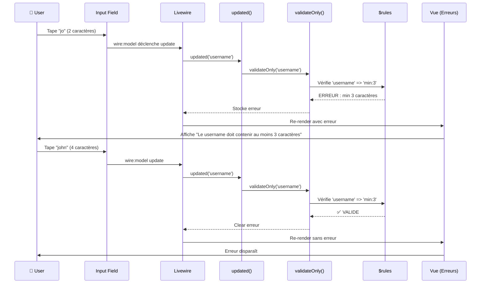

# VI — Forms & Validation

<div
  class="omny-meta"
  data-level="🟡 Intermédiaire"
  data-duration="6-7 heures"
  data-lessons="9">
</div>

## Vue d'ensemble

!!! quote "Analogie pédagogique"
    _Imaginez un **contrôle de sécurité d'aéroport multi-niveaux** : quand vous passez (soumettez formulaire), vous traversez plusieurs checkpoints successifs. **Premier niveau (validation HTML5)** : scanner basique détecte objets interdits évidents (champ vide, email sans @). **Deuxième niveau (validation temps réel Livewire)** : agent examine passeport caractère par caractère pendant que vous le tapez, vous alerte IMMÉDIATEMENT si erreur (email déjà utilisé). **Troisième niveau (validation serveur finale)** : inspection approfondie avant embarquement, vérifications database, règles métier complexes (âge minimum 18 ans, passport valide 6 mois). **Quatrième niveau (validation conditionnelle)** : règles changent selon contexte - si classe affaires, vérifier carte membre platine ; si bagage, vérifier poids. **Livewire, c'est ce système de sécurité intelligent** : validation **progressive** (temps réel sans spam serveur), **exhaustive** (toutes règles Laravel), **contextuelle** (règles changent selon état formulaire), **UX optimale** (feedback instantané). Pas de formulaire soumis pour découvrir 10 erreurs. **Chaque champ validé individuellement, en temps réel, côté serveur sécurisé**. C'est la **validation moderne full-stack** : sécurité backend + UX frontend._

**La validation Livewire combine puissance Laravel et réactivité temps réel :**

- ✅ **Règles Laravel natives** (`required`, `email`, `unique`, `min`, `max`, etc.)
- ✅ **Validation temps réel** (feedback instant à chaque modification)
- ✅ **Messages personnalisés** (français, contextuels, clairs)
- ✅ **Validation conditionnelle** (règles changent selon état)
- ✅ **Custom validators** (règles métier spécifiques)
- ✅ **Formulaires multi-étapes** (validation par section)
- ✅ **Gestion erreurs granulaire** (par champ, globale, bag)
- ✅ **Performance optimisée** (debounce, lazy, validation ciblée)

**Ce module couvre :**

1. Validation basique (`$rules`, `validate()`)
2. Validation temps réel (`updated()`, `validateOnly()`)
3. Messages personnalisés et traduction
4. Règles validation Laravel complètes
5. Validation conditionnelle et dynamique
6. Custom validators et règles métier
7. Formulaires multi-étapes avec validation
8. Error bags et gestion erreurs avancée
9. Patterns validation production

---

## Leçon 1 : Validation Basique

### 1.1 Propriété $rules

**`$rules` définit règles validation Laravel pour propriétés publiques**

```php
<?php

namespace App\Livewire;

use Livewire\Component;

class ContactForm extends Component
{
    public string $name = '';
    public string $email = '';
    public string $subject = '';
    public string $message = '';

    /**
     * Règles validation (array associatif)
     * Clé = nom propriété, Valeur = règles (string ou array)
     */
    protected $rules = [
        'name' => 'required|min:3|max:50',
        'email' => 'required|email',
        'subject' => 'required|min:5|max:100',
        'message' => 'required|min:10|max:1000',
    ];

    /**
     * Submit formulaire avec validation
     */
    public function submit(): void
    {
        // Valider toutes propriétés selon $rules
        $validatedData = $this->validate();

        // Si validation passe, traiter données
        // Mail::to('admin@example.com')->send(new ContactMessage($validatedData));

        session()->flash('success', 'Message envoyé avec succès !');
        
        $this->reset(['name', 'email', 'subject', 'message']);
    }

    public function render()
    {
        return view('livewire.contact-form');
    }
}
```

**Vue avec affichage erreurs :**

```blade
{{-- resources/views/livewire/contact-form.blade.php --}}
<div>
    <form wire:submit.prevent="submit">
        
        {{-- Name field --}}
        <div class="mb-4">
            <label for="name" class="block font-medium mb-2">
                Nom *
            </label>
            <input 
                type="text" 
                id="name"
                wire:model="name"
                class="w-full px-4 py-2 border rounded @error('name') border-red-500 @enderror"
            >
            @error('name')
                <span class="text-red-500 text-sm mt-1">{{ $message }}</span>
            @enderror
        </div>

        {{-- Email field --}}
        <div class="mb-4">
            <label for="email" class="block font-medium mb-2">
                Email *
            </label>
            <input 
                type="email" 
                id="email"
                wire:model="email"
                class="w-full px-4 py-2 border rounded @error('email') border-red-500 @enderror"
            >
            @error('email')
                <span class="text-red-500 text-sm mt-1">{{ $message }}</span>
            @enderror
        </div>

        {{-- Subject field --}}
        <div class="mb-4">
            <label for="subject" class="block font-medium mb-2">
                Sujet *
            </label>
            <input 
                type="text" 
                id="subject"
                wire:model="subject"
                class="w-full px-4 py-2 border rounded @error('subject') border-red-500 @enderror"
            >
            @error('subject')
                <span class="text-red-500 text-sm mt-1">{{ $message }}</span>
            @enderror
        </div>

        {{-- Message field --}}
        <div class="mb-4">
            <label for="message" class="block font-medium mb-2">
                Message *
            </label>
            <textarea 
                id="message"
                wire:model="message"
                rows="5"
                class="w-full px-4 py-2 border rounded @error('message') border-red-500 @enderror"
            ></textarea>
            @error('message')
                <span class="text-red-500 text-sm mt-1">{{ $message }}</span>
            @enderror
        </div>

        {{-- Submit button --}}
        <button 
            type="submit"
            class="px-6 py-2 bg-blue-600 text-white rounded hover:bg-blue-700"
        >
            Envoyer
        </button>
    </form>

    {{-- Success message --}}
    @if(session()->has('success'))
        <div class="mt-4 p-4 bg-green-100 border border-green-400 text-green-700 rounded">
            {{ session('success') }}
        </div>
    @endif
</div>
```

### 1.2 Syntaxe Règles (String vs Array)

```php
<?php

namespace App\Livewire;

use Livewire\Component;

class ValidationSyntax extends Component
{
    public string $email = '';
    public string $password = '';
    public int $age = 0;

    /**
     * SYNTAXE 1 : String avec pipe |
     */
    protected $rules = [
        'email' => 'required|email|unique:users,email',
        'password' => 'required|min:8|confirmed',
        'age' => 'required|integer|min:18|max:120',
    ];

    /**
     * SYNTAXE 2 : Array (recommandé si règles avec paramètres complexes)
     */
    protected $rules_array = [
        'email' => ['required', 'email', 'unique:users,email'],
        'password' => ['required', 'min:8', 'confirmed'],
        'age' => ['required', 'integer', 'min:18', 'max:120'],
    ];

    /**
     * SYNTAXE 3 : Mix (array avec Rule objects)
     */
    protected $rules_mixed = [
        'email' => [
            'required',
            'email',
            Rule::unique('users', 'email')->ignore(auth()->id()),
        ],
        'password' => ['required', 'min:8', 'confirmed'],
    ];

    public function render()
    {
        return view('livewire.validation-syntax');
    }
}
```

**Quand utiliser quelle syntaxe ?**

| Syntaxe | Utilisation |
|---------|-------------|
| **String pipe** | Règles simples, lisibilité |
| **Array** | Règles complexes, `Rule::` objects |
| **Mix** | Combinaison (simple + Rule objects) |

### 1.3 Méthode validate()

```php
<?php

namespace App\Livewire;

use Livewire\Component;

class UserRegistration extends Component
{
    public string $username = '';
    public string $email = '';
    public string $password = '';

    protected $rules = [
        'username' => 'required|alpha_dash|min:3|max:20|unique:users,username',
        'email' => 'required|email|unique:users,email',
        'password' => 'required|min:8',
    ];

    public function register(): void
    {
        // Valider et récupérer données validées
        $validatedData = $this->validate();
        
        // $validatedData contient :
        // [
        //     'username' => 'john_doe',
        //     'email' => 'john@example.com',
        //     'password' => 'secret123',
        // ]

        // Créer user
        $user = User::create([
            'username' => $validatedData['username'],
            'email' => $validatedData['email'],
            'password' => Hash::make($validatedData['password']),
        ]);

        // Login automatique
        Auth::login($user);

        // Redirection
        return redirect('/dashboard');
    }

    public function render()
    {
        return view('livewire.user-registration');
    }
}
```

**⚠️ Comportement `validate()` :**

```php
<?php

// Si validation RÉUSSIT :
$validatedData = $this->validate(); // Retourne array données validées
// Exécution continue

// Si validation ÉCHOUE :
$validatedData = $this->validate(); // Lance ValidationException
// Exécution STOP
// Erreurs stockées automatiquement
// Composant re-render avec erreurs affichées
```

---

## Leçon 2 : Validation Temps Réel

### 2.1 Hook updated() avec validateOnly()

**Validation à chaque modification propriété (temps réel)**

```php
<?php

namespace App\Livewire;

use Livewire\Component;

class SignupForm extends Component
{
    public string $username = '';
    public string $email = '';
    public string $password = '';
    public string $password_confirmation = '';

    protected $rules = [
        'username' => 'required|alpha_dash|min:3|max:20|unique:users,username',
        'email' => 'required|email|unique:users,email',
        'password' => 'required|min:8|confirmed',
    ];

    /**
     * Hook updated : appelé APRÈS modification propriété
     * Valider propriété modifiée uniquement (optimisation)
     */
    public function updated($propertyName): void
    {
        // Valider SEULEMENT propriété modifiée
        $this->validateOnly($propertyName);
    }

    public function register(): void
    {
        // Validation finale complète
        $validatedData = $this->validate();

        User::create([
            'username' => $validatedData['username'],
            'email' => $validatedData['email'],
            'password' => Hash::make($validatedData['password']),
        ]);

        return redirect('/dashboard');
    }

    public function render()
    {
        return view('livewire.signup-form');
    }
}
```

**Diagramme : Flow Validation Temps Réel**



### 2.2 Optimiser Validation Temps Réel (wire:model modifiers)

```blade
{{-- resources/views/livewire/signup-form.blade.php --}}
<div>
    <form wire:submit.prevent="register">
        
        {{-- Username : Validation au blur (économique) --}}
        <div class="mb-4">
            <label>Username</label>
            <input 
                type="text" 
                wire:model.blur="username"
                class="@error('username') border-red-500 @enderror"
            >
            @error('username')
                <span class="text-red-500 text-sm">{{ $message }}</span>
            @enderror
        </div>

        {{-- Email : Validation lazy (blur ou Enter) --}}
        <div class="mb-4">
            <label>Email</label>
            <input 
                type="email" 
                wire:model.lazy="email"
                class="@error('email') border-red-500 @enderror"
            >
            @error('email')
                <span class="text-red-500 text-sm">{{ $message }}</span>
            @enderror
        </div>

        {{-- Password : Validation immédiate avec debounce --}}
        <div class="mb-4">
            <label>Mot de passe</label>
            <input 
                type="password" 
                wire:model.live.debounce.500ms="password"
                class="@error('password') border-red-500 @enderror"
            >
            @error('password')
                <span class="text-red-500 text-sm">{{ $message }}</span>
            @enderror
        </div>

        {{-- Confirmation : Validation au blur --}}
        <div class="mb-4">
            <label>Confirmer mot de passe</label>
            <input 
                type="password" 
                wire:model.blur="password_confirmation"
                class="@error('password') border-red-500 @enderror"
            >
        </div>

        <button type="submit" class="btn-primary">
            S'inscrire
        </button>
    </form>
</div>
```

**Stratégie modifiers par type champ :**

| Type Champ | Modifier Recommandé | Raison |
|------------|---------------------|--------|
| **Username** | `.blur` | Validation unique DB coûteuse |
| **Email** | `.lazy` | Validation format + unique DB |
| **Password** | `.live.debounce.500ms` | Feedback force mot de passe temps réel |
| **Textarea** | `.lazy` | Éviter requêtes chaque caractère |
| **Select** | `.live` | Changement rare, pas coûteux |
| **Checkbox** | `.live` | Toggle instant OK |

### 2.3 Validation Conditionnelle dans updated()

```php
<?php

namespace App\Livewire;

use Livewire\Component;

class ConditionalValidation extends Component
{
    public string $accountType = 'personal'; // personal ou business
    public string $name = '';
    public string $companyName = '';
    public string $siret = '';

    /**
     * Règles changent selon accountType
     */
    protected function rules(): array
    {
        $rules = [
            'accountType' => 'required|in:personal,business',
            'name' => 'required|min:3|max:100',
        ];

        // Ajouter règles SI business
        if ($this->accountType === 'business') {
            $rules['companyName'] = 'required|min:2|max:100';
            $rules['siret'] = 'required|digits:14';
        }

        return $rules;
    }

    public function updated($propertyName): void
    {
        // Valider avec règles dynamiques
        $this->validateOnly($propertyName);

        // Si accountType change, revalider tous champs
        if ($propertyName === 'accountType') {
            $this->validateOnly('companyName');
            $this->validateOnly('siret');
        }
    }

    public function submit(): void
    {
        $validatedData = $this->validate();

        // Créer compte...
    }

    public function render()
    {
        return view('livewire.conditional-validation');
    }
}
```

```blade
{{-- Vue avec champs conditionnels --}}
<div>
    <form wire:submit.prevent="submit">
        
        {{-- Type compte --}}
        <div class="mb-4">
            <label>Type de compte</label>
            <select wire:model.live="accountType">
                <option value="personal">Personnel</option>
                <option value="business">Entreprise</option>
            </select>
        </div>

        {{-- Nom (toujours requis) --}}
        <div class="mb-4">
            <label>Nom</label>
            <input type="text" wire:model.blur="name">
            @error('name') <span class="error">{{ $message }}</span> @enderror
        </div>

        {{-- Champs business (conditionnels) --}}
        @if($accountType === 'business')
            <div class="mb-4">
                <label>Nom entreprise</label>
                <input type="text" wire:model.blur="companyName">
                @error('companyName') <span class="error">{{ $message }}</span> @enderror
            </div>

            <div class="mb-4">
                <label>SIRET</label>
                <input type="text" wire:model.blur="siret" maxlength="14">
                @error('siret') <span class="error">{{ $message }}</span> @enderror
            </div>
        @endif

        <button type="submit">Créer compte</button>
    </form>
</div>
```

---

## Leçon 3 : Messages Personnalisés

### 3.1 Propriété $messages

**Personnaliser messages erreur par règle**

```php
<?php

namespace App\Livewire;

use Livewire\Component;

class CustomMessages extends Component
{
    public string $email = '';
    public string $password = '';
    public int $age = 0;

    protected $rules = [
        'email' => 'required|email|unique:users,email',
        'password' => 'required|min:8',
        'age' => 'required|integer|min:18|max:120',
    ];

    /**
     * Messages personnalisés
     * Format : 'champ.règle' => 'Message'
     */
    protected $messages = [
        // Email
        'email.required' => 'L\'adresse email est obligatoire.',
        'email.email' => 'L\'adresse email doit être valide.',
        'email.unique' => 'Cette adresse email est déjà utilisée.',
        
        // Password
        'password.required' => 'Le mot de passe est obligatoire.',
        'password.min' => 'Le mot de passe doit contenir au moins 8 caractères.',
        
        // Age
        'age.required' => 'L\'âge est obligatoire.',
        'age.integer' => 'L\'âge doit être un nombre entier.',
        'age.min' => 'Vous devez avoir au moins 18 ans.',
        'age.max' => 'L\'âge maximum est 120 ans.',
    ];

    public function submit(): void
    {
        $validatedData = $this->validate();
        
        // Traiter...
    }

    public function render()
    {
        return view('livewire.custom-messages');
    }
}
```

### 3.2 Messages avec Placeholders

```php
<?php

namespace App\Livewire;

use Livewire\Component;

class MessagePlaceholders extends Component
{
    public string $username = '';
    public string $bio = '';

    protected $rules = [
        'username' => 'required|min:3|max:20',
        'bio' => 'required|min:10|max:500',
    ];

    /**
     * Messages avec placeholders :attribute, :min, :max
     */
    protected $messages = [
        'username.required' => 'Le champ :attribute est obligatoire.',
        'username.min' => 'Le :attribute doit contenir au moins :min caractères.',
        'username.max' => 'Le :attribute ne peut pas dépasser :max caractères.',
        
        'bio.min' => 'La :attribute doit contenir au moins :min caractères.',
        'bio.max' => 'La :attribute ne peut pas dépasser :max caractères.',
    ];

    /**
     * Noms attributs personnalisés (pour :attribute placeholder)
     */
    protected $validationAttributes = [
        'username' => 'nom d\'utilisateur',
        'bio' => 'biographie',
    ];

    public function render()
    {
        return view('livewire.message-placeholders');
    }
}
```

**Résultat messages :**

```
Username vide :
→ "Le champ nom d'utilisateur est obligatoire."

Username "jo" (2 caractères) :
→ "Le nom d'utilisateur doit contenir au moins 3 caractères."

Bio "Hello" (5 caractères) :
→ "La biographie doit contenir au moins 10 caractères."
```

### 3.3 Fichier Langue Laravel (Traduction)

**Créer fichier `lang/fr/validation.php` :**

```php
<?php

return [
    /*
    |--------------------------------------------------------------------------
    | Messages Validation Laravel
    |--------------------------------------------------------------------------
    */
    
    'required' => 'Le champ :attribute est obligatoire.',
    'email' => 'Le champ :attribute doit être une adresse email valide.',
    'min' => [
        'string' => 'Le champ :attribute doit contenir au moins :min caractères.',
        'numeric' => 'Le champ :attribute doit être au moins :min.',
    ],
    'max' => [
        'string' => 'Le champ :attribute ne peut pas dépasser :max caractères.',
        'numeric' => 'Le champ :attribute ne peut pas dépasser :max.',
    ],
    'unique' => 'Ce :attribute est déjà utilisé.',
    'confirmed' => 'La confirmation du :attribute ne correspond pas.',
    'alpha_dash' => 'Le :attribute ne peut contenir que lettres, chiffres, tirets et underscores.',
    
    /*
    |--------------------------------------------------------------------------
    | Attributs personnalisés
    |--------------------------------------------------------------------------
    */
    
    'attributes' => [
        'email' => 'adresse email',
        'password' => 'mot de passe',
        'username' => 'nom d\'utilisateur',
        'first_name' => 'prénom',
        'last_name' => 'nom',
        'phone' => 'numéro de téléphone',
        'address' => 'adresse',
        'city' => 'ville',
        'country' => 'pays',
        'postal_code' => 'code postal',
    ],
];
```

**Configuration locale dans `config/app.php` :**

```php
<?php

return [
    'locale' => 'fr',
    'fallback_locale' => 'en',
    // ...
];
```

**Livewire utilise automatiquement fichiers langue Laravel :**

```php
<?php

namespace App\Livewire;

use Livewire\Component;

class FrenchValidation extends Component
{
    public string $email = '';
    public string $password = '';

    protected $rules = [
        'email' => 'required|email|unique:users,email',
        'password' => 'required|min:8|confirmed',
    ];

    // Pas besoin $messages ici !
    // Livewire utilise lang/fr/validation.php automatiquement

    public function render()
    {
        return view('livewire.french-validation');
    }
}
```

---

## Leçon 4 : Règles Validation Laravel Complètes

### 4.1 Règles String

```php
<?php

protected $rules = [
    // String basiques
    'name' => 'required|string|min:3|max:50',
    'email' => 'required|email',
    'url' => 'required|url',
    'ip' => 'required|ip',
    'json' => 'required|json',
    
    // String patterns
    'username' => 'required|alpha_dash', // lettres, chiffres, - et _
    'slug' => 'required|alpha_dash',
    'code' => 'required|alpha_num',     // lettres et chiffres uniquement
    'alpha' => 'required|alpha',         // lettres uniquement
    
    // Email avancé
    'email_strict' => 'required|email:rfc,dns',
    
    // URL avancée
    'website' => 'required|url|active_url', // vérifie DNS
    
    // Regex
    'phone' => 'required|regex:/^[0-9]{10}$/', // 10 chiffres
    'postal_code' => 'required|regex:/^[0-9]{5}$/', // 5 chiffres
];
```

### 4.2 Règles Numeric

```php
<?php

protected $rules = [
    // Numeric basiques
    'age' => 'required|integer|min:18|max:120',
    'price' => 'required|numeric|min:0|max:999999.99',
    'quantity' => 'required|integer|between:1,100',
    
    // Comparaisons
    'min_price' => 'required|numeric',
    'max_price' => 'required|numeric|gt:min_price', // greater than
    
    'discount' => 'required|numeric|lte:100', // less than or equal
    
    // Digits
    'siret' => 'required|digits:14',      // exactement 14 chiffres
    'code_postal' => 'required|digits:5', // exactement 5 chiffres
    'pin' => 'required|digits_between:4,6', // entre 4 et 6 chiffres
    
    // Decimal
    'rating' => 'required|numeric|between:0,5|decimal:0,1', // 0.0 à 5.0
];
```

### 4.3 Règles Date

```php
<?php

protected $rules = [
    // Date basiques
    'birthdate' => 'required|date',
    'appointment' => 'required|date|after:today',
    'deadline' => 'required|date|before:2025-12-31',
    
    // Date comparaisons
    'start_date' => 'required|date',
    'end_date' => 'required|date|after:start_date',
    
    // Date formats
    'event_date' => 'required|date_format:Y-m-d',
    'time' => 'required|date_format:H:i',
    
    // Age minimum
    'adult_birthdate' => 'required|date|before:' . now()->subYears(18)->format('Y-m-d'),
];
```

### 4.4 Règles Array

```php
<?php

protected $rules = [
    // Array basique
    'tags' => 'required|array',
    'tags.*' => 'string|max:20', // chaque élément max 20 caractères
    
    // Array min/max éléments
    'items' => 'required|array|min:1|max:10',
    
    // Array nested
    'users' => 'required|array',
    'users.*.name' => 'required|string|max:50',
    'users.*.email' => 'required|email|unique:users,email',
    'users.*.age' => 'required|integer|min:18',
    
    // Array avec in (whitelist)
    'roles' => 'required|array',
    'roles.*' => 'in:admin,editor,viewer',
    
    // Distinct (pas de doublons)
    'emails' => 'required|array',
    'emails.*' => 'email|distinct',
];
```

### 4.5 Règles File

```php
<?php

protected $rules = [
    // File basique
    'avatar' => 'required|file',
    
    // Image
    'photo' => 'required|image',              // jpg, jpeg, png, bmp, gif, svg, webp
    'profile_pic' => 'required|image|mimes:jpg,png|max:2048', // max 2MB
    
    // Dimensions image
    'banner' => 'required|image|dimensions:min_width=1200,min_height=400',
    'thumbnail' => 'required|image|dimensions:width=300,height=300',
    
    // Document
    'cv' => 'required|mimes:pdf,doc,docx|max:5120', // max 5MB
    
    // Extensions multiples
    'document' => 'required|mimes:pdf,jpg,png,doc,docx,xls,xlsx',
];
```

### 4.6 Règles Database

```php
<?php

use Illuminate\Validation\Rule;

protected function rules(): array
{
    return [
        // Unique basique
        'email' => 'required|email|unique:users,email',
        
        // Unique avec ignore (edit form)
        'email' => [
            'required',
            'email',
            Rule::unique('users', 'email')->ignore($this->userId),
        ],
        
        // Unique avec where conditions
        'username' => [
            'required',
            Rule::unique('users', 'username')->where(function ($query) {
                return $query->where('active', 1);
            }),
        ],
        
        // Exists (valeur doit exister en DB)
        'category_id' => 'required|exists:categories,id',
        
        // Exists avec where
        'product_id' => [
            'required',
            Rule::exists('products', 'id')->where(function ($query) {
                return $query->where('available', true);
            }),
        ],
    ];
}
```

### 4.7 Règles Conditionnelles

```php
<?php

use Illuminate\Validation\Rule;

protected function rules(): array
{
    return [
        'role' => 'required|in:user,admin',
        
        // required_if : requis SI autre champ = valeur
        'admin_code' => 'required_if:role,admin',
        
        // required_unless : requis SAUF SI autre champ = valeur
        'reason' => 'required_unless:status,approved',
        
        // required_with : requis SI autre champ présent
        'password_confirmation' => 'required_with:password',
        
        // required_without : requis SI autre champ absent
        'phone' => 'required_without:email',
        
        // sometimes : valider seulement si présent
        'newsletter' => 'sometimes|boolean',
        
        // nullable : peut être null
        'middle_name' => 'nullable|string|max:50',
    ];
}
```

---

## Leçon 5 : Validation Conditionnelle et Dynamique

### 5.1 Méthode rules() Dynamique

**Règles changent selon état composant**

```php
<?php

namespace App\Livewire;

use Livewire\Component;
use Illuminate\Validation\Rule;

class DynamicRules extends Component
{
    public string $userType = 'individual'; // individual ou company
    public string $name = '';
    public string $companyName = '';
    public string $vat = '';
    public ?int $editingUserId = null;

    /**
     * Méthode rules() : appelée dynamiquement
     * Peut calculer règles selon état
     */
    protected function rules(): array
    {
        $rules = [
            'userType' => 'required|in:individual,company',
            'name' => 'required|string|min:3|max:100',
        ];

        // Règles conditionnelles selon userType
        if ($this->userType === 'company') {
            $rules['companyName'] = 'required|string|min:2|max:150';
            $rules['vat'] = 'required|regex:/^[A-Z]{2}[0-9]{9}$/'; // Format VAT EU
        }

        // Règles edit (ignore current user)
        if ($this->editingUserId) {
            $rules['email'] = [
                'required',
                'email',
                Rule::unique('users', 'email')->ignore($this->editingUserId),
            ];
        } else {
            $rules['email'] = 'required|email|unique:users,email';
        }

        return $rules;
    }

    public function updated($propertyName): void
    {
        $this->validateOnly($propertyName);
    }

    public function submit(): void
    {
        $validatedData = $this->validate();

        // Traiter...
    }

    public function render()
    {
        return view('livewire.dynamic-rules');
    }
}
```

### 5.2 Validation Conditionnelle Complexe

```php
<?php

namespace App\Livewire;

use Livewire\Component;

class ShippingForm extends Component
{
    public bool $sameAsBilling = true;
    public string $billingAddress = '';
    public string $shippingAddress = '';
    
    public string $shippingMethod = 'standard'; // standard, express, pickup
    public string $pickupLocation = '';
    
    public bool $giftWrap = false;
    public string $giftMessage = '';

    protected function rules(): array
    {
        $rules = [
            'sameAsBilling' => 'boolean',
            'billingAddress' => 'required|string|min:10',
            'shippingMethod' => 'required|in:standard,express,pickup',
            'giftWrap' => 'boolean',
        ];

        // Si adresse shipping différente, valider
        if (!$this->sameAsBilling) {
            $rules['shippingAddress'] = 'required|string|min:10';
        }

        // Si pickup, location requise
        if ($this->shippingMethod === 'pickup') {
            $rules['pickupLocation'] = 'required|exists:pickup_locations,id';
        }

        // Si gift wrap, message requis
        if ($this->giftWrap) {
            $rules['giftMessage'] = 'required|string|max:200';
        }

        return $rules;
    }

    public function updated($propertyName): void
    {
        $this->validateOnly($propertyName);

        // Si sameAsBilling change, revalider shippingAddress
        if ($propertyName === 'sameAsBilling') {
            $this->resetErrorBag('shippingAddress');
            if (!$this->sameAsBilling) {
                $this->validateOnly('shippingAddress');
            }
        }

        // Si shippingMethod change, revalider pickupLocation
        if ($propertyName === 'shippingMethod') {
            $this->resetErrorBag('pickupLocation');
            if ($this->shippingMethod === 'pickup') {
                $this->validateOnly('pickupLocation');
            }
        }
    }

    public function render()
    {
        return view('livewire.shipping-form');
    }
}
```

### 5.3 Validation avec Closure Rules

```php
<?php

namespace App\Livewire;

use Livewire\Component;

class ClosureValidation extends Component
{
    public string $username = '';
    public string $password = '';
    public string $promo_code = '';

    protected function rules(): array
    {
        return [
            'username' => [
                'required',
                'min:3',
                // Closure custom validation
                function ($attribute, $value, $fail) {
                    if (str_contains(strtolower($value), 'admin')) {
                        $fail('Le username ne peut pas contenir "admin".');
                    }
                },
            ],
            
            'password' => [
                'required',
                'min:8',
                function ($attribute, $value, $fail) {
                    // Vérifier force mot de passe
                    if (!preg_match('/[A-Z]/', $value)) {
                        $fail('Le mot de passe doit contenir au moins une majuscule.');
                    }
                    if (!preg_match('/[a-z]/', $value)) {
                        $fail('Le mot de passe doit contenir au moins une minuscule.');
                    }
                    if (!preg_match('/[0-9]/', $value)) {
                        $fail('Le mot de passe doit contenir au moins un chiffre.');
                    }
                    if (!preg_match('/[@$!%*?&#]/', $value)) {
                        $fail('Le mot de passe doit contenir au moins un caractère spécial.');
                    }
                },
            ],
            
            'promo_code' => [
                'nullable',
                'string',
                function ($attribute, $value, $fail) {
                    // Vérifier code promo valide et actif
                    if ($value) {
                        $promo = PromoCode::where('code', $value)
                            ->where('active', true)
                            ->where('expires_at', '>', now())
                            ->first();
                        
                        if (!$promo) {
                            $fail('Code promo invalide ou expiré.');
                        }
                    }
                },
            ],
        ];
    }

    public function render()
    {
        return view('livewire.closure-validation');
    }
}
```

---

## Leçon 6 : Custom Validators et Règles Métier

### 6.1 Créer Rule Class Custom

```bash
# Générer Rule class
php artisan make:rule ValidSiret
```

```php
<?php

namespace App\Rules;

use Illuminate\Contracts\Validation\Rule;

class ValidSiret implements Rule
{
    /**
     * Déterminer si validation passe
     */
    public function passes($attribute, $value): bool
    {
        // SIRET = 14 chiffres
        if (!preg_match('/^[0-9]{14}$/', $value)) {
            return false;
        }

        // Algorithme Luhn pour vérifier SIRET
        $sum = 0;
        for ($i = 0; $i < 14; $i++) {
            $digit = (int) $value[$i];
            
            if ($i % 2 === 0) {
                $digit *= 2;
                if ($digit > 9) {
                    $digit -= 9;
                }
            }
            
            $sum += $digit;
        }

        return $sum % 10 === 0;
    }

    /**
     * Message erreur
     */
    public function message(): string
    {
        return 'Le numéro SIRET n\'est pas valide.';
    }
}
```

**Utiliser Rule custom :**

```php
<?php

namespace App\Livewire;

use Livewire\Component;
use App\Rules\ValidSiret;

class CompanyForm extends Component
{
    public string $siret = '';

    protected function rules(): array
    {
        return [
            'siret' => ['required', new ValidSiret],
        ];
    }

    public function render()
    {
        return view('livewire.company-form');
    }
}
```

### 6.2 Rule Class avec Paramètres

```php
<?php

namespace App\Rules;

use Illuminate\Contracts\Validation\Rule;

class MinAge implements Rule
{
    protected int $minAge;

    public function __construct(int $minAge)
    {
        $this->minAge = $minAge;
    }

    public function passes($attribute, $value): bool
    {
        try {
            $birthdate = new \DateTime($value);
            $today = new \DateTime();
            $age = $today->diff($birthdate)->y;
            
            return $age >= $this->minAge;
        } catch (\Exception $e) {
            return false;
        }
    }

    public function message(): string
    {
        return "Vous devez avoir au moins {$this->minAge} ans.";
    }
}
```

**Utilisation :**

```php
<?php

use App\Rules\MinAge;

protected function rules(): array
{
    return [
        'birthdate' => ['required', 'date', new MinAge(18)],
    ];
}
```

### 6.3 Validation Métier Complexe

```php
<?php

namespace App\Rules;

use Illuminate\Contracts\Validation\Rule;
use App\Models\User;

class UniqueEmailForActiveUsers implements Rule
{
    protected ?int $ignoreUserId;

    public function __construct(?int $ignoreUserId = null)
    {
        $this->ignoreUserId = $ignoreUserId;
    }

    public function passes($attribute, $value): bool
    {
        $query = User::where('email', $value)
            ->where('status', 'active');

        if ($this->ignoreUserId) {
            $query->where('id', '!=', $this->ignoreUserId);
        }

        return $query->count() === 0;
    }

    public function message(): string
    {
        return 'Cet email est déjà utilisé par un utilisateur actif.';
    }
}
```

### 6.4 Validation avec Services Externes

```php
<?php

namespace App\Rules;

use Illuminate\Contracts\Validation\Rule;
use Illuminate\Support\Facades\Http;

class ValidVatNumber implements Rule
{
    public function passes($attribute, $value): bool
    {
        // Appeler API VIES (VAT Information Exchange System)
        try {
            $response = Http::timeout(5)->get('https://ec.europa.eu/taxation_customs/vies/rest-api/check-vat-number', [
                'vatNumber' => $value,
            ]);

            if ($response->successful()) {
                $data = $response->json();
                return $data['valid'] ?? false;
            }

            return false;
        } catch (\Exception $e) {
            // Si API indisponible, accepter (fail gracefully)
            \Log::warning('VAT API unavailable', ['vat' => $value, 'error' => $e->getMessage()]);
            return true;
        }
    }

    public function message(): string
    {
        return 'Le numéro de TVA n\'est pas valide.';
    }
}
```

---

## Leçon 7 : Formulaires Multi-Étapes

### 7.1 Wizard Pattern Basique

```php
<?php

namespace App\Livewire;

use Livewire\Component;

class RegistrationWizard extends Component
{
    // Current step
    public int $currentStep = 1;
    public int $totalSteps = 3;

    // Step 1 : Personal Info
    public string $firstName = '';
    public string $lastName = '';
    public string $email = '';

    // Step 2 : Address
    public string $address = '';
    public string $city = '';
    public string $postalCode = '';

    // Step 3 : Preferences
    public bool $newsletter = false;
    public string $theme = 'light';

    /**
     * Règles par step (array associatif)
     */
    protected array $stepRules = [
        1 => [
            'firstName' => 'required|min:2|max:50',
            'lastName' => 'required|min:2|max:50',
            'email' => 'required|email|unique:users,email',
        ],
        2 => [
            'address' => 'required|min:10',
            'city' => 'required|min:2',
            'postalCode' => 'required|regex:/^[0-9]{5}$/',
        ],
        3 => [
            'newsletter' => 'boolean',
            'theme' => 'required|in:light,dark',
        ],
    ];

    /**
     * Valider step actuel uniquement
     */
    protected function validateCurrentStep(): void
    {
        $this->validate($this->stepRules[$this->currentStep]);
    }

    /**
     * Aller step suivant
     */
    public function nextStep(): void
    {
        // Valider step actuel avant avancer
        $this->validateCurrentStep();

        // Avancer si pas dernier step
        if ($this->currentStep < $this->totalSteps) {
            $this->currentStep++;
        }
    }

    /**
     * Revenir step précédent
     */
    public function previousStep(): void
    {
        if ($this->currentStep > 1) {
            $this->currentStep--;
        }
    }

    /**
     * Submit final
     */
    public function submit(): void
    {
        // Valider TOUS les steps
        foreach ($this->stepRules as $stepRules) {
            $this->validate($stepRules);
        }

        // Créer user
        $user = User::create([
            'first_name' => $this->firstName,
            'last_name' => $this->lastName,
            'email' => $this->email,
            'address' => $this->address,
            'city' => $this->city,
            'postal_code' => $this->postalCode,
            'newsletter' => $this->newsletter,
            'theme' => $this->theme,
        ]);

        // Login et redirect
        Auth::login($user);
        return redirect('/dashboard');
    }

    public function render()
    {
        return view('livewire.registration-wizard');
    }
}
```

**Vue Wizard :**

```blade
{{-- resources/views/livewire/registration-wizard.blade.php --}}
<div>
    {{-- Progress bar --}}
    <div class="mb-8">
        <div class="flex justify-between mb-2">
            <span>Étape {{ $currentStep }} sur {{ $totalSteps }}</span>
            <span>{{ round(($currentStep / $totalSteps) * 100) }}%</span>
        </div>
        <div class="w-full bg-gray-200 rounded-full h-2">
            <div 
                class="bg-blue-600 h-2 rounded-full transition-all duration-300"
                style="width: {{ ($currentStep / $totalSteps) * 100 }}%"
            ></div>
        </div>
    </div>

    {{-- Step 1 : Personal Info --}}
    @if($currentStep === 1)
        <div>
            <h2 class="text-2xl font-bold mb-4">Informations Personnelles</h2>

            <div class="mb-4">
                <label>Prénom</label>
                <input type="text" wire:model.blur="firstName">
                @error('firstName') <span class="error">{{ $message }}</span> @enderror
            </div>

            <div class="mb-4">
                <label>Nom</label>
                <input type="text" wire:model.blur="lastName">
                @error('lastName') <span class="error">{{ $message }}</span> @enderror
            </div>

            <div class="mb-4">
                <label>Email</label>
                <input type="email" wire:model.blur="email">
                @error('email') <span class="error">{{ $message }}</span> @enderror
            </div>
        </div>
    @endif

    {{-- Step 2 : Address --}}
    @if($currentStep === 2)
        <div>
            <h2 class="text-2xl font-bold mb-4">Adresse</h2>

            <div class="mb-4">
                <label>Adresse</label>
                <input type="text" wire:model.blur="address">
                @error('address') <span class="error">{{ $message }}</span> @enderror
            </div>

            <div class="mb-4">
                <label>Ville</label>
                <input type="text" wire:model.blur="city">
                @error('city') <span class="error">{{ $message }}</span> @enderror
            </div>

            <div class="mb-4">
                <label>Code Postal</label>
                <input type="text" wire:model.blur="postalCode" maxlength="5">
                @error('postalCode') <span class="error">{{ $message }}</span> @enderror
            </div>
        </div>
    @endif

    {{-- Step 3 : Preferences --}}
    @if($currentStep === 3)
        <div>
            <h2 class="text-2xl font-bold mb-4">Préférences</h2>

            <div class="mb-4">
                <label>
                    <input type="checkbox" wire:model="newsletter">
                    Recevoir la newsletter
                </label>
            </div>

            <div class="mb-4">
                <label>Thème</label>
                <select wire:model="theme">
                    <option value="light">Clair</option>
                    <option value="dark">Sombre</option>
                </select>
            </div>

            {{-- Récapitulatif --}}
            <div class="bg-gray-100 p-4 rounded">
                <h3 class="font-bold mb-2">Récapitulatif</h3>
                <p><strong>Nom :</strong> {{ $firstName }} {{ $lastName }}</p>
                <p><strong>Email :</strong> {{ $email }}</p>
                <p><strong>Adresse :</strong> {{ $address }}, {{ $postalCode }} {{ $city }}</p>
                <p><strong>Newsletter :</strong> {{ $newsletter ? 'Oui' : 'Non' }}</p>
                <p><strong>Thème :</strong> {{ $theme }}</p>
            </div>
        </div>
    @endif

    {{-- Navigation buttons --}}
    <div class="flex justify-between mt-8">
        @if($currentStep > 1)
            <button 
                wire:click="previousStep"
                class="px-6 py-2 bg-gray-300 rounded hover:bg-gray-400"
            >
                Précédent
            </button>
        @else
            <div></div>
        @endif

        @if($currentStep < $totalSteps)
            <button 
                wire:click="nextStep"
                class="px-6 py-2 bg-blue-600 text-white rounded hover:bg-blue-700"
            >
                Suivant
            </button>
        @else
            <button 
                wire:click="submit"
                class="px-6 py-2 bg-green-600 text-white rounded hover:bg-green-700"
            >
                Finaliser l'inscription
            </button>
        @endif
    </div>
</div>
```

### 7.2 Wizard avec Persistance Temporaire

```php
<?php

namespace App\Livewire;

use Livewire\Component;

class PersistentWizard extends Component
{
    public int $currentStep = 1;
    
    // Data
    public array $stepData = [];

    public function mount(): void
    {
        // Charger depuis session si existe
        $this->stepData = session('wizard_data', [
            'personal' => [],
            'address' => [],
            'preferences' => [],
        ]);

        $this->currentStep = session('wizard_step', 1);
    }

    public function updated($propertyName): void
    {
        // Auto-save à chaque changement
        session(['wizard_data' => $this->stepData]);
    }

    public function nextStep(): void
    {
        $this->validateCurrentStep();
        
        // Sauvegarder step en session
        session(['wizard_step' => $this->currentStep + 1]);
        session(['wizard_data' => $this->stepData]);

        $this->currentStep++;
    }

    public function clearWizard(): void
    {
        // Reset wizard
        session()->forget(['wizard_data', 'wizard_step']);
        $this->stepData = [];
        $this->currentStep = 1;
    }

    public function render()
    {
        return view('livewire.persistent-wizard');
    }
}
```

---

## Leçon 8 : Error Bags et Gestion Erreurs Avancée

### 8.1 Error Bag Basique

```blade
{{-- Afficher erreur spécifique --}}
@error('email')
    <span class="text-red-500">{{ $message }}</span>
@enderror

{{-- Vérifier si erreur existe --}}
@if($errors->has('email'))
    <div class="alert-error">
        {{ $errors->first('email') }}
    </div>
@endif

{{-- Afficher TOUTES erreurs --}}
@if($errors->any())
    <div class="alert-error">
        <ul>
            @foreach($errors->all() as $error)
                <li>{{ $error }}</li>
            @endforeach
        </ul>
    </div>
@endif

{{-- Compter erreurs --}}
@if($errors->count() > 0)
    <p>{{ $errors->count() }} erreur(s) trouvée(s)</p>
@endif
```

### 8.2 Multiple Error Bags

```php
<?php

namespace App\Livewire;

use Livewire\Component;

class MultipleErrorBags extends Component
{
    // Formulaire 1 : Login
    public string $loginEmail = '';
    public string $loginPassword = '';

    // Formulaire 2 : Register
    public string $registerEmail = '';
    public string $registerPassword = '';

    /**
     * Login avec error bag spécifique
     */
    public function login(): void
    {
        $this->validate([
            'loginEmail' => 'required|email',
            'loginPassword' => 'required|min:8',
        ], [], [], 'login'); // 4ème param = error bag name

        // Attempt login...
    }

    /**
     * Register avec error bag spécifique
     */
    public function register(): void
    {
        $this->validate([
            'registerEmail' => 'required|email|unique:users,email',
            'registerPassword' => 'required|min:8',
        ], [], [], 'register'); // Error bag 'register'

        // Create user...
    }

    public function render()
    {
        return view('livewire.multiple-error-bags');
    }
}
```

**Vue avec multiple bags :**

```blade
<div>
    {{-- Formulaire Login --}}
    <form wire:submit.prevent="login">
        <h2>Connexion</h2>

        <input type="email" wire:model="loginEmail">
        @error('loginEmail', 'login')
            <span class="error">{{ $message }}</span>
        @enderror

        <input type="password" wire:model="loginPassword">
        @error('loginPassword', 'login')
            <span class="error">{{ $message }}</span>
        @enderror

        <button type="submit">Se connecter</button>
    </form>

    {{-- Formulaire Register --}}
    <form wire:submit.prevent="register">
        <h2>Inscription</h2>

        <input type="email" wire:model="registerEmail">
        @error('registerEmail', 'register')
            <span class="error">{{ $message }}</span>
        @enderror

        <input type="password" wire:model="registerPassword">
        @error('registerPassword', 'register')
            <span class="error">{{ $message }}</span>
        @enderror

        <button type="submit">S'inscrire</button>
    </form>
</div>
```

### 8.3 Gestion Erreurs Programmatique

```php
<?php

namespace App\Livewire;

use Livewire\Component;

class ManualErrors extends Component
{
    public string $username = '';

    public function checkUsername(): void
    {
        // Ajouter erreur manuellement
        if (strlen($this->username) < 3) {
            $this->addError('username', 'Username trop court (min 3 caractères).');
            return;
        }

        // Vérifier disponibilité
        if (User::where('username', $this->username)->exists()) {
            $this->addError('username', 'Username déjà pris.');
            return;
        }

        // Clear erreur si valide
        $this->resetErrorBag('username');
        
        session()->flash('success', 'Username disponible !');
    }

    /**
     * Reset toutes erreurs
     */
    public function clearAllErrors(): void
    {
        $this->resetErrorBag();
    }

    /**
     * Reset erreur spécifique
     */
    public function clearUsernameError(): void
    {
        $this->resetErrorBag('username');
    }

    public function render()
    {
        return view('livewire.manual-errors');
    }
}
```

---

## Leçon 9 : Patterns Validation Production

### 9.1 Form Request Objects

```bash
# Générer Form Request
php artisan make:request StoreUserRequest
```

```php
<?php

namespace App\Http\Requests;

use Illuminate\Foundation\Http\FormRequest;
use Illuminate\Validation\Rule;

class StoreUserRequest extends FormRequest
{
    public function authorize(): bool
    {
        return true;
    }

    public function rules(): array
    {
        return [
            'name' => ['required', 'string', 'min:3', 'max:100'],
            'email' => [
                'required',
                'email',
                Rule::unique('users', 'email'),
            ],
            'password' => ['required', 'string', 'min:8', 'confirmed'],
            'role' => ['required', 'in:user,admin,editor'],
        ];
    }

    public function messages(): array
    {
        return [
            'email.unique' => 'Cet email est déjà utilisé.',
            'password.confirmed' => 'Les mots de passe ne correspondent pas.',
        ];
    }

    public function attributes(): array
    {
        return [
            'name' => 'nom',
            'email' => 'adresse email',
            'password' => 'mot de passe',
        ];
    }
}
```

**Utiliser Form Request dans Livewire :**

```php
<?php

namespace App\Livewire;

use Livewire\Component;
use App\Http\Requests\StoreUserRequest;

class UserForm extends Component
{
    public string $name = '';
    public string $email = '';
    public string $password = '';
    public string $password_confirmation = '';
    public string $role = 'user';

    /**
     * Utiliser règles Form Request
     */
    protected function rules(): array
    {
        return (new StoreUserRequest)->rules();
    }

    protected function messages(): array
    {
        return (new StoreUserRequest)->messages();
    }

    public function submit(): void
    {
        $validatedData = $this->validate();

        User::create([
            'name' => $validatedData['name'],
            'email' => $validatedData['email'],
            'password' => Hash::make($validatedData['password']),
            'role' => $validatedData['role'],
        ]);

        return redirect('/users');
    }

    public function render()
    {
        return view('livewire.user-form');
    }
}
```

### 9.2 Trait Validation Réutilisable

```php
<?php

namespace App\Livewire\Concerns;

trait WithValidation
{
    /**
     * Valider en temps réel
     */
    public function updatedWithValidation($propertyName): void
    {
        $this->validateOnly($propertyName);
    }

    /**
     * Clear erreurs spécifiques
     */
    public function clearError(string $field): void
    {
        $this->resetErrorBag($field);
    }

    /**
     * Vérifier si field a erreur
     */
    public function hasError(string $field): bool
    {
        return $this->getErrorBag()->has($field);
    }

    /**
     * Get première erreur field
     */
    public function getError(string $field): ?string
    {
        return $this->getErrorBag()->first($field);
    }
}
```

**Utilisation trait :**

```php
<?php

namespace App\Livewire;

use Livewire\Component;
use App\Livewire\Concerns\WithValidation;

class MyForm extends Component
{
    use WithValidation; // Validation temps réel automatique

    public string $email = '';
    public string $password = '';

    protected $rules = [
        'email' => 'required|email',
        'password' => 'required|min:8',
    ];

    public function render()
    {
        return view('livewire.my-form');
    }
}
```

### 9.3 Pattern DTO avec Validation

```php
<?php

namespace App\DataTransferObjects;

use App\Livewire\Component;

class UserData
{
    public function __construct(
        public string $name,
        public string $email,
        public string $password,
        public string $role = 'user',
    ) {}

    public static function fromLivewire(Component $component): self
    {
        $validated = $component->validate([
            'name' => 'required|string|min:3|max:100',
            'email' => 'required|email|unique:users,email',
            'password' => 'required|string|min:8',
            'role' => 'required|in:user,admin,editor',
        ]);

        return new self(
            name: $validated['name'],
            email: $validated['email'],
            password: $validated['password'],
            role: $validated['role'] ?? 'user',
        );
    }

    public function toArray(): array
    {
        return [
            'name' => $this->name,
            'email' => $this->email,
            'password' => Hash::make($this->password),
            'role' => $this->role,
        ];
    }
}
```

**Utilisation DTO :**

```php
<?php

namespace App\Livewire;

use Livewire\Component;
use App\DataTransferObjects\UserData;

class CreateUser extends Component
{
    public string $name = '';
    public string $email = '';
    public string $password = '';
    public string $role = 'user';

    public function submit(): void
    {
        // Créer DTO (validation incluse)
        $userData = UserData::fromLivewire($this);

        // Créer user depuis DTO
        User::create($userData->toArray());

        return redirect('/users');
    }

    public function render()
    {
        return view('livewire.create-user');
    }
}
```

---

## Projet 1 : Formulaire Inscription Complet

**Objectif :** Formulaire inscription production-ready

**Fonctionnalités :**
- Validation temps réel tous champs
- Force mot de passe visuelle (faible/moyen/fort)
- Vérification email unique avec debounce
- Messages erreur français personnalisés
- Indicateurs validation (✓ ✗) par champ
- Bouton submit disabled si erreurs
- Success message avec auto-redirect

**Code disponible repository.**

---

## Projet 2 : Wizard E-commerce Multi-Étapes

**Objectif :** Checkout e-commerce 4 étapes

**Étapes :**
1. Panier (validation quantités, stock)
2. Adresse livraison (validation adresse complète)
3. Paiement (validation CB, CVV)
4. Confirmation (récapitulatif, conditions)

**Fonctionnalités :**
- Validation par étape
- Persistance session (reprendre plus tard)
- Progress bar
- Navigation précédent/suivant
- Récapitulatif final
- Validation conditionnelle (livraison vs pickup)

**Code disponible repository.**

---

## Projet 3 : Form Builder Dynamique

**Objectif :** Générateur formulaires avec validation

**Fonctionnalités :**
- Ajouter/supprimer champs dynamiquement
- Types : text, email, number, select, checkbox
- Règles validation par champ (required, min, max, etc.)
- Validation nested arrays
- Preview formulaire généré
- Export configuration JSON
- Import configuration

**Code disponible repository.**

---

## Checklist Module VI

- [ ] `$rules` propriété définit règles validation
- [ ] `validate()` valide et retourne données ou lance exception
- [ ] `validateOnly($property)` valide propriété spécifique (temps réel)
- [ ] `updated()` hook avec `validateOnly()` pour validation temps réel
- [ ] `$messages` personnalise messages erreur
- [ ] `$validationAttributes` personnalise noms attributs
- [ ] Règles dynamiques avec méthode `rules()`
- [ ] Validation conditionnelle selon état composant
- [ ] Custom Rule classes pour règles métier
- [ ] Formulaires multi-étapes avec validation par step
- [ ] Error bags multiples pour formulaires séparés
- [ ] `@error()` directive affiche erreurs Blade

**Concepts clés maîtrisés :**

✅ Validation Laravel intégrée Livewire
✅ Validation temps réel optimisée
✅ Messages personnalisés français
✅ Règles conditionnelles dynamiques
✅ Custom validators métier
✅ Formulaires multi-étapes
✅ Error bags avancés
✅ Patterns production (DTO, traits, Form Requests)

---

**Module VI terminé ! 🎉**

**Prochaine étape : Module VII - Rendu Conditionnel & Boucles**

Vous maîtrisez maintenant la validation Livewire complète. Le Module VII approfondit le rendu conditionnel (`@if`, `@foreach`), `wire:key`, lazy loading, placeholders, skeleton screens et optimisation performance.

<br />