# VII — Condition & Boucles

<div
  class="omny-meta"
  data-level="🟡 Intermédiaire"
  data-duration="5-6 heures"
  data-lessons="9">
</div>

## Vue d'ensemble

!!! quote "Analogie pédagogique"
    _Imaginez une **bibliothèque intelligente avec robot bibliothécaire** : vous demandez "montrez-moi tous les livres de science-fiction publiés après 2020" (requête filtrée). Le robot **ne charge PAS tous les 100 000 livres** de la bibliothèque, il identifie précisément les 47 livres correspondants et ne vous apporte que ceux-là (@foreach optimisé). **Chaque livre a un code-barre unique** (wire:key) : si vous demandez "remplacez le livre #42", le robot sait EXACTEMENT quel livre changer sans toucher aux autres (DOM diff efficace). Si certains livres sont lourds (données complexes), le robot montre d'abord des **cartes blanches "Chargement..."** (placeholders) pendant qu'il va chercher les vrais livres (lazy loading). **Les conditions (@if)** sont comme des portes avec capteurs : "SI vous avez plus de 18 ans, ALORS porte section adulte s'ouvre, SINON porte reste fermée". **Livewire fonctionne exactement pareil** : rendu conditionnel intelligent (afficher seulement si condition vraie), boucles optimisées (itérer seulement données nécessaires), `wire:key` critique (identifiant unique chaque élément pour DOM diff rapide), lazy loading (charger progressivement pour UX fluide). **C'est le rendu intelligent** : n'afficher que ce qui est nécessaire, quand c'est nécessaire, avec performance maximale._

**Le rendu conditionnel et les boucles sont fondamentaux pour interfaces dynamiques :**

- ✅ **`@if/@elseif/@else`** = Affichage conditionnel (basé sur état)
- ✅ **`@foreach/@forelse`** = Itération collections/arrays
- ✅ **`wire:key`** = Identifiant unique (CRITIQUE pour performance)
- ✅ **Lazy loading** = Chargement différé composants
- ✅ **Placeholders** = Contenu temporaire pendant chargement
- ✅ **Skeleton screens** = Interface "squelette" (meilleure UX)
- ✅ **wire:loading** = Feedback visuel pendant requêtes
- ✅ **Pagination** = Gérer grandes listes efficacement
- ✅ **Optimisation N+1** = Eager loading relations Eloquent

**Ce module couvre :**

1. Conditions Blade (@if, @unless, @isset)
2. Boucles @foreach et @forelse
3. wire:key - Performance et identifiants uniques
4. Lazy loading composants
5. Placeholders et loading states
6. Skeleton screens (UI squelette)
7. wire:loading dans boucles
8. Pagination et infinite scroll
9. Optimisation performance (N+1, eager loading)

---

## Leçon 1 : Conditions Blade (@if, @elseif, @else)

### 1.1 @if Basique

**Afficher contenu conditionnellement selon propriété**

```php
<?php

namespace App\Livewire;

use Livewire\Component;

class UserDashboard extends Component
{
    public bool $isLoggedIn = false;
    public bool $isPremium = false;
    public int $notificationCount = 0;

    public function mount(): void
    {
        $this->isLoggedIn = auth()->check();
        $this->isPremium = auth()->user()?->isPremium() ?? false;
        $this->notificationCount = auth()->user()?->unreadNotifications()->count() ?? 0;
    }

    public function render()
    {
        return view('livewire.user-dashboard');
    }
}
```

```blade
{{-- resources/views/livewire/user-dashboard.blade.php --}}
<div>
    {{-- Condition simple --}}
    @if($isLoggedIn)
        <p>Bienvenue, {{ auth()->user()->name }} !</p>
    @endif

    {{-- Condition avec else --}}
    @if($isPremium)
        <div class="badge-premium">✨ Premium</div>
    @else
        <button wire:click="upgradeToPremium">
            Passer Premium
        </button>
    @endif

    {{-- Condition multiple (elseif) --}}
    @if($notificationCount === 0)
        <p>Aucune notification</p>
    @elseif($notificationCount === 1)
        <p>1 nouvelle notification</p>
    @else
        <p>{{ $notificationCount }} nouvelles notifications</p>
    @endif
</div>
```

### 1.2 Conditions Complexes

```blade
{{-- Opérateurs logiques --}}
@if($isLoggedIn && $isPremium)
    <div class="premium-content">
        Contenu exclusif Premium
    </div>
@endif

@if($isAdmin || $isModerator)
    <button wire:click="accessAdminPanel">
        Panneau Admin
    </button>
@endif

{{-- Comparaisons --}}
@if($userAge >= 18)
    <div class="adult-content">...</div>
@endif

@if($cartTotal > 100)
    <div class="free-shipping-badge">
        🚚 Livraison gratuite !
    </div>
@endif

{{-- Vérifications null/empty --}}
@if(!empty($user->avatar))
    avatar }}" alt="Avatar">
@else
    
@endif

{{-- in_array / contains --}}
@if(in_array($userRole, ['admin', 'editor']))
    <button>Éditer</button>
@endif
```

### 1.3 Directives Alternatives

**@unless (inverse de @if)**

```blade
{{-- @unless = @if(!) --}}
@unless($isLoggedIn)
    <a href="/login">Se connecter</a>
@endunless

{{-- Équivalent à : --}}
@if(!$isLoggedIn)
    <a href="/login">Se connecter</a>
@endif
```

**@isset et @empty**

```blade
{{-- @isset : vérifier si variable existe et non null --}}
@isset($user->phone)
    <p>Téléphone : {{ $user->phone }}</p>
@endisset

{{-- @empty : vérifier si variable vide --}}
@empty($posts)
    <p>Aucun article trouvé.</p>
@endempty

{{-- @empty inverse --}}
@if(!empty($posts))
    <p>{{ count($posts) }} articles trouvés</p>
@endif
```

**@auth et @guest**

```blade
{{-- @auth : si utilisateur authentifié --}}
@auth
    <p>Bienvenue, {{ auth()->user()->name }}</p>
@endauth

{{-- @guest : si utilisateur non authentifié --}}
@guest
    <a href="/login">Connexion</a>
    <a href="/register">Inscription</a>
@endguest

{{-- Combiné --}}
@auth
    <button wire:click="logout">Déconnexion</button>
@else
    <button wire:click="$dispatch('open-login-modal')">Connexion</button>
@endauth
```

### 1.4 Switch Case (@switch)

```blade
{{-- Alternative à multiples @elseif --}}
@switch($subscription->status)
    @case('active')
        <span class="badge-success">✓ Actif</span>
        @break

    @case('expired')
        <span class="badge-warning">⚠ Expiré</span>
        <button wire:click="renew">Renouveler</button>
        @break

    @case('cancelled')
        <span class="badge-danger">✗ Annulé</span>
        @break

    @default
        <span class="badge-info">En attente</span>
@endswitch

{{-- Équivalent avec @if (moins lisible) --}}
@if($subscription->status === 'active')
    <span class="badge-success">✓ Actif</span>
@elseif($subscription->status === 'expired')
    <span class="badge-warning">⚠ Expiré</span>
@elseif($subscription->status === 'cancelled')
    <span class="badge-danger">✗ Annulé</span>
@else
    <span class="badge-info">En attente</span>
@endif
```

---

## Leçon 2 : Boucles @foreach et @forelse

### 2.1 @foreach Basique

```php
<?php

namespace App\Livewire;

use Livewire\Component;
use App\Models\Post;

class PostList extends Component
{
    public $posts;

    public function mount(): void
    {
        $this->posts = Post::latest()->take(10)->get();
    }

    public function render()
    {
        return view('livewire.post-list');
    }
}
```

```blade
{{-- resources/views/livewire/post-list.blade.php --}}
<div>
    {{-- @foreach : itérer collection/array --}}
    @foreach($posts as $post)
        <div class="post-card">
            <h3>{{ $post->title }}</h3>
            <p>{{ $post->excerpt }}</p>
            <a href="/posts/{{ $post->id }}">Lire la suite</a>
        </div>
    @endforeach
</div>
```

### 2.2 @forelse (foreach avec fallback)

```blade
{{-- @forelse : @foreach + @empty en une directive --}}
<div>
    @forelse($posts as $post)
        <div class="post-card">
            <h3>{{ $post->title }}</h3>
            <p>{{ $post->excerpt }}</p>
        </div>
    @empty
        <div class="empty-state">
            <p>Aucun article trouvé.</p>
            <button wire:click="createPost">Créer premier article</button>
        </div>
    @endforelse
</div>

{{-- Équivalent avec @if + @foreach (plus verbeux) --}}
@if(count($posts) > 0)
    @foreach($posts as $post)
        <div class="post-card">...</div>
    @endforeach
@else
    <div class="empty-state">...</div>
@endif
```

### 2.3 Variables Loop ($loop)

**`$loop` : variable magique disponible dans @foreach**

```blade
<div>
    @foreach($items as $item)
        <div class="item">
            {{-- Index (commence à 0) --}}
            <span>Index: {{ $loop->index }}</span>

            {{-- Iteration (commence à 1) --}}
            <span>Item #{{ $loop->iteration }}</span>

            {{-- Nombre total éléments --}}
            <span>sur {{ $loop->count }}</span>

            {{-- Reste éléments --}}
            <span>Reste: {{ $loop->remaining }}</span>

            {{-- Profondeur boucle (nested loops) --}}
            <span>Depth: {{ $loop->depth }}</span>

            {{-- Booleans utiles --}}
            @if($loop->first)
                <span class="badge">Premier</span>
            @endif

            @if($loop->last)
                <span class="badge">Dernier</span>
            @endif

            @if($loop->even)
                <span>Ligne paire</span>
            @endif

            @if($loop->odd)
                <span>Ligne impaire</span>
            @endif

            <p>{{ $item->name }}</p>
        </div>
    @endforeach
</div>
```

**Use cases pratiques $loop :**

```blade
{{-- Styling alterné (zebra striping) --}}
@foreach($users as $user)
    <tr class="{{ $loop->even ? 'bg-gray-100' : 'bg-white' }}">
        <td>{{ $user->name }}</td>
    </tr>
@endforeach

{{-- Divider sauf dernier élément --}}
@foreach($tags as $tag)
    <span>{{ $tag }}</span>
    @if(!$loop->last)
        <span class="divider">|</span>
    @endif
@endforeach

{{-- Numérotation --}}
@foreach($steps as $step)
    <div class="step">
        <span class="step-number">{{ $loop->iteration }}.</span>
        <p>{{ $step->description }}</p>
    </div>
@endforeach
```

### 2.4 Nested Loops (Boucles Imbriquées)

```blade
<div>
    @foreach($categories as $category)
        <div class="category">
            <h2>{{ $category->name }}</h2>

            {{-- Boucle imbriquée --}}
            @foreach($category->products as $product)
                <div class="product">
                    {{-- $loop parent accessible --}}
                    <span>Catégorie {{ $loop->parent->iteration }}</span>
                    
                    {{-- $loop actuel (products) --}}
                    <span>Produit {{ $loop->iteration }}</span>
                    
                    <h3>{{ $product->name }}</h3>
                    <p>{{ $product->price }}€</p>
                </div>
            @endforeach
        </div>
    @endforeach
</div>
```

---

## Leçon 3 : wire:key - Performance Critique

### 3.1 Importance de wire:key

**`wire:key` = Identifiant unique pour chaque élément boucle (CRITIQUE pour performance)**

```php
<?php

namespace App\Livewire;

use Livewire\Component;

class TaskList extends Component
{
    public array $tasks = [
        ['id' => 1, 'title' => 'Task 1', 'done' => false],
        ['id' => 2, 'title' => 'Task 2', 'done' => false],
        ['id' => 3, 'title' => 'Task 3', 'done' => false],
    ];

    public function toggleTask(int $index): void
    {
        $this->tasks[$index]['done'] = !$this->tasks[$index]['done'];
    }

    public function deleteTask(int $index): void
    {
        unset($this->tasks[$index]);
        $this->tasks = array_values($this->tasks); // Réindexer
    }

    public function render()
    {
        return view('livewire.task-list');
    }
}
```

**❌ SANS wire:key (MAUVAIS - Bugs potentiels) :**

```blade
<div>
    @foreach($tasks as $index => $task)
        <div>
            <input 
                type="checkbox" 
                wire:model="tasks.{{ $index }}.done"
            >
            <span>{{ $task['title'] }}</span>
            <button wire:click="deleteTask({{ $index }})">✗</button>
        </div>
    @endforeach
</div>

{{-- Problème : Si task supprimée, Livewire confond éléments --}}
{{-- DOM diff incorrect = mauvaise checkbox cochée --}}
```

**✅ AVEC wire:key (CORRECT - Performance optimale) :**

```blade
<div>
    @foreach($tasks as $index => $task)
        {{-- wire:key avec ID UNIQUE --}}
        <div wire:key="task-{{ $task['id'] }}">
            <input 
                type="checkbox" 
                wire:model="tasks.{{ $index }}.done"
            >
            <span>{{ $task['title'] }}</span>
            <button wire:click="deleteTask({{ $index }})">✗</button>
        </div>
    @endforeach
</div>

{{-- Livewire identifie précisément chaque élément via ID unique --}}
{{-- DOM diff parfait = performance et comportement corrects --}}
```

### 3.2 Diagramme : DOM Diff avec/sans wire:key

```mermaid
graph TB
    subgraph "SANS wire:key (Bug)"
        A1[Task 1 - Index 0] --> B1[User supprime Index 1]
        B1 --> C1[Tasks réindexés]
        C1 --> D1[Livewire compare par INDEX]
        D1 --> E1[Task 1 reste Index 0 ✓<br/>Task 3 devient Index 1<br/>MAIS Livewire pense<br/>Index 1 = ancienne Task 2]
        E1 --> F1[DOM update INCORRECT<br/>Mauvaise checkbox cochée]
    end

    subgraph "AVEC wire:key (Correct)"
        A2[Task 1 - ID:1] --> B2[User supprime ID:2]
        B2 --> C2[Tasks réindexés]
        C2 --> D2[Livewire compare par ID]
        D2 --> E2[Task ID:1 identifiée ✓<br/>Task ID:3 identifiée ✓<br/>Task ID:2 supprimée ✓]
        E2 --> F2[DOM update PARFAIT<br/>Éléments corrects]
    end

    style F1 fill:#f96,color:#fff
    style F2 fill:#6f6,color:#000
```



### 3.3 Règles wire:key

**Règles essentielles :**

1. **TOUJOURS utiliser wire:key dans @foreach**
2. **Clé doit être UNIQUE** (ID base de données, UUID, etc.)
3. **Clé doit être STABLE** (ne change pas entre requêtes)
4. **Préfixer avec contexte** (éviter collisions)

```blade
{{-- ✅ CORRECT : ID base données --}}
@foreach($posts as $post)
    <div wire:key="post-{{ $post->id }}">
        {{ $post->title }}
    </div>
@endforeach

{{-- ✅ CORRECT : UUID --}}
@foreach($items as $item)
    <div wire:key="item-{{ $item->uuid }}">
        {{ $item->name }}
    </div>
@endforeach

{{-- ✅ CORRECT : Combinaison type + ID --}}
@foreach($notifications as $notification)
    <div wire:key="notification-{{ $notification->type }}-{{ $notification->id }}">
        {{ $notification->message }}
    </div>
@endforeach

{{-- ❌ MAUVAIS : Index seulement (instable si ordre change) --}}
@foreach($items as $index => $item)
    <div wire:key="{{ $index }}">
        {{ $item }}
    </div>
@endforeach

{{-- ❌ MAUVAIS : Pas unique (collision) --}}
@foreach($users as $user)
    <div wire:key="user">
        {{ $user->name }}
    </div>
@endforeach

{{-- ❌ MAUVAIS : Valeur changeante (instable) --}}
@foreach($products as $product)
    <div wire:key="{{ $product->updated_at }}">
        {{ $product->name }}
    </div>
@endforeach
```

### 3.4 Nested Loops avec wire:key

```blade
<div>
    @foreach($categories as $category)
        <div wire:key="category-{{ $category->id }}">
            <h2>{{ $category->name }}</h2>

            {{-- Boucle imbriquée : combiner parent + child ID --}}
            @foreach($category->products as $product)
                <div wire:key="category-{{ $category->id }}-product-{{ $product->id }}">
                    <h3>{{ $product->name }}</h3>
                    <p>{{ $product->price }}€</p>
                </div>
            @endforeach
        </div>
    @endforeach
</div>
```

---

## Leçon 4 : Lazy Loading Composants

### 4.1 Concept Lazy Loading

**Lazy loading = Charger composant APRÈS render initial (différé)**

```php
<?php

namespace App\Livewire;

use Livewire\Component;

class HeavyDataWidget extends Component
{
    public $data;

    /**
     * Placeholder : contenu temporaire pendant chargement
     */
    public function placeholder(): string
    {
        return <<<'HTML'
        <div class="skeleton-loader">
            <div class="animate-pulse">
                <div class="h-4 bg-gray-300 rounded w-3/4 mb-2"></div>
                <div class="h-4 bg-gray-300 rounded w-1/2"></div>
            </div>
        </div>
        HTML;
    }

    /**
     * mount() appelé APRÈS render initial (lazy)
     */
    public function mount(): void
    {
        // Simuler query lourde
        sleep(2);
        
        $this->data = $this->fetchHeavyData();
    }

    protected function fetchHeavyData(): array
    {
        // Query complexe, calculs lourds...
        return [
            'total_revenue' => 125000,
            'total_users' => 5420,
            'growth_rate' => 23.5,
        ];
    }

    public function render()
    {
        return view('livewire.heavy-data-widget');
    }
}
```

**Inclusion avec lazy loading :**

```blade
{{-- resources/views/dashboard.blade.php --}}
<div>
    <h1>Dashboard</h1>

    {{-- Composant chargé immédiatement --}}
    <livewire:quick-stats />

    {{-- Composant chargé en lazy (après page load) --}}
    <livewire:heavy-data-widget lazy />
    
    {{-- Autre composant lazy --}}
    <livewire:recent-activity lazy />
</div>
```

**Flow lazy loading :**

```
1. Page charge
2. Dashboard render avec placeholder HeavyDataWidget
3. User voit page immédiatement (skeleton)
4. Livewire charge HeavyDataWidget en background
5. mount() s'exécute (query lourde)
6. Placeholder remplacé par données réelles
```

### 4.2 Lazy Loading avec Paramètres

```php
<?php

namespace App\Livewire;

use Livewire\Component;
use App\Models\User;

class UserProfile extends Component
{
    public int $userId;
    public $user;

    public function placeholder(): string
    {
        return <<<'HTML'
        <div class="profile-skeleton">
            <div class="skeleton-avatar"></div>
            <div class="skeleton-name"></div>
            <div class="skeleton-bio"></div>
        </div>
        HTML;
    }

    public function mount(int $userId): void
    {
        // Charger user avec relations
        $this->user = User::with('posts', 'followers', 'following')
            ->findOrFail($userId);
    }

    public function render()
    {
        return view('livewire.user-profile');
    }
}
```

```blade
{{-- Inclusion lazy avec paramètres --}}
<livewire:user-profile :userId="$currentUserId" lazy />
```

### 4.3 Placeholder Avancé (Blade View)

```php
<?php

namespace App\Livewire;

use Livewire\Component;

class AnalyticsDashboard extends Component
{
    public $analytics;

    /**
     * Placeholder comme vue Blade séparée
     */
    public function placeholder(): string
    {
        return view('livewire.placeholders.analytics-skeleton')->render();
    }

    public function mount(): void
    {
        $this->analytics = $this->calculateAnalytics();
    }

    public function render()
    {
        return view('livewire.analytics-dashboard');
    }
}
```

**Vue placeholder :**

```blade
{{-- resources/views/livewire/placeholders/analytics-skeleton.blade.php --}}
<div class="analytics-skeleton">
    <div class="grid grid-cols-3 gap-4">
        @for($i = 0; $i < 6; $i++)
            <div class="card animate-pulse">
                <div class="h-6 bg-gray-300 rounded w-1/2 mb-4"></div>
                <div class="h-10 bg-gray-300 rounded w-3/4 mb-2"></div>
                <div class="h-4 bg-gray-300 rounded w-1/3"></div>
            </div>
        @endfor
    </div>
</div>
```

---

## Leçon 5 : Placeholders et Loading States

### 5.1 Placeholder Inline

```blade
{{-- Placeholder inline simple --}}
<livewire:stats-widget lazy>
    <div slot="placeholder">
        <div class="flex items-center space-x-2">
            <svg class="animate-spin h-5 w-5" viewBox="0 0 24 24">
                <circle class="opacity-25" cx="12" cy="12" r="10" stroke="currentColor" stroke-width="4"></circle>
                <path class="opacity-75" fill="currentColor" d="M4 12a8 8 0 018-8V0C5.373 0 0 5.373 0 12h4zm2 5.291A7.962 7.962 0 014 12H0c0 3.042 1.135 5.824 3 7.938l3-2.647z"></path>
            </svg>
            <span>Chargement des statistiques...</span>
        </div>
    </div>
</livewire:stats-widget>
```

### 5.2 Loading States Conditionnels

```php
<?php

namespace App\Livewire;

use Livewire\Component;

class DataTable extends Component
{
    public $items = [];
    public bool $loading = false;

    public function loadData(): void
    {
        $this->loading = true;

        // Simuler query
        sleep(1);
        
        $this->items = Item::all();
        
        $this->loading = false;
    }

    public function render()
    {
        return view('livewire.data-table');
    }
}
```

```blade
<div>
    <button wire:click="loadData">Charger données</button>

    {{-- Afficher selon état loading --}}
    @if($loading)
        <div class="loading-state">
            <svg class="spinner">...</svg>
            <p>Chargement en cours...</p>
        </div>
    @else
        @if(count($items) > 0)
            <table>
                @foreach($items as $item)
                    <tr wire:key="item-{{ $item->id }}">
                        <td>{{ $item->name }}</td>
                    </tr>
                @endforeach
            </table>
        @else
            <p>Aucune donnée.</p>
        @endif
    @endif
</div>
```

### 5.3 wire:loading Ciblé

```blade
<div>
    {{-- Loading global (toutes actions) --}}
    <div wire:loading>
        Chargement...
    </div>

    {{-- Loading ciblé action spécifique --}}
    <button wire:click="loadMore">
        <span wire:loading.remove wire:target="loadMore">Charger plus</span>
        <span wire:loading wire:target="loadMore">
            <svg class="spinner">...</svg> Chargement...
        </span>
    </button>

    {{-- Loading sur propriété spécifique --}}
    <input type="text" wire:model.live="search">
    <span wire:loading wire:target="search">
        Recherche en cours...
    </span>

    {{-- Loading avec delay (éviter flash) --}}
    <span wire:loading.delay>
        Chargement...
    </span>

    {{-- Loading avec classe CSS --}}
    <button 
        wire:click="submit"
        wire:loading.class="opacity-50 cursor-wait"
        wire:loading.attr="disabled"
    >
        Envoyer
    </button>
</div>
```

---

## Leçon 6 : Skeleton Screens (UI Squelette)

### 6.1 Skeleton Pattern

**Skeleton = Structure visuelle pendant chargement (meilleure UX que spinner)**

```blade
{{-- Skeleton pour card produit --}}
<div class="product-skeleton animate-pulse">
    {{-- Image placeholder --}}
    <div class="bg-gray-300 h-48 w-full rounded"></div>
    
    {{-- Title placeholder --}}
    <div class="mt-4 h-6 bg-gray-300 rounded w-3/4"></div>
    
    {{-- Description placeholders --}}
    <div class="mt-2 h-4 bg-gray-300 rounded w-full"></div>
    <div class="mt-1 h-4 bg-gray-300 rounded w-5/6"></div>
    
    {{-- Price placeholder --}}
    <div class="mt-4 h-8 bg-gray-300 rounded w-1/4"></div>
</div>
```

**CSS Skeleton Animation :**

```css
/* Pulse animation Tailwind */
.animate-pulse {
    animation: pulse 2s cubic-bezier(0.4, 0, 0.6, 1) infinite;
}

@keyframes pulse {
    0%, 100% {
        opacity: 1;
    }
    50% {
        opacity: 0.5;
    }
}

/* Shimmer effect (alternative) */
.skeleton-shimmer {
    background: linear-gradient(
        90deg,
        #f0f0f0 25%,
        #e0e0e0 50%,
        #f0f0f0 75%
    );
    background-size: 200% 100%;
    animation: shimmer 1.5s infinite;
}

@keyframes shimmer {
    0% {
        background-position: 200% 0;
    }
    100% {
        background-position: -200% 0;
    }
}
```

### 6.2 Skeleton Component Réutilisable

```php
<?php

namespace App\Livewire;

use Livewire\Component;

class ProductList extends Component
{
    public $products;
    public bool $loading = true;

    public function mount(): void
    {
        // Charger products
        sleep(1); // Simuler latence
        $this->products = Product::all();
        $this->loading = false;
    }

    public function render()
    {
        return view('livewire.product-list');
    }
}
```

```blade
{{-- resources/views/livewire/product-list.blade.php --}}
<div class="grid grid-cols-3 gap-4">
    @if($loading)
        {{-- Afficher skeletons pendant chargement --}}
        @for($i = 0; $i < 6; $i++)
            <div class="product-card">
                <div class="skeleton-shimmer h-48 rounded"></div>
                <div class="skeleton-shimmer h-6 mt-4 rounded w-3/4"></div>
                <div class="skeleton-shimmer h-4 mt-2 rounded w-full"></div>
                <div class="skeleton-shimmer h-4 mt-1 rounded w-5/6"></div>
                <div class="skeleton-shimmer h-8 mt-4 rounded w-1/4"></div>
            </div>
        @endfor
    @else
        {{-- Afficher vrais produits --}}
        @foreach($products as $product)
            <div class="product-card" wire:key="product-{{ $product->id }}">
                image }}" alt="{{ $product->name }}">
                <h3>{{ $product->name }}</h3>
                <p>{{ $product->description }}</p>
                <span class="price">{{ $product->price }}€</span>
            </div>
        @endforeach
    @endif
</div>
```

### 6.3 Skeleton Patterns Avancés

**Table Skeleton :**

```blade
<table>
    <thead>
        <tr>
            <th>Nom</th>
            <th>Email</th>
            <th>Rôle</th>
            <th>Actions</th>
        </tr>
    </thead>
    <tbody>
        @if($loading)
            @for($i = 0; $i < 10; $i++)
                <tr>
                    <td><div class="skeleton-shimmer h-4 w-32 rounded"></div></td>
                    <td><div class="skeleton-shimmer h-4 w-48 rounded"></div></td>
                    <td><div class="skeleton-shimmer h-4 w-24 rounded"></div></td>
                    <td><div class="skeleton-shimmer h-8 w-20 rounded"></div></td>
                </tr>
            @endfor
        @else
            @foreach($users as $user)
                <tr wire:key="user-{{ $user->id }}">
                    <td>{{ $user->name }}</td>
                    <td>{{ $user->email }}</td>
                    <td>{{ $user->role }}</td>
                    <td><button>Éditer</button></td>
                </tr>
            @endforeach
        @endif
    </tbody>
</table>
```

**Form Skeleton :**

```blade
@if($loading)
    <div class="form-skeleton">
        <div class="skeleton-shimmer h-10 w-full rounded mb-4"></div>
        <div class="skeleton-shimmer h-10 w-full rounded mb-4"></div>
        <div class="skeleton-shimmer h-32 w-full rounded mb-4"></div>
        <div class="skeleton-shimmer h-10 w-32 rounded"></div>
    </div>
@else
    <form wire:submit.prevent="submit">
        <input type="text" wire:model="name">
        <input type="email" wire:model="email">
        <textarea wire:model="message"></textarea>
        <button type="submit">Envoyer</button>
    </form>
@endif
```

---

## Leçon 7 : wire:loading dans Boucles

### 7.1 Loading State par Item

```php
<?php

namespace App\Livewire;

use Livewire\Component;

class TaskManager extends Component
{
    public $tasks;

    public function mount(): void
    {
        $this->tasks = Task::all();
    }

    public function toggleTask(int $taskId): void
    {
        $task = Task::find($taskId);
        $task->update(['completed' => !$task->completed]);
        
        $this->tasks = Task::all(); // Refresh
    }

    public function deleteTask(int $taskId): void
    {
        Task::destroy($taskId);
        $this->tasks = Task::all();
    }

    public function render()
    {
        return view('livewire.task-manager');
    }
}
```

```blade
<div>
    @foreach($tasks as $task)
        <div class="task-item" wire:key="task-{{ $task->id }}">
            <input 
                type="checkbox" 
                wire:click="toggleTask({{ $task->id }})"
                {{ $task->completed ? 'checked' : '' }}
            >
            
            {{-- Loading ciblé sur ce task spécifique --}}
            <span wire:loading.remove wire:target="toggleTask({{ $task->id }})">
                {{ $task->title }}
            </span>
            <span wire:loading wire:target="toggleTask({{ $task->id }})" class="text-gray-400">
                {{ $task->title }} (mise à jour...)
            </span>

            <button 
                wire:click="deleteTask({{ $task->id }})"
                wire:loading.attr="disabled"
                wire:target="deleteTask({{ $task->id }})"
            >
                <span wire:loading.remove wire:target="deleteTask({{ $task->id }})">
                    ✗
                </span>
                <span wire:loading wire:target="deleteTask({{ $task->id }})">
                    <svg class="spinner w-4 h-4">...</svg>
                </span>
            </button>
        </div>
    @endforeach
</div>
```

### 7.2 Optimistic UI (Update Immédiat)

```php
<?php

namespace App\Livewire;

use Livewire\Component;

class OptimisticList extends Component
{
    public array $items = [];

    public function toggleItem(int $index): void
    {
        // Update UI IMMÉDIATEMENT (optimistic)
        $this->items[$index]['active'] = !$this->items[$index]['active'];

        // Puis update DB en background
        Item::find($this->items[$index]['id'])
            ->update(['active' => $this->items[$index]['active']]);
    }

    public function render()
    {
        return view('livewire.optimistic-list');
    }
}
```

```blade
<div>
    @foreach($items as $index => $item)
        <div wire:key="item-{{ $item['id'] }}">
            <button 
                wire:click="toggleItem({{ $index }})"
                class="{{ $item['active'] ? 'bg-green-500' : 'bg-gray-300' }}"
            >
                {{ $item['name'] }}
                {{-- PAS de wire:loading : changement instantané --}}
            </button>
        </div>
    @endforeach
</div>
```

---

## Leçon 8 : Pagination et Infinite Scroll

### 8.1 Pagination Livewire Trait

```php
<?php

namespace App\Livewire;

use Livewire\Component;
use Livewire\WithPagination;

class PostList extends Component
{
    use WithPagination;

    public string $search = '';

    /**
     * Reset pagination si search change
     */
    public function updatedSearch(): void
    {
        $this->resetPage();
    }

    public function render()
    {
        return view('livewire.post-list', [
            'posts' => Post::where('title', 'like', "%{$this->search}%")
                ->latest()
                ->paginate(10), // 10 par page
        ]);
    }
}
```

```blade
<div>
    {{-- Search bar --}}
    <input 
        type="text" 
        wire:model.live.debounce.300ms="search"
        placeholder="Rechercher..."
    >

    {{-- Posts list --}}
    @foreach($posts as $post)
        <div class="post-card" wire:key="post-{{ $post->id }}">
            <h3>{{ $post->title }}</h3>
            <p>{{ $post->excerpt }}</p>
        </div>
    @endforeach

    {{-- Pagination links --}}
    {{ $posts->links() }}
</div>
```

### 8.2 Pagination Personnalisée

```blade
{{-- Pagination Tailwind custom --}}
<div class="flex justify-between items-center mt-6">
    <div class="text-sm text-gray-600">
        Affichage {{ $posts->firstItem() }} à {{ $posts->lastItem() }} 
        sur {{ $posts->total() }} résultats
    </div>

    <div class="flex space-x-2">
        {{-- Previous --}}
        @if($posts->onFirstPage())
            <span class="px-3 py-1 bg-gray-200 rounded cursor-not-allowed">
                Précédent
            </span>
        @else
            <button 
                wire:click="previousPage" 
                class="px-3 py-1 bg-blue-600 text-white rounded"
            >
                Précédent
            </button>
        @endif

        {{-- Page numbers --}}
        @foreach($posts->getUrlRange(1, $posts->lastPage()) as $page => $url)
            @if($page == $posts->currentPage())
                <span class="px-3 py-1 bg-blue-600 text-white rounded">
                    {{ $page }}
                </span>
            @else
                <button 
                    wire:click="gotoPage({{ $page }})" 
                    class="px-3 py-1 bg-gray-200 rounded hover:bg-gray-300"
                >
                    {{ $page }}
                </button>
            @endif
        @endforeach

        {{-- Next --}}
        @if($posts->hasMorePages())
            <button 
                wire:click="nextPage" 
                class="px-3 py-1 bg-blue-600 text-white rounded"
            >
                Suivant
            </button>
        @else
            <span class="px-3 py-1 bg-gray-200 rounded cursor-not-allowed">
                Suivant
            </span>
        @endif
    </div>
</div>
```

### 8.3 Infinite Scroll

```php
<?php

namespace App\Livewire;

use Livewire\Component;

class InfiniteScroll extends Component
{
    public int $perPage = 10;
    public $posts;

    public function mount(): void
    {
        $this->posts = Post::latest()
            ->limit($this->perPage)
            ->get();
    }

    /**
     * Charger plus de posts
     */
    public function loadMore(): void
    {
        $currentCount = count($this->posts);

        $newPosts = Post::latest()
            ->skip($currentCount)
            ->limit($this->perPage)
            ->get();

        // Append nouveaux posts
        $this->posts = $this->posts->concat($newPosts);
    }

    public function render()
    {
        return view('livewire.infinite-scroll');
    }
}
```

```blade
<div>
    {{-- Posts list --}}
    @foreach($posts as $post)
        <div class="post-card" wire:key="post-{{ $post->id }}">
            <h3>{{ $post->title }}</h3>
            <p>{{ $post->excerpt }}</p>
        </div>
    @endforeach

    {{-- Load more button --}}
    <div class="text-center mt-6">
        <button 
            wire:click="loadMore"
            class="px-6 py-2 bg-blue-600 text-white rounded"
        >
            <span wire:loading.remove wire:target="loadMore">
                Charger plus
            </span>
            <span wire:loading wire:target="loadMore">
                <svg class="spinner">...</svg> Chargement...
            </span>
        </button>
    </div>
</div>
```

**Infinite Scroll Automatique (Intersection Observer) :**

```blade
<div x-data="infiniteScroll()">
    @foreach($posts as $post)
        <div wire:key="post-{{ $post->id }}">
            {{ $post->title }}
        </div>
    @endforeach

    {{-- Sentinel (trigger auto-load) --}}
    <div x-intersect="$wire.loadMore()" class="h-10"></div>
</div>

<script>
function infiniteScroll() {
    return {
        // Alpine.js data si besoin
    }
}
</script>
```

---

## Leçon 9 : Optimisation Performance

### 9.1 Problème N+1 Queries

```php
<?php

// ❌ MAUVAIS : N+1 queries
public function render()
{
    $posts = Post::all(); // 1 query
    
    // Dans la vue, @foreach($posts as $post)
    // {{ $post->author->name }} déclenche 1 query par post
    // Total : 1 + N queries (si 100 posts = 101 queries)

    return view('livewire.post-list', ['posts' => $posts]);
}
```

```php
<?php

// ✅ CORRECT : Eager loading
public function render()
{
    $posts = Post::with('author')->get(); // 2 queries seulement
    
    // 1 query : SELECT * FROM posts
    // 1 query : SELECT * FROM users WHERE id IN (1,2,3,...)
    // Total : 2 queries fixe

    return view('livewire.post-list', ['posts' => $posts]);
}
```

### 9.2 Eager Loading Multiple Relations

```php
<?php

namespace App\Livewire;

use Livewire\Component;
use App\Models\Post;

class OptimizedPostList extends Component
{
    public function render()
    {
        $posts = Post::with([
            'author',                    // Relation author
            'category',                  // Relation category
            'tags',                      // Relation tags (many-to-many)
            'comments' => function ($query) {
                $query->latest()->limit(3); // Limiter comments
            },
            'comments.author',           // Nested relation
        ])
        ->withCount('comments')          // Compter comments
        ->latest()
        ->paginate(20);

        return view('livewire.optimized-post-list', [
            'posts' => $posts
        ]);
    }
}
```

**Vue optimisée :**

```blade
<div>
    @foreach($posts as $post)
        <div class="post-card" wire:key="post-{{ $post->id }}">
            <h3>{{ $post->title }}</h3>
            
            {{-- Accès relation sans query additionnelle --}}
            <p class="author">Par {{ $post->author->name }}</p>
            <p class="category">Catégorie : {{ $post->category->name }}</p>
            
            {{-- Tags (eager loaded) --}}
            <div class="tags">
                @foreach($post->tags as $tag)
                    <span class="tag">{{ $tag->name }}</span>
                @endforeach
            </div>
            
            {{-- Comments count (withCount) --}}
            <p>{{ $post->comments_count }} commentaire(s)</p>
            
            {{-- Comments (limité à 3, nested author eager loaded) --}}
            @foreach($post->comments as $comment)
                <div class="comment">
                    <strong>{{ $comment->author->name }}</strong>
                    <p>{{ $comment->body }}</p>
                </div>
            @endforeach
        </div>
    @endforeach
</div>
```

### 9.3 Caching Queries Lourdes

```php
<?php

namespace App\Livewire;

use Livewire\Component;
use Illuminate\Support\Facades\Cache;

class CachedStats extends Component
{
    public function getStatsProperty()
    {
        // Cache 1 heure (3600 secondes)
        return Cache::remember('dashboard-stats', 3600, function () {
            return [
                'total_users' => User::count(),
                'total_posts' => Post::count(),
                'total_revenue' => Order::sum('total'),
                'avg_rating' => Review::avg('rating'),
            ];
        });
    }

    /**
     * Clear cache manuellement
     */
    public function refreshStats(): void
    {
        Cache::forget('dashboard-stats');
        
        // Forcer re-render
        $this->render();
    }

    public function render()
    {
        return view('livewire.cached-stats');
    }
}
```

```blade
<div>
    <div class="stats-grid">
        <div class="stat-card">
            <h3>Utilisateurs</h3>
            <p>{{ $this->stats['total_users'] }}</p>
        </div>
        <div class="stat-card">
            <h3>Articles</h3>
            <p>{{ $this->stats['total_posts'] }}</p>
        </div>
        <div class="stat-card">
            <h3>Revenu</h3>
            <p>{{ number_format($this->stats['total_revenue'], 2) }}€</p>
        </div>
        <div class="stat-card">
            <h3>Note moyenne</h3>
            <p>{{ round($this->stats['avg_rating'], 1) }}/5</p>
        </div>
    </div>

    <button wire:click="refreshStats">
        Actualiser stats
    </button>
</div>
```

### 9.4 Limit Query Results

```php
<?php

// ❌ MAUVAIS : Charger tous les posts (10000+)
$posts = Post::all();

// ✅ BON : Limiter résultats
$posts = Post::latest()->limit(50)->get();

// ✅ MEILLEUR : Pagination
$posts = Post::latest()->paginate(20);

// ✅ OPTIMAL : Cursor pagination (grandes tables)
$posts = Post::latest()->cursorPaginate(20);
```

### 9.5 Select Specific Columns

```php
<?php

// ❌ MAUVAIS : SELECT * (tous colonnes)
$users = User::all();

// ✅ BON : SELECT uniquement colonnes nécessaires
$users = User::select('id', 'name', 'email')->get();

// Économise mémoire et bande passante
// Surtout si table a colonnes TEXT/BLOB volumineuses
```

---

## Projet 1 : Todo List avec Drag & Drop

**Objectif :** Todo list avec réorganisation drag & drop

**Fonctionnalités :**
- CRUD tasks complet
- Drag & drop réorganiser ordre
- wire:key stable (task ID)
- Loading states par task
- Optimistic UI (changement instantané)
- Skeleton screens chargement initial
- Infinite scroll si 100+ tasks

**Code disponible repository.**

---

## Projet 2 : E-commerce Product Grid

**Objectif :** Grille produits performance optimale

**Fonctionnalités :**
- Grille responsive (1/2/3/4 colonnes)
- Filtres catégorie/prix (avec debounce)
- wire:key unique par produit
- Skeleton screens pendant chargement
- Lazy load images (Intersection Observer)
- Pagination 20 produits/page
- Eager loading (product, category, images)
- Cache queries filtres populaires

**Code disponible repository.**

---

## Projet 3 : Social Feed Infinite Scroll

**Objectif :** Feed social type Twitter/Instagram

**Fonctionnalités :**
- Posts avec auteur, likes, commentaires
- Infinite scroll automatique
- wire:key stable (post UUID)
- Skeleton posts pendant load
- Eager loading (author, likes count, comments count)
- Optimistic likes (toggle instantané)
- Load more automatique (Intersection Observer)
- Cache query feed 5 minutes

**Code disponible repository.**

---

## Checklist Module VII

- [ ] `@if/@elseif/@else` pour conditions
- [ ] `@foreach/@forelse` pour boucles
- [ ] `$loop` variable dans boucles (first, last, index, etc.)
- [ ] `wire:key` TOUJOURS dans @foreach (ID unique stable)
- [ ] Lazy loading composants lourds (`lazy` attribute)
- [ ] `placeholder()` méthode pour skeleton
- [ ] Skeleton screens au lieu de spinners (meilleure UX)
- [ ] `wire:loading` ciblé par action
- [ ] Pagination avec `WithPagination` trait
- [ ] Eager loading relations (`with()`) éviter N+1
- [ ] Cache queries lourdes
- [ ] Limiter résultats queries

**Concepts clés maîtrisés :**

✅ Rendu conditionnel (@if, @switch)
✅ Boucles optimisées (@foreach, $loop)
✅ wire:key critique pour performance
✅ Lazy loading composants
✅ Placeholders et skeleton screens
✅ Loading states granulaires
✅ Pagination et infinite scroll
✅ Optimisation N+1 et eager loading
✅ Caching queries
✅ Performance production

---

**Module VII terminé ! 🎉**

**Prochaine étape : Module VIII - Pagination & Tables**

Vous maîtrisez maintenant le rendu Livewire performant. Le Module VIII approfondit la pagination avancée, datatables interactives, recherche, filtres, sorting, export CSV/Excel et gestion grandes tables.

<br />