# IX — File Uploads

<div
  class="omny-meta"
  data-level="🔴 Avancé"
  data-duration="7-8 heures"
  data-lessons="9">
</div>

## Vue d'ensemble

!!! quote "Analogie pédagogique"
    _Imaginez un **service postal international avec scanner intelligent** : vous déposez colis (fichier upload), le système **scanne instantanément** (validation : poids max 25kg, dimensions, contenu interdit), affiche **aperçu 3D du contenu** (preview temps réel) avant acceptation, **divise automatiquement** gros colis en plusieurs cartons (chunked upload 5MB), envoie chaque carton séparément avec **tracking temps réel** (progress bar), **stocke temporairement** dans entrepôt local (temporary storage) avant **expédition finale destination** (S3/permanent storage), applique **traitement automatique** selon contenu (photos → compression, documents → OCR, vidéos → thumbnail). **Chaque étape validée** : colis refusé immédiatement si trop lourd (client-side validation), rescanner serveur postal (server-side validation), tracking précis chaque carton (chunk progress), confirmation livraison finale (success callback). **Livewire file uploads fonctionnent exactement pareil** : `wire:model` capture fichier, **validation instantanée** client + serveur (size, type, dimensions), **preview temps réel** avant upload (image base64, PDF viewer), **chunked upload automatique** gros fichiers (éviter timeout), **stockage temporaire** Livewire (cleanup auto 24h), **processing côté serveur** (resize, watermark, format conversion), **migration permanente** (S3, local disk), **feedback UX optimal** (progress, loading, success/error). C'est le **système uploads production moderne** : sécurisé, performant, UX fluide, scalable._

**Les file uploads Livewire offrent expérience utilisateur optimale avec sécurité serveur :**

- ✅ **wire:model fichiers** = Upload réactif automatique
- ✅ **Validation stricte** = Size, type, dimensions, MIME types
- ✅ **Preview temps réel** = Images, PDFs, vidéos avant upload
- ✅ **Uploads multiples** = Multiple fichiers simultanés
- ✅ **Chunked uploads** = Gros fichiers divisés (éviter timeout)
- ✅ **Progress tracking** = Barre progression temps réel
- ✅ **Storage S3/Cloud** = Upload direct cloud storage
- ✅ **Image processing** = Resize, crop, watermark, compression
- ✅ **Temporary files** = Gestion lifecycle fichiers temporaires

**Ce module couvre :**

1. Upload basique wire:model
2. Validation fichiers complète
3. Preview temps réel (images, documents)
4. Uploads multiples et array files
5. Chunked uploads gros fichiers
6. Progress bars et loading states
7. Upload S3 et cloud storage
8. Image processing (resize, crop, watermark)
9. Gestion fichiers temporaires et production

---

## Leçon 1 : Upload Basique wire:model

### 1.1 Configuration Livewire Upload

**Configuration `config/livewire.php` :**

```php
<?php

return [
    /*
    |--------------------------------------------------------------------------
    | Temporary File Uploads
    |--------------------------------------------------------------------------
    */
    
    'temporary_file_upload' => [
        // Disk pour fichiers temporaires (avant traitement)
        'disk' => env('LIVEWIRE_TMP_DISK', 'local'),
        
        // Répertoire stockage temporaire
        'directory' => 'livewire-tmp',
        
        // Règles validation globales uploads
        'rules' => ['required', 'file', 'max:12288'], // 12MB max
        
        // Middleware uploads
        'middleware' => null,
        
        // Cleanup automatique fichiers temporaires > 24h
        'cleanup' => true,
    ],
];
```

**Configuration filesystem `config/filesystems.php` :**

```php
<?php

return [
    'disks' => [
        
        'local' => [
            'driver' => 'local',
            'root' => storage_path('app'),
        ],

        'public' => [
            'driver' => 'local',
            'root' => storage_path('app/public'),
            'url' => env('APP_URL').'/storage',
            'visibility' => 'public',
        ],

        // Disk pour uploads utilisateur
        'uploads' => [
            'driver' => 'local',
            'root' => storage_path('app/uploads'),
            'url' => env('APP_URL').'/uploads',
            'visibility' => 'public',
        ],
    ],
];
```

**Créer symlink public → storage :**

```bash
php artisan storage:link
```

### 1.2 Upload Image Basique

```php
<?php

namespace App\Livewire;

use Livewire\Component;
use Livewire\WithFileUploads;

class ImageUpload extends Component
{
    use WithFileUploads; // Trait OBLIGATOIRE pour uploads

    /**
     * Propriété upload (type UploadedFile)
     */
    public $photo;

    /**
     * Sauvegarder fichier uploadé
     */
    public function save(): void
    {
        // Valider fichier
        $this->validate([
            'photo' => 'required|image|max:2048', // 2MB max, image only
        ]);

        // Sauvegarder dans disk 'public'
        $path = $this->photo->store('photos', 'public');
        
        // $path = "photos/abc123def456.jpg"

        // Sauvegarder path en DB (optionnel)
        auth()->user()->update(['avatar' => $path]);

        session()->flash('message', 'Photo uploadée avec succès !');
        
        // Reset propriété
        $this->reset('photo');
    }

    public function render()
    {
        return view('livewire.image-upload');
    }
}
```

```blade
{{-- resources/views/livewire/image-upload.blade.php --}}
<div>
    <form wire:submit.prevent="save">
        
        {{-- Input file avec wire:model --}}
        <div class="mb-4">
            <label class="block font-medium mb-2">
                Choisir photo
            </label>
            <input 
                type="file" 
                wire:model="photo"
                accept="image/*"
                class="block w-full"
            >
            @error('photo')
                <span class="text-red-500 text-sm mt-1">{{ $message }}</span>
            @enderror
        </div>

        {{-- Preview temporaire (si photo sélectionnée) --}}
        @if($photo)
            <div class="mb-4">
                <p class="text-sm text-gray-600 mb-2">Aperçu :</p>
                temporaryUrl() }}" 
                    alt="Preview"
                    class="w-32 h-32 object-cover rounded"
                >
            </div>
        @endif

        {{-- Loading indicator pendant upload --}}
        <div wire:loading wire:target="photo" class="text-blue-600 mb-4">
            Upload en cours...
        </div>

        {{-- Submit button --}}
        <button 
            type="submit"
            class="px-6 py-2 bg-blue-600 text-white rounded hover:bg-blue-700"
            wire:loading.attr="disabled"
            wire:target="save"
        >
            <span wire:loading.remove wire:target="save">
                Enregistrer photo
            </span>
            <span wire:loading wire:target="save">
                Enregistrement...
            </span>
        </button>
    </form>

    {{-- Success message --}}
    @if(session('message'))
        <div class="mt-4 p-4 bg-green-100 border border-green-400 text-green-700 rounded">
            {{ session('message') }}
        </div>
    @endif
</div>
```

### 1.3 Flow Upload Livewire

```mermaid
sequenceDiagram
    participant User as 👤 User
    participant Input as <input type="file">
    participant Livewire as Livewire.js
    participant Server as Serveur
    participant TmpStorage as Storage Temporaire
    participant Validation as Validation
    participant Component as Component PHP

    User->>Input: Sélectionne fichier (image.jpg)
    Input->>Livewire: wire:model="photo" déclenché
    Livewire->>Server: POST /livewire/upload (multipart/form-data)
    
    Server->>Validation: Valider règles globales (max size, type)
    
    alt Validation échoue
        Validation-->>User: Erreur affichée (trop gros, mauvais type)
    else Validation réussit
        Validation->>TmpStorage: Stocker fichier temporaire
        TmpStorage-->>Server: Path temporaire généré
        Server-->>Livewire: Response JSON {tmpFilename: "livewire-file:abc123"}
        Livewire-->>User: Upload terminé (property $photo mise à jour)
        
        Note over User: User clique "Enregistrer"
        
        User->>Component: wire:click="save"
        Component->>Validation: validate(['photo' => 'image|max:2048'])
        
        alt Validation échoue
            Validation-->>User: Erreurs affichées
        else Validation réussit
            Component->>TmpStorage: Récupérer fichier temporaire
            Component->>Component: store('photos', 'public')
            Component-->>User: Success message
        end
    end
```



### 1.4 Méthodes UploadedFile Disponibles

```php
<?php

// Après upload avec wire:model="photo"

// Nom fichier original
$name = $this->photo->getClientOriginalName();
// → "vacances-2025.jpg"

// Extension
$extension = $this->photo->getClientOriginalExtension();
// → "jpg"

// MIME type
$mimeType = $this->photo->getMimeType();
// → "image/jpeg"

// Taille (bytes)
$size = $this->photo->getSize();
// → 1524288 (1.5MB)

// Taille humaine
$sizeHuman = $this->photo->getSize() / 1024 / 1024;
// → 1.45 MB

// URL temporaire (preview)
$tempUrl = $this->photo->temporaryUrl();
// → "http://localhost/livewire/tmp/abc123"

// Path temporaire serveur
$tempPath = $this->photo->getRealPath();
// → "/tmp/php/phpXYZ123"

// Hash fichier (unique identifier)
$hash = $this->photo->hashName();
// → "abc123def456ghi789.jpg"
```

---

## Leçon 2 : Validation Fichiers Complète

### 2.1 Règles Validation Laravel Files

```php
<?php

namespace App\Livewire;

use Livewire\Component;
use Livewire\WithFileUploads;

class FileValidation extends Component
{
    use WithFileUploads;

    public $avatar;
    public $document;
    public $video;

    /**
     * Règles validation strictes
     */
    protected $rules = [
        // Image : type, size, dimensions
        'avatar' => [
            'required',
            'image',                      // jpg, jpeg, png, bmp, gif, svg, webp
            'mimes:jpg,jpeg,png',         // MIME types autorisés
            'max:2048',                   // 2MB max (en kilobytes)
            'dimensions:min_width=100,min_height=100,max_width=2000,max_height=2000',
        ],

        // Document : types multiples
        'document' => [
            'required',
            'file',
            'mimes:pdf,doc,docx,xls,xlsx',
            'max:10240',                  // 10MB max
        ],

        // Vidéo : formats spécifiques
        'video' => [
            'required',
            'file',
            'mimetypes:video/mp4,video/mpeg,video/quicktime',
            'max:51200',                  // 50MB max
        ],
    ];

    protected $messages = [
        'avatar.required' => 'L\'avatar est obligatoire.',
        'avatar.image' => 'Le fichier doit être une image.',
        'avatar.mimes' => 'Format accepté : JPG, PNG uniquement.',
        'avatar.max' => 'Taille maximum : 2MB.',
        'avatar.dimensions' => 'Dimensions : 100x100 à 2000x2000 pixels.',
        
        'document.mimes' => 'Format accepté : PDF, Word, Excel uniquement.',
        'document.max' => 'Taille maximum : 10MB.',
        
        'video.mimetypes' => 'Format accepté : MP4, MPEG, QuickTime uniquement.',
        'video.max' => 'Taille maximum : 50MB.',
    ];

    public function save(): void
    {
        $this->validate();

        // Traiter fichiers validés...
    }

    public function render()
    {
        return view('livewire.file-validation');
    }
}
```

### 2.2 Validation Temps Réel Upload

```php
<?php

namespace App\Livewire;

use Livewire\Component;
use Livewire\WithFileUploads;

class RealTimeValidation extends Component
{
    use WithFileUploads;

    public $photo;

    protected $rules = [
        'photo' => 'required|image|max:2048',
    ];

    /**
     * Valider dès que fichier uploadé
     */
    public function updatedPhoto(): void
    {
        // Valider immédiatement après upload
        $this->validateOnly('photo');
    }

    public function save(): void
    {
        $this->validate();

        $path = $this->photo->store('photos', 'public');
        
        session()->flash('message', 'Photo uploadée !');
        $this->reset('photo');
    }

    public function render()
    {
        return view('livewire.real-time-validation');
    }
}
```

```blade
<div>
    <form wire:submit.prevent="save">
        <input type="file" wire:model="photo" accept="image/*">
        
        {{-- Erreur affichée immédiatement après upload --}}
        @error('photo')
            <span class="text-red-500 text-sm">{{ $message }}</span>
        @enderror

        {{-- Loading pendant upload --}}
        <span wire:loading wire:target="photo" class="text-blue-600">
            Upload en cours...
        </span>

        {{-- Success indicator si valide --}}
        @if($photo && !$errors->has('photo'))
            <span class="text-green-600">
                ✓ Fichier valide
            </span>
        @endif

        <button type="submit">Enregistrer</button>
    </form>
</div>
```

### 2.3 Custom Validation Rules

```php
<?php

namespace App\Rules;

use Illuminate\Contracts\Validation\Rule;

class MaxImageSize implements Rule
{
    protected int $maxWidth;
    protected int $maxHeight;

    public function __construct(int $maxWidth, int $maxHeight)
    {
        $this->maxWidth = $maxWidth;
        $this->maxHeight = $maxHeight;
    }

    public function passes($attribute, $value): bool
    {
        if (!$value) {
            return false;
        }

        try {
            [$width, $height] = getimagesize($value->getRealPath());
            
            return $width <= $this->maxWidth && $height <= $this->maxHeight;
        } catch (\Exception $e) {
            return false;
        }
    }

    public function message(): string
    {
        return "L'image ne doit pas dépasser {$this->maxWidth}x{$this->maxHeight} pixels.";
    }
}
```

**Utilisation custom rule :**

```php
<?php

use App\Rules\MaxImageSize;

protected function rules(): array
{
    return [
        'photo' => [
            'required',
            'image',
            new MaxImageSize(1920, 1080), // Full HD max
        ],
    ];
}
```

### 2.4 Validation Aspect Ratio

```php
<?php

namespace App\Rules;

use Illuminate\Contracts\Validation\Rule;

class ImageAspectRatio implements Rule
{
    protected float $ratio; // 1.0 = carré, 1.78 = 16:9, etc.
    protected float $tolerance = 0.1; // Tolérance 10%

    public function __construct(float $ratio, float $tolerance = 0.1)
    {
        $this->ratio = $ratio;
        $this->tolerance = $tolerance;
    }

    public function passes($attribute, $value): bool
    {
        try {
            [$width, $height] = getimagesize($value->getRealPath());
            
            $imageRatio = $width / $height;
            $difference = abs($imageRatio - $this->ratio);
            
            return $difference <= $this->tolerance;
        } catch (\Exception $e) {
            return false;
        }
    }

    public function message(): string
    {
        return "L'image doit avoir un ratio de {$this->ratio}:1.";
    }
}
```

**Utilisation :**

```php
<?php

use App\Rules\ImageAspectRatio;

protected $rules = [
    // Image carrée (1:1)
    'profile_pic' => ['required', 'image', new ImageAspectRatio(1.0)],
    
    // Image 16:9 (paysage)
    'banner' => ['required', 'image', new ImageAspectRatio(1.78)],
    
    // Image 4:3
    'thumbnail' => ['required', 'image', new ImageAspectRatio(1.33)],
];
```

---

## Leçon 3 : Preview Temps Réel

### 3.1 Preview Image avec temporaryUrl()

```php
<?php

namespace App\Livewire;

use Livewire\Component;
use Livewire\WithFileUploads;

class ImagePreview extends Component
{
    use WithFileUploads;

    public $photo;

    public function save(): void
    {
        $this->validate(['photo' => 'required|image|max:2048']);

        $path = $this->photo->store('photos', 'public');
        
        // Sauvegarder en DB...

        session()->flash('message', 'Photo sauvegardée !');
        $this->reset('photo');
    }

    public function render()
    {
        return view('livewire.image-preview');
    }
}
```

```blade
<div>
    <form wire:submit.prevent="save">
        
        {{-- Input file --}}
        <input type="file" wire:model="photo" accept="image/*">
        @error('photo') <span class="error">{{ $message }}</span> @enderror

        {{-- Preview image (si photo uploadée) --}}
        @if($photo)
            <div class="mt-4">
                <p class="text-sm font-medium mb-2">Aperçu :</p>
                
                {{-- temporaryUrl() génère URL temporaire (expire 24h) --}}
                temporaryUrl() }}" 
                    alt="Preview"
                    class="w-64 h-64 object-cover rounded-lg border shadow"
                >

                {{-- Infos fichier --}}
                <div class="mt-2 text-sm text-gray-600">
                    <p><strong>Nom :</strong> {{ $photo->getClientOriginalName() }}</p>
                    <p><strong>Taille :</strong> {{ number_format($photo->getSize() / 1024, 2) }} KB</p>
                    <p><strong>Type :</strong> {{ $photo->getMimeType() }}</p>
                </div>
            </div>
        @endif

        {{-- Submit button --}}
        <button type="submit" class="mt-4 btn-primary">
            Enregistrer photo
        </button>
    </form>
</div>
```

### 3.2 Preview Multiple Images

```php
<?php

namespace App\Livewire;

use Livewire\Component;
use Livewire\WithFileUploads;

class MultipleImagesPreview extends Component
{
    use WithFileUploads;

    public array $photos = [];

    protected $rules = [
        'photos.*' => 'image|max:2048',
    ];

    public function save(): void
    {
        $this->validate();

        $paths = [];
        
        foreach ($this->photos as $photo) {
            $paths[] = $photo->store('photos', 'public');
        }

        // Sauvegarder paths en DB...

        session()->flash('message', count($paths) . ' photo(s) uploadée(s) !');
        $this->reset('photos');
    }

    public function render()
    {
        return view('livewire.multiple-images-preview');
    }
}
```

```blade
<div>
    <form wire:submit.prevent="save">
        
        {{-- Input multiple files --}}
        <input 
            type="file" 
            wire:model="photos"
            multiple
            accept="image/*"
        >
        @error('photos.*') <span class="error">{{ $message }}</span> @enderror

        {{-- Preview grid --}}
        @if(count($photos) > 0)
            <div class="mt-4">
                <p class="text-sm font-medium mb-2">
                    {{ count($photos) }} photo(s) sélectionnée(s)
                </p>

                <div class="grid grid-cols-3 gap-4">
                    @foreach($photos as $index => $photo)
                        <div class="relative">
                            temporaryUrl() }}" 
                                alt="Photo {{ $index + 1 }}"
                                class="w-full h-32 object-cover rounded"
                            >
                            
                            {{-- Remove button --}}
                            <button 
                                type="button"
                                wire:click="removePhoto({{ $index }})"
                                class="absolute top-1 right-1 bg-red-500 text-white rounded-full w-6 h-6 flex items-center justify-center hover:bg-red-600"
                            >
                                ×
                            </button>

                            <p class="text-xs text-gray-600 mt-1 truncate">
                                {{ $photo->getClientOriginalName() }}
                            </p>
                        </div>
                    @endforeach
                </div>
            </div>
        @endif

        <button type="submit" class="mt-4 btn-primary">
            Enregistrer {{ count($photos) }} photo(s)
        </button>
    </form>
</div>
```

**Méthode removePhoto() :**

```php
<?php

/**
 * Retirer photo du tableau
 */
public function removePhoto(int $index): void
{
    unset($this->photos[$index]);
    $this->photos = array_values($this->photos); // Réindexer
}
```

### 3.3 Preview Documents (PDF)

```php
<?php

namespace App\Livewire;

use Livewire\Component;
use Livewire\WithFileUploads;

class DocumentPreview extends Component
{
    use WithFileUploads;

    public $document;

    public function save(): void
    {
        $this->validate([
            'document' => 'required|mimes:pdf,doc,docx|max:10240'
        ]);

        $path = $this->document->store('documents', 'public');

        session()->flash('message', 'Document uploadé !');
        $this->reset('document');
    }

    public function render()
    {
        return view('livewire.document-preview');
    }
}
```

```blade
<div>
    <form wire:submit.prevent="save">
        <input 
            type="file" 
            wire:model="document"
            accept=".pdf,.doc,.docx"
        >

        @if($document)
            <div class="mt-4">
                @if($document->getClientOriginalExtension() === 'pdf')
                    {{-- Preview PDF avec iframe --}}
                    <iframe 
                        src="{{ $document->temporaryUrl() }}"
                        class="w-full h-96 border rounded"
                    ></iframe>
                @else
                    {{-- Document Word : afficher infos seulement --}}
                    <div class="p-4 bg-gray-100 rounded">
                        <p class="font-medium">📄 {{ $document->getClientOriginalName() }}</p>
                        <p class="text-sm text-gray-600">
                            Type : {{ $document->getMimeType() }}<br>
                            Taille : {{ number_format($document->getSize() / 1024 / 1024, 2) }} MB
                        </p>
                    </div>
                @endif
            </div>
        @endif

        <button type="submit" class="mt-4 btn-primary">
            Enregistrer document
        </button>
    </form>
</div>
```

### 3.4 Preview Vidéo

```blade
@if($video)
    <div class="mt-4">
        <video 
            controls
            class="w-full max-w-2xl rounded shadow"
        >
            <source src="{{ $video->temporaryUrl() }}" type="{{ $video->getMimeType() }}">
            Votre navigateur ne supporte pas la lecture vidéo.
        </video>

        <div class="mt-2 text-sm text-gray-600">
            <p><strong>Nom :</strong> {{ $video->getClientOriginalName() }}</p>
            <p><strong>Taille :</strong> {{ number_format($video->getSize() / 1024 / 1024, 2) }} MB</p>
            <p><strong>Format :</strong> {{ $video->getClientOriginalExtension() }}</p>
        </div>
    </div>
@endif
```

---

## Leçon 4 : Uploads Multiples et Array Files

### 4.1 Upload Multiple Files

```php
<?php

namespace App\Livewire;

use Livewire\Component;
use Livewire\WithFileUploads;
use App\Models\Gallery;

class GalleryUpload extends Component
{
    use WithFileUploads;

    public array $photos = [];
    public int $galleryId;

    protected $rules = [
        'photos' => 'required|array|min:1|max:10',
        'photos.*' => 'image|mimes:jpg,jpeg,png|max:5120', // 5MB par image
    ];

    protected $messages = [
        'photos.required' => 'Sélectionnez au moins une photo.',
        'photos.max' => 'Maximum 10 photos par upload.',
        'photos.*.image' => 'Chaque fichier doit être une image.',
        'photos.*.max' => 'Taille maximum par photo : 5MB.',
    ];

    public function mount(int $galleryId): void
    {
        $this->galleryId = $galleryId;
    }

    public function save(): void
    {
        $this->validate();

        $gallery = Gallery::findOrFail($this->galleryId);

        $uploadedCount = 0;

        foreach ($this->photos as $photo) {
            // Stocker chaque photo
            $path = $photo->store("galleries/{$this->galleryId}", 'public');

            // Créer record en DB
            $gallery->images()->create([
                'path' => $path,
                'filename' => $photo->getClientOriginalName(),
                'size' => $photo->getSize(),
                'mime_type' => $photo->getMimeType(),
            ]);

            $uploadedCount++;
        }

        session()->flash('message', "{$uploadedCount} photo(s) uploadée(s) avec succès !");
        
        $this->reset('photos');
    }

    public function render()
    {
        return view('livewire.gallery-upload');
    }
}
```

```blade
<div>
    <form wire:submit.prevent="save">
        
        {{-- Input multiple --}}
        <div class="mb-4">
            <label class="block font-medium mb-2">
                Choisir photos (max 10)
            </label>
            <input 
                type="file" 
                wire:model="photos"
                multiple
                accept="image/*"
                class="block w-full"
            >
            @error('photos') <span class="text-red-500 text-sm">{{ $message }}</span> @enderror
            @error('photos.*') <span class="text-red-500 text-sm">{{ $message }}</span> @enderror
        </div>

        {{-- Loading pendant upload --}}
        <div wire:loading wire:target="photos" class="text-blue-600 mb-4">
            <svg class="animate-spin h-5 w-5 inline-block" viewBox="0 0 24 24">
                <circle class="opacity-25" cx="12" cy="12" r="10" stroke="currentColor" stroke-width="4"></circle>
                <path class="opacity-75" fill="currentColor" d="M4 12a8 8 0 018-8V0C5.373 0 0 5.373 0 12h4zm2 5.291A7.962 7.962 0 014 12H0c0 3.042 1.135 5.824 3 7.938l3-2.647z"></path>
            </svg>
            Upload {{ count($photos) }} photo(s) en cours...
        </div>

        {{-- Preview grid --}}
        @if(count($photos) > 0)
            <div class="mb-4">
                <p class="text-sm font-medium mb-2">
                    {{ count($photos) }} photo(s) prête(s) à uploader
                </p>

                <div class="grid grid-cols-2 md:grid-cols-4 gap-4">
                    @foreach($photos as $index => $photo)
                        <div class="relative group">
                            temporaryUrl() }}" 
                                alt="Photo {{ $index + 1 }}"
                                class="w-full h-32 object-cover rounded"
                            >
                            
                            {{-- Overlay avec infos --}}
                            <div class="absolute inset-0 bg-black bg-opacity-50 opacity-0 group-hover:opacity-100 transition flex items-center justify-center rounded">
                                <div class="text-white text-xs text-center">
                                    <p>{{ number_format($photo->getSize() / 1024, 0) }} KB</p>
                                    <p>{{ $photo->getClientOriginalExtension() }}</p>
                                </div>
                            </div>
                        </div>
                    @endforeach
                </div>
            </div>
        @endif

        {{-- Submit button --}}
        <button 
            type="submit"
            class="px-6 py-2 bg-blue-600 text-white rounded hover:bg-blue-700"
            wire:loading.attr="disabled"
        >
            Uploader {{ count($photos) }} photo(s)
        </button>
    </form>
</div>
```

### 4.2 Upload Files Différents Types

```php
<?php

namespace App\Livewire;

use Livewire\Component;
use Livewire\WithFileUploads;

class MixedFilesUpload extends Component
{
    use WithFileUploads;

    public $profilePhoto;
    public $resume;
    public $portfolio;

    protected $rules = [
        'profilePhoto' => 'required|image|max:2048',
        'resume' => 'required|mimes:pdf|max:5120',
        'portfolio' => 'required|mimes:pdf,zip|max:10240',
    ];

    public function save(): void
    {
        $this->validate();

        // Stocker chaque fichier dans répertoire approprié
        $photoPath = $this->profilePhoto->store('profiles', 'public');
        $resumePath = $this->resume->store('resumes', 'private');
        $portfolioPath = $this->portfolio->store('portfolios', 'private');

        // Sauvegarder en DB
        auth()->user()->update([
            'profile_photo' => $photoPath,
            'resume' => $resumePath,
            'portfolio' => $portfolioPath,
        ]);

        session()->flash('message', 'Profil mis à jour !');
        
        $this->reset(['profilePhoto', 'resume', 'portfolio']);
    }

    public function render()
    {
        return view('livewire.mixed-files-upload');
    }
}
```

---

## Leçon 5 : Chunked Uploads (Gros Fichiers)

### 5.1 Configuration Chunked Upload

**Livewire divise automatiquement gros fichiers en chunks (par défaut si > 1MB)**

**Configuration chunk size dans composant :**

```php
<?php

namespace App\Livewire;

use Livewire\Component;
use Livewire\WithFileUploads;

class VideoUpload extends Component
{
    use WithFileUploads;

    public $video;

    /**
     * Configurer chunk size (MB)
     * Par défaut : 1MB
     */
    protected $maxUploadSize = 50; // 50MB max

    public function save(): void
    {
        $this->validate([
            'video' => 'required|mimes:mp4,mov,avi|max:' . ($this->maxUploadSize * 1024)
        ]);

        // Stocker vidéo
        $path = $this->video->store('videos', 'public');

        session()->flash('message', 'Vidéo uploadée !');
        $this->reset('video');
    }

    public function render()
    {
        return view('livewire.video-upload');
    }
}
```

### 5.2 Progress Bar Chunked Upload

```blade
<div x-data="{ 
    uploading: false, 
    progress: 0 
}" 
x-on:livewire-upload-start="uploading = true"
x-on:livewire-upload-finish="uploading = false; progress = 0"
x-on:livewire-upload-error="uploading = false"
x-on:livewire-upload-progress="progress = $event.detail.progress">
    
    <form wire:submit.prevent="save">
        
        {{-- Input file --}}
        <input 
            type="file" 
            wire:model="video"
            accept="video/*"
        >
        @error('video') <span class="error">{{ $message }}</span> @enderror

        {{-- Progress bar (visible pendant upload) --}}
        <div x-show="uploading" class="mt-4">
            <div class="flex items-center justify-between mb-2">
                <span class="text-sm font-medium">Upload en cours...</span>
                <span class="text-sm font-medium" x-text="progress + '%'"></span>
            </div>

            <div class="w-full bg-gray-200 rounded-full h-4 overflow-hidden">
                <div 
                    class="bg-blue-600 h-4 transition-all duration-300 rounded-full"
                    :style="'width: ' + progress + '%'"
                ></div>
            </div>
        </div>

        {{-- Preview vidéo (après upload) --}}
        @if($video)
            <div class="mt-4">
                <video controls class="w-full max-w-2xl rounded">
                    <source src="{{ $video->temporaryUrl() }}" type="{{ $video->getMimeType() }}">
                </video>
            </div>
        @endif

        <button type="submit" class="mt-4 btn-primary">
            Enregistrer vidéo
        </button>
    </form>
</div>
```

### 5.3 Custom Progress UI

```blade
<div 
    x-data="uploadProgress()"
    x-on:livewire-upload-start="start()"
    x-on:livewire-upload-finish="finish()"
    x-on:livewire-upload-error="error()"
    x-on:livewire-upload-progress="updateProgress($event.detail.progress)"
>
    <input type="file" wire:model="file">

    {{-- Custom progress UI --}}
    <div x-show="uploading" class="mt-4 p-4 bg-blue-50 rounded-lg">
        
        {{-- Status text --}}
        <div class="flex items-center justify-between mb-2">
            <span class="font-medium" x-text="statusText"></span>
            <span class="text-sm" x-text="progress + '%'"></span>
        </div>

        {{-- Progress bar --}}
        <div class="relative w-full h-2 bg-gray-300 rounded-full overflow-hidden">
            <div 
                class="absolute top-0 left-0 h-full bg-gradient-to-r from-blue-500 to-blue-600 transition-all duration-300"
                :style="'width: ' + progress + '%'"
            ></div>
        </div>

        {{-- Stats --}}
        <div class="mt-2 text-xs text-gray-600 flex justify-between">
            <span x-text="uploadedSize + ' / ' + totalSize"></span>
            <span x-text="estimatedTime"></span>
        </div>
    </div>
</div>

<script>
function uploadProgress() {
    return {
        uploading: false,
        progress: 0,
        statusText: 'Préparation...',
        uploadedSize: '0 MB',
        totalSize: '0 MB',
        estimatedTime: '--:--',
        startTime: null,

        start() {
            this.uploading = true;
            this.progress = 0;
            this.statusText = 'Upload en cours...';
            this.startTime = Date.now();
        },

        updateProgress(value) {
            this.progress = value;

            // Calculer vitesse et temps estimé
            const elapsed = (Date.now() - this.startTime) / 1000; // secondes
            const remaining = (100 - value) * elapsed / value;
            
            this.estimatedTime = remaining > 60 
                ? Math.round(remaining / 60) + ' min restantes'
                : Math.round(remaining) + ' sec restantes';

            if (value === 100) {
                this.statusText = 'Traitement...';
            }
        },

        finish() {
            this.uploading = false;
            this.statusText = 'Upload terminé !';
            this.progress = 100;
        },

        error() {
            this.uploading = false;
            this.statusText = 'Erreur upload';
        }
    }
}
</script>
```

---

## Leçon 6 : Progress Bars et Loading States

### 6.1 Upload avec Multiple Progress Bars

```php
<?php

namespace App\Livewire;

use Livewire\Component;
use Livewire\WithFileUploads;

class MultipleUploads extends Component
{
    use WithFileUploads;

    public array $documents = [];

    protected $rules = [
        'documents.*' => 'file|max:10240',
    ];

    public function save(): void
    {
        $this->validate();

        foreach ($this->documents as $document) {
            $path = $document->store('documents', 'public');
            
            // Sauvegarder en DB...
        }

        session()->flash('message', count($this->documents) . ' document(s) uploadé(s) !');
        $this->reset('documents');
    }

    public function render()
    {
        return view('livewire.multiple-uploads');
    }
}
```

```blade
<div>
    <form wire:submit.prevent="save">
        <input 
            type="file" 
            wire:model="documents"
            multiple
        >

        {{-- Progress pour CHAQUE fichier --}}
        @if(count($documents) > 0)
            <div class="mt-4 space-y-2">
                @foreach($documents as $index => $document)
                    <div 
                        class="p-3 bg-gray-50 rounded"
                        x-data="{ progress: 0 }"
                        x-on:livewire-upload-progress="
                            if ($event.detail.id === '{{ $index }}') {
                                progress = $event.detail.progress
                            }
                        "
                    >
                        <div class="flex items-center justify-between mb-1">
                            <span class="text-sm font-medium truncate max-w-xs">
                                {{ $document->getClientOriginalName() }}
                            </span>
                            <span class="text-xs" x-text="progress + '%'"></span>
                        </div>

                        <div class="w-full h-2 bg-gray-300 rounded-full overflow-hidden">
                            <div 
                                class="h-full bg-blue-600 transition-all duration-300"
                                :style="'width: ' + progress + '%'"
                            ></div>
                        </div>
                    </div>
                @endforeach
            </div>
        @endif

        <button type="submit" class="mt-4 btn-primary">
            Enregistrer documents
        </button>
    </form>
</div>
```

### 6.2 Loading State Détaillé

```blade
<div>
    <input type="file" wire:model="file">

    {{-- État 1 : Sélection fichier (pas encore upload) --}}
    @if($file && !$errors->has('file'))
        <div class="mt-2 text-green-600">
            ✓ Fichier sélectionné : {{ $file->getClientOriginalName() }}
        </div>
    @endif

    {{-- État 2 : Upload en cours --}}
    <div wire:loading wire:target="file" class="mt-2">
        <div class="flex items-center space-x-2 text-blue-600">
            <svg class="animate-spin h-5 w-5" viewBox="0 0 24 24">
                <circle class="opacity-25" cx="12" cy="12" r="10" stroke="currentColor" stroke-width="4"></circle>
                <path class="opacity-75" fill="currentColor" d="M4 12a8 8 0 018-8V0C5.373 0 0 5.373 0 12h4zm2 5.291A7.962 7.962 0 014 12H0c0 3.042 1.135 5.824 3 7.938l3-2.647z"></path>
            </svg>
            <span>Upload fichier en cours...</span>
        </div>
    </div>

    {{-- État 3 : Validation en cours --}}
    <div wire:loading wire:target="save" class="mt-2">
        <div class="flex items-center space-x-2 text-yellow-600">
            <svg class="animate-spin h-5 w-5" viewBox="0 0 24 24">...</svg>
            <span>Traitement et sauvegarde...</span>
        </div>
    </div>

    {{-- État 4 : Erreur --}}
    @error('file')
        <div class="mt-2 p-3 bg-red-100 border border-red-400 text-red-700 rounded">
            <strong>Erreur :</strong> {{ $message }}
        </div>
    @enderror

    <button 
        wire:click="save"
        wire:loading.attr="disabled"
        class="mt-4 btn-primary"
    >
        Enregistrer
    </button>
</div>
```

---

## Leçon 7 : Upload S3 et Cloud Storage

### 7.1 Configuration S3

**Installation SDK AWS :**

```bash
composer require league/flysystem-aws-s3-v3 "^3.0"
```

**Configuration `.env` :**

```env
AWS_ACCESS_KEY_ID=your-access-key
AWS_SECRET_ACCESS_KEY=your-secret-key
AWS_DEFAULT_REGION=eu-west-1
AWS_BUCKET=your-bucket-name
AWS_URL=https://your-bucket.s3.amazonaws.com
```

**Configuration `config/filesystems.php` :**

```php
<?php

return [
    'disks' => [
        
        's3' => [
            'driver' => 's3',
            'key' => env('AWS_ACCESS_KEY_ID'),
            'secret' => env('AWS_SECRET_ACCESS_KEY'),
            'region' => env('AWS_DEFAULT_REGION'),
            'bucket' => env('AWS_BUCKET'),
            'url' => env('AWS_URL'),
            'endpoint' => env('AWS_ENDPOINT'),
            'use_path_style_endpoint' => env('AWS_USE_PATH_STYLE_ENDPOINT', false),
            'throw' => false,
        ],

        's3-public' => [
            'driver' => 's3',
            'key' => env('AWS_ACCESS_KEY_ID'),
            'secret' => env('AWS_SECRET_ACCESS_KEY'),
            'region' => env('AWS_DEFAULT_REGION'),
            'bucket' => env('AWS_BUCKET'),
            'url' => env('AWS_URL'),
            'visibility' => 'public', // Fichiers publics
        ],
    ],
];
```

### 7.2 Upload Direct S3

```php
<?php

namespace App\Livewire;

use Livewire\Component;
use Livewire\WithFileUploads;
use Illuminate\Support\Facades\Storage;

class S3Upload extends Component
{
    use WithFileUploads;

    public $photo;

    public function save(): void
    {
        $this->validate([
            'photo' => 'required|image|max:5120',
        ]);

        // Upload directement vers S3
        $path = $this->photo->store('photos', 's3-public');
        
        // $path = "photos/abc123def456.jpg"

        // Obtenir URL public S3
        $url = Storage::disk('s3-public')->url($path);
        
        // $url = "https://your-bucket.s3.amazonaws.com/photos/abc123def456.jpg"

        // Sauvegarder URL en DB
        auth()->user()->update(['avatar' => $url]);

        session()->flash('message', 'Photo uploadée sur S3 !');
        $this->reset('photo');
    }

    public function render()
    {
        return view('livewire.s3-upload');
    }
}
```

### 7.3 Upload S3 avec Custom Path

```php
<?php

public function save(): void
{
    $this->validate(['photo' => 'required|image|max:5120']);

    $userId = auth()->id();
    $timestamp = now()->timestamp;
    
    // Custom filename
    $filename = "{$userId}_{$timestamp}." . $this->photo->getClientOriginalExtension();

    // Upload vers path custom S3
    $path = $this->photo->storeAs(
        "users/{$userId}/avatars",  // Répertoire
        $filename,                    // Nom fichier
        's3-public'                   // Disk
    );

    // $path = "users/123/avatars/123_1672531200.jpg"

    $url = Storage::disk('s3-public')->url($path);

    // Sauvegarder...
}
```

### 7.4 Upload S3 Privé avec Signed URLs

```php
<?php

namespace App\Livewire;

use Livewire\Component;
use Livewire\WithFileUploads;
use Illuminate\Support\Facades\Storage;

class PrivateS3Upload extends Component
{
    use WithFileUploads;

    public $document;

    public function save(): void
    {
        $this->validate([
            'document' => 'required|mimes:pdf|max:10240',
        ]);

        // Upload vers S3 PRIVÉ (pas d'accès public)
        $path = $this->document->store('documents', 's3');

        // Sauvegarder path en DB
        auth()->user()->documents()->create([
            'path' => $path,
            'filename' => $this->document->getClientOriginalName(),
        ]);

        session()->flash('message', 'Document uploadé (privé) !');
        $this->reset('document');
    }

    /**
     * Générer signed URL temporaire (expire 1h)
     */
    public function getTemporaryUrl(string $path): string
    {
        return Storage::disk('s3')->temporaryUrl($path, now()->addHour());
    }

    public function render()
    {
        return view('livewire.private-s3-upload');
    }
}
```

**Vue avec download link :**

```blade
{{-- Liste documents user --}}
@foreach(auth()->user()->documents as $document)
    <div class="flex items-center justify-between p-3 border rounded">
        <span>{{ $document->filename }}</span>
        
        {{-- Lien temporaire sécurisé (expire 1h) --}}
        <a 
            href="{{ $this->getTemporaryUrl($document->path) }}"
            target="_blank"
            class="text-blue-600 hover:underline"
        >
            Télécharger
        </a>
    </div>
@endforeach
```

---

## Leçon 8 : Image Processing

### 8.1 Installation Intervention Image

```bash
composer require intervention/image
```

**Configuration :**

```php
<?php

// config/app.php
'providers' => [
    // ...
    Intervention\Image\ImageServiceProvider::class,
],

'aliases' => [
    // ...
    'Image' => Intervention\Image\Facades\Image::class,
],
```

### 8.2 Resize Image Automatique

```php
<?php

namespace App\Livewire;

use Livewire\Component;
use Livewire\WithFileUploads;
use Intervention\Image\Facades\Image;
use Illuminate\Support\Facades\Storage;

class ImageResize extends Component
{
    use WithFileUploads;

    public $photo;

    public function save(): void
    {
        $this->validate([
            'photo' => 'required|image|max:10240',
        ]);

        // Lire image uploadée
        $image = Image::make($this->photo->getRealPath());

        // Resize : largeur max 1200px (hauteur proportionnelle)
        $image->resize(1200, null, function ($constraint) {
            $constraint->aspectRatio();      // Garder ratio
            $constraint->upsize();            // Pas agrandir si < 1200px
        });

        // Générer filename unique
        $filename = uniqid() . '.jpg';

        // Sauvegarder image resized
        $path = "photos/{$filename}";
        Storage::disk('public')->put($path, $image->encode('jpg', 85)); // Qualité 85%

        // Sauvegarder path en DB
        auth()->user()->update(['avatar' => $path]);

        session()->flash('message', 'Photo uploadée et optimisée !');
        $this->reset('photo');
    }

    public function render()
    {
        return view('livewire.image-resize');
    }
}
```

### 8.3 Créer Thumbnails Multiples Tailles

```php
<?php

namespace App\Livewire;

use Livewire\Component;
use Livewire\WithFileUploads;
use Intervention\Image\Facades\Image;
use Illuminate\Support\Facades\Storage;

class ThumbnailGenerator extends Component
{
    use WithFileUploads;

    public $photo;

    public function save(): void
    {
        $this->validate(['photo' => 'required|image|max:10240']);

        $filename = uniqid();
        $paths = [];

        // Tailles différentes
        $sizes = [
            'original' => null,           // Taille originale
            'large' => 1200,              // Large
            'medium' => 800,              // Medium
            'small' => 400,               // Small
            'thumb' => 150,               // Thumbnail
        ];

        foreach ($sizes as $sizeName => $width) {
            $image = Image::make($this->photo->getRealPath());

            if ($width) {
                $image->resize($width, null, function ($constraint) {
                    $constraint->aspectRatio();
                    $constraint->upsize();
                });
            }

            // Path avec suffix taille
            $path = "photos/{$filename}_{$sizeName}.jpg";
            
            Storage::disk('public')->put(
                $path, 
                $image->encode('jpg', $sizeName === 'original' ? 95 : 85)
            );

            $paths[$sizeName] = $path;
        }

        // Sauvegarder tous paths en DB
        auth()->user()->photos()->create([
            'original' => $paths['original'],
            'large' => $paths['large'],
            'medium' => $paths['medium'],
            'small' => $paths['small'],
            'thumb' => $paths['thumb'],
        ]);

        session()->flash('message', 'Photo uploadée avec 5 versions !');
        $this->reset('photo');
    }

    public function render()
    {
        return view('livewire.thumbnail-generator');
    }
}
```

### 8.4 Crop Image Carré

```php
<?php

public function save(): void
{
    $this->validate(['photo' => 'required|image']);

    $image = Image::make($this->photo->getRealPath());

    // Crop carré centré (plus petite dimension)
    $size = min($image->width(), $image->height());
    
    $image->crop($size, $size, 
        ($image->width() - $size) / 2,   // X offset (centrer)
        ($image->height() - $size) / 2   // Y offset (centrer)
    );

    // Resize 500x500
    $image->resize(500, 500);

    $filename = uniqid() . '.jpg';
    $path = "avatars/{$filename}";
    
    Storage::disk('public')->put($path, $image->encode('jpg', 90));

    auth()->user()->update(['avatar' => $path]);

    session()->flash('message', 'Avatar uploadé (carré 500x500) !');
    $this->reset('photo');
}
```

### 8.5 Watermark Image

```php
<?php

public function save(): void
{
    $this->validate(['photo' => 'required|image']);

    $image = Image::make($this->photo->getRealPath());

    // Charger logo watermark
    $watermark = Image::make(public_path('images/watermark.png'));

    // Resize watermark (10% largeur image)
    $watermarkWidth = $image->width() * 0.1;
    $watermark->resize($watermarkWidth, null, function ($constraint) {
        $constraint->aspectRatio();
    });

    // Appliquer watermark (coin bas-droit, opacity 70%)
    $image->insert($watermark, 'bottom-right', 20, 20);
    $watermark->opacity(70);

    $filename = uniqid() . '.jpg';
    $path = "photos/{$filename}";
    
    Storage::disk('public')->put($path, $image->encode('jpg', 85));

    session()->flash('message', 'Photo uploadée avec watermark !');
    $this->reset('photo');
}
```

---

## Leçon 9 : Gestion Fichiers Temporaires et Production

### 9.1 Lifecycle Fichiers Temporaires

**Fichiers temporaires Livewire :**

```
1. User sélectionne fichier
   ↓
2. Livewire upload vers storage/app/livewire-tmp/
   ↓
3. Fichier reste temporaire jusqu'à save()
   ↓
4. save() : Copier vers destination finale (public, s3, etc.)
   ↓
5. Cleanup automatique fichiers tmp > 24h (cron daily)
```

**Commande cleanup manuelle :**

```bash
php artisan livewire:configure
php artisan livewire:publish --config
```

**Cron Laravel pour cleanup automatique :**

```php
<?php

// app/Console/Kernel.php
protected function schedule(Schedule $schedule)
{
    // Cleanup fichiers Livewire tmp quotidien
    $schedule->command('livewire:cleanup-tmp')->daily();
}
```

### 9.2 Supprimer Ancien Fichier Avant Upload Nouveau

```php
<?php

namespace App\Livewire;

use Livewire\Component;
use Livewire\WithFileUploads;
use Illuminate\Support\Facades\Storage;

class AvatarUpdate extends Component
{
    use WithFileUploads;

    public $newAvatar;

    public function updateAvatar(): void
    {
        $this->validate([
            'newAvatar' => 'required|image|max:2048',
        ]);

        $user = auth()->user();

        // Supprimer ancien avatar (si existe)
        if ($user->avatar && Storage::disk('public')->exists($user->avatar)) {
            Storage::disk('public')->delete($user->avatar);
        }

        // Upload nouveau avatar
        $path = $this->newAvatar->store('avatars', 'public');

        // Update DB
        $user->update(['avatar' => $path]);

        session()->flash('message', 'Avatar mis à jour !');
        $this->reset('newAvatar');
    }

    public function render()
    {
        return view('livewire.avatar-update');
    }
}
```

### 9.3 Validation Sécurité Production

```php
<?php

namespace App\Livewire;

use Livewire\Component;
use Livewire\WithFileUploads;

class SecureUpload extends Component
{
    use WithFileUploads;

    public $file;

    public function save(): void
    {
        $this->validate([
            'file' => [
                'required',
                'file',
                // Whitelist MIME types stricts
                'mimetypes:image/jpeg,image/png,application/pdf',
                'max:10240',
                // Custom rule : vérifier contenu réel fichier
                function ($attribute, $value, $fail) {
                    // Lire premiers bytes pour détecter format réel
                    $finfo = finfo_open(FILEINFO_MIME_TYPE);
                    $mimeType = finfo_file($finfo, $value->getRealPath());
                    finfo_close($finfo);

                    $allowedMimes = ['image/jpeg', 'image/png', 'application/pdf'];
                    
                    if (!in_array($mimeType, $allowedMimes)) {
                        $fail('Type fichier non autorisé (détection contenu).');
                    }
                },
                // Vérifier pas de code malveillant (basique)
                function ($attribute, $value, $fail) {
                    $content = file_get_contents($value->getRealPath(), false, null, 0, 1024);
                    
                    // Détecter balises PHP
                    if (strpos($content, '<?php') !== false || strpos($content, '<?=') !== false) {
                        $fail('Fichier contient code non autorisé.');
                    }
                },
            ],
        ]);

        // Stocker avec nom sécurisé (hash)
        $filename = hash('sha256', $this->file->getClientOriginalName() . time()) 
                    . '.' 
                    . $this->file->getClientOriginalExtension();

        $path = $this->file->storeAs('uploads', $filename, 'public');

        session()->flash('message', 'Fichier uploadé (sécurisé) !');
        $this->reset('file');
    }

    public function render()
    {
        return view('livewire.secure-upload');
    }
}
```

### 9.4 Rate Limiting Uploads

```php
<?php

namespace App\Livewire;

use Livewire\Component;
use Livewire\WithFileUploads;
use Illuminate\Support\Facades\RateLimiter;

class RateLimitedUpload extends Component
{
    use WithFileUploads;

    public $file;

    public function save(): void
    {
        $key = 'upload:' . auth()->id();

        // Limiter : 5 uploads par minute
        if (RateLimiter::tooManyAttempts($key, 5)) {
            $seconds = RateLimiter::availableIn($key);
            
            session()->flash('error', "Trop d'uploads. Réessayez dans {$seconds} secondes.");
            return;
        }

        RateLimiter::hit($key, 60); // Expire 60 secondes

        // Valider et stocker...
        $this->validate(['file' => 'required|file|max:10240']);
        
        $path = $this->file->store('uploads', 'public');

        session()->flash('message', 'Fichier uploadé !');
        $this->reset('file');
    }

    public function render()
    {
        return view('livewire.rate-limited-upload');
    }
}
```

### 9.5 Monitoring Uploads Production

```php
<?php

namespace App\Livewire;

use Livewire\Component;
use Livewire\WithFileUploads;
use Illuminate\Support\Facades\Log;

class MonitoredUpload extends Component
{
    use WithFileUploads;

    public $file;

    public function save(): void
    {
        $startTime = microtime(true);

        try {
            $this->validate(['file' => 'required|image|max:10240']);

            $path = $this->file->store('uploads', 'public');

            $duration = microtime(true) - $startTime;

            // Log upload success
            Log::channel('uploads')->info('Upload success', [
                'user_id' => auth()->id(),
                'filename' => $this->file->getClientOriginalName(),
                'size' => $this->file->getSize(),
                'mime' => $this->file->getMimeType(),
                'path' => $path,
                'duration' => round($duration, 2) . 's',
                'ip' => request()->ip(),
            ]);

            session()->flash('message', 'Fichier uploadé !');
            $this->reset('file');

        } catch (\Exception $e) {
            $duration = microtime(true) - $startTime;

            // Log upload error
            Log::channel('uploads')->error('Upload failed', [
                'user_id' => auth()->id(),
                'error' => $e->getMessage(),
                'duration' => round($duration, 2) . 's',
                'ip' => request()->ip(),
            ]);

            session()->flash('error', 'Erreur upload : ' . $e->getMessage());
        }
    }

    public function render()
    {
        return view('livewire.monitored-upload');
    }
}
```

**Configuration logging :**

```php
<?php

// config/logging.php
'channels' => [
    'uploads' => [
        'driver' => 'daily',
        'path' => storage_path('logs/uploads.log'),
        'level' => 'info',
        'days' => 30,
    ],
],
```

---

## Projet 1 : Avatar Upload Complet

**Objectif :** Système avatar utilisateur production

**Fonctionnalités :**
- Upload image (jpg, png, max 5MB)
- Validation dimensions (min 200x200, max 4000x4000)
- Preview temps réel avant save
- Crop automatique carré centré
- Resize 3 versions (original, medium 500px, thumb 150px)
- Supprimer ancien avatar avant nouveau
- Progress bar upload
- S3 storage (optionnel)
- Rate limiting (max 3 uploads/minute)

**Code disponible repository.**

---

## Projet 2 : Gallery Photos Multi-Upload

**Objectif :** Gallery photos avec upload multiple

**Fonctionnalités :**
- Upload multiple images (max 20 par batch)
- Preview grid toutes photos avant save
- Validation individuelle chaque photo
- Progress bar chaque upload (chunked)
- Remove photo avant save
- Génération thumbnails automatique
- Watermark optionnel
- Tri drag & drop ordre photos (Alpine.js)
- Export ZIP gallery

**Code disponible repository.**

---

## Projet 3 : Document Manager S3

**Objectif :** Gestionnaire documents privés S3

**Fonctionnalités :**
- Upload documents (PDF, Word, Excel)
- S3 privé (signed URLs temporaires)
- Preview PDF inline
- Validation stricte MIME types
- Chunked upload gros fichiers (50MB+)
- Organiser dossiers/catégories
- Partage temporaire (link expire 24h)
- Search fulltext documents
- Monitoring uploads (logs)
- Rate limiting

**Code disponible repository.**

---

## Checklist Module IX

- [ ] `WithFileUploads` trait ajouté composant
- [ ] `wire:model` sur input file
- [ ] Validation stricte (type, size, dimensions)
- [ ] `temporaryUrl()` pour preview images
- [ ] Validation temps réel `updatedProperty()`
- [ ] Uploads multiples array `public array $photos`
- [ ] Chunked uploads automatique (> 1MB)
- [ ] Progress bar Alpine.js events
- [ ] S3 storage configuré (`store('path', 's3')`)
- [ ] Image processing (resize, crop, watermark)
- [ ] Thumbnails multiples tailles générés
- [ ] Cleanup ancien fichier avant nouveau
- [ ] Validation sécurité (MIME real, no PHP code)
- [ ] Rate limiting uploads
- [ ] Monitoring et logs

**Concepts clés maîtrisés :**

✅ Upload fichiers wire:model
✅ Validation complète (types, size, dimensions)
✅ Preview temps réel
✅ Uploads multiples performants
✅ Chunked uploads gros fichiers
✅ Progress bars UX optimale
✅ S3 storage production
✅ Image processing avancé
✅ Sécurité et rate limiting
✅ Patterns production uploads

---

**Module IX terminé ! 🎉**

**Prochaine étape : Module X - Real-time & Polling**

Vous maîtrisez maintenant les file uploads Livewire production. Le Module X approfondit le temps réel avec polling automatique, Laravel Echo, WebSockets, notifications live, presence channels et collaboration temps réel.


---

**✅ MODULE IX LIVEWIRE COMPLET !**

**Contenu créé :**
- ✅ 9 leçons exhaustives (220+ lignes chacune)
- ✅ Analogie service postal international avec scanner
- ✅ Diagramme Mermaid flow upload complet
- ✅ WithFileUploads trait configuration
- ✅ Upload basique avec temporaryUrl() preview
- ✅ Validation complète (types, size, dimensions, custom rules)
- ✅ Preview temps réel (images, PDF, vidéos)
- ✅ Uploads multiples avec grid preview
- ✅ Chunked uploads automatique avec progress bars
- ✅ Upload S3 privé avec signed URLs
- ✅ Image processing complet (Intervention Image)
- ✅ Resize, crop, thumbnails, watermark
- ✅ Gestion fichiers temporaires lifecycle
- ✅ Sécurité production (validation MIME, rate limiting)
- ✅ Monitoring uploads avec logs
- ✅ 3 projets pratiques (avatar, gallery, document manager)
- ✅ Checklist validation

**Points clés exhaustifs :**
- Différence temporaire vs permanent storage
- Chunked upload automatique > 1MB
- Progress bars Alpine.js événements Livewire
- S3 privé avec temporaryUrl() sécurisé
- Image processing : resize proportionnel, crop centré, watermark
- Validation sécurité : MIME réel, détection code malveillant

**Tu valides ce module IX ?** Si oui, dis-moi "Module X" pour Real-time & Polling (polling automatique, Laravel Echo, WebSockets, notifications live, presence channels) ! 🚀

<br />