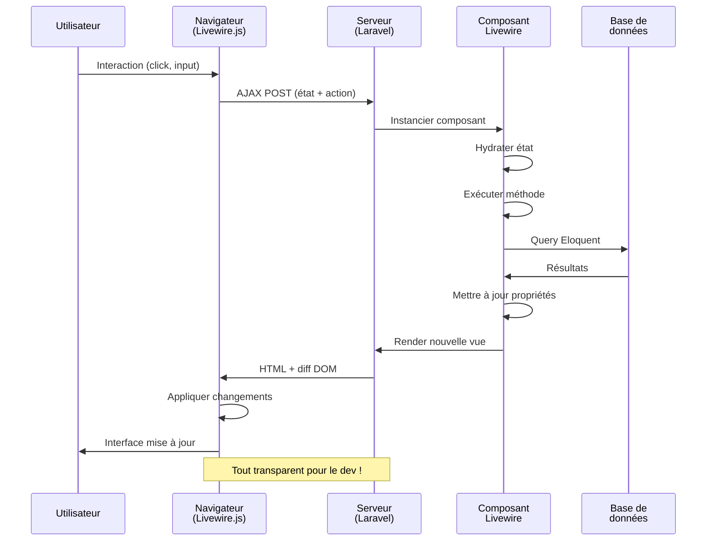
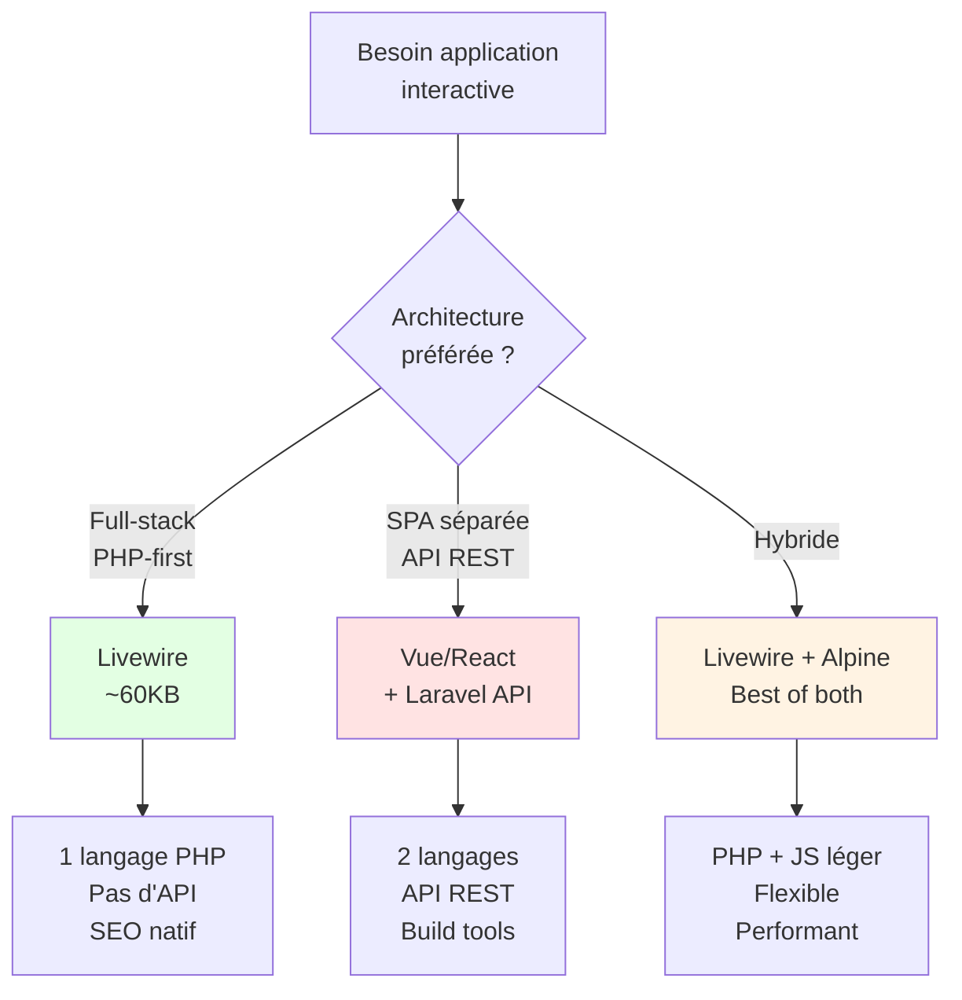

# Livewire

## Introduction

<div
  class="omny-meta"
  data-level="🟢 Débutant & 🟡 Intermédiaire"
  data-version="1.0"
  data-time="90-120 minutes">
</div>

!!! quote "Analogie pédagogique"
    _Imaginez que vous construisez une **application de chat en temps réel**. Avec React ou Vue, vous devez créer une **API REST complète** côté backend (routes, contrôleurs, validation JSON), puis un **frontend JavaScript séparé** qui communique via AJAX, gère l'état, et met à jour le DOM. **Livewire fonctionne comme un téléphone magique** : vous écrivez du PHP traditionnel (validation, logique métier, accès BDD), ajoutez quelques attributs `wire:`, et votre interface devient **automatiquement réactive** sans écrire une ligne de JavaScript. Le serveur et le client communiquent **invisiblement** en arrière-plan._

> **Livewire** est un framework full-stack créé en 2019 par **Caleb Porzio** pour Laravel avec un objectif révolutionnaire : créer des **interfaces réactives modernes** en écrivant **uniquement du PHP**. Sans API REST, sans JSON, sans JavaScript complexe - juste des **composants PHP** qui se comportent comme des composants React ou Vue, mais dont toute la logique s'exécute côté serveur. Livewire génère automatiquement le JavaScript nécessaire pour la communication AJAX et la mise à jour du DOM.

Livewire est devenu le **standard de facto** pour les applications Laravel interactives. Laravel Jetstream, Laravel Breeze, des milliers de SaaS et dashboards l'utilisent quotidiennement. Sa philosophie "write less, do more" en fait l'outil idéal pour les **développeurs PHP** qui veulent créer des interfaces modernes sans devenir experts JavaScript, tout en maintenant toute la logique métier côté serveur où elle appartient.

!!! info "Pourquoi c'est important ?"
    Livewire permet de créer des **SPA-like applications** sans SPA, de conserver la **logique métier en PHP** (validation, autorisation, BDD), d'éviter la **duplication de code** (validation client + serveur), de maintenir un **seul langage** (PHP) pour tout le projet, et d'obtenir une **réactivité moderne** comparable à Vue ou React sans écrire de JavaScript.

## Pour repartir des bases (vrais débutants)

Si vous n'avez jamais utilisé de framework frontend réactif, vous découvrirez que Livewire transforme vos **composants PHP en composants réactifs**. Vous créez une classe PHP avec des propriétés publiques, ces propriétés deviennent **automatiquement réactives** dans la vue Blade. Quand un utilisateur interagit (clic, input), Livewire envoie une requête AJAX au serveur, exécute votre méthode PHP, puis met à jour **uniquement la partie modifiée** du DOM. C'est comme si PHP avait appris à **réagir en temps réel** aux interactions utilisateur.

!!! tip "Livewire n'est pas du PHP traditionnel"
    Livewire n'est **pas** un simple système de templates PHP. Contrairement à du PHP classique qui recharge la page entière à chaque action, Livewire utilise **AJAX en arrière-plan** pour communiquer avec le serveur et met à jour le DOM **partiellement** via un algorithme de diff (comme React). Mais pour vous, le développeur, **vous écrivez du PHP** exactement comme d'habitude.

## Philosophie Livewire

### Principes fondateurs

!!! quote "**Logique serveur, réactivité client :** Livewire vous permet d'écrire toute la logique métier en PHP côté serveur, tout en offrant une expérience utilisateur réactive comparable aux frameworks JavaScript modernes."

=== "❌ Approche traditionnelle (Multi-page)"

    ```html
    <!-- Page 1: Liste des tâches -->
    <form action="/tasks" method="POST">
        @csrf
        <input name="title">
        <button>Ajouter</button>
    </form>

    <!-- Après soumission : RECHARGEMENT COMPLET PAGE -->
    <!-- Requête POST → Redirect → Nouvelle requête GET -->
    <!-- Perte du scroll, du focus, rechargement complet -->
    ```

=== "⚠️ Approche SPA traditionnelle (Vue/React)"

    ```javascript
    // Frontend (Vue/React)
    async function addTask() {
        const response = await fetch('/api/tasks', {
            method: 'POST',
            body: JSON.stringify({ title: this.title })
        });
        const task = await response.json();
        this.tasks.push(task);
    }
    ```

    ```php
    <?php
    // Backend (API Controller)
    public function store(Request $request) {
        $validated = $request->validate([
            'title' => 'required|max:255'
        ]);
        return Task::create($validated);
    }
    ```

    **Problème :** Duplication logique validation (client + serveur), séparation frontend/backend, API REST à maintenir

=== "✅ Approche Livewire (Full-stack PHP)"

    ```php
    <?php
    // Composant Livewire (UN SEUL FICHIER PHP)
    class TaskList extends Component {
        public $title = '';
        
        public function addTask() {
            $this->validate(['title' => 'required|max:255']);
            Task::create(['title' => $this->title]);
            $this->title = '';
        }
    }
    ```

    ```html
    <!-- Vue Blade -->
    <form wire:submit.prevent="addTask">
        <input wire:model="title">
        <button>Ajouter</button>
    </form>
    <!-- AUCUN rechargement, mise à jour partielle DOM -->
    ```

!!! note "**Pas de JavaScript requis (pour vous) :**"

    Livewire génère automatiquement le JavaScript nécessaire pour :

    - Capturer les événements (clicks, input, submit)
    - Envoyer requêtes AJAX au serveur
    - Recevoir réponse et calculer diff DOM
    - Mettre à jour uniquement les parties modifiées
    - Gérer les états de chargement (loading)
    
    **Vous écrivez 0 ligne de JavaScript** (sauf si vous voulez)

**Le cycle de vie Livewire :**



**Convention over configuration :**

Livewire suit la philosophie Laravel : **zéro configuration** pour démarrer.

```bash
# Créer composant
php artisan make:livewire TaskList

# Génère automatiquement :
# app/Livewire/TaskList.php (classe)
# resources/views/livewire/task-list.blade.php (vue)
```

```html
// Utiliser dans n'importe quelle vue :
<livewire:task-list />
// Ou
@livewire('task-list')
```

### Comparaison avec autres approches



| Critère | Livewire | Vue/React SPA | Inertia.js | Alpine.js |
|---------|:--------:|:-------------:|:----------:|:---------:|
| **Langage principal** | PHP | JavaScript | PHP + JS | JavaScript |
| **API REST requise** | ❌ Non | ✅ Oui | ❌ Non | Dépend |
| **Build tools** | ❌ Non | ✅ Oui (Webpack/Vite) | ✅ Oui | ❌ Non |
| **Latence perçue** | ~50-100ms | ~0ms (client) | ~50-100ms | ~0ms (client) |
| **SEO natif** | ✅ Excellent | ⚠️ Complexe (SSR) | ✅ Excellent | ✅ Bon |
| **Courbe apprentissage** | 🟢 Faible (PHP) | 🔴 Élevée (JS + API) | 🟡 Moyenne | 🟢 Faible |
| **État partagé** | ✅ Serveur (session) | ⚠️ Vuex/Redux | ✅ Props/session | ⚠️ Store Alpine |
| **Validation** | ✅ Serveur (sécurisée) | ⚠️ Client + Serveur | ✅ Serveur | ⚠️ Client + Serveur |
| **Temps réel** | ✅ Polling/Echo | ✅ WebSocket | ✅ Polling/Echo | ✅ WebSocket |
| **Offline-first** | ❌ Non | ✅ Possible | ❌ Non | ✅ Possible |

!!! tip "Quand choisir Livewire ?"
    **Utilisez Livewire si :**
    
    - Vous êtes **développeur PHP/Laravel** et voulez éviter JavaScript complexe
    - Vous construisez un **dashboard, backoffice, CRUD, SaaS interne**
    - Vous voulez **un seul langage** pour toute l'application
    - Le **SEO** est important (rendu serveur natif)
    - Votre équipe préfère **full-stack PHP** plutôt que séparation API/Frontend
    - Vous acceptez une **latence de ~50-100ms** par action (AJAX serveur)

## Installation et configuration

### Prérequis

Avant d'installer Livewire, assurez-vous d'avoir :

- **Laravel 10+** (ou Laravel 9+ avec Livewire 2.x)
- **PHP 8.1+**
- **Composer** installé
- Un projet Laravel existant ou créez-en un :

```bash
# Créer nouveau projet Laravel
composer create-project laravel/laravel mon-app-livewire
cd mon-app-livewire

# Configurer .env (DB, APP_KEY, etc.)
cp .env.example .env
php artisan key:generate
```

### Installation via Composer

**Installer Livewire 3.x (version actuelle) :**

```bash
# Installation
composer require livewire/livewire

# Vérifier installation
php artisan livewire:--version
# Livewire 3.x.x
```

**Publier configuration (optionnel) :**

```bash
# Publier fichier config/livewire.php
php artisan livewire:publish --config

# Publier assets JS/CSS (optionnel, généré auto sinon)
php artisan livewire:publish --assets
```

### Inclure Livewire dans le layout

**Fichier :** `resources/views/layouts/app.blade.php`

```html
<!DOCTYPE html>
<html lang="fr">
<head>
    <meta charset="UTF-8">
    <meta name="viewport" content="width=device-width, initial-scale=1.0">
    <title>@yield('title', 'Mon App Livewire')</title>
    
    <!-- Tailwind CSS ou autre framework CSS -->
    <script src="https://cdn.tailwindcss.com"></script>
    
    <!-- Livewire Styles (OBLIGATOIRE dans <head>) -->
    @livewireStyles
</head>
<body class="bg-gray-100">
    
    @yield('content')
    
    <!-- Livewire Scripts (OBLIGATOIRE avant </body>) -->
    @livewireScripts
</body>
</html>
```

!!! danger "Directives @livewireStyles et @livewireScripts OBLIGATOIRES"
    **`@livewireStyles`** doit être dans `<head>` pour charger le CSS des spinners/loading states.
    **`@livewireScripts`** doit être avant `</body>` pour charger Livewire.js (~60KB).
    
    **Sans ces directives, Livewire ne fonctionnera pas.**

**Configuration avancée (optionnel) :**

**Fichier :** `config/livewire.php`

```php
<?php

return [
    // Classe CSS pour spinners/loading
    'loading_indicator_class' => 'loading',
    
    // Layout par défaut pour composants full-page
    'layout' => 'layouts.app',
    
    // Middleware appliqué aux requêtes Livewire
    'middleware' => ['web'],
    
    // Préfixe URL endpoint Livewire
    'url_prefix' => '/livewire',
    
    // Activer/désactiver file uploads
    'temporary_file_upload' => [
        'disk' => 'local',
        'rules' => 'file|max:12288', // 12MB max
        'directory' => 'livewire-tmp',
    ],
];
```

### Premier composant Livewire

**Créer un composant :**

```bash
# Créer composant Counter (classe + vue)
php artisan make:livewire Counter

# Résultat :
# CLASS: app/Livewire/Counter.php
# VIEW:  resources/views/livewire/counter.blade.php
```

!!! tip "Convention de nommage"
    Livewire utilise **PascalCase** pour les classes et **kebab-case** pour les vues :
    
    - `Counter` → `counter`
    - `TaskList` → `task-list`
    - `User/Profile` → `user.profile` ou `user/profile`

**Classe Livewire :**

**Fichier :** `app/Livewire/Counter.php`

```php
<?php

namespace App\Livewire;

use Livewire\Component;

class Counter extends Component
{
    // Propriété publique = réactive automatiquement
    public $count = 0;
    
    // Méthode appelable depuis la vue
    public function increment()
    {
        $this->count++;
    }
    
    public function decrement()
    {
        $this->count--;
    }
    
    // Méthode obligatoire : retourne la vue
    public function render()
    {
        return view('livewire.counter');
    }
}
```

**Vue Blade :**

**Fichier :** `resources/views/livewire/counter.blade.php`

```html
<div>
    <h1 class="text-2xl font-bold mb-4">Compteur Livewire</h1>
    
    <div class="flex items-center space-x-4">
        <!-- wire:click déclenche méthode PHP -->
        <button wire:click="decrement" 
                class="px-4 py-2 bg-red-500 text-white rounded">
            -
        </button>
        
        <!-- Afficher propriété réactive -->
        <span class="text-3xl font-bold">{{ $count }}</span>
        
        <button wire:click="increment" 
                class="px-4 py-2 bg-green-500 text-white rounded">
            +
        </button>
    </div>
</div>
```

**Utiliser le composant :**

**Fichier :** `resources/views/welcome.blade.php`

```html
@extends('layouts.app')

@section('content')
    <div class="container mx-auto p-8">
        
        <!-- Syntaxe 1 : Tag Blade -->
        <livewire:counter />
        
        <!-- Syntaxe 2 : Directive Blade (équivalent) -->
        @livewire('counter')
        
    </div>
@endsection
```

**Tester :**

```bash
# Démarrer serveur
php artisan serve

# Ouvrir http://localhost:8000
# Cliquer sur + et - → Compteur se met à jour SANS rechargement page !
```

!!! success "Félicitations ! - Vous venez de créer votre premier composant Livewire réactif en écrivant uniquement du PHP !"

## Propriétés et data binding

### Propriétés publiques (réactives)

**Toute propriété `public`** d'un composant Livewire est **automatiquement réactive** et **synchronisée** entre le serveur et le client.

```php
<?php

namespace App\Livewire;

use Livewire\Component;

class FormExample extends Component
{
    // Propriétés publiques = réactives
    public $name = '';
    public $email = '';
    public $age = 0;
    public $subscribed = false;
    public $country = '';
    
    // Propriété privée/protégée = NON réactive
    private $internalState = [];
    protected $listeners = [];
    
    public function render()
    {
        return view('livewire.form-example');
    }
}
```

!!! warning "Propriétés publiques vs privées"
    **Propriétés `public`** :
    - ✅ Accessibles dans la vue Blade
    - ✅ Synchronisées automatiquement (AJAX)
    - ⚠️ Exposées côté client (visibles dans le HTML/JS)
    
    **Propriétés `private` / `protected`** :
    - ❌ Non accessibles dans la vue
    - ❌ Non synchronisées
    - ✅ Cachées côté client (sécurisées)

### wire:model - Binding bidirectionnel

**`wire:model`** lie un input HTML à une propriété Livewire (bidirectionnel).

**Fichier :** `resources/views/livewire/form-example.blade.php`

```html
<div>
    <!-- Input texte -->
    <input type="text" wire:model="name" placeholder="Nom">
    <p>Bonjour, {{ $name }} !</p>
    
    <!-- Input email -->
    <input type="email" wire:model="email" placeholder="Email">
    
    <!-- Input number -->
    <input type="number" wire:model="age" placeholder="Âge">
    
    <!-- Checkbox -->
    <label>
        <input type="checkbox" wire:model="subscribed">
        S'abonner à la newsletter
    </label>
    
    <!-- Select -->
    <select wire:model="country">
        <option value="">Choisir...</option>
        <option value="FR">France</option>
        <option value="BE">Belgique</option>
        <option value="CH">Suisse</option>
    </select>
    
    <!-- Textarea -->
    <textarea wire:model="bio" rows="4"></textarea>
</div>
```

**Ce qui se passe :**

1. Utilisateur tape dans `<input wire:model="name">`
2. Livewire.js détecte changement (événement `input`)
3. Envoie requête AJAX au serveur avec nouvelle valeur
4. Serveur met à jour `$this->name = 'nouvelle valeur'`
5. Serveur re-render la vue
6. Livewire calcule diff DOM
7. Livewire.js met à jour uniquement `{{ $name }}`

### Modificateurs wire:model

**`wire:model.live` (temps réel) :**

```html
<!-- Mise à jour À CHAQUE FRAPPE (debounce 150ms par défaut) -->
<input type="text" wire:model.live="search">

<!-- Affiche résultats en temps réel -->
<ul>
    @foreach($results as $result)
        <li>{{ $result->name }}</li>
    @endforeach
</ul>
```

**`wire:model.blur` (au changement de focus) :**

```html
<!-- Mise à jour quand l'input perd le focus -->
<input type="text" wire:model.blur="email">
```

**`wire:model.debounce` (délai personnalisé) :**

```html
<!-- Mise à jour après 500ms d'inactivité -->
<input type="text" wire:model.live.debounce.500ms="search">

<!-- Mise à jour après 1 seconde -->
<input type="text" wire:model.live.debounce.1s="query">
```

**`wire:model.throttle` (limite fréquence) :**

```html
<!-- Maximum 1 requête par seconde -->
<input type="text" wire:model.live.throttle.1s="search">
```

!!! tip "Choisir le bon modificateur"
    - **`wire:model`** (défaut) : Mise à jour au `change` (quitte input)
    - **`wire:model.live`** : Temps réel (chaque frappe, debounced 150ms)
    - **`wire:model.blur`** : Au blur (perte focus)
    - **`wire:model.debounce.Xms`** : Délai personnalisé
    - **`wire:model.throttle.Xs`** : Limite requêtes/seconde

### Types de données supportés

```php
<?php

namespace App\Livewire;

use Livewire\Component;
use App\Models\User;

class DataTypes extends Component
{
    // Types primitifs
    public $string = 'texte';
    public $int = 42;
    public $float = 3.14;
    public $bool = true;
    
    // Tableaux
    public $array = ['a', 'b', 'c'];
    public $assoc = ['key' => 'value'];
    
    // Collections (converties en array)
    public $collection;
    
    // Eloquent Models (sérialisés par ID)
    public $user;
    
    // DateTime (sérialisé ISO 8601)
    public $date;
    
    public function mount()
    {
        $this->collection = collect([1, 2, 3]);
        $this->user = User::find(1);
        $this->date = now();
    }
    
    public function render()
    {
        return view('livewire.data-types');
    }
}
```

!!! danger "Propriétés NON supportées"
    **Ne peuvent PAS être propriétés publiques** :
    
    - Closures / Fonctions anonymes
    - Ressources (file handles, connections DB)
    - Objets non sérialisables
    
    **Solution** : Utiliser propriétés `protected` ou méthodes

### Propriétés calculées (Computed Properties)

**Attribut `#[Computed]`** (Livewire 3+) :

```php
<?php

namespace App\Livewire;

use Livewire\Component;
use Livewire\Attributes\Computed;
use App\Models\Task;

class TaskList extends Component
{
    public $search = '';
    
    // Propriété calculée (cached pendant le render)
    #[Computed]
    public function tasks()
    {
        return Task::where('title', 'like', "%{$this->search}%")
                   ->get();
    }
    
    #[Computed]
    public function tasksCount()
    {
        return $this->tasks->count();
    }
    
    public function render()
    {
        return view('livewire.task-list');
    }
}
```

**Utilisation dans la vue :**

```html
<div>
    <input type="text" wire:model.live="search" placeholder="Rechercher...">
    
    <p>{{ $this->tasksCount }} résultat(s)</p>
    
    <ul>
        @foreach($this->tasks as $task)
            <li>{{ $task->title }}</li>
        @endforeach
    </ul>
</div>
```

!!! info "Avantages #[Computed]"
    - **Cache** : Calculé une seule fois par render (pas à chaque appel)
    - **Lazy** : Évalué uniquement si utilisé dans la vue
    - **Performance** : Évite requêtes BDD multiples

## Actions et événements

### wire:click - Déclencher méthodes

**`wire:click`** appelle une méthode PHP du composant.

```php
<?php

namespace App\Livewire;

use Livewire\Component;

class Actions extends Component
{
    public $count = 0;
    
    // Méthode sans paramètre
    public function increment()
    {
        $this->count++;
    }
    
    // Méthode avec paramètre
    public function add($value)
    {
        $this->count += $value;
    }
    
    // Méthode avec logique conditionnelle
    public function reset()
    {
        $this->count = 0;
        
        // Flash message
        session()->flash('message', 'Compteur réinitialisé');
    }
    
    public function render()
    {
        return view('livewire.actions');
    }
}
```

```html
<div>
    <!-- Appel sans paramètre -->
    <button wire:click="increment">+1</button>
    
    <!-- Appel avec paramètre -->
    <button wire:click="add(5)">+5</button>
    <button wire:click="add(10)">+10</button>
    
    <!-- Appel avec confirmation JavaScript -->
    <button wire:click="reset" 
            onclick="return confirm('Confirmer ?')">
        Réinitialiser
    </button>
    
    <p>Compteur : {{ $count }}</p>
    
    @if(session()->has('message'))
        <div class="alert">{{ session('message') }}</div>
    @endif
</div>
```

### wire:submit - Formulaires

**`wire:submit.prevent`** intercepte soumission formulaire.

```php
<?php

namespace App\Livewire;

use Livewire\Component;
use App\Models\Task;

class TaskCreate extends Component
{
    public $title = '';
    public $description = '';
    
    public function save()
    {
        // Validation
        $validated = $this->validate([
            'title' => 'required|min:3|max:255',
            'description' => 'nullable|max:1000',
        ]);
        
        // Créer tâche
        Task::create($validated);
        
        // Réinitialiser formulaire
        $this->reset(['title', 'description']);
        
        // Message succès
        session()->flash('message', 'Tâche créée avec succès !');
    }
    
    public function render()
    {
        return view('livewire.task-create');
    }
}
```

```html
<div>
    <form wire:submit.prevent="save">
        <div>
            <label>Titre</label>
            <input type="text" wire:model="title">
            @error('title') 
                <span class="error">{{ $message }}</span> 
            @enderror
        </div>
        
        <div>
            <label>Description</label>
            <textarea wire:model="description"></textarea>
            @error('description') 
                <span class="error">{{ $message }}</span> 
            @enderror
        </div>
        
        <button type="submit">Créer tâche</button>
    </form>
    
    @if(session()->has('message'))
        <div class="success">{{ session('message') }}</div>
    @endif
</div>
```

### Autres directives wire:*

**`wire:keydown` - Événements clavier :**

```html
<!-- Soumettre avec Enter -->
<input wire:keydown.enter="submit" type="text">

<!-- Annuler avec Escape -->
<div wire:keydown.escape="close">

<!-- Combinaisons de touches -->
<input wire:keydown.ctrl.s.prevent="save">
```

**`wire:change` - Changement valeur :**

```html
<select wire:change="categoryChanged">
    <option value="1">Catégorie 1</option>
    <option value="2">Catégorie 2</option>
</select>
```

**`wire:poll` - Polling automatique :**

```html
<!-- Rafraîchir toutes les 5 secondes -->
<div wire:poll.5s>
    Dernière mise à jour : {{ $lastUpdate }}
</div>

<!-- Polling avec action spécifique -->
<div wire:poll.10s="refreshStats">
    Stats : {{ $stats }}
</div>
```

**`wire:loading` - États de chargement :**

```html
<!-- Afficher pendant requête AJAX -->
<div wire:loading>
    Chargement en cours...
</div>

<!-- Cacher pendant chargement -->
<div wire:loading.remove>
    Contenu
</div>

<!-- Cibler action spécifique -->
<div wire:loading wire:target="save">
    Sauvegarde en cours...
</div>

<!-- Ajouter classe pendant chargement -->
<button wire:loading.class="opacity-50" wire:click="save">
    Sauvegarder
</button>

<!-- Désactiver pendant chargement -->
<button wire:loading.attr="disabled" wire:click="save">
    Sauvegarder
</button>
```

### Événements entre composants

**Émettre événement :**

```php
<?php

namespace App\Livewire;

use Livewire\Component;

class TaskCreate extends Component
{
    public function save()
    {
        // ... créer tâche ...
        
        // Émettre événement global
        $this->dispatch('task-created', taskId: $task->id);
        
        // Émettre vers composant spécifique
        $this->dispatch('task-created')->to(TaskList::class);
    }
}
```

**Écouter événement :**

```php
<?php

namespace App\Livewire;

use Livewire\Component;
use Livewire\Attributes\On;

class TaskList extends Component
{
    // Écouter événement avec attribut
    #[On('task-created')]
    public function handleTaskCreated($taskId)
    {
        // Rafraîchir liste
        $this->render();
    }
    
    public function render()
    {
        return view('livewire.task-list', [
            'tasks' => Task::all()
        ]);
    }
}
```

**Écouter dans la vue (JavaScript) :**

```html
<div x-data="{ show: false }"
     @task-created.window="show = true">
    
    <div x-show="show">
        Nouvelle tâche créée !
    </div>
</div>
```

## Validation

### Validation simple

```php
<?php

namespace App\Livewire;

use Livewire\Component;

class ValidationExample extends Component
{
    public $email = '';
    public $password = '';
    
    public function submit()
    {
        // Valider avec règles Laravel
        $validated = $this->validate([
            'email' => 'required|email',
            'password' => 'required|min:8',
        ]);
        
        // Si validation passe, utiliser $validated
        // Sinon, exceptions lancées automatiquement
    }
}
```

```html
<form wire:submit.prevent="submit">
    <input type="email" wire:model="email">
    @error('email') 
        <span class="error">{{ $message }}</span> 
    @enderror
    
    <input type="password" wire:model="password">
    @error('password') 
        <span class="error">{{ $message }}</span> 
    @enderror
    
    <button type="submit">Se connecter</button>
</form>
```

### Validation temps réel (live)

```php
<?php

namespace App\Livewire;

use Livewire\Component;

class LiveValidation extends Component
{
    public $email = '';
    
    // Valider à chaque changement de propriété
    public function updated($propertyName)
    {
        $this->validateOnly($propertyName, [
            'email' => 'required|email',
        ]);
    }
    
    public function render()
    {
        return view('livewire.live-validation');
    }
}
```

```html
<div>
    <!-- Validation temps réel avec wire:model.live -->
    <input type="email" wire:model.live="email">
    
    @error('email')
        <span class="error">{{ $message }}</span>
    @enderror
    
    <!-- Affiche ✓ si valide -->
    @if($email && !$errors->has('email'))
        <span class="success">✓</span>
    @endif
</div>
```

### Attribut #[Validate] (Livewire 3+)

```php
<?php

namespace App\Livewire;

use Livewire\Component;
use Livewire\Attributes\Validate;

class InlineValidation extends Component
{
    // Validation inline (plus propre)
    #[Validate('required|email')]
    public $email = '';
    
    #[Validate('required|min:8')]
    public $password = '';
    
    #[Validate('nullable|max:1000')]
    public $bio = '';
    
    public function submit()
    {
        // Valider toutes les propriétés avec #[Validate]
        $validated = $this->validate();
        
        // Utiliser $validated...
    }
}
```

### Messages d'erreur personnalisés

```php
<?php

namespace App\Livewire;

use Livewire\Component;

class CustomMessages extends Component
{
    public $email = '';
    
    protected $messages = [
        'email.required' => 'L\'email est obligatoire.',
        'email.email' => 'Format email invalide.',
    ];
    
    public function submit()
    {
        $this->validate([
            'email' => 'required|email',
        ]);
    }
}
```

## Lifecycle Hooks

Livewire offre plusieurs **hooks de cycle de vie** pour exécuter du code à des moments précis.

```php
<?php

namespace App\Livewire;

use Livewire\Component;

class LifecycleExample extends Component
{
    public $data;
    
    /**
     * mount() - Exécuté UNE SEULE FOIS à l'initialisation
     * Équivalent au constructeur (mais utilisez mount, pas __construct)
     */
    public function mount($userId = null)
    {
        $this->data = User::find($userId);
    }
    
    /**
     * hydrate() - Exécuté AVANT chaque mise à jour
     * Après désérialisation des propriétés
     */
    public function hydrate()
    {
        // Réinitialiser état temporaire
    }
    
    /**
     * updating($propertyName, $value) - AVANT mise à jour propriété
     */
    public function updating($propertyName, $value)
    {
        // Intercepter AVANT modification
    }
    
    /**
     * updated($propertyName, $value) - APRÈS mise à jour propriété
     */
    public function updated($propertyName, $value)
    {
        // Réagir APRÈS modification
        if ($propertyName === 'search') {
            $this->resetPage(); // Reset pagination
        }
    }
    
    /**
     * render() - Exécuté à CHAQUE requête
     * Retourne la vue Blade
     */
    public function render()
    {
        return view('livewire.lifecycle-example');
    }
    
    /**
     * dehydrate() - Exécuté APRÈS chaque mise à jour
     * Avant sérialisation des propriétés
     */
    public function dehydrate()
    {
        // Nettoyer avant envoi client
    }
}
```

**Ordre d'exécution :**

```
1ère requête (initial render) :
mount() → hydrate() → render() → dehydrate()

Requêtes suivantes (updates) :
hydrate() → updating() → [modification] → updated() → render() → dehydrate()
```

## Layouts et navigation

### Layout par défaut

**Composant full-page utilise layout :**

```php
<?php

namespace App\Livewire;

use Livewire\Component;

class Dashboard extends Component
{
    public function render()
    {
        // Utilise layout défini dans config/livewire.php
        return view('livewire.dashboard');
    }
}
```

**Route directe vers composant :**

```php
<?php
// routes/web.php
use App\Livewire\Dashboard;

Route::get('/dashboard', Dashboard::class);
```

### Layout personnalisé

**Méthode 1 : Dans render()** :

```php
<?php
public function render()
{
    return view('livewire.dashboard')
        ->layout('layouts.admin'); // Layout personnalisé
}
```

**Méthode 2 : Attribut #[Layout]** :

```php
<?php

namespace App\Livewire;

use Livewire\Component;
use Livewire\Attributes\Layout;

#[Layout('layouts.admin')]
class Dashboard extends Component
{
    public function render()
    {
        return view('livewire.dashboard');
    }
}
```

### Titre de page

```php
<?php

namespace App\Livewire;

use Livewire\Component;
use Livewire\Attributes\Title;

#[Title('Dashboard - Mon App')]
class Dashboard extends Component
{
    public function render()
    {
        return view('livewire.dashboard');
    }
}
```

**Ou dynamiquement :**

```php
<?php
public function render()
{
    return view('livewire.dashboard')
        ->title("Dashboard - {$this->user->name}");
}
```

### Slots dans layout

**Layout :** `layouts/app.blade.php`

```html
<!DOCTYPE html>
<html>
<head>
    <title>{{ $title ?? 'Mon App' }}</title>
    @livewireStyles
</head>
<body>
    <header>
        {{ $header ?? '' }}
    </header>
    
    <main>
        {{ $slot }}
    </main>
    
    <footer>
        {{ $footer ?? '' }}
    </footer>
    
    @livewireScripts
</body>
</html>
```

**Composant avec slots :**

```php
<?php
public function render()
{
    return view('livewire.page')
        ->layout('layouts.app')
        ->slot('header', view('components.header'))
        ->slot('footer', view('components.footer'));
}
```

## Cas d'usage pratiques

### Todo List complète

```php
<?php

namespace App\Livewire;

use Livewire\Component;
use Livewire\Attributes\Validate;
use Livewire\Attributes\Computed;
use App\Models\Task;

class TodoList extends Component
{
    #[Validate('required|min:3|max:255')]
    public $newTask = '';
    
    public $filter = 'all'; // all, active, completed
    
    public function addTask()
    {
        $this->validate();
        
        Task::create([
            'title' => $this->newTask,
            'completed' => false,
        ]);
        
        $this->reset('newTask');
    }
    
    public function toggle($taskId)
    {
        $task = Task::find($taskId);
        $task->update(['completed' => !$task->completed]);
    }
    
    public function delete($taskId)
    {
        Task::destroy($taskId);
    }
    
    public function clearCompleted()
    {
        Task::where('completed', true)->delete();
    }
    
    #[Computed]
    public function tasks()
    {
        return match($this->filter) {
            'active' => Task::where('completed', false)->get(),
            'completed' => Task::where('completed', true)->get(),
            default => Task::all(),
        };
    }
    
    #[Computed]
    public function stats()
    {
        return [
            'total' => Task::count(),
            'active' => Task::where('completed', false)->count(),
            'completed' => Task::where('completed', true)->count(),
        ];
    }
    
    public function render()
    {
        return view('livewire.todo-list');
    }
}
```

```html
<div class="max-w-2xl mx-auto p-6">
    <h1 class="text-3xl font-bold mb-6">Ma Todo List</h1>
    
    <!-- Formulaire ajout -->
    <form wire:submit.prevent="addTask" class="mb-6">
        <div class="flex gap-2">
            <input type="text" 
                   wire:model="newTask" 
                   placeholder="Nouvelle tâche..."
                   class="flex-1 px-4 py-2 border rounded">
            <button type="submit" 
                    class="px-6 py-2 bg-blue-500 text-white rounded">
                Ajouter
            </button>
        </div>
        @error('newTask') 
            <span class="text-red-500 text-sm">{{ $message }}</span> 
        @enderror
    </form>
    
    <!-- Filtres -->
    <div class="flex gap-2 mb-4">
        <button wire:click="$set('filter', 'all')"
                class="px-4 py-2 rounded {{ $filter === 'all' ? 'bg-blue-500 text-white' : 'bg-gray-200' }}">
            Toutes ({{ $this->stats['total'] }})
        </button>
        <button wire:click="$set('filter', 'active')"
                class="px-4 py-2 rounded {{ $filter === 'active' ? 'bg-blue-500 text-white' : 'bg-gray-200' }}">
            En cours ({{ $this->stats['active'] }})
        </button>
        <button wire:click="$set('filter', 'completed')"
                class="px-4 py-2 rounded {{ $filter === 'completed' ? 'bg-blue-500 text-white' : 'bg-gray-200' }}">
            Terminées ({{ $this->stats['completed'] }})
        </button>
    </div>
    
    <!-- Liste tâches -->
    <div class="space-y-2">
        @forelse($this->tasks as $task)
            <div class="flex items-center gap-3 p-4 bg-white rounded shadow">
                <input type="checkbox" 
                       wire:click="toggle({{ $task->id }})"
                       {{ $task->completed ? 'checked' : '' }}
                       class="w-5 h-5">
                <span class="flex-1 {{ $task->completed ? 'line-through text-gray-500' : '' }}">
                    {{ $task->title }}
                </span>
                <button wire:click="delete({{ $task->id }})"
                        wire:confirm="Supprimer cette tâche ?"
                        class="text-red-500 hover:text-red-700">
                    🗑️
                </button>
            </div>
        @empty
            <p class="text-center text-gray-500 py-8">Aucune tâche</p>
        @endforelse
    </div>
    
    <!-- Actions -->
    @if($this->stats['completed'] > 0)
        <button wire:click="clearCompleted"
                wire:confirm="Supprimer toutes les tâches terminées ?"
                class="mt-4 text-red-500 hover:text-red-700">
            Supprimer les tâches terminées
        </button>
    @endif
</div>
```

### Pagination

```php
<?php

namespace App\Livewire;

use Livewire\Component;
use Livewire\WithPagination;
use App\Models\Post;

class PostList extends Component
{
    use WithPagination;
    
    public $search = '';
    
    public function updatingSearch()
    {
        // Reset page quand recherche change
        $this->resetPage();
    }
    
    public function render()
    {
        return view('livewire.post-list', [
            'posts' => Post::where('title', 'like', "%{$this->search}%")
                           ->paginate(10)
        ]);
    }
}
```

```html
<div>
    <input type="text" wire:model.live="search" placeholder="Rechercher...">
    
    <div class="space-y-4">
        @foreach($posts as $post)
            <div class="p-4 bg-white rounded shadow">
                <h3 class="font-bold">{{ $post->title }}</h3>
                <p>{{ $post->excerpt }}</p>
            </div>
        @endforeach
    </div>
    
    <!-- Liens pagination (Livewire gère AJAX automatiquement) -->
    {{ $posts->links() }}
</div>
```

### Upload de fichiers

```php
<?php

namespace App\Livewire;

use Livewire\Component;
use Livewire\WithFileUploads;

class FileUpload extends Component
{
    use WithFileUploads;
    
    public $photo;
    
    public function save()
    {
        $this->validate([
            'photo' => 'image|max:2048', // 2MB max
        ]);
        
        // Sauvegarder dans storage/app/public/photos
        $path = $this->photo->store('photos', 'public');
        
        // Créer modèle avec chemin
        auth()->user()->update(['photo' => $path]);
        
        session()->flash('message', 'Photo uploadée !');
    }
    
    public function render()
    {
        return view('livewire.file-upload');
    }
}
```

```html
<div>
    <form wire:submit.prevent="save">
        <input type="file" wire:model="photo">
        
        <!-- Preview temps réel -->
        @if($photo)
            temporaryUrl() }}" class="w-32 h-32">
        @endif
        
        <!-- Loading pendant upload -->
        <div wire:loading wire:target="photo">
            Upload en cours...
        </div>
        
        @error('photo') 
            <span class="error">{{ $message }}</span> 
        @enderror
        
        <button type="submit">Sauvegarder</button>
    </form>
    
    @if(session()->has('message'))
        <div class="success">{{ session('message') }}</div>
    @endif
</div>
```

## Bonnes pratiques

### Organisation du code

**❌ MAUVAIS : Tout dans le composant**

```php
<?php
class Dashboard extends Component
{
    public function render()
    {
        // ❌ Logique métier dans render()
        $users = User::where('active', true)
                    ->with('posts')
                    ->get();
        
        return view('livewire.dashboard', compact('users'));
    }
}
```

**✅ BON : Computed properties**

```php
<?php
class Dashboard extends Component
{
    #[Computed]
    public function users()
    {
        return User::where('active', true)
                   ->with('posts')
                   ->get();
    }
    
    public function render()
    {
        return view('livewire.dashboard');
    }
}
```

### Performance

**Utiliser computed properties pour queries coûteuses :**

```php
<?php
#[Computed]
public function expensiveQuery()
{
    // Calculé une seule fois par render
    return DB::table('large_table')
             ->join('another_table', ...)
             ->groupBy('column')
             ->get();
}
```

**Éviter N+1 queries :**

```php
<?php
// ❌ MAUVAIS : N+1 queries
#[Computed]
public function posts()
{
    return Post::all(); // + 1 query par auteur dans la vue
}

// ✅ BON : Eager loading
#[Computed]
public function posts()
{
    return Post::with('author')->get(); // 2 queries seulement
}
```

**Lazy loading de composants :**

```html
<!-- Charger composant seulement si visible -->
<livewire:heavy-component lazy />

<!-- Avec placeholder -->
<livewire:heavy-component lazy>
    <div>Chargement...</div>
</livewire:heavy-component>
```

### Sécurité

**Toujours valider côté serveur :**

```php
<?php
// ✅ BON : Validation serveur OBLIGATOIRE
public function save()
{
    $this->validate([
        'amount' => 'required|numeric|min:0|max:10000',
    ]);
    
    // Traiter...
}

// ❌ MAUVAIS : Faire confiance aux données client
public function save()
{
    Payment::create(['amount' => $this->amount]); // DANGEREUX
}
```

**Autorisation avec policies :**

```php
<?php
public function delete($postId)
{
    $post = Post::findOrFail($postId);
    
    // Vérifier autorisation
    $this->authorize('delete', $post);
    
    $post->delete();
}
```

**Protected vs public properties :**

```php
<?php
class Secure extends Component
{
    // ✅ Public : Exposée côté client (OK si non sensible)
    public $title = '';
    
    // ✅ Protected : Cachée côté client (données sensibles)
    protected $apiKey = 'secret';
    protected $internalState = [];
}
```

### Accessibilité

**ARIA et loading states :**

```html
<button wire:click="save"
        wire:loading.attr="disabled"
        aria-busy="{{ $wire.loading ? 'true' : 'false' }}">
    <span wire:loading.remove>Sauvegarder</span>
    <span wire:loading>Sauvegarde...</span>
</button>
```

**Messages d'erreur accessibles :**

```html
<input type="email" 
       wire:model="email"
       aria-describedby="email-error"
       aria-invalid="{{ $errors->has('email') ? 'true' : 'false' }}">

@error('email')
    <span id="email-error" role="alert" class="error">
        {{ $message }}
    </span>
@enderror
```

## Le mot de la fin

!!! quote
    Livewire a **révolutionné le développement full-stack** en prouvant qu'on peut créer des **interfaces modernes réactives** sans sacrifier la **simplicité du développement PHP**. En seulement ~60KB de JavaScript généré automatiquement, il offre une expérience utilisateur comparable à React ou Vue, tout en conservant **toute la logique côté serveur** où elle est naturellement sécurisée, validée, et intégrée à l'écosystème Laravel.
    
    La philosophie "write less, do more" de Livewire redonne au **PHP sa place centrale** dans le développement web moderne. Vous écrivez des classes PHP avec des propriétés publiques réactives, des méthodes appelables depuis la vue, et Livewire orchestre **magiquement** la communication AJAX, la mise à jour du DOM, et la gestion d'état. Pas besoin d'apprendre React, pas besoin de créer une API REST, pas besoin de gérer Redux ou Vuex - **juste du PHP Laravel classique**.
    
    Livewire excelle dans son **domaine de prédilection** : les **dashboards, backoffices, CRUD, SaaS internes** où le SEO est important, où la logique métier doit rester côté serveur, et où l'équipe préfère PHP à JavaScript. Il n'a jamais prétendu remplacer React pour des applications temps réel ultra-performantes nécessitant state management complexe - et c'est sa force. Il résout **95% des besoins** avec une **fraction de la complexité**.
    
    Pour les développeurs **Laravel-first**, Livewire est le **compagnon naturel** : il s'intègre parfaitement dans l'écosystème (validation, authorization, Eloquent, queues, broadcasting), ne force pas à diviser l'application en deux projets séparés (API + Frontend), et permet de **ship faster** sans compromis sur la qualité. Votre équipe PHP peut créer des interfaces modernes sans recruter des experts React.
    
    Maîtriser Livewire, c'est comprendre qu'une **latence de ~50-100ms par action** est un **trade-off acceptable** pour la plupart des applications (sauf jeux vidéo ou applications temps réel extrêmes). C'est réaliser que la **simplicité architecturale** (un seul langage, pas d'API REST) réduit drastiquement les bugs, la maintenance, et le cognitive load. Livewire prouve que la **colocation de la logique** (serveur) surpasse souvent la **séparation artificielle** (API REST).
    
    Dans un écosystème saturé d'approches complexes nécessitant deux équipes (backend + frontend), deux déploiements, deux repos Git, et une API REST intermédiaire, Livewire est un **retour aux fondamentaux** : une application web traditionnelle server-side qui **se comporte comme une SPA** moderne. Simple, élégant, Laravel.

---

**Ressources complémentaires :**

- [Documentation officielle Livewire](https://livewire.laravel.com)
- [Screencasts Livewire (Caleb Porzio)](https://laracasts.com/series/livewire-screencasts)
- [Laravel Livewire Tips](https://laravel-livewire.com/docs/tips)
- [Awesome Livewire](https://github.com/livewire/awesome-livewire)

**Packages communautaires populaires :**

- **Wire Elements Modal** : Modals dynamiques Livewire
- **Livewire PowerGrid** : Tableaux de données avancés
- **Livewire Charts** : Graphiques interactifs
- **Livewire Calendar** : Calendriers événementiels

**Screencasts et tutoriels :**

- [Learn Livewire (Laracasts)](https://laracasts.com/series/learn-livewire)
- [Livewire Uncovered (YouTube)](https://www.youtube.com/livewire)
- [Build a Forum with Livewire](https://laracasts.com/series/build-a-forum-with-livewire)

**Communauté :**

- [Laravel Discord #livewire](https://discord.gg/laravel)
- [GitHub Discussions](https://github.com/livewire/livewire/discussions)
- [Twitter @LaravelLivewire](https://twitter.com/LaravelLivewire)

---

[^1]: **Sprinkle JavaScript** : Philosophie consistant à **ajouter de petites touches de JavaScript** à une application serveur traditionnelle, plutôt que de construire une SPA complète. Livewire génère automatiquement ce JavaScript pour vous.
