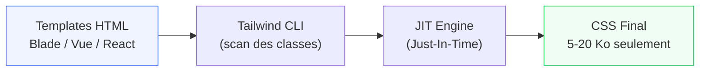

# Philosophie Utility-First

<div
  class="omny-meta"
  data-level="🟢 Débutant"
  data-version="3.x"
  data-time="3-4 heures">
</div>

## Introduction

!!! quote "Analogie pédagogique — Le Chef Cuisinier vs la Sauce en Bocal"
    Un chef cuisinier professionnel prépare chaque élément séparément — il choisit ses épices une par une, ajuste chaque saveur avec précision. Une sauce en bocal est pratique mais inflexible : impossible de modifier le sel sans changer de marque. Bootstrap est la sauce en bocal. Tailwind CSS est la cuisine du chef : des ingrédients (utilitaires) que vous combinez librement pour créer exactement le plat voulu.

Tailwind CSS est un framework **utility-first** : au lieu de classes sémantiques (`btn-primary`, `card`), il fournit des centaines de classes utilitaires atomiques (`p-4`, `text-blue-500`, `flex`). Chaque classe fait une seule chose. Vous composez l'interface directement dans le HTML.

Ce module répond à la question fondamentale : *pourquoi* changer de paradigme ?

<br>

---

## Le Problème du CSS Traditionnel

Avec du CSS classique, vous nommez des classes sémantiques, puis vous les stylisez dans un fichier `.css` séparé.

```html title="HTML — Approche CSS classique : nommage sémantique"
<!-- HTML -->
<div class="card">
  <div class="card__header">
    <h2 class="card__title">Titre</h2>
  </div>
  <div class="card__body">
    <p class="card__text">Contenu de la carte</p>
    <button class="btn btn--primary">Voir plus</button>
  </div>
</div>
```

```css title="CSS — Styles associés : chaque classe nécessite une déclaration séparée"
/* card.css */
.card {
  background: white;
  border-radius: 8px;
  box-shadow: 0 2px 8px rgba(0,0,0,0.1);
  padding: 16px;
  margin-bottom: 16px;
}

.card__title {
  font-size: 1.25rem;
  font-weight: 600;
  color: #1a1a1a;
  margin-bottom: 8px;
}

.btn--primary {
  background: #3b82f6;
  color: white;
  padding: 8px 16px;
  border-radius: 6px;
  border: none;
  cursor: pointer;
}
```

*Ce pattern force à jongler entre deux fichiers, à inventer des noms de classes, et à risquer des conflits — notamment dans les grandes équipes.*

**Problèmes au quotidien :**

| Problème | Illustration |
|---|---|
| **Nommage chronophage** | Trouver un nom pour chaque variante (`.card--large`, `.card--featured`...) |
| **Fichiers CSS qui grossissent** | On n'ose plus supprimer des styles "au cas où" |
| **Conflits de spécificité** | `.sidebar .card .btn` bat `.btn--primary` |
| **Dead code invisible** | Impossible de savoir quelle classe est encore utilisée |
| **Personnalisation de Bootstrap** | Surcharger Bootstrap = guerre de spécificité |

<br>

---

## L'Approche Utility-First

Avec Tailwind, vous style directement dans le HTML avec des classes prédictibles.

```html title="HTML (Tailwind) — Même carte, approche utility-first"
<!-- Même carte, aucun CSS custom nécessaire -->
<div class="bg-white rounded-lg shadow-md p-4 mb-4">
  <div class="mb-3">
    <h2 class="text-xl font-semibold text-gray-900 mb-2">Titre</h2>
  </div>
  <div>
    <p class="text-gray-600 mb-4">Contenu de la carte</p>
    <button class="bg-blue-500 text-white px-4 py-2 rounded-md hover:bg-blue-600 transition">
      Voir plus
    </button>
  </div>
</div>
```

*Chaque classe a un effet précis et prévisible : `p-4` = `padding: 1rem`, `text-xl` = `font-size: 1.25rem`. Aucun fichier CSS à ouvrir, aucun nom à inventer.*

**Ce qui change :**

- **Vous lisez le HTML** et vous voyez immédiatement le style
- **Zéro conflits** — chaque classe a une seule responsabilité
- **Zéro nommage** — plus de BEM, de camelCase, de snake_case
- **Zéro dead code** — Tailwind purge automatiquement les classes non utilisées
- **Variantes sans effort** — `hover:bg-blue-600` suffit

<br>

---

## Les Idées Reçues

!!! warning "\"Le HTML va devenir illisible\""
    C'est la réaction universelle à Tailwind. En pratique, après 48h d'utilisation, votre cerveau mappe `p-4 bg-white rounded-lg` aussi naturellement que `.card`. Et les éditeurs comme VS Code proposent l'autocomplétion — vous n'avez jamais à mémoriser.

!!! warning "\"C'est la même chose que le CSS inline\""
    Non. Les classes Tailwind sont des contraintes du design system — `p-4` vaut toujours `1rem`, pas `17px` arbitraire. Elles supportent `hover:`, `md:`, `dark:`, les animations CSS. Le CSS inline ne fait rien de tout ça.

!!! warning "\"Le code ne sera pas réutilisable\""
    Dans les frameworks modernes (Blade, React, Vue), vous créez des composants. Le composant `<Button>` encapsule les classes Tailwind — vous ne les répétez pas dans le HTML. C'est l'objet du module 7.

<br>

---

## Tailwind vs Bootstrap — Comparaison Directe

```html title="HTML — Même bouton primary : Bootstrap vs Tailwind"
<!-- Bootstrap : classe sémantique — vous dépendez des choix Bootstrap -->
<button class="btn btn-primary btn-lg">
  Enregistrer
</button>
<!-- Pour changer la couleur : surcharger $primary en SCSS, recompiler -->

<!-- Tailwind : classes utilitaires — vous contrôlez chaque pixel -->
<button class="bg-blue-600 hover:bg-blue-700 text-white font-medium
               px-6 py-3 rounded-lg transition-colors duration-200">
  Enregistrer
</button>
<!-- Pour changer la couleur : remplacer bg-blue-600 par bg-emerald-600 -->
```

*Avec Bootstrap, changer une couleur de bouton nécessite de comprendre la cascade SCSS. Avec Tailwind, vous changez une classe dans le HTML — visible, immédiat, compréhensible par n'importe qui.*

| Critère | Bootstrap | Tailwind |
|---|---|---|
| **Courbe d'apprentissage** | Plate (composants prêts) | Progressive (comprendre les utilitaires) |
| **Flexibilité design** | Limitée (override difficile) | Totale (chaque propriété exposée) |
| **Taille du CSS final** | ~140 Ko | ~5-20 Ko (purging) |
| **Cohérence design** | Imposée par Bootstrap | Imposée par votre `tailwind.config.js` |
| **Maintenance** | Classes sémantiques fragiles | Classes utilitaires stables |
| **Intégration Laravel** | Manual ou via CDN | Native (Vite plugin) |

<br>

---

## Comment Tailwind Produit du CSS

Tailwind n'envoie pas 3 Mo de CSS au client. Il scanne votre code source, trouve toutes les classes Tailwind utilisées, et génère **uniquement** le CSS nécessaire.



```bash title="Terminal — Génération du CSS Tailwind"
# En développement : watch + HMR (Hot Module Replacement)
npm run dev
# → Tailwind génère le CSS à chaque modification

# En production : CSS optimisé et minifié
npm run build
# → dist/assets/app-[hash].css (5-20 Ko typiquement)
```

*Le moteur JIT (Just-In-Time) de Tailwind v3 génère les classes à la volée — même les classes arbitraires comme `w-[312px]` ou `text-[#ff6b35]`.*

<br>

---

## Exercices

!!! note "À vous de jouer"

**Exercice 1 — Analyse comparative**

```html title="HTML — Exercice 1 : identifier les équivalents Tailwind"
<!-- Voici ce CSS :
.hero {
  background-color: #1e293b;
  padding: 64px 32px;
  text-align: center;
  color: white;
}
.hero__title {
  font-size: 2.25rem;
  font-weight: 700;
  margin-bottom: 16px;
}
-->

<!-- À vous : réécrivez ce HTML avec des classes Tailwind -->
<div class="hero">
  <h1 class="hero__title">Bienvenue sur OmnyDocs</h1>
  <p>La documentation qui vous forme.</p>
</div>

<!-- Indice : bg-slate-800, px-8, py-16, text-center, text-white,
             text-4xl, font-bold, mb-4 -->
```

**Exercice 2 — Comparaison de maintenance**

Imaginez que vous devez changer la couleur primaire d'un projet :
1. Dans un projet Bootstrap avec SCSS — quelles étapes ?
2. Dans un projet Tailwind — quelles étapes ?
3. Laquelle est plus rapide ? Pourquoi ?

<br>

---

## Conclusion

!!! quote "Ce qu'il faut retenir de ce module"
    Le paradigme **utility-first** inverse la relation avec le CSS : au lieu d'écrire des styles dans un fichier séparé, vous composez directement dans le HTML. Chaque classe fait une chose précise et prévisible. Le JIT Engine de Tailwind garantit un bundle CSS minimal en production (5-20 Ko). Les idées reçues — HTML illisible, pas réutilisable — ne tiennent pas face à la pratique quotidienne avec des composants Blade ou Vue. Tailwind n'est pas contre CSS ; il change la façon de l'écrire.

> Dans le module suivant, nous configurons Tailwind dans un projet Laravel + Vite — `tailwind.config.js`, les plugins, IntelliSense VS Code, et votre premier build de production.

<br>
