# Tailwind CSS

## Introduction

!!! quote "Analogie pédagogique — La Boîte à Outils vs le Meuble IKEA"
    Un développeur CSS classique achète un meuble IKEA (Bootstrap, Bulma) : rapide à assembler, mais difficile à modifier. Tailwind CSS est une boîte à outils professionnelle — des centaines d'utilitaires précis que vous combinez librement. Aucune opinion sur votre design, aucune surcharge à écraser. Vous construisez exactement ce que vous imaginez, pièce par pièce, sans jamais lutter contre le framework.

**Tailwind CSS** est un framework CSS utility-first — chaque classe fait une seule chose, et vous composez votre interface directement dans le HTML. C'est le **T** de la Stack TALL (Tailwind + Alpine + Laravel + Livewire).

> Tailwind ne remplace pas le CSS — il change la façon de l'écrire. Après une semaine, vous ne voudrez plus revenir en arrière.

 

---

## Parcours pédagogique — 8 modules

-   :lucide-lightbulb:{ .lg .middle } **Module 1** — _Philosophie Utility-First_

    ---
    Du CSS classique à Tailwind : pourquoi les utilitaires, les avantages, les idées reçues.

    **Durée** : ~3-4h | **Niveau** : 🟢 Débutant

    [:lucide-book-open-check: Accéder au module 1](./01-philosophie-utility-first.md)

-   :lucide-settings:{ .lg .middle } **Module 2** — _Installation & Configuration_

    ---
    CLI, intégration Vite + Laravel, `tailwind.config.js`, purge CSS, IntelliSense.

    **Durée** : ~3-4h | **Niveau** : 🟢 Débutant

    [:lucide-book-open-check: Accéder au module 2](./02-installation-configuration.md)

-   :lucide-layout-grid:{ .lg .middle } **Module 3** — _Classes Fondamentales_

    ---
    Spacing, Typography, Colors, Borders, Sizing — le vocabulaire Tailwind essentiel.

    **Durée** : ~4-5h | **Niveau** : 🟢 Débutant

    [:lucide-book-open-check: Accéder au module 3](./03-classes-fondamentales.md)

-   :lucide-columns:{ .lg .middle } **Module 4** — _Flexbox & Grid avec Tailwind_

    ---
    Layout complet avec utilitaires `flex`, `grid`, `gap`, alignement, ordre, colonnes.

    **Durée** : ~4-5h | **Niveau** : 🟢→🟡 Intermédiaire

    [:lucide-book-open-check: Accéder au module 4](./04-flexbox-grid-tailwind.md)

-   :lucide-monitor-smartphone:{ .lg .middle } **Module 5** — _Responsive & Dark Mode_

    ---
    Breakpoints `sm:` `md:` `lg:` `xl:`, variantes `dark:`, stratégies mobile-first.

    **Durée** : ~4-5h | **Niveau** : 🟡 Intermédiaire

    [:lucide-book-open-check: Accéder au module 5](./05-responsive-dark-mode.md)

-   :lucide-mouse-pointer-click:{ .lg .middle } **Module 6** — _États & Interactions_

    ---
    `hover:`, `focus:`, `active:`, `group-hover:`, `peer:`, transitions, animations.

    **Durée** : ~4-5h | **Niveau** : 🟡 Intermédiaire

    [:lucide-book-open-check: Accéder au module 6](./06-etats-interactions.md)

-   :lucide-component:{ .lg .middle } **Module 7** — _Composants & Extraction_

    ---
    `@apply`, conventions de nommage, Blade components, éviter la duplication.

    **Durée** : ~4-5h | **Niveau** : 🟡→🔴 Avancé

    [:lucide-book-open-check: Accéder au module 7](./07-composants-et-extraction.md)

-   :lucide-sliders:{ .lg .middle } **Module 8** — _Plugins & Theming Avancé_

    ---
    Thème custom, `extend`, plugins officiels (`forms`, `typography`), intégration DaisyUI.

    **Durée** : ~4-5h | **Niveau** : 🔴 Avancé

    [:lucide-book-open-check: Accéder au module 8](./08-plugins-et-theming-avance.md)

 

---

## Prérequis

!!! info "Avant de commencer"
    - **HTML** : balises, attributs, classes — niveau module 01-03 HTML
    - **CSS** : box model, flexbox de base, unités — niveau module 01-09 CSS
    - **Optionnel** : connaissance de Laravel/Blade pour les modules 7-8

 

---

## Progression conseillée

```mermaid
flowchart LR
    M1["🟢 Philosophie\n(Pourquoi Tailwind)"] --> M2["🟢 Installation\n(Vite + Laravel)"]
    M2 --> M3["🟢 Classes\nFondamentales"]
    M3 --> M4["🟡 Flexbox\n& Grid"]
    M4 --> M5["🟡 Responsive\n& Dark Mode"]
    M5 --> M6["🟡 États\n& Interactions"]
    M6 --> M7["🔴 Composants\n& Extraction"]
    M7 --> M8["🔴 Plugins\n& Theming"]

    style M1 fill:#f0fdf4,stroke:#22c55e
    style M2 fill:#f0fdf4,stroke:#22c55e
    style M3 fill:#f0fdf4,stroke:#22c55e
    style M4 fill:#fffbeb,stroke:#f59e0b
    style M5 fill:#fffbeb,stroke:#f59e0b
    style M6 fill:#fffbeb,stroke:#f59e0b
    style M7 fill:#fff1f2,stroke:#f43f5e
    style M8 fill:#fff1f2,stroke:#f43f5e
```

 

---

## Ce que vous saurez faire

À l'issue de cette formation, vous serez capable de :

| Compétence | Module |
|---|---|
| Expliquer le paradigme utility-first et ses avantages | 1 |
| Configurer Tailwind dans un projet Laravel/Vite | 2 |
| Styliser n'importe quel élément HTML avec des classes | 3 |
| Construire des layouts complexes sans CSS personnalisé | 4 |
| Créer des interfaces 100% responsive et dark-mode ready | 5 |
| Gérer tous les états interactifs sans JavaScript | 6 |
| Organiser un projet Tailwind maintenable à grande échelle | 7 |
| Personnaliser et étendre Tailwind selon les besoins projet | 8 |

 

---

## Lien avec la Stack TALL

Tailwind CSS est la couche **présentation** de la Stack TALL. Il s'intègre naturellement avec :

- **Laravel** — via Vite, classes dans les vues Blade
- **Alpine.js** — classes conditionnelles via `:class`
- **Livewire** — classes dynamiques via `wire:class`

> Commencez par le [Module 1 — Philosophie Utility-First](./01-philosophie-utility-first.md) pour comprendre pourquoi Tailwind change fondamentalement la façon d'écrire du CSS.

 
