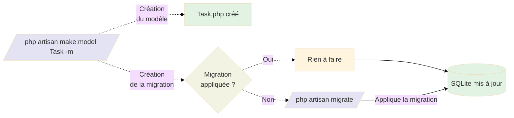
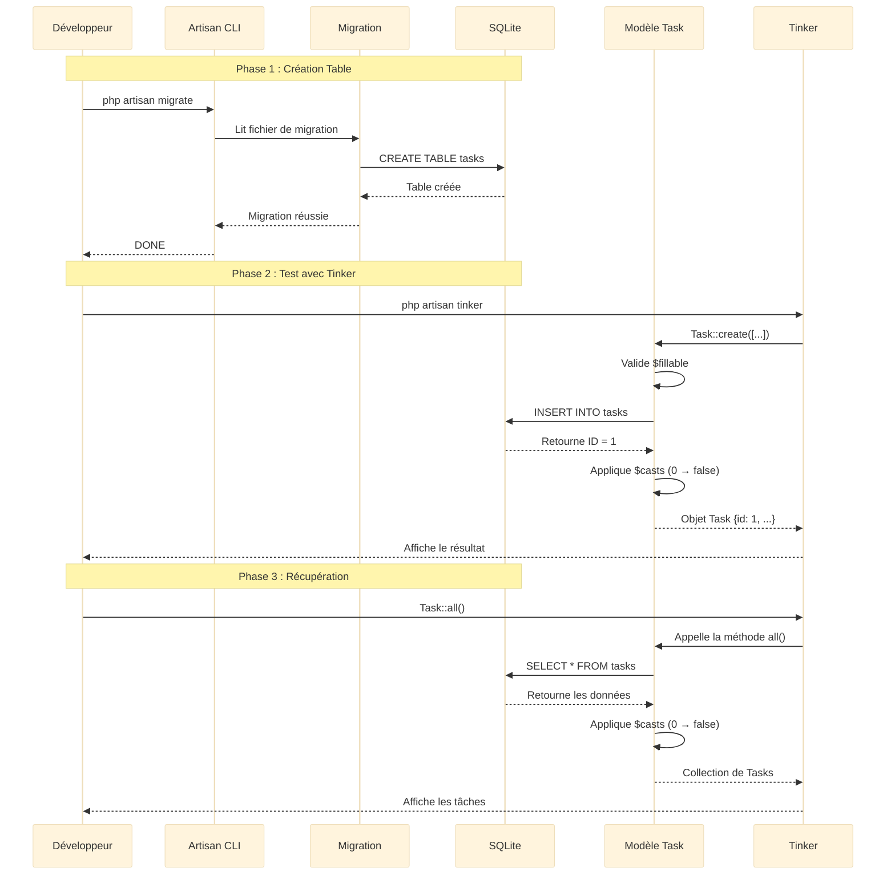

# 1 - Fondations

<div
  class="omny-meta"
  data-level="🟢 Débutant"
  data-version="1.0"
  data-time="60-90 minutes">
</div>

## Introduction

Après avoir visualisé la feuille de route complète dans le **Module 3**, il est temps de **poser les fondations solides** de votre application TALL Tasks. Ce module est absolument **critique** car une base de données mal configurée ou un modèle mal sécurisé vous causera des problèmes tout au long du projet.

Imaginez que vous construisez une maison. Vous avez les plans (Module 3), maintenant vous creusez les fondations et coulez le béton. Si les fondations sont bancales, toute la maison sera instable. C'est exactement ce que nous faisons ici avec la base de données et le modèle Eloquent.

Ce module vous guidera pas à pas pour :

- **Créer un nouveau projet Laravel** `tall-tasks` avec Composer
- **Configurer SQLite** comme base de données de développement (simplicité maximale)
- **Créer le modèle Task** avec propriétés sécurisées (`$fillable`, `$casts`)
- **Générer et exécuter la migration** pour créer la table `tasks`
- **Tester avec Tinker** pour valider que tout fonctionne parfaitement

!!! quote "Principe du Module 4"
    "Des fondations solides garantissent un développement serein. Prenez le temps de bien configurer la base de données et le modèle, vous gagnerez des heures de debugging plus tard."

## Objectifs d'Apprentissage

À la fin de ce module, **vous serez capable de** :

### Objectifs Techniques

- [ ] Créer un nouveau projet Laravel avec Composer (`composer create-project`)
- [ ] Configurer SQLite comme base de données de développement
- [ ] Générer une clé d'application Laravel sécurisée (`php artisan key:generate`)
- [ ] Créer un modèle Eloquent avec migration (`php artisan make:model Task -m`)
- [ ] Sécuriser le modèle avec `$fillable` (protection contre mass assignment)
- [ ] Convertir les types avec `$casts` (boolean, datetime, etc.)
- [ ] Écrire une migration complète avec tous les champs nécessaires
- [ ] Exécuter les migrations (`php artisan migrate`)
- [ ] Tester le modèle avec Tinker (`php artisan tinker`)
- [ ] Créer, lire, modifier, supprimer des enregistrements via Eloquent

### Objectifs Conceptuels

- [ ] Comprendre pourquoi SQLite est idéal pour le développement (vs MySQL/PostgreSQL)
- [ ] Maîtriser le concept de mass assignment et ses risques de sécurité
- [ ] Saisir l'importance des `$fillable` pour protéger les champs sensibles
- [ ] Comprendre le rôle des `$casts` dans la conversion automatique des types
- [ ] Visualiser la différence entre migrations (structure BDD) et modèles (logique PHP)
- [ ] Anticiper les problèmes de sécurité liés aux modèles non protégés

---

## Prérequis

Avant de commencer ce module, **assurez-vous d'avoir** :

- [ ] **Module 1 complété** : compréhension de l'architecture TALL
- [ ] **Module 2 complété** : environnement de développement opérationnel (PHP 8.4+, Composer 3+, Laravel 12+)
- [ ] **Module 3 complété** : vision claire de la feuille de route complète
- [ ] **Terminal ouvert** : PowerShell (Windows), Terminal (macOS/Linux)
- [ ] **60-90 minutes** devant vous sans interruption

!!! warning "Connaissances PHP/POO Requises"
    Ce module suppose que vous maîtrisez :
    
    - **PHP 8.2+** : Classes, héritage, propriétés, méthodes
    - **POO** : Concepts d'encapsulation, visibilité (public, protected, private)
    - **Namespaces** : Organisation du code en espaces de noms
    - **Eloquent ORM** : Concepts de base (sera approfondi dans ce module)

!!! danger "Ne Sautez Pas cette Étape"
    Les fondations sont **la base de tout**. Un modèle mal sécurisé = failles de sécurité. Une migration mal écrite = données corrompues. **Prenez le temps de bien comprendre chaque étape.**

---

## Comprendre Avant d'Agir : SQLite vs MySQL/PostgreSQL

Avant de créer le projet, comprenons **pourquoi nous choisissons SQLite** pour ce projet d'apprentissage.

### Pourquoi SQLite pour ce Projet ?

**Tableau comparatif des avantages :**

| Critère | SQLite (Notre choix) | MySQL/MariaDB | PostgreSQL |
|---------|:--------------------:|:-------------:|:----------:|
| **Installation** | ✅ Aucune (fichier unique) | ❌ Serveur à installer | ❌ Serveur à installer |
| **Configuration** | ✅ 2 lignes dans `.env` | ❌ ~15 lignes + user/password | ❌ ~15 lignes + user/password |
| **Portabilité** | ✅ Fichier unique copiable | ❌ Dump/Import nécessaires | ❌ Dump/Import nécessaires |
| **Apprentissage** | ✅ **Parfait** (focus sur Laravel) | ⚠️ Complexité inutile en dev | ⚠️ Complexité inutile en dev |
| **Performance (solo)** | ✅ Excellente | ⚠️ Overkill | ⚠️ Overkill |
| **Production** | ❌ Non recommandé | ✅ **Essentiel** | ✅ **Essentiel** |
| **Multi-utilisateurs** | ❌ Limité | ✅ Optimisé | ✅ Optimisé |

!!! info "Simplicité Maximale"
    **SQLite ne nécessite aucune installation de serveur de base de données séparé**, contrairement à MySQL/MariaDB ou PostgreSQL. C'est **idéal pour l'apprentissage** car vous vous concentrez sur Laravel, pas sur la configuration de la BDD.

!!! danger "SQLite en Production : À Éviter"
    **SQLite est parfait pour le développement**, mais **déconseillé en production** avec plusieurs utilisateurs simultanés. Dans le **Module 9 (Production)**, nous migrerons vers MySQL/MariaDB ou PostgreSQL.
    
    **Raisons :**
    
    - Pas de gestion avancée des connexions concurrentes
    - Pas de réplication/clustering
    - Performances limitées avec charge élevée

!!! tip "Portabilité Exceptionnelle"
    La base de données SQLite est **un seul fichier** (`database/database.sqlite`). Vous pouvez :
    
    - Le copier pour sauvegarder
    - Le partager avec votre équipe (attention : exclure de `.gitignore` en prod)
    - Le restaurer en remplaçant le fichier

---

## Phase 1 — Création du Projet Laravel (Étapes 1 à 3)

### Étape 1 : Créer le Projet Laravel

Nous allons créer un nouveau projet Laravel nommé `tall-tasks` avec Composer.

!!! note "Deux Méthodes de Création"
    Il existe **deux façons** de créer un projet Laravel :
    
    1. **Via Composer** : `composer create-project laravel/laravel tall-tasks` (celle que nous utilisons)
    2. **Via Laravel CLI** : `laravel new tall-tasks` (nécessite `laravel/installer` global)
    
    **Nous utilisons Composer** car c'est la méthode la plus universelle (pas besoin d'installer Laravel CLI).

**Ouvrez votre terminal et exécutez :**

```bash
# Créer un nouveau projet Laravel nommé "tall-tasks"
# Composer télécharge Laravel et toutes ses dépendances
composer create-project laravel/laravel tall-tasks

# Se déplacer dans le dossier du projet créé
cd tall-tasks
```

**Ce que fait cette commande :**

- Télécharge Laravel 12.x (dernière version stable)
- Installe toutes les dépendances PHP via Composer
- Génère la structure complète du projet (app/, config/, routes/, etc.)
- Crée le fichier `.env` depuis `.env.example`

**Vérification :**

```bash
# Lister le contenu du dossier pour vérifier la structure
ls -la

# Doit afficher : app/ config/ database/ public/ routes/ etc.
```

!!! success "Projet Créé avec Succès"
    Vous avez maintenant un dossier `tall-tasks/` contenant une application Laravel vierge et fonctionnelle !

---

### Étape 2 : Générer la Clé de Sécurité Laravel

La clé d'application (`APP_KEY`) est **absolument critique** pour la sécurité de votre application Laravel.

!!! info "Rôle de la Clé d'Application"
    Cette clé cryptographique de 32 caractères sert à :
    
    1. **Chiffrer les sessions** : Protection contre les manipulations malveillantes
    2. **Sécuriser les cookies** : Garantie de l'intégrité des données côté client
    3. **Protéger les données sensibles** : Chiffrement des informations critiques
    4. **Authentifier les tokens** : Génération de tokens CSRF et API sécurisés

!!! danger "Une Clé Unique par Installation"
    **Ne JAMAIS réutiliser la même clé** entre développement, staging et production. Chaque environnement doit avoir sa propre clé unique générée avec `php artisan key:generate`.

**Générer la clé :**

```bash
# Générer une nouvelle clé d'application unique
# Cette commande modifie automatiquement le fichier .env
php artisan key:generate

# Résultat attendu :
# Application key set successfully.
```

**Vérifier que la clé a été générée :**

```bash
# Afficher le contenu de la variable APP_KEY dans .env
cat .env | grep APP_KEY

# Doit afficher quelque chose comme :
# APP_KEY=base64:7x8vZ9W3qR2nK4mL5jH6gF8dS1aP0oI9uY7tR6eW5qA=
```

!!! warning "Ne Jamais Partager cette Clé"
    - **Ne JAMAIS** commiter le fichier `.env` dans Git (il est déjà dans `.gitignore`)
    - **Ne JAMAIS** partager `APP_KEY` publiquement (Slack, Discord, forums)
    - Si compromise, régénérez immédiatement avec `php artisan key:generate --force`

---

### Étape 3 : Créer le Fichier de Base de Données SQLite

SQLite stocke toutes les données dans **un seul fichier**. Créons ce fichier maintenant.

**Créer le fichier :**

```bash
# Créer le fichier database.sqlite dans le dossier database/
touch database/database.sqlite
```

!!! note "Équivalent Windows"
    Sur Windows (PowerShell), utilisez :
    
    ```powershell
    # Créer le fichier vide
    New-Item -Path database/database.sqlite -ItemType File
    ```

**Vérifier la création :**

```bash
# Vérifier que le fichier existe
ls -la database/

# Doit afficher : database.sqlite (taille 0 bytes pour l'instant)
```

!!! tip "Pourquoi un Fichier Vide ?"
    Le fichier `database.sqlite` est vide pour l'instant. Laravel créera automatiquement les tables lorsque nous exécuterons les migrations à l'Étape 7.

---

### Étape 4 : Configurer le Fichier `.env` pour SQLite

Le fichier `.env` contient toutes les variables d'environnement de l'application. Configurons-le pour utiliser SQLite.

**Ouvrir le fichier `.env` avec votre éditeur :**

```bash
# Ouvrir avec VS Code (si installé)
code .env

# OU avec nano (Linux/macOS)
nano .env

# OU avec notepad (Windows)
notepad .env
```

**Modifier les variables de base de données :**

```perl
# Configuration de la base de données SQLite
DB_CONNECTION=sqlite
DB_DATABASE=./database/database.sqlite

# Commenter ou supprimer ces lignes (non nécessaires pour SQLite)
# DB_HOST=127.0.0.1
# DB_PORT=3306
# DB_USERNAME=root
# DB_PASSWORD=
```

!!! info "Chemin Relatif Important"
    Le chemin `./database/database.sqlite` est **relatif à la racine du projet**. Assurez-vous que le fichier est bien dans `database/database.sqlite`.

**Vérification complète du fichier `.env` :**

```perl
APP_NAME="TALL Tasks"
APP_ENV=local
APP_KEY=base64:VOTRE_CLE_GENEREE  # Générée à l'Étape 2
APP_DEBUG=true
APP_URL=http://localhost:8000

# Configuration SQLite
DB_CONNECTION=sqlite
DB_DATABASE=./database/database.sqlite

# Autres configurations (laisser par défaut)
BROADCAST_DRIVER=log
CACHE_DRIVER=file
FILESYSTEM_DISK=local
QUEUE_CONNECTION=sync
SESSION_DRIVER=file
SESSION_LIFETIME=120
```

!!! success "Configuration SQLite Terminée"
    Votre application Laravel est maintenant configurée pour utiliser SQLite comme base de données !

> Ainsi s'achève la Phase 1 - Création du Projet Laravel (Étapes 1-4)

---

## Phase 2 — Création du Modèle Task (Étapes 5 à 6)

### Étape 5 : Créer le Modèle Task avec Migration

Nous allons créer le modèle `Task` et sa migration en **une seule commande** grâce à l'option `-m`.

!!! info "Qu'est-ce qu'un Modèle Eloquent ?"
    Un **modèle Eloquent** est une classe PHP qui représente une table de base de données. Il permet d'interagir avec la BDD via des méthodes orientées objet au lieu d'écrire du SQL brut.
    
    **Exemple :** `Task::create(['title' => 'Ma tâche'])` au lieu de `INSERT INTO tasks (title) VALUES ('Ma tâche')`

**Créer le modèle et la migration :**

```bash
# Créer le modèle Task + migration en une commande
# L'option -m génère automatiquement la migration
php artisan make:model Task -m

# Résultat attendu :
# Model created successfully.
# Migration created successfully.
```

**Fichiers créés automatiquement :**

- **Modèle** : `app/Models/Task.php` (logique métier en PHP)
- **Migration** : `database/migrations/YYYY_MM_DD_HHMMSS_create_tasks_table.php` (structure BDD)

!!! tip "Option -m Expliquée"
    Le flag `-m` est un raccourci qui crée **deux fichiers** en une commande :
    
    - `php artisan make:model Task` → Crée `app/Models/Task.php`
    - `php artisan make:migration create_tasks_table` → Crée la migration
    
    **Sans `-m`, vous devriez exécuter deux commandes séparées.**

---

### Étape 6 : Configurer le Modèle Task avec Sécurité

Ouvrez le fichier `app/Models/Task.php` et configurons-le avec les **bonnes pratiques de sécurité**.

**Fichier :** `app/Models/Task.php`

```php
<?php

namespace App\Models;

use Illuminate\Database\Eloquent\Model;

class Task extends Model
{
    /**
     * Champs assignables en masse (protection contre mass assignment)
     * 
     * Seuls ces champs peuvent être modifiés via create() ou update()
     * avec un tableau de données. Empêche les attaques malveillantes.
     */
    protected $fillable = [
        'title',        // Titre de la tâche (obligatoire)
        'description',  // Description optionnelle
        'completed'     // État de complétion (boolean)
    ];

    /**
     * Conversion automatique des types (casting)
     * 
     * Laravel convertit automatiquement les données :
     * - BDD stocke 0/1 → PHP reçoit true/false (boolean)
     * - BDD stocke timestamps → PHP reçoit Carbon instances
     */
    protected $casts = [
        'completed' => 'boolean',  // 0/1 en BDD → true/false en PHP
    ];
}
```

!!! danger "Importance Critique de $fillable"
    **Sans `$fillable`, votre application est vulnérable aux attaques mass assignment.**
    
    **Exemple d'attaque :**
    
    Un utilisateur malveillant envoie une requête POST avec :
    
    ```php
    ['title' => 'Ma tâche', 'user_id' => 999, 'is_admin' => true]
    ```
    
    **Sans `$fillable`** : Laravel accepte TOUS les champs (y compris `user_id` et `is_admin`)
    **Avec `$fillable`** : Laravel accepte UNIQUEMENT `title`, `description`, `completed`

#### Comprendre `$fillable` : Protection Contre Mass Assignment

**Qu'est-ce que le Mass Assignment ?**

Le **mass assignment** permet de créer/modifier un modèle avec un tableau de données :

```php
// Mass assignment (pratique mais dangereux sans protection)
Task::create([
    'title' => 'Ma tâche',
    'description' => 'Détails',
    'completed' => false
]);
```

**Sans protection `$fillable`, un attaquant pourrait :**

```php
// Attaque : injecter des champs non prévus
Task::create([
    'title' => 'Ma tâche',
    'user_id' => 999,      // ❌ Modifier l'utilisateur propriétaire
    'is_admin' => true,    // ❌ Se donner les droits admin
    'created_at' => '1970-01-01'  // ❌ Falsifier les dates
]);
```

**Avec `$fillable`, Laravel bloque automatiquement :**

```php
// Seuls title, description, completed sont acceptés
Task::create([
    'title' => 'Ma tâche',
    'user_id' => 999,      // ✅ IGNORÉ par Laravel
    'is_admin' => true,    // ✅ IGNORÉ par Laravel
]);
```

!!! success "Sécurité Garantie"
    Avec `$fillable` correctement configuré, vous êtes protégé contre les attaques mass assignment. **Ne JAMAIS utiliser `$guarded = []` qui désactive la protection !**

#### Comprendre `$casts` : Conversion Automatique des Types

**Qu'est-ce que le Casting ?**

Le **casting** convertit automatiquement les données entre la base de données et PHP.

**Exemple avec `completed` :**

```php
// En base de données SQLite/MySQL
completed = 0  // Stocké comme integer (0 = false, 1 = true)

// En PHP avec $casts
$task->completed  // Automatiquement converti en boolean (true/false)
```

**Sans `$casts` :**

```php
// Sans casting
$task = Task::find(1);
var_dump($task->completed);  // int(0) ou int(1)

// Problème dans les conditions
if ($task->completed) { }  // ❌ 0 = false (OK), mais confus
```

**Avec `$casts` :**

```php
// Avec casting
$task = Task::find(1);
var_dump($task->completed);  // bool(false) ou bool(true)

// Condition claire
if ($task->completed === true) { }  // ✅ Type strict, code lisible
```

**Types de casting disponibles :**

```php
protected $casts = [
    'completed' => 'boolean',      // 0/1 → true/false
    'created_at' => 'datetime',    // Timestamp → Carbon instance
    'metadata' => 'array',         // JSON → array PHP
    'price' => 'decimal:2',        // Float avec 2 décimales
    'count' => 'integer',          // String → integer
];
```

!!! tip "Pourquoi Utiliser $casts ?"
    1. **Cohérence** : Types PHP corrects dans tout le code
    2. **Lisibilité** : `$task->completed === true` plus clair que `$task->completed == 1`
    3. **Sécurité** : Typage strict évite les bugs subtils
    4. **Automatique** : Conversion gérée par Laravel, pas de code manuel

> Ainsi s'achève la Phase 2 - Création du Modèle Task (Étapes 5-6)

---

## Phase 3 — Configuration de la Migration (Étapes 7 à 8)

### Étape 7 : Écrire la Migration de la Table `tasks`

Ouvrez le fichier de migration créé à l'Étape 5. Il se trouve dans `database/migrations/` avec un nom comme `YYYY_MM_DD_HHMMSS_create_tasks_table.php`.

**Fichier :** `database/migrations/YYYY_MM_DD_HHMMSS_create_tasks_table.php`

```php
<?php

use Illuminate\Database\Migrations\Migration;
use Illuminate\Database\Schema\Blueprint;
use Illuminate\Support\Facades\Schema;

return new class extends Migration
{
    /**
     * Exécuter la migration (créer la table)
     * 
     * Cette méthode est appelée quand on exécute "php artisan migrate"
     */
    public function up(): void
    {
        Schema::create('tasks', function (Blueprint $table) {
            // Identifiant unique auto-incrémenté (PRIMARY KEY)
            // Génère une colonne "id" de type BIGINT UNSIGNED
            $table->id();

            // Titre de la tâche (VARCHAR 255)
            // Ce champ est obligatoire (NOT NULL implicite)
            $table->string('title');

            // Description de la tâche (TEXT)
            // nullable() rend le champ optionnel (peut être NULL)
            $table->text('description')->nullable();

            // État de complétion (BOOLEAN → TINYINT en MySQL/SQLite)
            // default(false) définit la valeur par défaut à false (0)
            $table->boolean('completed')->default(false);

            // Timestamps automatiques (created_at, updated_at)
            // Laravel gère automatiquement ces champs
            $table->timestamps();
        });
    }

    /**
     * Annuler la migration (supprimer la table)
     * 
     * Cette méthode est appelée quand on exécute "php artisan migrate:rollback"
     */
    public function down(): void
    {
        Schema::dropIfExists('tasks');
    }
};
```

#### Explication Détaillée des Champs

**Tableau récapitulatif des colonnes :**

| Méthode | Type SQL | Type PHP | Nullable | Description |
|---------|----------|----------|:--------:|-------------|
| `id()` | BIGINT UNSIGNED | int | ❌ | Identifiant unique auto-incrémenté (PRIMARY KEY) |
| `string('title')` | VARCHAR(255) | string | ❌ | Titre de la tâche (obligatoire) |
| `text('description')` | TEXT | string\|null | ✅ | Description optionnelle (peut être vide) |
| `boolean('completed')` | TINYINT(1) | bool | ❌ | État : false (0) = en cours, true (1) = terminée |
| `timestamps()` | TIMESTAMP x2 | Carbon | ❌ | created_at et updated_at (gérés automatiquement) |

!!! info "Qu'est-ce qu'une Migration ?"
    Une **migration** est un **système de contrôle de version pour votre base de données**. Elle permet de :
    
    1. **Versionner le schéma** : Historique complet des modifications de structure
    2. **Collaborer en équipe** : Partager les changements de BDD via Git
    3. **Rollback sécurisé** : Annuler une migration avec `php artisan migrate:rollback`
    4. **Cohérence multi-environnements** : Structure identique en dev/staging/production

#### Méthode `up()` : Créer la Table

La méthode `up()` définit **ce qui doit être créé** quand on exécute la migration.

```php
public function up(): void
{
    Schema::create('tasks', function (Blueprint $table) {
        // Définition des colonnes ici
    });
}
```

**Ce que fait `Schema::create()` :**

- Crée une nouvelle table nommée `tasks`
- Définit les colonnes via le Blueprint `$table`
- Génère le SQL approprié pour SQLite/MySQL/PostgreSQL

#### Méthode `down()` : Supprimer la Table

La méthode `down()` définit **comment annuler la migration**.

```php
public function down(): void
{
    Schema::dropIfExists('tasks');
}
```

**Pourquoi `dropIfExists()` au lieu de `drop()` ?**

- `drop()` : Échoue si la table n'existe pas (erreur)
- `dropIfExists()` : Supprime si existe, ne fait rien sinon (sécurisé)

!!! warning "Importance de la Méthode down()"
    **Toujours implémenter `down()` correctement** pour pouvoir annuler une migration. En production, vous devrez peut-être rollback une migration problématique.

---

### Étape 8 : Exécuter la Migration

Maintenant que la migration est écrite, exécutons-la pour créer la table `tasks` dans SQLite.

**Exécuter les migrations :**

```bash
# Exécuter toutes les migrations en attente
php artisan migrate

# Résultat attendu :
#   INFO  Preparing database.
#
#   Creating migration table ................... 15ms DONE
#
#   INFO  Running migrations.
#
#   2014_10_12_000000_create_users_table ........ 25ms DONE
#   2014_10_12_100000_create_password_resets_table ... 18ms DONE
#   2019_08_19_000000_create_failed_jobs_table ... 22ms DONE
#   2019_12_14_000001_create_personal_access_tokens_table ... 28ms DONE
#   2024_12_XX_XXXXXX_create_tasks_table ......... 20ms DONE
```

!!! success "Migration Réussie"
    Si vous voyez `DONE` pour toutes les migrations, la table `tasks` a été créée avec succès dans SQLite !

**Vérifier que la table existe :**

```bash
# Vérifier que le fichier SQLite a maintenant une taille > 0
ls -lh database/database.sqlite

# Doit afficher une taille comme "28K" au lieu de "0B"
```

**Tableau SQL généré (pour référence) :**

```sql
-- SQL généré par Laravel pour SQLite
CREATE TABLE tasks (
    id INTEGER PRIMARY KEY AUTOINCREMENT NOT NULL,
    title VARCHAR(255) NOT NULL,
    description TEXT,
    completed TINYINT(1) DEFAULT 0 NOT NULL,
    created_at DATETIME,
    updated_at DATETIME
);
```

!!! tip "Commandes Utiles de Migration"
    ```bash
    # Voir l'état des migrations
    php artisan migrate:status
    
    # Annuler la dernière migration
    php artisan migrate:rollback
    
    # Annuler toutes les migrations
    php artisan migrate:reset
    
    # Annuler et réexécuter toutes les migrations
    php artisan migrate:refresh
    
    # Supprimer toutes les tables et réexécuter les migrations
    php artisan migrate:fresh
    ```

#### Comprendre le Lien entre Migration et SQLite

Ce diagramme montre **comment Artisan applique les migrations** à SQLite.

**Comment lire ce diagramme ?**

- Les **rectangles** représentent les actions/composants
- Les **flèches** montrent le flux d'exécution
- Les **couleurs** différencient les types d'actions



<small>*Ce diagramme illustre le flux complet de création d'un modèle avec migration. Étape 1 : `php artisan make:model Task -m` crée deux fichiers (Task.php + migration). Étape 2 : La migration n'est pas encore appliquée (fichier créé mais table pas encore en BDD). Étape 3 : `php artisan migrate` lit le fichier de migration et génère le SQL pour créer la table `tasks` dans SQLite. Étape 4 : SQLite contient maintenant la table `tasks` avec toutes les colonnes définies.*</small>

> Ainsi s'achève la Phase 3 - Configuration de la Migration (Étapes 7-8)

---

## Phase 4 — Test avec Tinker (Étapes 9 à 10)

### Étape 9 : Qu'est-ce que Tinker ?

**Tinker** est un **REPL (Read-Eval-Print Loop)** interactif pour Laravel créé par **Taylor Otwell** (créateur de Laravel).

!!! info "REPL Expliqué"
    Un **REPL** est un environnement interactif qui :
    
    1. **Read** : Lit votre code PHP
    2. **Eval** : Évalue/Exécute le code
    3. **Print** : Affiche le résultat
    4. **Loop** : Recommence pour la prochaine commande
    
    **Exemple :** Vous tapez `2 + 2`, Tinker affiche `4`.

**Pourquoi Tinker est Indispensable :**

- **Tester rapidement** : Valider le modèle sans créer de routes/contrôleurs
- **Manipuler les données** : Créer, lire, modifier, supprimer des enregistrements en direct
- **Déboguer** : Explorer les relations, tester les requêtes Eloquent
- **Expérimenter** : Tester l'API Eloquent sans écrire de fichiers

!!! warning "Différence avec PHPUnit"
    **Tinker ≠ PHPUnit**
    
    - **Tinker** : REPL interactif pour exploration/debugging (utilisé maintenant)
    - **PHPUnit** : Framework de tests automatisés pour CI/CD (utilisé plus tard)
    
    **Tinker** est pour l'exploration manuelle, **PHPUnit** pour les tests automatisés.

---

### Étape 10 : Tester le Modèle Task avec Tinker

Lançons Tinker et créons notre première tâche !

**Démarrer Tinker :**

```bash
# Lancer Tinker depuis le terminal
php artisan tinker

# Résultat :
# Psy Shell v0.12.0 (PHP 8.4.0 — cli) by Justin Hileman
# >>>
```

!!! tip "Vous Êtes dans Tinker"
    Le prompt `>>>` indique que vous êtes dans Tinker. Vous pouvez maintenant taper du code PHP qui sera exécuté dans le contexte de votre application Laravel.

#### Test 1 : Créer une Première Tâche

```php
// Créer une nouvelle tâche avec create()
// create() utilise mass assignment → nécessite $fillable
$task = App\Models\Task::create([
    'title' => 'Ma première tâche Laravel',
    'description' => 'Comprendre les modèles Eloquent'
]);

// Résultat affiché par Tinker :
// => App\Models\Task {#1234
//      id: 1,
//      title: "Ma première tâche Laravel",
//      description: "Comprendre les modèles Eloquent",
//      completed: false,  // false par défaut (défini dans migration)
//      created_at: "2024-12-08 14:30:00",
//      updated_at: "2024-12-08 14:30:00",
//    }
```

!!! success "Première Tâche Créée !"
    Si vous voyez un objet `Task` avec un `id: 1`, **félicitations** ! Votre modèle fonctionne parfaitement.

**Ce qui s'est passé en coulisses :**

1. Laravel a validé que `title` et `description` sont dans `$fillable`
2. Laravel a généré le SQL : `INSERT INTO tasks (title, description, completed, created_at, updated_at) VALUES (?, ?, 0, ?, ?)`
3. SQLite a exécuté la requête et retourné l'ID 1
4. Laravel a converti `completed = 0` en `false` grâce à `$casts`

#### Test 2 : Afficher la Tâche Créée

```php
// Convertir l'objet Task en tableau pour voir tous les champs
$task->toArray();

// Résultat :
// => [
//      "id" => 1,
//      "title" => "Ma première tâche Laravel",
//      "description" => "Comprendre les modèles Eloquent",
//      "completed" => false,
//      "created_at" => "2024-12-08T14:30:00.000000Z",
//      "updated_at" => "2024-12-08T14:30:00.000000Z",
//    ]
```

#### Test 3 : Récupérer Toutes les Tâches

```php
// Récupérer toutes les tâches et les convertir en tableau
App\Models\Task::all()->toArray();

// Résultat :
// => [
//      [
//        "id" => 1,
//        "title" => "Ma première tâche Laravel",
//        "description" => "Comprendre les modèles Eloquent",
//        "completed" => false,
//        "created_at" => "2024-12-08T14:30:00.000000Z",
//        "updated_at" => "2024-12-08T14:30:00.000000Z",
//      ],
//    ]
```

#### Test 4 : Créer une Tâche Sans Description

```php
// Tester que description est bien optionnel (nullable)
$task2 = App\Models\Task::create([
    'title' => 'Tâche sans description'
]);

// Vérifier que description est NULL
$task2->toArray();

// Résultat :
// => [
//      "id" => 2,
//      "title" => "Tâche sans description",
//      "description" => null,  // ✅ NULL accepté grâce à nullable()
//      "completed" => false,
//      "created_at" => "2024-12-08T14:35:00.000000Z",
//      "updated_at" => "2024-12-08T14:35:00.000000Z",
//    ]
```

#### Test 5 : Modifier l'État de Complétion

```php
// Basculer l'état de completed
$task->update(['completed' => true]);

// Vérifier le changement
$task->toArray();

// Résultat :
// => [
//      "id" => 1,
//      "title" => "Ma première tâche Laravel",
//      "description" => "Comprendre les modèles Eloquent",
//      "completed" => true,  // ✅ Maintenant true
//      "created_at" => "2024-12-08T14:30:00.000000Z",
//      "updated_at" => "2024-12-08T14:36:00.000000Z",  // ✅ updated_at mis à jour automatiquement
//    ]
```

!!! tip "Timestamps Automatiques"
    Remarquez que `updated_at` a été mis à jour automatiquement par Laravel. C'est grâce à `$table->timestamps()` dans la migration !

#### Test 6 : Supprimer une Tâche

```php
// Supprimer la deuxième tâche
$task2->delete();

// Vérifier qu'il ne reste qu'une tâche
App\Models\Task::count();

// Résultat :
// => 1
```

#### Sortir de Tinker

```php
// Quitter Tinker
exit

// OU appuyer sur Ctrl+C (Windows/Linux) ou Cmd+C (macOS)
```

!!! success "Tests Validés avec Succès"
    Si tous ces tests ont fonctionné, **vos fondations sont solides** ! Le modèle Task est correctement configuré et la persistance en base de données fonctionne parfaitement.

> Ainsi s'achève la Phase 4 - Test avec Tinker (Étapes 9-10)

---

## Diagramme de Séquence : Compréhension Complète

Ce diagramme montre **tout le flux** depuis la migration jusqu'à la persistance dans SQLite via Tinker.

**Comment lire ce diagramme ?**

- Les **participants** représentent les composants techniques
- Les **flèches pleines** montrent les actions exécutées
- Les **flèches pointillées** montrent les retours de données
- **Séquence temporelle** : de haut en bas



<small>*Ce diagramme illustre le cycle de vie complet d'une tâche depuis la migration jusqu'à la récupération. Phase 1 (Création Table) : `php artisan migrate` lit la migration et génère le SQL `CREATE TABLE tasks` dans SQLite. Phase 2 (Test Tinker) : `Task::create([...])` valide les champs avec `$fillable`, insère en BDD, applique `$casts` pour convertir 0 en false. Phase 3 (Récupération) : `Task::all()` exécute `SELECT * FROM tasks`, applique `$casts`, retourne une Collection. Chaque étape dépend de la précédente : impossible de créer une tâche sans table, impossible de récupérer sans avoir créé.*</small>

---

## Le Mot de la Fin

### FÉLICITATIONS ! Vos fondations sont maintenant solides.

!!! success "Fondations Complètes et Sécurisées"

**Compétences Techniques Acquises :**

- ✅ **Création projet Laravel** : `composer create-project` maîtrisé
- ✅ **Configuration SQLite** : Fichier créé, `.env` configuré, clé générée
- ✅ **Modèle Task sécurisé** : `$fillable` protège contre mass assignment, `$casts` convertit les types
- ✅ **Migration complète** : Table `tasks` avec 5 colonnes (id, title, description, completed, timestamps)
- ✅ **Exécution migration** : `php artisan migrate` appliqué avec succès
- ✅ **Test Tinker validé** : Création, lecture, modification, suppression fonctionnelles

**Compétences Conceptuelles Acquises :**

- ✅ **Comprendre SQLite** : Pourquoi c'est parfait pour dev, limité en production
- ✅ **Maîtriser mass assignment** : Risques de sécurité, protection avec `$fillable`
- ✅ **Saisir les $casts** : Conversion automatique types (0/1 → true/false)
- ✅ **Visualiser migrations** : Système de versioning BDD comme Git pour le code
- ✅ **Utiliser Tinker** : REPL interactif pour tester sans créer routes/contrôleurs
- ✅ **Anticiper la production** : SQLite → MySQL/PostgreSQL dans Module 9

### Ce qui Rend ces Fondations Solides

**Sécurité Intégrée Dès le Début :**

Notre modèle Task est **sécurisé par défaut** grâce à deux propriétés critiques :

```php
// Protection contre mass assignment (failles de sécurité)
protected $fillable = ['title', 'description', 'completed'];

// Conversion automatique des types (cohérence des données)
protected $casts = ['completed' => 'boolean'];
```

Ces deux lignes vous protègent contre :

- **Attaques mass assignment** : Impossible d'injecter `user_id`, `is_admin`, etc.
- **Bugs de typage** : `completed` est toujours `true/false`, jamais `0/1`
- **Incohérences BDD** : Laravel garantit la cohérence des types

**Migration Versionnée :**

Votre migration est **versionnée dans Git** comme le code. Cela signifie :

1. **Historique complet** : Vous voyez toutes les modifications de structure BDD
2. **Collaboration facile** : Partager les changements de BDD avec l'équipe
3. **Rollback possible** : Annuler une migration problématique avec `php artisan migrate:rollback`
4. **Cohérence** : Structure identique en dev/staging/production

**Validation avec Tinker :**

Nous avons **testé 6 scénarios** pour garantir que tout fonctionne :

1. ✅ Créer une tâche avec description
2. ✅ Créer une tâche sans description (nullable)
3. ✅ Récupérer toutes les tâches
4. ✅ Modifier l'état de complétion
5. ✅ Supprimer une tâche
6. ✅ Vérifier les timestamps automatiques

### Points Clés à Retenir

Avant de passer au Module 5, retenez ces **8 principes fondamentaux** :

1. **SQLite en dev** : Fichier unique, configuration 2 lignes, parfait pour apprendre (MySQL/PostgreSQL en prod)
2. **$fillable obligatoire** : Protection contre mass assignment, liste blanche des champs modifiables
3. **$casts recommandé** : Conversion automatique types (0/1 → true/false), cohérence garantie
4. **Migrations = Git BDD** : Versioning structure, rollback possible, collaboration facilitée
5. **Tinker = Debugging rapide** : REPL interactif, test modèles sans routes/contrôleurs
6. **Timestamps automatiques** : Laravel gère `created_at`/`updated_at` automatiquement
7. **up() et down()** : Toujours implémenter les deux méthodes pour rollback possible
8. **Test avant de continuer** : 6 tests Tinker validés = fondations solides garanties

### Tableau Comparaison Avant/Après Module 4

| Aspect | Avant Module 4 | Après Module 4 |
|--------|----------------|----------------|
| **Projet Laravel** | Pas de projet | Projet `tall-tasks` créé et configuré |
| **Base de données** | Aucune | SQLite configuré et opérationnel |
| **Modèle Task** | Inexistant | Modèle sécurisé avec `$fillable` et `$casts` |
| **Table tasks** | Pas créée | Table créée avec 5 colonnes via migration |
| **Persistance** | Impossible | Données sauvegardées en SQLite |
| **Tests** | Aucun | 6 scénarios validés avec Tinker |
| **Sécurité** | Vulnérable | Protégé contre mass assignment |
| **Prêt pour Suite** | Non | ✅ **Oui** (Interface Laravel dans Module 5) |

### Prochaines Étapes : Module 5 - Interface Laravel

Le **Module 5** vous apprendra à **construire l'interface utilisateur** avec Laravel classique (sans réactivité) :

**Contenu du Module 5 :**

- **TaskController** : Création du contrôleur avec 4 méthodes (index, store, toggle, destroy)
- **Routes RESTful** : Configuration dans `routes/web.php`
- **Layout Blade** : Création de `layouts/app.blade.php` avec header/footer
- **Vue principale** : `tasks/index.blade.php` avec formulaire et liste
- **Progression HTML** : HTML brut → HTML + Tailwind → HTML + Tailwind + Blade

**Durée estimée :** 90-120 minutes

**Niveau :** 🟢 Débutant

**Lien :** Module 5 : Étape 2 - Interface Laravel (sera disponible après validation de ce module)

!!! info "Validation de ce Module"
    Avant de passer au Module 5, assurez-vous d'avoir :
    
    - [ ] Créé le projet `tall-tasks` avec succès
    - [ ] Configuré SQLite dans `.env`
    - [ ] Généré la clé d'application (`APP_KEY`)
    - [ ] Créé le modèle Task avec `$fillable` et `$casts`
    - [ ] Écrit la migration complète (5 colonnes)
    - [ ] Exécuté `php artisan migrate` avec succès
    - [ ] Validé les 6 tests Tinker (créer, lire, modifier, supprimer)

---

[^1]: **Mass Assignment** : Vulnérabilité de sécurité permettant d'injecter des champs non prévus lors de la création/modification d'un modèle via tableau de données. Protection : définir `$fillable` (liste blanche) ou `$guarded` (liste noire). Sans protection, attaquant peut modifier `user_id`, `is_admin`, etc.

[^2]: **Eloquent ORM** : Object-Relational Mapping de Laravel permettant d'interagir avec BDD via objets PHP au lieu de SQL brut. Exemple : `Task::create([...])` au lieu de `INSERT INTO tasks`. Gère automatiquement timestamps, casting types, relations. Basé sur Active Record pattern.

[^3]: **Migration** : Système de contrôle de version pour schéma de base de données. Fichiers PHP définissant modifications structure BDD (CREATE, ALTER, DROP). Exécution via `php artisan migrate`. Rollback possible avec `migrate:rollback`. Versionnés dans Git comme le code.

[^4]: **Tinker** : REPL (Read-Eval-Print Loop) interactif Laravel créé par Taylor Otwell. Permet d'exécuter code PHP dans contexte application. Utile pour tester modèles, requêtes Eloquent, explorer relations. Accessible via `php artisan tinker`. Alternative rapide aux tests manuels.

[^5]: **Blueprint** : Classe Laravel utilisée dans migrations pour définir structure table. Fournit méthodes fluides pour créer colonnes (`string()`, `text()`, `boolean()`, etc.). Génère SQL approprié pour BDD cible (MySQL, PostgreSQL, SQLite). Permet modifiers (`nullable()`, `default()`, `unique()`).
