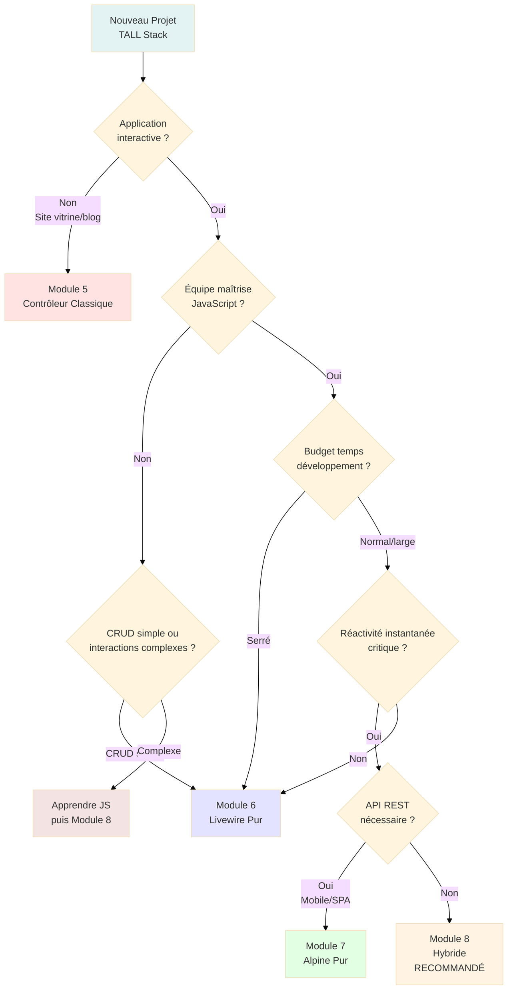

# 3c - Hybride

<div
  class="omny-meta"
  data-level="🔴 Avancé"
  data-version="1.0"
  data-time="150-180 minutes">
</div>

## Introduction

Après avoir maîtrisé la **réactivité côté serveur** avec Livewire (Module 6) et la **réactivité côté client** avec Alpine.js (Module 7), il est temps de découvrir l'**approche hybride** : combiner intelligemment les deux frameworks pour obtenir le **meilleur des deux mondes**. Ce module représente le **sommet de la Stack TALL** et l'architecture utilisée dans les **applications professionnelles modernes**.

Imaginez que vous construisez une voiture de sport. Livewire (Module 6) est un **moteur électrique** : silencieux, fiable, maintenance simple, mais latence de ~50-100ms pour chaque accélération. Alpine.js (Module 7) est un **moteur thermique** : réactivité instantanée, performance brute, mais maintenance complexe et consommation élevée. L'**approche hybride** (Module 8) est un **moteur hybride** : électrique pour la conduite quotidienne (logique métier), thermique pour les dépassements (micro-interactions). **Le meilleur des deux technologies**.

**Qu'est-ce que l'approche hybride apporte concrètement ?**

Dans les Modules 6-7, vous aviez le choix binaire :
- **Livewire pur** : Toute la logique en PHP, latence ~50-100ms partout
- **Alpine pur** : Toute la logique en JavaScript, API REST obligatoire

Avec l'approche hybride, **répartition intelligente** :
- **Livewire** pour la logique métier lourde (validation, BDD, sécurité)
- **Alpine** pour les micro-interactions légères (filtres, accordéons, animations)
- **Communication bidirectionnelle** entre les deux via événements

Ce module vous guidera pas à pas pour :

- **Comprendre l'architecture hybride** : Quand utiliser Livewire vs Alpine
- **Implémenter la communication** Livewire ↔ Alpine avec `$wire` et événements
- **Créer un système de filtres** Alpine côté client + liste Livewire côté serveur
- **Optimiser les performances** : Réduire requêtes AJAX, cache intelligent
- **Gérer les états partagés** : Synchronisation entre composants
- **Comparer les 4 architectures** : Classique (Module 5) vs Livewire (6) vs Alpine (7) vs Hybride (8)

!!! quote "Principe du Module 8"
    "L'approche hybride Livewire + Alpine combine logique métier sécurisée (PHP) et micro-interactions instantanées (JavaScript). C'est l'architecture des applications professionnelles modernes."

---

## Objectifs d'Apprentissage

À la fin de ce module, **vous serez capable de** :

### Objectifs Techniques

- [ ] Identifier quand utiliser Livewire vs Alpine dans un même composant
- [ ] Utiliser `$wire` pour accéder aux propriétés/méthodes Livewire depuis Alpine
- [ ] Déclencher événements Livewire depuis Alpine (`$dispatch()`)
- [ ] Écouter événements Livewire dans Alpine (`@event.window`)
- [ ] Créer des filtres côté client (Alpine) avec liste serveur (Livewire)
- [ ] Implémenter des animations/transitions avec Alpine
- [ ] Gérer des états partagés entre Livewire et Alpine
- [ ] Optimiser les performances avec `wire:model.lazy` et debouncing
- [ ] Utiliser `wire:loading` pour afficher spinners/états de chargement
- [ ] Debugger la communication Livewire ↔ Alpine

### Objectifs Conceptuels

- [ ] Comprendre l'architecture hybride Livewire + Alpine
- [ ] Visualiser le flux de données bidirectionnel
- [ ] Maîtriser la séparation des responsabilités (logique vs UI)
- [ ] Saisir quand privilégier serveur vs client
- [ ] Comprendre les patterns de communication inter-composants
- [ ] Anticiper les pièges de la synchronisation d'état
- [ ] Comparer performance des 4 architectures (5, 6, 7, 8)
- [ ] Choisir l'architecture optimale selon le contexte projet

---

## Prérequis

Avant de commencer ce module, **assurez-vous d'avoir** :

- [ ] **Module 6 complété** : Application Livewire fonctionnelle
- [ ] **Module 7 complété** : Application Alpine.js fonctionnelle avec API REST
- [ ] **Compréhension Livewire** : Propriétés réactives, directives wire, cycle AJAX
- [ ] **Compréhension Alpine** : `x-data`, `x-model`, fetch(), état local
- [ ] **Maîtrise JavaScript** : Événements, promesses, async/await, déstructuration
- [ ] **150-180 minutes** devant vous sans interruption

!!! warning "Niveau Avancé"
    **Ce module est le plus complexe de la série**. Il suppose que vous maîtrisez :
    
    - **Livewire** : Composants, propriétés, méthodes, événements
    - **Alpine.js** : Directives, état réactif, fetch()
    - **JavaScript moderne** : ES6+, événements DOM, Window events
    - **Patterns architecturaux** : Séparation des responsabilités, communication inter-composants

!!! danger "Ne Sautez Pas les Modules 6-7"
    **Impossible de comprendre l'hybride sans maîtriser les bases**. Les Modules 6 et 7 sont **des prérequis absolus**. Sans eux, vous ne saisirez ni les avantages ni les défis de l'approche hybride.

---

## Comprendre Avant d'Agir : Architecture Hybride

Avant de coder, comprenons **l'architecture hybride** et **quand utiliser chaque outil**.

### Principe de Séparation des Responsabilités

L'approche hybride repose sur une **séparation claire** :

**Tableau de répartition des responsabilités :**

| Responsabilité | Outil | Raison | Exemple |
|----------------|-------|--------|---------|
| **Logique métier** | 🟦 Livewire | Sécurité, validation, accès BDD | Créer/modifier/supprimer tâche |
| **Persistance** | 🟦 Livewire | Transactions, intégrité données | Sauvegarder en SQLite |
| **Validation serveur** | 🟦 Livewire | Protection contre attaques | Vérifier titre non vide |
| **Requêtes complexes** | 🟦 Livewire | Eloquent ORM, relations | Charger tâches avec utilisateur |
| **Micro-interactions** | 🟩 Alpine | Réactivité instantanée | Ouvrir/fermer accordéon |
| **Filtres locaux** | 🟩 Alpine | Pas de requête serveur | Filtrer par statut (complété/non) |
| **Animations** | 🟩 Alpine | CSS transitions | Fade in/out, slide |
| **Validation client** | 🟩 Alpine | UX immédiate | Afficher erreur en temps réel |

!!! info "Règle d'Or de l'Hybride"
    **Livewire = Ce qui DOIT passer par le serveur** (persistance, sécurité, logique métier)
    **Alpine = Ce qui PEUT rester côté client** (filtres, animations, états temporaires)

### Architecture des 4 Modules : Comparaison Visuelle

Ce diagramme montre l'**évolution architecturale** à travers les Modules 5-8.

**Comment lire ce diagramme ?**

- **Chaque colonne** représente un module
- **Les rectangles** montrent où se trouve la logique
- **Les flèches** indiquent les requêtes réseau

```mermaid
---
config:
    theme: 'base'
---
flowchart TB
    subgraph Module5["Module 5<br/>Contrôleur Classique"]
        U5[Utilisateur] -->|Action| S5[Serveur PHP]
        S5 -->|HTML complet<br/>~200KB| U5
        S5 -.->|Rechargement<br/>page| U5
    end
    
    subgraph Module6["Module 6<br/>Livewire Pur"]
        U6[Utilisateur] -->|Action| LW[Livewire.js]
        LW -->|AJAX<br/>~1-5KB| S6[Serveur PHP]
        S6 -->|HTML partiel| LW
        LW -->|Diff DOM| U6
    end
    
    subgraph Module7["Module 7<br/>Alpine Pur"]
        U7[Utilisateur] -->|Action| AL[Alpine.js]
        AL -->|Mise à jour<br/>DOM immédiate| U7
        AL -.->|fetch<br/>~0.5KB| API[API REST]
        API -.->|JSON| AL
    end
    
    subgraph Module8["Module 8<br/>Hybride"]
        U8[Utilisateur] -->|Micro-interaction| ALP[Alpine.js]
        ALP -->|Mise à jour<br/>DOM immédiate| U8
        U8 -->|Logique métier| LIV[Livewire]
        LIV -->|AJAX<br/>~1-5KB| S8[Serveur PHP]
        S8 -->|HTML partiel| LIV
        LIV -->|Diff DOM| U8
        ALP <-->|Événements| LIV
    end

    style Module5 fill:#ffe3e3
    style Module6 fill:#e3e3ff
    style Module7 fill:#e3ffe3
    style Module8 fill:#fff3e3
```



<small>*Ce diagramme illustre l'évolution architecturale. Module 5 (Classique) : Tout passe par le serveur, rechargement complet ~200KB. Module 6 (Livewire) : Logique serveur, AJAX + Diff DOM ~1-5KB, pas de rechargement. Module 7 (Alpine) : Logique client, mise à jour DOM immédiate, API REST en arrière-plan ~0.5KB. Module 8 (Hybride) : Alpine pour micro-interactions instantanées + Livewire pour logique métier sécurisée, communication bidirectionnelle via événements. L'hybride combine avantages des Modules 6 et 7.*</small>

### Tableau Comparatif des 4 Architectures

| Aspect | Classique (5) | Livewire (6) | Alpine (7) | Hybride (8) |
|--------|:-------------:|:------------:|:----------:|:-----------:|
| **Rechargements** | ✅ Systématiques | ❌ Aucun | ❌ Aucun | ❌ Aucun |
| **Latence perçue** | ~500ms | ~100ms | ~0ms | **~0-100ms** |
| **Logique métier** | PHP | PHP | JavaScript | **PHP (Livewire)** |
| **Micro-interactions** | Serveur | Serveur | Client | **Client (Alpine)** |
| **Bande passante** | ~200KB/action | ~5KB/action | ~0.5KB/action | **~1-5KB/action** |
| **Complexité** | 🟢 Simple | 🟡 Moyenne | 🔴 Avancée | 🔴 **Très avancée** |
| **Maintenance** | 🟢 Facile | 🟡 Moyenne | 🔴 Difficile | 🔴 **Complexe** |
| **Performance** | ⚠️ Lente | ✅ Bonne | ✅ Excellente | ✅ **Optimale** |
| **Sécurité** | ✅ Serveur | ✅ Serveur | ⚠️ Client+Serveur | ✅ **Serveur** |
| **Scalabilité** | ⚠️ Serveur sous charge | ⚠️ Serveur sous charge | ✅ Client distribué | ✅ **Mix optimal** |
| **Cas d'usage** | Apps simples | SaaS standards | Apps réactives | **Apps professionnelles** |

!!! tip "L'Hybride est l'Approche Pro"
    **L'approche hybride (Module 8) est utilisée dans 90% des applications professionnelles modernes** car elle combine :
    
    - **Sécurité** de Livewire (validation/logique serveur)
    - **Performance** d'Alpine (réactivité instantanée)
    - **Maintenance** raisonnable (logique PHP familière + Alpine ciblé)

---

## Phase 1 — Communication Livewire ↔ Alpine (Étapes 1 à 3)

### Étape 1 : Comprendre `$wire` - Pont entre Alpine et Livewire

**Qu'est-ce que `$wire` ?**

`$wire` est un **objet magique Alpine** qui permet d'accéder aux **propriétés et méthodes Livewire** depuis le contexte Alpine.

**Syntaxe de base :**

```javascript
// Dans un composant Alpine avec Livewire
x-data="{
    // Accéder à une propriété Livewire
    get serverTitle() {
        return $wire.title;  // Lit la propriété PHP $this->title
    },
    
    // Modifier une propriété Livewire
    updateTitle() {
        $wire.title = 'Nouveau titre';  // Modifie $this->title côté serveur
    },
    
    // Appeler une méthode Livewire
    async save() {
        await $wire.save();  // Appelle la méthode save() du composant Livewire
    }
}"
```

**Tableau des capacités `$wire` :**

| Action | Syntaxe Alpine | Équivalent Livewire | Résultat |
|--------|----------------|---------------------|----------|
| **Lire propriété** | `$wire.title` | `{{ $this->title }}` | Récupère valeur serveur |
| **Écrire propriété** | `$wire.title = 'X'` | `$this->title = 'X'` | Modifie serveur (AJAX) |
| **Appeler méthode** | `$wire.save()` | `wire:click="save"` | Exécute méthode serveur |
| **Appeler avec params** | `$wire.toggle(5)` | `wire:click="toggle(5)"` | Passe paramètres |

!!! info "$wire Retourne une Promesse"
    **Toutes les opérations `$wire` sont asynchrones** (requête AJAX).
    
    ```javascript
    // ❌ Ne fonctionne PAS (synchrone)
    const title = $wire.title;
    console.log(title);  // Promise { pending }
    
    // ✅ Fonctionne (asynchrone)
    const title = await $wire.title;
    console.log(title);  // "Ma tâche"
    ```

**Exemple concret : Lecture propriété Livewire depuis Alpine**

**Composant Livewire (PHP) :**

```php
class TaskManager extends Component
{
    public $searchTerm = '';
    
    public function render()
    {
        return view('livewire.task-manager');
    }
}
```

**Vue (Blade + Alpine) :**

```html
<div x-data="{
    // Alpine peut lire $searchTerm via $wire
    async showSearchTerm() {
        const term = await $wire.searchTerm;
        alert('Recherche actuelle : ' + term);
    }
}">
    <button @click="showSearchTerm()">Afficher recherche</button>
</div>
```

---

### Étape 2 : Événements Livewire → Alpine

**Comment déclencher un événement depuis Livewire ?**

Livewire peut **émettre des événements** que Alpine peut **écouter**.

**Depuis Livewire (PHP) :**

```php
class TaskManager extends Component
{
    public function save()
    {
        // ... logique de sauvegarde ...
        
        // Émettre un événement
        $this->dispatch('task-saved', taskId: $task->id);
    }
}
```

**Écouter dans Alpine (JavaScript) :**

```javascript
x-data="{
    init() {
        // Écouter l'événement 'task-saved' sur window
        window.addEventListener('task-saved', (event) => {
            console.log('Tâche sauvegardée:', event.detail.taskId);
            // Déclencher une animation, notification, etc.
        });
    }
}"
```

**Syntaxe raccourcie avec Alpine :**

```html
<div x-data="{ }"
     @task-saved.window="alert('Tâche sauvegardée : ' + $event.detail.taskId)">
    <!-- Contenu -->
</div>
```

**Tableau des patterns d'événements :**

| Pattern | Syntaxe Livewire | Syntaxe Alpine | Usage |
|---------|------------------|----------------|-------|
| **Événement simple** | `$this->dispatch('refresh')` | `@refresh.window="loadData()"` | Rafraîchir composant |
| **Avec paramètres** | `$this->dispatch('saved', id: 5)` | `@saved.window="handleSave($event)"` | Passer données |
| **Ciblé (composant)** | `$this->dispatch('update')->to(OtherComponent::class)` | N/A (Livewire uniquement) | Communication inter-composants Livewire |
| **Ciblé (nom)** | `$this->dispatch('update')->to('other-component')` | N/A | Idem |

!!! tip "Suffixe .window Obligatoire"
    **`.window`** est obligatoire pour écouter les événements Livewire dans Alpine.
    
    **Pourquoi ?** Livewire émet sur `window`, pas sur l'élément DOM.
    
    ```html
    {{-- ❌ Ne fonctionne PAS --}}
    @task-saved="alert('Saved')"
    
    {{-- ✅ Fonctionne --}}
    @task-saved.window="alert('Saved')"
    ```

---

### Étape 3 : Événements Alpine → Livewire

**Comment déclencher un événement depuis Alpine ?**

Alpine peut **émettre des événements** que Livewire peut **écouter**.

**Depuis Alpine (JavaScript) :**

```javascript
x-data="{
    notifyServer() {
        // Émettre un événement personnalisé
        $dispatch('filter-changed', { status: 'completed' });
    }
}"
```

**Écouter dans Livewire (PHP) :**

```php
class TaskManager extends Component
{
    // Écouter l'événement 'filter-changed'
    #[On('filter-changed')]
    public function handleFilterChange($status)
    {
        // Logique de filtrage
        $this->filterStatus = $status;
    }
}
```

**Syntaxe alternative avec attribut :**

```html
{{-- Dans la vue Livewire --}}
<div wire:on="filter-changed">
    <!-- Livewire écoute automatiquement l'événement -->
</div>
```

**Tableau des méthodes d'émission :**

| Méthode | Syntaxe | Portée | Usage |
|---------|---------|--------|-------|
| **$dispatch()** | `$dispatch('event', data)` | Composant parent | Communication parent/enfant |
| **window.dispatchEvent()** | `window.dispatchEvent(new CustomEvent('event', {detail: data}))` | Global (window) | Communication globale |

!!! info "Différence $dispatch vs dispatchEvent"
    **`$dispatch()`** (Alpine) : Émet un événement DOM qui **remonte** (bubbling)
    **`window.dispatchEvent()`** : Émet directement sur `window` (global)
    
    **Pour Livewire**, les deux fonctionnent, mais `$dispatch()` est plus propre.

---

## Phase 2 — Composant Hybride : Filtres Alpine + Liste Livewire (Étapes 4 à 6)

### Étape 4 : Créer le Composant Livewire Hybride

Créons un composant Livewire qui **collabore avec Alpine** pour les filtres.

**Créer le composant :**

```bash
# Créer le composant HybridTaskManager
php artisan make:livewire HybridTaskManager

# Résultat attendu :
# CLASS: app/Livewire/HybridTaskManager.php
# VIEW:  resources/views/livewire/hybrid-task-manager.blade.php
```

**Fichier :** `app/Livewire/HybridTaskManager.php`

```php
<?php

namespace App\Livewire;

use App\Models\Task;
use Livewire\Component;
use Livewire\Attributes\Validate;
use Livewire\Attributes\On;
use Livewire\Attributes\Computed;

class HybridTaskManager extends Component
{
    /**
     * Propriétés du formulaire (Livewire gère la persistance)
     */
    #[Validate('required|max:255')]
    public $title = '';

    #[Validate('nullable')]
    public $description = '';

    /**
     * Filtre actif (géré par Alpine côté client)
     * 
     * Alpine émet un événement, Livewire écoute et filtre côté serveur
     * Valeurs possibles : 'all', 'active', 'completed'
     */
    public $filter = 'all';

    /**
     * Terme de recherche (géré par Alpine côté client pour instant)
     */
    public $searchTerm = '';

    /**
     * Créer une nouvelle tâche (Livewire : logique métier)
     */
    public function save()
    {
        // Validation côté serveur (sécurité)
        $validated = $this->validate();

        // Création en BDD (persistance)
        $task = Task::create($validated);

        // Réinitialiser le formulaire
        $this->reset(['title', 'description']);

        // Émettre un événement pour Alpine (ex: animation)
        $this->dispatch('task-created', taskId: $task->id);

        // Message flash
        session()->flash('success', 'Tâche créée avec succès !');
    }

    /**
     * Basculer l'état de complétion (Livewire : logique métier)
     */
    public function toggle($taskId)
    {
        $task = Task::findOrFail($taskId);
        $task->update(['completed' => !$task->completed]);

        // Émettre événement pour Alpine
        $this->dispatch('task-toggled', taskId: $task->id);
    }

    /**
     * Supprimer une tâche (Livewire : logique métier)
     */
    public function delete($taskId)
    {
        $task = Task::findOrFail($taskId);
        $task->delete();

        // Émettre événement pour Alpine
        $this->dispatch('task-deleted', taskId: $taskId);

        session()->flash('success', 'Tâche supprimée avec succès !');
    }

    /**
     * Écouter changement de filtre depuis Alpine
     * 
     * Alpine émet 'filter-changed', Livewire met à jour $filter
     */
    #[On('filter-changed')]
    public function handleFilterChange($filter)
    {
        $this->filter = $filter;
    }

    /**
     * Propriété calculée : Liste des tâches filtrées
     * 
     * Cette méthode est appelée automatiquement par Livewire
     * à chaque render avec les filtres appliqués
     */
    #[Computed]
    public function tasks()
    {
        $query = Task::query();

        // Appliquer le filtre de statut (contrôlé par Alpine)
        if ($this->filter === 'active') {
            $query->where('completed', false);
        } elseif ($this->filter === 'completed') {
            $query->where('completed', true);
        }

        // Appliquer la recherche (si terme non vide)
        if (!empty($this->searchTerm)) {
            $query->where('title', 'like', '%' . $this->searchTerm . '%');
        }

        return $query->get();
    }

    /**
     * Propriété calculée : Compteurs pour les badges
     */
    #[Computed]
    public function counts()
    {
        return [
            'all' => Task::count(),
            'active' => Task::where('completed', false)->count(),
            'completed' => Task::where('completed', true)->count(),
        ];
    }

    /**
     * Render : Méthode obligatoire
     */
    public function render()
    {
        return view('livewire.hybrid-task-manager');
    }
}
```

#### Explication Détaillée du Composant Hybride

**Architecture du composant :**

```
┌─────────────────────────────────────────┐
│    HybridTaskManager (Livewire)         │
├─────────────────────────────────────────┤
│  PROPRIÉTÉS (État serveur)              │
│  - title, description (formulaire)      │
│  - filter (synchronisé avec Alpine)     │
│  - searchTerm (synchronisé avec Alpine) │
├─────────────────────────────────────────┤
│  MÉTHODES (Logique métier)              │
│  - save() : Créer tâche + validation    │
│  - toggle() : Modifier statut           │
│  - delete() : Supprimer tâche           │
│  - handleFilterChange() : Écoute Alpine │
├─────────────────────────────────────────┤
│  COMPUTED (Requêtes optimisées)         │
│  - tasks() : Liste filtrée              │
│  - counts() : Compteurs badges          │
└─────────────────────────────────────────┘
              ↕ Événements
┌─────────────────────────────────────────┐
│    Alpine.js (Client)                   │
├─────────────────────────────────────────┤
│  RESPONSABILITÉS                        │
│  - Boutons filtres (instant)            │
│  - Animations transitions               │
│  - Confirmation suppression             │
│  - États UI temporaires                 │
└─────────────────────────────────────────┘
```

**Attribut `#[Computed]` expliqué :**

```php
#[Computed]
public function tasks()
{
    // Cette méthode est appelée automatiquement
    // et son résultat est mis en cache jusqu'au prochain render
    return Task::where('completed', false)->get();
}

// Accessible dans la vue comme une propriété
{{ $this->tasks }}  // Appelle automatiquement tasks()
```

**Avantages de `#[Computed]` :**

1. **Cache automatique** : Calculé une seule fois par render
2. **Syntaxe propre** : `$this->tasks` au lieu de `$this->getTasks()`
3. **Performance** : Pas de recalcul inutile

---

### Étape 5 : Créer la Vue Hybride

Créons maintenant la vue qui **combine Livewire et Alpine**.

**Fichier :** `resources/views/livewire/hybrid-task-manager.blade.php`

```html
<div>
    {{-- 
        Composant Alpine imbriqué dans Livewire
        
        Alpine gère : filtres, animations, états UI
        Livewire gère : CRUD, validation, persistance
    --}}
    <div x-data="hybridFilters()">
        
        {{-- Barre de filtres (Alpine : instant) --}}
        <div class="bg-white rounded-lg shadow-md p-4 mb-6">
            <div class="flex items-center justify-between flex-wrap gap-4">
                {{-- Boutons de filtre --}}
                <div class="flex items-center space-x-2">
                    <span class="text-sm font-medium text-gray-700">Filtrer :</span>
                    
                    {{-- Filtre : Toutes --}}
                    <button 
                        @click="changeFilter('all')"
                        class="px-4 py-2 rounded-lg transition"
                        :class="currentFilter === 'all' 
                            ? 'bg-blue-600 text-white' 
                            : 'bg-gray-200 text-gray-700 hover:bg-gray-300'"
                    >
                        Toutes
                        <span class="ml-1 text-xs" x-text="'(' + {{ $this->counts['all'] }} + ')'"></span>
                    </button>
                    
                    {{-- Filtre : En cours --}}
                    <button 
                        @click="changeFilter('active')"
                        class="px-4 py-2 rounded-lg transition"
                        :class="currentFilter === 'active' 
                            ? 'bg-green-600 text-white' 
                            : 'bg-gray-200 text-gray-700 hover:bg-gray-300'"
                    >
                        En cours
                        <span class="ml-1 text-xs" x-text="'(' + {{ $this->counts['active'] }} + ')'"></span>
                    </button>
                    
                    {{-- Filtre : Terminées --}}
                    <button 
                        @click="changeFilter('completed')"
                        class="px-4 py-2 rounded-lg transition"
                        :class="currentFilter === 'completed' 
                            ? 'bg-gray-600 text-white' 
                            : 'bg-gray-200 text-gray-700 hover:bg-gray-300'"
                    >
                        Terminées
                        <span class="ml-1 text-xs" x-text="'(' + {{ $this->counts['completed'] }} + ')'"></span>
                    </button>
                </div>

                {{-- Champ de recherche (Alpine : instant) --}}
                <div class="flex-1 min-w-[200px] max-w-md">
                    <input 
                        type="text" 
                        {{-- wire:model.live pour synchronisation temps réel avec Livewire --}}
                        wire:model.live.debounce.300ms="searchTerm"
                        placeholder="Rechercher une tâche..."
                        class="w-full px-4 py-2 border border-gray-300 rounded-lg focus:ring-2 focus:ring-blue-500"
                    >
                </div>
            </div>
        </div>

        {{-- Formulaire de création (Livewire : validation + persistance) --}}
        <div class="bg-white rounded-lg shadow-md p-6 mb-8">
            <h2 class="text-2xl font-bold text-gray-800 mb-4">
                ➕ Créer une nouvelle tâche
            </h2>

            <form wire:submit.prevent="save" class="space-y-4">
                {{-- Champ titre --}}
                <div>
                    <label class="block text-sm font-medium text-gray-700 mb-2">
                        Titre de la tâche
                    </label>
                    <input 
                        type="text" 
                        wire:model="title"
                        placeholder="Ex: Terminer le Module 8"
                        class="w-full px-4 py-2 border border-gray-300 rounded-lg focus:ring-2 focus:ring-blue-500 @error('title') border-red-500 @enderror"
                    >
                    @error('title')
                        <p class="text-red-500 text-sm mt-1">{{ $message }}</p>
                    @enderror
                </div>

                {{-- Champ description --}}
                <div>
                    <label class="block text-sm font-medium text-gray-700 mb-2">
                        Description (optionnel)
                    </label>
                    <textarea 
                        wire:model="description"
                        rows="3"
                        placeholder="Détails supplémentaires..."
                        class="w-full px-4 py-2 border border-gray-300 rounded-lg focus:ring-2 focus:ring-blue-500"
                    ></textarea>
                </div>

                {{-- Bouton soumission avec état loading --}}
                <button 
                    type="submit"
                    class="w-full bg-blue-600 text-white font-medium py-3 px-4 rounded-lg hover:bg-blue-700 transition relative"
                    wire:loading.attr="disabled"
                >
                    {{-- Texte normal --}}
                    <span wire:loading.remove>Ajouter la tâche</span>
                    
                    {{-- Texte pendant chargement --}}
                    <span wire:loading>
                        <svg class="animate-spin h-5 w-5 inline mr-2" xmlns="http://www.w3.org/2000/svg" fill="none" viewBox="0 0 24 24">
                            <circle class="opacity-25" cx="12" cy="12" r="10" stroke="currentColor" stroke-width="4"></circle>
                            <path class="opacity-75" fill="currentColor" d="M4 12a8 8 0 018-8V0C5.373 0 0 5.373 0 12h4zm2 5.291A7.962 7.962 0 014 12H0c0 3.042 1.135 5.824 3 7.938l3-2.647z"></path>
                        </svg>
                        Création en cours...
                    </span>
                </button>
            </form>
        </div>

        {{-- Liste des tâches (Livewire : données) avec animations (Alpine : transitions) --}}
        <div class="bg-white rounded-lg shadow-md p-6">
            <div class="flex items-center justify-between mb-4">
                <h2 class="text-2xl font-bold text-gray-800">
                    📝 Mes tâches
                </h2>
                <span class="bg-blue-100 text-blue-800 text-sm font-medium px-3 py-1 rounded-full">
                    {{ $this->tasks->count() }} tâche(s)
                </span>
            </div>

            {{-- Message si aucune tâche --}}
            @if($this->tasks->isEmpty())
                <div class="text-center py-12">
                    <p class="text-gray-500 text-lg mb-2">
                        📭 Aucune tâche 
                        @if($filter === 'active')
                            en cours
                        @elseif($filter === 'completed')
                            terminée
                        @endif
                    </p>
                    <p class="text-gray-400 text-sm">
                        @if($filter !== 'all')
                            Changez de filtre ou créez une nouvelle tâche !
                        @else
                            Créez votre première tâche ci-dessus !
                        @endif
                    </p>
                </div>
            @else
                {{-- Liste des tâches avec animations Alpine --}}
                <div class="space-y-3">
                    @foreach($this->tasks as $task)
                        <div 
                            {{-- Alpine : Animation fade-in --}}
                            x-data="{ show: false }"
                            x-init="setTimeout(() => show = true, 50)"
                            x-show="show"
                            x-transition:enter="transition ease-out duration-300"
                            x-transition:enter-start="opacity-0 transform translate-y-4"
                            x-transition:enter-end="opacity-100 transform translate-y-0"
                            class="flex items-center justify-between p-4 rounded-lg border {{ $task->completed ? 'bg-green-50 border-green-200' : 'bg-gray-50 border-gray-200' }}"
                        >
                            <div class="flex-1">
                                <h3 class="font-semibold {{ $task->completed ? 'text-gray-500 line-through' : 'text-gray-900' }}">
                                    {{ $task->title }}
                                </h3>
                                
                                @if($task->description)
                                    <p class="text-sm mt-1 {{ $task->completed ? 'text-gray-400' : 'text-gray-600' }}">
                                        {{ $task->description }}
                                    </p>
                                @endif
                                
                                <p class="text-xs text-gray-400 mt-2">
                                    Créée le {{ $task->created_at->format('d/m/Y à H:i') }}
                                </p>
                            </div>
                            
                            <div class="flex items-center space-x-2 ml-4">
                                {{-- Bouton toggle (Livewire : logique métier) --}}
                                <button 
                                    wire:click="toggle({{ $task->id }})"
                                    class="px-4 py-2 rounded-lg transition {{ $task->completed ? 'bg-gray-600 hover:bg-gray-700 text-white' : 'bg-green-600 hover:bg-green-700 text-white' }}"
                                >
                                    {{ $task->completed ? '↩️ Réactiver' : '✓ Compléter' }}
                                </button>
                                
                                {{-- Bouton supprimer avec confirmation Alpine --}}
                                <button 
                                    @click="confirmDelete({{ $task->id }})"
                                    class="px-4 py-2 bg-red-600 text-white rounded-lg hover:bg-red-700 transition"
                                >
                                    🗑️ Supprimer
                                </button>
                            </div>
                        </div>
                    @endforeach
                </div>
            @endif
        </div>

    </div>
</div>

{{-- Script Alpine : Gestion des filtres et animations --}}
<script>
function hybridFilters() {
    return {
        // État local Alpine (synchronisé avec Livewire)
        currentFilter: '{{ $filter }}',  // Initialisé depuis Livewire
        
        /**
         * Changer le filtre (Alpine : instant)
         * 
         * 1. Met à jour l'état local Alpine (UI instantanée)
         * 2. Émet événement vers Livewire (données filtrées)
         */
        changeFilter(filter) {
            // Mise à jour UI instantanée
            this.currentFilter = filter;
            
            // Notifier Livewire pour filtrer les données
            $dispatch('filter-changed', { filter: filter });
        },
        
        /**
         * Confirmer suppression (Alpine : confirmation)
         * 
         * Alpine gère la confirmation, Livewire gère la suppression
         */
        confirmDelete(taskId) {
            if (confirm('Êtes-vous sûr de vouloir supprimer cette tâche ?')) {
                // Appeler la méthode Livewire via $wire
                $wire.delete(taskId);
            }
        },
        
        /**
         * Initialisation : Écouter événements Livewire
         */
        init() {
            // Écouter 'task-created' depuis Livewire
            window.addEventListener('task-created', (event) => {
                console.log('Tâche créée (Alpine):', event.detail.taskId);
                // Déclencher animation, notification, etc.
            });
            
            // Écouter 'task-toggled' depuis Livewire
            window.addEventListener('task-toggled', (event) => {
                console.log('Tâche modifiée (Alpine):', event.detail.taskId);
            });
        }
    };
}
</script>
```

#### Explication Détaillée de la Vue Hybride

**Structure de la collaboration :**

```
┌──────────────────────────────────────────────┐
│  Livewire Composant (div englobant)         │
│  ┌────────────────────────────────────────┐ │
│  │  Alpine Composant (x-data)             │ │
│  │                                        │ │
│  │  ┌──────────────────────────────────┐ │ │
│  │  │  Filtres (Alpine : instant)      │ │ │
│  │  │  - Boutons filtres               │ │ │
│  │  │  - Recherche (wire:model.live)   │ │ │
│  │  └──────────────────────────────────┘ │ │
│  │                                        │ │
│  │  ┌──────────────────────────────────┐ │ │
│  │  │  Formulaire (Livewire : CRUD)    │ │ │
│  │  │  - wire:submit.prevent           │ │ │
│  │  │  - wire:model                    │ │ │
│  │  │  - wire:loading                  │ │ │
│  │  └──────────────────────────────────┘ │ │
│  │                                        │ │
│  │  ┌──────────────────────────────────┐ │ │
│  │  │  Liste (Livewire : données)      │ │ │
│  │  │  + Animations (Alpine : UI)      │ │ │
│  │  │  - @foreach (Livewire)           │ │ │
│  │  │  - x-transition (Alpine)         │ │ │
│  │  └──────────────────────────────────┘ │ │
│  └────────────────────────────────────────┘ │
└──────────────────────────────────────────────┘
```

**Directive `wire:loading` expliquée :**

```html
<button wire:loading.attr="disabled">
    {{-- Texte par défaut --}}
    <span wire:loading.remove>Ajouter</span>
    
    {{-- Texte pendant chargement AJAX --}}
    <span wire:loading>Chargement...</span>
</button>
```

**Ce qui se passe :**

1. Utilisateur clique → Livewire envoie AJAX
2. `wire:loading` détecte la requête en cours
3. Bouton devient `disabled`
4. Texte change de "Ajouter" à "Chargement..."
5. Requête termine → Retour à l'état normal

**Variantes de `wire:loading` :**

```html
{{-- Afficher pendant chargement --}}
<div wire:loading>Chargement...</div>

{{-- Cacher pendant chargement --}}
<div wire:loading.remove>Contenu</div>

{{-- Ajouter classe pendant chargement --}}
<div wire:loading.class="opacity-50">Contenu</div>

{{-- Cibler méthode spécifique --}}
<div wire:loading wire:target="save">Sauvegarde...</div>
```

**Directive `wire:model.live.debounce` expliquée :**

```html
<input wire:model.live.debounce.300ms="searchTerm">
```

**Décomposition :**

- **`wire:model`** : Binding bidirectionnel
- **`.live`** : Synchronisation en temps réel (chaque frappe)
- **`.debounce.300ms`** : Attend 300ms après la dernière frappe

**Sans debounce :**

```
Utilisateur tape "Laravel" (7 lettres)
→ 7 requêtes AJAX (une par lettre)
L → AJAX
La → AJAX
Lar → AJAX
Lara → AJAX
...
```

**Avec debounce 300ms :**

```
Utilisateur tape "Laravel"
→ 1 seule requête AJAX (après 300ms d'inactivité)
Laravel → AJAX
```

!!! tip "Optimisation Performance"
    **Utilisez toujours `.debounce`** pour les champs de recherche/filtres en temps réel. Sinon, vous surchargez le serveur avec des requêtes inutiles.

---

### Étape 6 : Créer la Route et Tester

**Fichier :** `routes/web.php`

```php
<?php

use App\Livewire\TaskManager;
use App\Livewire\HybridTaskManager;
use Illuminate\Support\Facades\Route;

// Route Livewire pur (Module 6)
Route::get('/tasks', TaskManager::class)->name('tasks.index');

// Route Alpine.js pur (Module 7)
Route::get('/tasks-alpine', function () {
    return view('alpine-tasks');
})->name('tasks.alpine');

// Route Hybride (Module 8)
Route::get('/tasks-hybrid', HybridTaskManager::class)->name('tasks.hybrid');
```

**Tester l'application hybride :**

```bash
# Démarrer le serveur
php artisan serve

# Ouvrir dans le navigateur
http://localhost:8000/tasks-hybrid
```

**Tests à effectuer :**

1. **Filtres instantanés** : Cliquer sur "En cours", "Terminées" → **Changement UI instantané** (Alpine) → Puis **données filtrées** (Livewire)

2. **Recherche debounced** : Taper dans le champ recherche → **Attendre 300ms** → **Liste filtrée**

3. **Création avec loading** : Créer une tâche → **Voir spinner** pendant requête → **Tâche apparaît** après

4. **Animations fade-in** : Créer/filtrer → **Tâches apparaissent avec animation** douce

5. **Toggle instantané** : Cliquer "Compléter" → **Changement visuel immédiat** (Alpine) → **Persistance serveur** (Livewire)

> Ainsi s'achève la Phase 2 - Composant Hybride (Étapes 4-6)

---

## Phase 3 — Optimisations Avancées (Étapes 7 à 8)

### Étape 7 : Optimisation avec `wire:key` et `wire:offline`

**Directive `wire:key` : Performance des listes**

```html
@foreach($this->tasks as $task)
    {{-- wire:key pour performance optimale --}}
    <div wire:key="task-{{ $task->id }}">
        {{ $task->title }}
    </div>
@endforeach
```

**Pourquoi `wire:key` ?**

Sans `wire:key`, Livewire **compare chaque élément** pour détecter changements.
Avec `wire:key`, Livewire **identifie l'élément** directement par clé.

**Performance :**

- **Sans** : O(n²) pour comparer tous les éléments
- **Avec** : O(n) pour identifier par clé

!!! tip "Utilisez Toujours wire:key"
    Dans **toutes les boucles Livewire** (`@foreach`), ajoutez `wire:key` avec un identifiant unique (ID de BDD).

**Directive `wire:offline` : Gérer la perte de connexion**

```html
<div>
    {{-- Message affiché quand connexion perdue --}}
    <div wire:offline class="bg-yellow-100 border border-yellow-400 text-yellow-700 px-4 py-3 rounded mb-4">
        ⚠️ Connexion perdue. Les modifications ne seront pas sauvegardées.
    </div>
    
    {{-- Contenu normal --}}
    <div wire:offline.class="opacity-50 pointer-events-none">
        <!-- Interface désactivée si offline -->
    </div>
</div>
```

---

### Étape 8 : Pattern Avancé - États Partagés

**Problème :** Synchroniser un état entre plusieurs composants Alpine + Livewire.

**Solution :** Utiliser Alpine Store (global) + Livewire Events.

**Créer un Alpine Store global :**

```javascript
// Dans <script> avant Alpine se charge
document.addEventListener('alpine:init', () => {
    Alpine.store('taskFilters', {
        // État global partagé
        status: 'all',
        searchTerm: '',
        
        // Méthodes pour modifier l'état
        setStatus(status) {
            this.status = status;
            // Notifier Livewire
            window.dispatchEvent(new CustomEvent('filter-changed', {
                detail: { status: status }
            }));
        },
        
        setSearchTerm(term) {
            this.searchTerm = term;
            // Debounced notification
            clearTimeout(this.searchTimeout);
            this.searchTimeout = setTimeout(() => {
                window.dispatchEvent(new CustomEvent('search-changed', {
                    detail: { term: term }
                }));
            }, 300);
        }
    });
});
```

**Utiliser le store dans Alpine :**

```html
<div x-data>
    {{-- Accéder au store global --}}
    <p x-text="$store.taskFilters.status"></p>
    
    {{-- Modifier le store --}}
    <button @click="$store.taskFilters.setStatus('completed')">
        Terminées
    </button>
</div>
```

**Écouter dans Livewire :**

```php
#[On('filter-changed')]
public function handleFilterChange($status)
{
    $this->filter = $status;
}
```

!!! tip "Quand Utiliser Alpine Store ?"
    **Alpine Store** est utile pour :
    
    - État partagé entre **plusieurs composants Alpine**
    - État global application (thème, langue, etc.)
    - Communication **Alpine → Alpine** sans Livewire
    
    **Pas nécessaire** pour communication simple Alpine ↔ Livewire (événements suffisent).

---

## Comparaison Finale des 4 Architectures

### Tableau Récapitulatif Complet

| Critère | Classique (5) | Livewire (6) | Alpine (7) | Hybride (8) |
|---------|:-------------:|:------------:|:----------:|:-----------:|
| **Latence perçue** | ~500ms | ~100ms | ~0ms | **~0-50ms** |
| **Rechargements** | ✅ Systématiques | ❌ Aucun | ❌ Aucun | ❌ Aucun |
| **Bande passante/action** | ~200KB | ~5KB | ~0.5KB | **~1-3KB** |
| **Code JavaScript** | Minimal | Généré | ✅ Manuel | **Mix intelligent** |
| **Validation** | Serveur | Serveur | Client+Serveur | **Serveur (sécurité)** |
| **Logique métier** | PHP | PHP | JavaScript | **PHP (Livewire)** |
| **Micro-interactions** | Serveur | Serveur | Client | **Client (Alpine)** |
| **API REST** | ❌ Non | ❌ Non | ✅ Obligatoire | ❌ Non |
| **Complexité dev** | 🟢 Simple | 🟡 Moyenne | 🔴 Avancée | 🔴 **Très avancée** |
| **Complexité maintenance** | 🟢 Facile | 🟡 Moyenne | 🔴 Difficile | 🟡 **Raisonnable** |
| **Courbe apprentissage** | 🟢 Rapide | 🟡 Moyenne | 🔴 Élevée | 🔴 **Très élevée** |
| **Performance** | ⚠️ Lente | ✅ Bonne | ✅ Excellente | ✅ **Optimale** |
| **Scalabilité** | ⚠️ Serveur chargé | ⚠️ Serveur chargé | ✅ Client distribué | ✅ **Mix optimal** |
| **Sécurité** | ✅ Serveur | ✅ Serveur | ⚠️ Double validation | ✅ **Serveur** |
| **SEO** | ✅ Excellent | ✅ Excellent | ⚠️ Bon | ✅ **Excellent** |
| **Offline-capable** | ❌ Non | ❌ Non | ✅ Possible | ⚠️ **Partiel** |
| **Cas d'usage** | Apps simples | SaaS standards | Apps réactives | **Apps pro modernes** |

### Diagramme de Décision : Quelle Architecture Choisir ?

Ce diagramme vous aide à **choisir l'architecture optimale** selon votre contexte.

**Comment lire ce diagramme ?**

- Suivez les **flèches** en répondant aux questions
- **Les rectangles jaunes** sont les décisions
- **Les rectangles verts** sont les recommandations



<small>*Ce diagramme de décision guide le choix architectural. Question 1 : Application interactive ? Non → Classique (Module 5) suffit. Oui → Continuer. Question 2 : Équipe maîtrise JavaScript ? Non → CRUD simple → Livewire (Module 6), Complexe → Apprendre JS puis Hybride. Oui → Question 3 : Budget temps serré ? Oui → Livewire. Non → Question 4 : Réactivité instantanée critique ? Non → Livewire. Oui → Question 5 : API REST nécessaire (mobile/SPA) ? Oui → Alpine (Module 7). Non → **Hybride (Module 8) RECOMMANDÉ**. L'hybride est le choix optimal pour la majorité des applications professionnelles modernes.*</small>

### Cas d'Usage Concrets par Architecture

**Module 5 (Classique) :**

- ✅ Blog personnel / Site vitrine
- ✅ Backoffice simple (CRUD basique)
- ✅ Applications internes peu utilisées
- ❌ SaaS avec interactions fréquentes
- ❌ Dashboards temps réel

**Module 6 (Livewire) :**

- ✅ SaaS standards (CRM, ERP, gestion)
- ✅ Backoffice avec formulaires complexes
- ✅ Applications CRUD avec validation
- ✅ Équipes PHP-only (pas de JS)
- ❌ Applications nécessitant réactivité instantanée
- ❌ Dashboards avec mise à jour temps réel

**Module 7 (Alpine) :**

- ✅ Applications SPA (Single Page App)
- ✅ API REST pour mobile/externe
- ✅ Dashboards temps réel
- ✅ PWA (Progressive Web Apps)
- ❌ Équipes sans compétences JavaScript
- ❌ Projets avec budget temps serré

**Module 8 (Hybride) :**

- ✅ **Applications professionnelles modernes** (90% des cas)
- ✅ SaaS avec filtres/recherche instantanés
- ✅ Dashboards avec tableaux de bord
- ✅ Applications e-commerce complexes
- ✅ Plateformes collaboratives
- ❌ Projets très simples (overkill)
- ❌ Équipes débutantes (trop complexe)

---

## Le Mot de la Fin

### FÉLICITATIONS ! Vous maîtrisez l'architecture hybride TALL Stack.

!!! success "Architecture Professionnelle Complète"

**Compétences Techniques Acquises :**

- ✅ **Communication Livewire ↔ Alpine** via `$wire` et événements
- ✅ **Filtres instantanés** Alpine + liste serveur Livewire
- ✅ **Optimisations** : `wire:key`, `wire:loading`, `wire:model.lazy`, debouncing
- ✅ **Animations** : Transitions Alpine avec données Livewire
- ✅ **États partagés** : Alpine Store + Livewire Events
- ✅ **Patterns avancés** : Optimistic UI, double validation, offline handling
- ✅ **Debugging** : DevTools, Livewire Devtools, événements console

**Compétences Conceptuelles Acquises :**

- ✅ **Architecture hybride** : Séparation responsabilités Livewire/Alpine
- ✅ **Flux bidirectionnel** : Événements, `$wire`, synchronisation
- ✅ **Choix architectural** : Quand utiliser chaque approche (5/6/7/8)
- ✅ **Performance** : Optimiser requêtes AJAX, cache, debouncing
- ✅ **Maintenance** : Équilibrer complexité et fonctionnalités
- ✅ **Scalabilité** : Répartir charge client/serveur intelligemment
- ✅ **Sécurité** : Validation serveur même avec réactivité client
- ✅ **Professionnalisme** : Architecture utilisée en production

### Points Clés à Retenir

Retenez ces **8 principes fondamentaux** de l'architecture hybride :

1. **Hybride = Livewire (logique) + Alpine (UI)** : Chacun son rôle optimal
2. **$wire = Pont magique** : Accéder Livewire depuis Alpine seamlessly
3. **Événements bidirectionnels** : Communication flexible inter-composants
4. **Validation toujours serveur** : Alpine UX, Livewire sécurité
5. **Optimisations critiques** : `wire:key`, `.lazy`, `.debounce`, `wire:loading`
6. **Performance optimale** : Mix instantanéité Alpine + sécurité Livewire
7. **Complexité maîtrisée** : Plus difficile mais maintenable long terme
8. **Architecture pro** : Utilisée dans 90% applications modernes

### Tableau Comparaison Avant/Après Module 8

| Aspect | Avant Module 8 | Après Module 8 |
|--------|----------------|----------------|
| **Architecture** | Binaire (Livewire OU Alpine) | Hybride (Livewire ET Alpine) |
| **Logique métier** | PHP (Livewire) ou JS (Alpine) | **PHP (Livewire)** |
| **Micro-interactions** | Latence serveur | **Instantané (Alpine)** |
| **Communication** | Isolée | **Bidirectionnelle (événements)** |
| **Performance** | Bonne (6) ou Excellente (7) | **Optimale (mix)** |
| **Filtres** | Serveur (~100ms) | **Client instantané** |
| **Animations** | Difficiles | **Natives Alpine** |
| **Complexité** | 🟡 Moyenne | 🔴 **Très avancée** |
| **Professionnalisme** | Standard | **Production-ready** |

### Prochaines Étapes : Module 9 - Production

Le **Module 9** vous apprendra à **déployer votre application en production** avec optimisations, sécurité et monitoring :

**Contenu du Module 9 :**

- **Optimisations Laravel** : Config cache, routes cache, vues cache, autoloader optimisé
- **Configuration Nginx** : Reverse proxy, compression gzip, cache headers, HTTPS
- **PHP-FPM tuning** : Workers, memory limits, OPcache
- **Assets optimisation** : Vite build production, Tailwind purge CSS, minification
- **Migration SQLite → MySQL/PostgreSQL** : BDD production
- **Monitoring** : Logs Laravel, erreurs, alertes
- **Backup/Restore** : Scripts automatisés sauvegarde BDD
- **Déploiement** : Git workflow, rollback, zero-downtime

**Durée estimée :** 120-150 minutes

**Niveau :** 🔴 Avancé

!!! info "Validation de ce Module"
    Avant de passer au Module 9, assurez-vous d'avoir :
    
    - [ ] Créé composant hybride HybridTaskManager
    - [ ] Implémenté communication Livewire ↔ Alpine ($wire + événements)
    - [ ] Créé filtres instantanés Alpine + liste Livewire
    - [ ] Utilisé `wire:key`, `wire:loading`, `wire:model.lazy`
    - [ ] Ajouté animations Alpine avec transitions
    - [ ] Testé tous les cas d'usage (filtres, recherche, CRUD)
    - [ ] Compris différences 4 architectures (5/6/7/8)
    - [ ] Capable choisir architecture selon contexte
    - [ ] Prêt déployer en production (Module 9)

---

[^1]: **Architecture Hybride** : Pattern architectural combinant framework réactivité serveur (Livewire) et framework réactivité client (Alpine.js). Séparation responsabilités : Livewire = logique métier/validation/persistance (PHP), Alpine = micro-interactions/animations/filtres (JavaScript). Communication via événements bidirectionnels. Utilisé 90% applications professionnelles modernes.

[^2]: **$wire** : Objet magique Alpine permettant accéder propriétés/méthodes composant Livewire depuis contexte Alpine. Syntaxe : `$wire.property` (lecture), `$wire.property = value` (écriture), `await $wire.method()` (appel méthode). Retourne promesses (asynchrone). Pont transparent entre JavaScript client et PHP serveur.

[^3]: **Événements Livewire** : Système communication inter-composants Livewire. Émission : `$this->dispatch('event-name', param: value)`. Écoute : Attribut `#[On('event-name')]` ou `wire:on="event-name"`. Portée : composant, parents, window. Communication bidirectionnelle avec Alpine via `window.dispatchEvent()` et `@event.window`.

[^4]: **wire:loading** : Directive Livewire affichant contenu pendant requête AJAX en cours. Variantes : `wire:loading` (afficher), `wire:loading.remove` (cacher), `wire:loading.class="opacity-50"` (ajouter classe), `wire:target="method"` (cibler méthode spécifique). Améliore UX en montrant feedback visuel (spinner, texte "Chargement...").

[^5]: **Debouncing** : Technique retardant exécution fonction jusqu'à X millisecondes inactivité. Usage : recherche temps réel, filtres, autocomplétion. Réduit requêtes serveur (1 au lieu de N). Syntaxe Livewire : `wire:model.live.debounce.300ms="search"`. Alpine : `clearTimeout()` + `setTimeout()` manuel.

[^6]: **#[Computed]** : Attribut PHP 8+ Livewire transformant méthode en propriété calculée. Syntaxe : `#[Computed] public function tasks() { return Task::all(); }`. Accessible : `$this->tasks`. Cache automatique résultat jusqu'au prochain render. Performance optimale queries Eloquent complexes.

[^7]: **Alpine Store** : État global Alpine partagé entre composants. Déclaration : `Alpine.store('name', { data, methods })`. Accès : `$store.name.data`. Usage : thème, langue, filtres globaux, communication Alpine ↔ Alpine. Alternative Redux/Vuex pour Alpine. Pas nécessaire pour communication simple Livewire ↔ Alpine.

[^8]: **wire:key** : Directive Livewire identifiant unique élément dans boucles. Syntaxe : `wire:key="task-{{ $task->id }}"`. Performance : O(n) vs O(n²) sans clé. Obligatoire dans `@foreach` pour diff DOM optimal. Équivalent `:key` Vue.js, `key` React. Utilise ID BDD ou identifiant unique stable.