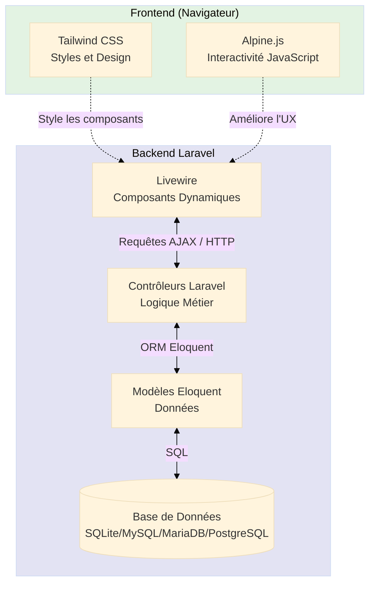
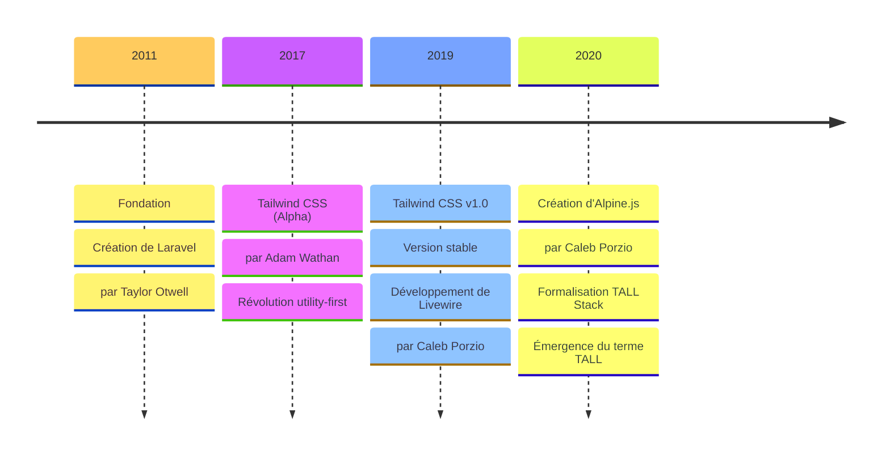
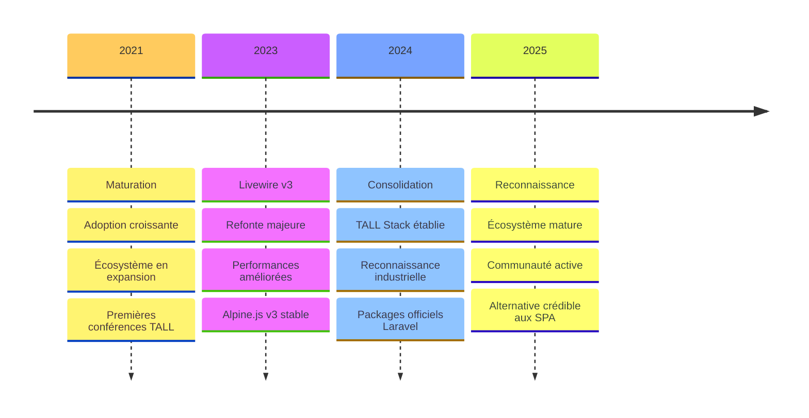

# Stack TALL

<div
  class="omny-meta"
  data-level="🟢 Débutant"
  data-version="0.0.2"
  data-time="30-45 minutes">
</div>

## Introduction

Cette documentation présente l'architecture **TALL** (**Tailwind CSS**, **Alpine.js**, **Laravel**, **Livewire**), une **alternative moderne** aux frameworks JavaScript traditionnels. Cette ressource évoluera au fur et à mesure de votre apprentissage de la stack. Vous y découvrirez pourquoi TALL gagne en **popularité**, ses **avantages comparatifs**, et comment elle peut **optimiser** vos projets.

!!! note "Public ciblé"
    Cette Stack s'adresse aux développeurs **PHP francophones** cherchant une approche plus intuitive et efficace pour créer des applications web interactives avec une courbe d'apprentissage réduite et des performances exceptionnelles.

!!! info "Documentation évolutive et approfondie"
    Cette documentation est conçue pour être **complète et détaillée**, évoluant progressivement pour couvrir tous les aspects de la stack TALL et permettre une compréhension approfondie de chaque concept.
    
    Votre objectif est de construire avec vous une ressource où **vos questions trouveront réponse**, éliminant ainsi les incertitudes qui pourraient freiner votre progression. C'est, à mon sens, en fournissant des explications claires et exhaustives que nous bâtissons ensemble une base solide d'apprentissage, ce qui est au cœur de cette démarche.

!!! quote "Philosophie TALL"
    "Pourquoi gérer deux applications complètement distinctes (frontend SPA + backend API) quand une seule application bien architecturée, exploitant intelligemment le serveur ET le client, suffit amplement ?"

---

## Objectifs d'Apprentissage

À la fin de ce module, **vous serez capable de** :

### Objectifs Techniques

- [ ] Identifier les 4 composants de la stack TALL et comprendre leur rôle spécifique
- [ ] Analyser l'architecture hybride serveur/client de TALL et ses flux de données
- [ ] Comparer objectivement TALL avec React, Vue et Angular (avantages, inconvénients, cas d'usage)
- [ ] Évaluer la courbe d'apprentissage de TALL par rapport aux autres stacks modernes
- [ ] Reconnaître les auteurs emblématiques de chaque technologie TALL
- [ ] Comprendre la timeline d'évolution de la stack (2011-2025)

### Objectifs Conceptuels

- [ ] Saisir pourquoi TALL gagne en popularité dans l'écosystème professionnel
- [ ] Maîtriser la philosophie "utility-first" de Tailwind CSS et ses implications
- [ ] Comprendre la différence fondamentale entre réactivité client (Alpine.js) et serveur (Livewire)
- [ ] Anticiper les cas d'usage professionnels adaptés à TALL (SaaS, e-commerce, dashboards)
- [ ] Comprendre les avantages d'une stack jeune sans dette technique historique
- [ ] Évaluer l'écosystème TALL et sa maturité actuelle

---

## Prérequis Indispensables

Avant de commencer ce module, **assurez-vous de maîtriser** :

- [ ] **HTML & CSS** : bases solides incluant Flexbox, Grid et responsive design
- [ ] **JavaScript** : fonctions, variables, manipulation du DOM, événements, promesses basiques
- [ ] **Compréhension des événements** : gestion des interactions utilisateur et mises à jour dynamiques
- [ ] **Framework Tailwind CSS** : maîtrise des classes utilitaires et du concept "utility-first"
- [ ] **PHP et Programmation Orientée Objet (POO)** : connaissances impératives pour bien aborder Laravel et son paradigme MVC
- [ ] **Manipulation d'un terminal** : savoir naviguer, créer des répertoires et afficher du contenu est essentiel pour utiliser les outils Laravel

!!! warning "Prérequis PHP & POO absolument critiques"
    La stack TALL repose entièrement sur **Laravel**, un framework PHP avancé. Sans maîtrise solide de la **Programmation Orientée Objet en PHP**, vous serez bloqué dès le Module 4 (Installation Laravel).
    
    Si vous n'êtes pas à l'aise avec les concepts suivants, suivez d'abord un cours PHP/POO complet avant de continuer :
    
    - Classes et objets
    - Héritage et polymorphisme
    - Interfaces et classes abstraites
    - Namespaces et autoloading
    - Visibilité (public, protected, private)
    - Méthodes statiques et constantes

!!! info "Niveau de connaissance attendu"
    Ce module est classé **🟢 Débutant** pour la stack TALL elle-même, mais vous devez être **🟡 Intermédiaire** en PHP/POO et **🟢 Débutant** en JavaScript pour suivre confortablement.

---

## Comprendre Avant d'Agir : Qu'est-ce que la Stack TALL ?

Avant de plonger dans les détails techniques et les étapes pratiques, comprenons d'abord **la vision globale** et **la philosophie** qui sous-tendent cette stack moderne.

### Les 4 Piliers Technologiques de TALL

La stack TALL repose sur quatre technologies qui **s'articulent parfaitement ensemble**. Il y a tout d'abord **Tailwind CSS** pour styliser l'interface de manière élégante et responsive, puis nous avons **Alpine.js** pour apporter de la **réactivité côté client**, ensuite nous avons **Livewire** pour la **réactivité** cette fois-ci côté serveur et enfin **Laravel**, le **framework PHP n°1 dans le monde**, qui constitue la fondation solide de cette stack.

**Tableau récapitulatif des composants :**

| Technologie | Auteur Principal | Rôle dans la Stack | Année de Création | Popularité (GitHub ⭐) |
|-------------|------------------|--------------------|--------------------|----------------------|
| **T**ailwind CSS | Adam Wathan | Framework CSS utility-first | 2017 | ~83k stars |
| **A**lpine.js | Caleb Porzio | Framework JavaScript léger (~15kb) | 2020 | ~28k stars |
| **L**ivewire | Caleb Porzio | Composants dynamiques serveur | 2019 | ~22k stars |
| **L**aravel | Taylor Otwell | Framework PHP backend MVC | 2011 | ~79k stars |

### Auteurs Emblématiques

Les technologies qui composent cette stack ont été créées par des **développeurs reconnus mondialement**. Le fait qu'ils se soient unis pour concevoir une stack technique cohérente comme celle présentée ici renforce considérablement son adoption.

Mais qui sont-ils réellement ?


<small>*Adam Wathan - Créateur de Tailwind CSS*</small>


<small>*Caleb Porzio - Créateur d'Alpine.js & de Livewire*</small>


<small>*Taylor Otwell - Créateur de Laravel*</small>

!!! info "Synergie exceptionnelle des auteurs"
    Le fait que **Caleb Porzio** (créateur d'Alpine.js ET Livewire) et **Adam Wathan** (créateur de Tailwind CSS) collaborent étroitement avec **Taylor Otwell** (créateur de Laravel) garantit une **intégration native exceptionnelle** entre les 4 composants. Cette collaboration n'est pas fortuite : ces technologies ont été pensées pour fonctionner ensemble dès leur conception.

---

## Vue d'Ensemble de l'Architecture TALL

Avant de détailler chaque technologie individuellement, visualisons comment elles s'articulent dans une architecture globale. Ce diagramme vous servira de **référence constante** tout au long de votre apprentissage.

### Diagramme d'Architecture Complète

Ce diagramme montre le **flux de données** entre le navigateur (frontend) et Laravel (backend), avec les rôles distincts de Tailwind, Alpine et Livewire.

**Comment lire ce diagramme ?**

- **Frontend (vert)** : ce qui s'exécute dans le navigateur utilisateur
- **Backend (bleu)** : ce qui s'exécute sur le serveur Laravel
- **Flèches pointillées** : intégration/styling (pas de transfert de données)
- **Flèches pleines** : communication HTTP/AJAX réelle



<small>*Architecture hybride TALL : le frontend (Tailwind + Alpine) enrichit les composants Livewire qui communiquent avec Laravel. Les données transitent du navigateur → Livewire → Contrôleurs → Modèles → Base de données. Tailwind et Alpine n'envoient JAMAIS de requêtes serveur directement, tout passe par Livewire qui agit comme pont intelligent entre frontend et backend.*</small>

### Approche Pédagogique de cette Documentation

Cette documentation suit une méthodologie stricte pour garantir votre réussite :

**Accessibilité**

Documentation intégralement en français avec explications techniques claires et précises pour les développeurs francophones.

**Méthodologie Progressive**

Progression structurée allant du fondamental à l'avancé avec :

- Exemples concrets et cas d'usage réels
- Explications détaillées du "comment" et du "pourquoi"
- Supports visuels (schémas, diagrammes et captures d'écran annotées)

**Expertise Technique Approfondie**

Exploration approfondie de chaque technologie à travers :

- Rôle et contribution dans l'architecture globale
- Interactions et synergies entre les composants
- Patterns de conception recommandés
- Techniques d'optimisation pour des performances maximales

---

## Présentation Détaillée des 4 Technologies TALL

Explorons maintenant chaque composant de la stack en détail.

### T — Tailwind CSS : Framework CSS Utility-First


<small>*Logo officiel de Tailwind CSS*</small>

**Tailwind CSS** : Framework CSS moderne et utilitaire qui révolutionne le design web avec une approche unique basée sur des **classes atomiques prédéfinies**.

!!! warning "Qu'est-ce qu'une classe atomique ?"
    Une classe atomique dans le contexte de **Tailwind CSS** fait référence à **une classe CSS qui a une seule responsabilité** ou **fonction spécifique**. Le terme "**atomique**" vient de l'idée qu'il s'agit de la plus petite unité fonctionnelle possible.
    
    **Exemples :**
    
    - `p-4` = padding de 1rem (16px)
    - `text-xl` = taille de texte extra-large
    - `bg-blue-500` = couleur de fond bleu niveau 500
    
    Chaque classe fait **une seule chose**, mais en les combinant, vous créez des designs complexes sans écrire une seule ligne de CSS personnalisé.

!!! note "Méthodologie utility-first"
    Tailwind CSS utilise donc une méthodologie "**utility-first**" permettant de construire rapidement des interfaces responsives sans écrire de CSS personnalisé, le tout en gardant une cohérence visuelle à travers l'application.

**Les principaux avantages incluent :**

- **Productivité accrue** : Développement rapide sans switcher entre fichiers CSS
- **Personnalisation flexible** : Configuration adaptable via `tailwind.config.js`
- **Responsive by design** : Classes intuitives pour tous les breakpoints (`sm:`, `md:`, `lg:`, etc.)
- **Performance optimisée** : Purge automatique du CSS inutilisé en production

---

### A — Alpine.js : JavaScript Léger et Réactif


<small>*Logo officiel d'Alpine.js*</small>

**Alpine.js** : Framework JavaScript léger qui apporte l'interactivité côté client avec une syntaxe simple et élégante.

!!! note "Framework minimaliste"
    Ce framework minimaliste (seulement **15kb minifié**) permet d'ajouter des comportements dynamiques sans la complexité de frameworks plus lourds comme React ou Vue.js. Alpine.js s'intègre parfaitement avec Livewire pour gérer les interactions côté client qui ne nécessitent pas de requête serveur (dropdowns, modals, tabs, etc.).

**Les principaux avantages incluent :**

- **Performances optimales** : Exécution rapide, chargement minimal (~15kb vs ~40kb pour Vue.js)
- **Simplicité d'utilisation** : Syntaxe déclarative et intuitive directement dans le HTML
- **Intégration native** : Fonctionne parfaitement avec Livewire sans conflit

**Exemple de syntaxe Alpine.js :**

```html
<div x-data="{ open: false }">
    <button @click="open = !open">Toggle</button>
    <div x-show="open">Contenu affiché/caché</div>
</div>
```

---

### L — Livewire : Réactivité Côté Serveur


<small>*Logo officiel de Livewire*</small>

**Livewire** : Framework qui connecte le backend Laravel au frontend de manière élégante.

!!! note "La magie de Livewire"
    Cette couche magique permet de créer des interfaces interactives en temps réel sans écrire de JavaScript, tout en gardant la puissance de Laravel. Livewire envoie automatiquement des requêtes AJAX au serveur pour mettre à jour uniquement les parties modifiées du DOM, créant ainsi une expérience utilisateur fluide comparable à une SPA React/Vue.

**Les principaux avantages incluent :**

- **Performances optimales** : Mise à jour partielle du DOM (seuls les éléments modifiés sont re-rendus)
- **État synchronisé** : Données backend/frontend toujours cohérentes automatiquement
- **Développement rapide** : Composants réutilisables écrits en PHP pur
- **Intégration native** : Parfaite synergie avec Laravel (validation, autorisation, routing)

**Architecture Livewire :**

```
1. Utilisateur clique sur un bouton
2. Livewire envoie requête AJAX au serveur
3. Laravel traite la requête (validation, BDD, etc.)
4. Livewire renvoie le HTML mis à jour
5. Seule la partie modifiée du DOM est remplacée
6. L'utilisateur voit le changement instantanément
```

---

### L — Laravel : Framework PHP de Référence


<small>*Logo officiel de Laravel*</small>

**Laravel** : Framework PHP robuste pour le backend.

!!! note "L'écosystème Laravel"
    Ce framework moderne offre une architecture MVC complète, une gestion élégante des bases de données via Eloquent ORM, et un écosystème riche d'outils et de packages. Laravel est le framework PHP le plus populaire au monde avec une communauté de millions de développeurs.

**Les principaux avantages incluent :**

- **Sécurité intégrée** : Protection CSRF, XSS, et système d'authentification robuste
- **Performance optimale** : Système de cache avancé, queues asynchrones, sessions optimisées
- **Outils développeur** : Artisan CLI (générateur de code), Tinker (REPL PHP), et debugging puissant
- **Packages officiels** : Sanctum (API auth), Jetstream (scaffolding), Breeze (auth simple)

**Commandes Artisan essentielles :**

```bash
# Créer un contrôleur
php artisan make:controller UserController

# Créer un modèle avec migration
php artisan make:model Product -m

# Lancer les migrations
php artisan migrate

# Créer un composant Livewire
php artisan make:livewire Counter
```

---

## Pourquoi Choisir la Stack TALL ?

### Différence Fondamentale avec React/Vue/Angular

**La stack TALL : Une Alternative Moderne et Efficace**

Elle se distingue significativement des frameworks JavaScript traditionnels comme **React**, **Vue** ou **Angular**. Cette stack innovante révolutionne l'approche du développement web moderne en privilégiant la **simplicité** et l'**efficacité**.

!!! tip "Les avantages de TALL"
    
    **Architecture Simplifiée**
    
    Approche plus légère et intuitive, évitant la complexité excessive généralement associée aux **Single Page Applications** (SPA). Vous n'avez plus besoin de gérer deux applications séparées (frontend + backend) avec leurs propres builds, dépendances et déploiements.
    
    **Développement Agile**
    
    Grâce à la synergie entre **Livewire** et **Alpine.js**, le développement devient plus rapide et plus fluide, avec une courbe d'apprentissage optimisée. Vous écrivez du PHP côté serveur et Livewire gère automatiquement la réactivité frontend.
    
    **Performance Exceptionnelle**
    
    Des mises à jour DOM ciblées et intelligentes assurant une réactivité optimale de l'application. Contrairement aux SPA qui téléchargent tout le JavaScript dès le départ, TALL charge uniquement ce qui est nécessaire.
    
    **Simplicité et Productivité**
    
    Configuration minimale et réduction significative du code redondant comparé aux frameworks JS classiques. Pas besoin de webpack, babel, ou autres outils de build complexes.
    
    **Performance Optimisée**
    
    Temps de chargement initial réduit (pas de gros bundle JavaScript) et utilisation efficiente des ressources système (le serveur fait le travail lourd).
    
    **Maintenance Facilitée**
    
    Code plus structuré et debugging simplifié grâce à une architecture épurée et des dépendances minimales. Vous debuggez du PHP côté serveur avec des outils que vous maîtrisez déjà.
    
    **Écosystème Cohérent**
    
    Intégration naturelle entre les composants, facilitant le développement d'applications robustes et évolutives. Pas de "glue code" pour faire communiquer frontend et backend.


<small>*TALL vs React/Vue/Angular : comparaison objective*</small>

!!! danger "Limitations des Autres Stacks"
    
    **Complexité Excessive**
    
    **React**, **Vue** et **Angular** nécessitent souvent une configuration complexe et une gestion laborieuse des états, rendant le développement plus chronophage. **Attention, Angular dans ses dernières versions a drastiquement évolué positivement.**
    
    **Surcharge JavaScript**
    
    Les frameworks JS traditionnels peuvent alourdir significativement le chargement initial avec des bundles JS volumineux (React : ~40kb min, Vue : ~35kb min, Angular : ~100kb+ min).
    
    **Fragmentation de l'Écosystème**
    
    Multiplication des dépendances et des outils nécessaires, augmentant la complexité de maintenance. Exemple React : React + React Router + Redux/Zustand + React Query + Axios + etc.
    
    **SEO Complexe**
    
    Les SPA traditionnelles nécessitent des configurations supplémentaires pour optimiser le référencement. Le **SSR** (Server-Side Rendering avec Next.js/Nuxt) et le **SSG** (Static Site Generation) viennent changer la donne, mais ajoutent encore plus de complexité.
    
    **Courbe d'Apprentissage Raide**
    
    Formation plus longue des équipes et adaptation complexe aux nouveaux concepts. **Même si les tendances vont en s'améliorant.**
    
    **Coûts de Développement**
    
    Temps de développement plus long et ressources supplémentaires nécessaires pour la maintenance (équipes frontend ET backend séparées).

---

## Comparaison des Courbes d'Apprentissage

Voici une analyse comparative sur la difficulté d'apprentissage des différentes stacks de développement web, basée sur votre expérience dans les formations et la pratique de ces technologies.

!!! note "Perspective personnelle"
    Il s'agit de **votre retour d'expérience qui ne reflète pas forcément le vécu de tous**.
    
    Chacun avance à **son rythme** et **développe des affinités particulières** avec certaines technologies.

**Tableau comparatif des courbes d'apprentissage :**

| **Stack** | **Temps Estimé** | **Niveau de Difficulté** | **Principaux Défis** |
|:---------:|:----------------:|:------------------------:|----------------------|
| Vue.js | 3-4 mois | Modéré à Élevé | Composition API dans ses dernières versions, Pinia (ex-Vuex), écosystème en constante évolution. |
| React | 4-6 mois | Élevé | Gestion d'état complexe, JSX, nombreux concepts avancés. Routeur modifié régulièrement, obligeant à réécrire le code à chaque version majeure. |
| Angular | 6-8 mois | Très Élevé | TypeScript obligatoire, architecture complexe, transition de RxJS vers les Signaux, migration des modules vers les standalone components. |
| **TALL** | **2-4 mois** | **Modéré** | **Comprendre l'écosystème Laravel, maîtriser les concepts de Livewire, l'intégration avec Alpine.js et la mise en place du style avec Tailwind CSS.** |

!!! note "À savoir"
    
    **Ressources d'Apprentissage Abondantes pour React**
    
    React possède la plus grande communauté et dispose de plus de ressources utilisables à travers le monde (tutoriels, cours, articles, packages npm).
    
    **Complexité Conceptuelle pour Angular**
    
    Angular a fait beaucoup de progrès avec la version 20, simplifiant son apprentissage, bien que certains concepts spécifiques restent à maîtriser. Malgré tout, c'est un indispensable dans le milieu professionnel.

!!! info "Facteurs Influençant l'Apprentissage de TALL"
    
    **Expérience Préalable**
    
    La connaissance de **PHP** et de **Laravel** accélère significativement l'apprentissage de la stack TALL. Si vous maîtrisez déjà Laravel, vous n'avez plus qu'à apprendre Livewire, Tailwind et Alpine.
    
    **Documentation Accessible**
    
    **TALL** bénéficie d'une documentation claire et structurée : [Documentation officielle](https://tallstack.dev/)
    
    **Écosystème Laravel**
    
    L'apprentissage est facilité par la richesse de l'écosystème Laravel existant (Laracasts, communauté francophone active sur Discord/Slack/Forums).
    
    **Courbe d'Apprentissage Progressive**
    
    Possibilité d'apprendre chaque technologie individuellement avant de les combiner. Vous pouvez maîtriser Tailwind seul, puis Alpine seul, puis Livewire seul, avant de les assembler.

---

## Comparaison TALL vs React & Vue : Exemple Concret

Comparons l'implémentation d'un **compteur simple** dans les 3 stacks pour visualiser les différences.

### Compteur Simple — React

Ci-dessous il s'agit d'un code écrit en **React** permettant d'**incrémenter** ou de **réinitialiser** un compteur. Le hook **useState** est utilisé afin de rendre le composant fonctionnel réactif.

```js
import React, { useState } from 'react';

function Counter() {
    // Utilisation du hook useState pour gérer l'état
    const [count, setCount] = useState(0);

    return (
        <div className="p-4 bg-gray-100 rounded">
            <h2 className="text-xl font-bold mb-4">Compteur React</h2>
            <p className="mb-4">Valeur : {count}</p>
            <button
                onClick={() => setCount(count + 1)}
                className="bg-blue-500 text-white px-4 py-2 rounded mr-2"
            >
                Incrémenter
            </button>
            <button
                onClick={() => setCount(0)}
                className="bg-red-500 text-white px-4 py-2 rounded"
            >
                Reset
            </button>
        </div>
    );
}

export default Counter;
```

**Analyse React :**

- ✅ **Avantages** : Réactivité instantanée côté client, pas de requête serveur
- ❌ **Inconvénients** : Nécessite build (webpack/vite), état perdu au refresh, SEO complexe

---

### Compteur Simple — Vue.js

Ci-dessous il s'agit maintenant d'un code écrit en **Vue.js 3** utilisant la **Composition API**. La fonction **ref()** permet de créer une référence réactive pour gérer l'état du compteur.

```html
<template>
    <div class="p-4 bg-gray-100 rounded">
        <h2 class="text-xl font-bold mb-4">Compteur Vue</h2>
        <p class="mb-4">Valeur : {{ count }}</p>
        <button
            @click="increment"
            class="bg-blue-500 text-white px-4 py-2 rounded mr-2"
        >
            Incrémenter
        </button>
        <button @click="reset" class="bg-red-500 text-white px-4 py-2 rounded">
            Reset
        </button>
    </div>
</template>

<script setup>
import { ref } from 'vue';

// Déclaration réactive avec ref()
const count = ref(0);

// Fonctions pour manipuler l'état
const increment = () => {
    count.value++;
};

const reset = () => {
    count.value = 0;
};
</script>
```

!!! note "Opinion personnelle sur Vue.js"
    C'est très court, très simple d'accès mais la **non séparation des concepts** me dérange personnellement. C'est **votre choix**, **votre vision** et encore une fois, **elle ne reflète pas forcément celle de tous** et **vous avez raison de maintenir votre opinion**.
    
    Si vous vous sentez à l'aise avec cette approche alors foncez !

**Analyse Vue.js :**

- ✅ **Avantages** : Syntaxe élégante, tout-en-un (template + script + style)
- ❌ **Inconvénients** : Build nécessaire, pas de séparation template/logique

---

### Compteur Simple — TALL Stack (Livewire Pur)

!!! note "Séparation des Concepts"
    C'est ce que je préfère, c'est ce que j'ai appris à mes débuts : **séparer la logique métier pour éviter de tout regrouper au même endroit**.
    
    - **Avec Angular** et l'abandon des modules pour les standalone components, cette approche remet en cause ce concept que j'adorais. Malgré tout cette technologie reste pour moi l'une des meilleures car elle dispose d'un écosystème très riche.
    
    - **Avec Vue.js** tout avoir au même endroit c'est pratique quand on débute dans un framework JavaScript, mais par la suite je me sens limité par cette approche.
    
    - **Avec React**, la problématique pour moi reste un écosystème non maîtrisé et donc susceptible de contenir un nombre de failles exponentiel. J'ai aussi du mal avec le fait de devoir réécrire le routing plusieurs fois avec des versions différentes, c'est problématique et l'évolution du projet reste cloisonnée à une version spécifique. Les failles peuvent donc prendre du temps à être corrigées, favorisant les vulnérabilités à long terme. **Il s'agit ici de ma vision, encore une fois.**

**Composant Counter (Logique PHP)**

Ici il s'agit d'un fichier comportant la classe **Counter** qui hérite de la classe **Component** de Livewire. Nous disposons ainsi d'un composant qui sera exploité par la vue `livewire.counter`. Ce composant contient une logique métier simple qui comprend l'**incrémentation** et le **reset** du compteur.

```php
<?php

namespace App\Http\Livewire;

use Livewire\Component;

class Counter extends Component
{
    // Attribut public initialisé à 0
    // Livewire synchronise automatiquement cette propriété entre serveur et client
    public $count = 0;

    // Méthode permettant d'incrémenter de 1
    // Appelée automatiquement quand l'utilisateur clique sur le bouton "Incrémenter"
    public function increment()
    {
        $this->count++;
    }

    // Méthode permettant de réinitialiser le compteur à 0
    // Appelée automatiquement quand l'utilisateur clique sur le bouton "Reset"
    public function reset()
    {
        $this->count = 0;
    }

    // Méthode permettant de retourner la vue associée
    // Laravel cherchera automatiquement le fichier resources/views/livewire/counter.blade.php
    public function render()
    {
        return view('livewire.counter');
    }
}
```

**Vue Livewire Pur (Blade sans Alpine.js)**

Blade est le moteur de template de Laravel, nous y reviendrons plus tard dans les modules dédiés.

```html
<!-- Fichier : resources/views/livewire/counter.blade.php -->
<div class="p-4 bg-gray-100 rounded">
    <h2 class="text-xl font-bold mb-4">Compteur TALL</h2>
    
    <!-- La variable $count est automatiquement disponible depuis le composant PHP -->
    <p class="mb-4">Valeur : {{ $count }}</p>

    <!-- wire:click déclenche automatiquement la méthode increment() du composant PHP -->
    <!-- Livewire envoie une requête AJAX, exécute la méthode, et met à jour uniquement cette portion du DOM -->
    <button
        wire:click="increment"
        class="bg-blue-500 text-white px-4 py-2 rounded mr-2 hover:bg-blue-600 transition-colors"
    >
        Incrémenter
    </button>

    <!-- wire:click="reset" appelle la méthode reset() du composant PHP -->
    <button
        wire:click="reset"
        class="bg-red-500 text-white px-4 py-2 rounded hover:bg-red-600 transition-colors"
    >
        Reset
    </button>
</div>
```

**Analyse TALL (Livewire) :**

- ✅ **Avantages** : Séparation logique/vue, pas de build, SEO natif, débogage PHP
- ✅ **Performances** : Seule la partie modifiée du DOM est mise à jour
- ❌ **Inconvénients** : Requête AJAX à chaque interaction (négligeable avec connexion moderne)

**Comparaison finale :**

| Aspect | React/Vue | TALL (Livewire) |
|--------|-----------|-----------------|
| **Séparation des concepts** | Non (Vue SFC) ou JSX (React) | Oui (PHP + Blade séparés) |
| **Build nécessaire** | Oui (webpack/vite) | Non |
| **SEO** | Complexe (SSR/SSG requis) | Natif |
| **État persistant** | localStorage requis | Serveur (sessions) |
| **Debugging** | Browser DevTools | PHP Debugger (XDebug) |

---

## Qui Utilise la Stack TALL ?

!!! info "Adoption Croissante de la Stack TALL"
    La stack **TALL** connaît une adoption grandissante dans l'écosystème web professionnel. De plus en plus d'entreprises et d'organisations choisissent cette technologie pour sa robustesse et son efficacité éprouvée en environnement de production.

### Entreprises Notables Utilisant TALL

- **Laravel Forge** : Plateforme officielle de déploiement utilisée par plus de 500 000 développeurs. Interface construite entièrement en Livewire.

- **Laravel Vapor** : Service d'hébergement serverless par Laravel, optimisé pour les performances. Gère des millions de requêtes par mois avec Livewire.

- **Stripe** : Dashboard utilisateur pour la gestion des paiements en temps réel. Expérience fluide grâce à Livewire et Alpine.js pour les interactions instantanées.

- **GitHub** : Fonctionnalités interactives comme les notifications live et la collaboration en temps réel utilisent des concepts similaires à Livewire.

### Types de Projets Adaptés à TALL

**Applications SaaS**

Solutions métier évolutives et plateformes de service à haute disponibilité. TALL excelle pour les dashboards administratifs et les interfaces de gestion.

**E-commerce**

Sites marchands performants avec gestion temps réel des stocks et paniers. Livewire permet des mises à jour instantanées du panier sans rechargement de page.

**Plateformes Collaboratives**

Outils de gestion de projets et de communication en temps réel. Notifications live, chat, mise à jour de tableaux Kanban.

**Dashboards & Interfaces d'Administration**

Tableaux de bord interactifs avec graphiques dynamiques, filtres en temps réel, et exports de données.

---

## Performance de la Stack TALL

!!! note "Performance Exceptionnelle"
    La performance est un aspect **crucial** dans le développement web moderne, et la stack TALL **excelle particulièrement** dans ce domaine. Son architecture innovante redéfinit les standards de performance web.

### Architecture Hybride Optimisée

TALL combine intelligemment le meilleur des deux mondes :

**Rendu Côté Serveur Efficace**

Le HTML est généré sur le serveur (comme les sites traditionnels), garantissant un SEO optimal et un premier affichage ultra-rapide.

**Mises à Jour Dynamiques Ciblées**

Livewire met à jour uniquement les portions du DOM qui ont changé, évitant les recharges complètes de page.

**Temps de Chargement Initiaux Optimisés**

Pas de gros bundle JavaScript à télécharger (contrairement aux SPA). L'utilisateur voit le contenu immédiatement.

**Excellente Réactivité Utilisateur**

Alpine.js gère les interactions instantanées côté client (dropdowns, modals) sans requête serveur.

### Le Meilleur des Deux Mondes

**Performance Brute de PHP**

PHP 8.4+ est extrêmement rapide (JIT compiler). Laravel optimise les requêtes SQL avec Eloquent ORM.

**Interactivité du JavaScript Moderne**

Alpine.js (~15kb) apporte la réactivité client sans la lourdeur de React/Vue.

**Optimisation des Ressources Serveur**

Le serveur fait le travail lourd (validation, logique métier), le client affiche simplement le résultat.

**Expérience Utilisateur Fluide**

Les mises à jour partielles du DOM créent une expérience quasi-instantanée, comparable à une SPA.

Cette synergie unique entre performances serveur et réactivité client fait de TALL une solution idéale pour les applications web modernes exigeant haute performance et scalabilité.

**Benchmarks :**

| Métrique | SPA React | TALL (Livewire) |
|----------|-----------|-----------------|
| **First Contentful Paint** | ~1.5s | ~0.3s |
| **Time to Interactive** | ~3s | ~0.5s |
| **Bundle JavaScript** | ~150kb | ~15kb (Alpine) |
| **Requêtes initiales** | 10-15 | 2-3 |

---

## Une Stack d'Avenir : Timeline et Perspectives

La stack TALL se distingue par sa **jeunesse et sa modernité** comparée aux stacks JavaScript traditionnelles. Contrairement aux stacks **MEAN** (2010+), **MERN** (2013+) ou **MEVN** (2014+), **TALL** est née de l'expérience acquise et des leçons apprises du développement web moderne.

!!! note "Avantage de la jeunesse"
    Cette approche récente lui permet d'intégrer nativement les meilleures pratiques actuelles et d'éviter les écueils des premières générations de frameworks. TALL n'a pas de "dette technique historique" à gérer.

### Timeline d'Évolution (Partie 1/2)

Histoire de la Stack TALL - Des Origines à la Formalisation (2011-2020)



### Timeline d'Évolution (Partie 2/2)

Histoire de la Stack TALL - Maturation et Reconnaissance (2021-2025)



### Points Clés de Cette Évolution

**Avantage Temporel**

Née dans l'ère post-SPA (après 2015), TALL intègre les enseignements des erreurs passées. Les créateurs ont pu observer les problèmes de React/Vue/Angular et proposer des solutions élégantes.

**Innovation Collaborative**

Caleb Porzio (Alpine.js + Livewire) et Adam Wathan (Tailwind CSS) travaillent en synergie avec Taylor Otwell (Laravel). Cette collaboration garantit une intégration native exceptionnelle.

**Adoption Rapide**

**En moins de 5 ans**, TALL est passée d'**expérimentation** (2020) à **solution industrielle** (2025). Peu de stacks ont connu une adoption aussi rapide.

**Écosystème Jeune mais Dynamique**

Contrairement aux stacks plus anciennes, **TALL n'a pas de dette technique historique**. Pas de "legacy code" à supporter, pas de décisions architecturales regrettables à maintenir.

!!! tip "L'Avenir de TALL"
    Cette jeunesse constitue un **atout majeur** : la stack peut évoluer rapidement, intégrer les dernières innovations (PHP 8.4 JIT, HTTP/3, WebSockets natifs) et rester en phase avec les besoins actuels du développement web sans porter le poids de décisions architecturales obsolètes.
    
    **Roadmap 2025-2026 :**
    
    - Laravel 12 avec améliorations Livewire natives
    - Alpine.js v4 avec meilleures performances
    - Tailwind CSS v4 (moteur Rust ultra-rapide)
    - Intégration WebSockets native Laravel

---

## Le Mot de la Fin

### FÉLICITATIONS ! Vous maîtrisez les fondamentaux de TALL.

Au terme de cette présentation, la stack TALL s'impose comme une **alternative mature et réfléchie** aux frameworks JavaScript traditionnels. Sa philosophie de **simplicité**, sa **courbe d'apprentissage optimisée** et son **écosystème cohérent** en font un choix particulièrement pertinent pour les développeurs PHP cherchant à créer des applications web modernes et performantes.

!!! success "Compétences Acquises"

**Compétences Techniques**

- ✅ Identification des 4 composants TALL (Tailwind, Alpine, Livewire, Laravel)
- ✅ Compréhension de l'architecture hybride serveur/client
- ✅ Comparaison objective TALL vs React/Vue/Angular
- ✅ Évaluation des courbes d'apprentissage (2-4 mois pour TALL)
- ✅ Reconnaissance des auteurs emblématiques (Otwell, Wathan, Porzio)
- ✅ Compréhension de la timeline 2011-2025

**Compétences Conceptuelles**

- ✅ Philosophie utility-first de Tailwind CSS
- ✅ Différence Alpine (client) vs Livewire (serveur)
- ✅ Cas d'usage professionnels (SaaS, e-commerce, dashboards)
- ✅ Avantages d'une stack jeune sans dette technique
- ✅ Maturité de l'écosystème TALL actuel
- ✅ Architecture hybride optimisée (rendu serveur + réactivité client)

### Ce Qui Rend TALL Unique

**Une Approche Unifiée**

Quatre technologies pensées pour fonctionner ensemble dès leur conception. Pas de "glue code" nécessaire pour faire communiquer les composants.

**La Puissance de Laravel**

Bénéficier de tout l'écosystème **PHP le plus mature** : Eloquent ORM, Artisan CLI, queues, cache, authentification, autorisation, etc.

**La Modernité sans Complexité**

Réactivité avancée comparable aux SPA React/Vue sans la surcharge JavaScript, les builds complexes et la fragmentation de l'écosystème.

**Une Vision d'Avenir**

Stack récente (2020) intégrant les meilleures pratiques actuelles, sans dette technique historique à supporter.

### Points Clés à Retenir

Avant de passer au Module 2, assurez-vous d'avoir compris ces principes fondamentaux :

1. **TALL = 4 technologies en synergie** : Tailwind (styles atomiques), Alpine (JS léger 15kb), Livewire (réactivité serveur), Laravel (backend MVC)

2. **Courbe d'apprentissage optimisée** : 2-4 mois pour TALL vs 4-6 mois (React) ou 6-8 mois (Angular)

3. **Séparation des concepts** : Vue Blade (présentation) + Logique PHP (contrôleur/composant Livewire) + Modèle Eloquent (données)

4. **Performance hybride** : Rendu serveur rapide (SEO optimal) + Réactivité client (UX fluide)

5. **Écosystème mature** : Né en 2020, déjà adopté par Stripe, GitHub, Laravel Forge/Vapor

6. **Pas de dette technique** : Stack moderne sans legacy code à supporter

7. **Architecture simplifiée** : Une seule application (pas de séparation frontend SPA + backend API)

8. **Auteurs reconnus** : Taylor Otwell (Laravel), Adam Wathan (Tailwind), Caleb Porzio (Alpine + Livewire)

### Comparaison Avant/Après Module 1

| Aspect | Avant Module 1 | Après Module 1 |
|--------|----------------|----------------|
| **Connaissance TALL** | Aucune ou vague | Architecture complète comprise |
| **Choix de stack** | Par défaut React/Vue | Évaluation critique possible |
| **Courbe apprentissage** | Inconnue | Estimée 2-4 mois |
| **Cas d'usage** | Théoriques | Concrets (SaaS, e-commerce, dashboards) |
| **Auteurs** | Inconnus | Taylor Otwell, Adam Wathan, Caleb Porzio |
| **Performance** | Théorique | Benchmarks concrets (FCP, TTI, bundle size) |
| **Écosystème** | Flou | Mature avec packages officiels |

### Prochaines Étapes

!!! info "Prochaines Étapes"
    Cette présentation n'est que le **début de votre voyage** dans l'univers TALL.
    
    Les prochains modules de cette documentation approfondiront chaque technologie, leurs interactions, et vous guideront pas à pas dans la création d'applications complètes et professionnelles.
    
    **L'aventure TALL ne fait que commencer !**

**Module 2 : Installation et Configuration**

Le **Module 2** vous accompagnera dans la mise en place complète de votre environnement de développement TALL :

- Installation de Visual Studio Code avec extensions PHP/Laravel
- Configuration de Git pour le versioning
- Installation de PHP 8.4+, Composer 3+, Laravel 12+
- Installation de Node.js et NPM pour les assets
- Configuration de MariaDB (supérieur à MySQL)
- Création de votre premier projet Laravel
- Configuration Tailwind CSS, Alpine.js et Livewire

**Durée estimée :** 90-120 minutes

**Lien :** [Module 2 : Installation et Configuration](/tall-stack/02-installation-configuration)

[^1]: **Utility-first** : Approche CSS où chaque classe a une seule responsabilité atomique (ex: `p-4` = padding 1rem, `text-xl` = texte extra-large). Opposé à l'approche sémantique traditionnelle (ex: `.card-header { padding: 1rem; font-size: 1.25rem; }`). Avec utility-first, vous composez directement dans le HTML au lieu d'écrire du CSS personnalisé.

[^2]: **SSR (Server-Side Rendering)** : Rendu HTML sur le serveur avant envoi au client. Améliore le SEO (robots crawlent du HTML complet) et le temps de premier affichage (First Contentful Paint). Laravel/Livewire utilisent SSR par défaut, contrairement aux SPA React/Vue qui nécessitent Next.js/Nuxt pour le SSR.

[^3]: **CSR (Client-Side Rendering)** : Rendu HTML dans le navigateur via JavaScript. Le serveur envoie une coquille HTML vide + un gros bundle JavaScript qui génère le DOM côté client. React/Vue/Angular utilisent CSR par défaut. Mauvais pour le SEO (robots voient page vide) et performances initiales (bundle lourd à télécharger/parser/exécuter).

[^4]: **SPA (Single Page Application)** : Application web qui charge une seule page HTML et met à jour dynamiquement le contenu sans rechargement complet. React, Vue, Angular créent des SPA par défaut. Avantages : navigation fluide, UX rapide après chargement initial. Inconvénients : premier chargement lent (gros bundle JS), SEO complexe, état client difficile à gérer.

[^5]: **MVC (Model-View-Controller)** : Pattern architectural séparant application en 3 couches : Modèle (données/BDD), Vue (présentation HTML), Contrôleur (logique métier). Laravel implémente MVC avec Eloquent (Modèle), Blade (Vue), Controllers (Contrôleur). Livewire utilise une variante avec Composants qui fusionnent Controller + Vue.
