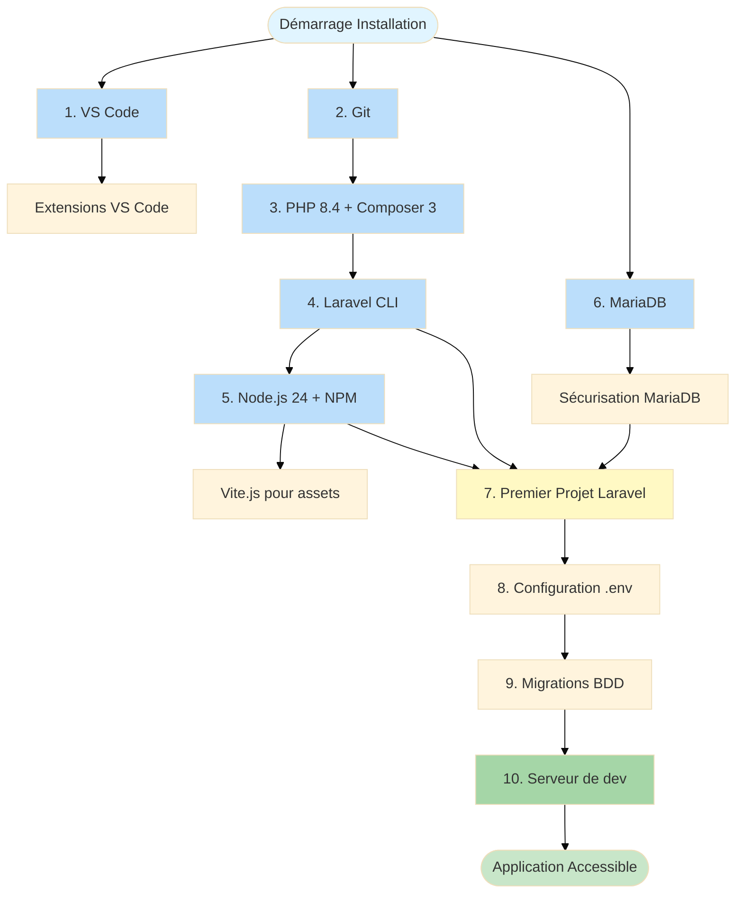
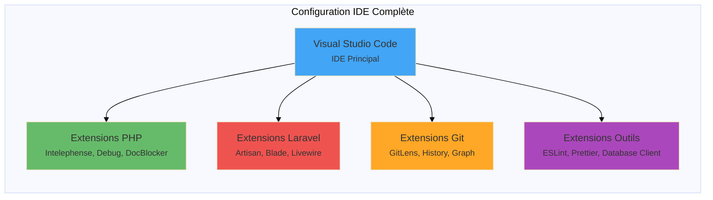
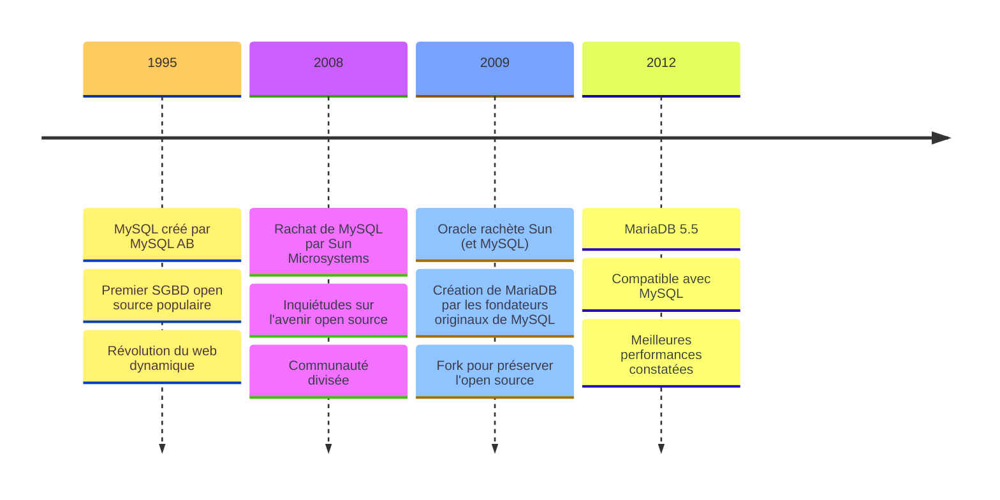
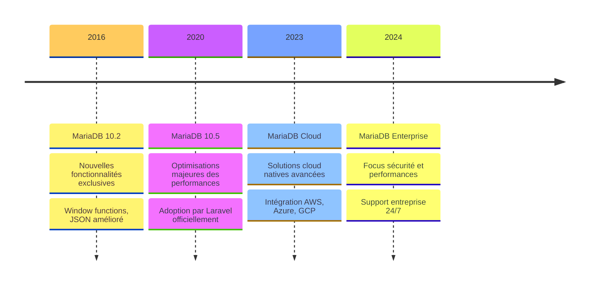
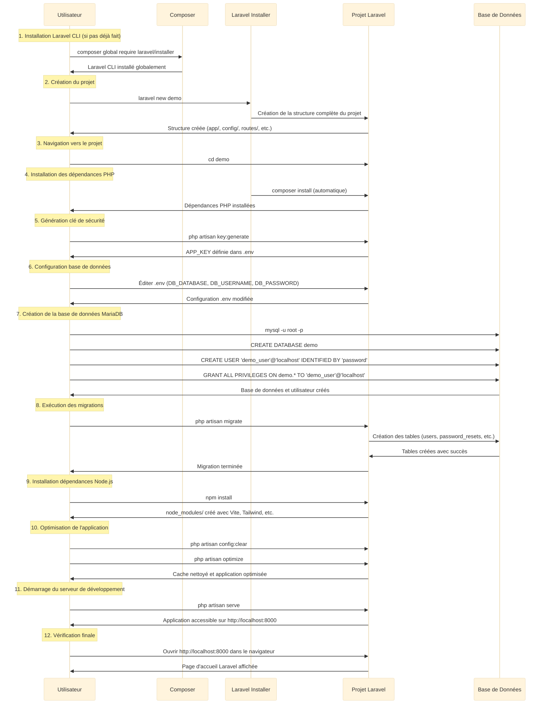

# Install' & Configuration

<div
  class="omny-meta"
  data-level="🟡 Intermédiaire"
  data-version="0.0.1"
  data-time="90-120 minutes">
</div>

## Introduction

Maintenant que vous avez découvert la stack TALL et ses avantages dans le **Module 1**, il est temps de **mettre les mains dans le cambouis** et de configurer votre environnement de développement complet. Ce module est absolument **critique** car un environnement mal configuré vous fera perdre des heures de debugging inutiles par la suite.

Imaginez que vous êtes sur le point de construire une maison. Vous avez compris l'architecture globale (Module 1), mais maintenant vous devez préparer votre atelier : installer les outils, vérifier que tout fonctionne, sécuriser les accès. C'est exactement ce que nous allons faire ici avec votre environnement de développement TALL.

Ce module vous guidera pas à pas pour installer et configurer :

- **Visual Studio Code** avec toutes les extensions PHP/Laravel essentielles
- **Git** pour le versioning de code (indispensable en équipe et en solo)
- **PHP 8.4+** avec Composer 3+ et Laravel 12+ (via l'installeur php.new ultra-pratique)
- **Node.js 24+ et NPM** pour compiler les assets Tailwind CSS et Alpine.js
- **MariaDB** comme système de base de données (supérieur à MySQL, nous verrons pourquoi)
- **Votre premier projet Laravel** configuré, sécurisé et opérationnel

!!! quote "Principe du Module 2"
    "Un environnement de développement bien configuré dès le départ vous fera gagner des centaines d'heures de debugging tout au long de votre carrière. Investissez ce temps maintenant, vous le récupérerez au centuple."

---

## Objectifs d'Apprentissage

À la fin de ce module, **vous serez capable de** :

### Objectifs Techniques

- [ ] Installer et configurer Visual Studio Code avec 25+ extensions professionnelles
- [ ] Installer Git et comprendre son rôle dans le versioning de code
- [ ] Installer PHP 8.4+, Composer 3+ et Laravel 12+ en une seule commande (php.new)
- [ ] Installer Node.js 24 et NPM avec NVM (Node Version Manager)
- [ ] Installer et sécuriser MariaDB selon les bonnes pratiques
- [ ] Créer votre premier projet Laravel avec la CLI `laravel new`
- [ ] Configurer une base de données MariaDB avec utilisateur dédié
- [ ] Générer une clé de sécurité Laravel et comprendre son rôle
- [ ] Exécuter vos premières migrations de base de données
- [ ] Démarrer le serveur de développement Laravel

### Objectifs Conceptuels

- [ ] Comprendre l'architecture d'un environnement de développement TALL
- [ ] Saisir l'importance de la séparation des privilèges en base de données
- [ ] Maîtriser le rôle des migrations Laravel dans le versioning de schéma
- [ ] Comprendre pourquoi MariaDB est supérieur à MySQL (timeline historique)
- [ ] Anticiper les problèmes de configuration courants et leurs solutions
- [ ] Comprendre la différence entre environnement de développement et production

---

## Prérequis

Avant de commencer ce module, **assurez-vous d'avoir** :

- [ ] **Module 1 complété** : compréhension de l'architecture TALL
- [ ] **Système d'exploitation** : Windows 10/11, macOS 11+, ou Ubuntu/Debian Linux 20.04+
- [ ] **Droits administrateur** : nécessaires pour installer les logiciels
- [ ] **Connexion Internet stable** : pour télécharger les outils (~2 Go au total)
- [ ] **Espace disque** : minimum 10 Go libres (20 Go recommandés)
- [ ] **90-120 minutes** devant vous sans interruption

!!! warning "Connaissances Techniques Rappel (Module 1)"
    Ce module suppose que vous maîtrisez déjà :
    
    - **PHP 8.2+** : concepts fondamentaux et nouveautés
    - **Base de données** : expérience avec MySQL/MariaDB ou PostgreSQL
    - **Front-end** : HTML5, CSS3, responsive design
    - **JavaScript** : manipulation du DOM, AJAX, promesses
    - **POO** : classes, héritage, interfaces, namespaces
    - **Tailwind CSS** : fondamentaux du framework utility-first
    - **Laravel** : connaître le fonctionnement de base est **obligatoire**

!!! info "Environnement Docker (Optionnel mais Recommandé)"
    Laravel propose **Laravel Sail**, une configuration Docker optimisée incluant :
    
    - **PHP-FPM** : gestionnaire de processus PHP
    - **Nginx** : serveur web haute performance
    - **MySQL/MariaDB/PostgreSQL** : systèmes de gestion de base de données
    - **Redis** : cache et file d'attente
    - **Mailhog** : service de test d'emails
    
    **Extensibilité** : personnalisation complète via `docker-compose.yml` pour ajouter Elasticsearch, MongoDB, etc.
    
    **Nous n'utiliserons PAS Docker dans ce module** pour rester accessible à tous, mais c'est un gros plus en production.

---

## Comprendre Avant d'Agir : L'Environnement de Développement TALL

Avant de commencer les installations, comprenons d'abord **l'écosystème complet** que nous allons mettre en place et **pourquoi chaque outil est nécessaire**.

### Architecture de l'Environnement de Développement

L'environnement TALL repose sur **6 composants principaux** qui travaillent ensemble :

**Tableau récapitulatif des composants :**

| Composant | Rôle | Pourquoi C'est Nécessaire | Version Cible |
|-----------|------|---------------------------|:-------------:|
| **VS Code** | Éditeur de code avec extensions | IntelliSense PHP, snippets Laravel, debugging | Dernière |
| **Git** | Versioning de code | Historique, collaboration, branches | 2.40+ |
| **PHP + Composer** | Langage backend + gestionnaire dépendances | Exécuter Laravel, installer packages | 8.4+ / 3+ |
| **Laravel CLI** | Générateur de projets Laravel | Créer projets optimisés rapidement | 12+ |
| **Node.js + NPM** | Runtime JS + gestionnaire packages | Compiler Tailwind CSS, Alpine.js via Vite | 24+ / 11+ |
| **MariaDB** | Système de gestion de base de données | Stocker données application | 10.11+ |

### Diagramme de Flux d'Installation

Ce diagramme montre l'**ordre logique d'installation** des composants et leurs dépendances.

**Comment lire ce diagramme ?**

- Les **rectangles bleus** représentent les outils à installer
- Les **flèches** montrent les dépendances (A → B = "A nécessite B")
- Les **étapes numérotées** indiquent l'ordre optimal d'installation



<small>*Ce diagramme illustre le flux complet d'installation de l'environnement TALL. Chaque étape dépend des précédentes : vous ne pouvez pas créer un projet Laravel (7) sans avoir installé PHP + Composer (3) et Laravel CLI (4). De même, le serveur de développement (10) nécessite que toutes les migrations (9) soient appliquées avec succès. Les couleurs codent les types d'étapes : bleu = installations système, jaune = création projet, vert = application opérationnelle.*</small>

### Configuration Multi-Famille d'Extensions VS Code

Visual Studio Code sera configuré avec **4 familles d'extensions** pour couvrir tous les besoins du développement TALL.

**Que montre ce diagramme ?**

- **Visual Studio Code** au centre comme IDE principal
- **4 branches** représentant les familles d'extensions à installer
- Chaque famille a un rôle spécifique dans le workflow TALL



<small>*Architecture des extensions VS Code pour développement TALL. Le noyau est VS Code qui orchestre 4 familles : Extensions PHP (support langage, debugging), Extensions Laravel (Artisan CLI, Blade templates, Livewire snippets), Extensions Git (versioning avancé, visualisation branches), Extensions Outils (linting, formatage, BDD). Chaque famille est essentielle pour un workflow professionnel optimisé.*</small>

---

## Phase 1 — Installation Visual Studio Code & Extensions (Étapes 1 à 2)

### Étape 1 : Installer Visual Studio Code

Visual Studio Code est l'IDE recommandé pour le développement TALL grâce à son écosystème d'extensions riche et sa légèreté.

!!! info "Alternatives à VS Code"
    - **PHPStorm** (JetBrains) : IDE payant (~89€/an) mais ultra-puissant avec IntelliSense PHP exceptionnel
    - **Sublime Text** : éditeur léger mais extensions moins riches pour PHP/Laravel
    - **Vim/Neovim** : pour les puristes du terminal (courbe d'apprentissage raide)
    
    **Ce module utilise VS Code** car il est gratuit, open-source et largement adopté.

#### Installation sur Windows

1. Téléchargez l'installeur depuis le site officiel : **[https://code.visualstudio.com/](https://code.visualstudio.com/)**

2. Lancez le fichier `.exe` téléchargé

3. **IMPORTANT** : cochez **"Ajouter à PATH"** pendant l'installation pour pouvoir ouvrir VS Code depuis le terminal avec `code .`

4. Vérifiez l'installation :

```bash
# Ouvrir PowerShell
code --version

# Doit afficher quelque chose comme :
# 1.85.0
# 8b3775030ed1a69b13e4f4c628c612102e30a681
# x64
```

#### Installation sur macOS

```bash
# Installation de VS Code avec Homebrew
brew install --cask visual-studio-code

# Vérifier l'installation
code --version
```

#### Installation sur Linux

```bash
# Installation de VS Code avec snapstore (Ubuntu/Debian)
sudo snap install code --classic

# Vérifier l'installation
code --version
```

!!! success "VS Code installé avec succès"
    Vous pouvez maintenant ouvrir VS Code depuis le terminal avec `code .` dans n'importe quel dossier.

---

### Étape 2 : Installer les Extensions VS Code Essentielles

Les extensions transforment VS Code en IDE PHP/Laravel professionnel. Nous allons installer **25+ extensions** réparties en 4 familles.

!!! tip "Méthode d'installation rapide"
    Vous pouvez installer toutes les extensions en une seule commande depuis le terminal :
    
    ```bash
    # Extensions PHP
    code --install-extension bmewburn.vscode-intelephense-client
    code --install-extension xdebug.php-debug
    code --install-extension MehediDracula.php-namespace-resolver
    code --install-extension neilbrayfield.php-docblocker
    code --install-extension wongjn.php-sniffer
    code --install-extension calebporzio.better-phpunit
    
    # Extensions Laravel
    code --install-extension ryannaddy.laravel-artisan
    code --install-extension onecentlin.laravel-blade
    code --install-extension onecentlin.laravel5-snippets
    code --install-extension mohamedbenhida.laravel-intellisense
    code --install-extension codingyu.laravel-goto-view
    code --install-extension ahinkle.laravel-model-snippets
    code --install-extension mikestead.dotenv
    
    # Extensions Git
    code --install-extension eamodio.gitlens
    code --install-extension donjayamanne.githistory
    code --install-extension mhutchie.git-graph
    
    # Extensions Outils
    code --install-extension dbaeumer.vscode-eslint
    code --install-extension esbenp.prettier-vscode
    code --install-extension editorconfig.editorconfig
    code --install-extension cweijan.vscode-database-client2
    code --install-extension humao.rest-client
    code --install-extension rangav.vscode-thunder-client
    code --install-extension usernamehw.errorlens
    code --install-extension alefragnani.project-manager
    code --install-extension PKief.material-icon-theme
    code --install-extension johnpapa.vscode-peacock
    ```

#### Extensions PHP (6 essentielles)

Ces extensions apportent le support complet du langage PHP dans VS Code.

| Extension | Description | Importance |
|-----------|-------------|:----------:|
| **PHP Intelephense** | Support PHP avancé : autocomplétion, refactoring, go-to-definition | ⭐⭐⭐ Essentielle |
| **PHP Debug** | Débogage PHP avec XDebug (breakpoints, step-by-step) | ⭐⭐⭐ Essentielle |
| **PHP Namespace Resolver** | Gestion automatique des `use` statements | ⭐⭐ Très utile |
| **PHP DocBlocker** | Génération automatique de documentation PHPDoc | ⭐ Utile |
| **PHP Sniffer** | Vérification de la qualité du code (PSR-12) | ⭐ Utile |
| **Better PHPUnit** | Exécution de tests unitaires depuis VS Code | ⭐ Utile |

**Exemple d'utilisation PHP Intelephense :**

Tapez `$user->` et Intelephense vous propose automatiquement toutes les propriétés et méthodes du modèle `User` (grâce à l'analyse statique du code).

#### Extensions Laravel (7 essentielles)

Ces extensions transforment VS Code en IDE Laravel dédié.

| Extension | Description | Importance |
|-----------|-------------|:----------:|
| **Laravel Artisan** | Commandes Artisan depuis VS Code (Ctrl+Shift+P → Artisan) | ⭐⭐⭐ Essentielle |
| **Laravel Blade Snippets** | Snippets pour les templates Blade (`@if`, `@foreach`, etc.) | ⭐⭐⭐ Essentielle |
| **Laravel Snippets** | Snippets pour le code Laravel (routes, controllers, etc.) | ⭐⭐⭐ Essentielle |
| **Laravel Extra Intellisense** | Autocomplétion pour routes, vues, configs, traductions | ⭐⭐ Très utile |
| **Laravel Goto View** | Navigation rapide entre contrôleurs et vues (Ctrl+Click) | ⭐ Utile |
| **Laravel Model Snippets** | Snippets pour les modèles Eloquent | ⭐ Utile |
| **DotENV** | Support pour les fichiers `.env` (coloration syntaxique) | ⭐⭐ Très utile |

**Exemple d'utilisation Laravel Artisan :**

Appuyez sur `Ctrl+Shift+P` → tapez `Artisan: Make Controller` → entrez le nom → le contrôleur est généré automatiquement.

#### Extensions Git (3 essentielles)

Ces extensions améliorent drastiquement l'expérience Git dans VS Code.

| Extension | Description | Importance |
|-----------|-------------|:----------:|
| **GitLens** | Historique Git inline, blame annotations, diff avancé | ⭐⭐⭐ Essentielle |
| **Git History** | Visualisation de l'historique Git (commits, branches) | ⭐ Utile |
| **Git Graph** | Visualisation graphique des branches et merges | ⭐⭐ Très utile |

**Exemple d'utilisation GitLens :**

En survolant n'importe quelle ligne de code, GitLens affiche automatiquement : "Qui a modifié cette ligne, quand, et dans quel commit".

#### Extensions Outils (10 recommandées)

Ces extensions améliorent le workflow général de développement.

| Extension | Description | Importance |
|-----------|-------------|:----------:|
| **ESLint** | Linting JavaScript/TypeScript (détecte erreurs) | ⭐⭐⭐ Essentielle |
| **Prettier** | Formatage de code automatique (PHP, JS, CSS, Blade) | ⭐⭐⭐ Essentielle |
| **EditorConfig** | Normalisation des styles de code (indentation, EOL) | ⭐⭐ Très utile |
| **Database Client** | Gestion des bases de données depuis VS Code | ⭐⭐ Très utile |
| **REST Client** | Test d'API directement depuis VS Code (fichiers `.http`) | ⭐ Utile |
| **Thunder Client** | Alternative à Postman intégrée dans VS Code | ⭐ Utile |
| **Error Lens** | Affichage des erreurs inline dans le code | ⭐⭐ Très utile |
| **Project Manager** | Gestion de plusieurs projets Laravel facilement | ⭐ Utile |
| **Material Icon Theme** | Icônes distinctives pour les fichiers (`.blade.php`, `.php`, etc.) | 🎨 Recommandée |
| **Peacock** | Identification visuelle des workspaces (couleurs) | 🎨 Utile |

!!! success "Extensions installées avec succès"
    Vous disposez maintenant d'un IDE professionnel pour le développement TALL !

> Ainsi s'achève la Phase Installation VS Code & Extensions (Étapes 1-2)

---

## Phase 2 — Installation Git & Environnement PHP (Étapes 3 à 5)

### Étape 3 : Installer Git pour le Versioning

Git est **absolument indispensable** pour tout développement professionnel. Il permet de :

- **Versionner le code** : historique complet des modifications
- **Collaborer en équipe** : branches, merges, pull requests
- **Revenir en arrière** : annuler des modifications problématiques
- **Déployer** : la plupart des plateformes (Forge, Vapor, Vercel) utilisent Git

!!! warning "Git est obligatoire même en solo"
    Même si vous travaillez seul, Git vous sauvera la vie quand vous casserez accidentellement votre code. **Ne sautez jamais cette étape.**

#### Installation sur Windows

1. Téléchargez l'installeur depuis le site officiel : **[https://git-scm.com/download/win](https://git-scm.com/download/win)**

2. Lancez le fichier `.exe`

3. **IMPORTANT** : pendant l'installation, cochez **"Git from the command line and also from 3rd-party software"** pour accéder à Git depuis PowerShell

4. Vérifiez l'installation :

```bash
# Ouvrir PowerShell
git --version

# Doit afficher quelque chose comme :
# git version 2.43.0.windows.1
```

#### Installation sur macOS

```bash
# Installation de Git avec Homebrew
brew install git

# Vérifier l'installation
git --version
```

#### Installation sur Linux

```bash
# Installation de Git (Ubuntu/Debian)
sudo apt install -y git

# Vérifier l'installation
git --version
```

**Configuration initiale Git :**

```bash
# Configurer votre nom (apparaîtra dans les commits)
git config --global user.name "Votre Nom"

# Configurer votre email (apparaîtra dans les commits)
git config --global user.email "votre.email@exemple.com"

# Vérifier la configuration
git config --list
```

!!! success "Git installé et configuré"
    Vous pouvez maintenant versionner votre code avec `git init`, `git add`, `git commit`, etc.

---

### Étape 4 : Installer PHP 8.4+, Composer 3+ et Laravel 12+ (via php.new)

Cette étape est **révolutionnaire** : au lieu d'installer manuellement PHP, Composer et Laravel séparément (ce qui prendrait 30-45 minutes), nous utilisons **php.new**, un installeur tout-en-un créé par Laravel.

!!! info "Qu'est-ce que php.new ?"
    **php.new** est un script d'installation automatique qui installe :
    
    - **PHP 8.4+** avec toutes les extensions nécessaires (mbstring, xml, pdo, etc.)
    - **Composer 3+** (gestionnaire de dépendances PHP)
    - **Laravel Installer** (CLI pour créer des projets Laravel)
    
    Tout cela en **une seule commande** et **~5 minutes** !

#### Installation sur Windows

**Ouvrez PowerShell en Administrateur** (clic droit → "Exécuter en tant qu'administrateur")

```bash
# Installation de PHP 8.4+ / Composer 3+ / Laravel 12+ via php.new
Set-ExecutionPolicy Bypass -Scope Process -Force; [System.Net.ServicePointManager]::SecurityProtocol = [System.Net.ServicePointManager]::SecurityProtocol -bor 3072; iex ((New-Object System.Net.WebClient).DownloadString('https://php.new/install/windows'))
```

!!! danger "Commande sur une seule ligne"
    **La commande ci-dessus doit être sur une seule ligne dans PowerShell.**
    
    Si vous copiez-collez depuis cette documentation, supprimez manuellement les sauts de ligne introduits pour la lisibilité.

#### Installation sur macOS

```bash
# Installation de PHP 8.4+ / Composer 3+ / Laravel 12+ via php.new
/bin/bash -c "$(curl -fsSL https://php.new/install/mac)"
```

#### Installation sur Linux

```bash
# Installation de PHP 8.4+ / Composer 3+ / Laravel 12+ via php.new
/bin/bash -c "$(curl -fsSL https://php.new/install/linux)"
```

**Vérifications post-installation :**

```bash
# Vérifier PHP (doit afficher 8.4.x)
php --version

# Vérifier Composer (doit afficher 3.x.x)
composer --version

# Vérifier Laravel Installer (doit afficher 12.x.x)
laravel --version
```

!!! success "PHP + Composer + Laravel installés"
    Vous pouvez maintenant créer des projets Laravel avec `laravel new mon-projet` !

---

### Étape 5 : Installer Node.js 24+ et NPM pour les Assets

Node.js et NPM sont nécessaires pour compiler les assets frontend (Tailwind CSS, Alpine.js) via Vite.js, le bundler par défaut de Laravel depuis la version 9.

!!! info "Pourquoi Node.js pour une stack PHP ?"
    Même si Laravel est en PHP, les assets frontend (CSS/JS) nécessitent des outils JavaScript modernes :
    
    - **Tailwind CSS** : compilé via PostCSS (Node.js)
    - **Alpine.js** : bundlé via Vite.js (Node.js)
    - **Vite.js** : bundler ultra-rapide remplaçant Laravel Mix
    
    **Sans Node.js, vous ne pourrez pas compiler les styles Tailwind ni les scripts Alpine.**

#### Installation sur Linux & macOS

La série de commandes est identique sur Linux et macOS.

```bash
# Installation de NVM (Node Version Manager)
curl -o- https://raw.githubusercontent.com/nvm-sh/nvm/v0.40.3/install.sh | bash

# Recharger le shell sans redémarrer le terminal
\. "$HOME/.nvm/nvm.sh"

# Télécharger et installer Node.js 24 (LTS)
nvm install 24

# Vérifier la version de Node.js (doit afficher v24.1.0 ou supérieur)
node -v

# Vérifier que Node 24 est bien actif
nvm current

# Vérifier la version de NPM (doit afficher 11.3.0 ou supérieur)
npm -v
```

!!! info "Qu'est-ce que NVM ?"
    **NVM** signifie **Node Version Manager**. Il permet d'installer et de basculer très simplement entre différentes versions de Node.js sans créer de conflit.
    
    **Exemple d'usage :** Un projet Laravel ancien nécessite Node 18, un nouveau projet nécessite Node 24. Avec NVM, vous basculez en 2 secondes : `nvm use 18` ou `nvm use 24`.

#### Installation sur Windows

Nous allons utiliser **Chocolatey**, le gestionnaire de paquets pour Windows.

!!! note "Prérequis Chocolatey"
    Chocolatey doit être installé sur votre système. Si ce n'est pas le cas, installez-le d'abord :
    
    ```bash
    # Ouvrir PowerShell en Administrateur
    powershell -c "irm https://community.chocolatey.org/install.ps1|iex"
    ```

**PowerShell à lancer en Administrateur**

```bash
# Télécharger et installer Node.js 24 LTS via Chocolatey
choco install nodejs-lts --version="24"

# Vérifier la version de Node.js (doit afficher v24.1.0 ou supérieur)
node -v

# Vérifier la version de NPM (doit afficher 11.3.0 ou supérieur)
npm -v
```

!!! success "Node.js + NPM installés"
    Vous pouvez maintenant compiler les assets avec `npm install` et `npm run build` !

> Ainsi s'achève la Phase Installation Git & Environnement PHP (Étapes 3-5)

---

## Phase 3 — Installation MariaDB & Sécurisation (Étapes 6 à 7)

### Étape 6 : Installer MariaDB

MariaDB est le système de gestion de base de données que nous utiliserons pour stocker les données de votre application Laravel.

!!! question "Pourquoi MariaDB plutôt que MySQL ?"
    Excellente question ! Nous verrons la réponse détaillée dans l'Étape 7, mais en résumé :
    
    - **Performance optimisée** (architecture repensée)
    - **Sécurité renforcée** (patches plus rapides)
    - **100% open source** (pas de restrictions Oracle)
    - **Innovation continue** (communauté très active)

#### Installation sur Windows

**Ouvrez PowerShell en Administrateur**

```bash
# Installation de MariaDB avec Chocolatey
choco install mariadb

# Activer MariaDB au démarrage automatique du système
sc.exe config "MySQL" start=auto

# Démarrer MariaDB immédiatement
net start MySQL

# Vérifier le statut de MariaDB (doit afficher "RUNNING")
sc.exe query MySQL
```

#### Installation sur macOS

```bash
# Installation de MariaDB avec Homebrew
brew install mariadb

# Activation au démarrage automatique du système
brew services start mariadb

# Vérifier que MariaDB est bien lancé (doit afficher "started")
brew services list | grep mariadb
```

#### Installation sur Linux

```bash
# Installation de MariaDB (Ubuntu/Debian)
sudo apt install -y mariadb-server

# Activation au démarrage automatique du système
sudo systemctl enable mariadb

# Démarrer MariaDB immédiatement
sudo systemctl start mariadb

# Voir le statut de MariaDB (doit afficher "active (running)")
sudo systemctl status mariadb
```

!!! success "MariaDB installé et démarré"
    Le service MariaDB tourne maintenant en arrière-plan et démarrera automatiquement au boot.

---

### Étape 7 : Comprendre Pourquoi MariaDB est Supérieur à MySQL

Avant de sécuriser MariaDB, comprenons **pourquoi nous avons choisi MariaDB plutôt que MySQL** pour nos projets Laravel.

!!! info "MariaDB : Alternative Supérieure à MySQL"
    **MariaDB** se distingue comme une alternative supérieure à **MySQL**, particulièrement pour les projets Laravel modernes.
    
    Voici pourquoi :
    
    - **Performance optimisée** : Architecture repensée offrant de meilleures performances pour les requêtes complexes
    - **Sécurité renforcée** : Cycles de mise à jour plus rapides et correctifs de sécurité proactifs
    - **Open Source pur** : Contrairement à MySQL (racheté par Oracle), MariaDB maintient une philosophie 100% open source
    - **Innovation continue** : Développement actif de nouvelles fonctionnalités par une communauté dynamique

#### Tableau Comparatif MariaDB vs MySQL

Le tableau suivant illustre en détail les différences fondamentales entre les deux systèmes.

| Critère | MariaDB | MySQL |
|:-------:|---------|-------|
| **Licence** | GPL (**100% Open Source**) | Dual licence (**Propriétaire/GPL**) |
| **Performance** | Meilleure optimisation des requêtes | Performance standard |
| **Sécurité** | Patches de sécurité plus rapides | Dépend d'Oracle |
| **Communauté** | Très active et réactive | Limitée par Oracle |
| **Innovations** | Développement rapide de nouvelles fonctionnalités | Cycle plus lent |

#### Timeline Chronologique : L'Histoire de MariaDB

Comprenons **l'histoire** qui explique pourquoi MariaDB existe et pourquoi il est supérieur.

**Évolution et Avantages de MariaDB (Partie 1/2) — Les Origines (1995-2012)**

Ce diagramme montre les événements qui ont conduit à la création de MariaDB.



**Évolution et Avantages de MariaDB (Partie 2/2) — La Maturité (2016-2024)**

Ce diagramme montre l'évolution récente de MariaDB vers la maturité.



!!! tip "Avantages Clés de MariaDB"
    
    1. **Sécurité renforcée** avec des mises à jour plus fréquentes que MySQL
    2. **Meilleures performances** grâce au moteur de stockage Aria (optimisé pour les lectures)
    3. **Compatible avec MySQL** mais avec **plus de fonctionnalités** (window functions, JSON amélioré)
    4. **Communauté plus active et réactive** (patches en jours vs semaines pour MySQL)
    5. **100% open source sans restrictions commerciales** (contrairement à MySQL sous Oracle)

#### Configuration Laravel avec MariaDB

!!! warning "Pourquoi `DB_CONNECTION=mysql` dans Laravel alors que nous utilisons MariaDB ?"
    C'est une question fréquente ! La réponse est simple :
    
    **MariaDB est un fork de MySQL** et reste **100% compatible** avec le pilote MySQL de Laravel.
    
    Dans votre fichier `.env`, vous utiliserez donc :
    
    ```perl
    DB_CONNECTION=mysql  # Oui, "mysql" même pour MariaDB !
    DB_HOST=127.0.0.1
    DB_PORT=3306
    DB_DATABASE=nom_base
    DB_USERNAME=nom_utilisateur
    DB_PASSWORD=mot_de_passe
    ```
    
    Le pilote `mysql` de Laravel fonctionne parfaitement avec MariaDB.

---

### Étape 8 : Sécuriser MariaDB (Étape Critique)

Maintenant que MariaDB est installé, **sécurisons-le immédiatement** avant toute utilisation.

!!! danger "Étape Absolument Essentielle"
    Pour **garantir une installation sécurisée de MariaDB**, il est **impératif** d'exécuter la commande de sécurisation suivante :
    
    ```bash
    # Sécurisation de MariaDB via l'assistant interactif
    sudo mariadb-secure-installation
    ```
    
    Cette commande interactive déclenche **un assistant de configuration avancé** qui accompagne l'administrateur à travers plusieurs étapes cruciales pour renforcer la sécurité de l'installation MariaDB.

**L'assistant configure automatiquement les mesures de sécurité suivantes :**

1. **Mot de passe root robuste**

Protection renforcée de l'accès administrateur avec une politique de mot de passe strict (minimum 12 caractères, majuscules, minuscules, chiffres, caractères spéciaux).

2. **Suppression des comptes anonymes**

Élimination des risques d'accès non authentifiés au système. Par défaut, MariaDB crée un compte anonyme '' qui permet de se connecter sans mot de passe.

3. **Restriction d'accès réseau**

Limitation de la connexion root aux connexions locales uniquement (`localhost`) pour une sécurité optimale. Empêche les tentatives de connexion root depuis le réseau.

4. **Nettoyage des bases test**

Suppression des bases de données de test (`test`, `test_%`) pour réduire la surface d'attaque potentielle.

**Réponses recommandées lors de l'assistant :**

```bash
# Lancer l'assistant de sécurisation
sudo mariadb-secure-installation

# Questions posées par l'assistant :

1. Enter current password for root (enter for none):
   [Réponse] Appuyez sur Entrée (pas de mot de passe par défaut)

2. Switch to unix_socket authentication [Y/n]
   [Réponse] n (nous allons utiliser un mot de passe)

3. Change the root password? [Y/n]
   [Réponse] Y (oui, définir un mot de passe fort)

4. New password:
   [Réponse] Saisissez un mot de passe ULTRA sécurisé (min 16 caractères)

5. Remove anonymous users? [Y/n]
   [Réponse] Y (oui, supprimer les comptes anonymes)

6. Disallow root login remotely? [Y/n]
   [Réponse] Y (oui, root ne peut se connecter que localement)

7. Remove test database and access to it? [Y/n]
   [Réponse] Y (oui, supprimer la base de test)

8. Reload privilege tables now? [Y/n]
   [Réponse] Y (oui, appliquer les changements immédiatement)
```

!!! success "MariaDB sécurisé avec succès"
    Votre installation MariaDB est maintenant **sécurisée selon les meilleures pratiques** de l'industrie.

#### Que Faire si Vous Avez Oublié Votre Mot de Passe Root ?

Pas de panique ! Voici la procédure de réinitialisation sécurisée.

```bash
# Relancer l'assistant de sécurisation MariaDB
sudo mariadb-secure-installation

# Cette fois, quand il demande "Enter current password for root"
# Appuyez simplement sur Entrée (même si vous avez oublié le mot de passe)

# L'assistant vous proposera de redéfinir le mot de passe root
```

!!! danger "Important : Stockez Votre Mot de Passe en Sécurité"
    Assurez-vous de choisir **un nouveau mot de passe fort** et de **le stocker de manière sécurisée** (gestionnaire de mots de passe comme Bitwarden, 1Password, KeePass) pour éviter d'avoir à répéter cette procédure plusieurs fois.

!!! note "Méthode Sécurisée"
    Cette méthode ne nécessite pas d'arrêter le service MariaDB ni de le démarrer en mode sans authentification (`--skip-grant-tables`), ce qui la rend **plus sûre et plus simple** à exécuter.

> Ainsi s'achève la Phase Installation MariaDB & Sécurisation (Étapes 6-8)

---

## Phase 4 — Création Premier Projet Laravel (Étapes 9 à 15)

### Étape 9 : Comprendre le Processus de Création d'un Projet Laravel

Avant de créer votre premier projet, visualisons **toutes les étapes** que nous allons suivre.

#### Diagramme de Séquence : Installation Complète d'un Projet Laravel

Ce diagramme montre les **12 étapes** nécessaires pour passer de zéro à une application Laravel fonctionnelle.

**Comment lire ce diagramme ?**

- Les **participants** représentent les acteurs/composants (vous, Composer, Laravel, etc.)
- Les **flèches** montrent les interactions entre participants
- Les **notes** expliquent les actions critiques
- **Séquence temporelle** : de haut en bas



<small>*Ce diagramme illustre le flux complet de création d'un projet Laravel fonctionnel. Le processus implique 5 composants principaux : l'utilisateur (vous), Composer (gestionnaire de dépendances PHP), Laravel Installer (CLI), le projet Laravel lui-même, et la base de données MariaDB. Chaque étape dépend de la précédente : impossible de migrer (8) sans avoir configuré la BDD (6-7). Les couleurs différencient les types d'actions : installation (étapes 1-4), configuration (5-7), migration (8), compilation assets (9), optimisation (10), lancement (11-12).*</small>

!!! note "Explication du Diagramme"
    Dans ce diagramme de séquence, nous utilisons la commande `laravel new demo`.
    
    Par défaut, cette commande ne fonctionne pas car il faut installer la **CLI** (Command Line Interface) de Laravel. C'est justement ce que nous ferons à l'Étape 10.

---

### Étape 10 : Installer Laravel CLI Globalement

Laravel CLI permet de créer des projets Laravel optimisés en une seule commande `laravel new`.

!!! info "Alternative : Composer vs Laravel CLI"
    Il existe **deux méthodes** pour créer un projet Laravel :
    
    1. **Via Composer** : `composer create-project laravel/laravel mon-projet`
       - Méthode alternative offrant plus de flexibilité
       - Crée le projet directement sans installer Laravel CLI
    
    2. **Via Laravel CLI** : `laravel new mon-projet` (**celle que nous utilisons**)
       - Méthode recommandée pour un développement rapide
       - Inclut automatiquement les dernières optimisations Laravel
    
    **Nous utilisons Laravel CLI** car elle est plus simple et inclut les bonnes pratiques par défaut.

#### Installation sur Windows

```bash
# Installation de Laravel CLI globalement
composer global require laravel/installer

# Ajouter le chemin Composer au PATH Windows (pour accéder à "laravel" depuis n'importe où)
set PATH=%PATH%;%USERPROFILE%\AppData\Roaming\Composer\vendor\bin

# Vérifier l'installation (doit afficher la version Laravel, ex: "Laravel Installer 5.8.3")
laravel -v
```

!!! danger "Important : Ajouter Composer au PATH Windows"
    Sur Windows, **il est crucial d'ajouter manuellement le chemin Composer aux variables d'environnement PATH** pour que la commande `laravel` soit accessible globalement.
    
    **Méthode alternative (permanente) :**
    
    1. Ouvrir **Système** → **Paramètres système avancés** → **Variables d'environnement**
    2. Dans **Variables système**, sélectionner **Path** → **Modifier**
    3. Cliquer **Nouveau** → Ajouter `%USERPROFILE%\AppData\Roaming\Composer\vendor\bin`
    4. **OK** → **Redémarrer le terminal**

#### Installation sur macOS (avec Zsh)

```bash
# Installation de Laravel CLI globalement dans ~/.composer/vendor/bin/
composer global require laravel/installer

# Ajouter le chemin Composer au PATH Zsh (pour accéder à "laravel" depuis n'importe où)
echo 'export PATH="$PATH:$HOME/.composer/vendor/bin"' >> ~/.zshrc

# Recharger Zsh sans redémarrer le terminal
source ~/.zshrc

# Vérifier si Laravel CLI est disponible (doit afficher la version)
laravel -v
```

#### Installation sur Linux (avec Bash)

```bash
# Installation de Laravel CLI globalement dans ~/.config/composer/vendor/bin/
composer global require laravel/installer

# Ajouter le chemin Composer au PATH Bash (pour accéder à "laravel" depuis n'importe où)
echo 'export PATH="$PATH:$HOME/.config/composer/vendor/bin"' >> ~/.bashrc

# Recharger Bash sans redémarrer le terminal
source ~/.bashrc

# Vérifier si Laravel CLI est disponible (doit afficher la version)
laravel -v
```

!!! success "Laravel CLI installé globalement"
    Vous pouvez maintenant créer des projets Laravel avec `laravel new mon-projet` depuis n'importe quel dossier !

---

### Étape 11 : Créer Votre Premier Projet Laravel

Nous allons créer un projet de démonstration nommé `demo`.

```bash
# Créer le projet Laravel "demo"
laravel new demo

# Se déplacer dans le dossier du projet créé
cd demo
```

**L'assistant Laravel va vous poser 4 questions :**

#### Question 1 : Which starter kit would you like to install?

**Traduction :** Quel kit de démarrage aimeriez-vous installer ?

**Choix disponibles :**

- `none` : Aucun kit (Laravel pur)
- `breeze` : Kit d'authentification simple (login, register, mot de passe oublié)
- `jetstream` : Kit d'authentification avancé (2FA, équipes, API tokens)

**Choix recommandé pour débuter :** `none`

!!! info "Pourquoi choisir 'none' ?"
    Les kits Breeze et Jetstream ajoutent beaucoup de code que vous ne comprendrez pas encore. Mieux vaut partir d'un Laravel pur et ajouter l'authentification manuellement plus tard (Module 10).

#### Question 2 : Which database will your application use?

**Traduction :** Quelle base de données souhaitez-vous utiliser ?

**Choix disponibles :**

- `sqlite` : Base de données fichier (ultra simple pour débuter)
- `mysql` : MySQL/MariaDB
- `pgsql` : PostgreSQL
- `sqlsrv` : SQL Server

**Choix recommandé pour ce module :** `mysql` (pour utiliser MariaDB)

!!! note "Pourquoi 'mysql' et pas 'mariadb' ?"
    Laravel n'a pas d'option `mariadb` car MariaDB utilise le même pilote que MySQL (`DB_CONNECTION=mysql`). En choisissant `mysql`, vous configurez automatiquement pour MariaDB.

#### Question 3 : Default database updated. Would you like to run the default database migrations?

**Traduction :** Base de données configurée. Aimeriez-vous lancer les migrations par défaut ?

**Choix disponibles :** `Yes` / `No`

**Choix recommandé pour débuter :** `No`

!!! info "Pourquoi répondre 'No' ?"
    À ce stade, la base de données MariaDB n'est **pas encore créée** (nous le ferons à l'Étape 13). Si vous répondez `Yes`, Laravel tentera de se connecter à une base inexistante et vous obtiendrez une erreur :
    
    ```
    SQLSTATE[HY000] [1049] Unknown database 'demo'
    ```
    
    Nous exécuterons manuellement les migrations plus tard, une fois la base créée.

#### Question 4 : Would you like to run `npm install` and `npm run build`?

**Traduction :** Aimeriez-vous lancer `npm install` et `npm run build` ?

**Choix disponibles :** `Yes` / `No`

**Choix recommandé pour débuter :** `No`

!!! info "Pourquoi répondre 'No' ?"
    Même raison que la question 3 : nous préférons exécuter manuellement ces commandes pour comprendre chaque étape. De plus, `npm run build` échouera si la configuration Vite/Tailwind n'est pas encore finalisée.

**Résumé des réponses :**

```
1. Starter kit: none
2. Database: mysql
3. Run migrations: No
4. Run npm install: No
```

!!! success "Projet Laravel créé avec succès"
    Vous avez maintenant un dossier `demo/` contenant la structure complète d'une application Laravel vierge !

---

### Étape 12 : Installer les Dépendances pour les Assets du Projet

Pour gérer efficacement les assets (CSS Tailwind, JavaScript Alpine) de votre projet Laravel, nous devons installer et configurer les outils de build nécessaires.

```bash
# S'assurer d'être dans le dossier du projet
cd demo

# Installation des dépendances Node.js définies dans package.json
# Cela installe Vite, Tailwind CSS, Alpine.js, PostCSS, etc.
npm install

# Installation de Vite (bundler par défaut de Laravel)
# Normalement déjà installé via "npm install", mais on le force au cas où
npm install --save-dev vite
```

!!! info "Qu'est-ce que Vite.js ?"
    Laravel utilise **Vite.js** comme bundler par défaut depuis la **version 9.x**.
    
    Il remplace **Laravel Mix** pour une expérience de développement **beaucoup plus rapide** et **plus moderne**.
    
    **Avantages de Vite :**
    
    - **Hot Module Replacement (HMR)** ultra-rapide (~50ms vs 2-5s avec Webpack)
    - **Build production** optimisé automatiquement
    - **Support natif** TypeScript, Vue, React, Svelte
    - **Configuration minimale** (presque zéro config)

**Vérifier que les dépendances sont installées :**

```bash
# Lister le contenu du dossier node_modules/
ls node_modules/

# Doit afficher : vite, tailwindcss, alpinejs, postcss, autoprefixer, axios, etc.
```

!!! success "Dépendances Node.js installées"
    Vous pouvez maintenant compiler les assets avec `npm run dev` (mode développement) ou `npm run build` (mode production).

---

### Étape 13 : Générer une Nouvelle Clé de Sécurité Laravel

La clé de sécurité configurée dans le fichier `.env` représente un **élément fondamental et critique** pour la sécurité de votre application Laravel.

!!! info "Rôle de la Clé de Sécurité (APP_KEY)"
    Cette clé cryptographique joue un **rôle central** dans plusieurs aspects de sécurité :
    
    1. **Chiffrement des Sessions**
       
       Protection des données de session contre les accès non autorisés et les manipulations malveillantes. Sans cette clé, un attaquant pourrait déchiffrer les sessions et usurper l'identité des utilisateurs.
    
    2. **Sécurisation des Cookies**
       
       Garantie de l'intégrité et de la confidentialité des données stockées côté client (cookies CSRF, remember_me, etc.).
    
    3. **Protection des Données Sensibles**
       
       Chiffrement robuste des informations critiques stockées dans l'application (mots de passe, tokens API, etc.).
    
    4. **Authentification Sécurisée**
       
       Renforcement des mécanismes d'authentification et de gestion des tokens (Sanctum, Passport).

!!! danger "Génération Obligatoire pour Chaque Installation"
    Il est **absolument crucial** de générer une nouvelle clé unique pour chaque installation de votre application.
    
    Cette pratique est essentielle pour :
    
    - **Éviter les Vulnérabilités** : Prévenir les risques d'exploitation de clés par défaut ou partagées entre projets
    - **Garantir l'Isolation** : Assurer que chaque instance de l'application (dev, staging, production) dispose de son propre environnement sécurisé

**Commande pour générer une nouvelle clé :**

```bash
# S'assurer d'être dans le dossier du projet
cd demo

# Générer une nouvelle clé d'application Laravel
# Cette commande modifie automatiquement le fichier .env
php artisan key:generate

# Résultat attendu :
# Application key set successfully.
```

**Vérifier que la clé a bien été générée :**

```bash
# Afficher le contenu du fichier .env
cat .env | grep APP_KEY

# Doit afficher quelque chose comme :
# APP_KEY=base64:7x8vZ9W3qR2nK4mL5jH6gF8dS1aP0oI9uY7tR6eW5qA=
```

!!! info "Une Seule Génération par Installation"
    **Cette commande doit être exécutée une seule fois lors de l'installation initiale.**
    
    La clé générée sera automatiquement stockée dans votre fichier `.env` sous la variable `APP_KEY`.

!!! danger "Ne JAMAIS Partager Cette Clé Publiquement"
    - **Ne jamais** commiter le fichier `.env` dans Git (il est déjà dans `.gitignore` par défaut)
    - **Ne jamais** partager `APP_KEY` sur Slack, Discord, forums, etc.
    - **Utiliser des clés différentes** pour dev, staging et production
    
    Si votre clé est compromise, **régénérez-la immédiatement** avec `php artisan key:generate --force`.

---

### Étape 14 : Créer la Base de Données MariaDB et l'Utilisateur Dédié

Maintenant nous allons créer la base de données `demo` et un utilisateur `demo_user` dédié avec ses propres privilèges.

!!! warning "Principe de Séparation des Privilèges"
    La création de la base de données et la configuration d'un utilisateur dédié pour son administration doivent être **uniques**. C'est une **base fondamentale de la sécurité**.
    
    **Pourquoi ?**
    
    - **Isolation** : Si `demo_user` est compromis, seule la BDD `demo` est affectée (pas les autres projets)
    - **Moindre privilège** : `demo_user` ne peut **QUE** accéder à `demo.*`, rien d'autre
    - **Audit** : Chaque projet a son utilisateur BDD, facilitant la traçabilité
    
    **En production, JAMAIS utiliser `root` pour se connecter depuis Laravel.**

**Connexion à MariaDB en tant que root :**

```bash
# Méthode 1 : Connexion directe (si mot de passe root configuré)
mysql -u root -p

# Saisir le mot de passe root défini lors de "mariadb-secure-installation"

# OU

# Méthode 2 : Connexion via sudo (sur Linux/macOS)
sudo mysql -u root
```

!!! note "Le mot de passe ne s'affiche pas"
    Le mot de passe saisi ne s'affichera pas dans le terminal, c'est une sécurité **UNIX** standard. C'est donc tout à fait normal. Tapez votre mot de passe et appuyez sur Entrée.

**Une fois connecté, vous obtiendrez le prompt MariaDB :**

```bash
MariaDB [(none)]>
```

**Exécuter les commandes SQL suivantes :**

```sql
-- 1. Création de la base de données avec encodage UTF-8
-- CHARACTER SET utf8 : support des caractères accentués (é, à, ç, etc.)
-- COLLATE utf8_general_ci : tri insensible à la casse (A = a)
CREATE DATABASE demo CHARACTER SET utf8 COLLATE utf8_general_ci;

-- 2. Création d'un utilisateur dédié avec son mot de passe
-- 'demo_user'@'localhost' : utilisateur accessible uniquement localement (sécurité)
-- IDENTIFIED BY '...' : définir le mot de passe (CHANGEZ-LE !)
CREATE USER 'demo_user'@'localhost' IDENTIFIED BY 'votreMotDePasseUltraSecure';

-- 3. Attribution de tous les droits sur la base 'demo' à l'utilisateur 'demo_user'
-- demo.* : toutes les tables de la base 'demo'
-- TO 'demo_user'@'localhost' : uniquement pour cet utilisateur en local
GRANT ALL PRIVILEGES ON demo.* TO 'demo_user'@'localhost';

-- 4. Application immédiate des modifications de privilèges
-- Sans cette commande, les changements ne seraient effectifs qu'après redémarrage MariaDB
FLUSH PRIVILEGES;

-- 5. Sortie de MariaDB
EXIT;
```

!!! danger "IMPORTANT : Remplacer les Valeurs par les Vôtres"
    Il est **évident** mais **crucial** de remplacer :
    
    - `demo` → nom de votre base de données (peut être différent du nom du projet)
    - `demo_user` → nom d'utilisateur de votre choix (conventionnellement : `nom_projet_user`)
    - `votreMotDePasseUltraSecure` → un **mot de passe fort et unique** (minimum 16 caractères, majuscules, minuscules, chiffres, symboles)
    
    **RÈGLE D'OR :**
    
    - **NE JAMAIS** réutiliser les mots de passe de **production** en **développement**
    - **NE JAMAIS** utiliser des mots de passe simples comme `password`, `123456`, `demo`, etc.

**Vérifier que la base et l'utilisateur ont été créés :**

```bash
# Se reconnecter à MariaDB en tant que root
mysql -u root -p

# Lister toutes les bases de données (doit afficher "demo")
SHOW DATABASES;

# Lister tous les utilisateurs (doit afficher "demo_user@localhost")
SELECT User, Host FROM mysql.user WHERE User = 'demo_user';

# Tester la connexion avec le nouvel utilisateur
EXIT;
mysql -u demo_user -p
# Saisir le mot de passe de demo_user

# Si connexion réussie, vous verrez :
# MariaDB [(none)]>

# Vérifier que demo_user peut accéder à la base "demo"
USE demo;
# Doit afficher : Database changed

# Sortir
EXIT;
```

!!! success "Base de données et utilisateur créés avec succès"
    Vous avez maintenant une base `demo` et un utilisateur `demo_user` prêts pour Laravel !

---

### Étape 15 : Configurer le Fichier `.env` pour la Connexion BDD

Le fichier `.env` est **crucial** pour la configuration de votre application Laravel. Il contient toutes **les variables d'environnement** nécessaires au bon fonctionnement de votre application.

!!! warning "Ne JAMAIS Versionner le Fichier .env"
    Le fichier `.env` contient **toutes les données sensibles** qui pourraient nuire à votre entreprise/projet :
    
    - Clé de chiffrement (`APP_KEY`)
    - Credentials base de données (`DB_USERNAME`, `DB_PASSWORD`)
    - Clés API tierces (Stripe, Mailgun, AWS, etc.)
    
    **Le fichier `.env` est déjà dans `.gitignore` par défaut.** Ne le supprimez JAMAIS de `.gitignore`.

**Éditer le fichier `.env` :**

```bash
# Ouvrir le fichier .env avec votre éditeur préféré
nano .env   # ou : code .env (VS Code) | vim .env | notepad .env (Windows)
```

**Modifier les variables de configuration de base de données :**

En fonction de l'**utilisateur** et de la **base de données** créés à l'Étape 14, ajustez la configuration suivante (sera différent chez vous) :

```perl
# Configuration générale de l'application
APP_NAME="Demo"            # Nom de l'application (affiché dans les emails, etc.)
APP_ENV=local              # Environnement : local, staging, production
APP_DEBUG=true             # Afficher les erreurs détaillées (JAMAIS true en production !)
APP_URL=http://localhost:8000  # URL de l'application

# Configuration de la connexion à la base de données
DB_CONNECTION=mysql        # Pilote : mysql (fonctionne avec MariaDB)
DB_HOST=127.0.0.1          # Hôte : localhost (127.0.0.1)
DB_PORT=3306               # Port par défaut MariaDB/MySQL
DB_DATABASE=demo           # Nom de la base créée à l'Étape 14
DB_USERNAME=demo_user      # Nom de l'utilisateur créé à l'Étape 14
DB_PASSWORD=votreMotDePasseUltraSecure  # Mot de passe défini à l'Étape 14
```

!!! tip "Astuce : Fichier .env.example"
    Créez ou éditez un fichier `.env.example` qui sera **une copie du `.env` avec toutes les variables existantes MAIS sans les valeurs sensibles**.
    
    **Exemple :**
    
    ```perl
    APP_NAME=
    APP_ENV=local
    APP_DEBUG=true
    APP_URL=
    
    DB_CONNECTION=mysql
    DB_HOST=127.0.0.1
    DB_PORT=3306
    DB_DATABASE=
    DB_USERNAME=
    DB_PASSWORD=
    ```
    
    **Pourquoi ?**
    
    - Quand un nouveau développeur clone le projet, il copie `.env.example` en `.env` et remplit ses propres valeurs
    - Vous versionnez `.env.example` dans Git (pas de secrets dedans), pas `.env`

**Commande pour créer .env depuis .env.example :**

```bash
# Créer une copie du fichier .env.example en .env
cp .env.example .env

# Puis éditer .env pour remplir les valeurs spécifiques à votre environnement
nano .env
```

!!! success "Fichier .env configuré"
    Laravel peut maintenant se connecter à votre base de données MariaDB avec l'utilisateur `demo_user` !

---

### Étape 16 : Exécuter les Migrations de Base de Données

Avant de démarrer le serveur de développement, il est **crucial** d'exécuter les migrations de base de données.

!!! info "Qu'est-ce qu'une Migration dans Laravel ?"
    Les migrations sont un **système de contrôle de version pour votre base de données**, permettant à votre équipe de modifier et de partager facilement le schéma de la base de données.
    
    **Analogie :** Git pour le code = Migrations pour la BDD.
    
    **Exemple :** Au lieu d'écrire `CREATE TABLE users (...)` en SQL brut, vous créez un fichier de migration PHP qui décrit la table. Ce fichier est versionné dans Git et partagé avec l'équipe.

**Pourquoi les Migrations sont Importantes ?**

1. **Versionner le Schéma de Base de Données**

Permet un suivi précis des modifications structurelles et facilite la gestion des versions de votre base de données au fil du temps.

2. **Collaboration en Équipe Optimisée**

Maintient une synchronisation parfaite des structures de base de données entre tous les membres de l'équipe, évitant les conflits et incohérences.

3. **Système de Rollback Sécurisé**

Offre la possibilité de revenir à des versions antérieures de la base de données en cas d'erreurs ou de problèmes, assurant ainsi la stabilité de l'application.

4. **Cohérence Multi-environnements**

Garantit une parfaite uniformité entre les différents environnements (**développement**, **staging**, **production**), réduisant les risques d'erreurs lors des déploiements.

5. **Traçabilité et Audit**

Permet de suivre l'historique complet des modifications de **la structure de la base de données**, facilitant **les audits** et **la résolution de problèmes**.

**Exécuter les migrations par défaut de Laravel :**

```bash
# S'assurer d'être dans le dossier du projet
cd demo

# Exécuter toutes les migrations (création des tables users, password_resets, etc.)
php artisan migrate

# Résultat attendu :
#   INFO  Preparing database.
#
#   Creating migration table ................................................ 15ms DONE
#
#   INFO  Running migrations.
#
#   2014_10_12_000000_create_users_table ................................ 25ms DONE
#   2014_10_12_100000_create_password_resets_table ..................... 18ms DONE
#   2019_08_19_000000_create_failed_jobs_table ......................... 22ms DONE
#   2019_12_14_000001_create_personal_access_tokens_table .............. 28ms DONE
```

**Vérifier que les tables ont bien été créées :**

```bash
# Se connecter à MariaDB avec l'utilisateur demo_user
mysql -u demo_user -p

# Sélectionner la base demo
USE demo;

# Lister toutes les tables (doit afficher 5 tables)
SHOW TABLES;

# Résultat attendu :
# +----------------------------------+
# | Tables_in_demo                   |
# +----------------------------------+
# | failed_jobs                      |
# | migrations                       |
# | password_resets                  |
# | personal_access_tokens           |
# | users                            |
# +----------------------------------+

# Sortir de MariaDB
EXIT;
```

!!! success "Migrations exécutées avec succès"
    Les tables de base de Laravel sont maintenant créées dans votre base de données !

---

### Étape 17 : Optimiser l'Application Laravel

Une fois les migrations effectuées, nous pouvons procéder aux commandes d'optimisation pour garantir que Laravel fonctionne de manière optimale.

```bash
# S'assurer d'être dans le dossier du projet
cd demo

# 1. Effacer le cache de configuration
# Laravel met en cache les fichiers config/ pour améliorer les performances
# Cette commande force Laravel à relire tous les fichiers config/
php artisan config:clear

# 2. Optimiser l'application
# Génère des fichiers de cache optimisés pour routes, vues, events, etc.
php artisan optimize

# 3. (Optionnel) Nettoyer tous les caches
php artisan cache:clear      # Cache applicatif
php artisan route:clear      # Cache des routes
php artisan view:clear       # Cache des vues Blade compilées
```

!!! info "Quand utiliser ces commandes ?"
    - **config:clear** : après modification de fichiers dans `config/`
    - **optimize** : avant déploiement en production (génère des caches de performance)
    - **cache:clear** : quand votre application se comporte bizarrement (premier réflexe de debug)

---

### Étape 18 : Démarrer le Serveur de Développement Laravel

Nous y sommes enfin ! Démarrons le serveur de développement Laravel pour voir votre première application fonctionner.

```bash
# S'assurer d'être dans le dossier du projet
cd demo

# Démarrer le serveur de développement sur http://localhost:8000
php artisan serve

# Résultat attendu :
#   INFO  Server running on [http://127.0.0.1:8000].
#
#   Press Ctrl+C to stop the server
```

**Personnaliser le port et l'hôte (optionnel) :**

```bash
# Démarrer sur un port différent (ex: 8080)
php artisan serve --port=8080

# Rendre le serveur accessible depuis le réseau local (0.0.0.0)
# Utile pour tester depuis un smartphone sur le même Wi-Fi
php artisan serve --host=0.0.0.0 --port=8000

# Accès depuis un autre appareil sur le réseau :
# http://[IP_DE_VOTRE_PC]:8000
```

!!! success "Serveur de développement démarré !"
    Si tout est correctement configuré, votre application devrait maintenant être accessible à l'adresse **`http://localhost:8000`**.

**Ouvrir l'application dans votre navigateur :**

1. Ouvrez votre navigateur préféré (Chrome, Firefox, Edge, Safari)
2. Naviguez vers `http://localhost:8000`
3. Vous devriez voir la **page d'accueil Laravel** avec le message "Laravel" et le numéro de version

!!! tip "Vérifier que tout fonctionne"
    Sur la page d'accueil Laravel, vous devriez voir :
    
    - Le logo Laravel
    - Le numéro de version (ex: Laravel v12.0.0)
    - Des liens vers la documentation, Laracasts, etc.
    
    Si vous voyez cette page, **FÉLICITATIONS !** Votre environnement TALL est complètement opérationnel.

> Ainsi s'achève la Phase Création Premier Projet Laravel (Étapes 9-18)

---

## Phase 5 — Découverte de la Structure Laravel (Étape 19)

### Étape 19 : Comprendre l'Arborescence d'un Projet Laravel

Maintenant que votre application fonctionne, explorons sa structure interne pour comprendre **où se trouve chaque chose**.

#### Arborescence Complète du Projet

Voici la structure détaillée des dossiers et fichiers d'un projet Laravel standard. Cette organisation hiérarchique est conçue pour suivre les **meilleures pratiques de développement** et faciliter la **maintenance du code**.

```bash
demo/
├── app/                # Cœur de l'application (logique métier)
│   ├── Console/          # Commandes Artisan personnalisées
│   ├── Http/             # Controllers, Middleware, Requests
│   │   ├── Controllers/    # Contrôleurs (logique métier des routes)
│   │   ├── Middleware/     # Middleware (filtres de requêtes)
│   │   └── Requests/       # Form Requests (validation)
│   ├── Models/           # Modèles Eloquent (représentent les tables BDD)
│   └── Providers/        # Service Providers (chargement services)
│
├── config/             # Fichiers de configuration
│   ├── app.php           # Configuration générale (timezone, locale, etc.)
│   ├── database.php      # Connexions aux bases de données
│   ├── mail.php          # Configuration des services mail
│   ├── cache.php         # Systèmes de cache (file, redis, memcached)
│   └── auth.php          # Authentication et autorisation
│
├── database/           # Contient les fichiers relatifs à la BDD
│   ├── migrations/       # Fichiers définissant les modifications de la BDD
│   ├── factories/        # Factories pour générer des données de test
│   └── seeders/          # Seeders pour peupler la BDD
│
├── public/             # Point d'entrée et assets publics
│   ├── index.php         # Point d'entrée unique de l'application
│   ├── css/              # Fichiers CSS compilés (par Vite)
│   ├── js/               # Fichiers JS compilés (par Vite)
│   └── images/           # Images publiques
│
├── resources/          # Vues, assets non compilés
│   ├── views/            # Templates Blade (.blade.php)
│   ├── css/              # Fichiers CSS sources (Tailwind)
│   └── js/               # Fichiers JS sources (Alpine.js, etc.)
│
├── routes/             # Définition des routes
│   ├── web.php           # Routes web (avec sessions, CSRF)
│   ├── api.php           # Routes API (stateless, pas de sessions)
│   ├── console.php       # Routes Artisan (commandes)
│   └── channels.php      # Routes Broadcasting (WebSockets)
│
├── storage/            # Contient les fichiers générés par l'application
│   ├── app/              # Fichiers stockés par l'application (uploads, etc.)
│   ├── framework/        # Fichiers de cache, logs, sessions
│   │   ├── cache/          # Cache applicatif
│   │   ├── sessions/       # Sessions utilisateurs
│   │   └── views/          # Vues Blade compilées
│   └── logs/             # Fichiers de logs (laravel.log)
│
├── tests/              # Contient les tests automatisés de l'application
│   ├── Feature/          # Tests fonctionnels (end-to-end)
│   └── Unit/             # Tests unitaires (fonctions isolées)
│
├── .env                # Variables d'environnement (NE JAMAIS VERSIONNER !)
├── .env.example        # Template .env (VERSIONNER)
├── .gitignore          # Fichiers ignorés par Git
├── artisan             # CLI Artisan (php artisan ...)
├── composer.json       # Dépendances PHP (Composer)
├── package.json        # Dépendances Node.js (NPM)
├── vite.config.js      # Configuration Vite.js
└── tailwind.config.js  # Configuration Tailwind CSS
```

#### Rôle et Fonction de Chaque Dossier

Voici une description détaillée du rôle de chaque dossier principal dans un projet Laravel et leur **importance dans l'architecture globale** de l'application. Chaque dossier a une **responsabilité spécifique** et contribue à maintenir une structure propre et organisée. Cette organisation modulaire permet de suivre les principes **SOLID** et facilite la maintenance du code.

| Dossier | Description | Responsabilité |
|:-------:|-------------|:--------------:|
| **app/** | Contient la logique métier de l'application (Controllers, Models, Services) | ⭐⭐⭐ Primaire |
| **config/** | Stocke tous les fichiers de configuration (BDD, cache, mail, etc.) | ⭐⭐⭐ Critique |
| **database/** | Gère les migrations, factories et seeders pour la BDD | ⭐⭐⭐ Essentielle |
| **resources/** | Contient les vues Blade et assets non compilés (CSS/JS sources) | ⭐⭐ Importante |
| **routes/** | Définit toutes les routes de l'application (web, API, console) | ⭐⭐⭐ Critique |
| **storage/** | Stocke les fichiers générés par l'application (cache, logs, uploads) | ⭐ Support |
| **tests/** | Contient tous les tests automatisés (Feature + Unit) | ⭐⭐⭐ Essentielle |

#### Importance des Fichiers de Configuration

Les fichiers de configuration dans Laravel jouent un **rôle crucial** dans la personnalisation et le contrôle du comportement de l'application. Situés dans le dossier `config/`, ils permettent de définir les **paramètres essentiels** comme la base de données, le cache, la session, et les services externes. Chaque fichier est organisé de manière **modulaire** et retourne un **tableau PHP** contenant les configurations spécifiques.

| Fichier | Description | Importance |
|:-------:|-------------|:----------:|
| **app.php** | Configuration générale de l'application (nom, timezone, locale, debug) | ⭐⭐⭐ Critique |
| **database.php** | Connexions aux bases de données (MySQL, PostgreSQL, SQLite, etc.) | ⭐⭐⭐ Critique |
| **mail.php** | Configuration des services mail (SMTP, Mailgun, SendGrid, etc.) | ⭐⭐ Important |
| **cache.php** | Systèmes de cache (file, redis, memcached, dynamodb) | ⭐⭐ Important |
| **auth.php** | Authentication et autorisation (guards, providers, passwords) | ⭐⭐⭐ Critique |

!!! tip "Bonnes Pratiques de Configuration"
    - **NE JAMAIS** mettre de valeurs sensibles directement dans `config/` (utiliser `.env`)
    - **TOUJOURS** utiliser `env('VARIABLE', 'default')` dans les fichiers config
    - **VERSIONNER** tous les fichiers `config/` dans Git (ils ne contiennent pas de secrets)
    - **NE PAS VERSIONNER** le fichier `.env` (contient les secrets)

> Ainsi s'achève la Phase Découverte de la Structure Laravel (Étape 19)

---

## Le Mot de la Fin

### FÉLICITATIONS ! Vous avez configuré un environnement TALL complet.

!!! success "Environnement de Développement Opérationnel"

**Compétences Techniques Acquises**

- ✅ Installation et configuration de Visual Studio Code avec 25+ extensions professionnelles
- ✅ Installation de Git et configuration utilisateur globale
- ✅ Installation de PHP 8.4+, Composer 3+ et Laravel 12+ via php.new (une seule commande)
- ✅ Installation de Node.js 24 et NPM avec NVM (Node Version Manager)
- ✅ Installation et sécurisation de MariaDB selon les meilleures pratiques
- ✅ Création de votre premier projet Laravel avec `laravel new demo`
- ✅ Configuration d'une base de données MariaDB avec utilisateur dédié (séparation des privilèges)
- ✅ Génération d'une clé de sécurité Laravel (APP_KEY)
- ✅ Exécution de vos premières migrations de base de données
- ✅ Démarrage du serveur de développement Laravel (`php artisan serve`)

**Compétences Conceptuelles Acquises**

- ✅ Compréhension de l'architecture d'un environnement de développement TALL complet
- ✅ Maîtrise du principe de séparation des privilèges en base de données (1 projet = 1 user BDD)
- ✅ Compréhension du rôle des migrations Laravel dans le versioning de schéma
- ✅ Compréhension historique de pourquoi MariaDB est supérieur à MySQL (timeline 1995-2024)
- ✅ Anticipation des problèmes de configuration courants et leurs solutions
- ✅ Compréhension de la différence entre environnement de développement et production

### Points Clés à Retenir

Avant de passer au Module 3, assurez-vous d'avoir bien compris ces principes fondamentaux :

1. **VS Code avec extensions = productivité x10** : IntelliSense PHP, Laravel Artisan intégré, GitLens pour l'historique, debugging XDebug

2. **Git est obligatoire même en solo** : Historique complet des modifications, possibilité de revenir en arrière, base du déploiement moderne

3. **php.new installe tout en une commande** : PHP 8.4+ + Composer 3+ + Laravel 12+ en ~5 minutes (vs 30-45 min manuellement)

4. **Node.js nécessaire pour les assets** : Tailwind CSS et Alpine.js nécessitent Vite.js (bundler Node.js) pour compiler

5. **MariaDB > MySQL** : Performance optimisée, sécurité renforcée, 100% open source, innovation continue, patches plus rapides

6. **1 projet = 1 base de données = 1 utilisateur BDD** : Séparation des privilèges, isolation en cas de compromission, principe du moindre privilège

7. **Migrations = Git pour la BDD** : Versionner le schéma, rollback possible, collaboration facilitée, cohérence dev/staging/production

8. **APP_KEY = clé de voûte de la sécurité** : Chiffre sessions, cookies, données sensibles, tokens. Une clé unique par installation, JAMAIS partagée

### Comparaison Avant/Après Module 2

| Aspect | Avant Module 2 | Après Module 2 |
|--------|----------------|----------------|
| **Environnement de dev** | Aucun ou incomplet | Complet et professionnel (VS Code + extensions) |
| **Versioning** | Pas de Git | Git configuré et opérationnel |
| **PHP/Composer** | Absents ou versions anciennes | PHP 8.4 + Composer 3 + Laravel 12 |
| **Assets frontend** | Pas de Node.js | Node.js 24 + NPM 11 avec NVM |
| **Base de données** | Pas de BDD | MariaDB sécurisé avec utilisateur dédié |
| **Premier projet Laravel** | Aucun | Application Laravel fonctionnelle sur localhost:8000 |
| **Compréhension structure** | Inconnue | Arborescence complète comprise (app/, config/, routes/, etc.) |

### Prochaines Étapes : Module 3

Le **Module 3** vous apprendra à **installer et configurer Tailwind CSS** dans votre projet Laravel :

- Installation de Tailwind CSS via NPM
- Configuration `tailwind.config.js` optimisée
- Purge automatique du CSS inutilisé en production
- Intégration avec Vite.js
- Classes utilitaires Tailwind dans les vues Blade
- Responsive design avec les breakpoints Tailwind
- Customisation des couleurs, fonts, spacing

**Durée estimée :** 60-90 minutes

**Lien :** [Module 3 : Configuration Tailwind CSS](/tall-stack/03-tailwind-css)

---

[^1]: **IDE (Integrated Development Environment)** : Environnement de développement intégré combinant éditeur de code, débogueur, autocomplétion, refactoring, etc. VS Code devient un IDE complet avec les bonnes extensions.

[^2]: **Composer** : Gestionnaire de dépendances PHP (équivalent de NPM pour Node.js). Permet d'installer des packages PHP (Laravel, Livewire, etc.) et de gérer leurs versions via `composer.json`.

[^3]: **Migrations** : Système de contrôle de version pour le schéma de base de données. Chaque migration est un fichier PHP décrivant une modification de structure (CREATE TABLE, ALTER TABLE, etc.). Versionné dans Git comme le code.

[^4]: **Artisan** : CLI (Command Line Interface) de Laravel permettant de générer du code (controllers, models, migrations), lancer des commandes (migrate, serve, optimize), et créer des commandes personnalisées.

[^5]: **Vite.js** : Bundler JavaScript ultra-rapide remplaçant Webpack/Laravel Mix dans Laravel 9+. Compile Tailwind CSS, Alpine.js et autres assets avec Hot Module Replacement (~50ms vs 2-5s).

[^6]: **Eloquent ORM** : Object-Relational Mapping de Laravel permettant d'interagir avec la BDD via des objets PHP au lieu de requêtes SQL brutes. Exemple : `User::where('email', 'test@test.com')->first()` au lieu de `SELECT * FROM users WHERE email = 'test@test.com' LIMIT 1`.
