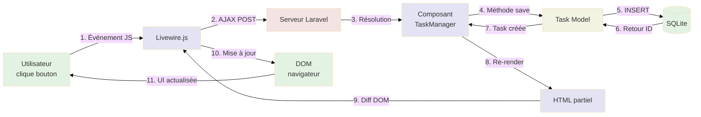

# 3a - Livewire Pur

<div
  class="omny-meta"
  data-level="🟢 Débutant"
  data-version="1.0"
  data-time="90-120 minutes">
</div>

## Introduction

Après avoir construit une **application MVC classique** dans le Module 5 (avec rechargements de page), il est temps de **franchir le cap de la réactivité** avec Livewire. Ce module marque un **tournant majeur** dans votre apprentissage de la Stack TALL.

Imaginez que vous conduisez une voiture manuelle depuis le Module 5. Vous comprenez parfaitement comment fonctionne chaque composant (embrayage = routes, boîte de vitesses = contrôleur, moteur = modèle). Maintenant, avec Livewire, vous passez à une **voiture automatique** : même destination, mais **conduite infiniment plus fluide** et **sans à-coups**.

**Qu'est-ce que Livewire change concrètement ?**

Dans le Module 5, chaque action utilisateur (créer, compléter, supprimer) déclenchait :
- Une requête HTTP complète (POST/DELETE)
- Un rechargement complet de la page
- Perte du focus, scroll en haut, latence visible

Avec Livewire, **ZÉRO rechargement de page**. Chaque action déclenche :
- Une requête AJAX en arrière-plan
- Mise à jour **uniquement de la partie modifiée** du DOM
- Conservation du focus, du scroll, réactivité instantanée

Ce module vous guidera pas à pas pour :

- **Installer Livewire** dans le projet `tall-tasks`
- **Créer un composant Livewire** `TaskManager` qui remplace le contrôleur
- **Implémenter les propriétés réactives** avec `#[Validate]`
- **Utiliser les directives wire** (`wire:model`, `wire:click`, `wire:submit`)
- **Supprimer les rechargements de page** pour une UX moderne
- **Comparer directement** avec l'application du Module 5

!!! quote "Principe du Module 6"
    "Livewire transforme votre application statique en interface réactive moderne sans écrire une ligne de JavaScript. La magie opère côté serveur, le résultat impressionne côté client."

---

## Objectifs d'Apprentissage

À la fin de ce module, **vous serez capable de** :

### Objectifs Techniques

- [ ] Installer Livewire via Composer (`composer require livewire/livewire`)
- [ ] Créer un composant Livewire avec Artisan (`make:livewire TaskManager`)
- [ ] Définir des propriétés publiques réactives dans un composant
- [ ] Utiliser l'attribut `#[Validate]` pour la validation inline
- [ ] Implémenter les méthodes CRUD dans un composant Livewire
- [ ] Utiliser `wire:model` pour le binding bidirectionnel
- [ ] Utiliser `wire:click` pour déclencher des actions
- [ ] Utiliser `wire:submit.prevent` pour gérer la soumission de formulaire
- [ ] Afficher des propriétés calculées avec méthodes `get*Property()`
- [ ] Tester l'application réactive dans le navigateur

### Objectifs Conceptuels

- [ ] Comprendre la différence Livewire vs Contrôleur classique
- [ ] Visualiser le cycle requête/réponse AJAX de Livewire
- [ ] Maîtriser le concept de composant réactif côté serveur
- [ ] Saisir comment Livewire met à jour partiellement le DOM
- [ ] Comprendre pourquoi CSRF est automatiquement géré
- [ ] Anticiper les avantages/inconvénients de la réactivité serveur
- [ ] Comparer performance statique vs réactive
- [ ] Préparer la transition vers Alpine.js (Module 7) et Hybride (Module 8)

---

## Prérequis

Avant de commencer ce module, **assurez-vous d'avoir** :

- [ ] **Module 5 complété** : Application MVC fonctionnelle avec TaskController et vues Blade
- [ ] **Application testée** : Création, complétion, suppression validées
- [ ] **Compréhension du cycle HTTP** : GET/POST/DELETE, requête/réponse, rechargement page
- [ ] **Maîtrise de Blade** : Directives `@foreach`, `@if`, `{{ $variable }}`
- [ ] **90-120 minutes** devant vous sans interruption

!!! warning "Connaissance JavaScript Non Requise"
    **Excellente nouvelle** : Livewire ne nécessite **AUCUNE connaissance JavaScript** ! Toute la logique est écrite en PHP côté serveur. Le JavaScript est **généré automatiquement** par Livewire.

!!! danger "Ne Sautez Pas le Module 5"
    **Comprendre l'application statique (Module 5) est ESSENTIEL** avant d'ajouter la réactivité. Sans cette base, vous ne comprendrez pas **ce qui change** avec Livewire et **pourquoi** c'est important.

---

## Comprendre Avant d'Agir : Livewire vs Contrôleur Classique

Avant d'installer Livewire, comprenons **les différences fondamentales** avec l'approche du Module 5.

### Architecture Contrôleur Classique (Module 5)

**Schéma de flux :**

```
1. Utilisateur clique "Ajouter" → 2. POST /tasks → 3. TaskController@store
4. Validation + Création BDD → 5. redirect()->route('tasks.index')
6. GET /tasks → 7. TaskController@index → 8. Affichage liste complète
```

**Caractéristiques :**

- **2 requêtes HTTP complètes** (POST + GET)
- **Rechargement complet de la page** (HTML, CSS, JS re-téléchargés)
- **Perte du contexte** (focus, scroll, animations)
- **Latence visible** (~300-500ms selon connexion)

### Architecture Livewire (Module 6)

**Schéma de flux :**

```
1. Utilisateur clique "Ajouter" → 2. AJAX POST (background)
3. TaskManager@save → 4. Validation + Création BDD
5. Livewire calcule diff DOM → 6. Mise à jour partielle (UNIQUEMENT la liste)
```

**Caractéristiques :**

- **1 seule requête AJAX** en arrière-plan
- **ZÉRO rechargement de page** (seulement mise à jour DOM)
- **Conservation du contexte** (focus, scroll, animations continuent)
- **Réactivité instantanée** (~50-100ms perçus)

### Tableau Comparatif Détaillé

| Aspect | Contrôleur Classique (Module 5) | Livewire Pur (Module 6) |
|--------|:-------------------------------:|:-----------------------:|
| **Rechargements page** | ✅ À chaque action | ❌ **ZÉRO rechargement** |
| **Requêtes HTTP** | 2+ par action (POST + GET) | 1 requête AJAX |
| **Bande passante** | ~50-200 KB par action | ~1-5 KB par action |
| **Latence perçue** | 300-500ms | 50-100ms |
| **Conservation focus** | ❌ Perdu | ✅ **Conservé** |
| **Conservation scroll** | ❌ Retour en haut | ✅ **Conservé** |
| **JavaScript requis** | Minimal (confirmation) | Livewire.js (auto-inclus) |
| **Logique métier** | PHP (contrôleur) | PHP (composant Livewire) |
| **Complexité** | 🟢 Simple | 🟡 Moyenne |
| **Expérience utilisateur** | ⚠️ Acceptable | ✅ **Moderne** |
| **SEO** | ✅ Excellent | ✅ Excellent (SSR) |

!!! tip "Pourquoi Livewire > Alpine.js (pour débuter) ?"
    **Livewire** = Logique PHP côté serveur (ce que vous connaissez)
    **Alpine.js** (Module 7) = Logique JavaScript côté client (nouveau paradigme)
    
    **Commencer par Livewire** vous permet de :
    
    1. Comprendre la réactivité sans changer de langage
    2. Conserver votre logique métier en PHP
    3. Bénéficier de la validation/sécurité Laravel
    4. Progression pédagogique plus douce

### Comment Fonctionne Livewire (Sous le Capot)

Ce diagramme montre **comment Livewire gère une action utilisateur** sans rechargement de page.

**Comment lire ce diagramme ?**

- Les **rectangles** représentent les composants techniques
- Les **flèches pleines** montrent les actions exécutées
- Les **flèches pointillées** montrent les retours de données
- **Séquence temporelle** : de gauche à droite



<small>*Ce diagramme illustre le cycle complet d'une action Livewire. Étape 1 : L'utilisateur clique sur "Ajouter", Livewire.js capture l'événement. Étape 2 : Requête AJAX POST envoyée au serveur (sans rechargement). Étape 3-7 : Serveur Laravel résout le composant TaskManager, exécute la méthode `save()`, crée la tâche en BDD via le modèle. Étape 8 : Livewire re-génère le HTML du composant avec les nouvelles données. Étape 9 : Livewire calcule le **diff DOM** (différence entre ancien et nouveau HTML). Étape 10-11 : Livewire.js applique uniquement les changements nécessaires au DOM, l'UI se met à jour instantanément. **Clé** : Seule la partie modifiée du DOM est touchée (ex: ajout d'un `<div>` dans la liste), le reste de la page reste intact.*</small>

!!! info "Qu'est-ce qu'un Diff DOM ?"
    Le **diff DOM** est un algorithme qui compare :
    
    - **Ancien HTML** : `<ul><li>Tâche 1</li></ul>`
    - **Nouveau HTML** : `<ul><li>Tâche 1</li><li>Tâche 2</li></ul>`
    
    **Résultat du diff** : Ajouter uniquement `<li>Tâche 2</li>` au lieu de remplacer tout le `<ul>`.
    
    **Avantages** :
    
    - Performance optimale (mise à jour minimale)
    - Conservation des états (focus, scroll, animations)
    - Bande passante réduite (~1-5 KB vs 50-200 KB)

---

## Phase 1 — Installation de Livewire (Étapes 1 à 3)

### Étape 1 : Installer Livewire via Composer

Commençons par installer Livewire dans le projet `tall-tasks`.

**Installer le package :**

```bash
# Installer Livewire 3.x (dernière version)
composer require livewire/livewire

# Résultat attendu :
# Installing livewire/livewire (v3.x.x)
# ...
# Package operations: 1 install, 0 updates, 0 removals
```

!!! info "Livewire 3.x"
    **Livewire 3** (sorti en août 2023) apporte des améliorations majeures :
    
    - Attributs PHP 8+ (`#[Validate]`, `#[Computed]`)
    - Performance optimisée (diff DOM plus rapide)
    - Support TypeScript pour extensions
    - API plus intuitive

**Vérifier l'installation :**

```bash
# Vérifier que Livewire est installé
composer show livewire/livewire

# Doit afficher : livewire/livewire v3.x.x
```

!!! success "Livewire Installé"
    Le package Livewire est maintenant disponible dans votre projet Laravel !

---

### Étape 2 : Publier les Assets Livewire (Optionnel)

Cette étape est **optionnelle** mais recommandée pour comprendre les fichiers générés.

**Publier les assets :**

```bash
# Publier les fichiers JavaScript et CSS de Livewire
php artisan livewire:publish --assets

# Résultat attendu :
# Livewire assets published successfully.
```

**Fichiers créés :**

- `public/livewire/livewire.js` : Script JavaScript de Livewire
- `public/livewire/livewire.esm.js` : Version ES Module

!!! note "CDN vs Fichiers Locaux"
    **Par défaut**, Livewire charge ses assets depuis un CDN.
    **Après `livewire:publish`**, les assets sont servis localement.
    
    **Pour ce module**, nous utiliserons le **CDN** (plus simple, pas de build requis).

---

### Étape 3 : Inclure Livewire dans le Layout

Modifions le layout principal pour inclure les scripts Livewire.

**Fichier :** `resources/views/layouts/app.blade.php`

```php
<!DOCTYPE html>
<html lang="fr">
<head>
    <meta charset="UTF-8">
    <meta name="viewport" content="width=device-width, initial-scale=1.0">
    
    <title>@yield('title', 'TALL Tasks - Gestion de Tâches')</title>
    
    {{-- Tailwind CSS via CDN --}}
    <script src="https://cdn.tailwindcss.com"></script>
    
    {{-- NOUVEAU : Styles Livewire (obligatoire) --}}
    @livewireStyles
</head>
<body class="bg-gray-100 min-h-screen">
    <header class="bg-white shadow-sm">
        <div class="max-w-4xl mx-auto px-4 py-6">
            <h1 class="text-3xl font-bold text-gray-900">
                📋 TALL Tasks
            </h1>
            <p class="text-sm text-gray-600 mt-1">
                Gestion moderne de vos tâches quotidiennes
            </p>
        </div>
    </header>

    <main class="max-w-4xl mx-auto px-4 py-8">
        @if(session('success'))
            <div class="bg-green-100 border border-green-400 text-green-700 px-4 py-3 rounded mb-6">
                {{ session('success') }}
            </div>
        @endif

        @yield('content')
    </main>

    <footer class="bg-white border-t mt-12">
        <div class="max-w-4xl mx-auto px-4 py-6 text-center text-gray-600 text-sm">
            <p>
                TALL Tasks &copy; {{ date('Y') }} - 
                Construit avec 
                <span class="text-red-500">♥</span> 
                et la Stack TALL
            </p>
        </div>
    </footer>

    {{-- NOUVEAU : Scripts Livewire (obligatoire) --}}
    @livewireScripts
</body>
</html>
```

**Changements apportés :**

```php
{{-- Dans <head> : Ajouter les styles Livewire --}}
@livewireStyles

{{-- Avant </body> : Ajouter les scripts Livewire --}}
@livewireScripts
```

!!! danger "Directives Obligatoires"
    **@livewireStyles** et **@livewireScripts** sont **OBLIGATOIRES** pour que Livewire fonctionne.
    
    - **@livewireStyles** : Injecte le CSS pour les spinners de chargement, transitions, etc.
    - **@livewireScripts** : Injecte `livewire.js` qui gère les requêtes AJAX et le diff DOM
    
    **Sans ces directives**, Livewire ne fonctionnera pas (erreurs JavaScript dans la console).

**Ce que fait @livewireScripts :**

```html
<!-- HTML généré par @livewireScripts -->
<script src="https://cdn.jsdelivr.net/gh/livewire/livewire@v3.x.x/dist/livewire.esm.js"></script>
<script data-navigate-once="true">
    window.Livewire = Livewire;
</script>
```

!!! tip "Version CDN Automatique"
    Livewire utilise **automatiquement le CDN** sauf si vous avez publié les assets localement. Le CDN garantit que vous utilisez toujours la **dernière version stable** de Livewire 3.

> Ainsi s'achève la Phase 1 - Installation de Livewire (Étapes 1-3)

---

## Phase 2 — Création du Composant Livewire (Étapes 4 à 5)

### Étape 4 : Créer le Composant TaskManager

Créons maintenant le **composant Livewire** qui remplacera le TaskController du Module 5.

**Créer le composant :**

```bash
# Créer le composant TaskManager avec Artisan
# Génère 2 fichiers : classe PHP + vue Blade
php artisan make:livewire TaskManager

# Résultat attendu :
# CLASS: app/Livewire/TaskManager.php
# VIEW:  resources/views/livewire/task-manager.blade.php
```

!!! info "Structure d'un Composant Livewire"
    Un composant Livewire est composé de **deux fichiers** :
    
    1. **Classe PHP** : Logique métier (propriétés, méthodes)
    2. **Vue Blade** : Présentation (HTML + directives wire)
    
    **Philosophie** : Séparation claire entre logique et présentation, comme dans MVC.

**Fichiers créés :**

- **Classe** : `app/Livewire/TaskManager.php`
- **Vue** : `resources/views/livewire/task-manager.blade.php`

**Vérifier la création :**

```bash
# Vérifier que les fichiers existent
ls -la app/Livewire/TaskManager.php
ls -la resources/views/livewire/task-manager.blade.php

# Doivent afficher les 2 fichiers avec date de création
```

---

### Étape 5 : Implémenter la Logique du Composant

Ouvrons la classe `TaskManager` et implémentons toute la logique CRUD.

**Fichier :** `app/Livewire/TaskManager.php`

```php
<?php

namespace App\Livewire;

use App\Models\Task;
use Livewire\Component;
use Livewire\Attributes\Validate;

class TaskManager extends Component
{
    /**
     * Propriétés du formulaire (binding bidirectionnel avec wire:model)
     * 
     * #[Validate] définit les règles de validation inline
     * Ces propriétés sont automatiquement synchronisées avec le formulaire
     */
    #[Validate('required|max:255')]
    public $title = '';

    #[Validate('nullable')]
    public $description = '';

    /**
     * Créer une nouvelle tâche
     * 
     * Méthode appelée quand l'utilisateur soumet le formulaire
     * (wire:submit.prevent="save" dans la vue)
     */
    public function save()
    {
        // Valider les données (utilise les règles #[Validate])
        // Lance une exception si validation échoue
        $validated = $this->validate();

        // Créer la tâche en base de données
        Task::create($validated);

        // Réinitialiser le formulaire après création
        $this->reset(['title', 'description']);

        // Message de succès (affiché dans la vue)
        session()->flash('success', 'Tâche créée avec succès !');
    }

    /**
     * Basculer l'état de complétion d'une tâche
     * 
     * Méthode appelée quand l'utilisateur clique sur "Compléter/Réactiver"
     * (wire:click="toggle({{ $task->id }})" dans la vue)
     */
    public function toggle($taskId)
    {
        // Récupérer la tâche par ID
        $task = Task::findOrFail($taskId);

        // Inverser l'état de complétion
        $task->update([
            'completed' => !$task->completed
        ]);
    }

    /**
     * Supprimer une tâche
     * 
     * Méthode appelée quand l'utilisateur clique sur "Supprimer"
     * (wire:click="delete({{ $task->id }})" dans la vue)
     */
    public function delete($taskId)
    {
        // Récupérer la tâche par ID
        $task = Task::findOrFail($taskId);

        // Supprimer la tâche de la BDD
        $task->delete();

        // Message de succès
        session()->flash('success', 'Tâche supprimée avec succès !');
    }

    /**
     * Propriété calculée : Liste de toutes les tâches
     * 
     * Cette méthode est appelée automatiquement par Livewire
     * quand on utilise $this->tasks dans la vue
     * 
     * Convention : getXxxProperty() → accessible via $this->xxx
     */
    public function getTasksProperty()
    {
        // Retourner toutes les tâches de la BDD
        return Task::all();
    }

    /**
     * Propriété calculée : Nombre total de tâches
     * 
     * Accessible via $this->tasksCount dans la vue
     */
    public function getTasksCountProperty()
    {
        return Task::count();
    }

    /**
     * Render : Méthode obligatoire qui retourne la vue
     * 
     * Appelée automatiquement par Livewire à chaque requête
     */
    public function render()
    {
        return view('livewire.task-manager');
    }
}
```

#### Explication Détaillée des Concepts Livewire

**Tableau des concepts clés :**

| Concept | Syntaxe | Rôle | Exemple |
|---------|---------|------|---------|
| **Propriétés publiques** | `public $title = ''` | Variables réactives synchronisées avec la vue | Binding formulaire |
| **Attribut #[Validate]** | `#[Validate('required')]` | Validation inline (PHP 8+) | Remplace `$rules` |
| **Méthodes publiques** | `public function save()` | Actions appelables depuis la vue | CRUD |
| **Propriétés calculées** | `getTasksProperty()` | Calcul dynamique accessible via `$this->tasks` | Queries Eloquent |
| **reset()** | `$this->reset(['title'])` | Réinitialiser propriétés | Vider formulaire |
| **validate()** | `$this->validate()` | Exécuter validation | Utilise `#[Validate]` |
| **render()** | `return view('...')` | Retourner vue Blade | Obligatoire |

#### Propriétés Publiques Réactives

**Qu'est-ce qu'une propriété réactive ?**

Une **propriété publique** dans un composant Livewire est **automatiquement synchronisée** entre le serveur et le client.

**Exemple :**

```php
// Dans la classe PHP
public $title = '';

// Dans la vue Blade
<input wire:model="title" />

// Quand l'utilisateur tape "Ma tâche" :
// 1. Livewire.js détecte le changement
// 2. Envoie requête AJAX au serveur
// 3. Serveur met à jour $this->title = "Ma tâche"
// 4. Livewire re-rend la vue avec nouvelle valeur
```

!!! tip "Binding Bidirectionnel"
    **`wire:model="title"`** crée un **binding bidirectionnel** :
    
    - **Client → Serveur** : Changement input → mise à jour propriété PHP
    - **Serveur → Client** : Changement propriété PHP → mise à jour input
    
    **C'est comme Vue.js `v-model` ou React `useState`, mais en PHP !**

#### Attribut `#[Validate]` (PHP 8+)

**Avant Livewire 3 (PHP 7.4) :**

```php
protected $rules = [
    'title' => 'required|max:255',
    'description' => 'nullable',
];
```

**Avec Livewire 3 (PHP 8+) :**

```php
#[Validate('required|max:255')]
public $title = '';

#[Validate('nullable')]
public $description = '';
```

**Avantages des attributs :**

1. **Plus lisible** : Règles à côté de la propriété
2. **Type-safe** : IDE détecte les erreurs
3. **Moderne** : Syntaxe PHP 8+ recommandée

!!! info "Validation Automatique"
    Quand vous appelez `$this->validate()`, Livewire utilise **automatiquement** les règles définies dans les attributs `#[Validate]`.

#### Propriétés Calculées (Computed Properties)

**Qu'est-ce qu'une propriété calculée ?**

Une **propriété calculée** est une méthode qui se comporte comme une propriété.

**Convention de nommage :**

```php
// Méthode : get + Nom + Property
public function getTasksProperty()
{
    return Task::all();
}

// Accessible dans la vue comme une propriété
{{ $this->tasks }}  // Appelle automatiquement getTasksProperty()
```

**Avantages :**

1. **Calcul à la demande** : Pas de surcharge si non utilisée
2. **Automatiquement mise à jour** : Recalculée à chaque render
3. **Code propre** : Logique séparée de la vue

**Exemple concret :**

```php
// Dans la classe
public function getTasksProperty()
{
    return Task::all();  // Requête BDD à chaque fois
}

// Dans la vue
@foreach($this->tasks as $task)
    {{ $task->title }}
@endforeach

// Livewire appelle automatiquement getTasksProperty()
```

!!! warning "Performance"
    Les propriétés calculées sont **recalculées à chaque render**. Si vous avez une requête lourde, considérez **mettre en cache** le résultat avec `#[Computed]` (Livewire 3).

#### Méthode `reset()` : Réinitialiser les Propriétés

**Pourquoi `reset()` ?**

Après la création d'une tâche, nous voulons **vider le formulaire** pour permettre d'ajouter une autre tâche.

**Syntaxe :**

```php
// Réinitialiser une propriété
$this->reset('title');

// Réinitialiser plusieurs propriétés
$this->reset(['title', 'description']);

// Réinitialiser TOUTES les propriétés
$this->reset();
```

**Exemple complet :**

```php
public function save()
{
    $validated = $this->validate();
    Task::create($validated);
    
    // Vider le formulaire après succès
    $this->reset(['title', 'description']);
    
    // Maintenant : $this->title = '' et $this->description = ''
}
```

!!! tip "Expérience Utilisateur"
    Sans `reset()`, après avoir créé une tâche, le formulaire contiendrait **encore les anciennes données**. L'utilisateur devrait manuellement vider les champs avant d'ajouter une nouvelle tâche.

> Ainsi s'achève la Phase 2 - Création du Composant Livewire (Étapes 4-5)

---

## Phase 3 — Construction de la Vue Livewire (Étape 6)

### Étape 6 : Créer la Vue du Composant

Ouvrons maintenant la vue Blade du composant et construisons l'interface **avec les directives wire**.

**Fichier :** `resources/views/livewire/task-manager.blade.php`

```php
<div>
    {{-- Formulaire de création avec Livewire --}}
    <div class="bg-white rounded-lg shadow-md p-6 mb-8">
        <h2 class="text-2xl font-bold text-gray-800 mb-4">
            ➕ Créer une nouvelle tâche
        </h2>

        {{--
            wire:submit.prevent="save"
            - wire:submit : Écoute la soumission du formulaire
            - .prevent : Équivalent de event.preventDefault() (empêche rechargement)
            - "save" : Appelle la méthode save() du composant
        --}}
        <form wire:submit.prevent="save" class="space-y-4">
            {{-- Champ titre --}}
            <div>
                <label class="block text-sm font-medium text-gray-700 mb-2">
                    Titre de la tâche
                </label>
                {{--
                    wire:model="title"
                    - Binding bidirectionnel avec $this->title
                    - Quand l'utilisateur tape, $title est mis à jour côté serveur
                    - Quand $title change côté serveur, l'input est mis à jour
                --}}
                <input 
                    type="text" 
                    wire:model="title"
                    placeholder="Ex: Terminer le Module 6"
                    class="w-full px-4 py-2 border border-gray-300 rounded-lg focus:ring-2 focus:ring-blue-500 focus:border-transparent @error('title') border-red-500 @enderror"
                >
                {{-- Afficher l'erreur de validation si présente --}}
                @error('title')
                    <p class="text-red-500 text-sm mt-1">{{ $message }}</p>
                @enderror
            </div>

            {{-- Champ description --}}
            <div>
                <label class="block text-sm font-medium text-gray-700 mb-2">
                    Description (optionnel)
                </label>
                <textarea 
                    wire:model="description"
                    rows="3"
                    placeholder="Détails supplémentaires..."
                    class="w-full px-4 py-2 border border-gray-300 rounded-lg focus:ring-2 focus:ring-blue-500 focus:border-transparent"
                ></textarea>
            </div>

            {{-- Bouton soumission --}}
            <button 
                type="submit"
                class="w-full bg-blue-600 text-white font-medium py-3 px-4 rounded-lg hover:bg-blue-700 transition duration-200"
            >
                Ajouter la tâche
            </button>
        </form>
    </div>

    {{-- Liste des tâches avec Livewire --}}
    <div class="bg-white rounded-lg shadow-md p-6">
        <div class="flex items-center justify-between mb-4">
            <h2 class="text-2xl font-bold text-gray-800">
                📝 Mes tâches
            </h2>
            {{-- Compteur de tâches (propriété calculée) --}}
            <span class="bg-blue-100 text-blue-800 text-sm font-medium px-3 py-1 rounded-full">
                {{ $this->tasksCount }} tâche(s)
            </span>
        </div>

        {{-- Vérifier si des tâches existent --}}
        @if($this->tasks->isEmpty())
            {{-- Message si aucune tâche --}}
            <div class="text-center py-12">
                <p class="text-gray-500 text-lg mb-2">
                    📭 Aucune tâche pour le moment
                </p>
                <p class="text-gray-400 text-sm">
                    Créez votre première tâche ci-dessus !
                </p>
            </div>
        @else
            {{-- Boucle sur toutes les tâches (propriété calculée) --}}
            <div class="space-y-3">
                @foreach($this->tasks as $task)
                    <div class="flex items-center justify-between p-4 rounded-lg border 
                        {{ $task->completed ? 'bg-green-50 border-green-200' : 'bg-gray-50 border-gray-200' }}">
                        
                        <div class="flex-1">
                            {{-- Titre avec style différent si complété --}}
                            <h3 class="font-semibold {{ $task->completed ? 'text-gray-500 line-through' : 'text-gray-900' }}">
                                {{ $task->title }}
                            </h3>
                            
                            {{-- Description si présente --}}
                            @if($task->description)
                                <p class="text-sm mt-1 {{ $task->completed ? 'text-gray-400' : 'text-gray-600' }}">
                                    {{ $task->description }}
                                </p>
                            @endif
                            
                            {{-- Métadonnées (date de création) --}}
                            <p class="text-xs text-gray-400 mt-2">
                                Créée le {{ $task->created_at->format('d/m/Y à H:i') }}
                            </p>
                        </div>
                        
                        {{-- Boutons d'action --}}
                        <div class="flex items-center space-x-2 ml-4">
                            {{--
                                wire:click="toggle({{ $task->id }})"
                                - wire:click : Écoute le clic sur le bouton
                                - "toggle(...)" : Appelle la méthode toggle() avec l'ID de la tâche
                                - PAS de formulaire nécessaire (contrairement au Module 5)
                            --}}
                            <button 
                                wire:click="toggle({{ $task->id }})"
                                class="px-4 py-2 rounded-lg transition
                                    {{ $task->completed 
                                        ? 'bg-gray-600 hover:bg-gray-700 text-white' 
                                        : 'bg-green-600 hover:bg-green-700 text-white' }}"
                            >
                                {{ $task->completed ? '↩️ Réactiver' : '✓ Compléter' }}
                            </button>
                            
                            {{--
                                wire:click="delete({{ $task->id }})"
                                wire:confirm : Affiche confirmation JavaScript (Livewire 3)
                            --}}
                            <button 
                                wire:click="delete({{ $task->id }})"
                                wire:confirm="Êtes-vous sûr de vouloir supprimer cette tâche ?"
                                class="px-4 py-2 bg-red-600 text-white rounded-lg hover:bg-red-700 transition"
                            >
                                🗑️ Supprimer
                            </button>
                        </div>
                    </div>
                @endforeach
            </div>
        @endif
    </div>
</div>
```

#### Explication Détaillée des Directives Wire

**Tableau des directives wire utilisées :**

| Directive | Rôle | Équivalent JavaScript | Exemple |
|-----------|------|----------------------|---------|
| `wire:model="title"` | Binding bidirectionnel | `v-model` (Vue), `[ngModel]` (Angular) | Synchroniser input avec propriété |
| `wire:submit.prevent="save"` | Soumettre formulaire sans rechargement | `onsubmit="return false"` + AJAX | Appeler méthode save() |
| `wire:click="toggle(1)"` | Déclencher action au clic | `onclick="..."` + AJAX | Appeler méthode toggle() |
| `wire:confirm="Message"` | Confirmation avant action | `confirm('...')` | Afficher popup native |
| `wire:loading` | Afficher pendant requête AJAX | Gérer états loading manuellement | Spinner/texte "Chargement..." |
| `wire:target="save"` | Cibler action spécifique | N/A | Spinner uniquement pour save() |

#### `wire:model` : Le Binding Bidirectionnel

**Qu'est-ce que `wire:model` ?**

`wire:model` crée une **liaison bidirectionnelle** entre un champ de formulaire et une propriété du composant.

**Syntaxe :**

```php
{{-- Dans la vue --}}
<input wire:model="title" />

{{-- Équivaut à (sous le capot) --}}
<input 
    value="{{ $title }}"
    oninput="Livewire.find(componentId).set('title', event.target.value)"
/>
```

**Variantes de wire:model :**

```php
{{-- wire:model : Synchronisation après blur (perte de focus) --}}
<input wire:model="title" />

{{-- wire:model.live : Synchronisation en temps réel (chaque frappe) --}}
<input wire:model.live="search" />

{{-- wire:model.lazy : Synchronisation uniquement au submit --}}
<input wire:model.lazy="email" />

{{-- wire:model.debounce.500ms : Synchronisation avec délai de 500ms --}}
<input wire:model.debounce.500ms="search" />
```

!!! tip "Quelle Variante Choisir ?"
    - **wire:model** (défaut) : Formulaires standard (nom, email)
    - **wire:model.live** : Recherche en temps réel, autocomplétion
    - **wire:model.lazy** : Optimisation performance (moins de requêtes)
    - **wire:model.debounce** : Recherche avec délai (éviter trop de requêtes)

#### `wire:submit.prevent` : Soumission de Formulaire

**Qu'est-ce que `wire:submit.prevent` ?**

Cette directive **empêche le rechargement de page** et **appelle une méthode** à la place.

**Syntaxe :**

```php
<form wire:submit.prevent="save">
    {{-- Champs du formulaire --}}
    <button type="submit">Ajouter</button>
</form>
```

**Ce qui se passe :**

1. Utilisateur clique sur "Ajouter"
2. Livewire.js capture l'événement `submit`
3. `.prevent` empêche le comportement par défaut (rechargement)
4. Livewire appelle `TaskManager@save()`
5. Serveur exécute la méthode, re-rend la vue
6. Livewire.js met à jour le DOM

!!! info "Plus de @csrf Nécessaire"
    **Contrairement au Module 5**, vous n'avez **pas besoin de `@csrf`** dans les formulaires Livewire. **Livewire gère automatiquement** la protection CSRF en incluant le token dans les requêtes AJAX.

#### `wire:click` : Déclencher des Actions

**Qu'est-ce que `wire:click` ?**

Cette directive **appelle une méthode** quand l'utilisateur clique sur un élément.

**Syntaxe :**

```php
{{-- Sans paramètres --}}
<button wire:click="refresh">Actualiser</button>

{{-- Avec paramètres --}}
<button wire:click="toggle({{ $task->id }})">Compléter</button>

{{-- Avec plusieurs paramètres --}}
<button wire:click="update({{ $task->id }}, 'completed')">Marquer</button>
```

**Comparaison avec Module 5 :**

```php
{{-- Module 5 : Formulaire POST obligatoire --}}
<form action="{{ route('tasks.toggle', $task) }}" method="POST">
    @csrf
    <button type="submit">Compléter</button>
</form>

{{-- Module 6 : Simple bouton avec wire:click --}}
<button wire:click="toggle({{ $task->id }})">Compléter</button>
```

**Gain de simplicité :**

- ❌ Plus de formulaire imbriqué
- ❌ Plus de token `@csrf`
- ❌ Plus de méthode `@method('DELETE')`
- ✅ Un simple bouton suffit !

#### `wire:confirm` : Confirmation Avant Action

**Qu'est-ce que `wire:confirm` ?**

Cette directive **affiche une popup de confirmation** avant d'exécuter une action.

**Syntaxe :**

```php
<button 
    wire:click="delete({{ $task->id }})"
    wire:confirm="Êtes-vous sûr de vouloir supprimer cette tâche ?"
>
    Supprimer
</button>
```

**Ce qui se passe :**

1. Utilisateur clique sur "Supprimer"
2. Livewire affiche popup native `confirm()`
3. Si utilisateur clique "OK" → `delete()` est appelée
4. Si utilisateur clique "Annuler" → rien ne se passe

**Comparaison avec Module 5 :**

```php
{{-- Module 5 : JavaScript inline --}}
<form onsubmit="return confirm('Êtes-vous sûr ?')">
    {{-- ... --}}
</form>

{{-- Module 6 : Directive wire:confirm --}}
<button wire:confirm="Êtes-vous sûr ?">
    Supprimer
</button>
```

!!! tip "Messages Personnalisés"
    Vous pouvez personnaliser le message de confirmation pour chaque action :
    
    ```php
    wire:confirm="Supprimer {{ $task->title }} ?"
    ```

> Ainsi s'achève la Phase 3 - Construction de la Vue Livewire (Étape 6)

---

## Phase 4 — Intégration et Configuration (Étapes 7 à 8)

### Étape 7 : Créer la Route pour le Composant

Configurons la route pour afficher le composant Livewire à la place du contrôleur.

**Fichier :** `routes/web.php`

```php
<?php

use App\Livewire\TaskManager;
use Illuminate\Support\Facades\Route;

/**
 * Route Livewire : Afficher le composant TaskManager
 * 
 * Cette route remplace les 4 routes du Module 5 :
 * - GET /tasks (index)
 * - POST /tasks (store)
 * - POST /tasks/{id}/toggle (toggle)
 * - DELETE /tasks/{id} (destroy)
 * 
 * Avec Livewire, UNE SEULE route suffit !
 * Les actions (save, toggle, delete) sont gérées par le composant
 */
Route::get('/tasks', TaskManager::class)->name('tasks.index');

/**
 * OPTIONNEL : Conserver les anciennes routes pour compatibilité
 * 
 * Si vous voulez tester les deux versions (Module 5 vs Module 6),
 * commentez la route Livewire ci-dessus et décommentez les routes classiques :
 */

/*
use App\Http\Controllers\TaskController;

Route::get('/tasks', [TaskController::class, 'index'])->name('tasks.index');
Route::post('/tasks', [TaskController::class, 'store'])->name('tasks.store');
Route::post('/tasks/{task}/toggle', [TaskController::class, 'toggle'])->name('tasks.toggle');
Route::delete('/tasks/{task}', [TaskController::class, 'destroy'])->name('tasks.destroy');
*/
```

**Changements clés :**

```php
// Module 5 : 4 routes distinctes
Route::get('/tasks', [TaskController::class, 'index']);
Route::post('/tasks', [TaskController::class, 'store']);
Route::post('/tasks/{task}/toggle', [TaskController::class, 'toggle']);
Route::delete('/tasks/{task}', [TaskController::class, 'destroy']);

// Module 6 : 1 seule route
Route::get('/tasks', TaskManager::class);
```

!!! info "Simplification Drastique"
    **Avec Livewire**, vous n'avez besoin que **d'une seule route GET**. Toutes les actions (create, update, delete) sont gérées par des **requêtes AJAX automatiques** vers le même composant.

**Syntaxe alternative (équivalente) :**

```php
// Syntaxe 1 : Classe directement
Route::get('/tasks', TaskManager::class);

// Syntaxe 2 : Action invoke (équivalent)
use Livewire\Livewire;
Route::get('/tasks', function () {
    return Livewire::mount(TaskManager::class);
});
```

!!! tip "Tester les Deux Versions"
    Pour **comparer Module 5 vs Module 6**, vous pouvez créer deux routes :
    
    ```php
    // Version classique (Module 5)
    Route::get('/tasks-classic', [TaskController::class, 'index']);
    
    // Version Livewire (Module 6)
    Route::get('/tasks', TaskManager::class);
    ```

---

### Étape 8 : Créer une Vue d'Enveloppe (Wrapper)

Créons une vue Blade qui **enveloppe le composant Livewire** et hérite du layout principal.

**Pourquoi cette étape ?**

Par défaut, `Route::get('/tasks', TaskManager::class)` retourne **uniquement le contenu du composant**, sans le layout (`<html>`, `<head>`, `<body>`).

**Solution :** Créer une vue qui inclut le layout ET le composant.

**Créer le fichier :**

```bash
# Créer le fichier tasks.blade.php dans resources/views/
touch resources/views/tasks.blade.php
```

**Fichier :** `resources/views/tasks.blade.php`

```php
{{-- Étendre le layout principal --}}
@extends('layouts.app')

{{-- Définir le titre de la page --}}
@section('title', 'Mes Tâches - TALL Tasks (Livewire)')

{{-- Contenu de la page --}}
@section('content')

{{-- 
    Inclure le composant Livewire TaskManager
    
    Syntaxe : @livewire('nom-du-composant')
    OU : <livewire:nom-du-composant />
--}}
@livewire('task-manager')

@endsection
```

**Modifier la route pour utiliser cette vue :**

**Fichier :** `routes/web.php`

```php
<?php

use Illuminate\Support\Facades\Route;

/**
 * Route Livewire avec vue d'enveloppe
 * 
 * Cette approche permet d'utiliser le layout commun
 * (header, footer, styles, scripts)
 */
Route::get('/tasks', function () {
    return view('tasks');
})->name('tasks.index');
```

**Syntaxes alternatives pour inclure le composant :**

```php
{{-- Syntaxe 1 : Directive @livewire --}}
@livewire('task-manager')

{{-- Syntaxe 2 : Tag <livewire:...> (Livewire 3) --}}
<livewire:task-manager />

{{-- Syntaxe 3 : Passer des paramètres --}}
@livewire('task-manager', ['filter' => 'completed'])
<livewire:task-manager :filter="'completed'" />
```

!!! success "Configuration Terminée"
    Votre application Livewire est maintenant **complètement configurée** et prête à être testée !

> Ainsi s'achève la Phase 4 - Intégration et Configuration (Étapes 7-8)

---

## Phase 5 — Tests et Comparaison (Étapes 9 à 12)

### Étape 9 : Démarrer le Serveur et Tester

Lançons le serveur et testons l'application **réactive** !

**Démarrer le serveur :**

```bash
# Si le serveur n'est pas déjà lancé
php artisan serve

# Résultat attendu :
#   INFO  Server running on [http://127.0.0.1:8000].
```

**Ouvrir le navigateur :**

```
http://localhost:8000/tasks
```

!!! success "Application Livewire Accessible"
    Si vous voyez l'interface identique au Module 5, **félicitations** ! L'application Livewire est opérationnelle.

---

### Étape 10 : Test 1 - Créer une Tâche (Sans Rechargement)

**Scénario de test :**

1. Remplir le formulaire :
   - **Titre** : "Tâche Livewire 1"
   - **Description** : "Créée sans rechargement de page"
2. Cliquer sur "Ajouter la tâche"

**Résultat attendu :**

- ✅ **AUCUN rechargement de page** (URL reste `/tasks`, pas de flash blanc)
- ✅ Message vert "Tâche créée avec succès !" apparaît
- ✅ Tâche ajoutée **instantanément** à la liste
- ✅ Formulaire **vidé automatiquement** (grâce à `reset()`)
- ✅ Compteur mis à jour "1 tâche(s)"
- ✅ Focus conservé dans le navigateur

**Différence avec Module 5 :**

| Aspect | Module 5 (Classique) | Module 6 (Livewire) |
|--------|:--------------------:|:-------------------:|
| Rechargement page | ✅ Oui (visible) | ❌ **Aucun** |
| URL change | ✅ Oui (POST → GET) | ❌ Reste `/tasks` |
| Flash blanc | ✅ Visible | ❌ **Invisible** |
| Latence perçue | ~300-500ms | ~50-100ms |
| Focus conservé | ❌ Perdu | ✅ **Conservé** |

!!! tip "Ouvrir les DevTools"
    Ouvrez la console du navigateur (F12) et l'onglet **Network** pour voir les requêtes AJAX de Livewire.
    
    **Vous verrez :**
    
    - Requête POST vers `/livewire/update`
    - Payload JSON avec données du formulaire
    - Réponse JSON avec HTML mis à jour

---

### Étape 11 : Test 2 - Compléter une Tâche (Réactivité Instantanée)

**Scénario de test :**

1. Cliquer sur "✓ Compléter" pour la tâche créée

**Résultat attendu :**

- ✅ **AUCUN rechargement de page**
- ✅ Tâche passe **instantanément** en fond vert
- ✅ Titre devient **barré** (line-through)
- ✅ Bouton change en "↩️ Réactiver"
- ✅ Scroll conservé (vous restez au même endroit dans la page)

**Test supplémentaire :**

1. Créer **5 tâches** rapidement
2. Compléter la **3ème tâche**
3. Observer que **SEULE la 3ème tâche** se met à jour (les autres ne "clignotent" pas)

**Explication technique :**

Livewire calcule le **diff DOM** et met à jour **uniquement** :

```html
<!-- Avant -->
<div class="bg-gray-50 border-gray-200">
    <h3 class="text-gray-900">Tâche 3</h3>
    <button class="bg-green-600">✓ Compléter</button>
</div>

<!-- Après (seuls ces changements sont appliqués) -->
<div class="bg-green-50 border-green-200">
    <h3 class="text-gray-500 line-through">Tâche 3</h3>
    <button class="bg-gray-600">↩️ Réactiver</button>
</div>
```

!!! success "Performance Optimale"
    Livewire ne touche **jamais** aux tâches 1, 2, 4, 5. Seule la tâche modifiée est mise à jour dans le DOM. **C'est la magie du diff DOM !**

---

### Étape 12 : Test 3 - Supprimer avec Confirmation

**Scénario de test :**

1. Cliquer sur "🗑️ Supprimer" pour une tâche
2. **Popup de confirmation** : Cliquer "OK"

**Résultat attendu :**

- ✅ Popup JavaScript native s'affiche (grâce à `wire:confirm`)
- ✅ **AUCUN rechargement de page** après confirmation
- ✅ Tâche disparaît **instantanément** de la liste
- ✅ Message vert "Tâche supprimée avec succès !"
- ✅ Compteur mis à jour automatiquement

**Test d'annulation :**

1. Cliquer sur "🗑️ Supprimer"
2. **Popup de confirmation** : Cliquer "Annuler"
3. **Résultat** : Rien ne se passe (tâche conservée)

!!! tip "Comparaison avec Module 5"
    **Module 5** utilisait `onsubmit="return confirm('...')"` dans un formulaire POST.
    **Module 6** utilise `wire:confirm` qui est **plus propre** et **intégré à Livewire**.

---

## Comparaison Directe : Module 5 vs Module 6

### Tableau Comparatif Complet

| Aspect | Module 5 (Contrôleur) | Module 6 (Livewire) | Gagnant |
|--------|:---------------------:|:-------------------:|:-------:|
| **Architecture** | MVC classique | Composant réactif | ⚖️ |
| **Fichiers** | 1 contrôleur + 1 vue | 1 classe + 1 vue | ⚖️ |
| **Routes** | 4 routes (GET/POST/DELETE) | 1 route (GET) | 🟢 Livewire |
| **Rechargements** | À chaque action | ZÉRO | 🟢 Livewire |
| **Latence perçue** | 300-500ms | 50-100ms | 🟢 Livewire |
| **Bande passante** | ~50-200 KB/action | ~1-5 KB/action | 🟢 Livewire |
| **Conservation focus** | ❌ Perdu | ✅ Conservé | 🟢 Livewire |
| **Conservation scroll** | ❌ Haut de page | ✅ Position conservée | 🟢 Livewire |
| **Formulaires** | `@csrf` + `@method('DELETE')` | Automatique | 🟢 Livewire |
| **Validation** | `$request->validate()` | `#[Validate]` + `$this->validate()` | 🟢 Livewire |
| **Complexité** | 🟢 Simple | 🟡 Moyenne | 🟢 Contrôleur |
| **Courbe apprentissage** | 🟢 Rapide | 🟡 Moyenne | 🟢 Contrôleur |
| **JavaScript requis** | Minimal | Livewire.js (15KB) | 🟢 Contrôleur |
| **Performance initiale** | ✅ Rapide | ⚠️ +15KB JS | 🟢 Contrôleur |
| **Performance actions** | ⚠️ Rechargement | ✅ Diff DOM | 🟢 Livewire |
| **Expérience utilisateur** | ⚠️ Acceptable | ✅ **Moderne** | 🟢 Livewire |
| **SEO** | ✅ Excellent | ✅ Excellent | ⚖️ |

### Diagramme de Comparaison des Requêtes

Ce diagramme compare le **nombre et type de requêtes** pour créer une tâche.

**Comment lire ce diagramme ?**

- **Gauche** : Module 5 (Contrôleur classique)
- **Droite** : Module 6 (Livewire)
- **Comparer** les étapes nécessaires

```mermaid
---
config:
    theme: 'base'
---
flowchart TB
    subgraph Module5["Module 5 - Contrôleur Classique"]
        U1[Utilisateur clique<br/>'Ajouter'] --> POST1[POST /tasks<br/>~50KB]
        POST1 --> Server1[Serveur traite]
        Server1 --> Redirect[Redirection 302]
        Redirect --> GET1[GET /tasks<br/>~200KB]
        GET1 --> Server2[Serveur re-génère<br/>HTML complet]
        Server2 --> Display1[Affichage<br/>page complète]
    end
    
    subgraph Module6["Module 6 - Livewire"]
        U2[Utilisateur clique<br/>'Ajouter'] --> AJAX[AJAX POST<br/>~1-5KB]
        AJAX --> Server3[Serveur traite]
        Server3 --> Diff[Calcul diff DOM]
        Diff --> Update[Mise à jour<br/>partielle]
        Update --> Display2[Affichage<br/>instantané]
    end

    style Module5 fill:#fff3e3
    style Module6 fill:#e3f3f3
```



<small>*Ce diagramme illustre la différence de flux entre une application classique et Livewire. Module 5 (Classique) : 2 requêtes HTTP complètes (POST 50KB + GET 200KB), rechargement complet de la page, latence ~500ms. Module 6 (Livewire) : 1 requête AJAX (1-5KB), mise à jour partielle DOM, latence ~50-100ms. Livewire génère ~50x moins de données transférées et offre une expérience utilisateur 5-10x plus rapide perçue.*</small>

### Quand Utiliser Livewire vs Contrôleur Classique ?

**Utilisez Livewire si :**

- ✅ Application **interactive** avec actions fréquentes
- ✅ UX moderne attendue (ex: SaaS, dashboards)
- ✅ Formulaires multiples avec validation temps réel
- ✅ Listes dynamiques avec filtres/recherche
- ✅ Vous voulez éviter d'écrire du JavaScript

**Utilisez Contrôleur Classique si :**

- ✅ Application **simple** avec peu d'interactions
- ✅ Sites **statiques** ou contenu (blog, vitrine)
- ✅ Performance initiale **critique** (chargement <1s)
- ✅ JavaScript **désactivé** par utilisateurs
- ✅ SEO Google **ultra-prioritaire** (bien que Livewire soit SEO-friendly)

!!! tip "Dans le Doute : Commencez par Livewire"
    Pour une application moderne en 2024-2025, **Livewire est le choix par défaut** sauf contrainte spécifique. Les gains d'UX valent largement le léger surcoût initial de 15KB de JavaScript.

---

## Le Mot de la Fin

### FÉLICITATIONS ! Vous maîtrisez maintenant Livewire.

!!! success "Application Réactive Côté Serveur Opérationnelle"

**Compétences Techniques Acquises :**

- ✅ **Livewire installé** via Composer et configuré dans le layout
- ✅ **Composant TaskManager créé** avec classe PHP + vue Blade
- ✅ **Propriétés réactives** avec binding `wire:model`
- ✅ **Validation inline** avec attribut `#[Validate]`
- ✅ **Actions CRUD** sans rechargement de page (save, toggle, delete)
- ✅ **Propriétés calculées** avec `getXxxProperty()`
- ✅ **Directives wire maîtrisées** (`wire:model`, `wire:click`, `wire:submit`, `wire:confirm`)
- ✅ **Route simplifiée** (1 route au lieu de 4)

**Compétences Conceptuelles Acquises :**

- ✅ **Différence Livewire vs Contrôleur** : Réactivité vs Rechargements
- ✅ **Cycle requête AJAX** : Événement → Requête → Diff DOM → Mise à jour
- ✅ **Composant réactif serveur** : Logique PHP + Réactivité JavaScript automatique
- ✅ **Diff DOM** : Mise à jour partielle pour performance optimale
- ✅ **CSRF automatique** : Plus besoin de `@csrf` dans les formulaires
- ✅ **Avantages réactivité serveur** : Sécurité PHP + UX moderne
- ✅ **Limitations** : Latence réseau (~50-100ms) vs Alpine.js instantané (Module 7)
- ✅ **Préparation Alpine** : Comprendre où Livewire excelle et où Alpine est meilleur

### Ce qui Rend Livewire Puissant

**Simplicité Sans Compromis :**

Livewire offre **une expérience moderne** sans écrire de JavaScript :

```php
// Toute la logique en PHP (ce que vous connaissez)
public $title = '';

public function save()
{
    $this->validate();
    Task::create(['title' => $this->title]);
    $this->reset('title');
}
```

```php
<!-- Interface réactive sans JavaScript -->
<input wire:model="title" />
<button wire:click="save">Ajouter</button>
```

**Avantages de cette approche :**

1. **Logique métier en PHP** : Validation, sécurité, accès BDD familiers
2. **Pas de duplication** : Plus besoin de valider côté client ET serveur
3. **Maintenance simple** : Un seul langage (PHP) au lieu de deux (PHP + JS)
4. **Sécurité intégrée** : CSRF, XSS, SQL injection gérés par Laravel

**Performance Optimale :**

Le diff DOM de Livewire garantit **des mises à jour minimales** :

- **Transfert de données** : ~1-5 KB au lieu de 50-200 KB
- **Mise à jour DOM** : Seuls les éléments modifiés sont touchés
- **Bande passante** : 50-100x moins de données transférées
- **Latence perçue** : 5-10x plus rapide que rechargement complet

### Points Clés à Retenir

Avant de passer au Module 7, retenez ces **8 principes fondamentaux** :

1. **Livewire = Réactivité serveur** : Logique PHP, réactivité automatique JavaScript
2. **1 composant = 1 classe + 1 vue** : Séparation logique/présentation conservée
3. **Propriétés publiques réactives** : Automatiquement synchronisées avec la vue
4. **wire:model = binding bidirectionnel** : Input ↔ Propriété PHP
5. **1 route suffit** : Toutes les actions via AJAX (pas de POST/DELETE séparés)
6. **Diff DOM = performance** : Seuls les changements sont appliqués au navigateur
7. **CSRF automatique** : Plus besoin de `@csrf` dans les formulaires Livewire
8. **Limites** : Latence réseau (~50-100ms) vs Alpine.js instantané (Module 7)

### Tableau Comparaison Avant/Après Module 6

| Aspect | Avant Module 6 | Après Module 6 |
|--------|----------------|----------------|
| **Architecture** | MVC classique statique | Composant Livewire réactif |
| **Rechargements** | À chaque action (POST/GET) | ZÉRO rechargement (AJAX) |
| **Routes** | 4 routes (GET/POST/POST/DELETE) | 1 route (GET) |
| **Formulaires** | `@csrf` + `@method('DELETE')` | Automatique (Livewire gère) |
| **Focus/Scroll** | ❌ Perdus | ✅ **Conservés** |
| **Latence** | 300-500ms | 50-100ms |
| **Bande passante** | ~50-200 KB/action | ~1-5 KB/action |
| **Expérience utilisateur** | ⚠️ Acceptable | ✅ **Moderne** |
| **Prêt Alpine** | Non | ✅ **Oui** (comparaison Module 7) |

### Prochaines Étapes : Module 7 - Alpine.js Pur

Le **Module 7** vous apprendra à **ajouter la réactivité côté client** avec Alpine.js en créant une version **100% JavaScript** de l'application :

**Contenu du Module 7 :**

- **Installation Alpine.js** : Via CDN (aucun build requis)
- **Création API REST** : Nouveau contrôleur `Api\TaskController` avec JSON
- **Composant Alpine** : Fonction JavaScript `taskManager()` avec état réactif
- **Requêtes fetch()** : Communication avec l'API REST Laravel
- **Réactivité instantanée** : ZÉRO latence réseau (tout côté client)
- **Comparaison directe** : Livewire (Module 6) vs Alpine (Module 7)

**Différences clés avec Module 6 :**

| Aspect | Livewire (Module 6) | Alpine.js (Module 7) |
|--------|:-------------------:|:--------------------:|
| **Logique** | PHP côté serveur | JavaScript côté client |
| **Latence** | ~50-100ms (réseau) | ~0ms (instantané) |
| **Validation** | Serveur uniquement | Client + Serveur |
| **Complexité** | 🟡 Moyenne | 🔴 Avancée |
| **JavaScript requis** | Minimal (généré auto) | ✅ Écrire soi-même |

**Durée estimée :** 120-150 minutes

**Niveau :** 🟡 Intermédiaire

**Lien :** Module 7 : Étape 3b - Alpine.js Pur (sera disponible après validation de ce module)

!!! info "Validation de ce Module"
    Avant de passer au Module 7, assurez-vous d'avoir :
    
    - [ ] Installé Livewire via Composer
    - [ ] Ajouté `@livewireStyles` et `@livewireScripts` dans le layout
    - [ ] Créé le composant TaskManager (classe + vue)
    - [ ] Implémenté les 3 méthodes (save, toggle, delete)
    - [ ] Utilisé `wire:model`, `wire:click`, `wire:submit` correctement
    - [ ] Testé création de tâche SANS rechargement de page
    - [ ] Testé complétion avec conservation du scroll
    - [ ] Testé suppression avec confirmation `wire:confirm`
    - [ ] Compris le diff DOM et son impact sur les performances
    - [ ] Prêt à apprendre Alpine.js (réactivité client)

---

[^1]: **Livewire** : Framework PHP full-stack créé par Caleb Porzio permettant de construire interfaces réactives dynamiques sans écrire JavaScript. Fonctionne en générant HTML côté serveur, détecte changements via JavaScript, envoie requêtes AJAX, calcule diff DOM, met à jour uniquement parties modifiées. Version actuelle : Livewire 3 (août 2023) avec attributs PHP 8+.

[^2]: **Diff DOM** : Algorithme comparant ancien et nouveau HTML pour déterminer changements minimaux nécessaires. Exemple : Liste 3 tâches → Ajout 4ème → Diff calcule qu'il faut insérer 1 `<li>` au lieu de remplacer tout `<ul>`. Utilisé par React (Virtual DOM), Vue (Reactivity System), Livewire. Performance : ~50x moins de données transférées vs rechargement complet.

[^3]: **Propriétés Réactives** : Variables publiques dans composant Livewire automatiquement synchronisées entre serveur et client. Déclaration : `public $title = ''`. Usage vue : `wire:model="title"`. Changement input → Requête AJAX → Mise à jour serveur → Re-render → Diff DOM → Mise à jour client. Similaire à Vue `data()`, React `useState`.

[^4]: **wire:model** : Directive Livewire créant binding bidirectionnel entre input HTML et propriété PHP. Variantes : `wire:model` (sync blur), `wire:model.live` (temps réel), `wire:model.lazy` (sync submit), `wire:model.debounce.Xms` (délai X millisecondes). Équivalent Vue `v-model`, Angular `[(ngModel)]`.

[^5]: **Propriété Calculée** : Méthode composant se comportant comme propriété. Convention : `getXxxProperty()` accessible via `$this->xxx`. Recalculée à chaque render. Usage : requêtes Eloquent dynamiques, calculs coûteux. Exemple : `getTasksProperty()` → `$this->tasks`. Cache possible avec `#[Computed]` (Livewire 3).

[^6]: **Route Model Binding** : Fonctionnalité Laravel résolvant paramètres route en objets Eloquent automatiquement. Exemple : `Route::delete('/tasks/{task}')` + `destroy(Task $task)` → Laravel exécute `Task::findOrFail($id)`. Erreur 404 si ID inexistant. Évite code boilerplate `$task = Task::findOrFail($id)`.

[^7]: **wire:confirm** : Directive Livewire 3 affichant popup confirmation JavaScript avant exécuter action. Syntaxe : `wire:confirm="Message"`. Équivalent `onclick="return confirm('...')"` mais intégré. Utilisateur clique OK → Action exécutée. Utilisateur clique Annuler → Rien. Remplace JavaScript inline pour confirmations.

[^8]: **CSRF (Cross-Site Request Forgery)** : Attaque forçant utilisateur authentifié à exécuter actions non désirées. Protection Laravel : Token unique vérifié à chaque POST/PUT/DELETE. Formulaires classiques : `@csrf` obligatoire. Livewire : Token inclus automatiquement dans requêtes AJAX (plus besoin `@csrf`).
