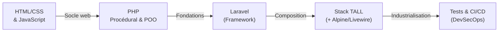

# Dev Web & Cloud

!!! quote "Analogie"
    _Si les fondamentaux IT sont les mathématiques de l'ingénieur, le développement web et le Cloud sont son atelier. C'est ici que le code prend vie, s'assemble en applications robustes et est finalement déployé dans des environnements conteneurisés et sécurisés._

!!! abstract "Résumé"
    Cette section monumentale couvre la conception logicielle (frontend/backend), son outillage (frameworks, bases de données), la validation de la qualité (tests) et la chaîne de livraison automatisée (CI/CD, Docker). Elle est pensée pour vous amener progressivement d'une simple page HTML jusqu'à une architecture TALL complète et testée.

!!! info "Transition vers la Cybersécurité"
    La partie **DevSecOps** présente dans cette section traite d'automatisation et de livraison sécurisée (CI/CD, secrets, Docker). Pour tout ce qui relève de la sécurité offensive (Pentest), défensive (Blue Team) ou de la conformité (GRC), dirigez-vous vers la section dédiée **Cybersécurité**.

 

---

## Architecture de la section

La progression proposée est pensée en couches superposées : on ne maîtrise un framework que si l'on maîtrise le langage sous-jacent, et on ne déploie proprement (DevSecOps) que si l'on sait de quoi l'application a besoin (Secrets, BDD).

-   :lucide-braces:{ .lg .middle } **Langages & Standards**

    ---

    **Périmètre** : De HTML5/CSS3 pour la structure et le style, jusqu'à JavaScript, Python et PHP en Programmation Orientée Objet (POO).

    [:octicons-arrow-right-24: Explorer les langages](./lang/index.md)

-   :lucide-blocks:{ .lg .middle } **Frameworks & Bibliothèques**

    ---

    **Périmètre** : Standardiser via **Laravel** (backend PHP), dynamiser avec **Alpine.js**, et asseoir une réactivité état-serveur poussée avec **Livewire**.

    [:octicons-arrow-right-24: Découvrir les frameworks](./frameworks/laravel/index.md)

-   :lucide-layers:{ .lg .middle } **Les Stacks Applicatives**

    ---

    **Périmètre** : Assembler les frameworks avec cohérence. Étude approfondie de la **Stack TALL** (Tailwind, Alpine, Laravel, Livewire) pour des applications modernes sans la lourdeur des SPA.

    [:octicons-arrow-right-24: Voir la Stack TALL](./stacks/index.md)

-   :lucide-database:{ .lg .middle } **Bases de Données**

    ---

    **Périmètre** : La persistance et les modèles d'accès aux données. De **SQLite** pour prototypage rapide à **MariaDB/PostgreSQL**, en passant par GraphQL et le NoSQL.

    [:octicons-arrow-right-24: Accéder aux données](./data/index.md)

-   :lucide-test-tube:{ .lg .middle } **Tests & Qualité**

    ---

    **Périmètre** : Pyramide des tests, approches TDD/BDD. Outillage concret avec **PHPUnit**, **Pest** (Backend), ainsi que **Vitest** et **Cypress** (Frontend & E2E).

    [:octicons-arrow-right-24: Améliorer la qualité](./tests-qualite/index.md)

-   :lucide-rocket:{ .lg .middle } **DevSecOps (Livraison)**

    ---

    **Périmètre** : Automatiser la livraison : **CI/CD** (GitHub/GitLab Actions), standardisation via **Docker/Compose** et gestion sécurisée des mots de passe & **Secrets** (Vault).

    [:octicons-arrow-right-24: Déployer l'application](./devsecops/index.md)

 

---

## Ordre d'apprentissage recommandé

Pour un apprentissage optimal du développement web backend, il est vivement conseillé de procéder par l'assimilation du **langage natif avant le framework**.

 

---

## Conclusion

!!! quote "Conclusion"
    _Le développement d'aujourd'hui ne se limite plus à écrire du code source. C'est concevoir des socles maintenables (POO), les consolider dans des composants (Laravel/Livewire), garantir que rien ne casse (Tests Unitaires & End-to-End) et pouvoir emballer l'ensemble pour une livraison fluide, instantanée et imperméable (Docker et CI/CD). C'est ce cycle entier de l'ingénierie logicielle que vous allez parcourir ici._

 
