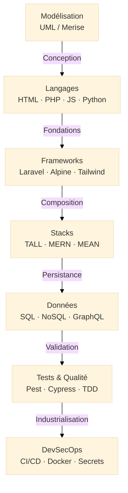

# Dev Web & Cloud

!!! quote "Analogie"
    _Si les fondamentaux IT sont les mathématiques de l'ingénieur, le développement web et le Cloud sont son atelier. C'est ici que le code prend vie, s'assemble en applications robustes et est finalement déployé dans des environnements scalables, sécurisés et maintenables._

!!! abstract "Résumé"
    Cette section couvre l'intégralité du cycle de vie d'une application moderne : de la modélisation conceptuelle (UML, Merise) à la livraison automatisée (CI/CD, Docker), en passant par les langages, les frameworks, les stacks applicatives, les bases de données, le mobile et la qualité des tests. Elle est pensée pour vous amener progressivement d'une simple page HTML jusqu'à une architecture TALL complète, testée et déployée en production.

!!! info "Périmètre DevSecOps"
    La partie **DevSecOps** présente dans cette section traite d'automatisation et de livraison sécurisée (CI/CD, secrets, conteneurs). Pour tout ce qui relève de la sécurité offensive (Pentest), défensive (Blue Team) ou de la conformité (GRC), dirigez-vous vers la section **Cybersécurité**.

 

---

## Architecture de la section

La progression proposée est pensée en couches superposées : on ne maîtrise pas un framework sans connaître le langage sous-jacent, et on ne déploie pas proprement sans comprendre l'architecture de ce que l'on livre.

-   :lucide-workflow:{ .lg .middle } **Modélisation**

    ---

    **Périmètre** : Concevoir avant de coder. Diagrammes **UML** (classes, séquences, cas d'utilisation) et méthode **Merise** (MCD, MLD) pour structurer vos données et vos processus.

    [:octicons-arrow-right-24: Modéliser un projet](./modelisation/index.md)

-   :lucide-braces:{ .lg .middle } **Langages & Standards**

    ---

    **Périmètre** : **HTML5/CSS3** pour la structure et le style, **JavaScript** et **TypeScript** côté client, **PHP** (procédural et POO), **Python** et **Go** côté serveur.

    [:octicons-arrow-right-24: Explorer les langages](./lang/index.md)

-   :lucide-blocks:{ .lg .middle } **Frameworks & Bibliothèques**

    ---

    **Périmètre** : **Laravel** (backend PHP), **Alpine.js** (réactivité légère), **Livewire** (état serveur), **Tailwind CSS** (design utilitaire), **Astro** (sites statiques).

    [:octicons-arrow-right-24: Découvrir les frameworks](./frameworks/index.md)

-   :lucide-layers:{ .lg .middle } **Stacks Applicatives**

    ---

    **Périmètre** : Assembler les frameworks avec cohérence. **Stack TALL** (Tailwind, Alpine, Laravel, Livewire), **MERN** et **MEAN** pour des applications JavaScript full-stack.

    [:octicons-arrow-right-24: Voir les stacks](./stacks/index.md)

-   :lucide-smartphone:{ .lg .middle } **Développement Mobile**

    ---

    **Périmètre** : Applications natives Apple avec **Swift** et **SwiftUI**, backend mobile avec **Vapor** (Swift côté serveur).

    [:octicons-arrow-right-24: Développer pour mobile](./mobile/index.md)

-   :lucide-database:{ .lg .middle } **Bases de Données**

    ---

    **Périmètre** : **SQL** (fondamentaux), **SQLite** (prototypage), **PostgreSQL** et **MariaDB** (production), **NoSQL** (MongoDB), **GraphQL** (API de données modernes).

    [:octicons-arrow-right-24: Accéder aux données](./data/index.md)

-   :lucide-cloud:{ .lg .middle } **Cloud**

    ---

    **Périmètre** : Hébergement et services managés. Introduction aux plateformes **AWS** et **Azure** : compute, stockage, réseaux et gestion des identités (IAM).

    [:octicons-arrow-right-24: Explorer le Cloud](./cloud/index.md)

-   :lucide-building-2:{ .lg .middle } **Architecture Logicielle**

    ---

    **Périmètre** : **API REST** (conception et bonnes pratiques), **Clean Architecture** (séparation des responsabilités), et **Patterns** pratiques (Repository, Service Layer, SOLID).

    [:octicons-arrow-right-24: Concevoir l'architecture](./architecture/index.md)

-   :lucide-test-tube:{ .lg .middle } **Tests & Qualité**

    ---

    **Périmètre** : Pyramide des tests, **TDD/BDD**, **SAST/DAST**. Outillage : **PHPUnit**, **Pest** (backend), **Vitest**, **Jest**, **Cypress** (frontend & E2E), couverture de code et fuzzing.

    [:octicons-arrow-right-24: Améliorer la qualité](./tests-qualite/index.md)

-   :lucide-rocket:{ .lg .middle } **DevSecOps (Livraison)**

    ---

    **Périmètre** : **CI/CD** (GitHub/GitLab Actions), **Docker & Compose**, **IaC** (Infrastructure as Code), gestion sécurisée des **Secrets** (Vault), **AppSec** et observabilité.

    [:octicons-arrow-right-24: Déployer l'application](./devsecops/index.md)

 

---

## Ordre d'apprentissage recommandé

Pour un apprentissage optimal, il est conseillé de suivre la progression naturelle : concevoir avant de coder, maîtriser le langage avant le framework, et industrialiser en dernier.

<small>*Progression recommandée : de la modélisation conceptuelle jusqu'au déploiement automatisé. Le développement mobile (Swift/SwiftUI) et le Cloud (AWS/Azure) s'insèrent en parallèle une fois les fondations web maîtrisées.*</small>

 

---

## Conclusion

!!! quote "Le cycle complet de l'ingénierie logicielle"
    _Développer aujourd'hui ne se limite plus à écrire du code. C'est modéliser des structures (UML, Merise), les implémenter dans un langage maîtrisé (PHP, JavaScript, Swift), les composer en applications cohérentes (Laravel, TALL Stack), les ancrer dans des données fiables (SQL, NoSQL), garantir qu'elles ne cassent pas (Tests, TDD) et les livrer avec confiance (Docker, CI/CD). C'est ce cycle entier — de la conception au déploiement — que cette section vous propose de parcourir._

 
