# Alpine.js

## Introduction

<div
  class="omny-meta"
  data-level="🟢 Débutant & 🟡 Intermédiaire"
  data-version="1.0"
  data-time="60-90 minutes">
</div>

!!! quote "Analogie pédagogique"
    _Imaginez que vous construisez une **maison intelligente**. Vue.js et React sont comme installer un **système domotique complet** avec serveur central, câblage complexe, et interface tactile - puissant mais nécessitant architecte et électricien. **Alpine.js est comme installer des interrupteurs connectés individuels** : vous les posez là où vous en avez besoin (attributs HTML), ils fonctionnent immédiatement (pas de build), et communiquent entre eux simplement (réactivité). Vous obtenez 80% des fonctionnalités avec 5% de la complexité._

> **Alpine.js** est un framework JavaScript réactif minimaliste créé en 2019 par **Caleb Porzio** (créateur de Livewire) avec un objectif simple : offrir la **réactivité de Vue.js** avec la **simplicité de jQuery**. Pesant seulement **15KB minifié + gzippé**, Alpine permet de créer des interfaces interactives directement dans le HTML avec une syntaxe déclarative inspirée de Vue.js, **sans aucune étape de compilation**.

Alpine.js est devenu le **framework de choix** pour ajouter de la réactivité à des applications traditionnelles (_Laravel_, _Rails_, _WordPress_) ou pour créer des composants interactifs légers sans infrastructure SPA. _GitHub_, _Laravel_ _Jetstream_, _Tailwind UI_, et des milliers d'applications l'utilisent quotidiennement. Sa philosophie "sprinkle JavaScript"[^1] en fait l'outil idéal pour **progressivement améliorer** une application sans réécrire tout le frontend.

!!! info "Pourquoi c'est important ?"
    Alpine.js permet de créer des **interfaces réactives modernes** sans build tools (Webpack, Vite), de maintenir la **simplicité du développement** traditionnel (HTML + JavaScript), d'ajouter de l'**interactivité ciblée** sans SPA complète, de **cohabiter harmonieusement** avec des frameworks backend, et d'obtenir des **performances excellentes** grâce à sa légèreté.

## Pour repartir des bases (vrais débutants)

Si vous n'avez jamais utilisé de framework JavaScript réactif, vous découvrirez qu'Alpine.js fonctionne comme **des attributs HTML magiques**. Vous ajoutez `x-data` pour créer un composant, `x-model` pour lier un input, `x-show` pour afficher/cacher - et **tout fonctionne immédiatement**. Pas de `npm install`, pas de configuration, pas de build. C'est comme si le HTML avait appris à **réagir aux interactions** utilisateur naturellement.

!!! tip "Alpine.js n'est pas jQuery"
    Alpine.js n'est **pas** jQuery avec une syntaxe différente. jQuery **manipule le DOM** impérativement (`$('#element').hide()`), Alpine.js **déclare l'état** et le DOM se met à jour automatiquement (`x-show="isVisible"`). Cette approche **déclarative** change fondamentalement la façon de concevoir les interfaces interactives.

## Philosophie Alpine.js

### Principes fondateurs

!!! quote "**Réactivité déclarative :** Alpine.js utilise une approche **déclarative** : vous déclarez **ce qui doit être affiché** selon l'état, pas **comment le manipuler**."

=== "❌ Approche impérative (jQuery)"

    ```html
    <!-- Code HTML -->
    <button id="toggle">Toggle</button>
    <div id="content" style="display: none;">Contenu</div>

    <!-- Code jQuery -->
    <script>
    $('#toggle').click(function() {
        $('#content').toggle();
    });
    </script>
    ```

=== "✅ Approche déclarative (Alpine.js)"

    ```html
    <!-- Code HTML  -->
    <div x-data="{ open: false }">
        <button @click="open = !open">Toggle</button>
        <div x-show="open">Contenu</div>
    </div>
    ```

!!! note "**Légèreté extrême :**"

    Alpine.js fait **15KB minifié + gzippé** contre :

    - Vue.js 3 : ~40KB
    - React + ReactDOM : ~130KB
    - Angular : ~150KB+

**Pas de build requis :**

```html
<!-- Installation via CDN - C'est tout ! -->
<script defer src="https://cdn.jsdelivr.net/npm/alpinejs@3.x.x/dist/cdn.min.js"></script>

<!-- Votre premier composant Alpine -->
<div x-data="{ count: 0 }">
    <button @click="count++">Incrémenter</button>
    <p x-text="count"></p>
</div>
```

**Syntaxe inspirée de Vue.js :**

| Alpine.js | Vue.js | Fonction |
|-----------|--------|----------|
| `x-data` | `data()` | État du composant |
| `x-model` | `v-model` | Binding bidirectionnel |
| `@click` | `@click` | Événements |
| `x-show` | `v-show` | Afficher/cacher (CSS) |
| `x-if` | `v-if` | Conditionnel (DOM) |
| `x-for` | `v-for` | Boucles |
| `x-text` | `{{ }}` | Afficher texte |

**Progressive enhancement :**

!!! quote "Alpine.js s'intègre **progressivement** dans une application existante."

```html
<!-- Page HTML traditionnelle -->
<form action="/submit" method="POST">
    <input name="email" type="email">
    <button>Envoyer</button>
</form>

<!-- Ajout Alpine.js SANS réécrire (validation côté client) -->
<form action="/submit" method="POST" 
      x-data="{ email: '', valid: false }"
      x-init="$watch('email', value => valid = /\S+@\S+/.test(value))">
    <input name="email" type="email" x-model="email">
    <button :disabled="!valid">Envoyer</button>
    <p x-show="email && !valid" class="error">Email invalide</p>
</form>
```

### Comparaison avec autres frameworks

```mermaid
graph LR
    A[Besoin interactivité] --> B{Complexité<br/>application ?}
    
    B -->|Simple<br/>Composants légers| C[Alpine.js<br/>15KB]
    B -->|Moyenne<br/>SPA simple| D[Vue.js<br/>40KB]
    B -->|Complexe<br/>SPA enterprise| E[React/Angular<br/>130KB+]
    
    C --> F[Pas de build<br/>HTML-first]
    D --> G[Build optionnel<br/>Flexible]
    E --> H[Build obligatoire<br/>Tooling lourd]
    
    style C fill:#e3ffe3
    style D fill:#fff3e3
    style E fill:#ffe3e3
```



| Critère | Alpine.js | Vue.js | React |
|---------|:---------:|:------:|:-----:|
| **Taille** | 15KB | 40KB | 130KB+ |
| **Build requis** | ❌ Non | ⚠️ Optionnel | ✅ Oui |
| **Courbe apprentissage** | 🟢 Faible | 🟡 Moyenne | 🔴 Élevée |
| **Cas d'usage** | Composants légers | SPA moyennes | SPA complexes |
| **Écosystème** | Plugins Alpine | Vue ecosystem | React ecosystem |
| **TypeScript** | ⚠️ Limité | ✅ Excellent | ✅ Excellent |
| **SSR** | ✅ Via backend | ✅ Nuxt.js | ✅ Next.js |

!!! tip "Quand choisir Alpine.js ?"
    **Utilisez Alpine.js si :**
    
    - Vous ajoutez de l'interactivité à une app existante (Laravel, Rails, WordPress)
    - Vous voulez éviter un build step (simplicité développement)
    - Vos composants sont **indépendants** (pas de gros état partagé)
    - Vous privilégiez **légèreté et performance**
    - Votre équipe préfère HTML-first plutôt que JavaScript-first

## Installation et premiers pas

### Installation via CDN (Recommandé pour débuter)

**Version stable actuelle :**

```html
<!DOCTYPE html>
<html lang="fr">
<head>
    <meta charset="UTF-8">
    <title>Alpine.js - Premiers Pas</title>
    
    <!-- Alpine.js via CDN -->
    <script defer src="https://cdn.jsdelivr.net/npm/alpinejs@3.x.x/dist/cdn.min.js"></script>
</head>
<body>
    <!-- Votre code Alpine ici -->
</body>
</html>
```

!!! danger "Attribut **`defer`** est **OBLIGATOIRE** pour que Alpine.js s'initialise après le chargement complet du DOM. Sans `defer`, Alpine pourrait s'exécuter avant que vos composants `x-data` ne soient présents dans le HTML."

**Versions disponibles :**

```html
<!-- Version 3.x (stable, recommandée) -->
<script defer src="https://cdn.jsdelivr.net/npm/alpinejs@3.x.x/dist/cdn.min.js"></script>

<!-- Version spécifique (production) -->
<script defer src="https://cdn.jsdelivr.net/npm/alpinejs@3.13.3/dist/cdn.min.js"></script>

<!-- Version avec plugins (focus, persist, etc.) -->
<script defer src="https://cdn.jsdelivr.net/npm/@alpinejs/focus@3.x.x/dist/cdn.min.js"></script>
<script defer src="https://cdn.jsdelivr.net/npm/alpinejs@3.x.x/dist/cdn.min.js"></script>
```

### Installation via NPM (Build tools)

**Si vous utilisez Vite, Webpack, ou autre bundler :**

```bash
# Installation
npm install alpinejs

# OU avec yarn
yarn add alpinejs

# OU avec pnpm
pnpm add alpinejs
```

**Fichier JavaScript d'entrée :**

```javascript
// resources/js/app.js
import Alpine from 'alpinejs';

// Exposer Alpine globalement (optionnel)
window.Alpine = Alpine;

// Démarrer Alpine
Alpine.start();
```

**Avec Vite (Laravel) :**

```javascript
// vite.config.js
import { defineConfig } from 'vite';
import laravel from 'laravel-vite-plugin';

export default defineConfig({
    plugins: [
        laravel({
            input: ['resources/css/app.css', 'resources/js/app.js'],
            refresh: true,
        }),
    ],
});
```

### Premier composant Alpine.js

**Compteur simple :**

```html
<div x-data="{ count: 0 }">
    <button @click="count++">Incrémenter</button>
    <button @click="count--">Décrémenter</button>
    <button @click="count = 0">Réinitialiser</button>
    
    <p>Compteur : <span x-text="count"></span></p>
</div>
```

**Ce qui se passe :**

1. **`x-data="{ count: 0 }"`** : Crée un composant avec état initial `count = 0`
2. **`@click="count++"`** : Écoute événement clic, incrémente `count`
3. **`x-text="count"`** : Affiche la valeur de `count` (réactif)
4. **Alpine détecte changement** → Met à jour le DOM automatiquement

!!! success "Félicitations ! - Vous venez de créer votre premier composant réactif sans configuration, sans build, sans npm !"

## Syntaxe fondamentale

### Directives x-data et x-init

**`x-data` : Créer un composant**

```html
<!-- État simple -->
<div x-data="{ open: false }">
    <!-- Composant -->
</div>

<!-- État complexe -->
<div x-data="{ 
    user: { name: 'Alice', age: 30 },
    items: ['A', 'B', 'C'],
    count: 0 
}">
    <!-- Composant -->
</div>

<!-- Fonction retournant l'état (recommandé pour composants réutilisables) -->
<div x-data="dropdown()">
    <!-- Composant -->
</div>

<script>
function dropdown() {
    return {
        open: false,
        toggle() {
            this.open = !this.open;
        }
    };
}
</script>
```

**`x-init` : Initialisation au montage**

```html
<div x-data="{ message: '' }" 
     x-init="message = 'Composant initialisé !'">
    <p x-text="message"></p>
</div>

<!-- Avec fonction asynchrone -->
<div x-data="{ data: null }" 
     x-init="data = await fetch('/api/data').then(r => r.json())">
    <pre x-text="JSON.stringify(data, null, 2)"></pre>
</div>

<!-- Multiples instructions -->
<div x-data="{ count: 0 }" 
     x-init="
        console.log('Composant monté');
        count = 10;
        $watch('count', value => console.log('Count:', value))
     ">
</div>
```

!!! tip "x-data sans état"
    Vous pouvez utiliser `x-data` **sans état** pour définir une portée pour les méthodes :
    
    ```html
    <div x-data="{ 
        greet() { 
            alert('Bonjour !'); 
        } 
    }">
        <button @click="greet()">Dire bonjour</button>
    </div>
    ```

### Affichage de données

**`x-text` : Afficher texte**

```html
<div x-data="{ name: 'Alice' }">
    <!-- Remplace le contenu texte -->
    <p x-text="name"></p>
    
    <!-- Expressions JavaScript -->
    <p x-text="'Bonjour, ' + name + ' !'"></p>
    
    <!-- Template literals -->
    <p x-text="`Bonjour, ${name} !`"></p>
    
    <!-- Opérations -->
    <p x-text="2 + 2"></p>
</div>
```

**`x-html` : Afficher HTML (⚠️ Attention XSS)**

```html
<div x-data="{ html: '<strong>Texte gras</strong>' }">
    <!-- Injecte HTML -->
    <div x-html="html"></div>
</div>
```

!!! danger "Sécurité XSS avec x-html"
    **N'utilisez JAMAIS `x-html` avec des données utilisateur** non échappées. Risque d'injection XSS critique.
    
    ```html
    <!-- ❌ DANGEREUX -->
    <div x-html="userInput"></div>
    
    <!-- ✅ SÛR : Échapper ou utiliser x-text -->
    <div x-text="userInput"></div>
    ```

**Interpolation dans attributs (`:` ou `x-bind:`) :**

```html
<div x-data="{ color: 'red', size: 20 }">
    <!-- Lier attribut style -->
    <p :style="`color: ${color}; font-size: ${size}px;`">
        Texte stylé
    </p>
    
    <!-- Lier attribut class -->
    <div :class="color">Classe dynamique</div>
    
    <!-- Lier attribut href -->
    <a :href="`/user/${userId}`">Profil</a>
    
    <!-- Raccourci : attribute sans x-bind -->
    
</div>
```

### Événements

**`@click` (x-on:click) : Écouter événements**

```html
<div x-data="{ count: 0 }">
    <!-- Syntaxe courte (recommandée) -->
    <button @click="count++">Clic simple</button>
    
    <!-- Syntaxe longue -->
    <button x-on:click="count++">Clic</button>
    
    <!-- Appeler méthode -->
    <button @click="increment()">Incrémenter</button>
    
    <!-- Passer paramètres -->
    <button @click="add(5)">Ajouter 5</button>
    
    <!-- Expressions complexes -->
    <button @click="count > 10 ? count = 0 : count++">
        Toggle ou incrémenter
    </button>
</div>

<script>
function counter() {
    return {
        count: 0,
        increment() {
            this.count++;
        },
        add(value) {
            this.count += value;
        }
    };
}
</script>
```

**Modificateurs d'événements :**

```html
<div x-data="{ }">
    <!-- Empêcher comportement par défaut -->
    <form @submit.prevent="handleSubmit()">
        <button>Soumettre</button>
    </form>
    
    <!-- Arrêter propagation -->
    <div @click="outer()">
        <button @click.stop="inner()">
            Clic inner uniquement
        </button>
    </div>
    
    <!-- Événement une seule fois -->
    <button @click.once="initialize()">
        Initialiser (1 fois)
    </button>
    
    <!-- Événement sur window -->
    <div @resize.window="handleResize()">
        Redimensionner fenêtre
    </div>
    
    <!-- Événement sur document -->
    <div @keydown.escape.document="close()">
        ESC pour fermer
    </div>
    
    <!-- Combinaisons de touches -->
    <input @keydown.ctrl.enter="submit()">
    
    <!-- Debounce (attendre 500ms) -->
    <input @input.debounce.500ms="search($event.target.value)">
    
    <!-- Throttle (max 1 fois par seconde) -->
    <div @scroll.throttle.1s="handleScroll()">
</div>
```

**Événements clavier :**

```html
<div x-data="{ }">
    <!-- Touche spécifique -->
    <input @keydown.enter="submit()">
    <input @keydown.escape="cancel()">
    <input @keydown.space="play()">
    <input @keydown.arrow-down="next()">
    
    <!-- Modificateurs -->
    <input @keydown.ctrl.s.prevent="save()">
    <input @keydown.shift.tab="previousField()">
</div>
```

### Binding bidirectionnel

**`x-model` : Lier input ↔ état**

```html
<div x-data="{ 
    text: '', 
    number: 0, 
    checked: false,
    selected: '',
    items: []
}">
    <!-- Input texte -->
    <input type="text" x-model="text">
    <p>Vous avez tapé : <span x-text="text"></span></p>
    
    <!-- Input number -->
    <input type="number" x-model.number="number">
    <p>Valeur numérique : <span x-text="number"></span></p>
    
    <!-- Checkbox -->
    <input type="checkbox" x-model="checked">
    <p x-show="checked">Case cochée !</p>
    
    <!-- Radio -->
    <input type="radio" value="A" x-model="selected"> A
    <input type="radio" value="B" x-model="selected"> B
    <p x-text="'Sélectionné : ' + selected"></p>
    
    <!-- Select -->
    <select x-model="selected">
        <option value="">Choisir...</option>
        <option value="option1">Option 1</option>
        <option value="option2">Option 2</option>
    </select>
    
    <!-- Select multiple -->
    <select multiple x-model="items">
        <option value="A">A</option>
        <option value="B">B</option>
        <option value="C">C</option>
    </select>
    <p x-text="items.join(', ')"></p>
    
    <!-- Textarea -->
    <textarea x-model="text"></textarea>
</div>
```

**Modificateurs x-model :**

```html
<div x-data="{ value: '' }">
    <!-- Sync au change (pas keypress) -->
    <input x-model.lazy="value">
    
    <!-- Convertir en number -->
    <input x-model.number="value">
    
    <!-- Trim espaces -->
    <input x-model.trim="value">
    
    <!-- Debounce 500ms -->
    <input x-model.debounce.500ms="value">
    
    <!-- Throttle 1s -->
    <input x-model.throttle.1s="value">
</div>
```

### Affichage conditionnel

**`x-show` : Afficher/cacher (CSS display)**

```html
<div x-data="{ open: false }">
    <button @click="open = !open">Toggle</button>
    
    <!-- x-show modifie display: none/block -->
    <div x-show="open">
        Contenu visible si open=true
    </div>
    
    <!-- Avec transition -->
    <div x-show="open" 
         x-transition>
        Apparition avec animation
    </div>
</div>
```

**`x-if` : Conditionnel (ajouter/retirer du DOM)**

```html
<div x-data="{ show: false }">
    <button @click="show = !show">Toggle</button>
    
    <!-- x-if RETIRE l'élément du DOM -->
    <template x-if="show">
        <div>Contenu conditionnel</div>
    </template>
    
    <!-- Avec x-else (Alpine 3.13+) -->
    <template x-if="count > 10">
        <p>Plus de 10</p>
    </template>
    <template x-else>
        <p>10 ou moins</p>
    </template>
</div>
```

!!! info "x-show vs x-if"
    **`x-show`** : Élément reste dans DOM (display: none)
    - ✅ Performance : Pas de re-render
    - ✅ État conservé (ex: position scroll)
    - ❌ Élément chargé même si caché
    
    **`x-if`** : Élément ajouté/retiré du DOM
    - ✅ DOM allégé si non affiché
    - ✅ Pas de charge initiale si false
    - ❌ Re-render à chaque toggle
    - ❌ État perdu (ex: input vidé)

### Boucles

**`x-for` : Itérer sur tableau**

```html
<div x-data="{ 
    items: ['Pomme', 'Banane', 'Orange'],
    users: [
        { id: 1, name: 'Alice' },
        { id: 2, name: 'Bob' }
    ]
}">
    <!-- Boucle simple -->
    <template x-for="item in items">
        <li x-text="item"></li>
    </template>
    
    <!-- Avec key (OBLIGATOIRE pour performance) -->
    <template x-for="user in users" :key="user.id">
        <div>
            <p x-text="user.name"></p>
        </div>
    </template>
    
    <!-- Avec index -->
    <template x-for="(item, index) in items" :key="index">
        <li x-text="`${index + 1}. ${item}`"></li>
    </template>
    
    <!-- Sur objet -->
    <template x-for="(value, key) in { a: 1, b: 2, c: 3 }">
        <p x-text="`${key}: ${value}`"></p>
    </template>
    
    <!-- Sur range (1 à 10) -->
    <template x-for="i in 10" :key="i">
        <span x-text="i"></span>
    </template>
</div>
```

!!! danger "Attribut :key OBLIGATOIRE"
    **Toujours fournir `:key` unique** dans `x-for` pour que Alpine puisse identifier chaque élément et optimiser les mises à jour.
    
    ```html
    <!-- ❌ MAUVAIS : Pas de key -->
    <template x-for="item in items">
        <li x-text="item"></li>
    </template>
    
    <!-- ✅ BON : Key unique -->
    <template x-for="item in items" :key="item.id">
        <li x-text="item.name"></li>
    </template>
    ```

### Classes et styles dynamiques

**Lier classes CSS :**

```html
<div x-data="{ 
    active: true, 
    error: false,
    size: 'large' 
}">
    <!-- Classe conditionnelle simple -->
    <div :class="active ? 'bg-blue-500' : 'bg-gray-300'">
        Fond bleu si active
    </div>
    
    <!-- Objet de classes -->
    <div :class="{
        'text-red-500': error,
        'text-green-500': !error,
        'font-bold': active
    }">
        Texte conditionnel
    </div>
    
    <!-- Array de classes -->
    <div :class="['base-class', active && 'active', size]">
        Classes mixtes
    </div>
    
    <!-- Combiner classes statiques et dynamiques -->
    <div class="p-4 rounded" :class="{ 'bg-blue-500': active }">
        Classes fixes + conditionnelles
    </div>
</div>
```

**Lier styles CSS :**

```html
<div x-data="{ 
    color: 'red', 
    size: 20,
    width: 50 
}">
    <!-- Style inline dynamique -->
    <p :style="`color: ${color}; font-size: ${size}px;`">
        Texte stylé
    </p>
    
    <!-- Objet de styles -->
    <div :style="{
        color: color,
        fontSize: size + 'px',
        width: width + '%'
    }">
        Styles objets
    </div>
</div>
```

## Syntaxe avancée

### Méthodes et computed properties

**Définir méthodes :**

```html
<div x-data="{
    count: 0,
    
    // Méthode simple
    increment() {
        this.count++;
    },
    
    // Méthode avec paramètre
    add(value) {
        this.count += value;
    },
    
    // Méthode avec logique
    reset() {
        if (confirm('Réinitialiser ?')) {
            this.count = 0;
        }
    }
}">
    <button @click="increment()">+1</button>
    <button @click="add(5)">+5</button>
    <button @click="reset()">Reset</button>
    <p x-text="count"></p>
</div>
```

**Getters (computed) :**

```html
<div x-data="{
    firstName: 'John',
    lastName: 'Doe',
    
    // Getter : propriété calculée
    get fullName() {
        return this.firstName + ' ' + this.lastName;
    },
    
    items: [1, 2, 3, 4, 5],
    
    get total() {
        return this.items.reduce((sum, n) => sum + n, 0);
    }
}">
    <p x-text="fullName"></p>
    <p x-text="`Total: ${total}`"></p>
</div>
```

### Watchers

**`$watch` : Observer changements**

```html
<div x-data="{ 
    search: '',
    results: []
}" 
x-init="
    $watch('search', value => {
        console.log('Search changed:', value);
        // Appeler API...
    })
">
    <input x-model="search" placeholder="Rechercher...">
</div>
```

**Watcher avec ancienne valeur :**

```html
<div x-data="{ count: 0 }" 
x-init="
    $watch('count', (value, oldValue) => {
        console.log(`Changed from ${oldValue} to ${value}`);
    })
">
    <button @click="count++">Incrémenter</button>
    <p x-text="count"></p>
</div>
```

**Watcher sur objet imbriqué :**

```html
<div x-data="{ 
    user: { name: 'Alice', age: 30 } 
}" 
x-init="
    $watch('user.age', value => {
        console.log('Age changed:', value);
    })
">
    <button @click="user.age++">Vieillir</button>
</div>
```

### Refs (Accès direct au DOM)

**`x-ref` et `$refs` :**

```html
<div x-data="{ }">
    <!-- Référencer élément -->
    <input x-ref="email" type="email">
    
    <!-- Accéder via $refs -->
    <button @click="$refs.email.focus()">
        Focus sur email
    </button>
    
    <button @click="console.log($refs.email.value)">
        Afficher valeur
    </button>
</div>
```

**Cas d'usage typiques :**

```html
<div x-data="{ }">
    <!-- Auto-focus -->
    <input x-ref="search" 
           x-init="$refs.search.focus()" 
           type="text">
    
    <!-- Scroll programmatique -->
    <div x-ref="container" style="overflow: auto; height: 200px;">
        <!-- Contenu long -->
    </div>
    <button @click="$refs.container.scrollTop = 0">
        Haut de page
    </button>
    
    <!-- Canvas manipulation -->
    <canvas x-ref="canvas" width="400" height="300"></canvas>
    <button @click="
        let ctx = $refs.canvas.getContext('2d');
        ctx.fillRect(0, 0, 100, 100);
    ">Dessiner</button>
</div>
```

### Transitions et animations

**Transitions simples :**

```html
<div x-data="{ open: false }">
    <button @click="open = !open">Toggle</button>
    
    <!-- Transition automatique -->
    <div x-show="open" x-transition>
        Contenu avec fade in/out
    </div>
</div>
```

**Transitions personnalisées :**

```html
<div x-data="{ open: false }">
    <button @click="open = !open">Toggle</button>
    
    <!-- Durées personnalisées -->
    <div x-show="open" 
         x-transition:enter="transition ease-out duration-300"
         x-transition:enter-start="opacity-0 transform scale-90"
         x-transition:enter-end="opacity-100 transform scale-100"
         x-transition:leave="transition ease-in duration-300"
         x-transition:leave-start="opacity-100 transform scale-100"
         x-transition:leave-end="opacity-0 transform scale-90">
        Transition complète
    </div>
    
    <!-- Raccourci -->
    <div x-show="open"
         x-transition.duration.500ms
         x-transition.scale.80>
        Transition raccourcie
    </div>
</div>
```

**Animations CSS personnalisées :**

```html
<style>
@keyframes slideIn {
    from {
        transform: translateX(-100%);
        opacity: 0;
    }
    to {
        transform: translateX(0);
        opacity: 1;
    }
}

.slide-in {
    animation: slideIn 0.3s ease-out;
}
</style>

<div x-data="{ show: false }">
    <button @click="show = !show">Toggle</button>
    
    <div x-show="show" class="slide-in">
        Animation CSS personnalisée
    </div>
</div>
```

### Composants réutilisables

**Fonction factory pattern :**

```html
<!-- Composant dropdown réutilisable -->
<script>
function dropdown() {
    return {
        open: false,
        
        toggle() {
            this.open = !this.open;
        },
        
        close() {
            this.open = false;
        },
        
        // Fermer en cliquant dehors
        init() {
            this.$watch('open', value => {
                if (value) {
                    document.addEventListener('click', this.clickAway.bind(this));
                } else {
                    document.removeEventListener('click', this.clickAway.bind(this));
                }
            });
        },
        
        clickAway(e) {
            if (!this.$el.contains(e.target)) {
                this.close();
            }
        }
    };
}
</script>

<!-- Utilisation multiple -->
<div x-data="dropdown()">
    <button @click="toggle()">Menu 1</button>
    <div x-show="open" x-transition>Contenu menu 1</div>
</div>

<div x-data="dropdown()">
    <button @click="toggle()">Menu 2</button>
    <div x-show="open" x-transition>Contenu menu 2</div>
</div>
```

**Alpine.data() pour composants globaux :**

```html
<script>
// Définir composant global
document.addEventListener('alpine:init', () => {
    Alpine.data('dropdown', () => ({
        open: false,
        toggle() {
            this.open = !this.open;
        }
    }));
    
    Alpine.data('tabs', (defaultTab = 0) => ({
        active: defaultTab,
        select(index) {
            this.active = index;
        }
    }));
});
</script>

<!-- Utilisation -->
<div x-data="dropdown">
    <button @click="toggle()">Toggle</button>
    <div x-show="open">Contenu</div>
</div>

<div x-data="tabs(1)">
    <button @click="select(0)" :class="{ 'active': active === 0 }">Tab 1</button>
    <button @click="select(1)" :class="{ 'active': active === 1 }">Tab 2</button>
</div>
```

### Magic properties

**`$el` : Élément DOM actuel**

```html
<div x-data="{ }">
    <button @click="$el.classList.add('clicked')">
        Ajouter classe au bouton
    </button>
    
    <div @click="console.log($el)">
        Afficher élément dans console
    </div>
</div>
```

**`$refs` : Références DOM**

```html
<div x-data="{ }">
    <input x-ref="username">
    <button @click="$refs.username.focus()">Focus</button>
</div>
```

**`$event` : Objet événement**

```html
<div x-data="{ }">
    <input @input="console.log($event.target.value)">
    
    <div @click="console.log($event.clientX, $event.clientY)">
        Cliquer pour voir coordonnées
    </div>
</div>
```

**`$dispatch` : Émettre événements personnalisés**

```html
<div x-data="{ }" 
     @custom-event="console.log('Event reçu:', $event.detail)">
    
    <button @click="$dispatch('custom-event', { message: 'Hello' })">
        Émettre événement
    </button>
</div>
```

**`$watch` : Observer propriétés**

```html
<div x-data="{ count: 0 }" 
     x-init="$watch('count', value => console.log(value))">
    <button @click="count++">Incrémenter</button>
</div>
```

**`$nextTick` : Attendre prochain cycle DOM**

```html
<div x-data="{ message: 'Hello' }">
    <button @click="
        message = 'Updated';
        $nextTick(() => {
            // DOM déjà mis à jour ici
            console.log('DOM updated');
        })
    ">Update</button>
    <p x-text="message"></p>
</div>
```

**`$root` : Racine du composant**

```html
<div x-data="{ count: 0 }">
    <div>
        <div>
            <button @click="$root.count++">
                Incrémenter depuis imbriqué
            </button>
        </div>
    </div>
    <p x-text="count"></p>
</div>
```

## Plugins officiels

### Plugin Persist (Stockage local)

**Installation :**

```html
<script defer src="https://cdn.jsdelivr.net/npm/@alpinejs/persist@3.x.x/dist/cdn.min.js"></script>
<script defer src="https://cdn.jsdelivr.net/npm/alpinejs@3.x.x/dist/cdn.min.js"></script>
```

**Usage :**

```html
<div x-data="{ 
    count: $persist(0),
    theme: $persist('light')
}">
    <!-- count et theme sauvegardés dans localStorage -->
    <button @click="count++">Incrémenter (persisté)</button>
    <p x-text="count"></p>
    
    <button @click="theme = theme === 'light' ? 'dark' : 'light'">
        Toggle thème
    </button>
</div>
```

**Personnalisation :**

```html
<div x-data="{ 
    count: $persist(0).as('counter-value'),
    user: $persist({}).using(sessionStorage)
}">
    <!-- Clé personnalisée + sessionStorage -->
</div>
```

### Plugin Focus (Gestion focus)

**Installation :**

```html
<script defer src="https://cdn.jsdelivr.net/npm/@alpinejs/focus@3.x.x/dist/cdn.min.js"></script>
<script defer src="https://cdn.jsdelivr.net/npm/alpinejs@3.x.x/dist/cdn.min.js"></script>
```

**Usage :**

```html
<!-- Piège focus dans modal -->
<div x-data="{ open: false }">
    <button @click="open = true">Ouvrir modal</button>
    
    <div x-show="open" x-trap="open">
        <input type="text">
        <button @click="open = false">Fermer</button>
    </div>
</div>
```

### Plugin Collapse (Animation hauteur)

**Installation :**

```html
<script defer src="https://cdn.jsdelivr.net/npm/@alpinejs/collapse@3.x.x/dist/cdn.min.js"></script>
<script defer src="https://cdn.jsdelivr.net/npm/alpinejs@3.x.x/dist/cdn.min.js"></script>
```

**Usage :**

```html
<div x-data="{ open: false }">
    <button @click="open = !open">Toggle</button>
    
    <!-- Animation hauteur automatique -->
    <div x-show="open" x-collapse>
        Contenu avec animation hauteur fluide
    </div>
</div>
```

### Plugin Intersect (Intersection Observer)

**Installation :**

```html
<script defer src="https://cdn.jsdelivr.net/npm/@alpinejs/intersect@3.x.x/dist/cdn.min.js"></script>
<script defer src="https://cdn.jsdelivr.net/npm/alpinejs@3.x.x/dist/cdn.min.js"></script>
```

**Usage :**

```html
<!-- Lazy loading images -->


<!-- Apparition au scroll -->
<div x-data="{ visible: false }" 
     x-intersect="visible = true"
     x-show="visible" 
     x-transition>
    Apparaît au scroll
</div>

<!-- Une seule fois -->
<div x-intersect.once="console.log('Visible !')">
    Trigger une fois
</div>
```

## Cas d'usage pratiques

### Formulaire avec validation

```html
<div x-data="{
    email: '',
    password: '',
    errors: {},
    
    validate() {
        this.errors = {};
        
        if (!this.email || !this.email.includes('@')) {
            this.errors.email = 'Email invalide';
        }
        
        if (this.password.length < 8) {
            this.errors.password = 'Mot de passe trop court (min 8)';
        }
        
        return Object.keys(this.errors).length === 0;
    },
    
    async submit() {
        if (!this.validate()) return;
        
        try {
            const response = await fetch('/api/login', {
                method: 'POST',
                headers: { 'Content-Type': 'application/json' },
                body: JSON.stringify({
                    email: this.email,
                    password: this.password
                })
            });
            
            if (response.ok) {
                window.location = '/dashboard';
            } else {
                this.errors.form = 'Identifiants incorrects';
            }
        } catch (e) {
            this.errors.form = 'Erreur réseau';
        }
    }
}">
    <form @submit.prevent="submit()">
        <div>
            <input type="email" 
                   x-model="email" 
                   placeholder="Email"
                   :class="{ 'border-red-500': errors.email }">
            <p x-show="errors.email" 
               x-text="errors.email" 
               class="text-red-500 text-sm"></p>
        </div>
        
        <div>
            <input type="password" 
                   x-model="password" 
                   placeholder="Mot de passe"
                   :class="{ 'border-red-500': errors.password }">
            <p x-show="errors.password" 
               x-text="errors.password" 
               class="text-red-500 text-sm"></p>
        </div>
        
        <p x-show="errors.form" 
           x-text="errors.form" 
           class="text-red-500"></p>
        
        <button type="submit">Se connecter</button>
    </form>
</div>
```

### Liste avec filtres et tri

```html
<div x-data="{
    items: [
        { id: 1, name: 'Produit A', category: 'cat1', price: 10 },
        { id: 2, name: 'Produit B', category: 'cat2', price: 20 },
        { id: 3, name: 'Produit C', category: 'cat1', price: 15 }
    ],
    
    search: '',
    category: 'all',
    sortBy: 'name',
    sortAsc: true,
    
    get filtered() {
        let result = this.items;
        
        // Filtre recherche
        if (this.search) {
            result = result.filter(item => 
                item.name.toLowerCase().includes(this.search.toLowerCase())
            );
        }
        
        // Filtre catégorie
        if (this.category !== 'all') {
            result = result.filter(item => item.category === this.category);
        }
        
        // Tri
        result = [...result].sort((a, b) => {
            let aVal = a[this.sortBy];
            let bVal = b[this.sortBy];
            
            if (aVal < bVal) return this.sortAsc ? -1 : 1;
            if (aVal > bVal) return this.sortAsc ? 1 : -1;
            return 0;
        });
        
        return result;
    }
}">
    <!-- Filtres -->
    <div>
        <input x-model="search" placeholder="Rechercher...">
        
        <select x-model="category">
            <option value="all">Toutes catégories</option>
            <option value="cat1">Catégorie 1</option>
            <option value="cat2">Catégorie 2</option>
        </select>
        
        <select x-model="sortBy">
            <option value="name">Nom</option>
            <option value="price">Prix</option>
        </select>
        
        <button @click="sortAsc = !sortAsc">
            <span x-text="sortAsc ? '↑' : '↓'"></span>
        </button>
    </div>
    
    <!-- Liste -->
    <div>
        <template x-for="item in filtered" :key="item.id">
            <div>
                <h3 x-text="item.name"></h3>
                <p x-text="`${item.price}€`"></p>
            </div>
        </template>
        
        <p x-show="filtered.length === 0">Aucun résultat</p>
    </div>
</div>
```

### Onglets (Tabs)

```html
<div x-data="{ active: 'tab1' }">
    <!-- Navigation -->
    <div role="tablist">
        <button @click="active = 'tab1'" 
                :class="{ 'active': active === 'tab1' }"
                role="tab">
            Onglet 1
        </button>
        <button @click="active = 'tab2'" 
                :class="{ 'active': active === 'tab2' }"
                role="tab">
            Onglet 2
        </button>
        <button @click="active = 'tab3'" 
                :class="{ 'active': active === 'tab3' }"
                role="tab">
            Onglet 3
        </button>
    </div>
    
    <!-- Contenu -->
    <div role="tabpanel" x-show="active === 'tab1'" x-transition>
        Contenu onglet 1
    </div>
    <div role="tabpanel" x-show="active === 'tab2'" x-transition>
        Contenu onglet 2
    </div>
    <div role="tabpanel" x-show="active === 'tab3'" x-transition>
        Contenu onglet 3
    </div>
</div>
```

### Modal

```html
<div x-data="{ open: false }">
    <button @click="open = true">Ouvrir modal</button>
    
    <!-- Backdrop -->
    <div x-show="open" 
         @click="open = false"
         x-transition:enter="ease-out duration-300"
         x-transition:enter-start="opacity-0"
         x-transition:enter-end="opacity-100"
         x-transition:leave="ease-in duration-200"
         x-transition:leave-start="opacity-100"
         x-transition:leave-end="opacity-0"
         class="fixed inset-0 bg-black bg-opacity-50 z-40">
    </div>
    
    <!-- Modal -->
    <div x-show="open"
         x-trap="open"
         @keydown.escape.window="open = false"
         x-transition:enter="ease-out duration-300"
         x-transition:enter-start="opacity-0 translate-y-4"
         x-transition:enter-end="opacity-100 translate-y-0"
         x-transition:leave="ease-in duration-200"
         x-transition:leave-start="opacity-100 translate-y-0"
         x-transition:leave-end="opacity-0 translate-y-4"
         class="fixed inset-0 z-50 flex items-center justify-center p-4">
        
        <div @click.stop class="bg-white rounded-lg p-6 max-w-md w-full">
            <h2 class="text-xl font-bold mb-4">Titre modal</h2>
            <p class="mb-4">Contenu de la modal</p>
            <button @click="open = false">Fermer</button>
        </div>
    </div>
</div>
```

### Accordéon

```html
<div x-data="{ active: null }">
    <!-- Item 1 -->
    <div>
        <button @click="active = active === 1 ? null : 1">
            <span>Section 1</span>
            <span x-text="active === 1 ? '−' : '+'"></span>
        </button>
        <div x-show="active === 1" 
             x-collapse>
            Contenu section 1
        </div>
    </div>
    
    <!-- Item 2 -->
    <div>
        <button @click="active = active === 2 ? null : 2">
            <span>Section 2</span>
            <span x-text="active === 2 ? '−' : '+'"></span>
        </button>
        <div x-show="active === 2" 
             x-collapse>
            Contenu section 2
        </div>
    </div>
    
    <!-- Item 3 -->
    <div>
        <button @click="active = active === 3 ? null : 3">
            <span>Section 3</span>
            <span x-text="active === 3 ? '−' : '+'"></span>
        </button>
        <div x-show="active === 3" 
             x-collapse>
            Contenu section 3
        </div>
    </div>
</div>
```

### Infinite scroll

```html
<div x-data="{
    items: Array.from({ length: 20 }, (_, i) => `Item ${i + 1}`),
    page: 1,
    loading: false,
    
    async loadMore() {
        if (this.loading) return;
        
        this.loading = true;
        
        // Simuler chargement API
        await new Promise(r => setTimeout(r, 1000));
        
        this.page++;
        const newItems = Array.from(
            { length: 20 }, 
            (_, i) => `Item ${this.page * 20 + i + 1}`
        );
        
        this.items.push(...newItems);
        this.loading = false;
    }
}">
    <div>
        <template x-for="item in items" :key="item">
            <div x-text="item"></div>
        </template>
        
        <!-- Trigger infinite scroll -->
        <div x-intersect="loadMore()">
            <p x-show="loading">Chargement...</p>
        </div>
    </div>
</div>
```

## Bonnes pratiques

### Organisation du code

**❌ MAUVAIS : Tout dans x-data**

```html
<div x-data="{
    // 200 lignes de code ici...
    method1() { },
    method2() { },
    // ...
}">
```

**✅ BON : Factory functions**

```html
<script>
function todoApp() {
    return {
        todos: [],
        newTodo: '',
        
        addTodo() {
            if (this.newTodo.trim()) {
                this.todos.push({
                    id: Date.now(),
                    text: this.newTodo,
                    done: false
                });
                this.newTodo = '';
            }
        },
        
        removeTodo(id) {
            this.todos = this.todos.filter(t => t.id !== id);
        }
    };
}
</script>

<div x-data="todoApp()">
    <!-- Composant -->
</div>
```

### Performance

**Utiliser x-show vs x-if intelligemment :**

```html
<!-- ✅ x-show pour toggles fréquents -->
<div x-show="open">Contenu togglé souvent</div>

<!-- ✅ x-if pour contenu rarement affiché -->
<template x-if="isPremiumUser">
    <div>Fonctionnalités premium lourdes</div>
</template>
```

**Toujours fournir :key dans x-for :**

```html
<!-- ❌ MAUVAIS -->
<template x-for="item in items">
    <li x-text="item"></li>
</template>

<!-- ✅ BON -->
<template x-for="item in items" :key="item.id">
    <li x-text="item.name"></li>
</template>
```

**Debounce les événements coûteux :**

```html
<!-- Recherche API debounced -->
<input x-model="search" 
       @input.debounce.500ms="searchAPI()">

<!-- Scroll throttled -->
<div @scroll.throttle.100ms="handleScroll()">
```

### Accessibilité

**ARIA et rôles :**

```html
<!-- Bouton toggle avec ARIA -->
<button @click="open = !open" 
        :aria-expanded="open"
        aria-controls="menu">
    Menu
</button>

<div id="menu" 
     x-show="open" 
     role="menu">
    <button role="menuitem">Item 1</button>
    <button role="menuitem">Item 2</button>
</div>
```

**Focus management :**

```html
<div x-data="{ open: false }">
    <button @click="open = true">Ouvrir</button>
    
    <div x-show="open" 
         x-trap="open"
         @keydown.escape="open = false">
        <input x-ref="firstInput" 
               x-init="$refs.firstInput.focus()">
        <button @click="open = false">Fermer</button>
    </div>
</div>
```

### Sécurité

**Éviter x-html avec données utilisateur :**

```html
<!-- ❌ DANGEREUX -->
<div x-html="userInput"></div>

<!-- ✅ SÛR -->
<div x-text="userInput"></div>
```

**Échapper données avant affichage :**

```html
<div x-data="{
    sanitize(html) {
        const temp = document.createElement('div');
        temp.textContent = html;
        return temp.innerHTML;
    }
}">
    <div x-html="sanitize(userInput)"></div>
</div>
```

## Le mot de la fin

!!! quote
    Alpine.js a réussi un **équilibre rare** : offrir la **puissance de Vue.js** avec la **simplicité de jQuery**. En seulement 15KB, il apporte la **réactivité moderne** sans les contraintes d'un framework complet. Pas de build tools, pas de CLI, pas de configuration complexe - juste un `<script>` CDN et vos attributs HTML deviennent **magiquement réactifs**.
    
    La philosophie "sprinkle JavaScript" d'Alpine.js redonne au **HTML sa place centrale**. Vous écrivez du markup sémantique, ajoutez quelques directives `x-*`, et votre interface s'**anime naturellement**. Cette approche **progressive enhancement** respecte l'architecture existante : Alpine s'intègre harmonieusement dans Laravel, Rails, WordPress, ou tout framework backend sans conflit.
    
    Alpine.js excelle dans son **domaine de prédilection** : les **composants interactifs légers** (dropdowns, modals, tabs, accordéons, formulaires validés). Il n'a jamais prétendu remplacer React ou Vue pour des SPA complexes - et c'est sa force. Il fait **une chose simple, mais la fait parfaitement**. Pas de sur-engineering, pas de dépendances inutiles, pas de complexité cachée.
    
    Pour les développeurs **backend-first** (PHP, Python, Ruby, Go), Alpine.js est le **compagnon idéal** : il ne force pas à devenir expert JavaScript, ne nécessite pas de repenser toute l'architecture, et **cohabite paisiblement** avec le SSR (Server-Side Rendering). Votre serveur génère le HTML, Alpine le rend interactif - **division du travail claire et efficace**.
    
    Maîtriser Alpine.js, c'est comprendre qu'un framework **léger n'est pas limité**. C'est réaliser que la **complexité n'est pas obligatoire** pour créer des interfaces modernes. C'est adopter une philosophie où **moins de code signifie moins de bugs**, moins de maintenance, moins de cognitive load. Alpine.js prouve que la **simplicité bien conçue** surpasse souvent l'abstraction complexe.
    
    Dans un écosystème JavaScript saturé de frameworks lourds nécessitant webpack, babel, TypeScript, et 500MB de `node_modules`, Alpine.js est un **souffle de fraîcheur** : ajoutez un `<script>`, écrivez `x-data`, et **ça fonctionne**. Pas de certificat d'expert JavaScript requis.

---

**Ressources complémentaires :**

- [Documentation officielle Alpine.js](https://alpinejs.dev)
- [Alpine.js Toolbox](https://www.alpinetoolbox.com) - Collection composants
- [Alpine Components](https://alpinejs.dev/components) - Exemples patterns
- [Awesome Alpine.js](https://github.com/alpine-collective/awesome) - Ressources communautaires

**Plugins tiers populaires :**

- **Alpine Turbo Drive** : Intégration Turbo/Hotwire
- **Alpine AJAX** : Simplification requêtes AJAX
- **Alpine Clipboard** : Copier dans presse-papiers
- **Alpine Tooltip** : Tooltips accessibles

**Communauté :**

- [GitHub Discussions](https://github.com/alpinejs/alpine/discussions)
- [Discord Alpine.js](https://discord.gg/alpinejs)
- [Twitter @Alpine_JS](https://twitter.com/Alpine_JS)


[^1]: **Sprinkle JavaScript** signifie **ajouter une petite touche de JavaScript à une page ou une interface existante**.
