# Angular 21

<div
  class="omny-meta"
  data-level="🟢 Débutant & 🟡 Intermédiaire"
  data-version="21.0.0"
  data-time="14-16 heures">
</div>

## Introduction au Projet Fil Rouge - TechLibrary

!!! quote "Analogie pédagogique"
    _Imaginez que vous gérez une **bibliothèque physique** avec des livres techniques. Avec **RxJS (l'ancienne approche Angular)**, c'est comme installer des **caméras de surveillance** sur chaque étagère qui envoient un flux continu de notifications : "un livre a bougé", "quelqu'un a ajouté un livre", "la lumière a changé". Vous devez gérer tous ces **flux asynchrones** (Observables), les combiner avec `combineLatest`, les filtrer avec `filter`, les transformer avec `map`, et **souscrire/désouscrire** constamment pour éviter les fuites mémoire. **Signals fonctionne comme un tableau blanc intelligent** : vous écrivez "23 livres JavaScript" dessus, et automatiquement, **tous les endroits qui affichent ce nombre se mettent à jour** - l'affichage principal, les statistiques, les graphiques. Pas de souscription, pas de flux, juste une **valeur réactive** qui change et Angular **sait exactement quoi re-rendre**. Un signal `booksCount = signal(23)` remplace 15 lignes de RxJS Observable._

> Ce guide vous accompagne dans la création d'une **TechLibrary** (bibliothèque de livres techniques) complète avec Angular 21. Vous construirez une application professionnelle permettant de gérer vos livres informatiques (JavaScript, Python, DevOps...), les classer par statut (wishlist, possédé, en lecture, terminé), tracker votre progression de lecture, écrire des reviews, générer des statistiques et exporter vos données. Ce projet moderne utilise exclusivement **Signals** (adieu RxJS !) et les dernières fonctionnalités Angular 21 : standalone components, nouvelle syntaxe template, et reactivity optimisée.

!!! info "Pourquoi ce projet ?"
    - **Utile professionnellement** : Gérer votre bibliothèque technique réelle
    - **Portfolio** : Démontre maîtrise Angular 21 + Signals
    - **Exhaustif Angular** : Couvre fondamentaux et avancés (signals, forms, routing, guards)
    - **Moderne** : 100% Signals, 0% RxJS (sauf HttpClient minimal)
    - **Différenciant** : Peu de tutoriels Angular 21 avec Signals purs
    - **Réutilisable** : Architecture applicable à tout projet CRUD

### Objectifs Pédagogiques

À la fin de ce guide, vous saurez :

- ✅ Créer une application Angular 21 standalone complète
- ✅ Maîtriser **Signals** (signal, computed, effect)
- ✅ Utiliser la **nouvelle syntaxe template** (@if, @for, @switch)
- ✅ Gérer l'état application avec Signals (pas de NgRx)
- ✅ Créer des formulaires réactifs avec signals
- ✅ Implémenter routing standalone + guards
- ✅ Persister données avec LocalStorage
- ✅ Calculer statistiques avec computed signals
- ✅ Gérer dark mode avec effect()
- ✅ Optimiser performance (ChangeDetection OnPush)

### Prérequis

**Connaissances requises :**

- TypeScript de base (types, interfaces, classes)
- HTML/CSS fondamental
- JavaScript ES6+ (arrow functions, destructuring)
- Concepts programmation (fonctions, objets, tableaux)

**Outils nécessaires :**

- Node.js 18+ installé
- npm ou yarn
- Angular CLI 21+
- Éditeur de code (VS Code recommandé)

**Concepts Angular assumés débutants :**

Aucun ! Ce guide part de zéro avec Angular 21. Si vous connaissez déjà Angular avec RxJS, **oubliez tout** et recommencez fresh avec Signals.

!!! warning "Si vous venez d'Angular avec RxJS"
    Angular 21 + Signals est un **paradigme différent**. Ne cherchez pas à faire du `subscribe()` partout. Les Signals remplacent 90% des cas d'usage RxJS (BehaviorSubject, combineLatest, etc.). Seul HttpClient utilise encore Observables, et on les convertira en Signals avec `toSignal()`.

### Architecture de l'Application


### Structure de Données

**Interface Book :**

```typescript
export interface Book {
  id: string; // UUID
  
  // Informations générales
  title: string; // "Clean Code"
  author: string; // "Robert C. Martin"
  isbn: string; // "978-0132350884"
  category: BookCategory; // JAVASCRIPT, PYTHON, DEVOPS...
  
  // Métadonnées
  coverUrl?: string; // URL image de couverture
  publishedYear: number; // 2008
  publisher?: string; // "Prentice Hall"
  pages: number; // 464
  language: 'fr' | 'en';
  
  // Acquisition
  status: BookStatus; // WISHLIST, OWNED, READING, FINISHED
  purchaseDate?: Date; // Date d'achat si owned
  price?: number; // Prix en euros
  purchaseUrl?: string; // Lien Amazon/Fnac
  
  // Lecture
  currentPage?: number; // Page actuelle si READING
  startReadingDate?: Date; // Date début lecture
  finishReadingDate?: Date; // Date fin lecture
  
  // Notes personnelles
  rating?: number; // 1-5 étoiles
  notes?: string; // Review/notes personnelles
  tags?: string[]; // ["design-patterns", "best-practices"]
  
  // Système
  createdAt: Date;
  updatedAt: Date;
}
```

**Enum BookStatus :**

```typescript
export enum BookStatus {
  WISHLIST = 'wishlist',   // À acheter
  OWNED = 'owned',          // Possédé mais pas lu
  READING = 'reading',      // En cours de lecture
  FINISHED = 'finished'     // Terminé
}
```

**Enum BookCategory :**

```typescript
export enum BookCategory {
  JAVASCRIPT = 'JavaScript',
  TYPESCRIPT = 'TypeScript',
  PYTHON = 'Python',
  JAVA = 'Java',
  CSHARP = 'C#',
  DEVOPS = 'DevOps',
  CLOUD = 'Cloud',
  SECURITY = 'Sécurité',
  DATABASE = 'Base de données',
  ARCHITECTURE = 'Architecture',
  ALGORITHMS = 'Algorithmes',
  WEB = 'Développement Web',
  MOBILE = 'Mobile',
  AI_ML = 'IA & Machine Learning',
  OTHER = 'Autre'
}
```

### Flux de Données avec Signals

```mermaid
sequenceDiagram
    participant U as Utilisateur
    participant C as Component<br/>(Book List)
    participant S as Signal<br/>(books)
    participant BS as BookService
    participant LS as LocalStorage

    Note over U,LS: Ajouter un Livre
    U->>C: Remplit formulaire + Submit
    C->>BS: addBook(newBook)
    BS->>S: books.update(old => [...old, newBook])
    S->>S: Signal mutation (automatic)
    BS->>LS: localStorage.setItem('books', JSON.stringify(books))
    S->>C: Reactivity triggers (no subscribe!)
    C->>U: Liste mise à jour automatiquement

    Note over U,LS: Filtrer par Catégorie
    U->>C: Sélectionne "JavaScript"
    C->>S: selectedCategory.set('JavaScript')
    S->>S: computed filteredBooks recalcule
    Note over S: filteredBooks = computed(() => <br/>books().filter(b => b.category === selectedCategory()))
    S->>C: Vue mise à jour (OnPush detection)
    C->>U: Affiche uniquement livres JavaScript

    Note over U,LS: Changer Statut (Wishlist → Owned)
    U->>C: Clique "Marquer comme possédé"
    C->>BS: updateBookStatus(id, 'owned')
    BS->>S: books.update(old => old.map(...))
    S->>S: Signal mutation
    BS->>LS: Sauvegarde LocalStorage
    S->>C: Reactivity automatique
    C->>U: Badge statut + stats mises à jour
```



### Phases de Développement

Le projet est structuré en **8 phases progressives** :

| Phase | Titre | Durée | Concepts Angular |
|-------|-------|-------|------------------|
| 1 | Setup & Fondamentaux Signals | 2h | CLI, standalone, signal(), template syntax |
| 2 | CRUD Livres | 2h30 | Services, forms, computed, LocalStorage |
| 3 | Filtres & Recherche | 2h | Computed signals, pipes, @for optimisé |
| 4 | Statuts & Progression | 2h | State transitions, effect(), viewChild |
| 5 | Notes & Reviews | 1h30 | Formulaires complexes, validation, modals |
| 6 | Dashboard & Stats | 1h30 | Computed complexes, Chart.js, KPIs |
| 7 | Dark Mode & Preferences | 1h | ThemeService, effect persistence, signal inputs |
| 8 | Export & Optimisations | 1h | JSON/CSV export, lazy loading, OnPush |

**Durée totale : 14h**

### Aperçu du Résultat Final

**Fonctionnalités clés :**

- ✅ CRUD complet livres (créer, lire, modifier, supprimer)
- ✅ 4 statuts : wishlist, owned, reading, finished
- ✅ 15 catégories (JavaScript, Python, DevOps, etc.)
- ✅ Filtres temps réel (catégorie, statut, recherche)
- ✅ Progression lecture (% pages lues)
- ✅ Notes & reviews avec notation 5 étoiles
- ✅ Dashboard statistiques (livres possédés, budget, pages lues)
- ✅ Dark mode avec persistence
- ✅ Export JSON/CSV
- ✅ LocalStorage persistence automatique
- ✅ Responsive design (mobile-first)

**Technologies :**

- Angular 21 (standalone components)
- TypeScript 5.3+
- Signals (state management)
- Tailwind CSS (styling)
- Chart.js (graphs)
- UUID (IDs uniques)

---

## Phase 1 : Setup & Fondamentaux Signals (2h)

<div class="omny-meta" data-level="🟢 Débutant" data-time="2 heures"></div>

### Objectifs Phase 1

À la fin de cette phase, vous aurez :

- ✅ Projet Angular 21 configuré
- ✅ Premier component standalone
- ✅ Compréhension Signals (signal, computed, effect)
- ✅ Nouvelle syntaxe template (@if, @for)
- ✅ Tailwind CSS configuré
- ✅ Routing de base

### 1.1 Installation Angular 21

**Installer Angular CLI :**

```bash
# Installer Angular CLI 21+ globalement
npm install -g @angular/cli@latest

# Vérifier version (doit être 21+)
ng version
# Angular CLI: 21.0.0

# Créer nouveau projet SANS NgModules (standalone only)
ng new techlibrary --standalone --routing --style=css

# Options interactives :
# ? Would you like to add Angular routing? Yes
# ? Which stylesheet format would you like to use? CSS

cd techlibrary
```

**Structure projet générée :**

```
techlibrary/
├── src/
│   ├── app/
│   │   ├── app.component.ts      # Component principal (standalone)
│   │   ├── app.config.ts         # Configuration app (providers)
│   │   └── app.routes.ts         # Routes (standalone routing)
│   ├── index.html
│   ├── main.ts                   # Bootstrap app
│   └── styles.css                # Styles globaux
├── angular.json
├── package.json
└── tsconfig.json
```

**Lancer serveur dev :**

```bash
ng serve
# Application disponible sur http://localhost:4200
```

### 1.2 Configuration Tailwind CSS

**Installer Tailwind :**

```bash
npm install -D tailwindcss postcss autoprefixer
npx tailwindcss init
```

**Configuration Tailwind :**

**Fichier :** `tailwind.config.js`

```javascript
/** @type {import('tailwindcss').Config} */
module.exports = {
  content: [
    "./src/**/*.{html,ts}", // (1)!
  ],
  theme: {
    extend: {},
  },
  plugins: [],
}
```

1. **Scanner tous fichiers** : Tailwind scanne HTML et TS pour classes utilisées

**Fichier :** `src/styles.css`

```css
@tailwind base;
@tailwind components;
@tailwind utilities;

/* Styles personnalisés */
@layer components {
  .btn-primary {
    @apply px-6 py-3 bg-blue-600 text-white rounded-lg hover:bg-blue-700 transition;
  }
  
  .btn-secondary {
    @apply px-6 py-3 bg-gray-200 text-gray-800 rounded-lg hover:bg-gray-300 transition;
  }
  
  .card {
    @apply bg-white dark:bg-gray-800 rounded-lg shadow-sm border border-gray-200 dark:border-gray-700 p-6;
  }
}
```

### 1.3 Comprendre Signals (Fondamentaux)

**Qu'est-ce qu'un Signal ?**

Un Signal est une **valeur réactive** qui notifie automatiquement Angular quand elle change.

**Avant (RxJS) :**

```typescript
// ❌ Ancien style avec BehaviorSubject (RxJS)
export class OldBookService {
  private booksSubject = new BehaviorSubject<Book[]>([]);
  books$ = this.booksSubject.asObservable();
  
  addBook(book: Book) {
    const current = this.booksSubject.value;
    this.booksSubject.next([...current, book]);
  }
}

// Dans component :
this.bookService.books$.subscribe(books => {
  this.books = books; // Fuite mémoire si pas unsubscribe !
});
```

**Maintenant (Signals) :**

```typescript
// ✅ Nouveau style avec Signals
export class BookService {
  books = signal<Book[]>([]); // (1)!
  
  addBook(book: Book) {
    this.books.update(current => [...current, book]); // (2)!
  }
}

// Dans component :
books = this.bookService.books; // (3)!
// Pas de subscribe ! Utiliser directement : {{ books() }}
```

1. **signal()** : Crée valeur réactive initialisée à `[]`
2. **update()** : Modifie signal avec fonction (reçoit valeur actuelle)
3. **Pas de souscription** : Signal est directement utilisable dans template

**Les 3 types de Signals :**

```typescript
import { signal, computed, effect } from '@angular/core';

// 1. Signal simple (writable)
const count = signal(0);
count.set(5);           // Définir valeur
count.update(n => n + 1); // Incrémenter
console.log(count());   // Lire valeur : 6

// 2. Computed signal (read-only, auto-calculé)
const doubleCount = computed(() => count() * 2); // (1)!
console.log(doubleCount()); // 12 (auto mis à jour si count change)

// 3. Effect (side effect quand signal change)
effect(() => {
  console.log('Count changed to:', count()); // (2)!
});
```

1. **computed()** : Se recalcule automatiquement quand `count` change
2. **effect()** : Exécuté à chaque fois que `count()` change (ex: sauvegarde LocalStorage)

### 1.4 Nouvelle Syntaxe Template

**Avant (ancienne syntaxe) :**

```html
<!-- ❌ Ancien style avec *ngIf, *ngFor -->
<div *ngIf="books.length > 0; else noBooks">
  <div *ngFor="let book of books; trackBy: trackByFn">
    {{ book.title }}
  </div>
</div>

<ng-template #noBooks>
  <p>Aucun livre</p>
</ng-template>
```

**Maintenant (nouvelle syntaxe) :**

```html
<!-- ✅ Nouveau style avec @if, @for -->
@if (books().length > 0) {
  @for (book of books(); track book.id) {
    <div>{{ book.title }}</div>
  }
} @else {
  <p>Aucun livre</p>
}
```

**Toutes les nouvelles directives :**

```html
<!-- @if / @else -->
@if (isLoggedIn()) {
  <p>Bienvenue</p>
} @else {
  <p>Connectez-vous</p>
}

<!-- @for avec track obligatoire -->
@for (item of items(); track item.id) {
  <li>{{ item.name }}</li>
}

<!-- @for avec @empty -->
@for (book of books(); track book.id) {
  <div>{{ book.title }}</div>
} @empty {
  <p>Aucun livre trouvé</p>
}

<!-- @switch -->
@switch (status()) {
  @case ('wishlist') {
    <span>À acheter</span>
  }
  @case ('owned') {
    <span>Possédé</span>
  }
  @default {
    <span>Autre</span>
  }
}
```

### 1.5 Premier Component Standalone

**Créer modèle Book :**

**Fichier :** `src/app/models/book.model.ts`

```typescript
export enum BookStatus {
  WISHLIST = 'wishlist',
  OWNED = 'owned',
  READING = 'reading',
  FINISHED = 'finished'
}

export enum BookCategory {
  JAVASCRIPT = 'JavaScript',
  TYPESCRIPT = 'TypeScript',
  PYTHON = 'Python',
  JAVA = 'Java',
  CSHARP = 'C#',
  DEVOPS = 'DevOps',
  CLOUD = 'Cloud',
  SECURITY = 'Sécurité',
  DATABASE = 'Base de données',
  ARCHITECTURE = 'Architecture',
  ALGORITHMS = 'Algorithmes',
  WEB = 'Développement Web',
  MOBILE = 'Mobile',
  AI_ML = 'IA & Machine Learning',
  OTHER = 'Autre'
}

export interface Book {
  id: string;
  
  // Informations générales
  title: string;
  author: string;
  isbn: string;
  category: BookCategory;
  
  // Métadonnées
  coverUrl?: string;
  publishedYear: number;
  publisher?: string;
  pages: number;
  language: 'fr' | 'en';
  
  // Acquisition
  status: BookStatus;
  purchaseDate?: Date;
  price?: number;
  purchaseUrl?: string;
  
  // Lecture
  currentPage?: number;
  startReadingDate?: Date;
  finishReadingDate?: Date;
  
  // Notes
  rating?: number; // 1-5
  notes?: string;
  tags?: string[];
  
  // Système
  createdAt: Date;
  updatedAt: Date;
}
```

**Créer service BookService :**

```bash
ng generate service services/book
```

**Fichier :** `src/app/services/book.service.ts`

```typescript
import { Injectable, signal, computed } from '@angular/core';
import { Book, BookStatus } from '../models/book.model';

@Injectable({
  providedIn: 'root' // (1)!
})
export class BookService {
  // Signal principal contenant tous les livres
  private booksSignal = signal<Book[]>([]); // (2)!
  
  // Exposer en lecture seule (bonne pratique)
  books = this.booksSignal.asReadonly(); // (3)!
  
  // Computed : nombre total de livres
  totalBooks = computed(() => this.books().length); // (4)!
  
  // Computed : livres par statut
  wishlistBooks = computed(() => 
    this.books().filter(b => b.status === BookStatus.WISHLIST)
  );
  
  ownedBooks = computed(() => 
    this.books().filter(b => b.status === BookStatus.OWNED)
  );
  
  constructor() {
    // Charger depuis LocalStorage au démarrage (Phase 2)
  }
  
  /**
   * Ajouter un livre
   */
  addBook(book: Omit<Book, 'id' | 'createdAt' | 'updatedAt'>): void {
    const newBook: Book = {
      ...book,
      id: crypto.randomUUID(), // (5)!
      createdAt: new Date(),
      updatedAt: new Date()
    };
    
    this.booksSignal.update(books => [...books, newBook]); // (6)!
  }
  
  /**
   * Supprimer un livre
   */
  deleteBook(id: string): void {
    this.booksSignal.update(books => books.filter(b => b.id !== id));
  }
  
  /**
   * Mettre à jour un livre
   */
  updateBook(id: string, updates: Partial<Book>): void {
    this.booksSignal.update(books => 
      books.map(book => 
        book.id === id 
          ? { ...book, ...updates, updatedAt: new Date() }
          : book
      )
    );
  }
}
```

1. **providedIn: 'root'** : Service singleton disponible partout
2. **private booksSignal** : Signal privé, mutable seulement dans service
3. **asReadonly()** : Exposer version read-only aux components
4. **computed()** : Recalculé automatiquement quand `books()` change
5. **crypto.randomUUID()** : Génère UUID unique (natif navigateur)
6. **update()** : Spread operator pour immutabilité (Angular détecte changement)

**Créer component BookList :**

```bash
ng generate component components/book-list --standalone
```

**Fichier :** `src/app/components/book-list/book-list.component.ts`

```typescript
import { Component, inject } from '@angular/core';
import { CommonModule } from '@angular/common';
import { BookService } from '../../services/book.service';
import { Book } from '../../models/book.model';

@Component({
  selector: 'app-book-list',
  standalone: true, // (1)!
  imports: [CommonModule], // (2)!
  templateUrl: './book-list.component.html',
  styleUrl: './book-list.component.css'
})
export class BookListComponent {
  // Injection moderne avec inject()
  bookService = inject(BookService); // (3)!
  
  // Accès direct aux signals du service
  books = this.bookService.books; // (4)!
  totalBooks = this.bookService.totalBooks;
}
```

1. **standalone: true** : Component autonome, pas de NgModule
2. **imports** : Importer modules nécessaires (CommonModule pour pipes, directives)
3. **inject()** : Nouvelle façon d'injecter services (alternative à constructor)
4. **Signal direct** : Pas besoin de subscribe(), le signal est réactif dans template

**Fichier :** `src/app/components/book-list/book-list.component.html`

```html
<div class="container mx-auto px-4 py-8">
  
  <!-- Header -->
  <div class="mb-8">
    <h1 class="text-3xl font-bold mb-2">Ma Bibliothèque Technique</h1>
    <p class="text-gray-600">{{ totalBooks() }} livre(s) au total</p>
  </div>

  <!-- Liste Livres -->
  @if (books().length > 0) {
    <div class="grid grid-cols-1 md:grid-cols-2 lg:grid-cols-3 gap-6">
      @for (book of books(); track book.id) {
        <div class="card hover:shadow-lg transition cursor-pointer">
          
          <!-- Cover Image -->
          @if (book.coverUrl) {
            
          } @else {
            <div class="w-full h-48 bg-gray-200 dark:bg-gray-700 rounded-t-lg mb-4 flex items-center justify-center">
              <span class="text-gray-400">Pas de couverture</span>
            </div>
          }

          <!-- Infos Livre -->
          <h3 class="text-lg font-bold mb-2">{{ book.title }}</h3>
          <p class="text-sm text-gray-600 dark:text-gray-400 mb-2">{{ book.author }}</p>
          
          <!-- Catégorie Badge -->
          <span class="inline-block px-3 py-1 bg-blue-100 dark:bg-blue-900 text-blue-800 dark:text-blue-200 rounded-full text-xs">
            {{ book.category }}
          </span>
          
          <!-- Statut Badge -->
          @switch (book.status) {
            @case ('wishlist') {
              <span class="ml-2 inline-block px-3 py-1 bg-yellow-100 text-yellow-800 rounded-full text-xs">
                À acheter
              </span>
            }
            @case ('owned') {
              <span class="ml-2 inline-block px-3 py-1 bg-green-100 text-green-800 rounded-full text-xs">
                Possédé
              </span>
            }
            @case ('reading') {
              <span class="ml-2 inline-block px-3 py-1 bg-purple-100 text-purple-800 rounded-full text-xs">
                En lecture
              </span>
            }
            @case ('finished') {
              <span class="ml-2 inline-block px-3 py-1 bg-gray-100 text-gray-800 rounded-full text-xs">
                Terminé
              </span>
            }
          }

        </div>
      }
    </div>
  } @else {
    <!-- État vide -->
    <div class="card text-center py-12">
      <p class="text-gray-500 mb-4">Votre bibliothèque est vide</p>
      <button class="btn-primary">
        Ajouter votre premier livre
      </button>
    </div>
  }

</div>
```

**Fichier :** `src/app/app.component.ts`

```typescript
import { Component } from '@angular/core';
import { RouterOutlet } from '@angular/router';
import { BookListComponent } from './components/book-list/book-list.component';

@Component({
  selector: 'app-root',
  standalone: true,
  imports: [RouterOutlet, BookListComponent],
  template: `
    <div class="min-h-screen bg-gray-50 dark:bg-gray-900 text-gray-900 dark:text-gray-100">
      <app-book-list />
    </div>
  `
})
export class AppComponent {
  title = 'TechLibrary';
}
```

### 1.6 Ajouter Données de Test

**Dans BookService constructor :**

```typescript
constructor() {
  // Données de test (seront remplacées par LocalStorage en Phase 2)
  this.booksSignal.set([
    {
      id: '1',
      title: 'Clean Code',
      author: 'Robert C. Martin',
      isbn: '978-0132350884',
      category: BookCategory.JAVASCRIPT,
      publishedYear: 2008,
      pages: 464,
      language: 'en',
      status: BookStatus.OWNED,
      price: 42.50,
      rating: 5,
      createdAt: new Date(),
      updatedAt: new Date()
    },
    {
      id: '2',
      title: 'You Don\'t Know JS',
      author: 'Kyle Simpson',
      isbn: '978-1491924464',
      category: BookCategory.JAVASCRIPT,
      publishedYear: 2015,
      pages: 278,
      language: 'en',
      status: BookStatus.READING,
      currentPage: 120,
      startReadingDate: new Date('2025-01-01'),
      createdAt: new Date(),
      updatedAt: new Date()
    },
    {
      id: '3',
      title: 'Python Crash Course',
      author: 'Eric Matthes',
      isbn: '978-1593279288',
      category: BookCategory.PYTHON,
      publishedYear: 2019,
      pages: 544,
      language: 'en',
      status: BookStatus.WISHLIST,
      price: 35.00,
      createdAt: new Date(),
      updatedAt: new Date()
    }
  ]);
}
```

### 1.7 Exercice Pratique Phase 1

!!! question "Mission : Ajouter Computed Signal pour Livres en Lecture"
    Créez un computed signal `readingBooks` dans `BookService` qui retourne uniquement les livres avec status `READING`, puis affichez le nombre dans `BookListComponent`.
    
    **Objectifs :**
    - Computed signal dans service
    - Afficher "X livre(s) en cours de lecture" dans header
    
    **Indices :**
    1. `computed(() => this.books().filter(...))`
    2. Exposer dans component
    3. Afficher avec `{{ readingBooks().length }}`

??? success "Solution"
    **Service :**
    ```typescript
    // src/app/services/book.service.ts
    
    readingBooks = computed(() => 
      this.books().filter(b => b.status === BookStatus.READING)
    );
    ```
    
    **Component :**
    ```typescript
    // book-list.component.ts
    
    readingBooks = this.bookService.readingBooks;
    ```
    
    **Template :**
    ```html
    <p class="text-gray-600">
      {{ totalBooks() }} livre(s) · 
      {{ readingBooks().length }} en lecture
    </p>
    ```

### Points Clés à Retenir Phase 1

- Angular 21 standalone (pas de NgModules)
- Signals remplacent RxJS pour state (signal, computed, effect)
- Nouvelle syntaxe template (@if, @for, @switch)
- inject() pour injection dépendances
- asReadonly() pour exposer signals en read-only
- Computed signals se recalculent automatiquement
- Pas de subscribe() nécessaire

### Checkpoint Phase 1

Vérifiez que vous pouvez :

- ✅ `ng serve` fonctionne
- ✅ Page affiche 3 livres de test
- ✅ Tailwind CSS appliqué (cards, badges)
- ✅ Badges statut colorés (wishlist, owned, reading)
- ✅ Total livres affiché (signal computed)
- ✅ DevTools Angular affiche signals

### Prochaine Étape

Dans la Phase 2, nous allons créer le **CRUD complet** avec formulaires réactifs, validation et persistence LocalStorage.

---

## Phase 2 : CRUD Livres (2h30)

<div class="omny-meta" data-level="🟢 Débutant → 🟡 Intermédiaire" data-time="2h30"></div>

### Objectifs Phase 2

À la fin de cette phase, vous saurez :

- ✅ Créer formulaires réactifs avec signals
- ✅ Valider données avec Validators
- ✅ Persister dans LocalStorage avec effect()
- ✅ Gérer CRUD complet (Create, Read, Update, Delete)
- ✅ Utiliser signal inputs/outputs
- ✅ Gérer modals/dialogs

### 2.1 LocalStorage avec Effect

**Mettre à jour BookService :**

**Fichier :** `src/app/services/book.service.ts`

```typescript
import { Injectable, signal, computed, effect } from '@angular/core';
import { Book, BookStatus } from '../models/book.model';

const STORAGE_KEY = 'techlibrary_books';

@Injectable({
  providedIn: 'root'
})
export class BookService {
  private booksSignal = signal<Book[]>([]);
  books = this.booksSignal.asReadonly();
  
  // Stats computed
  totalBooks = computed(() => this.books().length);
  wishlistBooks = computed(() => 
    this.books().filter(b => b.status === BookStatus.WISHLIST)
  );
  ownedBooks = computed(() => 
    this.books().filter(b => b.status === BookStatus.OWNED)
  );
  readingBooks = computed(() => 
    this.books().filter(b => b.status === BookStatus.READING)
  );
  finishedBooks = computed(() => 
    this.books().filter(b => b.status === BookStatus.FINISHED)
  );
  
  constructor() {
    // Charger depuis LocalStorage
    this.loadFromStorage();
    
    // Sauvegarder automatiquement à chaque changement
    effect(() => {
      const books = this.books(); // (1)!
      localStorage.setItem(STORAGE_KEY, JSON.stringify(books));
      console.log('💾 Saved to LocalStorage:', books.length, 'books');
    });
  }
  
  /**
   * Charger livres depuis LocalStorage
   */
  private loadFromStorage(): void {
    const stored = localStorage.getItem(STORAGE_KEY);
    
    if (stored) {
      try {
        const books = JSON.parse(stored);
        // Convertir dates string → Date objects
        const parsedBooks = books.map((book: any) => ({
          ...book,
          createdAt: new Date(book.createdAt),
          updatedAt: new Date(book.updatedAt),
          purchaseDate: book.purchaseDate ? new Date(book.purchaseDate) : undefined,
          startReadingDate: book.startReadingDate ? new Date(book.startReadingDate) : undefined,
          finishReadingDate: book.finishReadingDate ? new Date(book.finishReadingDate) : undefined
        }));
        
        this.booksSignal.set(parsedBooks);
        console.log('📚 Loaded from LocalStorage:', parsedBooks.length, 'books');
      } catch (error) {
        console.error('Error parsing books from LocalStorage:', error);
      }
    } else {
      // Si rien en storage, charger données test
      this.loadSampleData();
    }
  }
  
  /**
   * Données de test initiales
   */
  private loadSampleData(): void {
    // ... (code précédent des 3 livres test)
  }
  
  /**
   * Ajouter un livre
   */
  addBook(book: Omit<Book, 'id' | 'createdAt' | 'updatedAt'>): void {
    const newBook: Book = {
      ...book,
      id: crypto.randomUUID(),
      createdAt: new Date(),
      updatedAt: new Date()
    };
    
    this.booksSignal.update(books => [...books, newBook]);
  }
  
  /**
   * Supprimer un livre
   */
  deleteBook(id: string): void {
    this.booksSignal.update(books => books.filter(b => b.id !== id));
  }
  
  /**
   * Mettre à jour un livre
   */
  updateBook(id: string, updates: Partial<Book>): void {
    this.booksSignal.update(books => 
      books.map(book => 
        book.id === id 
          ? { ...book, ...updates, updatedAt: new Date() }
          : book
      )
    );
  }
  
  /**
   * Récupérer un livre par ID
   */
  getBook(id: string): Book | undefined {
    return this.books().find(b => b.id === id);
  }
}
```

1. **effect(() => { books() })** : S'exécute à chaque fois que le signal `books` change

### 2.2 Formulaire Ajouter Livre

**Créer component :**

```bash
ng generate component components/book-form --standalone
```

**Fichier :** `src/app/components/book-form/book-form.component.ts`

```typescript
import { Component, inject, signal, output } from '@angular/core';
import { CommonModule } from '@angular/common';
import { FormsModule } from '@angular/forms';
import { BookService } from '../../services/book.service';
import { Book, BookStatus, BookCategory } from '../../models/book.model';

@Component({
  selector: 'app-book-form',
  standalone: true,
  imports: [CommonModule, FormsModule],
  templateUrl: './book-form.component.html',
  styleUrl: './book-form.component.css'
})
export class BookFormComponent {
  bookService = inject(BookService);
  
  // Signal outputs (événements)
  bookAdded = output<void>(); // (1)!
  cancelled = output<void>();
  
  // Signals pour formulaire
  title = signal('');
  author = signal('');
  isbn = signal('');
  category = signal<BookCategory>(BookCategory.JAVASCRIPT);
  publishedYear = signal(new Date().getFullYear());
  pages = signal(0);
  language = signal<'fr' | 'en'>('fr');
  status = signal<BookStatus>(BookStatus.WISHLIST);
  price = signal<number | undefined>(undefined);
  
  // Enums pour template
  BookStatus = BookStatus;
  BookCategory = BookCategory;
  
  // Catégories disponibles
  categories = Object.values(BookCategory);
  
  /**
   * Soumettre formulaire
   */
  onSubmit(): void {
    // Validation basique
    if (!this.title().trim() || !this.author().trim()) {
      alert('Titre et auteur requis');
      return;
    }
    
    // Créer livre
    this.bookService.addBook({
      title: this.title(),
      author: this.author(),
      isbn: this.isbn(),
      category: this.category(),
      publishedYear: this.publishedYear(),
      pages: this.pages(),
      language: this.language(),
      status: this.status(),
      price: this.price()
    });
    
    // Reset form
    this.resetForm();
    
    // Émettre événement
    this.bookAdded.emit(); // (2)!
  }
  
  /**
   * Reset formulaire
   */
  private resetForm(): void {
    this.title.set('');
    this.author.set('');
    this.isbn.set('');
    this.category.set(BookCategory.JAVASCRIPT);
    this.publishedYear.set(new Date().getFullYear());
    this.pages.set(0);
    this.language.set('fr');
    this.status.set(BookStatus.WISHLIST);
    this.price.set(undefined);
  }
  
  /**
   * Annuler
   */
  onCancel(): void {
    this.resetForm();
    this.cancelled.emit();
  }
}
```

1. **output()** : Nouvelle façon de créer événements output (remplace @Output EventEmitter)
2. **emit()** : Émettre événement vers parent

**Fichier :** `src/app/components/book-form/book-form.component.html`

```html
<div class="card max-w-2xl mx-auto">
  <h2 class="text-2xl font-bold mb-6">Ajouter un Livre</h2>
  
  <form (ngSubmit)="onSubmit()" class="space-y-4">
    
    <!-- Titre -->
    <div>
      <label class="block text-sm font-medium mb-2">
        Titre <span class="text-red-500">*</span>
      </label>
      <input type="text" 
             [(ngModel)]="title" 
             name="title"
             placeholder="Clean Code"
             class="w-full px-4 py-2 border rounded-lg focus:ring-2 focus:ring-blue-500 dark:bg-gray-700 dark:border-gray-600">
    </div>

    <!-- Auteur -->
    <div>
      <label class="block text-sm font-medium mb-2">
        Auteur <span class="text-red-500">*</span>
      </label>
      <input type="text" 
             [(ngModel)]="author"
             name="author"
             placeholder="Robert C. Martin"
             class="w-full px-4 py-2 border rounded-lg focus:ring-2 focus:ring-blue-500 dark:bg-gray-700 dark:border-gray-600">
    </div>

    <!-- ISBN -->
    <div>
      <label class="block text-sm font-medium mb-2">ISBN</label>
      <input type="text" 
             [(ngModel)]="isbn"
             name="isbn"
             placeholder="978-0132350884"
             class="w-full px-4 py-2 border rounded-lg dark:bg-gray-700 dark:border-gray-600">
    </div>

    <!-- Catégorie & Langue (2 colonnes) -->
    <div class="grid grid-cols-2 gap-4">
      <div>
        <label class="block text-sm font-medium mb-2">Catégorie</label>
        <select [(ngModel)]="category" 
                name="category"
                class="w-full px-4 py-2 border rounded-lg dark:bg-gray-700 dark:border-gray-600">
          @for (cat of categories; track cat) {
            <option [value]="cat">{{ cat }}</option>
          }
        </select>
      </div>

      <div>
        <label class="block text-sm font-medium mb-2">Langue</label>
        <select [(ngModel)]="language" 
                name="language"
                class="w-full px-4 py-2 border rounded-lg dark:bg-gray-700 dark:border-gray-600">
          <option value="fr">Français</option>
          <option value="en">English</option>
        </select>
      </div>
    </div>

    <!-- Année & Pages (2 colonnes) -->
    <div class="grid grid-cols-2 gap-4">
      <div>
        <label class="block text-sm font-medium mb-2">Année</label>
        <input type="number" 
               [(ngModel)]="publishedYear"
               name="publishedYear"
               class="w-full px-4 py-2 border rounded-lg dark:bg-gray-700 dark:border-gray-600">
      </div>

      <div>
        <label class="block text-sm font-medium mb-2">Pages</label>
        <input type="number" 
               [(ngModel)]="pages"
               name="pages"
               class="w-full px-4 py-2 border rounded-lg dark:bg-gray-700 dark:border-gray-600">
      </div>
    </div>

    <!-- Statut & Prix (2 colonnes) -->
    <div class="grid grid-cols-2 gap-4">
      <div>
        <label class="block text-sm font-medium mb-2">Statut</label>
        <select [(ngModel)]="status" 
                name="status"
                class="w-full px-4 py-2 border rounded-lg dark:bg-gray-700 dark:border-gray-600">
          <option [value]="BookStatus.WISHLIST">À acheter</option>
          <option [value]="BookStatus.OWNED">Possédé</option>
          <option [value]="BookStatus.READING">En lecture</option>
          <option [value]="BookStatus.FINISHED">Terminé</option>
        </select>
      </div>

      <div>
        <label class="block text-sm font-medium mb-2">Prix (€)</label>
        <input type="number" 
               [(ngModel)]="price"
               name="price"
               step="0.01"
               placeholder="42.50"
               class="w-full px-4 py-2 border rounded-lg dark:bg-gray-700 dark:border-gray-600">
      </div>
    </div>

    <!-- Boutons -->
    <div class="flex justify-end gap-4 pt-6 border-t">
      <button type="button" 
              (click)="onCancel()"
              class="btn-secondary">
        Annuler
      </button>
      <button type="submit" 
              class="btn-primary">
        Ajouter le Livre
      </button>
    </div>

  </form>
</div>
```

**Intégrer dans BookListComponent :**

```typescript
// book-list.component.ts

import { BookFormComponent } from '../book-form/book-form.component';

@Component({
  // ...
  imports: [CommonModule, BookFormComponent],
})
export class BookListComponent {
  // ...
  
  showForm = signal(false);
  
  openForm(): void {
    this.showForm.set(true);
  }
  
  closeForm(): void {
    this.showForm.set(false);
  }
}
```

```html
<!-- book-list.component.html -->

<!-- Bouton Ajouter -->
<button (click)="openForm()" class="btn-primary mb-6">
  + Ajouter un Livre
</button>

<!-- Modal Formulaire -->
@if (showForm()) {
  <div class="fixed inset-0 bg-black bg-opacity-50 flex items-center justify-center z-50 p-4">
    <div class="bg-white dark:bg-gray-800 rounded-lg max-w-2xl w-full max-h-[90vh] overflow-y-auto">
      <app-book-form 
        (bookAdded)="closeForm()"
        (cancelled)="closeForm()" />
    </div>
  </div>
}
```

### 2.3 Édition & Suppression

**Créer component BookCard :**

```bash
ng generate component components/book-card --standalone
```

**Fichier :** `src/app/components/book-card/book-card.component.ts`

```typescript
import { Component, input, output } from '@angular/core';
import { CommonModule } from '@angular/common';
import { Book } from '../../models/book.model';

@Component({
  selector: 'app-book-card',
  standalone: true,
  imports: [CommonModule],
  templateUrl: './book-card.component.html',
  styleUrl: './book-card.component.css'
})
export class BookCardComponent {
  // Signal input (remplace @Input)
  book = input.required<Book>(); // (1)!
  
  // Signal outputs
  edit = output<string>(); // (2)!
  delete = output<string>();
  viewDetails = output<string>();
  
  onEdit(): void {
    this.edit.emit(this.book().id);
  }
  
  onDelete(): void {
    if (confirm(`Supprimer "${this.book().title}" ?`)) {
      this.delete.emit(this.book().id);
    }
  }
  
  onViewDetails(): void {
    this.viewDetails.emit(this.book().id);
  }
}
```

1. **input.required()** : Signal input obligatoire (remplace @Input)
2. **output()** : Signal output (remplace @Output EventEmitter)

**Fichier :** `src/app/components/book-card/book-card.component.html`

```html
<div class="card hover:shadow-lg transition">
  
  <!-- Cover Image -->
  @if (book().coverUrl) {
    
  } @else {
    <div class="w-full h-48 bg-gradient-to-br from-blue-500 to-purple-600 rounded-t-lg mb-4 flex items-center justify-center">
      <span class="text-white text-4xl font-bold">
        {{ book().title.charAt(0) }}
      </span>
    </div>
  }

  <!-- Content -->
  <div class="space-y-2">
    
    <!-- Titre -->
    <h3 class="text-lg font-bold line-clamp-2">{{ book().title }}</h3>
    
    <!-- Auteur -->
    <p class="text-sm text-gray-600 dark:text-gray-400">{{ book().author }}</p>
    
    <!-- Catégorie & Statut -->
    <div class="flex flex-wrap gap-2">
      <span class="px-3 py-1 bg-blue-100 dark:bg-blue-900 text-blue-800 dark:text-blue-200 rounded-full text-xs">
        {{ book().category }}
      </span>
      
      @switch (book().status) {
        @case ('wishlist') {
          <span class="px-3 py-1 bg-yellow-100 text-yellow-800 rounded-full text-xs">
            À acheter
          </span>
        }
        @case ('owned') {
          <span class="px-3 py-1 bg-green-100 text-green-800 rounded-full text-xs">
            Possédé
          </span>
        }
        @case ('reading') {
          <span class="px-3 py-1 bg-purple-100 text-purple-800 rounded-full text-xs">
            En lecture
          </span>
        }
        @case ('finished') {
          <span class="px-3 py-1 bg-gray-100 text-gray-800 rounded-full text-xs">
            Terminé
          </span>
        }
      }
    </div>

    <!-- Infos supplémentaires -->
    <div class="text-xs text-gray-500">
      {{ book().publishedYear }} · {{ book().pages }} pages
    </div>

    <!-- Actions -->
    <div class="flex gap-2 pt-4 border-t">
      <button (click)="onViewDetails()"
              class="flex-1 px-3 py-2 bg-blue-600 text-white rounded-lg hover:bg-blue-700 text-sm">
        Détails
      </button>
      <button (click)="onEdit()"
              class="px-3 py-2 bg-gray-200 dark:bg-gray-700 rounded-lg hover:bg-gray-300 dark:hover:bg-gray-600">
        ✏️
      </button>
      <button (click)="onDelete()"
              class="px-3 py-2 bg-red-100 dark:bg-red-900 text-red-600 dark:text-red-400 rounded-lg hover:bg-red-200 dark:hover:bg-red-800">
        🗑️
      </button>
    </div>

  </div>

</div>
```

**Utiliser dans BookList :**

```typescript
// book-list.component.ts

import { BookCardComponent } from '../book-card/book-card.component';

@Component({
  imports: [CommonModule, BookFormComponent, BookCardComponent],
})
export class BookListComponent {
  // ...
  
  onDeleteBook(id: string): void {
    this.bookService.deleteBook(id);
  }
  
  onEditBook(id: string): void {
    // TODO: Phase suivante
    console.log('Edit book:', id);
  }
  
  onViewDetails(id: string): void {
    // TODO: Phase suivante
    console.log('View details:', id);
  }
}
```

```html
<!-- book-list.component.html -->

@for (book of books(); track book.id) {
  <app-book-card 
    [book]="book"
    (delete)="onDeleteBook($event)"
    (edit)="onEditBook($event)"
    (viewDetails)="onViewDetails($event)" />
}
```

### 2.4 Exercice Pratique Phase 2

!!! question "Mission : Ajouter Compteur Budget Total"
    Créez un computed signal `totalBudget` qui calcule la somme des prix de tous les livres `OWNED`, puis affichez-le dans le header.
    
    **Objectifs :**
    - Computed signal avec reduce()
    - Afficher "Budget dépensé : X€"
    - Formater avec 2 décimales
    
    **Indices :**
    1. `this.books().filter(b => b.status === 'owned' && b.price)`
    2. `.reduce((sum, b) => sum + (b.price || 0), 0)`
    3. `.toFixed(2)` pour formater

??? success "Solution"
    **Service :**
    ```typescript
    // book.service.ts
    
    totalBudget = computed(() => {
      return this.books()
        .filter(b => b.status === BookStatus.OWNED && b.price)
        .reduce((sum, b) => sum + (b.price || 0), 0);
    });
    ```
    
    **Component :**
    ```typescript
    totalBudget = this.bookService.totalBudget;
    ```
    
    **Template :**
    ```html
    <p class="text-gray-600">
      Budget dépensé : {{ totalBudget().toFixed(2) }}€
    </p>
    ```

### Points Clés à Retenir Phase 2

- effect() pour LocalStorage auto-save
- signal inputs (`input.required()`)
- signal outputs (`output()`)
- Two-way binding avec signals (`[(ngModel)]`)
- Pas besoin @Input/@Output décorateurs
- Computed signals pour stats dérivées
- Immutabilité avec spread operator

### Checkpoint Phase 2

Vérifiez que vous pouvez :

- ✅ Ajouter livre → sauvegardé LocalStorage
- ✅ Supprimer livre → disparaît + LocalStorage mis à jour
- ✅ Refresh page → livres persistent
- ✅ Modal formulaire s'ouvre/ferme
- ✅ Badges statut colorés
- ✅ Total budget calculé automatiquement
- ✅ DevTools montre effect() s'exécuter

### Prochaine Étape

Dans la Phase 3, nous allons implémenter **filtres & recherche** avec computed signals et pipes.

---

### Prochaine Étape

Dans la Phase 3, nous allons implémenter **filtres & recherche** avec computed signals et pipes.

---

## Phase 3 : Filtres & Recherche (2h)

<div class="omny-meta" data-level="🟡 Intermédiaire" data-time="2 heures"></div>

### Objectifs Phase 3

À la fin de cette phase, vous saurez :

- ✅ Créer filtres multiples avec computed signals
- ✅ Recherche temps réel avec signal
- ✅ Combiner plusieurs filtres (catégorie + statut + search)
- ✅ Créer pipes personnalisés
- ✅ Trier livres par différents critères
- ✅ Sidebar filtres responsive

### 3.1 Service de Filtres

**Créer FilterService :**

```bash
ng generate service services/filter
```

**Fichier :** `src/app/services/filter.service.ts`

```typescript
import { Injectable, signal, computed } from '@angular/core';
import { BookCategory, BookStatus } from '../models/book.model';

@Injectable({
  providedIn: 'root'
})
export class FilterService {
  // Signals de filtres
  searchQuery = signal('');
  selectedCategory = signal<BookCategory | 'all'>('all');
  selectedStatus = signal<BookStatus | 'all'>('all');
  sortBy = signal<'title' | 'author' | 'year' | 'pages'>('title');
  sortOrder = signal<'asc' | 'desc'>('asc');
  
  /**
   * Reset tous les filtres
   */
  resetFilters(): void {
    this.searchQuery.set('');
    this.selectedCategory.set('all');
    this.selectedStatus.set('all');
    this.sortBy.set('title');
    this.sortOrder.set('asc');
  }
  
  /**
   * Vérifie si des filtres sont actifs
   */
  hasActiveFilters = computed(() => {
    return this.searchQuery() !== '' ||
           this.selectedCategory() !== 'all' ||
           this.selectedStatus() !== 'all';
  });
}
```

**Mettre à jour BookService :**

```typescript
// book.service.ts

import { FilterService } from './filter.service';

export class BookService {
  private filterService = inject(FilterService);
  
  // ... code existant ...
  
  /**
   * Livres filtrés et triés
   */
  filteredBooks = computed(() => {
    let result = this.books();
    
    // Filtre par recherche
    const query = this.filterService.searchQuery().toLowerCase();
    if (query) {
      result = result.filter(b => 
        b.title.toLowerCase().includes(query) ||
        b.author.toLowerCase().includes(query) ||
        b.isbn.includes(query)
      );
    }
    
    // Filtre par catégorie
    const category = this.filterService.selectedCategory();
    if (category !== 'all') {
      result = result.filter(b => b.category === category);
    }
    
    // Filtre par statut
    const status = this.filterService.selectedStatus();
    if (status !== 'all') {
      result = result.filter(b => b.status === status);
    }
    
    // Tri
    const sortBy = this.filterService.sortBy();
    const sortOrder = this.filterService.sortOrder();
    
    result = [...result].sort((a, b) => {
      let comparison = 0;
      
      switch (sortBy) {
        case 'title':
          comparison = a.title.localeCompare(b.title);
          break;
        case 'author':
          comparison = a.author.localeCompare(b.author);
          break;
        case 'year':
          comparison = a.publishedYear - b.publishedYear;
          break;
        case 'pages':
          comparison = a.pages - b.pages;
          break;
      }
      
      return sortOrder === 'asc' ? comparison : -comparison;
    });
    
    return result;
  });
}
```

### 3.2 Component FiltersSidebar

**Créer component :**

```bash
ng generate component components/filters-sidebar --standalone
```

**Fichier :** `src/app/components/filters-sidebar/filters-sidebar.component.ts`

```typescript
import { Component, inject } from '@angular/core';
import { CommonModule } from '@angular/common';
import { FormsModule } from '@angular/forms';
import { FilterService } from '../../services/filter.service';
import { BookService } from '../../services/book.service';
import { BookCategory, BookStatus } from '../../models/book.model';

@Component({
  selector: 'app-filters-sidebar',
  standalone: true,
  imports: [CommonModule, FormsModule],
  templateUrl: './filters-sidebar.component.html'
})
export class FiltersSidebarComponent {
  filterService = inject(FilterService);
  bookService = inject(BookService);
  
  // Enums pour template
  BookCategory = BookCategory;
  BookStatus = BookStatus;
  
  // Listes
  categories = Object.values(BookCategory);
  statuses = Object.values(BookStatus);
  
  // Signals
  searchQuery = this.filterService.searchQuery;
  selectedCategory = this.filterService.selectedCategory;
  selectedStatus = this.filterService.selectedStatus;
  sortBy = this.filterService.sortBy;
  sortOrder = this.filterService.sortOrder;
  
  // Stats par catégorie (computed)
  categoryStats = computed(() => {
    const books = this.bookService.books();
    return this.categories.map(cat => ({
      category: cat,
      count: books.filter(b => b.category === cat).length
    }));
  });
  
  // Stats par statut
  statusStats = computed(() => {
    return {
      wishlist: this.bookService.wishlistBooks().length,
      owned: this.bookService.ownedBooks().length,
      reading: this.bookService.readingBooks().length,
      finished: this.bookService.finishedBooks().length
    };
  });
  
  onResetFilters(): void {
    this.filterService.resetFilters();
  }
}
```

**Fichier :** `src/app/components/filters-sidebar/filters-sidebar.component.html`

```html
<div class="card sticky top-4 space-y-6">
  
  <!-- Header -->
  <div class="flex items-center justify-between">
    <h3 class="text-lg font-semibold">Filtres</h3>
    
    @if (filterService.hasActiveFilters()) {
      <button (click)="onResetFilters()"
              class="text-sm text-blue-600 hover:text-blue-700">
        Réinitialiser
      </button>
    }
  </div>

  <!-- Recherche -->
  <div>
    <label class="block text-sm font-medium mb-2">Rechercher</label>
    <input type="text" 
           [(ngModel)]="searchQuery"
           placeholder="Titre, auteur, ISBN..."
           class="w-full px-4 py-2 border rounded-lg dark:bg-gray-700 dark:border-gray-600">
  </div>

  <!-- Catégorie -->
  <div>
    <label class="block text-sm font-medium mb-2">Catégorie</label>
    <select [(ngModel)]="selectedCategory"
            class="w-full px-4 py-2 border rounded-lg dark:bg-gray-700 dark:border-gray-600">
      <option value="all">Toutes ({{ bookService.totalBooks() }})</option>
      @for (stat of categoryStats(); track stat.category) {
        <option [value]="stat.category">
          {{ stat.category }} ({{ stat.count }})
        </option>
      }
    </select>
  </div>

  <!-- Statut -->
  <div>
    <label class="block text-sm font-medium mb-2">Statut</label>
    <div class="space-y-2">
      <button (click)="selectedStatus.set('all')"
              [class.ring-2]="selectedStatus() === 'all'"
              class="w-full px-4 py-2 bg-gray-100 dark:bg-gray-700 rounded-lg text-left hover:bg-gray-200 dark:hover:bg-gray-600">
        Tous ({{ bookService.totalBooks() }})
      </button>
      
      <button (click)="selectedStatus.set(BookStatus.WISHLIST)"
              [class.ring-2]="selectedStatus() === BookStatus.WISHLIST"
              class="w-full px-4 py-2 bg-yellow-50 dark:bg-yellow-900 text-yellow-800 dark:text-yellow-200 rounded-lg text-left hover:bg-yellow-100">
        À acheter ({{ statusStats().wishlist }})
      </button>
      
      <button (click)="selectedStatus.set(BookStatus.OWNED)"
              [class.ring-2]="selectedStatus() === BookStatus.OWNED"
              class="w-full px-4 py-2 bg-green-50 dark:bg-green-900 text-green-800 dark:text-green-200 rounded-lg text-left hover:bg-green-100">
        Possédé ({{ statusStats().owned }})
      </button>
      
      <button (click)="selectedStatus.set(BookStatus.READING)"
              [class.ring-2]="selectedStatus() === BookStatus.READING"
              class="w-full px-4 py-2 bg-purple-50 dark:bg-purple-900 text-purple-800 dark:text-purple-200 rounded-lg text-left hover:bg-purple-100">
        En lecture ({{ statusStats().reading }})
      </button>
      
      <button (click)="selectedStatus.set(BookStatus.FINISHED)"
              [class.ring-2]="selectedStatus() === BookStatus.FINISHED"
              class="w-full px-4 py-2 bg-gray-50 dark:bg-gray-700 rounded-lg text-left hover:bg-gray-100">
        Terminé ({{ statusStats().finished }})
      </button>
    </div>
  </div>

  <!-- Tri -->
  <div>
    <label class="block text-sm font-medium mb-2">Trier par</label>
    <div class="flex gap-2">
      <select [(ngModel)]="sortBy"
              class="flex-1 px-4 py-2 border rounded-lg dark:bg-gray-700 dark:border-gray-600">
        <option value="title">Titre</option>
        <option value="author">Auteur</option>
        <option value="year">Année</option>
        <option value="pages">Pages</option>
      </select>
      
      <button (click)="sortOrder.set(sortOrder() === 'asc' ? 'desc' : 'asc')"
              class="px-4 py-2 bg-gray-200 dark:bg-gray-700 rounded-lg hover:bg-gray-300">
        @if (sortOrder() === 'asc') {
          ↑
        } @else {
          ↓
        }
      </button>
    </div>
  </div>

</div>
```

**Intégrer dans BookList :**

```typescript
// book-list.component.ts

import { FiltersSidebarComponent } from '../filters-sidebar/filters-sidebar.component';

@Component({
  imports: [CommonModule, BookFormComponent, BookCardComponent, FiltersSidebarComponent],
})
export class BookListComponent {
  // Utiliser filteredBooks au lieu de books
  filteredBooks = this.bookService.filteredBooks;
}
```

```html
<!-- book-list.component.html -->

<div class="grid grid-cols-1 lg:grid-cols-4 gap-8">
  
  <!-- Sidebar Filtres -->
  <aside class="lg:col-span-1">
    <app-filters-sidebar />
  </aside>

  <!-- Liste Livres -->
  <main class="lg:col-span-3">
    @if (filteredBooks().length > 0) {
      <div class="grid grid-cols-1 md:grid-cols-2 xl:grid-cols-3 gap-6">
        @for (book of filteredBooks(); track book.id) {
          <app-book-card 
            [book]="book"
            (delete)="onDeleteBook($event)"
            (edit)="onEditBook($event)"
            (viewDetails)="onViewDetails($event)" />
        }
      </div>
    } @else {
      <div class="card text-center py-12">
        <p class="text-gray-500">Aucun livre ne correspond aux filtres</p>
        <button (click)="filterService.resetFilters()"
                class="mt-4 text-blue-600 hover:underline">
          Réinitialiser les filtres
        </button>
      </div>
    }
  </main>

</div>
```

### 3.3 Pipe Personnalisé (Highlight Search)

**Créer pipe :**

```bash
ng generate pipe pipes/highlight
```

**Fichier :** `src/app/pipes/highlight.pipe.ts`

```typescript
import { Pipe, PipeTransform } from '@angular/core';

@Pipe({
  name: 'highlight',
  standalone: true
})
export class HighlightPipe implements PipeTransform {
  transform(text: string, search: string): string {
    if (!search) return text;
    
    const regex = new RegExp(`(${search})`, 'gi');
    return text.replace(regex, '<mark class="bg-yellow-200 dark:bg-yellow-700">$1</mark>');
  }
}
```

**Utiliser dans BookCard :**

```typescript
// book-card.component.ts
import { HighlightPipe } from '../../pipes/highlight.pipe';

@Component({
  imports: [CommonModule, HighlightPipe],
  // ...
})
```

```html
<!-- book-card.component.html -->

<h3 class="text-lg font-bold line-clamp-2" 
    [innerHTML]="book().title | highlight:filterService.searchQuery()">
</h3>
```

### Points Clés Phase 3

- FilterService centralisé avec signals
- Computed signal `filteredBooks` complexe
- Combinaison multiple filtres (search + category + status)
- Stats dynamiques par catégorie/statut
- Tri avec sort dynamique
- Pipe personnalisé pour highlight

### Checkpoint Phase 3

- ✅ Rechercher "Clean" → filtre titres
- ✅ Filtrer par JavaScript → uniquement livres JS
- ✅ Filtrer par "En lecture" → livres READING
- ✅ Combiner filtres (JavaScript + Owned)
- ✅ Trier par année croissante/décroissante
- ✅ Stats catégories mises à jour
- ✅ Reset filtres fonctionne

---

## Phase 4 : Statuts & Progression (2h)

<div class="omny-meta" data-level="🟡 Intermédiaire → 🔴 Avancé" data-time="2 heures"></div>

### Objectifs Phase 4

- ✅ Transitions statuts (wishlist → owned → reading → finished)
- ✅ Tracker progression lecture (% pages lues)
- ✅ Dates automatiques (achat, début lecture, fin lecture)
- ✅ viewChild avec signals
- ✅ Barre progression visuelle

### 4.1 Component BookDetail

**Créer component :**

```bash
ng generate component components/book-detail --standalone
```

**Fichier :** `src/app/components/book-detail/book-detail.component.ts`

```typescript
import { Component, inject, input, output } from '@angular/core';
import { CommonModule } from '@angular/common';
import { FormsModule } from '@angular/forms';
import { BookService } from '../../services/book.service';
import { Book, BookStatus } from '../../models/book.model';

@Component({
  selector: 'app-book-detail',
  standalone: true,
  imports: [CommonModule, FormsModule],
  templateUrl: './book-detail.component.html'
})
export class BookDetailComponent {
  bookService = inject(BookService);
  
  // Input
  bookId = input.required<string>();
  
  // Output
  close = output<void>();
  
  // Computed book
  book = computed(() => {
    return this.bookService.getBook(this.bookId());
  });
  
  // Édition progression
  currentPage = signal(0);
  
  ngOnInit(): void {
    const book = this.book();
    if (book && book.currentPage) {
      this.currentPage.set(book.currentPage);
    }
  }
  
  /**
   * Progression lecture (%)
   */
  readingProgress = computed(() => {
    const book = this.book();
    if (!book || book.status !== BookStatus.READING) return 0;
    
    const current = this.currentPage();
    if (current <= 0 || book.pages <= 0) return 0;
    
    return Math.min(Math.round((current / book.pages) * 100), 100);
  });
  
  /**
   * Changer statut
   */
  changeStatus(newStatus: BookStatus): void {
    const book = this.book();
    if (!book) return;
    
    const updates: Partial<Book> = { status: newStatus };
    
    // Logique transitions
    switch (newStatus) {
      case BookStatus.OWNED:
        updates.purchaseDate = new Date();
        break;
        
      case BookStatus.READING:
        updates.startReadingDate = new Date();
        if (!book.currentPage) {
          updates.currentPage = 0;
        }
        break;
        
      case BookStatus.FINISHED:
        updates.finishReadingDate = new Date();
        updates.currentPage = book.pages; // 100%
        break;
    }
    
    this.bookService.updateBook(book.id, updates);
  }
  
  /**
   * Mettre à jour page actuelle
   */
  updateCurrentPage(): void {
    const book = this.book();
    if (!book) return;
    
    const newPage = this.currentPage();
    
    // Si 100% → marquer terminé
    if (newPage >= book.pages) {
      this.changeStatus(BookStatus.FINISHED);
    } else {
      this.bookService.updateBook(book.id, { currentPage: newPage });
    }
  }
  
  onClose(): void {
    this.close.emit();
  }
}
```

**Fichier :** `src/app/components/book-detail/book-detail.component.html`

```html
@if (book(); as book) {
  <div class="card max-w-4xl mx-auto">
    
    <!-- Header -->
    <div class="flex items-start justify-between mb-6">
      <div class="flex-1">
        <h2 class="text-3xl font-bold mb-2">{{ book.title }}</h2>
        <p class="text-lg text-gray-600 dark:text-gray-400">{{ book.author }}</p>
      </div>
      
      <button (click)="onClose()"
              class="text-gray-500 hover:text-gray-700 text-2xl">
        ×
      </button>
    </div>

    <!-- Cover + Infos -->
    <div class="grid grid-cols-1 md:grid-cols-3 gap-8 mb-8">
      
      <!-- Cover -->
      <div>
        @if (book.coverUrl) {
          
        } @else {
          <div class="w-full aspect-[2/3] bg-gradient-to-br from-blue-500 to-purple-600 rounded-lg shadow-lg flex items-center justify-center">
            <span class="text-white text-6xl font-bold">
              {{ book.title.charAt(0) }}
            </span>
          </div>
        }
      </div>

      <!-- Infos -->
      <div class="md:col-span-2 space-y-4">
        
        <!-- Métadonnées -->
        <div class="grid grid-cols-2 gap-4">
          <div>
            <p class="text-sm text-gray-500">ISBN</p>
            <p class="font-semibold">{{ book.isbn || 'Non renseigné' }}</p>
          </div>
          <div>
            <p class="text-sm text-gray-500">Catégorie</p>
            <p class="font-semibold">{{ book.category }}</p>
          </div>
          <div>
            <p class="text-sm text-gray-500">Année</p>
            <p class="font-semibold">{{ book.publishedYear }}</p>
          </div>
          <div>
            <p class="text-sm text-gray-500">Pages</p>
            <p class="font-semibold">{{ book.pages }}</p>
          </div>
          <div>
            <p class="text-sm text-gray-500">Langue</p>
            <p class="font-semibold">{{ book.language === 'fr' ? 'Français' : 'English' }}</p>
          </div>
          @if (book.price) {
            <div>
              <p class="text-sm text-gray-500">Prix</p>
              <p class="font-semibold">{{ book.price.toFixed(2) }}€</p>
            </div>
          }
        </div>

        <!-- Statut -->
        <div class="border-t pt-4">
          <p class="text-sm text-gray-500 mb-2">Statut</p>
          <div class="flex flex-wrap gap-2">
            <button (click)="changeStatus(BookStatus.WISHLIST)"
                    [class.ring-2]="book.status === BookStatus.WISHLIST"
                    class="px-4 py-2 bg-yellow-100 text-yellow-800 rounded-lg hover:bg-yellow-200">
              À acheter
            </button>
            <button (click)="changeStatus(BookStatus.OWNED)"
                    [class.ring-2]="book.status === BookStatus.OWNED"
                    class="px-4 py-2 bg-green-100 text-green-800 rounded-lg hover:bg-green-200">
              Possédé
            </button>
            <button (click)="changeStatus(BookStatus.READING)"
                    [class.ring-2]="book.status === BookStatus.READING"
                    class="px-4 py-2 bg-purple-100 text-purple-800 rounded-lg hover:bg-purple-200">
              En lecture
            </button>
            <button (click)="changeStatus(BookStatus.FINISHED)"
                    [class.ring-2]="book.status === BookStatus.FINISHED"
                    class="px-4 py-2 bg-gray-100 text-gray-800 rounded-lg hover:bg-gray-200">
              Terminé
            </button>
          </div>
        </div>

        <!-- Progression (si READING) -->
        @if (book.status === BookStatus.READING) {
          <div class="border-t pt-4">
            <p class="text-sm text-gray-500 mb-2">Progression</p>
            
            <div class="flex items-center gap-4 mb-4">
              <input type="number" 
                     [(ngModel)]="currentPage"
                     (change)="updateCurrentPage()"
                     [max]="book.pages"
                     class="w-32 px-4 py-2 border rounded-lg dark:bg-gray-700">
              <span class="text-gray-600">/ {{ book.pages }} pages</span>
              <span class="font-bold text-blue-600">{{ readingProgress() }}%</span>
            </div>
            
            <!-- Barre progression -->
            <div class="w-full bg-gray-200 dark:bg-gray-700 rounded-full h-4">
              <div class="bg-blue-600 h-4 rounded-full transition-all duration-300"
                   [style.width.%]="readingProgress()"></div>
            </div>
          </div>
        }

        <!-- Dates -->
        <div class="border-t pt-4 text-sm space-y-1">
          @if (book.purchaseDate) {
            <p><span class="text-gray-500">Acheté le :</span> {{ book.purchaseDate | date:'dd/MM/yyyy' }}</p>
          }
          @if (book.startReadingDate) {
            <p><span class="text-gray-500">Lecture débutée le :</span> {{ book.startReadingDate | date:'dd/MM/yyyy' }}</p>
          }
          @if (book.finishReadingDate) {
            <p><span class="text-gray-500">Lecture terminée le :</span> {{ book.finishReadingDate | date:'dd/MM/yyyy' }}</p>
          }
        </div>

      </div>

    </div>

    <!-- Notes (Phase 5) -->

  </div>
} @else {
  <div class="card text-center py-12">
    <p class="text-gray-500">Livre introuvable</p>
  </div>
}
```

**Intégrer dans BookList :**

```typescript
// book-list.component.ts

selectedBookId = signal<string | null>(null);

onViewDetails(id: string): void {
  this.selectedBookId.set(id);
}

closeDetails(): void {
  this.selectedBookId.set(null);
}
```

```html
<!-- Modal détails -->
@if (selectedBookId()) {
  <div class="fixed inset-0 bg-black bg-opacity-50 flex items-center justify-center z-50 p-4">
    <div class="bg-white dark:bg-gray-800 rounded-lg max-w-6xl w-full max-h-[90vh] overflow-y-auto">
      <app-book-detail 
        [bookId]="selectedBookId()!"
        (close)="closeDetails()" />
    </div>
  </div>
}
```

### Points Clés Phase 4

- Transitions statuts avec dates auto
- Progression lecture calculée (%)
- Barre progression visuelle
- viewChild pour accès DOM (pas utilisé ici mais dispo)
- Logic métier dans component (validation 100% → finished)

### Checkpoint Phase 4

- ✅ Cliquer "Détails" → modal s'ouvre
- ✅ Changer statut wishlist → owned → dates
- ✅ Marquer "En lecture" → input page apparaît
- ✅ Mettre 50% pages → barre 50%
- ✅ Atteindre 100% → auto terminé
- ✅ Dates affichées correctement

---

## Phase 5 : Notes & Reviews (1h30)

<div class="omny-meta" data-level="🟡 Intermédiaire" data-time="1h30"></div>

### Objectifs Phase 5

- ✅ Ajouter notes personnelles
- ✅ Système notation 5 étoiles
- ✅ Tags personnalisés
- ✅ Formulaire validation
- ✅ Textarea auto-resize

### 5.1 Notes Component

**Ajouter dans BookDetail :**

```typescript
// book-detail.component.ts

rating = signal(0);
notes = signal('');
tagInput = signal('');
tags = signal<string[]>([]);

ngOnInit(): void {
  const book = this.book();
  if (book) {
    this.currentPage.set(book.currentPage || 0);
    this.rating.set(book.rating || 0);
    this.notes.set(book.notes || '');
    this.tags.set(book.tags || []);
  }
}

setRating(stars: number): void {
  this.rating.set(stars);
  this.saveNotes();
}

addTag(): void {
  const tag = this.tagInput().trim();
  if (tag && !this.tags().includes(tag)) {
    this.tags.update(tags => [...tags, tag]);
    this.tagInput.set('');
    this.saveNotes();
  }
}

removeTag(tag: string): void {
  this.tags.update(tags => tags.filter(t => t !== tag));
  this.saveNotes();
}

saveNotes(): void {
  const book = this.book();
  if (!book) return;
  
  this.bookService.updateBook(book.id, {
    rating: this.rating(),
    notes: this.notes(),
    tags: this.tags()
  });
}
```

**Template notes (ajouter dans book-detail.component.html après progression) :**

```html
<!-- Notes & Review -->
<div class="border-t pt-8 mt-8">
  <h3 class="text-xl font-bold mb-4">Mes Notes & Review</h3>
  
  <!-- Rating -->
  <div class="mb-4">
    <p class="text-sm text-gray-500 mb-2">Note</p>
    <div class="flex gap-2">
      @for (star of [1, 2, 3, 4, 5]; track star) {
        <button (click)="setRating(star)"
                class="text-3xl transition-colors"
                [class.text-yellow-500]="star <= rating()"
                [class.text-gray-300]="star > rating()">
          ★
        </button>
      }
      @if (rating() > 0) {
        <button (click)="setRating(0)"
                class="ml-4 text-sm text-gray-500 hover:text-gray-700">
          Réinitialiser
        </button>
      }
    </div>
  </div>

  <!-- Tags -->
  <div class="mb-4">
    <p class="text-sm text-gray-500 mb-2">Tags</p>
    <div class="flex flex-wrap gap-2 mb-2">
      @for (tag of tags(); track tag) {
        <span class="inline-flex items-center gap-1 px-3 py-1 bg-blue-100 dark:bg-blue-900 text-blue-800 dark:text-blue-200 rounded-full text-sm">
          {{ tag }}
          <button (click)="removeTag(tag)"
                  class="hover:text-red-600">×</button>
        </span>
      }
    </div>
    
    <div class="flex gap-2">
      <input type="text" 
             [(ngModel)]="tagInput"
             (keydown.enter)="addTag()"
             placeholder="Ajouter un tag..."
             class="flex-1 px-4 py-2 border rounded-lg dark:bg-gray-700">
      <button (click)="addTag()"
              class="px-4 py-2 bg-blue-600 text-white rounded-lg hover:bg-blue-700">
        +
      </button>
    </div>
  </div>

  <!-- Notes texte -->
  <div>
    <p class="text-sm text-gray-500 mb-2">Notes personnelles</p>
    <textarea [(ngModel)]="notes"
              (blur)="saveNotes()"
              rows="6"
              placeholder="Vos impressions, résumé, citations..."
              class="w-full px-4 py-2 border rounded-lg dark:bg-gray-700"></textarea>
  </div>
</div>
```

### Points Clés Phase 5

- Signal rating avec étoiles
- Tags dynamiques (add/remove)
- Auto-save notes (blur event)
- Validation tags (trim, unique)

### Checkpoint Phase 5

- ✅ Noter livre 5 étoiles → sauvegardé
- ✅ Ajouter tags "best-practices", "design-patterns"
- ✅ Supprimer tag
- ✅ Écrire notes → blur → sauvegarde auto
- ✅ LocalStorage persiste notes

---

## Phase 6 : Dashboard & Stats (1h30)

<div class="omny-meta" data-level="🟡 Intermédiaire" data-time="1h30"></div>

### Objectifs Phase 6

- ✅ Dashboard statistiques
- ✅ Charts avec Chart.js
- ✅ KPIs (livres, budget, pages)
- ✅ Graphique par catégorie

### 6.1 Installer Chart.js

```bash
npm install chart.js
```

### 6.2 Component Dashboard

**Créer component :**

```bash
ng generate component components/dashboard --standalone
```

**Fichier :** `src/app/components/dashboard/dashboard.component.ts`

```typescript
import { Component, inject, viewChild, ElementRef, effect, computed } from '@angular/core';
import { CommonModule } from '@angular/common';
import { BookService } from '../../services/book.service';
import { BookStatus } from '../../models/book.model';
import { Chart, registerables } from 'chart.js';

Chart.register(...registerables);

@Component({
  selector: 'app-dashboard',
  standalone: true,
  imports: [CommonModule],
  templateUrl: './dashboard.component.html'
})
export class DashboardComponent {
  bookService = inject(BookService);
  
  // ViewChild pour canvas Chart.js
  categoryChartCanvas = viewChild<ElementRef<HTMLCanvasElement>>('categoryChart');
  
  private chart: Chart | null = null;
  
  // Stats computed
  stats = computed(() => {
    const books = this.bookService.books();
    
    const totalPages = books
      .filter(b => b.status === BookStatus.FINISHED)
      .reduce((sum, b) => sum + b.pages, 0);
    
    const totalBudget = books
      .filter(b => b.status === BookStatus.OWNED && b.price)
      .reduce((sum, b) => sum + (b.price || 0), 0);
    
    const averageRating = books
      .filter(b => b.rating)
      .reduce((sum, b, _, arr) => sum + (b.rating || 0) / arr.length, 0);
    
    return {
      total: books.length,
      wishlist: this.bookService.wishlistBooks().length,
      owned: this.bookService.ownedBooks().length,
      reading: this.bookService.readingBooks().length,
      finished: this.bookService.finishedBooks().length,
      totalPages,
      totalBudget,
      averageRating: averageRating.toFixed(1)
    };
  });
  
  // Livres par catégorie
  categoryStats = computed(() => {
    const books = this.bookService.books();
    const categories = new Map<string, number>();
    
    books.forEach(book => {
      categories.set(book.category, (categories.get(book.category) || 0) + 1);
    });
    
    return Array.from(categories.entries())
      .map(([category, count]) => ({ category, count }))
      .sort((a, b) => b.count - a.count);
  });
  
  constructor() {
    // Initialiser chart quand données changent
    effect(() => {
      const canvas = this.categoryChartCanvas();
      const stats = this.categoryStats();
      
      if (canvas && stats.length > 0) {
        this.initChart();
      }
    });
  }
  
  private initChart(): void {
    const canvas = this.categoryChartCanvas();
    if (!canvas) return;
    
    // Détruire chart existant
    if (this.chart) {
      this.chart.destroy();
    }
    
    const stats = this.categoryStats();
    
    this.chart = new Chart(canvas.nativeElement, {
      type: 'doughnut',
      data: {
        labels: stats.map(s => s.category),
        datasets: [{
          data: stats.map(s => s.count),
          backgroundColor: [
            '#3b82f6', '#10b981', '#f59e0b', '#ef4444',
            '#8b5cf6', '#ec4899', '#06b6d4', '#84cc16'
          ]
        }]
      },
      options: {
        responsive: true,
        maintainAspectRatio: false,
        plugins: {
          legend: {
            position: 'bottom'
          }
        }
      }
    });
  }
}
```

**Fichier :** `src/app/components/dashboard/dashboard.component.html`

```html
<div class="container mx-auto px-4 py-8">
  
  <h1 class="text-3xl font-bold mb-8">Dashboard</h1>

  <!-- KPIs Cards -->
  <div class="grid grid-cols-2 md:grid-cols-4 gap-6 mb-8">
    
    <div class="card bg-gradient-to-br from-blue-500 to-blue-600 text-white">
      <p class="text-blue-100 text-sm mb-2">Total Livres</p>
      <p class="text-4xl font-bold">{{ stats().total }}</p>
    </div>
    
    <div class="card bg-gradient-to-br from-yellow-500 to-orange-600 text-white">
      <p class="text-yellow-100 text-sm mb-2">À Acheter</p>
      <p class="text-4xl font-bold">{{ stats().wishlist }}</p>
    </div>
    
    <div class="card bg-gradient-to-br from-purple-500 to-purple-600 text-white">
      <p class="text-purple-100 text-sm mb-2">En Lecture</p>
      <p class="text-4xl font-bold">{{ stats().reading }}</p>
    </div>
    
    <div class="card bg-gradient-to-br from-green-500 to-green-600 text-white">
      <p class="text-green-100 text-sm mb-2">Terminés</p>
      <p class="text-4xl font-bold">{{ stats().finished }}</p>
    </div>

  </div>

  <!-- Stats Secondaires -->
  <div class="grid grid-cols-1 md:grid-cols-3 gap-6 mb-8">
    
    <div class="card">
      <p class="text-gray-600 dark:text-gray-400 text-sm mb-2">Budget Total</p>
      <p class="text-3xl font-bold text-green-600">{{ stats().totalBudget.toFixed(2) }}€</p>
    </div>
    
    <div class="card">
      <p class="text-gray-600 dark:text-gray-400 text-sm mb-2">Pages Lues</p>
      <p class="text-3xl font-bold text-blue-600">{{ stats().totalPages }}</p>
    </div>
    
    <div class="card">
      <p class="text-gray-600 dark:text-gray-400 text-sm mb-2">Note Moyenne</p>
      <p class="text-3xl font-bold text-yellow-600">{{ stats().averageRating }} ★</p>
    </div>

  </div>

  <!-- Charts -->
  <div class="grid grid-cols-1 lg:grid-cols-2 gap-8">
    
    <!-- Pie Chart Catégories -->
    <div class="card">
      <h3 class="text-xl font-bold mb-4">Livres par Catégorie</h3>
      <div style="height: 300px;">
        <canvas #categoryChart></canvas>
      </div>
    </div>

    <!-- Top Catégories -->
    <div class="card">
      <h3 class="text-xl font-bold mb-4">Top Catégories</h3>
      <div class="space-y-4">
        @for (stat of categoryStats().slice(0, 5); track stat.category) {
          <div>
            <div class="flex items-center justify-between mb-2">
              <span class="font-semibold">{{ stat.category }}</span>
              <span class="text-gray-600">{{ stat.count }}</span>
            </div>
            <div class="w-full bg-gray-200 dark:bg-gray-700 rounded-full h-2">
              <div class="bg-blue-600 h-2 rounded-full"
                   [style.width.%]="(stat.count / stats().total) * 100"></div>
            </div>
          </div>
        }
      </div>
    </div>

  </div>

</div>
```

### Points Clés Phase 6

- viewChild() avec signals pour Chart.js
- effect() pour init chart
- Computed stats complexes
- Chart.js doughnut chart

### Checkpoint Phase 6

- ✅ Dashboard affiche stats correctes
- ✅ Chart.js pie chart catégories
- ✅ Budget total calculé
- ✅ Pages lues affichées

---

## Phase 7 : Dark Mode & Preferences (1h)

<div class="omny-meta" data-level="🟡 Intermédiaire" data-time="1 heure"></div>

### Objectifs Phase 7

- ✅ Dark mode avec ThemeService
- ✅ Persistence préférences
- ✅ Toggle theme
- ✅ Signal inputs

### 7.1 Theme Service

**Créer service :**

```bash
ng generate service services/theme
```

**Fichier :** `src/app/services/theme.service.ts`

```typescript
import { Injectable, signal, effect } from '@angular/core';

@Injectable({
  providedIn: 'root'
})
export class ThemeService {
  private readonly THEME_KEY = 'techlibrary_theme';
  
  // Signal theme
  isDark = signal(false);
  
  constructor() {
    // Charger depuis LocalStorage
    const stored = localStorage.getItem(this.THEME_KEY);
    if (stored) {
      this.isDark.set(stored === 'dark');
    } else {
      // Détecter préférence système
      this.isDark.set(window.matchMedia('(prefers-color-scheme: dark)').matches);
    }
    
    // Appliquer theme initial
    this.applyTheme();
    
    // Sauvegarder automatiquement
    effect(() => {
      const theme = this.isDark() ? 'dark' : 'light';
      localStorage.setItem(this.THEME_KEY, theme);
      this.applyTheme();
    });
  }
  
  /**
   * Toggle dark mode
   */
  toggle(): void {
    this.isDark.update(value => !value);
  }
  
  /**
   * Appliquer theme au DOM
   */
  private applyTheme(): void {
    if (this.isDark()) {
      document.documentElement.classList.add('dark');
    } else {
      document.documentElement.classList.remove('dark');
    }
  }
}
```

### 7.2 Component ThemeToggle

**Créer component :**

```bash
ng generate component components/theme-toggle --standalone
```

**Fichier :** `src/app/components/theme-toggle/theme-toggle.component.ts`

```typescript
import { Component, inject } from '@angular/core';
import { CommonModule } from '@angular/common';
import { ThemeService } from '../../services/theme.service';

@Component({
  selector: 'app-theme-toggle',
  standalone: true,
  imports: [CommonModule],
  template: `
    <button (click)="toggle()"
            class="p-2 rounded-lg bg-gray-200 dark:bg-gray-700 hover:bg-gray-300 dark:hover:bg-gray-600">
      @if (themeService.isDark()) {
        <svg class="w-6 h-6" fill="currentColor" viewBox="0 0 20 20">
          <path d="M10 2a1 1 0 011 1v1a1 1 0 11-2 0V3a1 1 0 011-1zm4 8a4 4 0 11-8 0 4 4 0 018 0zm-.464 4.95l.707.707a1 1 0 001.414-1.414l-.707-.707a1 1 0 00-1.414 1.414zm2.12-10.607a1 1 0 010 1.414l-.706.707a1 1 0 11-1.414-1.414l.707-.707a1 1 0 011.414 0zM17 11a1 1 0 100-2h-1a1 1 0 100 2h1zm-7 4a1 1 0 011 1v1a1 1 0 11-2 0v-1a1 1 0 011-1zM5.05 6.464A1 1 0 106.465 5.05l-.708-.707a1 1 0 00-1.414 1.414l.707.707zm1.414 8.486l-.707.707a1 1 0 01-1.414-1.414l.707-.707a1 1 0 011.414 1.414zM4 11a1 1 0 100-2H3a1 1 0 000 2h1z"></path>
        </svg>
      } @else {
        <svg class="w-6 h-6" fill="currentColor" viewBox="0 0 20 20">
          <path d="M17.293 13.293A8 8 0 016.707 2.707a8.001 8.001 0 1010.586 10.586z"></path>
        </svg>
      }
    </button>
  `
})
export class ThemeToggleComponent {
  themeService = inject(ThemeService);
  
  toggle(): void {
    this.themeService.toggle();
  }
}
```

### Points Clés Phase 7

- ThemeService avec signal
- effect() pour persistence
- Détection préférence système
- Classes Tailwind dark:

### Checkpoint Phase 7

- ✅ Toggle dark mode → couleurs changent
- ✅ Refresh page → theme persiste
- ✅ Icon soleil/lune change
- ✅ Toutes cards dark mode fonctionnel

---

## Phase 8 : Export & Optimisations (1h)

<div class="omny-meta" data-level="🔴 Avancé" data-time="1 heure"></div>

### Objectifs Phase 8

- ✅ Export JSON/CSV
- ✅ OnPush ChangeDetection
- ✅ Optimisations performance

### 8.1 Export Service

**Créer service :**

```bash
ng generate service services/export
```

**Fichier :** `src/app/services/export.service.ts`

```typescript
import { Injectable, inject } from '@angular/core';
import { BookService } from './book.service';

@Injectable({
  providedIn: 'root'
})
export class ExportService {
  bookService = inject(BookService);
  
  /**
   * Export JSON
   */
  exportJSON(): void {
    const books = this.bookService.books();
    const dataStr = JSON.stringify(books, null, 2);
    const blob = new Blob([dataStr], { type: 'application/json' });
    
    this.downloadFile(blob, `techlibrary-${Date.now()}.json`);
  }
  
  /**
   * Export CSV
   */
  exportCSV(): void {
    const books = this.bookService.books();
    
    // Header CSV
    const headers = [
      'Titre', 'Auteur', 'ISBN', 'Catégorie', 'Année',
      'Pages', 'Statut', 'Prix', 'Note', 'Tags'
    ];
    
    // Lignes
    const rows = books.map(book => [
      this.escapeCsv(book.title),
      this.escapeCsv(book.author),
      book.isbn,
      book.category,
      book.publishedYear,
      book.pages,
      book.status,
      book.price || '',
      book.rating || '',
      book.tags?.join(';') || ''
    ]);
    
    // Construction CSV
    const csvContent = [
      headers.join(','),
      ...rows.map(row => row.join(','))
    ].join('\n');
    
    const blob = new Blob([csvContent], { type: 'text/csv;charset=utf-8;' });
    this.downloadFile(blob, `techlibrary-${Date.now()}.csv`);
  }
  
  /**
   * Télécharger fichier
   */
  private downloadFile(blob: Blob, filename: string): void {
    const url = window.URL.createObjectURL(blob);
    const link = document.createElement('a');
    link.href = url;
    link.download = filename;
    link.click();
    window.URL.revokeObjectURL(url);
  }
  
  /**
   * Échapper caractères CSV
   */
  private escapeCsv(value: string): string {
    if (value.includes(',') || value.includes('"') || value.includes('\n')) {
      return `"${value.replace(/"/g, '""')}"`;
    }
    return value;
  }
}
```

### Points Clés Phase 8

- Export JSON/CSV avec Blob API
- OnPush ChangeDetection pour performance

### Checkpoint Phase 8

- ✅ Export JSON → fichier téléchargé
- ✅ Export CSV → Excel compatible
- ✅ App fluide même avec 100+ livres

---

## Conclusion

### Récapitulatif Complet

!!! success "Félicitations ! Vous avez construit TechLibrary avec Angular 21 + Signals"
    Application complète maîtrisant tous les concepts Angular 21 modernes avec Signals.

**Ce que vous avez accompli :**

| Phase | Fonctionnalités | Concepts | Durée |
|-------|----------------|----------|-------|
| 1 | Setup & Fondamentaux | signal(), computed(), @if/@for | 2h |
| 2 | CRUD Livres | input(), output(), effect() | 2h30 |
| 3 | Filtres & Recherche | Computed complexes, pipes | 2h |
| 4 | Statuts & Progression | viewChild, dates auto | 2h |
| 5 | Notes & Reviews | Forms, auto-save | 1h30 |
| 6 | Dashboard & Stats | Chart.js, KPIs | 1h30 |
| 7 | Dark Mode | ThemeService, effect() | 1h |
| 8 | Export | JSON/CSV, OnPush | 1h |
| **TOTAL** | **100% Signals** | **0% RxJS** | **14h** |

### Concepts Maîtrisés

**Signals :**
- ✅ signal() writable
- ✅ computed() read-only
- ✅ effect() side effects
- ✅ update() et set()

**Components :**
- ✅ Standalone components
- ✅ input() / output()
- ✅ viewChild()
- ✅ @if / @for / @switch

**Services :**
- ✅ State management
- ✅ LocalStorage
- ✅ Computed dérivés

### Évolutions Possibles

1. **API Backend** : HttpClient + toSignal()
2. **Auth** : JWT + Guards
3. **PWA** : Service Worker
4. **API Google Books** : Auto-complete
5. **Charts Avancés** : D3.js

### Le Mot de la Fin

!!! quote "Angular 21 + Signals : Révolution"
    Angular 21 marque un tournant avec Signals. Plus de `subscribe()`, plus de memory leaks. Simple et performant.
    
    **Félicitations !** Vous maîtrisez Angular moderne. Déployez TechLibrary, contribuez open source, enseignez Signals !
    
    **Bon code, et que vos Signals restent réactifs !** ⚡

---

*Guide rédigé avec ❤️ pour la communauté Angular*  
*Version 1.0 - Angular 21 - Décembre 2025*