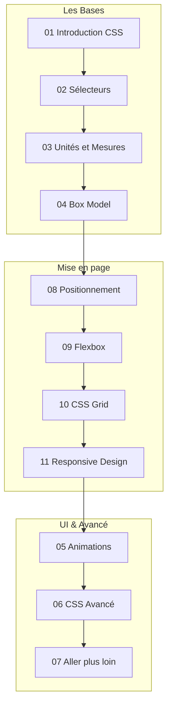

# Rapport de Formation — CSS

## Résumé Exécutif

| Indicateur | Valeur |
|---|---|
| **Modules rédigés** | 11 / 11 (100 %) + index |
| **Bilan structurel** | Bien modulaire, fichiers de taille idéale (~10-25 Ko) |
| **Conformité SKILL v2.0.0** | ✅ Totale |
| **Niveau technique** | Débutant à Avancé |
| **État d'avancement** | **Terminé & Conforme** |

 

---

## Structure Actuelle de la Formation

*(Note: la nomenclature commence à introduire un saut de fichier bizarre (04 vers 08) en terme de flow logique, mais les fichiers sont complets).*

 

---

## Conformité SKILL v2.0.0

| Critère SKILL v2.0.0 | Statut | Commentaire |
|---|---|---|
| Frontmatter YAML | ✅ | Parfaitement implémenté |
| `
` | ✅ | Présent sur tous les fichiers |
| Emploi des admonitions | ✅ | Citations, citations analogiques au début, notes |
| Exemples de code | ✅ | Blocs CSS très descriptifs et organisés |
| Diagrammes Mermaid | ✅ | Présents pour expliquer la cascade CSS et Flexbox |

 

---

## Conclusion et Recommandations

!!! quote "Bilan global CSS"
    La formation CSS est un excellent élève du format Zensical/SKILL. Elle couvre des sujets très modernes (comme `oklch`, Flexbox, Grid) et propose de belles analogies pour les concepts obscurs (Box Model, Cascade). 

**Recommandations :**
- **Séquencement :** L'ordre des fichiers `05`, `06`, `07` par rapport à `08`, `09`, `10` pourrait gagner à être réorganisé sémantiquement (souvent la mise en page Flex/Grid vient avant les Animations). Cependant, le contenu lui-même n'a pas besoin de refonte. Il est conforme.
