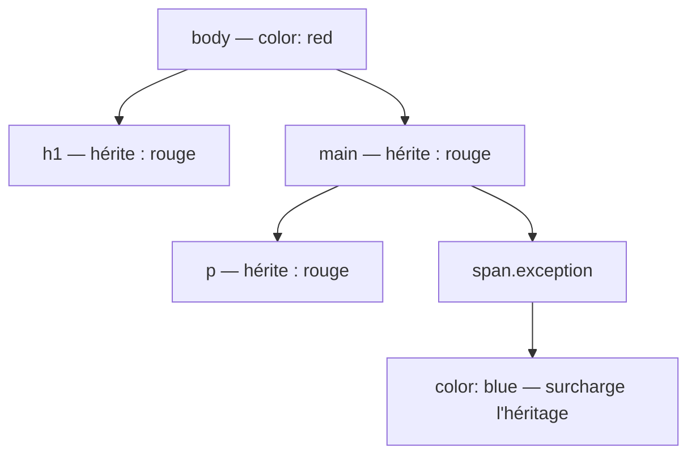

# Introduction CSS

<div
  class="omny-meta"
  data-level="🟢 Débutant"
  data-version="1.1"
  data-time="2-3 heures">
</div>

## Introduction

!!! quote "Analogie pédagogique - Donner Vie au Contenu"
    Imaginez construire une **maison**. Le HTML représente la maçonnerie brute : murs en béton, charpente, emplacements des fenêtres. Le **CSS** (Cascading Style Sheets) est l'intégralité de la décoration intérieure et extérieure : la couleur des tapisseries, l'arrondi des fenêtres, la police des panneaux, l'éclairage.

    Sans CSS, une maison est un bunker gris. Sur le Web, un site HTML nu ressemble à une page Wikipedia des années 90 — texte noir sur fond blanc.

    Le point fort absolu du CSS réside dans sa **maintenance globale** : vous écrivez une seule fois que les boutons doivent être bleus, et cela s'applique instantanément sur l'ensemble des pages de votre site.

Ce module vous enseigne la syntaxe de base du CSS, la notion fondamentale de **Cascade**, et les mécaniques d'intégration dans vos projets.

<br>

---

## Intégrer son code CSS : les 3 méthodes

Il existe trois manières d'appliquer du style sur une page HTML. Seule la troisième est approuvée en environnement professionnel, mais vous devez connaître les deux autres pour ne pas les reproduire.

<br>

### Méthode 1 : Inline (dans la balise HTML)

Le style est appliqué directement sur l'élément. Impossible à réutiliser, impossible à maintenir. À réserver uniquement aux e-mails marketing ou au débogage rapide.

```html title="HTML - CSS inline (déconseillé)"
<!-- Très sale : ce style ne peut pas être réutilisé sur un autre élément -->
<h1 style="color: red; font-size: 32px;">Le grand titre</h1>
```

<br>

### Méthode 2 : Internal (dans le head de la page)

Les styles sont centralisés dans la balise `<style>` du `<head>`. Pratique pour une page unique ou un prototype rapide.

```html title="HTML - CSS interne (projets ponctuels)"
<head>
    <style>
        /* Ces styles ne s'appliquent qu'à cette page -->
        h1 { color: blue; }
        p { color: gray; }
    </style>
</head>
```

<br>

### Méthode 3 : External (fichier séparé)

La norme absolue de l'industrie. HTML et CSS vivent dans des fichiers distincts. La balise `<link>` branche le fichier CSS au document HTML.

```html title="HTML - Liaison d'un fichier CSS externe (la norme)"
<!DOCTYPE html>
<html lang="fr">
<head>
    <meta charset="UTF-8">
    <!-- Lien vers le fichier CSS centralisé du projet -->
    <link rel="stylesheet" href="style.css">
</head>
```

*Un seul fichier CSS peut être lié à des centaines de pages HTML. Modifier une couleur dans ce fichier la propage instantanément sur tout le site.*

!!! info "À propos de Tailwind CSS"
    Un framework[^1] moderne comme **Tailwind CSS** propose une approche différente : au lieu d'écrire des règles personnalisées dans un fichier CSS, on applique directement des **classes utilitaires** dans le HTML. Cependant, même avec Tailwind, le navigateur charge toujours **un fichier CSS externe généré automatiquement** lors du build. La méthode 3 reste donc la norme dans l'industrie.

<br>

---

## Syntaxe : comment peindre une balise

Un fichier CSS est composé de **règles**. Chaque règle désigne une cible, puis lui applique des déclarations.

```css title="CSS - Anatomie d'une règle CSS"
/* 1. Le sélecteur : cible tous les h1 de la page */
h1 {
    /* 2. Déclarations : propriété + valeur, terminées par un point-virgule */
    color: red;       /* couleur du texte */
    font-size: 30px;  /* taille du texte */
}
```

*Une règle CSS = un sélecteur suivi d'un bloc de déclarations entre accolades. Chaque déclaration est une paire `propriété: valeur`.*

<br>

### Regrouper plusieurs cibles

Plusieurs sélecteurs peuvent partager les mêmes déclarations en les séparant par une virgule.

```css title="CSS - Regroupement de sélecteurs"
/* Les trois niveaux de titres partagent la même police et couleur */
h1, h2, h3 {
    font-family: Arial, sans-serif;
    color: darkblue;
}
```

<br>

---

## Le Système de Couleurs

Le CSS propose quatre systèmes de représentation des couleurs, chacun avec ses forces.

<br>

### Les mots-clés

140 couleurs nommées en anglais. À utiliser uniquement pour tester rapidement — jamais en production.

```css title="CSS - Couleurs par mot-clé"
p {
    color: red;
    background-color: lightgreen;
}
```

<br>

### Le code hexadécimal

Le système de référence des designers graphiques. Un code à 6 caractères hexadécimaux précédé de `#`, représentant les canaux Rouge, Vert et Bleu.

```css title="CSS - Couleurs hexadécimales"
button {
    background-color: #3498db; /* Bleu moderne */
    color: #ffffff;            /* Blanc pur */
}

/* Version raccourcie : #rgb équivaut à #rrggbb quand les paires sont identiques */
.fond-noir { background-color: #000; } /* Equivalent à #000000 */
```

<br>

### Le canal alpha : `rgba()` et `#RRGGBBAA`

Pour les couleurs semi-transparentes, `rgba()` ajoute un quatrième paramètre d'opacité entre 0 (invisible) et 1 (opaque).

```css title="CSS - Transparence avec rgba et notation hex 8 chiffres"
/* rgba() : Rouge, Vert, Bleu, Opacité */
.overlay-sombre {
    background-color: rgba(0, 0, 0, 0.6); /* Noir à 60% d'opacité */
}

/* Notation hexadécimale 8 chiffres : les 2 derniers = opacité en hex */
/* 80 en hexadécimal = 128 en décimal = environ 50% d'opacité */
.glassmorphism {
    background-color: #ffffff80;
}
```

<br>

### `hsl()` et le standard moderne `oklch()`

`hsl()` (Teinte, Saturation, Luminosité) est plus intuitif pour générer des palettes de couleurs cohérentes.

```css title="CSS - Couleurs HSL et oklch"
/* hsl(teinte 0-360, saturation %, luminosité %) */
.bouton-primaire {
    background-color: hsl(210, 70%, 50%); /* Bleu vif */
}

/* oklch : standard moderne (CSS Color Level 4), gamut élargi, perceptuellement uniforme */
/* oklch(luminosité, chroma, teinte) */
.accent-moderne {
    background-color: oklch(65% 0.2 230); /* Bleu perceptuellement calibré */
}
```

*`oklch()` est le système recommandé par les navigateurs modernes depuis 2023. Il couvre des couleurs impossibles à exprimer en RGB (P3, HDR) et garantit une luminosité perceptuellement uniforme — changer la teinte ne change pas la luminosité perçue. Support : Chrome 111+, Firefox 116+, Safari 15.4+.*

!!! tip "Le mot-clé `currentColor`"
    `currentColor` est un mot-clé spécial qui hérite automatiquement de la valeur `color` de l'élément. Utile pour des bordures ou des icônes SVG qui doivent toujours correspondre à la couleur du texte.

    ```css title="CSS - currentColor pour les bordures et icônes"
    .bouton {
        color: #3498db;
        /* La bordure prend automatiquement la même couleur que le texte */
        border: 2px solid currentColor;
    }
    ```

<br>

---

## La mécanique de l'Héritage (Cascade)

Une page Web est un arbre hiérarchique. Le `<body>` est l'ancêtre de tous les éléments. Si vous donnez un style à un parent, ses enfants l'héritent automatiquement — sauf s'ils définissent leur propre valeur.

```css title="CSS - Héritage et surcharge dans la cascade"
/* Toute la page hérite du texte rouge via body */
body {
    color: red;
}

/* h1 hérite de body : il sera rouge sans qu'on ait rien écrit ici */
h1 {
    /* Aucune déclaration color ici = héritage de body */
}

/* Ce span se rebelle : il définit sa propre couleur, annulant l'héritage */
span.exception {
    color: blue; /* Surcharge l'héritage */
}
```

**Arbre de propagation de l'héritage :**



*Tous les descendants héritent de `color: red` défini sur `body`. Le `span.exception` définit sa propre valeur et interrompt la propagation pour lui-même et ses enfants.*

!!! info "Toutes les propriétés ne s'héritent pas"
    Seules certaines propriétés CSS se propagent par héritage — principalement celles liées au texte (`color`, `font-family`, `font-size`, `line-height`). Les propriétés de mise en page (`margin`, `padding`, `border`, `width`) ne s'héritent **pas** par défaut.

<br>

---

## Conclusion

!!! quote "Ce qu'il faut retenir de ce module"
    Le CSS s'intègre toujours via un fichier externe lié par `<link>`. Une règle CSS = un sélecteur + des déclarations entre accolades. Les couleurs se représentent en hex, `rgba()`, `hsl()` ou `oklch()` — ce dernier étant le standard moderne. La Cascade fait hériter les styles des parents vers les enfants, sauf surcharge explicite.

> Dans le module suivant, nous apprendrons à cibler avec précision n'importe quel élément grâce aux **Classes, Identifiants, Sélecteurs d'attributs et Pseudo-classes**.

<br>

[^1]: Un **framework CSS** est un ensemble d'outils et de conventions prédéfinis pour accélérer le développement d'interfaces. Tailwind CSS génère à la compilation un fichier CSS optimisé contenant uniquement les classes réellement utilisées dans le projet.