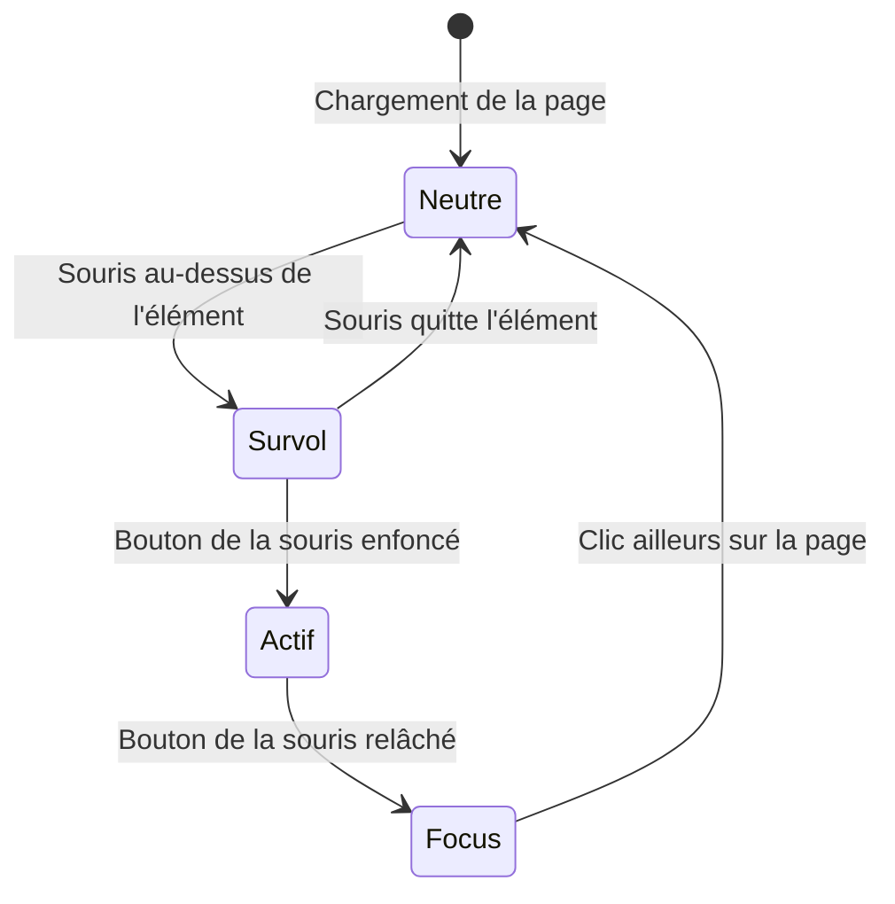

# Les Sélecteurs CSS

<div
  class="omny-meta"
  data-level="🟡 Intermédiaire"
  data-version="1.1"
  data-time="4-5 heures">
</div>

## Introduction

!!! quote "Analogie pédagogique - Cibler avec Précision Chirurgicale"
    Imaginez le code HTML comme une ville entière, et votre CSS comme un système de GPS militaire. Si vous n'indiquez que "tous les bâtiments", vous peindrez la ville entière d'une seule couleur. Inefficace.

    Le secret du CSS réside dans l'art des **Classes** et des **Identifiants** — des étiquettes que vous apposez sur certains éléments pour pouvoir les viser individuellement dans votre fichier de style, sans toucher à leurs voisins.

    Et l'arme finale : les **pseudo-classes**. Des états temporels fantômes. "Vise ce bouton *uniquement pendant la seconde* où un visiteur passe sa souris dessus."

Ce module vous livre les clés pour atteindre n'importe quel élément de votre page, peu importe où il se trouve et dans quel état il se trouve.

<br>

---

## Le Point Zéro : L'Universel et la Racine

Avant même de cibler des balises spécifiques, tout intégrateur professionnel prépare son terrain avec deux sélecteurs fondamentaux.

<br>

### Le Reset Universel (`*`)

L'astérisque `*` cible **absolument tous les éléments** de la page. Il est utilisé en tout début de fichier pour neutraliser les marges et comportements par défaut injectés par les navigateurs — Chrome, Firefox et Safari n'ont pas les mêmes valeurs par défaut.

```css title="CSS - Reset universel en début de fichier"
/* Neutralise les styles par défaut de tous les navigateurs */
* {
    margin: 0;
    padding: 0;
    /*
        box-sizing: border-box impose que padding et border
        soient inclus dans la largeur déclarée (voir module Box Model).
        Cette ligne est indispensable dans tout projet professionnel.
    */
    box-sizing: border-box;
}
```

*Sans ce reset, un `<body>` a des marges par défaut différentes selon le navigateur. Le reset garantit un point de départ identique sur tous les environnements.*

<br>

### La Pseudo-Racine (`:root`)

`:root` cible l'élément de plus haut niveau du document — au-dessus même de `<html>`. C'est l'emplacement standard pour déclarer les **Variables CSS** (Custom Properties) globales du projet.

```css title="CSS - Variables CSS déclarées dans :root"
:root {
    /* Déclaration des variables avec le préfixe double tiret "--" */
    --couleur-primaire: #3498db;
    --couleur-danger: #e74c3c;
    --couleur-succes: #27ae60;
    --police-titre: 'Roboto', sans-serif;
    --rayon-bordure: 8px;
}

/* Utilisation des variables via var() dans le reste du fichier */
h1 {
    color: var(--couleur-primaire);
    font-family: var(--police-titre);
}

.bouton-danger {
    background-color: var(--couleur-danger);
    border-radius: var(--rayon-bordure);
}
```

*Modifier `--couleur-primaire` dans `:root` propage le changement sur **tous les éléments** qui l'utilisent dans le fichier. C'est le mécanisme fondamental des thèmes et du dark mode.*

<br>

---

## Sélecteurs Nommés : Classe et Identifiant

Cibler brutalement `button { background: red; }` rend **tous** les boutons de la page rouges. Pour choisir précisément qui affecter, on étiquette les éléments HTML avec des attributs `class` ou `id`.

<br>

### La Classe (`.nom`)

L'attribut `class` permet de nommer un ou plusieurs éléments. Dans le CSS, on cible une classe avec le **point** `.`.

```html title="HTML - Assigner des classes à des éléments"
<!-- Deux boutons identiques en HTML, mais avec des classes différentes -->
<button class="bouton-valider">Confirmer l'achat</button>
<button class="bouton-annuler">Retour</button>
```

```css title="CSS - Cibler par classe avec le point"
/* Le point "." annonce : "je cible tous les éléments portant cette classe" */
.bouton-valider {
    background-color: #27ae60; /* Vert */
    color: white;
}

.bouton-annuler {
    background-color: #95a5a6; /* Gris */
    color: white;
}
```

*Une classe peut être partagée par autant d'éléments que nécessaire — c'est sa force. Un même élément peut aussi porter plusieurs classes : `class="carte carte-mise-en-avant"`.*

<br>

### L'Identifiant (`#nom`)

L'attribut `id` fonctionne comme une classe, mais son nom doit être **unique dans toute la page**. On le cible dans le CSS avec le **`#`**.

```html title="HTML - Assigner un identifiant unique"
<!-- Un seul élément dans la page peut avoir cet id -->
<header id="menu-principal">...</header>
```

```css title="CSS - Cibler par identifiant avec le dièse"
#menu-principal {
    height: 64px;
    background-color: #2c3e50;
}
```

!!! warning "L'identifiant en CSS : une mauvaise pratique courante"
    L'identifiant possède un poids de spécificité de **100 points** (contre 10 pour une classe). Cela le rend extrêmement difficile à surcharger plus tard dans le code. En CSS, préférez toujours les classes. Réservez les `id` à leur rôle d'ancrage HTML (les liens `href="#section"` du module HTML 02) ou aux cibles JavaScript.

<br>

---

## La Loi du Plus Fort : Spécificité et Poids

C'est **le concept qui différencie un développeur junior d'un senior**. Que se passe-t-il si deux règles CSS ciblent le même élément avec des valeurs contradictoires ? Le navigateur ne choisit pas au hasard — il calcule un **score de poids** appelé spécificité.

**La règle avec le score le plus élevé gagne, quelle que soit sa position dans le fichier.**

### Tableau des scores de spécificité

| Score | Sélecteur | Exemple |
| :--- | :--- | :--- |
| **0-0-1** | Balise seule | `div`, `h1`, `p` |
| **0-1-0** | Classe, pseudo-classe, attribut | `.bouton`, `:hover`, `[type="text"]` |
| **1-0-0** | Identifiant | `#menu` |
| **Style inline** | Attribut `style=""` dans le HTML | (hors fichier CSS) |

```css title="CSS - Tournoi de spécificité"
/* Score 0-0-1 : balise seule. Le moins prioritaire. */
button {
    background-color: blue;
}

/* Score 0-1-0 : une classe. Gagne sur la balise seule. Le bouton sera VERT. */
.bouton-principal {
    background-color: green;
}

/* Score 1-0-1 : un identifiant + une balise. Gagne sur tout le reste. */
#en-tete button {
    background-color: yellow;
}
```

!!! danger "L'arme nucléaire `!important`"
    Ajouter `!important` à une déclaration lui confère une priorité absolue, écrasant toute spécificité calculée.

    ```css title="CSS - !important (à éviter)"
    /* Cette couleur ne pourra être surchargée que par un autre !important */
    .texte-rouge { color: red !important; }
    ```

    C'est une **très mauvaise pratique** : elle brise la mécanique naturelle de la cascade et vous oblige à multiplier les `!important` pour corriger votre propre code. Usage légitime : surcharger de force le style d'une bibliothèque externe que vous ne contrôlez pas.

<br>

---

## Sélecteurs d'Attributs

Les sélecteurs d'attributs permettent de cibler des éléments selon la présence ou la valeur d'un attribut HTML, sans modifier le code HTML avec des classes supplémentaires.

```css title="CSS - Sélecteurs d'attributs et leurs opérateurs"
/* Tous les liens qui s'ouvrent dans un nouvel onglet */
a[target="_blank"] {
    color: #e74c3c; /* Rouge pour signaler la navigation externe */
}

/* Tous les inputs de type password */
input[type="password"] {
    font-family: monospace;
    letter-spacing: 0.2em;
}

/* Les liens dont l'href COMMENCE par "https" (site sécurisé) */
a[href^="https"] {
    padding-left: 18px;
    /* On pourrait ajouter une icône de cadenas via ::before */
}

/* Les liens dont l'href SE TERMINE par ".pdf" */
a[href$=".pdf"] {
    color: #c0392b;
}

/* Les éléments dont la classe CONTIENT le mot "carte" */
div[class*="carte"] {
    border-radius: 8px;
}
```

**Tableau des opérateurs de sélection d'attribut :**

| Opérateur | Signification | Exemple |
| --- | --- | --- |
| `[attr]` | L'attribut existe | `[disabled]` |
| `[attr="val"]` | Valeur exacte | `[type="email"]` |
| `[attr^="val"]` | Commence par | `[href^="https"]` |
| `[attr$="val"]` | Se termine par | `[href$=".pdf"]` |
| `[attr*="val"]` | Contient | `[class*="icon"]` |

<br>

---

## Les Pseudo-Classes : États Temporels

Une pseudo-classe cible un élément **dans un état particulier** — survol, focus, sélection, position dans la fratrie. Elle s'écrit avec `:` suivi du nom de l'état.

<br>

### États interactifs

```css title="CSS - Pseudo-classes interactives"
/* :hover — déclenché quand la souris survole l'élément */
.carte {
    background-color: white;
    transition: background-color 0.2s ease; /* Transition douce */
}

.carte:hover {
    background-color: #f0f4f8;
    cursor: pointer; /* Change le curseur en main */
}

/* :focus — déclenché quand l'élément reçoit le focus (clic ou Tab) */
.champ-saisie:focus {
    border: 2px solid #3498db;
    outline: none; /* Supprime le contour natif du navigateur */
}

/* :active — déclenché pendant le maintien du clic */
.bouton:active {
    transform: scale(0.97); /* Légère compression visuelle au clic */
}

/* :visited — liens déjà visités */
a:visited {
    color: #8e44ad;
}
```

**Workflow des états de la souris :**



<br>

### Pseudo-classes structurelles

Ces pseudo-classes ciblent des éléments selon leur **position dans leur élément parent** — sans modifier le HTML.

```css title="CSS - Pseudo-classes de position structurelle"
/* Premier et dernier enfant */
li:first-child {
    font-weight: 500; /* Le premier élément de liste en gras */
}

li:last-child {
    border-bottom: none; /* Supprime la bordure du dernier élément */
}

/* nth-child : alternance pair/impair pour les tableaux */
tr:nth-child(even) {
    background-color: #f8f9fa; /* Lignes paires légèrement grisées */
}

tr:nth-child(odd) {
    background-color: #ffffff; /* Lignes impaires blanches */
}

/* nth-child avec formule : toutes les 3 lignes à partir de la 1ère */
li:nth-child(3n+1) {
    color: #3498db;
}
```

<br>

### Pseudo-classes modernes : `:is()`, `:not()`, `:has()`

Ces sélecteurs introduits dans CSS Level 4 simplifient considérablement l'écriture de règles complexes.

```css title="CSS - Sélecteurs modernes is, not, has"
/*
    :is() - groupe de sélecteurs alternatifs.
    Hérite de la spécificité du sélecteur le plus spécifique du groupe.
    Évite de répéter les combinaisons longues.
*/

/* AVANT :is() — répétitif */
article h2, article h3, article h4 { color: #2c3e50; }

/* AVEC :is() — lisible */
article :is(h2, h3, h4) { color: #2c3e50; }

/*
    :not() - exclut les éléments correspondant au sélecteur.
*/
/* Tous les liens SAUF ceux dans la navigation */
a:not(nav a) {
    text-decoration: underline;
}

/* Tous les inputs SAUF les boutons et cases à cocher */
input:not([type="submit"]):not([type="checkbox"]) {
    border: 1px solid #ddd;
    padding: 8px 12px;
}

/*
    :has() - "parent selector" : cible un élément SI il contient un certain enfant.
    Révolutionnaire : le premier sélecteur CSS qui remonte dans l'arbre DOM.
    Support : Chrome 105+, Firefox 121+, Safari 15.4+
*/

/* Une carte qui contient une image reçoit un padding supérieur */
.carte:has(img) {
    padding-top: 0;
}

/* Un label dont l'input associé est required est mis en évidence */
label:has(+ input:required) {
    font-weight: 500;
}

label:has(+ input:required)::after {
    content: " *";
    color: #e74c3c;
}
```

*`:has()` est considéré comme la fonctionnalité CSS la plus attendue depuis des années. Elle permet de styliser un parent en fonction de son contenu — ce qui était jusqu'alors impossible en CSS pur et nécessitait JavaScript.*

<br>

---

## Les Pseudo-Éléments : Contenu Généré

Les pseudo-éléments ciblent une **partie** d'un élément ou permettent d'**injecter du contenu virtuel** via CSS, sans modifier le HTML. Ils s'écrivent avec `::` (deux fois deux-points).

```css title="CSS - Pseudo-éléments ::before et ::after"
/*
    ::before — insère un pseudo-élément AVANT le contenu de l'élément.
    ::after  — insère un pseudo-élément APRÈS le contenu de l'élément.

    La propriété content est OBLIGATOIRE (même vide avec content: "").
    Ces pseudo-éléments sont des éléments inline par défaut.
*/

/* Ajouter une icône devant chaque lien externe */
a[target="_blank"]::after {
    content: " ↗";          /* Le contenu textuel ou vide */
    font-size: 0.75em;
    color: inherit;
    opacity: 0.6;
}

/* Ajouter un badge "Obligatoire" devant les labels de champs requis */
.champ-requis::before {
    content: "* ";
    color: #e74c3c;
    font-weight: 700;
}

/* Technique classique : clearfix pour les floats (contexte historique) */
.conteneur::after {
    content: "";            /* Vide mais obligatoire */
    display: block;
    clear: both;
}

/* Décoration pure avec un pseudo-élément positionné */
.titre-section {
    position: relative;
    padding-bottom: 12px;
}

.titre-section::after {
    content: "";
    position: absolute;
    bottom: 0;
    left: 0;
    width: 48px;
    height: 3px;
    background-color: var(--couleur-primaire);
    border-radius: 2px;
}
```

*`::before` et `::after` sont des éléments CSS purs — ils n'existent pas dans le DOM HTML et ne sont pas sélectionnables par l'utilisateur. Ils sont idéaux pour les décorations visuelles qui n'ont pas de valeur sémantique.*

**Autres pseudo-éléments utiles :**

| Pseudo-élément | Rôle |
| --- | --- |
| `::first-line` | Cible la première ligne d'un paragraphe |
| `::first-letter` | Cible la première lettre d'un paragraphe (lettrines) |
| `::selection` | Style le texte sélectionné par l'utilisateur |
| `::placeholder` | Style le texte de placeholder d'un input |
| `::marker` | Style la puce ou le numéro d'une liste |

```css title="CSS - Pseudo-éléments de contenu et de sélection"
/* Personnaliser la couleur de sélection du texte */
::selection {
    background-color: #3498db;
    color: white;
}

/* Personnaliser le placeholder des champs de saisie */
input::placeholder {
    color: #adb5bd;
    font-style: italic;
}

/* Personnaliser les puces d'une liste */
li::marker {
    color: var(--couleur-primaire);
    font-weight: 700;
}
```

<br>

---

## Sélecteurs de Combinaison

Les combinateurs permettent de cibler des éléments selon leur **relation dans l'arbre DOM**.

```css title="CSS - Les quatre combinateurs CSS"
/*
    Espace — sélecteur descendant :
    Cible tous les img qui se trouvent à n'importe quelle profondeur
    à l'intérieur d'un élément .avatar
*/
.avatar img {
    border-radius: 50%;
    width: 48px;
    height: 48px;
}

/*
    > — sélecteur enfant direct :
    Cible uniquement les li qui sont enfants DIRECTS de .menu
    (pas les li imbriqués dans un sous-menu)
*/
.menu > li {
    display: inline-block;
}

/*
    + — sélecteur frère adjacent :
    Cible le premier p qui suit IMMÉDIATEMENT un h2
*/
h2 + p {
    font-size: 1.1em;
    color: #555;
}

/*
    ~ — sélecteur frère général :
    Cible TOUS les p qui suivent un h2 (pas seulement le premier)
*/
h2 ~ p {
    margin-left: 1rem;
}
```

<br>

---

## Conclusion

!!! quote "Ce qu'il faut retenir de ce module"
    Les classes (`.nom`) sont l'outil quotidien du développeur CSS. Les identifiants (`#nom`) sont réservés au JavaScript et aux ancres HTML. La spécificité est un score calculé : identifiant (1-0-0) > classe (0-1-0) > balise (0-0-1). Les pseudo-classes (`:hover`, `:focus`, `:is()`, `:has()`) ciblent des états temporels ou structurels. Les pseudo-éléments (`::before`, `::after`, `::selection`) injectent du contenu virtuel ou ciblent des parties d'éléments. `!important` brise la cascade — à éviter.

> Dans le module suivant, nous dompterons les **Unités de Mesures** : l'étape cruciale pour comprendre comment vos composants respirent et s'adaptent dynamiquement à l'écran (`px`, `rem`, `em`, `vw`, `clamp()`).

<br>