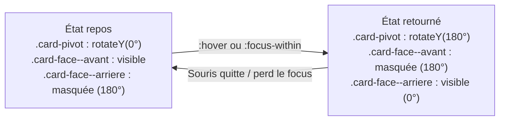

# Positionnement et Flux

<div
  class="omny-meta"
  data-level="🟡 Intermédiaire → 🔴 Avancé"
  data-version="1.0"
  data-time="3-4 heures">
</div>

## Introduction

!!! quote "Analogie pédagogique - Le Plan de Table d'un Architecte d'Intérieur"
    Imaginez un appartement. Par défaut, chaque meuble est posé dans le flux naturel de la pièce — l'un après l'autre, dans l'ordre où on les a installés. C'est le comportement `static`.

    Mais un designer d'intérieur peut décider qu'un tableau sera accroché exactement à 30 cm du coin gauche du mur, indépendamment des meubles autour. Ou qu'un spot lumineux restera fixé au plafond quelle que soit la configuration du reste de la pièce. Ou qu'une cloison colle au bord de la fenêtre jusqu'à ce qu'on la dépasse, puis reste visible en haut de la pièce.

    C'est exactement ce que `position` offre en CSS — la capacité de sortir un élément du flux normal et de le placer avec précision dans l'espace.

La propriété `position` est le fondement invisible de nombreuses techniques présentées dans les modules précédents : les tooltips, les modales, les navigations fixes, les cartes retournables. Ce module comble ce prérequis essentiel.

<br>

---

## Le Flux Normal : `position: static`

Par défaut, tout élément HTML a `position: static`. Il suit le **flux normal du document** — chaque élément block occupe une ligne, les éléments inline s'enchaînent dans le texte.

Dans cet état, les propriétés `top`, `right`, `bottom`, `left` et `z-index` n'ont **aucun effet**.

```css title="CSS - position static (comportement par défaut)"
/* Inutile de l'écrire — c'est la valeur par défaut */
.element {
    position: static; /* top, left, z-index ignorés */
}
```

<br>

---

## `position: relative` — décalage par rapport à soi-même

Un élément `relative` reste dans le flux normal — il occupe toujours son espace d'origine. Mais il peut être décalé visuellement à l'aide de `top`, `right`, `bottom`, `left`, sans affecter les éléments voisins.

```css title="CSS - position relative pour un décalage léger"
.badge-notification {
    position: relative;
    /*
        L'élément se décale de 4px vers le haut visuellement,
        mais son espace d'origine dans le flux est préservé.
        Les éléments voisins ne bougent pas.
    */
    top: -4px;
}
```

*L'usage le plus important de `position: relative` n'est pas le décalage visuel lui-même, mais la création d'un **contexte de positionnement** pour ses enfants `absolute`.*

!!! info "Le contexte de positionnement"
    Un élément `position: absolute` se positionne par rapport à son **ancêtre positionné le plus proche** — c'est-à-dire le premier parent dont la `position` est autre que `static`. Si aucun ancêtre n'est positionné, il se place par rapport à la fenêtre du navigateur. C'est pourquoi on applique systématiquement `position: relative` sur le parent d'un enfant `absolute`.

<br>

---

## `position: absolute` — extraction du flux

Un élément `absolute` est **retiré du flux** : il n'occupe plus d'espace dans le document. Les éléments voisins agissent comme s'il n'existait pas. Il se positionne par rapport à son ancêtre positionné le plus proche.

```css title="CSS - Placement absolu dans un contexte relatif"
/* Le parent devient le référentiel de positionnement */
.carte {
    position: relative; /* Contexte de positionnement pour l'enfant */
    width: 300px;
    height: 200px;
}

/* L'enfant se place par rapport à .carte, pas à la page */
.badge-prix {
    position: absolute;
    top: 12px;     /* 12px depuis le bord supérieur de .carte */
    right: 12px;   /* 12px depuis le bord droit de .carte */

    background-color: #e74c3c;
    color: white;
    padding: 4px 10px;
    border-radius: 20px;
    font-size: 0.8rem;
}
```

```css title="CSS - Centrage absolu d'un élément dans son parent"
.conteneur {
    position: relative;
    width: 400px;
    height: 300px;
}

.element-centre {
    position: absolute;
    /*
        top: 50% + left: 50% place le coin supérieur gauche au centre.
        transform: translate(-50%, -50%) décale l'élément de sa propre moitié,
        plaçant son centre exact au centre du parent.
    */
    top: 50%;
    left: 50%;
    transform: translate(-50%, -50%);
}
```

*Ce pattern `absolute` + `translate(-50%, -50%)` est l'une des techniques de centrage les plus utilisées en production, notamment pour les overlays et les loaders.*

<br>

---

## `position: fixed` — ancré à la fenêtre

Un élément `fixed` est extrait du flux et se positionne par rapport à la **fenêtre du navigateur** — il reste au même endroit même quand l'utilisateur fait défiler la page.

```css title="CSS - Navigation fixe en haut de page"
.site-header {
    position: fixed;
    top: 0;
    left: 0;
    right: 0;          /* S'étend sur toute la largeur de la fenêtre */
    height: 64px;
    background-color: rgba(255, 255, 255, 0.95);
    backdrop-filter: blur(12px);
    z-index: 200;      /* Au-dessus du contenu défilant */
}
```

```css title="CSS - Bouton retour en haut de page"
.btn-scroll-top {
    position: fixed;
    bottom: 2rem;
    right: 2rem;
    width: 48px;
    height: 48px;
    border-radius: 50%;
    background-color: var(--color-primary);
    color: white;
    z-index: 100;
    cursor: pointer;

    display: flex;
    align-items: center;
    justify-content: center;
}
```

!!! warning "La compensation du header fixe"
    Un `position: fixed` retire l'élément du flux. Si votre header fait 64px de hauteur, le contenu de la page remontera sous lui. Compensez en ajoutant `padding-top: 64px` sur le `<body>` ou `<main>`.

<br>

---

## `position: sticky` — l'hybride relatif/fixe

Un élément `sticky` se comporte comme un élément `relative` jusqu'à ce qu'un seuil de défilement soit atteint, puis il se "colle" comme un `fixed`.

```css title="CSS - En-tête de tableau qui colle au défilement"
.table-header th {
    position: sticky;
    top: 0;            /* Se colle au sommet quand on défile */
    background-color: #f8fafc;
    z-index: 10;
    border-bottom: 2px solid #e2e8f0;
}
```

```css title="CSS - Sidebar qui suit le défilement"
.sidebar {
    position: sticky;
    top: 80px;          /* Reste à 80px du haut (sous le header fixe) */
    height: fit-content; /* Ne dépasse pas la hauteur de son contenu */
    max-height: calc(100vh - 80px);
    overflow-y: auto;
}
```

```css title="CSS - Lettres de navigation alphabétique"
/* Effet de "lettre qui colle" dans une liste alphabétique */
.lettre-index {
    position: sticky;
    top: 0;
    background-color: #667eea;
    color: white;
    padding: 4px 12px;
    font-weight: 500;
}
```

!!! warning "Prérequis pour que sticky fonctionne"
    `position: sticky` ne fonctionne que si son **parent a une hauteur supérieure à l'élément sticky** et qu'**aucun ancêtre n'a `overflow: hidden` ou `overflow: auto`**. Ces deux conditions manquantes sont la cause de 90% des problèmes de sticky inexpliqués.

<br>

---

## `z-index` et les Contextes d'Empilement

`z-index` contrôle l'ordre d'empilement des éléments positionnés sur l'axe Z (profondeur). Un `z-index` plus élevé place l'élément **au-dessus** des autres.

```css title="CSS - Hiérarchie z-index dans un design system"
:root {
    /* Définir les z-index dans des variables garantit la cohérence */
    --z-content:  1;      /* Contenu normal */
    --z-dropdown: 100;    /* Menus déroulants */
    --z-sticky:   200;    /* Headers collants */
    --z-overlay:  300;    /* Fonds de modales */
    --z-modal:    400;    /* Modales */
    --z-tooltip:  500;    /* Tooltips */
    --z-toast:    600;    /* Notifications */
}

.dropdown-menu  { z-index: var(--z-dropdown); }
.site-header    { z-index: var(--z-sticky); }
.modal-overlay  { z-index: var(--z-overlay); }
.modal          { z-index: var(--z-modal); }
.tooltip        { z-index: var(--z-tooltip); }
```

!!! info "Le contexte d'empilement"
    Un `z-index` n'est absolu que dans son **contexte d'empilement**. Appliquer `position: relative` + `z-index` sur un élément crée un nouveau contexte isolé. Ses enfants, même avec un `z-index: 9999`, ne pourront jamais dépasser les éléments **extérieurs** à ce contexte si leur parent a un z-index plus faible. C'est la cause de nombreux bugs d'interface où un élément "passe sous" une modal malgré un z-index élevé.

```css title="CSS - Le piège du contexte d'empilement"
.section-probleme {
    position: relative;
    z-index: 1; /* Crée un contexte d'empilement fermé */
}

.tooltip-dans-section {
    position: absolute;
    z-index: 9999;
    /*
        Ce tooltip ne peut JAMAIS dépasser la .modal-overlay
        car son parent .section-probleme a z-index: 1,
        inférieur à z-index: var(--z-overlay).
        Le z-index 9999 n'est relatif qu'au contexte de .section-probleme.
    */
}
```

<br>

---

## `scroll-behavior` — défilement fluide

Par défaut, cliquer sur un lien ancre (`href="#section"`) fait sauter la page instantanément à la cible. `scroll-behavior: smooth` anime ce défilement.

```css title="CSS - Activation du défilement fluide"
/*
    Appliqué sur html (et non sur body) pour couvrir
    tous les défilements du document.
*/
html {
    scroll-behavior: smooth;
}
```

*Un seul ligne de CSS transforme l'expérience de navigation interne d'une page.*

<br>

### `scroll-margin-top` — compensation du header fixe

Quand une page a un header fixe et utilise des ancres, la cible s'affiche sous le header. `scroll-margin-top` ajoute une marge de défilement invisible sur l'élément cible.

```css title="CSS - Compensation du header dans la navigation par ancres"
/*
    Sans scroll-margin-top : le titre s'affiche sous le header fixe de 64px.
    Avec scroll-margin-top : le titre s'affiche 80px sous le haut de la fenêtre.
*/
h2[id],
h3[id],
.section-cible {
    scroll-margin-top: 80px; /* Hauteur du header + marge de confort */
}
```

```html title="HTML - Navigation par ancres avec smooth scroll"
<!-- Lien déclencheur -->
<nav>
    <a href="#installation">Installation</a>
    <a href="#configuration">Configuration</a>
    <a href="#deploiement">Déploiement</a>
</nav>

<!-- Cibles avec id et scroll-margin-top via CSS -->
<h2 id="installation">Installation</h2>
<h2 id="configuration">Configuration</h2>
<h2 id="deploiement">Déploiement</h2>
```

!!! tip "Respecter `prefers-reduced-motion`"
    Le défilement animé peut provoquer des malaises chez les utilisateurs sensibles aux animations. Désactivez-le en cohérence avec la règle établie dans le module animations :

    ```css title="CSS - Désactivation du smooth scroll selon les préférences"
    @media (prefers-reduced-motion: reduce) {
        html {
            scroll-behavior: auto;
        }
    }
    ```

<br>

---

## Synthèse Pratique : Le Card Flip 3D

Ce pattern combine `position: relative`/`absolute`, `transform-style: preserve-3d`, `backface-visibility` et une transition pour créer une carte qui se retourne au survol.

Le module 05 a présenté les propriétés individuellement. Voici l'implémentation complète, commentée comme un composant de production.

```html title="HTML - Structure du composant card flip"
<!-- La scène 3D : crée la perspective pour tous ses enfants -->
<div class="card-scene">

    <!-- Le pivot : c'est lui qui tourne -->
    <div class="card-pivot">

        <!-- Face avant : visible au repos -->
        <div class="card-face card-face--avant">
            <h3>Laravel & Livewire</h3>
            <p>Stack TALL — Développement Full-Stack PHP moderne</p>
        </div>

        <!-- Face arrière : visible après retournement -->
        <div class="card-face card-face--arriere">
            <h3>Compétences couvertes</h3>
            <ul>
                <li>Routing & Controllers</li>
                <li>Eloquent ORM</li>
                <li>Composants Livewire</li>
            </ul>
            <a href="#" class="btn-decouvrir">Découvrir le module</a>
        </div>

    </div>
</div>
```

```css title="CSS - Card flip 3D complet avec toutes les propriétés expliquées"
/* ──────────────────────────────────────────────────
   LA SCÈNE : activation de la perspective 3D
   ────────────────────────────────────────────────── */
.card-scene {
    /*
        perspective définit la distance "caméra".
        Plus la valeur est grande, plus l'effet 3D est subtil.
        800-1200px est la plage la plus naturelle visuellement.
        OBLIGATOIRE sur le parent pour activer l'espace 3D des enfants.
    */
    perspective: 1000px;

    width: 320px;
    height: 240px;

    /* Empêche la distorsion au survol */
    cursor: pointer;
}


/* ──────────────────────────────────────────────────
   LE PIVOT : l'élément qui effectue la rotation
   ────────────────────────────────────────────────── */
.card-pivot {
    position: relative;
    width: 100%;
    height: 100%;

    /*
        transform-style: preserve-3d indique que les enfants directs
        de cet élément participent à l'espace 3D du parent.
        Sans cette propriété, les enfants sont aplatis en 2D
        avant que la rotation s'applique — les deux faces
        seraient visibles simultanément.
    */
    transform-style: preserve-3d;

    transition: transform 0.6s cubic-bezier(0.4, 0, 0.2, 1);
}

/* Déclenchement du retournement au survol de la scène */
.card-scene:hover .card-pivot {
    transform: rotateY(180deg);
}


/* ──────────────────────────────────────────────────
   LES FACES : positionnement en superposition
   ────────────────────────────────────────────────── */
.card-face {
    /*
        position: absolute sur les deux faces pour qu'elles
        se superposent exactement dans le même espace.
        Sans absolute, elles s'empileraient verticalement.
    */
    position: absolute;
    inset: 0; /* Équivalent à top:0 right:0 bottom:0 left:0 */

    display: flex;
    flex-direction: column;
    justify-content: center;
    align-items: center;
    padding: 2rem;

    border-radius: 12px;
    box-shadow: 0 8px 32px rgba(0, 0, 0, 0.12);

    /*
        backface-visibility: hidden cache la face
        quand elle est retournée au-delà de 90°.
        Sans cette propriété, on verrait le texte en miroir
        au travers de la face opposée.
    */
    backface-visibility: hidden;
}

/* Face avant : orientation normale */
.card-face--avant {
    background: linear-gradient(135deg, #667eea, #764ba2);
    color: white;
}

/* Face arrière : pré-retournée à 180° au repos */
.card-face--arriere {
    background: white;
    color: #1a1a2e;
    border: 1px solid #e2e8f0;

    /*
        Cette face commence à 180° — elle est dos à l'utilisateur.
        Quand .card-pivot tourne à 180°, cette face revient à 0°
        et devient visible. La face avant, elle, passe à 180° et disparaît.
    */
    transform: rotateY(180deg);
}
```

```css title="CSS - Accessibilité du card flip"
/* Respecter les préférences de mouvement réduit */
@media (prefers-reduced-motion: reduce) {
    .card-pivot {
        transition: none;
    }

    /* Afficher les deux faces en mode empilé plutôt qu'animé */
    .card-scene:hover .card-pivot {
        transform: none;
    }
}

/* Support du focus clavier pour la navigation sans souris */
.card-scene:focus-within .card-pivot {
    transform: rotateY(180deg);
}

.card-scene {
    /* Rend la scène focusable */
    tabindex: 0;
    outline: none;
}

.card-scene:focus-visible {
    outline: 3px solid var(--color-primary);
    outline-offset: 4px;
    border-radius: 14px;
}
```

*Le `.card-scene:focus-within` permet aux utilisateurs naviguant au clavier de déclencher le retournement via la touche `Tab` — sans JavaScript.*

<br>

### Diagramme des états du card flip



*Les deux faces ont toujours un angle de différence de 180°. Quand le pivot tourne de 180°, la face avant disparaît et la face arrière revient à zéro.*

<br>

---

## Tableau récapitulatif des valeurs `position`

| Valeur | Dans le flux | Référentiel | Cas d'usage principal |
| --- | --- | --- | --- |
| `static` | Oui | — | Comportement par défaut |
| `relative` | Oui | Lui-même | Contexte de positionnement, décalage léger |
| `absolute` | Non | Ancêtre positionné | Badges, tooltips, overlays, card faces |
| `fixed` | Non | Fenêtre du navigateur | Headers fixes, boutons flottants |
| `sticky` | Oui (jusqu'au seuil) | Son conteneur + fenêtre | Headers de tableau, sidebars, lettres d'index |

<br>

---

## Conclusion

!!! quote "Ce qu'il faut retenir de ce module"
    `position: relative` crée un contexte de positionnement sans sortir du flux — c'est le parent de tout enfant `absolute`. `position: absolute` extrait un élément du flux et le place avec précision dans ce contexte. `position: fixed` ancre un élément à la fenêtre quelle que soit la position de défilement. `position: sticky` est un hybride qui colle à un seuil. `z-index` contrôle l'empilement — définissez toujours vos z-index dans des variables CSS pour éviter les guerres de priorité. `scroll-behavior: smooth` avec `scroll-margin-top` crée une navigation interne élégante et accessible. Le card flip réunit `position: absolute`, `perspective`, `transform-style: preserve-3d` et `backface-visibility` en un composant complet.

> Vous maîtrisez maintenant l'ensemble de la chaîne CSS. L'étape finale est le **Responsive Design** — Media Queries, méthode mobile-first et adaptation complète à tous les types d'écrans et d'appareils.

<br>