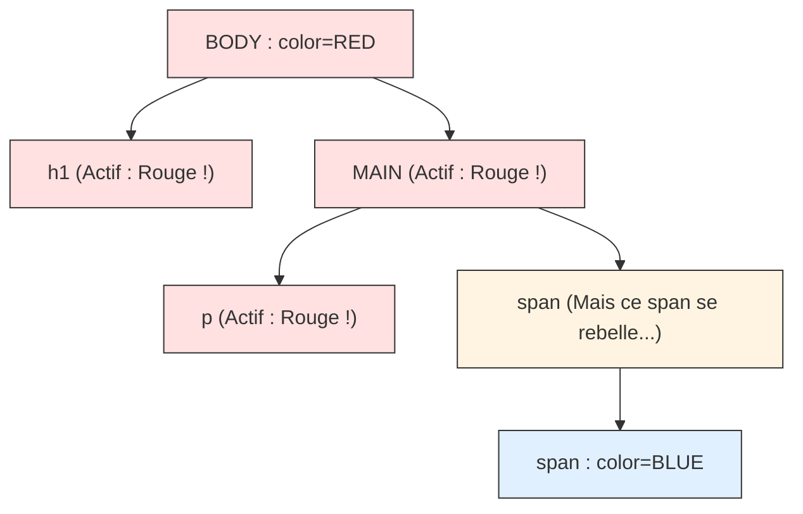

# Introduction CSS

<div
  class="omny-meta"
  data-level="🟢 Débutant"
  data-version="1.0"
  data-time="2-3 heures">
</div>


## Introduction

!!! quote "Analogie pédagogique - Donner Vie au Contenu"
    Imaginez construire une **Maison**. Le HTML représente la maçonnerie brute : murs en bétons, charpente, emplacements des fenêtres. Le **CSS** (Cascading Style Sheets) est l'intégralité de la **Décoration Intérieure et Extérieure** : la couleur des tapisseries, l'arrondi des fenêtres, la police des panneaux, l'éclairage. 
    Sans CSS, une maison est un bunker gris. Sur le Web, un site HTML nu ressemble à une page Wikipédia des années 90 (Texte noir, bleu, fond blanc).
    
    Le point fort absolu du CSS réside dans sa **maintenance globale** : Vous écrivez une seule fois que les boutons doivent être bleus, et cela s'applique instantanément sur les 1000 pages de votre site en même temps.

Ce module vous enseigne la base de la syntaxe CSS, la notion redoutable de **Cascade**, et la mécanique d'intégration dans vos projets.

<br />

---

## Intégrer son code CSS (Les 3 Méthodes)

Il y a 3 manières techniques d'appliquer de la "peinture (style)" sur une page. **Seule la troisième est réellement approuvée en millieu professionnel**, mais vous devez connaître l'existance des deux autres. C'est important afin de ne pas prendre de mauvaise d'habitude.

### Méthode 1 : Inline (Dans la balise HTML)

!!! quote "On vient forcer la peinture directement dans le code d'un seul mot.<br>C'est à utiliser **uniquement** pour du dépannage ou pour coder un e-mail marketing."

```html title="Code HTML - CSS Injecté Inline (Déconseillé)"
<!-- Très sale : Ne peut pas être réutilisé pour un autre titre -->
<h1 style="color: red; font-size: 32px;">Le grand titre</h1>
```

### Méthode 2 : Internal (Dans le Head de la page)

!!! quote "Moins laborieux, on centralise les styles dans la salle de contrôle de la page HTML actuelle.<br>Pratique pour une page unique comme un CV express."

```html title="Code HTML - CSS Interne (Pour projets ponctuels)"
<head>
    <style>
        h1 { color: blue; }
        p { color: gray; }
    </style>
</head>
```

### Méthode 3 : External (Le Fichier Séparé) ⭐️

!!! quote "La **norme absolue de l'industrie**.<br>On sépare radicalement notre HTML statique et notre CSS dans deux mondes/fichiers différents.<br>On utilise la balise de liaison `<link href=\"...\">` pour que le HTML se branche au fichier de style du nom de `app.css`."

```html title="Code HTML - Branchement Externe (La Norme)"
<!DOCTYPE html>
<html>
<head>
    <meta charset="UTF-8">
    <!-- Branchement magique vers le fichier centralisé des couleurs -->
    <link rel="stylesheet" href="style.css">
</head>
```

!!! info "À propos de TailwindCSS"
    Un framework[^1] moderne comme **TailwindCSS** propose une approche différente de l'écriture du CSS. Au lieu d'écrire des règles personnalisées dans un fichier CSS, on applique directement des **classes utilitaires** dans le HTML. Cependant, même avec Tailwind, le navigateur charge toujours **un fichier CSS externe généré automatiquement**.
    
    La **méthode 3 (CSS externe)** reste donc la norme dans l'industrie.
    

<br />

---

## Syntaxe et cibles : Comment peindre une balise ?

!!! quote "Un fichier CSS est extrêmement simple à lire. Il est composé de *Règles*.<br>Une règle agit selon le principe du tireur d'élite : **On désigne une cible, puis on exécute l'ordre**."

```css title="Code CSS - La syntaxe de ciblage"
/* 1. La Cible (Sélecteur) : je vise tous les 'h1' du site */
h1 {
    /* 2. L'ordre (Déclaration) : La propriété et la Valeur */
    color: red; /* couleur du texte */
    font-size: 30px; /* taille du texte */
}
```

### Regrouper ses cibles 

!!! quote "Pourquoi écrire 3 fois la même ligne si vos 3 niveaux de titres utilisent la même police de caractère ?"

```css title="Code CSS - Cibler de multiples éléments"
/* On groupe les sélecteurs avec une virgule ! */
h1, h2, h3 {
    font-family: Arial, sans-serif; /* famille de police */
    color: darkblue; /* couleur du texte */
}
```

<br />

---

## Le Système de Couleurs

L'ordinateur utilise trois langages différents pour comprendre quelle couleur exacte il doit afficher sur un pixel de votre écran.

### Les mots génériques en Anglais

!!! quote "Extrêmement limités à seulement 140 couleurs bloquées dans le monde.<br>On ne s'en sert **que pour tester le résultat de son code rapidement**."

```css title="Code CSS - Couleurs par mot-clé"
p {
    color: red; /* Rouge par défaut */
    background-color: lightgreen; /* Fond vert clair */
}
```

### Le puissant Code Hexadécimal

!!! quote "C'est le système de prédilection des designers graphiques. Il s'agit d'un code à 6 caractères précédé d'un `#`.<br>Le navigateur fait le savant mélange et affiche la couleur."

```css title="Code CSS - Code hexadécimal"
button {
    background-color: #3498DB; /* Un bleu moderne */
    color: #FFFFFF; /* Le blanc */
}
```

### Le canal Alpha de transparence (La magie du `rgba()`)

!!! quote "Lorsque vous souhaitez peindre un bloc de fond en noir absolu, mais que vous voulez que ce fond soit "translucide" à 50% pour voir le paysage au travers (**le fameux effet _vitre_** plus connu sous l'appélation **_Glassmorphism_**)."

```css title="Code CSS - Canal alpha rgba()"
.vitre-sombre {
    /* R, G, B, puis l'opacité (0.0=Invisible à 1.0=Opaque total) */
    background-color: rgba(0, 0, 0, 0.5); 
}
```

<br />

---

## La mécanique de l'Héritage (Cascade)

!!! quote "Une page Web est un gigantesque arbre généalogique. Le `<body />` est le grand parent de tout le monde.<br>Si vous donnez un style à un parent massif, l'enfant hérite passivement de ce trait sans que vous n'ayez rien à faire !"

```css
/* Si je donne l'ordre général au parent d'avoir du texte rouge... */
body {
    color: red;
}

/* L'enfant n'a rien demandé, mais il DEVRA s'afficher en rouge ! */
h1 {
    /* (Ce h1 héritera magiquement de la couleur de son body parent) */
}
```

**Arbre de propagation de l'héritage :**



<br />

---

## Conclusion et Synthèse

Le CSS transforme des fondations HTML brutes en une véritable expérience visuelle. Qu'il soit lié par une méthode externe (la plus robuste) ou pensé à travers la riche panoplie des couleurs Hexadécimales et RGBA, il repose sur un principe fondateur fort : la Cascade, où les enfants héritent naturellement du style de leurs parents, offrant une maintenance inégalée de votre code global.

> Dans le module suivant, nous apprendrons à cibler de manière extrêmement sournoise les balises au moyen de Classes nommées, d'Identifiants et d'États virtuels (comme le survol de souris !).

<br />

[^1]: Un framework est un terme utilisé pour désigner un ensemble d'outils et de technologies qui permettent de développer des applications web plus rapidement et plus facilement. Il est composé de plusieurs bibliothèques et modules qui peuvent être utilisés ensemble pour créer des applications web. 