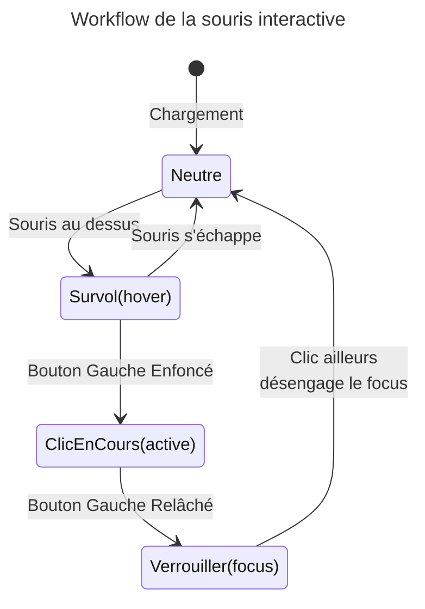

# Les Sélecteurs CSS

<div
  class="omny-meta"
  data-level="🟡 Intermédiaire"
  data-version="1.0"
  data-time="4-5 heures">
</div>

## Introduction

!!! quote "Analogie pédagogique - Cibler avec Précision Chirurgicale"
    Imaginez le code HTML comme une carte du monde, et votre CSS comme un radar militaire de visée.
    Si vous pointez le nom global de la balise HTML ("Tous les pays"), vous allez tout brûler d'un coup. C'est inefficace.
    Le secret du CSS réside dans l'art des **Classes** et des **Identifiants**. Ces mécaniques vous permettent de renommer discrètement des balises HTML pour pouvoir les viser à coup de snipper une par une dans le fichier de peinture sans toucher à leurs consœurs !
    
    Et l'arme fatale : les **pseudo-classes**. Ce sont des états fantômes temporels. Le radar se dira : "Vise ce bouton _uniquement pendant la malheureuse seconde_ ou un visiteur passe sa souris dessus".

Ce module vous livre les clés pour atteindre **n'importe quel élément** récalcitrant de votre écran, peu importe où et quand.

<br />

---

## Le Point Zéro : L'Universel et la Racine

!!! info "Avant même de cibler des balises spécifiques, **l'intégrateur professionnel prépare toujours son terrain d'opération avec deux sélecteurs** importants à connaître."

### Le Reset Universel (`*`)
L'astérisque `*` cible **absolument toutes les balises existantes** sur la page. Il est massivement utilisé en tout début de fichier pour "Mettre à zéro" (Reset) les marges et comportements parasites que les navigateurs (Chrome, Safari, Firefox) injectent par défaut.

```css title="Code CSS - Le Reset vital"
/* Ce code nettoie l'ardoise avant de peindre pour s'assurer d'un rendu pur ! */
* {
    margin: 0;
    padding: 0;
    box-sizing: border-box; 
    /* Cette dernière ligne est cruciale, elle sauve le "Modèle de boite" ! */
}
```

### La Super-Racine (`:root`)
Le sélecteur `:root` cible l'élément structurel de niveau le plus haut de tout le document (au-dessus même de la balise `<html>`). C'est le coffre-fort universel où les développeurs modernes conçoivent et stockent leurs **Variables CSS** (Custom Properties) pour ne jamais se répéter.

```css title="Code CSS - Stocker ses couleurs globales"
:root {
    /* On définit ses variables avec un double tiret "--" */
    --couleur-primaire: #3498DB;
    --couleur-danger: #E74C3C;
    --police-titre: 'Roboto', sans-serif;
}

/* Plus tard dans le code : on appelle la variable dynamique ! */
h1 { 
    color: var(--couleur-primaire); 
    font-family: var(--police-titre);
}
```

<br />

---

## Sélecteurs Nommés : Classe et Identifiant

Si vous ciblez brutalement la balise de base `button { background: red; }`, absolument TOUS les boutons de la page deviendront rouges. C'est un désastre en devenir.
Pour choisir *qui* affecter, on vient tatouer le HTML avec l'attribut `class=""`. Ce nom de classe se vise alors dans le CSS grâce au **point** `.`.

### La Classe (`.machin`)

```html title="Code HTML - Assigner des classes"
<!-- Côté HTML : Je nomme différement mes deux composants natifs -->
<button class="bouton-valider">Acheter</button>
<button class="bouton-annuler">Retour</button>
```

```css title="Code CSS - Viser avec le point (.)"
/* Côté CSS, le point magique annonce "Je cible la classe X" */
.bouton-valider { background: green; }
.bouton-annuler { background: gray; }
```

!!! tip "La puissance des Classes"
    Contrairement aux prénoms, 150 personnes (balises) peuvent posséder la même Classe en même temps sans causer un bug.

### L'identifiant (`#machin`)
Semblable à la classe, mais on utilise l'attribut `id=""` (et on le vise en CSS via le hashtag `#`). La grande loi qui régit les identifiants est que son nom **doit être unique dans tout le site**. 

```html title="Code HTML - Assigner un Identifiant unique"
<header id="menu-principal">...</header>
```

```css title="Code CSS - Viser avec le hashtag (#)"
#menu-principal { height: 100px; }
```

!!! warning "Pratique Pro"
    On n'utilise presque JAMAIS l'Identifiant en CSS de nos jours car il verrouille trop les priorités de calcul (problème de spécificité abordé immédiatement ci-dessous). Favorisez toujours vos sélecteurs de Classes (`.bouton`) sans hésiter !

<br />

---

## La Loi du Plus Fort : Spécificité et Poids

!!! quote "Gérer les conflits de style avant qu'ils n'arrivent"
    C'est **LE concept vital** qui différencie un junior d'un senior.
    Que se passe-t-il si vous codez `button { color: red; }` à la ligne 10 de votre fichier, mais que plus bas à la ligne 200, vous codez `.bouton-valider { color: green; }` sur ce même bouton HTML ? Qui gagne la guerre de la peinture ? L'ordinateur ne lit pas seulement de Haut en Bas, il calcule le "Poids" des armes utilisées !

Le navigateur attribue un **score mathématique de poids (La Spécificité)**. Le sélecteur le plus "lourd" gagne toujours et écrase le plus léger, quelle que soit sa position dans votre fichier !

### Le Tableau des scores des Sélecteurs

| Poids | Description |
| :--- | :--- |
| **1 point** | Une cible de Balise simple (`div`, `h1`, `p`). Niveau misérable. |
| **10 points** | Une Classe (`.bouton`), une Pseudo-classe (`:hover`) ou un Attribut (`[type="text"]`). Niveau respecté. |
| **100 points** | Un Identifiant (`#menu-principal`). L'arme lourde massive. |
| **1000 points** | Du style direct écrit en `Inline` dans la balise HTML (`style="..."`). |

```css title="Code CSS - Tournoi de Spécificité"
/* Score : 1 Point (Balise seule). LE PERDANT ! */
button { 
    background-color: blue; 
}

/* Score : 10 Points (1 Classe). LE GAGNANT ! Le bouton sera VERT ! */
.bouton-erreur { 
    background-color: green; 
}

/* Score cololoesale : 101 Points ! (1 Identifiant #header + 1 Balise button) */
#header button {
    background-color: yellow; /* Il écrasera tout le reste sans forcer ! */
}
```

!!! danger "L'Arme Nucléaire `!important`"
    Vous pouvez forcer une règle à devenir un "Dieu absolu" (Score Infini et définitif) en ajoutant le mot magique `!important` à la fin d'une valeur : `color: red !important;`.

    **_Attention_**, il s'agit d'une **très mauvaise pratique** car elle détruit la mécanique naturelle et vous obligera à l'avenir à rajouter des `!important` partout pour corriger votre propre code. À n'utiliser qu'en tout dernier recours (ex: **pour surcharger de force la couleur d'une bibliothèque externe capricieuse**).

<br />

---

## Visée de précision via les Attributs

!!! quote "Il est parfois fastidieux de rajouter des attributs `class="..."` à des dizaines d'objets, surtout si ces objets comportent déjà des éléments textuels natifs dont on pourrait se servir pour trier. Les sélecteurs `[mon-attribut]` volent à votre secours."

### Le Filtre d'Action

```css title="Code CSS - Filtrer par attribut exact"
/* Ce code colore en ROUGE TOUS les liens du site mais ... */
/* ... UNIQUEMENT si le lien ordonne une redirection Forcée sur un Nouvel Onglet !! */
a[target="_blank"] {
    color: red;
}
```

### Le Tri sur les Inputs 

!!! quote "Les formulaires ont 10 champs `<input>` différents, mais un seul est fait pour un Mot de Passe."

```css title="Code CSS - Cibler le type d'input"
/* Visée ultra fine : Le champ où le visiteur tape son code secret devient jaune.*/
input[type="password"] {
    background-color: yellow;
}
```

<br />

---

## Les Fantômes du Clic (Pseudo-Classes interactives)

!!! info "**Le CSS ne sert pas qu'à décorer**, il gère entièrement toutes les transitions interactives comportementales de votre application. Ce sont des "états" virtuels que l'on déclenche avec la syntaxe `:pseudo-classes`."

### La réaction au survol de la souris (`:hover`)

!!! quote "C'est indispensable pour l'effet de confirmation psychologique."

```css title="Code CSS - La pseudo-classe :hover"
.card {
    background-color: white;
    /* Comportement neutre par défaut */
}

/* La règle Fantôme ! */
.card:hover {
    /* Ordre ne s'activant que quand la souris passe physiquement sur la div ! */
    background-color: lightgray;
    cursor: pointer; /* Change l'icone de la souris en main avec index ! */
}
```

### La zone active de Focus (`:focus`)
!!! quote "Le focus matérialise le moment réel où le curseur clignote (là où le visiteur attend de lancer la pression visuelle ou de taper du doigt)."

```css title="Code CSS - La pseudo-classe :focus"
/* Dès qu'on clique dans la boite pour écrire son mail, elle grossit et s'encadre en bleu flashy */
.champ-saisie:focus {
    border: 3px solid blue;
    outline: none; /* Efface la ligne dégueulasse de contouring noir de base */
}
```

Ci-dessous un schéma représentant le workflow de la souris interactive afin d'assimiler plus simplement le concept. **Entre parenthèse se trouve le nom de la pseudo-classe correspondante**:



<br />

---

## Les Pseudo-Classes Structurelles mathématiques

!!! info "Vous listez 10 articles de blogs. Vous voulez que la couleur alterne (1 Gris, 1 Blanc). N'allez pas rajouter manuellement `<div class="gris">` sur les 5 entités ! Demandez au CSS de compter comme un robot à votre place à partir du DOM de sélection."

### Visée de bordures : Premier vs Dernier enfant

```css title="Code CSS - Cibler le premier élément"
/* Je cible UNIQUEMENT la première balise li du paquet de liste */
li:first-child {
    border-bottom: none; /* Efface la grosse barre du bas */
}
```

```css title="Code CSS - Cibler le dernier élément"
/* Je cible UNIQUEMENT la dernière balise li du paquet de liste */
li:last-child {
    border-top: none; /* Efface la barre du haut */
}
```

### Pair et Impair (`nth-child`)

```css title="Code CSS - Alternance pair/impair"
/* Tout élément de table étant indexé pair par rapport à son voisin de tableau se teinte : */
tr:nth-child(even) {
    background-color: #f0f0f0;
}

/* Le système impair est "odd"*/
tr:nth-child(odd) {
    background-color: #ffffff;
}
```

<br />

---

## Combinaisons Destructrices !

!!! warning "L'arme la plus agressive du CSS reste sa capacité à chainer logiquement tout ce qu'on vient de voir de manière consécutive dans une suite imbriquée d'instructions très violente : la mécanique parent et enfant par d'espacement descendant `parent enfant`."

#### Le Sélecteur "Descendant"
```css title="Code CSS - Sélecteur descendant imbriqué"
/* Visée chainée : */
/* Je veux l'icone img qui est cachée A L'INTÉRIEUR (enfant) 
   d'une div nommée 'avatar'  qui elle même se trouve cachée DANS un header ! */

header .avatar img {
    border-radius: 50%; /* On applique un rond parfait sur l'icone ! */
}
```

<br />

---

## Conclusion et Synthèse

!!! quote "Le véritable pouvoir du CSS repose sur l'exactitude des ciblages. Les classes (`.nom`) sont vos alliées de tous les jours, les attributs (`[type="..."]`) trient avec précision, et les pseudo-classes (`:hover`, `:first-child`) ajoutent de l'interactivité ou de la logique mathématique avancée avec une fluidité absolue."

> Dans le module suivant, nous dompterons les **Unités de Mesures** : l'étape cruciale pour comprendre comment vos composants respirent et s'adaptent à l'écran.

<br />
