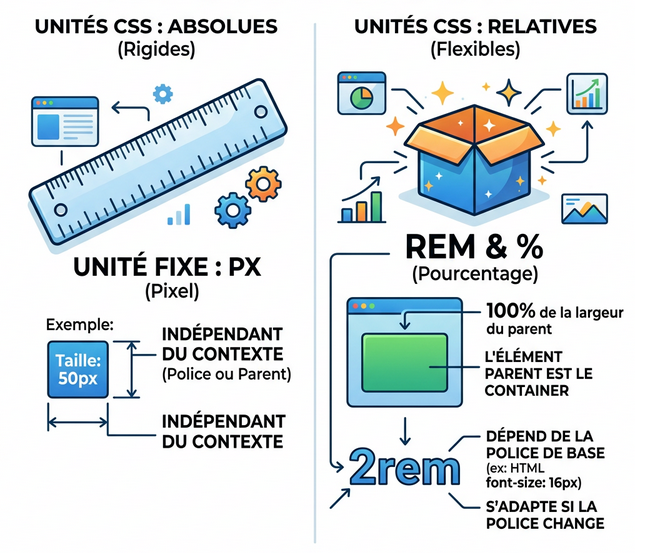
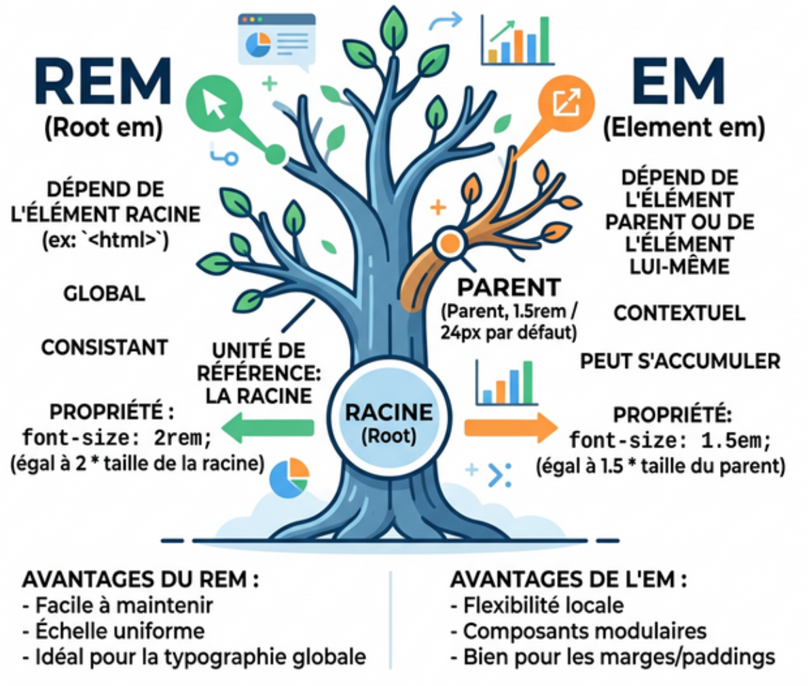

# Les Unités de Mesures

<div
  class="omny-meta"
  data-level="🟢 Débutant"
  data-version="1.0"
  data-time="2-3 heures">
</div>

## Introduction

!!! quote "Analogie pédagogique - Le mètre ruban vs La loupe magique"
    Imaginez qu'on vous demande de construire une maison. Vous utilisez un décamètre classique en laiton : *1 mètre vaudra toujours 1 mètre*. Que vous regardiez votre maison à l'œil nu, ou à travers des jumelles, le mur de la maison fait 1 mètre. Ce sont les unités **absolues** (comme le pixel `px`). 
    
    Imaginez maintenant que vous êtes dans Alice au Pays des Merveilles. Vous possédez une "**loupe magique de croissance**". Si vous appliquez une unité "**loupe magique**" sur une chaise, la taille de cette chaise dépendra désormais de la taille de la grande pièce dans laquelle elle est rangée ! Si la pièce grandit par magie de 20%, la chaise à l'intérieur grossit à son tour mathématiquement de 20% pour préserver l'harmonie. Ce sont les unités **relatives** (comme le `rem` ou les `%`).
    
    En développement web moderne, créer un site avec uniquement des mètres-rubans rigides (`px`) est une faute professionnelle grave. Pourquoi ? Parce que l'internaute consultera votre travail sur un gigantesque écran d'ordinateur de 42 pouces, ou sur le minuscule écran d'une montre connectée !

Si vous ne comprenez pas intimement la différence entre `px`, `rem`, `em` et `vw` **AVANT** d'aborder des architectures complexes comme **Flexbox** ou **Grid**, votre design finira toujours par "**déborder**" ou "**se casser**" sur un téléphone mobile. 

!!! tip "Ce module est fondamental pour garantir la souveraineté numérique de votre interface sur tous les profils d'appareils existants."

<br />

---

## L'Ancienne École : L'Unité Absolue (`px`)

!!! info "Le **pixel** (`px`) est l'unité de base historique. Il est statique, immuable et "dur"."

```css title="Code CSS - La rigidité mortelle"
.boite-rigide {
    width: 300px; /* Permet de définir la largeur en pixels */
    font-size: 16px; /* Permet de définir la taille de la police en pixels */
}
```

!!! danger "L'ennemi juré de l'ergonomie"
    En code moderne, **n’utilisez JAMAIS les pixels pour la taille des textes (`font-size`)**. 
    
    **Pourquoi ?** : Les utilisateurs malvoyants ont tous réglé leur navigateur (_Chrome_, _Firefox_, _Safari_) avec un paramètre système spécifiant d'_agrandir les textes par défaut à 150%_. Si votre texte est codé en dur à `16px`, il restera bloqué bêtement et **infiniment** à `16px`, ignorant ainsi les besoins médicaux de votre visiteur.
    
    L'accessibilité[^1] (**a11y**) numérique de votre site vient de sombrer à **0/100**.

**Quand utiliser le `px` alors ?**

> Exclusivement pour de la **micro-intégration décorative inaltérable** : une petite bordure de boîte (`border: 1px solid black`), l'épaisseur d'une ombre portée (`box-shadow`), ou un très fin interstice fixe.

<br />

---

## Les Unités Relatives de Base 

!!! info "L'importance des illustrations visuelles"
    Afin d'éclaircir ces concepts d'échelles de grandeurs qui peuvent sembler abstraits ou difficiles à concevoir mentalement (comme l'héritage arborescent), ce module regorge d'illustrations schématiques générées pour vous. Chaque concept majeur est accompagné d'un visuel explicatif de style cartoon pour démystifier le comportement du navigateur.

### Unités absolues vs relatives

Les unités de mesures en CSS sont divisées en deux grandes familles fondamentales : les unités **absolues** et les unités **relatives**.



<p><em>Cette illustration schématise l'opposition entre une unité physique de marbre comme le Pixel (PX), parfaitement rigide, face aux unités fantastiques qui gonflent et se rétractent élastiquement en fonction de leur environnement (REM et Pourcentages).</em></p>

### Le Pourcentage (`%`)

!!! quote "Le pourcentage demande toujours : *"**Qui est mon parent direct ?**"*."

Si une boîte mère (Parent) fait `1000px` de large, et que vous donnez `width: 50%` à l'Enfant qui est dedans, cet enfant mesurera obligatoirement `500px`.
Sauf que si l'écran de l'utilisateur rétrécit le parent à `200px` (sur un téléphone), l'enfant rétrecira à `100px` en temps réel, sans que vous n'ayez pu coder quoi que ce soit d'autre !

### Le `rem` (Root EM)

C'est l'unité de mesure **OBLIGATOIRE ET UNIVERSELLE** pour la fluidité d'un design moderne. « REM » signifie « Elément relatif à la Racine (Root) ». La « Racine », c'est la balise suprême fondamentale `<html>` elle-même de votre fichier.

!!! abstract "Le pont technique : `<html>` et `:root`"
    Dans le module précédent, vous avez appris à utiliser `:root` pour stocker vos variables globales. Ici, on vous parle de la balise `<html>`. **C'est normal : ce sont les deux faces d'une même pièce !** 
    En CSS, la pseudo-classe `:root` cible spécifiquement l'élément racine absolu du document, qui s'avère être la fameuse balise `<html>`. L'unité relative `rem` s'appuie donc mathématiquement sur la taille de police définie dans ce composant originel commun.

!!! info "Par convention mondiale sur tous les ordinateurs, la balise `<html>` a une taille de texte interne fixée par le système à **`16px`**. (_Sauf si le fameux visiteur malvoyant l'a boosté dans ses paramètres système_). Donc, le navigateur déduit de lui-même que : **`1 rem = 16px`**."

```css title="Code CSS - La propreté du REM"
h1.grand-titre {
    /* Je veux que le titre fasse 32px visuellement, 
       donc je dis à l'ordinateur : "Fais deux fois la taille de la Racine de l'internaute !" */
    font-size: 2rem; 
}

p.texte-normal {
    /* 1.5 multiplier par la racine (16) = 24px perçus par un œil valide ! */
    font-size: 1.5rem; 
}
```

!!! tip "Pourquoi ce détour de langage ?"
    Si cet utilisateur malvoyant a forcé sa racine système à `24px` dans Chrome.
    Le calcul s'adapte Merveilleusement. L'ordinateur lira votre code CSS sans que vous ne deviez le modifier : "**Ah le site de OmnyDocs demande `2rem` ! Or la Racine Médicale du visiteur vaut 24px. Donc je lui affiche un Titre géant adapté à ses yeux de 48px !**". La souveraineté de l'information pour tous !

<br />

---

## L'unité `em`

!!! info "Le **EM** est une unité de mesure relative qui dépend de la taille de police de son élément parent et non de l'élément racine."

Cette unité est fondamentale et comprendre son fonctionnement est nécessaire afin d'éviter toute problématique de débordement et comprendre pourquoi les éléments se comportent de manière inappropriée. L'illustration ci-dessous vous aidera à visualiser le fonctionnement de l'unité EM.



<p><em>Le REM (Root EM) agit comme la source d'eau connectée au tronc majestueux absolu de l'arbre (La racine Html). Quiconque y fait appel puise à la source principale de 16px. Le EM classique, très capricieux, est relatif à la toute petite branche (Le Parent local) qui le soutient, ce qui crééra des cascades de tailles terrifiantes s'il y a trop d'enfants imbriqués !</em></p>

!!! warning "L'unité `em` ne regarde **JAMAIS** la racine globale du site. L'`em` multiplie sa valeur visuellement par **la taille de la police appliquée sur l'Enveloppe PARENTE DIRECTE où un composant se trouve**."

Observez le cauchemar des développeurs juniors qui n'ont pas compris la subtilitée de l'unité `em` :

```html title="Code HTML - Des conteneurs imbriqués"
<div class="boite-grand-pere">
    <div class="boite-parent">
        <p class="texte-enfant">Je suis un texte cassé</p>
    </div>
</div>
```

```css title="Code CSS - L'effet boule de neige du EM"
.boite-grand-pere {
    font-size: 20px;
}

.boite-parent {
    /* Ici, 2em demande "Multiplier par la taille du grand-père direct". Donc 2 * 20 = 40px ! */
    font-size: 2em; 
}

.texte-enfant {
    /* Et ici le texte final demande "Multiplier par le parent direct". Donc 2 * 40px du parent = 80px !! */
    /* Le texte final explose l'écran ! */
    font-size: 2em; 
}
```

!!! tip "**La règle d'or de l'industrie :** N'utilisez **JAMAIS** `em` pour définir la taille des textes (Sauf de rarissimes micro-compositions dans des boutons complexes) ! Restez sur le très sécurisant `rem` qui consulte la racine inaltérable plutôt que les multiples éléments parents."

<br />

---

## Le Viewport (La fenêtre du Navigateur)

!!! quote "Un pourcentage (`%`) demande sa taille à un container-Parent. Mais parfois, nous voulons ordonner : *"Je veux que cet élément remplisse l'intégralité physique de l'écran de l'utilisateur, indépendamment des restrictions de son conteneur parent."*"

Pour s'affranchir de cette hiérarchie et s'aligner exactement sur les bords de l'écran du visiteur, on utilise les unités du **Viewport** (`vw` = Viewport Width "_largeur_", `vh` = Viewport Height "_hauteur_").


<p><em>Les unités du Viewport agissent comme des mètres-rubans de chantier qui viennent mesurer d'un bord métallique à l'autre bord métallique de vote écran physique. 100vw = 100% absolu de cette dimension vitrée perçue, écrasant toutes règles parentales précédentes.</em></p>

1 unité Viewport correspond simplement à **1% de la taille formelle de la vitre du navigateur**.

```css title="Code CSS - Le header monumental"
.section-ecran-accueil {
    /* "Je veux prendre exactement 100% de la largeur totale du navigateur !" */
    width: 100vw;
    
    /* "Et je veux recouvrir d'en-haut en bas toute la hauteur de ce que le téléphone voit en un coup d'oeil sans scroller !" */
    height: 100vh;
}
```

!!! warning "L'Arnaque des téléphones (Et le sauveur DVH)"
    Pendant 10 ans, utiliser `100vh` sur les téléphones mobiles était synonyme de drame (le célèbre bug "Safari iOS bar"). Le navigateur cachait sa propre "Bande de recherche d'URL" qui venait empiéter "par-dessus" votre beau panneau Web.

    La modernité ultime a créé récemment la parade parfaite, en incluant dynamiquement le calcul de rentrée d'interface système d'un mobile : **`dvh`** (Dynamic Viewport Height). 
    
    **En production professionnelle, préférez de loin `height: 100dvh;` pour vos interfaces mobile formelle !**

<br />

---

## Les Container Queries (`cqw` / `cqh`)

!!! info "Vous savez maintenant que les unités du Viewport se basent sur la fenêtre globale du navigateur. Cependant, dans le web moderne basé sur des composants indépendants, un nouveau paradigme émerge : **dimensionner un élément non plus par rapport à l'écran global, mais par rapport à l'intérieur de son conteneur direct !**"

Ce nouveau phénomène se nomme les **Container Queries** (**À ne pas confondre avec les Media Queries classiques** _que l'on verra plus tard_). Il a introduit de nouvelles dimensions relatives : les unités **`cqw`** et **`cqh`**.

- **1 cqw** (Container Query Width) = 1% de la largeur totale de **la section Conteneur immédiate** (Et non plus de tout l'écran complet).

```css title="Code CSS - La nouvelle norme des Cartes Dynamiques"
/* Déclaration d'un contexte "Container" spatial pour l'environnement */
.wrapper-de-carte-de-blog {
    container-type: inline-size;
}

/**
 * À l'intérieur du composant fils, c'est ce repère local formel "cqw" qui est utilisé, pas vw.
 * Si la carte se tasse ou est jetée dans une mini colonne de l'interface, la taille de texte se
 * recalcule harmonieusement peu importe sa position sur le grand écran général ! 
 */
.texte-titre-de-cette-carte {
    font-size: min(10cqw, 2rem);
}
```
!!! note "_**Note**: Les containers Queries sont des mécanismes "**très avancés**". N'essayez pas de les dompter pour vos premiers sites, le combo Flexbox central, pourcentage (%) et rem, couplé à de bons vieux Media Queries classiques, suffit à bâtir 99% du parc d'applications dans le monde._"

<br />

---

## Conclusion et Synthèse

Les unités de mesure sont le sol linguistique du développement frontal. Pour qu'une page Web soit "**Réactive** / **Elastique** / **Responsive**", vous ne pouvez plus coller des blocs monolithiques en pixels rigides sur le mur virtuel de façon mortifère.  L’intelligence du design repose sur une syntaxe dimensionnelle relative simple:

!!! quote "**Utilisez prioritairement les `rem` pour l'accessibilité textuelle et la grandeur micro-typographique, le `%` ou la famille du `viewport` (et des `cq`) pour étirer de force les grands espaces matriciels ("Layout"), et abandonnez le pixel totalitaire `px` exclusivement aux bordures microscopiques fixes insensibles au vent et marées technologiques.**"

> Maintenant que vous savez doser et dimensionner virtuellement ces éléments relatifs, il est temps de comprendre l'espace intérieur profond des objets physiques qui fabrique le volume 3D secret de TOUTE boite Html du monde sur internet : **Le Box Model (Margin & Padding)**, votre prochain module incontournable !

<br />

[^1]: L'accessibilité web désigne l'ensemble des pratiques visant à rendre les services de communication au public en ligne accessibles à tous, notamment aux personnes handicapées, en garantissant que le code et le design respectent les réglages de l'utilisateur (comme le zoom ou la taille de police).