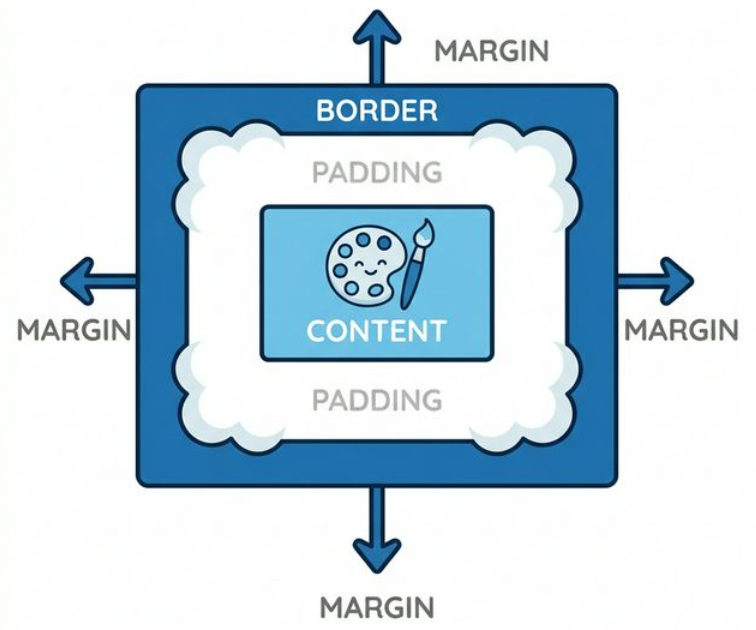

# Modèle de Boîte

<div
  class="omny-meta"
  data-level="🟡 Intermédiaire"
  data-version="1.0"
  data-time="2-3 heures">
</div>

## Introduction

!!! quote "Analogie pédagogique - Le Mystère des Blocs Révélé"
    Imaginez une **œuvre d'art inestimable encadrée** reposant sur le mur blanc d'un musée de Paris. Le **Box Model CSS**, c'est intrinsèquement l'analyse de cette vision de l'espace vitale : 

    1. L'œuvre ou la toile elle-même : **Le Contenu Textuel (`Width`)**
    2. La zone de passe-partout blanc entre la toile et le cadre  : **Le Rembourrage (`Padding`)**
    3. Le gros contour massif physique en or de Louis XIV : **La Bordure (`Border`)**
    4. La distance repoussoir de sécurité nécessaire qui écarte cette œuvre du grand tableau voisin d'à côté pour éviter de polluer notre regard ! : **La Marge extérieure (`Margin`)** 
    
Avant de savoir mettre en place une belle ligne responsive via Flexbox en CSS, vous **devez** absorber comment une simple malheureuse balise carrée en HTML vit sa propre proportion sur votre page et envahit l'espace. Sinon, vous passerez la semaine complète à pleurer sans comprendre pourquoi *"ça sort de l'écran mon chef !"*.

!!! note "Ce module désamorce définitivement le Box Model pour vous offrir des blocs sains au pixel près."

<br />

---

## Les trois composants fondamentaux du Box Model

Chaque élément HTML est structurellement un objet rectangulaire (une "boîte") généré par le navigateur. Cette boîte est constituée de 4 zones concentriques : le contenu lui-même, entouré de 3 niveaux d'emballages paramétrables.



### Padding : (Espace Intérieur)

!!! info "Le **Padding** est l'espace de respiration interne situé entre votre contenu (ex: le texte) et la bordure de la boîte."

Le padding repousse le contenu vers l'intérieur pour éviter qu'il ne s'écrase contre les limites physiques de l'élément.
*(Particularité : Le Padding est vide de contenu, mais il affiche la couleur de fond `background-color` de l'élément).*

```css title="Code CSS - Le Padding"
.card {
    background-color: lightgreen;
    
    /* Repousse le mot tout nu de 40 pixels par rapport aux bordures de 'card' */
    padding: 40px; 
    /* (Même en haut, en bas, à gauche, à droite simultanément) */
}
```

### Border : (Bordure réelle)

La bordure est la ligne visible qui encadre physiquement la zone de Padding et le Contenu. C'est la limite matérielle de votre boîte.

```css title="Code CSS - La Bordure"
.card {
     /* Epaisseur massive (3 pixels), Design ligne droite dure (solid), Noir total */
    border: 3px solid black;
    
    /* Astuce magique : je rogne informatiquement les angles avec radius ! */
    border-radius: 8px;
}
```

### Margin : (Espace Extérieur)

!!! quote "La **Marge extérieure** (`Margin`) est la distance de sécurité invisible qui sépare votre composant de ses voisins."

La Marge s'applique à l'extérieur de la bordure. Elle repousse les autres éléments HTML environnants pour aérer la mise en page.

```css title="Code CSS - La Margin"
.card {
    /* Repousse les éléments voisins de 50 pixels dans toutes les directions */
    margin: 50px;
    /* Cet espace est 100% VISUELLEMENT INVISIBLE : la margin n'a PAS de couleur de fond, elle dévoile l'arrière-plan de la page entière. */
}
```


<br />

---

## Les valeurs raccourcies (Shorthand)

Il est redondant d'écrire `margin-top`, `margin-bottom`, `margin-right`, `margin-left` sur plusieurs lignes lorsqu'il est possible de compresser l'instruction.

!!! info "Mémorisez la **règle de l'horloge** pour déchiffrer les blocs de 4 paramètres : la lecture commence toujours à midi et tourne dans le sens des aiguilles d'une montre : **Haut, Droite, Bas, Gauche**."

```css title="Code CSS - Valeurs raccourcies"
/* Cas 1 : Uniforme global absolu */
.box { margin: 20px; } /* => Haut:20, Bas:20, Droite:20, Gauche:20 */

/* Cas 2 : Le système d'Axe Horizontal vs Axe Vertical */
.box { margin: 10px 40px; } /* => Vértical en Haut/Bas = 10px , et Horizontal Gauche/Droite = 40px */

/* Cas 3 : La rotation comme le sens des aiguilles d'une montre */
.box { margin: 10px 20px 30px 40px; } /* => Top:10px, Right:20px, Bottom:30px, Left:40px */
```

!!! tip "Astuce mémotechnique"
    Cette mécanique horlogère (Haut, Droite, Bas, Gauche) fonctionne exactement de la même manière pour l'instruction `padding` !

<br />

---

## Contrôler les mathématiques du navigateur : `box-sizing`

!!! warning "Le piège de la taille totale par défaut (`content-box`)"
    Si vous assignez une largeur fixe `width: 300px` à un élément, puis que vous lui ajoutez un `padding: 20px` et une `border: 2px`...
    La logique humaine voudrait que l'élément fasse au total 300px de large. **Ce n'est pas le cas par défaut sur le web.**
    
    Le navigateur calcule mathématiquement :
    `300px (contenu)` + `20px (padding-left)` + `20px (padding-right)` + `2px (border-left)` + `2px (border-right)` = **344px de largeur visuelle réelle !**
    Résultat : Vos composants sont systématiquement trop grands et font déborder l'écran.

### Le Standard de l'Industrie : `border-box`

Pour forcer le navigateur à emboîter le `padding` et la `border` à **l'intérieur** de la limite exacte de la largeur définie (`width`), on utilise la propriété `box-sizing: border-box;`. La boîte ne grossira plus jamais vers l'extérieur : son contenu se compressera naturellement au centre pour laisser la place au rembourrage interne.

!!! abstract "La Fusion des Marges (Margin Collapsing)"
    Un autre piège fréquent du Box Model concerne l'axe vertical. Si une boîte possède un `margin-bottom: 30px` et que la boîte physiquement en-dessous (son frère) possède un `margin-top: 20px`, la distance entre les deux boîtes ne sera **pas** de 50px ! Le navigateur superpose les marges verticales et ne conserve que la plus grande (ici 30px). Ce phénomène contre-intuitif s'appelle la **fusion des marges** (ou Margin Collapsing).

```css title="Code CSS - Reset Universel"
/* LA commande de base à Mettre A TOUT PRIX au haut des CSS modernes sur le Sélecteur universel Étoile * ! */
* {
    /* Toute balise existante suivra la consigne ! */
    box-sizing: border-box; 
    /* width: 300px RESTERA ETERNELLEMENT à 300px visuel !! La paix intérieure.*/
}
```

<br />

---

## Le Centrage horizontal classique (`margin: auto`)

Une problématique très courante en intégration : "Comment centrer parfaitement le bloc principal au milieu de l'écran horizontalement ?"
La solution mathématique la plus propre, avant l'arrivée de Flexbox, consistait à combiner une limite de largeur (`max-width`) avec des marges latérales définies sur la valeur **`auto`**.

```css title="Code CSS - Centrage pur"
.banniere-milieu {
    /* 1. On donne des limites à l'objet pour qu'il ne s'étire pas à 100% de l'écran */
    max-width: 800px;
    
    /* 2. Le miracle de la marge automatique ! */
    /* Marge Haute et Basse à Zéro. Marge Gauche et Droite définies sur `auto`. 
       Le navigateur va diviser l'espace vide restant en deux parts parfaitement égales, 
       suspendant ainsi la boîte exactement au centre. */
    margin: 0 auto; 
}
```

<br>

---

## Conclusion et Synthèse

!!! quote "Le Box Model est le battement de cœur de toute intégration Web. Sans lui, le design n'est que hasard. La maîtrise stricte de la marge (pour séparer), du padding (pour faire respirer) et de la bordure, le tout protégé par la déclaration universelle `box-sizing: border-box`, vous assure des composants stables."

> Dans le module suivant, nous apprendrons à faire danser tous nos nouveaux composants créés ensemble par le concept inouï de flux directionnel : **Flexbox CSS**.

<br />
