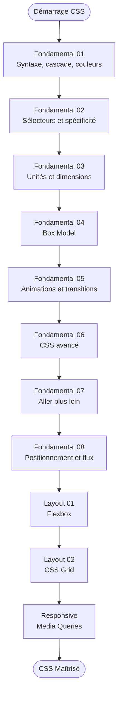

# CSS

!!! quote "Analogie"
    _Si le HTML est le squelette de la maison, le CSS englobe toute la peinture, la décoration intérieure, l'ergonomie des meubles et l'éclairage. Sans lui, le web serait une gigantesque page de roman austère sur fond blanc._

## Objectif

Le CSS (Cascading Style Sheets) est le langage responsable de **100 % du rendu visuel** et de l'adaptation ergonomique d'une application ou d'un site. C'est lui qui positionne les éléments, gère les couleurs, anime les transitions, et garantit que l'interface reste parfaite sur un mobile comme sur un écran géant.

Cette section vous fera passer des simples colorations textuelles aux architectures de layout industriel (Flexbox, Grid) et aux effets graphiques modernes (Variables CSS, Nesting natif, Container Queries, Animations).

!!! note "Comment lire cette section"
    Le CSS s'apprend par strates incompressibles. Vous **devez impérativement** maîtriser les sélecteurs, la spécificité et la cascade avant d'aborder Flexbox ou Grid — sans ces fondations, vous ne saurez pas pourquoi vos blocs refusent d'obéir.

 

---

## Les sections principales

- ### :lucide-palette: CSS — Fondamentaux
    ---
    Huit modules couvrant la cascade, les sélecteurs de précision, les unités relatives (`rem`, `vw`, `clamp`), le Box Model, les animations et transitions, les Variables CSS et Nesting natif, les techniques avancées modernes, et le **positionnement** (`position`, `z-index`, `scroll-behavior`, card flip 3D).

    [Lancer le module 01 — Introduction](./fondamental/01-introduction-css.md)

- ### :lucide-align-horizontal-justify-center: Layout Moderne
    ---
    Les deux moteurs de mise en page du web professionnel. **Flexbox** pour l'alignement sur un axe unidimensionnel. **CSS Grid** pour les mises en page bidimensionnelles complexes, les grilles de contenu et les layouts d'application.

    [Aller vers 01 — Flexbox](./layout/01-flexbox-css.md)

- ### :lucide-smartphone: Responsive Design
    ---
    L'adaptation élastique à tous les écrans (montre, mobile, tablette, TV 4K). Media Queries, méthode _mobile-first_, typographies fluides avec `clamp()`, encoches (`env()`), navigation hamburger CSS et styles d'impression.

    [Aller vers Responsive Design](./responsive/01-responsive-design.md)

 

---

## Progression recommandée

La progression part des fondations atomiques pour s'étendre vers les systèmes de mise en page, puis vers l'adaptation à tous les contextes d'affichage.

 

---

## Rôle dans la progression globale

Le CSS boucle l'apprentissage de la présentation statique frontale. Une combinaison d'un HTML robuste et d'un CSS élastique permet de reproduire n'importe quelle interface au pixel près. La brique manquante pour animer cette interface d'intelligence interactive sera le **JavaScript**.

 

---

## Conclusion

!!! quote "Notre recommandation"
    Ne sautez **jamais** les modules sur le Box Model, les Unités de mesure et le Positionnement. Ce sont les trois portes d'entrée du cauchemar du débordement et du chevauchement d'éléments en intégration Web. Et ne passez à Flexbox qu'une fois la spécificité parfaitement assimilée.

**Point d'entrée recommandé : [01. Introduction au CSS](./fondamental/01-introduction-css.md)**

 