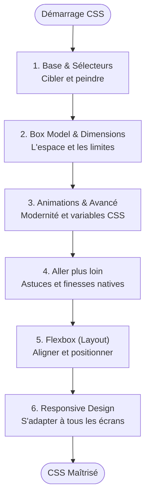

# CSS

!!! quote "Analogie"
    _Si le HTML est le squelette de la maison, le CSS englobe toute la peinture, la décoration intérieure, l'ergonomie des meubles et l'éclairage. Sans lui, le web serait une gigantesque page de roman austère sur fond blanc._

## Objectif

Le CSS (Cascading Style Sheets) est le langage responsable de **100 % du rendu visuel** et de l'adaptation ergonomique d'une application ou d'un site. C'est lui qui positionne les éléments, gère les couleurs, anime les transitions, et garantit que l'interface reste parfaite sur un mobile comme sur un écran géant.

Cette section vous fera passer des simples colorations textuelles aux architectures de layout industriel (Flexbox, Grid) et aux effets graphiques poussés matériellement (Blend Modes, Filtres, Variables, Nesting).

!!! note "Comment lire cette section"
    Le CSS s'apprend par strates incompressibles. Vous **devez impérativement** maîtriser les Sélecteurs, la spécificité (Poids) et la Cascade héritée avant d'aborder les modèles d'alignement comme Flexbox, ou vous ne saurez pas pourquoi vos blocs refusent d'obéir.

 

---

## Les sections principales

- ### :lucide-palette: CSS - Fondamentaux
    ---
    Ce bloc comprend sept sous-modules traitant de la cascade, des sélecteurs de précision, des inévitables unités relatives (rem, vw), du controversé **Box Model** (Marge / Padding), des animations et des techniques modernes de Nesting, complété d'un module "Pour aller plus loin".
    
    [Lancer le module 01. Introduction](./fondamental/01-introduction-css.md)

- ### :lucide-align-horizontal-justify-center: Layout Moderne
    ---
    Cette section aborde les moteurs de mise en page récents. Vous y découvrirez **Flexbox**, la norme planétaire absolue pour aligner dynamiquement des éléments sur un axe unidimensionnel avec flexibilité.

    [Aller vers 01. Flexbox](./layout/01-flexbox-css.md)

- ### :lucide-smartphone: Responsive Design
    ---
    L'art fondamental de l'adaptation élastique à tous les écrans du marché mondial (montre, mobile, tablette, TV). Ce chapitre condense l'étude des Media Queries, de la méthode _mobile-first_ et typographies fluides.

    [Aller vers L'Art de l'Adaptation](./responsive/01-responsive-design.md)

 

---

## Progression recommandée

La progression part des atomes stylistiques purs pour s'étendre progressivement vers la macro-structure. 

 

---

## Rôle dans la progression globale

Le CSS boucle formellement l'apprentissage de la présentation statique frontale. Une combinaison d'un HTML robuste aux instructions CSS élastiques vous permet de cloner n'importe laquelle des interfaces existantes au pixel près. La seule brique manquante pour que cette oeuvre mort s'anime d'intelligence interactive sera l'injection de logique algorithmique, via le **JavaScript**.

 

---

## Conclusion

!!! note "Notre recommandation"
    Ne sautez **jamais** les modules sur le _Box Model_ et les _Unités de mesure_ (Fondamentaux). Ce sont les deux portes d'entrées du cauchemar du débordement d'éléments en intégration Web. 

**Point d'entrée recommandé : [01. Introduction au CSS](./fondamental/01-introduction-css.md)**

 
