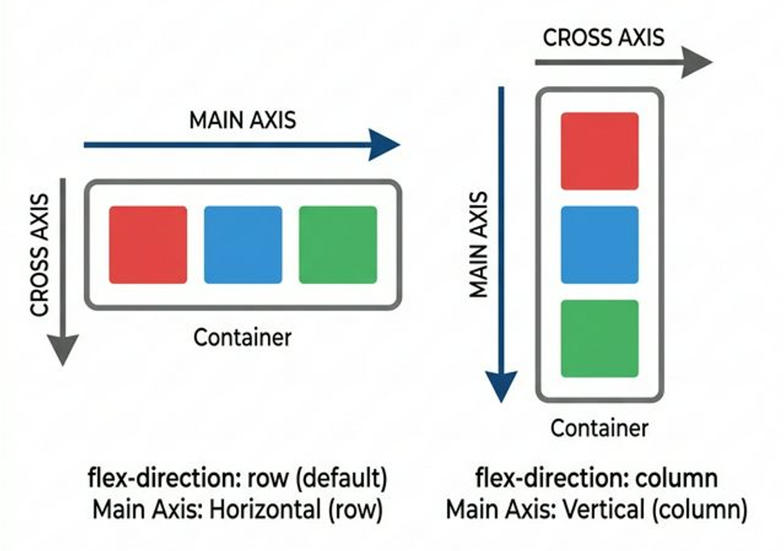
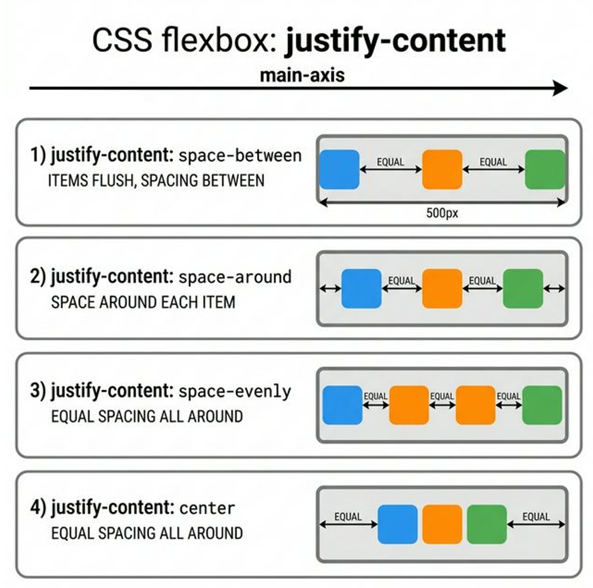
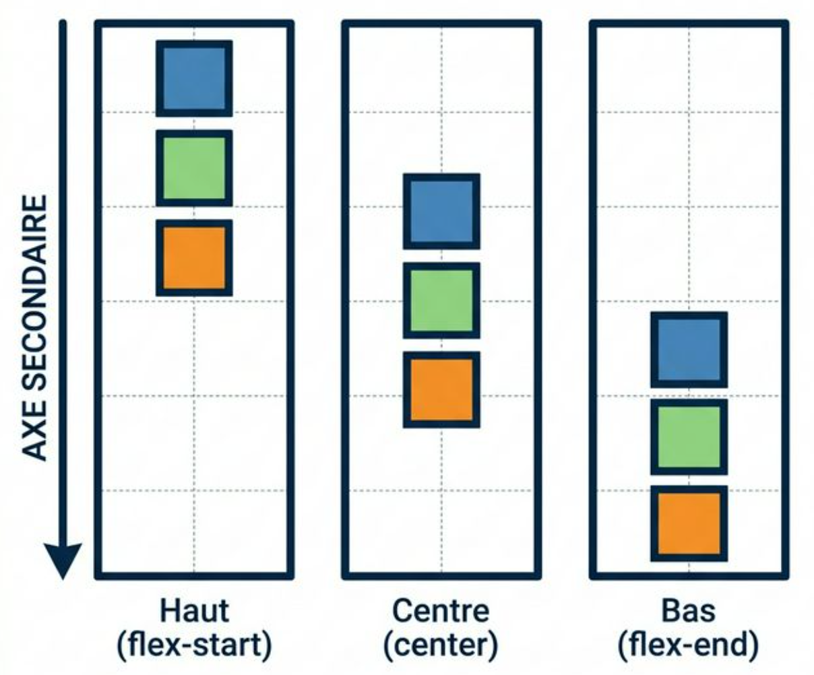
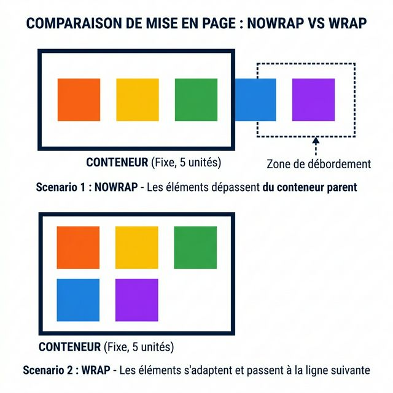

# CSS Flexbox

<div
  class="omny-meta"
  data-level="🟡 Intermédiaire"
  data-version="2.0"
  data-time="4-6 heures"
></div>
  
## Introduction

Pendant les premières années du Web, positionner des blocs nécessitait des propriétés instables (`float`, `inline-block`) et des calculs manuels complexes. En 2015, le W3C[^1] a standardisé **Flexbox** (The Flexible Box Module). 

Flexbox est un système **unidimensionnel**[^3] : il traite les éléments sur un seul rail à la fois (soit en ligne, soit en colonne). Ce module est la fondation du design responsive moderne.

!!! quote "Analogie pédagogique — L'orchestre d'élastiques"
    Imaginez un conteneur comme une scène d'orchestre dont le sol serait un élastique géant. Plutôt que de fixer la position rigide de chaque musicien (vos éléments HTML), vous définissez les règles de tension de l'élastique[^2]. Les musiciens s'adaptent alors d'eux-mêmes : ils se serrent si l'espace manque, s'étirent pour combler le vide, ou sautent à la ligne si la scène devient trop étroite.


<br />

---

## Le Concept des Deux Axes

!!! note "Pour maîtriser Flexbox, il est impératif d'abandonner les notions de "Gauche/Droite" ou "Haut/Bas". La logique repose sur deux vecteurs invisibles pilotés par le parent."

### L'Axe Principal (Main Axis) et l'Axe Secondaire (Cross Axis)

Lorsque vous activez le contexte Flexbox, un rail traverse votre conteneur : c'est l'**Axe Principal**. Perpendiculairement à celui-ci se trouve l'**Axe Secondaire**.

!!! abstract "La bascule des axes"
    La puissance de Flexbox réside dans sa capacité à faire pivoter l'Axe Principal à 90 degrés.

    - Si l'Axe Principal est horizontal, l'alignement se fait en **Ligne** (`row`).
    - Si l'Axe Principal est vertical, l'alignement se fait en **Colonne** (`column`).



<p style="text-align: center;"><em>Cette illustration schématise la bascule entre le mode Ligne (axe principal horizontal) et le mode Colonne (axe principal vertical). L'axe secondaire suit toujours perpendiculairement.</em></p>

!!! warning "Le secret de la terminologie"
    - `justify-content` dirige l'**Axe Principal**. Soit, ça **ne veut PAS dire** "aligne à gauche ou à droite". Cela veut très exactement dire :<br>_"Gère le vide tout le long de l'Axe PRINCIPAL, peu importe dans quel sens il est tourné !"_
    - `align-items` dirige l'**Axe Secondaire**. Soit, ça **ne veut PAS dire** "centre verticalement". Cela veut dire :<br>_"Aligne les enfants sur l'Axe SECONDAIRE perpendiculaire, peu importe où il se trouve !"_

<br />

## Cibler la direction : `flex-direction`

Flexbox repose toujours sur la relation **Parent / Enfants directs**. On n'applique *jamais* la commande `flex` sur l'enfant que l'on veut déplacer. On l'applique **au conteneur** qui l'englobe.

```html title="Code HTML - La structure Parent / Enfants"
<!-- LA GRANDE BOITE (Le Parent) -->
<nav class="super-menu-parent">
    <!-- LES 3 ENFANTS DIRECTS (Qui vont devenir élastiques) -->
    <a href="#" class="enfant">Accueil</a>
    <a href="#" class="enfant">Produits</a>
    <a href="#" class="enfant">Contact</a>
</nav>
```

```css title="Code CSS - Ciblage des enfants"
.super-menu-parent {
    /* Établit un contexte de formatage Flex */
    display: flex;

    /* Définit le sens de l'Axe Principal */
    /* Valeurs : row (défaut), column, row-reverse, column-reverse */
    flex-direction: row;
}
.enfant {
    background-color: red; /* Chaque lien aura un fond rouge */
}
```

### Explication des valeurs de `flex-direction`

- `row` **(Valeur par Défaut)** : L'axe principal est horizontal, comme un texte de gauche à droite. L'axe secondaire est donc la hauteur (vertical). Les enfants se colleront naturellement les uns à côté des autres (gauche -> droite).

    !!! note "Il faut savoir que si la direction est **row** alors il n'est pas nécessaire de saisir celle-ci sur le parent. Par contre pour une meilleure lisibilité du code il est courant de voir cette dernière inscrite."

- `column` : L'axe principal pivote à 90°. Il devient vertical (de haut en bas). L'axe secondaire devient la largeur (horizontal). Les enfants s'empileront naturellement en colonne.

- `row-reverse` : L'axe principal reste horizontal, mais l'origine démarre complètement à Droite ! Le premier enfant HTML sera affiché tout à droite de l'écran, et les suivants se construiront vers la gauche.

- `column-reverse` : Comme une colonne, mais la pile commence en bas de la boîte et empile les éléments vers le haut.

<br />

---

## Positionnement spatial : `justify-content`

La propriété `justify-content` définit la manière dont l'espace vide restant est réparti le long de l'**Axe Principal** ou l'**Axe Secondaire**.

### Le Comportement selon la direction choisie (C'est ici que le débutant se perd !)

!!! warning "Le piège de la direction : Comprendre `justify-content`"
    L'erreur la plus commune est de retenir que `justify-content` égale "Horizontal" et c'est tout simplement **faux**. 
    `justify-content` dirige l'**Axe Principal**.
    
    - Si le parent est en **`flex-direction: row` (défaut)** : L'axe principal est Horizontal. Ici, `justify-content` gère l'espacement de Gauche à Droite.
    - Si le parent est en **`flex-direction: column`** : L'axe principal pivote à 90°. Il devient Vertical. Désormais, `justify-content` gère l'espacement **de Haut en Bas** (Hauteur) !

Si vous comprenez ce changement de gravité, vous maîtrisez Flexbox.  

!!! quote "Afin de mieux assimiler le concept, l'illustration ci-dessous vous accompagnera dans votre compréhension sur ce qui est attendu en fonction de la valeur de `justify-content` sur l'axe principal (main axis). Comprenez qu'il est question ici d'être en `flex-direction: row`"




<p style="text-align: center;"><em>Représentation de la distribution mathématique du vide sur l'Axe Principal, permettant d'espacer ou de regrouper les éléments de manière homogène.</em></p>

!!! note "Comme évoqué précédemment nous sommes dans la direction `flex-direction: row`"

```css title="Code CSS - Répartition de l'espace"
.menu {
    display: flex;
    justify-content: space-between; 
}
```

| Valeur | Description technique |
| :--- | :--- |
| `flex-start` | Éléments collés au début de l'axe principal. |
| `flex-end` | Éléments poussés à la fin de l'axe principal. |
| `center` | Éléments regroupés au centre de l'axe. |
| `space-between` | Premier et dernier éléments aux bords, vide réparti entre les autres. |
| `space-around` | Espace égal partagé autour de chaque élément. |
| `space-evenly` | Espace strictement identique entre chaque bord et chaque élément. |

<br />

---

## Alignement transversal : `align-items`

Très bien, notre espace principal est géré. Mais observons l'Axe Secondaire de travers !

Si vous êtes en mode `row` (ligne de gauche à droite), votre Axe Secondaire est **Vertical**. Et si votre menu fait 120 pixels de `height` (hauteur totale) alors que le texte de vos enfants fait 20 pixels. Où doivent "flotter" vos enfants dans les 100 pixels qui restent "en haut ou en bas" de leur enveloppe parentale ?

C'est l'essence d'`align-items` : l'alignement individuel transversal de chaque objet.



<p style="text-align: center;"><em>L'alignement transversal permet de centrer ou d'étirer les éléments sur l'épaisseur du conteneur, quel que soit leur contenu propre.</em></p>

```css title="Code CSS - Centrage vertical en ligne"
.header {
    display: flex;
    flex-direction: row;
    height: 120px;
    
    /* Gestion du vide sur le rail principal (Horizontal -> Je pousse à droite) */
    justify-content: flex-end;
    
    /* Gestion de la position sur le rail d'épaisseur perpendiculaire
       (Vertical -> Je centre parfaitement les textes dans les 120px !) */
    align-items: center; 
}
```
*Ce code assure que tous les éléments sont parfaitement centrés verticalement dans les 100px de hauteur du parent.*

| Valeur | Description technique |
| :--- | :--- |
| `stretch` | *(Défaut)* Les enfants s'étirent pour remplir 100% de l'espace sur l'axe transversal. |
| `flex-start` | Les enfants se regroupent collés au début de l'axe secondaire (le "toit"). |
| `flex-end` | Les enfants se regroupent collés à la fin de l'axe secondaire (le "sol"). |
| `center` | Les enfants sont centrés parfaitement au milieu de l'axe transversal. |
| `baseline` | Aligne les éléments sur la ligne de base (ligne d'écriture) de leur texte. |


<br />

---

## Gérer les lignes multiples : `flex-wrap` et `align-content`

Par défaut, Flexbox tente de faire tenir tous les éléments sur une seule ligne (`nowrap`), quitte à les écraser.

### `flex-wrap` : La cassure de ligne

```css title="Code CSS - Autoriser le retour à la ligne"
.galerie {
    display: flex;
    flex-wrap: wrap; 
}
```
*Si les enfants dépassent la largeur du parent, ils basculent automatiquement sur une nouvelle ligne.*



<p style="text-align: center;"><em>Le passage à la ligne évite l'écrasement des éléments et permet de construire des grilles fluides simples.</em></p>

### Le Raccourci : `flex-flow`

Les développeurs professionnels utilisent souvent le shorthand `flex-flow` pour combiner la direction (`flex-direction`) et le retour à la ligne (`flex-wrap`).

```css title="Code CSS - Shorthand flex-flow"
.navigation {
    display: flex;
    /* Direction: row | Retour à la ligne: wrap */
    flex-flow: row wrap;
}
```
*Cette propriété condense deux intentions en une seule ligne pour une meilleure lisibilité.*


### L'espace entre les lignes (`align-content`)

**Attention** : `align-content` n'a d'effet **que si** `flex-wrap: wrap` est activé et qu'il existe plusieurs lignes. Il définit l'alignement des rangées elles-mêmes.

```css title="Code CSS - Espacement multi-lignes"
.grille {
    display: flex;
    flex-wrap: wrap;
    align-content: space-around; /* Répartition de l'espace entre les lignes */
}
```
*Cette propriété répartit l'espace vertical entre les différentes rangées d'éléments.*

<br />

---

## Gérer l'espacement (la gouttière) : `gap`

Historiquement, l'espacement entre éléments nécessitait des marges latérales (`margin`) souvent complexes à gérer sur les premiers et derniers éléments.

```css title="Code CSS - Utilisation de gap"
.plusieurs-boutons {
    display: flex;
    gap: 20px; 
}
```
*`gap` injecte un espace de 20px uniquement **entre** les enfants, sans affecter les bords extérieurs du conteneur.*

### L'astuce du "Push" avec `margin: auto`

En Flexbox, une marge réglée sur `auto` absorbera tout l'espace disponible dans sa direction. C'est idéal pour séparer un élément du reste d'un groupe (ex: bouton "Déconnexion" en fin de menu).

```css title="Code CSS - Effet de poussée ciblée"
.navbar { display: flex; }
.logout { margin-left: auto; }
```
*Le bouton .logout sera poussé tout à droite en consommant tout le vide à sa gauche.*

<br />

---

## Propriétés individuelles des Enfants

Flexbox permet de définir l'élasticité chirurgicale de chaque élément.

### L'élasticité : `flex-grow`, `flex-shrink` et `flex-basis`

1. **`flex-grow`** : Capacité à grandir pour occuper le vide (Défaut : 0).
2. **`flex-shrink`** : Capacité à rétrécir pour éviter le débordement (Défaut : 1).
3. **`flex-basis`** : Taille idéale de base avant redimensionnement.

!!! tip "Le Shorthand `flex`"
    Il est recommandé d'utiliser la propriété raccourcie `flex`.
    **Standard : `flex: 1 1 auto;` (Grandit, Rétrécit, Taille auto).**

```css title="Code CSS - Élasticité maîtrisée"
.main-content { flex: 1; } /* Grandira pour prendre tout l'espace libre */
.sidebar { flex: 0 0 250px; } /* Taille fixe de 250px (ne grandit pas, ne rétrécit pas) */
```

<br />

---

## Alignement et Ordre spécifique

### La mutinerie individuelle : `align-self`

Un enfant peut outrepasser l'ordre général du parent (`align-items`) pour s'aligner seul.

```css title="Code CSS - Alignement propre"
.notification { align-self: flex-start; }
```

### Accessibilité : `order`

`order` permet de réorganiser visuellement les éléments sans toucher au HTML.

!!! danger "Attention à l'accessibilité"
    La propriété `order` change l'ordre **visuel** mais pas l'ordre du **DOM**. Un utilisateur naviguant au clavier (Tabulation) suivra toujours l'ordre du code HTML original, créant une confusion majeure. Utilisez `order` avec parcimonie.

<br />

---

## Cas pratique : Le Flex imbriqué (Nested Flex)

Dans le Web réel, on utilise souvent un Flexbox à l'intérieur d'un autre pour structurer des composants complexes.

```html title="Code HTML - Menu complexe"
<nav class="nav">
    <div class="logo">OmnyDoc</div>
    <ul class="nav-links">
        <li><a href="#">Cours</a></li>
        <li><a href="#">Lab</a></li>
    </ul>
</nav>
```

```css title="Code CSS - Flex imbriqué"
/* Conteneur principal : Logo à gauche, liste à droite */
.nav {
    display: flex;
    justify-content: space-between;
    align-items: center;
}

/* Secondaire : Les liens se rangent aussi en ligne */
.nav-links {
    display: flex;
    gap: 15px;
    list-style: none;
}
```
*Le parent .nav gère la structure globale, tandis que .nav-links gère l'alignement interne de ses éléments.*

<br />

---

## Résumé et Bonnes Pratiques

!!! success "Les Standards de l'Industrie"
    - **Privilégiez `gap`** au lieu des marges pour les espacements entre éléments.
    - **Utilisez `flex: 1;`** pour les zones de contenu principal qui doivent être fluides.
    - **Vérifiez `flex-direction`** avant de déboguer vos alignements.
    - **Méfiez-vous d' `order`** pour l'accessibilité (A11y).

## Conclusion

!!! quote "Essence de Flexbox"
    Flexbox est l'outil indispensable pour les interfaces unidimensionnelles et la distribution fluide d'espace. Sa maîtrise permet de créer des composants stables et intelligents qui réagissent à tout type d'écran.

> Dans le prochain module, nous aborderons CSS Grid, l'outil conçu pour structurer les architectures globales sur deux dimensions (lignes et colonnes simultanées).

[^1]: W3C : World Wide Web Consortium, organisme de standardisation du Web.
[^2]: Règles de tension : Manière dont les éléments se partagent l'espace libre ou se compressent.
[^3]: Unidimensionnel : Système ne traitant qu'une seule direction à la fois (ligne OU colonne).
