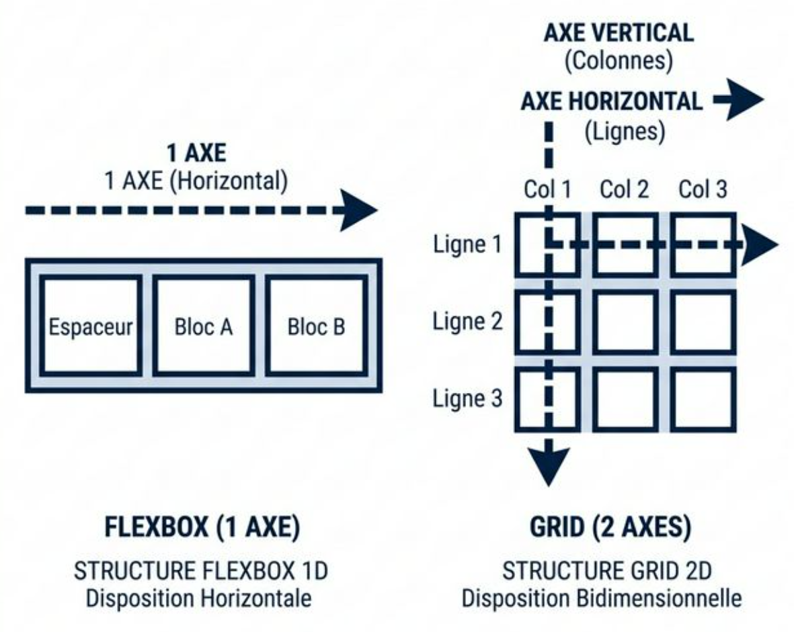
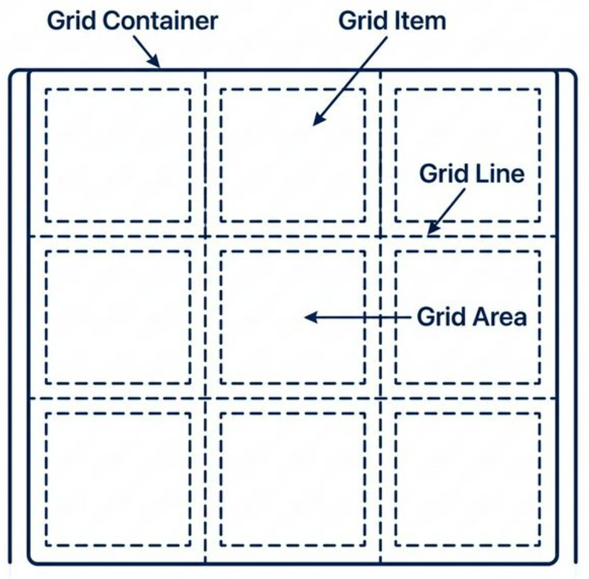
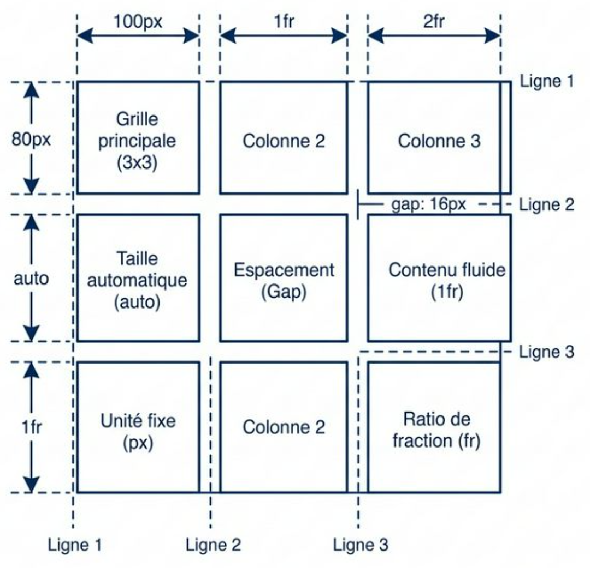
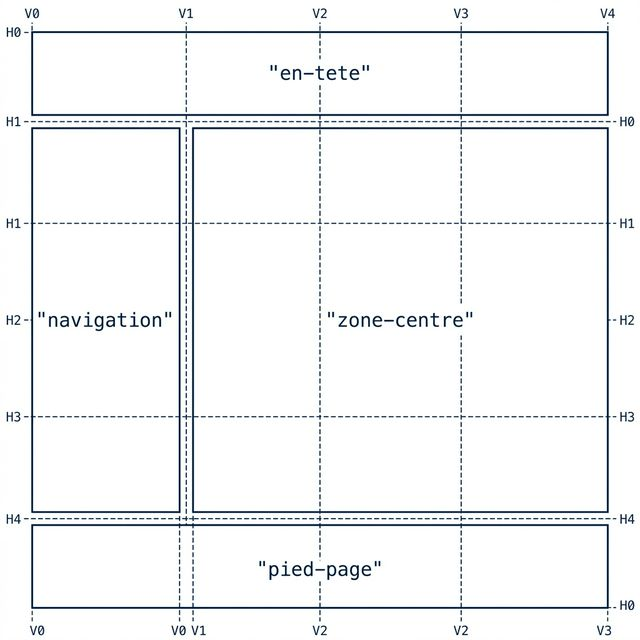

# CSS Grid Layout

<div
  class="omny-meta"
  data-level="🔴 Avancé"
  data-version="2.0"
  data-time="5-7 heures"
></div>

## Introduction

Jusqu'à l'arrivée de Grid en 2017, la structuration globale d'une page Web complète (en-tête, menu latéral, contenu central et pied de page) reposait sur des détournements de propriétés comme `float` ou des imbrications complexes de Flexbox.

**CSS Grid** est le premier système natif de mise en page **bi-dimensionnel** du web. Il permet de définir simultanément des lignes et des colonnes, créant ainsi une grille formelle invisible sur laquelle les éléments peuvent être placés avec une précision absolue.

Grid est l'outil privilégié pour le design **macroscopique** (_la structure globale de la page_), tandis que Flexbox excelle dans le design **microscopique** (_'alignement des éléments à l'intérieur de ces zones_).

!!! quote "Analogie pédagogique — Le plan d'architecte"
    Si Flexbox s'apparente à un élastique unidimensionnel où les éléments s'alignent et réagissent en chaîne, CSS Grid ressemble davantage à un **plan d'architecte**.
    Vous dessinez virtuellement les pièces de la maison (_la grille formelle_), et vous assignez chaque meuble (_vos éléments HTML_) à une pièce précise. La structure globale prime sur le contenu individuel.

<br />

---

## Flexbox vs Grid

!!! info "Il est essentiel de comprendre que **ces deux systèmes sont totalement complémentaires** et conçus pour fonctionner ensemble."



<p style="text-align: center;"><em>Flexbox gère l'alignement sur un seul axe (ligne ou colonne).<br>Grid structure l'espace sur deux axes simultanés (lignes et colonnes croisées).</em></p>

!!! success "La règle d'or de l'intégrateur"

    - Utilisez **Grid** sur le conteneur principal (ex: `<main>`, `<body>`) pour définir les grandes "zones" figées de la page<br>(**En-tête**, **Sidebar**, **Contenu**, **Footer**).

    - Utilisez **Flexbox** à l'intérieur de ces zones pour fluidifier et aligner les éléments de détail<br>(**navigation**, **icônes**, **textes**).

<br />

---

## L'anatomie du système Grid

Une grille repose sur un vocabulaire technique strict en anglais qu'il faut mémoriser, car ce sont ces termes précis que vous utiliserez dans votre code CSS.



<p style="text-align: center;"><em>L'architecture visuelle simplifiée d'un système Grid (Line, Track, Cell et Area).</em></p>

| Terme CSS (Anglais) | Explication simplifiée |
| :--- | :--- |
| **Grid Container** | La boîte géante. L'élément parent principal (ex: `<main>`) sur lequel vous écrivez `display: grid;`. |
| **Grid Item** | Les boîtes intérieures. Ce sont les enfants *directs* du `Grid Container`. |
| **Grid Line** | Les "lignes de découpe" invisibles. Il s'agit des traits métalliques verticaux et horizontaux qui tranchent votre grille. Par exemple, une grille de 3 colonnes possède 4 lignes de découpe verticales ! |
| **Grid Area** | Une "zone" rectangulaire. Il s'agit d'un regroupement de plusieurs dalles adjacentes entre elles. C'est la cible finale où vous encastrerez vos composants. |

<br />

---

## Déclaration et structure : (`grid-template`)

### Initialisation

L'activation du contexte s'effectue sur l'élément parent.

```css title="Code CSS - Naissance de la grille"
.plan-de-travail {
    display: grid;
}
```
*Sans instructions supplémentaires, Grid empilera simplement les enfants dans une colonne unique par défaut.*

### Le découpage structurel : (`grid-template-columns`) et (`grid-template-rows`)

La puissance de Grid réside dans la définition explicite de sa structure. Plutôt que de laisser les enfants dicter leur taille, c'est le conteneur (*Grid Container*) qui tranche l'espace.

- **`grid-template-columns`** : Définit le nombre exact de colonnes (verticales) et la largeur de chacune.
- **`grid-template-rows`** : Définit le nombre exact de lignes (horizontales) et la hauteur de chacune.

!!! note "Pour gérer l'élasticité de la grille de manière fluide et éviter les pourcentages infernaux, le W3C a introduit une unité spécifique très puissante : la **fraction** (`fr`). Elle représente une part mathématique de l'espace vidé restant."



<p style="text-align: center;"><em>L'utilisation conjointe de pixels fixes pour des éléments précis (comme une barre latérale) et de fractions (fr) pour le contenu fluide permet un contrôle architectural absolu.</em></p>

```css title="Code CSS - Découpe des axes"
.architecture-container {
    display: grid;
    
    /* 1. TRANCHAGE VERTICAL (Les Colonnes) */
    grid-template-columns: 100px 1fr 2fr;
    /* La colonne 1 fait 100px fixes.
     * La colonne 2 prend 1 part du vide.
     * La colonne 3 prend 2 parts du vide (le double de la 2). */
    
    /* 2. TRANCHAGE HORIZONTAL (Les Lignes/Rangées) */
    grid-template-rows: 80px auto 1fr;
    /* La ligne 1 fait 80px fixes.
     * La ligne 2 s'adapte à son contenu.
     * La ligne 3 prend 1 part du vide. */
    
    /* 3. L'ESPACEMENT (Gouttière) */
    gap: 16px; 
}
```

!!! tip "La répétition avec `repeat()`"
    Pour éviter la redondance dans les grandes grilles paramétriques, la fonction `repeat()` simplifie le code :
    `grid-template-columns: repeat(12, 1fr);` (Génère 12 colonnes égales).
    `grid-template-columns: repeat(3, 100px 2fr);` (Génère une alternance : 100px, 2fr, 100px, 2fr, 100px, 2fr).

<br />

---

## Le placement absolu : (`grid-column`) et (`grid-row`)

Par défaut, l'algorithme de Grid place les éléments séquentiellement dans les cellules disponibles de gauche à droite, de haut en bas (régi par `grid-auto-flow`). Mais il est possible de forcer la position d'un enfant en l'ancrant sur les **Grid Lines**.

Ces propriétés s'appliquent directement à l'**Enfant**.

```css title="Code CSS - Étirement sur les lignes"
.element-banniere {
    /* L'élément commence à la ligne verticale 1 et s'étend jusqu'à la ligne 4 */
    grid-column: 1 / 4; 
    
    /* L'élément occupe la première ligne horizontale (entre la ligne 1 et 2) */
    grid-row: 1 / 2; 
}

.element-footer {
    /* Astuce : -1 cible toujours la toute dernière ligne de la grille */
    grid-column: 1 / -1; 
}

.element-large {
    /* Alternative avec span : 
     * l'élément s'étale sur 2 colonnes à partir de sa position actuelle */
    grid-column: span 2; 
}
```

<br />

---

## Les zones nommées : (`grid-template-areas`)

S'appuyer sur des numéros de lignes invisibles peut devenir difficile à maintenir sur des grilles complexes. La propriété `grid-template-areas` permet de dessiner une représentation visuelle ("ASCII art") de l'architecture.



<p style="text-align: center;"><em>La définition de la grille par mots-clés permet aux éléments HTML enfants de s'encastrer automatiquement sur les territoires désignés.</em></p>

```css title="Code CSS - Structure par ASCII Layout"
/* LE CONTENEUR PARENT */
.layout-page {
    display: grid;
    grid-template-columns: 200px 1fr 200px;
    grid-template-rows: 100px 1fr 80px;
    
    grid-template-areas:
        "en-tete    en-tete     en-tete"
        "navigation zone-centre pub-droite"
        "pied-page  pied-page   pied-page";
}

/* LES ENFANTS (Indépendants de l'ordre HTML) */
.header { grid-area: en-tete; }
.main-content { grid-area: zone-centre; }
```

!!! example "Responsive Design et Media Queries (Aperçu futur !)"
    **Ne vous inquiétez pas si vous ne maîtrisez pas encore la syntaxe `@media` ci-dessous !** Le concept du *Responsive Design* fera l'objet d'un module entier à la suite de ce cours. 
    Cet exemple est juste là pour vous prouver la puissance de l'ASCII art en production.
    
    L'avantage majeur de `grid-template-areas` est sa flexibilité redoutable. Sous un point de rupture (sur un petit écran Mobile), il n'est **absolument pas nécessaire** d'ajouter ou de modifier les classes sur vos balises HTML. Il suffit simplement de redessiner l'organisation du Pochoir Parent !
    
    ```css title="Code CSS - Responsive Design et Media Queries (Aperçu futur !)"
    /* Sur un écran de téléphone (quand la largeur est au maximum de 768px) */
    @media (max-width: 768px) {
        .layout-page {
            grid-template-columns: 1fr;
            grid-template-areas:
                "en-tete"
                "zone-centre"
                "navigation"
                "pub-droite"
                "pied-page";
        }
    }
    ```

<br />

---

## L'élasticité intelligente : (`minmax()`), (`auto-fit`) et (`auto-fill`)

Fixer une grille en pixels absolus rend le comportement rigide. La véritable puissance de Grid repose sur ses fonctions calculatoires.

### Sécuriser les dimensions avec `minmax()`

Cette fonction permet de définir un plancher de survie (_minimum absolu_) tout en autorisant une expansion élastique (_maximum_).

```css title="Code CSS - Intervalles sécurisés"
.galerie {
    display: grid;
    /* La colonne ne tombera jamais en dessous de 250px, 
       mais s'étirera sur le vide restant grâce à la fraction 1fr. */
    grid-template-columns: repeat(3, minmax(250px, 1fr));
}
```

### Le comportement fluide algorithmique (`auto-fit`)

Définir un nombre fixe de colonnes (ex: `repeat(3)`) oblige inévitablement à utiliser des `@media query`. L'utilisation du mot-clé `auto-fit` **permet de responsabiliser le navigateur sur le nombre de colonnes nécessaires**, sans aucun point de rupture.

```css title="Code CSS - Grille fluide algorithmique"
.catalogue-articles {
    display: grid;
    gap: 15px;
    
    /* Génère autant de colonnes élastiques (1fr) de minimum 300px 
       qu'il est physiquement possible de faire tenir dans la fenêtre. */
    grid-template-columns: repeat(auto-fit, minmax(300px, 1fr));
}
```
*Si l'écran mesure moins de 600px, les éléments "sauteront" mécaniquement à la ligne et la grille passera naturellement sur moins de colonnes.*

<br />

---

## Résumé et Bonnes Pratiques

!!! success "Les Standards de l'Industrie"
    - **Le Macro et le Micro** : Utilisez Grid pour positionner vos blocs géants de page (`<header>`, `<main>`, `<footer>`), et utilisez Flexbox à l'intérieur pour les détails.
    - **L'unité fr** : Privilégiez systématiquement la fraction (`fr`) aux pourcentages pour répartir l'espace résiduel.
    - **Nommez vos zones** : Utilisez `grid-template-areas` dès que votre grille dépasse les 4 ou 5 éléments ; c'est indispensable pour la maintenance.
    - **Le responsive fluide** : Maîtrisez `auto-fit` et `minmax()` pour réduire presque totalement le besoin de `@media query` pour vos grilles d'articles.

## Conclusion

!!! quote "Le système CSS Grid s'impose aujourd'hui comme la fondation inébranlable de la macro-architecture front-end moderne. Il permet de bâtir des structures fiables en deux dimensions (_lignes et colonnes_) sans bricolage ni hacks CSS."

> C'est une excellente fondation pour comprendre les enjeux d'adaptabilité qui caractérisent les projets contemporains. Dans la suite du programme, les chapitres sur le **Responsive Design** avancé (unités de fluidités telles que `rem`, ou l'utilisation de `clamp()`) vous permettront de créer des interfaces parfaitement universelles, quel que soit le périphérique.

[^1]: W3C : World Wide Web Consortium, l'organisme de standardisation responsable de la validation des spécifications liées au web (HTML, CSS).
