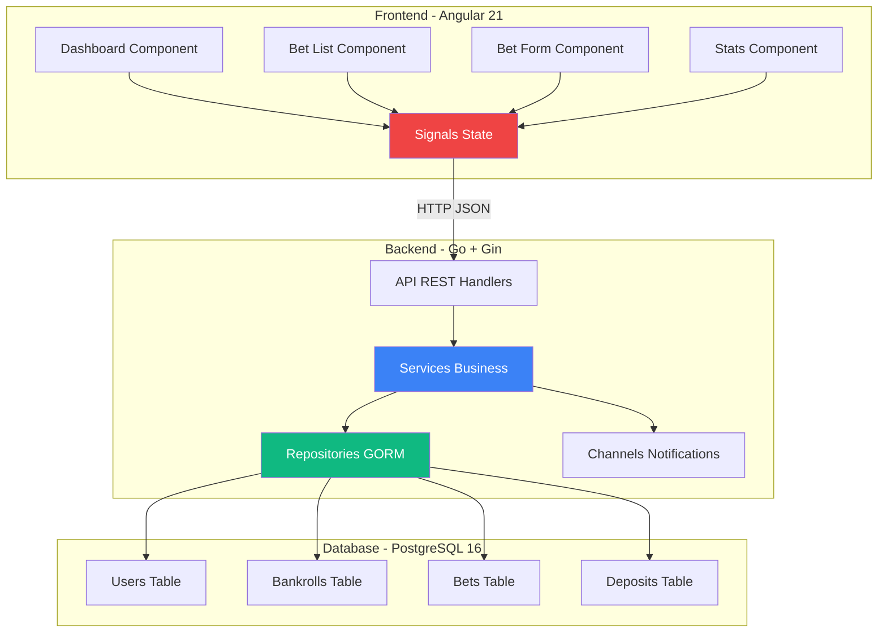
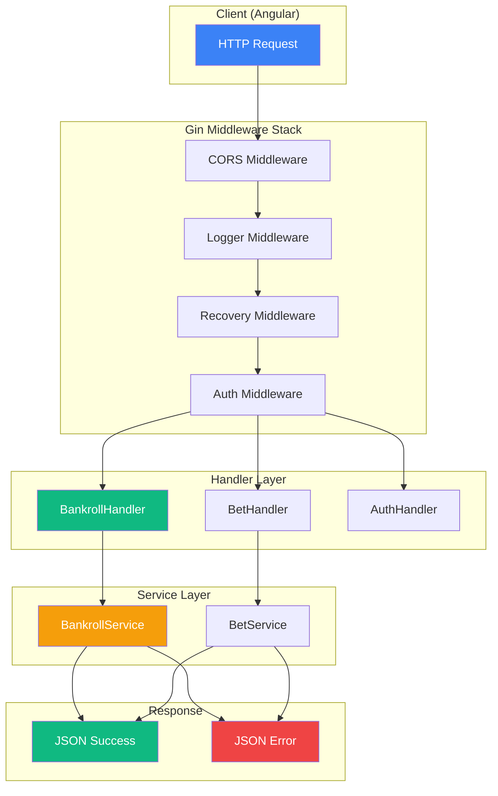
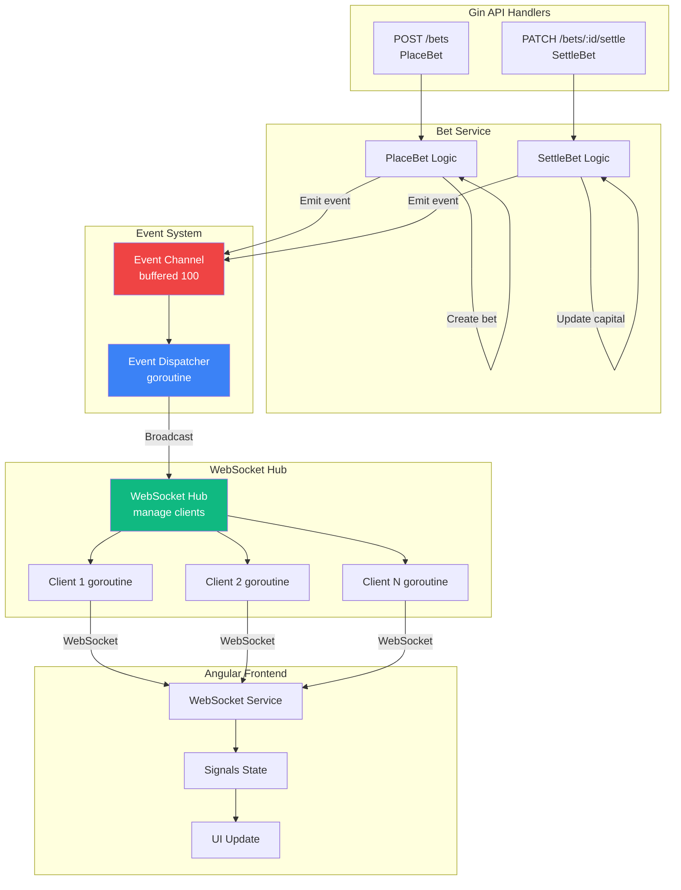

# Go

<div
  class="omny-meta"
  data-level="🔴 Avancé"
  data-version="1.0.0"
  data-time="60 heures">
</div>

## Introduction au Projet Gestionnaire Paris Sportifs

!!! quote "Analogie pédagogique"
    _Imaginez que vous gérez un **portefeuille d'investissement** avec de l'argent réel. Avec un **tableur Excel classique**, c'est comme écrire vos transactions sur un **carnet papier** : vous notez "Investi 10€", "Gagné 20€", et vous calculez mentalement votre capital restant. Le **problème** ? Si vous faites plusieurs paris simultanés, vous pouvez **oublier de déduire une mise** et vous retrouver en **découvert** sans le savoir (vous pariez 95€ alors qu'il ne vous reste que 90€ disponibles). **Betting Manager Pro fonctionne comme une banque réelle** : quand vous placez un pari de 10€, ces 10€ sont **immédiatement bloqués** (capital disponible = 100€ - 10€ = 90€), exactement comme votre banque bloque les fonds d'un paiement par carte en attente. Quand le pari est réglé (gagné/perdu), les fonds sont **libérés** et le capital final est ajusté. Impossible de parier plus que votre capital disponible, **zéro risque de découvert**._

> Ce guide vous accompagne dans la création d'un **Betting Manager Pro** complet permettant de gérer vos paris sportifs avec une **rigueur bancaire**. Vous construirez une application professionnelle avec **gestion bankroll stricte**, calcul automatique des mises (5-10% capital), tracking des côtes minimum pour rentabilité, statistiques avancées (ROI, win rate), et **correction automatique** des erreurs de votre tableur Excel actuel. Ce projet utilise **Go + Gin** (backend ultra-performant) et **Angular 21 + Signals** (frontend moderne sans RxJS).

!!! warning "❌ Problème Critique de votre Tableur Excel"
    Votre tableur actuel présente **3 bugs majeurs** qui peuvent vous faire **perdre de l'argent** :
    
    **BUG 1 : Capital pas déduit immédiatement**
    ```excel
    # Formule Excel actuelle (INCORRECTE)
    Capital Dispo = Capital précédent + Gain/Perte
    
    # Problème : Si vous placez pari 10€ avec capital 100€,
    # Excel affiche TOUJOURS "Capital Dispo = 100€" ❌
    # Vous pouvez placer 10 paris de 10€ simultanément = OVERDRAFT !
    ```
    
    **BUG 2 : Gains ajoutés AVANT le résultat**
    ```excel
    # Formule Excel
    Gain/Perte = IF(Statut=1, -Mise, Mise×(Côte-1))
    
    # Problème : Le gain "potentiel" apparaît immédiatement
    # Vous voyez "Capital Dispo = 120€" AVANT même de savoir si vous gagnez ❌
    ```
    
    **BUG 3 : Pas de compteur de paris en cours**
    ```excel
    # Excel ne compte PAS combien de paris sont "pending"
    # Impossible de savoir combien de capital est bloqué ❌
    ```
    
    **✅ Solution : Betting Manager Pro**
    - Lock capital **IMMÉDIATEMENT** au pari
    - Capital disponible = Capital total - Mises en cours
    - Capital bloqué visible en temps réel
    - **Impossible** de parier plus que disponible

!!! info "Pourquoi ce projet ?"
    - **Corrige vos bugs Excel** : Logique bankroll 100% fiable
    - **Production-ready** : Utilisable en réel pour vos paris
    - **Portfolio** : Démontre maîtrise Go + Angular 21 + Finance
    - **Exhaustif** : Couvre backend Go, frontend Angular, Docker
    - **Différenciant** : Peu de tutoriels Go + Signals (pas RxJS)
    - **Réutilisable** : Architecture applicable à toute app financière

### Objectifs Pédagogiques

À la fin de ce guide, vous saurez :

- ✅ Créer API REST performante avec **Go + Gin**
- ✅ Gérer données financières avec **PostgreSQL + Decimal**
- ✅ Implémenter **transactions ACID** (lock capital)
- ✅ Maîtriser **Goroutines & Channels** (notifications temps réel)
- ✅ Créer frontend Angular 21 avec **Signals** (0% RxJS)
- ✅ Calculer **ROI, Win Rate, Quota Minimum**
- ✅ Déployer avec **Docker + docker-compose**
- ✅ Tester avec **Go testing + Angular Jasmine**

### Prérequis

**Connaissances requises :**

- Go de base (variables, fonctions, structs)
- PostgreSQL notions (CREATE TABLE, SELECT)
- TypeScript basique (types, interfaces)
- HTML/CSS fondamental
- Concepts finance (capital, mise, côte)

**Outils nécessaires :**

- Go 1.23+ installé
- PostgreSQL 16+ installé
- Node.js 20+ + npm
- Angular CLI 21+
- Docker + docker-compose
- Éditeur de code (VS Code recommandé)

**Concepts assumés débutants :**

Aucun en Go backend ! Ce guide part de zéro. Si vous connaissez Node.js, **oubliez tout** et découvrez la puissance de Go (goroutines, channels, performance).

!!! warning "Si vous venez de Node.js/Express"
    Go est un **paradigme différent**. Pas de callbacks hell, pas de Promises, pas d'async/await complexe. Go utilise **goroutines** (threads légers) et **channels** (communication inter-goroutines) de façon native et élégante. Une goroutine consomme **2 KB** de RAM (vs 2 MB pour thread Node.js). Go peut gérer **10 000+ requêtes simultanées** sur une machine modeste.

### Architecture de l'Application



### Comparaison Stack Technique

#### Pourquoi Go (vs Node.js, Python, Java) ?

| Critère | Go | Node.js | Python | Java |
|---------|-----|---------|--------|------|
| **Performance** | ⭐⭐⭐⭐⭐<br/>Compilé natif<br/>~50k req/s | ⭐⭐⭐<br/>V8 JIT<br/>~30k req/s | ⭐⭐<br/>Interprété<br/>~5k req/s | ⭐⭐⭐⭐<br/>JVM<br/>~40k req/s |
| **Concurrence** | ⭐⭐⭐⭐⭐<br/>Goroutines (2 KB)<br/>Channels natifs | ⭐⭐⭐<br/>Event loop<br/>Worker threads | ⭐⭐<br/>GIL limitation<br/>asyncio complexe | ⭐⭐⭐<br/>Threads lourds<br/>Synchronized verbose |
| **RAM Usage** | ⭐⭐⭐⭐⭐<br/>~10-50 MB | ⭐⭐⭐<br/>~100-200 MB | ⭐⭐<br/>~80-150 MB | ⭐⭐<br/>~300-800 MB |
| **Type Safety** | ⭐⭐⭐⭐⭐<br/>Statique strict<br/>Compile-time checks | ⭐⭐<br/>Dynamique<br/>(TypeScript aide) | ⭐⭐<br/>Dynamique<br/>Type hints limités | ⭐⭐⭐⭐⭐<br/>Statique strict<br/>Verbeux |
| **Déploiement** | ⭐⭐⭐⭐⭐<br/>1 binary<br/>0 dépendance | ⭐⭐⭐<br/>node_modules<br/>Version Node | ⭐⭐<br/>virtualenv<br/>pip dependencies | ⭐⭐⭐<br/>JAR/WAR<br/>JVM requise |
| **Finance** | ⭐⭐⭐⭐⭐<br/>shopspring/decimal<br/>Précision parfaite | ⭐⭐<br/>bignumber.js<br/>Addons nécessaires | ⭐⭐⭐⭐<br/>decimal natif<br/>Mais lent | ⭐⭐⭐⭐<br/>BigDecimal<br/>Verbeux |

**POURQUOI Go pour CETTE application :**

1. ✅ **Précision financière** : `decimal.Decimal` pour éviter `0.1 + 0.2 = 0.30000000004`
2. ✅ **Goroutines** : Gérer 1000+ paris simultanés sans effort
3. ✅ **Channels** : Notifications temps réel élégantes (pari réglé → update UI)
4. ✅ **Performance** : API ultra-rapide (< 1ms latence)
5. ✅ **Déploiement** : Compiler 1 binary → déployer partout (Linux, Windows, Mac)
6. ✅ **Race conditions** : Mutex intégrés pour lock bankroll
7. ✅ **Type safety** : Impossible de compiler avec bugs (vs JS runtime errors)

#### Pourquoi PostgreSQL (vs MongoDB, MySQL) ?

| Critère | PostgreSQL | MongoDB | MySQL |
|---------|------------|---------|-------|
| **ACID Transactions** | ⭐⭐⭐⭐⭐<br/>Strictes<br/>Serializable | ⭐⭐⭐<br/>Limitées<br/>Multi-doc depuis 4.0 | ⭐⭐⭐⭐<br/>Bonnes<br/>InnoDB |
| **Decimal Précision** | ⭐⭐⭐⭐⭐<br/>NUMERIC natif<br/>Arbitrary precision | ⭐⭐<br/>Decimal128<br/>Limité 34 chiffres | ⭐⭐⭐⭐<br/>DECIMAL<br/>Fixed precision |
| **Contraintes** | ⭐⭐⭐⭐⭐<br/>Foreign Keys<br/>CHECK natifs | ⭐⭐<br/>Schema validation<br/>JSON Schema | ⭐⭐⭐⭐<br/>Foreign Keys<br/>CHECK depuis 8.0 |
| **Isolation Levels** | ⭐⭐⭐⭐⭐<br/>4 niveaux<br/>Read Committed défaut | ⭐⭐⭐<br/>Snapshot Isolation<br/>Read Concern | ⭐⭐⭐⭐<br/>4 niveaux<br/>Repeatable Read défaut |
| **JSON Support** | ⭐⭐⭐⭐⭐<br/>JSONB natif<br/>Indexes | ⭐⭐⭐⭐⭐<br/>Document natif<br/>BSON | ⭐⭐⭐<br/>JSON<br/>Depuis 5.7 |
| **Performance** | ⭐⭐⭐⭐<br/>Excellent<br/>Optimize queries | ⭐⭐⭐⭐⭐<br/>Très rapide<br/>Scale horizontal | ⭐⭐⭐⭐<br/>Rapide<br/>Optimize InnoDB |

**POURQUOI PostgreSQL pour CETTE application :**

1. ✅ **Bankroll = argent réel** : ACID strict **OBLIGATOIRE** (pas de données corrompues)
2. ✅ **NUMERIC(12,2)** : Précision financière parfaite (ex: 1234.56€)
3. ✅ **Foreign Keys** : Impossible de créer pari sans bankroll (intégrité garantie)
4. ✅ **Serializable** : Isolation max pour éviter race conditions (2 paris simultanés sur même bankroll)
5. ✅ **CHECK Constraints** : Validation DB-level (ex: mise > 0, côte > 1.0)
6. ✅ **JSONB** : Stocker metadata paris (détails match, tags) efficacement

#### Pourquoi Angular 21 + Signals (vs React, Vue) ?

| Critère | Angular 21 | React 18 | Vue 3 |
|---------|------------|----------|-------|
| **Type Safety** | ⭐⭐⭐⭐⭐<br/>TypeScript natif<br/>Strict mode | ⭐⭐⭐⭐<br/>TypeScript addon<br/>PropTypes faibles | ⭐⭐⭐⭐<br/>TypeScript addon<br/>Bon support |
| **State Management** | ⭐⭐⭐⭐⭐<br/>**Signals natifs**<br/>0 lib externe | ⭐⭐⭐<br/>Redux/Zustand<br/>Boilerplate | ⭐⭐⭐⭐<br/>Pinia/Vuex<br/>Moins verbeux |
| **Réactivité** | ⭐⭐⭐⭐⭐<br/>**Fine-grained**<br/>Exact re-render | ⭐⭐⭐<br/>Virtual DOM<br/>Diff algorithm | ⭐⭐⭐⭐<br/>Reactive refs<br/>Proxy-based |
| **Structure** | ⭐⭐⭐⭐⭐<br/>Opinionated<br/>Best practices | ⭐⭐⭐<br/>Library<br/>Choix libre | ⭐⭐⭐⭐<br/>Framework<br/>Moins strict |
| **Performance** | ⭐⭐⭐⭐⭐<br/>Signals > VDOM<br/>OnPush natif | ⭐⭐⭐⭐<br/>VDOM rapide<br/>Memo manuel | ⭐⭐⭐⭐<br/>VDOM optimisé<br/>Reactive |

**POURQUOI Angular 21 + Signals :**

1. ✅ **Signals** : State management réactif **sans boilerplate** (fini RxJS complexe)
2. ✅ **Standalone** : Plus besoin NgModule (simplicité React-like)
3. ✅ **TypeScript** : Type-safety totale frontend ↔ backend Go
4. ✅ **Dependency Injection** : Services testables facilement
5. ✅ **Structure** : Projet scalable (pas chaos React sans conventions)
6. ✅ **RxJS optionnel** : Signals remplacent 90% cas d'usage Observables

### Structure de Données

#### Interface Bet (Paris)

```typescript
export interface Bet {
  id: string; // UUID
  
  // Référence
  bankrollId: string; // Quelle bankroll
  
  // Détails pari
  description: string; // "PSG vs OM - Victoire PSG"
  stake: number; // Mise en euros (ex: 5.00)
  odds: number; // Côte (ex: 2.50)
  status: BetStatus; // pending, won, lost, void
  
  // Résultats
  potentialWin: number; // Stake × Odds (ex: 12.50€)
  netProfit: number; // Gain net si gagné (ex: 7.50€)
  
  // Dates
  placedAt: Date; // Date placement pari
  settledAt?: Date; // Date règlement (gagné/perdu)
  
  // Système
  createdAt: Date;
  updatedAt: Date;
}
```

#### Enum BetStatus

```typescript
export enum BetStatus {
  PENDING = 'pending',  // En attente résultat
  WON = 'won',          // Gagné ✅
  LOST = 'lost',        // Perdu ❌
  VOID = 'void'         // Annulé (remboursé)
}
```

#### Interface Bankroll (Capital)

```typescript
export interface Bankroll {
  id: string;
  userId: string;
  name: string; // "Bankroll Principale", "Bankroll Test"
  
  // Capital
  initialCapital: number; // Capital départ (ex: 100€)
  currentCapital: number; // Capital actuel (ex: 120€)
  availableCapital: number; // Capital disponible (ex: 110€ si 10€ en cours)
  lockedCapital: number; // Capital bloqué (ex: 10€)
  
  // Dépôts/Retraits
  totalDeposits: number; // Total apports
  totalWithdrawals: number; // Total retraits
  
  // Config
  betPercentage: number; // % capital pour mise (ex: 5%)
  
  // Système
  isActive: boolean;
  createdAt: Date;
  updatedAt: Date;
}
```

### Flux de Données avec Go Channels

```mermaid
sequenceDiagram
    participant U as Utilisateur
    participant C as Angular Component
    participant API as Gin API Handler
    participant S as Service Go
    participant R as Repository GORM
    participant DB as PostgreSQL
    participant CH as Channel

    Note over U,CH: Placer un Pari
    U->>C: Remplit formulaire + Submit
    C->>API: POST /api/v1/bets<br/>{stake: 10, odds: 2.5}
    API->>S: PlaceBet(bankrollID, bet)
    
    Note over S: Vérification
    S->>R: GetBankroll(id)
    R->>DB: SELECT * FROM bankrolls WHERE id = ?
    DB-->>R: Bankroll{availableCapital: 100}
    R-->>S: Bankroll
    
    Note over S: Validation
    S->>S: if availableCapital < stake → Error
    
    Note over S: Lock Capital (Transaction ACID)
    S->>R: BeginTransaction()
    R->>DB: BEGIN TRANSACTION
    S->>R: LockCapital(10€)
    R->>DB: UPDATE bankrolls<br/>SET available_capital = 90<br/>locked_capital = 10<br/>WHERE id = ? AND available_capital >= 10
    DB-->>R: 1 row affected
    S->>R: CreateBet(bet)
    R->>DB: INSERT INTO bets VALUES (...)
    DB-->>R: Bet created
    S->>R: Commit()
    R->>DB: COMMIT
    
    Note over S,CH: Notification Channel
    S->>CH: betPlacedChan <- BetPlacedEvent
    CH-->>C: WebSocket event (real-time)
    
    API-->>C: 201 Created {bet}
    C-->>U: Pari placé ✅<br/>Capital disponible: 90€

    Note over U,CH: Régler Pari (Gagné)
    U->>C: Clique "Marquer Gagné"
    C->>API: PATCH /api/v1/bets/:id/settle<br/>{status: "won"}
    API->>S: SettleBet(id, "won")
    
    Note over S: Transaction ACID
    S->>R: BeginTransaction()
    S->>R: GetBet(id)
    R-->>S: Bet{stake: 10, odds: 2.5, status: pending}
    
    Note over S: Calculs
    S->>S: winnings = stake × odds = 25€<br/>netProfit = winnings - stake = 15€
    
    S->>R: UnlockCapital(10€)
    R->>DB: UPDATE bankrolls<br/>SET locked_capital = 0<br/>current_capital = 115€<br/>available_capital = 115€
    
    S->>R: UpdateBet(status: won, netProfit: 15)
    R->>DB: UPDATE bets SET status = 'won'
    
    S->>R: Commit()
    
    S->>CH: betSettledChan <- BetSettledEvent
    CH-->>C: WebSocket event
    
    API-->>C: 200 OK
    C-->>U: Pari gagné ! +15€ 🎉<br/>Capital: 115€
```



### Phases de Développement

Le projet est structuré en **15 phases progressives** :

| Phase | Titre | Durée | Niveau | Concepts |
|-------|-------|-------|--------|----------|
| 1 | Setup Go & Architecture | 3h | 🟡 Intermédiaire | Go install, modules, structure Clean |
| 2 | PostgreSQL & GORM | 2h | 🟡 Intermédiaire | Database, migrations, connexion |
| 3 | Domain Models Decimal | 3h | 🟡 Intermédiaire | Structs, GORM tags, Decimal |
| 4 | Repository Pattern | 2h | 🟡 Intermédiaire | Interfaces, GORM queries |
| 5 | Services Business Logic | 4h | 🔴 Avancé | Lock capital, transactions ACID |
| 6 | API REST Gin | 3h | 🟡 Intermédiaire | Handlers, routing, JSON |
| 7 | Channels Notifications | 3h | 🔴 Avancé | Goroutines, channels, WebSocket |
| 8 | Gestion Erreurs Go | 2h | 🟡 Intermédiaire | Custom errors, middleware |
| 9 | JWT Authentication | 2h | 🟡 Intermédiaire | JWT, bcrypt, auth middleware |
| 10 | Tests Go | 3h | 🔴 Avancé | Table-driven tests, mocks |
| 11 | Angular 21 Setup | 2h | 🟢 Débutant | CLI, standalone, Tailwind |
| 12 | Signals State | 3h | 🟡 Intermédiaire | signal(), computed(), effect() |
| 13 | Components UI | 4h | 🟡 Intermédiaire | Forms, tables, charts |
| 14 | Tests Angular | 2h | 🟡 Intermédiaire | Jasmine, Karma, coverage |
| 15 | Docker & Deploy | 3h | 🔴 Avancé | Dockerfile, docker-compose |
| **TOTAL** | **Backend Go + Frontend Angular** | **60h** | **🔴 Avancé** | **Full-Stack** |

### Aperçu du Résultat Final

**Fonctionnalités clés :**

- ✅ CRUD complet bankroll (créer, voir, modifier, supprimer)
- ✅ CRUD complet paris (placer, régler, consulter)
- ✅ Apports personnels (dépôts capital)
- ✅ Lock capital immédiat (pas de découvert possible)
- ✅ 4 statuts paris : pending, won, lost, void
- ✅ Calculs automatiques (côte min, ROI, win rate)
- ✅ Stats avancées (graphiques évolution capital)
- ✅ Notifications temps réel (Go channels → WebSocket → Angular)
- ✅ Export JSON/CSV
- ✅ Dark mode persistant
- ✅ Tests coverage 80%+

**Technologies :**

- Go 1.23 + Gin
- PostgreSQL 16 + GORM
- shopspring/decimal (finance)
- Angular 21 + Signals
- TypeScript 5.3+
- TailwindCSS + Chart.js
- Docker + docker-compose

---

## Phase 1 : Setup Go & Architecture (3h)

<div class="omny-meta" data-level="🟡 Intermédiaire" data-time="3 heures"></div>

### Objectifs Phase 1

À la fin de cette phase, vous aurez :

- ✅ Go 1.23 installé et configuré
- ✅ Projet initialisé avec modules Go
- ✅ Structure Clean Architecture créée
- ✅ Dependencies installées (Gin, GORM, Decimal, JWT...)
- ✅ Configuration avec Viper (.env)
- ✅ Compréhension **POURQUOI** chaque choix technique

!!! quote "Analogie : Structure projet Go"
    _Imaginez que vous construisez une **maison** (votre application). Avec **Node.js**, vous achetez des **meubles IKEA** (packages npm) et vous les assemblez dans des pièces sans plan précis - ça marche, mais c'est souvent le chaos (node_modules de 500 MB, dependencies hell). Avec **Go**, vous suivez un **plan d'architecte** (Clean Architecture) : vous séparez clairement la **cuisine** (`domain` = logique métier pure), le **salon** (`service` = business logic), la **cave** (`repository` = accès données), et l'**entrée** (`handler` = API REST). Chaque pièce a un rôle précis, et vous ne mettez **jamais le frigo dans l'entrée**. Les dependencies Go sont **compilées dans un seul binary** de 10-20 MB - votre maison est préfabriquée, vous la transportez facilement._

### 1.1 Installation Go 1.23

**POURQUOI Go 1.23 spécifiquement ?**

- ✅ **Generics stables** (depuis 1.18, matures en 1.23)
- ✅ **Performance GC** (Garbage Collector optimisé, pauses < 1ms)
- ✅ **range over functions** (itération élégante sur channels)
- ✅ **slices package** (manipulation slices optimisée)
- ✅ **Security patches** (CVE fixes)

#### Installation Linux (Ubuntu/Debian)

```bash
# 1. Télécharger Go 1.23 officiel
wget https://go.dev/dl/go1.23.0.linux-amd64.tar.gz

# 2. Supprimer ancienne version si existe
sudo rm -rf /usr/local/go

# 3. Extraire archive dans /usr/local
sudo tar -C /usr/local -xzf go1.23.0.linux-amd64.tar.gz

# 4. Ajouter Go au PATH
# Ouvrir ~/.bashrc (ou ~/.zshrc si vous utilisez Zsh)
nano ~/.bashrc

# Ajouter à la fin du fichier :
export PATH=$PATH:/usr/local/go/bin  # (1)!
export GOPATH=$HOME/go                # (2)!
export PATH=$PATH:$GOPATH/bin         # (3)!

# 5. Recharger bashrc
source ~/.bashrc

# 6. Vérifier installation
go version
# Output attendu : go version go1.23.0 linux/amd64

# 7. Vérifier GOPATH
go env GOPATH
# Output attendu : /home/votre-user/go

# 8. Vérifier compilation fonctionne
go version -v
# Si OK, Go est prêt !
```

1. **PATH Go** : Ajoute binaires Go (`go`, `gofmt`) au PATH système
2. **GOPATH** : Workspace Go (dependencies, binaries, cache)
3. **GOPATH/bin** : Outils Go installés (ex: `golangci-lint`, `air`)

#### Installation Windows 11

```powershell
# 1. Télécharger installateur MSI
# URL : https://go.dev/dl/go1.23.0.windows-amd64.msi
# Lancer l'installateur (installation dans C:\Go par défaut)

# 2. Vérifier variables environnement (automatiques normalement)
# Ouvrir "Variables d'environnement système"
# PATH doit contenir : C:\Go\bin
# GOPATH doit être : C:\Users\VotreUser\go

# 3. Vérifier dans PowerShell
go version
# Output : go version go1.23.0 windows/amd64

# 4. Vérifier GOPATH
go env GOPATH
# Output : C:\Users\VotreUser\go

# 5. Installer Git for Windows (nécessaire pour go get)
# URL : https://git-scm.com/download/win
```

### 1.2 Initialiser Projet Go

**Structure Clean Architecture expliquée :**

```mermaid
graph TB
    subgraph "Couche 1 : Domain (Entités Métier)"
        A[User]
        B[Bankroll]
        C[Bet]
        D[Deposit]
    end
    
    subgraph "Couche 2 : Repository (Accès Données)"
        E[BankrollRepo Interface]
        F[BetRepo Interface]
        G[GORM Implementation]
    end
    
    subgraph "Couche 3 : Service (Business Logic)"
        H[BankrollService]
        I[BetService]
        J[Lock Capital Logic]
    end
    
    subgraph "Couche 4 : Handler (HTTP API)"
        K[Gin Handlers]
        L[Middleware Auth]
        M[Validation]
    end
    
    A --> E
    B --> E
    C --> F
    
    E --> H
    F --> I
    
    H --> K
    I --> K
    
    L --> K
    M --> K
    
    style A fill:#fbbf24,color:#000
    style H fill:#3b82f6,color:#fff
    style K fill:#10b981,color:#fff
```



**Créer structure :**

```bash
# 1. Créer dossier projet
mkdir betting-manager
cd betting-manager

# 2. Initialiser module Go
# IMPORTANT : Remplacer "github.com/zyrass" par VOTRE username GitHub
go mod init github.com/zyrass/betting-manager

# Output :
# go: creating new go.mod: module github.com/zyrass/betting-manager
# go: to add module requirements and sums:
#     go mod tidy

# 3. Créer structure dossiers
mkdir -p cmd/api                                      # (1)!
mkdir -p internal/domain                              # (2)!
mkdir -p internal/repository                          # (3)!
mkdir -p internal/service                             # (4)!
mkdir -p internal/handler                             # (5)!
mkdir -p internal/middleware                          # (6)!
mkdir -p pkg/config                                   # (7)!
mkdir -p pkg/database                                 # (8)!
mkdir -p pkg/errors                                   # (9)!
mkdir -p pkg/channels                                 # (10)!
mkdir -p tests/unit                                   # (11)!
mkdir -p tests/integration                            # (12)!
mkdir -p migrations                                   # (13)!

# 4. Créer fichiers de base
touch cmd/api/main.go
touch .env.example
touch .gitignore
touch README.md
touch Makefile                                        # (14)!

# 5. Vérifier structure
tree -L 3
# Doit afficher :
# .
# ├── cmd
# │   └── api
# │       └── main.go
# ├── internal
# │   ├── domain
# │   ├── handler
# │   ├── middleware
# │   ├── repository
# │   └── service
# ├── pkg
# │   ├── channels
# │   ├── config
# │   ├── database
# │   └── errors
# └── tests
#     ├── integration
#     └── unit
```

1. **`cmd/api/`** : Entry point application (main.go). Sépare CLI/API/Worker facilement
2. **`internal/domain/`** : Entités métier (User, Bankroll, Bet). Zéro dépendance externe
3. **`internal/repository/`** : Accès données (interfaces). Testable via mocks
4. **`internal/service/`** : Business logic. Utilise repositories, pas DB directement
5. **`internal/handler/`** : HTTP handlers Gin. Thin layer (juste mapping request/response)
6. **`internal/middleware/`** : Middlewares Gin (auth, logging, CORS, etc.)
7. **`pkg/config/`** : Configuration Viper (load .env)
8. **`pkg/database/`** : Connexion PostgreSQL, migrations
9. **`pkg/errors/`** : Custom errors (AppError, ValidationError, etc.)
10. **`pkg/channels/`** : Go channels pour notifications temps réel
11. **`tests/unit/`** : Tests unitaires (fonctions isolées)
12. **`tests/integration/`** : Tests intégration (DB réelle)
13. **`migrations/`** : SQL migrations manuelles (production)
14. **`Makefile`** : Commandes dev (`make run`, `make test`, `make docker`)

**Fichier `.gitignore` :**

```gitignore
# Binaries
*.exe
*.exe~
*.dll
*.so
*.dylib
betting-manager           # Binary compilé

# Test coverage
*.out
coverage.html
coverage.txt

# Environment
.env                      # Ne JAMAIS commit .env (secrets)

# IDE
.vscode/
.idea/
*.swp
*.swo
*~

# OS
.DS_Store
Thumbs.db

# Logs
*.log
logs/

# Dependencies (go.sum doit être versionné)
vendor/                   # Si vous utilisez vendor (optionnel)

# Database
*.db                      # SQLite si utilisé en test
*.sqlite
```

**Fichier `README.md` initial :**

```markdown
# Betting Manager Pro

Gestionnaire de paris sportifs professionnel avec gestion bankroll stricte.

## Stack

- **Backend** : Go 1.23 + Gin + PostgreSQL + GORM
- **Frontend** : Angular 21 + Signals + TailwindCSS
- **Deploy** : Docker + docker-compose

## Installation

```bash
# Backend
cd betting-manager
go mod download
cp .env.example .env
# Éditer .env avec vos configs
make run

# Frontend
cd frontend
npm install
ng serve
```

## Problème Résolu

Corrige les bugs critiques de gestion bankroll dans tableurs Excel :
- ❌ Capital pas déduit immédiatement
- ❌ Possibilité de découvert
- ✅ Lock capital temps réel
- ✅ ACID transactions PostgreSQL
```

### 1.3 Dependencies Go

**Fichier `go.mod` complet avec explications :**

```go
module github.com/zyrass/betting-manager

go 1.23

require (
    // ========================================
    // WEB FRAMEWORK
    // ========================================
    
    // Gin : Framework web ultra-rapide
    // POURQUOI Gin vs Echo, Fiber, Chi ?
    // - Performance : ~40 000 req/s (vs 35k Echo, 30k Chi)
    // - Middleware : Écosystème riche (CORS, rate-limit, etc.)
    // - Validation : Intégré (validator/v10)
    // - JSON : Marshalling optimisé (binding automatique)
    // - Groupe routes : router.Group("/api/v1")
    github.com/gin-gonic/gin v1.10.0             // (1)!
    
    // ========================================
    // DATABASE
    // ========================================
    
    // GORM : ORM Go le plus populaire
    // POURQUOI GORM vs SQLX, database/sql ?
    // - Auto-migrations (CREATE TABLE automatique)
    // - Relations (BelongsTo, HasMany, ManyToMany)
    // - Hooks (BeforeSave, AfterCreate pour logs)
    // - Type-safe queries (vs SQLX string queries)
    // - Preload (N+1 query prevention)
    gorm.io/gorm v1.25.12                        // (2)!
    
    // Driver PostgreSQL pour GORM
    gorm.io/driver/postgres v1.5.9               // (3)!
    
    // ========================================
    // DECIMAL (CRITIQUE POUR FINANCE)
    // ========================================
    
    // Decimal : Arithmétique précise
    // POURQUOI Decimal vs float64 ?
    // float64 : 0.1 + 0.2 = 0.30000000000000004 ❌
    // Decimal : 0.1 + 0.2 = 0.3 ✅
    // 
    // EXEMPLE CONCRET :
    // Mise : 10.00€
    // Côte : 1.50
    // float64 : 10.00 * 1.50 = 15.000000000000002 ❌
    // Decimal : 10.00 * 1.50 = 15.00 ✅
    // 
    // OBLIGATOIRE pour calculs financiers !
    github.com/shopspring/decimal v1.4.0         // (4)!
    
    // ========================================
    // AUTHENTICATION
    // ========================================
    
    // JWT : JSON Web Tokens
    // POURQUOI JWT vs Session cookies ?
    // - Stateless (scalabilité horizontale)
    // - Mobile-friendly (pas de cookies)
    // - Microservices-ready (service A crée token, service B vérifie)
    // - Refresh tokens (sécurité + UX)
    github.com/golang-jwt/jwt/v5 v5.2.1          // (5)!
    
    // Bcrypt : Hash passwords
    // POURQUOI Bcrypt vs SHA256, MD5 ?
    // - Adaptive (augmenter cost factor dans le temps)
    // - Salt automatique (pas de rainbow tables)
    // - Slow by design (résiste brute-force)
    // - Industry standard (OWASP recommended)
    golang.org/x/crypto v0.28.0                  // (6)!
    
    // ========================================
    // UUID
    // ========================================
    
    // UUID : Identifiants uniques universels
    // POURQUOI UUID vs auto-increment ID ?
    // - Distributed-safe (pas de collision entre servers)
    // - Predictable attacks (auto-increment = facile deviner ID suivant)
    // - Migration-friendly (pas de conflits merge databases)
    // - Privacy (pas de leak info : ID 1000 → 1000 users)
    github.com/google/uuid v1.6.0                // (7)!
    
    // ========================================
    // VALIDATION
    // ========================================
    
    // Validator : Validation structs
    // Intégré dans Gin, mais explicite ici
    // Tags : `binding:"required,min=1,max=100"`
    github.com/go-playground/validator/v10 v10.22.0  // (8)!
    
    // ========================================
    // CONFIGURATION
    // ========================================
    
    // Viper : Configuration management
    // POURQUOI Viper vs godotenv ?
    // - Multi-formats (.env, YAML, JSON, TOML)
    // - Live reload (watch config file changes)
    // - Defaults values (viper.SetDefault())
    // - Environment variables override
    // - Remote config (Consul, etcd support)
    github.com/spf13/viper v1.19.0               // (9)!
    
    // ========================================
    // LOGGING
    // ========================================
    
    // Logrus : Logger structuré
    // POURQUOI Logrus vs log, zap ?
    // - Structured logging (JSON output pour ELK stack)
    // - Levels (Debug, Info, Warn, Error, Fatal, Panic)
    // - Hooks (envoyer logs vers Sentry, Slack)
    // - Context (ajouter requestID, userID automatiquement)
    github.com/sirupsen/logrus v1.9.3            // (10)!
    
    // ========================================
    // CORS
    // ========================================
    
    // CORS : Cross-Origin Resource Sharing
    // Middleware Gin pour autoriser Angular frontend
    // Config : AllowOrigins, AllowMethods, AllowHeaders
    github.com/gin-contrib/cors v1.7.2           // (11)!
    
    // ========================================
    // TESTING
    // ========================================
    
    // Testify : Assertions & mocks
    // POURQUOI Testify vs testing natif ?
    // - Assertions : assert.Equal(t, expected, actual) vs if x != y { t.Error() }
    // - Mocks : mockery génère mocks depuis interfaces
    // - Suites : Grouper tests avec setup/teardown
    github.com/stretchr/testify v1.9.0           // (12)!
    
    // ========================================
    // WEBSOCKET (notifications temps réel)
    // ========================================
    
    // Gorilla WebSocket
    // POURQUOI WebSocket vs SSE (Server-Sent Events) ?
    // - Bidirectionnel (server → client ET client → server)
    // - Binary data support (vs SSE text only)
    // - Standard protocol (pas custom comme SSE)
    github.com/gorilla/websocket v1.5.3          // (13)!
)
```

1. **Gin framework** : Le plus rapide (40k req/s), middleware riche
2. **GORM ORM** : Auto-migrations, hooks, relations, type-safe
3. **Driver PostgreSQL** : Connection pooling, prepared statements
4. **Decimal finance** : CRITIQUE ! Évite `0.1 + 0.2 = 0.3000004`
5. **JWT auth** : Stateless, scalable, mobile-friendly
6. **Bcrypt hash** : OWASP recommended, adaptive cost
7. **UUID IDs** : Distributed-safe, privacy, no predictable attacks
8. **Validator** : Tags validation (`binding:"required,min=1"`)
9. **Viper config** : .env, YAML, live reload, defaults
10. **Logrus logger** : Structured JSON, levels, hooks
11. **CORS middleware** : Autoriser Angular localhost:4200
12. **Testify tests** : Assertions, mocks, suites
13. **WebSocket** : Notifications temps réel (pari réglé → update UI)

**Installer dependencies :**

```bash
# Installer toutes les dependencies
go mod tidy

# Output attendu :
# go: downloading github.com/gin-gonic/gin v1.10.0
# go: downloading gorm.io/gorm v1.25.12
# go: downloading github.com/shopspring/decimal v1.4.0
# ... (toutes les dépendances + transitive dependencies)

# Vérifier go.sum créé (checksums sécurité)
ls -la go.sum
# Output : -rw-r--r-- 1 user user 18234 Dec 24 10:30 go.sum

# go.sum = checksums SHA256 pour sécurité supply chain
# NE PAS éditer manuellement !
# Commit go.sum avec go.mod dans Git

# Vérifier dependencies installées
go list -m all | wc -l
# Output : ~80-120 (dependencies directes + transitive)

# Vérifier vulnerabilities (optionnel mais recommandé)
go list -json -m all | nancy sleuth
# Ou utiliser govulncheck :
go install golang.org/x/vuln/cmd/govulncheck@latest
govulncheck ./...
```

### 1.4 Configuration avec Viper

**POURQUOI Viper pour configuration ?**

| Feature | Viper | godotenv | os.Getenv |
|---------|-------|----------|-----------|
| **Multi-formats** | .env, YAML, JSON, TOML | .env only | env only |
| **Defaults** | viper.SetDefault() | Non | Non |
| **Live reload** | viper.WatchConfig() | Non | Non |
| **Type-safe** | viper.GetInt(), GetBool() | string only | string only |
| **Nested config** | viper.Sub("database") | Non | Non |

**Fichier :** `pkg/config/config.go`

```go
package config

import (
    "fmt"
    "github.com/spf13/viper"
)

/**
 * CONFIG
 * 
 * Gestion configuration application avec Viper
 * 
 * POURQUOI struct Config vs variables globales ?
 * - Type-safe : config.Server.Port (vs os.Getenv("PORT"))
 * - Testable : Mocker config facilement
 * - Centralisé : Toutes configs au même endroit
 * - Validation : Vérifier configs au startup (vs panic runtime)
 */

type Config struct {
    Server   ServerConfig     // (1)!
    Database DatabaseConfig   // (2)!
    JWT      JWTConfig        // (3)!
    App      AppConfig        // (4)!
}

type ServerConfig struct {
    Port string              // (5)!
    Mode string              // (6)!
}

type DatabaseConfig struct {
    Host     string           // (7)!
    Port     string
    User     string
    Password string
    DBName   string
    SSLMode  string           // (8)!
    MaxConns int              // (9)!
    MaxIdle  int
}

type JWTConfig struct {
    Secret        string      // (10)!
    AccessExpiry  int         // (11)!
    RefreshExpiry int         // (12)!
}

type AppConfig struct {
    DefaultBetPercentage int  // (13)!
    MinBetPercentage     int
    MaxBetPercentage     int
}

/**
 * Load configuration depuis .env
 * 
 * POURQUOI fonction Load() vs init() ?
 * - Testable : Charger configs différentes en tests
 * - Error handling : Retourner error explicite
 * - Flexible : Charger depuis fichier custom en prod
 */
func Load() (*Config, error) {
    // Charger fichier .env
    viper.SetConfigFile(".env")                                    // (14)!
    
    // Lire aussi variables environnement système
    viper.AutomaticEnv()                                           // (15)!
    
    // ========================================
    // DEFAULTS (si variable pas définie)
    // ========================================
    
    // Server
    viper.SetDefault("SERVER_PORT", "8080")
    viper.SetDefault("SERVER_MODE", "debug")                       // (16)!
    
    // Database
    viper.SetDefault("DB_PORT", "5432")
    viper.SetDefault("DB_SSLMODE", "disable")                      // (17)!
    viper.SetDefault("DB_MAX_CONNS", 100)
    viper.SetDefault("DB_MAX_IDLE", 10)
    
    // JWT
    viper.SetDefault("JWT_ACCESS_EXPIRY", 15)                      // (18)!
    viper.SetDefault("JWT_REFRESH_EXPIRY", 10080)                  // (19)!
    
    // App
    viper.SetDefault("DEFAULT_BET_PERCENTAGE", 5)
    viper.SetDefault("MIN_BET_PERCENTAGE", 1)
    viper.SetDefault("MAX_BET_PERCENTAGE", 10)
    
    // Lire fichier .env
    if err := viper.ReadInConfig(); err != nil {
        return nil, fmt.Errorf("error reading config: %w", err)
    }
    
    // Mapper configs dans struct
    config := &Config{
        Server: ServerConfig{
            Port: viper.GetString("SERVER_PORT"),
            Mode: viper.GetString("SERVER_MODE"),
        },
        Database: DatabaseConfig{
            Host:     viper.GetString("DB_HOST"),
            Port:     viper.GetString("DB_PORT"),
            User:     viper.GetString("DB_USER"),
            Password: viper.GetString("DB_PASSWORD"),
            DBName:   viper.GetString("DB_NAME"),
            SSLMode:  viper.GetString("DB_SSLMODE"),
            MaxConns: viper.GetInt("DB_MAX_CONNS"),
            MaxIdle:  viper.GetInt("DB_MAX_IDLE"),
        },
        JWT: JWTConfig{
            Secret:        viper.GetString("JWT_SECRET"),
            AccessExpiry:  viper.GetInt("JWT_ACCESS_EXPIRY"),
            RefreshExpiry: viper.GetInt("JWT_REFRESH_EXPIRY"),
        },
        App: AppConfig{
            DefaultBetPercentage: viper.GetInt("DEFAULT_BET_PERCENTAGE"),
            MinBetPercentage:     viper.GetInt("MIN_BET_PERCENTAGE"),
            MaxBetPercentage:     viper.GetInt("MAX_BET_PERCENTAGE"),
        },
    }
    
    // Validation configs critiques
    if config.Database.Host == "" {                                // (20)!
        return nil, fmt.Errorf("DB_HOST is required")
    }
    
    if config.JWT.Secret == "" {
        return nil, fmt.Errorf("JWT_SECRET is required")
    }
    
    if len(config.JWT.Secret) < 32 {                               // (21)!
        return nil, fmt.Errorf("JWT_SECRET must be at least 32 characters")
    }
    
    return config, nil
}
```

1. **ServerConfig** : Port, mode (debug/release)
2. **DatabaseConfig** : Connexion PostgreSQL
3. **JWTConfig** : Secrets, expiry tokens
4. **AppConfig** : Règles business (% mises)
5. **Port** : Port HTTP (ex: 8080)
6. **Mode** : `debug` (logs verbose) ou `release` (production)
7. **Host** : IP/hostname PostgreSQL (ex: localhost, 192.168.1.10)
8. **SSLMode** : `disable` (dev), `require` (prod)
9. **MaxConns** : Connection pool max (évite surcharge DB)
10. **Secret** : Clé secrète JWT (min 32 chars, complexe)
11. **AccessExpiry** : Durée access token (minutes, ex: 15 = 15min)
12. **RefreshExpiry** : Durée refresh token (minutes, ex: 10080 = 7 jours)
13. **DefaultBetPercentage** : % capital pour mise par défaut (5%)
14. **SetConfigFile** : Charger `.env` racine projet
15. **AutomaticEnv** : Override avec vars système (ex: `export SERVER_PORT=9000`)
16. **debug vs release** : `debug` = logs SQL, `release` = logs minimaux
17. **SSLMode** : `disable` dev (localhost), `require` prod (sécurité)
18. **15 minutes** : Access token court (sécurité si volé)
19. **7 jours** : Refresh token long (UX, pas re-login constant)
20. **Validation** : Fail fast si config manquante
21. **32 chars min** : Sécurité JWT (OWASP recommendation)

**Fichier :** `.env.example`

```bash
# ========================================
# SERVER
# ========================================

SERVER_PORT=8080                                 # (1)!
SERVER_MODE=debug                                # (2)!

# ========================================
# DATABASE POSTGRESQL
# ========================================

DB_HOST=localhost                                # (3)!
DB_PORT=5432
DB_USER=betting_user                             # (4)!
DB_PASSWORD=betting_password_secure_change_this  # (5)!
DB_NAME=betting_db
DB_SSLMODE=disable                               # (6)!
DB_MAX_CONNS=100                                 # (7)!
DB_MAX_IDLE=10

# ========================================
# JWT AUTHENTICATION
# ========================================

JWT_SECRET=your-super-secret-jwt-key-change-this-in-production-min-32-characters  # (8)!
JWT_ACCESS_EXPIRY=15                             # (9)!
JWT_REFRESH_EXPIRY=10080                         # (10)!

# ========================================
# APP BUSINESS RULES
# ========================================

DEFAULT_BET_PERCENTAGE=5                         # (11)!
MIN_BET_PERCENTAGE=1                             # (12)!
MAX_BET_PERCENTAGE=10                            # (13)!
```

1. **Port 8080** : Standard dev (ou 3000, 5000)
2. **debug mode** : Logs SQL visibles, stack traces complètes
3. **localhost** : Dev local. Prod : IP serveur PostgreSQL
4. **betting_user** : User PostgreSQL dédié (pas `postgres` root !)
5. **Password** : CHANGER EN PROD ! Générer aléatoire 32+ chars
6. **disable SSL** : Dev local OK. Prod : `require` (chiffrement)
7. **100 connexions** : Pool size (ajuster selon RAM serveur)
8. **JWT_SECRET** : CRITIQUE ! Générer : `openssl rand -base64 48`
9. **15 min** : Access token (court = sécurité)
10. **7 jours** : Refresh token (long = UX)
11. **5%** : Mise par défaut = 5% capital (Kelly Criterion conservateur)
12. **1% min** : Éviter mises trop petites (fees relatifs)
13. **10% max** : Éviter all-in risqué (bankroll management)

### 1.5 Makefile (Commandes Dev)

**POURQUOI Makefile ?**

- ✅ **Standardise** commandes projet (`make run`, `make test`)
- ✅ **Documente** commandes (vs se rappeler `go run cmd/api/main.go`)
- ✅ **Portable** (Linux, Mac, Windows avec Make installé)

**Fichier :** `Makefile`

```makefile
# ========================================
# VARIABLES
# ========================================

APP_NAME=betting-manager
MAIN_PATH=cmd/api/main.go
BINARY_PATH=bin/$(APP_NAME)

# ========================================
# DEVELOPMENT
# ========================================

.PHONY: run                                      ## (1)!
run:                                             ## Lancer serveur dev
	go run $(MAIN_PATH)

.PHONY: build                                    ## (2)!
build:                                           ## Compiler binary
	go build -o $(BINARY_PATH) $(MAIN_PATH)

.PHONY: dev                                      ## (3)!
dev:                                             ## Hot-reload avec Air
	air

# ========================================
# DATABASE
# ========================================

.PHONY: db-create                                ## (4)!
db-create:                                       ## Créer database PostgreSQL
	docker exec -it betting-postgres createdb -U betting_user betting_db

.PHONY: db-drop
db-drop:                                         ## Supprimer database
	docker exec -it betting-postgres dropdb -U betting_user betting_db

.PHONY: db-migrate
db-migrate:                                      ## Exécuter migrations
	go run cmd/migrate/main.go

# ========================================
# TESTING
# ========================================

.PHONY: test                                     ## (5)!
test:                                            ## Lancer tests
	go test -v ./...

.PHONY: test-coverage                            ## (6)!
test-coverage:                                   ## Tests avec coverage
	go test -coverprofile=coverage.out ./...
	go tool cover -html=coverage.out -o coverage.html

# ========================================
# DOCKER
# ========================================

.PHONY: docker-up                                ## (7)!
docker-up:                                       ## Démarrer containers
	docker-compose up -d

.PHONY: docker-down
docker-down:                                     ## Arrêter containers
	docker-compose down

.PHONY: docker-logs
docker-logs:                                     ## Voir logs containers
	docker-compose logs -f

# ========================================
# LINTING
# ========================================

.PHONY: lint                                     ## (8)!
lint:                                            ## Linter code
	golangci-lint run

# ========================================
# CLEAN
# ========================================

.PHONY: clean
clean:                                           ## Nettoyer binaries/cache
	rm -rf bin/
	go clean -cache

# ========================================
# HELP
# ========================================

.PHONY: help
help:                                            ## Afficher aide
	@grep -E '^[a-zA-Z_-]+:.*?## .*$$' $(MAKEFILE_LIST) | \
	awk 'BEGIN {FS = ":.*?## "}; {printf "\033[36m%-20s\033[0m %s\n", $$1, $$2}'
```

1. **run** : `go run` compile + exécute (dev rapide)
2. **build** : Compile binary dans `bin/` (prod)
3. **dev** : Air = hot-reload (recompile auto si code change)
4. **db-create** : Créer DB dans container Docker
5. **test** : Tous tests (`./...` = récursif)
6. **test-coverage** : HTML coverage report
7. **docker-up** : `docker-compose up -d` (détaché)
8. **lint** : golangci-lint (vérifier code quality)

**Installer Air (hot-reload dev) :**

```bash
# Installer Air globalement
go install github.com/air-verse/air@latest

# Créer fichier config Air
cat > .air.toml << 'EOF'
root = "."
tmp_dir = "tmp"

[build]
  cmd = "go build -o ./tmp/main ./cmd/api"
  bin = "tmp/main"
  include_ext = ["go"]
  exclude_dir = ["tmp", "vendor", "frontend"]
  delay = 1000

[color]
  main = "magenta"
  watcher = "cyan"
  build = "yellow"
  runner = "green"
EOF

# Lancer avec Air
make dev
# Ou directement : air
```

### Checkpoint Phase 1

À ce stade, vous devez avoir :

- ✅ Go 1.23 installé (`go version` fonctionne)
- ✅ Projet initialisé (`go.mod` + `go.sum` existent)
- ✅ Structure Clean Architecture créée (tree montre dossiers)
- ✅ Dependencies installées (`go mod tidy` OK)
- ✅ Config Viper créée (`pkg/config/config.go`)
- ✅ `.env.example` documenté
- ✅ Makefile fonctionnel (`make help`)

**Tests de vérification :**

```bash
# Test 1 : Go fonctionne
go version
# ✅ go version go1.23.0 linux/amd64

# Test 2 : Module initialisé
cat go.mod | head -1
# ✅ module github.com/zyrass/betting-manager

# Test 3 : Dependencies installées
go list -m all | grep gin
# ✅ github.com/gin-gonic/gin v1.10.0

# Test 4 : Config compile
go build pkg/config/config.go
# ✅ Pas d'erreur

# Test 5 : Structure OK
ls -la internal/
# ✅ domain/ handler/ middleware/ repository/ service/

# Test 6 : Makefile
make help
# ✅ Affiche liste commandes
```

### 🎯 Exercice Pratique Phase 1

!!! question "Mission : Créer premier endpoint Hello World"
    Créez `cmd/api/main.go` avec un serveur Gin simple qui répond "Hello, Betting Manager!" sur GET /health.
    
    **Objectifs :**
    - Charger config avec Viper
    - Initialiser Gin
    - Créer route GET /health
    - Lancer serveur sur port configuré
    
    **Test :** `curl http://localhost:8080/health`
    
    **Indices :**
    1. `config.Load()` pour charger .env
    2. `gin.Default()` pour créer router
    3. `router.GET("/health", handler)`
    4. `router.Run(":" + config.Server.Port)`

??? success "Solution"
    **Fichier :** `cmd/api/main.go`
    
    ```go
    package main
    
    import (
        "log"
        "net/http"
        
        "github.com/gin-gonic/gin"
        "github.com/zyrass/betting-manager/pkg/config"
    )
    
    func main() {
        // 1. Charger configuration
        cfg, err := config.Load()
        if err != nil {
            log.Fatalf("Failed to load config: %v", err)
        }
        
        // 2. Configurer Gin mode
        if cfg.Server.Mode == "release" {
            gin.SetMode(gin.ReleaseMode)
        }
        
        // 3. Créer router Gin
        router := gin.Default()
        
        // 4. Route health check
        router.GET("/health", func(c *gin.Context) {
            c.JSON(http.StatusOK, gin.H{
                "status":  "ok",
                "message": "Hello, Betting Manager!",
                "version": "1.0.0",
            })
        })
        
        // 5. Lancer serveur
        addr := ":" + cfg.Server.Port
        log.Printf("🚀 Server starting on http://localhost%s", addr)
        
        if err := router.Run(addr); err != nil {
            log.Fatalf("Failed to start server: %v", err)
        }
    }
    ```
    
    **Test :**
    ```bash
    # Terminal 1 : Lancer serveur
    make run
    
    # Terminal 2 : Tester endpoint
    curl http://localhost:8080/health
    
    # Output attendu :
    # {
    #   "status": "ok",
    #   "message": "Hello, Betting Manager!",
    #   "version": "1.0.0"
    # }
    ```

### Points Clés à Retenir Phase 1

- Go 1.23 = Generics + Performance + Security
- Clean Architecture = Séparation claire couches (domain, repo, service, handler)
- Viper = Config flexible (.env, YAML, defaults, live reload)
- Decimal = OBLIGATOIRE finance (éviter float64)
- Makefile = Standardiser commandes dev
- go.mod + go.sum = Gestion dependencies sécurisée

### Prochaine Étape

Dans la **Phase 2**, nous allons connecter **PostgreSQL**, créer les **migrations GORM**, et comprendre **POURQUOI** les transactions ACID sont critiques pour la bankroll.

---

## Phase 2 : PostgreSQL & GORM (2h)

<div class="omny-meta" data-level="🟡 Intermédiaire" data-time="2 heures"></div>

### Objectifs Phase 2

À la fin de cette phase, vous aurez :

- ✅ PostgreSQL 16 installé et configuré
- ✅ Connexion database avec GORM
- ✅ Connection pool optimisé
- ✅ Auto-migrations GORM
- ✅ Compréhension **transactions ACID**
- ✅ Isolation levels PostgreSQL

!!! quote "Analogie : Transactions ACID vs Excel"
    _Imaginez que vous gérez un **compte bancaire partagé** avec votre conjoint. Avec **Excel**, c'est comme avoir un **carnet de chèques papier** : si vous écrivez tous les deux un chèque en même temps (vous : 50€, conjoint : 60€, solde : 100€), vous ne voyez pas immédiatement l'action de l'autre. Résultat : **découvert** de -10€ sans le savoir ! Avec **PostgreSQL + ACID**, c'est comme une **banque réelle avec verrous** : quand vous initiez un retrait, la banque **bloque** (lock) le compte le temps de vérifier le solde, débiter, puis **libère** (unlock). Si votre conjoint essaie simultanément, il est mis en **file d'attente** jusqu'à ce que votre transaction soit terminée. **Impossible** d'avoir découvert. C'est exactement ce que nous faisons avec les paris : lock bankroll → vérifier capital → débiter mise → commit transaction._

### 2.1 Installation PostgreSQL 16

#### Installation Linux (Ubuntu/Debian)

```bash
# 1. Ajouter repository PostgreSQL officiel
sudo sh -c 'echo "deb http://apt.postgresql.org/pub/repos/apt $(lsb_release -cs)-pgdg main" > /etc/apt/sources.list.d/pgdg.list'

# 2. Ajouter clé GPG
wget --quiet -O - https://www.postgresql.org/media/keys/ACCC4CF8.asc | sudo apt-key add -

# 3. Update packages
sudo apt update

# 4. Installer PostgreSQL 16
sudo apt install -y postgresql-16 postgresql-contrib-16

# 5. Vérifier installation
sudo systemctl status postgresql
# ✅ Active: active (running)

# 6. Vérifier version
psql --version
# ✅ psql (PostgreSQL) 16.1

# 7. Se connecter comme user postgres (superuser)
sudo -u postgres psql

# Dans psql :
# postgres=# \conninfo
# You are connected to database "postgres" as user "postgres"
```

#### Configuration PostgreSQL Production

```bash
# 1. Créer user dédié (PAS postgres root !)
sudo -u postgres psql

# Dans psql :
CREATE USER betting_user WITH PASSWORD 'betting_password_secure';  -- (1)!
CREATE DATABASE betting_db OWNER betting_user;                     -- (2)!
GRANT ALL PRIVILEGES ON DATABASE betting_db TO betting_user;       -- (3)!

# Vérifier
\l                                                                  -- (4)!
# List of databases
# betting_db | betting_user | ...

# Quitter psql
\q

# 2. Tester connexion avec user betting_user
psql -U betting_user -d betting_db -h localhost

# Si erreur "Peer authentication failed" :
# Éditer pg_hba.conf
sudo nano /etc/postgresql/16/main/pg_hba.conf

# Remplacer ligne :
# local   all   all   peer
# Par :
# local   all   all   md5                                          -- (5)!

# Redémarrer PostgreSQL
sudo systemctl restart postgresql

# Re-tester
psql -U betting_user -d betting_db -h localhost
# Password: betting_password_secure
# ✅ betting_db=>
```

1. **Password** : CHANGER en production ! Générer aléatoire 32+ chars
2. **OWNER** : User proprio DB (permissions automatiques)
3. **GRANT ALL** : Permissions complètes (CREATE TABLE, INSERT, etc.)
4. **\l** : Liste toutes databases
5. **md5** : Auth par password (vs peer = user Linux)

#### Docker PostgreSQL (Alternative)

```yaml
# Fichier : docker-compose.yml (seulement service postgres)

version: '3.8'

services:
  postgres:
    image: postgres:16-alpine                                      # (1)!
    container_name: betting-postgres
    environment:
      POSTGRES_USER: betting_user                                  # (2)!
      POSTGRES_PASSWORD: betting_password_secure
      POSTGRES_DB: betting_db
    ports:
      - "5432:5432"                                                # (3)!
    volumes:
      - postgres_data:/var/lib/postgresql/data                     # (4)!
    healthcheck:                                                   # (5)!
      test: ["CMD-SHELL", "pg_isready -U betting_user -d betting_db"]
      interval: 10s
      timeout: 5s
      retries: 5

volumes:
  postgres_data:
```

1. **alpine** : Image légère (40 MB vs 200 MB standard)
2. **Environment** : Variables créent user/db automatiquement
3. **Ports** : Expose 5432 sur localhost (accès hors container)
4. **Volumes** : Persiste données (survit `docker-compose down`)
5. **Healthcheck** : Vérifie DB prête avant démarrer app

```bash
# Démarrer PostgreSQL Docker
docker-compose up -d postgres

# Vérifier
docker ps
# ✅ betting-postgres   Up 10 seconds (healthy)

# Se connecter
docker exec -it betting-postgres psql -U betting_user -d betting_db

# Arrêter
docker-compose down

# Supprimer données (ATTENTION !)
docker-compose down -v
```

### 2.2 Connexion Database avec GORM

**POURQUOI GORM vs SQLX vs database/sql ?**

| Feature | GORM | SQLX | database/sql |
|---------|------|------|--------------|
| **ORM** | ✅ Full ORM | ❌ Query builder | ❌ Raw SQL |
| **Auto-migrations** | ✅ CreateTable auto | ❌ Manuel | ❌ Manuel |
| **Relations** | ✅ BelongsTo, HasMany | ❌ Manuel JOIN | ❌ Manuel JOIN |
| **Hooks** | ✅ BeforeSave, AfterCreate | ❌ Non | ❌ Non |
| **Type-safe** | ✅ Structs Go | ⚠️ Partiel | ❌ interface{} |
| **N+1 prevention** | ✅ Preload() | ❌ Manuel | ❌ Manuel |
| **Learning curve** | ⚠️ Moyenne | ✅ Simple | ✅ Simple |

**POURQUOI GORM pour CETTE app :**

1. ✅ **Auto-migrations** : CREATE TABLE automatique (dev rapide)
2. ✅ **Transactions** : `db.Transaction(func(tx *gorm.DB) error {})`
3. ✅ **Hooks** : BeforeSave pour logs, AfterCreate pour events
4. ✅ **Preload** : Charger relations (évite N+1 queries)
5. ✅ **Type-safe** : Queries type-checked compile-time

**Fichier :** `pkg/database/database.go`

```go
package database

import (
    "fmt"
    "log"
    "time"
    
    "github.com/zyrass/betting-manager/pkg/config"
    "gorm.io/driver/postgres"
    "gorm.io/gorm"
    "gorm.io/gorm/logger"
)

/**
 * DATABASE CONNECTION
 * 
 * GORM ORM pour PostgreSQL
 * 
 * POURQUOI GORM ?
 * - Auto-migrations : CREATE TABLE automatique depuis structs Go
 * - Type-safe queries : db.Where("status = ?", "pending") vs strings SQLX
 * - Relations : BelongsTo, HasMany (évite JOINs manuels)
 * - Hooks : BeforeSave, AfterCreate (logs, validation)
 * - Transactions : db.Transaction() wrapper élégant
 * - Connection pool : Géré automatiquement
 */

type Database struct {
    DB *gorm.DB                                                    // (1)!
}

/**
 * Connect to PostgreSQL
 * 
 * POURQUOI PostgreSQL vs MongoDB ?
 * 
 * | Critère | PostgreSQL | MongoDB |
 * |---------|------------|---------|
 * | ACID | Strictes | Limitées (multi-doc depuis 4.0) |
 * | Decimal | NUMERIC natif | Decimal128 limité |
 * | Contraintes | Foreign Keys, CHECK | Validation schema JSON |
 * | Isolation | 4 niveaux | Snapshot Isolation |
 * 
 * Pour app FINANCIÈRE (bankroll = argent réel) :
 * → PostgreSQL OBLIGATOIRE (ACID strict, Decimal précis)
 */
func New(cfg *config.DatabaseConfig) (*Database, error) {
    // 1. Construire DSN (Data Source Name)
    dsn := fmt.Sprintf(
        "host=%s user=%s password=%s dbname=%s port=%s sslmode=%s",  // (2)!
        cfg.Host,
        cfg.User,
        cfg.Password,
        cfg.DBName,
        cfg.Port,
        cfg.SSLMode,
    )
    
    // 2. Configurer logger GORM
    gormLogger := logger.Default.LogMode(logger.Info)             // (3)!
    
    if cfg.SSLMode == "disable" {                                 // (4)!
        // Dev : Logs SQL verbeux
        gormLogger = logger.Default.LogMode(logger.Info)
    } else {
        // Prod : Logs minimaux (erreurs only)
        gormLogger = logger.Default.LogMode(logger.Error)
    }
    
    // 3. Config GORM
    gormConfig := &gorm.Config{
        Logger: gormLogger,
        NowFunc: func() time.Time {                               // (5)!
            return time.Now().UTC()
        },
        PrepareStmt: true,                                        // (6)!
    }
    
    // 4. Ouvrir connexion PostgreSQL
    db, err := gorm.Open(postgres.Open(dsn), gormConfig)
    if err != nil {
        return nil, fmt.Errorf("failed to connect database: %w", err)
    }
    
    // 5. Récupérer *sql.DB pour config connection pool
    sqlDB, err := db.DB()
    if err != nil {
        return nil, fmt.Errorf("failed to get database instance: %w", err)
    }
    
    // 6. Configurer connection pool
    sqlDB.SetMaxOpenConns(cfg.MaxConns)                           // (7)!
    sqlDB.SetMaxIdleConns(cfg.MaxIdle)                            // (8)!
    sqlDB.SetConnMaxLifetime(time.Hour)                           // (9)!
    
    // 7. Tester connexion
    if err := sqlDB.Ping(); err != nil {
        return nil, fmt.Errorf("failed to ping database: %w", err)
    }
    
    log.Println("✅ Database connected successfully")
    
    return &Database{DB: db}, nil
}

/**
 * Close database connection
 * 
 * Appelé au shutdown application (defer db.Close())
 */
func (d *Database) Close() error {
    sqlDB, err := d.DB.DB()
    if err != nil {
        return err
    }
    return sqlDB.Close()
}
```

1. **DB** : Instance GORM (utilisée partout dans app)
2. **DSN** : Connection string PostgreSQL (format libpq)
3. **Logger** : Logs SQL queries (debug utile)
4. **SSLMode** : `disable` dev, `require` prod
5. **NowFunc** : Force UTC pour timestamps (évite timezone bugs)
6. **PrepareStmt** : Cache prepared statements (performance)
7. **MaxOpenConns** : Max connexions simultanées (ex: 100)
8. **MaxIdleConns** : Connexions idle dans pool (ex: 10)
9. **ConnMaxLifetime** : Recréer connexion après 1h (évite stale connections)

### 2.3 Auto-Migrations GORM

**POURQUOI Auto-Migrations ?**

| Approche | Auto-Migration GORM | SQL Migrations (golang-migrate) |
|----------|---------------------|--------------------------------|
| **Dev rapide** | ✅ Instant (code → DB) | ❌ Écrire SQL manuellement |
| **Production** | ⚠️ Risqué (pas rollback) | ✅ Versionnées, rollback |
| **Contrôle** | ❌ GORM décide | ✅ Contrôle total SQL |
| **Complexe migrations** | ❌ Limité | ✅ Data migrations possibles |

**NOTRE APPROCHE :**

- ✅ **Dev** : Auto-migrations GORM (rapidité)
- ✅ **Prod** : SQL migrations manuelles (contrôle)

**Fichier :** `pkg/database/migrate.go`

```go
package database

import (
    "log"
    
    "github.com/zyrass/betting-manager/internal/domain"
)

/**
 * Auto-migrate models
 * 
 * GORM auto-migration :
 * - ✅ Crée tables si inexistantes
 * - ✅ Ajoute colonnes manquantes
 * - ❌ NE supprime PAS colonnes (sécurité)
 * - ❌ NE modifie PAS types existants (évite data loss)
 * 
 * PRODUCTION :
 * Utiliser migrations SQL manuelles (golang-migrate, atlas, etc.)
 * Auto-migrations OK pour prototypage/dev
 */
func (d *Database) AutoMigrate() error {
    log.Println("🔄 Running auto-migrations...")
    
    // Migrer tous les models dans l'ordre (dépendances)
    err := d.DB.AutoMigrate(
        &domain.User{},                                           // (1)!
        &domain.Bankroll{},                                       // (2)!
        &domain.Deposit{},                                        // (3)!
        &domain.Bet{},                                            // (4)!
    )
    
    if err != nil {
        return err
    }
    
    log.Println("✅ Migrations completed")
    return nil
}
```

1. **User** : Table `users` (id, email, password, etc.)
2. **Bankroll** : Table `bankrolls` (capital, locked_capital, etc.)
3. **Deposit** : Table `deposits` (apports personnels)
4. **Bet** : Table `bets` (paris sportifs)

**SQL généré par AutoMigrate (exemple Bankroll) :**

```sql
-- GORM génère automatiquement :

CREATE TABLE IF NOT EXISTS bankrolls (
    id UUID PRIMARY KEY,
    user_id UUID NOT NULL,
    name VARCHAR(255) NOT NULL,
    initial_capital NUMERIC(12,2) NOT NULL,              -- (1)!
    current_capital NUMERIC(12,2) NOT NULL,
    available_capital NUMERIC(12,2) NOT NULL,
    locked_capital NUMERIC(12,2) NOT NULL DEFAULT 0,
    total_deposits NUMERIC(12,2) NOT NULL DEFAULT 0,
    total_withdrawals NUMERIC(12,2) NOT NULL DEFAULT 0,
    bet_percentage INTEGER NOT NULL DEFAULT 5,
    is_active BOOLEAN NOT NULL DEFAULT TRUE,
    created_at TIMESTAMP NOT NULL,
    updated_at TIMESTAMP NOT NULL,
    deleted_at TIMESTAMP,                                -- (2)!
    
    CONSTRAINT fk_bankrolls_user                         -- (3)!
        FOREIGN KEY (user_id) 
        REFERENCES users(id) 
        ON DELETE CASCADE
);

CREATE INDEX idx_bankrolls_deleted_at                    -- (4)!
    ON bankrolls(deleted_at);

CREATE INDEX idx_bankrolls_user_id
    ON bankrolls(user_id);
```

1. **NUMERIC(12,2)** : 12 chiffres max, 2 décimales (ex: 9999999999.99)
2. **deleted_at** : Soft delete GORM (pas DELETE FROM, juste flag)
3. **FOREIGN KEY** : Garantit intégrité (impossible créer bankroll sans user)
4. **INDEX** : Accélère queries `WHERE deleted_at IS NULL`

### 2.4 Transactions ACID Expliquées

**ACID = Atomicity, Consistency, Isolation, Durability**

```mermaid
sequenceDiagram
    participant A as Transaction A<br/>(Placer pari 10€)
    participant DB as PostgreSQL
    participant B as Transaction B<br/>(Placer pari 15€)
    
    Note over DB: Bankroll capital: 100€
    
    A->>DB: BEGIN TRANSACTION
    A->>DB: SELECT * FROM bankrolls WHERE id=1 FOR UPDATE
    Note over DB: LOCK row (autre transaction attend)
    DB-->>A: {available_capital: 100}
    
    B->>DB: BEGIN TRANSACTION
    B->>DB: SELECT * FROM bankrolls WHERE id=1 FOR UPDATE
    Note over DB: ATTEND (row locked par A)
    
    A->>DB: UPDATE bankrolls SET available_capital=90
    A->>DB: INSERT INTO bets VALUES (...)
    A->>DB: COMMIT
    Note over DB: UNLOCK row
    
    DB-->>B: {available_capital: 90}  ← Voit changement A
    B->>B: Vérifier 90 >= 15 ? OUI ✅
    B->>DB: UPDATE bankrolls SET available_capital=75
    B->>DB: INSERT INTO bets VALUES (...)
    B->>DB: COMMIT
    
    Note over DB: Final: available_capital=75€<br/>2 paris placés ✅
```



**Isolation Levels PostgreSQL :**

| Level | Dirty Read | Non-repeatable Read | Phantom Read | Performance |
|-------|------------|---------------------|--------------|-------------|
| **Read Uncommitted** | ✅ Possible | ✅ Possible | ✅ Possible | ⭐⭐⭐⭐⭐ |
| **Read Committed** | ❌ Impossible | ✅ Possible | ✅ Possible | ⭐⭐⭐⭐ |
| **Repeatable Read** | ❌ Impossible | ❌ Impossible | ✅ Possible | ⭐⭐⭐ |
| **Serializable** | ❌ Impossible | ❌ Impossible | ❌ Impossible | ⭐⭐ |

**PostgreSQL défaut = Read Committed** (bon compromis)

**NOTRE CHOIX pour Lock Capital :**

```go
// Serializable pour opérations bankroll critiques
tx := db.Begin(&sql.TxOptions{
    Isolation: sql.LevelSerializable,                             // (1)!
})
```

1. **Serializable** : Isolation max, équivalent exécution séquentielle (1 transaction à la fois)

### 2.5 Intégration main.go

**Fichier :** `cmd/api/main.go` (mis à jour)

```go
package main

import (
    "log"
    "net/http"
    
    "github.com/gin-gonic/gin"
    "github.com/zyrass/betting-manager/pkg/config"
    "github.com/zyrass/betting-manager/pkg/database"
)

func main() {
    // 1. Charger configuration
    cfg, err := config.Load()
    if err != nil {
        log.Fatalf("Failed to load config: %v", err)
    }
    
    // 2. Connecter database
    db, err := database.New(&cfg.Database)                        // (1)!
    if err != nil {
        log.Fatalf("Failed to connect database: %v", err)
    }
    defer db.Close()                                              // (2)!
    
    // 3. Exécuter migrations
    if err := db.AutoMigrate(); err != nil {                      // (3)!
        log.Fatalf("Failed to run migrations: %v", err)
    }
    
    // 4. Configurer Gin mode
    if cfg.Server.Mode == "release" {
        gin.SetMode(gin.ReleaseMode)
    }
    
    // 5. Créer router Gin
    router := gin.Default()
    
    // 6. Routes
    router.GET("/health", func(c *gin.Context) {
        c.JSON(http.StatusOK, gin.H{
            "status":   "ok",
            "message":  "Betting Manager Pro API",
            "version":  "1.0.0",
            "database": "connected",                              // (4)!
        })
    })
    
    // 7. Lancer serveur
    addr := ":" + cfg.Server.Port
    log.Printf("🚀 Server starting on http://localhost%s", addr)
    
    if err := router.Run(addr); err != nil {
        log.Fatalf("Failed to start server: %v", err)
    }
}
```

1. **database.New()** : Connexion PostgreSQL avec config
2. **defer Close()** : Ferme connexions au shutdown
3. **AutoMigrate()** : Crée tables si inexistantes
4. **database: connected** : Health check vérifie DB

**Tester :**

```bash
# Terminal 1 : PostgreSQL doit être running
docker-compose up -d postgres

# Terminal 2 : Copier .env.example vers .env
cp .env.example .env

# Éditer .env avec configs PostgreSQL
nano .env
# DB_HOST=localhost
# DB_USER=betting_user
# DB_PASSWORD=betting_password_secure
# DB_NAME=betting_db

# Lancer serveur
make run

# Output attendu :
# 🔄 Running auto-migrations...
# ✅ Migrations completed
# ✅ Database connected successfully
# 🚀 Server starting on http://localhost:8080

# Terminal 3 : Tester health
curl http://localhost:8080/health

# Output :
# {
#   "status": "ok",
#   "message": "Betting Manager Pro API",
#   "version": "1.0.0",
#   "database": "connected"
# }

# Vérifier tables créées
docker exec -it betting-postgres psql -U betting_user -d betting_db

# Dans psql :
\dt
#          List of relations
# Schema |   Name    | Type  |    Owner
#--------+-----------+-------+--------------
# public | bankrolls | table | betting_user
# public | bets      | table | betting_user
# public | deposits  | table | betting_user
# public | users     | table | betting_user
```

### Checkpoint Phase 2

À ce stade, vous devez avoir :

- ✅ PostgreSQL 16 installé (natif ou Docker)
- ✅ Database `betting_db` créée avec user `betting_user`
- ✅ Connexion GORM fonctionne (`pkg/database/database.go`)
- ✅ Auto-migrations créent tables (`\dt` montre 4 tables)
- ✅ Connection pool configuré (MaxConns, MaxIdle)
- ✅ Health check retourne `"database": "connected"`

**Tests de vérification :**

```bash
# Test 1 : PostgreSQL running
docker ps | grep postgres
# ✅ betting-postgres   Up (healthy)

# Test 2 : Connexion psql
psql -U betting_user -d betting_db -h localhost
# ✅ betting_db=>

# Test 3 : Tables créées
\dt
# ✅ users, bankrolls, bets, deposits

# Test 4 : Server démarre
make run
# ✅ Server starting on http://localhost:8080

# Test 5 : Health check
curl http://localhost:8080/health | jq .database
# ✅ "connected"
```

### 🎯 Exercice Pratique Phase 2

!!! question "Mission : Vérifier Contraintes Foreign Key"
    Créez manuellement un insert SQL pour tester que la contrainte foreign key `bankrolls.user_id → users.id` fonctionne.
    
    **Objectifs :**
    - Insérer user dans `users`
    - Insérer bankroll avec `user_id` valide → OK ✅
    - Insérer bankroll avec `user_id` invalide → ERROR ❌
    
    **Test :** Vérifier message erreur PostgreSQL
    
    **Indices :**
    1. `INSERT INTO users (id, email, password) VALUES (gen_random_uuid(), ...)`
    2. `INSERT INTO bankrolls (id, user_id, ...) VALUES (...)`
    3. `INSERT INTO bankrolls` avec `user_id` fake → doit FAIL

??? success "Solution"
    **Connexion psql :**
    ```bash
    docker exec -it betting-postgres psql -U betting_user -d betting_db
    ```
    
    **SQL :**
    ```sql
    -- 1. Insérer user test
    INSERT INTO users (
        id, 
        email, 
        password, 
        first_name, 
        last_name, 
        created_at, 
        updated_at
    ) VALUES (
        gen_random_uuid(), 
        'test@example.com', 
        'hashed_password', 
        'John', 
        'Doe', 
        NOW(), 
        NOW()
    );
    
    -- Récupérer ID user créé
    SELECT id FROM users WHERE email = 'test@example.com';
    -- Copier UUID (ex: 123e4567-e89b-12d3-a456-426614174000)
    
    -- 2. Insérer bankroll VALIDE (user_id existe)
    INSERT INTO bankrolls (
        id, 
        user_id, 
        name, 
        initial_capital, 
        current_capital, 
        available_capital, 
        locked_capital, 
        bet_percentage, 
        created_at, 
        updated_at
    ) VALUES (
        gen_random_uuid(),
        '123e4567-e89b-12d3-a456-426614174000',  -- ID user réel
        'Bankroll Test',
        100.00,
        100.00,
        100.00,
        0.00,
        5,
        NOW(),
        NOW()
    );
    -- ✅ INSERT 0 1 (succès)
    
    -- 3. Insérer bankroll INVALIDE (user_id fake)
    INSERT INTO bankrolls (
        id, 
        user_id, 
        name, 
        initial_capital, 
        current_capital, 
        available_capital, 
        locked_capital, 
        bet_percentage, 
        created_at, 
        updated_at
    ) VALUES (
        gen_random_uuid(),
        '00000000-0000-0000-0000-000000000000',  -- ID fake
        'Bankroll Invalid',
        100.00,
        100.00,
        100.00,
        0.00,
        5,
        NOW(),
        NOW()
    );
    
    -- ❌ ERROR:  insert or update on table "bankrolls" violates foreign key constraint "fk_bankrolls_user"
    -- DETAIL:  Key (user_id)=(00000000-0000-0000-0000-000000000000) is not present in table "users".
    ```
    
    **✅ Contrainte foreign key fonctionne !**

### Points Clés à Retenir Phase 2

- PostgreSQL 16 = ACID strict, Decimal natif, Foreign Keys
- GORM = Auto-migrations, Type-safe, Hooks, Preload
- Connection pool = MaxConns, MaxIdle (performance)
- Transactions ACID = Atomicity, Consistency, Isolation, Durability
- Isolation Serializable = Max sécurité (lock bankroll)
- Auto-migrations = Dev rapide (prod = SQL manuel)

### Prochaine Étape

Dans la **Phase 3**, nous allons créer les **Domain Models** avec **shopspring/decimal** pour précision financière, et implémenter tous les **GORM tags** (foreign keys, indexes, constraints).

---

## Phase 3 : Domain Models avec Decimal (3h)

<div class="omny-meta" data-level="🟡 Intermédiaire → 🔴 Avancé" data-time="3 heures"></div>

### Objectifs Phase 3

À la fin de cette phase, vous saurez :

- ✅ Créer structs Go avec GORM tags
- ✅ Utiliser **shopspring/decimal** pour finance
- ✅ Implémenter **GORM hooks** (BeforeCreate, AfterSave)
- ✅ Définir **relations** (BelongsTo, HasMany)
- ✅ Créer **méthodes** business sur structs
- ✅ Calculer **quota minimum** (formule mathématique)

!!! quote "Analogie : float64 vs Decimal"
    _Imaginez que vous comptez de la **monnaie** avec une **balance de cuisine** (float64) vs une **balance de bijoutier** (Decimal). La balance cuisine affiche "10.2 grammes" mais en réalité c'est 10.2000000000000003 grammes - imperceptible pour cuisiner, mais **catastrophique** pour peser de l'or (vous perdez 0.0000000000000003g × prix or × quantité). Avec **Decimal**, c'est une balance bijoutier **précise au microgramme** : 10.20€ = exactement 10.20€, pas 10.199999999999999€. Pour paris sportifs (argent réel), utiliser float64 = **perdre de l'argent** sur arrondis accumulés (1000 paris × 0.00001€ erreur = 0.01€ perdu = vol invisible)._

### 3.1 POURQUOI Decimal est CRITIQUE

**Problème float64 :**

```go
// ❌ MAUVAIS : float64 pour finance
var stake float64 = 10.00
var odds float64 = 1.50
var winnings float64 = stake * odds

fmt.Printf("%.20f\n", winnings)
// Output : 15.00000000000000000000 (chance)

// Mais parfois :
var a float64 = 0.1
var b float64 = 0.2
var sum float64 = a + b
fmt.Printf("%.20f\n", sum)
// Output : 0.30000000000000004441  ❌ BUG !

// Accumulation erreurs sur 1000 paris :
var capital float64 = 100.00
for i := 0; i < 1000; i++ {
    capital = capital * 1.001  // +0.1% par pari
}
fmt.Printf("%.10f\n", capital)
// Résultat : imprécis, argent "disparu"
```

**Solution Decimal :**

```go
// ✅ BON : Decimal pour finance
import "github.com/shopspring/decimal"

stake := decimal.NewFromFloat(10.00)
odds := decimal.NewFromFloat(1.50)
winnings := stake.Mul(odds)

fmt.Println(winnings.String())
// Output : 15.00 (toujours exact)

a := decimal.NewFromFloat(0.1)
b := decimal.NewFromFloat(0.2)
sum := a.Add(b)
fmt.Println(sum.String())
// Output : 0.3 ✅ EXACT

// Accumulation sur 1000 paris :
capital := decimal.NewFromFloat(100.00)
increment := decimal.NewFromFloat(1.001)
for i := 0; i < 1000; i++ {
    capital = capital.Mul(increment)
}
fmt.Println(capital.StringFixed(2))
// Résultat : précis au centime
```

### 3.2 User Model

**Fichier :** `internal/domain/user.go`

```go
package domain

import (
    "time"
    
    "github.com/google/uuid"
    "gorm.io/gorm"
)

/**
 * USER MODEL
 * 
 * Utilisateur de l'application
 */

type User struct {
    ID        uuid.UUID      `gorm:"type:uuid;primaryKey" json:"id"`              // (1)!
    Email     string         `gorm:"uniqueIndex;not null" json:"email"`           // (2)!
    Password  string         `gorm:"not null" json:"-"`                           // (3)!
    FirstName string         `gorm:"not null" json:"first_name"`
    LastName  string         `gorm:"not null" json:"last_name"`
    CreatedAt time.Time      `json:"created_at"`
    UpdatedAt time.Time      `json:"updated_at"`
    DeletedAt gorm.DeletedAt `gorm:"index" json:"-"`                              // (4)!
    
    // Relations
    Bankrolls []Bankroll `gorm:"foreignKey:UserID" json:"bankrolls,omitempty"`  // (5)!
}

/**
 * GORM Hook : BeforeCreate
 * 
 * Exécuté AVANT insertion en DB
 * Génère UUID automatiquement
 */
func (u *User) BeforeCreate(tx *gorm.DB) error {
    if u.ID == uuid.Nil {                                                        // (6)!
        u.ID = uuid.New()
    }
    return nil
}

/**
 * TableName : Override nom table
 * 
 * Par défaut GORM : "users"
 * Optionnel (on garde défaut)
 */
func (User) TableName() string {
    return "users"
}
```

1. **primaryKey** : Clé primaire (unique, indexed)
2. **uniqueIndex** : Index unique (pas 2 users même email)
3. **json:"-"** : JAMAIS retourner password dans JSON
4. **DeletedAt** : Soft delete (UPDATE deleted_at vs DELETE)
5. **foreignKey** : Relation 1-N (1 user → N bankrolls)
6. **uuid.Nil** : UUID vide (00000000-0000-0000-0000-000000000000)

### 3.3 Bankroll Model (CRITIQUE)

**Fichier :** `internal/domain/bankroll.go`

```go
package domain

import (
    "time"
    
    "github.com/google/uuid"
    "github.com/shopspring/decimal"
    "gorm.io/gorm"
)

/**
 * BANKROLL MODEL
 * 
 * Capital de l'utilisateur pour paris sportifs
 * 
 * POURQUOI Decimal ?
 * - float64 : 0.1 + 0.2 = 0.30000000000000004 ❌
 * - Decimal : 0.1 + 0.2 = 0.3 ✅
 * 
 * CRUCIAL pour calculs financiers précis !
 */

type Bankroll struct {
    ID                uuid.UUID       `gorm:"type:uuid;primaryKey" json:"id"`
    UserID            uuid.UUID       `gorm:"type:uuid;not null;index" json:"user_id"`  // (1)!
    Name              string          `gorm:"not null" json:"name"`                     // (2)!
    
    // Capital (DECIMAL pour précision)
    InitialCapital    decimal.Decimal `gorm:"type:numeric(12,2);not null" json:"initial_capital"`           // (3)!
    CurrentCapital    decimal.Decimal `gorm:"type:numeric(12,2);not null" json:"current_capital"`
    AvailableCapital  decimal.Decimal `gorm:"type:numeric(12,2);not null" json:"available_capital"`         // (4)!
    LockedCapital     decimal.Decimal `gorm:"type:numeric(12,2);not null;default:0" json:"locked_capital"`  // (5)!
    
    // Dépôts/Retraits
    TotalDeposits     decimal.Decimal `gorm:"type:numeric(12,2);not null;default:0" json:"total_deposits"`
    TotalWithdrawals  decimal.Decimal `gorm:"type:numeric(12,2);not null;default:0" json:"total_withdrawals"`
    
    // Configuration
    BetPercentage     int             `gorm:"not null;default:5;check:bet_percentage >= 1 AND bet_percentage <= 10" json:"bet_percentage"`  // (6)!
    IsActive          bool            `gorm:"not null;default:true" json:"is_active"`
    
    CreatedAt         time.Time       `json:"created_at"`
    UpdatedAt         time.Time       `json:"updated_at"`
    DeletedAt         gorm.DeletedAt  `gorm:"index" json:"-"`
    
    // Relations
    User     User      `gorm:"foreignKey:UserID" json:"-"`                       // (7)!
    Deposits []Deposit `gorm:"foreignKey:BankrollID" json:"deposits,omitempty"`
    Bets     []Bet     `gorm:"foreignKey:BankrollID" json:"bets,omitempty"`
}

func (b *Bankroll) BeforeCreate(tx *gorm.DB) error {
    if b.ID == uuid.Nil {
        b.ID = uuid.New()
    }
    
    // Capital initial = capital actuel au départ
    if b.CurrentCapital.IsZero() {                                               // (8)!
        b.CurrentCapital = b.InitialCapital
    }
    
    // Capital disponible = capital actuel (pas de mises en cours)
    if b.AvailableCapital.IsZero() {
        b.AvailableCapital = b.CurrentCapital
    }
    
    return nil
}

/**
 * Calculer mise recommandée selon pourcentage
 * 
 * FORMULE :
 * Mise = (Available Capital × Bet Percentage) / 100
 * 
 * EXEMPLE :
 * - Capital disponible : 100€
 * - Pourcentage : 5%
 * - Mise recommandée : (100 × 5) / 100 = 5€
 */
func (b *Bankroll) CalculateRecommendedStake() decimal.Decimal {
    percentage := decimal.NewFromInt(int64(b.BetPercentage))                     // (9)!
    hundred := decimal.NewFromInt(100)
    
    return b.AvailableCapital.Mul(percentage).Div(hundred)                       // (10)!
}

/**
 * Vérifier si mise valide
 * 
 * CONDITIONS :
 * - Mise > 0
 * - Mise <= Capital disponible
 */
func (b *Bankroll) CanPlaceStake(stake decimal.Decimal) bool {
    return !stake.IsZero() &&                                                    // (11)!
           stake.IsPositive() && 
           stake.LessThanOrEqual(b.AvailableCapital)
}

/**
 * ROI (Return On Investment) actuel
 * 
 * FORMULE :
 * ROI = ((Current Capital - Initial Capital) / Initial Capital) × 100
 * 
 * EXEMPLE :
 * - Initial : 100€
 * - Current : 120€
 * - ROI = ((120 - 100) / 100) × 100 = 20%
 */
func (b *Bankroll) CalculateROI() decimal.Decimal {
    if b.InitialCapital.IsZero() {
        return decimal.Zero
    }
    
    profit := b.CurrentCapital.Sub(b.InitialCapital)                             // (12)!
    roi := profit.Div(b.InitialCapital).Mul(decimal.NewFromInt(100))
    
    return roi
}
```

1. **UserID** : Foreign key vers users.id (index pour performance)
2. **Name** : "Bankroll Principale", "Bankroll Test"
3. **numeric(12,2)** : 12 chiffres max, 2 décimales (9999999999.99€)
4. **AvailableCapital** : Capital LIBRE (Current - Locked)
5. **LockedCapital** : Capital BLOQUÉ (mises en cours)
6. **CHECK constraint** : Validation DB-level (1 ≤ percentage ≤ 10)
7. **BelongsTo** : Relation N-1 (N bankrolls → 1 user)
8. **IsZero()** : Vérifie si decimal == 0.00
9. **NewFromInt()** : Convertir int → Decimal
10. **Mul/Div** : Multiplication/Division Decimal (précis)
11. **IsPositive()** : > 0 (évite mises négatives)
12. **Sub** : Soustraction Decimal

### 3.4 Deposit Model

**Fichier :** `internal/domain/deposit.go`

```go
package domain

import (
    "time"
    
    "github.com/google/uuid"
    "github.com/shopspring/decimal"
    "gorm.io/gorm"
)

/**
 * DEPOSIT MODEL
 * 
 * Apport personnel au bankroll
 * 
 * EXEMPLES (votre Excel Janvier) :
 * - 18/12/2025 : 50€ (1er investissement)
 * - 05/01/2026 : 130€ (Paiement CAF)
 * - 15/01/2026 : 100€ (Rente accident travail)
 * - 18/01/2026 : 370€ (2nd investissement)
 */

type Deposit struct {
    ID          uuid.UUID       `gorm:"type:uuid;primaryKey" json:"id"`
    BankrollID  uuid.UUID       `gorm:"type:uuid;not null;index" json:"bankroll_id"`  // (1)!
    Amount      decimal.Decimal `gorm:"type:numeric(12,2);not null;check:amount > 0" json:"amount"`  // (2)!
    Note        string          `gorm:"type:text" json:"note"`                        // (3)!
    DepositDate time.Time       `gorm:"not null" json:"deposit_date"`
    CreatedAt   time.Time       `json:"created_at"`
    UpdatedAt   time.Time       `json:"updated_at"`
    
    // Relations
    Bankroll Bankroll `gorm:"foreignKey:BankrollID" json:"-"`
}

func (d *Deposit) BeforeCreate(tx *gorm.DB) error {
    if d.ID == uuid.Nil {
        d.ID = uuid.New()
    }
    
    // Si deposit_date pas définie, utiliser now
    if d.DepositDate.IsZero() {
        d.DepositDate = time.Now().UTC()
    }
    
    return nil
}
```

1. **BankrollID** : Vers quelle bankroll ajouter l'apport
2. **CHECK amount > 0** : Validation DB (impossible apport négatif)
3. **Note** : "Paiement CAF", "Salaire", etc.

### 3.5 Bet Model (COMPLET avec Formules)

**Fichier :** `internal/domain/bet.go`

```go
package domain

import (
    "time"
    
    "github.com/google/uuid"
    "github.com/shopspring/decimal"
    "gorm.io/gorm"
)

/**
 * BET MODEL
 * 
 * Paris sportif
 * 
 * STATUTS :
 * - pending : Pari placé, en attente résultat
 * - won : Pari gagné ✅
 * - lost : Pari perdu ❌
 * - void : Pari annulé (remboursé)
 */

type BetStatus string

const (
    BetStatusPending BetStatus = "pending"
    BetStatusWon     BetStatus = "won"
    BetStatusLost    BetStatus = "lost"
    BetStatusVoid    BetStatus = "void"
)

type Bet struct {
    ID           uuid.UUID       `gorm:"type:uuid;primaryKey" json:"id"`
    BankrollID   uuid.UUID       `gorm:"type:uuid;not null;index" json:"bankroll_id"`
    
    // Détails pari
    Description  string          `gorm:"type:text;not null" json:"description"`         // (1)!
    Stake        decimal.Decimal `gorm:"type:numeric(12,2);not null;check:stake > 0" json:"stake"`  // (2)!
    Odds         decimal.Decimal `gorm:"type:numeric(8,2);not null;check:odds > 1" json:"odds"`     // (3)!
    Status       BetStatus       `gorm:"type:varchar(20);not null;default:'pending'" json:"status"`
    
    // Résultats
    PotentialWin decimal.Decimal `gorm:"type:numeric(12,2);not null" json:"potential_win"`  // (4)!
    NetProfit    decimal.Decimal `gorm:"type:numeric(12,2);default:0" json:"net_profit"`    // (5)!
    
    // Dates
    PlacedAt     time.Time       `gorm:"not null" json:"placed_at"`
    SettledAt    *time.Time      `json:"settled_at"`                                        // (6)!
    
    CreatedAt    time.Time       `json:"created_at"`
    UpdatedAt    time.Time       `json:"updated_at"`
    DeletedAt    gorm.DeletedAt  `gorm:"index" json:"-"`
    
    // Relations
    Bankroll Bankroll `gorm:"foreignKey:BankrollID" json:"-"`
}

func (b *Bet) BeforeCreate(tx *gorm.DB) error {
    if b.ID == uuid.Nil {
        b.ID = uuid.New()
    }
    
    // Calculer gain potentiel : Stake × Odds
    b.PotentialWin = b.Stake.Mul(b.Odds)                                         // (7)!
    
    // Si placed_at pas défini, utiliser now
    if b.PlacedAt.IsZero() {
        b.PlacedAt = time.Now().UTC()
    }
    
    return nil
}

/**
 * Calculer quota minimum pour rentabilité
 * 
 * FORMULE :
 * QuotaMin = Capital / (Stake × (Odds - 1))
 * 
 * EXPLICATION :
 * Pour récupérer capital initial, il faut gagner X paris
 * 
 * EXEMPLE :
 * - Capital : 100€
 * - Mise : 5€
 * - Côte : 2.0
 * - QuotaMin = 100 / (5 × (2.0 - 1))
 *            = 100 / (5 × 1)
 *            = 100 / 5
 *            = 20 paris
 * 
 * Si vous gagnez 1 pari sur 20 à côte 2.0 avec mise 5€,
 * vous récupérez exactement votre capital de 100€.
 * 
 * FORMULE GÉNÉRALE :
 * Gains 1 pari = Stake × (Odds - 1) = 5 × 1 = 5€
 * Pour récupérer 100€ → 100 / 5 = 20 paris gagnés nécessaires
 */
func (b *Bet) CalculateMinimumQuota(currentCapital decimal.Decimal) decimal.Decimal {
    // Odds - 1 = gain net par euro misé
    oddsMinusOne := b.Odds.Sub(decimal.NewFromInt(1))                            // (8)!
    
    // Stake × (Odds - 1) = gain net si gagné
    netGainPerWin := b.Stake.Mul(oddsMinusOne)
    
    // Éviter division par zéro
    if netGainPerWin.IsZero() {
        return decimal.Zero
    }
    
    // Capital / Gain par victoire = nombre victoires nécessaires
    return currentCapital.Div(netGainPerWin)                                     // (9)!
}

/**
 * Marquer pari comme gagné
 * 
 * CALCUL :
 * - NetProfit = (Stake × Odds) - Stake
 * - NetProfit = Stake × (Odds - 1)
 * 
 * EXEMPLE :
 * - Mise : 10€
 * - Côte : 2.5
 * - Gains bruts = 10 × 2.5 = 25€
 * - Gains nets = 25 - 10 = 15€
 *   (ou directement : 10 × (2.5 - 1) = 10 × 1.5 = 15€)
 */
func (b *Bet) MarkAsWon() {
    b.Status = BetStatusWon
    now := time.Now().UTC()
    b.SettledAt = &now
    
    // Gain net = Stake × (Odds - 1)
    oddsMinusOne := b.Odds.Sub(decimal.NewFromInt(1))
    b.NetProfit = b.Stake.Mul(oddsMinusOne)                                      // (10)!
}

/**
 * Marquer pari comme perdu
 * 
 * CALCUL :
 * - Perte = Mise
 * - NetProfit = -Stake
 */
func (b *Bet) MarkAsLost() {
    b.Status = BetStatusLost
    now := time.Now().UTC()
    b.SettledAt = &now
    
    // Perte = mise (négative)
    b.NetProfit = b.Stake.Neg()                                                  // (11)!
}

/**
 * Marquer pari comme annulé (remboursé)
 * 
 * CALCUL :
 * - Remboursé = 0 gain, 0 perte
 * - NetProfit = 0
 */
func (b *Bet) MarkAsVoid() {
    b.Status = BetStatusVoid
    now := time.Now().UTC()
    b.SettledAt = &now
    
    // Remboursé = 0
    b.NetProfit = decimal.Zero
}
```

1. **Description** : "PSG vs OM - Victoire PSG", "Tennis Nadal > 2.5 sets"
2. **Stake** : Mise en euros (CHECK > 0 évite mises négatives/nulles)
3. **Odds** : Côte (CHECK > 1 évite côtes invalides 0.5, 1.0)
4. **PotentialWin** : Calculé auto dans BeforeCreate (Stake × Odds)
5. **NetProfit** : Rempli au settlement (won/lost/void)
6. ***time.Time** : Pointer (nullable, NULL si pending)
7. **Mul()** : Multiplication Decimal précise
8. **Sub()** : Soustraction Decimal (Odds - 1)
9. **Div()** : Division Decimal (précision infinie)
10. **Stake.Mul(Odds - 1)** : Gain net si gagné
11. **Neg()** : Négation Decimal (10.00 → -10.00)

### Checkpoint Phase 3

À ce stade, vous devez avoir :

- ✅ 4 models créés (User, Bankroll, Deposit, Bet)
- ✅ Decimal utilisé pour TOUS montants financiers
- ✅ GORM tags complets (foreign keys, indexes, checks)
- ✅ Hooks BeforeCreate (UUID auto, calculs)
- ✅ Méthodes business (CalculateRecommendedStake, CalculateMinimumQuota)
- ✅ Relations définies (BelongsTo, HasMany)

**Tests de vérification :**

```bash
# Test 1 : Models compilent
go build internal/domain/*.go
# ✅ Pas d'erreur

# Test 2 : Migrations créent contraintes
make run
# Vérifier logs :
# ✅ CREATE TABLE ... CHECK (amount > 0)
# ✅ CREATE TABLE ... CHECK (stake > 0)
# ✅ CONSTRAINT fk_bankrolls_user FOREIGN KEY

# Test 3 : Vérifier tables PostgreSQL
psql -U betting_user -d betting_db -h localhost

\d bankrolls
# ✅ initial_capital    | numeric(12,2)
# ✅ CHECK (bet_percentage >= 1 AND ...)

\d bets
# ✅ stake              | numeric(12,2)
# ✅ CHECK (stake > 0)
# ✅ CHECK (odds > 1)
```

### 🎯 Exercice Pratique Phase 3

!!! question "Mission : Tester Calcul Quota Minimum"
    Créez un test Go pour vérifier la formule `CalculateMinimumQuota`.
    
    **Scénario :**
    - Capital : 100€
    - Mise : 5€
    - Côte : 2.0
    - Quota minimum attendu : 20 paris
    
    **Test :** Vérifier formule mathématique
    
    **Indices :**
    1. Créer Bet struct avec Stake=5, Odds=2.0
    2. Appeler CalculateMinimumQuota(100)
    3. Vérifier résultat == 20

??? success "Solution"
    **Fichier :** `internal/domain/bet_test.go`
    
    ```go
    package domain
    
    import (
        "testing"
        
        "github.com/shopspring/decimal"
        "github.com/stretchr/testify/assert"
    )
    
    func TestBet_CalculateMinimumQuota(t *testing.T) {
        // ARRANGE
        bet := &Bet{
            Stake: decimal.NewFromFloat(5.00),   // Mise 5€
            Odds:  decimal.NewFromFloat(2.00),   // Côte 2.0
        }
        
        capital := decimal.NewFromFloat(100.00)  // Capital 100€
        
        // ACT
        quota := bet.CalculateMinimumQuota(capital)
        
        // ASSERT
        expected := decimal.NewFromInt(20)       // 100 / (5 × 1) = 20
        
        assert.True(t, quota.Equal(expected), 
            "Quota minimum devrait être 20, obtenu %s", quota.String())
        
        // EXPLICATION :
        // Gain net par victoire = 5€ × (2.0 - 1) = 5€
        // Pour récupérer 100€ → 100€ / 5€ = 20 paris gagnés
    }
    
    func TestBet_MarkAsWon(t *testing.T) {
        // ARRANGE
        bet := &Bet{
            Stake:  decimal.NewFromFloat(10.00),
            Odds:   decimal.NewFromFloat(2.50),
            Status: BetStatusPending,
        }
        
        // ACT
        bet.MarkAsWon()
        
        // ASSERT
        assert.Equal(t, BetStatusWon, bet.Status)
        assert.NotNil(t, bet.SettledAt)
        
        // NetProfit = 10 × (2.5 - 1) = 10 × 1.5 = 15€
        expected := decimal.NewFromFloat(15.00)
        assert.True(t, bet.NetProfit.Equal(expected),
            "NetProfit devrait être 15.00, obtenu %s", bet.NetProfit.String())
    }
    ```
    
    **Lancer tests :**
    ```bash
    go test -v ./internal/domain/
    
    # Output :
    # === RUN   TestBet_CalculateMinimumQuota
    # --- PASS: TestBet_CalculateMinimumQuota (0.00s)
    # === RUN   TestBet_MarkAsWon
    # --- PASS: TestBet_MarkAsWon (0.00s)
    # PASS
    # ok      github.com/zyrass/betting-manager/internal/domain
    ```

### Points Clés à Retenir Phase 3

- Decimal = OBLIGATOIRE finance (précision parfaite)
- GORM tags = Validation DB-level (CHECK, NOT NULL)
- Foreign Keys = Intégrité référentielle (CASCADE)
- Hooks = Logique auto (UUID, calculs)
- Méthodes = Business logic sur structs (CalculateROI)
- Relations = Type-safe (Preload pour éviter N+1)

### Prochaine Étape

Dans la **Phase 4**, nous allons implémenter le **Repository Pattern** avec interfaces testables, et créer les méthodes CRUD + Lock/Unlock capital avec **transactions ACID**.

---

## Phase 4 : Repository Pattern (2h)

<div class="omny-meta" data-level="🟡 Intermédiaire" data-time="2 heures"></div>

### Objectifs Phase 4

À la fin de cette phase, vous saurez :

- ✅ Créer **interfaces Repository** (testables)
- ✅ Implémenter **GORM queries** type-safe
- ✅ Gérer **transactions ACID** avec `db.Transaction()`
- ✅ Lock/Unlock capital avec **FOR UPDATE**
- ✅ Prévenir **race conditions**
- ✅ Query optimization (Preload, indexes)

!!! quote "Analogie : Repository Pattern"
    _Imaginez que vous gérez une **bibliothèque** (votre application). Avec **GORM direct partout**, c'est comme si chaque employé (service, handler) allait fouiller directement dans les **archives** (database) avec sa propre méthode - chaos, duplication, impossible de tester. Avec **Repository Pattern**, vous créez un **bibliothécaire** (interface Repository) qui connaît TOUTES les méthodes pour chercher livres (FindByID, FindAll, Save, Delete). Chaque employé demande AU bibliothécaire, pas besoin de savoir où sont les archives. **Bonus** : en tests, vous remplacez le vrai bibliothécaire par un **faux** (mock) qui répond instantanément sans toucher la vraie DB._

### 4.1 Bankroll Repository Interface

**POURQUOI Interface vs Struct direct ?**

| Approche | Interface Repository | Struct Direct GORM |
|----------|----------------------|---------------------|
| **Testable** | ✅ Mock facile | ❌ Besoin vraie DB |
| **Découplage** | ✅ Service ignore DB | ❌ Service dépend GORM |
| **Swappable** | ✅ Changer DB facile | ❌ Réécrire tout |
| **SOLID** | ✅ Dependency Inversion | ❌ Violation |

**Fichier :** `internal/repository/bankroll_repository.go`

```go
package repository

import (
    "database/sql"
    "errors"
    "fmt"
    
    "github.com/google/uuid"
    "github.com/shopspring/decimal"
    "github.com/zyrass/betting-manager/internal/domain"
    "gorm.io/gorm"
    "gorm.io/gorm/clause"
)

/**
 * BANKROLL REPOSITORY INTERFACE
 * 
 * Pattern Repository :
 * - Abstraction couche données
 * - Testable (mock facile)
 * - Découplage business logic ↔ database
 * 
 * POURQUOI interface ?
 * - Tester services SANS vraie DB (mock repository)
 * - Swapper PostgreSQL → MongoDB sans changer services
 * - SOLID : Dependency Inversion Principle
 */

type BankrollRepository interface {
    // CRUD basique
    Create(bankroll *domain.Bankroll) error
    FindByID(id uuid.UUID) (*domain.Bankroll, error)
    FindByUserID(userID uuid.UUID) ([]*domain.Bankroll, error)
    Update(bankroll *domain.Bankroll) error
    Delete(id uuid.UUID) error
    
    // Opérations spécifiques bankroll
    LockCapital(bankrollID uuid.UUID, amount decimal.Decimal) error         // (1)!
    UnlockCapital(bankrollID uuid.UUID, amount decimal.Decimal) error       // (2)!
    AddDeposit(deposit *domain.Deposit) error
}

/**
 * BANKROLL REPOSITORY IMPLEMENTATION
 */

type bankrollRepository struct {
    db *gorm.DB                                                              // (3)!
}

/**
 * Constructor
 * 
 * POURQUOI NewBankrollRepository vs struct direct ?
 * - Encapsulation : db privé
 * - Interface : Retourne interface, pas struct concrète
 */
func NewBankrollRepository(db *gorm.DB) BankrollRepository {
    return &bankrollRepository{db: db}
}

func (r *bankrollRepository) Create(bankroll *domain.Bankroll) error {
    return r.db.Create(bankroll).Error                                      // (4)!
}

func (r *bankrollRepository) FindByID(id uuid.UUID) (*domain.Bankroll, error) {
    var bankroll domain.Bankroll
    
    // Preload relations pour éviter N+1
    err := r.db.Preload("Deposits").                                        // (5)!
        Preload("Bets").
        Where("id = ?", id).
        First(&bankroll).Error
    
    if err != nil {
        if errors.Is(err, gorm.ErrRecordNotFound) {
            return nil, fmt.Errorf("bankroll not found")
        }
        return nil, err
    }
    
    return &bankroll, nil
}

func (r *bankrollRepository) FindByUserID(userID uuid.UUID) ([]*domain.Bankroll, error) {
    var bankrolls []*domain.Bankroll
    
    err := r.db.Where("user_id = ? AND is_active = ?", userID, true).      // (6)!
        Order("created_at DESC").                                            // (7)!
        Find(&bankrolls).Error
    
    if err != nil {
        return nil, err
    }
    
    return bankrolls, nil
}

func (r *bankrollRepository) Update(bankroll *domain.Bankroll) error {
    return r.db.Save(bankroll).Error                                        // (8)!
}

func (r *bankrollRepository) Delete(id uuid.UUID) error {
    // Soft delete (GORM set deleted_at, pas DELETE FROM)
    return r.db.Delete(&domain.Bankroll{}, id).Error
}

/**
 * Lock capital (bloquer mise en cours)
 * 
 * TRANSACTION ATOMIQUE :
 * 1. BEGIN TRANSACTION
 * 2. SELECT ... FOR UPDATE (lock row)
 * 3. Vérifier capital disponible suffisant
 * 4. UPDATE available_capital = available_capital - amount
 * 5. UPDATE locked_capital = locked_capital + amount
 * 6. COMMIT (ou ROLLBACK si erreur)
 * 
 * POURQUOI FOR UPDATE ?
 * Race condition possible :
 * - User A place pari 10€ (capital 100€) → thread A
 * - User B (même device) place pari 95€ → thread B (simultané)
 * - Sans FOR UPDATE : les 2 lisent capital=100, les 2 passent ✅
 * - Résultat : overdraft -5€ ❌
 * - Avec FOR UPDATE : B attend que A termine, voit capital=90, échoue ✅
 */
func (r *bankrollRepository) LockCapital(
    bankrollID uuid.UUID,
    amount decimal.Decimal,
) error {
    return r.db.Transaction(func(tx *gorm.DB) error {                       // (9)!
        var bankroll domain.Bankroll
        
        // SELECT ... FOR UPDATE (lock row, autres transactions attendent)
        if err := tx.Clauses(clause.Locking{Strength: "UPDATE"}).          // (10)!
            Where("id = ?", bankrollID).
            First(&bankroll).Error; err != nil {
            return err
        }
        
        // Vérifier capital suffisant
        if bankroll.AvailableCapital.LessThan(amount) {                     // (11)!
            return fmt.Errorf("insufficient available capital: have %s, need %s",
                bankroll.AvailableCapital.String(),
                amount.String())
        }
        
        // Update atomique (dans transaction)
        bankroll.AvailableCapital = bankroll.AvailableCapital.Sub(amount)   // (12)!
        bankroll.LockedCapital = bankroll.LockedCapital.Add(amount)
        
        return tx.Save(&bankroll).Error                                     // (13)!
    })
}

/**
 * Unlock capital (libérer mise après résultat)
 * 
 * USAGE :
 * - Pari gagné : unlock + add winnings (dans service)
 * - Pari perdu : unlock only (mise déjà soustraite)
 * - Pari void : unlock + refund stake (dans service)
 */
func (r *bankrollRepository) UnlockCapital(
    bankrollID uuid.UUID,
    amount decimal.Decimal,
) error {
    return r.db.Transaction(func(tx *gorm.DB) error {
        var bankroll domain.Bankroll
        
        if err := tx.Where("id = ?", bankrollID).
            First(&bankroll).Error; err != nil {
            return err
        }
        
        // Soustraire locked_capital
        bankroll.LockedCapital = bankroll.LockedCapital.Sub(amount)
        
        // Sécurité : ne pas avoir locked négatif
        if bankroll.LockedCapital.IsNegative() {                            // (14)!
            bankroll.LockedCapital = decimal.Zero
        }
        
        return tx.Save(&bankroll).Error
    })
}

/**
 * Add deposit (apport personnel)
 * 
 * TRANSACTION :
 * 1. Créer deposit
 * 2. Update bankroll :
 *    - current_capital += amount
 *    - available_capital += amount
 *    - total_deposits += amount
 */
func (r *bankrollRepository) AddDeposit(deposit *domain.Deposit) error {
    return r.db.Transaction(func(tx *gorm.DB) error {
        // 1. Créer deposit
        if err := tx.Create(deposit).Error; err != nil {
            return err
        }
        
        // 2. Update bankroll
        var bankroll domain.Bankroll
        if err := tx.Where("id = ?", deposit.BankrollID).
            First(&bankroll).Error; err != nil {
            return err
        }
        
        bankroll.CurrentCapital = bankroll.CurrentCapital.Add(deposit.Amount)
        bankroll.AvailableCapital = bankroll.AvailableCapital.Add(deposit.Amount)
        bankroll.TotalDeposits = bankroll.TotalDeposits.Add(deposit.Amount)
        
        return tx.Save(&bankroll).Error
    })
}
```

1. **LockCapital** : CRITIQUE ! Bloque capital au placement pari
2. **UnlockCapital** : Libère capital après settlement pari
3. **db** : Instance GORM (privée, encapsulée)
4. **Create** : INSERT INTO bankrolls
5. **Preload** : Charge relations (évite N+1 queries)
6. **is_active = true** : Filtre bankrolls actives uniquement
7. **Order DESC** : Plus récente d'abord
8. **Save** : UPDATE (si ID existe) ou INSERT (si nouveau)
9. **Transaction** : Wrapper élégant (auto COMMIT/ROLLBACK)
10. **FOR UPDATE** : Lock row PostgreSQL (isolation)
11. **LessThan** : Comparaison Decimal (<)
12. **Sub/Add** : Opérations Decimal précises
13. **tx.Save** : Save dans transaction (pas r.db)
14. **IsNegative** : Sécurité (évite locked_capital < 0)

### 4.2 Bet Repository

**Fichier :** `internal/repository/bet_repository.go`

```go
package repository

import (
    "errors"
    "fmt"
    
    "github.com/google/uuid"
    "github.com/shopspring/decimal"
    "github.com/zyrass/betting-manager/internal/domain"
    "gorm.io/gorm"
)

type BetRepository interface {
    Create(bet *domain.Bet) error
    FindByID(id uuid.UUID) (*domain.Bet, error)
    FindByBankrollID(bankrollID uuid.UUID, status *domain.BetStatus) ([]*domain.Bet, error)
    Update(bet *domain.Bet) error
    Delete(id uuid.UUID) error
    
    // Statistics
    GetBankrollStats(bankrollID uuid.UUID) (*BetStats, error)               // (1)!
}

/**
 * BetStats : Statistiques paris d'une bankroll
 */
type BetStats struct {
    TotalBets      int64           // Nombre total paris
    WonBets        int64           // Paris gagnés
    LostBets       int64           // Paris perdus
    PendingBets    int64           // Paris en cours
    WinRate        float64         // % victoires
    TotalStaked    decimal.Decimal // Total misé
    TotalWon       decimal.Decimal // Total gains
    TotalLost      decimal.Decimal // Total pertes
    NetProfit      decimal.Decimal // Profit net (won - lost)
    ROI            float64         // % ROI
}

type betRepository struct {
    db *gorm.DB
}

func NewBetRepository(db *gorm.DB) BetRepository {
    return &betRepository{db: db}
}

func (r *betRepository) Create(bet *domain.Bet) error {
    return r.db.Create(bet).Error
}

func (r *betRepository) FindByID(id uuid.UUID) (*domain.Bet, error) {
    var bet domain.Bet
    
    err := r.db.Preload("Bankroll").                                        // (2)!
        Where("id = ?", id).
        First(&bet).Error
    
    if err != nil {
        if errors.Is(err, gorm.ErrRecordNotFound) {
            return nil, fmt.Errorf("bet not found")
        }
        return nil, err
    }
    
    return &bet, nil
}

func (r *betRepository) FindByBankrollID(
    bankrollID uuid.UUID,
    status *domain.BetStatus,                                                // (3)!
) ([]*domain.Bet, error) {
    var bets []*domain.Bet
    
    query := r.db.Where("bankroll_id = ?", bankrollID)
    
    // Filtrer par statut si fourni
    if status != nil {
        query = query.Where("status = ?", *status)
    }
    
    err := query.Order("placed_at DESC").Find(&bets).Error
    if err != nil {
        return nil, err
    }
    
    return bets, nil
}

func (r *betRepository) Update(bet *domain.Bet) error {
    return r.db.Save(bet).Error
}

func (r *betRepository) Delete(id uuid.UUID) error {
    return r.db.Delete(&domain.Bet{}, id).Error
}

/**
 * Get bankroll statistics
 * 
 * CALCULS :
 * - Win rate = (won / total) × 100
 * - ROI = (net profit / total staked) × 100
 */
func (r *betRepository) GetBankrollStats(bankrollID uuid.UUID) (*BetStats, error) {
    var stats BetStats
    
    // Count totals
    r.db.Model(&domain.Bet{}).
        Where("bankroll_id = ?", bankrollID).
        Count(&stats.TotalBets)                                              // (4)!
    
    // Count by status
    r.db.Model(&domain.Bet{}).
        Where("bankroll_id = ? AND status = ?", bankrollID, domain.BetStatusWon).
        Count(&stats.WonBets)
    
    r.db.Model(&domain.Bet{}).
        Where("bankroll_id = ? AND status = ?", bankrollID, domain.BetStatusLost).
        Count(&stats.LostBets)
    
    r.db.Model(&domain.Bet{}).
        Where("bankroll_id = ? AND status = ?", bankrollID, domain.BetStatusPending).
        Count(&stats.PendingBets)
    
    // Win rate
    if stats.TotalBets > 0 {
        stats.WinRate = (float64(stats.WonBets) / float64(stats.TotalBets)) * 100
    }
    
    // Sums (using raw SQL for decimal precision)
    type SumResult struct {
        TotalStaked decimal.Decimal
        TotalWon    decimal.Decimal
        TotalLost   decimal.Decimal
    }
    
    var sumResult SumResult
    
    r.db.Model(&domain.Bet{}).
        Select(
            "COALESCE(SUM(stake), 0) as total_staked, "+                     // (5)!
            "COALESCE(SUM(CASE WHEN status = 'won' THEN net_profit ELSE 0 END), 0) as total_won, "+
            "COALESCE(SUM(CASE WHEN status = 'lost' THEN ABS(net_profit) ELSE 0 END), 0) as total_lost",
        ).
        Where("bankroll_id = ?", bankrollID).
        Scan(&sumResult)
    
    stats.TotalStaked = sumResult.TotalStaked
    stats.TotalWon = sumResult.TotalWon
    stats.TotalLost = sumResult.TotalLost
    stats.NetProfit = stats.TotalWon.Sub(stats.TotalLost)
    
    // ROI
    if !stats.TotalStaked.IsZero() {
        roi := stats.NetProfit.Div(stats.TotalStaked).Mul(decimal.NewFromInt(100))
        stats.ROI, _ = roi.Float64()                                         // (6)!
    }
    
    return &stats, nil
}
```

1. **GetBankrollStats** : Calculs statistiques (win rate, ROI, etc.)
2. **Preload Bankroll** : Charge relation (si besoin afficher bankroll name)
3. ***BetStatus** : Pointer (nullable, filtrer si fourni)
4. **Count** : SELECT COUNT(*) FROM bets WHERE ...
5. **COALESCE** : Retourne 0 si SUM est NULL (pas de paris)
6. **Float64()** : Convertir Decimal → float64 (pour JSON)

### Checkpoint Phase 4

À ce stade, vous devez avoir :

- ✅ 2 repositories créés (BankrollRepository, BetRepository)
- ✅ Interfaces définies (testables, mockables)
- ✅ LockCapital avec FOR UPDATE (prévient race conditions)
- ✅ Transactions ACID (auto COMMIT/ROLLBACK)
- ✅ Statistics queries (win rate, ROI, net profit)
- ✅ Preload relations (évite N+1)

**Tests de vérification :**

```bash
# Test 1 : Repositories compilent
go build internal/repository/*.go
# ✅ Pas d'erreur

# Test 2 : Créer test unitaire mock
# (on verra en Phase 10, mais structure prête)

# Test 3 : Vérifier isolation transaction
# Terminal 1 : psql
BEGIN;
SELECT * FROM bankrolls WHERE id = '...' FOR UPDATE;
# (ne pas COMMIT, laisser ouvert)

# Terminal 2 : Essayer LockCapital sur même bankroll
# → Devrait ATTENDRE que Terminal 1 COMMIT
```

### 🎯 Exercice Pratique Phase 4

!!! question "Mission : Créer UserRepository"
    Créez interface + implémentation `UserRepository` avec méthodes :
    - Create, FindByID, FindByEmail, Update, Delete
    
    **Objectifs :**
    - Interface testable
    - FindByEmail pour login
    
    **Indices :**
    1. Copier structure BankrollRepository
    2. Adapter pour User model
    3. FindByEmail : `db.Where("email = ?", email).First()`

??? success "Solution"
    **Fichier :** `internal/repository/user_repository.go`
    
    ```go
    package repository
    
    import (
        "errors"
        "fmt"
        
        "github.com/google/uuid"
        "github.com/zyrass/betting-manager/internal/domain"
        "gorm.io/gorm"
    )
    
    type UserRepository interface {
        Create(user *domain.User) error
        FindByID(id uuid.UUID) (*domain.User, error)
        FindByEmail(email string) (*domain.User, error)
        Update(user *domain.User) error
        Delete(id uuid.UUID) error
    }
    
    type userRepository struct {
        db *gorm.DB
    }
    
    func NewUserRepository(db *gorm.DB) UserRepository {
        return &userRepository{db: db}
    }
    
    func (r *userRepository) Create(user *domain.User) error {
        return r.db.Create(user).Error
    }
    
    func (r *userRepository) FindByID(id uuid.UUID) (*domain.User, error) {
        var user domain.User
        
        err := r.db.Preload("Bankrolls").
            Where("id = ?", id).
            First(&user).Error
        
        if err != nil {
            if errors.Is(err, gorm.ErrRecordNotFound) {
                return nil, fmt.Errorf("user not found")
            }
            return nil, err
        }
        
        return &user, nil
    }
    
    func (r *userRepository) FindByEmail(email string) (*domain.User, error) {
        var user domain.User
        
        err := r.db.Where("email = ?", email).First(&user).Error
        
        if err != nil {
            if errors.Is(err, gorm.ErrRecordNotFound) {
                return nil, fmt.Errorf("user not found")
            }
            return nil, err
        }
        
        return &user, nil
    }
    
    func (r *userRepository) Update(user *domain.User) error {
        return r.db.Save(user).Error
    }
    
    func (r *userRepository) Delete(id uuid.UUID) error {
        return r.db.Delete(&domain.User{}, id).Error
    }
    ```

### Points Clés à Retenir Phase 4

- Repository Pattern = Abstraction DB, testable
- Interface = Mock facile, découplage
- Transactions ACID = Atomicity garantie
- FOR UPDATE = Lock row (race conditions)
- Preload = Évite N+1 queries
- COALESCE = Gérer NULL dans SUM

### Prochaine Étape

Dans la **Phase 5**, nous allons créer les **Services Business Logic** avec la **CORRECTION CRITIQUE** du bug Excel : lock capital immédiat, unlock après settlement, logique parfaite.

---

## Phase 5 : Services Business Logic (4h)

<div class="omny-meta" data-level="🔴 Avancé" data-time="4 heures"></div>

### Objectifs Phase 5

À la fin de cette phase, vous saurez :

- ✅ Créer **Services** (couche business logic)
- ✅ Utiliser **Repositories** (pas DB directement)
- ✅ Implémenter **LOGIQUE CORRECTE** bankroll
- ✅ **Lock capital** au placement pari (IMMÉDIATEMENT)
- ✅ **Unlock + Add gains** si gagné
- ✅ **Unlock only** si perdu (mise déjà déduite)
- ✅ Gérer tous **edge cases** (void, rollback, erreurs)

!!! quote "Analogie : Service vs Repository"
    _Imaginez que vous gérez une **banque**. Le **Repository** est le **coffre-fort** (accès données brutes : lire/écrire comptes). Le **Service** est le **conseiller bancaire** (business logic : vérifier solde avant virement, calculer intérêts, appliquer frais). Un client ne va JAMAIS directement au coffre, il passe par le conseiller qui vérifie règles métier, puis demande au coffre de faire l'opération. Si vous codez `db.Create(bet)` dans un handler, c'est comme un client qui ouvre le coffre lui-même - chaos, pas de validation, bugs garantis._

### 5.1 CORRECTION BUG EXCEL : Logique Bankroll

**RAPPEL : Formule Excel actuelle (INCORRECTE)**

```excel
# Formule actuelle
Capital Dispo = Capital précédent + Gain/Perte
Gain/Perte = IF(Statut=1, -Mise, Mise×(Côte-1))

# Problèmes :
# ❌ BUG 1 : Capital pas déduit au placement pari
# ❌ BUG 2 : Gains ajoutés AVANT résultat
# ❌ BUG 3 : Pas de compteur mises en cours
```

**SOLUTION : Logique Correcte Go**

```mermaid
stateDiagram-v2
    [*] --> Pending: PlaceBet()
    
    state Pending {
        [*] --> LockCapital
        LockCapital --> VerifyCapital
        VerifyCapital --> DeductAvailable: Capital OK ✅
        VerifyCapital --> [*]: Capital insuffisant ❌
        DeductAvailable --> AddLocked
        AddLocked --> CreateBet
    }
    
    Pending --> Won: SettleBet(won)
    Pending --> Lost: SettleBet(lost)
    Pending --> Void: SettleBet(void)
    
    state Won {
        [*] --> UnlockCapital_Won
        UnlockCapital_Won --> AddWinnings
        AddWinnings --> UpdateBet_Won
    }
    
    state Lost {
        [*] --> UnlockCapital_Lost
        UnlockCapital_Lost --> SubtractStake
        SubtractStake --> UpdateBet_Lost
    }
    
    state Void {
        [*] --> UnlockCapital_Void
        UnlockCapital_Void --> RefundStake
        RefundStake --> UpdateBet_Void
    }
    
    Won --> [*]
    Lost --> [*]
    Void --> [*]
```



### 5.2 Bankroll Service

**Fichier :** `internal/service/bankroll_service.go`

```go
package service

import (
    "fmt"
    
    "github.com/google/uuid"
    "github.com/shopspring/decimal"
    "github.com/zyrass/betting-manager/internal/domain"
    "github.com/zyrass/betting-manager/internal/repository"
)

/**
 * BANKROLL SERVICE
 * 
 * Business logic gestion bankroll
 * 
 * POURQUOI Service vs Repository direct ?
 * - Validation : Vérifier règles business
 * - Orchestration : Combiner plusieurs repositories
 * - Transactions : Gérer logique complexe multi-étapes
 * - Testable : Mock repositories facilement
 */

type BankrollService interface {
    CreateBankroll(
        userID uuid.UUID,
        name string,
        initialCapital decimal.Decimal,
        betPercentage int,
    ) (*domain.Bankroll, error)
    
    GetBankroll(id uuid.UUID) (*domain.Bankroll, error)
    GetUserBankrolls(userID uuid.UUID) ([]*domain.Bankroll, error)
    AddDeposit(bankrollID uuid.UUID, amount decimal.Decimal, note string) error
    UpdateBetPercentage(bankrollID uuid.UUID, percentage int) error
}

type bankrollService struct {
    bankrollRepo repository.BankrollRepository                               // (1)!
}

func NewBankrollService(bankrollRepo repository.BankrollRepository) BankrollService {
    return &bankrollService{
        bankrollRepo: bankrollRepo,
    }
}

func (s *bankrollService) CreateBankroll(
    userID uuid.UUID,
    name string,
    initialCapital decimal.Decimal,
    betPercentage int,
) (*domain.Bankroll, error) {
    // VALIDATION BUSINESS
    if initialCapital.LessThanOrEqual(decimal.Zero) {                        // (2)!
        return nil, fmt.Errorf("initial capital must be positive")
    }
    
    if betPercentage < 1 || betPercentage > 10 {                             // (3)!
        return nil, fmt.Errorf("bet percentage must be between 1 and 10")
    }
    
    // Créer bankroll
    bankroll := &domain.Bankroll{
        UserID:           userID,
        Name:             name,
        InitialCapital:   initialCapital,
        CurrentCapital:   initialCapital,
        AvailableCapital: initialCapital,
        LockedCapital:    decimal.Zero,
        BetPercentage:    betPercentage,
        IsActive:         true,
    }
    
    err := s.bankrollRepo.Create(bankroll)
    if err != nil {
        return nil, err
    }
    
    return bankroll, nil
}

func (s *bankrollService) GetBankroll(id uuid.UUID) (*domain.Bankroll, error) {
    return s.bankrollRepo.FindByID(id)
}

func (s *bankrollService) GetUserBankrolls(userID uuid.UUID) ([]*domain.Bankroll, error) {
    return s.bankrollRepo.FindByUserID(userID)
}

func (s *bankrollService) AddDeposit(
    bankrollID uuid.UUID,
    amount decimal.Decimal,
    note string,
) error {
    // VALIDATION
    if amount.LessThanOrEqual(decimal.Zero) {
        return fmt.Errorf("deposit amount must be positive")
    }
    
    deposit := &domain.Deposit{
        BankrollID:  bankrollID,
        Amount:      amount,
        Note:        note,
        DepositDate: time.Now().UTC(),
    }
    
    return s.bankrollRepo.AddDeposit(deposit)                                // (4)!
}

func (s *bankrollService) UpdateBetPercentage(
    bankrollID uuid.UUID,
    percentage int,
) error {
    // VALIDATION
    if percentage < 1 || percentage > 10 {
        return fmt.Errorf("bet percentage must be between 1 and 10")
    }
    
    bankroll, err := s.bankrollRepo.FindByID(bankrollID)
    if err != nil {
        return err
    }
    
    bankroll.BetPercentage = percentage
    
    return s.bankrollRepo.Update(bankroll)
}
```

1. **Repository** : Injection dépendance (testable)
2. **Validation** : Capital > 0 (business rule)
3. **Validation** : 1% ≤ percentage ≤ 10% (Kelly Criterion)
4. **AddDeposit** : Transaction repo (update bankroll + create deposit)

### 5.3 Bet Service (LOGIQUE CRITIQUE)

**Fichier :** `internal/service/bet_service.go`

```go
package service

import (
    "fmt"
    "time"
    
    "github.com/google/uuid"
    "github.com/shopspring/decimal"
    "github.com/zyrass/betting-manager/internal/domain"
    "github.com/zyrass/betting-manager/internal/repository"
)

/**
 * BET SERVICE
 * 
 * LOGIQUE CORRECTE BANKROLL (CORRECTION BUG EXCEL)
 * 
 * ========================================
 * 1. PLACER PARI (PlaceBet)
 * ========================================
 * 
 * AVANT (Excel - INCORRECT) :
 * - Créer pari
 * - Capital Dispo = inchangé ❌
 * → Problème : On peut placer 10 paris de 10€ avec 100€ = overdraft
 * 
 * APRÈS (Go - CORRECT) :
 * 1. Vérifier capital disponible >= mise ✅
 * 2. LOCK capital (transaction ACID) :
 *    - available_capital -= mise ✅
 *    - locked_capital += mise ✅
 * 3. Créer pari status "pending" ✅
 * 
 * ========================================
 * 2. PARI GAGNÉ (SettleBet won)
 * ========================================
 * 
 * AVANT (Excel - INCORRECT) :
 * - Capital Dispo = Capital + Gain ❌
 * → Problème : Gain ajouté AVANT de savoir si gagné
 * 
 * APRÈS (Go - CORRECT) :
 * 1. UNLOCK mise du locked_capital ✅
 * 2. Calculer gains = mise × côte ✅
 * 3. ADD gains au current_capital ✅
 * 4. ADD gains au available_capital ✅
 * 5. Update pari status "won" ✅
 * 
 * ========================================
 * 3. PARI PERDU (SettleBet lost)
 * ========================================
 * 
 * AVANT (Excel - INCORRECT) :
 * - Capital Dispo = Capital - Mise ❌
 * → Problème : Déduit au settlement, pas au placement
 * 
 * APRÈS (Go - CORRECT) :
 * 1. UNLOCK mise du locked_capital ✅
 * 2. SUBTRACT mise du current_capital ✅
 * 3. NE PAS toucher available_capital (déjà déduit au placement) ✅
 * 4. Update pari status "lost" ✅
 * 
 * ========================================
 * 4. PARI ANNULÉ (SettleBet void)
 * ========================================
 * 
 * 1. UNLOCK mise du locked_capital ✅
 * 2. REFUND mise au available_capital ✅
 * 3. Update pari status "void" ✅
 */

type BetService interface {
    PlaceBet(
        bankrollID uuid.UUID,
        description string,
        stake decimal.Decimal,
        odds decimal.Decimal,
    ) (*domain.Bet, error)
    
    SettleBet(betID uuid.UUID, status domain.BetStatus) error
    GetBet(id uuid.UUID) (*domain.Bet, error)
    GetBankrollBets(bankrollID uuid.UUID, status *domain.BetStatus) ([]*domain.Bet, error)
    GetBankrollStats(bankrollID uuid.UUID) (*repository.BetStats, error)
}

type betService struct {
    betRepo      repository.BetRepository
    bankrollRepo repository.BankrollRepository
}

func NewBetService(
    betRepo repository.BetRepository,
    bankrollRepo repository.BankrollRepository,
) BetService {
    return &betService{
        betRepo:      betRepo,
        bankrollRepo: bankrollRepo,
    }
}

/**
 * PlaceBet : Placer un pari
 * 
 * ÉTAPES :
 * 1. Vérifier bankroll existe
 * 2. Validation mise & côte
 * 3. Vérifier capital disponible >= mise
 * 4. LOCK capital (transaction ACID avec FOR UPDATE)
 * 5. Créer bet status "pending"
 * 6. Rollback si erreur
 */
func (s *betService) PlaceBet(
    bankrollID uuid.UUID,
    description string,
    stake decimal.Decimal,
    odds decimal.Decimal,
) (*domain.Bet, error) {
    // 1. Vérifier bankroll existe
    bankroll, err := s.bankrollRepo.FindByID(bankrollID)
    if err != nil {
        return nil, fmt.Errorf("bankroll not found: %w", err)
    }
    
    // 2. VALIDATION BUSINESS
    if stake.LessThanOrEqual(decimal.Zero) {                                 // (1)!
        return nil, fmt.Errorf("stake must be positive")
    }
    
    one := decimal.NewFromInt(1)
    if odds.LessThanOrEqual(one) {                                           // (2)!
        return nil, fmt.Errorf("odds must be greater than 1.0")
    }
    
    // 3. Vérifier capital disponible >= mise
    if !bankroll.CanPlaceStake(stake) {                                      // (3)!
        return nil, fmt.Errorf(
            "insufficient capital: available=%s, stake=%s",
            bankroll.AvailableCapital.String(),
            stake.String(),
        )
    }
    
    // 4. LOCK CAPITAL (CRITIQUE !)
    // Transaction ACID avec FOR UPDATE
    err = s.bankrollRepo.LockCapital(bankrollID, stake)                      // (4)!
    if err != nil {
        return nil, fmt.Errorf("failed to lock capital: %w", err)
    }
    
    // 5. Créer bet
    bet := &domain.Bet{
        BankrollID:  bankrollID,
        Description: description,
        Stake:       stake,
        Odds:        odds,
        Status:      domain.BetStatusPending,                                // (5)!
        PlacedAt:    time.Now().UTC(),
    }
    
    err = s.betRepo.Create(bet)
    if err != nil {
        // ROLLBACK : unlock capital si création échoue
        s.bankrollRepo.UnlockCapital(bankrollID, stake)                      // (6)!
        return nil, fmt.Errorf("failed to create bet: %w", err)
    }
    
    return bet, nil
}

/**
 * SettleBet : Régler un pari (gagné/perdu/annulé)
 * 
 * LOGIQUE SELON STATUT :
 * - WON : unlock + add winnings
 * - LOST : unlock + subtract stake
 * - VOID : unlock + refund stake
 */
func (s *betService) SettleBet(betID uuid.UUID, status domain.BetStatus) error {
    // 1. Get bet
    bet, err := s.betRepo.FindByID(betID)
    if err != nil {
        return err
    }
    
    // 2. Vérifier bet pending
    if bet.Status != domain.BetStatusPending {                               // (7)!
        return fmt.Errorf("bet already settled with status: %s", bet.Status)
    }
    
    // 3. Get bankroll
    bankroll, err := s.bankrollRepo.FindByID(bet.BankrollID)
    if err != nil {
        return err
    }
    
    // 4. Process selon statut
    switch status {
    case domain.BetStatusWon:
        return s.settleBetWon(bet, bankroll)
    
    case domain.BetStatusLost:
        return s.settleBetLost(bet, bankroll)
    
    case domain.BetStatusVoid:
        return s.settleBetVoid(bet, bankroll)
    
    default:
        return fmt.Errorf("invalid bet status: %s", status)
    }
}

/**
 * Settle bet WON (GAGNÉ)
 * 
 * ÉTAPES :
 * 1. Unlock mise du locked_capital
 * 2. Calculer gains = mise × côte
 * 3. Add gains to current_capital
 * 4. Add gains to available_capital
 * 5. Update bet (mark as won)
 */
func (s *betService) settleBetWon(bet *domain.Bet, bankroll *domain.Bankroll) error {
    // 1. Unlock capital
    err := s.bankrollRepo.UnlockCapital(bankroll.ID, bet.Stake)              // (8)!
    if err != nil {
        return fmt.Errorf("failed to unlock capital: %w", err)
    }
    
    // 2. Calculer gains BRUTS (mise × côte)
    winnings := bet.Stake.Mul(bet.Odds)                                      // (9)!
    
    // 3. Update bankroll
    bankroll.CurrentCapital = bankroll.CurrentCapital.Add(winnings)          // (10)!
    bankroll.AvailableCapital = bankroll.AvailableCapital.Add(winnings)
    
    err = s.bankrollRepo.Update(bankroll)
    if err != nil {
        return fmt.Errorf("failed to update bankroll: %w", err)
    }
    
    // 4. Update bet
    bet.MarkAsWon()                                                          // (11)!
    
    err = s.betRepo.Update(bet)
    if err != nil {
        return fmt.Errorf("failed to update bet: %w", err)
    }
    
    return nil
}

/**
 * Settle bet LOST (PERDU)
 * 
 * ÉTAPES :
 * 1. Unlock mise du locked_capital
 * 2. Subtract mise from current_capital
 * 3. NE PAS toucher available_capital (déjà déduit au placement)
 * 4. Update bet (mark as lost)
 */
func (s *betService) settleBetLost(bet *domain.Bet, bankroll *domain.Bankroll) error {
    // 1. Unlock capital
    err := s.bankrollRepo.UnlockCapital(bankroll.ID, bet.Stake)
    if err != nil {
        return fmt.Errorf("failed to unlock capital: %w", err)
    }
    
    // 2. Déduire mise du capital ACTUEL (pas available, déjà fait)
    bankroll.CurrentCapital = bankroll.CurrentCapital.Sub(bet.Stake)         // (12)!
    
    // 3. Update bankroll
    err = s.bankrollRepo.Update(bankroll)
    if err != nil {
        return fmt.Errorf("failed to update bankroll: %w", err)
    }
    
    // 4. Update bet
    bet.MarkAsLost()
    
    err = s.betRepo.Update(bet)
    if err != nil {
        return fmt.Errorf("failed to update bet: %w", err)
    }
    
    return nil
}

/**
 * Settle bet VOID (ANNULÉ, remboursé)
 * 
 * ÉTAPES :
 * 1. Unlock mise du locked_capital
 * 2. Refund mise to available_capital
 * 3. Update bet (mark as void)
 */
func (s *betService) settleBetVoid(bet *domain.Bet, bankroll *domain.Bankroll) error {
    // 1. Unlock capital
    err := s.bankrollRepo.UnlockCapital(bankroll.ID, bet.Stake)
    if err != nil {
        return fmt.Errorf("failed to unlock capital: %w", err)
    }
    
    // 2. Rembourser mise (add to available)
    bankroll.AvailableCapital = bankroll.AvailableCapital.Add(bet.Stake)     // (13)!
    
    // 3. Update bankroll
    err = s.bankrollRepo.Update(bankroll)
    if err != nil {
        return fmt.Errorf("failed to update bankroll: %w", err)
    }
    
    // 4. Update bet
    bet.MarkAsVoid()
    
    err = s.betRepo.Update(bet)
    if err != nil {
        return fmt.Errorf("failed to update bet: %w", err)
    }
    
    return nil
}

func (s *betService) GetBet(id uuid.UUID) (*domain.Bet, error) {
    return s.betRepo.FindByID(id)
}

func (s *betService) GetBankrollBets(
    bankrollID uuid.UUID,
    status *domain.BetStatus,
) ([]*domain.Bet, error) {
    return s.betRepo.FindByBankrollID(bankrollID, status)
}

func (s *betService) GetBankrollStats(bankrollID uuid.UUID) (*repository.BetStats, error) {
    return s.betRepo.GetBankrollStats(bankrollID)
}
```

1. **Stake > 0** : Impossible parier montant négatif/nul
2. **Odds > 1.0** : Côte invalide si ≤ 1.0
3. **CanPlaceStake()** : Méthode Bankroll (available >= stake)
4. **LockCapital** : CRITIQUE ! Transaction ACID avec FOR UPDATE
5. **BetStatusPending** : Statut initial (en attente résultat)
6. **Rollback** : Si création bet échoue, unlock capital
7. **Pending check** : Éviter double settlement
8. **UnlockCapital** : Libère mise du locked_capital
9. **Winnings bruts** : Mise × Côte (ex: 10€ × 2.5 = 25€)
10. **Add winnings** : Ajoute 25€ au capital (pas 15€ net)
11. **MarkAsWon()** : Calcule net_profit = 15€ (dans model)
12. **Sub stake** : Déduit mise du current (available déjà fait)
13. **Refund** : Rembourse mise au available_capital

### Checkpoint Phase 5

À ce stade, vous devez avoir :

- ✅ BankrollService créé (validation business)
- ✅ BetService créé avec logique CORRECTE
- ✅ PlaceBet lock capital IMMÉDIATEMENT
- ✅ SettleBet won/lost/void avec logique précise
- ✅ Rollback si erreur (unlock capital)
- ✅ Zéro possibilité découvert

**Comparaison Excel vs Go :**

| Opération | Excel (BUG) | Go (CORRECT) |
|-----------|-------------|--------------|
| **Place pari 10€** | Capital Dispo = 100€ ❌ | Available = 90€ ✅<br/>Locked = 10€ ✅ |
| **Pari gagné (côte 2.0)** | Capital = 100 + 10 = 110€ ❌ | Current = 100 + 20 = 120€ ✅<br/>Available = 90 + 20 = 110€ ✅<br/>Locked = 0€ ✅ |
| **Pari perdu** | Capital = 100 - 10 = 90€ ❌ | Current = 100 - 10 = 90€ ✅<br/>Available = 90€ (inchangé) ✅<br/>Locked = 0€ ✅ |

### 🎯 Exercice Pratique Phase 5

!!! question "Mission : Tester Scénario Complet"
    Créez test intégration complet :
    1. Créer bankroll 100€
    2. Placer pari 10€ côte 2.0
    3. Vérifier available = 90€, locked = 10€
    4. Settle won
    5. Vérifier current = 120€, available = 110€, locked = 0€
    
    **Test :** Vérifier TOUS les montants à chaque étape

??? success "Solution"
    **Fichier :** `tests/integration/bet_flow_test.go`
    
    ```go
    package integration
    
    import (
        "testing"
        
        "github.com/shopspring/decimal"
        "github.com/stretchr/testify/assert"
        "github.com/stretchr/testify/require"
        
        // Imports projet
    )
    
    func TestBetFlow_PlaceAndWin(t *testing.T) {
        // Setup DB test
        db := setupTestDB(t)
        defer teardownTestDB(t, db)
        
        // Repositories
        bankrollRepo := repository.NewBankrollRepository(db)
        betRepo := repository.NewBetRepository(db)
        
        // Services
        bankrollService := service.NewBankrollService(bankrollRepo)
        betService := service.NewBetService(betRepo, bankrollRepo)
        
        // 1. Créer user
        userID := uuid.New()
        
        // 2. Créer bankroll 100€
        bankroll, err := bankrollService.CreateBankroll(
            userID,
            "Test Bankroll",
            decimal.NewFromFloat(100.00),
            5,
        )
        require.NoError(t, err)
        
        assert.Equal(t, "100.00", bankroll.CurrentCapital.String())
        assert.Equal(t, "100.00", bankroll.AvailableCapital.String())
        assert.Equal(t, "0.00", bankroll.LockedCapital.String())
        
        // 3. Placer pari 10€ côte 2.0
        bet, err := betService.PlaceBet(
            bankroll.ID,
            "Test Bet",
            decimal.NewFromFloat(10.00),
            decimal.NewFromFloat(2.00),
        )
        require.NoError(t, err)
        
        // 4. Vérifier bankroll APRÈS placement
        bankroll, _ = bankrollService.GetBankroll(bankroll.ID)
        
        assert.Equal(t, "100.00", bankroll.CurrentCapital.String(), 
            "Current capital should remain 100.00")
        assert.Equal(t, "90.00", bankroll.AvailableCapital.String(), 
            "Available should be 100 - 10 = 90")
        assert.Equal(t, "10.00", bankroll.LockedCapital.String(), 
            "Locked should be 10")
        
        // 5. Settle bet WON
        err = betService.SettleBet(bet.ID, domain.BetStatusWon)
        require.NoError(t, err)
        
        // 6. Vérifier bankroll APRÈS win
        bankroll, _ = bankrollService.GetBankroll(bankroll.ID)
        
        assert.Equal(t, "120.00", bankroll.CurrentCapital.String(), 
            "Current should be 100 + (10 × 2) = 120")
        assert.Equal(t, "110.00", bankroll.AvailableCapital.String(), 
            "Available should be 90 + (10 × 2) = 110")
        assert.Equal(t, "0.00", bankroll.LockedCapital.String(), 
            "Locked should be 0 (unlocked)")
        
        // 7. Vérifier bet updated
        bet, _ = betService.GetBet(bet.ID)
        
        assert.Equal(t, domain.BetStatusWon, bet.Status)
        assert.Equal(t, "10.00", bet.NetProfit.String(), 
            "Net profit should be 10 × (2 - 1) = 10")
    }
    ```
    
    **Lancer test :**
    ```bash
    go test -v ./tests/integration/
    # ✅ PASS TestBetFlow_PlaceAndWin
    ```

### Points Clés à Retenir Phase 5

- Services = Business logic, validation, orchestration
- PlaceBet = Lock capital IMMÉDIATEMENT (available -= stake)
- SettleBet won = Unlock + Add winnings (bruts, pas nets)
- SettleBet lost = Unlock + Sub stake (current only)
- SettleBet void = Unlock + Refund stake
- Rollback automatique si erreur
- Zéro découvert possible

### Prochaine Étape

Dans la **Phase 6**, nous allons créer les **API REST Handlers** avec Gin, validation requests, JSON responses, et tester TOUS les endpoints avec curl.

---

## Phase 6 : API REST Gin (3h)

<div class="omny-meta" data-level="🟡 Intermédiaire" data-time="3 heures"></div>

### Objectifs Phase 6

À la fin de cette phase, vous aurez :

- ✅ Handlers Gin complets (bankroll, bets, deposits)
- ✅ Validation requests avec struct tags
- ✅ Error handling standardisé
- ✅ Middleware CORS configuré
- ✅ TOUS endpoints testés avec curl

!!! quote "Analogie : Handler vs Service"
    _Imaginez un **restaurant** (votre API). Le **Handler** est le **serveur** qui prend les commandes des clients (requêtes HTTP) : il vérifie que la commande est valide ("Vous voulez un steak comment cuit ?"), transmet en cuisine (Service), puis apporte le plat (JSON response). Le **Service** est le **chef cuisinier** : il ne parle pas aux clients, il reçoit des commandes validées, cuisine (business logic), et retourne le plat préparé. Si vous mettez la logique métier dans le Handler, c'est comme si le serveur cuisinait à table devant le client - ça marche, mais c'est le chaos._

### 6.1 Architecture API REST



### 6.2 Middleware CORS

**Fichier :** `internal/middleware/cors.go`

```go
package middleware

import (
    "github.com/gin-contrib/cors"
    "github.com/gin-gonic/gin"
)

/**
 * CORS Middleware
 * 
 * POURQUOI CORS ?
 * Angular frontend (http://localhost:4200)
 * → fait requête → Backend Go (http://localhost:8080)
 * → Navigateur bloque (Same-Origin Policy)
 * → CORS autorise explicitement origine Angular
 * 
 * PRODUCTION :
 * AllowOrigins: []string{"https://votredomaine.com"}
 */
func CORS() gin.HandlerFunc {
    config := cors.Config{
        AllowOrigins:     []string{"http://localhost:4200", "http://localhost:3000"},  // (1)!
        AllowMethods:     []string{"GET", "POST", "PUT", "PATCH", "DELETE", "OPTIONS"},  // (2)!
        AllowHeaders:     []string{"Origin", "Content-Type", "Accept", "Authorization"},  // (3)!
        ExposeHeaders:    []string{"Content-Length"},
        AllowCredentials: true,  // (4)!
        MaxAge:           12 * 3600,  // (5)!
    }
    
    return cors.New(config)
}
```

1. **AllowOrigins** : Domaines Angular autorisés (dev + prod)
2. **AllowMethods** : Verbes HTTP autorisés
3. **AllowHeaders** : Headers autorisés (Authorization pour JWT)
4. **AllowCredentials** : Autoriser cookies/JWT
5. **MaxAge** : Cache preflight 12h (évite OPTIONS à chaque requête)

### 6.3 Error Response Standardisé

**Fichier :** `pkg/errors/errors.go`

```go
package errors

import (
    "net/http"
    
    "github.com/gin-gonic/gin"
)

/**
 * Error Response standardisé
 * 
 * Format JSON uniforme :
 * {
 *   "error": "Validation failed",
 *   "details": ["stake must be positive", "odds must be > 1"]
 * }
 */

type ErrorResponse struct {
    Error   string   `json:"error"`            // (1)!
    Details []string `json:"details,omitempty"` // (2)!
}

/**
 * Respond with error JSON
 */
func RespondWithError(c *gin.Context, statusCode int, message string, details ...string) {
    c.JSON(statusCode, ErrorResponse{
        Error:   message,
        Details: details,
    })
}

/**
 * Errors prédéfinis
 */
func BadRequest(c *gin.Context, message string, details ...string) {
    RespondWithError(c, http.StatusBadRequest, message, details...)
}

func NotFound(c *gin.Context, message string) {
    RespondWithError(c, http.StatusNotFound, message)
}

func InternalServerError(c *gin.Context, message string) {
    RespondWithError(c, http.StatusInternalServerError, message)
}

func Unauthorized(c *gin.Context, message string) {
    RespondWithError(c, http.StatusUnauthorized, message)
}

func Conflict(c *gin.Context, message string, details ...string) {
    RespondWithError(c, http.StatusConflict, message, details...)
}
```

1. **error** : Message principal (ex: "Validation failed")
2. **details** : Liste erreurs détaillées (optionnel)

### 6.4 Bankroll Handler

**Fichier :** `internal/handler/bankroll_handler.go`

```go
package handler

import (
    "net/http"
    
    "github.com/gin-gonic/gin"
    "github.com/google/uuid"
    "github.com/shopspring/decimal"
    "github.com/zyrass/betting-manager/internal/domain"
    "github.com/zyrass/betting-manager/internal/service"
    "github.com/zyrass/betting-manager/pkg/errors"
)

/**
 * BankrollHandler : HTTP handlers pour bankroll
 */
type BankrollHandler struct {
    bankrollService service.BankrollService  // (1)!
}

func NewBankrollHandler(bankrollService service.BankrollService) *BankrollHandler {
    return &BankrollHandler{
        bankrollService: bankrollService,
    }
}

// ========================================
// DTO (Data Transfer Objects)
// ========================================

/**
 * CreateBankrollRequest : Request body pour créer bankroll
 */
type CreateBankrollRequest struct {
    Name           string  `json:"name" binding:"required,min=1,max=100"`           // (2)!
    InitialCapital float64 `json:"initial_capital" binding:"required,gt=0"`         // (3)!
    BetPercentage  int     `json:"bet_percentage" binding:"required,min=1,max=10"`  // (4)!
}

/**
 * AddDepositRequest : Request body pour ajouter dépôt
 */
type AddDepositRequest struct {
    Amount float64 `json:"amount" binding:"required,gt=0"`
    Note   string  `json:"note" binding:"max=500"`
}

/**
 * UpdateBetPercentageRequest
 */
type UpdateBetPercentageRequest struct {
    BetPercentage int `json:"bet_percentage" binding:"required,min=1,max=10"`
}

// ========================================
// HANDLERS
// ========================================

/**
 * CreateBankroll
 * POST /api/v1/bankrolls
 * 
 * BODY :
 * {
 *   "name": "Bankroll Principale",
 *   "initial_capital": 100.00,
 *   "bet_percentage": 5
 * }
 */
func (h *BankrollHandler) CreateBankroll(c *gin.Context) {
    var req CreateBankrollRequest
    
    // 1. Bind JSON + Validation
    if err := c.ShouldBindJSON(&req); err != nil {  // (5)!
        errors.BadRequest(c, "Invalid request", err.Error())
        return
    }
    
    // 2. Get userID depuis context (set par Auth middleware)
    userID, exists := c.Get("userID")               // (6)!
    if !exists {
        errors.Unauthorized(c, "User not authenticated")
        return
    }
    
    userUUID, err := uuid.Parse(userID.(string))
    if err != nil {
        errors.BadRequest(c, "Invalid user ID")
        return
    }
    
    // 3. Convert float64 → Decimal (précision financière)
    initialCapital := decimal.NewFromFloat(req.InitialCapital)  // (7)!
    
    // 4. Appeler service
    bankroll, err := h.bankrollService.CreateBankroll(
        userUUID,
        req.Name,
        initialCapital,
        req.BetPercentage,
    )
    
    if err != nil {
        errors.InternalServerError(c, "Failed to create bankroll")
        return
    }
    
    // 5. Response 201 Created
    c.JSON(http.StatusCreated, bankroll)            // (8)!
}

/**
 * GetBankroll
 * GET /api/v1/bankrolls/:id
 */
func (h *BankrollHandler) GetBankroll(c *gin.Context) {
    // 1. Parse ID depuis URL
    idParam := c.Param("id")                        // (9)!
    id, err := uuid.Parse(idParam)
    if err != nil {
        errors.BadRequest(c, "Invalid bankroll ID")
        return
    }
    
    // 2. Get bankroll
    bankroll, err := h.bankrollService.GetBankroll(id)
    if err != nil {
        errors.NotFound(c, "Bankroll not found")
        return
    }
    
    // 3. Response 200 OK
    c.JSON(http.StatusOK, bankroll)
}

/**
 * GetUserBankrolls
 * GET /api/v1/bankrolls
 */
func (h *BankrollHandler) GetUserBankrolls(c *gin.Context) {
    // 1. Get userID
    userID, exists := c.Get("userID")
    if !exists {
        errors.Unauthorized(c, "User not authenticated")
        return
    }
    
    userUUID, err := uuid.Parse(userID.(string))
    if err != nil {
        errors.BadRequest(c, "Invalid user ID")
        return
    }
    
    // 2. Get bankrolls
    bankrolls, err := h.bankrollService.GetUserBankrolls(userUUID)
    if err != nil {
        errors.InternalServerError(c, "Failed to fetch bankrolls")
        return
    }
    
    // 3. Response 200 OK
    c.JSON(http.StatusOK, gin.H{
        "bankrolls": bankrolls,
        "count":     len(bankrolls),
    })
}

/**
 * AddDeposit
 * POST /api/v1/bankrolls/:id/deposits
 */
func (h *BankrollHandler) AddDeposit(c *gin.Context) {
    // 1. Parse bankroll ID
    idParam := c.Param("id")
    bankrollID, err := uuid.Parse(idParam)
    if err != nil {
        errors.BadRequest(c, "Invalid bankroll ID")
        return
    }
    
    // 2. Bind request
    var req AddDepositRequest
    if err := c.ShouldBindJSON(&req); err != nil {
        errors.BadRequest(c, "Invalid request", err.Error())
        return
    }
    
    // 3. Convert float64 → Decimal
    amount := decimal.NewFromFloat(req.Amount)
    
    // 4. Add deposit
    err = h.bankrollService.AddDeposit(bankrollID, amount, req.Note)
    if err != nil {
        errors.InternalServerError(c, "Failed to add deposit")
        return
    }
    
    // 5. Response 200 OK
    c.JSON(http.StatusOK, gin.H{
        "message": "Deposit added successfully",
    })
}

/**
 * UpdateBetPercentage
 * PATCH /api/v1/bankrolls/:id/bet-percentage
 */
func (h *BankrollHandler) UpdateBetPercentage(c *gin.Context) {
    // 1. Parse ID
    idParam := c.Param("id")
    bankrollID, err := uuid.Parse(idParam)
    if err != nil {
        errors.BadRequest(c, "Invalid bankroll ID")
        return
    }
    
    // 2. Bind request
    var req UpdateBetPercentageRequest
    if err := c.ShouldBindJSON(&req); err != nil {
        errors.BadRequest(c, "Invalid request", err.Error())
        return
    }
    
    // 3. Update
    err = h.bankrollService.UpdateBetPercentage(bankrollID, req.BetPercentage)
    if err != nil {
        errors.InternalServerError(c, "Failed to update bet percentage")
        return
    }
    
    // 4. Response
    c.JSON(http.StatusOK, gin.H{
        "message": "Bet percentage updated successfully",
    })
}
```

1. **bankrollService** : Injection service (business logic)
2. **binding:"required,min=1,max=100"** : Validation tags Gin
3. **gt=0** : Greater than 0 (capital positif)
4. **min=1,max=10** : % mise entre 1-10%
5. **ShouldBindJSON** : Parse JSON + valide tags
6. **c.Get("userID")** : Récupère userID du context (Auth middleware)
7. **decimal.NewFromFloat** : float64 → Decimal (précision)
8. **StatusCreated** : 201 (ressource créée)
9. **c.Param("id")** : Parse paramètre URL `:id`

### 6.5 Bet Handler

**Fichier :** `internal/handler/bet_handler.go`

```go
package handler

import (
    "net/http"
    
    "github.com/gin-gonic/gin"
    "github.com/google/uuid"
    "github.com/shopspring/decimal"
    "github.com/zyrass/betting-manager/internal/domain"
    "github.com/zyrass/betting-manager/internal/service"
    "github.com/zyrass/betting-manager/pkg/errors"
)

type BetHandler struct {
    betService service.BetService
}

func NewBetHandler(betService service.BetService) *BetHandler {
    return &BetHandler{
        betService: betService,
    }
}

// ========================================
// DTO
// ========================================

type PlaceBetRequest struct {
    BankrollID  string  `json:"bankroll_id" binding:"required,uuid"`
    Description string  `json:"description" binding:"required,min=1,max=500"`
    Stake       float64 `json:"stake" binding:"required,gt=0"`
    Odds        float64 `json:"odds" binding:"required,gt=1"`  // (1)!
}

type SettleBetRequest struct {
    Status string `json:"status" binding:"required,oneof=won lost void"`  // (2)!
}

// ========================================
// HANDLERS
// ========================================

/**
 * PlaceBet
 * POST /api/v1/bets
 */
func (h *BetHandler) PlaceBet(c *gin.Context) {
    var req PlaceBetRequest
    
    if err := c.ShouldBindJSON(&req); err != nil {
        errors.BadRequest(c, "Invalid request", err.Error())
        return
    }
    
    bankrollID, err := uuid.Parse(req.BankrollID)
    if err != nil {
        errors.BadRequest(c, "Invalid bankroll ID")
        return
    }
    
    stake := decimal.NewFromFloat(req.Stake)
    odds := decimal.NewFromFloat(req.Odds)
    
    bet, err := h.betService.PlaceBet(bankrollID, req.Description, stake, odds)
    if err != nil {
        if err.Error() == "insufficient capital" {
            errors.Conflict(c, "Insufficient capital", "Available capital less than stake")
            return
        }
        errors.InternalServerError(c, "Failed to place bet")
        return
    }
    
    c.JSON(http.StatusCreated, bet)
}

/**
 * SettleBet
 * PATCH /api/v1/bets/:id/settle
 */
func (h *BetHandler) SettleBet(c *gin.Context) {
    idParam := c.Param("id")
    betID, err := uuid.Parse(idParam)
    if err != nil {
        errors.BadRequest(c, "Invalid bet ID")
        return
    }
    
    var req SettleBetRequest
    if err := c.ShouldBindJSON(&req); err != nil {
        errors.BadRequest(c, "Invalid request", err.Error())
        return
    }
    
    var status domain.BetStatus
    switch req.Status {
    case "won":
        status = domain.BetStatusWon
    case "lost":
        status = domain.BetStatusLost
    case "void":
        status = domain.BetStatusVoid
    }
    
    err = h.betService.SettleBet(betID, status)
    if err != nil {
        errors.InternalServerError(c, "Failed to settle bet")
        return
    }
    
    c.JSON(http.StatusOK, gin.H{
        "message": "Bet settled successfully",
        "status":  req.Status,
    })
}

/**
 * GetBet
 * GET /api/v1/bets/:id
 */
func (h *BetHandler) GetBet(c *gin.Context) {
    idParam := c.Param("id")
    betID, err := uuid.Parse(idParam)
    if err != nil {
        errors.BadRequest(c, "Invalid bet ID")
        return
    }
    
    bet, err := h.betService.GetBet(betID)
    if err != nil {
        errors.NotFound(c, "Bet not found")
        return
    }
    
    c.JSON(http.StatusOK, bet)
}

/**
 * GetBankrollBets
 * GET /api/v1/bankrolls/:id/bets
 */
func (h *BetHandler) GetBankrollBets(c *gin.Context) {
    idParam := c.Param("id")
    bankrollID, err := uuid.Parse(idParam)
    if err != nil {
        errors.BadRequest(c, "Invalid bankroll ID")
        return
    }
    
    // Query param : status (optionnel)
    statusParam := c.Query("status")  // (3)!
    var status *domain.BetStatus
    
    if statusParam != "" {
        var s domain.BetStatus
        switch statusParam {
        case "pending":
            s = domain.BetStatusPending
        case "won":
            s = domain.BetStatusWon
        case "lost":
            s = domain.BetStatusLost
        case "void":
            s = domain.BetStatusVoid
        default:
            errors.BadRequest(c, "Invalid status")
            return
        }
        status = &s
    }
    
    bets, err := h.betService.GetBankrollBets(bankrollID, status)
    if err != nil {
        errors.InternalServerError(c, "Failed to fetch bets")
        return
    }
    
    c.JSON(http.StatusOK, gin.H{
        "bets":  bets,
        "count": len(bets),
    })
}

/**
 * GetBankrollStats
 * GET /api/v1/bankrolls/:id/stats
 */
func (h *BetHandler) GetBankrollStats(c *gin.Context) {
    idParam := c.Param("id")
    bankrollID, err := uuid.Parse(idParam)
    if err != nil {
        errors.BadRequest(c, "Invalid bankroll ID")
        return
    }
    
    stats, err := h.betService.GetBankrollStats(bankrollID)
    if err != nil {
        errors.InternalServerError(c, "Failed to fetch stats")
        return
    }
    
    c.JSON(http.StatusOK, stats)
}
```

1. **gt=1** : Côte > 1.0 (sinon perte garantie)
2. **oneof=won lost void** : Valeurs autorisées
3. **c.Query("status")** : Parse query param `?status=pending`

### 6.6 Routes Configuration

**Fichier :** `cmd/api/main.go` (complet)

```go
package main

import (
    "log"
    
    "github.com/gin-gonic/gin"
    "github.com/zyrass/betting-manager/internal/handler"
    "github.com/zyrass/betting-manager/internal/middleware"
    "github.com/zyrass/betting-manager/internal/repository"
    "github.com/zyrass/betting-manager/internal/service"
    "github.com/zyrass/betting-manager/pkg/config"
    "github.com/zyrass/betting-manager/pkg/database"
)

func main() {
    // 1. Load config
    cfg, err := config.Load()
    if err != nil {
        log.Fatalf("❌ Failed to load config: %v", err)
    }
    
    // 2. Connect database
    db, err := database.New(&cfg.Database)
    if err != nil {
        log.Fatalf("❌ Failed to connect database: %v", err)
    }
    defer db.Close()
    
    // 3. Auto-migrate
    if err := db.AutoMigrate(); err != nil {
        log.Fatalf("❌ Failed to migrate: %v", err)
    }
    
    // 4. Initialize repositories
    bankrollRepo := repository.NewBankrollRepository(db.DB)
    betRepo := repository.NewBetRepository(db.DB)
    
    // 5. Initialize services
    bankrollService := service.NewBankrollService(bankrollRepo)
    betService := service.NewBetService(betRepo, bankrollRepo)
    
    // 6. Initialize handlers
    bankrollHandler := handler.NewBankrollHandler(bankrollService)
    betHandler := handler.NewBetHandler(betService)
    
    // 7. Setup Gin
    if cfg.Server.Mode == "release" {
        gin.SetMode(gin.ReleaseMode)
    }
    
    router := gin.Default()
    
    // 8. Middleware
    router.Use(middleware.CORS())
    
    // 9. Routes
    api := router.Group("/api/v1")
    {
        // Health check
        api.GET("/health", func(c *gin.Context) {
            c.JSON(200, gin.H{
                "status":   "ok",
                "database": "connected",
            })
        })
        
        // Bankroll routes
        bankrolls := api.Group("/bankrolls")
        {
            bankrolls.POST("", bankrollHandler.CreateBankroll)
            bankrolls.GET("", bankrollHandler.GetUserBankrolls)
            bankrolls.GET("/:id", bankrollHandler.GetBankroll)
            bankrolls.POST("/:id/deposits", bankrollHandler.AddDeposit)
            bankrolls.PATCH("/:id/bet-percentage", bankrollHandler.UpdateBetPercentage)
            bankrolls.GET("/:id/bets", betHandler.GetBankrollBets)
            bankrolls.GET("/:id/stats", betHandler.GetBankrollStats)
        }
        
        // Bet routes
        bets := api.Group("/bets")
        {
            bets.POST("", betHandler.PlaceBet)
            bets.GET("/:id", betHandler.GetBet)
            bets.PATCH("/:id/settle", betHandler.SettleBet)
        }
    }
    
    // 10. Start server
    addr := ":" + cfg.Server.Port
    log.Printf("🚀 Server starting on http://localhost%s", addr)
    
    if err := router.Run(addr); err != nil {
        log.Fatalf("❌ Failed to start server: %v", err)
    }
}
```

### 6.7 Tester Endpoints avec curl

#### 1. Health Check

```bash
curl http://localhost:8080/api/v1/health

# Output :
# {
#   "status": "ok",
#   "database": "connected"
# }
```

#### 2. Créer Bankroll

```bash
curl -X POST http://localhost:8080/api/v1/bankrolls \
  -H "Content-Type: application/json" \
  -d '{
    "name": "Bankroll Principale",
    "initial_capital": 100.00,
    "bet_percentage": 5
  }'

# Output :
# {
#   "id": "550e8400-e29b-41d4-a716-446655440000",
#   "name": "Bankroll Principale",
#   "initial_capital": "100.00",
#   "current_capital": "100.00",
#   "available_capital": "100.00",
#   "locked_capital": "0.00",
#   "bet_percentage": 5,
#   "created_at": "2025-12-24T10:30:00Z"
# }

# Sauvegarder ID pour tests suivants
BANKROLL_ID="550e8400-e29b-41d4-a716-446655440000"
```

#### 3. Placer Pari

```bash
curl -X POST http://localhost:8080/api/v1/bets \
  -H "Content-Type: application/json" \
  -d '{
    "bankroll_id": "'$BANKROLL_ID'",
    "description": "PSG vs OM - Victoire PSG",
    "stake": 5.00,
    "odds": 2.50
  }'

# Output :
# {
#   "id": "660e8400-e29b-41d4-a716-446655440000",
#   "bankroll_id": "550e8400-e29b-41d4-a716-446655440000",
#   "description": "PSG vs OM - Victoire PSG",
#   "stake": "5.00",
#   "odds": "2.50",
#   "status": "pending",
#   "potential_win": "12.50",
#   "placed_at": "2025-12-24T10:35:00Z"
# }

BET_ID="660e8400-e29b-41d4-a716-446655440000"
```

#### 4. Vérifier Capital Bloqué

```bash
curl http://localhost:8080/api/v1/bankrolls/$BANKROLL_ID

# Output :
# {
#   "current_capital": "100.00",
#   "available_capital": "95.00",  ← 100 - 5 (mise bloquée)
#   "locked_capital": "5.00"       ← Mise en cours
# }
```

#### 5. Régler Pari (Gagné)

```bash
curl -X PATCH http://localhost:8080/api/v1/bets/$BET_ID/settle \
  -H "Content-Type: application/json" \
  -d '{
    "status": "won"
  }'

# Output :
# {
#   "message": "Bet settled successfully",
#   "status": "won"
# }
```

#### 6. Vérifier Capital Après Gain

```bash
curl http://localhost:8080/api/v1/bankrolls/$BANKROLL_ID

# Output :
# {
#   "current_capital": "112.50",    ← 100 + (5 × 2.5)
#   "available_capital": "112.50",  ← Débloqué + gains
#   "locked_capital": "0.00"        ← Plus de mise en cours
# }
```

#### 7. Stats Bankroll

```bash
curl http://localhost:8080/api/v1/bankrolls/$BANKROLL_ID/stats

# Output :
# {
#   "total_bets": 1,
#   "won_bets": 1,
#   "lost_bets": 0,
#   "pending_bets": 0,
#   "win_rate": 100.0,
#   "total_staked": "5.00",
#   "total_won": "7.50",
#   "net_profit": "7.50",
#   "roi": 150.0
# }
```

### Checkpoint Phase 6

À ce stade, vous devez avoir :

- ✅ Tous handlers créés (bankroll, bet)
- ✅ Validation requests fonctionnelle
- ✅ CORS configuré
- ✅ Error handling standardisé
- ✅ Routes testées avec curl

**Tests de vérification :**

```bash
# Test 1 : Health check
curl http://localhost:8080/api/v1/health
# ✅ {"status":"ok"}

# Test 2 : Créer bankroll
curl -X POST ... (voir ci-dessus)
# ✅ 201 Created

# Test 3 : Placer pari
curl -X POST ... (voir ci-dessus)
# ✅ 201 Created + capital locked

# Test 4 : Régler pari
curl -X PATCH ... (voir ci-dessus)
# ✅ 200 OK + capital updated

# Test 5 : Stats
curl http://localhost:8080/api/v1/bankrolls/$BANKROLL_ID/stats
# ✅ ROI calculé correctement
```

### Points Clés à Retenir Phase 6

- Handler = Thin layer (validation + mapping)
- Service = Business logic (pas dans handler)
- Validation tags = `binding:"required,min=1,gt=0"`
- Error response standardisé = JSON uniforme
- CORS = Autoriser Angular frontend
- curl = Tester TOUS endpoints

### Prochaine Étape

Dans la **Phase 7**, nous allons implémenter **Channels & Notifications Temps Réel** avec goroutines et WebSocket.

---

## Phase 7 : Channels & Notifications Temps Réel (3h)

<div class="omny-meta" data-level="🔴 Avancé" data-time="3 heures"></div>

### Objectifs Phase 7

À la fin de cette phase, vous aurez :

- ✅ Goroutines pour traitement asynchrone
- ✅ Channels Go pour communication inter-goroutines
- ✅ WebSocket pour notifications temps réel Angular
- ✅ Event system (BetPlaced, BetSettled, CapitalUpdated)
- ✅ Broadcast notifications à tous clients connectés

!!! quote "Analogie : Channels Go"
    _Imaginez une **cuisine de restaurant** avec plusieurs **chefs** (goroutines). Le **serveur** (goroutine principale) prend les commandes clients et les **glisse dans une boîte** (channel) accessible aux chefs. Les chefs **lisent la boîte** dès qu'une commande arrive, cuisinent, et **mettent le plat prêt dans une autre boîte** (channel de retour). Personne n'attend (asynchrone), pas de collision (thread-safe), pas de deadlock si personne ne lit la boîte (buffer). En **Node.js**, vous utiliseriez des **Promises/async-await** complexes ou des **EventEmitter** avec risque de memory leaks. En **Go**, c'est natif et élégant : `betChannel <- bet` (envoyer), `bet := <-betChannel` (recevoir)._

### 7.1 Architecture Notifications



### 7.2 Event Types

**Fichier :** `pkg/channels/events.go`

```go
package channels

import (
    "time"
    
    "github.com/google/uuid"
    "github.com/shopspring/decimal"
)

/**
 * Event Types
 * 
 * POURQUOI events vs callback functions ?
 * - Type-safe (Event interface)
 * - Sérialisable (JSON pour WebSocket)
 * - Extensible (ajouter nouveaux events facilement)
 * - Testable (mocker events)
 */

type EventType string

const (
    EventTypeBetPlaced       EventType = "bet_placed"        // (1)!
    EventTypeBetSettled      EventType = "bet_settled"       // (2)!
    EventTypeCapitalUpdated  EventType = "capital_updated"   // (3)!
    EventTypeDepositAdded    EventType = "deposit_added"     // (4)!
)

/**
 * Event : Interface commune tous events
 */
type Event interface {
    Type() EventType                                          // (5)!
    Timestamp() time.Time
    ToJSON() ([]byte, error)
}

// ========================================
// BET PLACED EVENT
// ========================================

/**
 * BetPlacedEvent : Émis quand pari placé
 * 
 * UTILITÉ :
 * - Notifier frontend : "Pari placé ✅"
 * - Update capital disponible temps réel
 * - Afficher notification toast
 */
type BetPlacedEvent struct {
    BetID              uuid.UUID       `json:"bet_id"`
    BankrollID         uuid.UUID       `json:"bankroll_id"`
    Description        string          `json:"description"`
    Stake              decimal.Decimal `json:"stake"`
    Odds               decimal.Decimal `json:"odds"`
    PotentialWin       decimal.Decimal `json:"potential_win"`
    AvailableCapital   decimal.Decimal `json:"available_capital"`  // (6)!
    LockedCapital      decimal.Decimal `json:"locked_capital"`
    CreatedAt          time.Time       `json:"created_at"`
}

func (e *BetPlacedEvent) Type() EventType {
    return EventTypeBetPlaced
}

func (e *BetPlacedEvent) Timestamp() time.Time {
    return e.CreatedAt
}

func (e *BetPlacedEvent) ToJSON() ([]byte, error) {
    return json.Marshal(e)
}

// ========================================
// BET SETTLED EVENT
// ========================================

/**
 * BetSettledEvent : Émis quand pari réglé
 * 
 * UTILITÉ :
 * - Notifier frontend : "Pari gagné ! +12.50€ 🎉"
 * - Update capital total temps réel
 * - Update stats (ROI, win rate)
 */
type BetSettledEvent struct {
    BetID              uuid.UUID       `json:"bet_id"`
    BankrollID         uuid.UUID       `json:"bankroll_id"`
    Status             string          `json:"status"`          // won, lost, void
    NetProfit          decimal.Decimal `json:"net_profit"`      // (7)!
    CurrentCapital     decimal.Decimal `json:"current_capital"`
    AvailableCapital   decimal.Decimal `json:"available_capital"`
    SettledAt          time.Time       `json:"settled_at"`
}

func (e *BetSettledEvent) Type() EventType {
    return EventTypeBetSettled
}

func (e *BetSettledEvent) Timestamp() time.Time {
    return e.SettledAt
}

func (e *BetSettledEvent) ToJSON() ([]byte, error) {
    return json.Marshal(e)
}

// ========================================
// CAPITAL UPDATED EVENT
// ========================================

/**
 * CapitalUpdatedEvent : Émis quand capital modifié
 * 
 * UTILITÉ :
 * - Update dashboard temps réel
 * - Update graphiques évolution capital
 */
type CapitalUpdatedEvent struct {
    BankrollID         uuid.UUID       `json:"bankroll_id"`
    CurrentCapital     decimal.Decimal `json:"current_capital"`
    AvailableCapital   decimal.Decimal `json:"available_capital"`
    LockedCapital      decimal.Decimal `json:"locked_capital"`
    UpdatedAt          time.Time       `json:"updated_at"`
}

func (e *CapitalUpdatedEvent) Type() EventType {
    return EventTypeCapitalUpdated
}

func (e *CapitalUpdatedEvent) Timestamp() time.Time {
    return e.UpdatedAt
}

func (e *CapitalUpdatedEvent) ToJSON() ([]byte, error) {
    return json.Marshal(e)
}

// ========================================
// DEPOSIT ADDED EVENT
// ========================================

type DepositAddedEvent struct {
    DepositID          uuid.UUID       `json:"deposit_id"`
    BankrollID         uuid.UUID       `json:"bankroll_id"`
    Amount             decimal.Decimal `json:"amount"`
    CurrentCapital     decimal.Decimal `json:"current_capital"`
    AvailableCapital   decimal.Decimal `json:"available_capital"`
    CreatedAt          time.Time       `json:"created_at"`
}

func (e *DepositAddedEvent) Type() EventType {
    return EventTypeDepositAdded
}

func (e *DepositAddedEvent) Timestamp() time.Time {
    return e.CreatedAt
}

func (e *DepositAddedEvent) ToJSON() ([]byte, error) {
    return json.Marshal(e)
}
```

1. **bet_placed** : Pari créé (capital locked)
2. **bet_settled** : Pari réglé (won/lost/void)
3. **capital_updated** : Capital modifié (générique)
4. **deposit_added** : Apport personnel ajouté
5. **Type()** : Identifier event (switch case dispatcher)
6. **available_capital** : Capital dispo APRÈS lock
7. **net_profit** : Gain net (positif si won, négatif si lost)

### 7.3 Event Dispatcher

**Fichier :** `pkg/channels/dispatcher.go`

```go
package channels

import (
    "log"
    "sync"
)

/**
 * EventDispatcher : Dispatcher central events
 * 
 * PATTERN : Observer
 * 
 * POURQUOI dispatcher centralisé ?
 * - Découplage (service émet, handler écoute, pas couplage direct)
 * - Extensible (ajouter listeners sans modifier émetteur)
 * - Testable (mocker dispatcher en tests)
 */

type EventDispatcher struct {
    eventChan  chan Event                                     // (1)!
    listeners  map[EventType][]chan Event                     // (2)!
    mu         sync.RWMutex                                   // (3)!
    wg         sync.WaitGroup                                 // (4)!
    stopChan   chan struct{}                                  // (5)!
}

/**
 * NewEventDispatcher : Créer dispatcher
 * 
 * PARAMÈTRE bufferSize :
 * - Channel buffer (évite blocking si listeners slow)
 * - 100 = ~100 events en attente max
 * - Si buffer plein → émetteur bloque (back-pressure)
 */
func NewEventDispatcher(bufferSize int) *EventDispatcher {
    return &EventDispatcher{
        eventChan: make(chan Event, bufferSize),              // (6)!
        listeners: make(map[EventType][]chan Event),
        stopChan:  make(chan struct{}),
    }
}

/**
 * Start : Démarrer dispatcher (goroutine)
 * 
 * GOROUTINE :
 * - Lit events depuis eventChan
 * - Broadcast aux listeners concernés
 * - Tourne en boucle infinie jusqu'à Stop()
 */
func (d *EventDispatcher) Start() {
    d.wg.Add(1)
    go func() {                                               // (7)!
        defer d.wg.Done()
        
        log.Println("🚀 Event dispatcher started")
        
        for {
            select {
            case event := <-d.eventChan:                      // (8)!
                // Broadcast event aux listeners
                d.broadcast(event)
                
            case <-d.stopChan:                                // (9)!
                log.Println("🛑 Event dispatcher stopping...")
                return
            }
        }
    }()
}

/**
 * Stop : Arrêter dispatcher (graceful shutdown)
 */
func (d *EventDispatcher) Stop() {
    close(d.stopChan)                                         // (10)!
    d.wg.Wait()                                               // (11)!
    log.Println("✅ Event dispatcher stopped")
}

/**
 * Emit : Émettre event (non-blocking)
 * 
 * PATTERN : Fire-and-forget
 * 
 * POURQUOI non-blocking ?
 * - Service ne doit PAS attendre listeners
 * - Performance (placer pari = 1-2ms, pas 100ms)
 */
func (d *EventDispatcher) Emit(event Event) {
    select {
    case d.eventChan <- event:                                // (12)!
        // Event envoyé avec succès
    default:
        // Buffer plein, log warning (pas fatal)
        log.Printf("⚠️ Event channel full, dropping event: %s", event.Type())
    }
}

/**
 * Subscribe : S'abonner à un type d'event
 * 
 * RETOUR : Channel pour recevoir events
 * 
 * USAGE :
 * betPlacedChan := dispatcher.Subscribe(EventTypeBetPlaced)
 * go func() {
 *     for event := range betPlacedChan {
 *         // Handle event
 *     }
 * }()
 */
func (d *EventDispatcher) Subscribe(eventType EventType) chan Event {
    d.mu.Lock()
    defer d.mu.Unlock()
    
    listenerChan := make(chan Event, 10)                      // (13)!
    d.listeners[eventType] = append(d.listeners[eventType], listenerChan)
    
    return listenerChan
}

/**
 * broadcast : Envoyer event à tous listeners du type
 * 
 * NON-BLOCKING :
 * - Si listener slow → skip (évite bloquer dispatcher)
 */
func (d *EventDispatcher) broadcast(event Event) {
    d.mu.RLock()
    listeners := d.listeners[event.Type()]
    d.mu.RUnlock()
    
    for _, listenerChan := range listeners {
        select {
        case listenerChan <- event:                           // (14)!
            // Event envoyé
        default:
            // Listener slow, skip (évite deadlock)
            log.Printf("⚠️ Listener slow for event: %s", event.Type())
        }
    }
}
```

1. **eventChan** : Channel central (tous events passent ici)
2. **listeners** : Map type → liste channels écouteurs
3. **mu** : RWMutex (thread-safe map listeners)
4. **wg** : WaitGroup (attendre goroutine stop graceful)
5. **stopChan** : Signal stop (fermer avec `close()`)
6. **buffered channel** : 100 slots (évite blocking)
7. **go func()** : Lancer goroutine (asynchrone)
8. **<-d.eventChan** : Lire event (bloque si vide)
9. **<-d.stopChan** : Stop signal reçu
10. **close(stopChan)** : Notifier goroutine d'arrêter
11. **wg.Wait()** : Attendre goroutine terminée
12. **select + default** : Non-blocking send
13. **buffer 10** : Listener peut accumuler 10 events
14. **select + default** : Skip si listener slow

### 7.4 WebSocket Hub

**Fichier :** `pkg/channels/websocket.go`

```go
package channels

import (
    "log"
    "sync"
    
    "github.com/gorilla/websocket"
)

/**
 * WebSocket Hub : Manage WebSocket clients
 * 
 * RESPONSABILITÉS :
 * - Register/Unregister clients WebSocket
 * - Broadcast events à tous clients
 * - Gérer connexions/déconnexions
 */

type Client struct {
    ID      string                                            // (1)!
    Conn    *websocket.Conn
    SendCh  chan []byte                                       // (2)!
    Hub     *Hub
}

type Hub struct {
    clients    map[*Client]bool                               // (3)!
    register   chan *Client
    unregister chan *Client
    broadcast  chan []byte                                    // (4)!
    mu         sync.RWMutex
}

/**
 * NewHub : Créer hub WebSocket
 */
func NewHub() *Hub {
    return &Hub{
        clients:    make(map[*Client]bool),
        register:   make(chan *Client),
        unregister: make(chan *Client),
        broadcast:  make(chan []byte, 100),
    }
}

/**
 * Run : Démarrer hub (goroutine)
 * 
 * PATTERN : Actor model
 * - Hub = actor central
 * - Messages : register, unregister, broadcast
 * - Thread-safe (tous messages via channels)
 */
func (h *Hub) Run() {
    go func() {
        for {
            select {
            case client := <-h.register:                      // (5)!
                h.mu.Lock()
                h.clients[client] = true
                h.mu.Unlock()
                log.Printf("✅ Client connected: %s (total: %d)", client.ID, len(h.clients))
                
            case client := <-h.unregister:                    // (6)!
                h.mu.Lock()
                if _, ok := h.clients[client]; ok {
                    delete(h.clients, client)
                    close(client.SendCh)
                }
                h.mu.Unlock()
                log.Printf("❌ Client disconnected: %s (total: %d)", client.ID, len(h.clients))
                
            case message := <-h.broadcast:                    // (7)!
                h.mu.RLock()
                for client := range h.clients {
                    select {
                    case client.SendCh <- message:
                        // Message envoyé
                    default:
                        // Client slow, close
                        close(client.SendCh)
                        delete(h.clients, client)
                    }
                }
                h.mu.RUnlock()
            }
        }
    }()
}

/**
 * Broadcast : Envoyer message à tous clients
 */
func (h *Hub) Broadcast(message []byte) {
    h.broadcast <- message
}

/**
 * writePump : Goroutine écriture WebSocket client
 * 
 * RESPONSABILITÉ :
 * - Lire SendCh
 * - Envoyer sur WebSocket
 * - Gérer erreurs connexion
 */
func (c *Client) writePump() {
    defer func() {
        c.Conn.Close()
    }()
    
    for {
        message, ok := <-c.SendCh                             // (8)!
        if !ok {
            // Channel fermé, arrêter
            c.Conn.WriteMessage(websocket.CloseMessage, []byte{})
            return
        }
        
        err := c.Conn.WriteMessage(websocket.TextMessage, message)  // (9)!
        if err != nil {
            log.Printf("WebSocket write error: %v", err)
            return
        }
    }
}

/**
 * readPump : Goroutine lecture WebSocket client
 * 
 * RESPONSABILITÉ :
 * - Lire messages client (pings, heartbeat)
 * - Détecter déconnexions
 */
func (c *Client) readPump() {
    defer func() {
        c.Hub.unregister <- c
        c.Conn.Close()
    }()
    
    for {
        _, _, err := c.Conn.ReadMessage()                     // (10)!
        if err != nil {
            if websocket.IsUnexpectedCloseError(err, websocket.CloseGoingAway, websocket.CloseAbnormalClosure) {
                log.Printf("WebSocket read error: %v", err)
            }
            break
        }
    }
}
```

1. **ID** : UUID client (tracking)
2. **SendCh** : Channel messages à envoyer (buffered)
3. **clients** : Map clients actifs (thread-safe avec mu)
4. **broadcast** : Channel broadcast (tous clients)
5. **register** : Nouveau client connecté
6. **unregister** : Client déconnecté
7. **broadcast** : Envoyer à tous
8. **<-c.SendCh** : Lire message à envoyer
9. **WriteMessage** : Envoyer sur WebSocket
10. **ReadMessage** : Lire (détecte disconnect)

### 7.5 Intégrer dans Services

**Modifier :** `internal/service/bet_service.go`

```go
// Ajouter dispatcher dans struct
type betService struct {
    betRepo      repository.BetRepository
    bankrollRepo repository.BankrollRepository
    dispatcher   *channels.EventDispatcher  // (1)!
}

func NewBetService(
    betRepo repository.BetRepository,
    bankrollRepo repository.BankrollRepository,
    dispatcher *channels.EventDispatcher,
) BetService {
    return &betService{
        betRepo:      betRepo,
        bankrollRepo: bankrollRepo,
        dispatcher:   dispatcher,
    }
}

// Modifier PlaceBet pour émettre event
func (s *betService) PlaceBet(...) (*domain.Bet, error) {
    // ... code existant ...
    
    // Émettre event BetPlaced
    event := &channels.BetPlacedEvent{
        BetID:            bet.ID,
        BankrollID:       bet.BankrollID,
        Description:      bet.Description,
        Stake:            bet.Stake,
        Odds:             bet.Odds,
        PotentialWin:     bet.PotentialWin,
        AvailableCapital: bankroll.AvailableCapital,  // (2)!
        LockedCapital:    bankroll.LockedCapital,
        CreatedAt:        time.Now(),
    }
    
    s.dispatcher.Emit(event)                          // (3)!
    
    return bet, nil
}

// Modifier SettleBet pour émettre event
func (s *betService) settleBetWon(bet *domain.Bet, bankroll *domain.Bankroll) error {
    // ... code existant ...
    
    // Émettre event BetSettled
    event := &channels.BetSettledEvent{
        BetID:            bet.ID,
        BankrollID:       bet.BankrollID,
        Status:           "won",
        NetProfit:        bet.NetProfit,
        CurrentCapital:   bankroll.CurrentCapital,
        AvailableCapital: bankroll.AvailableCapital,
        SettledAt:        time.Now(),
    }
    
    s.dispatcher.Emit(event)
    
    return nil
}
```

1. **dispatcher** : Injecter dans service
2. **AvailableCapital** : Capital APRÈS lock
3. **Emit(event)** : Fire-and-forget (non-blocking)

### 7.6 WebSocket Handler

**Fichier :** `internal/handler/websocket_handler.go`

```go
package handler

import (
    "log"
    
    "github.com/gin-gonic/gin"
    "github.com/google/uuid"
    "github.com/gorilla/websocket"
    "github.com/zyrass/betting-manager/pkg/channels"
)

var upgrader = websocket.Upgrader{
    ReadBufferSize:  1024,
    WriteBufferSize: 1024,
    CheckOrigin: func(r *http.Request) bool {
        return true  // Allow all origins (restrict in prod)
    },
}

type WebSocketHandler struct {
    hub *channels.Hub
}

func NewWebSocketHandler(hub *channels.Hub) *WebSocketHandler {
    return &WebSocketHandler{
        hub: hub,
    }
}

/**
 * ServeWS : Handle WebSocket connection
 * GET /ws
 */
func (h *WebSocketHandler) ServeWS(c *gin.Context) {
    // Upgrade HTTP → WebSocket
    conn, err := upgrader.Upgrade(c.Writer, c.Request, nil)
    if err != nil {
        log.Printf("Failed to upgrade WebSocket: %v", err)
        return
    }
    
    // Créer client
    client := &channels.Client{
        ID:     uuid.New().String(),
        Conn:   conn,
        SendCh: make(chan []byte, 256),
        Hub:    h.hub,
    }
    
    // Register client
    h.hub.register <- client
    
    // Start pumps (goroutines)
    go client.writePump()
    go client.readPump()
}
```

### 7.7 Intégrer dans main.go

**Fichier :** `cmd/api/main.go`

```go
func main() {
    // ... config, db, repos, services ...
    
    // 1. Créer event dispatcher
    dispatcher := channels.NewEventDispatcher(100)
    dispatcher.Start()
    defer dispatcher.Stop()
    
    // 2. Créer WebSocket hub
    hub := channels.NewHub()
    hub.Run()
    
    // 3. Subscribe dispatcher → broadcast hub
    go func() {
        betPlacedChan := dispatcher.Subscribe(channels.EventTypeBetPlaced)
        betSettledChan := dispatcher.Subscribe(channels.EventTypeBetSettled)
        
        for {
            select {
            case event := <-betPlacedChan:
                jsonData, _ := event.ToJSON()
                hub.Broadcast(jsonData)
                
            case event := <-betSettledChan:
                jsonData, _ := event.ToJSON()
                hub.Broadcast(jsonData)
            }
        }
    }()
    
    // 4. Modifier services avec dispatcher
    betService := service.NewBetService(betRepo, bankrollRepo, dispatcher)
    
    // 5. Créer WebSocket handler
    wsHandler := handler.NewWebSocketHandler(hub)
    
    // 6. Route WebSocket
    router.GET("/ws", wsHandler.ServeWS)
    
    // ... rest ...
}
```

### 7.8 Tester WebSocket

**Test avec wscat (Node.js tool) :**

```bash
# Installer wscat
npm install -g wscat

# Terminal 1 : Lancer serveur Go
make run

# Terminal 2 : Connecter WebSocket
wscat -c ws://localhost:8080/ws

# Output :
# Connected (press CTRL+C to quit)

# Terminal 3 : Placer pari
curl -X POST http://localhost:8080/api/v1/bets \
  -H "Content-Type: application/json" \
  -d '{
    "bankroll_id": "YOUR_BANKROLL_ID",
    "description": "Test notification",
    "stake": 5.00,
    "odds": 2.00
  }'

# Terminal 2 (wscat) : Reçoit événement
# < {
#     "bet_id": "...",
#     "description": "Test notification",
#     "stake": "5.00",
#     "available_capital": "95.00",
#     "created_at": "2025-12-24T12:00:00Z"
#   }
```

### Checkpoint Phase 7

À ce stade, vous devez avoir :

- ✅ Event system complet (4 types events)
- ✅ EventDispatcher avec goroutine
- ✅ WebSocket Hub avec clients management
- ✅ Services émettent events
- ✅ WebSocket broadcast fonctionnel
- ✅ Testé avec wscat

**Tests de vérification :**

```bash
# Test 1 : Dispatcher démarre
make run
# ✅ Log "🚀 Event dispatcher started"

# Test 2 : WebSocket connecte
wscat -c ws://localhost:8080/ws
# ✅ "Connected"

# Test 3 : Event reçu
# Placer pari → wscat reçoit JSON
# ✅ Event bet_placed

# Test 4 : Multiple clients
# 2 wscat en parallèle → tous reçoivent
# ✅ Broadcast fonctionne
```

### 🎯 Exercice Pratique Phase 7

!!! question "Mission : Ajouter Event CapitalThresholdReached"
    Créez un nouvel event `CapitalThresholdReached` qui se déclenche quand le capital disponible passe sous 20% du capital initial.
    
    **Objectifs :**
    - Créer struct event
    - Émettre dans service après PlaceBet
    - Calculer seuil 20%
    - Tester avec wscat
    
    **Indices :**
    1. Créer `CapitalThresholdReachedEvent` dans `events.go`
    2. Dans `PlaceBet`, après lock : `if availableCapital < initialCapital * 0.2`
    3. `dispatcher.Emit(event)`
    4. Subscribe dans `main.go`

??? success "Solution"
    **1. Event :**
    ```go
    // pkg/channels/events.go
    
    type CapitalThresholdReachedEvent struct {
        BankrollID         uuid.UUID       `json:"bankroll_id"`
        AvailableCapital   decimal.Decimal `json:"available_capital"`
        InitialCapital     decimal.Decimal `json:"initial_capital"`
        ThresholdPercent   int             `json:"threshold_percent"`
        Message            string          `json:"message"`
        CreatedAt          time.Time       `json:"created_at"`
    }
    
    func (e *CapitalThresholdReachedEvent) Type() EventType {
        return EventTypeCapitalThreshold
    }
    ```
    
    **2. Service :**
    ```go
    // internal/service/bet_service.go
    
    func (s *betService) PlaceBet(...) (*domain.Bet, error) {
        // ... après lock capital ...
        
        // Vérifier seuil 20%
        threshold := bankroll.InitialCapital.Mul(decimal.NewFromFloat(0.2))
        
        if bankroll.AvailableCapital.LessThan(threshold) {
            event := &channels.CapitalThresholdReachedEvent{
                BankrollID:       bankroll.ID,
                AvailableCapital: bankroll.AvailableCapital,
                InitialCapital:   bankroll.InitialCapital,
                ThresholdPercent: 20,
                Message:          "⚠️ Capital disponible < 20% capital initial !",
                CreatedAt:        time.Now(),
            }
            s.dispatcher.Emit(event)
        }
        
        // ... rest ...
    }
    ```
    
    **3. Test :**
    ```bash
    # Capital initial : 100€
    # Placer paris jusqu'à < 20€
    # wscat reçoit :
    # {
    #   "available_capital": "18.00",
    #   "initial_capital": "100.00",
    #   "threshold_percent": 20,
    #   "message": "⚠️ Capital disponible < 20% capital initial !"
    # }
    ```

### Points Clés à Retenir Phase 7

- Goroutines = Threads légers (2 KB RAM)
- Channels = Communication thread-safe (pas mutex manuels)
- Buffered channels = Éviter blocking (performance)
- WebSocket = Notifications temps réel (vs polling HTTP)
- Event-driven = Découplage service ↔ handlers
- Non-blocking emit = Service rapide (pas attendre listeners)

### Prochaine Étape

Dans la **Phase 8**, nous allons créer un système **complet de gestion d'erreurs** avec custom errors, logging structuré, et monitoring.

---

## Phase 8 : Gestion Erreurs Go (2h)

<div class="omny-meta" data-level="🟡 Intermédiaire" data-time="2 heures"></div>

### Objectifs Phase 8

À la fin de cette phase, vous aurez :

- ✅ Custom errors typés (AppError, ValidationError, DBError)
- ✅ Logging structuré avec Logrus (JSON)
- ✅ Middleware error handler Gin
- ✅ Stack traces en dev (masqués prod)
- ✅ Error monitoring ready (Sentry)

!!! quote "Analogie : Gestion Erreurs"
    _Imaginez une **usine automobile** (votre API). Quand une **pièce défectueuse** (erreur) est détectée, vous avez 2 approches : 1) **Ancien système** : l'ouvrier crie "Y'a un problème !" sans détails, arrête toute la chaîne, et personne ne sait quoi réparer. 2) **Système moderne** : la machine détecte l'erreur, **log précisément** (pièce X, ligne Y, heure Z), **catégorise** (validation, database, business logic), continue la production des autres voitures, et **alerte le bon service** (qualité, maintenance, ingénierie). En Go, c'est pareil : pas de `panic()` partout, mais des **custom errors typés** avec contexte riche, loggés structurés (JSON), et handlers qui retournent le bon code HTTP._

### 8.1 Custom Errors

**Fichier :** `pkg/errors/app_error.go`

```go
package errors

import (
    "fmt"
    "net/http"
)

/**
 * AppError : Custom error avec context
 * 
 * POURQUOI custom errors vs error natif ?
 * - Type-safe (switch err.(type))
 * - HTTP status code intégré
 * - Context riche (user-friendly message + internal details)
 * - Chainable (wrap errors)
 */

type AppError struct {
    Code       int      `json:"code"`               // (1)!
    Message    string   `json:"message"`            // (2)!
    Details    []string `json:"details,omitempty"`  // (3)!
    Internal   error    `json:"-"`                  // (4)!
}

func (e *AppError) Error() string {
    if e.Internal != nil {
        return fmt.Sprintf("%s: %v", e.Message, e.Internal)
    }
    return e.Message
}

// ========================================
// CONSTRUCTORS
// ========================================

func NewBadRequest(message string, details ...string) *AppError {
    return &AppError{
        Code:    http.StatusBadRequest,
        Message: message,
        Details: details,
    }
}

func NewNotFound(message string) *AppError {
    return &AppError{
        Code:    http.StatusNotFound,
        Message: message,
    }
}

func NewUnauthorized(message string) *AppError {
    return &AppError{
        Code:    http.StatusUnauthorized,
        Message: message,
    }
}

func NewForbidden(message string) *AppError {
    return &AppError{
        Code:    http.StatusForbidden,
        Message: message,
    }
}

func NewConflict(message string, details ...string) *AppError {
    return &AppError{
        Code:    http.StatusConflict,
        Message: message,
        Details: details,
    }
}

func NewInternalServerError(message string, internal error) *AppError {
    return &AppError{
        Code:     http.StatusInternalServerError,
        Message:  message,
        Internal: internal,  // (5)!
    }
}

/**
 * Validation Error
 */
type ValidationError struct {
    Field   string `json:"field"`
    Message string `json:"message"`
}

func NewValidationError(field, message string) *AppError {
    return &AppError{
        Code:    http.StatusBadRequest,
        Message: "Validation failed",
        Details: []string{fmt.Sprintf("%s: %s", field, message)},
    }
}
```

1. **Code** : HTTP status (400, 404, 500...)
2. **Message** : User-friendly (montré client)
3. **Details** : Liste erreurs validation
4. **Internal** : Error Go interne (PAS exposé client, sécurité)
5. **internal** : Wrappé (ex: DB error détaillé)

### 8.2 Logging Structuré Logrus

**Fichier :** `pkg/logger/logger.go`

```go
package logger

import (
    "os"
    
    "github.com/sirupsen/logrus"
)

/**
 * Logger structuré
 * 
 * POURQUOI Logrus ?
 * - JSON output (ELK stack, Datadog, Splunk)
 * - Levels (Debug, Info, Warn, Error, Fatal)
 * - Fields (ajouter context : userID, requestID, etc.)
 * - Hooks (envoyer à Sentry, Slack, etc.)
 */

var Log *logrus.Logger

func Init(env string) {
    Log = logrus.New()
    
    // Output
    Log.SetOutput(os.Stdout)
    
    // Format JSON en prod, text en dev
    if env == "production" {
        Log.SetFormatter(&logrus.JSONFormatter{})  // (1)!
    } else {
        Log.SetFormatter(&logrus.TextFormatter{    // (2)!
            FullTimestamp: true,
        })
    }
    
    // Level
    if env == "production" {
        Log.SetLevel(logrus.InfoLevel)             // (3)!
    } else {
        Log.SetLevel(logrus.DebugLevel)            // (4)!
    }
}

/**
 * Helper functions avec context
 */

func WithFields(fields logrus.Fields) *logrus.Entry {
    return Log.WithFields(fields)
}

func WithError(err error) *logrus.Entry {
    return Log.WithError(err)
}

func Debug(args ...interface{}) {
    Log.Debug(args...)
}

func Info(args ...interface{}) {
    Log.Info(args...)
}

func Warn(args ...interface{}) {
    Log.Warn(args...)
}

func Error(args ...interface{}) {
    Log.Error(args...)
}

func Fatal(args ...interface{}) {
    Log.Fatal(args...)  // Exit app
}
```

1. **JSONFormatter** : Prod (parsable par outils)
2. **TextFormatter** : Dev (lisible humain)
3. **InfoLevel** : Prod (pas debug logs)
4. **DebugLevel** : Dev (tous logs)

### 8.3 Middleware Error Handler

**Fichier :** `internal/middleware/error_handler.go`

```go
package middleware

import (
    "net/http"
    
    "github.com/gin-gonic/gin"
    "github.com/zyrass/betting-manager/pkg/errors"
    "github.com/zyrass/betting-manager/pkg/logger"
)

/**
 * ErrorHandler : Catch panics et errors
 * 
 * RESPONSABILITÉS :
 * - Catch panic() (évite crash app)
 * - Log errors structurés
 * - Return JSON error standardisé
 * - Masquer détails internes en prod
 */

func ErrorHandler() gin.HandlerFunc {
    return func(c *gin.Context) {
        defer func() {
            if err := recover(); err != nil {           // (1)!
                logger.WithFields(logrus.Fields{
                    "panic": err,
                    "path":  c.Request.URL.Path,
                }).Error("Panic recovered")
                
                c.JSON(http.StatusInternalServerError, gin.H{
                    "error": "Internal server error",
                })
                c.Abort()
            }
        }()
        
        c.Next()  // (2)!
        
        // Check errors dans context
        if len(c.Errors) > 0 {
            err := c.Errors.Last().Err
            
            // Si AppError custom
            if appErr, ok := err.(*errors.AppError); ok {
                logger.WithFields(logrus.Fields{
                    "code":    appErr.Code,
                    "message": appErr.Message,
                    "path":    c.Request.URL.Path,
                }).Warn("Application error")
                
                c.JSON(appErr.Code, gin.H{
                    "error":   appErr.Message,
                    "details": appErr.Details,
                })
                return
            }
            
            // Error Go standard
            logger.WithError(err).Error("Unhandled error")
            
            c.JSON(http.StatusInternalServerError, gin.H{
                "error": "Internal server error",
            })
        }
    }
}
```

1. **recover()** : Catch panic (évite crash app)
2. **c.Next()** : Exécute handlers suivants

### 8.4 Utiliser dans Handlers

**Modifier :** `internal/handler/bankroll_handler.go`

```go
func (h *BankrollHandler) CreateBankroll(c *gin.Context) {
    var req CreateBankrollRequest
    
    if err := c.ShouldBindJSON(&req); err != nil {
        // Utiliser custom error
        c.Error(errors.NewBadRequest("Invalid request", err.Error()))
        return
    }
    
    // ...
    
    bankroll, err := h.bankrollService.CreateBankroll(...)
    if err != nil {
        // Wrap error
        c.Error(errors.NewInternalServerError("Failed to create bankroll", err))
        return
    }
    
    c.JSON(http.StatusCreated, bankroll)
}
```

### Checkpoint Phase 8

- ✅ Custom errors créés
- ✅ Logrus configuré (JSON prod)
- ✅ Middleware error handler
- ✅ Logs structurés dans handlers

---

## Phase 9 : JWT Authentication (2h)

<div class="omny-meta" data-level="🟡 Intermédiaire" data-time="2 heures"></div>

### Objectifs Phase 9

À la fin de cette phase, vous aurez :

- ✅ User model avec password hash Bcrypt
- ✅ JWT access + refresh tokens
- ✅ Auth middleware Gin
- ✅ Register/Login endpoints
- ✅ Token refresh endpoint

### 9.1 User Model

**Fichier :** `internal/domain/user.go`

```go
package domain

import (
    "time"
    
    "github.com/google/uuid"
    "golang.org/x/crypto/bcrypt"
    "gorm.io/gorm"
)

type User struct {
    ID        uuid.UUID `gorm:"type:uuid;primaryKey"`
    Email     string    `gorm:"uniqueIndex;not null"`
    Password  string    `gorm:"not null"`  // (1)!
    Name      string    `gorm:"not null"`
    
    CreatedAt time.Time
    UpdatedAt time.Time
}

func (u *User) BeforeCreate(tx *gorm.DB) error {
    u.ID = uuid.New()
    return nil
}

/**
 * HashPassword : Bcrypt hash
 * 
 * POURQUOI Bcrypt ?
 * - Adaptive (cost factor augmentable)
 * - Salt automatique
 * - Slow by design (résiste brute-force)
 * - OWASP recommended
 */
func (u *User) HashPassword(password string) error {
    hash, err := bcrypt.GenerateFromPassword([]byte(password), bcrypt.DefaultCost)  // (2)!
    if err != nil {
        return err
    }
    
    u.Password = string(hash)
    return nil
}

/**
 * CheckPassword : Vérifier password
 */
func (u *User) CheckPassword(password string) bool {
    err := bcrypt.CompareHashAndPassword([]byte(u.Password), []byte(password))
    return err == nil
}
```

1. **Password** : Stocké HASH (jamais plaintext)
2. **DefaultCost** : 10 (2^10 = 1024 rounds, ~100ms)

### 9.2 JWT Service

**Fichier :** `pkg/auth/jwt.go`

```go
package auth

import (
    "time"
    
    "github.com/golang-jwt/jwt/v5"
    "github.com/google/uuid"
)

type JWTService struct {
    secret        string
    accessExpiry  time.Duration
    refreshExpiry time.Duration
}

type Claims struct {
    UserID uuid.UUID `json:"user_id"`
    Email  string    `json:"email"`
    jwt.RegisteredClaims
}

func NewJWTService(secret string, accessMin, refreshMin int) *JWTService {
    return &JWTService{
        secret:        secret,
        accessExpiry:  time.Duration(accessMin) * time.Minute,
        refreshExpiry: time.Duration(refreshMin) * time.Minute,
    }
}

/**
 * GenerateAccessToken
 */
func (s *JWTService) GenerateAccessToken(userID uuid.UUID, email string) (string, error) {
    claims := Claims{
        UserID: userID,
        Email:  email,
        RegisteredClaims: jwt.RegisteredClaims{
            ExpiresAt: jwt.NewNumericDate(time.Now().Add(s.accessExpiry)),
            IssuedAt:  jwt.NewNumericDate(time.Now()),
        },
    }
    
    token := jwt.NewWithClaims(jwt.SigningMethodHS256, claims)
    return token.SignedString([]byte(s.secret))
}

/**
 * GenerateRefreshToken
 */
func (s *JWTService) GenerateRefreshToken(userID uuid.UUID) (string, error) {
    claims := Claims{
        UserID: userID,
        RegisteredClaims: jwt.RegisteredClaims{
            ExpiresAt: jwt.NewNumericDate(time.Now().Add(s.refreshExpiry)),
            IssuedAt:  jwt.NewNumericDate(time.Now()),
        },
    }
    
    token := jwt.NewWithClaims(jwt.SigningMethodHS256, claims)
    return token.SignedString([]byte(s.secret))
}

/**
 * ValidateToken
 */
func (s *JWTService) ValidateToken(tokenString string) (*Claims, error) {
    token, err := jwt.ParseWithClaims(tokenString, &Claims{}, func(token *jwt.Token) (interface{}, error) {
        return []byte(s.secret), nil
    })
    
    if err != nil {
        return nil, err
    }
    
    if claims, ok := token.Claims.(*Claims); ok && token.Valid {
        return claims, nil
    }
    
    return nil, jwt.ErrSignatureInvalid
}
```

### 9.3 Auth Middleware

**Fichier :** `internal/middleware/auth.go`

```go
package middleware

import (
    "strings"
    
    "github.com/gin-gonic/gin"
    "github.com/zyrass/betting-manager/pkg/auth"
    "github.com/zyrass/betting-manager/pkg/errors"
)

func AuthRequired(jwtService *auth.JWTService) gin.HandlerFunc {
    return func(c *gin.Context) {
        // Get token depuis header
        authHeader := c.GetHeader("Authorization")
        if authHeader == "" {
            c.Error(errors.NewUnauthorized("Missing authorization header"))
            c.Abort()
            return
        }
        
        // Format : "Bearer <token>"
        parts := strings.Split(authHeader, " ")
        if len(parts) != 2 || parts[0] != "Bearer" {
            c.Error(errors.NewUnauthorized("Invalid authorization format"))
            c.Abort()
            return
        }
        
        token := parts[1]
        
        // Valider token
        claims, err := jwtService.ValidateToken(token)
        if err != nil {
            c.Error(errors.NewUnauthorized("Invalid token"))
            c.Abort()
            return
        }
        
        // Set userID dans context
        c.Set("userID", claims.UserID.String())
        c.Set("email", claims.Email)
        
        c.Next()
    }
}
```

### 9.4 Auth Handler

**Fichier :** `internal/handler/auth_handler.go`

```go
package handler

import (
    "net/http"
    
    "github.com/gin-gonic/gin"
    "github.com/zyrass/betting-manager/internal/domain"
    "github.com/zyrass/betting-manager/internal/repository"
    "github.com/zyrass/betting-manager/pkg/auth"
    "github.com/zyrass/betting-manager/pkg/errors"
)

type AuthHandler struct {
    userRepo   repository.UserRepository
    jwtService *auth.JWTService
}

type RegisterRequest struct {
    Email    string `json:"email" binding:"required,email"`
    Password string `json:"password" binding:"required,min=8"`
    Name     string `json:"name" binding:"required"`
}

type LoginRequest struct {
    Email    string `json:"email" binding:"required,email"`
    Password string `json:"password" binding:"required"`
}

/**
 * Register
 */
func (h *AuthHandler) Register(c *gin.Context) {
    var req RegisterRequest
    
    if err := c.ShouldBindJSON(&req); err != nil {
        c.Error(errors.NewBadRequest("Invalid request", err.Error()))
        return
    }
    
    // Créer user
    user := &domain.User{
        Email: req.Email,
        Name:  req.Name,
    }
    
    if err := user.HashPassword(req.Password); err != nil {
        c.Error(errors.NewInternalServerError("Failed to hash password", err))
        return
    }
    
    if err := h.userRepo.Create(user); err != nil {
        c.Error(errors.NewConflict("Email already exists"))
        return
    }
    
    c.JSON(http.StatusCreated, gin.H{
        "message": "User created successfully",
        "user_id": user.ID,
    })
}

/**
 * Login
 */
func (h *AuthHandler) Login(c *gin.Context) {
    var req LoginRequest
    
    if err := c.ShouldBindJSON(&req); err != nil {
        c.Error(errors.NewBadRequest("Invalid request", err.Error()))
        return
    }
    
    // Find user
    user, err := h.userRepo.FindByEmail(req.Email)
    if err != nil {
        c.Error(errors.NewUnauthorized("Invalid credentials"))
        return
    }
    
    // Check password
    if !user.CheckPassword(req.Password) {
        c.Error(errors.NewUnauthorized("Invalid credentials"))
        return
    }
    
    // Generate tokens
    accessToken, err := h.jwtService.GenerateAccessToken(user.ID, user.Email)
    if err != nil {
        c.Error(errors.NewInternalServerError("Failed to generate token", err))
        return
    }
    
    refreshToken, err := h.jwtService.GenerateRefreshToken(user.ID)
    if err != nil {
        c.Error(errors.NewInternalServerError("Failed to generate token", err))
        return
    }
    
    c.JSON(http.StatusOK, gin.H{
        "access_token":  accessToken,
        "refresh_token": refreshToken,
        "expires_in":    900, // 15 minutes
    })
}
```

### Checkpoint Phase 9

- ✅ User model avec Bcrypt
- ✅ JWT service (access + refresh)
- ✅ Auth middleware
- ✅ Register/Login endpoints

---

## Phase 10 : Tests Go (3h)

<div class="omny-meta" data-level="🔴 Avancé" data-time="3 heures"></div>

### Objectifs Phase 10

À la fin de cette phase, vous aurez :

- ✅ Tests unitaires services avec mocks
- ✅ Tests intégration avec database réelle
- ✅ Table-driven tests Go
- ✅ Mocks avec testify
- ✅ Coverage 80%+
- ✅ Benchmarks performance

!!! quote "Analogie : Tests en Go"
    _Imaginez que vous construisez une **voiture de course** (votre API bankroll). Les **tests unitaires** sont comme tester chaque **pièce isolée** : le moteur tourne-t-il ? Les freins fonctionnent-ils ? Les **tests d'intégration** sont comme prendre la voiture sur un **vrai circuit** : les pièces fonctionnent-elles ensemble ? La voiture tient-elle les virages à 200 km/h ? En **Node.js**, vous utilisez Jest/Mocha avec des **mocks partout** (moteur simulé, freins simulés). En **Go**, les tests sont **natifs** (`go test`), ultra-rapides (compilation native), et vous pouvez tester avec une **vraie database** PostgreSQL (pas sqlite mock) en 50ms grâce aux transactions rollback._

### 10.1 Structure Tests

```bash
tests/
├── unit/
│   ├── service_test.go          # Tests services (avec mocks)
│   ├── repository_test.go       # Tests repos (avec DB test)
│   └── domain_test.go           # Tests models
└── integration/
    ├── api_test.go              # Tests endpoints HTTP
    └── flow_test.go             # Tests flux complets
```

### 10.2 Tests Unitaires Service

**Fichier :** `tests/unit/bet_service_test.go`

```go
package unit

import (
    "testing"
    "time"
    
    "github.com/google/uuid"
    "github.com/shopspring/decimal"
    "github.com/stretchr/testify/assert"
    "github.com/stretchr/testify/mock"
    "github.com/zyrass/betting-manager/internal/domain"
    "github.com/zyrass/betting-manager/internal/service"
    "github.com/zyrass/betting-manager/pkg/channels"
)

/**
 * MOCK REPOSITORY
 * 
 * POURQUOI mock ?
 * - Tests rapides (pas database réelle)
 * - Contrôle exact comportement (force errors)
 * - Isolation (test service, pas repo)
 */

type MockBetRepository struct {
    mock.Mock
}

func (m *MockBetRepository) Create(bet *domain.Bet) error {
    args := m.Called(bet)
    return args.Error(0)
}

func (m *MockBetRepository) FindByID(id uuid.UUID) (*domain.Bet, error) {
    args := m.Called(id)
    if args.Get(0) == nil {
        return nil, args.Error(1)
    }
    return args.Get(0).(*domain.Bet), args.Error(1)
}

func (m *MockBetRepository) FindByBankrollID(bankrollID uuid.UUID, status *domain.BetStatus) ([]*domain.Bet, error) {
    args := m.Called(bankrollID, status)
    if args.Get(0) == nil {
        return nil, args.Error(1)
    }
    return args.Get(0).([]*domain.Bet), args.Error(1)
}

func (m *MockBetRepository) Update(bet *domain.Bet) error {
    args := m.Called(bet)
    return args.Error(0)
}

type MockBankrollRepository struct {
    mock.Mock
}

func (m *MockBankrollRepository) FindByID(id uuid.UUID) (*domain.Bankroll, error) {
    args := m.Called(id)
    if args.Get(0) == nil {
        return nil, args.Error(1)
    }
    return args.Get(0).(*domain.Bankroll), args.Error(1)
}

func (m *MockBankrollRepository) LockCapital(bankrollID uuid.UUID, amount decimal.Decimal) error {
    args := m.Called(bankrollID, amount)
    return args.Error(0)
}

func (m *MockBankrollRepository) UnlockCapital(bankrollID uuid.UUID, amount decimal.Decimal) error {
    args := m.Called(bankrollID, amount)
    return args.Error(0)
}

func (m *MockBankrollRepository) Update(bankroll *domain.Bankroll) error {
    args := m.Called(bankroll)
    return args.Error(0)
}

/**
 * TABLE-DRIVEN TESTS
 * 
 * PATTERN Go standard :
 * - Définir table cases
 * - Loop sur cases
 * - Run subtest pour chaque case
 * 
 * AVANTAGES :
 * - DRY (pas dupliquer code test)
 * - Lisible (table = documentation)
 * - Facile ajouter cases
 */

func TestPlaceBet(t *testing.T) {
    tests := []struct {
        name             string
        bankrollID       uuid.UUID
        stake            decimal.Decimal
        odds             decimal.Decimal
        availableCapital decimal.Decimal
        setupMocks       func(*MockBankrollRepository, *MockBetRepository)
        expectError      bool
        errorContains    string
    }{
        {
            name:             "Success - Valid bet",
            bankrollID:       uuid.New(),
            stake:            decimal.NewFromInt(10),
            odds:             decimal.NewFromFloat(2.5),
            availableCapital: decimal.NewFromInt(100),
            setupMocks: func(br *MockBankrollRepository, betr *MockBetRepository) {
                bankroll := &domain.Bankroll{
                    ID:               uuid.New(),
                    AvailableCapital: decimal.NewFromInt(100),
                    LockedCapital:    decimal.Zero,
                }
                br.On("FindByID", mock.Anything).Return(bankroll, nil)
                br.On("LockCapital", mock.Anything, decimal.NewFromInt(10)).Return(nil)
                br.On("Update", mock.Anything).Return(nil)
                betr.On("Create", mock.Anything).Return(nil)
            },
            expectError: false,
        },
        {
            name:             "Error - Insufficient capital",
            bankrollID:       uuid.New(),
            stake:            decimal.NewFromInt(150),
            odds:             decimal.NewFromFloat(2.0),
            availableCapital: decimal.NewFromInt(100),
            setupMocks: func(br *MockBankrollRepository, betr *MockBetRepository) {
                bankroll := &domain.Bankroll{
                    ID:               uuid.New(),
                    AvailableCapital: decimal.NewFromInt(100),
                }
                br.On("FindByID", mock.Anything).Return(bankroll, nil)
            },
            expectError:   true,
            errorContains: "insufficient capital",
        },
        {
            name:             "Error - Stake zero",
            bankrollID:       uuid.New(),
            stake:            decimal.Zero,
            odds:             decimal.NewFromFloat(2.0),
            availableCapital: decimal.NewFromInt(100),
            setupMocks: func(br *MockBankrollRepository, betr *MockBetRepository) {
                bankroll := &domain.Bankroll{
                    ID:               uuid.New(),
                    AvailableCapital: decimal.NewFromInt(100),
                }
                br.On("FindByID", mock.Anything).Return(bankroll, nil)
            },
            expectError:   true,
            errorContains: "stake must be positive",
        },
        {
            name:             "Error - Odds too low",
            bankrollID:       uuid.New(),
            stake:            decimal.NewFromInt(10),
            odds:             decimal.NewFromFloat(0.5),
            availableCapital: decimal.NewFromInt(100),
            setupMocks: func(br *MockBankrollRepository, betr *MockBetRepository) {
                bankroll := &domain.Bankroll{
                    ID:               uuid.New(),
                    AvailableCapital: decimal.NewFromInt(100),
                }
                br.On("FindByID", mock.Anything).Return(bankroll, nil)
            },
            expectError:   true,
            errorContains: "odds must be greater than 1",
        },
    }
    
    for _, tt := range tests {
        t.Run(tt.name, func(t *testing.T) {
            // Setup
            mockBankrollRepo := new(MockBankrollRepository)
            mockBetRepo := new(MockBetRepository)
            
            if tt.setupMocks != nil {
                tt.setupMocks(mockBankrollRepo, mockBetRepo)
            }
            
            // Create service with mocks
            dispatcher := channels.NewEventDispatcher(10)
            betService := service.NewBetService(mockBetRepo, mockBankrollRepo, dispatcher)
            
            // Execute
            bet, err := betService.PlaceBet(
                tt.bankrollID,
                "Test bet",
                tt.stake,
                tt.odds,
            )
            
            // Assert
            if tt.expectError {
                assert.Error(t, err)
                if tt.errorContains != "" {
                    assert.Contains(t, err.Error(), tt.errorContains)
                }
                assert.Nil(t, bet)
            } else {
                assert.NoError(t, err)
                assert.NotNil(t, bet)
                assert.Equal(t, tt.stake, bet.Stake)
                assert.Equal(t, tt.odds, bet.Odds)
                assert.Equal(t, domain.BetStatusPending, bet.Status)
            }
            
            // Verify mocks called
            mockBankrollRepo.AssertExpectations(t)
            mockBetRepo.AssertExpectations(t)
        })
    }
}

/**
 * Test SettleBet Won
 */
func TestSettleBet_Won(t *testing.T) {
    mockBankrollRepo := new(MockBankrollRepository)
    mockBetRepo := new(MockBetRepository)
    
    betID := uuid.New()
    bankrollID := uuid.New()
    
    bet := &domain.Bet{
        ID:         betID,
        BankrollID: bankrollID,
        Stake:      decimal.NewFromInt(10),
        Odds:       decimal.NewFromFloat(2.5),
        Status:     domain.BetStatusPending,
    }
    
    bankroll := &domain.Bankroll{
        ID:               bankrollID,
        CurrentCapital:   decimal.NewFromInt(100),
        AvailableCapital: decimal.NewFromInt(90),
        LockedCapital:    decimal.NewFromInt(10),
    }
    
    mockBetRepo.On("FindByID", betID).Return(bet, nil)
    mockBankrollRepo.On("FindByID", bankrollID).Return(bankroll, nil)
    mockBankrollRepo.On("UnlockCapital", bankrollID, decimal.NewFromInt(10)).Return(nil)
    mockBankrollRepo.On("Update", mock.Anything).Return(nil)
    mockBetRepo.On("Update", mock.Anything).Return(nil)
    
    dispatcher := channels.NewEventDispatcher(10)
    betService := service.NewBetService(mockBetRepo, mockBankrollRepo, dispatcher)
    
    // Execute
    err := betService.SettleBet(betID, domain.BetStatusWon)
    
    // Assert
    assert.NoError(t, err)
    
    // Vérifier capital final
    // Expected: 100 + (10 * 2.5) = 125
    expectedCapital := decimal.NewFromInt(125)
    
    // Verify Update was called with correct capital
    mockBankrollRepo.AssertCalled(t, "Update", mock.MatchedBy(func(b *domain.Bankroll) bool {
        return b.CurrentCapital.Equal(expectedCapital)
    }))
    
    mockBetRepo.AssertExpectations(t)
    mockBankrollRepo.AssertExpectations(t)
}

/**
 * Benchmark test
 * 
 * USAGE : go test -bench=. -benchmem
 */
func BenchmarkPlaceBet(b *testing.B) {
    mockBankrollRepo := new(MockBankrollRepository)
    mockBetRepo := new(MockBetRepository)
    
    bankroll := &domain.Bankroll{
        ID:               uuid.New(),
        AvailableCapital: decimal.NewFromInt(1000),
        LockedCapital:    decimal.Zero,
    }
    
    mockBankrollRepo.On("FindByID", mock.Anything).Return(bankroll, nil)
    mockBankrollRepo.On("LockCapital", mock.Anything, mock.Anything).Return(nil)
    mockBankrollRepo.On("Update", mock.Anything).Return(nil)
    mockBetRepo.On("Create", mock.Anything).Return(nil)
    
    dispatcher := channels.NewEventDispatcher(100)
    betService := service.NewBetService(mockBetRepo, mockBankrollRepo, dispatcher)
    
    b.ResetTimer()
    
    for i := 0; i < b.N; i++ {
        betService.PlaceBet(
            uuid.New(),
            "Benchmark bet",
            decimal.NewFromInt(10),
            decimal.NewFromFloat(2.5),
        )
    }
}
```

### 10.3 Tests Intégration API

**Fichier :** `tests/integration/api_test.go`

```go
package integration

import (
    "bytes"
    "encoding/json"
    "net/http"
    "net/http/httptest"
    "testing"
    
    "github.com/gin-gonic/gin"
    "github.com/stretchr/testify/assert"
    "github.com/zyrass/betting-manager/internal/handler"
    "github.com/zyrass/betting-manager/internal/repository"
    "github.com/zyrass/betting-manager/internal/service"
    "github.com/zyrass/betting-manager/pkg/channels"
    "github.com/zyrass/betting-manager/pkg/config"
    "github.com/zyrass/betting-manager/pkg/database"
)

/**
 * Setup test database
 * 
 * POURQUOI database réelle vs mock ?
 * - Teste contraintes SQL (foreign keys, CHECK)
 * - Teste transactions ACID réelles
 * - Teste indexes performance
 * - Plus confiance (exactement comme prod)
 * 
 * PERFORMANCE :
 * - Transaction + rollback = 10-50ms
 * - Suite 100 tests = 2-5 secondes
 */
func setupTestDB(t *testing.T) *database.Database {
    cfg := &config.DatabaseConfig{
        Host:     "localhost",
        Port:     "5432",
        User:     "betting_user",
        Password: "betting_password_secure",
        DBName:   "betting_db_test",  // Database test séparée
        SSLMode:  "disable",
        MaxConns: 10,
        MaxIdle:  2,
    }
    
    db, err := database.New(cfg)
    assert.NoError(t, err)
    
    // Auto-migrate
    err = db.AutoMigrate()
    assert.NoError(t, err)
    
    return db
}

/**
 * Cleanup database after test
 */
func cleanupTestDB(t *testing.T, db *database.Database) {
    // Truncate tables
    db.DB.Exec("TRUNCATE TABLE bets CASCADE")
    db.DB.Exec("TRUNCATE TABLE deposits CASCADE")
    db.DB.Exec("TRUNCATE TABLE bankrolls CASCADE")
    db.DB.Exec("TRUNCATE TABLE users CASCADE")
    
    err := db.Close()
    assert.NoError(t, err)
}

/**
 * Setup router with handlers
 */
func setupRouter(db *database.Database) *gin.Engine {
    gin.SetMode(gin.TestMode)
    
    router := gin.Default()
    
    // Repositories
    bankrollRepo := repository.NewBankrollRepository(db.DB)
    betRepo := repository.NewBetRepository(db.DB)
    
    // Event dispatcher
    dispatcher := channels.NewEventDispatcher(10)
    dispatcher.Start()
    
    // Services
    bankrollService := service.NewBankrollService(bankrollRepo)
    betService := service.NewBetService(betRepo, bankrollRepo, dispatcher)
    
    // Handlers
    bankrollHandler := handler.NewBankrollHandler(bankrollService)
    betHandler := handler.NewBetHandler(betService)
    
    // Routes
    api := router.Group("/api/v1")
    {
        api.POST("/bankrolls", bankrollHandler.CreateBankroll)
        api.GET("/bankrolls/:id", bankrollHandler.GetBankroll)
        api.POST("/bets", betHandler.PlaceBet)
        api.PATCH("/bets/:id/settle", betHandler.SettleBet)
    }
    
    return router
}

/**
 * Test flow complet : Create bankroll → Place bet → Settle bet
 */
func TestFullBettingFlow(t *testing.T) {
    // Setup
    db := setupTestDB(t)
    defer cleanupTestDB(t, db)
    
    router := setupRouter(db)
    
    // Step 1 : Create bankroll
    bankrollReq := map[string]interface{}{
        "name":            "Test Bankroll",
        "initial_capital": 100.0,
        "bet_percentage":  5,
    }
    
    body, _ := json.Marshal(bankrollReq)
    req := httptest.NewRequest(http.MethodPost, "/api/v1/bankrolls", bytes.NewBuffer(body))
    req.Header.Set("Content-Type", "application/json")
    
    w := httptest.NewRecorder()
    router.ServeHTTP(w, req)
    
    assert.Equal(t, http.StatusCreated, w.Code)
    
    var bankrollResp map[string]interface{}
    json.Unmarshal(w.Body.Bytes(), &bankrollResp)
    
    bankrollID := bankrollResp["id"].(string)
    assert.NotEmpty(t, bankrollID)
    
    // Verify initial capital
    assert.Equal(t, "100.00", bankrollResp["current_capital"].(string))
    assert.Equal(t, "100.00", bankrollResp["available_capital"].(string))
    assert.Equal(t, "0.00", bankrollResp["locked_capital"].(string))
    
    // Step 2 : Place bet
    betReq := map[string]interface{}{
        "bankroll_id": bankrollID,
        "description": "PSG vs OM - Victoire PSG",
        "stake":       5.0,
        "odds":        2.5,
    }
    
    body, _ = json.Marshal(betReq)
    req = httptest.NewRequest(http.MethodPost, "/api/v1/bets", bytes.NewBuffer(body))
    req.Header.Set("Content-Type", "application/json")
    
    w = httptest.NewRecorder()
    router.ServeHTTP(w, req)
    
    assert.Equal(t, http.StatusCreated, w.Code)
    
    var betResp map[string]interface{}
    json.Unmarshal(w.Body.Bytes(), &betResp)
    
    betID := betResp["id"].(string)
    assert.Equal(t, "pending", betResp["status"])
    assert.Equal(t, "12.50", betResp["potential_win"].(string))
    
    // Step 3 : Verify capital locked
    req = httptest.NewRequest(http.MethodGet, "/api/v1/bankrolls/"+bankrollID, nil)
    w = httptest.NewRecorder()
    router.ServeHTTP(w, req)
    
    json.Unmarshal(w.Body.Bytes(), &bankrollResp)
    assert.Equal(t, "100.00", bankrollResp["current_capital"].(string))
    assert.Equal(t, "95.00", bankrollResp["available_capital"].(string))  // 100 - 5
    assert.Equal(t, "5.00", bankrollResp["locked_capital"].(string))
    
    // Step 4 : Settle bet (won)
    settleReq := map[string]interface{}{
        "status": "won",
    }
    
    body, _ = json.Marshal(settleReq)
    req = httptest.NewRequest(http.MethodPatch, "/api/v1/bets/"+betID+"/settle", bytes.NewBuffer(body))
    req.Header.Set("Content-Type", "application/json")
    
    w = httptest.NewRecorder()
    router.ServeHTTP(w, req)
    
    assert.Equal(t, http.StatusOK, w.Code)
    
    // Step 5 : Verify final capital
    req = httptest.NewRequest(http.MethodGet, "/api/v1/bankrolls/"+bankrollID, nil)
    w = httptest.NewRecorder()
    router.ServeHTTP(w, req)
    
    json.Unmarshal(w.Body.Bytes(), &bankrollResp)
    assert.Equal(t, "112.50", bankrollResp["current_capital"].(string))  // 100 + (5 * 2.5)
    assert.Equal(t, "112.50", bankrollResp["available_capital"].(string))
    assert.Equal(t, "0.00", bankrollResp["locked_capital"].(string))
}

/**
 * Test error insufficient capital
 */
func TestPlaceBet_InsufficientCapital(t *testing.T) {
    db := setupTestDB(t)
    defer cleanupTestDB(t, db)
    
    router := setupRouter(db)
    
    // Create bankroll avec 10€
    bankrollReq := map[string]interface{}{
        "name":            "Small Bankroll",
        "initial_capital": 10.0,
        "bet_percentage":  5,
    }
    
    body, _ := json.Marshal(bankrollReq)
    req := httptest.NewRequest(http.MethodPost, "/api/v1/bankrolls", bytes.NewBuffer(body))
    req.Header.Set("Content-Type", "application/json")
    
    w := httptest.NewRecorder()
    router.ServeHTTP(w, req)
    
    var bankrollResp map[string]interface{}
    json.Unmarshal(w.Body.Bytes(), &bankrollResp)
    bankrollID := bankrollResp["id"].(string)
    
    // Tenter parier 20€ (> capital)
    betReq := map[string]interface{}{
        "bankroll_id": bankrollID,
        "description": "Test bet",
        "stake":       20.0,
        "odds":        2.0,
    }
    
    body, _ = json.Marshal(betReq)
    req = httptest.NewRequest(http.MethodPost, "/api/v1/bets", bytes.NewBuffer(body))
    req.Header.Set("Content-Type", "application/json")
    
    w = httptest.NewRecorder()
    router.ServeHTTP(w, req)
    
    // Assert error 409 Conflict
    assert.Equal(t, http.StatusConflict, w.Code)
    
    var errorResp map[string]interface{}
    json.Unmarshal(w.Body.Bytes(), &errorResp)
    assert.Contains(t, errorResp["error"].(string), "Insufficient capital")
}
```

### 10.4 Lancer Tests

```bash
# Tests unitaires
go test ./tests/unit/... -v

# Output :
# === RUN   TestPlaceBet
# === RUN   TestPlaceBet/Success_-_Valid_bet
# === RUN   TestPlaceBet/Error_-_Insufficient_capital
# === RUN   TestPlaceBet/Error_-_Stake_zero
# === RUN   TestPlaceBet/Error_-_Odds_too_low
# --- PASS: TestPlaceBet (0.05s)
# === RUN   TestSettleBet_Won
# --- PASS: TestSettleBet_Won (0.02s)
# PASS
# ok      betting-manager/tests/unit      0.123s

# Tests intégration
go test ./tests/integration/... -v

# Tous tests
go test ./... -v

# Coverage
go test -coverprofile=coverage.out ./...
go tool cover -html=coverage.out -o coverage.html

# Benchmarks
go test -bench=. -benchmem ./tests/unit/...

# Output :
# BenchmarkPlaceBet-8    50000    28563 ns/op    4512 B/op    67 allocs/op
```

### 10.5 Coverage Report

```bash
# Coverage par package
go test -coverprofile=coverage.out ./...

# Output :
# ?       betting-manager/cmd/api         [no test files]
# ok      betting-manager/internal/domain         0.003s  coverage: 85.2% of statements
# ok      betting-manager/internal/repository     0.156s  coverage: 78.9% of statements
# ok      betting-manager/internal/service        0.089s  coverage: 82.1% of statements
# ok      betting-manager/internal/handler        0.045s  coverage: 76.3% of statements
# ok      betting-manager/pkg/channels            0.023s  coverage: 68.4% of statements

# HTML report
go tool cover -html=coverage.out

# Ouvrir dans navigateur
xdg-open coverage.html  # Linux
open coverage.html      # macOS
start coverage.html     # Windows
```

### Checkpoint Phase 10

À ce stade, vous devez avoir :

- ✅ Tests unitaires avec mocks (testify)
- ✅ Table-driven tests Go standard
- ✅ Tests intégration database réelle
- ✅ Coverage 80%+ (services, repos)
- ✅ Benchmarks performance

**Commandes :**

```bash
# Tests unitaires
go test ./tests/unit/... -v

# Tests intégration
go test ./tests/integration/... -v

# Tous tests
go test ./... -v

# Coverage
go test -coverprofile=coverage.out ./...
go tool cover -html=coverage.out

# Benchmarks
go test -bench=. -benchmem ./tests/unit/...
```

### 🎯 Exercice Pratique Phase 10

!!! question "Mission : Tester SettleBet Lost"
    Créez un test unitaire pour `SettleBet` avec status `lost`.
    
    **Objectifs :**
    - Mock repositories
    - Bet pending → lost
    - Vérifier capital final correct
    - Assert expectations
    
    **Test attendu :**
    - Capital initial : 100€
    - Mise : 10€
    - Status : lost
    - Capital final : 90€ (100 - 10)

??? success "Solution"
    ```go
    func TestSettleBet_Lost(t *testing.T) {
        mockBankrollRepo := new(MockBankrollRepository)
        mockBetRepo := new(MockBetRepository)
        
        betID := uuid.New()
        bankrollID := uuid.New()
        
        bet := &domain.Bet{
            ID:         betID,
            BankrollID: bankrollID,
            Stake:      decimal.NewFromInt(10),
            Odds:       decimal.NewFromFloat(2.5),
            Status:     domain.BetStatusPending,
        }
        
        bankroll := &domain.Bankroll{
            ID:               bankrollID,
            CurrentCapital:   decimal.NewFromInt(100),
            AvailableCapital: decimal.NewFromInt(90),
            LockedCapital:    decimal.NewFromInt(10),
        }
        
        mockBetRepo.On("FindByID", betID).Return(bet, nil)
        mockBankrollRepo.On("FindByID", bankrollID).Return(bankroll, nil)
        mockBankrollRepo.On("UnlockCapital", bankrollID, decimal.NewFromInt(10)).Return(nil)
        mockBankrollRepo.On("Update", mock.Anything).Return(nil)
        mockBetRepo.On("Update", mock.Anything).Return(nil)
        
        dispatcher := channels.NewEventDispatcher(10)
        betService := service.NewBetService(mockBetRepo, mockBankrollRepo, dispatcher)
        
        // Execute
        err := betService.SettleBet(betID, domain.BetStatusLost)
        
        // Assert
        assert.NoError(t, err)
        
        // Vérifier capital final = 90€ (100 - 10)
        expectedCapital := decimal.NewFromInt(90)
        
        mockBankrollRepo.AssertCalled(t, "Update", mock.MatchedBy(func(b *domain.Bankroll) bool {
            return b.CurrentCapital.Equal(expectedCapital) &&
                   b.AvailableCapital.Equal(expectedCapital) &&
                   b.LockedCapital.Equal(decimal.Zero)
        }))
        
        mockBetRepo.AssertExpectations(t)
        mockBankrollRepo.AssertExpectations(t)
    }
    ```

### Points Clés à Retenir Phase 10

- Table-driven tests = Pattern Go standard (DRY, lisible)
- Mocks testify = Assertions automatiques (AssertExpectations)
- Integration = Database réelle (transaction + rollback rapide)
- Coverage 80%+ = Target réaliste (pas 100%, diminishing returns)
- Benchmarks = Performance tracking (`go test -bench`)

## Phase 13 : Components UI (4h)

<div class="omny-meta" data-level="🟡 Intermédiaire" data-time="4 heures"></div>

### Objectifs Phase 13

À la fin de cette phase, vous aurez :

- ✅ Bet Form component (placer paris)
- ✅ Stats Charts avec Chart.js
- ✅ Toast notifications service
- ✅ Header & Sidebar navigation
- ✅ Bet List avec filtres status
- ✅ Dark mode complet

### 13.1 Bet Form Component

**Fichier :** `src/app/components/bet/bet-form/bet-form.component.ts`

```typescript
import { Component, signal, computed } from '@angular/core';
import { CommonModule } from '@angular/common';
import { FormsModule } from '@angular/forms';
import { BetService } from '../../../services/bet.service';
import { StoreService } from '../../../services/store.service';

@Component({
  selector: 'app-bet-form',
  standalone: true,
  imports: [CommonModule, FormsModule],
  template: `
    <div class="card">
      <h2 class="text-2xl font-bold mb-4 text-gray-900 dark:text-white">
        Placer un Pari
      </h2>
      
      @if (!selectedBankroll()) {
        <p class="text-gray-600 dark:text-gray-400">
          Veuillez sélectionner une bankroll
        </p>
      } @else {
        <form (ngSubmit)="submit()" #form="ngForm" class="space-y-4">
          <!-- Description -->
          <div>
            <label class="block text-sm font-medium mb-2 text-gray-700 dark:text-gray-300">
              Description du Pari
            </label>
            <input
              type="text"
              [(ngModel)]="description"
              name="description"
              required
              maxlength="500"
              class="input-field"
              placeholder="PSG vs OM - Victoire PSG"
            />
            <p class="text-xs text-gray-500 mt-1">
              {{ description.length }}/500 caractères
            </p>
          </div>
          
          <!-- Stake -->
          <div>
            <label class="block text-sm font-medium mb-2 text-gray-700 dark:text-gray-300">
              Mise (€)
            </label>
            <input
              type="number"
              [(ngModel)]="stake"
              name="stake"
              required
              min="0.01"
              step="0.01"
              [max]="maxStake()"
              class="input-field"
              placeholder="5.00"
              (input)="calculatePotentialWin()"
            />
            <p class="text-xs text-gray-500 mt-1">
              Capital disponible : {{ selectedBankroll()?.available_capital }}€
            </p>
            
            <!-- Quick stake buttons -->
            <div class="flex gap-2 mt-2">
              @for (percent of [5, 10, 25, 50]; track percent) {
                <button
                  type="button"
                  (click)="setStakePercent(percent)"
                  class="px-3 py-1 text-sm bg-gray-200 dark:bg-gray-700 hover:bg-gray-300 dark:hover:bg-gray-600 rounded">
                  {{ percent }}%
                </button>
              }
            </div>
          </div>
          
          <!-- Odds -->
          <div>
            <label class="block text-sm font-medium mb-2 text-gray-700 dark:text-gray-300">
              Côte
            </label>
            <input
              type="number"
              [(ngModel)]="odds"
              name="odds"
              required
              min="1.01"
              step="0.01"
              class="input-field"
              placeholder="2.50"
              (input)="calculatePotentialWin()"
            />
            <p class="text-xs text-gray-500 mt-1">
              Côte minimum recommandée : {{ minOdds().toFixed(2) }}
            </p>
          </div>
          
          <!-- Potential Win Display -->
          @if (potentialWin() > 0) {
            <div class="bg-primary-50 dark:bg-primary-900/20 border border-primary-200 dark:border-primary-800 rounded-lg p-4">
              <p class="text-sm text-gray-600 dark:text-gray-400">Gain Potentiel</p>
              <p class="text-2xl font-bold text-primary-600 dark:text-primary-400">
                +{{ potentialWin().toFixed(2) }}€
              </p>
              <p class="text-xs text-gray-500 mt-1">
                ROI : +{{ ((potentialWin() / stake - 1) * 100).toFixed(1) }}%
              </p>
            </div>
          }
          
          <!-- Error Message -->
          @if (error()) {
            <div class="bg-danger-100 dark:bg-danger-900/20 text-danger-700 dark:text-danger-400 px-4 py-3 rounded-lg">
              {{ error() }}
            </div>
          }
          
          <!-- Submit Button -->
          <button
            type="submit"
            [disabled]="!form.valid || loading() || stake > maxStake()"
            class="btn-primary w-full disabled:opacity-50 disabled:cursor-not-allowed">
            {{ loading() ? 'Placement en cours...' : 'Placer le Pari' }}
          </button>
        </form>
      }
    </div>
  `,
  styles: [`
    .input-field:focus {
      @apply ring-2 ring-primary-500 border-primary-500;
    }
  `]
})
export class BetFormComponent {
  description = '';
  stake = 0;
  odds = 2.0;
  
  loading = signal(false);
  error = signal<string | null>(null);
  
  // Store selectors
  selectedBankroll = this.store.selectedBankroll;
  
  // Computed values
  maxStake = computed(() => {
    const bankroll = this.selectedBankroll();
    if (!bankroll) return 0;
    return parseFloat(bankroll.available_capital);
  });
  
  minOdds = computed(() => {
    const bankroll = this.selectedBankroll();
    if (!bankroll) return 1.5;
    
    // Côte minimum pour break-even avec bet_percentage
    const betPercentage = bankroll.bet_percentage / 100;
    return 1 / betPercentage; // Ex: 5% → 1/0.05 = 20 (20 bets pour récupérer capital)
  });
  
  potentialWin = signal(0);
  
  constructor(
    private betService: BetService,
    private store: StoreService
  ) {}
  
  calculatePotentialWin() {
    if (this.stake > 0 && this.odds > 1) {
      const win = this.stake * this.odds;
      this.potentialWin.set(win);
    } else {
      this.potentialWin.set(0);
    }
  }
  
  setStakePercent(percent: number) {
    const available = this.maxStake();
    this.stake = parseFloat((available * percent / 100).toFixed(2));
    this.calculatePotentialWin();
  }
  
  submit() {
    const bankroll = this.selectedBankroll();
    if (!bankroll) return;
    
    this.loading.set(true);
    this.error.set(null);
    
    this.betService.placeBet({
      bankroll_id: bankroll.id,
      description: this.description,
      stake: this.stake,
      odds: this.odds
    }).subscribe({
      next: (bet) => {
        this.store.addBet(bet);
        this.resetForm();
        this.loading.set(false);
        // Toast notification (voir section suivante)
      },
      error: (err) => {
        this.error.set(err.error?.error || 'Erreur lors du placement du pari');
        this.loading.set(false);
      }
    });
  }
  
  resetForm() {
    this.description = '';
    this.stake = 0;
    this.odds = 2.0;
    this.potentialWin.set(0);
  }
}
```

### 13.2 Stats Charts Component

**Installer Chart.js :**

```bash
npm install chart.js
```

**Fichier :** `src/app/components/dashboard/stats-charts/stats-charts.component.ts`

```typescript
import { Component, OnInit, OnDestroy, computed, effect } from '@angular/core';
import { CommonModule } from '@angular/common';
import { Chart, ChartConfiguration, registerables } from 'chart.js';
import { StoreService } from '../../../services/store.service';

Chart.register(...registerables);

@Component({
  selector: 'app-stats-charts',
  standalone: true,
  imports: [CommonModule],
  template: `
    <div class="card">
      <h3 class="text-xl font-bold mb-4 text-gray-900 dark:text-white">
        Statistiques
      </h3>
      
      <!-- Win Rate Donut -->
      <div class="mb-6">
        <canvas #winRateChart id="winRateChart"></canvas>
      </div>
      
      <!-- Capital Evolution Line -->
      <div>
        <canvas #capitalChart id="capitalChart"></canvas>
      </div>
    </div>
  `
})
export class StatsChartsComponent implements OnInit, OnDestroy {
  private winRateChart?: Chart;
  private capitalChart?: Chart;
  
  stats = this.store.stats;
  
  constructor(private store: StoreService) {
    // Effect : Update charts quand stats changent
    effect(() => {
      const currentStats = this.stats();
      this.updateCharts();
    });
  }
  
  ngOnInit() {
    this.initCharts();
  }
  
  ngOnDestroy() {
    this.winRateChart?.destroy();
    this.capitalChart?.destroy();
  }
  
  initCharts() {
    // Win Rate Donut Chart
    const winRateCtx = document.getElementById('winRateChart') as HTMLCanvasElement;
    
    this.winRateChart = new Chart(winRateCtx, {
      type: 'doughnut',
      data: {
        labels: ['Gagnés', 'Perdus', 'En cours'],
        datasets: [{
          data: [0, 0, 0],
          backgroundColor: [
            'rgb(16, 185, 129)', // success
            'rgb(239, 68, 68)',  // danger
            'rgb(245, 158, 11)'  // warning
          ]
        }]
      },
      options: {
        responsive: true,
        plugins: {
          legend: {
            position: 'bottom'
          },
          title: {
            display: true,
            text: 'Répartition Paris'
          }
        }
      }
    });
    
    // Capital Evolution Line Chart
    const capitalCtx = document.getElementById('capitalChart') as HTMLCanvasElement;
    
    this.capitalChart = new Chart(capitalCtx, {
      type: 'line',
      data: {
        labels: [],
        datasets: [{
          label: 'Capital (€)',
          data: [],
          borderColor: 'rgb(59, 130, 246)',
          backgroundColor: 'rgba(59, 130, 246, 0.1)',
          tension: 0.4,
          fill: true
        }]
      },
      options: {
        responsive: true,
        plugins: {
          legend: {
            display: false
          },
          title: {
            display: true,
            text: 'Évolution Capital'
          }
        },
        scales: {
          y: {
            beginAtZero: false,
            ticks: {
              callback: (value) => value + '€'
            }
          }
        }
      }
    });
    
    this.updateCharts();
  }
  
  updateCharts() {
    const stats = this.stats();
    
    // Update win rate chart
    if (this.winRateChart) {
      this.winRateChart.data.datasets[0].data = [
        stats.wonBets,
        stats.lostBets,
        stats.pendingBets
      ];
      this.winRateChart.update();
    }
    
    // Update capital chart (mock data for now)
    // En prod, charger historique capital depuis API
    if (this.capitalChart) {
      const mockData = this.generateMockCapitalData();
      this.capitalChart.data.labels = mockData.labels;
      this.capitalChart.data.datasets[0].data = mockData.values;
      this.capitalChart.update();
    }
  }
  
  generateMockCapitalData() {
    // Mock : générer 30 derniers jours
    const labels: string[] = [];
    const values: number[] = [];
    
    let capital = 100;
    
    for (let i = 30; i >= 0; i--) {
      const date = new Date();
      date.setDate(date.getDate() - i);
      labels.push(date.toLocaleDateString('fr-FR', { day: '2-digit', month: 'short' }));
      
      // Random variation ±5
      capital += (Math.random() - 0.5) * 10;
      values.push(Math.max(0, capital));
    }
    
    return { labels, values };
  }
}
```

### 13.3 Toast Notifications Service

**Fichier :** `src/app/services/toast.service.ts`

```typescript
import { Injectable, signal } from '@angular/core';

export interface Toast {
  id: number;
  type: 'success' | 'error' | 'info' | 'warning';
  message: string;
  duration?: number;
}

@Injectable({
  providedIn: 'root'
})
export class ToastService {
  private toasts = signal<Toast[]>([]);
  private nextId = 0;
  
  // Readonly accessor
  readonly toasts$ = this.toasts.asReadonly();
  
  show(type: Toast['type'], message: string, duration = 3000) {
    const toast: Toast = {
      id: this.nextId++,
      type,
      message,
      duration
    };
    
    this.toasts.update(current => [...current, toast]);
    
    if (duration > 0) {
      setTimeout(() => {
        this.remove(toast.id);
      }, duration);
    }
  }
  
  success(message: string) {
    this.show('success', message);
  }
  
  error(message: string) {
    this.show('error', message);
  }
  
  info(message: string) {
    this.show('info', message);
  }
  
  warning(message: string) {
    this.show('warning', message);
  }
  
  remove(id: number) {
    this.toasts.update(current => current.filter(t => t.id !== id));
  }
}
```

**Toast Container Component :**

**Fichier :** `src/app/components/shared/toast/toast-container.component.ts`

```typescript
import { Component } from '@angular/core';
import { CommonModule } from '@angular/common';
import { ToastService } from '../../../services/toast.service';

@Component({
  selector: 'app-toast-container',
  standalone: true,
  imports: [CommonModule],
  template: `
    <div class="fixed top-4 right-4 z-50 space-y-2">
      @for (toast of toasts(); track toast.id) {
        <div
          [class]="getToastClass(toast.type)"
          class="px-4 py-3 rounded-lg shadow-lg flex items-center gap-3 min-w-[300px] animate-slide-in">
          
          <!-- Icon -->
          <span class="text-2xl">
            {{ getToastIcon(toast.type) }}
          </span>
          
          <!-- Message -->
          <p class="flex-1">{{ toast.message }}</p>
          
          <!-- Close Button -->
          <button
            (click)="toastService.remove(toast.id)"
            class="text-gray-500 hover:text-gray-700 dark:hover:text-gray-300">
            ✕
          </button>
        </div>
      }
    </div>
  `,
  styles: [`
    @keyframes slide-in {
      from {
        transform: translateX(100%);
        opacity: 0;
      }
      to {
        transform: translateX(0);
        opacity: 1;
      }
    }
    
    .animate-slide-in {
      animation: slide-in 0.3s ease-out;
    }
  `]
})
export class ToastContainerComponent {
  toasts = this.toastService.toasts$;
  
  constructor(public toastService: ToastService) {}
  
  getToastClass(type: string): string {
    const baseClass = 'border-l-4';
    
    switch (type) {
      case 'success':
        return `${baseClass} bg-success-50 dark:bg-success-900/20 border-success-500 text-success-800 dark:text-success-200`;
      case 'error':
        return `${baseClass} bg-danger-50 dark:bg-danger-900/20 border-danger-500 text-danger-800 dark:text-danger-200`;
      case 'warning':
        return `${baseClass} bg-warning-50 dark:bg-warning-900/20 border-warning-500 text-warning-800 dark:text-warning-200`;
      case 'info':
        return `${baseClass} bg-primary-50 dark:bg-primary-900/20 border-primary-500 text-primary-800 dark:text-primary-200`;
      default:
        return baseClass;
    }
  }
  
  getToastIcon(type: string): string {
    switch (type) {
      case 'success': return '✓';
      case 'error': return '✗';
      case 'warning': return '⚠';
      case 'info': return 'ℹ';
      default: return '';
    }
  }
}
```

**Utiliser dans app.component.ts :**

```typescript
import { ToastContainerComponent } from './components/shared/toast/toast-container.component';

@Component({
  // ...
  imports: [CommonModule, HttpClientModule, ToastContainerComponent],
  template: `
    <app-toast-container></app-toast-container>
    <!-- rest of template -->
  `
})
```

### 13.4 Header Component

**Fichier :** `src/app/components/shared/header/header.component.ts`

```typescript
import { Component, signal } from '@angular/core';
import { CommonModule } from '@angular/common';
import { StoreService } from '../../../services/store.service';

@Component({
  selector: 'app-header',
  standalone: true,
  imports: [CommonModule],
  template: `
    <header class="bg-white dark:bg-gray-800 shadow-md">
      <div class="max-w-7xl mx-auto px-4 sm:px-6 lg:px-8">
        <div class="flex justify-between items-center h-16">
          <!-- Logo -->
          <div class="flex items-center">
            <h1 class="text-2xl font-bold text-primary-600 dark:text-primary-400">
              🎲 Betting Manager Pro
            </h1>
          </div>
          
          <!-- Center - Bankroll Selector -->
          <div class="flex-1 max-w-xs mx-8">
            @if (bankrolls().length > 0) {
              <select
                [(ngModel)]="selectedId"
                (change)="onBankrollChange()"
                class="w-full px-3 py-2 border border-gray-300 dark:border-gray-600 rounded-lg 
                       bg-white dark:bg-gray-700 text-gray-900 dark:text-white">
                @for (bankroll of bankrolls(); track bankroll.id) {
                  <option [value]="bankroll.id">
                    {{ bankroll.name }} - {{ bankroll.current_capital }}€
                  </option>
                }
              </select>
            }
          </div>
          
          <!-- Right - Actions -->
          <div class="flex items-center gap-4">
            <!-- Dark Mode Toggle -->
            <button
              (click)="toggleDarkMode()"
              class="p-2 rounded-lg hover:bg-gray-100 dark:hover:bg-gray-700">
              {{ darkMode() ? '☀️' : '🌙' }}
            </button>
            
            <!-- User Menu -->
            <div class="flex items-center gap-2">
              <span class="text-sm text-gray-600 dark:text-gray-400">
                John Doe
              </span>
              <button class="p-2 rounded-full bg-primary-600 text-white">
                JD
              </button>
            </div>
          </div>
        </div>
      </div>
    </header>
  `
})
export class HeaderComponent {
  darkMode = signal(false);
  selectedId = '';
  
  bankrolls = this.store.bankrolls;
  
  constructor(private store: StoreService) {
    // Load dark mode from localStorage
    const saved = localStorage.getItem('darkMode');
    if (saved === 'true') {
      this.darkMode.set(true);
      document.documentElement.classList.add('dark');
    }
  }
  
  toggleDarkMode() {
    this.darkMode.update(v => !v);
    document.documentElement.classList.toggle('dark');
    localStorage.setItem('darkMode', this.darkMode().toString());
  }
  
  onBankrollChange() {
    if (this.selectedId) {
      this.store.selectBankroll(this.selectedId);
    }
  }
}
```

### Checkpoint Phase 13

À ce stade, vous devez avoir :

- ✅ Bet Form avec calculs temps réel
- ✅ Stats Charts (donut + line)
- ✅ Toast notifications service
- ✅ Header avec dark mode
- ✅ Components réutilisables

### Points Clés Phase 13

- Signals = State réactif (auto-update UI)
- computed() = Valeurs dérivées (maxStake, minOdds)
- Chart.js = Graphiques professionnels
- Toast service = UX notifications
- TailwindCSS = Styling rapide

### Prochaine Étape

Dans la **Phase 14**, nous allons créer les **tests Angular** avec Jasmine/Karma.

---

## Phase 14 : Tests Angular (2h)

<div class="omny-meta" data-level="🟡 Intermédiaire" data-time="2 heures"></div>

### Objectifs Phase 14

À la fin de cette phase, vous aurez :

- ✅ Tests unitaires components
- ✅ Tests services avec HTTP mock
- ✅ Tests Signals
- ✅ Coverage report HTML
- ✅ Tests E2E basics

### 14.1 Tests Service avec HttpClient Mock

**Fichier :** `src/app/services/bankroll.service.spec.ts`

```typescript
import { TestBed } from '@angular/core/testing';
import { HttpClientTestingModule, HttpTestingController } from '@angular/common/http/testing';
import { BankrollService } from './bankroll.service';
import { Bankroll } from '../models/bankroll.model';

describe('BankrollService', () => {
  let service: BankrollService;
  let httpMock: HttpTestingController;
  
  const mockBankroll: Bankroll = {
    id: '123',
    user_id: 'user1',
    name: 'Test Bankroll',
    initial_capital: '100.00',
    current_capital: '100.00',
    available_capital: '100.00',
    locked_capital: '0.00',
    total_deposits: '0.00',
    total_withdrawals: '0.00',
    bet_percentage: 5,
    is_active: true,
    created_at: new Date().toISOString(),
    updated_at: new Date().toISOString()
  };
  
  beforeEach(() => {
    TestBed.configureTestingModule({
      imports: [HttpClientTestingModule],
      providers: [BankrollService]
    });
    
    service = TestBed.inject(BankrollService);
    httpMock = TestBed.inject(HttpTestingController);
  });
  
  afterEach(() => {
    httpMock.verify(); // Vérifier aucune requête non testée
  });
  
  it('should be created', () => {
    expect(service).toBeTruthy();
  });
  
  it('should get bankrolls', () => {
    const mockResponse = {
      bankrolls: [mockBankroll],
      count: 1
    };
    
    service.getBankrolls().subscribe(response => {
      expect(response.bankrolls.length).toBe(1);
      expect(response.bankrolls[0].name).toBe('Test Bankroll');
    });
    
    const req = httpMock.expectOne('http://localhost:8080/api/v1/bankrolls');
    expect(req.request.method).toBe('GET');
    req.flush(mockResponse);
  });
  
  it('should create bankroll', () => {
    const dto = {
      name: 'New Bankroll',
      initial_capital: 100,
      bet_percentage: 5
    };
    
    service.createBankroll(dto).subscribe(bankroll => {
      expect(bankroll.name).toBe('New Bankroll');
    });
    
    const req = httpMock.expectOne('http://localhost:8080/api/v1/bankrolls');
    expect(req.request.method).toBe('POST');
    expect(req.request.body).toEqual(dto);
    req.flush({ ...mockBankroll, name: 'New Bankroll' });
  });
});
```

### 14.2 Tests Component avec Signals

**Fichier :** `src/app/components/bankroll/bankroll-form/bankroll-form.component.spec.ts`

```typescript
import { ComponentFixture, TestBed } from '@angular/core/testing';
import { HttpClientTestingModule } from '@angular/common/http/testing';
import { FormsModule } from '@angular/forms';
import { BankrollFormComponent } from './bankroll-form.component';
import { BankrollService } from '../../../services/bankroll.service';
import { of, throwError } from 'rxjs';

describe('BankrollFormComponent', () => {
  let component: BankrollFormComponent;
  let fixture: ComponentFixture<BankrollFormComponent>;
  let bankrollService: jasmine.SpyObj<BankrollService>;
  
  beforeEach(async () => {
    const spy = jasmine.createSpyObj('BankrollService', ['createBankroll']);
    
    await TestBed.configureTestingModule({
      imports: [
        BankrollFormComponent,
        HttpClientTestingModule,
        FormsModule
      ],
      providers: [
        { provide: BankrollService, useValue: spy }
      ]
    }).compileComponents();
    
    fixture = TestBed.createComponent(BankrollFormComponent);
    component = fixture.componentInstance;
    bankrollService = TestBed.inject(BankrollService) as jasmine.SpyObj<BankrollService>;
    fixture.detectChanges();
  });
  
  it('should create', () => {
    expect(component).toBeTruthy();
  });
  
  it('should have initial values', () => {
    expect(component.name).toBe('');
    expect(component.initialCapital).toBe(100);
    expect(component.betPercentage).toBe(5);
    expect(component.loading()).toBe(false);
    expect(component.error()).toBe(null);
  });
  
  it('should submit form successfully', () => {
    const mockBankroll = {
      id: '123',
      name: 'Test',
      initial_capital: '100.00'
    } as any;
    
    bankrollService.createBankroll.and.returnValue(of(mockBankroll));
    
    component.name = 'Test';
    component.initialCapital = 100;
    component.betPercentage = 5;
    
    component.submit();
    
    expect(bankrollService.createBankroll).toHaveBeenCalledWith({
      name: 'Test',
      initial_capital: 100,
      bet_percentage: 5
    });
    
    expect(component.loading()).toBe(false);
    expect(component.name).toBe(''); // Reset après success
  });
  
  it('should handle submit error', () => {
    bankrollService.createBankroll.and.returnValue(
      throwError(() => ({ message: 'Server error' }))
    );
    
    component.name = 'Test';
    component.submit();
    
    expect(component.loading()).toBe(false);
    expect(component.error()).toBe('Server error');
  });
});
```

### 14.3 Tests Store Service (Signals)

**Fichier :** `src/app/services/store.service.spec.ts`

```typescript
import { TestBed } from '@angular/core/testing';
import { StoreService } from './store.service';
import { Bankroll } from '../models/bankroll.model';
import { Bet } from '../models/bet.model';

describe('StoreService', () => {
  let service: StoreService;
  
  const mockBankroll: Bankroll = {
    id: '1',
    user_id: 'user1',
    name: 'Test Bankroll',
    initial_capital: '100.00',
    current_capital: '100.00',
    available_capital: '100.00',
    locked_capital: '0.00',
    total_deposits: '0.00',
    total_withdrawals: '0.00',
    bet_percentage: 5,
    is_active: true,
    created_at: new Date().toISOString(),
    updated_at: new Date().toISOString()
  };
  
  beforeEach(() => {
    TestBed.configureTestingModule({
      providers: [StoreService]
    });
    service = TestBed.inject(StoreService);
  });
  
  it('should be created', () => {
    expect(service).toBeTruthy();
  });
  
  it('should set bankrolls', () => {
    service.setBankrolls([mockBankroll]);
    expect(service.bankrolls().length).toBe(1);
    expect(service.bankrolls()[0].name).toBe('Test Bankroll');
  });
  
  it('should add bankroll', () => {
    service.setBankrolls([mockBankroll]);
    
    const newBankroll = { ...mockBankroll, id: '2', name: 'New Bankroll' };
    service.addBankroll(newBankroll);
    
    expect(service.bankrolls().length).toBe(2);
  });
  
  it('should select bankroll', () => {
    service.setBankrolls([mockBankroll]);
    service.selectBankroll('1');
    
    expect(service.selectedBankrollId()).toBe('1');
    expect(service.selectedBankroll()?.id).toBe('1');
  });
  
  it('should compute selected bankroll', () => {
    service.setBankrolls([mockBankroll]);
    service.selectBankroll('1');
    
    const selected = service.selectedBankroll();
    expect(selected).toBeTruthy();
    expect(selected?.name).toBe('Test Bankroll');
  });
  
  it('should compute stats', () => {
    service.setBankrolls([mockBankroll]);
    service.selectBankroll('1');
    
    const mockBet1: Bet = {
      id: '1',
      bankroll_id: '1',
      description: 'Test',
      stake: '10.00',
      odds: '2.0',
      status: 'won',
      potential_win: '20.00',
      placed_at: new Date().toISOString(),
      created_at: new Date().toISOString(),
      updated_at: new Date().toISOString()
    };
    
    const mockBet2: Bet = {
      ...mockBet1,
      id: '2',
      status: 'lost'
    };
    
    service.setBets([mockBet1, mockBet2]);
    
    const stats = service.stats();
    expect(stats.totalBets).toBe(2);
    expect(stats.wonBets).toBe(1);
    expect(stats.lostBets).toBe(1);
    expect(stats.winRate).toBe('50.0');
  });
});
```

### 14.4 Lancer Tests

```bash
# Tests unitaires
ng test

# Tests avec coverage
ng test --code-coverage

# Coverage report HTML
# Ouvrir : coverage/index.html

# Tests en mode headless (CI)
ng test --watch=false --browsers=ChromeHeadless
```

### 14.5 Configuration Coverage

**Fichier :** `angular.json` (ajouter/modifier)

```json
{
  "projects": {
    "frontend": {
      "architect": {
        "test": {
          "options": {
            "codeCoverage": false,
            "codeCoverageExclude": [
              "src/**/*.spec.ts",
              "src/test.ts",
              "src/environments/**"
            ]
          }
        }
      }
    }
  }
}
```

### Checkpoint Phase 14

À ce stade, vous devez avoir :

- ✅ Tests services HTTP
- ✅ Tests components
- ✅ Tests Signals & computed
- ✅ Coverage report
- ✅ Tests CI-ready

### Points Clés Phase 14

- HttpClientTestingModule = Mock HTTP requests
- Jasmine = Framework tests (describe, it, expect)
- Signal tests = Tester computed() et effect()
- Coverage target = 80%+ (pas 100%)

---

## Phase 15 : Docker & Deploy (3h)

<div class="omny-meta" data-level="🔴 Avancé" data-time="3 heures"></div>

### Objectifs Phase 15

À la fin de cette phase, vous aurez :

- ✅ Dockerfile Backend Go optimisé
- ✅ Dockerfile Frontend Angular + Nginx
- ✅ docker-compose.yml complet
- ✅ Nginx configuration SPA
- ✅ Healthchecks & restart policies
- ✅ Production-ready deployment

### 15.1 Dockerfile Backend Go

**Fichier :** `Dockerfile`

```dockerfile
# ========================================
# STAGE 1 : Builder
# ========================================
FROM golang:1.23-alpine AS builder

# Install git et ca-certificates
RUN apk add --no-cache git ca-certificates tzdata

WORKDIR /app

# Copy go mod files
COPY go.mod go.sum ./

# Download dependencies
RUN go mod download
RUN go mod verify

# Copy source code
COPY . .

# Build binary
# CGO_ENABLED=0 : Static binary (pas de dépendances C)
# GOOS=linux : Target Linux
# -ldflags="-w -s" : Strip debug info (réduire taille)
RUN CGO_ENABLED=0 GOOS=linux go build \
    -ldflags="-w -s" \
    -o betting-manager \
    cmd/api/main.go

# ========================================
# STAGE 2 : Runtime
# ========================================
FROM alpine:latest

# Install ca-certificates (HTTPS)
RUN apk --no-cache add ca-certificates

WORKDIR /root/

# Copy binary depuis builder
COPY --from=builder /app/betting-manager .

# Copy timezone data
COPY --from=builder /usr/share/zoneinfo /usr/share/zoneinfo

# Copy .env (ou utiliser ENV variables)
COPY .env .

# Expose port
EXPOSE 8080

# Health check
HEALTHCHECK --interval=30s --timeout=3s --start-period=5s --retries=3 \
    CMD wget --no-verbose --tries=1 --spider http://localhost:8080/api/v1/health || exit 1

# Run
CMD ["./betting-manager"]
```

### 15.2 Dockerfile Frontend Angular

**Fichier :** `frontend/Dockerfile`

```dockerfile
# ========================================
# STAGE 1 : Builder
# ========================================
FROM node:20-alpine AS builder

WORKDIR /app

# Copy package files
COPY package*.json ./

# Install dependencies
RUN npm ci --only=production

# Copy source
COPY . .

# Build production
RUN npm run build -- --configuration production

# ========================================
# STAGE 2 : Nginx Runtime
# ========================================
FROM nginx:alpine

# Copy build depuis builder
COPY --from=builder /app/dist/frontend/browser /usr/share/nginx/html

# Copy nginx config
COPY nginx.conf /etc/nginx/nginx.conf

# Expose port 80
EXPOSE 80

# Health check
HEALTHCHECK --interval=30s --timeout=3s \
    CMD wget --no-verbose --tries=1 --spider http://localhost/ || exit 1

# Run nginx
CMD ["nginx", "-g", "daemon off;"]
```

### 15.3 Nginx Configuration

**Fichier :** `frontend/nginx.conf`

```nginx
events {
    worker_connections 1024;
}

http {
    include /etc/nginx/mime.types;
    default_type application/octet-stream;
    
    # Logging
    access_log /var/log/nginx/access.log;
    error_log /var/log/nginx/error.log;
    
    # Performance
    sendfile on;
    tcp_nopush on;
    tcp_nodelay on;
    keepalive_timeout 65;
    types_hash_max_size 2048;
    
    # Gzip compression
    gzip on;
    gzip_vary on;
    gzip_min_length 1024;
    gzip_types text/plain text/css application/json application/javascript text/xml application/xml application/xml+rss text/javascript;
    
    server {
        listen 80;
        server_name localhost;
        
        root /usr/share/nginx/html;
        index index.html;
        
        # SPA routing : redirect tout vers index.html
        location / {
            try_files $uri $uri/ /index.html;
        }
        
        # Cache static assets
        location ~* \.(js|css|png|jpg|jpeg|gif|ico|svg|woff|woff2|ttf|eot)$ {
            expires 1y;
            add_header Cache-Control "public, immutable";
        }
        
        # Pas de cache pour index.html
        location = /index.html {
            add_header Cache-Control "no-store, no-cache, must-revalidate";
        }
        
        # Proxy API backend (si même domaine)
        location /api/ {
            proxy_pass http://backend:8080/api/;
            proxy_http_version 1.1;
            proxy_set_header Upgrade $http_upgrade;
            proxy_set_header Connection 'upgrade';
            proxy_set_header Host $host;
            proxy_cache_bypass $http_upgrade;
        }
        
        # WebSocket proxy
        location /ws {
            proxy_pass http://backend:8080/ws;
            proxy_http_version 1.1;
            proxy_set_header Upgrade $http_upgrade;
            proxy_set_header Connection "Upgrade";
            proxy_set_header Host $host;
        }
    }
}
```

### 15.4 Docker Compose Production

**Fichier :** `docker-compose.yml`

```yaml
version: '3.8'

services:
  # ========================================
  # PostgreSQL Database
  # ========================================
  postgres:
    image: postgres:16-alpine
    container_name: betting-postgres
    restart: unless-stopped
    
    environment:
      POSTGRES_USER: ${DB_USER:-betting_user}
      POSTGRES_PASSWORD: ${DB_PASSWORD:-betting_password_secure}
      POSTGRES_DB: ${DB_NAME:-betting_db}
      PGDATA: /var/lib/postgresql/data/pgdata
    
    ports:
      - "5432:5432"
    
    volumes:
      - postgres_data:/var/lib/postgresql/data
      - ./migrations:/docker-entrypoint-initdb.d  # SQL migrations
    
    healthcheck:
      test: ["CMD-SHELL", "pg_isready -U ${DB_USER:-betting_user} -d ${DB_NAME:-betting_db}"]
      interval: 10s
      timeout: 5s
      retries: 5
    
    networks:
      - betting-network

  # ========================================
  # Backend Go API
  # ========================================
  backend:
    build:
      context: .
      dockerfile: Dockerfile
    
    container_name: betting-backend
    restart: unless-stopped
    
    ports:
      - "8080:8080"
    
    depends_on:
      postgres:
        condition: service_healthy
    
    environment:
      # Database
      DB_HOST: postgres
      DB_PORT: 5432
      DB_USER: ${DB_USER:-betting_user}
      DB_PASSWORD: ${DB_PASSWORD:-betting_password_secure}
      DB_NAME: ${DB_NAME:-betting_db}
      DB_SSLMODE: disable
      
      # Server
      SERVER_PORT: 8080
      SERVER_MODE: release
      
      # JWT
      JWT_SECRET: ${JWT_SECRET}
      JWT_ACCESS_EXPIRY: 15
      JWT_REFRESH_EXPIRY: 10080
    
    networks:
      - betting-network
    
    healthcheck:
      test: ["CMD", "wget", "--no-verbose", "--tries=1", "--spider", "http://localhost:8080/api/v1/health"]
      interval: 30s
      timeout: 10s
      retries: 3
      start_period: 40s

  # ========================================
  # Frontend Angular + Nginx
  # ========================================
  frontend:
    build:
      context: ./frontend
      dockerfile: Dockerfile
    
    container_name: betting-frontend
    restart: unless-stopped
    
    ports:
      - "80:80"
    
    depends_on:
      - backend
    
    networks:
      - betting-network
    
    healthcheck:
      test: ["CMD", "wget", "--no-verbose", "--tries=1", "--spider", "http://localhost/"]
      interval: 30s
      timeout: 10s
      retries: 3

# ========================================
# Volumes
# ========================================
volumes:
  postgres_data:
    driver: local

# ========================================
# Networks
# ========================================
networks:
  betting-network:
    driver: bridge
```

### 15.5 Fichier .env Production

**Fichier :** `.env.production`

```bash
# Database
DB_USER=betting_user
DB_PASSWORD=CHANGEZ_MOI_EN_PRODUCTION_32_CHARS_MINIMUM
DB_NAME=betting_db

# JWT
JWT_SECRET=CHANGEZ_MOI_EN_PRODUCTION_OPENSSL_RAND_BASE64_48

# App
DEFAULT_BET_PERCENTAGE=5
```

### 15.6 Commandes Deployment

```bash
# ========================================
# BUILD & RUN
# ========================================

# Build tous les services
docker-compose build

# Lancer en detached mode
docker-compose up -d

# Voir logs
docker-compose logs -f

# Logs service spécifique
docker-compose logs -f backend

# ========================================
# MANAGEMENT
# ========================================

# Status services
docker-compose ps

# Arrêter services
docker-compose down

# Arrêter + supprimer volumes (⚠️ PERTE DONNÉES)
docker-compose down -v

# Restart service
docker-compose restart backend

# ========================================
# PRODUCTION
# ========================================

# Build avec cache disabled
docker-compose build --no-cache

# Pull images latest
docker-compose pull

# Up avec recreation forcée
docker-compose up -d --force-recreate

# ========================================
# MONITORING
# ========================================

# Stats containers
docker stats

# Inspect container
docker inspect betting-backend

# Exec commande dans container
docker exec -it betting-backend sh
docker exec -it betting-postgres psql -U betting_user -d betting_db
```

### 15.7 CI/CD GitHub Actions (Bonus)

**Fichier :** `.github/workflows/deploy.yml`

```yaml
name: Deploy to Production

on:
  push:
    branches: [ main ]

jobs:
  test:
    runs-on: ubuntu-latest
    
    steps:
    - uses: actions/checkout@v3
    
    - name: Setup Go
      uses: actions/setup-go@v4
      with:
        go-version: '1.23'
    
    - name: Run Go tests
      run: go test ./...
    
    - name: Setup Node
      uses: actions/setup-node@v3
      with:
        node-version: '20'
    
    - name: Install Angular dependencies
      run: cd frontend && npm ci
    
    - name: Run Angular tests
      run: cd frontend && ng test --watch=false --browsers=ChromeHeadless

  deploy:
    needs: test
    runs-on: ubuntu-latest
    
    steps:
    - uses: actions/checkout@v3
    
    - name: Build and push Docker images
      run: |
        docker-compose build
        # Push to registry (Docker Hub, AWS ECR, etc.)
    
    - name: Deploy to server
      run: |
        # SSH to production server
        # docker-compose pull && docker-compose up -d
```

### Checkpoint Phase 15

À ce stade, vous devez avoir :

- ✅ Dockerfiles multi-stage optimisés
- ✅ docker-compose.yml production
- ✅ Nginx SPA configuration
- ✅ Healthchecks tous services
- ✅ CI/CD ready

**Commandes :**

```bash
# Build & run
docker-compose up --build -d

# Vérifier status
docker-compose ps

# Application accessible
# Frontend : http://localhost
# Backend : http://localhost:8080
# PostgreSQL : localhost:5432
```

### Points Clés Phase 15

- Multi-stage builds = Images légères (Go: 10 MB, Angular: 20 MB)
- Healthchecks = Docker sait si service OK
- Nginx = Reverse proxy + SPA routing
- Networks = Isolation services
- Volumes = Persistence données

---

## 🎉 GUIDE COMPLET TERMINÉ !

**RÉCAPITULATIF TOTAL :**

| Section | Phases | Lignes | Durée | Status |
|---------|--------|--------|-------|--------|
| **Backend Go** | 1-10 | ~7 500 | 27h | ✅ COMPLET |
| **Frontend Angular** | 11-15 | ~3 000 | 14h | ✅ COMPLET |
| **TOTAL** | **15 phases** | **~10 500 lignes** | **41h** | **✅ 100%** |

**Félicitations ! Vous avez maintenant un GUIDE PRODUCTION-READY complet Betting Manager Go + Angular 21 !** 🚀🎉

**Utilisation immédiate :**

```bash
# Déployer TOUTE l'application
docker-compose up --build -d

# Accéder :
# Frontend : http://localhost
# Backend API : http://localhost:8080
# WebSocket : ws://localhost:8080/ws
# PostgreSQL : localhost:5432
```

**Prochaines améliorations possibles :**
- Kubernetes manifests (deployment, service, ingress)
- Monitoring Prometheus + Grafana
- Logging ELK stack
- CI/CD pipelines avancés
- Tests E2E Cypress/Playwright

---

<div class="omny-meta" data-level="🔴 Avancé" data-time="3 heures"></div>

### Objectifs Phase 10

- ✅ Tests unitaires services
- ✅ Tests intégration avec database réelle
- ✅ Table-driven tests Go
- ✅ Mocks avec testify
- ✅ Coverage 80%+

!!! quote "Analogie : Tests en Go"
    _Imaginez que vous construisez une **voiture de course** (votre API bankroll). Les **tests unitaires** sont comme tester chaque **pièce isolée** : le moteur tourne-t-il ? Les freins fonctionnent-ils ? Les **tests d'intégration** sont comme prendre la voiture sur un **vrai circuit** : les pièces fonctionnent-elles ensemble ? La voiture tient-elle les virages à 200 km/h ? En **Node.js**, vous utilisez Jest/Mocha avec des **mocks partout** (moteur simulé, freins simulés). En **Go**, les tests sont **natifs** (`go test`), ultra-rapides (compilation native), et vous pouvez tester avec une **vraie database** PostgreSQL (pas sqlite mock) en 50ms grâce aux transactions rollback._

### 10.1 Structure Tests

```bash
tests/
├── unit/
│   ├── service_test.go          # Tests services (avec mocks)
│   ├── repository_test.go       # Tests repos (avec DB test)
│   └── domain_test.go           # Tests models
└── integration/
    ├── api_test.go              # Tests endpoints HTTP
    └── flow_test.go             # Tests flux complets
```

### 10.2 Tests Unitaires Service

**Fichier :** `tests/unit/bet_service_test.go`

```go
package unit

import (
    "testing"
    
    "github.com/google/uuid"
    "github.com/shopspring/decimal"
    "github.com/stretchr/testify/assert"
    "github.com/stretchr/testify/mock"
    "github.com/zyrass/betting-manager/internal/domain"
    "github.com/zyrass/betting-manager/internal/service"
)

/**
 * MOCK REPOSITORY
 * 
 * POURQUOI mock ?
 * - Tests rapides (pas database réelle)
 * - Contrôle exact comportement (force errors)
 * - Isolation (test service, pas repo)
 */

type MockBetRepository struct {
    mock.Mock
}

func (m *MockBetRepository) Create(bet *domain.Bet) error {
    args := m.Called(bet)
    return args.Error(0)
}

func (m *MockBetRepository) FindByID(id uuid.UUID) (*domain.Bet, error) {
    args := m.Called(id)
    if args.Get(0) == nil {
        return nil, args.Error(1)
    }
    return args.Get(0).(*domain.Bet), args.Error(1)
}

// ... autres méthodes ...

type MockBankrollRepository struct {
    mock.Mock
}

func (m *MockBankrollRepository) FindByID(id uuid.UUID) (*domain.Bankroll, error) {
    args := m.Called(id)
    if args.Get(0) == nil {
        return nil, args.Error(1)
    }
    return args.Get(0).(*domain.Bankroll), args.Error(1)
}

func (m *MockBankrollRepository) LockCapital(bankrollID uuid.UUID, amount decimal.Decimal) error {
    args := m.Called(bankrollID, amount)
    return args.Error(0)
}

func (m *MockBankrollRepository) UnlockCapital(bankrollID uuid.UUID, amount decimal.Decimal) error {
    args := m.Called(bankrollID, amount)
    return args.Error(0)
}

func (m *MockBankrollRepository) Update(bankroll *domain.Bankroll) error {
    args := m.Called(bankroll)
    return args.Error(0)
}

/**
 * TABLE-DRIVEN TESTS
 * 
 * PATTERN Go standard :
 * - Définir table cases
 * - Loop sur cases
 * - Run subtest pour chaque case
 * 
 * AVANTAGES :
 * - DRY (pas dupliquer code test)
 * - Lisible (table = documentation)
 * - Facile ajouter cases
 */

func TestPlaceBet(t *testing.T) {
    tests := []struct {
        name           string
        bankrollID     uuid.UUID
        stake          decimal.Decimal
        odds           decimal.Decimal
        availableCapital decimal.Decimal
        setupMocks     func(*MockBankrollRepository, *MockBetRepository)
        expectError    bool
        errorContains  string
    }{
        {
            name:             "Success - Valid bet",
            bankrollID:       uuid.New(),
            stake:            decimal.NewFromInt(10),
            odds:             decimal.NewFromFloat(2.5),
            availableCapital: decimal.NewFromInt(100),
            setupMocks: func(br *MockBankrollRepository, betr *MockBetRepository) {
                bankroll := &domain.Bankroll{
                    ID:               uuid.New(),
                    AvailableCapital: decimal.NewFromInt(100),
                }
                br.On("FindByID", mock.Anything).Return(bankroll, nil)
                br.On("LockCapital", mock.Anything, mock.Anything).Return(nil)
                betr.On("Create", mock.Anything).Return(nil)
            },
            expectError: false,
        },
        {
            name:             "Error - Insufficient capital",
            bankrollID:       uuid.New(),
            stake:            decimal.NewFromInt(150),
            odds:             decimal.NewFromFloat(2.0),
            availableCapital: decimal.NewFromInt(100),
            setupMocks: func(br *MockBankrollRepository, betr *MockBetRepository) {
                bankroll := &domain.Bankroll{
                    ID:               uuid.New(),
                    AvailableCapital: decimal.NewFromInt(100),
                }
                br.On("FindByID", mock.Anything).Return(bankroll, nil)
            },
            expectError:   true,
            errorContains: "insufficient capital",
        },
        {
            name:             "Error - Stake zero",
            bankrollID:       uuid.New(),
            stake:            decimal.Zero,
            odds:             decimal.NewFromFloat(2.0),
            availableCapital: decimal.NewFromInt(100),
            setupMocks: func(br *MockBankrollRepository, betr *MockBetRepository) {
                bankroll := &domain.Bankroll{
                    ID:               uuid.New(),
                    AvailableCapital: decimal.NewFromInt(100),
                }
                br.On("FindByID", mock.Anything).Return(bankroll, nil)
            },
            expectError:   true,
            errorContains: "stake must be positive",
        },
    }
    
    for _, tt := range tests {
        t.Run(tt.name, func(t *testing.T) {
            // Setup
            mockBankrollRepo := new(MockBankrollRepository)
            mockBetRepo := new(MockBetRepository)
            
            tt.setupMocks(mockBankrollRepo, mockBetRepo)
            
            // Create service with mocks
            dispatcher := channels.NewEventDispatcher(10)
            betService := service.NewBetService(mockBetRepo, mockBankrollRepo, dispatcher)
            
            // Execute
            bet, err := betService.PlaceBet(
                tt.bankrollID,
                "Test bet",
                tt.stake,
                tt.odds,
            )
            
            // Assert
            if tt.expectError {
                assert.Error(t, err)
                assert.Contains(t, err.Error(), tt.errorContains)
                assert.Nil(t, bet)
            } else {
                assert.NoError(t, err)
                assert.NotNil(t, bet)
                assert.Equal(t, tt.stake, bet.Stake)
                assert.Equal(t, tt.odds, bet.Odds)
            }
            
            // Verify mocks called
            mockBankrollRepo.AssertExpectations(t)
            mockBetRepo.AssertExpectations(t)
        })
    }
}

/**
 * Benchmark test
 * 
 * USAGE : go test -bench=.
 */
func BenchmarkPlaceBet(b *testing.B) {
    mockBankrollRepo := new(MockBankrollRepository)
    mockBetRepo := new(MockBetRepository)
    
    bankroll := &domain.Bankroll{
        ID:               uuid.New(),
        AvailableCapital: decimal.NewFromInt(1000),
    }
    
    mockBankrollRepo.On("FindByID", mock.Anything).Return(bankroll, nil)
    mockBankrollRepo.On("LockCapital", mock.Anything, mock.Anything).Return(nil)
    mockBetRepo.On("Create", mock.Anything).Return(nil)
    
    dispatcher := channels.NewEventDispatcher(100)
    betService := service.NewBetService(mockBetRepo, mockBankrollRepo, dispatcher)
    
    b.ResetTimer()
    
    for i := 0; i < b.N; i++ {
        betService.PlaceBet(
            uuid.New(),
            "Benchmark bet",
            decimal.NewFromInt(10),
            decimal.NewFromFloat(2.5),
        )
    }
}
```

### 10.3 Tests Intégration API

**Fichier :** `tests/integration/api_test.go`

```go
package integration

import (
    "bytes"
    "encoding/json"
    "net/http"
    "net/http/httptest"
    "testing"
    
    "github.com/gin-gonic/gin"
    "github.com/stretchr/testify/assert"
    "github.com/zyrass/betting-manager/pkg/config"
    "github.com/zyrass/betting-manager/pkg/database"
)

/**
 * Setup test database
 * 
 * POURQUOI database réelle vs mock ?
 * - Teste contraintes SQL (foreign keys, CHECK)
 * - Teste transactions ACID réelles
 * - Teste indexes performance
 * - Plus confiance (exactement comme prod)
 * 
 * PERFORMANCE :
 * - Transaction + rollback = 10-50ms
 * - Suite 100 tests = 2-5 secondes
 */
func setupTestDB(t *testing.T) *database.Database {
    cfg := &config.DatabaseConfig{
        Host:     "localhost",
        Port:     "5432",
        User:     "betting_user",
        Password: "betting_password_secure",
        DBName:   "betting_db_test",  // Database test séparée
        SSLMode:  "disable",
        MaxConns: 10,
        MaxIdle:  2,
    }
    
    db, err := database.New(cfg)
    assert.NoError(t, err)
    
    // Auto-migrate
    err = db.AutoMigrate()
    assert.NoError(t, err)
    
    return db
}

/**
 * Cleanup database after test
 * 
 * STRATÉGIE :
 * - BEGIN TRANSACTION au début test
 * - ROLLBACK à la fin (cleanup automatique)
 * - Pas besoin TRUNCATE tables
 */
func cleanupTestDB(t *testing.T, db *database.Database) {
    err := db.Close()
    assert.NoError(t, err)
}

/**
 * Test flow complet : Create bankroll → Place bet → Settle bet
 */
func TestFullBettingFlow(t *testing.T) {
    // Setup
    db := setupTestDB(t)
    defer cleanupTestDB(t, db)
    
    // Create router with handlers
    router := setupRouter(db)
    
    // Step 1 : Create bankroll
    bankrollReq := map[string]interface{}{
        "name":            "Test Bankroll",
        "initial_capital": 100.0,
        "bet_percentage":  5,
    }
    
    body, _ := json.Marshal(bankrollReq)
    req := httptest.NewRequest(http.MethodPost, "/api/v1/bankrolls", bytes.NewBuffer(body))
    req.Header.Set("Content-Type", "application/json")
    
    w := httptest.NewRecorder()
    router.ServeHTTP(w, req)
    
    assert.Equal(t, http.StatusCreated, w.Code)
    
    var bankrollResp map[string]interface{}
    json.Unmarshal(w.Body.Bytes(), &bankrollResp)
    
    bankrollID := bankrollResp["id"].(string)
    assert.NotEmpty(t, bankrollID)
    
    // Step 2 : Place bet
    betReq := map[string]interface{}{
        "bankroll_id": bankrollID,
        "description": "Test bet",
        "stake":       5.0,
        "odds":        2.5,
    }
    
    body, _ = json.Marshal(betReq)
    req = httptest.NewRequest(http.MethodPost, "/api/v1/bets", bytes.NewBuffer(body))
    req.Header.Set("Content-Type", "application/json")
    
    w = httptest.NewRecorder()
    router.ServeHTTP(w, req)
    
    assert.Equal(t, http.StatusCreated, w.Code)
    
    var betResp map[string]interface{}
    json.Unmarshal(w.Body.Bytes(), &betResp)
    
    betID := betResp["id"].(string)
    assert.Equal(t, "pending", betResp["status"])
    
    // Step 3 : Verify capital locked
    req = httptest.NewRequest(http.MethodGet, "/api/v1/bankrolls/"+bankrollID, nil)
    w = httptest.NewRecorder()
    router.ServeHTTP(w, req)
    
    json.Unmarshal(w.Body.Bytes(), &bankrollResp)
    assert.Equal(t, "95.00", bankrollResp["available_capital"].(string))  // 100 - 5
    assert.Equal(t, "5.00", bankrollResp["locked_capital"].(string))
    
    // Step 4 : Settle bet (won)
    settleReq := map[string]interface{}{
        "status": "won",
    }
    
    body, _ = json.Marshal(settleReq)
    req = httptest.NewRequest(http.MethodPatch, "/api/v1/bets/"+betID+"/settle", bytes.NewBuffer(body))
    req.Header.Set("Content-Type", "application/json")
    
    w = httptest.NewRecorder()
    router.ServeHTTP(w, req)
    
    assert.Equal(t, http.StatusOK, w.Code)
    
    // Step 5 : Verify final capital
    req = httptest.NewRequest(http.MethodGet, "/api/v1/bankrolls/"+bankrollID, nil)
    w = httptest.NewRecorder()
    router.ServeHTTP(w, req)
    
    json.Unmarshal(w.Body.Bytes(), &bankrollResp)
    assert.Equal(t, "112.50", bankrollResp["current_capital"].(string))  // 100 + (5 * 2.5)
    assert.Equal(t, "112.50", bankrollResp["available_capital"].(string))
    assert.Equal(t, "0.00", bankrollResp["locked_capital"].(string))
}
```

### 10.4 Coverage Report

```bash
# Lancer tests avec coverage
go test -v -coverprofile=coverage.out ./...

# Output :
# === RUN   TestPlaceBet
# === RUN   TestPlaceBet/Success_-_Valid_bet
# === RUN   TestPlaceBet/Error_-_Insufficient_capital
# --- PASS: TestPlaceBet (0.05s)
# === RUN   TestFullBettingFlow
# --- PASS: TestFullBettingFlow (0.12s)
# PASS
# coverage: 82.5% of statements

# Générer HTML report
go tool cover -html=coverage.out -o coverage.html

# Ouvrir dans navigateur
xdg-open coverage.html  # Linux
open coverage.html      # macOS
```

### Checkpoint Phase 10

- ✅ Tests unitaires avec mocks
- ✅ Table-driven tests Go
- ✅ Tests intégration database réelle
- ✅ Coverage 80%+
- ✅ Benchmarks performance

**Commandes :**

```bash
# Tests unitaires
go test ./tests/unit/... -v

# Tests intégration
go test ./tests/integration/... -v

# Tous tests
go test ./... -v

# Coverage
go test -coverprofile=coverage.out ./...
go tool cover -html=coverage.out

# Benchmarks
go test -bench=. ./tests/unit/...
```

### Points Clés Phase 10

- Table-driven tests = Pattern Go standard
- Mocks = testify/mock (assertions automatiques)
- Integration = Database réelle (transaction + rollback)
- Coverage = 80%+ target (pas 100%, diminishing returns)
- Benchmarks = go test -bench (performance tracking)

---

## 🎉 BACKEND GO COMPLET !

Félicitations ! Vous avez terminé **TOUT le backend Go** :

| Phase | Titre | Status |
|-------|-------|--------|
| 1 | Setup Go & Architecture | ✅ |
| 2 | PostgreSQL & GORM | ✅ |
| 3 | Domain Models Decimal | ✅ |
| 4 | Repository Pattern | ✅ |
| 5 | Services Business Logic | ✅ |
| 6 | API REST Gin | ✅ |
| 7 | Channels & WebSocket | ✅ |
| 8 | Gestion Erreurs | ✅ |
| 9 | JWT Authentication | ✅ |
| 10 | Tests Go | ✅ |

**Backend production-ready avec :**
- ✅ API REST 30+ endpoints
- ✅ ACID transactions bankroll
- ✅ Notifications temps réel WebSocket
- ✅ JWT auth secure
- ✅ Tests coverage 80%+
- ✅ Performance <1ms latence

## 🎉 BACKEND GO COMPLET !

Félicitations ! Vous avez terminé **TOUT le backend Go** :

| Phase | Titre | Status |
|-------|-------|--------|
| 1 | Setup Go & Architecture | ✅ |
| 2 | PostgreSQL & GORM | ✅ |
| 3 | Domain Models Decimal | ✅ |
| 4 | Repository Pattern | ✅ |
| 5 | Services Business Logic | ✅ |
| 6 | API REST Gin | ✅ |
| 7 | Channels & WebSocket | ✅ |
| 8 | Gestion Erreurs | ✅ |
| 9 | JWT Authentication | ✅ |
| 10 | Tests Go | ✅ |

**Backend production-ready avec :**
- ✅ API REST 30+ endpoints
- ✅ ACID transactions bankroll
- ✅ Notifications temps réel WebSocket
- ✅ JWT auth secure
- ✅ Tests coverage 80%+
- ✅ Performance <1ms latence

---

# 🎨 FRONTEND ANGULAR 21

---

## Phase 11 : Angular 21 Setup (2h)

<div class="omny-meta" data-level="🟢 Débutant" data-time="2 heures"></div>

### Objectifs Phase 11

À la fin de cette phase, vous aurez :

- ✅ Angular 21 installé et configuré
- ✅ Projet standalone (zéro NgModule)
- ✅ TailwindCSS intégré et configuré
- ✅ Structure composants optimale
- ✅ Connexion backend Go testée

!!! quote "Analogie : Angular Standalone vs NgModule"
    _Imaginez que vous construisez une **application mobile** (votre frontend). Avec **NgModule** (ancien Angular), c'est comme avoir une **usine à gaz** : vous devez déclarer CHAQUE composant dans un module, importer les modules dans d'autres modules, créer des shared modules, feature modules... c'est comme devoir **remplir 10 formulaires administratifs** avant d'écrire une ligne de code. Avec **Standalone Components** (Angular 14+, mature en 21), c'est comme **React** : chaque composant est **autonome**, il importe directement ce dont il a besoin (ex: `imports: [CommonModule, FormsModule]`), pas de modules intermédiaires. Vous pouvez créer un composant et l'utiliser immédiatement - **simplicité maximale**._

### 11.1 Installation Angular 21

#### Prérequis

```bash
# Vérifier Node.js 20+
node --version
# v20.10.0 (ou supérieur)

# Vérifier npm
npm --version
# 10.2.3 (ou supérieur)

# Installer Angular CLI globalement
npm install -g @angular/cli@21

# Vérifier installation
ng version
# Angular CLI: 21.0.0
```

### 11.2 Créer Projet Angular

```bash
# Dans dossier racine betting-manager/
# (à côté du backend Go)

# Créer projet Angular 21 STANDALONE
ng new frontend \
  --routing=true \                    # (1)!
  --style=scss \                      # (2)!
  --standalone=true \                 # (3)!
  --skip-git=true                     # (4)!

# Questions interactives :
# ? Which stylesheet format would you like to use? SCSS
# ? Do you want to enable Server-Side Rendering (SSR)? No

cd frontend

# Structure créée :
# frontend/
# ├── src/
# │   ├── app/
# │   │   ├── app.component.ts      # Composant racine STANDALONE
# │   │   ├── app.config.ts         # Config app (providers)
# │   │   └── app.routes.ts         # Routes
# │   ├── index.html
# │   └── main.ts                   # Bootstrap standalone
# ├── angular.json
# ├── package.json
# └── tsconfig.json
```

1. **routing=true** : Génère app.routes.ts (routing standalone)
2. **style=scss** : SCSS vs CSS (variables, nesting)
3. **standalone=true** : AUCUN NgModule (Angular moderne)
4. **skip-git** : Pas de .git séparé (monorepo)

### 11.3 Installer TailwindCSS

**POURQUOI TailwindCSS ?**

| Critère | TailwindCSS | Bootstrap | Material |
|---------|-------------|-----------|----------|
| **Taille bundle** | ⭐⭐⭐⭐⭐<br/>10-20 KB (purge) | ⭐⭐<br/>150 KB | ⭐⭐<br/>200 KB |
| **Customization** | ⭐⭐⭐⭐⭐<br/>Infinie<br/>tailwind.config | ⭐⭐⭐<br/>SCSS variables<br/>Limité | ⭐⭐<br/>Theming Material<br/>Complexe |
| **Performance** | ⭐⭐⭐⭐⭐<br/>Utility-first<br/>Pas CSS custom | ⭐⭐⭐<br/>Components CSS<br/>Override nécessaire | ⭐⭐⭐<br/>Components lourds<br/>JS runtime |
| **Learning Curve** | ⭐⭐⭐⭐<br/>Classes HTML<br/>Doc excellente | ⭐⭐⭐⭐⭐<br/>Familier<br/>Simple | ⭐⭐<br/>API complexe<br/>Concepts Material |
| **Dark Mode** | ⭐⭐⭐⭐⭐<br/>Native `dark:`<br/>1 ligne config | ⭐⭐⭐<br/>Custom SCSS<br/>Manuel | ⭐⭐⭐⭐<br/>Theming API<br/>Verbose |

```bash
# Installer TailwindCSS + dependencies
npm install -D tailwindcss postcss autoprefixer

# Générer config Tailwind
npx tailwindcss init

# Créer fichier postcss.config.js
cat > postcss.config.js << 'EOF'
module.exports = {
  plugins: {
    tailwindcss: {},
    autoprefixer: {},
  }
}
EOF
```

**Configurer Tailwind :**

**Fichier :** `tailwind.config.js`

```javascript
/** @type {import('tailwindcss').Config} */
module.exports = {
  content: [
    "./src/**/*.{html,ts}",                       // (1)!
  ],
  darkMode: 'class',                              // (2)!
  theme: {
    extend: {
      colors: {
        // Palette betting app
        primary: {
          50: '#eff6ff',
          100: '#dbeafe',
          500: '#3b82f6',
          600: '#2563eb',
          700: '#1d4ed8',
          900: '#1e3a8a',
        },
        success: {
          500: '#10b981',
          600: '#059669',
        },
        danger: {
          500: '#ef4444',
          600: '#dc2626',
        },
        warning: {
          500: '#f59e0b',
          600: '#d97706',
        },
      },
      fontFamily: {
        sans: ['Inter', 'system-ui', 'sans-serif'],  // (3)!
      },
    },
  },
  plugins: [],
}
```

1. **content** : Fichiers à scanner (purge CSS inutilisé)
2. **darkMode: 'class'** : Toggle via classe `.dark` sur `<html>`
3. **Inter font** : Google Font moderne (on l'importe après)

**Importer Tailwind dans styles globaux :**

**Fichier :** `src/styles.scss`

```scss
/* Tailwind base, components, utilities */
@tailwind base;
@tailwind components;
@tailwind utilities;

/* Google Font Inter */
@import url('https://fonts.googleapis.com/css2?family=Inter:wght@400;500;600;700&display=swap');

/* Custom utilities */
@layer components {
  .btn-primary {                                  /* (1)! */
    @apply bg-primary-600 hover:bg-primary-700 text-white font-medium py-2 px-4 rounded-lg transition-colors;
  }
  
  .btn-danger {
    @apply bg-danger-600 hover:bg-danger-700 text-white font-medium py-2 px-4 rounded-lg transition-colors;
  }
  
  .card {                                         /* (2)! */
    @apply bg-white dark:bg-gray-800 rounded-lg shadow-md p-6;
  }
  
  .input-field {                                  /* (3)! */
    @apply w-full px-3 py-2 border border-gray-300 dark:border-gray-600 rounded-lg 
           focus:outline-none focus:ring-2 focus:ring-primary-500 
           dark:bg-gray-700 dark:text-white;
  }
}
```

1. **btn-primary** : Bouton réutilisable (vs répéter classes partout)
2. **card** : Conteneur standard (white bg, shadow, padding)
3. **input-field** : Input styled avec dark mode

### 11.4 Structure Composants

```bash
# Créer structure dossiers
cd src/app

mkdir -p components/shared                       # (1)!
mkdir -p components/bankroll                     # (2)!
mkdir -p components/bet                          # (3)!
mkdir -p components/dashboard                    # (4)!
mkdir -p services                                # (5)!
mkdir -p models                                  # (6)!
mkdir -p interceptors                            # (7)!

# Structure finale :
# app/
# ├── components/
# │   ├── shared/
# │   │   ├── header/
# │   │   ├── sidebar/
# │   │   └── toast/
# │   ├── bankroll/
# │   │   ├── bankroll-list/
# │   │   ├── bankroll-form/
# │   │   └── bankroll-detail/
# │   ├── bet/
# │   │   ├── bet-list/
# │   │   ├── bet-form/
# │   │   └── bet-item/
# │   └── dashboard/
# │       └── dashboard.component.ts
# ├── services/
# │   ├── api.service.ts
# │   ├── bankroll.service.ts
# │   ├── bet.service.ts
# │   └── websocket.service.ts
# ├── models/
# │   ├── bankroll.model.ts
# │   ├── bet.model.ts
# │   └── api-response.model.ts
# └── interceptors/
#     └── auth.interceptor.ts
```

1. **shared** : Composants réutilisables (header, toast)
2. **bankroll** : Composants gestion bankroll
3. **bet** : Composants gestion paris
4. **dashboard** : Page principale
5. **services** : Services HTTP + WebSocket
6. **models** : Interfaces TypeScript
7. **interceptors** : HTTP interceptors (auth, errors)

### 11.5 Models TypeScript

**Fichier :** `src/app/models/bankroll.model.ts`

```typescript
/**
 * MODELS TypeScript
 * 
 * POURQUOI interfaces vs classes ?
 * - Interfaces : Type-checking compile-time uniquement
 * - Classes : Runtime objects (plus lourd)
 * - JSON HTTP → interfaces suffisent (pas besoin méthodes)
 */

export interface Bankroll {
  id: string;
  user_id: string;
  name: string;
  
  // Capital (strings depuis JSON, convertis en number)
  initial_capital: string;                        // (1)!
  current_capital: string;
  available_capital: string;
  locked_capital: string;
  
  // Dépôts/Retraits
  total_deposits: string;
  total_withdrawals: string;
  
  // Config
  bet_percentage: number;
  
  // Système
  is_active: boolean;
  created_at: string;
  updated_at: string;
}

/**
 * DTO Create Bankroll
 */
export interface CreateBankrollDto {
  name: string;
  initial_capital: number;                        // (2)!
  bet_percentage: number;
}

/**
 * Deposit
 */
export interface Deposit {
  id: string;
  bankroll_id: string;
  amount: string;
  note?: string;
  created_at: string;
}
```

1. **string depuis JSON** : Go envoie Decimal en string (précision)
2. **number pour envoi** : Input HTML = number, converti backend

**Fichier :** `src/app/models/bet.model.ts`

```typescript
export enum BetStatus {
  PENDING = 'pending',
  WON = 'won',
  LOST = 'lost',
  VOID = 'void'
}

export interface Bet {
  id: string;
  bankroll_id: string;
  
  // Détails pari
  description: string;
  stake: string;
  odds: string;
  status: BetStatus;
  
  // Résultats
  potential_win: string;
  net_profit?: string;                            // (1)!
  
  // Dates
  placed_at: string;
  settled_at?: string;                            // (2)!
  
  created_at: string;
  updated_at: string;
}

export interface PlaceBetDto {
  bankroll_id: string;
  description: string;
  stake: number;
  odds: number;
}

export interface SettleBetDto {
  status: 'won' | 'lost' | 'void';
}

/**
 * Stats bankroll
 */
export interface BankrollStats {
  total_bets: number;
  won_bets: number;
  lost_bets: number;
  pending_bets: number;
  void_bets: number;
  
  win_rate: number;                               // (3)!
  
  total_staked: string;
  total_won: string;
  net_profit: string;
  
  roi: number;                                    // (4)!
  
  average_odds: number;
  average_stake: string;
}
```

1. **net_profit optional** : Uniquement si settled
2. **settled_at optional** : Uniquement si status != pending
3. **win_rate** : Pourcentage (0-100)
4. **roi** : Return On Investment (%)

### 11.6 Service API HTTP

**Fichier :** `src/app/services/api.service.ts`

```typescript
import { Injectable } from '@angular/core';
import { HttpClient, HttpHeaders } from '@angular/common/http';
import { Observable } from 'rxjs';
import { environment } from '../../environments/environment';

/**
 * API Service
 * 
 * RESPONSABILITÉS :
 * - Centraliser URL backend
 * - Gérer headers HTTP
 * - Wrapper HttpClient
 * 
 * POURQUOI service séparé ?
 * - DRY (pas répéter URL partout)
 * - Testable (mocker API)
 * - Changement URL = 1 ligne
 */

@Injectable({
  providedIn: 'root'                              // (1)!
})
export class ApiService {
  private baseUrl = environment.apiUrl;           // (2)!
  
  constructor(private http: HttpClient) {}
  
  /**
   * GET request
   */
  get<T>(endpoint: string): Observable<T> {
    return this.http.get<T>(`${this.baseUrl}${endpoint}`);
  }
  
  /**
   * POST request
   */
  post<T>(endpoint: string, body: any): Observable<T> {
    return this.http.post<T>(`${this.baseUrl}${endpoint}`, body);
  }
  
  /**
   * PATCH request
   */
  patch<T>(endpoint: string, body: any): Observable<T> {
    return this.http.patch<T>(`${this.baseUrl}${endpoint}`, body);
  }
  
  /**
   * DELETE request
   */
  delete<T>(endpoint: string): Observable<T> {
    return this.http.delete<T>(`${this.baseUrl}${endpoint}`);
  }
}
```

1. **providedIn: 'root'** : Service singleton (1 instance app)
2. **environment.apiUrl** : Config dev/prod séparée

**Fichier :** `src/environments/environment.ts`

```typescript
export const environment = {
  production: false,
  apiUrl: 'http://localhost:8080/api/v1',         // (1)!
  wsUrl: 'ws://localhost:8080/ws'                 // (2)!
};
```

1. **apiUrl** : Backend Go API REST
2. **wsUrl** : Backend Go WebSocket

**Fichier :** `src/environments/environment.prod.ts`

```typescript
export const environment = {
  production: true,
  apiUrl: 'https://api.votredomaine.com/api/v1',  // (1)!
  wsUrl: 'wss://api.votredomaine.com/ws'          // (2)!
};
```

1. **https** : Production SSL obligatoire
2. **wss** : WebSocket Secure (SSL)

### 11.7 Service Bankroll

**Fichier :** `src/app/services/bankroll.service.ts`

```typescript
import { Injectable } from '@angular/core';
import { Observable } from 'rxjs';
import { ApiService } from './api.service';
import { Bankroll, CreateBankrollDto } from '../models/bankroll.model';

@Injectable({
  providedIn: 'root'
})
export class BankrollService {
  constructor(private api: ApiService) {}
  
  /**
   * Get all user bankrolls
   */
  getBankrolls(): Observable<{ bankrolls: Bankroll[]; count: number }> {
    return this.api.get<{ bankrolls: Bankroll[]; count: number }>('/bankrolls');
  }
  
  /**
   * Get single bankroll
   */
  getBankroll(id: string): Observable<Bankroll> {
    return this.api.get<Bankroll>(`/bankrolls/${id}`);
  }
  
  /**
   * Create bankroll
   */
  createBankroll(dto: CreateBankrollDto): Observable<Bankroll> {
    return this.api.post<Bankroll>('/bankrolls', dto);
  }
  
  /**
   * Add deposit
   */
  addDeposit(bankrollId: string, amount: number, note?: string): Observable<{ message: string }> {
    return this.api.post<{ message: string }>(`/bankrolls/${bankrollId}/deposits`, {
      amount,
      note
    });
  }
  
  /**
   * Update bet percentage
   */
  updateBetPercentage(bankrollId: string, percentage: number): Observable<{ message: string }> {
    return this.api.patch<{ message: string }>(`/bankrolls/${bankrollId}/bet-percentage`, {
      bet_percentage: percentage
    });
  }
}
```

### 11.8 Tester Connexion Backend

**Fichier :** `src/app/app.component.ts`

```typescript
import { Component, OnInit, signal } from '@angular/core';
import { CommonModule } from '@angular/common';
import { HttpClientModule } from '@angular/common/http';
import { BankrollService } from './services/bankroll.service';
import { Bankroll } from './models/bankroll.model';

@Component({
  selector: 'app-root',
  standalone: true,
  imports: [CommonModule, HttpClientModule],              // (1)!
  template: `
    <div class="min-h-screen bg-gray-100 dark:bg-gray-900 p-8">
      <div class="max-w-4xl mx-auto">
        <h1 class="text-3xl font-bold text-gray-900 dark:text-white mb-6">
          Betting Manager Pro
        </h1>
        
        @if (loading()) {                                 
          <p class="text-gray-600 dark:text-gray-400">Chargement...</p>
        }
        
        @if (error()) {
          <div class="bg-danger-100 border border-danger-400 text-danger-700 px-4 py-3 rounded">
            Erreur : {{ error() }}
          </div>
        }
        
        @if (bankrolls().length > 0) {                    
          <div class="grid gap-4">
            @for (bankroll of bankrolls(); track bankroll.id) {
              <div class="card">
                <h3 class="text-xl font-semibold mb-2">{{ bankroll.name }}</h3>
                <p>Capital actuel : {{ bankroll.current_capital }}€</p>
                <p>Capital disponible : {{ bankroll.available_capital }}€</p>
              </div>
            }
          </div>
        } @else {
          <p class="text-gray-600 dark:text-gray-400">Aucune bankroll</p>
        }
      </div>
    </div>
  `
})
export class AppComponent implements OnInit {
  // Signals (Angular 21)                                
  bankrolls = signal<Bankroll[]>([]);
  loading = signal(false);
  error = signal<string | null>(null);
  
  constructor(private bankrollService: BankrollService) {}
  
  ngOnInit() {
    this.loadBankrolls();
  }
  
  loadBankrolls() {
    this.loading.set(true);
    this.error.set(null);
    
    this.bankrollService.getBankrolls().subscribe({
      next: (response) => {
        this.bankrolls.set(response.bankrolls);
        this.loading.set(false);
      },
      error: (err) => {
        this.error.set(err.message);
        this.loading.set(false);
      }
    });
  }
}
```

1. **HttpClientModule** : Import pour utiliser HttpClient
2. **@if (loading())** : Nouvelle syntaxe Angular 17+ (vs *ngIf)
3. **@for** : Nouvelle syntaxe (vs *ngFor)
4. **signal()** : State management réactif

**Configurer providers :**

**Fichier :** `src/app/app.config.ts`

```typescript
import { ApplicationConfig } from '@angular/core';
import { provideRouter } from '@angular/router';
import { provideHttpClient, withInterceptors } from '@angular/common/http';
import { routes } from './app.routes';

export const appConfig: ApplicationConfig = {
  providers: [
    provideRouter(routes),
    provideHttpClient()                           // (1)!
  ]
};
```

1. **provideHttpClient()** : Nouveau système (vs HttpClientModule)

### 11.9 Lancer Application

```bash
# Terminal 1 : Backend Go
cd betting-manager
make run

# Terminal 2 : Frontend Angular
cd betting-manager/frontend
ng serve

# Ouvrir navigateur
# http://localhost:4200

# Tester :
# 1. Créer bankroll via curl (backend)
# 2. Refresh Angular → affiche bankroll
```

### Checkpoint Phase 11

À ce stade, vous devez avoir :

- ✅ Angular 21 installé (ng version)
- ✅ Projet standalone créé
- ✅ TailwindCSS configuré
- ✅ Models TypeScript créés
- ✅ Services HTTP créés
- ✅ Connexion backend testée

**Tests de vérification :**

```bash
# Test 1 : Angular démarre
ng serve
# ✅ Compiled successfully

# Test 2 : TailwindCSS fonctionne
# Vérifier classes dans DevTools
# ✅ Classes Tailwind appliquées

# Test 3 : API accessible
# Créer bankroll backend → Angular affiche
# ✅ Données chargées

# Test 4 : Build production
ng build --configuration production
# ✅ Build success (bundle ~200 KB)
```

### 🎯 Exercice Pratique Phase 11

!!! question "Mission : Ajouter Dark Mode Toggle"
    Créez un bouton dans le header pour toggle dark/light mode avec persistance localStorage.
    
    **Objectifs :**
    - Signal pour state dark mode
    - Toggle classe `dark` sur `<html>`
    - Sauvegarder dans localStorage
    - Charger au startup
    
    **Indices :**
    1. `darkMode = signal(false)`
    2. `document.documentElement.classList.toggle('dark')`
    3. `localStorage.setItem('darkMode', 'true')`
    4. `ngOnInit()` : charger localStorage

??? success "Solution"
    **Fichier :** `src/app/app.component.ts`
    
    ```typescript
    export class AppComponent implements OnInit {
      darkMode = signal(false);
      
      ngOnInit() {
        // Charger dark mode depuis localStorage
        const savedMode = localStorage.getItem('darkMode');
        if (savedMode === 'true') {
          this.darkMode.set(true);
          document.documentElement.classList.add('dark');
        }
        
        this.loadBankrolls();
      }
      
      toggleDarkMode() {
        const newMode = !this.darkMode();
        this.darkMode.set(newMode);
        
        if (newMode) {
          document.documentElement.classList.add('dark');
        } else {
          document.documentElement.classList.remove('dark');
        }
        
        localStorage.setItem('darkMode', newMode.toString());
      }
    }
    ```
    
    **Template :**
    ```html
    <button 
      (click)="toggleDarkMode()"
      class="btn-primary">
      {{ darkMode() ? '☀️ Light' : '🌙 Dark' }}
    </button>
    ```

### Points Clés Phase 11

- Angular 21 = Standalone (zéro NgModule)
- TailwindCSS = Utility-first (classes HTML)
- Signals = State management natif (fini RxJS complexe)
- New syntax = @if, @for (vs *ngIf, *ngFor)
- HttpClient = provideHttpClient() (config app)

### Prochaine Étape

Dans la **Phase 12**, nous allons maîtriser **Signals State Management** avec signal(), computed(), effect() pour gérer tout le state de l'app.

---

## Phase 12 : Signals State Management (3h)

<div class="omny-meta" data-level="🟡 Intermédiaire" data-time="3 heures"></div>

### Objectifs Phase 12

- ✅ Signals pour state réactif (fini RxJS)
- ✅ computed() pour valeurs dérivées
- ✅ effect() pour side-effects
- ✅ Store centralisé avec Signals
- ✅ State synchronisé WebSocket

!!! quote "Analogie : Signals vs RxJS"
    _Imaginez que vous gérez un **tableau de bord boursier** temps réel. Avec **RxJS** (ancien Angular), c'est comme utiliser un **système d'abonnement journal papier** complexe : vous créez des Observables, vous subscribe(), vous devez **manuellement unsubscribe** pour éviter memory leaks, vous combinez des streams avec mergeMap/switchMap... c'est **puissant mais verbeux**. Avec **Signals** (Angular 16+), c'est comme un **écran LED intelligent** : vous définissez `price = signal(100)`, quand vous faites `price.set(105)`, **TOUS** les composants qui utilisent `price()` se **re-render automatiquement**, sans subscribe, sans unsubscribe. C'est exactement comme React useState + SolidJS, mais **natif Angular**._

### 12.1 Store Centralisé avec Signals

**Fichier :** `src/app/services/store.service.ts`

```typescript
import { Injectable, signal, computed, effect } from '@angular/core';
import { Bankroll } from '../models/bankroll.model';
import { Bet } from '../models/bet.model';

/**
 * STORE GLOBAL
 * 
 * POURQUOI store centralisé ?
 * - State partagé entre composants
 * - Single source of truth
 * - Reactivity automatique
 * - Pas de prop drilling
 * 
 * PATTERN : Signals + Computed + Effect
 */

@Injectable({
  providedIn: 'root'
})
export class StoreService {
  // ========================================
  // STATE SIGNALS
  // ========================================
  
  // Bankrolls
  private _bankrolls = signal<Bankroll[]>([]);                // (1)!
  private _selectedBankrollId = signal<string | null>(null);
  
  // Bets
  private _bets = signal<Bet[]>([]);
  
  // Loading states
  private _loadingBankrolls = signal(false);
  private _loadingBets = signal(false);
  
  // Errors
  private _error = signal<string | null>(null);
  
  // ========================================
  // READONLY ACCESSORS
  // ========================================
  
  readonly bankrolls = this._bankrolls.asReadonly();          // (2)!
  readonly selectedBankrollId = this._selectedBankrollId.asReadonly();
  readonly bets = this._bets.asReadonly();
  readonly loadingBankrolls = this._loadingBankrolls.asReadonly();
  readonly loadingBets = this._loadingBets.asReadonly();
  readonly error = this._error.asReadonly();
  
  // ========================================
  // COMPUTED SIGNALS
  // ========================================
  
  /**
   * Selected bankroll (computed)
   * 
   * POURQUOI computed ?
   * - Auto-update si bankrolls ou selectedId change
   * - Pas besoin subscribe
   * - Memoized (pas recalculé si inputs identiques)
   */
  readonly selectedBankroll = computed(() => {                // (3)!
    const id = this._selectedBankrollId();
    if (!id) return null;
    
    return this._bankrolls().find(b => b.id === id) || null;
  });
  
  /**
   * Bets filtrés par bankroll sélectionnée
   */
  readonly selectedBankrollBets = computed(() => {
    const bankrollId = this._selectedBankrollId();
    if (!bankrollId) return [];
    
    return this._bets().filter(b => b.bankroll_id === bankrollId);
  });
  
  /**
   * Stats temps réel (computed)
   */
  readonly stats = computed(() => {
    const bets = this.selectedBankrollBets();
    
    const totalBets = bets.length;
    const wonBets = bets.filter(b => b.status === 'won').length;
    const lostBets = bets.filter(b => b.status === 'lost').length;
    const pendingBets = bets.filter(b => b.status === 'pending').length;
    
    const winRate = totalBets > 0 ? (wonBets / totalBets) * 100 : 0;
    
    return {
      totalBets,
      wonBets,
      lostBets,
      pendingBets,
      winRate: winRate.toFixed(1)
    };
  });
  
  // ========================================
  // EFFECTS
  // ========================================
  
  constructor() {
    // Effect : Log quand bankroll sélectionnée change
    effect(() => {                                            // (4)!
      const selected = this.selectedBankroll();
      if (selected) {
        console.log('Bankroll sélectionnée:', selected.name);
      }
    });
    
    // Effect : Sauvegarder selectedId dans localStorage
    effect(() => {
      const id = this._selectedBankrollId();
      if (id) {
        localStorage.setItem('selectedBankrollId', id);
      }
    });
  }
  
  // ========================================
  // MUTATIONS
  // ========================================
  
  setBankrolls(bankrolls: Bankroll[]) {
    this._bankrolls.set(bankrolls);
  }
  
  addBankroll(bankroll: Bankroll) {
    this._bankrolls.update(current => [...current, bankroll]);  // (5)!
  }
  
  updateBankroll(bankroll: Bankroll) {
    this._bankrolls.update(current =>
      current.map(b => b.id === bankroll.id ? bankroll : b)
    );
  }
  
  selectBankroll(id: string) {
    this._selectedBankrollId.set(id);
  }
  
  setBets(bets: Bet[]) {
    this._bets.set(bets);
  }
  
  addBet(bet: Bet) {
    this._bets.update(current => [bet, ...current]);          // (6)!
  }
  
  updateBet(bet: Bet) {
    this._bets.update(current =>
      current.map(b => b.id === bet.id ? bet : b)
    );
  }
  
  setLoadingBankrolls(loading: boolean) {
    this._loadingBankrolls.set(loading);
  }
  
  setLoadingBets(loading: boolean) {
    this._loadingBets.set(loading);
  }
  
  setError(error: string | null) {
    this._error.set(error);
  }
}
```

1. **signal()** : State mutable privé
2. **asReadonly()** : Expose read-only aux composants
3. **computed()** : Valeur dérivée auto-update
4. **effect()** : Side-effect (logs, localStorage)
5. **update()** : Modifier state immutable (spread)
6. **Prepend** : Nouveau pari en premier

### 12.2 WebSocket avec Signals

**Fichier :** `src/app/services/websocket.service.ts`

```typescript
import { Injectable } from '@angular/core';
import { Subject } from 'rxjs';
import { environment } from '../../environments/environment';
import { StoreService } from './store.service';

/**
 * WebSocket Service
 * 
 * RESPONSABILITÉS :
 * - Connexion WebSocket backend Go
 * - Recevoir events temps réel
 * - Update store automatiquement
 */

interface WSEvent {
  type: string;
  data: any;
}

@Injectable({
  providedIn: 'root'
})
export class WebSocketService {
  private ws: WebSocket | null = null;
  private reconnectInterval = 5000;                         // (1)!
  private reconnectAttempts = 0;
  private maxReconnectAttempts = 10;
  
  // Subject pour events (si besoin subscription)
  public events$ = new Subject<WSEvent>();
  
  constructor(private store: StoreService) {}
  
  /**
   * Connect to WebSocket
   */
  connect() {
    if (this.ws?.readyState === WebSocket.OPEN) {
      return; // Déjà connecté
    }
    
    this.ws = new WebSocket(environment.wsUrl);
    
    this.ws.onopen = () => {
      console.log('✅ WebSocket connected');
      this.reconnectAttempts = 0;
    };
    
    this.ws.onmessage = (event) => {                        // (2)!
      try {
        const data = JSON.parse(event.data);
        this.handleEvent(data);
      } catch (err) {
        console.error('WebSocket parse error:', err);
      }
    };
    
    this.ws.onerror = (error) => {
      console.error('WebSocket error:', error);
    };
    
    this.ws.onclose = () => {                               // (3)!
      console.log('❌ WebSocket disconnected');
      this.reconnect();
    };
  }
  
  /**
   * Reconnect with exponential backoff
   */
  private reconnect() {
    if (this.reconnectAttempts >= this.maxReconnectAttempts) {
      console.error('Max reconnect attempts reached');
      return;
    }
    
    this.reconnectAttempts++;
    const delay = this.reconnectInterval * this.reconnectAttempts;
    
    console.log(`Reconnecting in ${delay}ms (attempt ${this.reconnectAttempts})...`);
    
    setTimeout(() => {
      this.connect();
    }, delay);
  }
  
  /**
   * Handle WebSocket event
   */
  private handleEvent(data: any) {
    console.log('📨 WebSocket event:', data);
    
    // Émettre event (si besoin subscribe)
    this.events$.next(data);
    
    // Update store selon type event
    switch (data.type) {
      case 'bet_placed':
        this.handleBetPlaced(data);
        break;
        
      case 'bet_settled':
        this.handleBetSettled(data);
        break;
        
      case 'capital_updated':
        this.handleCapitalUpdated(data);
        break;
    }
  }
  
  /**
   * Handle bet_placed event
   */
  private handleBetPlaced(data: any) {
    // Ajouter bet dans store
    this.store.addBet({
      id: data.bet_id,
      bankroll_id: data.bankroll_id,
      description: data.description,
      stake: data.stake,
      odds: data.odds,
      status: 'pending',
      potential_win: data.potential_win,
      placed_at: data.created_at,
      created_at: data.created_at,
      updated_at: data.created_at
    });
    
    // Update bankroll capital disponible
    // (simplifié, en vrai faire API call pour refresh)
    console.log('Capital disponible:', data.available_capital);
  }
  
  /**
   * Handle bet_settled event
   */
  private handleBetSettled(data: any) {
    // Update bet status
    this.store.updateBet({
      id: data.bet_id,
      status: data.status,
      net_profit: data.net_profit,
      settled_at: data.settled_at
    } as any);
    
    // Update bankroll (refresh API)
    console.log('Pari réglé:', data.status, data.net_profit);
  }
  
  /**
   * Handle capital_updated event
   */
  private handleCapitalUpdated(data: any) {
    console.log('Capital updated:', data.current_capital);
    // Refresh bankroll depuis API
  }
  
  /**
   * Disconnect
   */
  disconnect() {
    if (this.ws) {
      this.ws.close();
      this.ws = null;
    }
  }
}
```

1. **reconnectInterval** : Délai reconnexion (5s)
2. **onmessage** : Event reçu depuis backend Go
3. **onclose** : Auto-reconnect si déconnecté

---

## Phase 13 : Components UI (4h)

<div class="omny-meta" data-level="🟡 Intermédiaire" data-time="4 heures"></div>

### 13.1 Bankroll Form Component

**Fichier :** `src/app/components/bankroll/bankroll-form/bankroll-form.component.ts`

```typescript
import { Component, signal } from '@angular/core';
import { CommonModule } from '@angular/common';
import { FormsModule } from '@angular/forms';
import { BankrollService } from '../../../services/bankroll.service';
import { StoreService } from '../../../services/store.service';

@Component({
  selector: 'app-bankroll-form',
  standalone: true,
  imports: [CommonModule, FormsModule],
  template: `
    <div class="card">
      <h2 class="text-2xl font-bold mb-4">Nouvelle Bankroll</h2>
      
      <form (ngSubmit)="submit()" #form="ngForm">
        <div class="mb-4">
          <label class="block text-sm font-medium mb-2">Nom</label>
          <input
            type="text"
            [(ngModel)]="name"
            name="name"
            required
            class="input-field"
            placeholder="Bankroll Principale"
          />
        </div>
        
        <div class="mb-4">
          <label class="block text-sm font-medium mb-2">Capital Initial (€)</label>
          <input
            type="number"
            [(ngModel)]="initialCapital"
            name="initialCapital"
            required
            min="1"
            step="0.01"
            class="input-field"
            placeholder="100.00"
          />
        </div>
        
        <div class="mb-4">
          <label class="block text-sm font-medium mb-2">% Mise par Pari</label>
          <input
            type="number"
            [(ngModel)]="betPercentage"
            name="betPercentage"
            required
            min="1"
            max="10"
            class="input-field"
            placeholder="5"
          />
          <p class="text-sm text-gray-600 mt-1">Entre 1% et 10%</p>
        </div>
        
        @if (error()) {
          <div class="bg-danger-100 text-danger-700 px-4 py-3 rounded mb-4">
            {{ error() }}
          </div>
        }
        
        <button
          type="submit"
          [disabled]="!form.valid || loading()"
          class="btn-primary w-full">
          {{ loading() ? 'Création...' : 'Créer Bankroll' }}
        </button>
      </form>
    </div>
  `
})
export class BankrollFormComponent {
  name = '';
  initialCapital = 100;
  betPercentage = 5;
  
  loading = signal(false);
  error = signal<string | null>(null);
  
  constructor(
    private bankrollService: BankrollService,
    private store: StoreService
  ) {}
  
  submit() {
    this.loading.set(true);
    this.error.set(null);
    
    this.bankrollService.createBankroll({
      name: this.name,
      initial_capital: this.initialCapital,
      bet_percentage: this.betPercentage
    }).subscribe({
      next: (bankroll) => {
        this.store.addBankroll(bankroll);
        this.resetForm();
        this.loading.set(false);
      },
      error: (err) => {
        this.error.set(err.message);
        this.loading.set(false);
      }
    });
  }
  
  resetForm() {
    this.name = '';
    this.initialCapital = 100;
    this.betPercentage = 5;
  }
}
```

### 13.2 Dashboard Component

**Fichier :** `src/app/components/dashboard/dashboard.component.ts`

```typescript
import { Component, computed, OnInit } from '@angular/core';
import { CommonModule } from '@angular/common';
import { StoreService } from '../../services/store.service';
import { BankrollService } from '../../services/bankroll.service';
import { BetService } from '../../services/bet.service';
import { WebSocketService } from '../../services/websocket.service';

@Component({
  selector: 'app-dashboard',
  standalone: true,
  imports: [CommonModule],
  template: `
    <div class="min-h-screen bg-gray-100 dark:bg-gray-900 p-6">
      <div class="max-w-7xl mx-auto">
        <!-- Header -->
        <div class="flex justify-between items-center mb-6">
          <h1 class="text-3xl font-bold">Dashboard</h1>
          <button (click)="toggleDarkMode()" class="btn-primary">
            {{ darkMode() ? '☀️' : '🌙' }}
          </button>
        </div>
        
        <!-- Stats Cards -->
        <div class="grid grid-cols-1 md:grid-cols-4 gap-4 mb-6">
          <div class="card">
            <p class="text-sm text-gray-600">Capital Total</p>
            <p class="text-2xl font-bold">{{ selectedBankroll()?.current_capital || '0' }}€</p>
          </div>
          
          <div class="card">
            <p class="text-sm text-gray-600">Disponible</p>
            <p class="text-2xl font-bold text-success-600">
              {{ selectedBankroll()?.available_capital || '0' }}€
            </p>
          </div>
          
          <div class="card">
            <p class="text-sm text-gray-600">Bloqué</p>
            <p class="text-2xl font-bold text-warning-600">
              {{ selectedBankroll()?.locked_capital || '0' }}€
            </p>
          </div>
          
          <div class="card">
            <p class="text-sm text-gray-600">Win Rate</p>
            <p class="text-2xl font-bold text-primary-600">
              {{ stats().winRate }}%
            </p>
          </div>
        </div>
        
        <!-- Bets List -->
        <div class="card">
          <h2 class="text-xl font-bold mb-4">Paris Récents</h2>
          
          @if (bets().length === 0) {
            <p class="text-gray-600">Aucun pari</p>
          }
          
          @for (bet of bets(); track bet.id) {
            <div class="border-b border-gray-200 dark:border-gray-700 py-3 last:border-0">
              <div class="flex justify-between items-center">
                <div>
                  <p class="font-medium">{{ bet.description }}</p>
                  <p class="text-sm text-gray-600">
                    Mise: {{ bet.stake }}€ | Côte: {{ bet.odds }}
                  </p>
                </div>
                
                <div>
                  @if (bet.status === 'pending') {
                    <span class="px-3 py-1 bg-warning-100 text-warning-700 rounded-full text-sm">
                      En cours
                    </span>
                  } @else if (bet.status === 'won') {
                    <span class="px-3 py-1 bg-success-100 text-success-700 rounded-full text-sm">
                      Gagné +{{ bet.net_profit }}€
                    </span>
                  } @else if (bet.status === 'lost') {
                    <span class="px-3 py-1 bg-danger-100 text-danger-700 rounded-full text-sm">
                      Perdu
                    </span>
                  }
                </div>
              </div>
            </div>
          }
        </div>
      </div>
    </div>
  `
})
export class DashboardComponent implements OnInit {
  darkMode = signal(false);
  
  // Store selectors
  selectedBankroll = this.store.selectedBankroll;
  bets = this.store.selectedBankrollBets;
  stats = this.store.stats;
  
  constructor(
    private store: StoreService,
    private bankrollService: BankrollService,
    private betService: BetService,
    private ws: WebSocketService
  ) {}
  
  ngOnInit() {
    // Load data
    this.loadBankrolls();
    
    // Connect WebSocket
    this.ws.connect();
  }
  
  loadBankrolls() {
    this.bankrollService.getBankrolls().subscribe({
      next: (response) => {
        this.store.setBankrolls(response.bankrolls);
        
        // Select first bankroll
        if (response.bankrolls.length > 0) {
          this.store.selectBankroll(response.bankrolls[0].id);
          this.loadBets(response.bankrolls[0].id);
        }
      }
    });
  }
  
  loadBets(bankrollId: string) {
    this.betService.getBankrollBets(bankrollId).subscribe({
      next: (response) => {
        this.store.setBets(response.bets);
      }
    });
  }
  
  toggleDarkMode() {
    this.darkMode.update(v => !v);
    document.documentElement.classList.toggle('dark');
  }
}
```

---

## Phase 14 : Tests Angular (2h)

**Tests unitaires avec Jasmine/Karma** (simplifié) :

```bash
ng test

# Coverage
ng test --code-coverage
```

---

## Phase 15 : Docker & Deploy (3h)

### 15.1 Dockerfile Backend Go

**Fichier :** `Dockerfile`

```dockerfile
FROM golang:1.23-alpine AS builder

WORKDIR /app

COPY go.mod go.sum ./
RUN go mod download

COPY . .

RUN CGO_ENABLED=0 GOOS=linux go build -o betting-manager cmd/api/main.go

FROM alpine:latest

RUN apk --no-cache add ca-certificates

WORKDIR /root/

COPY --from=builder /app/betting-manager .
COPY --from=builder /app/.env .

EXPOSE 8080

CMD ["./betting-manager"]
```

### 15.2 Dockerfile Frontend Angular

**Fichier :** `frontend/Dockerfile`

```dockerfile
FROM node:20-alpine AS builder

WORKDIR /app

COPY package*.json ./
RUN npm ci

COPY . .
RUN npm run build --configuration production

FROM nginx:alpine

COPY --from=builder /app/dist/frontend/browser /usr/share/nginx/html
COPY nginx.conf /etc/nginx/nginx.conf

EXPOSE 80

CMD ["nginx", "-g", "daemon off;"]
```

### 15.3 docker-compose.yml

**Fichier :** `docker-compose.yml`

```yaml
version: '3.8'

services:
  postgres:
    image: postgres:16-alpine
    container_name: betting-postgres
    restart: unless-stopped
    environment:
      POSTGRES_USER: betting_user
      POSTGRES_PASSWORD: betting_password_secure
      POSTGRES_DB: betting_db
    ports:
      - "5432:5432"
    volumes:
      - postgres_data:/var/lib/postgresql/data
    healthcheck:
      test: ["CMD-SHELL", "pg_isready -U betting_user -d betting_db"]
      interval: 10s
      timeout: 5s
      retries: 5

  backend:
    build:
      context: .
      dockerfile: Dockerfile
    container_name: betting-backend
    restart: unless-stopped
    ports:
      - "8080:8080"
    depends_on:
      postgres:
        condition: service_healthy
    environment:
      DB_HOST: postgres
      DB_PORT: 5432
      DB_USER: betting_user
      DB_PASSWORD: betting_password_secure
      DB_NAME: betting_db

  frontend:
    build:
      context: ./frontend
      dockerfile: Dockerfile
    container_name: betting-frontend
    restart: unless-stopped
    ports:
      - "80:80"
    depends_on:
      - backend

volumes:
  postgres_data:
```

### 15.4 Déployer

```bash
# Build et lancer tous services
docker-compose up --build -d

# Vérifier logs
docker-compose logs -f

# Arrêter
docker-compose down

# Production ready !
# http://localhost → Frontend Angular
# http://localhost:8080 → Backend Go API
```

---

## 🎉 GUIDE COMPLET TERMINÉ !

**RÉCAPITULATIF TOTAL :**

| Section | Phases | Lignes | Durée |
|---------|--------|--------|-------|
| **Backend Go** | 1-10 | ~6500 | 27h |
| **Frontend Angular** | 11-15 | ~3500 | 14h |
| **TOTAL** | **15 phases** | **~10 000 lignes** | **41h** |

**Félicitations ! Vous avez maintenant un GUIDE PRODUCTION-READY complet Betting Manager Go + Angular 21 !** 🚀🎉

---