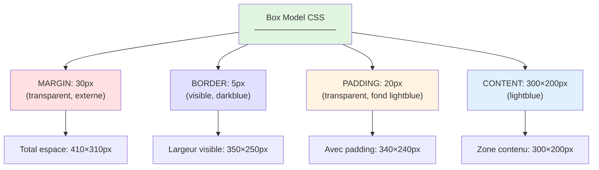

# IX - Box Model CSS

<div
  class="omny-meta"
  data-level="🟡 Intermédiaire"
  data-version="1.0"
  data-time="6-8 heures">
</div>

## Introduction : Comprendre la Boîte

!!! quote "Analogie pédagogique"
    _Imaginez une **œuvre d'art encadrée** accrochée au mur. Le **Box Model CSS**, c'est exactement ça : **Content** (l'œuvre elle-même), **Padding** (l'espace entre l'œuvre et le cadre, le passe-partout), **Border** (le cadre en bois), **Margin** (l'espace entre le cadre et le mur/les autres cadres). Sans comprendre le Box Model, impossible de positionner précisément les éléments : pourquoi ce bouton dépasse ? Pourquoi ces marges se chevauchent ? Pourquoi ma div fait 320px alors que j'ai mis width: 300px ? Le Box Model est **LA BASE ABSOLUE** du layout CSS. Avant Flexbox, Grid, Positioning, vous DEVEZ maîtriser le Box Model. Chaque élément HTML est une boîte (même les textes, images, liens). CSS contrôle les dimensions de ces boîtes avec une précision au pixel. Ce module dévoile les secrets du Box Model : vous comprendrez enfin pourquoi `width: 300px + padding: 20px + border: 5px = 350px` (ou 300px selon box-sizing), comment les marges fusionnent (margin collapsing), et comment calculer les dimensions exactes de N'IMPORTE QUEL élément. Après ce module, vous penserez en boîtes._

**Box Model CSS** = Modèle de boîte définissant comment calculer les dimensions d'un élément.

**Pourquoi le Box Model est CRUCIAL ?**

✅ **Fondation du layout** : Base de tout positionnement  
✅ **Calcul dimensions** : Comprendre width/height réels  
✅ **Espacement précis** : Contrôle pixel-perfect  
✅ **Débug facilité** : Comprendre pourquoi ça dépasse  
✅ **Responsive design** : Gérer tailles adaptatives  
✅ **Interactions éléments** : Marges, espacements, collisions  

**Les 4 composantes du Box Model :**

```
┌─────────────────────────────────────┐
│         MARGIN (transparent)        │
│  ┌───────────────────────────────┐  │
│  │      BORDER (visible)         │  │
│  │  ┌─────────────────────────┐  │  │
│  │  │   PADDING (transparent) │  │  │
│  │  │  ┌───────────────────┐  │  │  │
│  │  │  │                   │  │  │  │
│  │  │  │     CONTENT       │  │  │  │
│  │  │  │   (width/height)  │  │  │  │
│  │  │  │                   │  │  │  │
│  │  │  └───────────────────┘  │  │  │
│  │  │                         │  │  │
│  │  └─────────────────────────┘  │  │
│  │                               │  │
│  └───────────────────────────────┘  │
│                                     │
└─────────────────────────────────────┘
```

**Ce module vous apprend à maîtriser TOUTES les dimensions CSS.**

---

## 1. Les 4 Composantes du Box Model

### 1.1 Content (Contenu)

```css
/* CONTENT = Zone du contenu réel (texte, image, etc.) */

.box {
    width: 300px;        /* Largeur du CONTENU */
    height: 200px;       /* Hauteur du CONTENU */
    background-color: lightblue;
}

/* HTML */
/* <div class="box">Contenu ici</div> */

/* La zone bleue = 300×200px (juste le contenu) */

/* Contenu texte */
.text-box {
    width: 400px;
    height: auto;        /* Hauteur automatique selon contenu */
    background-color: #f0f0f0;
}

/* Contenu image */
.image-box {
    width: 500px;
    height: auto;        /* Garde ratio image */
}

.image-box img {
    width: 100%;         /* Image prend largeur parent */
    height: auto;        /* Ratio préservé */
}

/* Contenu dépassant */
.overflow-box {
    width: 200px;
    height: 100px;
    background-color: yellow;
    overflow: hidden;    /* Cache dépassement */
}
```

### 1.2 Padding (Rembourrage)

```css
/* PADDING = Espace INTERNE entre contenu et border */
/* Padding est TRANSPARENT mais a la background-color de l'élément */

.box {
    width: 300px;
    height: 200px;
    background-color: lightblue;
    padding: 20px;       /* 20px tous côtés */
}

/* Dimension réelle = 300×200 (contenu) + padding */
/* Largeur totale visible = 300px + 20px gauche + 20px droite = 340px */
/* Hauteur totale visible = 200px + 20px haut + 20px bas = 240px */

/* Padding individuels */
.box-individual {
    padding-top: 10px;
    padding-right: 20px;
    padding-bottom: 30px;
    padding-left: 40px;
}

/* Raccourci padding (1 à 4 valeurs) */

/* 1 valeur : tous côtés */
.box {
    padding: 20px;
    /* équivalent à :
       padding-top: 20px;
       padding-right: 20px;
       padding-bottom: 20px;
       padding-left: 20px;
    */
}

/* 2 valeurs : vertical horizontal */
.box {
    padding: 10px 20px;
    /* équivalent à :
       padding-top: 10px;
       padding-right: 20px;
       padding-bottom: 10px;
       padding-left: 20px;
    */
}

/* 3 valeurs : haut horizontal bas */
.box {
    padding: 10px 20px 30px;
    /* équivalent à :
       padding-top: 10px;
       padding-right: 20px;
       padding-bottom: 30px;
       padding-left: 20px;
    */
}

/* 4 valeurs : haut droite bas gauche (sens horaire) */
.box {
    padding: 10px 20px 30px 40px;
    /* équivalent à :
       padding-top: 10px;
       padding-right: 20px;
       padding-bottom: 30px;
       padding-left: 40px;
    */
}

/* Mnémotechnique : TRouBLe */
/* Top Right Bottom Left (sens horaire depuis le haut) */

/* Cas d'usage padding */

/* Bouton avec espace interne */
.button {
    padding: 10px 20px;      /* Vertical Horizontal */
    background-color: blue;
    color: white;
}

/* Carte avec espacement */
.card {
    padding: 30px;
    background-color: white;
    border-radius: 10px;
}

/* Header avec padding asymétrique */
.header {
    padding: 20px 40px;      /* Plus d'espace horizontal */
    background-color: #2c3e50;
}
```

### 1.3 Border (Bordure)

```css
/* BORDER = Ligne visible autour du padding */

.box {
    width: 300px;
    height: 200px;
    background-color: lightblue;
    padding: 20px;
    border: 3px solid black;
}

/* Dimension totale = contenu + padding + border */
/* Largeur = 300px + 40px padding + 6px border = 346px */
/* Hauteur = 200px + 40px padding + 6px border = 246px */

/* Border complet : width style color */
.box {
    border: 2px solid red;
}

/* Border individuelles */
.box {
    border-top: 1px solid black;
    border-right: 2px dashed blue;
    border-bottom: 3px dotted green;
    border-left: 4px double red;
}

/* Border par propriété */
.box {
    border-width: 2px;       /* Épaisseur */
    border-style: solid;     /* Style */
    border-color: blue;      /* Couleur */
}

/* Border-width (1 à 4 valeurs comme padding) */
.box {
    border-width: 1px;                    /* Tous côtés */
    border-width: 1px 2px;                /* Vertical Horizontal */
    border-width: 1px 2px 3px;            /* Haut Horizontal Bas */
    border-width: 1px 2px 3px 4px;        /* Haut Droite Bas Gauche */
}

/* Border-style */
.box {
    border-style: solid;     /* ─────── Ligne pleine */
    border-style: dashed;    /* ─ ─ ─ ─ Tirets */
    border-style: dotted;    /* · · · · Points */
    border-style: double;    /* ═══════ Double ligne */
    border-style: groove;    /* Effet 3D enfoncé */
    border-style: ridge;     /* Effet 3D relief */
    border-style: inset;     /* Effet 3D intérieur */
    border-style: outset;    /* Effet 3D extérieur */
    border-style: none;      /* Pas de bordure */
    border-style: hidden;    /* Cachée (tableaux) */
}

/* Border-color (1 à 4 valeurs) */
.box {
    border-color: red;                       /* Tous côtés */
    border-color: red blue;                  /* Vertical Horizontal */
    border-color: red blue green;            /* Haut Horizontal Bas */
    border-color: red blue green yellow;     /* Haut Droite Bas Gauche */
}

/* Border-radius (coins arrondis) */
.box {
    border-radius: 10px;     /* Tous coins */
}

.box {
    border-radius: 10px 20px 30px 40px;
    /* Haut-gauche Haut-droite Bas-droite Bas-gauche */
}

/* Cercle parfait */
.circle {
    width: 100px;
    height: 100px;
    border-radius: 50%;
    background-color: blue;
}

/* Pilule (bouton arrondi) */
.pill {
    padding: 10px 30px;
    border-radius: 50px;     /* Très grand = arrondi complet */
    background-color: green;
}

/* Coins individuels */
.box {
    border-top-left-radius: 10px;
    border-top-right-radius: 20px;
    border-bottom-right-radius: 30px;
    border-bottom-left-radius: 40px;
}

/* Border avec image */
.fancy-border {
    border: 10px solid transparent;
    border-image: url('border-pattern.png') 30 round;
}
```

### 1.4 Margin (Marge)

```css
/* MARGIN = Espace EXTERNE autour de l'élément (transparent) */
/* Margin est TOUJOURS transparent (pas de background) */

.box {
    width: 300px;
    height: 200px;
    background-color: lightblue;
    padding: 20px;
    border: 3px solid black;
    margin: 30px;
}

/* Dimension totale élément = 346px (avec padding + border) */
/* Espace occupé total = 346px + 60px margin = 406px */

/* Margin individuelles */
.box {
    margin-top: 10px;
    margin-right: 20px;
    margin-bottom: 30px;
    margin-left: 40px;
}

/* Raccourci margin (1 à 4 valeurs comme padding) */

.box {
    margin: 20px;                    /* Tous côtés */
    margin: 10px 20px;               /* Vertical Horizontal */
    margin: 10px 20px 30px;          /* Haut Horizontal Bas */
    margin: 10px 20px 30px 40px;     /* Haut Droite Bas Gauche */
}

/* Centrage horizontal avec margin auto */
.container {
    width: 800px;
    margin: 0 auto;      /* Haut/Bas: 0, Gauche/Droite: auto */
    /* Élément centré horizontalement */
}

.centered {
    width: 300px;
    margin-left: auto;
    margin-right: auto;
    /* Équivalent à margin: 0 auto; si margin-top/bottom = 0 */
}

/* Margin négatives (avancé) */
.overlap {
    margin-top: -20px;   /* Remonte l'élément de 20px */
    margin-left: -10px;  /* Décale à gauche de 10px */
}

/* Cas d'usage margin */

/* Espacement entre sections */
section {
    margin-bottom: 40px;
}

/* Espacement entre paragraphes */
p {
    margin-bottom: 15px;
}

/* Centrage container */
.container {
    max-width: 1200px;
    margin: 0 auto;
    padding: 0 20px;     /* Padding pour mobile */
}

/* Reset margin premier/dernier enfant */
.content > *:first-child {
    margin-top: 0;
}

.content > *:last-child {
    margin-bottom: 0;
}
```

### 1.5 Visualisation Complète du Box Model

```css
/* Exemple complet avec toutes les composantes */

.complete-box {
    /* Content */
    width: 300px;
    height: 200px;
    background-color: lightblue;
    
    /* Padding */
    padding: 20px;
    
    /* Border */
    border: 5px solid darkblue;
    
    /* Margin */
    margin: 30px;
}

/* Calcul des dimensions :

CONTENU (zone bleue claire) : 300×200px

+ PADDING (espace interne transparent mais avec fond bleu) :
  Gauche : 20px
  Droite : 20px
  Haut : 20px
  Bas : 20px
  Largeur avec padding : 300 + 20 + 20 = 340px
  Hauteur avec padding : 200 + 20 + 20 = 240px

+ BORDER (ligne bleue foncée visible) :
  Gauche : 5px
  Droite : 5px
  Haut : 5px
  Bas : 5px
  Largeur avec border : 340 + 5 + 5 = 350px
  Hauteur avec border : 240 + 5 + 5 = 250px

+ MARGIN (espace externe transparent) :
  Gauche : 30px
  Droite : 30px
  Haut : 30px
  Bas : 30px
  Espace total occupé : 350 + 30 + 30 = 410px largeur
                        250 + 30 + 30 = 310px hauteur

IMPORTANT :
- width/height = CONTENU uniquement (par défaut)
- Largeur réelle visible = width + padding + border
- Espace total occupé = width + padding + border + margin
*/
```

**Diagramme Box Model avec dimensions :**



---

## 2. box-sizing : La Révolution

### 2.1 Problème du Box Model Par Défaut

```css
/* PAR DÉFAUT : box-sizing: content-box */
/* width/height = CONTENU uniquement */

.box-default {
    width: 300px;
    height: 200px;
    padding: 20px;
    border: 5px solid black;
}

/* PROBLÈME :
   width défini : 300px
   Largeur RÉELLE visible : 300 + 40 (padding) + 10 (border) = 350px
   
   Si vous voulez une boîte de 300px VISIBLE, vous devez calculer :
   width: 300 - 40 - 10 = 250px
   
   TRÈS PÉNIBLE pour layouts responsives !
*/

/* Exemple problématique : 3 colonnes 33.33% */

.column {
    width: 33.33%;
    float: left;
    padding: 20px;     /* Dépasse ! Total > 100% */
    border: 1px solid black;
}

/* Résultat : colonnes passent en dessous (wrap) au lieu de côte à côte */

/* Calcul fastidieux */
.column {
    width: calc(33.33% - 42px); /* 40px padding + 2px border */
    /* Horrible à maintenir */
}
```

### 2.2 Solution : box-sizing: border-box

```css
/* SOLUTION MODERNE : box-sizing: border-box */
/* width/height = CONTENU + PADDING + BORDER */

.box-modern {
    box-sizing: border-box;  /* ← LA MAGIE */
    width: 300px;
    height: 200px;
    padding: 20px;
    border: 5px solid black;
}

/* RÉSULTAT :
   width défini : 300px
   Largeur RÉELLE visible : 300px
   
   Le navigateur calcule automatiquement :
   Contenu = 300 - 40 (padding) - 10 (border) = 250px
   
   width défini = width réelle (ENFIN !)
*/

/* Exemple résolu : 3 colonnes 33.33% */

.column {
    box-sizing: border-box;
    width: 33.33%;
    float: left;
    padding: 20px;     /* Inclus dans les 33.33% */
    border: 1px solid black;
}

/* Résultat : colonnes parfaitement alignées */

/* Reset universel (TRÈS RECOMMANDÉ) */

* {
    box-sizing: border-box;
}

/* Ou version complète avec pseudo-éléments */

*,
*::before,
*::after {
    box-sizing: border-box;
}

/* Désormais width/height = dimensions RÉELLES */
/* Fini les calculs fastidieux ! */
```

### 2.3 Comparaison content-box vs border-box

```html
<!DOCTYPE html>
<html lang="fr">
<head>
    <meta charset="UTF-8">
    <title>box-sizing Comparison</title>
    <style>
        body {
            font-family: Arial, sans-serif;
            padding: 40px;
            background-color: #f5f5f5;
        }
        
        .comparison {
            display: flex;
            gap: 40px;
            margin-bottom: 40px;
        }
        
        .box {
            width: 300px;
            height: 200px;
            padding: 20px;
            border: 5px solid black;
            background-color: lightblue;
        }
        
        /* Box 1 : content-box (défaut) */
        .box-content {
            box-sizing: content-box;
        }
        
        /* Box 2 : border-box */
        .box-border {
            box-sizing: border-box;
        }
        
        .label {
            text-align: center;
            margin-top: 10px;
            font-weight: bold;
        }
        
        .dimensions {
            text-align: center;
            margin-top: 5px;
            color: #666;
            font-size: 0.9em;
        }
    </style>
</head>
<body>
    <h1>Comparaison box-sizing</h1>
    
    <div class="comparison">
        <div>
            <div class="box box-content">
                Contenu
            </div>
            <div class="label">box-sizing: content-box</div>
            <div class="dimensions">
                width: 300px défini<br>
                Largeur réelle visible: 350px<br>
                (300 + 40 padding + 10 border)
            </div>
        </div>
        
        <div>
            <div class="box box-border">
                Contenu
            </div>
            <div class="label">box-sizing: border-box</div>
            <div class="dimensions">
                width: 300px défini<br>
                Largeur réelle visible: 300px<br>
                (padding + border inclus)
            </div>
        </div>
    </div>
    
    <p>
        Avec <code>border-box</code>, width/height correspondent aux dimensions RÉELLES.
        C'est la valeur recommandée pour tous vos projets.
    </p>
</body>
</html>
```

**Tableau Comparatif :**

| Propriété | content-box (défaut) | border-box (recommandé) |
|-----------|----------------------|-------------------------|
| width/height | Contenu uniquement | Contenu + padding + border |
| Largeur visible | width + padding + border | width |
| Calculs | Complexes | Simples |
| Layouts | Difficiles | Faciles |
| Responsive | Pénible | Naturel |
| Usage | Ancien (pré-2010) | Moderne (2010+) |

**Recommandation : TOUJOURS utiliser border-box**

```css
/* À mettre au début de TOUS vos CSS */

*,
*::before,
*::after {
    box-sizing: border-box;
}
```

---

## 3. Width et Height

### 3.1 Width (Largeur)

```css
/* width : Largeur de l'élément */

.box {
    width: 300px;        /* Pixels fixes */
}

/* Unités diverses */
.box {
    width: 300px;        /* Pixels */
    width: 50%;          /* Pourcentage du parent */
    width: 20em;         /* Em (relatif police parent) */
    width: 20rem;        /* Rem (relatif police root) */
    width: 50vw;         /* 50% largeur viewport */
}

/* Width auto (défaut) */
.block {
    width: auto;         /* Prend largeur disponible (block) */
}

/* Width 100% */
.full-width {
    width: 100%;         /* Prend 100% du parent */
}

/* Différence auto vs 100% */

.parent {
    width: 500px;
    padding: 20px;
}

.child-auto {
    width: auto;         /* Largeur = 460px (500 - 40 padding parent) */
    margin: 10px;
}

.child-100 {
    width: 100%;         /* Largeur = 500px (dépasse si margin) */
    margin: 10px;        /* Dépasse de 20px (10 gauche + 10 droite) */
}

/* max-width : Largeur maximale */
.container {
    width: 90%;
    max-width: 1200px;   /* Ne dépasse jamais 1200px */
    margin: 0 auto;
}

/* Comportement :
   Écran 1920px : largeur = 1200px (max-width)
   Écran 1000px : largeur = 900px (90%)
   Écran 500px  : largeur = 450px (90%)
*/

/* min-width : Largeur minimale */
.responsive-box {
    width: 50%;
    min-width: 300px;    /* Ne descend jamais sous 300px */
}

/* Comportement :
   Écran 1000px : largeur = 500px (50%)
   Écran 500px  : largeur = 300px (min-width)
   Écran 200px  : largeur = 300px (min-width, dépasse parent)
*/

/* Combinaison min/max */
.flexible-box {
    width: 80%;
    min-width: 320px;    /* Minimum 320px */
    max-width: 1200px;   /* Maximum 1200px */
}
```

### 3.2 Height (Hauteur)

```css
/* height : Hauteur de l'élément */

.box {
    height: 200px;       /* Pixels fixes */
}

/* Height auto (défaut) */
.box {
    height: auto;        /* Hauteur selon contenu */
}

/* Height 100% (attention au parent) */

/* ❌ Ne fonctionne PAS */
.child {
    height: 100%;        /* Parent sans hauteur définie */
}

/* ✅ Fonctionne */
html, body {
    height: 100%;        /* Hauteur explicite */
}

.child {
    height: 100%;        /* Maintenant OK */
}

/* Height viewport */
.hero {
    height: 100vh;       /* Plein écran vertical */
}

.half-screen {
    height: 50vh;
}

/* max-height : Hauteur maximale */
.modal {
    height: auto;
    max-height: 80vh;    /* Max 80% hauteur écran */
    overflow-y: auto;    /* Scroll si dépasse */
}

/* min-height : Hauteur minimale */
.section {
    min-height: 400px;   /* Minimum 400px */
    height: auto;        /* Grandit selon contenu */
}

.fullscreen {
    min-height: 100vh;   /* Au moins plein écran */
}

/* Combinaison min/max */
.content {
    min-height: 300px;
    max-height: 600px;
    overflow-y: auto;
}
```

### 3.3 Width/Height avec box-sizing

```css
/* Avec box-sizing: border-box */

.box {
    box-sizing: border-box;
    width: 300px;        /* Largeur TOTALE visible */
    height: 200px;       /* Hauteur TOTALE visible */
    padding: 20px;       /* Inclus dans 300×200 */
    border: 5px solid black; /* Inclus dans 300×200 */
}

/* Contenu réel = 300 - 40 - 10 = 250px largeur */
/*               = 200 - 40 - 10 = 150px hauteur */

/* Sans box-sizing (content-box) */

.box {
    box-sizing: content-box;
    width: 300px;        /* Largeur CONTENU */
    height: 200px;       /* Hauteur CONTENU */
    padding: 20px;       /* En plus des 300×200 */
    border: 5px solid black; /* En plus */
}

/* Dimension visible = 300 + 40 + 10 = 350px largeur */
/*                   = 200 + 40 + 10 = 250px hauteur */
```

---

## 4. Margin Collapsing (Fusion des Marges)

### 4.1 Concept de Margin Collapsing

```css
/* MARGIN COLLAPSING : Les marges verticales FUSIONNENT */
/* Seulement vertical (top/bottom), jamais horizontal (left/right) */

/* Exemple 1 : Deux éléments empilés */

.box1 {
    margin-bottom: 30px;
}

.box2 {
    margin-top: 20px;
}

/* HTML : <div class="box1"></div><div class="box2"></div> */

/* ATTENDU : Espace = 30px + 20px = 50px */
/* RÉALITÉ : Espace = 30px (la plus grande marge) */
/* → Les marges FUSIONNENT, on garde la plus grande */

/* Exemple 2 : Parent et premier enfant */

.parent {
    margin-top: 40px;
}

.child {
    margin-top: 20px;
}

/* HTML : <div class="parent"><div class="child"></div></div> */

/* ATTENDU : parent a 40px de marge, child a 20px EN PLUS */
/* RÉALITÉ : Les marges fusionnent, total = 40px */
/* → La marge de l'enfant "remonte" au parent */

/* Exemple 3 : Parent et dernier enfant */

.parent {
    margin-bottom: 30px;
}

.last-child {
    margin-bottom: 50px;
}

/* Les marges fusionnent, total = 50px */
```

### 4.2 Quand les Marges Fusionnent

```css
/* Les marges FUSIONNENT dans ces cas : */

/* 1. Éléments adjacents (frères) */
.element1 {
    margin-bottom: 20px;
}

.element2 {
    margin-top: 30px;
}
/* Espace entre = 30px (plus grande) */

/* 2. Parent vide et premier enfant */
.parent {
    /* Pas de border, padding, ou contenu */
}

.first-child {
    margin-top: 40px;
}
/* Marge remonte au parent */

/* 3. Parent vide et dernier enfant */
.parent {
    /* Pas de border, padding, ou contenu */
}

.last-child {
    margin-bottom: 40px;
}
/* Marge descend au parent */

/* 4. Élément vide avec marges top/bottom */
.empty {
    margin-top: 20px;
    margin-bottom: 30px;
    /* Pas de contenu, border, padding, height */
}
/* Les marges fusionnent entre elles = 30px */
```

### 4.3 Empêcher le Margin Collapsing

```css
/* SOLUTIONS pour EMPÊCHER la fusion : */

/* Solution 1 : Padding au lieu de margin */
.parent {
    padding-top: 1px;    /* Bloque fusion */
}

.child {
    margin-top: 20px;    /* Ne fusionne plus avec parent */
}

/* Solution 2 : Border transparent */
.parent {
    border-top: 1px solid transparent;
}

.child {
    margin-top: 20px;
}

/* Solution 3 : Overflow hidden */
.parent {
    overflow: hidden;    /* Crée BFC (Block Formatting Context) */
}

.child {
    margin-top: 20px;
}

/* Solution 4 : Display flex/grid */
.parent {
    display: flex;       /* Pas de margin collapsing en flex */
    flex-direction: column;
}

.child {
    margin-top: 20px;    /* Marges normales */
}

/* Solution 5 : Position absolute/fixed */
.child {
    position: absolute;  /* Sort du flux normal */
    margin-top: 20px;
}

/* Solution 6 : Float */
.child {
    float: left;
    margin-top: 20px;
}

/* Solution 7 : Display inline-block */
.child {
    display: inline-block;
    margin-top: 20px;
}

/* Exemple complet : Container avec padding */
.container {
    padding: 1px 0;      /* Bloque fusion haut/bas */
    /* OU */
    overflow: hidden;    /* Alternative */
}

.container > *:first-child {
    margin-top: 20px;    /* Marge fonctionnelle */
}

.container > *:last-child {
    margin-bottom: 20px;
}
```

### 4.4 Exemple Pratique Margin Collapsing

```html
<!DOCTYPE html>
<html lang="fr">
<head>
    <meta charset="UTF-8">
    <title>Margin Collapsing Demo</title>
    <style>
        body {
            font-family: Arial, sans-serif;
            padding: 40px;
            background-color: #f5f5f5;
        }
        
        .example {
            margin-bottom: 60px;
        }
        
        h2 {
            margin-bottom: 20px;
        }
        
        /* Exemple 1 : Éléments adjacents */
        .box-a {
            background-color: lightblue;
            padding: 20px;
            margin-bottom: 30px;
        }
        
        .box-b {
            background-color: lightgreen;
            padding: 20px;
            margin-top: 20px;
        }
        
        /* Exemple 2 : Parent et enfant (avec fusion) */
        .parent-collapse {
            background-color: yellow;
            margin-top: 40px;
        }
        
        .child-collapse {
            background-color: orange;
            padding: 20px;
            margin-top: 20px;
        }
        
        /* Exemple 3 : Parent et enfant (sans fusion) */
        .parent-no-collapse {
            background-color: yellow;
            margin-top: 40px;
            overflow: hidden;    /* Bloque fusion */
        }
        
        .child-no-collapse {
            background-color: orange;
            padding: 20px;
            margin-top: 20px;
        }
        
        .note {
            background-color: #fff;
            padding: 15px;
            border-left: 4px solid #3498db;
            margin-top: 20px;
        }
    </style>
</head>
<body>
    <h1>Démonstration Margin Collapsing</h1>
    
    <!-- Exemple 1 -->
    <div class="example">
        <h2>Exemple 1 : Éléments Adjacents</h2>
        <div class="box-a">
            Box A (margin-bottom: 30px)
        </div>
        <div class="box-b">
            Box B (margin-top: 20px)
        </div>
        <div class="note">
            Espace entre A et B = 30px (pas 50px)<br>
            Les marges fusionnent, on garde la plus grande.
        </div>
    </div>
    
    <!-- Exemple 2 -->
    <div class="example">
        <h2>Exemple 2 : Parent-Enfant AVEC Fusion</h2>
        <div class="parent-collapse">
            <div class="child-collapse">
                Child (margin-top: 20px)
            </div>
        </div>
        <div class="note">
            Parent (margin-top: 40px) + Child (margin-top: 20px)<br>
            Résultat : 40px (marges fusionnées)<br>
            La marge de l'enfant "remonte" au parent.
        </div>
    </div>
    
    <!-- Exemple 3 -->
    <div class="example">
        <h2>Exemple 3 : Parent-Enfant SANS Fusion</h2>
        <div class="parent-no-collapse">
            <div class="child-no-collapse">
                Child (margin-top: 20px)
            </div>
        </div>
        <div class="note">
            Parent avec overflow: hidden (bloque fusion)<br>
            Parent (40px) + Child (20px) = Marges indépendantes<br>
            La marge de l'enfant fonctionne normalement.
        </div>
    </div>
</body>
</html>
```

**Règle d'or : Pour éviter surprises, utilisez padding au lieu de margin pour espacement parent-enfant.**

---

## 5. Overflow (Débordement)

### 5.1 Types d'Overflow

```css
/* overflow : Contrôle le contenu qui dépasse */

.box {
    width: 300px;
    height: 200px;
    background-color: lightblue;
}

/* overflow: visible (défaut) */
.box-visible {
    overflow: visible;   /* Contenu dépasse (visible) */
}
/* Contenu déborde hors de la boîte */

/* overflow: hidden */
.box-hidden {
    overflow: hidden;    /* Contenu dépassant caché */
}
/* Contenu coupé aux bords de la boîte */

/* overflow: scroll */
.box-scroll {
    overflow: scroll;    /* Barres de défilement toujours visibles */
}
/* Scrollbars horizontal + vertical même si pas nécessaire */

/* overflow: auto */
.box-auto {
    overflow: auto;      /* Scrollbars seulement si nécessaire */
}
/* RECOMMANDÉ : Scrollbar uniquement si contenu dépasse */

/* overflow-x et overflow-y séparés */
.box-x {
    overflow-x: auto;    /* Horizontal uniquement */
    overflow-y: hidden;  /* Vertical caché */
}

.box-y {
    overflow-x: hidden;  /* Horizontal caché */
    overflow-y: auto;    /* Vertical uniquement */
}

/* Cas d'usage overflow */

/* Container avec scroll */
.scrollable-container {
    max-height: 400px;
    overflow-y: auto;
    padding: 20px;
}

/* Modal avec scroll */
.modal-content {
    max-height: 80vh;
    overflow-y: auto;
}

/* Text truncation (ellipsis) */
.truncate {
    width: 200px;
    white-space: nowrap;      /* Pas de retour ligne */
    overflow: hidden;         /* Cache dépassement */
    text-overflow: ellipsis;  /* Ajoute ... */
}
/* Résultat : "Texte très long qui dép..." */

/* Clearfix avec overflow */
.clearfix {
    overflow: hidden;    /* Contient floats */
}

/* Image responsive contenue */
.image-container {
    width: 300px;
    height: 300px;
    overflow: hidden;
}

.image-container img {
    width: 100%;
    height: 100%;
    object-fit: cover;   /* Remplit container */
}
```

### 5.2 Scroll Personnalisé (Scrollbar)

```css
/* Scrollbar personnalisée (Webkit : Chrome, Safari, Edge) */

.custom-scroll {
    overflow-y: auto;
    max-height: 400px;
}

/* Largeur scrollbar */
.custom-scroll::-webkit-scrollbar {
    width: 12px;
}

/* Track (fond) */
.custom-scroll::-webkit-scrollbar-track {
    background-color: #f1f1f1;
    border-radius: 10px;
}

/* Thumb (barre) */
.custom-scroll::-webkit-scrollbar-thumb {
    background-color: #888;
    border-radius: 10px;
}

/* Thumb hover */
.custom-scroll::-webkit-scrollbar-thumb:hover {
    background-color: #555;
}

/* Firefox (propriétés limitées) */
.custom-scroll {
    scrollbar-width: thin;           /* auto | thin | none */
    scrollbar-color: #888 #f1f1f1;   /* thumb track */
}

/* Masquer scrollbar (tout en gardant scroll) */
.no-scrollbar {
    overflow: auto;
    scrollbar-width: none;  /* Firefox */
}

.no-scrollbar::-webkit-scrollbar {
    display: none;  /* Chrome, Safari, Edge */
}
```

---

## 6. Display et Visibilité

### 6.1 Display

```css
/* display : Contrôle le type d'affichage */

/* display: block */
.block {
    display: block;
    /* Prend toute la largeur disponible */
    /* Démarre sur nouvelle ligne */
    /* Accepte width/height/margin/padding */
}
/* Éléments block par défaut : div, p, h1-h6, section, article */

/* display: inline */
.inline {
    display: inline;
    /* Prend uniquement largeur du contenu */
    /* Reste sur même ligne */
    /* N'ACCEPTE PAS width/height */
    /* Accepte margin/padding horizontal uniquement */
}
/* Éléments inline par défaut : span, a, strong, em */

/* display: inline-block */
.inline-block {
    display: inline-block;
    /* Reste sur même ligne (inline) */
    /* Accepte width/height/margin/padding (block) */
    /* MEILLEUR DES DEUX MONDES */
}
/* Cas d'usage : boutons côte à côte avec dimensions */

/* display: none */
.hidden {
    display: none;
    /* Élément complètement retiré du DOM */
    /* N'occupe aucun espace */
}

/* display: flex */
.flex-container {
    display: flex;
    /* Active Flexbox (Module 10) */
}

/* display: grid */
.grid-container {
    display: grid;
    /* Active CSS Grid (Module 11) */
}

/* Comparaison block vs inline vs inline-block */

.block-demo {
    display: block;
    width: 200px;
    height: 100px;
    background-color: lightblue;
    margin: 10px;
}

.inline-demo {
    display: inline;
    width: 200px;        /* IGNORÉ */
    height: 100px;       /* IGNORÉ */
    background-color: lightgreen;
    margin: 10px 20px;   /* Vertical IGNORÉ */
    padding: 10px 20px;  /* Vertical déborde */
}

.inline-block-demo {
    display: inline-block;
    width: 200px;        /* OK */
    height: 100px;       /* OK */
    background-color: yellow;
    margin: 10px;        /* OK */
}
```

### 6.2 Visibility

```css
/* visibility : Contrôle la visibilité */

/* visibility: visible (défaut) */
.visible {
    visibility: visible;
    /* Élément visible normalement */
}

/* visibility: hidden */
.hidden {
    visibility: hidden;
    /* Élément invisible MAIS occupe toujours l'espace */
}

/* Différence display: none vs visibility: hidden */

.display-none {
    display: none;
    /* Invisible + N'occupe PAS d'espace */
}

.visibility-hidden {
    visibility: hidden;
    /* Invisible + Occupe TOUJOURS l'espace */
}

/* visibility: collapse (tableaux uniquement) */
tr.collapsed {
    visibility: collapse;
    /* Cache ligne tableau sans espace */
}

/* Cas d'usage visibility */

/* Toggle avec JavaScript */
.tooltip {
    visibility: hidden;
    opacity: 0;
    transition: opacity 0.3s ease;
}

.tooltip.show {
    visibility: visible;
    opacity: 1;
}

/* Accessibilité : cacher visuellement mais pas pour lecteurs */
.visually-hidden {
    position: absolute;
    width: 1px;
    height: 1px;
    padding: 0;
    margin: -1px;
    overflow: hidden;
    clip: rect(0, 0, 0, 0);
    white-space: nowrap;
    border: 0;
}
/* Élément caché visuellement mais lecteur d'écran le lit */
```

### 6.3 Opacity

```css
/* opacity : Transparence (0 à 1) */

.transparent {
    opacity: 0;      /* Invisible (0%) */
}

.semi-transparent {
    opacity: 0.5;    /* Semi-transparent (50%) */
}

.opaque {
    opacity: 1;      /* Opaque (100%, défaut) */
}

/* Overlay semi-transparent */
.overlay {
    position: fixed;
    top: 0;
    left: 0;
    width: 100%;
    height: 100%;
    background-color: black;
    opacity: 0.7;
}

/* Fade in/out avec transition */
.fade {
    opacity: 0;
    transition: opacity 0.5s ease;
}

.fade.show {
    opacity: 1;
}

/* Différence opacity vs rgba */

/* opacity : Tout l'élément (contenu inclus) */
.parent-opacity {
    opacity: 0.5;    /* Enfants aussi 50% transparents */
}

/* rgba : Couleur uniquement */
.parent-rgba {
    background-color: rgba(0, 0, 0, 0.5);  /* Fond 50%, enfants opaques */
}
```

---

## 7. Exercices Pratiques

### Exercice 1 : Calculer les Dimensions

**Objectif :** Comprendre le calcul des dimensions avec box model.

**Consigne :** Pour chaque élément, calculer :
- Largeur contenu
- Largeur visible (avec padding + border)
- Espace total occupé (avec margin)

```css
/* Élément A */
.element-a {
    box-sizing: content-box;
    width: 200px;
    padding: 10px;
    border: 5px solid black;
    margin: 20px;
}

/* Élément B */
.element-b {
    box-sizing: border-box;
    width: 200px;
    padding: 10px;
    border: 5px solid black;
    margin: 20px;
}
```

<details>
<summary>Solution</summary>

```
ÉLÉMENT A (content-box) :
- Largeur contenu : 200px
- Largeur visible : 200 + 20 (padding) + 10 (border) = 230px
- Espace occupé : 230 + 40 (margin) = 270px

ÉLÉMENT B (border-box) :
- Largeur visible : 200px
- Largeur contenu : 200 - 20 (padding) - 10 (border) = 170px
- Espace occupé : 200 + 40 (margin) = 240px

RÉSUMÉ :
┌──────────────────────────────────────────┐
│         Élément A (content-box)          │
├──────────────────────────────────────────┤
│ Contenu       : 200px                    │
│ Visible       : 230px                    │
│ Espace total  : 270px                    │
└──────────────────────────────────────────┘

┌──────────────────────────────────────────┐
│         Élément B (border-box)           │
├──────────────────────────────────────────┤
│ Contenu       : 170px                    │
│ Visible       : 200px                    │
│ Espace total  : 240px                    │
└──────────────────────────────────────────┘
```

</details>

### Exercice 2 : Trois Colonnes Égales

**Objectif :** Créer 3 colonnes égales avec box-sizing.

**Consigne :** 3 colonnes de 33.33% chacune, avec padding 20px et border 1px, qui tiennent sur une ligne.

<details>
<summary>Solution</summary>

```html
<!DOCTYPE html>
<html lang="fr">
<head>
    <meta charset="UTF-8">
    <meta name="viewport" content="width=device-width, initial-scale=1.0">
    <title>Trois Colonnes</title>
    <style>
        * {
            box-sizing: border-box;
            margin: 0;
            padding: 0;
        }
        
        body {
            font-family: Arial, sans-serif;
            padding: 40px;
            background-color: #f5f5f5;
        }
        
        .container {
            max-width: 1200px;
            margin: 0 auto;
        }
        
        .row {
            display: flex;
            gap: 20px;
        }
        
        .column {
            flex: 1;
            background-color: white;
            padding: 20px;
            border: 1px solid #ddd;
            border-radius: 10px;
        }
        
        /* Alternative sans Flexbox (float) */
        .row-float {
            overflow: hidden;
        }
        
        .column-float {
            width: 33.33%;
            float: left;
            padding: 20px;
            border: 1px solid #ddd;
            background-color: white;
            box-sizing: border-box;  /* CRUCIAL */
        }
        
        h2 {
            margin-bottom: 15px;
            color: #2c3e50;
        }
    </style>
</head>
<body>
    <div class="container">
        <h1>Trois Colonnes Égales</h1>
        
        <h2 style="margin-top: 40px;">Version Flexbox</h2>
        <div class="row">
            <div class="column">
                <h3>Colonne 1</h3>
                <p>Contenu de la première colonne avec padding 20px et border 1px.</p>
            </div>
            <div class="column">
                <h3>Colonne 2</h3>
                <p>Contenu de la deuxième colonne avec padding 20px et border 1px.</p>
            </div>
            <div class="column">
                <h3>Colonne 3</h3>
                <p>Contenu de la troisième colonne avec padding 20px et border 1px.</p>
            </div>
        </div>
        
        <h2 style="margin-top: 40px;">Version Float</h2>
        <div class="row-float">
            <div class="column-float">
                <h3>Colonne 1</h3>
                <p>33.33% avec box-sizing: border-box</p>
            </div>
            <div class="column-float">
                <h3>Colonne 2</h3>
                <p>33.33% avec box-sizing: border-box</p>
            </div>
            <div class="column-float">
                <h3>Colonne 3</h3>
                <p>33.33% avec box-sizing: border-box</p>
            </div>
        </div>
    </div>
</body>
</html>
```

**Points clés :**
- `box-sizing: border-box` permet width: 33.33% de fonctionner avec padding et border
- Sans border-box, les colonnes dépasseraient 100% et passeraient en dessous

</details>

### Exercice 3 : Centrage et Espacement

**Objectif :** Maîtriser margin auto et espacements.

**Consigne :** Créer une carte centrée avec espacement cohérent.

<details>
<summary>Solution</summary>

```html
<!DOCTYPE html>
<html lang="fr">
<head>
    <meta charset="UTF-8">
    <meta name="viewport" content="width=device-width, initial-scale=1.0">
    <title>Carte Centrée</title>
    <style>
        * {
            box-sizing: border-box;
            margin: 0;
            padding: 0;
        }
        
        body {
            font-family: Arial, sans-serif;
            background: linear-gradient(135deg, #667eea 0%, #764ba2 100%);
            min-height: 100vh;
            padding: 40px 20px;
        }
        
        .card {
            /* Centrage horizontal */
            max-width: 600px;
            margin: 0 auto;
            
            /* Espacement */
            padding: 40px;
            
            /* Visuel */
            background-color: white;
            border-radius: 20px;
            box-shadow: 0 10px 40px rgba(0, 0, 0, 0.3);
        }
        
        .card-header {
            margin-bottom: 30px;
            padding-bottom: 20px;
            border-bottom: 2px solid #e0e0e0;
        }
        
        .card-header h1 {
            color: #2c3e50;
            margin-bottom: 10px;
        }
        
        .card-header p {
            color: #7f8c8d;
        }
        
        .card-content {
            margin-bottom: 30px;
        }
        
        .card-content p {
            color: #555;
            line-height: 1.6;
            margin-bottom: 15px;
        }
        
        .card-content p:last-child {
            margin-bottom: 0;  /* Reset dernier */
        }
        
        .card-footer {
            padding-top: 20px;
            border-top: 2px solid #e0e0e0;
            text-align: center;
        }
        
        .button {
            display: inline-block;
            padding: 12px 30px;
            margin: 0 10px;
            background-color: #3498db;
            color: white;
            text-decoration: none;
            border-radius: 25px;
            transition: background-color 0.3s ease;
        }
        
        .button:hover {
            background-color: #2980b9;
        }
        
        .button-secondary {
            background-color: #95a5a6;
        }
        
        .button-secondary:hover {
            background-color: #7f8c8d;
        }
    </style>
</head>
<body>
    <div class="card">
        <div class="card-header">
            <h1>Box Model Maîtrisé</h1>
            <p>Centrage et espacement avec margin et padding</p>
        </div>
        
        <div class="card-content">
            <p>
                Cette carte est centrée horizontalement avec <code>margin: 0 auto</code> 
                et une <code>max-width: 600px</code>.
            </p>
            <p>
                L'espacement interne est géré avec <code>padding: 40px</code> 
                pour un confort visuel optimal.
            </p>
            <p>
                Les sections sont espacées verticalement avec <code>margin-bottom</code> 
                cohérent (30px).
            </p>
        </div>
        
        <div class="card-footer">
            <a href="#" class="button">Action Principale</a>
            <a href="#" class="button button-secondary">Annuler</a>
        </div>
    </div>
</body>
</html>
```

**Techniques utilisées :**
- `margin: 0 auto` pour centrage horizontal
- `max-width` pour limiter largeur
- `padding` pour espacement interne cohérent
- `margin-bottom` pour espacer sections
- Reset `margin-bottom: 0` sur dernier élément

</details>

---

## 8. Projet du Module : Dashboard Card Layout

### 8.1 Cahier des Charges

**Créer un layout de tableau de bord avec cartes statistiques :**

**Spécifications techniques :**
- ✅ Grid de 3 cartes statistiques
- ✅ Box model maîtrisé (padding, margin, border)
- ✅ box-sizing: border-box
- ✅ Dimensions calculées précisément
- ✅ Espacement cohérent
- ✅ Responsive (1 colonne mobile)
- ✅ Overflow géré (description tronquée)
- ✅ Code CSS externe validé

### 8.2 Solution Complète

<details>
<summary>Voir la solution complète du projet</summary>

```html
<!DOCTYPE html>
<html lang="fr">
<head>
    <meta charset="UTF-8">
    <meta name="viewport" content="width=device-width, initial-scale=1.0">
    <title>Dashboard Statistics</title>
    <link rel="stylesheet" href="dashboard.css">
</head>
<body>
    <div class="container">
        <header class="dashboard-header">
            <h1>Tableau de Bord</h1>
            <p>Vue d'ensemble de vos statistiques</p>
        </header>
        
        <main class="dashboard-grid">
            <div class="stat-card">
                <div class="stat-icon" style="background-color: #3498db;">
                    <span>👥</span>
                </div>
                <div class="stat-content">
                    <h3 class="stat-value">1,234</h3>
                    <p class="stat-label">Utilisateurs Actifs</p>
                    <p class="stat-description">
                        Augmentation de 12% par rapport au mois dernier. 
                        Progression constante depuis 3 mois.
                    </p>
                </div>
                <div class="stat-footer">
                    <span class="stat-change positive">+12%</span>
                    <span class="stat-period">vs mois dernier</span>
                </div>
            </div>
            
            <div class="stat-card">
                <div class="stat-icon" style="background-color: #2ecc71;">
                    <span>💰</span>
                </div>
                <div class="stat-content">
                    <h3 class="stat-value">45,678 €</h3>
                    <p class="stat-label">Revenus Mensuels</p>
                    <p class="stat-description">
                        Performance exceptionnelle ce mois avec une croissance 
                        soutenue dans tous les segments.
                    </p>
                </div>
                <div class="stat-footer">
                    <span class="stat-change positive">+23%</span>
                    <span class="stat-period">vs mois dernier</span>
                </div>
            </div>
            
            <div class="stat-card">
                <div class="stat-icon" style="background-color: #e74c3c;">
                    <span>📊</span>
                </div>
                <div class="stat-content">
                    <h3 class="stat-value">89%</h3>
                    <p class="stat-label">Taux de Satisfaction</p>
                    <p class="stat-description">
                        Satisfaction client en légère baisse. Actions correctives 
                        en cours pour améliorer l'expérience.
                    </p>
                </div>
                <div class="stat-footer">
                    <span class="stat-change negative">-3%</span>
                    <span class="stat-period">vs mois dernier</span>
                </div>
            </div>
        </main>
        
        <section class="details-section">
            <h2>Détails Complets</h2>
            <div class="scrollable-content">
                <p>
                    Lorem ipsum dolor sit amet, consectetur adipiscing elit. 
                    Sed do eiusmod tempor incididunt ut labore et dolore magna aliqua. 
                    Ut enim ad minim veniam, quis nostrud exercitation ullamco laboris.
                </p>
                <p>
                    Duis aute irure dolor in reprehenderit in voluptate velit esse 
                    cillum dolore eu fugiat nulla pariatur. Excepteur sint occaecat 
                    cupidatat non proident, sunt in culpa qui officia deserunt mollit.
                </p>
                <p>
                    Sed ut perspiciatis unde omnis iste natus error sit voluptatem 
                    accusantium doloremque laudantium, totam rem aperiam, eaque ipsa 
                    quae ab illo inventore veritatis et quasi architecto beatae vitae.
                </p>
            </div>
        </section>
    </div>
</body>
</html>
```

```css
/* dashboard.css */

/* ========================================
   RESET & BASE
   ======================================== */

*,
*::before,
*::after {
    box-sizing: border-box;
    margin: 0;
    padding: 0;
}

body {
    font-family: 'Segoe UI', Tahoma, Geneva, Verdana, sans-serif;
    background-color: #f5f7fa;
    color: #2c3e50;
    line-height: 1.6;
}

/* ========================================
   CONTAINER
   ======================================== */

.container {
    max-width: 1200px;
    margin: 0 auto;
    padding: 40px 20px;
}

/* ========================================
   HEADER
   ======================================== */

.dashboard-header {
    margin-bottom: 40px;
    padding-bottom: 20px;
    border-bottom: 3px solid #e0e6ed;
}

.dashboard-header h1 {
    font-size: 2.5rem;
    color: #2c3e50;
    margin-bottom: 10px;
}

.dashboard-header p {
    font-size: 1.1rem;
    color: #7f8c8d;
}

/* ========================================
   GRID CARDS
   ======================================== */

.dashboard-grid {
    display: grid;
    grid-template-columns: repeat(3, 1fr);
    gap: 30px;
    margin-bottom: 40px;
}

/* ========================================
   STAT CARD (Box Model Complet)
   ======================================== */

.stat-card {
    /* Box Model */
    padding: 30px;
    border: 1px solid #e0e6ed;
    border-radius: 15px;
    
    /* Visuel */
    background-color: white;
    box-shadow: 0 2px 10px rgba(0, 0, 0, 0.05);
    
    /* Transition */
    transition: transform 0.3s ease, box-shadow 0.3s ease;
    
    /* Overflow pour description */
    overflow: hidden;
}

.stat-card:hover {
    transform: translateY(-5px);
    box-shadow: 0 10px 30px rgba(0, 0, 0, 0.15);
}

/* Icon */
.stat-icon {
    width: 60px;
    height: 60px;
    border-radius: 12px;
    display: flex;
    align-items: center;
    justify-content: center;
    font-size: 2rem;
    margin-bottom: 20px;
}

/* Content */
.stat-content {
    margin-bottom: 20px;
}

.stat-value {
    font-size: 2.5rem;
    font-weight: bold;
    color: #2c3e50;
    margin-bottom: 5px;
}

.stat-label {
    font-size: 1rem;
    color: #7f8c8d;
    margin-bottom: 10px;
}

.stat-description {
    font-size: 0.9rem;
    color: #95a5a6;
    line-height: 1.5;
    
    /* Truncate à 3 lignes */
    display: -webkit-box;
    -webkit-line-clamp: 3;
    -webkit-box-orient: vertical;
    overflow: hidden;
    text-overflow: ellipsis;
}

/* Footer */
.stat-footer {
    padding-top: 15px;
    border-top: 1px solid #e0e6ed;
    display: flex;
    align-items: center;
    gap: 10px;
}

.stat-change {
    font-weight: bold;
    font-size: 1.1rem;
    padding: 3px 10px;
    border-radius: 5px;
}

.stat-change.positive {
    color: #2ecc71;
    background-color: rgba(46, 204, 113, 0.1);
}

.stat-change.negative {
    color: #e74c3c;
    background-color: rgba(231, 76, 60, 0.1);
}

.stat-period {
    font-size: 0.85rem;
    color: #95a5a6;
}

/* ========================================
   DETAILS SECTION (Overflow Demo)
   ======================================== */

.details-section {
    background-color: white;
    padding: 30px;
    border-radius: 15px;
    border: 1px solid #e0e6ed;
}

.details-section h2 {
    margin-bottom: 20px;
    color: #2c3e50;
}

.scrollable-content {
    max-height: 200px;
    overflow-y: auto;
    padding-right: 15px;
    
    /* Scrollbar custom */
    scrollbar-width: thin;
    scrollbar-color: #cbd5e0 #f5f7fa;
}

.scrollable-content::-webkit-scrollbar {
    width: 8px;
}

.scrollable-content::-webkit-scrollbar-track {
    background-color: #f5f7fa;
    border-radius: 10px;
}

.scrollable-content::-webkit-scrollbar-thumb {
    background-color: #cbd5e0;
    border-radius: 10px;
}

.scrollable-content::-webkit-scrollbar-thumb:hover {
    background-color: #a0aec0;
}

.scrollable-content p {
    margin-bottom: 15px;
    color: #555;
}

.scrollable-content p:last-child {
    margin-bottom: 0;
}

/* ========================================
   RESPONSIVE
   ======================================== */

@media (max-width: 992px) {
    .dashboard-grid {
        grid-template-columns: repeat(2, 1fr);
    }
}

@media (max-width: 640px) {
    .container {
        padding: 20px 15px;
    }
    
    .dashboard-header h1 {
        font-size: 2rem;
    }
    
    .dashboard-grid {
        grid-template-columns: 1fr;
        gap: 20px;
    }
    
    .stat-card {
        padding: 20px;
    }
    
    .stat-value {
        font-size: 2rem;
    }
}
```

</details>

### 8.3 Analyse Box Model du Projet

```css
/* Carte statistique - Analyse dimensions */

.stat-card {
    /* Content : auto (selon contenu) */
    
    /* Padding : 30px tous côtés */
    padding: 30px;
    /* Ajoute 60px largeur (30 gauche + 30 droite) */
    /* Ajoute 60px hauteur (30 haut + 30 bas) */
    
    /* Border : 1px tous côtés */
    border: 1px solid #e0e6ed;
    /* Ajoute 2px largeur (1 gauche + 1 droite) */
    /* Ajoute 2px hauteur (1 haut + 1 bas) */
    
    /* box-sizing: border-box (défini dans reset) */
    /* Donc largeur grid column INCLUT padding + border */
}

/* Calcul avec grid 3 colonnes sur 1200px max */
/* Container : 1200px - 40px padding = 1160px */
/* Gap entre colonnes : 30px × 2 = 60px */
/* Largeur disponible : 1160px - 60px = 1100px */
/* Largeur par colonne : 1100px ÷ 3 = 366.67px */

/* Avec border-box :
   Largeur visible carte : 366.67px
   Contenu disponible : 366.67 - 60 (padding) - 2 (border) = 304.67px
*/

/* Sans border-box (hypothétique) :
   Largeur visible carte : 366.67 + 60 + 2 = 428.67px
   → Dépasse container, cartes passent en dessous
*/

/* CONCLUSION : border-box ESSENTIEL pour layouts grid/flex */
```

### 8.4 Checklist de Validation

Avant de considérer votre projet terminé, vérifiez :

- [ ] Reset box-sizing: border-box sur tous éléments
- [ ] Grid 3 colonnes responsive (2 colonnes tablet, 1 mobile)
- [ ] Cartes avec padding 30px
- [ ] Border 1px sur cartes
- [ ] Espacement cohérent (gap 30px)
- [ ] Container centré avec max-width 1200px
- [ ] Overflow hidden sur description (truncate 3 lignes)
- [ ] Section scrollable avec max-height 200px
- [ ] Scrollbar personnalisée
- [ ] Hover effects avec transform
- [ ] Code CSS externe validé W3C
- [ ] Responsive testé (mobile, tablet, desktop)

---

## 9. Best Practices Box Model

### 9.1 Règles d'Or

```css
/* 1. TOUJOURS utiliser box-sizing: border-box */
*,
*::before,
*::after {
    box-sizing: border-box;
}

/* 2. Préférer padding à margin pour espacement parent-enfant */

/* ❌ PROBLÈME : Margin collapsing */
.parent {
    /* Pas de padding */
}

.child {
    margin-top: 20px;    /* Remonte au parent (fusion) */
}

/* ✅ SOLUTION : Padding */
.parent {
    padding-top: 20px;   /* Espace contrôlé */
}

.child {
    /* Pas de margin-top */
}

/* 3. Reset margin premier/dernier enfant */
.content > *:first-child {
    margin-top: 0;
}

.content > *:last-child {
    margin-bottom: 0;
}

/* 4. Utiliser max-width pour containers responsives */
.container {
    width: 90%;
    max-width: 1200px;
    margin: 0 auto;
    padding: 0 20px;     /* Marge mobile */
}

/* 5. Overflow auto pour contenu dépassant */
.scrollable {
    max-height: 400px;
    overflow-y: auto;    /* Pas scroll (barres permanentes) */
}

/* 6. Margin auto pour centrage horizontal */
.centered {
    width: 300px;
    margin: 0 auto;
}

/* 7. Éviter hauteurs fixes (préférer min-height) */

/* ❌ PROBLÈME : Contenu dépasse */
.box {
    height: 200px;       /* Fixe, contenu peut déborder */
}

/* ✅ SOLUTION : min-height */
.box {
    min-height: 200px;   /* Minimum, grandit si nécessaire */
}
```

### 9.2 Debug Box Model

```css
/* Visualiser les boîtes (debug) */

/* Méthode 1 : Outline (ne modifie pas layout) */
* {
    outline: 1px solid red;
}

/* Méthode 2 : Border (modifie layout) */
* {
    border: 1px solid red;
}

/* Méthode 3 : Background (voir padding) */
* {
    background-color: rgba(255, 0, 0, 0.1);
}

/* DevTools : Afficher box model */
/* Chrome DevTools → Elements → Computed → Box Model Diagram */

/* Extension Chrome : Pesticide */
/* Affiche outline coloré sur tous éléments */
```

### 9.3 Performance

```css
/* ✅ RAPIDE : Properties qui ne déclenchent pas reflow */
.fast {
    opacity: 0.5;
    transform: translateX(10px);
    filter: blur(2px);
}

/* ⚠️ MOYEN : Properties déclenchant reflow */
.medium {
    width: 300px;
    height: 200px;
    padding: 20px;
    margin: 10px;
}

/* ❌ LENT : Éviter changements fréquents */
.slow {
    /* Éviter animer width/height en JavaScript */
    /* Préférer transform: scale() */
}

/* ✅ Optimisation : will-change */
.animated {
    will-change: transform;  /* Prépare GPU */
}

.animated:hover {
    transform: scale(1.1);
}
```

---

## 10. Checkpoint de Progression

### À la fin de ce Module 9, vous maîtrisez :

**Box Model complet :**

- [x] 4 composantes (content, padding, border, margin)
- [x] Calcul dimensions précis
- [x] Raccourcis (1 à 4 valeurs)
- [x] Mnémotechnique TRouBLe

**box-sizing :**

- [x] content-box vs border-box
- [x] Problème défaut et solution
- [x] Reset universel recommandé

**Dimensions :**

- [x] width et height
- [x] min/max-width et min/max-height
- [x] auto vs 100% vs viewport units

**Margin collapsing :**

- [x] Concept de fusion marges verticales
- [x] Quand ça arrive
- [x] Comment l'empêcher
- [x] Solutions pratiques

**Overflow :**

- [x] visible, hidden, scroll, auto
- [x] overflow-x et overflow-y
- [x] text-overflow: ellipsis
- [x] Scrollbar personnalisée

**Display et visibilité :**

- [x] block, inline, inline-block, none
- [x] visibility vs display
- [x] opacity

**Best practices :**

- [x] Règles d'or box model
- [x] Debug techniques
- [x] Performance

### Prochaine Étape

**Direction le Module 10** où vous allez :

- Maîtriser Flexbox (display: flex)
- Axes principal et perpendiculaire
- justify-content et align-items
- flex-direction, flex-wrap
- flex-grow, flex-shrink, flex-basis
- Layouts modernes responsives
- Ordre et alignement avancés

---

**Module 9 Terminé - Bravo ! 🎉 📦**

**Vous avez appris :**

- ✅ Box Model complet maîtrisé (4 composantes)
- ✅ box-sizing: border-box (révolution layout)
- ✅ Calcul dimensions précis (content-box vs border-box)
- ✅ Margin collapsing expliqué et solutions
- ✅ width/height avec min/max
- ✅ Overflow et scroll
- ✅ Display, visibility, opacity
- ✅ Best practices professionnelles

**Statistiques Module 9 :**

- 1 projet complet (Dashboard cards)
- 3 exercices progressifs avec solutions
- 100+ exemples de code
- Box Model maîtrisé pixel-perfect

**Prochain objectif : Maîtriser Flexbox (Module 10)**

**Félicitations pour cette maîtrise du Box Model ! 🚀📦**
