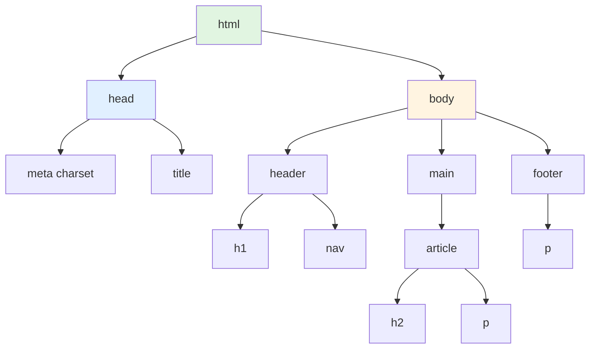
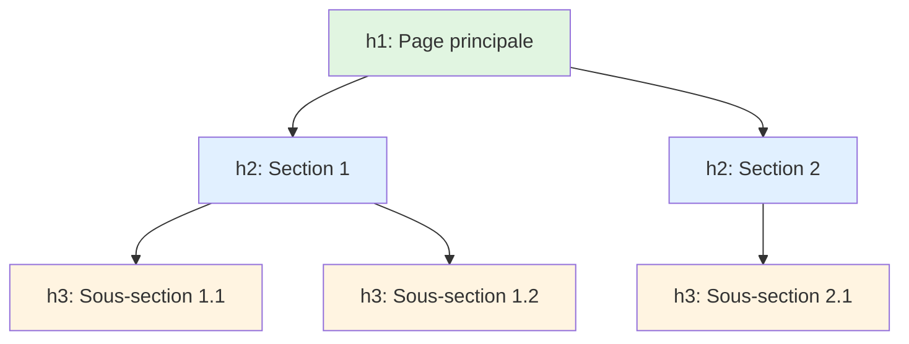

# I - Introduction

<div
  class="omny-meta"
  data-level="🟢 Débutant"
  data-version="1.0"
  data-time="4-6 heures">
</div>

## Introduction : Le Squelette du Web

!!! quote "Analogie pédagogique"
    _Imaginez construire une **maison**. Avant de peindre les murs (CSS) ou d'installer l'électricité (JavaScript), vous devez d'abord créer la **structure** : fondations, murs porteurs, pièces, portes, fenêtres. HTML, c'est exactement ça : le **squelette structurel** de votre page web. Chaque balise HTML est comme un élément architectural : `<header>` est l'entrée de la maison, `<main>` le salon principal, `<footer>` le sous-sol. Sans cette structure solide, impossible de construire quoi que ce soit de stable. HTML ne gère pas l'apparence (c'est le rôle de CSS), il définit **ce qui existe** et **comment c'est organisé**. Ce module vous apprend à construire des fondations HTML solides sur lesquelles tout le reste reposera._

**HTML (HyperText Markup Language)** = Langage de balisage définissant la structure et le contenu des pages web.

**Pourquoi apprendre HTML ?**

✅ **Fondation obligatoire** : Impossible de faire du web sans HTML  
✅ **Simplicité** : Syntaxe accessible, pas de programmation  
✅ **Universel** : Compris par tous les navigateurs  
✅ **Sémantique** : Structure le contenu de manière logique  
✅ **Accessibilité** : Base pour rendre le web accessible à tous  
✅ **SEO** : Google comprend le contenu via HTML  

**Ce que HTML n'est PAS :**

❌ Un langage de programmation (pas de logique, boucles, conditions)  
❌ Un outil de mise en page (c'est le rôle de CSS)  
❌ Interactif (c'est le rôle de JavaScript)  

**Ce module vous enseigne les fondations absolues du HTML.**

---

## 1. Structure d'un Document HTML

### 1.1 Document HTML Minimal

**Tout document HTML5 suit cette structure de base :**

```html
<!DOCTYPE html>
<html lang="fr">
<head>
    <meta charset="UTF-8">
    <meta name="viewport" content="width=device-width, initial-scale=1.0">
    <title>Ma première page</title>
</head>
<body>
    <h1>Bonjour le monde !</h1>
    <p>Ceci est mon premier paragraphe HTML.</p>
</body>
</html>
```

**Explication ligne par ligne :**

```html
<!DOCTYPE html>
<!-- Déclaration du type de document : HTML5 -->
<!-- TOUJOURS en première ligne -->

<html lang="fr">
<!-- Balise racine du document -->
<!-- lang="fr" : indique la langue (important pour accessibilité et SEO) -->

<head>
<!-- En-tête : métadonnées invisibles pour l'utilisateur -->
<!-- Informations pour le navigateur et les moteurs de recherche -->

    <meta charset="UTF-8">
    <!-- Encodage des caractères : UTF-8 pour supporter accents, émojis, etc. -->
    
    <meta name="viewport" content="width=device-width, initial-scale=1.0">
    <!-- Configuration pour responsive design (mobile/tablette/desktop) -->
    
    <title>Ma première page</title>
    <!-- Titre affiché dans l'onglet du navigateur -->
    <!-- Très important pour le SEO -->

</head>

<body>
<!-- Corps du document : contenu visible pour l'utilisateur -->

    <h1>Bonjour le monde !</h1>
    <!-- Titre principal de niveau 1 -->
    
    <p>Ceci est mon premier paragraphe HTML.</p>
    <!-- Paragraphe de texte -->

</body>

</html>
<!-- Fermeture de la balise racine -->
```

### 1.2 Anatomie d'une Balise HTML

```html
<!-- Structure complète d'une balise -->
<balise attribut="valeur">Contenu</balise>
  ↑        ↑        ↑        ↑        ↑
  |        |        |        |        |
Ouverture  |     Valeur   Contenu  Fermeture
        Attribut

<!-- Exemples concrets -->
<a href="https://google.com">Aller sur Google</a>
   ↑                          ↑
   Attribut href              Contenu cliquable
   

     ↑                ↑
     Source image     Texte alternatif (accessibilité)
     
<!-- Balise auto-fermante (pas de contenu) -->

<br>
<hr>
<meta charset="UTF-8">
```

**Règles fondamentales :**

✅ **Fermeture obligatoire** : `<p>Texte</p>` (sauf balises auto-fermantes)  
✅ **Respect de la casse** : `<p>` pas `<P>` (convention minuscules)  
✅ **Imbrication correcte** : `<p><strong>Gras</strong></p>` pas `<p><strong>Gras</p></strong>`  
✅ **Attributs entre guillemets** : `class="nom"` pas `class=nom`  

### 1.3 Structure Hiérarchique

```html
<!DOCTYPE html>
<html lang="fr">
    <head>
        <meta charset="UTF-8">
        <title>Structure hiérarchique</title>
    </head>
    <body>
        <header>
            <h1>Titre principal</h1>
            <nav>
                <ul>
                    <li><a href="#accueil">Accueil</a></li>
                    <li><a href="#about">À propos</a></li>
                </ul>
            </nav>
        </header>
        
        <main>
            <article>
                <h2>Article principal</h2>
                <p>Paragraphe de contenu.</p>
            </article>
        </main>
        
        <footer>
            <p>&copy; 2024 Mon Site</p>
        </footer>
    </body>
</html>
```

**Diagramme : Arbre DOM (Document Object Model)**



---

## 2. DOCTYPE et Encodage

### 2.1 DOCTYPE HTML5

```html
<!DOCTYPE html>
```

**Qu'est-ce que le DOCTYPE ?**

- **Déclaration** obligatoire en **première ligne**
- Indique au navigateur **quelle version HTML** utiliser
- HTML5 : `<!DOCTYPE html>` (simple et unique)
- Sans DOCTYPE → navigateur passe en "mode quirks" (comportements anciens et incohérents)

**Évolution historique :**

```html
<!-- HTML5 (actuel) - SIMPLE -->
<!DOCTYPE html>

<!-- HTML 4.01 Strict (ancien) - COMPLEXE -->
<!DOCTYPE HTML PUBLIC "-//W3C//DTD HTML 4.01//EN" "http://www.w3.org/TR/html4/strict.dtd">

<!-- XHTML 1.0 (ancien) - TRÈS COMPLEXE -->
<!DOCTYPE html PUBLIC "-//W3C//DTD XHTML 1.0 Strict//EN" "http://www.w3.org/TR/xhtml1/DTD/xhtml1-strict.dtd">
```

**⚠️ Toujours utiliser `<!DOCTYPE html>` (HTML5) - c'est le standard actuel.**

### 2.2 Encodage des Caractères

```html
<meta charset="UTF-8">
```

**Pourquoi UTF-8 est essentiel ?**

```html
<!-- SANS UTF-8 -->
<head>
    <title>Mon site</title>
</head>
<body>
    <p>Café à Paris</p>
    <!-- ❌ Accents cassés : "é" devient "é" -->
</body>

<!-- AVEC UTF-8 -->
<head>
    <meta charset="UTF-8">
    <title>Mon site</title>
</head>
<body>
    <p>Café à Paris</p>
    <!-- ✅ Accents corrects -->
    <p>🎉 Émojis fonctionnent aussi !</p>
</body>
```

**UTF-8 supporte :**

- ✅ Tous les accents français (é, è, ê, à, ç)  
- ✅ Caractères spéciaux (€, ©, ®)  
- ✅ Émojis (🚀, 💻, 🎨)  
- ✅ Tous les alphabets du monde (arabe, chinois, cyrillique)  

**⚠️ `<meta charset="UTF-8">` doit être dans les 1024 premiers octets du fichier → toujours en premier dans `<head>`**

---

## 3. Meta Tags Essentiels

### 3.1 Viewport (Responsive)

```html
<meta name="viewport" content="width=device-width, initial-scale=1.0">
```

**Avant cette balise (2010) :**
```html
<!-- Sites web non responsive -->
<!-- Sur mobile : zoom arrière automatique, texte illisible -->
```

**Avec cette balise :**
```html
<!-- Site s'adapte à la largeur de l'écran -->
<!-- Mobile : texte lisible, pas de zoom manuel nécessaire -->
```

**Explication des attributs :**

```html
<meta name="viewport" content="width=device-width, initial-scale=1.0">
                                      ↑                    ↑
                                      |                    |
                        Largeur = largeur écran   Zoom initial = 100%
```

**Comparaison visuelle :**

| Sans viewport | Avec viewport |
|---------------|---------------|
| 📱 Site desktop zoomé arrière | 📱 Site adapté au mobile |
| Texte 2px illisible | Texte 16px lisible |
| Scroll horizontal | Pas de scroll horizontal |

### 3.2 Description et Mots-clés SEO

```html
<head>
    <meta charset="UTF-8">
    <meta name="viewport" content="width=device-width, initial-scale=1.0">
    
    <!-- Titre (affiché dans onglet + résultats Google) -->
    <title>Développeur Web Freelance à Paris | Alice Dupont</title>
    
    <!-- Description (affichée dans résultats Google) -->
    <meta name="description" content="Développeur web freelance spécialisé en HTML, CSS et JavaScript. Création de sites web modernes et responsive à Paris.">
    
    <!-- Mots-clés (moins important aujourd'hui mais utile) -->
    <meta name="keywords" content="développeur web, freelance, HTML, CSS, JavaScript, Paris">
    
    <!-- Auteur -->
    <meta name="author" content="Alice Dupont">
</head>
```

**Impact sur Google :**

```
┌─────────────────────────────────────────────────────┐
│ Google Search Results                               │
├─────────────────────────────────────────────────────┤
│ Développeur Web Freelance à Paris | Alice Dupont    │ ← <title>
│ https://alicedupont.fr                              │
│ Développeur web freelance spécialisé en HTML,       │ ← <meta description>
│ CSS et JavaScript. Création de sites web modernes   │
│ et responsive à Paris.                              │
└─────────────────────────────────────────────────────┘
```

### 3.3 Open Graph (Partage Réseaux Sociaux)

```html
<head>
    <!-- Open Graph : Contrôle l'aperçu sur Facebook, LinkedIn, WhatsApp -->
    <meta property="og:title" content="Mon Portfolio - Développeur Web">
    <meta property="og:description" content="Découvrez mes projets web créatifs">
    <meta property="og:image" content="https://monsite.fr/preview.jpg">
    <meta property="og:url" content="https://monsite.fr">
    <meta property="og:type" content="website">
    
    <!-- Twitter Cards : Aperçu spécifique Twitter -->
    <meta name="twitter:card" content="summary_large_image">
    <meta name="twitter:title" content="Mon Portfolio - Développeur Web">
    <meta name="twitter:description" content="Découvrez mes projets web créatifs">
    <meta name="twitter:image" content="https://monsite.fr/preview.jpg">
</head>
```

**Avant vs Après Open Graph :**

```
SANS Open Graph (partage lien Facebook) :
┌──────────────────────────────┐
│ https://monsite.fr           │
│ (aucun aperçu)               │
└──────────────────────────────┘

AVEC Open Graph :
┌──────────────────────────────┐
│ [Image preview.jpg]          │
│ Mon Portfolio - Dev Web      │
│ Découvrez mes projets...     │
│ monsite.fr                   │
└──────────────────────────────┘
```

---

## 4. Balises Structurelles de Base

### 4.1 Titres (h1 à h6)

```html
<!DOCTYPE html>
<html lang="fr">
<head>
    <meta charset="UTF-8">
    <title>Hiérarchie des titres</title>
</head>
<body>
    <h1>Titre principal (h1) - UN SEUL par page</h1>
    
    <h2>Section 1 (h2)</h2>
    <p>Contenu de la section 1...</p>
    
    <h3>Sous-section 1.1 (h3)</h3>
    <p>Contenu de la sous-section...</p>
    
    <h3>Sous-section 1.2 (h3)</h3>
    <p>Contenu de la sous-section...</p>
    
    <h2>Section 2 (h2)</h2>
    <p>Contenu de la section 2...</p>
    
    <h3>Sous-section 2.1 (h3)</h3>
    <h4>Détail 2.1.1 (h4)</h4>
    <h5>Sous-détail 2.1.1.1 (h5)</h5>
    <h6>Micro-détail 2.1.1.1.1 (h6)</h6>
</body>
</html>
```

**Hiérarchie correcte vs incorrecte :**

```html
<!-- ✅ BON : Hiérarchie logique -->
<h1>Article principal</h1>
<h2>Section 1</h2>
<h3>Sous-section 1.1</h3>
<h3>Sous-section 1.2</h3>
<h2>Section 2</h2>

<!-- ❌ MAUVAIS : Sauts de niveaux -->
<h1>Article principal</h1>
<h4>Section (saut de h2 et h3)</h4> <!-- ⚠️ Ne pas sauter de niveaux -->
<h2>Retour h2</h2>

<!-- ❌ MAUVAIS : Plusieurs h1 -->
<h1>Premier titre principal</h1>
<h1>Deuxième titre principal</h1> <!-- ⚠️ UN SEUL h1 par page -->
```

**Diagramme : Structure de titres**



**Règles d'or des titres :**

1. **UN SEUL `<h1>`** par page (titre principal)
2. **Ne pas sauter de niveaux** (h1 → h2 → h3, pas h1 → h4)
3. **Hiérarchie logique** (représente la structure du contenu)
4. **Ne pas choisir pour la taille** (utiliser CSS pour ça)

### 4.2 Paragraphes et Sauts de Ligne

```html
<!-- Paragraphe -->
<p>Ceci est un paragraphe. Le navigateur ajoute automatiquement 
des marges avant et après chaque paragraphe.</p>

<p>Ceci est un autre paragraphe. Notez l'espace vertical 
entre les deux paragraphes.</p>

<!-- Saut de ligne simple -->
<p>
    Première ligne<br>
    Deuxième ligne (même paragraphe)
</p>

<!-- Ligne horizontale -->
<p>Texte avant la ligne</p>
<hr>
<p>Texte après la ligne</p>
```

**Rendu visuel :**

```
┌────────────────────────────────────────┐
│ Ceci est un paragraphe. Le navigateur  │
│ ajoute automatiquement des marges      │
│ avant et après chaque paragraphe.      │
│                                        │ ← Marge automatique
│ Ceci est un autre paragraphe. Notez    │
│ l'espace vertical entre les deux.      │
│                                        │
│ Première ligne                         │
│ Deuxième ligne (même paragraphe)       │
│                                        │
│ Texte avant la ligne                   │
│ ────────────────────────────────────── │ ← <hr>
│ Texte après la ligne                   │
└────────────────────────────────────────┘
```

**⚠️ Erreurs courantes :**

```html
<!-- ❌ MAUVAIS : Utiliser <br> pour espacer -->
<p>Texte 1</p>
<br><br><br>
<p>Texte 2</p>

<!-- ✅ BON : Utiliser CSS pour espacer -->
<p>Texte 1</p>
<p style="margin-top: 2rem;">Texte 2</p>
```

---

## 5. Commentaires HTML

### 5.1 Syntaxe des Commentaires

```html
<!-- Ceci est un commentaire -->
<!-- Les commentaires ne sont PAS affichés dans le navigateur -->
<!-- Mais visibles dans le code source (Ctrl+U) -->

<!DOCTYPE html>
<html lang="fr">
<head>
    <meta charset="UTF-8">
    <title>Commentaires</title>
</head>
<body>
    <!-- En-tête de la page -->
    <header>
        <h1>Mon site</h1>
        <!-- TODO: Ajouter logo -->
    </header>
    
    <!-- Contenu principal -->
    <main>
        <p>Texte visible</p>
        <!-- <p>Texte commenté (invisible)</p> -->
    </main>
    
    <!--
    Commentaire
    sur plusieurs
    lignes
    -->
</body>
</html>
```

### 5.2 Usages des Commentaires

**✅ Utilisations appropriées :**

```html
<!-- Section navigation -->
<nav>...</nav>

<!-- TODO: Compléter la description -->
<meta name="description" content="">

<!-- Version temporaire - À remplacer par API -->
<p>Données statiques</p>

<!-- Début formulaire de contact -->
<form>...</form>
<!-- Fin formulaire de contact -->
```

**❌ Utilisations inappropriées :**

```html
<!-- ❌ Ne pas laisser de code inutile commenté -->
<!--
<div>
    <p>Ancien code à supprimer</p>
</div>
-->

<!-- ❌ Ne pas mettre d'informations sensibles -->
<!-- Mot de passe admin : password123 -->

<!-- ❌ Éviter commentaires évidents -->
<p>Texte</p> <!-- Ceci est un paragraphe -->
```

**⚠️ Les commentaires sont visibles dans le code source !**

---

## 6. Indentation et Lisibilité

### 6.1 Code Bien Indenté

```html
<!DOCTYPE html>
<html lang="fr">
<head>
    <meta charset="UTF-8">
    <meta name="viewport" content="width=device-width, initial-scale=1.0">
    <title>Code propre</title>
</head>
<body>
    <header>
        <h1>Titre</h1>
        <nav>
            <ul>
                <li><a href="#home">Accueil</a></li>
                <li><a href="#about">À propos</a></li>
            </ul>
        </nav>
    </header>
    
    <main>
        <article>
            <h2>Article</h2>
            <p>Paragraphe</p>
        </article>
    </main>
</body>
</html>
```

**Règles d'indentation :**

1. **4 espaces** (ou 2 selon préférence d'équipe)
2. **Chaque niveau d'imbrication** = +1 indentation
3. **Fermeture au même niveau** que l'ouverture
4. **Lignes vides** pour séparer sections logiques

### 6.2 Mauvaise vs Bonne Structure

```html
<!-- ❌ MAUVAIS : Pas d'indentation -->
<html><head><title>Site</title></head><body><h1>Titre</h1><p>Texte</p></body></html>

<!-- ❌ MAUVAIS : Indentation incohérente -->
<html>
<head>
<title>Site</title>
    </head>
  <body>
        <h1>Titre</h1>
<p>Texte</p>
  </body>
</html>

<!-- ✅ BON : Indentation cohérente -->
<html>
    <head>
        <title>Site</title>
    </head>
    <body>
        <h1>Titre</h1>
        <p>Texte</p>
    </body>
</html>
```

---

## 7. Validation HTML

### 7.1 W3C Validator

**Pourquoi valider son HTML ?**

- ✅ Détecter erreurs de syntaxe
- ✅ Assurer compatibilité navigateurs
- ✅ Améliorer accessibilité
- ✅ Optimiser SEO
- ✅ Éviter bugs futurs

**Outil officiel :**

🔗 [W3C Markup Validation Service](https://validator.w3.org/)

```html
<!-- Code à valider -->
<!DOCTYPE html>
<html lang="fr">
<head>
    <meta charset="UTF-8">
    <title>Test validation</title>
</head>
<body>
    <h1>Titre</h1>
    <p>Paragraphe non fermé
    <!-- ❌ Erreur : balise <p> non fermée -->
</body>
</html>
```

**Rapport du validateur :**

```
Error: Unclosed element p
From line 8, column 5; to line 8, column 7

    <p>Paragraphe non fermé↩    </body>
```

### 7.2 Erreurs Courantes

```html
<!-- ❌ ERREUR 1 : Balise non fermée -->
<p>Texte sans fermeture
<p>Autre paragraphe</p>

<!-- ✅ CORRECTION -->
<p>Texte avec fermeture</p>
<p>Autre paragraphe</p>

<!-- ❌ ERREUR 2 : Imbrication incorrecte -->
<p><strong>Gras</p></strong>

<!-- ✅ CORRECTION -->
<p><strong>Gras</strong></p>

<!-- ❌ ERREUR 3 : Attributs sans guillemets -->


<!-- ✅ CORRECTION -->


<!-- ❌ ERREUR 4 : Balise en majuscules -->
<P>Texte</P>

<!-- ✅ CORRECTION -->
<p>Texte</p>
```

---

## 8. Exercices Pratiques

### Exercice 1 : Premier Document HTML

**Objectif :** Créer un document HTML5 valide avec structure complète.

**Consigne :** Créer un fichier `index.html` contenant :

- DOCTYPE HTML5
- Encodage UTF-8
- Viewport responsive
- Titre "Mon premier site"
- Description meta
- Un h1 "Bienvenue sur mon site"
- Un paragraphe de présentation

<details>
<summary>Solution</summary>

```html
<!DOCTYPE html>
<html lang="fr">
<head>
    <meta charset="UTF-8">
    <meta name="viewport" content="width=device-width, initial-scale=1.0">
    <meta name="description" content="Mon premier site web personnel">
    <title>Mon premier site</title>
</head>
<body>
    <h1>Bienvenue sur mon site</h1>
    <p>Je m'appelle Alice et ceci est mon premier site web créé avec HTML. Je suis passionnée par le développement web et j'apprends à créer des sites modernes et responsive.</p>
</body>
</html>
```

</details>

### Exercice 2 : Structure avec Titres

**Objectif :** Créer une hiérarchie de titres cohérente.

**Consigne :** Créer une page sur votre passion avec :

- h1 : Titre principal de la passion
- 3 sections h2 (ex: Histoire, Pratique, Avenir)
- Sous-sections h3 pour chaque h2
- Paragraphes de contenu

<details>
<summary>Solution - Exemple "Photographie"</summary>

```html
<!DOCTYPE html>
<html lang="fr">
<head>
    <meta charset="UTF-8">
    <meta name="viewport" content="width=device-width, initial-scale=1.0">
    <title>Ma passion : La photographie</title>
</head>
<body>
    <h1>La Photographie</h1>
    <p>La photographie est ma passion depuis 5 ans. Voici mon parcours.</p>
    
    <h2>Histoire de ma passion</h2>
    <p>J'ai découvert la photographie lors d'un voyage en 2019.</p>
    
    <h3>Mes débuts</h3>
    <p>J'ai commencé avec un simple smartphone avant d'acheter mon premier reflex.</p>
    
    <h3>Mon évolution</h3>
    <p>J'ai progressivement appris les techniques de composition et d'exposition.</p>
    
    <h2>Ma pratique actuelle</h2>
    <p>Aujourd'hui, je pratique plusieurs styles de photographie.</p>
    
    <h3>Photographie de paysage</h3>
    <p>Mon style préféré. J'adore capturer la nature au lever du soleil.</p>
    
    <h3>Portrait</h3>
    <p>Je réalise des portraits pour amis et famille.</p>
    
    <h2>Mes projets futurs</h2>
    <p>Je souhaite exposer mes photos et peut-être en faire mon métier.</p>
    
    <h3>Première exposition</h3>
    <p>Organisation d'une exposition locale prévue en 2025.</p>
    
    <h3>Formation professionnelle</h3>
    <p>Inscription à une formation de photographe professionnel.</p>
</body>
</html>
```

</details>

### Exercice 3 : Meta Tags Complets

**Objectif :** Créer un `<head>` complet pour le SEO.

**Consigne :** Créer le head pour un site de portfolio avec :

- Toutes les meta essentielles
- Open Graph pour Facebook
- Twitter Cards
- Description optimisée SEO (max 160 caractères)

<details>
<summary>Solution</summary>

```html
<!DOCTYPE html>
<html lang="fr">
<head>
    <!-- Essentiels -->
    <meta charset="UTF-8">
    <meta name="viewport" content="width=device-width, initial-scale=1.0">
    
    <!-- SEO -->
    <title>Alice Dupont - Développeuse Web Frontend | Portfolio</title>
    <meta name="description" content="Portfolio de Alice Dupont, développeuse web frontend spécialisée en HTML, CSS, JavaScript. Découvrez mes projets créatifs et modernes.">
    <meta name="keywords" content="développeur web, frontend, HTML, CSS, JavaScript, portfolio, freelance">
    <meta name="author" content="Alice Dupont">
    
    <!-- Open Graph (Facebook, LinkedIn) -->
    <meta property="og:title" content="Alice Dupont - Développeuse Web Frontend">
    <meta property="og:description" content="Découvrez mon portfolio et mes projets web créatifs">
    <meta property="og:image" content="https://alicedupont.fr/images/portfolio-preview.jpg">
    <meta property="og:url" content="https://alicedupont.fr">
    <meta property="og:type" content="website">
    <meta property="og:locale" content="fr_FR">
    
    <!-- Twitter Cards -->
    <meta name="twitter:card" content="summary_large_image">
    <meta name="twitter:site" content="@alicedupont">
    <meta name="twitter:title" content="Alice Dupont - Développeuse Web Frontend">
    <meta name="twitter:description" content="Découvrez mon portfolio et mes projets web créatifs">
    <meta name="twitter:image" content="https://alicedupont.fr/images/portfolio-preview.jpg">
    
    <!-- Favicon (on verra Module 3) -->
    <link rel="icon" type="image/png" href="favicon.png">
</head>
<body>
    <h1>Alice Dupont</h1>
    <p>Développeuse Web Frontend</p>
</body>
</html>
```

</details>

---

## 9. Projet du Module : Page "À Propos"

### 9.1 Cahier des Charges

**Créer une page "À propos de moi" complète :**

**Spécifications techniques :**

- ✅ Document HTML5 valide
- ✅ Head complet (meta, title, description, Open Graph)
- ✅ Structure hiérarchique avec h1-h3
- ✅ Minimum 5 paragraphes
- ✅ Commentaires HTML pour structurer
- ✅ Code indenté proprement
- ✅ Validation W3C sans erreur

**Contenu suggéré :**
1. Titre principal (h1) : Votre nom
2. Section "Qui suis-je ?" (h2) avec présentation
3. Section "Mon parcours" (h2) avec sous-sections h3
4. Section "Mes compétences" (h2)
5. Section "Me contacter" (h2)

### 9.2 Solution Complète

<details>
<summary>Voir la solution complète du projet</summary>

```html
<!DOCTYPE html>
<html lang="fr">
<head>
    <!-- Encodage et configuration -->
    <meta charset="UTF-8">
    <meta name="viewport" content="width=device-width, initial-scale=1.0">
    
    <!-- SEO -->
    <title>Alice Dupont - Développeuse Web | À propos</title>
    <meta name="description" content="Développeuse web passionnée par le frontend. Découvrez mon parcours, mes compétences et mes projets en HTML, CSS et JavaScript.">
    <meta name="keywords" content="Alice Dupont, développeur web, frontend, HTML, CSS, JavaScript">
    <meta name="author" content="Alice Dupont">
    
    <!-- Open Graph -->
    <meta property="og:title" content="Alice Dupont - Développeuse Web">
    <meta property="og:description" content="Développeuse web passionnée par le frontend">
    <meta property="og:type" content="profile">
    <meta property="og:url" content="https://alicedupont.fr/about">
    
    <!-- Twitter Card -->
    <meta name="twitter:card" content="summary">
    <meta name="twitter:title" content="Alice Dupont - Développeuse Web">
    <meta name="twitter:description" content="Développeuse web passionnée par le frontend">
</head>
<body>
    <!-- En-tête de la page -->
    <header>
        <h1>Alice Dupont</h1>
        <p>Développeuse Web Frontend</p>
        <hr>
    </header>
    
    <!-- Contenu principal -->
    <main>
        <!-- Section : Présentation -->
        <section>
            <h2>Qui suis-je ?</h2>
            <p>
                Je suis Alice, développeuse web frontend passionnée par la création d'interfaces utilisateur modernes, 
                élégantes et accessibles. Basée à Lyon, je travaille depuis 3 ans dans le développement web 
                et j'adore transformer des designs en expériences web interactives.
            </p>
            <p>
                Ma philosophie : du code propre, des sites rapides et une attention particulière à l'expérience utilisateur. 
                Je crois fermement que la beauté d'un site web réside autant dans son apparence que dans la qualité 
                de son code sous-jacent.
            </p>
        </section>
        
        <!-- Section : Parcours -->
        <section>
            <h2>Mon parcours</h2>
            
            <h3>Formation</h3>
            <p>
                Diplômée d'une Licence en Informatique (2019), j'ai ensuite suivi une formation intensive 
                en développement web où j'ai découvert ma passion pour le frontend. J'ai obtenu ma certification 
                de développeur web en 2021 avec mention excellence.
            </p>
            
            <h3>Expérience professionnelle</h3>
            <p>
                J'ai débuté comme développeuse junior chez WebAgency Lyon (2021-2022), où j'ai travaillé 
                sur des projets e-commerce utilisant HTML5, CSS3 et JavaScript moderne. Depuis 2023, 
                je suis développeuse frontend chez TechStart, contribuant à des applications web complexes 
                avec React et Vue.js.
            </p>
            
            <h3>Projets personnels</h3>
            <p>
                En parallèle de mon travail, je maintiens plusieurs projets open source sur GitHub et j'écris 
                des articles techniques sur mon blog personnel. J'ai également créé un site portfolio pour 
                photographes qui est utilisé par plus de 50 professionnels.
            </p>
        </section>
        
        <!-- Section : Compétences -->
        <section>
            <h2>Mes compétences</h2>
            
            <h3>Technologies maîtrisées</h3>
            <p>
                HTML5 sémantique, CSS3 moderne (Flexbox, Grid, animations), JavaScript ES6+, 
                Responsive Design, Accessibility (WCAG 2.1), Performance Web, Git et GitHub.
            </p>
            
            <h3>Outils et méthodologies</h3>
            <p>
                VS Code, Figma (pour comprendre les designs), Chrome DevTools, Lighthouse, 
                méthodes Agile (Scrum), tests unitaires avec Jest, et intégration continue avec GitHub Actions.
            </p>
            
            <h3>Apprentissage continu</h3>
            <p>
                Actuellement en train d'approfondir TypeScript et d'explorer le monde du WebGL avec Three.js. 
                Je suis également les évolutions de CSS moderne (Container Queries, Cascade Layers) et 
                les nouvelles APIs web.
            </p>
        </section>
        
        <!-- Section : Contact -->
        <section>
            <h2>Me contacter</h2>
            <p>
                Je suis toujours intéressée par de nouveaux projets passionnants et des collaborations créatives. 
                N'hésitez pas à me contacter si vous souhaitez discuter d'un projet, d'une opportunité professionnelle 
                ou simplement échanger sur le développement web !
            </p>
            <p>
                Email : alice.dupont@example.com<br>
                LinkedIn : linkedin.com/in/alicedupont<br>
                GitHub : github.com/alicedupont<br>
                Portfolio : alicedupont.fr
            </p>
        </section>
    </main>
    
    <!-- Pied de page -->
    <footer>
        <hr>
        <p>&copy; 2024 Alice Dupont. Tous droits réservés.</p>
    </footer>
</body>
</html>
```

</details>

### 9.3 Checklist de Validation

Avant de considérer votre projet terminé, vérifiez :

- [ ] `<!DOCTYPE html>` présent en première ligne
- [ ] `<html lang="fr">` avec attribut langue
- [ ] `<meta charset="UTF-8">` dans le head
- [ ] `<meta name="viewport">` pour responsive
- [ ] `<title>` descriptif et unique
- [ ] `<meta name="description">` optimisée SEO (< 160 caractères)
- [ ] UN SEUL `<h1>` sur la page
- [ ] Hiérarchie h1 → h2 → h3 logique et sans sauts
- [ ] Tous les paragraphes dans des balises `<p>`
- [ ] Code indenté avec 4 espaces par niveau
- [ ] Commentaires HTML pour structurer les sections
- [ ] Validation W3C sans erreur

---

## 10. Best Practices

### 10.1 Conventions de Nommage

```html
<!-- ✅ BON : Noms de fichiers -->
index.html
about.html
contact-form.html
my-portfolio.html

<!-- ❌ MAUVAIS : Noms de fichiers -->
Index.HTML
À propos.html
contact form.html
MyPortfolio.html
```

**Règles :**

- Tout en **minuscules**
- Pas d'espaces (utiliser **tirets**)
- Pas d'accents ni caractères spéciaux
- Noms **descriptifs**

### 10.2 Organisation des Fichiers

```
mon-site/
├── index.html
├── about.html
├── contact.html
├── css/
│   └── (Module 7)
├── js/
│   └── (Plus tard)
├── images/
│   └── (Module 3)
└── README.md
```

### 10.3 Checklist HTML Professionnel

**Avant chaque mise en ligne :**

- [ ] Code validé W3C sans erreur
- [ ] Indentation cohérente (4 espaces)
- [ ] Commentaires pour sections principales
- [ ] Meta tags SEO complétés
- [ ] Open Graph configuré
- [ ] Un seul h1 par page
- [ ] Hiérarchie de titres logique
- [ ] Encodage UTF-8 déclaré
- [ ] Viewport responsive configuré
- [ ] Noms de fichiers normalisés

---

## 11. Checkpoint de Progression

### À la fin de ce Module 1, vous maîtrisez :

**Structure HTML :**

- [x] DOCTYPE HTML5
- [x] Balises `<html>`, `<head>`, `<body>`
- [x] Anatomie d'une balise (ouverture, attributs, fermeture)
- [x] Imbrication correcte des balises

**Métadonnées :**

- [x] `<meta charset="UTF-8">`
- [x] `<meta name="viewport">` (responsive)
- [x] `<title>` optimisé
- [x] `<meta name="description">` (SEO)
- [x] Open Graph et Twitter Cards

**Contenu de base :**

- [x] Titres h1 à h6 (hiérarchie)
- [x] Paragraphes `<p>`
- [x] Sauts de ligne `<br>` et `<hr>`
- [x] Commentaires HTML

**Qualité :**

- [x] Indentation propre
- [x] Validation W3C
- [x] Best practices nommage
- [x] Code lisible et maintenable

### Prochaine Étape

**Direction le Module 2** où vous allez :

- Formater du texte (gras, italique, surlignage)
- Créer des liens hypertextes
- Maîtriser les liens internes et ancres
- Structurer des citations et codes
- Gérer les entités HTML

[:lucide-arrow-right: Accéder au Module 2 - Texte et Liens](./module-02-texte-liens/)

---

**Module 1 Terminé - Bravo ! 🎉 📄**

**Vous avez appris :**

- ✅ Structure complète d'un document HTML5
- ✅ Métadonnées essentielles (charset, viewport, SEO)
- ✅ Hiérarchie de titres professionnelle
- ✅ Commentaires et indentation
- ✅ Validation W3C
- ✅ Best practices HTML

**Statistiques Module 1 :**

- 1 projet complet (Page À Propos)
- 3 exercices pratiques
- 50+ exemples de code
- Fondations HTML solides

**Prochain objectif : Maîtriser le texte et les liens (Module 2)**

**Félicitations pour ces fondations HTML excellentes ! 🚀📄**
