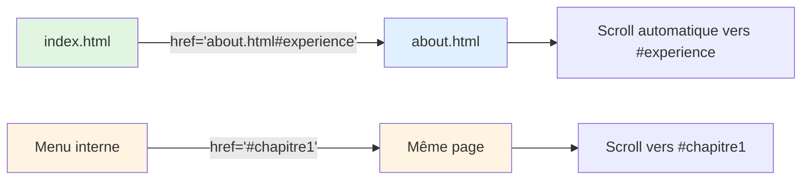

# II - Texte & Liens

<div
  class="omny-meta"
  data-level="🟢 Débutant"
  data-version="1.0"
  data-time="4-6 heures">
</div>

## Introduction : Le Contenu Prend Vie

!!! quote "Analogie pédagogique"
    _Imaginez un **livre**. Le texte brut sans mise en forme serait illisible : pas de gras pour les titres importants, pas d'italique pour les citations, pas de liens pour référencer d'autres pages. La **mise en forme du texte** en HTML, c'est comme les outils typographiques d'un éditeur : `<strong>` met en gras les mots importants, `<em>` italicise pour l'emphase, `<mark>` surligne comme un surligneur jaune. Et les **liens hypertextes** (`<a>`) ? C'est la révolution du web : transformer votre page en une porte vers l'infini d'Internet. Cliquez un mot souligné en bleu, et hop ! Vous êtes transporté ailleurs. C'est le "HyperText" de HTML : le texte devient dynamique, interconnecté, vivant. Ce module vous apprend à donner vie à votre contenu textuel avec sémantique et liens intelligents._

**Mise en forme du texte** = Balises HTML donnant du sens ET de l'apparence au texte.

**Liens hypertextes** = Éléments `<a>` créant des connexions entre pages web.

**Pourquoi maîtriser texte et liens ?**

✅ **Lisibilité** : Texte structuré = contenu compréhensible  
✅ **Accessibilité** : Lecteurs d'écran comprennent la sémantique  
✅ **SEO** : Google favorise le contenu bien structuré  
✅ **Navigation** : Liens = essence même du web  
✅ **UX** : Utilisateur trouve facilement l'information  
✅ **Sémantique** : HTML décrit le sens, pas juste l'apparence  

**Ce module vous enseigne à créer du contenu textuel professionnel et des liens efficaces.**

---

## 1. Mise en Forme Sémantique du Texte

### 1.1 Strong vs Bold (Important vs Gras)

```html
<!DOCTYPE html>
<html lang="fr">
<head>
    <meta charset="UTF-8">
    <title>Strong vs Bold</title>
</head>
<body>
    <!-- ✅ SÉMANTIQUE : Importance forte -->
    <p>
        <strong>Attention :</strong> Le site sera en maintenance demain.
    </p>
    
    <!-- ✅ SÉMANTIQUE : Termes techniques importants -->
    <p>
        La balise <strong>DOCTYPE</strong> doit être en première ligne.
    </p>
    
    <!-- ❌ ANCIEN : Juste gras visuel (déprécié) -->
    <p>
        <b>Texte en gras</b> sans importance sémantique.
    </p>
    
    <!-- ✅ BON USAGE de <b> (rare) : Mots-clés sans importance -->
    <p>
        <b class="keyword">HTML</b> et <b class="keyword">CSS</b> sont les bases du web.
    </p>
</body>
</html>
```

**Différence Strong vs B :**

| Balise | Sémantique | Visuel | Accessibilité | SEO | Usage |
|--------|------------|--------|---------------|-----|-------|
| `<strong>` | **Importance forte** | Gras | Lecteur d'écran annonce importance | ✅ Favorisé | ✅ Utiliser prioritairement |
| `<b>` | Aucune | Gras | Ignoré par lecteurs d'écran | ❌ Neutre | ⚠️ Rare (mots-clés visuels) |

**Rendu navigateur :**

```
┌────────────────────────────────────────┐
│ Attention : Le site sera en            │
│ ^^^^^^^^^^^                             │
│ (gras + importance sémantique)          │
│                                         │
│ Texte en gras sans importance          │
│       ^^^^^^^^                          │
│ (juste gras visuel)                    │
└────────────────────────────────────────┘
```

### 1.2 Emphasis vs Italic (Emphase vs Italique)

```html
<!DOCTYPE html>
<html lang="fr">
<head>
    <meta charset="UTF-8">
    <title>Emphasis vs Italic</title>
</head>
<body>
    <!-- ✅ SÉMANTIQUE : Emphase (stress vocal) -->
    <p>
        Je veux <em>vraiment</em> apprendre le HTML !
    </p>
    
    <!-- ✅ SÉMANTIQUE : Terme étranger -->
    <p>
        Le concept de <em lang="en">responsive design</em> est essentiel.
    </p>
    
    <!-- ❌ ANCIEN : Juste italique visuel (déprécié) -->
    <p>
        <i>Texte en italique</i> sans emphase.
    </p>
    
    <!-- ✅ BON USAGE de <i> : Icônes, termes taxonomiques -->
    <p>
        <i class="icon-heart"></i> 120 likes
    </p>
    
    <p>
        L'espèce <i>Canis lupus</i> (nom scientifique en italique).
    </p>
</body>
</html>
```

**Différence Em vs I :**

| Balise | Sémantique | Visuel | Accessibilité | Usage |
|--------|------------|--------|---------------|-------|
| `<em>` | **Emphase** (stress) | Italique | Lecteur accentue | ✅ Emphase, termes étrangers |
| `<i>` | Aucune | Italique | Ignoré | ⚠️ Icônes, noms scientifiques |

**Différence vocale (lecteur d'écran) :**

```html
<p>Je veux apprendre le HTML.</p>
<!-- Lecteur : "Je veux apprendre le HTML" (ton neutre) -->

<p>Je veux <em>vraiment</em> apprendre le HTML.</p>
<!-- Lecteur : "Je veux VRAIMENT apprendre le HTML" (accent sur "vraiment") -->
```

### 1.3 Mark (Surlignage)

```html
<!DOCTYPE html>
<html lang="fr">
<head>
    <meta charset="UTF-8">
    <title>Balise Mark</title>
</head>
<body>
    <!-- ✅ Résultat de recherche -->
    <p>
        Résultat pour "HTML" : Le langage <mark>HTML</mark> est la base du web.
    </p>
    
    <!-- ✅ Mise en évidence dans un contexte -->
    <p>
        Article original : "Le développement web est complexe."<br>
        Citation mise à jour : "Le développement web <mark>moderne</mark> est complexe."
    </p>
    
    <!-- ✅ Partie importante d'une citation -->
    <blockquote>
        "Le web est bien plus qu'une simple innovation technologique, 
        c'est <mark>une force qui transforme la société</mark>."
    </blockquote>
</body>
</html>
```

**Rendu navigateur (fond jaune par défaut) :**

```
┌────────────────────────────────────────┐
│ Le langage ████ est la base du web.    │
│            HTML                        │
│            (fond jaune)                │
└────────────────────────────────────────┘
```

### 1.4 Small, Sub et Sup

```html
<!DOCTYPE html>
<html lang="fr">
<head>
    <meta charset="UTF-8">
    <title>Small, Sub, Sup</title>
</head>
<body>
    <!-- Small : Texte secondaire (petits caractères) -->
    <p>
        Prix : 99.99€ <small>(hors taxes)</small>
    </p>
    
    <footer>
        <p>
            <small>&copy; 2024 Mon Site. Tous droits réservés.</small>
        </p>
    </footer>
    
    <!-- Subscript : Indice (chimie, maths) -->
    <p>
        Formule de l'eau : H<sub>2</sub>O
    </p>
    
    <p>
        La variable x<sub>1</sub> est égale à x<sub>2</sub>
    </p>
    
    <!-- Superscript : Exposant (maths, notes de bas de page) -->
    <p>
        E = mc<sup>2</sup>
    </p>
    
    <p>
        Voir note de bas de page<sup>1</sup>
    </p>
    
    <p>
        2<sup>10</sup> = 1024
    </p>
</body>
</html>
```

**Rendu visuel :**

```
Prix : 99.99€ (hors taxes)
              ^^^^^^^^^^^^^
              (plus petit)

Formule de l'eau : H₂O
                    ↑ (indice bas)

E = mc²
      ↑ (exposant haut)
```

### 1.5 Del et Ins (Suppressions et Insertions)

```html
<!DOCTYPE html>
<html lang="fr">
<head>
    <meta charset="UTF-8">
    <title>Del et Ins</title>
</head>
<body>
    <!-- Mise à jour de contenu -->
    <p>
        Prix : <del>129.99€</del> <ins>99.99€</ins> (promotion !)
    </p>
    
    <!-- Correction d'erreur -->
    <p>
        Le HTML a été créé en <del>1995</del> <ins>1991</ins> par Tim Berners-Lee.
    </p>
    
    <!-- Avec attributs datetime et cite -->
    <p>
        <del datetime="2024-01-15" cite="correction.html">Texte obsolète</del>
        <ins datetime="2024-01-16" cite="correction.html">Texte corrigé</ins>
    </p>
</body>
</html>
```

**Rendu visuel :**

```
Prix : 129.99€ 99.99€ (promotion !)
       ^^^^^^^^        
       (barré)  (souligné)
```

---

## 2. Citations et Code

### 2.1 Blockquote (Citation Longue)

```html
<!DOCTYPE html>
<html lang="fr">
<head>
    <meta charset="UTF-8">
    <title>Citations</title>
</head>
<body>
    <!-- Citation simple -->
    <blockquote>
        <p>
            Le web n'est pas une technologie, c'est un espace de liberté.
        </p>
    </blockquote>
    
    <!-- Citation avec source -->
    <blockquote cite="https://example.com/article">
        <p>
            "Le HTML est le langage universel du web. Chaque page web 
            que vous visitez est construite avec du HTML."
        </p>
        <footer>
            — <cite>John Doe</cite>, dans <cite>Introduction au Web</cite>
        </footer>
    </blockquote>
    
    <!-- Citation avec attribution complète -->
    <figure>
        <blockquote>
            <p>
                "La simplicité est la sophistication suprême."
            </p>
        </blockquote>
        <figcaption>
            — <cite>Léonard de Vinci</cite>
        </figcaption>
    </figure>
</body>
</html>
```

**Rendu visuel typique :**

```
┌────────────────────────────────────────┐
│    "Le HTML est le langage universel   │
│    du web. Chaque page web que vous    │
│    visitez est construite avec HTML."  │
│                                        │
│    — John Doe, dans Introduction au Web│
└────────────────────────────────────────┘
     (indentation à gauche/droite)
```

### 2.2 Q (Citation Courte Inline)

```html
<!DOCTYPE html>
<html lang="fr">
<head>
    <meta charset="UTF-8">
    <title>Citation inline</title>
</head>
<body>
    <!-- Citation courte dans un paragraphe -->
    <p>
        Comme l'a dit Tim Berners-Lee : 
        <q>The Web does not just connect machines, it connects people.</q>
    </p>
    
    <!-- Avec attribut cite (URL source) -->
    <p>
        Einstein affirmait que 
        <q cite="https://quotes.com/einstein">l'imagination est plus importante que le savoir</q>.
    </p>
</body>
</html>
```

**Rendu navigateur (guillemets automatiques) :**

```
Comme l'a dit Tim Berners-Lee : "The Web does not just connect machines, it connects people."
                                 ^                                                          ^
                                 (guillemets ajoutés automatiquement par navigateur)
```

### 2.3 Code, Pre, Kbd et Samp

```html
<!DOCTYPE html>
<html lang="fr">
<head>
    <meta charset="UTF-8">
    <title>Code et techniques</title>
</head>
<body>
    <!-- Code inline -->
    <p>
        Pour créer un paragraphe, utilisez la balise <code>&lt;p&gt;</code>.
    </p>
    
    <p>
        La variable <code>userName</code> contient le nom de l'utilisateur.
    </p>
    
    <!-- Bloc de code préformaté -->
    <pre><code>&lt;!DOCTYPE html&gt;
&lt;html lang="fr"&gt;
&lt;head&gt;
    &lt;meta charset="UTF-8"&gt;
    &lt;title&gt;Mon site&lt;/title&gt;
&lt;/head&gt;
&lt;body&gt;
    &lt;h1&gt;Bonjour&lt;/h1&gt;
&lt;/body&gt;
&lt;/html&gt;</code></pre>
    
    <!-- Saisie clavier (kbd) -->
    <p>
        Pour copier : <kbd>Ctrl</kbd> + <kbd>C</kbd>
    </p>
    
    <p>
        Pour sauvegarder : <kbd>Ctrl</kbd> + <kbd>S</kbd>
    </p>
    
    <!-- Sortie ordinateur (samp) -->
    <p>
        Message d'erreur : <samp>404 Not Found</samp>
    </p>
    
    <p>
        Résultat de la commande : <samp>Hello World</samp>
    </p>
</body>
</html>
```

**Différence Code, Pre, Kbd, Samp :**

| Balise | Usage | Rendu | Exemple |
|--------|-------|-------|---------|
| `<code>` | Code source | Monospace | `<code>let x = 5;</code>` |
| `<pre>` | Texte préformaté (espaces/retours préservés) | Monospace + espaces | Blocs de code |
| `<kbd>` | Touche clavier | Style touche | `<kbd>Enter</kbd>` |
| `<samp>` | Sortie ordinateur | Monospace | `<samp>Error 404</samp>` |

**Rendu visuel :**

```
Pour créer un paragraphe, utilisez la balise <p>.
                                             ^^^
                                             (police monospace)

Pour copier : [Ctrl] + [C]
              ^^^^^   ^^^
              (style bouton clavier)

Message d'erreur : 404 Not Found
                   ^^^^^^^^^^^^^^
                   (police monospace, style sortie)
```

---

## 3. Liens Hypertextes

### 3.1 Anatomie d'un Lien

```html
<!DOCTYPE html>
<html lang="fr">
<head>
    <meta charset="UTF-8">
    <title>Anatomie d'un lien</title>
</head>
<body>
    <!-- Structure complète d'un lien -->
    <a href="https://google.com" target="_blank" title="Aller sur Google">
        Cliquez ici
    </a>
    ↑  ↑                         ↑                ↑                      ↑
    |  |                         |                |                      |
    a  href (destination)   target (onglet)  title (infobulle)     Texte cliquable
    
    <!-- Exemples divers -->
    
    <!-- Lien externe simple -->
    <a href="https://mozilla.org">Documentation MDN</a>
    
    <!-- Lien avec infobulle -->
    <a href="contact.html" title="Page de contact">Contactez-nous</a>
    
    <!-- Lien nouvel onglet -->
    <a href="https://example.com" target="_blank">Ouvrir dans nouvel onglet</a>
    
    <!-- Lien email -->
    <a href="mailto:contact@example.com">Envoyer un email</a>
    
    <!-- Lien téléphone -->
    <a href="tel:+33123456789">01 23 45 67 89</a>
</body>
</html>
```

**Anatomie détaillée :**

```html
<a href="destination" target="où" rel="relation" title="infobulle">Texte</a>

href    : URL de destination (obligatoire)
target  : _blank (nouvel onglet), _self (même onglet - défaut)
rel     : Relation avec la page cible (noopener, nofollow, etc.)
title   : Texte affiché au survol (infobulle)
Texte   : Contenu cliquable (visible par l'utilisateur)
```

### 3.2 Types de Liens

```html
<!DOCTYPE html>
<html lang="fr">
<head>
    <meta charset="UTF-8">
    <title>Types de liens</title>
</head>
<body>
    <h1>Différents types de liens</h1>
    
    <!-- 1. Lien externe (autre site) -->
    <p>
        <a href="https://developer.mozilla.org">MDN Web Docs</a>
    </p>
    
    <!-- 2. Lien interne relatif (même site) -->
    <p>
        <a href="about.html">À propos</a>
        <a href="contact.html">Contact</a>
        <a href="../index.html">Retour accueil</a>
    </p>
    
    <!-- 3. Lien interne absolu -->
    <p>
        <a href="https://monsite.fr/about.html">À propos (absolu)</a>
    </p>
    
    <!-- 4. Lien ancre (même page) -->
    <p>
        <a href="#section1">Aller à la section 1</a>
    </p>
    
    <!-- 5. Lien email -->
    <p>
        <a href="mailto:alice@example.com">Envoyer un email</a>
        <a href="mailto:alice@example.com?subject=Question&body=Bonjour">
            Email avec sujet pré-rempli
        </a>
    </p>
    
    <!-- 6. Lien téléphone -->
    <p>
        <a href="tel:+33123456789">Appeler : 01 23 45 67 89</a>
    </p>
    
    <!-- 7. Lien téléchargement -->
    <p>
        <a href="document.pdf" download>Télécharger le PDF</a>
        <a href="image.jpg" download="mon-image.jpg">Télécharger (renommer)</a>
    </p>
</body>
</html>
```

**Différence chemins relatifs vs absolus :**

```
Structure du site :
mon-site/
├── index.html
├── about.html
├── css/
│   └── style.css
└── pages/
    └── contact.html

<!-- Depuis index.html -->
<a href="about.html">À propos</a>                    ✅ Relatif simple
<a href="pages/contact.html">Contact</a>             ✅ Relatif sous-dossier
<a href="https://monsite.fr/about.html">About</a>    ✅ Absolu

<!-- Depuis pages/contact.html -->
<a href="../index.html">Accueil</a>                  ✅ Relatif (remonter)
<a href="../about.html">À propos</a>                 ✅ Relatif
<a href="https://monsite.fr/index.html">Accueil</a>  ✅ Absolu
```

### 3.3 Target et Sécurité

```html
<!DOCTYPE html>
<html lang="fr">
<head>
    <meta charset="UTF-8">
    <title>Target et sécurité</title>
</head>
<body>
    <!-- ❌ DANGEREUX : target="_blank" sans rel -->
    <a href="https://example.com" target="_blank">
        Lien externe
    </a>
    <!-- ⚠️ Faille de sécurité : la page externe peut contrôler votre page -->
    
    <!-- ✅ BON : target="_blank" avec rel="noopener noreferrer" -->
    <a href="https://example.com" target="_blank" rel="noopener noreferrer">
        Lien externe sécurisé
    </a>
    
    <!-- Explication rel -->
    <!-- 
    noopener   : Empêche window.opener (sécurité)
    noreferrer : N'envoie pas l'URL de provenance (vie privée)
    -->
    
    <!-- Valeurs de target -->
    <a href="page.html" target="_self">Même onglet (défaut)</a>
    <a href="page.html" target="_blank">Nouvel onglet</a>
    <a href="page.html" target="_parent">Fenêtre parente (iframes)</a>
    <a href="page.html" target="_top">Fenêtre principale (iframes)</a>
</body>
</html>
```

**Tableau récapitulatif target :**

| Valeur | Comportement | Usage |
|--------|--------------|-------|
| `_self` | Même onglet (défaut) | Navigation normale |
| `_blank` | Nouvel onglet | Liens externes, PDF |
| `_parent` | Fenêtre parente | Iframes imbriquées |
| `_top` | Fenêtre racine | Sortir de toutes iframes |

**⚠️ Toujours ajouter `rel="noopener noreferrer"` avec `target="_blank"` !**

---

## 4. Ancres et Navigation Interne

### 4.1 Créer des Ancres

```html
<!DOCTYPE html>
<html lang="fr">
<head>
    <meta charset="UTF-8">
    <title>Navigation par ancres</title>
</head>
<body>
    <!-- Menu de navigation -->
    <nav>
        <h2>Sommaire</h2>
        <ul>
            <li><a href="#introduction">Introduction</a></li>
            <li><a href="#chapitre1">Chapitre 1</a></li>
            <li><a href="#chapitre2">Chapitre 2</a></li>
            <li><a href="#conclusion">Conclusion</a></li>
            <li><a href="#top">Retour en haut</a></li>
        </ul>
    </nav>
    
    <!-- Ancre cible avec id -->
    <section id="introduction">
        <h2>Introduction</h2>
        <p>Contenu de l'introduction...</p>
        <p>(Beaucoup de texte)</p>
    </section>
    
    <section id="chapitre1">
        <h2>Chapitre 1</h2>
        <p>Contenu du chapitre 1...</p>
        
        <!-- Sous-ancre -->
        <h3 id="chapitre1-section1">Section 1.1</h3>
        <p>Contenu...</p>
        
        <!-- Lien vers sous-ancre -->
        <p><a href="#chapitre1-section1">Voir Section 1.1</a></p>
    </section>
    
    <section id="chapitre2">
        <h2>Chapitre 2</h2>
        <p>Contenu du chapitre 2...</p>
    </section>
    
    <section id="conclusion">
        <h2>Conclusion</h2>
        <p>Contenu de la conclusion...</p>
    </section>
    
    <!-- Ancre "top" pour retour en haut -->
    <div id="top"></div>
</body>
</html>
```

**Comment fonctionnent les ancres :**

```
1. Créer l'ancre cible avec id :
   <section id="chapitre1">...</section>

2. Créer le lien vers l'ancre :
   <a href="#chapitre1">Aller au Chapitre 1</a>
   
3. Clic → Navigateur scroll automatiquement vers #chapitre1
```

### 4.2 Ancres entre Pages

```html
<!-- Page index.html -->
<!DOCTYPE html>
<html lang="fr">
<head>
    <meta charset="UTF-8">
    <title>Accueil</title>
</head>
<body>
    <h1>Accueil</h1>
    
    <!-- Lien vers section spécifique d'une autre page -->
    <p>
        <a href="about.html#experience">Voir mon expérience</a>
    </p>
    
    <p>
        <a href="contact.html#form">Accéder au formulaire</a>
    </p>
</body>
</html>

<!-- Page about.html -->
<!DOCTYPE html>
<html lang="fr">
<head>
    <meta charset="UTF-8">
    <title>À propos</title>
</head>
<body>
    <h1>À propos</h1>
    
    <section id="bio">
        <h2>Biographie</h2>
        <p>...</p>
    </section>
    
    <section id="experience">
        <h2>Expérience</h2>
        <!-- Le lien depuis index.html mène ici -->
        <p>...</p>
    </section>
    
    <section id="competences">
        <h2>Compétences</h2>
        <p>...</p>
    </section>
</body>
</html>
```

**Diagramme : Navigation par ancres**



---

## 5. Attributs Avancés des Liens

### 5.1 Attribut Title

```html
<!DOCTYPE html>
<html lang="fr">
<head>
    <meta charset="UTF-8">
    <title>Attribut title</title>
</head>
<body>
    <!-- Title pour informations supplémentaires -->
    <p>
        <a href="https://mozilla.org" title="Site officiel de Mozilla - Documentation web">
            MDN Web Docs
        </a>
    </p>
    
    <!-- Title pour liens d'images -->
    <a href="https://example.com" title="Visiter le site Example">
        
    </a>
    
    <!-- ⚠️ Ne pas répéter le texte du lien -->
    <!-- ❌ MAUVAIS -->
    <a href="contact.html" title="Contact">Contact</a>
    
    <!-- ✅ BON : Ajouter information utile -->
    <a href="contact.html" title="Formulaire de contact - Réponse sous 24h">
        Contact
    </a>
</body>
</html>
```

**Infobulle au survol :**

```
┌─────────────────────────────────────────────┐
│ MDN Web Docs                                │
│ ^^^^^^^^^^^^^                                │
│ ┌─────────────────────────────────────────┐ │
│ │ Site officiel de Mozilla -              │ │ ← Infobulle (title)
│ │ Documentation web                       │ │
│ └─────────────────────────────────────────┘ │
└─────────────────────────────────────────────┘
```

### 5.2 Attribut Rel

```html
<!DOCTYPE html>
<html lang="fr">
<head>
    <meta charset="UTF-8">
    <title>Attribut rel</title>
</head>
<body>
    <!-- noopener noreferrer : Sécurité target="_blank" -->
    <a href="https://example.com" target="_blank" rel="noopener noreferrer">
        Lien externe sécurisé
    </a>
    
    <!-- nofollow : Ne pas transmettre PageRank (SEO) -->
    <a href="https://spam-site.com" rel="nofollow">
        Lien non endorsé (commentaire spam, publicité)
    </a>
    
    <!-- sponsored : Lien sponsorisé/publicité -->
    <a href="https://sponsor.com" rel="sponsored">
        Partenaire commercial
    </a>
    
    <!-- ugc : User Generated Content (contenu utilisateur) -->
    <a href="https://user-site.com" rel="ugc">
        Lien posté par un utilisateur
    </a>
    
    <!-- prev/next : Navigation pagination -->
    <a href="page1.html" rel="prev">Page précédente</a>
    <a href="page3.html" rel="next">Page suivante</a>
    
    <!-- Combiner plusieurs valeurs -->
    <a href="https://external.com" target="_blank" rel="noopener noreferrer nofollow">
        Lien externe sans transmission PageRank
    </a>
</body>
</html>
```

**Tableau récapitulatif rel :**

| Valeur | Signification | Usage |
|--------|---------------|-------|
| `noopener` | Pas d'accès window.opener | Sécurité `target="_blank"` |
| `noreferrer` | Pas de header Referer | Vie privée |
| `nofollow` | Ne pas suivre (SEO) | Liens non endorsés |
| `sponsored` | Lien sponsorisé | Publicités |
| `ugc` | Contenu utilisateur | Commentaires, forums |
| `prev/next` | Navigation | Pagination |

### 5.3 Attribut Download

```html
<!DOCTYPE html>
<html lang="fr">
<head>
    <meta charset="UTF-8">
    <title>Attribut download</title>
</head>
<body>
    <!-- Télécharger avec nom original -->
    <p>
        <a href="document.pdf" download>
            Télécharger le document PDF
        </a>
    </p>
    
    <!-- Télécharger avec nom personnalisé -->
    <p>
        <a href="rapport-2024-01.pdf" download="rapport-janvier-2024.pdf">
            Télécharger rapport janvier
        </a>
    </p>
    
    <!-- Télécharger image -->
    <p>
        <a href="photo-vacances.jpg" download="vacances-2024.jpg">
            Télécharger photo
        </a>
    </p>
    
    <!-- ⚠️ download fonctionne seulement même origine -->
    <!-- ❌ Ne fonctionne pas (origine différente) -->
    <a href="https://example.com/file.pdf" download>
        Télécharger
    </a>
    
    <!-- ✅ Fonctionne (même site) -->
    <a href="/files/document.pdf" download>
        Télécharger
    </a>
</body>
</html>
```

---

## 6. Entités HTML

### 6.1 Caractères Spéciaux

```html
<!DOCTYPE html>
<html lang="fr">
<head>
    <meta charset="UTF-8">
    <title>Entités HTML</title>
</head>
<body>
    <!-- Pourquoi les entités ? -->
    <!-- ❌ Problème : Balises HTML interprétées -->
    <p>Pour écrire du HTML, utilisez <p> pour les paragraphes.</p>
    <!-- Résultat cassé : navigateur pense que <p> est une vraie balise -->
    
    <!-- ✅ Solution : Entités HTML -->
    <p>Pour écrire du HTML, utilisez &lt;p&gt; pour les paragraphes.</p>
    
    <!-- Caractères réservés HTML -->
    <p>
        &lt; = Inférieur à (less than)<br>
        &gt; = Supérieur à (greater than)<br>
        &amp; = Esperluette (ampersand)<br>
        &quot; = Guillemet double<br>
        &apos; = Apostrophe / guillemet simple
    </p>
    
    <!-- Exemple code HTML affiché -->
    <pre><code>&lt;!DOCTYPE html&gt;
&lt;html lang="fr"&gt;
&lt;head&gt;
    &lt;meta charset="UTF-8"&gt;
&lt;/head&gt;
&lt;/html&gt;</code></pre>
</body>
</html>
```

**Entités essentielles :**

| Caractère | Entité | Code | Affichage |
|-----------|--------|------|-----------|
| < | `&lt;` | `&#60;` | < |
| > | `&gt;` | `&#62;` | > |
| & | `&amp;` | `&#38;` | & |
| " | `&quot;` | `&#34;` | " |
| ' | `&apos;` | `&#39;` | ' |
| espace insécable | `&nbsp;` | `&#160;` | (espace) |

### 6.2 Entités Courantes

```html
<!DOCTYPE html>
<html lang="fr">
<head>
    <meta charset="UTF-8">
    <title>Entités courantes</title>
</head>
<body>
    <!-- Symboles typographiques -->
    <p>
        &copy; Copyright<br>
        &reg; Marque déposée<br>
        &trade; Trademark<br>
        &euro; Euro<br>
        &pound; Livre sterling<br>
        &yen; Yen
    </p>
    
    <!-- Symboles mathématiques -->
    <p>
        &times; Multiplication (2 &times; 3 = 6)<br>
        &divide; Division (10 &divide; 2 = 5)<br>
        &plusmn; Plus ou moins (&plusmn;5)<br>
        &ne; Différent de (x &ne; 0)<br>
        &le; Inférieur ou égal (&le;)<br>
        &ge; Supérieur ou égal (&ge;)
    </p>
    
    <!-- Flèches -->
    <p>
        &larr; Flèche gauche<br>
        &rarr; Flèche droite<br>
        &uarr; Flèche haut<br>
        &darr; Flèche bas<br>
        &harr; Double flèche
    </p>
    
    <!-- Espace insécable (empêche retour ligne) -->
    <p>
        Prix&nbsp;: 99.99&nbsp;€
        <!-- L'espace ne se transforme jamais en retour ligne -->
    </p>
    
    <!-- Guillemets français -->
    <p>
        &laquo; Citation entre guillemets français &raquo;
    </p>
</body>
</html>
```

**Rendu visuel :**

```
© Copyright
® Marque déposée
™ Trademark
€ Euro
£ Livre sterling
¥ Yen

2 × 3 = 6
10 ÷ 2 = 5
±5
x ≠ 0

← → ↑ ↓ ↔

Prix : 99.99 €
(espace insécable entre valeur et symbole)

« Citation entre guillemets français »
```

### 6.3 Codes Numériques

```html
<!DOCTYPE html>
<html lang="fr">
<head>
    <meta charset="UTF-8">
    <title>Codes numériques</title>
</head>
<body>
    <!-- Décimal -->
    <p>
        Copyright : &#169; (&#169;)<br>
        Euro : &#8364; (&#8364;)
    </p>
    
    <!-- Hexadécimal -->
    <p>
        Copyright : &#xA9; (&#xA9;)<br>
        Euro : &#x20AC; (&#x20AC;)
    </p>
    
    <!-- Émojis (UTF-8) -->
    <p>
        &#128512; Sourire (&#128512;)<br>
        &#128293; Feu (&#128293;)<br>
        &#128640; Fusée (&#128640;)
    </p>
    
    <!-- Ou directement avec UTF-8 -->
    <p>
        😀 🔥 🚀
    </p>
</body>
</html>
```

---

## 7. Exercices Pratiques

### Exercice 1 : Mise en Forme Sémantique

**Objectif :** Utiliser correctement strong, em, mark, small, sub, sup.

**Consigne :** Créer une page d'article scientifique avec :
- Titre avec `<h1>`
- Paragraphe avec mots **importants** (`<strong>`)
- Paragraphe avec **emphase** (`<em>`)
- Formule chimique avec indices (`<sub>`)
- Formule mathématique avec exposants (`<sup>`)
- Note de bas de page avec `<small>`
- Terme surligné (`<mark>`)

<details>
<summary>Solution</summary>

```html
<!DOCTYPE html>
<html lang="fr">
<head>
    <meta charset="UTF-8">
    <meta name="viewport" content="width=device-width, initial-scale=1.0">
    <title>Article scientifique - Photosynthèse</title>
</head>
<body>
    <article>
        <h1>La Photosynthèse : Processus Vital</h1>
        
        <p>
            La photosynthèse est <strong>le processus le plus important</strong> 
            pour la vie sur Terre. Elle permet aux plantes de convertir l'énergie 
            solaire en énergie chimique.
        </p>
        
        <p>
            Ce processus est <em>absolument essentiel</em> car il produit l'oxygène 
            que nous respirons et constitue la base de la chaîne alimentaire.
        </p>
        
        <h2>Équation Chimique</h2>
        <p>
            La réaction chimique de la photosynthèse peut s'écrire :<br>
            6CO<sub>2</sub> + 6H<sub>2</sub>O + énergie lumineuse → 
            C<sub>6</sub>H<sub>12</sub>O<sub>6</sub> + 6O<sub>2</sub>
        </p>
        
        <h2>Efficacité Énergétique</h2>
        <p>
            L'efficacité de conversion énergétique est d'environ 3 à 6%, 
            ce qui représente environ 10<sup>11</sup> tonnes de carbone fixé 
            annuellement sur Terre<sup>1</sup>.
        </p>
        
        <p>
            <mark>Point clé</mark> : La photosynthèse a lieu dans les chloroplastes, 
            organites spécialisés contenant de la chlorophylle.
        </p>
        
        <footer>
            <hr>
            <p>
                <small>
                    <sup>1</sup> Source : Journal of Plant Biology, 2023. 
                    Données basées sur les estimations de la NASA.
                </small>
            </p>
        </footer>
    </article>
</body>
</html>
```

</details>

### Exercice 2 : Citations et Code

**Objectif :** Maîtriser blockquote, q, code, pre.

**Consigne :** Créer une page tutoriel HTML avec :
- Citation longue avec `<blockquote>`
- Citation courte inline avec `<q>`
- Bloc de code HTML avec `<pre><code>`
- Instructions clavier avec `<kbd>`
- Code inline avec `<code>`

<details>
<summary>Solution</summary>

```html
<!DOCTYPE html>
<html lang="fr">
<head>
    <meta charset="UTF-8">
    <meta name="viewport" content="width=device-width, initial-scale=1.0">
    <title>Tutoriel - Créer sa première page HTML</title>
</head>
<body>
    <h1>Créer sa première page HTML</h1>
    
    <section>
        <h2>Introduction</h2>
        <p>
            Comme l'a dit Tim Berners-Lee, créateur du web :
        </p>
        
        <blockquote cite="https://www.w3.org/People/Berners-Lee/">
            <p>
                "Le Web n'est pas une simple innovation technologique, 
                c'est une innovation sociale qui donne aux gens un nouveau 
                moyen de communiquer."
            </p>
            <footer>
                — <cite>Tim Berners-Lee</cite>, 1989
            </footer>
        </blockquote>
    </section>
    
    <section>
        <h2>Votre premier document</h2>
        <p>
            HTML signifie <q cite="https://www.w3.org/">HyperText Markup Language</q>, 
            le langage de balisage du web.
        </p>
        
        <p>
            Pour créer un document HTML, utilisez la balise 
            <code>&lt;!DOCTYPE html&gt;</code> en première ligne.
        </p>
        
        <h3>Structure de base</h3>
        <p>Voici la structure minimale d'un document HTML5 :</p>
        
        <pre><code>&lt;!DOCTYPE html&gt;
&lt;html lang="fr"&gt;
&lt;head&gt;
    &lt;meta charset="UTF-8"&gt;
    &lt;title&gt;Ma page&lt;/title&gt;
&lt;/head&gt;
&lt;body&gt;
    &lt;h1&gt;Bonjour le monde !&lt;/h1&gt;
&lt;/body&gt;
&lt;/html&gt;</code></pre>
    </section>
    
    <section>
        <h2>Instructions de sauvegarde</h2>
        <p>
            Pour sauvegarder votre fichier dans votre éditeur :
        </p>
        <ol>
            <li>Appuyez sur <kbd>Ctrl</kbd> + <kbd>S</kbd> (Windows/Linux)</li>
            <li>Ou <kbd>Cmd</kbd> + <kbd>S</kbd> (Mac)</li>
            <li>Nommez le fichier <code>index.html</code></li>
        </ol>
        
        <p>
            Pour ouvrir dans le navigateur, appuyez sur <kbd>F5</kbd> 
            ou <kbd>Ctrl</kbd> + <kbd>R</kbd> pour rafraîchir.
        </p>
    </section>
</body>
</html>
```

</details>

### Exercice 3 : Navigation avec Ancres

**Objectif :** Créer une page longue avec menu de navigation par ancres.

**Consigne :** Créer un article avec :
- Menu de navigation en haut (liens vers 5 sections)
- 5 sections avec id
- Lien "Retour en haut" en bas de chaque section
- Liens entre sections

<details>
<summary>Solution</summary>

```html
<!DOCTYPE html>
<html lang="fr">
<head>
    <meta charset="UTF-8">
    <meta name="viewport" content="width=device-width, initial-scale=1.0">
    <title>Guide complet HTML - Navigation par ancres</title>
</head>
<body>
    <!-- Ancre top pour retour en haut -->
    <div id="top"></div>
    
    <!-- Menu navigation -->
    <nav>
        <h1>Guide complet HTML</h1>
        <h2>Sommaire</h2>
        <ul>
            <li><a href="#introduction">Introduction</a></li>
            <li><a href="#structure">Structure d'un document</a></li>
            <li><a href="#balises">Balises essentielles</a></li>
            <li><a href="#liens">Liens et navigation</a></li>
            <li><a href="#conclusion">Conclusion</a></li>
        </ul>
        <hr>
    </nav>
    
    <!-- Section 1 -->
    <section id="introduction">
        <h2>Introduction</h2>
        <p>
            HTML (HyperText Markup Language) est le langage de balisage standard 
            pour créer des pages web. Créé en 1991 par Tim Berners-Lee, 
            il constitue la colonne vertébrale de tous les sites web.
        </p>
        <p>
            Dans ce guide, nous allons explorer les concepts fondamentaux du HTML 
            et apprendre à créer des documents web structurés et sémantiques.
        </p>
        <p>
            <a href="#structure">Voir la section suivante : Structure</a> | 
            <a href="#top">↑ Retour en haut</a>
        </p>
        <hr>
    </section>
    
    <!-- Section 2 -->
    <section id="structure">
        <h2>Structure d'un document</h2>
        <p>
            Chaque document HTML suit une structure hiérarchique précise. 
            Au sommet se trouve la déclaration DOCTYPE, suivie de la balise 
            racine &lt;html&gt;.
        </p>
        <p>
            Le document est divisé en deux parties principales : 
            le &lt;head&gt; (métadonnées) et le &lt;body&gt; (contenu visible).
        </p>
        <p>
            Cette structure permet aux navigateurs de comprendre et d'afficher 
            correctement votre contenu.
        </p>
        <p>
            <a href="#introduction">← Section précédente</a> | 
            <a href="#balises">Section suivante : Balises →</a> | 
            <a href="#top">↑ Retour en haut</a>
        </p>
        <hr>
    </section>
    
    <!-- Section 3 -->
    <section id="balises">
        <h2>Balises essentielles</h2>
        <p>
            HTML utilise des balises pour structurer le contenu. Les plus courantes 
            sont les titres (&lt;h1&gt; à &lt;h6&gt;), les paragraphes (&lt;p&gt;), 
            et les liens (&lt;a&gt;).
        </p>
        <p>
            Chaque balise a une signification sémantique : &lt;strong&gt; pour 
            l'importance, &lt;em&gt; pour l'emphase, &lt;code&gt; pour le code.
        </p>
        <p>
            Comme mentionné dans <a href="#introduction">l'introduction</a>, 
            la sémantique est cruciale pour l'accessibilité et le SEO.
        </p>
        <p>
            <a href="#structure">← Section précédente</a> | 
            <a href="#liens">Section suivante : Liens →</a> | 
            <a href="#top">↑ Retour en haut</a>
        </p>
        <hr>
    </section>
    
    <!-- Section 4 -->
    <section id="liens">
        <h2>Liens et navigation</h2>
        <p>
            Les liens hypertextes sont l'essence du web. Ils permettent de créer 
            des connexions entre les pages et les ressources.
        </p>
        <p>
            Les ancres, comme celles utilisées dans cette page, permettent de 
            naviguer au sein d'un même document. Essayez de revenir à 
            <a href="#introduction">l'introduction</a> ou d'aller à 
            <a href="#conclusion">la conclusion</a>.
        </p>
        <p>
            Les attributs comme <code>href</code>, <code>target</code> et 
            <code>rel</code> contrôlent le comportement des liens.
        </p>
        <p>
            <a href="#balises">← Section précédente</a> | 
            <a href="#conclusion">Section suivante : Conclusion →</a> | 
            <a href="#top">↑ Retour en haut</a>
        </p>
        <hr>
    </section>
    
    <!-- Section 5 -->
    <section id="conclusion">
        <h2>Conclusion</h2>
        <p>
            Nous avons exploré les bases du HTML : de la 
            <a href="#structure">structure d'un document</a> aux 
            <a href="#balises">balises essentielles</a>, en passant par 
            <a href="#liens">les liens et la navigation</a>.
        </p>
        <p>
            HTML est la fondation de tout site web. Maîtriser ces concepts 
            vous permettra de créer des pages web structurées, accessibles 
            et optimisées pour les moteurs de recherche.
        </p>
        <p>
            Continuez à pratiquer et à explorer les possibilités du HTML !
        </p>
        <p>
            <a href="#liens">← Section précédente</a> | 
            <a href="#top">↑ Retour en haut</a>
        </p>
    </section>
    
    <!-- Pied de page -->
    <footer>
        <hr>
        <p>
            <a href="#top">↑ Retour au sommaire</a>
        </p>
        <p><small>&copy; 2024 Guide HTML. Tous droits réservés.</small></p>
    </footer>
</body>
</html>
```

</details>

---

## 8. Projet du Module : Page Portfolio avec Navigation

### 8.1 Cahier des Charges

**Créer une page portfolio complète avec navigation par ancres :**

**Spécifications techniques :**
- ✅ Menu de navigation fixe en haut (liens ancres)
- ✅ 4 sections minimum : À propos, Compétences, Projets, Contact
- ✅ Utilisation correcte de strong, em, mark
- ✅ Citations avec blockquote
- ✅ Liens externes (GitHub, LinkedIn) avec target="_blank"
- ✅ Liens email et téléphone
- ✅ Code indenté et validé W3C
- ✅ Entités HTML pour caractères spéciaux

**Contenu suggéré :**
1. Section "À propos" : Présentation personnelle
2. Section "Compétences" : Technologies maîtrisées avec strong/em
3. Section "Projets" : 3 projets avec liens externes
4. Section "Contact" : Email, téléphone, réseaux sociaux

### 8.2 Solution Complète

<details>
<summary>Voir la solution complète du projet</summary>

```html
<!DOCTYPE html>
<html lang="fr">
<head>
    <meta charset="UTF-8">
    <meta name="viewport" content="width=device-width, initial-scale=1.0">
    <title>Alice Dupont - Portfolio Développeuse Web</title>
    <meta name="description" content="Portfolio de Alice Dupont, développeuse web frontend spécialisée en HTML, CSS et JavaScript">
</head>
<body>
    <!-- Ancre top -->
    <div id="top"></div>
    
    <!-- Navigation principale -->
    <nav>
        <h1>Alice Dupont</h1>
        <p><em>Développeuse Web Frontend</em></p>
        
        <ul>
            <li><a href="#about">À propos</a></li>
            <li><a href="#skills">Compétences</a></li>
            <li><a href="#projects">Projets</a></li>
            <li><a href="#contact">Contact</a></li>
        </ul>
        <hr>
    </nav>
    
    <!-- Section À propos -->
    <section id="about">
        <h2>À propos de moi</h2>
        
        <p>
            Bonjour ! Je suis <strong>Alice Dupont</strong>, développeuse web frontend 
            passionnée par la création d'<em>interfaces utilisateur modernes et accessibles</em>. 
            Basée à Lyon, je transforme des designs en expériences web interactives depuis 3 ans.
        </p>
        
        <p>
            Ma philosophie : <mark>du code propre, des sites rapides, une attention particulière 
            à l'expérience utilisateur</mark>. Je crois fermement que la beauté d'un site web 
            réside autant dans son apparence que dans la qualité de son code.
        </p>
        
        <blockquote>
            <p>
                "Le design n'est pas juste ce à quoi ça ressemble, c'est comment ça fonctionne."
            </p>
            <footer>— <cite>Steve Jobs</cite></footer>
        </blockquote>
        
        <p>
            Cette citation résume parfaitement mon approche du développement web : 
            allier esthétique et fonctionnalité.
        </p>
        
        <p>
            <a href="#skills">Découvrir mes compétences →</a> | 
            <a href="#top">↑ Retour en haut</a>
        </p>
        <hr>
    </section>
    
    <!-- Section Compétences -->
    <section id="skills">
        <h2>Compétences Techniques</h2>
        
        <h3>Technologies Frontend</h3>
        <p>
            Je maîtrise <strong>HTML5 sémantique</strong> pour créer des structures 
            de pages accessibles et optimisées SEO. Mon expertise en <strong>CSS3 moderne</strong> 
            (Flexbox, Grid, animations) me permet de créer des interfaces <em>élégantes et responsive</em>.
        </p>
        
        <p>
            En <strong>JavaScript ES6+</strong>, je développe des interactions dynamiques 
            et des applications web performantes. Je suis également à l'aise avec 
            <strong>React</strong> et <strong>Vue.js</strong> pour des projets plus complexes.
        </p>
        
        <h3>Outils & Méthodologies</h3>
        <p>
            <strong>Outils quotidiens :</strong> VS Code, Git & GitHub, Chrome DevTools, 
            Figma (intégration maquettes), Lighthouse (performance).
        </p>
        
        <p>
            <strong>Best practices :</strong> Accessibilité WCAG 2.1, <em>Responsive Design</em> 
            mobile-first, optimisation performances web, tests unitaires (Jest).
        </p>
        
        <h3>En apprentissage</h3>
        <p>
            <mark>Actuellement</mark> : TypeScript, WebGL avec Three.js, 
            Container Queries CSS, Progressive Web Apps (PWA).
        </p>
        
        <p>
            <a href="#about">← À propos</a> | 
            <a href="#projects">Voir mes projets →</a> | 
            <a href="#top">↑ Retour en haut</a>
        </p>
        <hr>
    </section>
    
    <!-- Section Projets -->
    <section id="projects">
        <h2>Mes Projets</h2>
        
        <article>
            <h3>1. Portfolio Photographes</h3>
            <p>
                Site vitrine responsive pour photographes professionnels. 
                <strong>Technologies :</strong> HTML5, CSS Grid, JavaScript vanilla.
            </p>
            <p>
                <mark>Impact</mark> : Utilisé par plus de 50 photographes professionnels.
            </p>
            <p>
                <a href="https://github.com/alicedupont/photo-portfolio" 
                   target="_blank" 
                   rel="noopener noreferrer">
                    Voir sur GitHub
                </a> &nbsp;|&nbsp; 
                <a href="https://photo-portfolio-demo.fr" 
                   target="_blank" 
                   rel="noopener noreferrer">
                    Démo en ligne
                </a>
            </p>
        </article>
        
        <article>
            <h3>2. Dashboard Analytics</h3>
            <p>
                Tableau de bord interactif pour visualiser des données analytics. 
                <strong>Technologies :</strong> React, Chart.js, API REST.
            </p>
            <p>
                <em>Fonctionnalités</em> : Graphiques temps réel, export PDF, 
                filtres avancés, mode sombre.
            </p>
            <p>
                <a href="https://github.com/alicedupont/analytics-dashboard" 
                   target="_blank" 
                   rel="noopener noreferrer">
                    Voir sur GitHub
                </a>
            </p>
        </article>
        
        <article>
            <h3>3. Blog Technique</h3>
            <p>
                Blog personnel où je partage mes découvertes et tutoriels web. 
                <strong>Technologies :</strong> HTML5, CSS3, JavaScript, 
                générateur statique (11ty).
            </p>
            <p>
                Articles sur <em>Flexbox</em>, <em>CSS Grid</em>, 
                <em>accessibilité web</em> et <em>performance</em>.
            </p>
            <p>
                <a href="https://blog.alicedupont.fr" 
                   target="_blank" 
                   rel="noopener noreferrer">
                    Visiter le blog
                </a>
            </p>
        </article>
        
        <p>
            <a href="#skills">← Compétences</a> | 
            <a href="#contact">Me contacter →</a> | 
            <a href="#top">↑ Retour en haut</a>
        </p>
        <hr>
    </section>
    
    <!-- Section Contact -->
    <section id="contact">
        <h2>Contact & Réseaux</h2>
        
        <p>
            <strong>Intéressé par une collaboration ?</strong> 
            N'hésitez pas à me contacter pour discuter de votre projet !
        </p>
        
        <h3>Coordonnées</h3>
        <ul>
            <li>
                <strong>Email :</strong> 
                <a href="mailto:alice.dupont@example.com">alice.dupont@example.com</a>
            </li>
            <li>
                <strong>Téléphone :</strong> 
                <a href="tel:+33612345678">06 12 34 56 78</a>
            </li>
        </ul>
        
        <h3>Réseaux Professionnels</h3>
        <ul>
            <li>
                <strong>LinkedIn :</strong> 
                <a href="https://linkedin.com/in/alicedupont" 
                   target="_blank" 
                   rel="noopener noreferrer">
                    linkedin.com/in/alicedupont
                </a>
            </li>
            <li>
                <strong>GitHub :</strong> 
                <a href="https://github.com/alicedupont" 
                   target="_blank" 
                   rel="noopener noreferrer">
                    github.com/alicedupont
                </a>
            </li>
            <li>
                <strong>CodePen :</strong> 
                <a href="https://codepen.io/alicedupont" 
                   target="_blank" 
                   rel="noopener noreferrer">
                    codepen.io/alicedupont
                </a>
            </li>
        </ul>
        
        <h3>Disponibilité</h3>
        <p>
            <mark>Actuellement disponible</mark> pour des missions freelance 
            ou des opportunités en CDI à Lyon et alentours.
        </p>
        
        <p>
            Temps de réponse : <em>généralement sous 24h</em>
        </p>
        
        <p>
            <a href="#projects">← Projets</a> | 
            <a href="#top">↑ Retour en haut</a>
        </p>
    </section>
    
    <!-- Pied de page -->
    <footer>
        <hr>
        <p>
            <a href="#top">↑ Retour au menu principal</a>
        </p>
        <p>
            <small>
                &copy; 2024 Alice Dupont. Tous droits réservés. 
                Fait avec &lt;3 en HTML5 &amp; CSS3.
            </small>
        </p>
    </footer>
</body>
</html>
```

</details>

### 8.3 Checklist de Validation

Avant de considérer votre projet terminé, vérifiez :

- [ ] Menu de navigation avec ancres fonctionnelles
- [ ] Minimum 4 sections avec id
- [ ] Utilisation sémantique de `<strong>` et `<em>`
- [ ] Au moins une `<mark>` utilisée correctement
- [ ] Au moins une citation avec `<blockquote>`
- [ ] Liens externes avec `target="_blank"` et `rel="noopener noreferrer"`
- [ ] Lien email avec `mailto:`
- [ ] Lien téléphone avec `tel:`
- [ ] Entités HTML pour &copy;, &lt;, &gt;, &amp;
- [ ] Liens "Retour en haut" dans chaque section
- [ ] Code indenté proprement
- [ ] Validation W3C sans erreur

---

## 9. Best Practices

### 9.1 Texte Sémantique

```html
<!-- ✅ BON : Sémantique claire -->
<p>
    <strong>Attention :</strong> cette action est <em>irréversible</em>.
</p>

<!-- ❌ MAUVAIS : Utiliser pour apparence uniquement -->
<p>
    <b>Titre</b> <!-- Utiliser <h2> ou <strong> -->
</p>

<p>
    <i>Texte</i> <!-- Utiliser <em> si emphase -->
</p>

<!-- ✅ BON : Attribut lang pour termes étrangers -->
<p>
    Le concept de <em lang="en">responsive design</em> est essentiel.
</p>
```

### 9.2 Liens Accessibles

```html
<!-- ✅ BON : Texte de lien descriptif -->
<a href="article.pdf">Télécharger l'article complet (PDF, 2 Mo)</a>

<!-- ❌ MAUVAIS : Texte vague -->
<a href="article.pdf">Cliquez ici</a>
<a href="article.pdf">Lire la suite</a>

<!-- ✅ BON : Indication nouvelle fenêtre -->
<a href="https://external.com" target="_blank" rel="noopener noreferrer">
    Site externe (ouvre dans un nouvel onglet)
</a>

<!-- ❌ MAUVAIS : Pas d'indication -->
<a href="https://external.com" target="_blank">Site externe</a>
```

### 9.3 Conventions Liens

**Texte de lien :**

- ✅ **Descriptif** : "Télécharger le guide PDF"
- ✅ **Court mais clair** : "Documentation React"
- ❌ **Vague** : "Cliquez ici", "Voir plus"
- ❌ **URL brute** : https://example.com/very/long/url

**Apparence :**

- ✅ Soulignés par défaut (convention web)
- ✅ Couleur différente du texte normal
- ✅ Changement au survol (hover)
- ❌ Ne pas ressembler à des boutons si ce sont des liens

---

## 10. Checkpoint de Progression

### À la fin de ce Module 2, vous maîtrisez :

**Mise en forme sémantique :**

- [x] `<strong>` vs `<b>` (importance vs gras)
- [x] `<em>` vs `<i>` (emphase vs italique)
- [x] `<mark>` (surlignage)
- [x] `<small>`, `<sub>`, `<sup>`
- [x] `<del>` et `<ins>` (modifications)

**Citations et code :**

- [x] `<blockquote>` (citation longue)
- [x] `<q>` (citation courte)
- [x] `<cite>` (source)
- [x] `<code>`, `<pre>`, `<kbd>`, `<samp>`

**Liens hypertextes :**

- [x] Anatomie d'un lien (`<a>`, `href`, `target`, `rel`, `title`)
- [x] Types de liens (externe, interne, email, téléphone, téléchargement)
- [x] Ancres et navigation interne
- [x] Sécurité (`rel="noopener noreferrer"`)

**Entités HTML :**

- [x] Caractères réservés (`&lt;`, `&gt;`, `&amp;`, etc.)
- [x] Symboles courants (`&copy;`, `&euro;`, `&times;`, etc.)
- [x] Espace insécable (`&nbsp;`)

### Prochaine Étape

**Direction le Module 3** où vous allez :

- Intégrer des images (``, `srcset`, `picture`)
- Ajouter audio et vidéo (`<audio>`, `<video>`)
- Utiliser iframes
- Optimiser médias (formats, performances)
- Maîtriser les attributs d'accessibilité (`alt`, `title`)

[:lucide-arrow-right: Accéder au Module 3 - Images et Médias](./module-03-images-medias/)

---

**Module 2 Terminé - Bravo ! 🎉 ✍️**

**Vous avez appris :**

- ✅ Mise en forme sémantique du texte (strong, em, mark, etc.)
- ✅ Citations professionnelles (blockquote, q, cite)
- ✅ Affichage de code (code, pre, kbd, samp)
- ✅ Création de liens efficaces (href, target, rel)
- ✅ Navigation par ancres
- ✅ Entités HTML pour caractères spéciaux
- ✅ Best practices texte et liens

**Statistiques Module 2 :**

- 1 projet complet (Portfolio avec navigation)
- 3 exercices progressifs avec solutions
- 70+ exemples de code
- Texte et liens maîtrisés

**Prochain objectif : Maîtriser les images et médias (Module 3)**

**Félicitations pour cette maîtrise du contenu textuel ! 🚀✍️**
