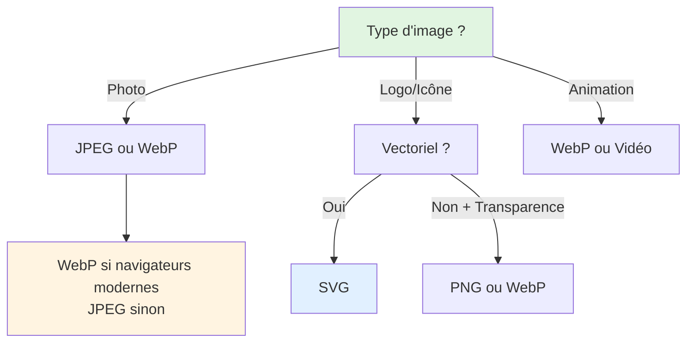

# III - Images et Médias

<div
  class="omny-meta"
  data-level="🟢 Débutant"
  data-version="1.0"
  data-time="4-6 heures">
</div>

## Introduction : Le Web Devient Visuel

!!! quote "Analogie pédagogique"
    _Imaginez un **magazine** : sans photos, sans illustrations, juste du texte noir sur blanc. Ennuyeux, non ? Les **images** transforment un document austère en expérience visuelle captivante. Sur le web, c'est pareil : une page sans images est comme un livre sans illustrations. Mais attention : intégrer une image sur le web, ce n'est pas comme copier-coller dans Word ! Il faut penser **formats** (JPEG pour photos, PNG pour transparence, WebP pour performance), **tailles** (une image 4K sur mobile = catastrophe), **accessibilité** (texte alternatif pour malvoyants), **performance** (images lourdes = site lent). Et aujourd'hui, avec les écrans Retina et les mobiles, une seule image ne suffit plus : il faut des **versions responsive** qui s'adaptent. Ce module vous apprend à intégrer images, audio et vidéo comme un professionnel : rapide, beau, accessible._

**Médias web** = Images, audio, vidéo enrichissant l'expérience utilisateur.

**Pourquoi maîtriser les médias ?**

✅ **Engagement** : Les images augmentent l'attention de 94%  
✅ **Communication** : Une image vaut mille mots  
✅ **Branding** : Identité visuelle de la marque  
✅ **Accessibilité** : Textes alternatifs pour tous  
✅ **Performance** : Optimisation cruciale (temps chargement)  
✅ **Responsive** : Adaptation tous écrans (mobile, desktop, Retina)  

**Enjeux techniques :**

⚠️ **Poids** : Images = 50-70% du poids d'une page web  
⚠️ **Formats** : Choisir le bon format (JPEG, PNG, WebP, SVG)  
⚠️ **Responsive** : Une image pour chaque résolution  
⚠️ **Accessibilité** : Texte alternatif obligatoire  

**Ce module vous enseigne à intégrer des médias professionnels et optimisés.**

---

## 1. Images de Base

### 1.1 Balise `` Fondamentale

```html
<!DOCTYPE html>
<html lang="fr">
<head>
    <meta charset="UTF-8">
    <title>Images de base</title>
</head>
<body>
    <!-- Structure minimale -->
    
    
    <!-- Avec tous les attributs essentiels -->
    
    
    <!-- ⚠️ Balise auto-fermante (pas de </img>) -->
    
    <!-- Chemin relatif -->
    
    
    <!-- Chemin absolu -->
    
</body>
</html>
```

**Anatomie complète de la balise `` :**

```html

     ↑            ↑                  ↑             ↑              ↑              ↑
     |            |                  |             |              |              |
   Source      Texte alt       Largeur       Hauteur      Lazy loading    Infobulle
 (obligatoire) (obligatoire)   (pixels)      (pixels)    (performance)   (optionnel)
```

**Attributs essentiels :**

| Attribut | Obligatoire | Description | Exemple |
|----------|-------------|-------------|---------|
| `src` | ✅ Oui | Chemin vers l'image | `src="photo.jpg"` |
| `alt` | ✅ Oui | Texte alternatif (accessibilité) | `alt="Description"` |
| `width` | ⚠️ Recommandé | Largeur en pixels | `width="800"` |
| `height` | ⚠️ Recommandé | Hauteur en pixels | `height="600"` |
| `loading` | 🔵 Optionnel | Lazy loading (`lazy` ou `eager`) | `loading="lazy"` |
| `title` | 🔵 Optionnel | Infobulle au survol | `title="Info"` |

### 1.2 Attribut Alt (Accessibilité)

```html
<!DOCTYPE html>
<html lang="fr">
<head>
    <meta charset="UTF-8">
    <title>Texte alternatif</title>
</head>
<body>
    <!-- ✅ BON : Alt descriptif -->
    
    
    
    
    
    
    <!-- ✅ BON : Image décorative (alt vide) -->
    
    <!-- alt="" indique que l'image est purement décorative -->
    
    <!-- ✅ BON : Image complexe avec description longue -->
    
    <p id="climate-description">
        Cette infographie montre l'évolution des températures mondiales...
    </p>
    
    <!-- ❌ MAUVAIS : Alt vague -->
    
    
    
    
    <!-- ❌ MAUVAIS : Pas d'alt -->
    
</body>
</html>
```

**Règles pour un bon texte alternatif :**

1. **Descriptif et concis** (< 125 caractères idéalement)
2. **Contextuel** : Décrire ce qui est pertinent dans le contexte
3. **Ne pas commencer par "Image de..."** (redondant)
4. **Alt vide (`alt=""`)** pour images purement décoratives
5. **Éviter "photo", "image"** dans la description

**Exemples contextuels :**

```html
<!-- Contexte : Article blog -->
<article>
    <h2>Voyage en Toscane</h2>
    
</article>

<!-- Contexte : Bouton d'action -->
<button>
    
    Télécharger le PDF
</button>

<!-- Contexte : Logo lien -->
<a href="/">
    
</a>

<!-- Contexte : Graphique données -->

```

### 1.3 Width et Height (Performance)

```html
<!DOCTYPE html>
<html lang="fr">
<head>
    <meta charset="UTF-8">
    <title>Width et Height</title>
</head>
<body>
    <!-- ❌ MAUVAIS : Sans width/height -->
    
    <!-- Problème : Le navigateur ne réserve pas l'espace 
         → Layout shift pendant chargement page -->
    
    <!-- ✅ BON : Avec width/height -->
    
    <!-- Navigateur réserve 800x600px même avant chargement image
         → Pas de décalage visuel (meilleur CLS - Core Web Vitals) -->
    
    <!-- Ratio d'aspect préservé avec CSS -->
    <style>
        img {
            max-width: 100%;
            height: auto;
        }
    </style>
    
    
    <!-- Sur mobile : largeur s'adapte mais ratio 3:2 préservé -->
</body>
</html>
```

**Pourquoi width/height sont importants ?**

```
SANS width/height :
┌────────────────────┐
│ Texte avant image  │
│                    │ ← Espace vide (image pas encore chargée)
│                    │
│ Texte après        │
└────────────────────┘
        ↓
┌────────────────────┐
│ Texte avant image  │
│ [IMAGE CHARGÉE]    │ ← Image apparaît
│                    │
│                    │
│ Texte après        │ ← Décalé vers le bas (mauvaise UX)
└────────────────────┘

AVEC width/height :
┌────────────────────┐
│ Texte avant image  │
│ [Espace réservé]   │ ← Navigateur réserve l'espace
│                    │
│ Texte après        │
└────────────────────┘
        ↓
┌────────────────────┐
│ Texte avant image  │
│ [IMAGE CHARGÉE]    │ ← Image remplace espace réservé
│                    │
│ Texte après        │ ← Pas de décalage (bonne UX)
└────────────────────┘
```

**✅ Toujours spécifier width/height pour éviter le layout shift !**

---

## 2. Formats d'Images

### 2.1 Comparaison des Formats

```html
<!DOCTYPE html>
<html lang="fr">
<head>
    <meta charset="UTF-8">
    <title>Formats d'images</title>
</head>
<body>
    <!-- JPEG/JPG : Photos, dégradés -->
    
    <!-- 
    ✅ Bon pour : Photos, images avec beaucoup de couleurs
    ✅ Compression avec perte (réglable)
    ❌ Pas de transparence
    ❌ Perd en qualité à chaque sauvegarde
    Poids typique : 50-200 KB
    -->
    
    <!-- PNG : Logos, icônes, transparence -->
    
    <!--
    ✅ Bon pour : Logos, icônes, texte, transparence
    ✅ Compression sans perte
    ✅ Supporte transparence (canal alpha)
    ❌ Fichiers plus lourds que JPEG
    Poids typique : 20-100 KB
    -->
    
    <!-- WebP : Moderne, performant -->
    
    <!--
    ✅ Bon pour : Tout (photos, logos)
    ✅ Meilleure compression que JPEG et PNG (25-35% plus léger)
    ✅ Supporte transparence
    ✅ Supporte animation
    ⚠️ Pas supporté par anciens navigateurs (< 2020)
    Poids typique : 30-100 KB
    -->
    
    <!-- SVG : Vectoriel (logos, icônes, illustrations) -->
    
    <!--
    ✅ Bon pour : Logos, icônes, illustrations simples
    ✅ Vectoriel (infiniment redimensionnable sans perte)
    ✅ Fichiers très légers (texte XML)
    ✅ Peut être animé et stylisé avec CSS
    ❌ Pas adapté aux photos
    Poids typique : 2-20 KB
    -->
    
    <!-- GIF : Animations (dépassé) -->
    
    <!--
    ⚠️ Format ancien
    ✅ Animations simples
    ❌ Limité à 256 couleurs
    ❌ Lourd pour animations
    💡 Préférer WebP ou vidéo pour animations
    -->
</body>
</html>
```

**Tableau comparatif des formats :**

| Format | Usage idéal | Transparence | Compression | Animation | Poids moyen |
|--------|-------------|--------------|-------------|-----------|-------------|
| **JPEG** | Photos, dégradés | ❌ Non | Avec perte | ❌ Non | 50-200 KB |
| **PNG** | Logos, icônes, texte | ✅ Oui | Sans perte | ❌ Non | 20-100 KB |
| **WebP** | Universel (moderne) | ✅ Oui | Meilleure | ✅ Oui | 30-100 KB |
| **SVG** | Vectoriel (logos) | ✅ Oui | Texte | ✅ Oui | 2-20 KB |
| **GIF** | ⚠️ Animations (ancien) | ✅ Oui | Médiocre | ✅ Oui | 100-500 KB |

**Arbre de décision : Quel format choisir ?**



### 2.2 Optimisation des Images

```html
<!DOCTYPE html>
<html lang="fr">
<head>
    <meta charset="UTF-8">
    <title>Optimisation images</title>
</head>
<body>
    <!-- ❌ MAUVAIS : Image énorme non optimisée -->
    
    <!-- 8 Mo, 4000x3000px pour affichage 800x600px = catastrophe -->
    
    <!-- ✅ BON : Image redimensionnée et compressée -->
    
    <!-- 120 Ko, 800x600px = optimal -->
    
    <!-- ✅ MIEUX : WebP + JPEG fallback -->
    <picture>
        <source srcset="photo.webp" type="image/webp">
        
    </picture>
</body>
</html>
```

**Checklist optimisation images :**

1. **Redimensionner** : Dimensions réelles d'affichage (pas 4K pour 400px)
2. **Compresser** : Réduire poids (80-90% qualité JPEG suffit)
3. **Format moderne** : WebP si possible (25-35% plus léger)
4. **Lazy loading** : Charger images hors écran à la demande
5. **CDN** : Servir depuis CDN proche de l'utilisateur
6. **Sprites** : Combiner petites icônes en une seule image

**Outils d'optimisation :**

- **TinyPNG** / **TinyJPG** : Compression intelligente en ligne
- **Squoosh** : Outil Google (comparaison formats)
- **ImageOptim** : Mac (batch compression)
- **WebP Converter** : Convertir en WebP
- **SVGO** : Optimiser SVG

---

## 3. Images Responsive

### 3.1 Attribut srcset (Résolutions)

```html
<!DOCTYPE html>
<html lang="fr">
<head>
    <meta charset="UTF-8">
    <title>Images responsive avec srcset</title>
</head>
<body>
    <!-- Image simple (pas responsive) -->
    
    
    <!-- ✅ Image responsive : plusieurs résolutions -->
    
    
    <!--
    srcset : Liste des images disponibles avec leur largeur (w = width)
    sizes  : Indique au navigateur quelle taille l'image occupera
    
    Navigateur choisit automatiquement la meilleure image selon :
    - Taille écran
    - Densité pixels (Retina, etc.)
    - Bande passante
    -->
</body>
</html>
```

**Comment fonctionne srcset/sizes ?**

```html

```

**Scénarios de sélection :**

```
Appareil : iPhone (375px wide, écran Retina 2x)
sizes → (max-width: 600px) 100vw → 100% de 375px = 375px
Retina 2x → 375 * 2 = 750px nécessaire
Navigateur choisit : photo-800.jpg (le plus proche supérieur)

Appareil : iPad (768px wide)
sizes → (max-width: 1200px) 50vw → 50% de 768px = 384px
Navigateur choisit : photo-400.jpg

Appareil : Desktop (1920px wide)
sizes → 800px (valeur par défaut)
Navigateur choisit : photo-800.jpg
```

### 3.2 Balise `<picture>` (Art Direction)

```html
<!DOCTYPE html>
<html lang="fr">
<head>
    <meta charset="UTF-8">
    <title>Picture - Art Direction</title>
</head>
<body>
    <!--
    picture : Permet de servir des images DIFFÉRENTES selon contexte
    (pas juste des résolutions différentes)
    -->
    
    <!-- Exemple 1 : Image différente mobile vs desktop -->
    <picture>
        <!-- Mobile : Image portrait -->
        <source 
            media="(max-width: 600px)" 
            srcset="hero-mobile.jpg"
        >
        
        <!-- Tablette : Image carré -->
        <source 
            media="(max-width: 1200px)" 
            srcset="hero-tablet.jpg"
        >
        
        <!-- Desktop : Image paysage -->
        
    </picture>
    
    <!-- Exemple 2 : Format moderne avec fallback -->
    <picture>
        <!-- AVIF (très moderne, meilleure compression) -->
        <source srcset="photo.avif" type="image/avif">
        
        <!-- WebP (moderne) -->
        <source srcset="photo.webp" type="image/webp">
        
        <!-- JPEG (fallback universel) -->
        
    </picture>
    
    <!-- Exemple 3 : Écrans Retina -->
    <picture>
        <!-- Écran Retina -->
        <source 
            srcset="logo@2x.png" 
            media="(min-resolution: 2dppx)"
        >
        
        <!-- Écran standard -->
        
    </picture>
</body>
</html>
```

**Picture vs srcset :**

| Besoin | Solution |
|--------|----------|
| **Mêmes images, différentes résolutions** | `srcset` |
| **Images DIFFÉRENTES selon écran** | `<picture>` |
| **Format moderne + fallback** | `<picture>` |
| **Écrans Retina** | `srcset` avec `2x` ou `<picture>` |

**Exemple complet Art Direction :**

```html
<picture>
    <!-- Mobile portrait : Crop serré sur visage -->
    <source 
        media="(max-width: 600px)"
        srcset="portrait-mobile-400.jpg 400w,
                portrait-mobile-800.jpg 800w"
    >
    
    <!-- Tablette : Vue moyenne -->
    <source 
        media="(max-width: 1200px)"
        srcset="portrait-tablet-600.jpg 600w,
                portrait-tablet-1200.jpg 1200w"
    >
    
    <!-- Desktop : Vue large complète -->
    
</picture>
```

---

## 4. Figure et Figcaption

### 4.1 Structure Sémantique

```html
<!DOCTYPE html>
<html lang="fr">
<head>
    <meta charset="UTF-8">
    <title>Figure et Figcaption</title>
</head>
<body>
    <!-- ❌ Sans sémantique -->
    <div>
        
        <p>Figure 1 : Évolution des ventes 2024</p>
    </div>
    
    <!-- ✅ Avec sémantique -->
    <figure>
        
        <figcaption>
            <strong>Figure 1 :</strong> Évolution des ventes trimestrielles en 2024. 
            On observe une croissance constante de 15% par trimestre.
        </figcaption>
    </figure>
    
    <!-- Figure avec code -->
    <figure>
        <pre><code>&lt;!DOCTYPE html&gt;
&lt;html&gt;
&lt;body&gt;
    &lt;h1&gt;Bonjour&lt;/h1&gt;
&lt;/body&gt;
&lt;/html&gt;</code></pre>
        <figcaption>Exemple 1 : Structure HTML minimale</figcaption>
    </figure>
    
    <!-- Figure avec citation -->
    <figure>
        <blockquote>
            <p>Le Web doit rester ouvert et accessible à tous.</p>
        </blockquote>
        <figcaption>
            — Tim Berners-Lee, <cite>Weaving the Web</cite>
        </figcaption>
    </figure>
    
    <!-- Figure avec plusieurs images -->
    <figure>
        
        
        
        <figcaption>
            Série de photos : Voyage en Italie, juillet 2024
        </figcaption>
    </figure>
</body>
</html>
```

**Quand utiliser `<figure>` ?**

✅ **Utiliser pour :**
- Images avec légende
- Graphiques, diagrammes
- Blocs de code avec titre
- Citations avec attribution
- Illustrations, schémas

❌ **Ne pas utiliser pour :**
- Images décoratives
- Logos sans légende
- Icônes UI

---

## 5. Audio

### 5.1 Balise `<audio>`

```html
<!DOCTYPE html>
<html lang="fr">
<head>
    <meta charset="UTF-8">
    <title>Audio HTML5</title>
</head>
<body>
    <!-- Audio simple -->
    <audio src="musique.mp3" controls>
        Votre navigateur ne supporte pas l'audio HTML5.
    </audio>
    
    <!-- Audio avec tous les attributs -->
    <audio 
        src="podcast.mp3"
        controls
        preload="metadata"
        loop
    >
        Votre navigateur ne supporte pas l'audio.
    </audio>
    
    <!-- Audio avec plusieurs formats (compatibilité) -->
    <audio controls>
        <source src="audio.mp3" type="audio/mpeg">
        <source src="audio.ogg" type="audio/ogg">
        <source src="audio.wav" type="audio/wav">
        <p>
            Votre navigateur ne supporte pas l'audio HTML5.
            <a href="audio.mp3">Télécharger l'audio</a>
        </p>
    </audio>
    
    <!-- Audio avec figure -->
    <figure>
        <figcaption>Podcast #42 : Le Web Moderne</figcaption>
        <audio controls>
            <source src="podcast-42.mp3" type="audio/mpeg">
        </audio>
    </figure>
</body>
</html>
```

**Attributs audio :**

| Attribut | Description | Valeurs |
|----------|-------------|---------|
| `src` | Source du fichier audio | Chemin |
| `controls` | Afficher les contrôles (play, pause, volume) | Booléen |
| `autoplay` | Lecture automatique (⚠️ éviter) | Booléen |
| `loop` | Lecture en boucle | Booléen |
| `muted` | Muet par défaut | Booléen |
| `preload` | Préchargement | `none`, `metadata`, `auto` |

**Valeurs preload :**

- `none` : Ne rien précharger (économiser bande passante)
- `metadata` : Précharger durée et métadonnées (recommandé)
- `auto` : Précharger tout le fichier

### 5.2 Formats Audio

```html
<!DOCTYPE html>
<html lang="fr">
<head>
    <meta charset="UTF-8">
    <title>Formats audio</title>
</head>
<body>
    <!-- MP3 : Format universel -->
    <audio controls>
        <source src="audio.mp3" type="audio/mpeg">
    </audio>
    <!--
    ✅ Compatible tous navigateurs
    ✅ Bonne compression
    ✅ Qualité acceptable
    Poids : ~1 Mo/minute (128 kbps)
    -->
    
    <!-- OGG Vorbis : Open source -->
    <audio controls>
        <source src="audio.ogg" type="audio/ogg">
    </audio>
    <!--
    ✅ Open source (pas de brevets)
    ✅ Meilleure qualité que MP3 à même bitrate
    ⚠️ Pas supporté Safari/IE
    -->
    
    <!-- WAV : Non compressé -->
    <audio controls>
        <source src="audio.wav" type="audio/wav">
    </audio>
    <!--
    ✅ Qualité maximale
    ❌ Fichiers TRÈS lourds (~10 Mo/minute)
    Usage : Édition audio, pas web
    -->
    
    <!-- Stratégie multi-formats -->
    <audio controls>
        <source src="audio.ogg" type="audio/ogg">
        <source src="audio.mp3" type="audio/mpeg">
        Votre navigateur ne supporte pas l'audio.
    </audio>
    <!-- Navigateur choisit le premier format supporté -->
</body>
</html>
```

**Recommandation : MP3 suffit (supporté partout)**

---

## 6. Vidéo

### 6.1 Balise `<video>`

```html
<!DOCTYPE html>
<html lang="fr">
<head>
    <meta charset="UTF-8">
    <title>Vidéo HTML5</title>
</head>
<body>
    <!-- Vidéo simple -->
    <video src="video.mp4" controls width="640" height="360">
        Votre navigateur ne supporte pas la vidéo HTML5.
    </video>
    
    <!-- Vidéo avec tous les attributs -->
    <video 
        src="demo.mp4"
        controls
        width="800"
        height="450"
        poster="thumbnail.jpg"
        preload="metadata"
    >
        Votre navigateur ne supporte pas la vidéo.
    </video>
    
    <!-- Vidéo avec plusieurs formats -->
    <video controls width="640" height="360">
        <source src="video.mp4" type="video/mp4">
        <source src="video.webm" type="video/webm">
        <source src="video.ogv" type="video/ogg">
        <p>
            Votre navigateur ne supporte pas la vidéo HTML5.
            <a href="video.mp4">Télécharger la vidéo</a>
        </p>
    </video>
    
    <!-- Vidéo avec sous-titres -->
    <video controls width="640" height="360">
        <source src="film.mp4" type="video/mp4">
        
        <!-- Sous-titres français (défaut) -->
        <track 
            src="subtitles-fr.vtt" 
            kind="subtitles" 
            srclang="fr" 
            label="Français"
            default
        >
        
        <!-- Sous-titres anglais -->
        <track 
            src="subtitles-en.vtt" 
            kind="subtitles" 
            srclang="en" 
            label="English"
        >
        
        Votre navigateur ne supporte pas la vidéo.
    </video>
</body>
</html>
```

**Attributs vidéo :**

| Attribut | Description | Exemple |
|----------|-------------|---------|
| `src` | Source du fichier | `src="video.mp4"` |
| `controls` | Afficher contrôles | Booléen |
| `width` | Largeur | `width="640"` |
| `height` | Hauteur | `height="360"` |
| `poster` | Image miniature (avant lecture) | `poster="thumb.jpg"` |
| `autoplay` | Lecture auto (⚠️ éviter) | Booléen |
| `loop` | Lecture en boucle | Booléen |
| `muted` | Muet | Booléen |
| `preload` | Préchargement | `none`, `metadata`, `auto` |

### 6.2 Formats Vidéo

```html
<!DOCTYPE html>
<html lang="fr">
<head>
    <meta charset="UTF-8">
    <title>Formats vidéo</title>
</head>
<body>
    <!-- MP4 (H.264) : Format universel -->
    <video controls>
        <source src="video.mp4" type="video/mp4">
    </video>
    <!--
    ✅ Compatible tous navigateurs
    ✅ Bonne compression
    ✅ Qualité excellente
    Recommandé : Format principal
    -->
    
    <!-- WebM (VP9) : Open source, moderne -->
    <video controls>
        <source src="video.webm" type="video/webm">
    </video>
    <!--
    ✅ Open source
    ✅ Meilleure compression que MP4
    ⚠️ Pas supporté Safari (avant 2021)
    -->
    
    <!-- OGG Theora : Ancien, open source -->
    <video controls>
        <source src="video.ogv" type="video/ogg">
    </video>
    <!--
    ⚠️ Format ancien
    ❌ Moins efficace que MP4/WebM
    💡 Inutile aujourd'hui
    -->
    
    <!-- Stratégie optimale -->
    <video controls poster="poster.jpg">
        <source src="video.webm" type="video/webm">
        <source src="video.mp4" type="video/mp4">
        Votre navigateur ne supporte pas la vidéo.
    </video>
</body>
</html>
```

**Recommandation formats vidéo :**

1. **MP4 (H.264)** : Format principal (compatible partout)
2. **WebM (VP9)** : Optionnel, meilleure compression
3. ~~OGG Theora~~ : Ne plus utiliser

### 6.3 Sous-titres WebVTT

```html
<!DOCTYPE html>
<html lang="fr">
<head>
    <meta charset="UTF-8">
    <title>Sous-titres vidéo</title>
</head>
<body>
    <video controls width="640" height="360">
        <source src="conference.mp4" type="video/mp4">
        
        <!-- Sous-titres -->
        <track 
            src="subtitles-fr.vtt" 
            kind="subtitles" 
            srclang="fr" 
            label="Français"
            default
        >
        
        <!-- Descriptions audio (accessibilité) -->
        <track 
            src="descriptions-fr.vtt" 
            kind="descriptions" 
            srclang="fr" 
            label="Descriptions audio"
        >
        
        <!-- Chapitres -->
        <track 
            src="chapters.vtt" 
            kind="chapters" 
            srclang="fr" 
            label="Chapitres"
        >
    </video>
</body>
</html>
```

**Fichier WebVTT (subtitles-fr.vtt) :**

```
WEBVTT

00:00:00.000 --> 00:00:02.500
Bonjour et bienvenue dans cette conférence.

00:00:02.500 --> 00:00:05.000
Aujourd'hui, nous allons parler de HTML5.

00:00:05.000 --> 00:00:08.000
Le HTML5 apporte de nombreuses nouveautés.
```

**Types de tracks :**

- `subtitles` : Sous-titres (traduction dialogue)
- `captions` : Sous-titres malentendants (+ sons)
- `descriptions` : Descriptions audio (malvoyants)
- `chapters` : Chapitres navigation
- `metadata` : Métadonnées

---

## 7. Iframes

### 7.1 Intégrer du Contenu Externe

```html
<!DOCTYPE html>
<html lang="fr">
<head>
    <meta charset="UTF-8">
    <title>Iframes</title>
</head>
<body>
    <!-- Iframe simple -->
    <iframe 
        src="https://example.com" 
        width="800" 
        height="600"
    ></iframe>
    
    <!-- Iframe avec titre (accessibilité) -->
    <iframe 
        src="https://example.com"
        width="800"
        height="600"
        title="Site Example.com"
    ></iframe>
    
    <!-- Iframe responsive -->
    <div style="position: relative; padding-bottom: 56.25%; height: 0;">
        <iframe 
            src="https://example.com"
            style="position: absolute; top: 0; left: 0; width: 100%; height: 100%;"
            title="Contenu externe"
        ></iframe>
    </div>
    
    <!-- Iframe sécurisée avec sandbox -->
    <iframe 
        src="https://untrusted-site.com"
        width="800"
        height="600"
        sandbox="allow-scripts allow-same-origin"
        title="Contenu externe non fiable"
    ></iframe>
</body>
</html>
```

### 7.2 Cas d'Usage Courants

```html
<!DOCTYPE html>
<html lang="fr">
<head>
    <meta charset="UTF-8">
    <title>Iframes - Cas d'usage</title>
</head>
<body>
    <!-- YouTube -->
    <iframe 
        width="560" 
        height="315" 
        src="https://www.youtube.com/embed/dQw4w9WgXcQ" 
        title="Vidéo YouTube" 
        frameborder="0" 
        allow="accelerometer; autoplay; clipboard-write; encrypted-media; gyroscope; picture-in-picture" 
        allowfullscreen
    ></iframe>
    
    <!-- Google Maps -->
    <iframe 
        src="https://www.google.com/maps/embed?pb=!1m18!1m12!1m3!1d2624.9914406081493!2d2.292292615674603!3d48.85837007928746!2m3!1f0!2f0!3f0!3m2!1i1024!2i768!4f13.1!3m3!1m2!1s0x47e66e2964e34e2d%3A0x8ddca9ee380ef7e0!2sTour%20Eiffel!5e0!3m2!1sfr!2sfr!4v1234567890123!5m2!1sfr!2sfr"
        width="600" 
        height="450" 
        style="border:0;" 
        allowfullscreen="" 
        loading="lazy" 
        referrerpolicy="no-referrer-when-downgrade"
        title="Google Maps - Tour Eiffel"
    ></iframe>
    
    <!-- CodePen -->
    <iframe 
        height="300" 
        style="width: 100%;" 
        scrolling="no" 
        title="Demo HTML/CSS" 
        src="https://codepen.io/username/embed/abcdef?default-tab=html%2Cresult" 
        frameborder="no" 
        loading="lazy" 
        allowtransparency="true" 
        allowfullscreen="true"
    ></iframe>
</body>
</html>
```

**Attributs iframe importants :**

| Attribut | Description | Exemple |
|----------|-------------|---------|
| `src` | URL du contenu | `src="https://..."` |
| `width` | Largeur | `width="800"` |
| `height` | Hauteur | `height="600"` |
| `title` | Titre (accessibilité) | `title="Vidéo"` |
| `sandbox` | Restrictions sécurité | `sandbox="allow-scripts"` |
| `loading` | Lazy loading | `loading="lazy"` |
| `allowfullscreen` | Autoriser plein écran | Booléen |

**⚠️ Sécurité iframes :**

- Toujours spécifier `title` (accessibilité)
- Utiliser `sandbox` pour contenu non fiable
- Utiliser `loading="lazy"` pour performances
- Éviter iframes pour contenu non essentiel

---

## 8. Lazy Loading

### 8.1 Attribut loading="lazy"

```html
<!DOCTYPE html>
<html lang="fr">
<head>
    <meta charset="UTF-8">
    <title>Lazy Loading</title>
</head>
<body>
    <!-- Image au-dessus de la ligne de flottaison (visible immédiatement) -->
    
    <!-- loading="eager" : Charger immédiatement (défaut) -->
    
    <!-- Images en bas de page (hors écran au chargement) -->
    
    <!-- loading="lazy" : Charger seulement quand proche du viewport -->
    
    
    
    
    
    <!-- Iframe lazy -->
    <iframe 
        src="https://youtube.com/embed/..."
        loading="lazy"
        title="Vidéo"
    ></iframe>
</body>
</html>
```

**Avantages lazy loading :**

✅ **Performance** : Réduit temps chargement initial
✅ **Bande passante** : Économise data (mobile)
✅ **Core Web Vitals** : Améliore score Google
✅ **UX** : Page utilisable plus rapidement

**Quand utiliser :**

- ✅ Images **en bas de page** (hors viewport initial)
- ✅ Images dans **longs articles**
- ✅ **Galeries photos** avec beaucoup d'images
- ✅ **Iframes** (YouTube, Google Maps)
- ❌ Images **au-dessus de la ligne de flottaison** (hero, logo)

---

## 9. Exercices Pratiques

### Exercice 1 : Galerie d'Images

**Objectif :** Créer une galerie d'images avec figure/figcaption.

**Consigne :** Créer une galerie de 6 photos avec :
- Structure `<figure>` et `<figcaption>`
- Attributs `alt` descriptifs
- `width` et `height` spécifiés
- `loading="lazy"` pour photos après la 3ème
- Légendes avec titre et description

<details>
<summary>Solution</summary>

```html
<!DOCTYPE html>
<html lang="fr">
<head>
    <meta charset="UTF-8">
    <meta name="viewport" content="width=device-width, initial-scale=1.0">
    <title>Galerie Photos - Voyage en Italie</title>
</head>
<body>
    <h1>Voyage en Italie - Été 2024</h1>
    
    <section>
        <h2>Rome</h2>
        
        <figure>
            
            <figcaption>
                <strong>Le Colisée</strong> — Monument emblématique de Rome, 
                construit au 1er siècle après J.-C.
            </figcaption>
        </figure>
        
        <figure>
            
            <figcaption>
                <strong>Fontaine de Trevi</strong> — Tradition : jeter une pièce 
                pour revenir à Rome.
            </figcaption>
        </figure>
    </section>
    
    <section>
        <h2>Florence</h2>
        
        <figure>
            
            <figcaption>
                <strong>Duomo di Firenze</strong> — Chef-d'œuvre de la Renaissance 
                italienne, conçu par Brunelleschi.
            </figcaption>
        </figure>
        
        <figure>
            
            <figcaption>
                <strong>Ponte Vecchio</strong> — Pont médiéval célèbre pour 
                ses boutiques de joailliers.
            </figcaption>
        </figure>
    </section>
    
    <section>
        <h2>Venise</h2>
        
        <figure>
            
            <figcaption>
                <strong>Canal de Venise</strong> — Balade en gondole dans 
                les ruelles aquatiques de la Sérénissime.
            </figcaption>
        </figure>
        
        <figure>
            
            <figcaption>
                <strong>Piazza San Marco</strong> — Cœur de Venise, entourée 
                de cafés historiques et d'arcades.
            </figcaption>
        </figure>
    </section>
</body>
</html>
```

</details>

### Exercice 2 : Images Responsive

**Objectif :** Créer une image responsive avec srcset et sizes.

**Consigne :** Créer une page avec une image hero responsive :
- 3 résolutions différentes (400w, 800w, 1600w)
- Attribut `sizes` adapté (mobile 100vw, desktop 50vw)
- Version WebP + JPEG fallback avec `<picture>`

<details>
<summary>Solution</summary>

```html
<!DOCTYPE html>
<html lang="fr">
<head>
    <meta charset="UTF-8">
    <meta name="viewport" content="width=device-width, initial-scale=1.0">
    <title>Image Responsive - Hero</title>
</head>
<body>
    <header>
        <h1>Découvrez nos Destinations</h1>
        
        <!-- Image hero responsive -->
        <picture>
            <!-- WebP pour navigateurs modernes -->
            <source 
                type="image/webp"
                srcset="
                    hero-400.webp 400w,
                    hero-800.webp 800w,
                    hero-1600.webp 1600w
                "
                sizes="
                    (max-width: 600px) 100vw,
                    (max-width: 1200px) 80vw,
                    1200px
                "
            >
            
            <!-- JPEG fallback -->
            
        </picture>
    </header>
    
    <main>
        <section>
            <h2>Art Direction Example</h2>
            <p>Image différente selon la taille d'écran :</p>
            
            <picture>
                <!-- Mobile : Portrait serré -->
                <source 
                    media="(max-width: 600px)"
                    srcset="portrait-mobile.jpg"
                >
                
                <!-- Tablette : Vue moyenne -->
                <source 
                    media="(max-width: 1200px)"
                    srcset="portrait-tablet.jpg"
                >
                
                <!-- Desktop : Vue large -->
                
            </picture>
        </section>
    </main>
</body>
</html>
```

</details>

### Exercice 3 : Intégration Multimédia

**Objectif :** Créer une page avec audio, vidéo et iframe.

**Consigne :** Créer une page tutoriel vidéo avec :
- Vidéo avec poster, controls, sous-titres
- Audio podcast avec controls
- Iframe YouTube
- Tout avec lazy loading approprié

<details>
<summary>Solution</summary>

```html
<!DOCTYPE html>
<html lang="fr">
<head>
    <meta charset="UTF-8">
    <meta name="viewport" content="width=device-width, initial-scale=1.0">
    <title>Tutoriel Multimédia - Apprendre le HTML</title>
</head>
<body>
    <h1>Tutoriel HTML5 Complet</h1>
    
    <!-- Section Vidéo -->
    <section>
        <h2>Vidéo : Introduction au HTML</h2>
        
        <figure>
            <video 
                controls
                width="800"
                height="450"
                poster="video-poster.jpg"
                preload="metadata"
            >
                <source src="tutorial-intro.mp4" type="video/mp4">
                <source src="tutorial-intro.webm" type="video/webm">
                
                <!-- Sous-titres -->
                <track 
                    src="subtitles-fr.vtt"
                    kind="subtitles"
                    srclang="fr"
                    label="Français"
                    default
                >
                <track 
                    src="subtitles-en.vtt"
                    kind="subtitles"
                    srclang="en"
                    label="English"
                >
                
                Votre navigateur ne supporte pas la vidéo HTML5.
                <a href="tutorial-intro.mp4">Télécharger la vidéo</a>
            </video>
            <figcaption>
                <strong>Vidéo 1 :</strong> Introduction aux bases du HTML5 (15 minutes)
            </figcaption>
        </figure>
    </section>
    
    <!-- Section Audio -->
    <section>
        <h2>Podcast : Les Coulisses du Web</h2>
        
        <figure>
            <figcaption>
                <strong>Épisode #12 :</strong> Histoire du HTML
            </figcaption>
            <audio controls preload="metadata">
                <source src="podcast-12.mp3" type="audio/mpeg">
                <source src="podcast-12.ogg" type="audio/ogg">
                Votre navigateur ne supporte pas l'audio HTML5.
                <a href="podcast-12.mp3">Télécharger le podcast</a>
            </audio>
        </figure>
        
        <p>
            <em>Durée : 45 minutes</em><br>
            Dans cet épisode, nous explorons l'histoire fascinante du HTML, 
            depuis sa création par Tim Berners-Lee en 1991 jusqu'à HTML5.
        </p>
    </section>
    
    <!-- Section Ressources YouTube -->
    <section>
        <h2>Ressources Complémentaires</h2>
        
        <h3>Tutoriel Vidéo YouTube</h3>
        <iframe 
            width="560" 
            height="315" 
            src="https://www.youtube.com/embed/dQw4w9WgXcQ" 
            title="Tutoriel HTML sur YouTube"
            frameborder="0" 
            loading="lazy"
            allow="accelerometer; autoplay; clipboard-write; encrypted-media; gyroscope; picture-in-picture" 
            allowfullscreen
        ></iframe>
        
        <h3>Démo Interactive CodePen</h3>
        <iframe 
            height="400" 
            style="width: 100%;" 
            scrolling="no" 
            title="Démo HTML Interactive" 
            src="https://codepen.io/username/embed/preview/abcdef?default-tab=html%2Cresult&theme-id=dark" 
            frameborder="no" 
            loading="lazy"
            allowtransparency="true" 
            allowfullscreen="true"
        ></iframe>
    </section>
    
    <!-- Galerie Images (lazy) -->
    <section>
        <h2>Captures d'Écran</h2>
        
        <figure>
            
            <figcaption>Figure 1 : Structure HTML minimale</figcaption>
        </figure>
        
        <figure>
            
            <figcaption>Figure 2 : Balises sémantiques HTML5</figcaption>
        </figure>
    </section>
</body>
</html>
```

</details>

---

## 10. Projet du Module : Portfolio Multimédia

### 10.1 Cahier des Charges

**Créer une page portfolio photographe avec médias optimisés :**

**Spécifications techniques :**
- ✅ Hero image responsive (srcset + picture)
- ✅ Galerie 8+ photos avec figure/figcaption
- ✅ Images lazy loading (sauf hero)
- ✅ Vidéo showreel avec poster et sous-titres
- ✅ Audio interview avec controls
- ✅ Iframe Google Maps (localisation studio)
- ✅ Formats WebP + JPEG fallback
- ✅ Code validé W3C

**Contenu suggéré :**
1. Hero responsive avec nom du photographe
2. Section "Portfolio" : Galerie photos catégorisée
3. Section "Showreel" : Vidéo de présentation
4. Section "À propos" : Audio interview
5. Section "Contact" : Google Maps + coordonnées

### 10.2 Solution Complète

<details>
<summary>Voir la solution complète du projet</summary>

```html
<!DOCTYPE html>
<html lang="fr">
<head>
    <meta charset="UTF-8">
    <meta name="viewport" content="width=device-width, initial-scale=1.0">
    <title>Sophie Martin - Photographe Professionnelle</title>
    <meta name="description" content="Portfolio de Sophie Martin, photographe professionnelle spécialisée en portrait et paysage. Basée à Lyon.">
</head>
<body>
    <!-- Hero Section -->
    <header>
        <picture>
            <!-- WebP moderne -->
            <source 
                type="image/webp"
                srcset="
                    hero-mobile-400.webp 400w,
                    hero-tablet-800.webp 800w,
                    hero-desktop-1600.webp 1600w
                "
                sizes="100vw"
            >
            
            <!-- JPEG fallback -->
            
        </picture>
        
        <h1>Sophie Martin</h1>
        <p><em>Photographe Professionnelle | Portrait & Paysage</em></p>
    </header>
    
    <!-- Portfolio Galerie -->
    <main>
        <section id="portfolio">
            <h2>Portfolio</h2>
            
            <h3>Portraits</h3>
            
            <figure>
                <picture>
                    <source srcset="portrait1.webp" type="image/webp">
                    
                </picture>
                <figcaption>
                    <strong>Portrait Studio</strong> — Session intimiste en lumière naturelle
                </figcaption>
            </figure>
            
            <figure>
                <picture>
                    <source srcset="portrait2.webp" type="image/webp">
                    
                </picture>
                <figcaption>
                    <strong>Portrait Corporate</strong> — Shooting professionnel pour LinkedIn
                </figcaption>
            </figure>
            
            <figure>
                <picture>
                    <source srcset="portrait3.webp" type="image/webp">
                    
                </picture>
                <figcaption>
                    <strong>Portrait Créatif</strong> — Exploration artistique avec jeux de lumières
                </figcaption>
            </figure>
            
            <h3>Paysages</h3>
            
            <figure>
                <picture>
                    <source srcset="landscape1.webp" type="image/webp">
                    
                </picture>
                <figcaption>
                    <strong>Alpes au Lever</strong> — Lac d'Annecy, septembre 2024
                </figcaption>
            </figure>
            
            <figure>
                <picture>
                    <source srcset="landscape2.webp" type="image/webp">
                    
                </picture>
                <figcaption>
                    <strong>Lavande de Provence</strong> — Contraste dramatique avant l'orage
                </figcaption>
            </figure>
            
            <figure>
                <picture>
                    <source srcset="landscape3.webp" type="image/webp">
                    
                </picture>
                <figcaption>
                    <strong>Forêt d'Automne</strong> — Jura, octobre 2024
                </figcaption>
            </figure>
            
            <h3>Événements</h3>
            
            <figure>
                <picture>
                    <source srcset="event1.webp" type="image/webp">
                    
                </picture>
                <figcaption>
                    <strong>Mariage Alice & Thomas</strong> — Château de la Roche, juillet 2024
                </figcaption>
            </figure>
            
            <figure>
                <picture>
                    <source srcset="event2.webp" type="image/webp">
                    
                </picture>
                <figcaption>
                    <strong>Concert Live</strong> — Festival Les Nuits de Fourvière
                </figcaption>
            </figure>
        </section>
        
        <!-- Showreel Vidéo -->
        <section id="showreel">
            <h2>Showreel 2024</h2>
            
            <figure>
                <video 
                    controls
                    width="1280"
                    height="720"
                    poster="showreel-poster.jpg"
                    preload="metadata"
                >
                    <source src="showreel-2024.mp4" type="video/mp4">
                    <source src="showreel-2024.webm" type="video/webm">
                    
                    <track 
                        src="showreel-subtitles-fr.vtt"
                        kind="subtitles"
                        srclang="fr"
                        label="Français"
                        default
                    >
                    <track 
                        src="showreel-subtitles-en.vtt"
                        kind="subtitles"
                        srclang="en"
                        label="English"
                    >
                    
                    Votre navigateur ne supporte pas la vidéo HTML5.
                    <a href="showreel-2024.mp4">Télécharger le showreel</a>
                </video>
                <figcaption>
                    Compilation de mes meilleurs clichés 2024 — 3 minutes
                </figcaption>
            </figure>
            
            <p>
                Découvrez une sélection de mes photographies réalisées en 2024, 
                accompagnées d'une bande sonore originale créée par mon collaborateur 
                musicien, Marc Dubois.
            </p>
        </section>
        
        <!-- À propos + Audio -->
        <section id="about">
            <h2>À propos de moi</h2>
            
            <p>
                <strong>Sophie Martin</strong>, photographe professionnelle depuis 10 ans, 
                spécialisée en portrait et paysage. Basée à Lyon, je travaille en France 
                et à l'international pour des clients privés et des entreprises.
            </p>
            
            <h3>Interview Radio : Mon Parcours</h3>
            
            <figure>
                <figcaption>
                    <strong>Podcast "Objectifs"</strong> — Épisode #27 : 
                    Sophie Martin raconte son parcours de photographe (30 minutes)
                </figcaption>
                <audio controls preload="metadata">
                    <source src="interview-sophie-martin.mp3" type="audio/mpeg">
                    <source src="interview-sophie-martin.ogg" type="audio/ogg">
                    Votre navigateur ne supporte pas l'audio HTML5.
                    <a href="interview-sophie-martin.mp3">Télécharger l'interview</a>
                </audio>
            </figure>
            
            <p>
                Dans cette interview, je partage mon parcours : de mes débuts en autodidacte 
                à l'ouverture de mon studio à Lyon, mes inspirations artistiques, 
                et mes conseils pour les photographes débutants.
            </p>
        </section>
        
        <!-- Contact + Google Maps -->
        <section id="contact">
            <h2>Contact</h2>
            
            <h3>Coordonnées</h3>
            <p>
                <strong>Email :</strong> 
                <a href="mailto:sophie@sophiemartin-photo.fr">sophie@sophiemartin-photo.fr</a><br>
                <strong>Téléphone :</strong> 
                <a href="tel:+33612345678">06 12 34 56 78</a><br>
                <strong>Instagram :</strong> 
                <a href="https://instagram.com/sophiemartinphoto" target="_blank" rel="noopener noreferrer">
                    @sophiemartinphoto
                </a>
            </p>
            
            <h3>Studio</h3>
            <p>
                <strong>Adresse :</strong> 12 Rue de la République, 69002 Lyon<br>
                Sur rendez-vous uniquement
            </p>
            
            <iframe 
                src="https://www.google.com/maps/embed?pb=!1m18!1m12!1m3!1d2782.6284411994247!2d4.8320906156737205!3d45.76045977910568!2m3!1f0!2f0!3f0!3m2!1i1024!2i768!4f13.1!3m3!1m2!1s0x47f4ea516ae88797%3A0x408ab2ae4bb21f0!2s12%20Rue%20de%20la%20R%C3%A9publique%2C%2069002%20Lyon!5e0!3m2!1sfr!2sfr!4v1234567890123!5m2!1sfr!2sfr"
                width="800" 
                height="450" 
                style="border:0;" 
                allowfullscreen="" 
                loading="lazy" 
                referrerpolicy="no-referrer-when-downgrade"
                title="Localisation du studio Sophie Martin Photography à Lyon"
            ></iframe>
        </section>
    </main>
    
    <!-- Footer -->
    <footer>
        <p>
            <small>&copy; 2024 Sophie Martin Photography. Tous droits réservés.</small>
        </p>
    </footer>
</body>
</html>
```

</details>

### 10.3 Checklist de Validation

Avant de considérer votre projet terminé, vérifiez :

- [ ] Hero image responsive (srcset + picture avec WebP)
- [ ] Minimum 8 images avec figure/figcaption
- [ ] Tous les `alt` descriptifs et pertinents
- [ ] `width` et `height` sur toutes les images
- [ ] `loading="lazy"` sur images hors hero
- [ ] Vidéo avec poster, controls, sous-titres
- [ ] Audio avec controls et formats multiples
- [ ] Iframe Google Maps avec title et loading="lazy"
- [ ] Formats WebP + JPEG fallback utilisés
- [ ] Code indenté et validé W3C
- [ ] Tous les médias optimisés (poids raisonnables)

---

## 11. Best Practices

### 11.1 Optimisation Images

```html
<!-- ❌ MAUVAIS : Image énorme -->


<!-- ✅ BON : Image optimisée -->
<picture>
    <source srcset="photo.webp" type="image/webp">
    
</picture>

<!-- ✅ Checklist optimisation -->
<!--
1. Redimensionner : 800x600px pour affichage 800x600px
2. Compresser : JPEG 80-90% qualité
3. WebP : 25-35% plus léger que JPEG
4. Lazy load : Images hors viewport
5. srcset : Plusieurs résolutions (responsive)
-->
```

### 11.2 Accessibilité Médias

```html
<!-- ✅ BON : Accessibilité complète -->

<!-- Images -->


<!-- Vidéo -->
<video controls>
    <source src="video.mp4" type="video/mp4">
    <track src="subtitles-fr.vtt" kind="subtitles" srclang="fr" default>
    <track src="captions-fr.vtt" kind="captions" srclang="fr">
    Votre navigateur ne supporte pas la vidéo.
</video>

<!-- Iframe -->
<iframe 
    src="https://example.com"
    title="Description claire du contenu iframe"
    loading="lazy"
></iframe>
```

### 11.3 Performance

```html
<!-- ✅ Stratégie performance optimale -->

<!-- 1. Hero : Chargement immédiat -->


<!-- 2. Images viewport : Lazy -->


<!-- 3. Vidéo : Preload metadata seulement -->
<video 
    controls
    preload="metadata"
    poster="poster.jpg"
>
    <source src="video.mp4" type="video/mp4">
</video>

<!-- 4. Iframe : Lazy -->
<iframe 
    src="https://youtube.com/embed/..."
    loading="lazy"
    title="Vidéo"
></iframe>
```

---

## 12. Checkpoint de Progression

### À la fin de ce Module 3, vous maîtrisez :

**Images :**

- [x] Balise `` (src, alt, width, height)
- [x] Texte alternatif pertinent (accessibilité)
- [x] Formats (JPEG, PNG, WebP, SVG, GIF)
- [x] Optimisation (compression, redimensionnement)

**Images responsive :**

- [x] `srcset` (résolutions multiples)
- [x] `sizes` (layout hints)
- [x] `<picture>` (art direction, formats modernes)
- [x] Écrans Retina

**Structure :**

- [x] `<figure>` et `<figcaption>` (sémantique)

**Audio/Vidéo :**

- [x] `<audio>` (controls, preload, formats)
- [x] `<video>` (poster, sous-titres, formats)
- [x] WebVTT (sous-titres)

**Autres :**

- [x] `<iframe>` (intégration externe, sécurité)
- [x] Lazy loading (loading="lazy")
- [x] Performance (optimisation médias)

### Prochaine Étape

**Direction le Module 4** où vous allez :

- Créer des listes ordonnées et non-ordonnées
- Maîtriser les listes imbriquées
- Créer des tableaux simples et complexes
- Utiliser colspan et rowspan
- Structurer tableaux accessibles (caption, thead, tbody, tfoot)
- Styler listes et tableaux

[:lucide-arrow-right: Accéder au Module 4 - Listes et Tableaux](./module-04-listes-tableaux/)

---

**Module 3 Terminé - Bravo ! 🎉 🖼️**

**Vous avez appris :**

- ✅ Intégration images (img, srcset, picture)
- ✅ Formats optimaux (JPEG, PNG, WebP, SVG)
- ✅ Images responsive (mobile, desktop, Retina)
- ✅ Audio et vidéo HTML5 (controls, sous-titres)
- ✅ Iframes sécurisées (YouTube, Google Maps)
- ✅ Lazy loading (performances)
- ✅ Figure/figcaption (sémantique)
- ✅ Optimisation médias professionnelle

**Statistiques Module 3 :**

- 1 projet complet (Portfolio photographe)
- 3 exercices progressifs avec solutions
- 80+ exemples de code
- Médias optimisés maîtrisés

**Prochain objectif : Maîtriser les listes et tableaux (Module 4)**

**Félicitations pour cette maîtrise des médias web ! 🚀🖼️**
