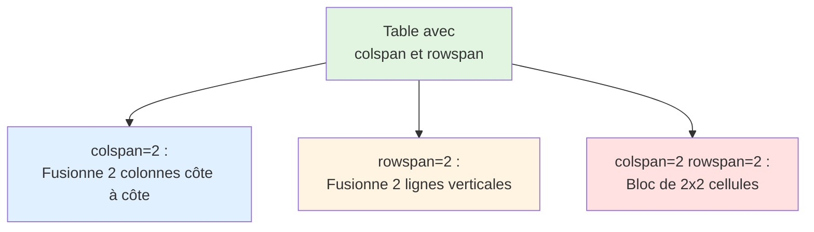

# IV - Listes et Tableaux

<div
  class="omny-meta"
  data-level="🟢 Débutant"
  data-version="1.0"
  data-time="4-6 heures">
</div>

## Introduction : Organiser l'Information

!!! quote "Analogie pédagogique"
    _Imaginez un **supermarché**. Sans organisation, ce serait le chaos : produits jetés en vrac, impossible de trouver quoi que ce soit. Les **listes** sont comme les rayons : "Fruits et légumes" (liste de produits), "Recette de gâteau" (étapes numérotées), "Glossaire" (terme + définition). Les **tableaux** sont comme les étiquettes de prix ou les comparatifs produits : lignes et colonnes structurant l'information de manière claire. Sur le web, c'est pareil : une liste de courses sans `<ul>` est un paragraphe illisible, un comparatif de prix sans `<table>` est incompréhensible. Les listes HTML créent de l'ordre (courses, étapes, menus), les tableaux affichent des données (calendrier, statistiques, comparaisons). Ce module vous apprend à structurer l'information comme un professionnel : listes sémantiques, tableaux accessibles, données claires._

**Listes et tableaux** = Structures HTML organisant l'information de manière hiérarchique et tabulaire.

**Pourquoi maîtriser listes et tableaux ?**

✅ **Organisation** : Structurer informations complexes  
✅ **Lisibilité** : Contenu scannable et compréhensible  
✅ **Sémantique** : Sens clair pour navigateurs/lecteurs d'écran  
✅ **SEO** : Google comprend mieux le contenu structuré  
✅ **Navigation** : Menus, breadcrumbs, sommaires  
✅ **Données** : Présentation claire (statistiques, comparaisons)  

**Cas d'usage courants :**

- **Listes** : Menus navigation, listes courses, étapes recette, glossaires
- **Tableaux** : Statistiques, calendriers, comparatifs produits, horaires

**Ce module vous enseigne à organiser l'information avec rigueur et accessibilité.**

---

## 1. Listes Non-Ordonnées

### 1.1 Structure de Base `<ul>` et `<li>`

```html
<!DOCTYPE html>
<html lang="fr">
<head>
    <meta charset="UTF-8">
    <title>Listes non-ordonnées</title>
</head>
<body>
    <!-- Liste simple -->
    <h2>Mes fruits préférés</h2>
    <ul>
        <li>Pommes</li>
        <li>Bananes</li>
        <li>Oranges</li>
        <li>Fraises</li>
    </ul>
    
    <!-- Liste de liens (menu navigation) -->
    <h2>Menu</h2>
    <ul>
        <li><a href="#home">Accueil</a></li>
        <li><a href="#about">À propos</a></li>
        <li><a href="#services">Services</a></li>
        <li><a href="#contact">Contact</a></li>
    </ul>
    
    <!-- Liste avec contenu riche -->
    <h2>Technologies web</h2>
    <ul>
        <li>
            <strong>HTML</strong> : Langage de structure
        </li>
        <li>
            <strong>CSS</strong> : Langage de présentation
        </li>
        <li>
            <strong>JavaScript</strong> : Langage de programmation
        </li>
    </ul>
</body>
</html>
```

**Anatomie d'une liste non-ordonnée :**

```html
<ul>                    <!-- Unordered List : conteneur -->
    <li>Item 1</li>    <!-- List Item : élément de liste -->
    <li>Item 2</li>
    <li>Item 3</li>
</ul>

<!-- Rendu navigateur (puces par défaut) -->
• Item 1
• Item 2
• Item 3
```

**Règles importantes :**

1. `<ul>` contient UNIQUEMENT des `<li>` (pas de texte direct)
2. `<li>` peut contenir n'importe quel contenu (texte, liens, images, etc.)
3. Puces automatiques (personnalisables avec CSS)

### 1.2 Listes Imbriquées

```html
<!DOCTYPE html>
<html lang="fr">
<head>
    <meta charset="UTF-8">
    <title>Listes imbriquées</title>
</head>
<body>
    <!-- Liste à deux niveaux -->
    <h2>Technologies Frontend</h2>
    <ul>
        <li>
            HTML
            <ul>
                <li>HTML5 sémantique</li>
                <li>Balises multimédias</li>
                <li>Formulaires avancés</li>
            </ul>
        </li>
        <li>
            CSS
            <ul>
                <li>Flexbox</li>
                <li>Grid</li>
                <li>Animations</li>
            </ul>
        </li>
        <li>
            JavaScript
            <ul>
                <li>ES6+ moderne</li>
                <li>Async/Await</li>
                <li>Modules</li>
            </ul>
        </li>
    </ul>
    
    <!-- Liste à trois niveaux -->
    <h2>Structure entreprise</h2>
    <ul>
        <li>
            Direction
            <ul>
                <li>
                    Direction Générale
                    <ul>
                        <li>PDG</li>
                        <li>Directeur adjoint</li>
                    </ul>
                </li>
                <li>Direction Technique</li>
                <li>Direction Commerciale</li>
            </ul>
        </li>
        <li>
            Opérations
            <ul>
                <li>Production</li>
                <li>Logistique</li>
            </ul>
        </li>
    </ul>
</body>
</html>
```

**Rendu visuel (indentation automatique) :**

```
Technologies Frontend
• HTML
  ◦ HTML5 sémantique
  ◦ Balises multimédias
  ◦ Formulaires avancés
• CSS
  ◦ Flexbox
  ◦ Grid
  ◦ Animations
• JavaScript
  ◦ ES6+ moderne
  ◦ Async/Await
  ◦ Modules
```

**⚠️ Important : Liste imbriquée DANS `<li>`, pas directement dans `<ul>`**

```html
<!-- ❌ MAUVAIS : ul directement dans ul -->
<ul>
    <li>Item 1</li>
    <ul>
        <li>Sous-item</li>
    </ul>
</ul>

<!-- ✅ BON : ul dans li -->
<ul>
    <li>
        Item 1
        <ul>
            <li>Sous-item</li>
        </ul>
    </li>
</ul>
```

---

## 2. Listes Ordonnées

### 2.1 Structure de Base `<ol>` et `<li>`

```html
<!DOCTYPE html>
<html lang="fr">
<head>
    <meta charset="UTF-8">
    <title>Listes ordonnées</title>
</head>
<body>
    <!-- Liste numérotée simple -->
    <h2>Étapes pour faire un gâteau</h2>
    <ol>
        <li>Préchauffer le four à 180°C</li>
        <li>Mélanger les ingrédients secs</li>
        <li>Ajouter les œufs et le lait</li>
        <li>Verser dans un moule</li>
        <li>Cuire 30 minutes</li>
    </ol>
    
    <!-- Avec attribut start -->
    <h2>Suite des étapes (à partir de 6)</h2>
    <ol start="6">
        <li>Laisser refroidir</li>
        <li>Démouler</li>
        <li>Décorer</li>
    </ol>
    
    <!-- Avec attribut reversed -->
    <h2>Top 5 des films (ordre décroissant)</h2>
    <ol reversed>
        <li>The Shawshank Redemption</li>
        <li>The Godfather</li>
        <li>The Dark Knight</li>
        <li>Pulp Fiction</li>
        <li>Schindler's List</li>
    </ol>
</body>
</html>
```

**Rendu navigateur :**

```
Étapes pour faire un gâteau
1. Préchauffer le four à 180°C
2. Mélanger les ingrédients secs
3. Ajouter les œufs et le lait
4. Verser dans un moule
5. Cuire 30 minutes

Suite des étapes (à partir de 6)
6. Laisser refroidir
7. Démouler
8. Décorer

Top 5 des films (ordre décroissant)
5. The Shawshank Redemption
4. The Godfather
3. The Dark Knight
2. Pulp Fiction
1. Schindler's List
```

### 2.2 Attributs et Types de Numérotation

```html
<!DOCTYPE html>
<html lang="fr">
<head>
    <meta charset="UTF-8">
    <title>Types de numérotation</title>
</head>
<body>
    <!-- Type : Chiffres (défaut) -->
    <h2>Numérotation standard</h2>
    <ol type="1">
        <li>Premier</li>
        <li>Deuxième</li>
        <li>Troisième</li>
    </ol>
    <!-- Rendu : 1. 2. 3. -->
    
    <!-- Type : Lettres minuscules -->
    <h2>Lettres minuscules</h2>
    <ol type="a">
        <li>Option A</li>
        <li>Option B</li>
        <li>Option C</li>
    </ol>
    <!-- Rendu : a. b. c. -->
    
    <!-- Type : Lettres majuscules -->
    <h2>Lettres majuscules</h2>
    <ol type="A">
        <li>Section A</li>
        <li>Section B</li>
        <li>Section C</li>
    </ol>
    <!-- Rendu : A. B. C. -->
    
    <!-- Type : Chiffres romains minuscules -->
    <h2>Romains minuscules</h2>
    <ol type="i">
        <li>Chapitre I</li>
        <li>Chapitre II</li>
        <li>Chapitre III</li>
    </ol>
    <!-- Rendu : i. ii. iii. -->
    
    <!-- Type : Chiffres romains majuscules -->
    <h2>Romains majuscules</h2>
    <ol type="I">
        <li>Partie I</li>
        <li>Partie II</li>
        <li>Partie III</li>
    </ol>
    <!-- Rendu : I. II. III. -->
    
    <!-- Combinaison : start + type -->
    <h2>Démarrer à une lettre spécifique</h2>
    <ol type="A" start="4">
        <li>Section D</li>
        <li>Section E</li>
        <li>Section F</li>
    </ol>
    <!-- Rendu : D. E. F. -->
</body>
</html>
```

**Tableau récapitulatif type :**

| Attribut type | Rendu | Usage |
|---------------|-------|-------|
| `type="1"` | 1. 2. 3. | Standard (défaut) |
| `type="a"` | a. b. c. | Sous-sections minuscules |
| `type="A"` | A. B. C. | Sections majuscules |
| `type="i"` | i. ii. iii. | Chapitres romains |
| `type="I"` | I. II. III. | Parties romains |

### 2.3 Listes Ordonnées Imbriquées

```html
<!DOCTYPE html>
<html lang="fr">
<head>
    <meta charset="UTF-8">
    <title>Listes ordonnées imbriquées</title>
</head>
<body>
    <!-- Numérotation hiérarchique -->
    <h2>Plan de document</h2>
    <ol>
        <li>
            Introduction
            <ol type="a">
                <li>Contexte</li>
                <li>Objectifs</li>
                <li>Méthodologie</li>
            </ol>
        </li>
        <li>
            Développement
            <ol type="a">
                <li>
                    Partie théorique
                    <ol type="i">
                        <li>Concept A</li>
                        <li>Concept B</li>
                    </ol>
                </li>
                <li>Partie pratique</li>
            </ol>
        </li>
        <li>
            Conclusion
            <ol type="a">
                <li>Synthèse</li>
                <li>Perspectives</li>
            </ol>
        </li>
    </ol>
</body>
</html>
```

**Rendu visuel :**

```
Plan de document
1. Introduction
   a. Contexte
   b. Objectifs
   c. Méthodologie
2. Développement
   a. Partie théorique
      i. Concept A
      ii. Concept B
   b. Partie pratique
3. Conclusion
   a. Synthèse
   b. Perspectives
```

---

## 3. Listes de Définitions

### 3.1 Structure `<dl>`, `<dt>`, `<dd>`

```html
<!DOCTYPE html>
<html lang="fr">
<head>
    <meta charset="UTF-8">
    <title>Listes de définitions</title>
</head>
<body>
    <!-- Glossaire simple -->
    <h2>Glossaire HTML</h2>
    <dl>
        <dt>HTML</dt>
        <dd>HyperText Markup Language - Langage de balisage pour structurer le contenu web.</dd>
        
        <dt>CSS</dt>
        <dd>Cascading Style Sheets - Langage de feuilles de style pour la présentation.</dd>
        
        <dt>JavaScript</dt>
        <dd>Langage de programmation pour rendre les pages web interactives.</dd>
    </dl>
    
    <!-- Terme avec plusieurs définitions -->
    <h2>Définitions multiples</h2>
    <dl>
        <dt>Mouse</dt>
        <dd>Petit rongeur mammifère.</dd>
        <dd>Périphérique de pointage informatique.</dd>
        
        <dt>Bat</dt>
        <dd>Mammifère volant nocturne.</dd>
        <dd>Batte de baseball.</dd>
    </dl>
    
    <!-- Plusieurs termes, une définition -->
    <dl>
        <dt>HTML5</dt>
        <dt>HTML 5</dt>
        <dt>HTML version 5</dt>
        <dd>Cinquième version majeure du langage HTML, standardisée en 2014.</dd>
    </dl>
</body>
</html>
```

**Anatomie d'une liste de définitions :**

```html
<dl>                            <!-- Definition List : conteneur -->
    <dt>Terme 1</dt>           <!-- Definition Term : terme à définir -->
    <dd>Définition 1</dd>      <!-- Definition Description : définition -->
    
    <dt>Terme 2</dt>
    <dd>Définition 2</dd>
</dl>

<!-- Rendu navigateur -->
Terme 1
    Définition 1 (indentée)
Terme 2
    Définition 2 (indentée)
```

### 3.2 Cas d'Usage Avancés

```html
<!DOCTYPE html>
<html lang="fr">
<head>
    <meta charset="UTF-8">
    <title>Listes de définitions avancées</title>
</head>
<body>
    <!-- FAQ (Questions-Réponses) -->
    <h2>FAQ</h2>
    <dl>
        <dt>Comment créer une page HTML ?</dt>
        <dd>
            <p>Pour créer une page HTML, suivez ces étapes :</p>
            <ol>
                <li>Créer un fichier .html</li>
                <li>Ajouter la structure de base (DOCTYPE, html, head, body)</li>
                <li>Ajouter votre contenu</li>
            </ol>
        </dd>
        
        <dt>Quelle est la différence entre HTML et CSS ?</dt>
        <dd>
            HTML structure le contenu, CSS gère la présentation visuelle. 
            HTML définit <em>ce qui existe</em>, CSS définit <em>comment ça apparaît</em>.
        </dd>
    </dl>
    
    <!-- Métadonnées produit -->
    <h2>Spécifications Produit</h2>
    <dl>
        <dt>Nom</dt>
        <dd>Laptop Pro 15"</dd>
        
        <dt>Prix</dt>
        <dd>1 299,99 €</dd>
        
        <dt>Processeur</dt>
        <dd>Intel Core i7 12ème génération</dd>
        
        <dt>Mémoire RAM</dt>
        <dd>16 Go DDR4</dd>
        
        <dt>Stockage</dt>
        <dd>512 Go SSD NVMe</dd>
        
        <dt>Écran</dt>
        <dd>15.6" Full HD (1920x1080)</dd>
    </dl>
    
    <!-- Contact info -->
    <h2>Coordonnées</h2>
    <dl>
        <dt>Nom</dt>
        <dd>Alice Dupont</dd>
        
        <dt>Email</dt>
        <dd><a href="mailto:alice@example.com">alice@example.com</a></dd>
        
        <dt>Téléphone</dt>
        <dd><a href="tel:+33612345678">06 12 34 56 78</a></dd>
        
        <dt>Adresse</dt>
        <dd>12 Rue de la République<br>69002 Lyon<br>France</dd>
    </dl>
</body>
</html>
```

---

## 4. Tableaux de Base

### 4.1 Structure Minimale

```html
<!DOCTYPE html>
<html lang="fr">
<head>
    <meta charset="UTF-8">
    <title>Tableaux de base</title>
</head>
<body>
    <!-- Tableau simple -->
    <table>
        <tr>
            <th>Nom</th>
            <th>Âge</th>
            <th>Ville</th>
        </tr>
        <tr>
            <td>Alice</td>
            <td>28</td>
            <td>Lyon</td>
        </tr>
        <tr>
            <td>Bob</td>
            <td>34</td>
            <td>Paris</td>
        </tr>
        <tr>
            <td>Charlie</td>
            <td>25</td>
            <td>Marseille</td>
        </tr>
    </table>
</body>
</html>
```

**Anatomie d'un tableau :**

```html
<table>                     <!-- Table : conteneur principal -->
    <tr>                   <!-- Table Row : ligne -->
        <th>En-tête 1</th> <!-- Table Header : cellule en-tête (gras, centré) -->
        <th>En-tête 2</th>
    </tr>
    <tr>
        <td>Donnée 1</td>  <!-- Table Data : cellule de données -->
        <td>Donnée 2</td>
    </tr>
</table>
```

**Rendu visuel :**

```
┌─────────┬─────┬───────────┐
│ Nom     │ Âge │ Ville     │  ← En-têtes (th)
├─────────┼─────┼───────────┤
│ Alice   │ 28  │ Lyon      │  ← Données (td)
│ Bob     │ 34  │ Paris     │
│ Charlie │ 25  │ Marseille │
└─────────┴─────┴───────────┘
```

**Éléments de base :**

- `<table>` : Conteneur principal
- `<tr>` : Table Row = Ligne
- `<th>` : Table Header = En-tête de colonne/ligne (gras par défaut)
- `<td>` : Table Data = Cellule de données

### 4.2 Caption et Structure

```html
<!DOCTYPE html>
<html lang="fr">
<head>
    <meta charset="UTF-8">
    <title>Tableaux avec caption</title>
</head>
<body>
    <!-- Tableau avec titre -->
    <table>
        <caption>Statistiques de ventes 2024</caption>
        <tr>
            <th>Mois</th>
            <th>Ventes (€)</th>
            <th>Croissance</th>
        </tr>
        <tr>
            <td>Janvier</td>
            <td>15 000</td>
            <td>+5%</td>
        </tr>
        <tr>
            <td>Février</td>
            <td>18 000</td>
            <td>+20%</td>
        </tr>
        <tr>
            <td>Mars</td>
            <td>22 000</td>
            <td>+22%</td>
        </tr>
    </table>
    
    <!-- Tableau avec bordures (via CSS inline pour exemple) -->
    <table border="1" style="border-collapse: collapse;">
        <caption>Comparaison forfaits mobiles</caption>
        <tr>
            <th>Opérateur</th>
            <th>Data (Go)</th>
            <th>Prix (€/mois)</th>
        </tr>
        <tr>
            <td>Orange</td>
            <td>50</td>
            <td>19.99</td>
        </tr>
        <tr>
            <td>SFR</td>
            <td>60</td>
            <td>17.99</td>
        </tr>
        <tr>
            <td>Free</td>
            <td>Illimité</td>
            <td>15.99</td>
        </tr>
    </table>
</body>
</html>
```

**`<caption>` = Titre du tableau (toujours après `<table>`, avant tout autre élément)**

---

## 5. Tableaux Structurés

### 5.1 thead, tbody, tfoot

```html
<!DOCTYPE html>
<html lang="fr">
<head>
    <meta charset="UTF-8">
    <title>Tableaux structurés</title>
</head>
<body>
    <!-- Tableau avec structure complète -->
    <table>
        <caption>Rapport financier trimestriel</caption>
        
        <!-- En-tête du tableau -->
        <thead>
            <tr>
                <th>Catégorie</th>
                <th>Q1</th>
                <th>Q2</th>
                <th>Q3</th>
                <th>Q4</th>
            </tr>
        </thead>
        
        <!-- Corps du tableau -->
        <tbody>
            <tr>
                <th>Revenus</th>
                <td>100K</td>
                <td>120K</td>
                <td>150K</td>
                <td>180K</td>
            </tr>
            <tr>
                <th>Dépenses</th>
                <td>60K</td>
                <td>70K</td>
                <td>85K</td>
                <td>95K</td>
            </tr>
            <tr>
                <th>Bénéfice</th>
                <td>40K</td>
                <td>50K</td>
                <td>65K</td>
                <td>85K</td>
            </tr>
        </tbody>
        
        <!-- Pied du tableau (totaux, moyennes) -->
        <tfoot>
            <tr>
                <th>Total Annuel</th>
                <td colspan="4">550K revenus / 310K dépenses / 240K bénéfice</td>
            </tr>
        </tfoot>
    </table>
</body>
</html>
```

**Structure sémantique d'un tableau :**

```html
<table>
    <caption>Titre du tableau</caption>
    
    <thead>         <!-- En-tête : titres colonnes -->
        <tr>
            <th>Colonne 1</th>
            <th>Colonne 2</th>
        </tr>
    </thead>
    
    <tbody>         <!-- Corps : données principales -->
        <tr>
            <td>Donnée 1</td>
            <td>Donnée 2</td>
        </tr>
        <!-- Plus de lignes... -->
    </tbody>
    
    <tfoot>         <!-- Pied : totaux, moyennes -->
        <tr>
            <td>Total</td>
            <td>Somme</td>
        </tr>
    </tfoot>
</table>
```

**Avantages de la structure :**

✅ **Sémantique** : Sens clair (en-tête, corps, pied)
✅ **Accessibilité** : Lecteurs d'écran comprennent la structure
✅ **Style CSS** : Cibler facilement thead, tbody, tfoot
✅ **Impression** : thead/tfoot répétés sur chaque page
✅ **JavaScript** : Manipulation plus facile

### 5.2 Attribut scope (Accessibilité)

```html
<!DOCTYPE html>
<html lang="fr">
<head>
    <meta charset="UTF-8">
    <title>Scope pour accessibilité</title>
</head>
<body>
    <!-- Scope = "col" pour en-têtes de colonnes -->
    <table>
        <caption>Notes des étudiants</caption>
        <thead>
            <tr>
                <th scope="col">Nom</th>
                <th scope="col">Maths</th>
                <th scope="col">Français</th>
                <th scope="col">Histoire</th>
            </tr>
        </thead>
        <tbody>
            <tr>
                <td>Alice Dupont</td>
                <td>16</td>
                <td>14</td>
                <td>15</td>
            </tr>
            <tr>
                <td>Bob Martin</td>
                <td>12</td>
                <td>18</td>
                <td>13</td>
            </tr>
        </tbody>
    </table>
    
    <!-- Scope = "row" pour en-têtes de lignes -->
    <table>
        <caption>Horaires de train</caption>
        <thead>
            <tr>
                <th scope="col">Heure</th>
                <th scope="col">Destination</th>
                <th scope="col">Voie</th>
            </tr>
        </thead>
        <tbody>
            <tr>
                <th scope="row">08:15</th>
                <td>Paris</td>
                <td>3</td>
            </tr>
            <tr>
                <th scope="row">09:30</th>
                <td>Lyon</td>
                <td>5</td>
            </tr>
            <tr>
                <th scope="row">11:00</th>
                <td>Marseille</td>
                <td>2</td>
            </tr>
        </tbody>
    </table>
</body>
</html>
```

**Attribut scope :**

| Valeur | Usage | Exemple |
|--------|-------|---------|
| `scope="col"` | En-tête de colonne | Titre colonnes (thead) |
| `scope="row"` | En-tête de ligne | Première cellule de ligne |
| `scope="colgroup"` | Groupe de colonnes | Colspan dans thead |
| `scope="rowgroup"` | Groupe de lignes | Rowspan complexe |

**Accessibilité : Lecteur d'écran annonce "Maths : 16" au lieu de juste "16"**

---

## 6. Colspan et Rowspan

### 6.1 Colspan (Fusion Colonnes)

```html
<!DOCTYPE html>
<html lang="fr">
<head>
    <meta charset="UTF-8">
    <title>Colspan</title>
</head>
<body>
    <!-- Cellule occupant 2 colonnes -->
    <table border="1">
        <caption>Planning hebdomadaire</caption>
        <thead>
            <tr>
                <th>Heure</th>
                <th>Lundi</th>
                <th>Mardi</th>
                <th>Mercredi</th>
            </tr>
        </thead>
        <tbody>
            <tr>
                <td>9h-10h</td>
                <td>Maths</td>
                <td>Français</td>
                <td>Anglais</td>
            </tr>
            <tr>
                <td>10h-11h</td>
                <td colspan="3">Conférence plénière</td>
                <!-- Cette cellule occupe 3 colonnes -->
            </tr>
            <tr>
                <td>11h-12h</td>
                <td>Histoire</td>
                <td colspan="2">Atelier pratique</td>
                <!-- Cette cellule occupe 2 colonnes -->
            </tr>
        </tbody>
    </table>
</body>
</html>
```

**Rendu visuel :**

```
┌──────┬────────┬──────────┬─────────┐
│ Heure│ Lundi  │ Mardi    │ Mercredi│
├──────┼────────┼──────────┼─────────┤
│ 9h   │ Maths  │ Français │ Anglais │
├──────┼────────┴──────────┴─────────┤
│ 10h  │ Conférence plénière         │ ← colspan="3"
├──────┼────────┬──────────┴─────────┤
│ 11h  │Histoire│ Atelier pratique   │ ← colspan="2"
└──────┴────────┴────────────────────┘
```

### 6.2 Rowspan (Fusion Lignes)

```html
<!DOCTYPE html>
<html lang="fr">
<head>
    <meta charset="UTF-8">
    <title>Rowspan</title>
</head>
<body>
    <!-- Cellule occupant plusieurs lignes -->
    <table border="1">
        <caption>Emploi du temps</caption>
        <thead>
            <tr>
                <th>Jour</th>
                <th>Matière</th>
                <th>Professeur</th>
            </tr>
        </thead>
        <tbody>
            <tr>
                <td rowspan="3">Lundi</td>
                <!-- Cette cellule occupe 3 lignes -->
                <td>Maths</td>
                <td>M. Dupont</td>
            </tr>
            <tr>
                <!-- Pas de cellule "Lundi" ici (rowspan) -->
                <td>Français</td>
                <td>Mme Martin</td>
            </tr>
            <tr>
                <!-- Pas de cellule "Lundi" ici non plus -->
                <td>Anglais</td>
                <td>Mme Smith</td>
            </tr>
            <tr>
                <td rowspan="2">Mardi</td>
                <td>Histoire</td>
                <td>M. Bernard</td>
            </tr>
            <tr>
                <td>Sport</td>
                <td>M. Lebrun</td>
            </tr>
        </tbody>
    </table>
</body>
</html>
```

**Rendu visuel :**

```
┌──────┬──────────┬─────────┐
│ Jour │ Matière  │ Prof    │
├──────┼──────────┼─────────┤
│      │ Maths    │ Dupont  │
│Lundi ├──────────┼─────────┤ ← rowspan="3"
│      │ Français │ Martin  │
│      ├──────────┼─────────┤
│      │ Anglais  │ Smith   │
├──────┼──────────┼─────────┤
│Mardi │ Histoire │ Bernard │ ← rowspan="2"
│      ├──────────┼─────────┤
│      │ Sport    │ Lebrun  │
└──────┴──────────┴─────────┘
```

### 6.3 Colspan + Rowspan Combinés

```html
<!DOCTYPE html>
<html lang="fr">
<head>
    <meta charset="UTF-8">
    <title>Colspan + Rowspan</title>
</head>
<body>
    <!-- Tableau complexe -->
    <table border="1">
        <caption>Calendrier événements</caption>
        <thead>
            <tr>
                <th>Heure</th>
                <th>Salle A</th>
                <th>Salle B</th>
                <th>Salle C</th>
            </tr>
        </thead>
        <tbody>
            <tr>
                <td>9h-10h</td>
                <td>Conférence 1</td>
                <td rowspan="2">Atelier pratique</td>
                <!-- rowspan="2" : occupe 2 lignes -->
                <td>Présentation</td>
            </tr>
            <tr>
                <td>10h-11h</td>
                <td>Pause café</td>
                <!-- Pas de Salle B (rowspan ci-dessus) -->
                <td>Discussion</td>
            </tr>
            <tr>
                <td>11h-12h</td>
                <td colspan="3">Déjeuner commun</td>
                <!-- colspan="3" : occupe 3 colonnes -->
            </tr>
            <tr>
                <td>14h-15h</td>
                <td colspan="2" rowspan="2">Workshop intensif</td>
                <!-- colspan="2" + rowspan="2" : occupe 2x2 cellules -->
                <td>Table ronde</td>
            </tr>
            <tr>
                <td>15h-16h</td>
                <!-- Pas de Salle A ni B (colspan+rowspan ci-dessus) -->
                <td>Clôture</td>
            </tr>
        </tbody>
    </table>
</body>
</html>
```

**Diagramme : Colspan + Rowspan**



---

## 7. Tableaux Responsive

### 7.1 Problème des Tableaux sur Mobile

```html
<!DOCTYPE html>
<html lang="fr">
<head>
    <meta charset="UTF-8">
    <meta name="viewport" content="width=device-width, initial-scale=1.0">
    <title>Tableaux responsive</title>
    <style>
        /* ❌ PROBLÈME : Tableau déborde sur mobile */
        table {
            width: 100%;
            border-collapse: collapse;
        }
        
        th, td {
            border: 1px solid #ddd;
            padding: 8px;
        }
        
        /* Sur mobile : 6 colonnes ne rentrent pas ! */
    </style>
</head>
<body>
    <table>
        <thead>
            <tr>
                <th>ID</th>
                <th>Nom</th>
                <th>Prénom</th>
                <th>Email</th>
                <th>Téléphone</th>
                <th>Ville</th>
            </tr>
        </thead>
        <tbody>
            <tr>
                <td>1</td>
                <td>Dupont</td>
                <td>Alice</td>
                <td>alice@example.com</td>
                <td>06 12 34 56 78</td>
                <td>Lyon</td>
            </tr>
        </tbody>
    </table>
</body>
</html>
```

### 7.2 Solution 1 : Scroll Horizontal

```html
<!DOCTYPE html>
<html lang="fr">
<head>
    <meta charset="UTF-8">
    <meta name="viewport" content="width=device-width, initial-scale=1.0">
    <title>Table avec scroll</title>
    <style>
        /* ✅ SOLUTION : Conteneur avec overflow */
        .table-container {
            width: 100%;
            overflow-x: auto;
            -webkit-overflow-scrolling: touch; /* Smooth scroll iOS */
        }
        
        table {
            width: 100%;
            min-width: 600px; /* Largeur minimale */
            border-collapse: collapse;
        }
        
        th, td {
            border: 1px solid #ddd;
            padding: 8px;
            white-space: nowrap; /* Pas de retour ligne */
        }
    </style>
</head>
<body>
    <div class="table-container">
        <table>
            <thead>
                <tr>
                    <th>ID</th>
                    <th>Nom</th>
                    <th>Prénom</th>
                    <th>Email</th>
                    <th>Téléphone</th>
                    <th>Ville</th>
                </tr>
            </thead>
            <tbody>
                <tr>
                    <td>1</td>
                    <td>Dupont</td>
                    <td>Alice</td>
                    <td>alice@example.com</td>
                    <td>06 12 34 56 78</td>
                    <td>Lyon</td>
                </tr>
                <!-- Plus de lignes... -->
            </tbody>
        </table>
    </div>
</body>
</html>
```

### 7.3 Solution 2 : Responsive avec data-label (CSS)

```html
<!DOCTYPE html>
<html lang="fr">
<head>
    <meta charset="UTF-8">
    <meta name="viewport" content="width=device-width, initial-scale=1.0">
    <title>Table responsive cards</title>
    <style>
        table {
            width: 100%;
            border-collapse: collapse;
        }
        
        th, td {
            border: 1px solid #ddd;
            padding: 8px;
        }
        
        /* Sur mobile : Transformation en cards */
        @media (max-width: 600px) {
            table, thead, tbody, th, td, tr {
                display: block;
            }
            
            thead {
                display: none; /* Cacher en-têtes */
            }
            
            tr {
                margin-bottom: 15px;
                border: 1px solid #ddd;
            }
            
            td {
                text-align: right;
                padding-left: 50%;
                position: relative;
                border: none;
                border-bottom: 1px solid #ddd;
            }
            
            td:before {
                content: attr(data-label);
                position: absolute;
                left: 10px;
                font-weight: bold;
                text-align: left;
            }
        }
    </style>
</head>
<body>
    <table>
        <thead>
            <tr>
                <th>Nom</th>
                <th>Email</th>
                <th>Téléphone</th>
            </tr>
        </thead>
        <tbody>
            <tr>
                <td data-label="Nom">Alice Dupont</td>
                <td data-label="Email">alice@example.com</td>
                <td data-label="Téléphone">06 12 34 56 78</td>
            </tr>
            <tr>
                <td data-label="Nom">Bob Martin</td>
                <td data-label="Email">bob@example.com</td>
                <td data-label="Téléphone">06 98 76 54 32</td>
            </tr>
        </tbody>
    </table>
</body>
</html>
```

**Rendu mobile (cards) :**

```
┌──────────────────────────┐
│ Nom: Alice Dupont        │
│ Email: alice@example.com │
│ Téléphone: 06 12 34 56 78│
└──────────────────────────┘

┌──────────────────────────┐
│ Nom: Bob Martin          │
│ Email: bob@example.com   │
│ Téléphone: 06 98 76 54 32│
└──────────────────────────┘
```

---

## 8. Exercices Pratiques

### Exercice 1 : Menu Navigation Multi-niveaux

**Objectif :** Créer un menu avec listes imbriquées.

**Consigne :** Créer un menu de navigation avec :
- Liste principale `<ul>` avec 4 items
- Sous-menus imbriqués (2 niveaux)
- Liens fonctionnels avec ancres

<details>
<summary>Solution</summary>

```html
<!DOCTYPE html>
<html lang="fr">
<head>
    <meta charset="UTF-8">
    <meta name="viewport" content="width=device-width, initial-scale=1.0">
    <title>Menu Navigation</title>
</head>
<body>
    <nav>
        <h2>Menu Principal</h2>
        <ul>
            <li>
                <a href="#home">Accueil</a>
            </li>
            <li>
                <a href="#services">Services</a>
                <ul>
                    <li><a href="#web-dev">Développement Web</a></li>
                    <li><a href="#mobile-dev">Applications Mobile</a></li>
                    <li>
                        <a href="#design">Design</a>
                        <ul>
                            <li><a href="#ui-design">UI Design</a></li>
                            <li><a href="#ux-design">UX Design</a></li>
                            <li><a href="#branding">Branding</a></li>
                        </ul>
                    </li>
                    <li><a href="#consulting">Consulting</a></li>
                </ul>
            </li>
            <li>
                <a href="#about">À propos</a>
                <ul>
                    <li><a href="#team">Notre équipe</a></li>
                    <li><a href="#history">Notre histoire</a></li>
                    <li><a href="#values">Nos valeurs</a></li>
                </ul>
            </li>
            <li>
                <a href="#contact">Contact</a>
            </li>
        </ul>
    </nav>
</body>
</html>
```

</details>

### Exercice 2 : Guide de Recette avec Listes

**Objectif :** Créer une page recette avec listes ordonnées et non-ordonnées.

**Consigne :** Créer une recette avec :
- Liste non-ordonnée pour ingrédients
- Liste ordonnée pour étapes
- Liste de définitions pour conseils

<details>
<summary>Solution</summary>

```html
<!DOCTYPE html>
<html lang="fr">
<head>
    <meta charset="UTF-8">
    <meta name="viewport" content="width=device-width, initial-scale=1.0">
    <title>Recette : Gâteau au Chocolat</title>
</head>
<body>
    <article>
        <h1>Gâteau au Chocolat</h1>
        
        <p><em>Temps de préparation : 20 minutes | Cuisson : 30 minutes</em></p>
        
        <section>
            <h2>Ingrédients</h2>
            <p>Pour 6 personnes :</p>
            <ul>
                <li>200g de chocolat noir</li>
                <li>100g de beurre</li>
                <li>150g de sucre</li>
                <li>4 œufs</li>
                <li>50g de farine</li>
                <li>1 pincée de sel</li>
            </ul>
        </section>
        
        <section>
            <h2>Préparation</h2>
            <ol>
                <li>Préchauffer le four à 180°C (thermostat 6)</li>
                <li>
                    Faire fondre le chocolat et le beurre
                    <ul>
                        <li>Au bain-marie</li>
                        <li>Ou au micro-ondes (30 secondes par 30 secondes)</li>
                    </ul>
                </li>
                <li>Dans un saladier, mélanger le sucre et les œufs jusqu'à blanchiment</li>
                <li>Ajouter le mélange chocolat-beurre</li>
                <li>Incorporer délicatement la farine et le sel</li>
                <li>Beurrer et fariner un moule</li>
                <li>Verser la préparation dans le moule</li>
                <li>Enfourner 25-30 minutes</li>
                <li>Laisser refroidir avant de démouler</li>
            </ol>
        </section>
        
        <section>
            <h2>Conseils du Chef</h2>
            <dl>
                <dt>Comment savoir si le gâteau est cuit ?</dt>
                <dd>
                    Planter la lame d'un couteau au centre : elle doit ressortir légèrement humide. 
                    Le gâteau continuera de cuire à la sortie du four.
                </dd>
                
                <dt>Peut-on préparer à l'avance ?</dt>
                <dd>
                    Oui ! Ce gâteau se conserve 3-4 jours dans une boîte hermétique 
                    et peut même être congelé jusqu'à 1 mois.
                </dd>
                
                <dt>Variantes possibles</dt>
                <dd>
                    Ajouter des noisettes concassées, remplacer 20g de farine par du cacao amer 
                    pour un goût plus intense, ou incorporer des pépites de chocolat blanc.
                </dd>
            </dl>
        </section>
        
        <section>
            <h2>Valeurs Nutritionnelles</h2>
            <p>Par portion :</p>
            <ul>
                <li>Calories : 380 kcal</li>
                <li>Lipides : 22g</li>
                <li>Glucides : 38g</li>
                <li>Protéines : 6g</li>
            </ul>
        </section>
    </article>
</body>
</html>
```

</details>

### Exercice 3 : Tableau Comparatif Produits

**Objectif :** Créer un tableau comparatif avec colspan/rowspan.

**Consigne :** Créer un tableau comparant 3 forfaits avec :
- Structure thead/tbody/tfoot
- Caption descriptif
- Colspan pour catégories
- Attributs scope pour accessibilité

<details>
<summary>Solution</summary>

```html
<!DOCTYPE html>
<html lang="fr">
<head>
    <meta charset="UTF-8">
    <meta name="viewport" content="width=device-width, initial-scale=1.0">
    <title>Comparatif Forfaits</title>
    <style>
        table {
            width: 100%;
            border-collapse: collapse;
        }
        
        th, td {
            border: 1px solid #ddd;
            padding: 12px;
            text-align: center;
        }
        
        thead {
            background-color: #4CAF50;
            color: white;
        }
        
        tbody tr:nth-child(even) {
            background-color: #f9f9f9;
        }
        
        tfoot {
            background-color: #f1f1f1;
            font-weight: bold;
        }
        
        .highlight {
            background-color: #ffeb3b;
        }
    </style>
</head>
<body>
    <h1>Comparatif Forfaits Mobile</h1>
    
    <table>
        <caption>
            Comparaison des offres mobiles - Prix mensuels TTC - Engagement 12 mois
        </caption>
        
        <thead>
            <tr>
                <th scope="col">Caractéristiques</th>
                <th scope="col">Basique</th>
                <th scope="col" class="highlight">Standard</th>
                <th scope="col">Premium</th>
            </tr>
        </thead>
        
        <tbody>
            <!-- Catégorie Data -->
            <tr>
                <th colspan="4" scope="colgroup">Internet Mobile</th>
            </tr>
            <tr>
                <th scope="row">Data (4G/5G)</th>
                <td>20 Go</td>
                <td>50 Go</td>
                <td>Illimité</td>
            </tr>
            <tr>
                <th scope="row">Data à l'étranger (UE)</th>
                <td>5 Go</td>
                <td>15 Go</td>
                <td>25 Go</td>
            </tr>
            
            <!-- Catégorie Communication -->
            <tr>
                <th colspan="4" scope="colgroup">Communication</th>
            </tr>
            <tr>
                <th scope="row">Appels</th>
                <td colspan="3">Illimités vers fixes et mobiles en France</td>
            </tr>
            <tr>
                <th scope="row">SMS/MMS</th>
                <td colspan="3">Illimités</td>
            </tr>
            
            <!-- Catégorie Services -->
            <tr>
                <th colspan="4" scope="colgroup">Services Inclus</th>
            </tr>
            <tr>
                <th scope="row">Hotspot WiFi</th>
                <td>❌</td>
                <td>✅</td>
                <td>✅</td>
            </tr>
            <tr>
                <th scope="row">Multi-SIM</th>
                <td>❌</td>
                <td>❌</td>
                <td>✅ (jusqu'à 3)</td>
            </tr>
            <tr>
                <th scope="row">Streaming Premium</th>
                <td>❌</td>
                <td>1 service au choix</td>
                <td>2 services au choix</td>
            </tr>
            
            <!-- Tarifs -->
            <tr>
                <th colspan="4" scope="colgroup">Tarification</th>
            </tr>
            <tr>
                <th scope="row">Prix mensuel</th>
                <td>9,99 €</td>
                <td class="highlight">15,99 €</td>
                <td>24,99 €</td>
            </tr>
            <tr>
                <th scope="row">Frais d'activation</th>
                <td colspan="3">10 € (offre de lancement : gratuit)</td>
            </tr>
        </tbody>
        
        <tfoot>
            <tr>
                <th scope="row">Meilleur choix pour</th>
                <td>Petit budget</td>
                <td>Usage courant</td>
                <td>Gros consommateur</td>
            </tr>
        </tfoot>
    </table>
</body>
</html>
```

</details>

---

## 9. Projet du Module : Page Documentation Technique

### 9.1 Cahier des Charges

**Créer une page de documentation technique complète :**

**Spécifications techniques :**
- ✅ Sommaire avec liste ordonnée multi-niveaux
- ✅ Glossaire avec liste de définitions (dl/dt/dd)
- ✅ Liste de fonctionnalités (ul)
- ✅ Étapes d'installation (ol avec types variés)
- ✅ Tableau comparatif versions (thead/tbody/tfoot)
- ✅ Tableau compatibilité navigateurs (colspan/rowspan)
- ✅ Tout avec structure sémantique et scope
- ✅ Code validé W3C

**Contenu suggéré :**
1. Sommaire de la documentation
2. Introduction avec glossaire
3. Fonctionnalités principales (liste)
4. Guide d'installation (étapes)
5. Tableau comparatif versions
6. Tableau compatibilité

### 9.2 Solution Complète

<details>
<summary>Voir la solution complète du projet</summary>

```html
<!DOCTYPE html>
<html lang="fr">
<head>
    <meta charset="UTF-8">
    <meta name="viewport" content="width=device-width, initial-scale=1.0">
    <title>Documentation Framework WebPro v3.0</title>
    <style>
        body {
            font-family: Arial, sans-serif;
            line-height: 1.6;
            max-width: 1200px;
            margin: 0 auto;
            padding: 20px;
        }
        
        table {
            width: 100%;
            border-collapse: collapse;
            margin: 20px 0;
        }
        
        th, td {
            border: 1px solid #ddd;
            padding: 12px;
            text-align: left;
        }
        
        thead {
            background-color: #4CAF50;
            color: white;
        }
        
        tbody tr:nth-child(even) {
            background-color: #f9f9f9;
        }
        
        tfoot {
            background-color: #f1f1f1;
            font-weight: bold;
        }
        
        dl {
            background-color: #f9f9f9;
            padding: 15px;
            border-left: 4px solid #4CAF50;
        }
        
        dt {
            font-weight: bold;
            margin-top: 10px;
            color: #2c3e50;
        }
        
        dd {
            margin-left: 20px;
            margin-bottom: 10px;
        }
    </style>
</head>
<body>
    <!-- En-tête -->
    <header>
        <h1>Documentation Framework WebPro</h1>
        <p><strong>Version 3.0</strong> | Date de publication : Janvier 2024</p>
    </header>
    
    <!-- Sommaire -->
    <nav>
        <h2>Table des Matières</h2>
        <ol>
            <li>
                <a href="#introduction">Introduction</a>
                <ol type="a">
                    <li><a href="#what-is">Qu'est-ce que WebPro ?</a></li>
                    <li><a href="#glossary">Glossaire</a></li>
                </ol>
            </li>
            <li>
                <a href="#features">Fonctionnalités</a>
                <ol type="a">
                    <li><a href="#core-features">Fonctionnalités principales</a></li>
                    <li><a href="#advanced-features">Fonctionnalités avancées</a></li>
                </ol>
            </li>
            <li>
                <a href="#installation">Installation</a>
                <ol type="a">
                    <li><a href="#requirements">Prérequis</a></li>
                    <li><a href="#steps">Étapes d'installation</a></li>
                </ol>
            </li>
            <li>
                <a href="#comparison">Comparaison des Versions</a>
            </li>
            <li>
                <a href="#compatibility">Compatibilité Navigateurs</a>
            </li>
        </ol>
    </nav>
    
    <!-- Introduction -->
    <main>
        <section id="introduction">
            <h2>1. Introduction</h2>
            
            <article id="what-is">
                <h3>1.a. Qu'est-ce que WebPro ?</h3>
                <p>
                    <strong>WebPro</strong> est un framework JavaScript moderne conçu pour 
                    faciliter le développement d'applications web performantes et évolutives. 
                    Il offre une architecture modulaire, des outils de développement avancés 
                    et une excellente compatibilité cross-browser.
                </p>
            </article>
            
            <article id="glossary">
                <h3>1.b. Glossaire</h3>
                <dl>
                    <dt>Framework</dt>
                    <dd>
                        Structure logicielle définissant les fondations d'une application. 
                        Fournit des outils et des conventions pour accélérer le développement.
                    </dd>
                    
                    <dt>Module</dt>
                    <dd>
                        Composant autonome et réutilisable encapsulant une fonctionnalité spécifique. 
                        Peut être importé et utilisé dans différentes parties de l'application.
                    </dd>
                    
                    <dt>SPA (Single Page Application)</dt>
                    <dd>
                        Application web chargeant une seule page HTML et mettant à jour dynamiquement 
                        le contenu sans rechargement complet. Offre une expérience utilisateur fluide.
                    </dd>
                    
                    <dt>API (Application Programming Interface)</dt>
                    <dd>
                        Interface permettant à deux applications de communiquer. Définit les méthodes 
                        et formats d'échange de données disponibles.
                    </dd>
                    
                    <dt>Composant</dt>
                    <dd>
                        Élément réutilisable de l'interface utilisateur (bouton, formulaire, carte). 
                        Encapsule logique, structure et style.
                    </dd>
                    
                    <dt>Bundler</dt>
                    <dd>
                        Outil regroupant et optimisant les fichiers source (JavaScript, CSS, images) 
                        en bundles optimisés pour la production.
                    </dd>
                </dl>
            </article>
        </section>
        
        <!-- Fonctionnalités -->
        <section id="features">
            <h2>2. Fonctionnalités</h2>
            
            <article id="core-features">
                <h3>2.a. Fonctionnalités Principales</h3>
                <ul>
                    <li>
                        <strong>Architecture Modulaire</strong>
                        <ul>
                            <li>Système d'imports ES6</li>
                            <li>Lazy loading automatique</li>
                            <li>Tree-shaking pour optimiser le bundle</li>
                        </ul>
                    </li>
                    <li>
                        <strong>Composants Réactifs</strong>
                        <ul>
                            <li>Mise à jour automatique du DOM</li>
                            <li>Virtual DOM pour performances optimales</li>
                            <li>State management intégré</li>
                        </ul>
                    </li>
                    <li>
                        <strong>Routage Avancé</strong>
                        <ul>
                            <li>SPA routing avec history API</li>
                            <li>Routes imbriquées</li>
                            <li>Guards et middlewares</li>
                        </ul>
                    </li>
                    <li>
                        <strong>CLI Puissant</strong>
                        <ul>
                            <li>Génération de code (composants, services)</li>
                            <li>Dev server avec hot reload</li>
                            <li>Build production optimisé</li>
                        </ul>
                    </li>
                </ul>
            </article>
            
            <article id="advanced-features">
                <h3>2.b. Fonctionnalités Avancées</h3>
                <ul>
                    <li>SSR (Server-Side Rendering) pour SEO optimal</li>
                    <li>PWA (Progressive Web App) ready</li>
                    <li>Internationalisation (i18n) native</li>
                    <li>Tests unitaires et E2E intégrés</li>
                    <li>TypeScript first-class support</li>
                    <li>Plugins et extensions tiers</li>
                </ul>
            </article>
        </section>
        
        <!-- Installation -->
        <section id="installation">
            <h2>3. Installation</h2>
            
            <article id="requirements">
                <h3>3.a. Prérequis</h3>
                <p>Avant d'installer WebPro, assurez-vous d'avoir :</p>
                <ul>
                    <li>Node.js version 16.x ou supérieure</li>
                    <li>npm version 8.x ou yarn version 1.22.x</li>
                    <li>Git (optionnel, pour cloner depuis repository)</li>
                </ul>
            </article>
            
            <article id="steps">
                <h3>3.b. Étapes d'Installation</h3>
                
                <h4>Installation via NPM</h4>
                <ol>
                    <li>Ouvrir un terminal dans le répertoire de votre projet</li>
                    <li>
                        Installer le CLI globalement :
                        <pre><code>npm install -g webpro-cli</code></pre>
                    </li>
                    <li>
                        Créer un nouveau projet :
                        <pre><code>webpro create mon-projet</code></pre>
                    </li>
                    <li>Naviguer dans le répertoire du projet :
                        <pre><code>cd mon-projet</code></pre>
                    </li>
                    <li>Installer les dépendances :
                        <pre><code>npm install</code></pre>
                    </li>
                    <li>Lancer le serveur de développement :
                        <pre><code>npm run dev</code></pre>
                    </li>
                    <li>Ouvrir votre navigateur à l'adresse <code>http://localhost:3000</code></li>
                </ol>
                
                <h4>Configuration Initiale</h4>
                <ol type="A">
                    <li>
                        Configurer le fichier <code>webpro.config.js</code>
                        <ol type="i">
                            <li>Définir le port du dev server</li>
                            <li>Configurer les chemins d'alias</li>
                            <li>Activer/désactiver les features</li>
                        </ol>
                    </li>
                    <li>
                        Créer votre premier composant
                        <ol type="i">
                            <li>Générer avec CLI : <code>webpro generate component Button</code></li>
                            <li>Éditer le fichier créé</li>
                            <li>Importer dans votre application</li>
                        </ol>
                    </li>
                    <li>
                        Configurer le routage
                        <ol type="i">
                            <li>Éditer <code>src/router.js</code></li>
                            <li>Définir vos routes</li>
                            <li>Créer les composants pages correspondants</li>
                        </ol>
                    </li>
                </ol>
            </article>
        </section>
        
        <!-- Comparaison versions -->
        <section id="comparison">
            <h2>4. Comparaison des Versions</h2>
            
            <table>
                <caption>
                    Tableau comparatif des versions de WebPro - 
                    Fonctionnalités et améliorations majeures
                </caption>
                
                <thead>
                    <tr>
                        <th scope="col">Fonctionnalité</th>
                        <th scope="col">v1.0</th>
                        <th scope="col">v2.0</th>
                        <th scope="col">v3.0</th>
                    </tr>
                </thead>
                
                <tbody>
                    <tr>
                        <th scope="row">Composants réactifs</th>
                        <td>Basique</td>
                        <td>Avancé</td>
                        <td>Optimisé</td>
                    </tr>
                    <tr>
                        <th scope="row">Virtual DOM</th>
                        <td>❌</td>
                        <td>✅</td>
                        <td>✅ Amélioré</td>
                    </tr>
                    <tr>
                        <th scope="row">TypeScript support</th>
                        <td>❌</td>
                        <td>Partiel</td>
                        <td>✅ Complet</td>
                    </tr>
                    <tr>
                        <th scope="row">SSR (Server-Side Rendering)</th>
                        <td>❌</td>
                        <td>❌</td>
                        <td>✅</td>
                    </tr>
                    <tr>
                        <th scope="row">PWA support</th>
                        <td>❌</td>
                        <td>✅</td>
                        <td>✅ Enhanced</td>
                    </tr>
                    <tr>
                        <th scope="row">Bundle size (gzipped)</th>
                        <td>45 KB</td>
                        <td>38 KB</td>
                        <td>32 KB</td>
                    </tr>
                    <tr>
                        <th scope="row">Performance (Lighthouse)</th>
                        <td>85/100</td>
                        <td>92/100</td>
                        <td>98/100</td>
                    </tr>
                </tbody>
                
                <tfoot>
                    <tr>
                        <th scope="row">Support</th>
                        <td>⚠️ Fin de vie</td>
                        <td>✅ LTS jusqu'à 2025</td>
                        <td>✅ Version actuelle</td>
                    </tr>
                </tfoot>
            </table>
        </section>
        
        <!-- Compatibilité navigateurs -->
        <section id="compatibility">
            <h2>5. Compatibilité Navigateurs</h2>
            
            <table>
                <caption>
                    Support des navigateurs par version de WebPro - 
                    ✅ Supporté | ⚠️ Partiel | ❌ Non supporté
                </caption>
                
                <thead>
                    <tr>
                        <th scope="col" rowspan="2">Navigateur</th>
                        <th scope="colgroup" colspan="3">WebPro Version</th>
                    </tr>
                    <tr>
                        <th scope="col">v1.0</th>
                        <th scope="col">v2.0</th>
                        <th scope="col">v3.0</th>
                    </tr>
                </thead>
                
                <tbody>
                    <!-- Desktop -->
                    <tr>
                        <th colspan="4" scope="colgroup">Desktop</th>
                    </tr>
                    <tr>
                        <th scope="row">Chrome 90+</th>
                        <td>✅</td>
                        <td>✅</td>
                        <td>✅</td>
                    </tr>
                    <tr>
                        <th scope="row">Firefox 88+</th>
                        <td>✅</td>
                        <td>✅</td>
                        <td>✅</td>
                    </tr>
                    <tr>
                        <th scope="row">Safari 14+</th>
                        <td>⚠️</td>
                        <td>✅</td>
                        <td>✅</td>
                    </tr>
                    <tr>
                        <th scope="row">Edge 90+</th>
                        <td>✅</td>
                        <td>✅</td>
                        <td>✅</td>
                    </tr>
                    <tr>
                        <th scope="row">Internet Explorer 11</th>
                        <td colspan="3">❌ Non supporté (utiliser polyfills)</td>
                    </tr>
                    
                    <!-- Mobile -->
                    <tr>
                        <th colspan="4" scope="colgroup">Mobile</th>
                    </tr>
                    <tr>
                        <th scope="row">iOS Safari 14+</th>
                        <td>⚠️</td>
                        <td>✅</td>
                        <td>✅</td>
                    </tr>
                    <tr>
                        <th scope="row">Chrome Android 90+</th>
                        <td>✅</td>
                        <td>✅</td>
                        <td>✅</td>
                    </tr>
                    <tr>
                        <th scope="row">Samsung Internet 14+</th>
                        <td>⚠️</td>
                        <td>✅</td>
                        <td>✅</td>
                    </tr>
                </tbody>
                
                <tfoot>
                    <tr>
                        <th scope="row">Note</th>
                        <td colspan="3">
                            Pour IE11, installer <code>@webpro/polyfills</code>. 
                            Support ⚠️ = Nécessite transpilation Babel.
                        </td>
                    </tr>
                </tfoot>
            </table>
        </section>
    </main>
    
    <!-- Pied de page -->
    <footer>
        <hr>
        <p>
            <small>
                &copy; 2024 WebPro Framework. Documentation version 3.0.0. 
                Dernière mise à jour : 15 janvier 2024.
            </small>
        </p>
    </footer>
</body>
</html>
```

</details>

### 9.3 Checklist de Validation

Avant de considérer votre projet terminé, vérifiez :

- [ ] Sommaire avec liste ordonnée multi-niveaux (3+ niveaux)
- [ ] Glossaire avec dl/dt/dd (6+ termes)
- [ ] Liste fonctionnalités avec ul imbriquée (2 niveaux)
- [ ] Étapes installation avec ol (types variés : 1, a, i)
- [ ] Tableau comparatif avec caption, thead/tbody/tfoot
- [ ] Tableau avec colspan et rowspan
- [ ] Tous les th avec attribut scope approprié
- [ ] Listes imbriquées correctement (dans `<li>`)
- [ ] Code indenté proprement
- [ ] Validation W3C sans erreur

---

## 10. Best Practices

### 10.1 Listes

```html
<!-- ✅ BON : Choix approprié -->

<!-- Liste NON-ORDONNÉE : Ordre sans importance -->
<h2>Ingrédients</h2>
<ul>
    <li>Farine</li>
    <li>Œufs</li>
    <li>Sucre</li>
</ul>

<!-- Liste ORDONNÉE : Ordre important -->
<h2>Étapes</h2>
<ol>
    <li>Mélanger ingrédients secs</li>
    <li>Ajouter œufs</li>
    <li>Cuire 30 minutes</li>
</ol>

<!-- Liste DÉFINITIONS : Terme + définition -->
<h2>Glossaire</h2>
<dl>
    <dt>HTML</dt>
    <dd>Langage de structure</dd>
</dl>

<!-- ❌ MAUVAIS : Liste ordonnée pour menu -->
<ol>
    <li>Accueil</li>
    <li>À propos</li>
    <li>Contact</li>
</ol>
<!-- Utiliser <ul> : ordre sans importance -->
```

### 10.2 Tableaux

```html
<!-- ✅ BON : Structure sémantique -->
<table>
    <caption>Titre descriptif du tableau</caption>
    <thead>
        <tr>
            <th scope="col">Colonne 1</th>
            <th scope="col">Colonne 2</th>
        </tr>
    </thead>
    <tbody>
        <tr>
            <td>Donnée 1</td>
            <td>Donnée 2</td>
        </tr>
    </tbody>
    <tfoot>
        <tr>
            <td>Total</td>
            <td>100</td>
        </tr>
    </tfoot>
</table>

<!-- ❌ MAUVAIS : Tableaux pour layout -->
<table>
    <tr>
        <td>Menu</td>
        <td>Contenu</td>
    </tr>
</table>
<!-- Utiliser CSS Flexbox/Grid pour layout -->

<!-- ❌ MAUVAIS : Sans caption ni scope -->
<table>
    <tr>
        <th>Nom</th>
        <th>Âge</th>
    </tr>
</table>
```

### 10.3 Accessibilité

```html
<!-- ✅ BON : Accessibilité complète -->

<!-- Listes : Navigation facile -->
<nav aria-label="Menu principal">
    <ul>
        <li><a href="#home">Accueil</a></li>
        <li><a href="#about">À propos</a></li>
    </ul>
</nav>

<!-- Tableaux : Scope et caption -->
<table>
    <caption>Horaires des trains (mise à jour quotidienne)</caption>
    <thead>
        <tr>
            <th scope="col">Heure</th>
            <th scope="col">Destination</th>
        </tr>
    </thead>
    <tbody>
        <tr>
            <th scope="row">08:15</th>
            <td>Paris</td>
        </tr>
    </tbody>
</table>

<!-- Lecteur d'écran annonce : 
     "Heure : 08:15, Destination : Paris" -->
```

---

## 11. Checkpoint de Progression

### À la fin de ce Module 4, vous maîtrisez :

**Listes :**

- [x] Listes non-ordonnées `<ul>` et `<li>`
- [x] Listes ordonnées `<ol>` (attributs start, reversed, type)
- [x] Listes de définitions `<dl>`, `<dt>`, `<dd>`
- [x] Listes imbriquées (2-3 niveaux)
- [x] Types de numérotation (1, a, A, i, I)

**Tableaux :**

- [x] Structure de base (table, tr, th, td)
- [x] Caption (titre tableau)
- [x] Structure sémantique (thead, tbody, tfoot)
- [x] Colspan (fusion colonnes)
- [x] Rowspan (fusion lignes)
- [x] Attribut scope (accessibilité)
- [x] Tableaux responsive (scroll, data-label)

**Best practices :**

- [x] Choix approprié type de liste
- [x] Structure sémantique complète
- [x] Accessibilité (scope, caption, aria)
- [x] Ne pas utiliser tableaux pour layout

### Prochaine Étape

**Direction le Module 5** où vous allez :

- Créer des formulaires HTML complets
- Maîtriser tous les types d'input
- Utiliser labels, fieldset, legend
- Valider avec HTML5 (required, pattern, etc.)
- Créer formulaires accessibles
- Gérer soumission de formulaires

[:lucide-arrow-right: Accéder au Module 5 - Formulaires](./module-05-formulaires/)

---

**Module 4 Terminé - Bravo ! 🎉 📋**

**Vous avez appris :**

- ✅ Listes ordonnées et non-ordonnées (ul, ol, dl)
- ✅ Listes imbriquées multi-niveaux
- ✅ Types de numérotation (1, a, A, i, I)
- ✅ Tableaux structurés (thead, tbody, tfoot)
- ✅ Colspan et rowspan (fusion cellules)
- ✅ Accessibilité (scope, caption)
- ✅ Tableaux responsive
- ✅ Best practices organisation données

**Statistiques Module 4 :**

- 1 projet complet (Documentation technique)
- 3 exercices progressifs avec solutions
- 70+ exemples de code
- Organisation données maîtrisée

**Prochain objectif : Maîtriser les formulaires HTML (Module 5)**

**Félicitations pour cette maîtrise des listes et tableaux ! 🚀📋**
