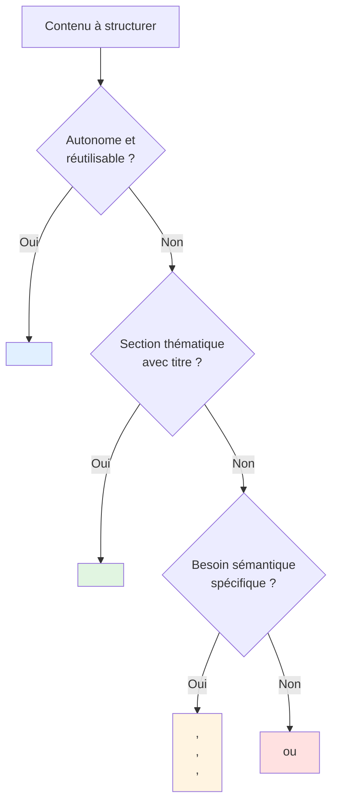
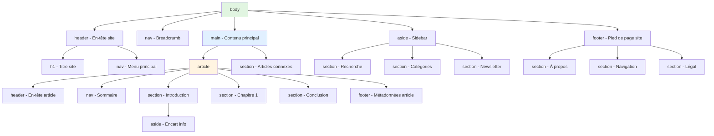

# VI - Sémantique HTML5

<div
  class="omny-meta"
  data-level="🟡 Intermédiaire"
  data-version="1.0"
  data-time="4-6 heures">
</div>

## Introduction : Donner du Sens au Code

!!! quote "Analogie pédagogique"
    _Imaginez un **journal papier**. Sans structure, ce serait illisible : pas de titre principal, pas de sections (Politique, Sport, Culture), pas de différence entre article principal et encart publicitaire. La **sémantique HTML5**, c'est comme l'architecture d'un journal : `<header>` = bandeau du journal avec logo et titre, `<nav>` = sommaire, `<main>` = contenu principal, `<article>` = article de presse complet, `<section>` = rubrique, `<aside>` = encart latéral, `<footer>` = mentions légales et contacts. Avant HTML5, tout était des `<div>` sans sens : `<div id="header">`, `<div id="sidebar">`. Impossible pour un robot (Google, lecteur d'écran) de comprendre la structure. Aujourd'hui, `<header>` dit explicitement "ceci est l'en-tête", `<nav>` dit "ceci est la navigation". Ce module vous apprend à structurer vos pages comme un architecte : chaque balise à sa place, chaque élément avec son rôle, pour une accessibilité parfaite et un SEO optimal._

**Sémantique HTML5** = Utiliser des balises qui décrivent le **sens** du contenu, pas juste sa présentation.

**Pourquoi la sémantique est cruciale ?**

✅ **Accessibilité** : Lecteurs d'écran comprennent la structure (landmarks)
✅ **SEO** : Google comprend mieux le contenu (ranking)
✅ **Maintenance** : Code auto-documenté (plus lisible)
✅ **Future-proof** : Standards web universels
✅ **Navigation clavier** : Sauts rapides entre sections
✅ **Signification claire** : `<article>` > `<div class="article">`

**Avant HTML5 (2014) vs Après :**

```html
<!-- ❌ AVANT HTML5 : Div soup (soupe de div) -->
<div id="header">
    <div id="logo">...</div>
    <div id="nav">...</div>
</div>
<div id="content">
    <div class="post">...</div>
</div>
<div id="sidebar">...</div>
<div id="footer">...</div>

<!-- ✅ APRÈS HTML5 : Sémantique claire -->
<header>
    <h1>Logo</h1>
    <nav>...</nav>
</header>
<main>
    <article>...</article>
</main>
<aside>...</aside>
<footer>...</footer>
```

**Ce module vous enseigne à structurer des pages HTML5 professionnelles et accessibles.**

---

## 1. Header (En-tête)

### 1.1 Définition et Usage

```html
<!DOCTYPE html>
<html lang="fr">
<head>
    <meta charset="UTF-8">
    <title>Header HTML5</title>
</head>
<body>
    <!-- Header principal du site -->
    <header>
        <h1>Mon Site Web</h1>
        <p>Le meilleur site du monde</p>
        
        <nav>
            <ul>
                <li><a href="#home">Accueil</a></li>
                <li><a href="#about">À propos</a></li>
                <li><a href="#contact">Contact</a></li>
            </ul>
        </nav>
    </header>
    
    <!-- Header dans un article -->
    <main>
        <article>
            <header>
                <h2>Titre de l'article</h2>
                <p>
                    Publié le <time datetime="2024-01-15">15 janvier 2024</time>
                    par <a href="/author/alice">Alice Dupont</a>
                </p>
                <p>Temps de lecture : 5 minutes</p>
            </header>
            
            <p>Contenu de l'article...</p>
        </article>
    </main>
    
    <!-- Header dans une section -->
    <section>
        <header>
            <h2>Nos services</h2>
            <p>Découvrez tout ce que nous proposons</p>
        </header>
        
        <ul>
            <li>Service 1</li>
            <li>Service 2</li>
            <li>Service 3</li>
        </ul>
    </section>
</body>
</html>
```

**Règles d'usage `<header>` :**

✅ **Contient** : Titres, logo, navigation, métadonnées
✅ **Peut être utilisé** : Dans body, article, section
✅ **Multiple** : Plusieurs `<header>` possibles dans une page
❌ **Ne contient PAS** : Autre `<header>`, `<footer>`, `<main>`

### 1.2 Header vs h1

```html
<!-- ⚠️ CONFUSION COURANTE -->

<!-- <header> ≠ <h1> -->
<!-- <header> = Section d'en-tête (conteneur) -->
<!-- <h1> = Titre de niveau 1 (contenu) -->

<!-- ✅ BON : header contient h1 + infos supplémentaires -->
<header>
    <h1>Mon Blog</h1>
    <p>Pensées et réflexions</p>
    <nav>...</nav>
</header>

<!-- ✅ BON : h1 peut exister seul -->
<h1>Titre de page</h1>
<p>Contenu...</p>

<!-- ✅ BON : article avec header -->
<article>
    <header>
        <h2>Titre article</h2>
        <p>Métadonnées</p>
    </header>
    <p>Contenu...</p>
</article>
```

---

## 2. Nav (Navigation)

### 2.1 Navigation Principale

```html
<!DOCTYPE html>
<html lang="fr">
<head>
    <meta charset="UTF-8">
    <title>Navigation HTML5</title>
</head>
<body>
    <!-- Navigation principale du site -->
    <header>
        <h1>Mon Site</h1>
        
        <nav aria-label="Navigation principale">
            <ul>
                <li><a href="/">Accueil</a></li>
                <li><a href="/about">À propos</a></li>
                <li><a href="/services">Services</a></li>
                <li><a href="/portfolio">Portfolio</a></li>
                <li><a href="/blog">Blog</a></li>
                <li><a href="/contact">Contact</a></li>
            </ul>
        </nav>
    </header>
    
    <!-- Navigation secondaire (breadcrumb) -->
    <nav aria-label="Fil d'Ariane">
        <ol>
            <li><a href="/">Accueil</a></li>
            <li><a href="/blog">Blog</a></li>
            <li aria-current="page">Article actuel</li>
        </ol>
    </nav>
    
    <main>
        <article>
            <h2>Article de blog</h2>
            <p>Contenu...</p>
            
            <!-- Navigation dans l'article (table des matières) -->
            <nav aria-label="Table des matières">
                <h3>Sommaire</h3>
                <ul>
                    <li><a href="#intro">Introduction</a></li>
                    <li><a href="#chapter1">Chapitre 1</a></li>
                    <li><a href="#chapter2">Chapitre 2</a></li>
                    <li><a href="#conclusion">Conclusion</a></li>
                </ul>
            </nav>
            
            <!-- Contenu avec sections -->
        </article>
    </main>
    
    <!-- Navigation footer (liens secondaires) -->
    <footer>
        <nav aria-label="Navigation footer">
            <ul>
                <li><a href="/mentions-legales">Mentions légales</a></li>
                <li><a href="/politique-confidentialite">Confidentialité</a></li>
                <li><a href="/cgv">CGV</a></li>
            </ul>
        </nav>
    </footer>
</body>
</html>
```

**Quand utiliser `<nav>` ?**

✅ **Utiliser pour :**
- Menu principal du site
- Breadcrumbs (fil d'Ariane)
- Table des matières (sommaire)
- Pagination importante
- Navigation footer (liens légaux)

❌ **Ne PAS utiliser pour :**
- Liste de liens dans un article (contenu)
- Réseaux sociaux (liens isolés)
- Tags d'article (simple liste)

### 2.2 Aria-label pour Multiples Nav

```html
<!DOCTYPE html>
<html lang="fr">
<head>
    <meta charset="UTF-8">
    <title>Multiples navigations</title>
</head>
<body>
    <!-- IMPORTANT : Si plusieurs <nav>, utiliser aria-label -->
    
    <!-- Navigation 1 : Principale -->
    <nav aria-label="Navigation principale">
        <ul>
            <li><a href="/">Accueil</a></li>
            <li><a href="/about">À propos</a></li>
        </ul>
    </nav>
    
    <!-- Navigation 2 : Breadcrumb -->
    <nav aria-label="Fil d'Ariane">
        <ol>
            <li><a href="/">Accueil</a></li>
            <li>Page actuelle</li>
        </ol>
    </nav>
    
    <!-- Navigation 3 : Sommaire article -->
    <nav aria-label="Table des matières">
        <ul>
            <li><a href="#section1">Section 1</a></li>
        </ul>
    </nav>
    
    <!-- Navigation 4 : Footer -->
    <nav aria-label="Liens légaux">
        <ul>
            <li><a href="/legal">Mentions légales</a></li>
        </ul>
    </nav>
    
    <!-- 
    aria-label : Lecteur d'écran annonce
    "Navigation principale", "Fil d'Ariane", etc.
    → Utilisateur aveugle peut distinguer les navigations
    -->
</body>
</html>
```

---

## 3. Main (Contenu Principal)

### 3.1 Règle : UN SEUL `<main>` par Page

```html
<!DOCTYPE html>
<html lang="fr">
<head>
    <meta charset="UTF-8">
    <title>Main HTML5</title>
</head>
<body>
    <header>
        <h1>Mon Site</h1>
        <nav>...</nav>
    </header>
    
    <!-- ✅ UN SEUL <main> par page (contenu unique) -->
    <main>
        <h2>Contenu principal de la page</h2>
        
        <article>
            <h3>Article 1</h3>
            <p>Contenu...</p>
        </article>
        
        <article>
            <h3>Article 2</h3>
            <p>Contenu...</p>
        </article>
    </main>
    
    <aside>
        <h2>Sidebar</h2>
        <p>Contenu secondaire...</p>
    </aside>
    
    <footer>
        <p>&copy; 2024 Mon Site</p>
    </footer>
    
    <!-- 
    ❌ PAS de deuxième <main> !
    ❌ <main> ne va PAS dans <header>, <footer>, <aside>
    -->
</body>
</html>
```

**Règles strictes `<main>` :**

✅ **UN SEUL** `<main>` par page (contenu unique)
✅ **Contient** : Contenu principal, unique à cette page
✅ **Direct enfant** : Généralement enfant direct de `<body>`
❌ **NE PAS** : Imbriquer dans `<article>`, `<aside>`, `<header>`, `<footer>`, `<nav>`
❌ **NE PAS** : Répéter sur plusieurs pages (header/footer = OK, main = unique)

### 3.2 Main vs Article

```html
<!-- main : Conteneur du contenu principal -->
<!-- article : Contenu autonome réutilisable -->

<!-- ✅ Page d'accueil : main contient plusieurs articles -->
<main>
    <h1>Blog</h1>
    
    <article>
        <h2>Article 1</h2>
        <p>...</p>
    </article>
    
    <article>
        <h2>Article 2</h2>
        <p>...</p>
    </article>
</main>

<!-- ✅ Page article unique : main contient un article -->
<main>
    <article>
        <h1>Titre de l'article</h1>
        <p>Contenu complet...</p>
    </article>
</main>

<!-- ✅ Page contact : main sans article -->
<main>
    <h1>Contact</h1>
    <form>...</form>
</main>
```

---

## 4. Article (Contenu Autonome)

### 4.1 Définition et Exemples

```html
<!DOCTYPE html>
<html lang="fr">
<head>
    <meta charset="UTF-8">
    <title>Article HTML5</title>
</head>
<body>
    <main>
        <!-- Article = Contenu autonome, réutilisable, syndicable -->
        
        <!-- Article de blog -->
        <article>
            <header>
                <h2>Les 10 meilleurs frameworks JavaScript en 2024</h2>
                <p>
                    Publié le <time datetime="2024-01-15">15 janvier 2024</time>
                    par <a href="/author/alice">Alice Dupont</a>
                </p>
                <p>Catégorie : <a href="/category/javascript">JavaScript</a></p>
            </header>
            
            <p>
                Le paysage JavaScript évolue rapidement. Voici les 10 frameworks
                les plus populaires cette année...
            </p>
            
            <section>
                <h3>1. React</h3>
                <p>Développé par Meta, React domine...</p>
            </section>
            
            <section>
                <h3>2. Vue.js</h3>
                <p>Framework progressif...</p>
            </section>
            
            <footer>
                <p>Tags : <a href="/tag/javascript">JavaScript</a>, <a href="/tag/frameworks">Frameworks</a></p>
                <p>Partager : [Réseaux sociaux]</p>
            </footer>
        </article>
        
        <!-- Article de produit e-commerce -->
        <article>
            <header>
                <h2>Laptop Pro 15"</h2>
                <p>Prix : <data value="1299.99">1 299,99 €</data></p>
                <p>Note : ⭐⭐⭐⭐⭐ (4.8/5 - 342 avis)</p>
            </header>
            
            
            
            <section>
                <h3>Description</h3>
                <p>Ordinateur portable haute performance...</p>
            </section>
            
            <section>
                <h3>Caractéristiques</h3>
                <ul>
                    <li>Processeur Intel Core i7</li>
                    <li>16 Go RAM</li>
                    <li>512 Go SSD</li>
                </ul>
            </section>
            
            <footer>
                <button>Ajouter au panier</button>
            </footer>
        </article>
        
        <!-- Article de commentaire (article imbriqué) -->
        <article>
            <header>
                <h2>Discussion : Meilleurs frameworks</h2>
            </header>
            
            <p>Qu'en pensez-vous ? Partagez votre avis !</p>
            
            <!-- Commentaire = article dans article -->
            <article>
                <header>
                    <h3>Commentaire de Bob</h3>
                    <p>
                        <time datetime="2024-01-16T10:30:00">16 janvier 2024 à 10h30</time>
                    </p>
                </header>
                <p>Excellent article ! J'utilise React depuis 3 ans...</p>
            </article>
            
            <article>
                <header>
                    <h3>Commentaire de Charlie</h3>
                    <p>
                        <time datetime="2024-01-16T14:20:00">16 janvier 2024 à 14h20</time>
                    </p>
                </header>
                <p>Je préfère Vue.js pour sa simplicité...</p>
            </article>
        </article>
    </main>
</body>
</html>
```

**Test de l'article autonome :**

❓ **"Ce contenu pourrait-il être extrait et publié ailleurs (RSS, newsletter, agrégateur) en restant compréhensible ?"**

- ✅ **OUI** → Utiliser `<article>`
- ❌ **NON** → Utiliser `<section>` ou `<div>`

**Exemples `<article>` :**
- Article de blog
- Article de news
- Produit e-commerce
- Post de forum
- Commentaire
- Widget autonome

---

## 5. Section (Section Thématique)

### 5.1 Section vs Article vs Div

```html
<!DOCTYPE html>
<html lang="fr">
<head>
    <meta charset="UTF-8">
    <title>Section vs Article vs Div</title>
</head>
<body>
    <main>
        <!-- ARTICLE : Contenu autonome réutilisable -->
        <article>
            <h2>Guide complet React</h2>
            
            <!-- SECTION : Partie thématique de l'article -->
            <section>
                <h3>Introduction</h3>
                <p>React est une bibliothèque JavaScript...</p>
            </section>
            
            <section>
                <h3>Installation</h3>
                <p>Pour installer React...</p>
            </section>
            
            <section>
                <h3>Composants</h3>
                <p>Les composants sont...</p>
                
                <!-- DIV : Conteneur stylistique (pas sémantique) -->
                <div class="code-example">
                    <pre><code>function Welcome() { ... }</code></pre>
                </div>
            </section>
            
            <section>
                <h3>Conclusion</h3>
                <p>React est un excellent choix...</p>
            </section>
        </article>
        
        <!-- SECTION : Groupe thématique d'articles -->
        <section>
            <h2>Articles populaires</h2>
            
            <article>
                <h3>Article 1</h3>
                <p>...</p>
            </article>
            
            <article>
                <h3>Article 2</h3>
                <p>...</p>
            </article>
        </section>
    </main>
</body>
</html>
```

**Arbre de décision :**



**Comparaison :**

| Élément | Sémantique | Autonome | Titre requis | Usage |
|---------|------------|----------|--------------|-------|
| `<article>` | ✅ Forte | ✅ Oui | ⚠️ Recommandé | Blog post, produit, commentaire |
| `<section>` | ✅ Forte | ❌ Non | ✅ **Obligatoire** | Chapitre, rubrique thématique |
| `<div>` | ❌ Aucune | ❌ Non | ❌ Non | Conteneur style, layout |

**Règle d'or `<section>` :**
🔴 **TOUJOURS avoir un titre (h1-h6) dans `<section>`**

```html
<!-- ❌ MAUVAIS : section sans titre -->
<section>
    <p>Contenu sans titre...</p>
</section>

<!-- ✅ BON : section avec titre -->
<section>
    <h2>Titre de la section</h2>
    <p>Contenu...</p>
</section>
```

---

## 6. Aside (Contenu Connexe)

### 6.1 Sidebar et Contenu Tangentiel

```html
<!DOCTYPE html>
<html lang="fr">
<head>
    <meta charset="UTF-8">
    <title>Aside HTML5</title>
</head>
<body>
    <header>
        <h1>Mon Blog Tech</h1>
        <nav>...</nav>
    </header>
    
    <main>
        <article>
            <h2>Introduction à React</h2>
            <p>React est une bibliothèque JavaScript...</p>
            
            <!-- Aside dans article : Info tangentielle -->
            <aside>
                <h3>💡 Le saviez-vous ?</h3>
                <p>
                    React a été créé par Jordan Walke, ingénieur chez Facebook,
                    et open-sourcé en 2013.
                </p>
            </aside>
            
            <p>Suite de l'article...</p>
        </article>
    </main>
    
    <!-- Aside global : Sidebar -->
    <aside>
        <section>
            <h2>À propos de l'auteur</h2>
            
            <p>
                Alice Dupont est développeuse frontend depuis 10 ans,
                spécialisée en React et Vue.js.
            </p>
        </section>
        
        <section>
            <h2>Articles populaires</h2>
            <ul>
                <li><a href="/article1">Les bases de JavaScript</a></li>
                <li><a href="/article2">CSS Grid expliqué</a></li>
                <li><a href="/article3">Introduction à Node.js</a></li>
            </ul>
        </section>
        
        <section>
            <h2>Publicité</h2>
            <div class="ad">
                [Bannière publicitaire]
            </div>
        </section>
        
        <section>
            <h2>Newsletter</h2>
            <p>Recevez les derniers articles par email :</p>
            <form>
                <input type="email" placeholder="Votre email">
                <button type="submit">S'abonner</button>
            </form>
        </section>
    </aside>
    
    <footer>
        <p>&copy; 2024 Mon Blog</p>
    </footer>
</body>
</html>
```

**Cas d'usage `<aside>` :**

✅ **Utiliser pour :**
- Sidebar (barre latérale)
- Encart "Le saviez-vous ?"
- Biographie auteur
- Articles connexes
- Publicités
- Glossaire de termes
- Pull quotes (citations mises en avant)

❌ **Ne PAS utiliser pour :**
- Contenu essentiel à la compréhension
- Navigation principale
- Footer

### 6.2 Aside dans Article vs Aside Global

```html
<!-- Aside DANS article : Contenu tangentiel à l'article -->
<article>
    <h2>Histoire du web</h2>
    <p>Le web a été inventé par Tim Berners-Lee...</p>
    
    <aside>
        <h3>📚 Définition</h3>
        <p>
            <strong>WWW</strong> : World Wide Web, système d'information
            hypertexte public accessible via Internet.
        </p>
    </aside>
    
    <p>En 1991, le premier site web...</p>
</article>

<!-- Aside GLOBAL : Sidebar du site -->
<aside>
    <h2>Catégories</h2>
    <ul>
        <li><a href="/cat/tech">Tech</a></li>
        <li><a href="/cat/design">Design</a></li>
    </ul>
</aside>
```

---

## 7. Footer (Pied de Page)

### 7.1 Footer Global vs Footer Article

```html
<!DOCTYPE html>
<html lang="fr">
<head>
    <meta charset="UTF-8">
    <title>Footer HTML5</title>
</head>
<body>
    <header>
        <h1>Mon Site</h1>
        <nav>...</nav>
    </header>
    
    <main>
        <article>
            <header>
                <h2>Titre de l'article</h2>
                <p>Date de publication</p>
            </header>
            
            <p>Contenu de l'article...</p>
            
            <!-- Footer d'article : Métadonnées article -->
            <footer>
                <p>
                    Auteur : <a href="/author/alice">Alice Dupont</a><br>
                    Tags : <a href="/tag/html">HTML</a>, <a href="/tag/css">CSS</a><br>
                    Dernière mise à jour : <time datetime="2024-01-20">20 janvier 2024</time>
                </p>
                
                <nav aria-label="Partage">
                    <p>Partager :</p>
                    <ul>
                        <li><a href="#">Facebook</a></li>
                        <li><a href="#">Twitter</a></li>
                        <li><a href="#">LinkedIn</a></li>
                    </ul>
                </nav>
            </footer>
        </article>
    </main>
    
    <!-- Footer global : Pied de page du site -->
    <footer>
        <section>
            <h2>À propos</h2>
            <p>
                Mon Site est un blog tech créé en 2020,
                partageant des tutoriels et articles sur le développement web.
            </p>
        </section>
        
        <section>
            <h2>Liens rapides</h2>
            <nav aria-label="Liens footer">
                <ul>
                    <li><a href="/about">À propos</a></li>
                    <li><a href="/contact">Contact</a></li>
                    <li><a href="/sitemap">Plan du site</a></li>
                </ul>
            </nav>
        </section>
        
        <section>
            <h2>Légal</h2>
            <nav aria-label="Liens légaux">
                <ul>
                    <li><a href="/mentions-legales">Mentions légales</a></li>
                    <li><a href="/politique-confidentialite">Confidentialité</a></li>
                    <li><a href="/cgv">CGV</a></li>
                    <li><a href="/cookies">Gestion cookies</a></li>
                </ul>
            </nav>
        </section>
        
        <section>
            <h2>Suivez-nous</h2>
            <ul>
                <li><a href="https://facebook.com/monsite">Facebook</a></li>
                <li><a href="https://twitter.com/monsite">Twitter</a></li>
                <li><a href="https://linkedin.com/company/monsite">LinkedIn</a></li>
            </ul>
        </section>
        
        <p>
            <small>&copy; 2024 Mon Site. Tous droits réservés.</small>
        </p>
    </footer>
</body>
</html>
```

**Footer : Contenu typique**

✅ **Footer global (site) :**
- Copyright et mentions légales
- Liens légaux (confidentialité, CGV, cookies)
- Liens secondaires (à propos, contact, sitemap)
- Réseaux sociaux
- Newsletter
- Coordonnées entreprise

✅ **Footer article :**
- Auteur et date
- Tags et catégories
- Partage social
- Licence contenu
- Articles connexes

---

## 8. Structure de Page Complète

### 8.1 Template Blog Post

```html
<!DOCTYPE html>
<html lang="fr">
<head>
    <meta charset="UTF-8">
    <meta name="viewport" content="width=device-width, initial-scale=1.0">
    <title>Guide HTML5 Sémantique | Mon Blog Tech</title>
    <meta name="description" content="Apprenez à structurer vos pages web avec les balises sémantiques HTML5 : header, nav, main, article, section, aside, footer.">
</head>
<body>
    <!-- Header global du site -->
    <header>
        <div class="logo">
            <h1>Mon Blog Tech</h1>
            <p>Développement web moderne</p>
        </div>
        
        <!-- Navigation principale -->
        <nav aria-label="Navigation principale">
            <ul>
                <li><a href="/">Accueil</a></li>
                <li><a href="/articles">Articles</a></li>
                <li><a href="/tutoriels">Tutoriels</a></li>
                <li><a href="/about">À propos</a></li>
                <li><a href="/contact">Contact</a></li>
            </ul>
        </nav>
    </header>
    
    <!-- Breadcrumb -->
    <nav aria-label="Fil d'Ariane">
        <ol>
            <li><a href="/">Accueil</a></li>
            <li><a href="/articles">Articles</a></li>
            <li><a href="/articles/html">HTML</a></li>
            <li aria-current="page">Guide HTML5 Sémantique</li>
        </ol>
    </nav>
    
    <!-- Contenu principal -->
    <main>
        <!-- Article de blog -->
        <article>
            <!-- En-tête de l'article -->
            <header>
                <h1>Guide Complet : HTML5 Sémantique</h1>
                <p class="subtitle">
                    Maîtrisez les balises sémantiques pour créer des pages web 
                    accessibles et optimisées SEO
                </p>
                
                <p class="meta">
                    Publié le <time datetime="2024-01-15">15 janvier 2024</time>
                    par <a href="/author/alice-dupont">Alice Dupont</a>
                    | Temps de lecture : <data value="15">15 minutes</data>
                </p>
                
                <p class="categories">
                    Catégories : 
                    <a href="/category/html">HTML</a>, 
                    <a href="/category/semantique">Sémantique</a>, 
                    <a href="/category/accessibilite">Accessibilité</a>
                </p>
            </header>
            
            <!-- Image principale -->
            <figure>
                
                <figcaption>
                    Figure 1 : Structure d'une page HTML5 avec balises sémantiques
                </figcaption>
            </figure>
            
            <!-- Sommaire de l'article -->
            <nav aria-label="Table des matières">
                <h2>Sommaire</h2>
                <ol>
                    <li><a href="#introduction">Introduction</a></li>
                    <li><a href="#header">La balise &lt;header&gt;</a></li>
                    <li><a href="#nav">La balise &lt;nav&gt;</a></li>
                    <li><a href="#main">La balise &lt;main&gt;</a></li>
                    <li><a href="#article">La balise &lt;article&gt;</a></li>
                    <li><a href="#section">La balise &lt;section&gt;</a></li>
                    <li><a href="#aside">La balise &lt;aside&gt;</a></li>
                    <li><a href="#footer">La balise &lt;footer&gt;</a></li>
                    <li><a href="#conclusion">Conclusion</a></li>
                </ol>
            </nav>
            
            <!-- Section Introduction -->
            <section id="introduction">
                <h2>Introduction</h2>
                <p>
                    Avant HTML5 (standardisé en 2014), les développeurs web utilisaient 
                    principalement des balises <code>&lt;div&gt;</code> pour structurer 
                    leurs pages...
                </p>
                
                <!-- Encart informatif -->
                <aside>
                    <h3>💡 Le saviez-vous ?</h3>
                    <p>
                        HTML5 a été développé par le WHATWG (Web Hypertext Application 
                        Technology Working Group) et le W3C, avec une première spécification 
                        publiée en octobre 2014.
                    </p>
                </aside>
            </section>
            
            <!-- Section Header -->
            <section id="header">
                <h2>La balise &lt;header&gt;</h2>
                <p>
                    La balise <code>&lt;header&gt;</code> représente un conteneur 
                    pour du contenu introductif ou des aides à la navigation...
                </p>
                
                <figure>
                    <pre><code>&lt;header&gt;
    &lt;h1&gt;Titre du site&lt;/h1&gt;
    &lt;nav&gt;...&lt;/nav&gt;
&lt;/header&gt;</code></pre>
                    <figcaption>Exemple d'utilisation de &lt;header&gt;</figcaption>
                </figure>
            </section>
            
            <!-- Autres sections... -->
            <section id="nav">
                <h2>La balise &lt;nav&gt;</h2>
                <p>...</p>
            </section>
            
            <section id="main">
                <h2>La balise &lt;main&gt;</h2>
                <p>...</p>
            </section>
            
            <!-- Section Conclusion -->
            <section id="conclusion">
                <h2>Conclusion</h2>
                <p>
                    Les balises sémantiques HTML5 ont révolutionné la façon dont nous 
                    structurons les pages web. En utilisant <code>&lt;header&gt;</code>, 
                    <code>&lt;nav&gt;</code>, <code>&lt;main&gt;</code>, 
                    <code>&lt;article&gt;</code>, <code>&lt;section&gt;</code>, 
                    <code>&lt;aside&gt;</code> et <code>&lt;footer&gt;</code>, 
                    vous créez des pages accessibles, optimisées pour le SEO, 
                    et faciles à maintenir.
                </p>
            </section>
            
            <!-- Footer de l'article -->
            <footer>
                <section>
                    <h3>À propos de l'auteur</h3>
                    <p>
                        <strong>Alice Dupont</strong> est développeuse frontend depuis 10 ans, 
                        spécialisée en HTML5, CSS3 et JavaScript. Elle anime régulièrement 
                        des workshops sur l'accessibilité web.
                    </p>
                    <p>
                        <a href="/author/alice-dupont">Voir tous les articles d'Alice</a>
                    </p>
                </section>
                
                <section>
                    <h3>Tags</h3>
                    <ul>
                        <li><a href="/tag/html5">HTML5</a></li>
                        <li><a href="/tag/semantique">Sémantique</a></li>
                        <li><a href="/tag/accessibilite">Accessibilité</a></li>
                        <li><a href="/tag/seo">SEO</a></li>
                    </ul>
                </section>
                
                <section>
                    <h3>Partager cet article</h3>
                    <nav aria-label="Partage social">
                        <ul>
                            <li><a href="#">Facebook</a></li>
                            <li><a href="#">Twitter</a></li>
                            <li><a href="#">LinkedIn</a></li>
                            <li><a href="#">Copier le lien</a></li>
                        </ul>
                    </nav>
                </section>
                
                <p>
                    <small>
                        Dernière mise à jour : <time datetime="2024-01-20">20 janvier 2024</time>
                        | Licence : <a href="https://creativecommons.org/licenses/by-sa/4.0/">CC BY-SA 4.0</a>
                    </small>
                </p>
            </footer>
        </article>
        
        <!-- Section articles connexes -->
        <section>
            <h2>Articles connexes</h2>
            
            <article>
                <h3><a href="/article/accessibilite-web">L'accessibilité web expliquée</a></h3>
                <p>Découvrez comment rendre vos sites accessibles à tous...</p>
            </article>
            
            <article>
                <h3><a href="/article/seo-html5">SEO et HTML5</a></h3>
                <p>Optimisez votre référencement avec les balises sémantiques...</p>
            </article>
        </section>
    </main>
    
    <!-- Sidebar (aside global) -->
    <aside>
        <section>
            <h2>Recherche</h2>
            <form role="search">
                <label for="search">Rechercher sur le blog :</label>
                <input type="search" id="search" name="q">
                <button type="submit">Rechercher</button>
            </form>
        </section>
        
        <section>
            <h2>Catégories</h2>
            <ul>
                <li><a href="/category/html">HTML (45)</a></li>
                <li><a href="/category/css">CSS (38)</a></li>
                <li><a href="/category/javascript">JavaScript (52)</a></li>
                <li><a href="/category/accessibilite">Accessibilité (18)</a></li>
            </ul>
        </section>
        
        <section>
            <h2>Articles populaires</h2>
            <ol>
                <li><a href="/article/flexbox">Guide Flexbox</a></li>
                <li><a href="/article/grid">CSS Grid</a></li>
                <li><a href="/article/async-await">Async/Await</a></li>
            </ol>
        </section>
        
        <section>
            <h2>Newsletter</h2>
            <p>Recevez les nouveaux articles par email :</p>
            <form>
                <label for="newsletter-email">Email :</label>
                <input type="email" id="newsletter-email" required>
                <button type="submit">S'abonner</button>
            </form>
        </section>
    </aside>
    
    <!-- Footer global du site -->
    <footer>
        <section>
            <h2>Mon Blog Tech</h2>
            <p>
                Blog spécialisé en développement web moderne : HTML, CSS, JavaScript, 
                accessibilité, performance, et bien plus.
            </p>
        </section>
        
        <section>
            <h2>Navigation</h2>
            <nav aria-label="Navigation footer">
                <ul>
                    <li><a href="/">Accueil</a></li>
                    <li><a href="/articles">Articles</a></li>
                    <li><a href="/about">À propos</a></li>
                    <li><a href="/contact">Contact</a></li>
                    <li><a href="/rss">RSS</a></li>
                </ul>
            </nav>
        </section>
        
        <section>
            <h2>Légal</h2>
            <nav aria-label="Liens légaux">
                <ul>
                    <li><a href="/mentions-legales">Mentions légales</a></li>
                    <li><a href="/politique-confidentialite">Confidentialité</a></li>
                    <li><a href="/cgv">CGV</a></li>
                    <li><a href="/cookies">Gestion cookies</a></li>
                </ul>
            </nav>
        </section>
        
        <section>
            <h2>Suivez-nous</h2>
            <ul>
                <li><a href="https://twitter.com/monblogtech">Twitter</a></li>
                <li><a href="https://github.com/monblogtech">GitHub</a></li>
                <li><a href="https://linkedin.com/company/monblogtech">LinkedIn</a></li>
            </ul>
        </section>
        
        <p>
            <small>
                &copy; 2024 Mon Blog Tech. Tous droits réservés.
                Réalisé avec ❤️ et HTML5.
            </small>
        </p>
    </footer>
</body>
</html>
```

### 8.2 Diagramme Structure Page



---

## 9. Balises Sémantiques Complémentaires

### 9.1 Time (Date et Heure)

```html
<!DOCTYPE html>
<html lang="fr">
<head>
    <meta charset="UTF-8">
    <title>Balise Time</title>
</head>
<body>
    <!-- Date seule -->
    <p>
        Article publié le <time datetime="2024-01-15">15 janvier 2024</time>
    </p>
    
    <!-- Date + heure -->
    <p>
        Événement le <time datetime="2024-02-20T19:30:00">20 février 2024 à 19h30</time>
    </p>
    
    <!-- Date + heure + timezone -->
    <p>
        Conférence le <time datetime="2024-03-10T14:00:00+01:00">10 mars 2024 à 14h00 (CET)</time>
    </p>
    
    <!-- Durée -->
    <p>
        Durée de la vidéo : <time datetime="PT2H30M">2 heures 30 minutes</time>
    </p>
    
    <!-- Année seule -->
    <p>
        Créé en <time datetime="2020">2020</time>
    </p>
    
    <!-- Mise à jour -->
    <p>
        <small>
            Dernière mise à jour : <time datetime="2024-01-20T15:45:00">20 janvier 2024 à 15h45</time>
        </small>
    </p>
</body>
</html>
```

**Format datetime ISO 8601 :**

```
Date : YYYY-MM-DD
Exemple : 2024-01-15

Date + Heure : YYYY-MM-DDTHH:MM:SS
Exemple : 2024-01-15T14:30:00

Avec timezone : YYYY-MM-DDTHH:MM:SS+HH:MM
Exemple : 2024-01-15T14:30:00+01:00

Durée : PT#H#M#S
Exemple : PT2H30M (2 heures 30 minutes)
```

### 9.2 Mark (Surlignage Contextuel)

```html
<!DOCTYPE html>
<html lang="fr">
<head>
    <meta charset="UTF-8">
    <title>Balise Mark</title>
</head>
<body>
    <!-- Résultat de recherche -->
    <p>
        Résultats pour "HTML5" :<br>
        Le langage <mark>HTML5</mark> est la dernière version de <mark>HTML</mark>.
    </p>
    
    <!-- Mise en évidence dans citation -->
    <blockquote>
        <p>
            "Le web est bien plus qu'une innovation technologique, 
            c'est <mark>une force qui transforme la société</mark>."
        </p>
        <footer>— Tim Berners-Lee</footer>
    </blockquote>
    
    <!-- Code avec highlight -->
    <pre><code>function hello() {
    console.log(<mark>"Hello World"</mark>);
}</code></pre>
</body>
</html>
```

### 9.3 Address (Coordonnées)

```html
<!DOCTYPE html>
<html lang="fr">
<head>
    <meta charset="UTF-8">
    <title>Balise Address</title>
</head>
<body>
    <!-- Address dans footer de page -->
    <footer>
        <address>
            <strong>Mon Entreprise</strong><br>
            123 Rue Example<br>
            75001 Paris<br>
            France<br>
            <br>
            Téléphone : <a href="tel:+33123456789">01 23 45 67 89</a><br>
            Email : <a href="mailto:contact@example.com">contact@example.com</a>
        </address>
    </footer>
    
    <!-- Address dans footer d'article (auteur) -->
    <article>
        <h2>Mon article</h2>
        <p>Contenu...</p>
        
        <footer>
            <address>
                Article écrit par <a href="/author/alice">Alice Dupont</a>.<br>
                Contact : <a href="mailto:alice@example.com">alice@example.com</a>
            </address>
        </footer>
    </article>
</body>
</html>
```

---

## 10. Exercices Pratiques

### Exercice 1 : Page d'Accueil Blog

**Objectif :** Créer une structure sémantique d'accueil.

**Consigne :** Créer une page avec :
- Header avec logo et navigation
- Main avec 3 articles récents
- Sidebar avec recherche et catégories
- Footer avec liens légaux

<details>
<summary>Solution</summary>

```html
<!DOCTYPE html>
<html lang="fr">
<head>
    <meta charset="UTF-8">
    <meta name="viewport" content="width=device-width, initial-scale=1.0">
    <title>Blog Tech - Accueil</title>
</head>
<body>
    <header>
        <h1>Blog Tech</h1>
        <p>Actualités et tutoriels développement web</p>
        
        <nav aria-label="Navigation principale">
            <ul>
                <li><a href="/">Accueil</a></li>
                <li><a href="/articles">Articles</a></li>
                <li><a href="/tutoriels">Tutoriels</a></li>
                <li><a href="/about">À propos</a></li>
            </ul>
        </nav>
    </header>
    
    <main>
        <h2>Articles récents</h2>
        
        <article>
            <header>
                <h3><a href="/article/html5-semantique">HTML5 Sémantique</a></h3>
                <p>
                    Publié le <time datetime="2024-01-15">15 janvier 2024</time>
                    par <a href="/author/alice">Alice</a>
                </p>
            </header>
            <p>
                Découvrez comment structurer vos pages avec les balises sémantiques HTML5...
            </p>
            <footer>
                <a href="/article/html5-semantique">Lire la suite →</a>
            </footer>
        </article>
        
        <article>
            <header>
                <h3><a href="/article/css-grid">Maîtriser CSS Grid</a></h3>
                <p>
                    Publié le <time datetime="2024-01-10">10 janvier 2024</time>
                    par <a href="/author/bob">Bob</a>
                </p>
            </header>
            <p>
                CSS Grid révolutionne la création de layouts. Apprenez à créer des grilles complexes...
            </p>
            <footer>
                <a href="/article/css-grid">Lire la suite →</a>
            </footer>
        </article>
        
        <article>
            <header>
                <h3><a href="/article/javascript-async">JavaScript Async/Await</a></h3>
                <p>
                    Publié le <time datetime="2024-01-05">5 janvier 2024</time>
                    par <a href="/author/alice">Alice</a>
                </p>
            </header>
            <p>
                Simplifiez vos opérations asynchrones avec async/await...
            </p>
            <footer>
                <a href="/article/javascript-async">Lire la suite →</a>
            </footer>
        </article>
    </main>
    
    <aside>
        <section>
            <h2>Recherche</h2>
            <form role="search">
                <label for="search">Rechercher :</label>
                <input type="search" id="search" name="q">
                <button type="submit">Rechercher</button>
            </form>
        </section>
        
        <section>
            <h2>Catégories</h2>
            <ul>
                <li><a href="/category/html">HTML (25)</a></li>
                <li><a href="/category/css">CSS (30)</a></li>
                <li><a href="/category/javascript">JavaScript (40)</a></li>
                <li><a href="/category/accessibilite">Accessibilité (15)</a></li>
            </ul>
        </section>
        
        <section>
            <h2>Newsletter</h2>
            <p>Recevez les nouveaux articles :</p>
            <form>
                <label for="email">Email :</label>
                <input type="email" id="email" required>
                <button type="submit">S'abonner</button>
            </form>
        </section>
    </aside>
    
    <footer>
        <nav aria-label="Liens légaux">
            <ul>
                <li><a href="/mentions-legales">Mentions légales</a></li>
                <li><a href="/confidentialite">Confidentialité</a></li>
                <li><a href="/contact">Contact</a></li>
            </ul>
        </nav>
        <p><small>&copy; 2024 Blog Tech</small></p>
    </footer>
</body>
</html>
```

</details>

### Exercice 2 : Article de Blog Complet

**Objectif :** Structurer un article avec sommaire et sections.

**Consigne :** Créer un article avec :
- Header article (titre, date, auteur)
- Sommaire avec ancres
- 4 sections thématiques
- Aside avec info complémentaire
- Footer article (tags, partage)

<details>
<summary>Solution</summary>

```html
<!DOCTYPE html>
<html lang="fr">
<head>
    <meta charset="UTF-8">
    <meta name="viewport" content="width=device-width, initial-scale=1.0">
    <title>Guide Complet Flexbox | Blog Tech</title>
</head>
<body>
    <header>
        <h1>Blog Tech</h1>
        <nav aria-label="Navigation principale">
            <ul>
                <li><a href="/">Accueil</a></li>
                <li><a href="/articles">Articles</a></li>
            </ul>
        </nav>
    </header>
    
    <nav aria-label="Fil d'Ariane">
        <ol>
            <li><a href="/">Accueil</a></li>
            <li><a href="/articles">Articles</a></li>
            <li><a href="/articles/css">CSS</a></li>
            <li aria-current="page">Guide Flexbox</li>
        </ol>
    </nav>
    
    <main>
        <article>
            <header>
                <h1>Guide Complet : Maîtriser CSS Flexbox</h1>
                <p>
                    Apprenez à créer des layouts flexibles et responsives 
                    avec le module Flexbox de CSS3
                </p>
                <p>
                    Publié le <time datetime="2024-01-20">20 janvier 2024</time>
                    par <a href="/author/alice">Alice Dupont</a>
                    | Temps de lecture : <data value="20">20 minutes</data>
                </p>
            </header>
            
            <nav aria-label="Table des matières">
                <h2>Sommaire</h2>
                <ol>
                    <li><a href="#intro">Introduction</a></li>
                    <li><a href="#concepts">Concepts de base</a></li>
                    <li><a href="#proprietes">Propriétés Flexbox</a></li>
                    <li><a href="#exemples">Exemples pratiques</a></li>
                    <li><a href="#conclusion">Conclusion</a></li>
                </ol>
            </nav>
            
            <section id="intro">
                <h2>Introduction</h2>
                <p>
                    Flexbox (Flexible Box Layout) est un module CSS3 qui facilite 
                    la création de layouts flexibles et responsives...
                </p>
                
                <aside>
                    <h3>💡 Avant Flexbox</h3>
                    <p>
                        Avant Flexbox, les développeurs utilisaient float, inline-block 
                        ou table-cell pour créer des layouts. Ces méthodes étaient 
                        peu intuitives et limitées.
                    </p>
                </aside>
            </section>
            
            <section id="concepts">
                <h2>Concepts de base</h2>
                <p>
                    Flexbox repose sur deux éléments : le <strong>conteneur flex</strong> 
                    (flex container) et les <strong>éléments flex</strong> (flex items)...
                </p>
                
                <figure>
                    <pre><code>.container {
    display: flex;
}</code></pre>
                    <figcaption>Activation de Flexbox sur un conteneur</figcaption>
                </figure>
            </section>
            
            <section id="proprietes">
                <h2>Propriétés Flexbox</h2>
                <p>
                    Flexbox offre de nombreuses propriétés pour contrôler l'alignement, 
                    la direction et l'espacement des éléments...
                </p>
            </section>
            
            <section id="exemples">
                <h2>Exemples pratiques</h2>
                <p>
                    Voyons comment créer des layouts courants avec Flexbox...
                </p>
            </section>
            
            <section id="conclusion">
                <h2>Conclusion</h2>
                <p>
                    Flexbox est un outil puissant pour créer des layouts modernes. 
                    Associé à CSS Grid, il couvre la majorité des besoins en mise en page.
                </p>
            </section>
            
            <footer>
                <section>
                    <h3>Tags</h3>
                    <ul>
                        <li><a href="/tag/css">CSS</a></li>
                        <li><a href="/tag/flexbox">Flexbox</a></li>
                        <li><a href="/tag/layout">Layout</a></li>
                    </ul>
                </section>
                
                <section>
                    <h3>Partager</h3>
                    <nav aria-label="Partage social">
                        <ul>
                            <li><a href="#">Twitter</a></li>
                            <li><a href="#">LinkedIn</a></li>
                        </ul>
                    </nav>
                </section>
            </footer>
        </article>
    </main>
    
    <footer>
        <p><small>&copy; 2024 Blog Tech</small></p>
    </footer>
</body>
</html>
```

</details>

### Exercice 3 : Landing Page Produit

**Objectif :** Créer une landing page sémantique.

**Consigne :** Créer une page avec :
- Header avec logo et CTA
- Main avec hero, features (sections), témoignages (articles)
- Footer avec liens et coordonnées

<details>
<summary>Solution</summary>

```html
<!DOCTYPE html>
<html lang="fr">
<head>
    <meta charset="UTF-8">
    <meta name="viewport" content="width=device-width, initial-scale=1.0">
    <title>ProductPro - L'outil ultime pour gérer vos projets</title>
    <meta name="description" content="ProductPro simplifie la gestion de vos projets. Essai gratuit 14 jours.">
</head>
<body>
    <header>
        <h1>ProductPro</h1>
        <nav aria-label="Navigation principale">
            <ul>
                <li><a href="#features">Fonctionnalités</a></li>
                <li><a href="#pricing">Tarifs</a></li>
                <li><a href="#testimonials">Témoignages</a></li>
            </ul>
        </nav>
        <a href="/signup">Essai gratuit</a>
    </header>
    
    <main>
        <!-- Hero section -->
        <section>
            <h2>Gérez vos projets efficacement</h2>
            <p>
                ProductPro est l'outil de gestion de projet qui booste 
                la productivité de votre équipe de 40%.
            </p>
            <a href="/signup">Commencer gratuitement</a>
            <p><small>Essai gratuit 14 jours - Sans carte bancaire</small></p>
        </section>
        
        <!-- Features -->
        <section id="features">
            <h2>Fonctionnalités</h2>
            
            <section>
                <h3>📊 Tableaux de bord</h3>
                <p>Visualisez l'avancement de vos projets en temps réel</p>
            </section>
            
            <section>
                <h3>👥 Collaboration</h3>
                <p>Travaillez en équipe avec chat intégré et partage de fichiers</p>
            </section>
            
            <section>
                <h3>📈 Rapports</h3>
                <p>Générez des rapports détaillés sur la productivité</p>
            </section>
        </section>
        
        <!-- Testimonials -->
        <section id="testimonials">
            <h2>Ce que disent nos clients</h2>
            
            <article>
                <blockquote>
                    <p>
                        "ProductPro a transformé notre façon de travailler. 
                        Plus de clarté, plus d'efficacité."
                    </p>
                </blockquote>
                <footer>
                    <p>
                        — <cite>Marie Dubois</cite>, CEO chez TechStart
                    </p>
                </footer>
            </article>
            
            <article>
                <blockquote>
                    <p>
                        "Un outil simple mais puissant. Notre équipe a adopté 
                        ProductPro en moins d'une semaine."
                    </p>
                </blockquote>
                <footer>
                    <p>
                        — <cite>Jean Martin</cite>, Chef de projet chez WebAgency
                    </p>
                </footer>
            </article>
        </section>
        
        <!-- CTA final -->
        <section>
            <h2>Prêt à démarrer ?</h2>
            <p>Rejoignez les 10 000+ équipes qui utilisent ProductPro</p>
            <a href="/signup">Essayer gratuitement</a>
        </section>
    </main>
    
    <footer>
        <section>
            <h2>ProductPro</h2>
            <p>L'outil de gestion de projet pour les équipes modernes</p>
        </section>
        
        <section>
            <h2>Produit</h2>
            <nav aria-label="Liens produit">
                <ul>
                    <li><a href="/features">Fonctionnalités</a></li>
                    <li><a href="/pricing">Tarifs</a></li>
                    <li><a href="/security">Sécurité</a></li>
                </ul>
            </nav>
        </section>
        
        <section>
            <h2>Entreprise</h2>
            <nav aria-label="Liens entreprise">
                <ul>
                    <li><a href="/about">À propos</a></li>
                    <li><a href="/careers">Carrières</a></li>
                    <li><a href="/press">Presse</a></li>
                </ul>
            </nav>
        </section>
        
        <section>
            <h2>Contact</h2>
            <address>
                Email : <a href="mailto:contact@productpro.com">contact@productpro.com</a><br>
                Téléphone : <a href="tel:+33123456789">01 23 45 67 89</a>
            </address>
        </section>
        
        <p>
            <small>&copy; 2024 ProductPro. Tous droits réservés.</small>
        </p>
    </footer>
</body>
</html>
```

</details>

---

## 11. Projet du Module : Site Complet Multi-Pages

### 11.1 Cahier des Charges

**Créer un site web complet de 3 pages avec structure sémantique parfaite :**

**Spécifications techniques :**
- ✅ Page 1 : Accueil (hero, features, CTA)
- ✅ Page 2 : Blog (liste articles + sidebar)
- ✅ Page 3 : Article complet (sommaire, sections, aside)
- ✅ Structure sémantique complète (header, nav, main, article, section, aside, footer)
- ✅ Breadcrumb sur toutes les pages
- ✅ Navigation accessible (aria-label)
- ✅ Balises time, address, mark appropriées
- ✅ Code validé W3C

### 11.2 Solution Complète

<details>
<summary>Voir les 3 pages du projet</summary>

**Page 1 : index.html (Accueil)**

```html
<!DOCTYPE html>
<html lang="fr">
<head>
    <meta charset="UTF-8">
    <meta name="viewport" content="width=device-width, initial-scale=1.0">
    <title>DevMaster - Formation développement web</title>
    <meta name="description" content="Formations HTML, CSS, JavaScript pour devenir développeur web professionnel">
</head>
<body>
    <header>
        <h1>DevMaster</h1>
        <p>Formations développement web</p>
        
        <nav aria-label="Navigation principale">
            <ul>
                <li><a href="/" aria-current="page">Accueil</a></li>
                <li><a href="blog.html">Blog</a></li>
                <li><a href="/formations">Formations</a></li>
                <li><a href="/about">À propos</a></li>
                <li><a href="/contact">Contact</a></li>
            </ul>
        </nav>
    </header>
    
    <main>
        <section>
            <h2>Devenez Développeur Web Professionnel</h2>
            <p>
                Apprenez HTML, CSS, JavaScript avec des formations pratiques 
                et des projets concrets. Plus de 5000 étudiants formés.
            </p>
            <a href="/signup">Commencer gratuitement</a>
            <p><small>Essai gratuit 7 jours - Sans engagement</small></p>
        </section>
        
        <section>
            <h2>Nos formations</h2>
            
            <section>
                <h3>HTML & CSS</h3>
                <p>Maîtrisez les fondations du web avec HTML5 et CSS3</p>
                <ul>
                    <li>Structure sémantique</li>
                    <li>Responsive design</li>
                    <li>Flexbox & Grid</li>
                </ul>
                <a href="/formations/html-css">En savoir plus</a>
            </section>
            
            <section>
                <h3>JavaScript</h3>
                <p>Apprenez la programmation web interactive</p>
                <ul>
                    <li>ES6+ moderne</li>
                    <li>Async/Await</li>
                    <li>API REST</li>
                </ul>
                <a href="/formations/javascript">En savoir plus</a>
            </section>
            
            <section>
                <h3>React</h3>
                <p>Créez des applications web modernes</p>
                <ul>
                    <li>Composants React</li>
                    <li>Hooks</li>
                    <li>State management</li>
                </ul>
                <a href="/formations/react">En savoir plus</a>
            </section>
        </section>
        
        <section>
            <h2>Témoignages</h2>
            
            <article>
                <blockquote>
                    <p>
                        "Grâce à DevMaster, j'ai changé de carrière et je suis 
                        maintenant développeur frontend. Les cours sont clairs 
                        et les projets très formateurs."
                    </p>
                </blockquote>
                <footer>
                    <p>— <cite>Sophie Martin</cite>, Développeuse chez TechCorp</p>
                </footer>
            </article>
            
            <article>
                <blockquote>
                    <p>
                        "La meilleure formation en ligne que j'ai suivie. 
                        Contenu à jour, support réactif, projets professionnels."
                    </p>
                </blockquote>
                <footer>
                    <p>— <cite>Thomas Dubois</cite>, Freelance développeur</p>
                </footer>
            </article>
        </section>
        
        <section>
            <h2>Derniers articles du blog</h2>
            <p>Découvrez nos tutoriels et conseils</p>
            
            <article>
                <h3><a href="article.html">HTML5 Sémantique Expliqué</a></h3>
                <p>
                    Apprenez à structurer vos pages avec les balises sémantiques...
                </p>
                <p>
                    <time datetime="2024-01-15">15 janvier 2024</time>
                </p>
            </article>
            
            <a href="blog.html">Voir tous les articles →</a>
        </section>
    </main>
    
    <footer>
        <section>
            <h2>DevMaster</h2>
            <p>
                Formation en ligne spécialisée en développement web. 
                Apprenez à votre rythme avec des experts.
            </p>
        </section>
        
        <section>
            <h2>Formation</h2>
            <nav aria-label="Formations">
                <ul>
                    <li><a href="/formations/html-css">HTML & CSS</a></li>
                    <li><a href="/formations/javascript">JavaScript</a></li>
                    <li><a href="/formations/react">React</a></li>
                </ul>
            </nav>
        </section>
        
        <section>
            <h2>Entreprise</h2>
            <nav aria-label="Entreprise">
                <ul>
                    <li><a href="/about">À propos</a></li>
                    <li><a href="blog.html">Blog</a></li>
                    <li><a href="/contact">Contact</a></li>
                </ul>
            </nav>
        </section>
        
        <section>
            <h2>Légal</h2>
            <nav aria-label="Liens légaux">
                <ul>
                    <li><a href="/mentions-legales">Mentions légales</a></li>
                    <li><a href="/confidentialite">Confidentialité</a></li>
                    <li><a href="/cgv">CGV</a></li>
                </ul>
            </nav>
        </section>
        
        <section>
            <h2>Contact</h2>
            <address>
                Email : <a href="mailto:contact@devmaster.fr">contact@devmaster.fr</a><br>
                Téléphone : <a href="tel:+33123456789">01 23 45 67 89</a>
            </address>
        </section>
        
        <p>
            <small>&copy; 2024 DevMaster. Tous droits réservés.</small>
        </p>
    </footer>
</body>
</html>
```

**Page 2 : blog.html (Liste articles)**

```html
<!DOCTYPE html>
<html lang="fr">
<head>
    <meta charset="UTF-8">
    <meta name="viewport" content="width=device-width, initial-scale=1.0">
    <title>Blog - DevMaster</title>
</head>
<body>
    <header>
        <h1>DevMaster</h1>
        <nav aria-label="Navigation principale">
            <ul>
                <li><a href="index.html">Accueil</a></li>
                <li><a href="blog.html" aria-current="page">Blog</a></li>
                <li><a href="/formations">Formations</a></li>
                <li><a href="/about">À propos</a></li>
            </ul>
        </nav>
    </header>
    
    <nav aria-label="Fil d'Ariane">
        <ol>
            <li><a href="index.html">Accueil</a></li>
            <li aria-current="page">Blog</li>
        </ol>
    </nav>
    
    <main>
        <h1>Blog DevMaster</h1>
        <p>Tutoriels, conseils et actualités du développement web</p>
        
        <article>
            <header>
                <h2><a href="article.html">HTML5 Sémantique Expliqué</a></h2>
                <p>
                    Publié le <time datetime="2024-01-15">15 janvier 2024</time>
                    par <a href="/author/alice">Alice Dupont</a>
                </p>
            </header>
            <p>
                Découvrez comment utiliser les balises sémantiques HTML5 pour 
                créer des pages accessibles et optimisées SEO...
            </p>
            <footer>
                <p>Tags : <a href="/tag/html">HTML</a>, <a href="/tag/semantique">Sémantique</a></p>
                <a href="article.html">Lire l'article →</a>
            </footer>
        </article>
        
        <article>
            <header>
                <h2><a href="/article/css-grid">Maîtriser CSS Grid</a></h2>
                <p>
                    Publié le <time datetime="2024-01-10">10 janvier 2024</time>
                    par <a href="/author/bob">Bob Martin</a>
                </p>
            </header>
            <p>
                CSS Grid simplifie la création de layouts complexes. 
                Apprenez à créer des grilles responsives...
            </p>
            <footer>
                <p>Tags : <a href="/tag/css">CSS</a>, <a href="/tag/grid">Grid</a></p>
                <a href="/article/css-grid">Lire l'article →</a>
            </footer>
        </article>
        
        <article>
            <header>
                <h2><a href="/article/javascript-async">JavaScript Async/Await</a></h2>
                <p>
                    Publié le <time datetime="2024-01-05">5 janvier 2024</time>
                    par <a href="/author/alice">Alice Dupont</a>
                </p>
            </header>
            <p>
                Simplifiez vos opérations asynchrones avec async/await. 
                Tutoriel complet avec exemples...
            </p>
            <footer>
                <p>Tags : <a href="/tag/javascript">JavaScript</a>, <a href="/tag/async">Async</a></p>
                <a href="/article/javascript-async">Lire l'article →</a>
            </footer>
        </article>
    </main>
    
    <aside>
        <section>
            <h2>Recherche</h2>
            <form role="search">
                <label for="search">Rechercher :</label>
                <input type="search" id="search" name="q">
                <button type="submit">Rechercher</button>
            </form>
        </section>
        
        <section>
            <h2>Catégories</h2>
            <ul>
                <li><a href="/category/html">HTML (15)</a></li>
                <li><a href="/category/css">CSS (20)</a></li>
                <li><a href="/category/javascript">JavaScript (25)</a></li>
            </ul>
        </section>
        
        <section>
            <h2>Articles populaires</h2>
            <ol>
                <li><a href="/article/flexbox">Guide Flexbox</a></li>
                <li><a href="/article/responsive">Responsive Design</a></li>
            </ol>
        </section>
    </aside>
    
    <footer>
        <p><small>&copy; 2024 DevMaster</small></p>
    </footer>
</body>
</html>
```

**Page 3 : article.html (Article complet)**

Voir solution Exercice 2 ci-dessus pour la structure complète.

</details>

### 11.3 Checklist de Validation

Avant de considérer votre projet terminé, vérifiez :

- [ ] 3 pages HTML complètes (Accueil, Blog, Article)
- [ ] Structure sémantique sur toutes les pages (header, nav, main, footer)
- [ ] Breadcrumb avec aria-current sur pages Blog et Article
- [ ] Navigation avec aria-label distincts (multiple nav)
- [ ] Article avec header, sections, footer
- [ ] Aside utilisé correctement (sidebar globale et encarts)
- [ ] Balises time avec datetime ISO 8601
- [ ] Balise address dans footer
- [ ] UN SEUL main par page
- [ ] Toutes les sections ont un titre
- [ ] Code indenté et validé W3C
- [ ] Liens internes fonctionnels entre pages

---

## 12. Best Practices

### 12.1 Règles d'Or Sémantique

```html
<!-- ✅ 1. UN SEUL <main> par page -->
<main>
    <!-- Contenu principal unique -->
</main>

<!-- ✅ 2. Toutes les <section> ont un titre -->
<section>
    <h2>Titre obligatoire</h2>
    <p>Contenu...</p>
</section>

<!-- ✅ 3. <article> = autonome et réutilisable -->
<article>
    <h2>Titre article</h2>
    <p>Contenu complet...</p>
</article>

<!-- ✅ 4. Plusieurs <nav> → aria-label distincts -->
<nav aria-label="Navigation principale">...</nav>
<nav aria-label="Fil d'Ariane">...</nav>
<nav aria-label="Navigation footer">...</nav>

<!-- ✅ 5. <header> et <footer> multiples OK -->
<header>En-tête site</header>
<article>
    <header>En-tête article</header>
    <footer>Footer article</footer>
</article>
<footer>Footer site</footer>

<!-- ✅ 6. <aside> pour contenu tangentiel uniquement -->
<aside>
    <h2>Info connexe</h2>
    <p>Sidebar ou encart</p>
</aside>
```

### 12.2 Landmarks ARIA

```html
<!-- Landmarks = Points de repère pour navigation clavier -->

<header role="banner">        <!-- Rôle implicite -->
<nav role="navigation">       <!-- Rôle implicite -->
<main role="main">            <!-- Rôle implicite -->
<aside role="complementary">  <!-- Rôle implicite -->
<footer role="contentinfo">   <!-- Rôle implicite -->

<!-- 
Lecteur d'écran :
- Utilisateur peut sauter directement aux landmarks
- "Aller à la navigation principale"
- "Aller au contenu principal"
- "Aller au pied de page"
-->

<!-- Bonne pratique : aria-label pour multiples mêmes balises -->
<nav aria-label="Navigation principale">...</nav>
<nav aria-label="Breadcrumb">...</nav>
<!-- Sans aria-label, lecteur annonce "Navigation" deux fois -->
```

---

## 13. Checkpoint de Progression

### À la fin de ce Module 6, vous maîtrisez :

**Balises sémantiques :**
- [x] `<header>` (en-têtes multiples)
- [x] `<nav>` (navigation avec aria-label)
- [x] `<main>` (UN SEUL par page)
- [x] `<article>` (contenu autonome)
- [x] `<section>` (avec titre obligatoire)
- [x] `<aside>` (contenu tangentiel)
- [x] `<footer>` (pieds de page multiples)

**Balises complémentaires :**
- [x] `<time>` (dates avec datetime)
- [x] `<mark>` (surlignage contextuel)
- [x] `<address>` (coordonnées)

**Structure :**
- [x] Page complète sémantique
- [x] Breadcrumb accessible
- [x] Landmarks ARIA
- [x] Outline hiérarchique

**Best practices :**
- [x] Sémantique vs div
- [x] Accessibilité (aria-label, landmarks)
- [x] SEO (structure claire)

### Félicitations ! 🎉

Vous avez terminé les 6 modules fondamentaux de la formation HTML+CSS !

**Modules complétés :**
- ✅ Module 1 : Introduction HTML
- ✅ Module 2 : Texte et Liens
- ✅ Module 3 : Images et Médias
- ✅ Module 4 : Listes et Tableaux
- ✅ Module 5 : Formulaires
- ✅ Module 6 : Sémantique HTML5

**Statistiques totales :**
- 6 modules HTML complétés
- 18+ exercices avec solutions
- 6 projets complets réalisés
- 500+ exemples de code
- Fondations HTML solides maîtrisées

**Prochaine étape : CSS !**

Maintenant que vous maîtrisez HTML, direction les **Modules CSS** pour styliser vos pages :
- Module 7 : Introduction CSS
- Module 8 : Sélecteurs CSS
- Module 9 : Box Model
- Module 10 : Flexbox
- Module 11 : CSS Grid
- Et plus encore...

**Bravo pour votre persévérance ! 🚀🎨**
