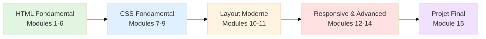

# HTML + CSS

<div
  class="omny-meta"
  data-level="🟢 Débutant à 🔴 Avancé"
  data-version="1.0"
  data-time="60-80 heures">
</div>

## Introduction

**HTML et CSS** sont les **technologies fondamentales** du développement web frontend. HTML (HyperText Markup Language) structure le contenu, tandis que CSS (Cascading Style Sheets) gère la présentation visuelle. Cette formation complète vous permettra de maîtriser ces deux langages de manière **progressive** et **pratique**.

> Cette formation couvre l'ensemble du spectre, des bases absolues aux techniques avancées de layout moderne (Flexbox, Grid) et de responsive design, pour créer des sites web professionnels.

!!! info "Pourquoi apprendre HTML + CSS ?"
    - Ce sont les **fondations obligatoires** de tout développement web
    - Ils permettent de créer des **interfaces utilisateur** modernes et responsive
    - Ils sont **essentiels** avant d'aborder JavaScript et les frameworks
    - Ils offrent un **contrôle total** sur la présentation visuelle
    - La maîtrise de CSS moderne (Flexbox, Grid) est **très demandée** par les entreprises

## Les 15 modules de la formation

!!! warning "Progression pédagogique"
    Cette formation suit une **approche progressive** : chaque module s'appuie sur les précédents. Il est recommandé de suivre l'ordre proposé pour une **compréhension optimale**.

### Partie 1 : HTML Fondamental

!!! note "Cette partie couvre les bases du HTML : structure, balises essentielles, et sémantique"

<div class="grid cards" markdown>

-   :lucide-file-code:{ .lg .middle } **Module 1** — _Introduction HTML_

    ---
    Structure d'un document HTML, balises de base, DOCTYPE, meta tags.

    **Niveau** : 🟢 Débutant | **Durée** : 4-6 heures

    [:lucide-arrow-right: Accéder au Module 1](./module-01-introduction-html/)

-   :lucide-type:{ .lg .middle } **Module 2** — _Texte et Liens_

    ---
    Titres, paragraphes, mise en forme du texte, hyperliens, ancres.

    **Niveau** : 🟢 Débutant | **Durée** : 4-6 heures

    [:lucide-arrow-right: Accéder au Module 2](./module-02-texte-liens/)

</div>

<div class="grid cards" markdown>

-   :lucide-image:{ .lg .middle } **Module 3** — _Images et Médias_

    ---
    Images (img, srcset), audio, vidéo, iframe, optimisation performances.

    **Niveau** : 🟢 Débutant | **Durée** : 4-6 heures

    [:lucide-arrow-right: Accéder au Module 3](./module-03-images-medias/)

-   :lucide-list:{ .lg .middle } **Module 4** — _Listes et Tableaux_

    ---
    Listes ordonnées/non-ordonnées, tableaux complexes, accessibility.

    **Niveau** : 🟢 Débutant | **Durée** : 4-6 heures

    [:lucide-arrow-right: Accéder au Module 4](./module-04-listes-tableaux/)

</div>

<div class="grid cards" markdown>

-   :lucide-form-input:{ .lg .middle } **Module 5** — _Formulaires_

    ---
    Input types, validation HTML5, labels, fieldset, attributs essentiels.

    **Niveau** : 🟡 Intermédiaire | **Durée** : 6-8 heures

    [:lucide-arrow-right: Accéder au Module 5](./module-05-formulaires/)

-   :lucide-code-xml:{ .lg .middle } **Module 6** — _Sémantique HTML5_

    ---
    Header, nav, main, article, section, aside, footer, accessibilité.

    **Niveau** : 🟡 Intermédiaire | **Durée** : 4-6 heures

    [:lucide-arrow-right: Accéder au Module 6](./module-06-semantique-html5/)

</div>

### Partie 2 : CSS Fondamental

!!! note "Cette partie couvre les fondations du CSS : sélecteurs, box model, et positionnement"

<div class="grid cards" markdown>

-   :lucide-palette:{ .lg .middle } **Module 7** — _Introduction CSS_

    ---
    Syntaxe CSS, trois méthodes d'ajout CSS, cascade, héritage, spécificité.

    **Niveau** : 🟢 Débutant | **Durée** : 4-6 heures

    [:lucide-arrow-right: Accéder au Module 7](./module-07-introduction-css/)

-   :lucide-pointer:{ .lg .middle } **Module 8** — _Sélecteurs CSS_

    ---
    Sélecteurs simples, combinateurs, pseudo-classes, pseudo-éléments.

    **Niveau** : 🟡 Intermédiaire | **Durée** : 6-8 heures

    [:lucide-arrow-right: Accéder au Module 8](./module-08-selecteurs-css/)

</div>

<div class="grid cards" markdown>

-   :lucide-box:{ .lg .middle } **Module 9** — _Box Model_

    ---
    Content, padding, border, margin, box-sizing, collapsing margins.

    **Niveau** : 🟡 Intermédiaire | **Durée** : 6-8 heures

    [:lucide-arrow-right: Accéder au Module 9](./module-09-box-model/)

</div>

### Partie 3 : Layout Moderne

!!! note "Cette partie couvre les systèmes de layout modernes : Flexbox et CSS Grid"

<div class="grid cards" markdown>

-   :lucide-columns-3:{ .lg .middle } **Module 10** — _Flexbox_

    ---
    Container flex, items flex, axes, alignement, order, flex-grow/shrink.

    **Niveau** : 🟡 Intermédiaire | **Durée** : 8-10 heures

    [:lucide-arrow-right: Accéder au Module 10](./module-10-flexbox/)

-   :lucide-grid-3x3:{ .lg .middle } **Module 11** — _CSS Grid_

    ---
    Grid container, tracks, areas, placement, responsive grids, auto-fill.

    **Niveau** : 🔴 Avancé | **Durée** : 8-10 heures

    [:lucide-arrow-right: Accéder au Module 11](./module-11-css-grid/)

</div>

### Partie 4 : Responsive & Advanced

!!! note "Cette partie couvre le responsive design et les techniques CSS avancées"

<div class="grid cards" markdown>

-   :lucide-smartphone:{ .lg .middle } **Module 12** — _Responsive Design_

    ---
    Media queries, mobile-first, breakpoints, images responsive, viewport.

    **Niveau** : 🔴 Avancé | **Durée** : 8-10 heures

    [:lucide-arrow-right: Accéder au Module 12](./module-12-responsive-design/)

-   :lucide-sparkles:{ .lg .middle } **Module 13** — _Animations & Transitions_

    ---
    Transitions CSS, animations keyframes, transform, timing functions.

    **Niveau** : 🔴 Avancé | **Durée** : 6-8 heures

    [:lucide-arrow-right: Accéder au Module 13](./module-13-animations-transitions/)

</div>

<div class="grid cards" markdown>

-   :lucide-wand-2:{ .lg .middle } **Module 14** — _CSS Avancé_

    ---
    Variables CSS, custom properties, calc(), clamp(), aspect-ratio, filters.

    **Niveau** : 🔴 Avancé | **Durée** : 6-8 heures

    [:lucide-arrow-right: Accéder au Module 14](./module-14-css-avance/)

-   :lucide-trophy:{ .lg .middle } **Module 15** — _Projet Final_

    ---
    Site web complet responsive : portfolio, landing page, ou dashboard.

    **Niveau** : 🔴 Avancé | **Durée** : 10-12 heures

    [:lucide-arrow-right: Accéder au Module 15](./module-15-projet-final/)

</div>

## Architecture de la formation

La formation suit une **progression logique** de la structure (HTML) vers la présentation (CSS), puis vers les techniques avancées de layout et responsive.



_Chaque partie s'appuie sur les acquis précédents pour construire progressivement votre maîtrise du développement web frontend._

## Synthèse des compétences acquises

| Partie | Modules | Niveau | Compétences clés |
|---------|---------|--------|------------------|
| **HTML Fondamental** | 1-6 | 🟢 Débutant | Structure, sémantique, accessibilité |
| **CSS Fondamental** | 7-9 | 🟢🟡 Débutant-Inter | Sélecteurs, box model, cascade |
| **Layout Moderne** | 10-11 | 🟡🔴 Inter-Avancé | Flexbox, Grid, layouts complexes |
| **Responsive & Advanced** | 12-14 | 🔴 Avancé | Responsive, animations, CSS moderne |
| **Projet Final** | 15 | 🔴 Avancé | Intégration complète des compétences |

!!! tip "Parcours recommandé"
    - [x] **Débutant absolu** → Modules 1-7 (bases HTML + CSS)
    - [x] **Déjà des bases** → Modules 8-11 (CSS avancé + layouts)
    - [x] **Niveau intermédiaire** → Modules 12-15 (responsive + projet)
    - [x] **Perfectionnement** → Module 14 (CSS moderne) + Projet

## Prérequis et objectifs

### Prérequis

- ✅ Aucun prérequis technique
- ✅ Savoir utiliser un ordinateur et un navigateur web
- ✅ Avoir un éditeur de texte (VS Code recommandé)
- ✅ Motivation pour apprendre le développement web

### Objectifs pédagogiques

À l'issue de cette formation, vous serez capable de :

1. **Créer** des pages web structurées avec HTML5 sémantique
2. **Styliser** des interfaces avec CSS moderne
3. **Maîtriser** Flexbox et CSS Grid pour des layouts complexes
4. **Développer** des sites web **responsive** (mobile, tablette, desktop)
5. **Animer** des interfaces avec transitions et animations CSS
6. **Utiliser** les fonctionnalités CSS avancées (variables, calc, clamp)
7. **Produire** du code HTML/CSS **professionnel** et maintenable
8. **Respecter** les bonnes pratiques d'accessibilité et de performance

## Méthodologie pédagogique

Cette formation adopte une **approche pratique** avec :

- **Théorie concise** : Concepts expliqués clairement avec exemples
- **Pratique intensive** : Exercices progressifs dans chaque module
- **Projets concrets** : Mini-projets à chaque module
- **Projet final** : Site web complet intégrant toutes les compétences
- **Code reviews** : Best practices et erreurs courantes
- **Diagrammes visuels** : Schémas pour comprendre les concepts complexes

!!! success "Approche pédagogique"
    Chaque module suit le même schéma :

    1. **Introduction** : Pourquoi c'est important
    2. **Théorie** : Concepts et syntaxe
    3. **Exemples pratiques** : Code commenté
    4. **Exercices progressifs** : Du simple au complexe
    5. **Projet module** : Mise en application
    6. **Checkpoint** : Récapitulatif des acquis

## Outils nécessaires

### Éditeur de code

- **VS Code** (recommandé) avec extensions :
  - Live Server
  - HTML CSS Support
  - Prettier
  - Auto Rename Tag

### Navigateurs

- **Chrome/Firefox** (outils développeur intégrés)
- **Extension** : Responsive Viewer (tester responsive)

### Ressources

- **MDN Web Docs** : Documentation officielle
- **Can I Use** : Compatibilité navigateurs
- **CodePen** : Prototypage rapide

> Tous les outils recommandés sont **gratuits** et **open source**.

## Structure d'un module type

Chaque module contient :

```
Module X - Nom du Module
├── Introduction et objectifs
├── 1. Concept fondamental A
│   ├── Théorie
│   ├── Syntaxe
│   ├── Exemples
│   └── Exercices
├── 2. Concept fondamental B
│   └── ...
├── 3. Concept avancé
│   └── ...
├── Projet du module
├── Best practices
└── Checkpoint de progression
```

## Commencer la formation

Vous êtes prêt à démarrer votre apprentissage du développement web ?

**Trois parcours possibles :**

1. **Parcours complet débutant** → Commencer par le [Module 1 - Introduction HTML](./module-01-introduction-html/)
2. **Parcours CSS avancé** → Passer directement au [Module 10 - Flexbox](./module-10-flexbox/)
3. **Parcours projet** → Aller au [Module 15 - Projet Final](./module-15-projet-final/)

!!! tip "Conseil pour débutants"
    Prenez le temps de **pratiquer** chaque concept avant de passer au suivant. La régularité (1h par jour) est plus efficace que des sessions longues espacées.

---

**Bonne formation et bienvenue dans le monde du développement web ! 🚀**

_Cette formation est conçue pour vous transformer en développeur frontend capable de créer des sites web modernes, responsive et professionnels._

<br />
