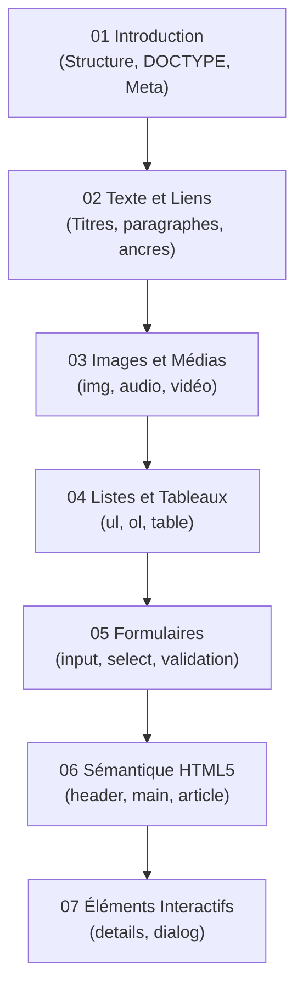

# Rapport de Formation — HTML

## Résumé Exécutif

| Indicateur | Valeur |
|---|---|
| **Modules rédigés** | 7 / 7 (100 %) + index |
| **Bilan structurel** | Bien modulaire, taille des fichiers (~17-25 Ko) |
| **Conformité SKILL v2.0.0** | ✅ Totale |
| **Niveau technique** | Débutant |
| **État d'avancement** | **Terminé & Conforme** |

 

---

## Structure Actuelle de la Formation

 

---

## Conformité SKILL v2.0.0

| Critère SKILL v2.0.0 | Statut | Commentaire |
|---|---|---|
| Frontmatter YAML | ✅ | Présent avec descriptif, icon et tags |
| `
` | ✅ | Bien implémenté sur tous les fichiers |
| Emploi des admonitions | ✅ | Citations, warnings, info, tips utilisés |
| Exemples de code | ✅ | Blocs de code commentés |
| Diagrammes Mermaid | ✅ | Flowcharts expliquant le DOM et les requêtes |

 

---

## Conclusion et Recommandations

!!! quote "Bilan global HTML"
    La formation HTML est complétée et respecte les nouveaux standards pédagogiques en matière de nomenclature, d'utilisation des diagrammes, et de niveau de détail. Les modules sont correctement dimensionnés (~20 Ko) garantissant une lecture agréable. 

**Recommandations :**
- **Aucune refonte nécessaire.** La formation est prête et validée.
